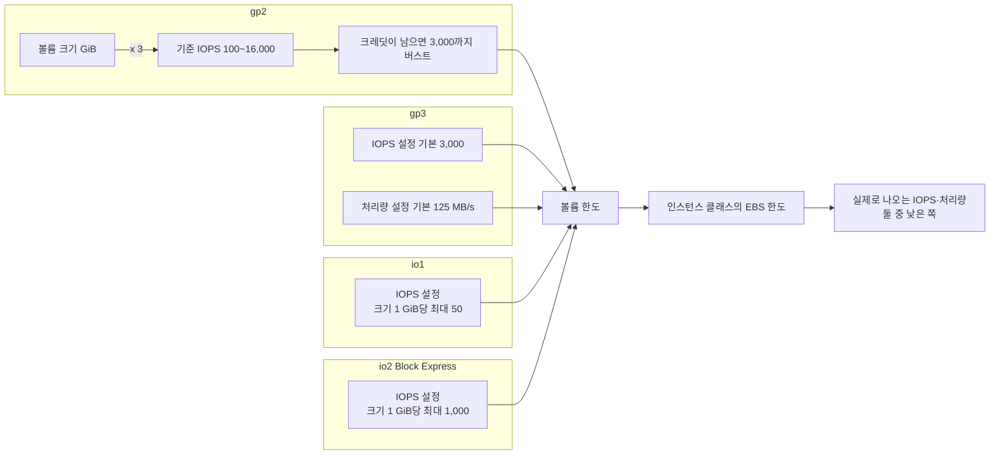
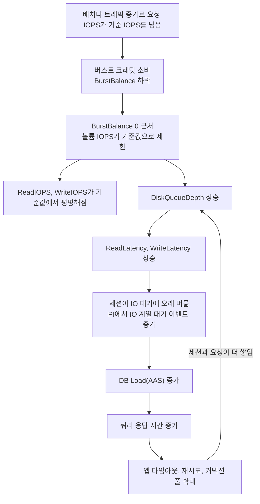
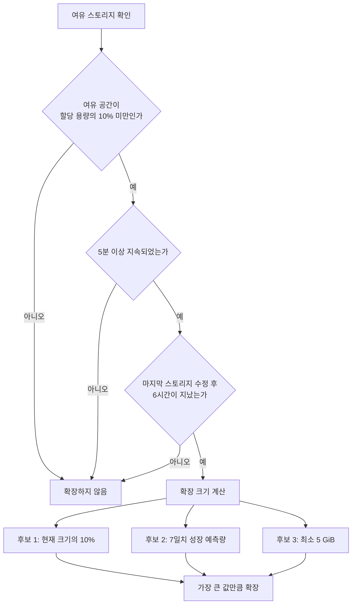
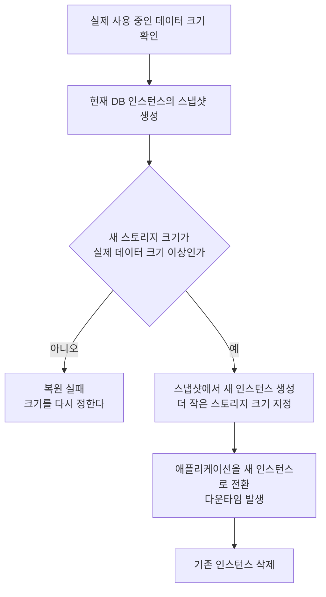
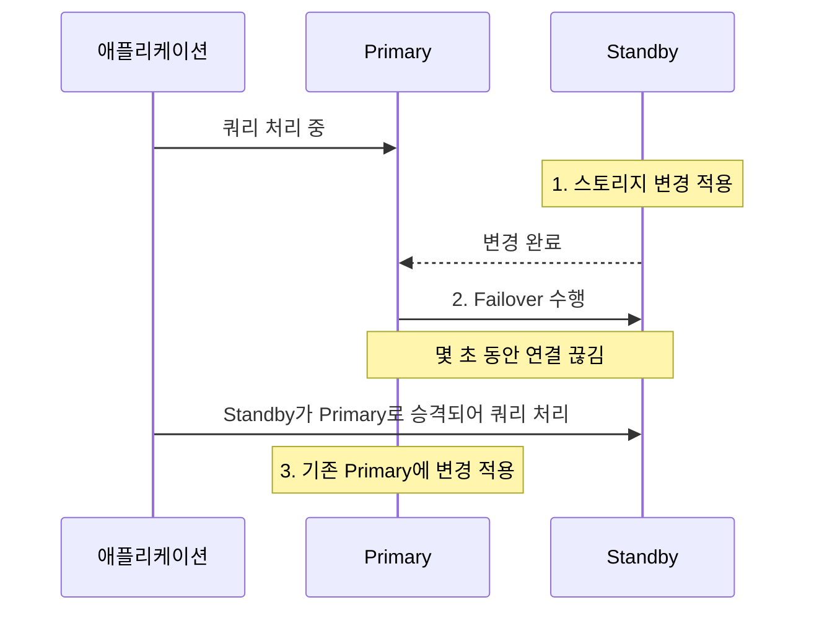
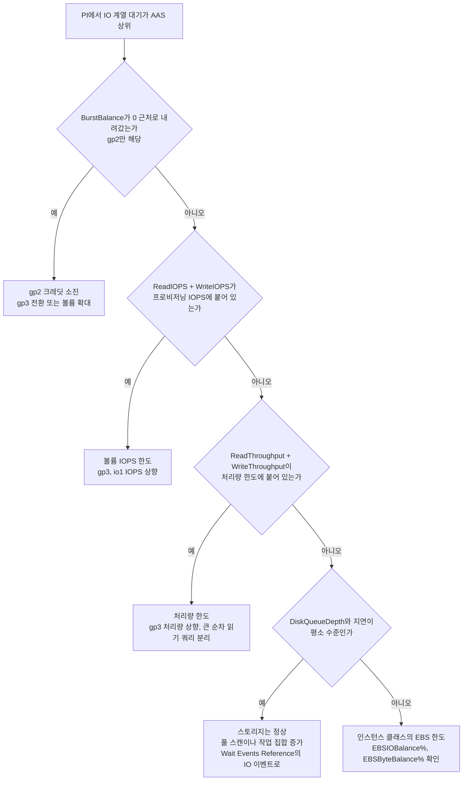

# RDS Storage

## 스토리지 유형

RDS는 EBS 기반 스토리지를 사용한다. 인스턴스 성능보다 스토리지 IOPS가 병목이 되는 경우가 생각보다 많고, 처음에 잘못 고르면 나중에 교체 비용이 크다.

### Magnetic (standard)

가장 오래된 스토리지 유형. 신규 워크로드에서는 선택할 이유가 없다.

- 버스트 기능 없음, IOPS 예측 불가
- 최대 1,000 IOPS 수준이나 실제로는 들쭉날쭉함
- 스토리지 크기 제한도 낮음 (최대 3 TiB)

AWS 공식 문서에서도 레거시 용도라고 명시한다. 구형 인스턴스를 그대로 쓰는 경우가 아니면 gp2나 gp3를 써야 한다.

### gp2

범용 SSD. 스토리지 크기와 IOPS가 연동되는 구조다.

- 1 GiB당 3 IOPS 제공 (최소 100, 최대 16,000 IOPS)
- 100 GiB → 300 IOPS, 5,334 GiB 이상 → 16,000 IOPS 고정
- 버스트 크레딧 방식으로 최대 3,000 IOPS까지 일시적으로 올라갈 수 있음

gp2의 가장 큰 문제는 IOPS를 더 확보하려면 스토리지를 늘려야 한다는 점이다. 실제로 필요한 용량은 200 GiB인데 IOPS 때문에 1 TiB를 할당하는 상황이 생긴다. 이 문제 때문에 신규 워크로드에서는 gp3를 선택하는 게 낫다.

### gp3

gp2의 후속 유형. 스토리지 크기와 IOPS, 처리량이 모두 독립적으로 설정된다.

- 기본 3,000 IOPS, 125 MB/s 처리량을 크기와 무관하게 제공
- IOPS는 최대 16,000까지, 처리량은 최대 1,000 MB/s까지 별도로 조정 가능
- gp2 대비 20% 저렴 (동일 크기 기준)

**IOPS와 처리량은 별개 항목으로 과금된다.** 3,000 IOPS를 초과하는 부분은 IOPS당 $0.02/월이 붙고, 125 MB/s를 초과하는 처리량은 MB/s당 $0.04/월이 붙는다. 예를 들어 6,000 IOPS와 500 MB/s로 설정하면 초과 IOPS 3,000에 대한 비용 $60/월과 초과 처리량 375 MB/s에 대한 비용 $15/월이 스토리지 비용에 추가된다.

처리량 조정이 필요한 경우는 순차 읽기가 많은 분석 쿼리나 대용량 백업 작업이다. OLTP 워크로드에서는 IOPS가 더 중요하고, 125 MB/s 기본값으로 충분한 경우가 대부분이다.

### io1

프로비저닝된 IOPS SSD. 고성능이 필요한 OLTP 워크로드에 쓴다.

- 최대 64,000 IOPS (Nitro 기반 인스턴스 한정)
- IOPS:GiB 비율 최대 50:1 (100 GiB → 최대 5,000 IOPS)
- gp3보다 비싸고, 스토리지와 IOPS를 각각 과금

io1은 실제로 64,000 IOPS에 도달하는 워크로드가 아니면 gp3로도 충분한 경우가 많다.

### io2 Block Express

io1의 후속으로, 고성능과 높은 내구성이 특징이다.

- 최대 256,000 IOPS (Block Express 아키텍처)
- 최대 4,000 MB/s 처리량
- IOPS:GiB 비율 최대 1,000:1
- 내구성 99.999% (io1의 99.9%보다 높음)

**io2 Block Express는 Nitro 기반 인스턴스에서만 동작한다.** 지원 인스턴스는 r5b, x2idn, x2iedn이 대표적이며, 이 외의 인스턴스에서 io2를 선택하면 Block Express 기능 없이 io2로만 동작한다. 실제로 256,000 IOPS를 활용하려면 인스턴스 유형 선택을 먼저 확인해야 한다.

io2 Block Express는 Oracle RAC 같은 극단적인 IOPS 요구 사항이 있을 때 쓴다. 일반적인 웹 서비스 DB에서 쓸 일은 드물다.

### 비용 비교 (us-east-1 기준, 대략적인 수치)

| 유형 | 스토리지 | IOPS | 처리량 |
|------|----------|------|--------|
| Magnetic | $0.10/GiB | 불규칙 | - |
| gp2 | $0.115/GiB | 크기에 연동 | - |
| gp3 | $0.092/GiB | $0.02/IOPS (3,000 초과분) | $0.04/MB/s (125 초과분) |
| io1 | $0.125/GiB | $0.10/IOPS | - |
| io2 | $0.125/GiB | $0.065~0.10/IOPS | - |

io2는 IOPS 사용량에 따라 단가가 다르다. 처음 32,000 IOPS는 $0.10/IOPS, 이후 구간은 단가가 낮아진다.

### 유형별 IOPS·처리량 한도 비교

유형을 고를 때 먼저 볼 것은 IOPS 상한이 어디서 정해지느냐다. gp2는 볼륨 크기가 정하고, gp3는 설정값이 정하고, io1·io2는 설정값에 크기 비율 제한이 걸린다. 아래 그림은 네 유형이 볼륨 한도를 만드는 입력과, 그 뒤에 인스턴스 클래스의 EBS 한도가 한 번 더 걸리는 구조를 보여준다.



| 유형 | IOPS를 정하는 것 | 최대 IOPS | 최대 처리량 | 버스트 |
|------|------------------|-----------|-------------|--------|
| gp2 | 크기 x 3 (최소 100) | 16,000 | 250 MB/s | 1,000 GiB 미만에서 3,000까지, 크레딧 소진 시 기준값 |
| gp3 | IOPS 설정값 | 16,000 | 1,000 MB/s | 없음. 설정한 값이 항상 나옴 |
| io1 | IOPS 설정값 (크기의 50배 이내) | 64,000 | 1,000 MB/s | 없음 |
| io2 Block Express | IOPS 설정값 (크기의 1,000배 이내) | 256,000 | 4,000 MB/s | 없음 |

수치는 [EBS 범용 SSD 문서](https://docs.aws.amazon.com/ebs/latest/userguide/general-purpose.html)와 [Provisioned IOPS SSD 문서](https://docs.aws.amazon.com/ebs/latest/userguide/provisioned-iops.html)의 볼륨 사양이다. RDS는 엔진과 스토리지 크기 구간에 따라 허용 범위와 볼륨 구성이 달라질 수 있어서, 변경하기 전에 콘솔의 입력 가능 범위나 RDS 공식 문서로 확인해야 한다.

IOPS와 처리량은 따로 닿는다. 처리량은 대략 IOPS x I/O 크기다. 16 KiB 단위 I/O로 16,000 IOPS를 채우면 250 MiB/s이고, 풀 스캔처럼 큰 단위로 읽는 쿼리는 IOPS가 한참 남아도 처리량 한도에 먼저 닿는다. gp3에서 IOPS만 올리고 처리량을 기본 125 MB/s로 둔 채 분석 쿼리를 돌리면, `ReadIOPS`는 여유인데 `ReadLatency`만 오르는 모양이 나온다.

한 가지 더 있다. 볼륨 한도를 올려도 인스턴스 클래스가 감당하는 EBS 대역폭이 그보다 작으면 의미가 없다. io1 64,000 IOPS를 설정했는데 작은 클래스에서 그만큼 안 나오는 경우가 이 때문이다. 이 한도에 닿았는지는 IOPS 병목 진단 절의 `EBSIOBalance%`, `EBSByteBalance%`로 본다.

---

## 엔진별 최대 스토리지 한도

스토리지 크기를 계획할 때 엔진별 상한선을 먼저 확인해야 한다. 오토스케일링 최대값을 엔진 한도 이상으로 설정해도 해당 한도까지만 올라간다.

| 엔진 | 최대 스토리지 |
|------|-------------|
| MySQL | 64 TiB |
| PostgreSQL | 64 TiB |
| MariaDB | 64 TiB |
| Oracle | 64 TiB |
| SQL Server | 16 TiB |

SQL Server는 다른 엔진의 1/4 수준이다. SQL Server 기반 워크로드를 설계할 때 이 제한을 처음부터 고려해야 한다. 16 TiB를 넘어서는 데이터는 파티셔닝이나 아카이브 방식을 별도로 정해야 한다.

Aurora는 RDS 스토리지 제한과 별도로 동작한다. Aurora는 128 TiB까지 자동으로 확장되며, 스토리지 타입 개념이 없다.

---

## gp2 크레딧 버스트 소진 문제

gp2는 버스트 크레딧 잔액이 있을 때 최대 3,000 IOPS까지 올라간다. 크레딧이 고갈되면 기본 IOPS로 떨어진다.

### 버스트 크레딧 계산 방식

- 크레딧 버킷은 볼륨당 5,400,000 크레딧이고 처음에는 가득 차 있다. 볼륨 크기와 무관하다.
- 적립: 기준 IOPS보다 덜 쓰는 만큼 1초에 그 차이만큼 쌓인다.
- 소비: 기준 IOPS를 넘겨 쓰는 만큼 1초에 그 차이만큼 빠진다.
- 3,000 IOPS 상한으로 계속 쓸 때 소진 시간은 `5,400,000 / (3,000 - 기준 IOPS)`초다.
- 기준 IOPS가 3,000인 1,000 GiB 이상 볼륨에는 버스트가 없다.

| 볼륨 크기 | 기준 IOPS | 3,000 IOPS로 계속 쓸 때 소진까지 |
|-----------|-----------|----------------------------------|
| 100 GiB | 300 | 2,000초 (약 33분) |
| 200 GiB | 600 | 2,250초 (약 38분) |
| 500 GiB | 1,500 | 3,600초 (60분) |
| 1,000 GiB | 3,000 | 버스트 없음 |

공식([EBS 범용 SSD 문서](https://docs.aws.amazon.com/ebs/latest/userguide/general-purpose.html))으로 계산한 값이고 RDS 인스턴스에서 측정한 값은 아니다. 크기가 클수록 오래 버티는 것처럼 보이지만 기준 IOPS가 같이 올라가기 때문이고, 소진 뒤에 떨어지는 값도 그 기준 IOPS다. 100 GiB는 33분 뒤 초당 300으로, 500 GiB는 60분 뒤 초당 1,500으로 내려간다.

실제 문제 상황: 평소에는 문제없다가 배포 후 트래픽이 몰리거나 대용량 쿼리가 실행될 때 갑자기 DB 응답이 느려지는 경우다. 평균 IOPS가 기준값의 70~80% 근처에서 하루 종일 도는 DB는 버킷이 거의 안 쌓인 채로 지내다가, 야간 배치 한 번에 바닥을 본다. CloudWatch의 `BurstBalance` 지표가 0%에 가까워지면 버스트 크레딧 고갈이 원인일 가능성이 높다.

### 크레딧 소진이 쿼리 지연이 되는 경로

크레딧이 떨어진 순간 쿼리가 바로 느려지는 것이 아니다. 볼륨이 기준 IOPS로 제한되고, 요청이 큐에 쌓이고, 지연이 오르고, 그 시간 동안 세션이 IO 대기 상태로 머무르면서 DB Load(AAS)가 올라가는 순서다. 아래 그림은 이 연쇄와 함께, 쿼리가 느려진 앱이 재시도와 커넥션을 늘리면서 큐를 더 채우는 되먹임을 보여준다.



AAS가 오르는 이유는 요청 수가 늘어서가 아니다. AAS는 동시에 활성인 세션 수의 평균이라서 대략 초당 도착하는 쿼리 수 x 쿼리 하나가 걸리는 시간이다. 도착하는 쿼리 수가 그대로여도 쿼리당 시간이 IO 대기 때문에 늘면 AAS가 같이 올라간다. 그래서 트래픽 그래프는 평평한데 DB Load만 치솟는 모양이 나온다.

IOPS 쪽 신호는 반대로 간다. 요청이 늘어도 볼륨이 기준값 이상 처리하지 못하니 `ReadIOPS + WriteIOPS` 합은 기준 IOPS 선에 눕고, 지연만 오른다. 큐 길이는 대략 IOPS x 지연(초)이므로 기준 IOPS 300에서 지연이 20ms면 `DiskQueueDepth`는 6 근처가 된다. IOPS 그래프가 천장에 붙은 채 큐와 지연이 오르는 모양이 gp2 소진의 지문이다. 커넥션 풀을 키우면 이 큐가 더 길어지기만 한다.

해결 방법은 두 가지다. 스토리지를 늘려 기본 IOPS를 높이거나, gp3로 전환해 크레딧 방식 자체를 없애는 것이다. gp3는 버스트 크레딧 개념이 없고 기본 3,000 IOPS를 항상 제공한다.

---

## 스토리지 오토스케일링

RDS 스토리지 오토스케일링을 활성화하면 용량이 부족할 때 자동으로 늘어난다.

### 확장 조건 (세 가지 모두 충족해야 트리거)

1. 여유 스토리지가 할당 용량의 10% 미만
2. 이 상태가 5분 이상 지속
3. 마지막 스토리지 수정 이후 6시간 경과

확장 크기는 다음 중 가장 큰 값으로 결정된다.

- 현재 크기의 10%
- 7일치 성장 예측량
- 최소 5 GiB

예를 들어 100 GiB 스토리지에서 오토스케일이 트리거되면 최소 10 GiB(10%)가 추가된다. 하루에 2 GiB씩 증가하는 패턴이면 14 GiB를 예측해 적용한다.

세 조건은 AND로 묶이고, 통과한 뒤 늘어날 크기는 세 후보 중 최댓값이 된다. 아래 그림에서 어느 조건 하나라도 빠지면 확장이 일어나지 않는다는 점을 보면 된다.



### 주의사항

오토스케일링이 트리거된 이후 다시 트리거되려면 6시간을 기다려야 한다. 갑자기 대용량 데이터가 들어오는 상황에서는 이 인터벌이 문제가 된다. 오토스케일링을 믿고 최소 용량으로 운영하기보다는 여유 있게 잡아두는 편이 낫다.

오토스케일링 최대 크기를 설정할 수 있는데, 설정하지 않으면 기본값은 인스턴스 유형에 따라 다르다. 예산 초과를 막으려면 최대 크기를 명시적으로 지정해야 한다.

---

## 스토리지 축소 불가 문제

RDS는 스토리지를 줄이는 기능을 제공하지 않는다. 한 번 늘리면 AWS 콘솔에서 다시 줄일 수 없다.

대용량 데이터를 일시적으로 적재하다가 삭제한 경우, 또는 오토스케일링이 과도하게 확장된 경우에 스토리지 낭비가 생긴다.

### 스냅샷 복원을 통한 우회 방법

1. 현재 DB 인스턴스의 스냅샷 생성
2. 스냅샷에서 새 인스턴스 생성 시 더 작은 스토리지 크기 지정
3. 애플리케이션을 새 인스턴스로 전환
4. 기존 인스턴스 삭제

아래 그림은 이 우회 경로의 분기를 보여준다. 새 스토리지 크기가 실제 데이터 크기보다 작으면 복원 단계에서 막히므로, 크기 확인이 맨 앞에 온다.



단, 스냅샷 복원 시 실제 데이터 크기보다 작은 스토리지를 지정하면 실패한다. 현재 실제 사용 중인 데이터 크기를 먼저 확인해야 한다.

```sql
-- MySQL/MariaDB에서 실제 데이터 크기 확인
SELECT 
    table_schema AS 'Database',
    ROUND(SUM(data_length + index_length) / 1024 / 1024 / 1024, 2) AS 'Size (GB)'
FROM information_schema.tables
GROUP BY table_schema;
```

PostgreSQL은 `pg_database_size()` 또는 `pg_size_pretty(pg_database_size('dbname'))`로 확인한다.

스냅샷 복원 방법의 단점은 다운타임이 발생한다는 점이다. Multi-AZ나 Read Replica를 사용하는 경우 전환 절차가 복잡해진다. 실제로 스토리지 비용 절감 효과가 이 작업 비용보다 클 때만 진행하는 게 맞다.

---

## 스토리지 유형 변경 시 동작

### 소요 시간과 성능 저하

스토리지 유형 변경(gp2→gp3 등)이나 크기 확장은 다운타임 없이 진행된다. 하지만 백그라운드에서 데이터 마이그레이션이 진행되는 동안 성능 저하가 발생한다.

- 100 GiB 미만: 수십 분 내
- 500 GiB ~ 1 TiB: 1~3시간
- 수 TiB 이상: 몇 시간에서 반나절까지 걸리기도 함

변경 진행 중 IOPS 성능이 기존 대비 50~70% 수준으로 떨어지는 경우가 있다. `WriteLatency`와 `DiskQueueDepth`를 변경 전후로 CloudWatch에서 모니터링해야 한다.

변경 완료 후에도 `optimizing` 상태가 한동안 유지된다. 이 상태에서는 추가 스토리지 변경을 할 수 없고, 6시간 쿨다운이 적용된다.

### Multi-AZ 환경에서의 변경

Multi-AZ 환경에서 스토리지를 변경하면 처리 순서가 다르다.

1. Standby 인스턴스에 먼저 변경 적용
2. Standby 변경 완료 후 Failover 수행 (Standby가 Primary로 승격)
3. 기존 Primary에 변경 적용

이 방식 덕분에 실제 서비스 영향 시간은 Failover에 걸리는 몇 초 수준으로 줄어든다. 하지만 전체 변경 작업이 완료되는 데는 Single-AZ보다 오래 걸린다. 두 인스턴스에 순차적으로 적용되기 때문이다.

아래 순서도에서 애플리케이션이 영향을 받는 구간은 Failover 한 지점뿐이고, 나머지 변경은 모두 Standby 쪽에서 진행된다는 점을 보면 된다.



Multi-AZ 환경에서 스토리지 변경 중 Failover가 발생하면 기존 Primary가 Standby 역할을 맡아 변경 작업을 이어받는다. 변경 작업이 완전히 끝날 때까지 추가 변경 요청은 블록된다.

---

## 스토리지 암호화

### 암호화 설정 규칙

스토리지 암호화는 인스턴스 생성 시점에 결정한다. **생성 이후에는 암호화 여부를 변경할 수 없다.** 암호화되지 않은 인스턴스를 나중에 암호화하려면 스냅샷→복원 과정이 필요하다.

암호화를 활성화하면 스토리지, 자동 백업, Read Replica, 스냅샷 모두 동일한 KMS 키로 암호화된다. KMS 키는 AWS 관리형 키(`aws/rds`)나 고객 관리형 키(CMK) 중 선택한다.

스냅샷 복원 시 암호화 키를 교체하거나 암호화되지 않은 스냅샷을 암호화된 인스턴스로 복원하는 것은 가능하다.

기존 인스턴스를 암호화하는 경로는 인스턴스를 직접 바꾸는 방식이 아니라 스냅샷 사본을 만들면서 KMS 키를 붙이는 방식이다. 아래 그림에서 암호화가 걸리는 지점은 스냅샷 복사 단계이고, 마지막 전환 단계에서 엔드포인트가 바뀐다.


### 스토리지 타입과 암호화의 관계

gp2, gp3, io1, io2 모두 암호화를 지원한다. 스토리지 타입을 변경해도 암호화 설정은 유지된다. gp2에서 gp3로 바꿔도 이미 설정된 KMS 키가 그대로 적용된다.

Cross-region 스냅샷 복사 시 대상 리전의 KMS 키를 별도로 지정해야 한다. 원본 키가 다른 리전에서 자동으로 사용되지 않는다.

```bash
# 암호화되지 않은 스냅샷을 암호화된 스냅샷으로 복사
aws rds copy-db-snapshot \
  --source-db-snapshot-identifier arn:aws:rds:ap-northeast-2:123456789:snapshot:my-snapshot \
  --target-db-snapshot-identifier my-encrypted-snapshot \
  --kms-key-id arn:aws:kms:ap-northeast-2:123456789:key/my-key-id \
  --region ap-northeast-2
```

---

## gp2 → gp3 마이그레이션

gp3 전환은 다운타임 없이 진행되고, 전환 후 비용이 줄어드는 경우가 대부분이다. 특히 gp2에서 IOPS 확보를 위해 과도하게 스토리지를 늘린 경우 효과가 크다.

전환 전에 확인해야 할 것은 현재 IOPS와 처리량 사용 패턴이다. gp2에서 16,000 IOPS를 쓰고 있었다면 gp3에서 동일한 IOPS를 명시적으로 설정해야 한다. 기본 3,000 IOPS로 전환하면 성능이 크게 떨어진다.

### 콘솔

1. RDS 콘솔 → 해당 인스턴스 선택 → [수정]
2. 스토리지 섹션에서 스토리지 유형을 `gp3`로 변경
3. IOPS와 처리량 값 확인 및 조정
4. [계속] → [즉시 적용] 또는 [다음 유지 관리 기간에 적용] 선택

즉시 적용을 선택하면 변경이 바로 시작된다. 피크 타임에는 다음 유지 관리 기간을 선택하는 게 낫다.

### CLI

```bash
# gp2 → gp3 전환, IOPS와 처리량 명시 설정
aws rds modify-db-instance \
  --db-instance-identifier my-db-instance \
  --storage-type gp3 \
  --iops 6000 \
  --storage-throughput 500 \
  --apply-immediately \
  --region ap-northeast-2

# 변경 상태 확인
aws rds describe-db-instances \
  --db-instance-identifier my-db-instance \
  --query 'DBInstances[0].PendingModifiedValues' \
  --region ap-northeast-2
```

`--apply-immediately`를 빼면 다음 유지 관리 기간에 적용된다. 운영 환경에서는 유지 관리 기간을 지정하고 변경하는 편이 안전하다.

### Terraform

```hcl
resource "aws_db_instance" "main" {
  identifier        = "my-db-instance"
  engine            = "mysql"
  instance_class    = "db.r6g.large"

  storage_type          = "gp3"
  allocated_storage     = 200
  iops                  = 6000
  storage_throughput    = 500

  # 기존 gp2에서 전환 시 apply_immediately = true 권장
  apply_immediately = false
}
```

기존 gp2 인스턴스를 Terraform으로 관리하고 있었다면 `storage_type`을 `"gp3"`로 바꾸고, `iops`와 `storage_throughput` 필드를 추가하면 된다. `terraform plan`으로 변경 사항을 확인한 뒤 적용한다.

---

## IOPS 병목 진단

DB가 느려질 때 CPU나 메모리보다 먼저 스토리지 IOPS를 의심해야 하는 경우가 있다. 특히 쓰기 집약적인 워크로드에서 자주 나타난다.

### CloudWatch 지표

| 지표 | 설명 |
|------|------|
| `ReadIOPS` | 초당 읽기 작업 수 |
| `WriteIOPS` | 초당 쓰기 작업 수 |
| `ReadLatency` | 읽기 지연 시간 (초) |
| `WriteLatency` | 쓰기 지연 시간 (초) |
| `DiskQueueDepth` | 대기 중인 I/O 요청 수 |
| `BurstBalance` | gp2 크레딧 잔량 (%) |
| `ReadThroughput` | 초당 읽기 처리량 (bytes) |
| `WriteThroughput` | 초당 쓰기 처리량 (bytes) |
| `EBSIOBalance%` | 인스턴스 클래스의 EBS IOPS 버스트 잔량. 해당 클래스에서만 나온다 |
| `EBSByteBalance%` | 인스턴스 클래스의 EBS 대역폭 버스트 잔량. 해당 클래스에서만 나온다 |
| `DBLoad`, `DBLoadCPU`, `DBLoadNonCPU` | PI를 켜면 CloudWatch에 올라오는 DB Load(AAS). CPU 성분과 그 외 대기 성분 |

`DiskQueueDepth`가 1을 넘어가면 I/O 요청이 쌓이고 있다는 신호다. 지속적으로 1 이상이면 프로비저닝된 IOPS가 부족한 상태다.

`WriteLatency`가 1ms 이하면 정상, 10ms 이상으로 올라가면 스토리지가 병목인 경우가 많다.

### Performance Insights로 확인

CloudWatch 지표는 볼륨이 얼마나 막혔는지를 보여주고, Performance Insights(PI)는 그 막힘 때문에 어떤 쿼리가 얼마나 서 있는지를 보여준다. 둘 중 하나만 보면 반쪽이다. `DiskQueueDepth`가 올라도 DB가 그 시간에 한가했다면 서비스 영향이 없고, PI에서 IO 대기가 높아도 스토리지가 멀쩡하면 원인은 쿼리 쪽이다.

PI의 `db load` 그래프를 대기 이벤트로 나눴을 때 IO 계열이 큰 비중을 차지하면 스토리지 I/O를 의심한다. 엔진별로 보이는 이름은 이렇다.

| 엔진 | 데이터 읽기·쓰기 | 쓰기(로그·커밋) |
|------|------------------|-----------------|
| MySQL | `io/file/innodb/innodb_data_file` | `io/file/innodb/innodb_log_file` |
| PostgreSQL | `IO:DataFileRead` | `IO:WALWrite`, `IO:WALSync` |
| Aurora | Aurora 스토리지 계층 이벤트. EBS 지표는 해당 없음 | `IO:XactSync`, `io/aurora_redo_log_flush` |

이벤트별 원인과 확인 쿼리는 [RDS_Wait_Events_Reference.md](RDS_Wait_Events_Reference.md)의 [io/file/innodb/innodb_data_file](RDS_Wait_Events_Reference.md#32-iofileinnodbinnodb_data_file)와 [IO:DataFileRead, IO:XactSync, IO:WALWrite](RDS_Wait_Events_Reference.md#43-iodatafileread-ioxactsync-iowalwrite)에 정리돼 있다. PI 자체를 켜고 AAS를 읽는 방법은 [RDS_Performance_Insights.md](RDS_Performance_Insights.md)에 있다. 이 문서에서는 IO 대기 이벤트가 떴을 때 스토리지 지표를 어떻게 맞춰 읽는지만 다룬다.

#### 같은 시간축에 올리기

PI 콘솔과 CloudWatch 콘솔을 창 두 개로 띄워 놓고 눈으로 맞추면 자주 어긋난다. 조회 구간 길이가 다르면 집계 단위가 달라지고, 시간대 표시도 콘솔 설정에 따라 달라서 10분짜리 변화가 한 칸 안에 뭉개지거나 한 시간씩 밀려 보인다. PI를 켜 두었다면 `DBLoadNonCPU`가 CloudWatch 지표로 올라오므로, 스토리지 지표와 같은 그래프·같은 period로 겹쳐 보는 쪽이 편하다.

```json
[
  {"Id": "burst",  "MetricStat": {"Metric": {"Namespace": "AWS/RDS", "MetricName": "BurstBalance",
    "Dimensions": [{"Name": "DBInstanceIdentifier", "Value": "my-db-instance"}]}, "Period": 60, "Stat": "Minimum"}},
  {"Id": "queue",  "MetricStat": {"Metric": {"Namespace": "AWS/RDS", "MetricName": "DiskQueueDepth",
    "Dimensions": [{"Name": "DBInstanceIdentifier", "Value": "my-db-instance"}]}, "Period": 60, "Stat": "Maximum"}},
  {"Id": "rlat",   "MetricStat": {"Metric": {"Namespace": "AWS/RDS", "MetricName": "ReadLatency",
    "Dimensions": [{"Name": "DBInstanceIdentifier", "Value": "my-db-instance"}]}, "Period": 60, "Stat": "Average"}},
  {"Id": "wlat",   "MetricStat": {"Metric": {"Namespace": "AWS/RDS", "MetricName": "WriteLatency",
    "Dimensions": [{"Name": "DBInstanceIdentifier", "Value": "my-db-instance"}]}, "Period": 60, "Stat": "Average"}},
  {"Id": "noncpu", "MetricStat": {"Metric": {"Namespace": "AWS/RDS", "MetricName": "DBLoadNonCPU",
    "Dimensions": [{"Name": "DBInstanceIdentifier", "Value": "my-db-instance"}]}, "Period": 60, "Stat": "Average"}}
]
```

```bash
# 위 JSON을 queries.json 으로 저장하고 다섯 지표를 같은 구간·같은 period로 한 번에 받는다
aws cloudwatch get-metric-data \
  --metric-data-queries file://queries.json \
  --start-time 2026-10-05T00:00:00Z \
  --end-time 2026-10-05T03:00:00Z \
  --scan-by TimestampAscending \
  --region ap-northeast-2
```

```text
{
  "MetricDataResults": [
    { "Id": "burst", "Timestamps": ["<시각>", ...], "Values": [<퍼센트>, ...], "StatusCode": "Complete" },
    { "Id": "queue", "Timestamps": ["<시각>", ...], "Values": [<큐 길이>, ...], "StatusCode": "Complete" },
    ...
  ]
}
```

통계는 지표마다 다르게 잡는다. `BurstBalance`는 바닥을 봐야 하니 `Minimum`, `DiskQueueDepth`는 순간 적체를 놓치지 않도록 `Maximum`, 지연은 `Average`가 기본이다. 시간은 UTC로 넣고, 콘솔의 PI 차트와 대조할 때는 콘솔이 보여주는 시간대를 먼저 확인한다. 이 명령은 문법을 AWS CLI 문서 기준으로 썼고 이 문서를 쓴 환경에서 실행하지는 않았다. 출력은 값 자리를 비운 형태다.

PI 쪽 값을 같은 구간에서 대기 이벤트별로 받고 싶으면 PI API를 쓴다. `--identifier`는 인스턴스 이름이 아니라 `DbiResourceId`(`db-`로 시작)다.

```bash
aws rds describe-db-instances --db-instance-identifier my-db-instance \
  --query 'DBInstances[0].DbiResourceId' --output text

aws pi get-resource-metrics \
  --service-type RDS \
  --identifier db-<DbiResourceId> \
  --metric-queries '[{"Metric":"db.load.avg","GroupBy":{"Group":"db.wait_event","Limit":5}}]' \
  --start-time 2026-10-05T00:00:00Z \
  --end-time 2026-10-05T03:00:00Z \
  --period-in-seconds 60
```

#### 지표가 움직이는 순서

gp2 크레딧 소진이라면 지표는 정해진 순서로 움직인다. 순서가 어긋나면 그 가설은 버린다. 가장 흔한 오판은 `BurstBalance`가 0인 것만 보고 크레딧 탓을 하는 것이다. 크레딧이 어제부터 바닥이었는데 AAS는 오늘 오후에 올랐다면, 오늘 오후에 바뀐 것을 따로 찾아야 한다.

| 순서 | 지표 | 변화 | 읽는 법 |
|------|------|------|---------|
| 1 | `BurstBalance` | 완만하게 내려가 0 근처 | 원인 후보. 내려가는 구간이 AAS 상승보다 앞서야 한다 |
| 2 | `ReadIOPS`, `WriteIOPS` | 오르다가 한 값에서 평평 | 평평한 값이 기준 IOPS와 맞으면 볼륨 한도다 |
| 3 | `DiskQueueDepth` | 오름 | IOPS는 못 늘고 요청은 계속 들어온다 |
| 4 | `ReadLatency`, `WriteLatency` | 오름 | 큐에서 기다린 시간이 지연으로 보인다 |
| 5 | PI의 IO 계열 대기, `DBLoadNonCPU` | 오름 | 지연이 세션 체류 시간이 돼 AAS가 된다 |
| 6 | 앱의 응답 시간, 타임아웃 | 오름 | 사용자가 느끼는 증상 |

1번이 5번보다 늦게 움직였다면 크레딧 소진은 결과이거나 우연히 겹친 것이다. 이때는 쿼리나 작업 집합이 먼저 바뀐 경우를 본다. gp3·io1·io2에는 1번이 없으므로 2번부터 시작한다. 2번의 평평한 값은 gp3면 설정한 IOPS, io1·io2면 프로비저닝한 IOPS와 비교한다.

#### 다음에 볼 지표 고르기

PI에서 IO 계열 대기가 AAS 상위로 올라왔을 때 CloudWatch를 어떤 순서로 열지 정리한 흐름이다. 앞 질문에서 걸리면 뒤는 볼 필요가 없다. 마지막 두 갈래가 스토리지 문제가 아닌 경우와 인스턴스 쪽 한도인 경우다.



Q4에서 "예"가 나오는 경우가 생각보다 많다. 스토리지는 한가한데 쿼리가 풀 스캔으로 데이터 파일을 계속 읽으면 IO 계열 대기가 AAS를 채운다. 이때 볼륨을 키우거나 IOPS를 올려도 대기 이벤트가 줄지 않는다. 인덱스를 보거나 버퍼 풀·shared buffers 대비 작업 집합이 커졌는지 본다.

마지막 갈래인 인스턴스 한도는 볼륨 설정값을 아무리 올려도 지표가 안 움직일 때 의심한다. 볼륨은 16,000 IOPS인데 `ReadIOPS + WriteIOPS` 합이 그보다 훨씬 낮은 값에서 평평하다면, 클래스가 감당하는 EBS 대역폭이 먼저 닿은 것이다. 해당 클래스에서는 `EBSIOBalance%`와 `EBSByteBalance%`가 0 근처로 내려가 있다. 이 경우 처방은 볼륨이 아니라 인스턴스 클래스를 올리는 쪽이다.

#### 조치와 변경 중 모니터링

조치가 정해지면 변경 중에도 같은 다섯 지표를 같은 대시보드로 계속 본다. 스토리지 유형 변경이나 IOPS 조정은 진행 중에 성능이 일시적으로 떨어질 수 있다(앞 절의 유형 변경 동작 참고). 운영 중에 IOPS 조정이 필요하면 피크 시간대를 피해서 진행하고, `DBLoadNonCPU`가 변경 전보다 올라가는지 확인한다. 변경이 끝난 뒤에는 `BurstBalance`에 CloudWatch 경보를 걸어 두면 같은 일이 조용히 반복되지 않는다.
