# RDS 대기 이벤트 참조 (MySQL·PostgreSQL 이벤트별 원인과 확인 쿼리)

[RDS_Performance_Insights.md](RDS_Performance_Insights.md)는 PI를 켜고, AAS를 읽고, Top SQL에서 원인을 좁히는 흐름을 다룬다. 이 문서는 그 흐름에서 이벤트 이름 하나가 AAS 상위에 올라왔을 때 펼쳐 보는 용도다. 이벤트마다 무엇이 원인인지, 어떤 쿼리로 확인하는지, 실제로 무엇을 바꾸는지만 적는다.

SQL은 MySQL 8.0과 PostgreSQL 14 문서를 기준으로 썼다. RDS 인스턴스에서 돌려 얻은 출력은 싣지 않았다. 출력 블록은 컬럼 구성과 읽는 법을 보이는 형태이고, 값 자리는 `<...>`로 비웠다. 이름이 버전마다 바뀌는 이벤트는 해당 위치에 따로 적었다. 쓰는 버전에서 한 번은 직접 돌려 보고 판단해야 한다.

## 1. 이벤트를 다섯 그룹으로 나누기

PI 차트는 이벤트를 색으로만 묶어 보여 준다. 대응이 갈리는 기준은 그룹이다. CPU는 쿼리를 고치고, IO는 스토리지와 작업 집합을 보고, Lock은 막는 세션을 찾고, LWLock·Latch는 동시성 자체를 줄이고, Client·Network는 DB가 아니라 앱 쪽을 본다. 아래 그림은 이 문서에서 다루는 이벤트를 그 다섯 그룹에 걸어 둔 것이다.

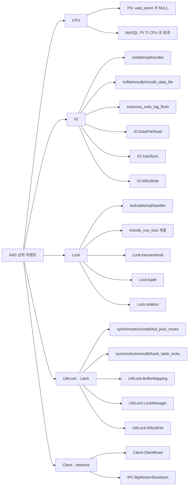

MySQL 이벤트 이름은 performance_schema 계측 이름에서 `wait/`를 뗀 것이다. PI의 `io/table/sql/handler`는 performance_schema에서 `wait/io/table/sql/handler`다. 쿼리로 찾을 때는 `wait/`를 붙여야 한다. PostgreSQL은 `wait_event_type:wait_event` 형태이고 `pg_stat_activity`의 두 컬럼을 이어 붙인 것이다.

분류에서 헷갈리는 자리가 둘 있다. `io/table/sql/handler`는 이름에 io가 붙지만 디스크 대기가 아니라 스토리지 엔진 호출 전체를 감싸는 이벤트다. 메모리에서 끝난 읽기도 여기 잡힌다. `IPC:*`는 프로세스 간 대기라서 DB 내부 같지만 실제 원인은 병렬 쿼리 설계나 복제 지연인 경우가 많아 Client·Network 옆에 뒀다.

## 2. AAS 상위 이벤트별 다음 확인 순서

이벤트 이름을 읽은 다음 어디를 볼지는 세 단계로 갈린다. 첫 흐름은 그룹을 정하는 것이고, 나머지 둘은 Lock과 IO·LWLock 안에서 한 번 더 가른다.

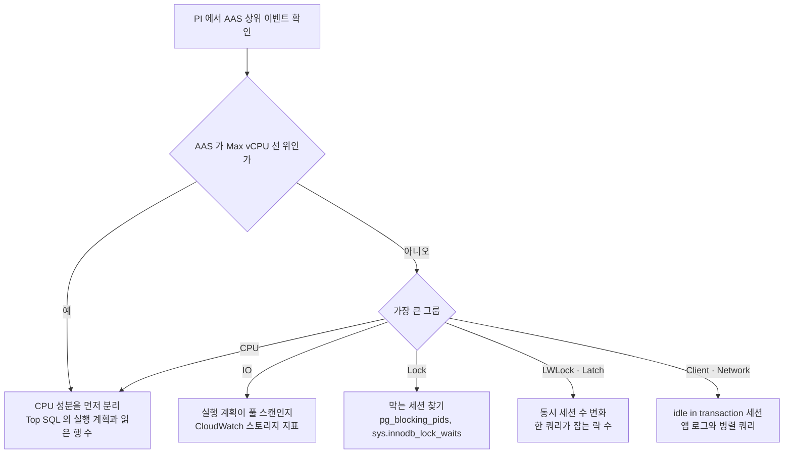

AAS가 Max vCPU 선을 넘은 구간에서는 어떤 그룹이 크든 CPU 포화를 먼저 의심한다. 포화 상태에서는 다른 이벤트도 길어 보이기 때문이다. 판단 기준은 [RDS_Performance_Insights.md](RDS_Performance_Insights.md)의 DB Load 절과 PI가 틀리게 보이는 지점 절에 있다.

Lock 그룹은 막는 세션의 상태가 곧 조치를 정한다.

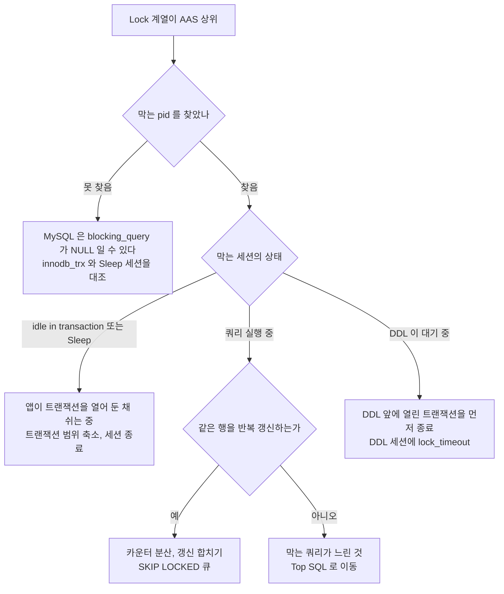

IO와 LWLock·Latch는 한 흐름으로 묶었다. IO는 스토리지 지표에서, LWLock은 동시 세션 수에서 갈린다.

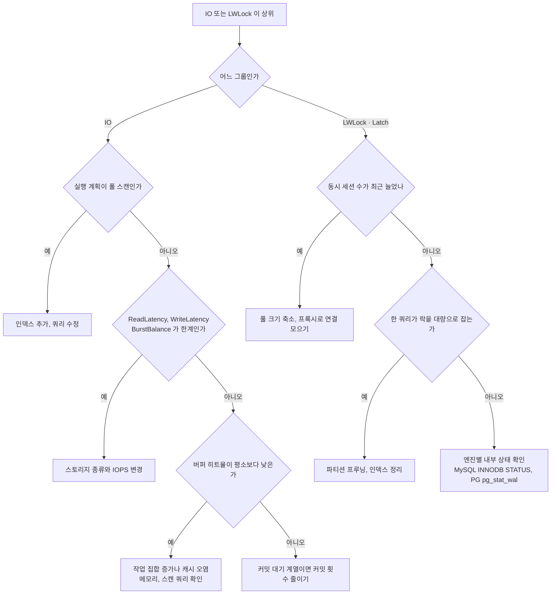

## 3. MySQL·Aurora MySQL 이벤트

아래 쿼리는 performance_schema가 켜져 있고 sys 스키마가 있어야 돈다. 꺼져 있을 때의 증상과 확인법은 [RDS_Performance_Insights.md](RDS_Performance_Insights.md)에 있다. Aurora 전용 이벤트 전체 목록은 [Aurora MySQL 대기 이벤트 문서](https://docs.aws.amazon.com/AmazonRDS/latest/AuroraUserGuide/AuroraMySQL.Reference.Waitevents.html)에서 찾는다.

### 3.1 io/table/sql/handler

스토리지 엔진이 테이블 행에 접근하는 구간 전체를 감싸는 이벤트다. 이 이벤트가 1위라는 사실만으로는 원인을 알 수 없다. 읽을 행이 많거나, 버퍼 풀에 없어서 디스크를 타거나, 인덱스를 못 타서 풀 스캔을 하는 경우가 전부 여기에 합쳐진다. 하위 이벤트(`innodb_data_file` 등)가 같이 올라와 있으면 그쪽이 더 구체적인 원인이다.

먼저 읽은 행 수와 돌려준 행 수의 차이를 본다. 1건 돌려주려고 수만 건을 읽는 쿼리가 있으면 그 쿼리가 이 이벤트의 주범이다.

```sql
-- 읽은 행이 많은 쿼리. x$ 뷰라야 정렬 컬럼이 숫자다
SELECT db, LEFT(query, 80) AS query, exec_count,
       rows_sent_avg, rows_examined_avg
FROM sys.x$statement_analysis
ORDER BY rows_examined DESC
LIMIT 10;

-- 테이블별 누적 IO 대기 (서버 기동 후 누적값, 단위는 피코초)
SELECT object_schema, object_name, count_read, count_write,
       ROUND(sum_timer_wait / 1e12, 2) AS total_wait_sec
FROM performance_schema.table_io_waits_summary_by_table
WHERE object_schema NOT IN ('mysql', 'performance_schema', 'sys')
ORDER BY sum_timer_wait DESC
LIMIT 10;
```

`rows_examined_avg`가 `rows_sent_avg`보다 자릿수로 크면 인덱스가 부족하거나 조건이 인덱스를 못 쓰는 것이다. 조치는 `EXPLAIN`으로 `type=ALL`이나 `key=NULL`을 확인하고 인덱스를 추가하거나 쿼리를 고치는 것이다. 인덱스를 늘리기 전에 `sys.schema_unused_indexes`로 안 쓰는 인덱스를 먼저 본다. 쓰기 쪽 `count_write`가 큰 테이블에 인덱스를 얹으면 쓰기 비용이 같이 늘어난다.

### 3.2 io/file/innodb/innodb_data_file

버퍼 풀에 없는 페이지를 데이터 파일에서 읽거나 쓰는 대기다. 데이터 파일에 닿았다는 것이므로 `handler`보다 원인이 한 단계 좁다. 원인은 셋 중 하나다. 풀 스캔이 버퍼 풀을 갈아치우거나, 작업 집합이 버퍼 풀보다 커졌거나, 스토리지 자체가 느려졌다.

```sql
-- 파일별 누적 대기. 데이터 파일이 상위인지 본다
SELECT file, total, total_latency, count_read, count_write
FROM sys.x$io_global_by_file_by_latency
ORDER BY total_latency DESC
LIMIT 10;
```

```bash
# 누적 카운터는 두 번 뽑아서 차이를 본다. 절대값은 의미가 없다
for i in 1 2; do
  mysql -N -e "SHOW GLOBAL STATUS WHERE Variable_name IN
    ('Innodb_buffer_pool_reads','Innodb_buffer_pool_read_requests',
     'Innodb_buffer_pool_wait_free','Innodb_data_pending_reads')"
  sleep 60
done
```

`Innodb_buffer_pool_reads`(디스크까지 간 읽기)의 증가분을 `read_requests`(논리 읽기)의 증가분으로 나눈 값이 미스율이다. 평소 값을 기록해 두고 사고 시점과 비교해야 의미가 있다. `Innodb_buffer_pool_wait_free`가 증가하면 빈 페이지가 없어서 쓰레드가 기다린 것이라 버퍼 풀이 모자란 신호다.

원인이 셋으로 갈리는 순서를 도식으로 먼저 잡아 둔다. 뒤의 표는 각 갈래의 확인과 조치다.

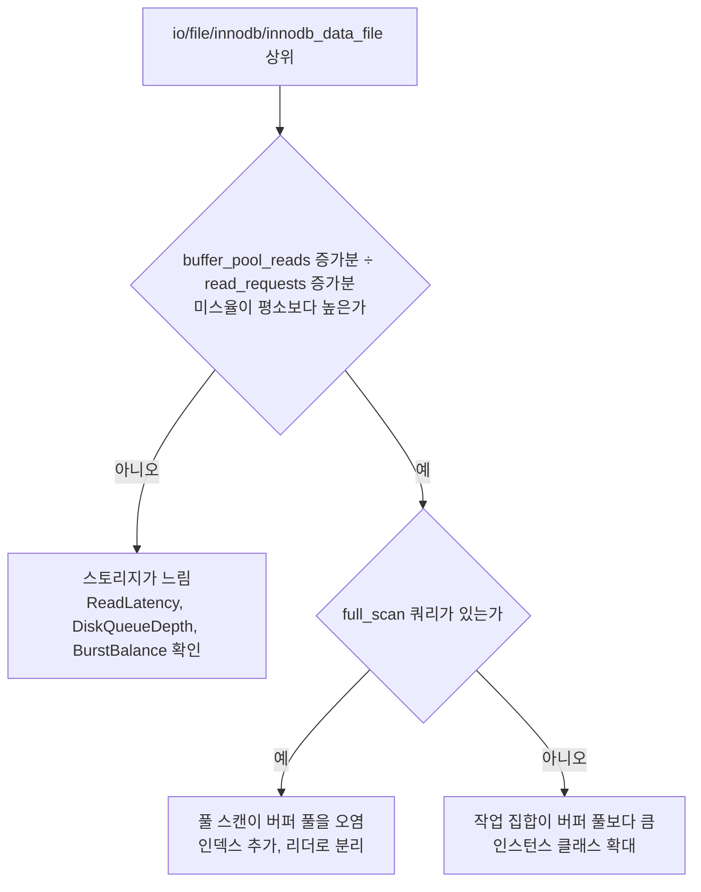

`sys.innodb_buffer_stats_by_table`로 어느 테이블이 버퍼 풀을 차지하는지 볼 수 있지만, 버퍼 풀 페이지를 전부 훑는 뷰라서 피크 시간에 큰 인스턴스에서 돌리면 안 된다. 조치는 원인에 따라 갈린다.

| 원인 | 확인 | 조치 |
|---|---|---|
| 풀 스캔이 버퍼 풀을 오염 | `x$statement_analysis`에서 `full_scan='*'` 쿼리 | 인덱스, 해당 쿼리를 리더로 분리. `innodb_old_blocks_time` 확인 |
| 작업 집합이 버퍼 풀보다 큼 | 미스율이 평소보다 상승, 데이터 증가 | 인스턴스 클래스 확대 |
| 스토리지가 느림 | CloudWatch `ReadLatency`, `DiskQueueDepth`, gp2면 `BurstBalance` | 6.1 사례, [RDS_Storage.md](RDS_Storage.md) |

Aurora MySQL은 데이터 파일 읽기가 Aurora 스토리지 계층으로 간다. EBS의 `BurstBalance` 같은 지표가 없으므로 3번째 행은 해당하지 않고, 대신 `VolumeReadIOPs`와 버퍼 풀 미스율을 본다.

### 3.3 synch/mutex/innodb/buf_pool_mutex

버퍼 풀의 LRU 리스트나 프리 리스트 같은 내부 구조를 건드릴 때 잡는 뮤텍스다. 쿼리 하나가 느린 문제가 아니라 많은 쓰레드가 동시에 버퍼 풀 구조를 건드려서 줄을 서는 문제다. 버퍼 미스가 많아 페이지 축출과 적재가 잦을수록, 동시 쓰레드가 많을수록 커진다. 그래서 `innodb_data_file`과 같이 올라오는 경우가 많다.

```sql
SELECT @@innodb_buffer_pool_size / 1024 / 1024 AS pool_mb,
       @@innodb_buffer_pool_instances          AS pool_instances;

SHOW GLOBAL STATUS WHERE Variable_name IN
  ('Innodb_buffer_pool_pages_free', 'Innodb_buffer_pool_pages_total',
   'Innodb_buffer_pool_wait_free');
```

`pages_free`가 0 근처에 계속 머물고 `wait_free`가 늘면 버퍼 풀 부족이다. 조치 순서는 이렇다. 스캔성 쿼리를 걷어 내서 축출 빈도를 낮추고, 동시 접속 수를 줄이고(앱 풀이나 [DB_Proxy.md](DB_Proxy.md)), 그래도 안 되면 인스턴스 메모리를 늘린다. `innodb_buffer_pool_instances`는 정적 파라미터라 재부팅이 필요하고 RDS에서 수정 가능한지는 엔진 버전마다 다르다. 올리기 전에 위 쿼리로 현재 값부터 확인한다.

### 3.4 synch/sxlock/innodb/hash_table_locks

InnoDB가 해시 구조를 읽고 바꿀 때 잡는 래치다. 이 이름이 보일 때 의심할 후보가 둘이다. 버퍼 풀이 페이지를 찾는 해시 테이블 접근, 그리고 어댑티브 해시 인덱스(AHI)다. 이름만으로는 갈리지 않는다. 읽기 쓰레드가 많고 같은 인덱스 범위에 몰릴 때, 또는 INSERT·DELETE가 많아 AHI를 계속 고쳐 써야 할 때 올라온다.

가르는 방법은 `SHOW ENGINE INNODB STATUS`다.

```sql
SHOW ENGINE INNODB STATUS\G
-- SEMAPHORES 절: 오래 기다린 래치가 "created in file <파일>:<줄>" 로 찍힌다
--   btr0sea 로 시작하는 파일이면 AHI, buf0buf 쪽이면 버퍼 풀 해시
-- INSERT BUFFER AND ADAPTIVE HASH INDEX 절:
--   <n> hash searches/s, <m> non-hash searches/s
```

SEMAPHORES 절은 대기가 일정 시간을 넘긴 래치만 보여 주므로 사고 시점에 바로 떠 봐야 한다. 지나간 뒤에는 비어 있다. `hash searches/s`가 `non-hash searches/s`보다 훨씬 작다면 AHI가 읽기를 거의 돕지 못하는데 유지 비용만 내고 있는 상태일 가능성이 크다. 그때는 `innodb_adaptive_hash_index`를 0으로 내려 본다. 이 파라미터는 동적이라 재부팅 없이 적용되지만, 읽기 위주 워크로드에서는 AHI를 끄면 오히려 느려지는 경우가 있다. 운영에 바로 적용하지 말고 리더나 스테이징에서 같은 쿼리로 먼저 비교한다.

AHI 쪽이 아니고 버퍼 풀 해시라면 3.2, 3.3과 같은 문제다. 버퍼 미스를 줄이고 동시 쓰레드를 줄이는 것 말고는 손댈 곳이 없다.

### 3.5 io/aurora_redo_log_flush

Aurora MySQL 전용이다. 쓰기 트랜잭션이 커밋될 때 redo 로그를 Aurora 스토리지 계층에 내려 보내고 응답을 기다리는 시간이다. 로컬 디스크 fsync가 아니라 네트워크를 건너 스토리지 쿼럼 응답을 기다리므로 커밋 한 번의 지연에 하한이 있다. 작은 트랜잭션을 한 쓰레드가 직렬로 반복하는 구조가 가장 불리하다. 커밋마다 그 지연을 한 번씩 낸다.

아래 시퀀스는 건건이 커밋할 때와 묶어서 커밋할 때 스토리지 응답을 기다리는 횟수가 어떻게 다른지 보여 준다.

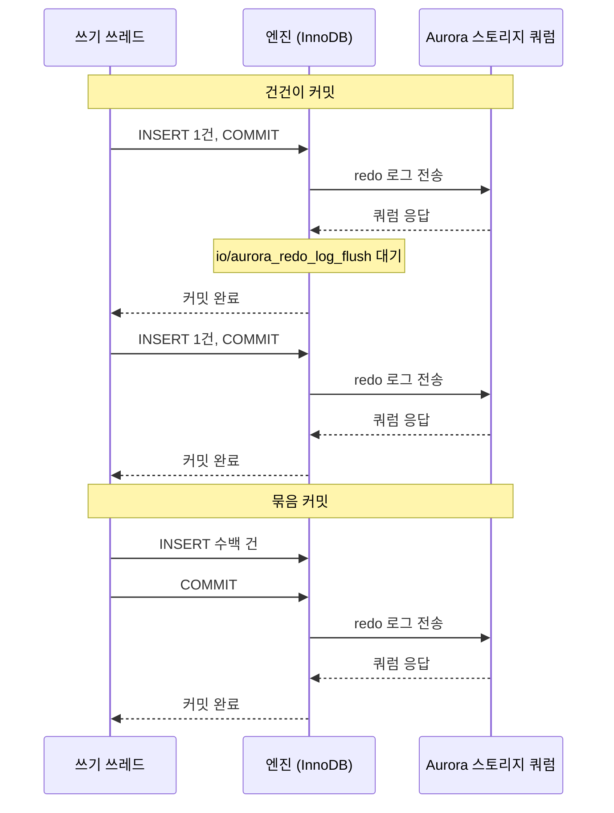

```sql
-- 이벤트가 계측돼 있으면 누적 대기를 직접 볼 수 있다. 행이 없으면 PI 차트를 근거로 쓴다
SELECT event_name, count_star, ROUND(sum_timer_wait / 1e12, 2) AS total_wait_sec
FROM performance_schema.events_waits_summary_global_by_event_name
WHERE event_name LIKE '%redo_log_flush%';

-- 커밋당 변경 행 수. 두 번 뽑아 증가분으로 계산한다
SHOW GLOBAL STATUS WHERE Variable_name IN
  ('Com_commit', 'Com_insert', 'Com_update', 'Com_delete',
   'Innodb_rows_inserted', 'Innodb_rows_updated', 'Innodb_rows_deleted');
```

`autocommit=1`인 연결에서 나가는 단건 문장은 `Com_commit`에 안 잡힌다. 그 경우 `Com_insert` 증가분이 곧 커밋 수에 가깝다. 변경 행 수 증가분을 커밋 수로 나눴을 때 1~2에 머물면 건건이 커밋하는 패턴이다.

조치는 커밋 단위를 키우는 것이다. 수집기나 배치가 행마다 커밋하고 있으면 수백 행씩 묶는다. 다행 INSERT로 바꾸면 문장 수도 같이 준다. 묶음이 너무 커지면 락 보유 시간과 undo가 늘어 다른 문제가 생기므로 묶음 크기를 단계적으로 올리며 지연을 재야 한다. `innodb_flush_log_at_trx_commit`을 내려서 해결하려는 시도는 권하지 않는다. 장애 시 커밋된 트랜잭션을 잃을 수 있고, Aurora에서 그 값을 바꾸는 조건은 파라미터 그룹 문서에서 따로 확인해야 한다.

### 3.6 wait/lock/table/sql/handler

테이블 수준 락을 기다리는 이벤트다. InnoDB 행 락과는 별개다. 원인은 대개 명시적인 `LOCK TABLES`, MyISAM 테이블, `FLUSH TABLES WITH READ LOCK`이다. 실무에서 가장 자주 만나는 건 백업이다. `mysqldump`를 `--single-transaction` 없이 InnoDB 테이블에 돌리면 `--lock-tables` 동작으로 테이블을 잠그고, 그동안 쓰기가 줄을 선다.

```sql
-- 지금 테이블 락을 쥔 세션 (8.0 은 기본으로 계측. 5.7 은 setup_instruments 를 켜야 하고 결과가 비면 꺼진 것)
SELECT object_schema, object_name, lock_type, lock_duration, owner_thread_id
FROM performance_schema.metadata_locks
WHERE object_type = 'TABLE' AND lock_type IN ('SHARED_READ_ONLY', 'SHARED_NO_READ_WRITE', 'EXCLUSIVE')
ORDER BY object_schema, object_name;

-- 열려 있고 사용 중인 테이블
SHOW OPEN TABLES WHERE In_use > 0;

-- 테이블별 누적 테이블 락 대기
SELECT object_schema, object_name, count_read_normal, count_write_allow_write,
       ROUND(sum_timer_wait / 1e12, 2) AS total_wait_sec
FROM performance_schema.table_lock_waits_summary_by_table
ORDER BY sum_timer_wait DESC
LIMIT 10;
```

`owner_thread_id`로 `performance_schema.threads`에서 `processlist_id`를 찾으면 어느 연결인지 나온다. RDS에서는 남의 연결을 `KILL`로 못 끊고 `CALL mysql.rds_kill(<thread_id>)`를 쓴다. MyISAM이 남아 있다면 InnoDB로 옮기는 것이 근본 해결이다. 메타데이터 락(`MDL_context::COND_wait_status`)과는 이벤트가 다르다. DDL 뒤에 쿼리가 줄을 서는 상황은 그쪽이고 [RDS_Performance_Insights.md](RDS_Performance_Insights.md)의 5.2에 쿼리가 있다.

### 3.7 InnoDB 행 락 대기와 Innodb_row_lock 계열

InnoDB 행 락 대기는 PI에서 이벤트 이름이 엔진 구현과 버전에 따라 달라진다. Aurora MySQL은 `synch/mutex/innodb/aurora_lock_thread_slot_futex`로 보여 준다. 이름에 의존하지 말고 상태 변수와 락 테이블로 확인하는 편이 안정적이다.

```sql
SHOW GLOBAL STATUS LIKE 'Innodb_row_lock%';
```

| 변수 | 의미 |
|---|---|
| `Innodb_row_lock_current_waits` | 지금 행 락을 기다리는 연산 수. 이 값이 0이 아니면 지금 진행 중이다 |
| `Innodb_row_lock_waits` | 기동 후 누적 대기 횟수 |
| `Innodb_row_lock_time` | 기동 후 누적 대기 시간(ms) |
| `Innodb_row_lock_time_avg` | 누적 평균. 기동 후 전체 평균이라 최근 급증이 희석된다 |
| `Innodb_row_lock_time_max` | 기동 후 최대 한 번의 대기 시간 |

`_avg`는 사고 분석에 쓸모가 낮다. 두 시점의 `Innodb_row_lock_time` 증가분을 `Innodb_row_lock_waits` 증가분으로 나눠야 그 구간의 평균 대기가 나온다.

```bash
for i in 1 2; do
  mysql -N -e "SHOW GLOBAL STATUS WHERE Variable_name IN
    ('Innodb_row_lock_waits','Innodb_row_lock_time')"
  sleep 60
done
```

막는 세션은 `sys.innodb_lock_waits`로 찾는다. `blocking_query`가 NULL일 때 쓰는 쿼리는 [RDS_Performance_Insights.md](RDS_Performance_Insights.md)의 5.2에 있다. 막는 쪽이 `Sleep` 상태로 트랜잭션만 열어 둔 경우를 바로 잡는 쿼리를 하나 더 둔다.

```sql
-- 쿼리는 끝났는데 커밋을 안 한 연결
SELECT t.trx_mysql_thread_id AS thread_id,
       t.trx_started,
       TIMESTAMPDIFF(SECOND, t.trx_started, NOW()) AS age_sec,
       t.trx_rows_locked,
       p.user, p.host, p.db
FROM information_schema.innodb_trx t
JOIN information_schema.processlist p ON p.id = t.trx_mysql_thread_id
WHERE p.command = 'Sleep'
ORDER BY t.trx_started;
```

세 가지를 알고 있어야 한다. 대기가 `innodb_lock_wait_timeout`(기본 50초)을 넘으면 에러 1205가 나는데, `innodb_rollback_on_timeout`이 꺼져 있으면 그 문장만 롤백되고 트랜잭션은 열린 채 남는다. 앱이 에러를 잡고 다음 문장을 계속 보내면 앞서 잡은 락이 풀리지 않는다. 데드락은 락 대기와 별개로 `SHOW ENGINE INNODB STATUS`의 LATEST DETECTED DEADLOCK에 마지막 한 건만 남는다. 파라미터 그룹에서 `innodb_print_all_deadlocks`를 켜면 에러 로그에 전부 남는다. 마지막으로 `KILL`이 필요하면 RDS에서는 `mysql.rds_kill`을 쓴다.

타임아웃 뒤에 락이 남는 경로를 도식으로 정리하면 다음과 같다. `innodb_rollback_on_timeout` 값이 갈림길이다.

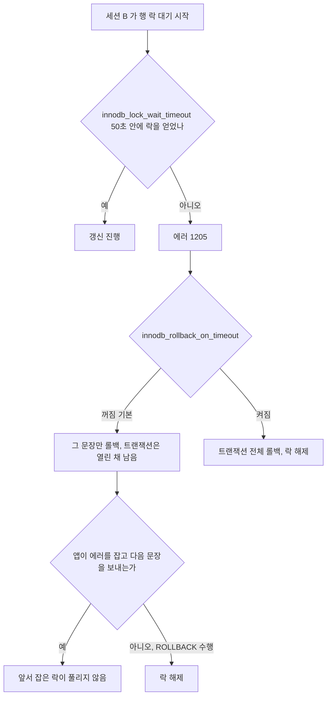

## 4. PostgreSQL·Aurora PostgreSQL 이벤트

PI의 PostgreSQL 이벤트는 `pg_stat_activity`의 `wait_event_type`과 `wait_event`를 그대로 옮긴 것이다. PI 없이 psql에서 같은 그림을 보려면 활성 세션을 이벤트별로 세면 된다. `wait_event`가 NULL인 활성 세션이 PI의 CPU다.

```sql
SELECT coalesce(wait_event_type || ':' || wait_event, 'CPU') AS event,
       count(*) AS sessions
FROM pg_stat_activity
WHERE state = 'active'
  AND pid <> pg_backend_pid()
  AND backend_type = 'client backend'
GROUP BY 1
ORDER BY 2 DESC;
```

```text
 event                | sessions
----------------------+----------
 Lock:transactionid   |       <n>
 CPU                  |       <n>
 IO:DataFileRead      |       <n>
```

한 번의 스냅샷이라 PI의 1초 샘플링과 같지 않다. psql에서 `\watch 1`을 붙이면 1초 간격으로 반복해서 분포가 어떻게 움직이는지 볼 수 있다. `backend_type = 'client backend'` 조건을 빼면 병렬 워커까지 세어 PI의 AAS와 비슷해진다.

이벤트 이름은 버전에 따라 다르다. 13부터 LWLock 이름이 CamelCase로 바뀌었다. 12 이하의 `buffer_mapping`, `lock_manager`, `WALWriteLock`이 13 이상에서 `BufferMapping`, `LockManager`, `WALWrite`다. 오래된 글에서 이름이 안 맞을 때 같은 이벤트인지 의심한다. 전체 목록은 [PostgreSQL 14 대기 이벤트 표](https://www.postgresql.org/docs/14/monitoring-stats.html#WAIT-EVENT-TABLE)에 있다.

### 4.1 Lock:transactionid, Lock:tuple, Lock:relation

`Lock:transactionid`는 다른 트랜잭션이 이미 갱신한 행을 갱신하려다 그 트랜잭션이 끝나길 기다리는 상태다. 행 락 충돌이 PostgreSQL에서 보이는 모양이다. 같은 행에 세 번째 세션이 오면 이름이 바뀐다. 줄 맨 앞의 대기자는 `transactionid`를 기다리고, 그 뒤 대기자들은 앞 대기자가 쥔 tuple 락을 기다려서 `Lock:tuple`로 보인다.

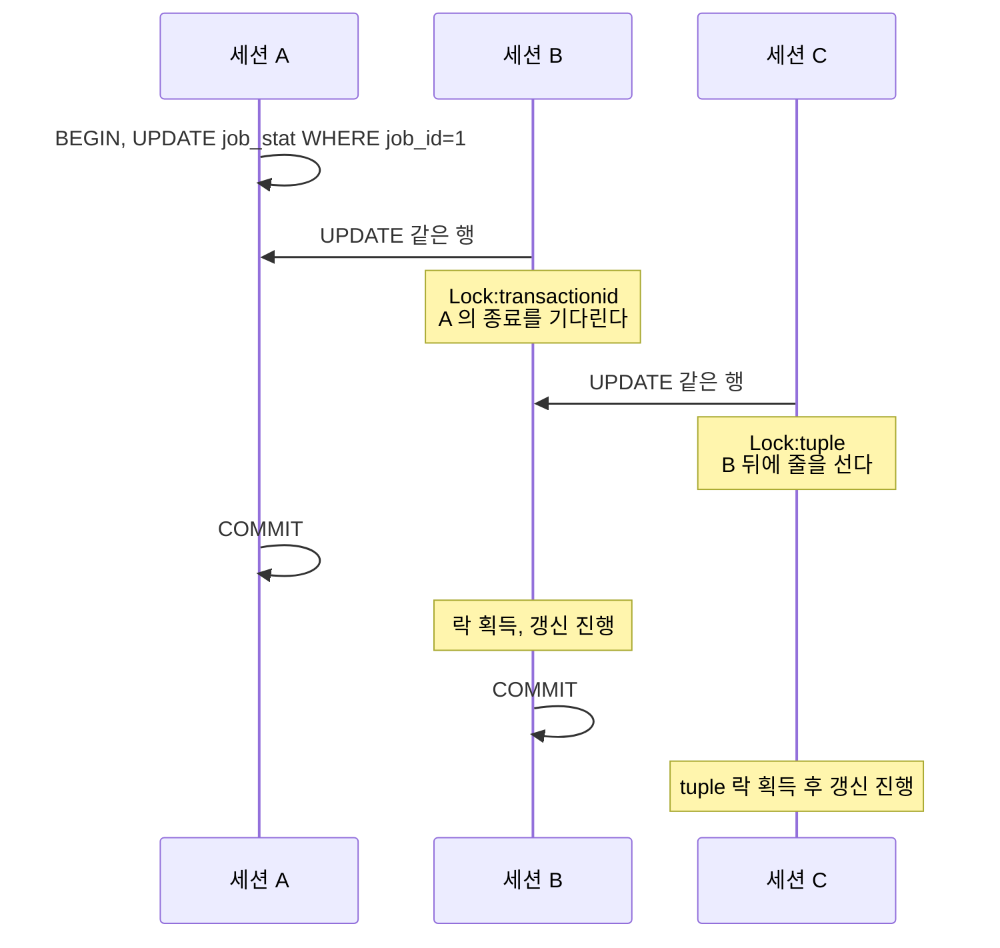

`Lock:tuple`이 보이면 같은 행 앞에 세션이 둘 이상 줄을 서 있다. 카운터 행이나 상태 행 하나를 모든 요청이 갱신하는 구조에서 흔하다. 인덱스나 쿼리 튜닝으로는 풀리지 않는다.

막는 쪽의 뿌리를 찾는 쿼리다. 대기자 여러 명이 줄줄이 이어져 있어도 맨 앞의 세션이 누구인지 한 번에 나온다.

```sql
WITH waiting AS (
    SELECT pid, unnest(pg_blocking_pids(pid)) AS blocker
    FROM pg_stat_activity
    WHERE cardinality(pg_blocking_pids(pid)) > 0
)
SELECT w.blocker              AS root_pid,
       a.usename,
       a.application_name,
       a.state,
       now() - a.xact_start   AS xact_age,
       count(*)               AS waiters,
       left(a.query, 60)      AS last_query
FROM waiting w
JOIN pg_stat_activity a ON a.pid = w.blocker
WHERE w.blocker NOT IN (SELECT pid FROM waiting)
GROUP BY w.blocker, a.usename, a.application_name, a.state, a.xact_start, a.query
ORDER BY waiters DESC;
```

```text
 root_pid | usename | application_name |        state        | xact_age | waiters | last_query
----------+---------+------------------+---------------------+----------+---------+------------
    <pid> | <user>  | <app>            | idle in transaction | <시간>   |     <n> | UPDATE ...
```

`state`가 `idle in transaction`이면 마지막으로 실행한 문장이 `last_query`에 남아 있고 그 뒤로 앱이 쉬고 있다. 이 세션은 `pg_cancel_backend`로 끊기지 않는다. 취소할 실행 중 쿼리가 없기 때문이다. 연결을 끊는 `pg_terminate_backend(<pid>)`를 써야 하고, RDS에서는 같은 롤이거나 `rds_superuser` 권한이 있어야 한다. 재발을 막으려면 `idle_in_transaction_session_timeout`을 건다. 값은 서비스에서 가장 긴 정상 트랜잭션보다 길어야 한다. 짧게 잡았다가 정상 배치가 끊긴 적이 있다.

`Lock:relation`은 테이블 단위 락이고 원인은 DDL이다. 핵심은 대기열이다. `ALTER TABLE`이 `ACCESS EXCLUSIVE` 락을 기다리기 시작하면 그 뒤로 들어오는 단순 SELECT까지 DDL 뒤에 줄을 선다. DDL이 막힌 원인은 보통 오래 열린 읽기 트랜잭션이 `ACCESS SHARE` 락을 쥐고 있어서다.

아래 시퀀스에서 세션 C의 단순 SELECT가 왜 막히는지 보면 된다. C는 A와 충돌하지 않는데도 대기 중인 DDL 뒤에 선다.

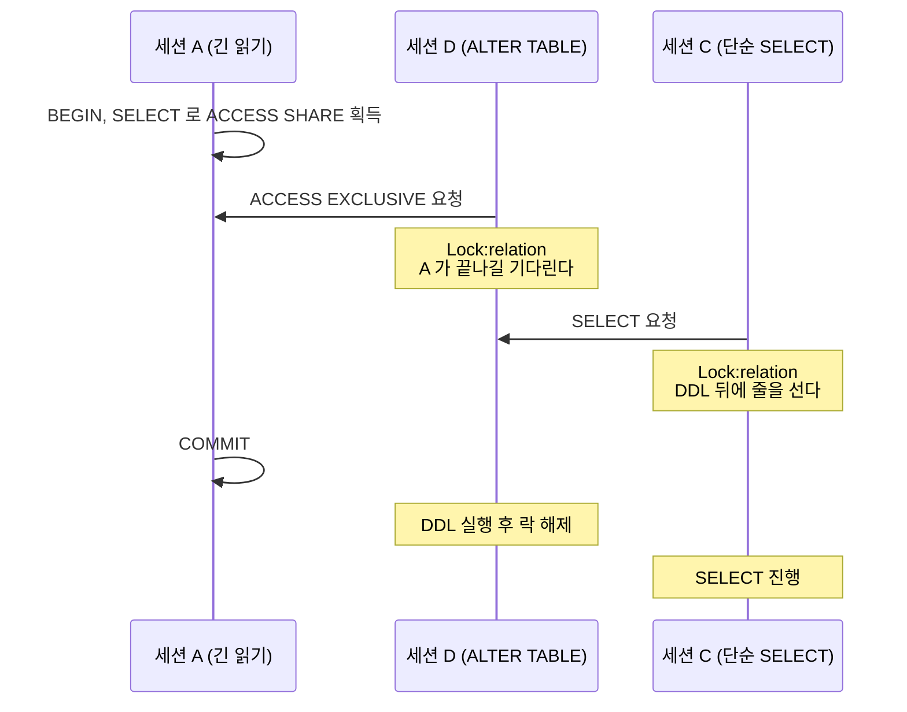

```sql
SELECT l.pid, l.mode, l.relation::regclass AS relation,
       a.state, now() - a.query_start AS waiting_for, left(a.query, 60) AS query
FROM pg_locks l
JOIN pg_stat_activity a ON a.pid = l.pid
WHERE l.locktype = 'relation' AND NOT l.granted
ORDER BY a.query_start;
```

DDL 세션에는 `SET lock_timeout = '3s';`를 걸고 실패하면 재시도하게 한다. 락을 못 잡고 대기열을 막아서 서비스 쿼리까지 세우는 상황을 피하는 가장 직접적인 방법이다.

### 4.2 LWLock:BufferMapping, LWLock:LockManager, LWLock:WALWrite

LWLock이 AAS 상위에 올라오면 개별 쿼리가 느린 것이 아니라 동시성이 엔진 내부 자료구조의 한계에 닿은 것이다. 쿼리를 하나씩 고쳐서는 줄지 않고, 동시에 일하는 세션 수나 세션 하나가 잡는 락의 수를 줄여야 한다.

`LWLock:BufferMapping`은 shared buffers에서 블록이 어느 슬롯에 있는지 찾는 해시 테이블의 파티션 락이다. 큰 테이블을 여러 세션이 동시에 훑어서 버퍼를 계속 갈아치울 때 오른다. 세션 수가 수백으로 늘어난 직후에도 오른다. 3.3의 MySQL `buf_pool_mutex`와 같은 계열의 현상이다. 확인은 어느 쿼리가 블록을 많이 읽는지다.

```sql
-- track_io_timing 이 꺼져 있으면 read_ms 는 0 이다. PG 17 부터는 shared_blk_read_time 으로 이름이 바뀌었다
SELECT queryid, calls, shared_blks_hit, shared_blks_read,
       round(blk_read_time::numeric, 0) AS read_ms,
       left(query, 60) AS query
FROM pg_stat_statements
ORDER BY shared_blks_read DESC
LIMIT 10;
```

`LWLock:LockManager`(12 이하는 `lock_manager`)는 락 매니저의 공유 락 테이블을 지키는 파티션 락이다. 이 문서에서 가장 이해하기 어려운 이벤트라 구조부터 적는다. 각 백엔드는 약한 relation 락(`ACCESS SHARE`, `ROW SHARE`, `ROW EXCLUSIVE`)을 16개까지 자기 로컬 슬롯에서 처리한다. 이것이 fast-path다. 17번째 락부터는 모든 백엔드가 공유하는 락 테이블에 올려야 하고, 그 테이블은 파티션 16개의 LWLock으로 보호된다. 같은 테이블에 대해 강한 락 요청이 대기 중이어도 그 테이블의 fast-path는 막힌다.

한 쿼리가 락 17개 이상을 잡는 대표적인 경우는 파티션 테이블이다. 파티션 한 개마다 relation 락 1개와 인덱스 락이 붙는다. 파티션 키 조건이 없어 프루닝이 안 되면 파티션 수의 두 배 가까운 락을 잡는다. 이런 쿼리를 세션 수십 개가 동시에 돌리면 공유 락 테이블 파티션 락이 병목이 된다.

락 17개째를 경계로 경로가 갈리는 모습이다. 프루닝 여부가 slow path로 가는 락 수를 정한다.

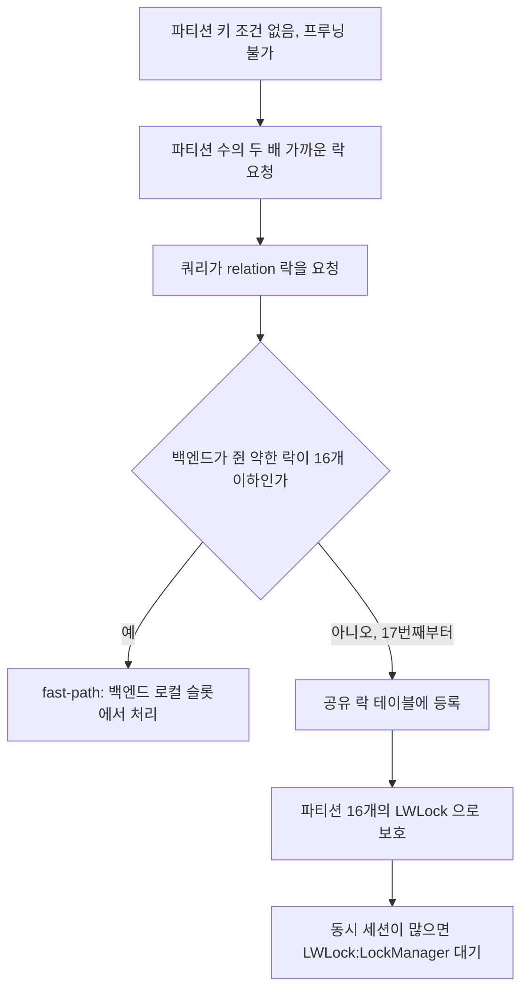

재현은 해시 파티션 테이블 하나면 된다.

```sql
CREATE TABLE ev (id bigint, tenant int, ts timestamptz, payload text)
PARTITION BY HASH (tenant);

DO $$
BEGIN
  FOR i IN 0..63 LOOP
    EXECUTE format(
      'CREATE TABLE ev_p%s PARTITION OF ev FOR VALUES WITH (MODULUS 64, REMAINDER %s)', i, i);
  END LOOP;
END $$;

CREATE INDEX ON ev (ts);   -- 파티션마다 인덱스가 만들어진다

INSERT INTO ev SELECT g, g % 1000, now() - (g || ' seconds')::interval, 'x'
FROM generate_series(1, 200000) g;
```

파티션 키 없는 쿼리와 있는 쿼리가 잡는 락을 세션 안에서 직접 센다.

```sql
BEGIN;
SELECT count(*) FROM ev WHERE ts > now() - interval '1 hour';   -- 프루닝 불가

SELECT count(*) FILTER (WHERE fastpath)     AS fastpath,
       count(*) FILTER (WHERE NOT fastpath) AS slowpath
FROM pg_locks
WHERE pid = pg_backend_pid() AND locktype = 'relation';
COMMIT;
```

```text
 fastpath | slowpath
----------+----------
 <16 이하> | <파티션·인덱스 수에 비례>
```

`fastpath`는 16을 넘지 않고 나머지가 `slowpath`로 잡힌다. 쿼리를 `WHERE tenant = 7 AND ts > ...`로 바꾸고 같은 확인을 하면 `slowpath`가 사라지는지 본다. 바인드 파라미터를 쓰는 prepared statement는 프루닝이 실행 시점에 일어나서 실행 전에 잡히는 락 수가 달라질 수 있다. 쓰는 버전에서 앱과 같은 방식으로 호출해 직접 세는 것이 안전하다.

운영에서 문제의 세션을 찾는 쿼리는 이렇다.

```sql
SELECT l.pid,
       count(*) FILTER (WHERE NOT l.fastpath) AS slowpath_locks,
       left(a.query, 60) AS query
FROM pg_locks l
JOIN pg_stat_activity a ON a.pid = l.pid
WHERE l.locktype = 'relation'
GROUP BY l.pid, a.query
ORDER BY slowpath_locks DESC
LIMIT 10;
```

조치는 프루닝 되도록 쿼리를 고치는 것이 1순위다. 쓰지 않는 인덱스를 지우면 인덱스 락도 같이 준다. 이것으로 부족하면 동시 세션 수를 줄여야 하는데, 이 경우가 6.3 사례다.

`LWLock:WALWrite`(12 이하는 `WALWriteLock`)는 WAL 버퍼를 디스크로 내리는 권한을 한 번에 한 백엔드만 가져서 생기는 대기다. 한 세션이 flush하는 동안 커밋하려는 나머지 세션이 줄을 선다. 커밋률이 높고 WAL 양이 많을 때 오른다.

```sql
-- PG 14 이상. 누적값이라 두 번 뽑아 차이를 본다
SELECT wal_records, wal_fpi, wal_bytes, wal_write, wal_sync
FROM pg_stat_wal;
```

`wal_fpi`(full page image)가 `wal_records` 대비 크면 체크포인트 직후의 첫 수정이 페이지 전체를 WAL에 쓰는 비율이 높은 것이다. 쓰기량이 부풀어 있다는 신호이고 `wal_compression`이나 `checkpoint_timeout` 조정을 검토한다. 파라미터 그룹에서 수정 가능한지와 영향은 사용 버전 문서로 확인한다. 쓰기 자체가 많다면 불필요한 인덱스를 줄이는 것이 WAL 양을 줄이는 가장 확실한 방법이다. 같은 자리에서 Aurora PostgreSQL은 4.3의 `IO:XactSync`로 보인다.

### 4.3 IO:DataFileRead, IO:XactSync, IO:WALWrite

`IO:DataFileRead`는 shared buffers에 없는 블록을 읽는 대기다. 일반 RDS PostgreSQL은 OS 페이지 캐시도 쓰기 때문에 이 이벤트가 곧 물리 디스크 접근은 아니다. 원인은 3.2와 같은 세 갈래다. 인덱스가 없어서 훑거나, 작업 집합이 커졌거나, 스토리지가 느려졌다.

```sql
EXPLAIN (ANALYZE, BUFFERS)
SELECT * FROM orders WHERE user_id = 123 AND status = 'pending';
-- Buffers: shared hit=<n> read=<n>   read 가 크면 디스크 쪽을 읽은 것
-- Seq Scan 이면 인덱스 문제, Index Scan 인데 read 가 크면 작업 집합 문제

-- 테이블별 캐시 적중
SELECT relname, heap_blks_read, heap_blks_hit,
       round(100.0 * heap_blks_hit / nullif(heap_blks_hit + heap_blks_read, 0), 1) AS hit_pct
FROM pg_statio_user_tables
ORDER BY heap_blks_read DESC
LIMIT 10;
```

인덱스를 탔는데도 `read`가 크면 테이블이 부풀어 있을 수 있다. `pg_stat_user_tables`의 `n_dead_tup`을 같이 보고, 그 원인이 되는 오래된 스냅샷은 4.4에서 찾는다.

`IO:XactSync`는 Aurora PostgreSQL에서 커밋이 Aurora 스토리지 계층에 반영되길 기다리는 시간이다. 3.5의 `aurora_redo_log_flush`와 같은 성격이다. 쿼리 하나하나는 빠른데 건건이 커밋하는 구조에서 오른다. 조치도 같다. 행마다 커밋하던 수집기를 수백 건 묶음 커밋으로 바꾸면 이 이벤트의 점유가 내려간다. 묶음 크기는 단계적으로 올리면서 락 보유 시간을 확인한다.

`IO:WALWrite`는 일반 RDS PostgreSQL에서 WAL을 파일에 쓰는 동안의 대기다. 같은 자리에 `IO:WALSync`(fsync)도 보인다. 쓰기 지연 자체가 길어진 것이므로 CloudWatch의 `WriteLatency`, `WriteIOPS`를 먼저 본다. gp2 볼륨에서 이 둘이 같이 오르면 6.1과 같은 상황이다.

### 4.4 Client:ClientRead와 idle in transaction

`Client:ClientRead`는 서버가 일을 끝내고 클라이언트의 다음 메시지를 기다리는 상태다. DB가 느린 것이 아니다. 두 가지 모양이 있다. 하나는 `state = 'active'`이면서 대량 데이터를 보내는 COPY나 큰 바인드 중인 경우다. 다른 하나는 `state = 'idle in transaction'`이다. 앱이 BEGIN 이후 외부 API를 부르거나 다른 작업을 하면서 트랜잭션을 열어 둔 상태다.

```sql
SELECT pid, usename, application_name, client_addr, state,
       now() - xact_start    AS xact_age,
       now() - state_change  AS idle_for,
       wait_event_type, wait_event,
       left(query, 60)       AS last_query
FROM pg_stat_activity
WHERE state IN ('idle in transaction', 'idle in transaction (aborted)')
ORDER BY xact_start;
```

`last_query`는 그 세션이 마지막으로 실행한 문장이다. 이게 INSERT나 UPDATE라면 이 세션은 행 락을 쥐고 쉬는 중이라 4.1의 대기자를 만든다. SELECT뿐이면 락 충돌은 없어도 문제가 하나 더 있다. 트랜잭션이 연 스냅샷이 오래 살아 있으면 vacuum이 그 시점 이후의 죽은 튜플을 정리하지 못한다.

```sql
-- 가장 오래된 스냅샷을 쥐고 있는 세션
SELECT pid, usename, state, age(backend_xmin) AS xmin_age, now() - xact_start AS xact_age
FROM pg_stat_activity
WHERE backend_xmin IS NOT NULL
ORDER BY age(backend_xmin) DESC
LIMIT 5;
```

죽은 튜플이 쌓이면 테이블이 부풀고, 같은 쿼리가 더 많은 블록을 읽게 되어 `IO:DataFileRead`가 오른다. 락 대기도 없고 쿼리도 안 바뀌었는데 읽기 대기가 서서히 늘어나면 `idle in transaction`을 의심한다.

아래 도식은 `idle in transaction` 세션 하나가 락 대기와 읽기 대기로 갈라져 번지는 경로다. 어느 갈래인지는 `last_query`가 갈린다.

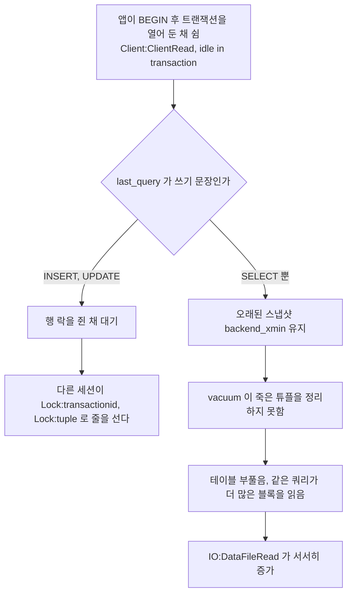

PI가 `idle in transaction` 세션을 AAS로 세는지는 환경 문서의 정의를 따른다. 쓰는 인스턴스에서 한 번 재현해 두는 편이 낫다. 세션 하나에서 `BEGIN; SELECT 1;`만 실행하고 가만히 둔 채 PI의 `Client:ClientRead`에 잡히는지 본다. 잡히든 아니든 `pg_stat_activity`로 보는 것이 정확하다.

### 4.5 IPC:BgWorkerShutdown과 CPU

`IPC:*`는 다른 프로세스를 기다린다는 뜻이고 이름마다 대상이 다르다. `IPC:BgWorkerShutdown`은 병렬 쿼리에서 리더가 워커의 종료를 기다리는 이벤트다. 짧은 쿼리가 병렬로 도는 OLTP 경로에서 워커 기동과 종료 비용이 쿼리 시간을 넘기는 경우에 눈에 띈다. 병렬 워커는 별도 백엔드라서 쿼리 하나가 AAS를 여러 개 차지하는 부작용도 있다.

```sql
-- 병렬 워커와 리더 (leader_pid 는 PG 13 이상)
SELECT pid, leader_pid, backend_type, wait_event_type, wait_event, left(query, 60) AS query
FROM pg_stat_activity
WHERE backend_type = 'parallel worker' OR leader_pid IS NOT NULL;

EXPLAIN (ANALYZE) SELECT count(*) FROM ev;
-- Gather  Workers Planned: <n>  Workers Launched: <n>
```

병렬이 필요한 건 배치나 분석 쿼리인 경우가 많다. 그쪽 롤은 그대로 두고 앱 롤만 바꾸면 영향 범위가 작다.

```sql
ALTER ROLE app_oltp SET max_parallel_workers_per_gather = 0;
```

`IPC:SyncRep`은 동기 복제 응답 대기이고 복제본 지연이나 네트워크를 본다. `IPC:ProcArrayGroupUpdate`는 동시 커밋이 몰릴 때 보인다.

CPU는 `wait_event`가 NULL인 활성 세션이다. 계측된 대기가 없다는 뜻이지 코어에서 실제로 돌고 있다는 보장은 아니다. AAS CPU가 Max vCPU 선을 넘으면 코어를 기다리는 세션이 섞여 있다. 어떤 쿼리가 CPU를 쓰는지는 누적 실행 시간으로 본다.

```sql
-- PG 13 이상은 total_exec_time, 12 이하는 total_time
SELECT queryid, calls,
       round(total_exec_time::numeric, 0) AS total_ms,
       round((total_exec_time / calls)::numeric, 2) AS mean_ms,
       rows, left(query, 60) AS query
FROM pg_stat_statements
ORDER BY total_exec_time DESC
LIMIT 10;
```

`total_ms`가 큰 쿼리가 CPU를 가장 많이 쓴 쿼리다. 평균은 작아도 호출 횟수가 큰 쿼리가 여기서 드러난다. 이 지표는 CPU만이 아니라 대기 시간도 포함하므로 4.1~4.3의 이벤트가 없는지 같이 확인해야 한다.

## 5. MySQL과 PostgreSQL 이벤트 대응

같은 현상이 엔진마다 다른 이름으로 보인다. 이름이 1:1로 대응하지 않는 칸은 그렇다고 적었다. 억지로 짝을 맞추면 엉뚱한 곳을 보게 된다.

| 현상 | MySQL·Aurora MySQL | PostgreSQL·Aurora PostgreSQL | 공통 확인 |
|---|---|---|---|
| 행 락 대기 | Aurora는 `synch/mutex/innodb/aurora_lock_thread_slot_futex`, 일반 MySQL은 버전별로 다름. `Innodb_row_lock_*`로 확인 | `Lock:transactionid`, 같은 행에 세션이 더 있으면 `Lock:tuple` | 막는 세션과 그 상태 |
| 테이블·메타데이터 락 | `lock/table/sql/handler`, `synch/cond/sql/MDL_context::COND_wait_status` | `Lock:relation` | DDL 앞에 열린 트랜잭션 |
| 데이터 파일 읽기 | `io/file/innodb/innodb_data_file` | `IO:DataFileRead` | 실행 계획, 캐시 미스율, 스토리지 지연 |
| 엔진의 행 접근 전체 | `io/table/sql/handler` | 대응 없음. 실행 중이면 CPU 또는 IO 이벤트로 나뉜다 | 읽은 행 대비 돌려준 행 |
| 커밋 로그 기록 | `io/file/innodb/innodb_log_file`, Aurora는 `io/aurora_redo_log_flush` | `IO:WALWrite`, `IO:WALSync`, `LWLock:WALWrite`, Aurora는 `IO:XactSync` | 커밋당 변경 행 수 |
| 버퍼 풀 내부 경합 | `synch/mutex/innodb/buf_pool_mutex`, `synch/sxlock/innodb/hash_table_locks` | `LWLock:BufferMapping` | 버퍼 미스율, 동시 세션 수 |
| 락 테이블 내부 경합 | 대응하는 단일 이벤트 없음 | `LWLock:LockManager` | 한 쿼리가 잡는 락 수 |
| 앱이 트랜잭션을 열어 둔 채 쉼 | PI에 이벤트로 잡히지 않는 경우가 많다. `Sleep` 연결과 `innodb_trx`로 찾는다 | `Client:ClientRead`, `state = 'idle in transaction'` | 트랜잭션 나이 |
| 병렬 쿼리 | OLTP에서 문제 되는 이벤트 없음 | `IPC:BgWorkerShutdown`, `IPC:ParallelFinish` | 실행 계획의 Workers Launched |
| CPU | PI가 CPU로 분류 | `wait_event`가 NULL인 활성 세션 | Max vCPU 선, 실행 계획 |

표의 "앱이 트랜잭션을 열어 둔 채 쉼" 행은 엔진 차이가 가장 큰 곳이다. PostgreSQL은 쉬는 세션이 이벤트 이름까지 가지고 있어 한눈에 찾는다. MySQL에서는 쉬는 세션이 락을 쥐고 있을 때만 다른 세션의 락 대기를 통해 간접적으로 드러난다. MySQL에서 이 문제를 찾으려면 3.7의 `Sleep` 연결 쿼리를 따로 돌려야 한다.

## 6. 장애 사례 3건

세 사례는 PI에서 보이는 증상, 원인을 가르는 확인, 재현 방법, 조치 순으로 적었다. 이 저장소 문서는 특정 환경의 측정 수치를 싣지 않는다. 증상은 형태로만 적고 값은 비웠다.

### 6.1 gp2 BurstBalance 소진 후 IO 대기 급증

증상은 이렇게 나타났다. 평소 문제없던 야간 배치가 어느 날부터 느려진다. PI에서 `io/file/innodb/innodb_data_file`(PostgreSQL이면 `IO:DataFileRead`, 쓰기 중심이면 `IO:WALWrite`)가 AAS를 채운다. Top SQL의 쿼리는 새로 나온 것이 아니고 실행 계획도 그대로다. 쿼리가 바뀐 적이 없는데 같은 쿼리의 IO 대기만 길어진 점이 단서다.

원인은 gp2 볼륨의 크레딧 버킷이다. gp2는 용량 1GiB당 3 IOPS를 베이스라인으로 주고, 그 이상은 버스트 크레딧으로 쓴다. 버스트 상한과 버킷 크기, 소진 시간 공식은 [EBS 범용 SSD 문서](https://docs.aws.amazon.com/ebs/latest/userguide/general-purpose.html)에 있다. 문서의 공식으로 200GiB 볼륨을 계산하면 베이스라인은 600 IOPS다. 상한인 3,000 IOPS로 계속 쓰면 5,400,000 크레딧이 `5,400,000 / (3,000 - 600)`초, 즉 2,250초면 바닥난다. 크레딧이 떨어지면 IOPS가 베이스라인으로 내려가고, 같은 배치가 같은 IO를 요청해도 큐에서 기다린다. RDS는 스토리지 크기 구간에 따라 볼륨 구성이 달라질 수 있으므로 정확한 값은 [RDS_Storage.md](RDS_Storage.md)와 RDS 공식 문서로 확인한다. Aurora는 EBS 볼륨을 쓰지 않아 이 사례에 해당하지 않는다.

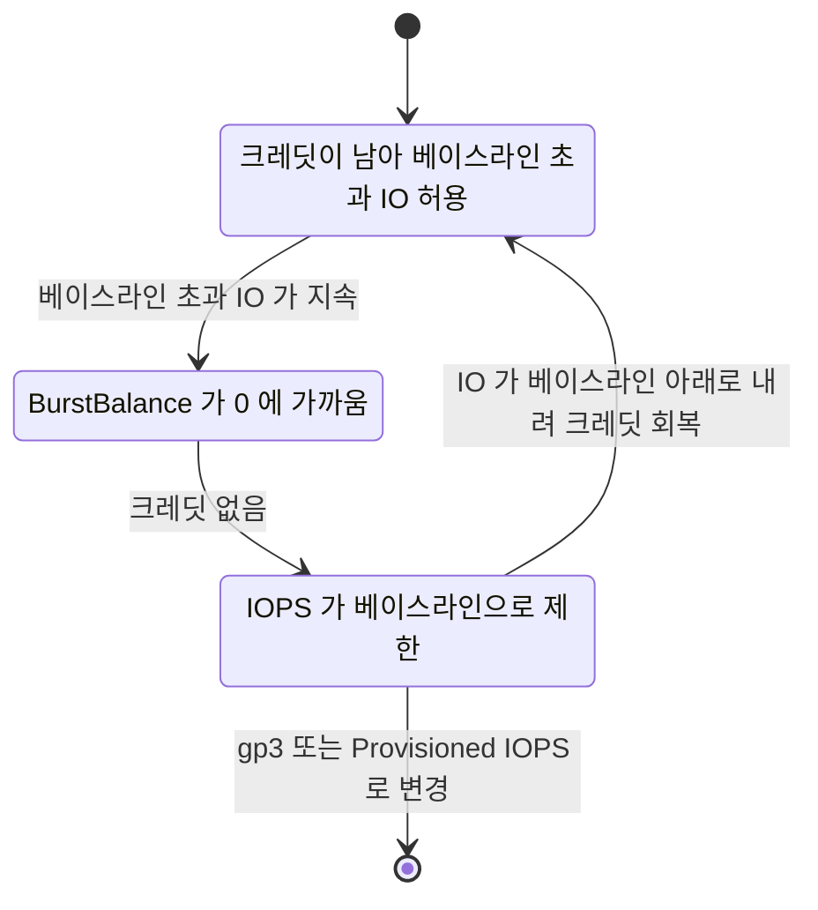

그림에서 `Throttled`가 계속되는 이유를 봐야 한다. 크레딧은 IO를 베이스라인 아래로 쓸 때만 쌓이는데, 배치가 계속 요청을 쏟아내면 회복 구간이 오지 않는다. 배치가 끝나기 전까지 스스로 풀리지 않는다.

가르는 확인은 CloudWatch 지표다.

```bash
aws cloudwatch get-metric-statistics --namespace AWS/RDS \
  --metric-name BurstBalance \
  --dimensions Name=DBInstanceIdentifier,Value=<instance-id> \
  --start-time <시작 UTC> --end-time <종료 UTC> \
  --period 300 --statistics Minimum
```

```text
{
  "Label": "BurstBalance",
  "Datapoints": [
    { "Timestamp": "<시각>", "Minimum": <퍼센트>, "Unit": "Percent" }
  ]
}
```

`BurstBalance`가 0 근처로 내려간 시각과 PI의 IO 대기가 늘어난 시각이 겹치는지 본다. 같은 구간에서 `ReadLatency`·`WriteLatency`와 `DiskQueueDepth`가 함께 오르면 확정이다. 겹치지 않으면 이 사례가 아니라 3.2의 작업 집합 증가를 본다.

재현은 PostgreSQL에서 pgbench로 가능하다. 인스턴스 메모리보다 데이터가 크도록 scale을 잡고(`\dt+`로 크기 확인), 읽기 위주 부하를 오래 건다.

```bash
pgbench -i -s <scale> <db>
pgbench -S -c 32 -j 4 -T 3600 <db>
```

시간이 지나며 `BurstBalance`가 내려가고 `IO:DataFileRead`가 늘어나는지 `\watch 1`로 4장의 첫 쿼리를 반복하며 지켜본다. 그동안의 수치는 환경마다 다르다.

조치는 단기와 근본으로 갈린다. 단기에는 배치 동시성을 낮춰 IO 요청을 베이스라인 안으로 맞춘다. 근본 조치는 볼륨 종류를 gp3나 Provisioned IOPS로 바꾸는 것이다. RDS 스토리지 변경은 완료까지 시간이 걸리고, 다음 변경까지 대기해야 하는 제한과 변경 중 성능 영향이 공식 문서에 적혀 있다. 장애 한가운데서 처음 시도할 일이 아니다. 같은 일이 반복되지 않게 `BurstBalance`에 CloudWatch 경보를 미리 둔다.

### 6.2 배치가 같은 행을 갱신해 row lock 대기가 AAS를 채운 경우

증상은 이렇다. 야간에 워커 여러 개가 병렬로 도는 배치가 있다. 어느 날부터 처리 시간이 늘고 간헐적으로 락 타임아웃 에러가 난다. PI의 Lock 영역이 AAS를 채우고, PostgreSQL이면 `Lock:transactionid`와 `Lock:tuple`이 번갈아 위에 보인다. Top SQL에는 인덱스가 정상인 단순 UPDATE 한 문장이 맨 위에 있다. 이 UPDATE는 쿼리 자체가 느린 것이 아니라 락을 기다리는 시간이 대부분이다.

원인은 모든 워커가 처리 건수를 한 행에 더하는 구조였다. 워커가 트랜잭션 안에서 건당 처리 결과를 쓰고 마지막에 집계 행을 갱신한 뒤 외부 호출을 하면, 그 호출이 끝날 때까지 행 락이 유지된다. 4.1 그림의 A가 오래 사는 형태다.

재현에 필요한 SQL은 세션 3개면 된다. PostgreSQL에서는 이렇다.

```sql
CREATE TABLE job_stat (job_id int PRIMARY KEY, processed bigint NOT NULL DEFAULT 0);
INSERT INTO job_stat VALUES (1, 0);

-- 세션 A
BEGIN;
UPDATE job_stat SET processed = processed + 1 WHERE job_id = 1;
SELECT pg_sleep(60);   -- 외부 호출 대용

-- 세션 B, C (A 가 자는 동안 차례로)
UPDATE job_stat SET processed = processed + 1 WHERE job_id = 1;
```

세션 B가 먼저 들어가면 B는 `Lock:transactionid`, C는 `Lock:tuple`에서 기다린다. 4장 첫 쿼리와 4.1의 뿌리 찾기 쿼리를 돌려 보면 `root_pid`가 A로 나온다.

```text
 pid  | state  | wait_event_type | wait_event    | blocked_by
------+--------+-----------------+---------------+------------
 <B>  | active | Lock            | transactionid | {<A>}
 <C>  | active | Lock            | tuple         | {<B>}
```

MySQL에서는 같은 테이블에 `SELECT SLEEP(60)`으로 같은 구조를 만든다. B 쪽 문장은 `innodb_lock_wait_timeout` 이후에 아래 에러로 끝난다.

```text
ERROR 1205 (HY000): Lock wait timeout exceeded; try restarting transaction
```

PostgreSQL에서 DDL이 아닌 갱신 대기에 시간 제한을 두려면 세션에 `SET lock_timeout = '5s';`를 건다. 초과하면 `ERROR:  canceling statement due to lock timeout`으로 끝나므로 앱이 재시도할 수 있다.

조치는 구조에 따라 고른다.

| 구조 | 조치 |
|---|---|
| 건당 집계 행 갱신 | 워커 메모리에 누적하고 일정 건수마다 한 번 갱신 |
| 집계 행이 여러 워커의 합계 | 행을 워커 수만큼 쪼개서(`job_id`, `slot`) 워커마다 자기 행만 갱신, 읽을 때 `SUM` |
| 락을 쥔 채 외부 호출 | 외부 호출을 트랜잭션 밖으로 빼고, 트랜잭션은 마지막에 짧게 |
| 작업 큐를 여러 워커가 가져감 | `SELECT ... FOR UPDATE SKIP LOCKED`로 이미 잡힌 행을 건너뜀 |

```sql
-- MySQL 8.0, PostgreSQL 9.5 이상 공통
BEGIN;
SELECT id FROM task_queue WHERE status = 'ready' ORDER BY id LIMIT 10 FOR UPDATE SKIP LOCKED;
-- 가져온 id 를 처리 중으로 바꾸고 커밋
COMMIT;
```

여러 행을 한꺼번에 갱신하는 배치는 갱신 순서도 맞춘다. 워커마다 키를 다른 순서로 잡으면 락 대기가 아니라 데드락이 된다. 모든 워커가 키 오름차순으로 갱신하게 고정한다.

### 6.3 커넥션 풀 증설 후 LWLock:LockManager와 BufferMapping이 올라온 경우

증상은 이렇다. 요청 지연이 늘어서 앱의 커넥션 풀을 키웠다. 풀을 키운 직후 지연이 줄기는커녕 오히려 늘었다. PI에서 `LWLock:LockManager`와 `LWLock:BufferMapping`이 올라오고 AAS가 Max vCPU 선을 넘어섰다. Top SQL의 개별 쿼리 실행 계획은 풀 증설 전과 같다. 쿼리 하나는 그대로인데 동시에 돌 때만 느려지는 것이 단서다.

원인은 풀 증설로 동시 실행 쿼리가 늘면서 코어 수보다 훨씬 많은 세션이 같은 내부 자료구조를 두고 겨루게 된 것이다. 파티션 테이블 조회처럼 락을 많이 잡는 쿼리가 있으면 4.2의 fast-path 한도를 넘는 락이 공유 락 테이블로 몰려 `LockManager`가 먼저 올라온다. 큰 테이블을 훑는 쿼리가 섞여 있으면 `BufferMapping`이 같이 오른다. 세션이 늘어도 처리량은 코어 수가 정한다. 늘어난 세션은 줄만 길게 만든다.

재현은 4.2에서 만든 파티션 테이블 `ev`와 키 없는 조회로 한다. 세션 수만 바꿔서 두 번 돌린다.

```bash
cat > scan.sql <<'SQL'
SELECT count(*) FROM ev WHERE ts > now() - interval '1 hour';
SQL

pgbench -n -f scan.sql -c 8   -j 4 -T 60 <db>
pgbench -n -f scan.sql -c 128 -j 8 -T 60 <db>
```

각 실행 중에 4장 첫 쿼리를 반복해 이벤트 분포를 비교한다. 세션 수를 올린 쪽에서 `LWLock:LockManager`의 몫이 커지는지가 확인 대상이다. pgbench가 출력하는 `latency average`와 `tps`도 두 실행에서 비교한다. 세션 수가 16배인데 tps가 비례해서 늘지 않고 지연만 늘면 이 사례와 같은 모양이다. 그 숫자는 쓰는 인스턴스에서만 의미가 있다.

가르는 확인은 4.2의 `pg_locks` 쿼리다. `slowpath_locks`가 큰 세션의 쿼리가 곧 원인 쿼리이고, 풀 증설은 그 쿼리의 영향을 키운 계기일 뿐이다.

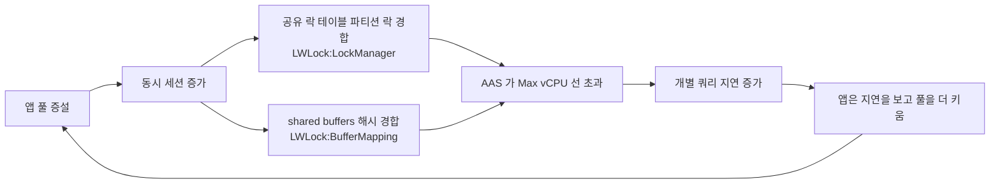

그림의 루프가 이 사례를 악화시킨다. 지연이 늘면 풀을 더 키우고 싶어지지만, 그럴수록 경합이 커진다.

조치는 순서가 있다. 풀을 증설 전 크기로 되돌린다. 키 없는 파티션 조회에 파티션 키 조건을 넣고 쓰지 않는 인덱스를 정리해서 쿼리 하나가 잡는 락 수를 줄인다. 앱 쪽 연결 수가 구조적으로 많다면 [DB_Proxy.md](DB_Proxy.md)의 RDS Proxy 같은 연결 풀링으로 DB가 보는 세션 수를 줄인다. 프록시는 세션 상태를 쓰는 쿼리에서 연결이 고정(pinning)돼 효과가 줄어드는 경우가 있어, 도입 후 실제 DB 쪽 연결 수가 줄었는지 확인해야 한다.

## 7. 근거 문서

- [PostgreSQL 14 대기 이벤트 표](https://www.postgresql.org/docs/14/monitoring-stats.html#WAIT-EVENT-TABLE): `wait_event_type`, `wait_event` 목록
- [MySQL 8.0 sys.innodb_lock_waits](https://dev.mysql.com/doc/refman/8.0/en/sys-innodb-lock-waits.html): 행 락 대기 뷰와 컬럼
- [Aurora MySQL 대기 이벤트](https://docs.aws.amazon.com/AmazonRDS/latest/AuroraUserGuide/AuroraMySQL.Reference.Waitevents.html): Aurora 전용 이벤트
- [EBS 범용 SSD 볼륨](https://docs.aws.amazon.com/ebs/latest/userguide/general-purpose.html): gp2 베이스라인과 버스트 크레딧 공식
- [RDS_Performance_Insights.md](RDS_Performance_Insights.md): PI 수집 구조, AAS 해석, 판단 흐름
- [RDS_Storage.md](RDS_Storage.md), [Aurora_DB.md](Aurora_DB.md), [DB_Proxy.md](DB_Proxy.md): 스토리지 종류, Aurora 구조, 연결 풀링
