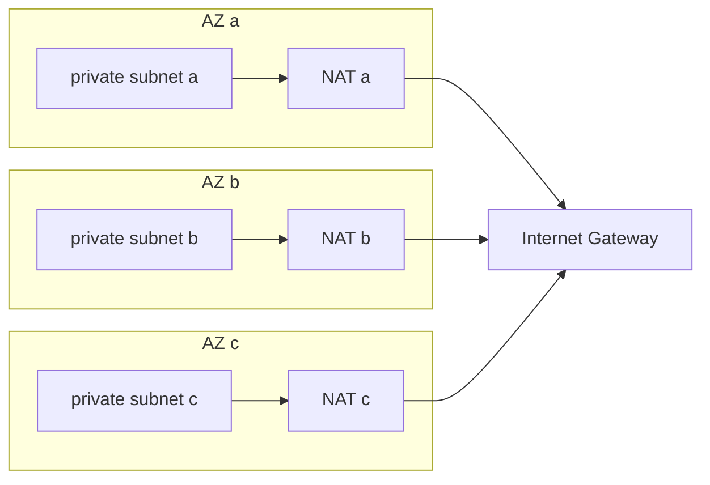

## AZ 분산이 필요한 시점

AWS는 리전 안에 물리적으로 분리된 AZ(Availability Zone)를 여러 개 운영한다. 각 AZ는 전력·냉각·네트워크가 따로 돌아서 한 AZ가 멈춰도 다른 AZ는 영향을 받지 않는다.

ap-northeast-2(서울)는 AZ가 4개다. `ap-northeast-2a`, `2b`, `2c`, `2d`. 실무에서는 a, b, c 세 곳을 주로 쓴다. d는 일부 인스턴스 타입이 제공되지 않고, EFS One Zone 같은 서비스도 지원하지 않아서 나중에 오토스케일링이나 스팟 조달에서 막히는 경우가 있다.

단일 AZ로 운영하다 그 AZ가 죽으면 서비스 전체가 멈춘다. 장비 결함, 전력 이상, 네트워크 분리처럼 예측하기 어려운 원인으로 실제 발생한다. 컴퓨팅, 데이터베이스, 로드밸런서, NAT, 캐시를 전부 AZ에 나눠 두어야 한다. 하나라도 단일 AZ에 남으면 그 하나가 전체의 약점이 된다.

AZ를 나눈다고 끝나지 않는다. AZ 하나가 빠진 뒤 남은 AZ가 그 부하를 실제로 받을 수 있는지, 감지까지 걸리는 시간 동안 클라이언트가 무슨 짓을 하는지, 상태를 가진 리소스가 어느 AZ에 묶여 있는지를 같이 봐야 한다. 이 문서는 그 순서로 정리한다.

## AZ 이름과 AZ ID

`ap-northeast-2a`는 AZ 이름이고, 계정마다 물리 AZ와 매핑이 다르다. AWS가 a에 몰리지 않도록 계정별로 무작위로 배정한다. 내 계정의 `2a`와 다른 계정의 `2a`는 다른 데이터센터일 수 있다. 계정과 무관하게 같은 물리 위치를 가리키는 식별자가 AZ ID(`apne2-az1` 형태)다. 근거는 [AWS RAM 문서](https://docs.aws.amazon.com/ram/latest/userguide/working-with-az-ids.html)에 있다.

단일 계정 안에서는 이름을 써도 상관없다. 문제는 계정을 넘나드는 순간 생긴다.

- 공유 서비스 계정의 VPC 서브넷을 AWS RAM으로 워크로드 계정에 공유하면, 받는 쪽에서는 같은 AZ ID를 가진 AZ에 서브넷이 나타난다. 이름으로 `2a`를 기대하고 배치했다가 실제로는 다른 AZ에 떠서 AZ 간 요금이 붙는 경우가 있다.
- 계정 A의 앱은 `2a`, 계정 B의 DB는 `2a`라서 같은 AZ에 있다고 생각하고 PrivateLink나 피어링 트래픽 비용을 추산했는데, 실제 AZ ID는 서로 달랐다.
- AZ 장애 대응 문서에 "2a가 죽으면"이라고 써 두면 계정마다 죽는 물리 AZ가 다르다. zonal shift에서 `--away-from`에 넣는 값도 AZ ID다.

내 계정의 매핑은 이렇게 본다.

```bash
aws ec2 describe-availability-zones --region ap-northeast-2 \
  --query 'AvailabilityZones[].[ZoneName,ZoneId,State]' --output table
```

EFS One Zone이 지원하는 서울 리전 AZ ID는 `apne2-az1`, `az2`, `az3`이다([EFS 문서](https://docs.aws.amazon.com/efs/latest/ug/features.html)). 내 계정에서 `2d`가 `apne2-az4`로 매핑돼 있다면 그 AZ에는 One Zone 파일시스템을 못 만든다. 이름이 아니라 ID로 확인해야 이런 것이 보인다.

특정 인스턴스 타입이 그 AZ에서 제공되는지도 AZ ID로 조회할 수 있다.

```bash
aws ec2 describe-instance-type-offerings --region ap-northeast-2 \
  --location-type availability-zone-id \
  --filters Name=instance-type,Values=m6i.large \
  --query 'InstanceTypeOfferings[].Location' --output text
```

## RDS Multi-AZ와 Read Replica

이 둘의 목적은 다르다. 혼동해서 설계하면 돈만 쓰고 가용성도 안 나온다.

**Multi-AZ DB instance 배포**는 장애 대응용이다. 프라이머리와 스탠바이 1대가 동기 복제로 같은 상태를 유지한다. 프라이머리가 있는 AZ가 죽으면 스탠바이가 프라이머리가 되고 엔드포인트 DNS 레코드가 스탠바이를 가리키도록 바뀐다. 애플리케이션은 엔드포인트를 바꿀 필요가 없다. 이 배포의 스탠바이는 읽기 트래픽을 받지 못한다. [AWS 문서](https://docs.aws.amazon.com/AmazonRDS/latest/UserGuide/Concepts.MultiAZSingleStandby.html)도 스탠바이로 읽기를 처리할 수 없고, 읽기 분산이 필요하면 Multi-AZ DB cluster나 Read Replica를 쓰라고 적는다.

**Read Replica**는 읽기 분산용이다. 비동기 복제라 복제 지연이 있고, AZ 장애 시 자동 승격이 없다. 수동으로 `promote`를 실행해야 프라이머리가 되고 엔드포인트도 직접 바꿔야 한다.

| | Multi-AZ DB instance | Read Replica |
|---|---|---|
| 복제 방식 | 동기 | 비동기 |
| 장애 자동 전환 | 있음 | 없음 (수동 promote) |
| 읽기 트래픽 처리 | 불가 (스탠바이) | 가능 |
| 주목적 | 고가용성 | 읽기 분산 |

failover에 걸리는 시간은 배포 방식마다 다르다. AWS 문서 기준으로 Multi-AZ DB instance는 보통 60~120초, Multi-AZ DB cluster는 보통 35초 미만이다([instance 문서](https://docs.aws.amazon.com/AmazonRDS/latest/UserGuide/Concepts.MultiAZ.Failover.html), [cluster 문서](https://docs.aws.amazon.com/AmazonRDS/latest/UserGuide/multi-az-db-clusters-concepts-failover.html)). 둘 다 "보통"이다. 진행 중이던 큰 트랜잭션이나 복구할 로그가 많으면 길어진다. 이 시간은 DB가 새 프라이머리로 올라오는 시간이고, 앱이 새 IP로 붙기까지의 시간은 따로 더해진다.

### failover 뒤에도 앱이 죽은 IP를 붙잡는 문제

가장 흔하게 겪는 문제가 JVM의 DNS 캐시다. failover는 엔드포인트의 DNS 레코드를 바꾸는 방식이라, 앱이 이전 IP를 캐시하고 있으면 DB는 멀쩡히 올라왔는데 앱은 계속 죽은 주소로 연결을 시도한다. AWS 문서는 JVM의 TTL을 60초 이하로 두라고 하고, 일부 Java 설정에서는 기본값이 "JVM을 재시작할 때까지 갱신하지 않음"이라는 점을 명시한다([문서](https://docs.aws.amazon.com/AmazonRDS/latest/UserGuide/multi-az-db-clusters-concepts-failover.html#multi-az-db-clusters-concepts-failover-java-dns)). security manager가 설치된 환경이 여기에 해당한다.

```java
public static void main(String[] args) {
    // 첫 네트워크 연결이 만들어지기 전에 설정해야 한다
    java.security.Security.setProperty("networkaddress.cache.ttl", "30");
    java.security.Security.setProperty("networkaddress.cache.negative.ttl", "5");
    SpringApplication.run(App.class, args);
}
```

DNS만 맞춰도 부족하다. failover 순간 이미 맺어 둔 커넥션은 죽은 서버로 향하고 있고, 패킷이 조용히 사라지면 소켓은 OS의 TCP 타임아웃(리눅스 기본이 수 분 단위)까지 붙잡힌다. 풀에 남은 커넥션이 전부 이 상태가 되면 스레드가 다 막혀서 DB가 복구된 뒤에도 앱이 한참 응답하지 못한다.

```text
# PostgreSQL JDBC (단위: 초)
jdbc:postgresql://main-rds.xxxx.ap-northeast-2.rds.amazonaws.com:5432/app
  ?connectTimeout=3&socketTimeout=30&tcpKeepAlive=true

# MySQL Connector/J (단위: 밀리초)
jdbc:mysql://main-rds.xxxx.ap-northeast-2.rds.amazonaws.com:3306/app
  ?connectTimeout=3000&socketTimeout=30000
```

`socketTimeout`은 가장 오래 걸리는 정상 쿼리보다 길게 잡아야 한다. 30초로 두면 배치성 쿼리가 오탐으로 끊긴다. 긴 쿼리는 별도 커넥션 풀이나 DB 측 `statement_timeout`으로 나누는 편이 낫다. HikariCP는 `maxLifetime`을 DB나 프록시의 유휴 타임아웃보다 짧게 두고, failover 후 죽은 커넥션이 풀에서 빨리 빠지도록 `connectionTimeout`을 3~5초로 짧게 둔다.

RDS Proxy를 쓰면 애플리케이션이 DNS 캐시를 거치지 않는다. AWS는 Aurora Multi-AZ에서 RDS Proxy가 DNS 캐시를 우회해 failover 시간을 최대 66% 줄인다고 설명한다([Aurora HA 문서](https://docs.aws.amazon.com/AmazonRDS/latest/AuroraUserGuide/Concepts.AuroraHighAvailability.html#Concepts.AuroraHighAvailability.Proxy)). 대신 프록시 비용이 붙고, 세션 상태를 쓰는 코드(prepared statement, `SET` 변수)는 커넥션 고정(pinning)이 생겨 멀티플렉싱 효과가 줄어든다.

## Aurora와 RDS Multi-AZ DB cluster

이름이 비슷해서 자주 섞이지만 서로 다른 제품이다. 인스턴스 배포와 클러스터 배포의 운영 차이(강제 페일오버 명령, EventBridge 룰, Terraform 리소스)는 [RDS Multi-AZ](../Database/RDS_Multi_AZ.md)에 따로 정리했다. "Multi-AZ DB cluster는 Aurora가 아니다"라고 [AWS 문서](https://docs.aws.amazon.com/AmazonRDS/latest/UserGuide/multi-az-db-clusters-concepts.html)에 별도 경고로 적혀 있다.

| | Multi-AZ DB instance | Multi-AZ DB cluster | Aurora |
|---|---|---|---|
| 구성 | 프라이머리 1 + 스탠바이 1 | 라이터 1 + 리더 2, 3개 AZ | 라이터 1 + 리더 최대 15 |
| 복제 | 동기 | 반동기 (리더 1대 이상이 ack해야 커밋) | 스토리지 계층에서 6개 사본을 AZ 3곳에 동기 기록, 리더는 비동기 |
| 스탠바이 읽기 | 불가 | 가능 (리더 엔드포인트) | 가능 (리더 엔드포인트) |
| failover 시간 | 보통 60~120초 | 보통 35초 미만 | 보통 60초 미만, 자주 30초 미만 |
| 엔진 | MySQL, PostgreSQL, MariaDB, Oracle, SQL Server | MySQL, PostgreSQL | Aurora MySQL, Aurora PostgreSQL |

기존에 이 문서에 "스탠바이는 읽기 불가"라고만 적혀 있었는데, 그 말은 Multi-AZ DB instance 배포에서만 맞다. Multi-AZ DB cluster는 리더 2대가 읽기 트래픽을 받는다.

### Multi-AZ DB cluster에서 놓치기 쉬운 것

failover 시간이 리플리카 지연에 묶인다. MySQL은 남은 리더 2대가 모두 밀린 트랜잭션을 적용해야 하고, PostgreSQL은 지연이 가장 작은 리더가 적용을 끝내야 승격된다. 쓰기가 몰리는 시간대에 리더 쪽에 무거운 읽기 쿼리를 돌리면 `ReplicaLag`이 커지고, 그 상태에서 장애가 나면 failover도 길어진다. 리더에서 분석 쿼리를 돌리는 습관은 가용성을 깎는다.

인스턴스 클래스도 제한된다. 지원 클래스는 `db.m5d`, `db.m6gd`, `db.r6gd` 같은 로컬 NVMe 계열 위주다. `db.t3.medium` 같은 버스터블 인스턴스는 못 쓴다. 위 Terraform 예제처럼 `db.t3.medium`으로 만들던 개발 환경을 그대로 cluster로 옮기려다 막히는 경우가 있다.

MySQL 엔진에서는 모든 테이블에 프라이머리 키가 있어야 복제 오류를 피한다고 AWS가 강하게 권한다. PK 없는 로그성 테이블이 남아 있으면 마이그레이션 전에 정리해야 한다.

### Aurora에서 AZ를 나눴다는 착각

Aurora는 스토리지가 AZ 3곳에 걸쳐 있어서 데이터는 AZ 장애에서 살아남는다. 그렇다고 인스턴스까지 살아남는 건 아니다. 라이터와 리더가 모두 같은 AZ에 있다면 그 AZ가 죽는 순간 쓰기 인스턴스가 없다. 리더가 없으면 같은 AZ에 새 프라이머리를 만드는데, AWS 문서에는 이 경우 복구가 보통 10분 미만이라고 나온다. AZ 전체가 문제라면 그 AZ 안에서의 재생성은 애초에 성립하지 않으므로, 다른 AZ에 인스턴스를 직접 만들어야 한다([문서](https://docs.aws.amazon.com/AmazonRDS/latest/AuroraUserGuide/Concepts.AuroraHighAvailability.html#Aurora.Managing.FaultTolerance)).

승격 우선순위(`promotion tier`)는 0이 가장 높고 15가 가장 낮다. 같은 tier면 인스턴스 크기가 큰 쪽이 먼저 승격된다. 분석용으로 작은 리더를 tier 15에 두고, 라이터와 같은 크기의 리더를 다른 AZ에 tier 0~1로 두는 구성이 일반적이다. 크기가 작은 리더가 승격되면 승격 직후 라이터 부하를 못 받아서 두 번째 장애가 된다.

애플리케이션은 인스턴스 엔드포인트가 아니라 클러스터 엔드포인트(라이터)와 리더 엔드포인트를 쓴다. 인스턴스 엔드포인트를 코드에 박아 두면 failover 후에 리더가 된 인스턴스에 쓰기를 시도해 `read-only` 오류가 난다.

## ALB와 AZ 배치

ALB는 서브넷을 2개 이상 지정해야 하고, 각 서브넷은 서로 다른 AZ에 있어야 한다. 지정한 AZ 중 하나가 죽으면 ALB는 나머지 AZ의 타겟으로만 트래픽을 보낸다.

서브넷을 2개 AZ에만 두면 한 AZ가 죽었을 때 부하가 살아 있는 AZ 하나에 전부 몰린다. 3개 AZ로 두면 한 곳이 죽어도 남은 두 곳이 나눠서 받는다.

### cross-zone load balancing과 비용

"ALB의 cross-zone이 기본으로 켜져 있어서 AZ 간 전송 비용이 쌓인다"는 말은 사실과 다르다. ALB 자체는 AZ 간 전송 요금 원인이 아니다.

- ALB는 LB 수준에서 cross-zone이 항상 켜져 있고 끌 수 없다. 타겟 그룹 단위로만 끌 수 있다([ELB 문서](https://docs.aws.amazon.com/elasticloadbalancing/latest/userguide/how-elastic-load-balancing-works.html#cross-zone-load-balancing)).
- ALB와 같은 VPC 안의 타겟 사이 트래픽은 AZ를 넘어도 데이터 전송 요금이 없다. AWS 네트워킹 블로그는 같은 VPC 안에서 private IP로 로드밸런서와 EC2 사이에 오가는 데이터는 무료라고 정리한다([블로그](https://aws.amazon.com/blogs/networking-and-content-delivery/exploring-data-transfer-costs-for-classic-and-application-load-balancers/)).
- 요금이 붙는 쪽은 NLB와 GWLB다. 둘은 cross-zone이 기본으로 꺼져 있고, 켜면 AZ를 넘는 트래픽에 리전 내 데이터 전송 요금이 붙는다. NLB는 각 방향에 GB당 $0.01이 적용된다고 AWS가 설명한다([NLB 비용 블로그](https://aws.amazon.com/blogs/networking-and-content-delivery/optimizing-data-transfer-costs-when-using-aws-network-load-balancer/)). GWLB도 활성화하면 일반 AZ 간 요금이 적용된다([GWLB 블로그](https://aws.amazon.com/blogs/networking-and-content-delivery/best-practices-for-deploying-gateway-load-balancer/)).

그래서 ALB 뒤에서 청구서가 커졌다면 원인은 ALB가 아니라 그 뒤(앱과 DB, 앱과 캐시, 서비스 사이 호출)에 있다. 아래 "AZ 간 데이터 전송 비용이 쌓이는 패턴"에서 다룬다. 반대로 NLB를 쓰는 서비스에서 cross-zone을 켜 둔 채 잊어버렸다면 그것이 원인일 수 있다.

### cross-zone을 끄는 경우의 함정

타겟 그룹에서 cross-zone을 끄면 각 ALB 노드는 자기 AZ의 타겟에만 보낸다. 이때 알아 둘 것이 세 가지 있다. AZ별 타겟 수가 다르면 부하가 고르게 나뉘지 않는다. 타겟이 하나도 없는 AZ(빈 서브넷)로 들어온 요청은 503이 난다. 타겟 그룹이 여러 개일 때 한 그룹이 특정 AZ에 타겟이 없으면 똑같이 문제가 된다. sticky session은 cross-zone이 꺼져 있으면 지원되지 않는다([문서](https://docs.aws.amazon.com/elasticloadbalancing/latest/application/edit-target-group-attributes.html#modify-cross-zone)).

## ECS/Fargate Task AZ 분산

ECS의 AZ 분산은 launch type마다 방식이 다르다. Fargate에 `placementStrategy`의 `spread` JSON을 넣는 예제가 돌아다니지만, Fargate는 task placement strategy와 constraint를 지원하지 않는다. [AWS 문서](https://docs.aws.amazon.com/AmazonECS/latest/developerguide/task-placement.html)에는 Fargate가 접근 가능한 AZ에 태스크를 최대한 고르게 퍼뜨리려 시도한다고만 나와 있다. Fargate와 Fargate Spot을 함께 쓰는 capacity provider라면 분산은 각 provider별로 따로 계산된다.

### EC2 launch type

EC2에서는 placement strategy로 직접 통제한다. 서비스에 넣은 태스크의 기본 전략은 이미 `attribute:ecs.availability-zone` 기준 `spread`다. 가용성을 우선하면서 AZ 안에서는 비용을 아끼려고 메모리 기준 `binpack`을 이어 붙이는 구성을 많이 쓴다.

```json
{
  "placementStrategy": [
    { "type": "spread", "field": "attribute:ecs.availability-zone" },
    { "type": "binpack", "field": "memory" }
  ]
}
```

순서가 중요하다. `binpack`을 먼저 두면 태스크가 한 AZ의 인스턴스에 몰리고, AZ가 죽을 때 대부분이 한꺼번에 사라진다. 그리고 placement strategy는 최선 노력이라, AZ에 인스턴스가 없거나 자리가 없으면 다른 AZ에라도 올린다. 인스턴스 자체는 ASG가 AZ마다 균형 있게 유지해야 하고, ECS가 인스턴스를 새 AZ에 만들어 주지는 않는다.

### Fargate

Fargate의 AZ는 서비스에 지정한 서브넷이 결정한다. 서브넷을 한 AZ 것만 넣으면 그 AZ에서만 돌고, 3개 AZ 서브넷을 넣으면 Fargate가 나눠서 배치한다.

```bash
aws ecs create-service \
  --cluster prod \
  --service-name api \
  --task-definition api:42 \
  --desired-count 6 \
  --launch-type FARGATE \
  --network-configuration "awsvpcConfiguration={subnets=[subnet-0aaa,subnet-0bbb,subnet-0ccc],securityGroups=[sg-0123],assignPublicIp=DISABLED}" \
  --availability-zone-rebalancing ENABLED
```

`--availability-zone-rebalancing`은 AZ 사이 태스크 수가 어긋났을 때 ECS가 스스로 맞추는 기능이다. 2025년 9월 5일부터 조건을 만족하는 서비스에 기본으로 켜진다. 새 태스크가 `HEALTHY`와 `RUNNING`이 되기를 기다린 뒤 넘치는 AZ의 태스크를 내리므로 서비스가 끊기지는 않는다([문서](https://docs.aws.amazon.com/AmazonECS/latest/developerguide/service-rebalancing.html)). 다만 `maximumPercent`를 100으로 둔 서비스, Classic Load Balancer를 쓰는 서비스, `attribute:ecs.availability-zone`을 constraint로 쓰는 서비스에는 쓸 수 없다. `maximumPercent: 100`은 "배포 때 여유 태스크를 띄우지 않겠다"는 뜻으로 넣은 설정이라 놓치기 쉽다. 이 서비스는 rebalancing이 조용히 동작하지 않는다.

AZ가 복구되면 rebalancing이 새 태스크를 복구된 AZ에 띄우고 다른 AZ의 태스크를 내린다. 복구 직후에 연결 끊김이 한 번 더 나오는 셈이라, 종료 시 graceful shutdown(SIGTERM 처리와 `stopTimeout`)이 잘 돼 있어야 한다.

AZ가 죽으면 그 AZ의 태스크가 종료되고 ECS가 남은 AZ에 새 태스크를 스케줄한다. 태스크가 `RUNNING`이 되고 ALB 헬스체크를 한 번 통과하기까지의 시간(이미지 풀, 기동, 헬스체크 시작 대기)은 별도로 더해진다. ECR 이미지가 작을수록 짧고, 큰 이미지에서는 이미지 풀이 대부분을 차지한다.

## NAT Gateway는 AZ마다 하나씩

NAT Gateway는 AZ 하나에 만들어지는 리소스다. 비용이 아까워서 퍼블릭 서브넷 하나에 NAT를 하나만 두고 모든 프라이빗 서브넷의 라우트를 거기로 보내는 구성을 많이 본다. 이렇게 하면 서로 다른 두 문제가 생긴다.

첫째, NAT가 있는 AZ가 죽으면 살아 있는 AZ의 인스턴스도 아웃바운드가 전부 끊긴다. 컨테이너 이미지 풀, 외부 API 호출, 패키지 저장소 접근, 결제 대행사 콜백 응답까지 나가지 못한다. 인바운드를 받는 ALB는 멀쩡해서 헬스체크는 통과하는데 요청 처리는 외부 호출에서 타임아웃이 나는 식으로 증상이 나타나 원인을 찾기 어렵다.

둘째, 다른 AZ의 NAT를 쓰면 프라이빗 인스턴스에서 NAT까지 가는 구간이 AZ를 넘는다. 리전 내 AZ 간 전송 요금이 붙고, 아웃바운드가 많은 서비스(외부 API 크롤링, 이미지 다운로드)에서는 NAT 처리 요금과 별개로 이 부분이 청구서에 보인다. AWS 문서도 다른 AZ의 NAT로 라우팅하는 대신 AZ마다 NAT를 두면 복원력이 좋아진다고 설명한다([문서](https://docs.aws.amazon.com/vpc/latest/userguide/nat-gateway-scenarios.html)).

해법은 AZ마다 NAT Gateway를 하나씩 두고 프라이빗 라우트 테이블도 AZ별로 나눠서 각자 자기 AZ의 NAT를 가리키게 하는 것이다.



NAT를 3개로 늘리면 시간당 요금이 3배가 된다. 트래픽이 적은 개발 환경은 NAT 하나로 두고, 운영만 AZ별로 나누는 식으로 환경별 변수로 갈라 두면 된다. 라우트 테이블 분리와 EIP 3개 할당은 아래 Terraform 절에 들어 있다.

## AZ 하나가 빠져도 버티는 용량 산정

AZ를 3개로 나눴는데 각 AZ를 평소 부하에 딱 맞게 잡아 두면 AZ 하나가 죽는 순간 남은 두 AZ에 1.5배의 부하가 몰린다. 감당 못 하면 남은 AZ도 같이 무너진다. AZ 분산은 용량 여유와 같이 설계해야 의미가 있다.

평시 총 부하를 P라 하고, AZ 하나가 빠져도 나머지가 P를 전부 받아야 한다면 AZ당 필요 용량은 P/(N-1), 총 용량은 N×P/(N-1)이다.

| AZ 수 | 평시 AZ당 부하 | 1개 손실 후 AZ당 부하 | 필요 총 용량 |
|---|---|---|---|
| 2 | 0.50P | 1.00P | 200% |
| 3 | 0.33P | 0.50P | 150% |
| 4 | 0.25P | 0.33P | 133% |

AZ가 많을수록 여유 비용이 적다. 2개 AZ는 항상 두 배를 쥐고 있어야 한다는 뜻이라 돈이 가장 많이 든다. 3개로 나누는 이유가 여기에도 있다.

이걸 CPU 사용률로 바꾸면 기준이 나온다. 인스턴스가 CPU 80%까지 버틴다고 보면, 3개 AZ의 평시 평균 CPU는 80% × 2/3 ≈ 53% 이하여야 한다. Target Tracking 스케일링의 목표값을 60%로 두었다면 평시에는 AZ 하나가 빠지는 상황을 감당하지 못한다. 가용성 요구가 높은 서비스는 목표값을 50% 안팎으로 잡아야 하고, 이건 비용과 직접 맞바꾸는 결정이다. ARC 문서도 AZ 하나가 빠졌을 때 스케일링이 따라오기를 기대하지 말고 미리 충분히 확보하라고 한다. 오토스케일링을 쓰더라도 최소 용량을 AZ 손실을 감당하는 수준으로 잡으라는 권고다([zonal autoshift 문서](https://docs.aws.amazon.com/r53recovery/latest/dg/arc-zonal-autoshift.html)). 장애가 난 순간에 스케일 아웃하면 감지 지연, 인스턴스 기동, 헬스체크 통과를 전부 기다려야 하고, 그동안 남은 AZ는 과부하 상태다.

### ASG의 AZ 재조정

ASG는 인스턴스 수를 AZ 사이에 균등하게 유지하려고 한다. AZ가 죽으면 남은 AZ에 새 인스턴스를 띄워 용량을 채우고, AZ가 복구되면 인스턴스가 가장 적은 AZ에 새로 띄운 뒤 다른 곳의 인스턴스를 종료한다(`AZRebalance`). 항상 새 인스턴스를 먼저 띄우고 나중에 종료하며, 최대 용량에 가까우면 최대값을 10% 또는 1대 중 큰 쪽만큼 임시로 넘겨서 재조정을 계속한다([문서](https://docs.aws.amazon.com/autoscaling/ec2/userguide/auto-scaling-benefits.html#AutoScalingBehavior.Rebalancing)).

AZ 장애 중에는 도움이 되지만 복구 직후에는 멀쩡히 일하던 인스턴스가 종료된다. 세션을 인스턴스 메모리에 들고 있거나 연결이 오래 유지되는 서비스는 이 재조정이 끊김으로 느껴진다. 그런 서비스는 종료 전 connection draining과 graceful shutdown을 확인하고, 필요하면 `AZRebalance` 프로세스를 일시 중지하는 방법도 있다. 대신 그 동안에는 AZ 불균형이 남는다.

### 서브넷 IP 고갈

AZ 하나가 빠지면 그 AZ가 들고 있던 태스크와 인스턴스가 남은 AZ의 서브넷에 새로 떠야 한다. 이때 IP가 모자라서 스케일 아웃이 실패하는 경우가 있다. `/24` 서브넷은 AWS가 5개를 예약하므로 251개를 쓸 수 있고, 여기서 ALB 노드, NAT, VPC 엔드포인트, RDS 등이 쓰는 몫을 빼야 한다.

AZ당 평시 태스크 수를 b, 3개 AZ 중 하나가 빠졌다고 하면 남은 AZ에서 1.5b가 필요하다. 평시 b=170이면 255가 되어 `/24`를 넘는다. 평시 IP 사용률은 낮아 보여도 장애 시에는 이미 모자란다. Fargate와 EKS pod는 태스크·pod마다 IP(ENI)를 하나씩 쓰기 때문에 특히 빨리 닳는다. 서브넷을 `/22` 이상으로 만들거나, 서브넷을 나눌 때 장애 시 1.5배를 기준으로 IP 수를 산정해야 한다. ASG는 한 AZ에 서브넷이 여러 개면 가용 IP가 가장 많은 서브넷에 띄우려고 하지만, 서브넷이 하나뿐이면 방법이 없다.

### 인스턴스 타입과 AZ 제공 여부

장애 상황에서는 다른 AZ에서도 모두가 동시에 인스턴스를 띄우려 하므로 `InsufficientInstanceCapacity`가 나기 쉽다. 특정 타입 하나만 쓰도록 고정한 시작 템플릿은 이 상황에서 가장 먼저 막힌다. ASG의 mixed instances policy에 `m6i`, `m5`, `m6a` 같은 대체 타입을 넣어 두는 편이 낫다. 앞 절의 `describe-instance-type-offerings`로 각 AZ ID에서 타입이 실제로 제공되는지 미리 확인해 둔다. 서울 리전에서 `2d`가 빠지는 이유가 이런 부분이다.

## AZ 간 데이터 전송 비용이 쌓이는 패턴

같은 리전 안이라도 AZ를 넘으면 GB당 $0.01이 각 방향에 붙는다. 송신 쪽과 수신 쪽에 각각 과금되므로 같은 계정 안에서 AZ를 넘는 1GB에는 합쳐서 $0.02가 든다([AWS 블로그](https://aws.amazon.com/blogs/networking-and-content-delivery/optimizing-data-transfer-costs-when-using-aws-network-load-balancer/)). 요금은 시점에 따라 바뀔 수 있으니 실제 계산은 EC2 요금 페이지의 데이터 전송 항목으로 다시 확인한다. 트래픽이 많은 서비스에서 이게 청구서에 예상보다 크게 잡히는 패턴이 있다. ALB와 타겟 사이는 앞에서 봤듯이 무료이므로 여기에 포함되지 않는다.

**앱과 DB, 앱과 Read Replica의 AZ 불일치**: 앱이 `ap-northeast-2a`에 있고 DB(또는 Read Replica)가 `2c`에 있으면 모든 쿼리가 AZ를 넘는다. Multi-AZ DB instance의 프라이머리 위치는 failover 후에 바뀌므로, failover 후에는 이 불일치가 새로 생긴다. Aurora나 Multi-AZ DB cluster의 리더 엔드포인트도 AZ를 고려하지 않고 리더에 나눠 주기 때문에, 읽기가 많으면 AZ를 넘는 비율이 높아진다. 같은 AZ의 리더에 붙이려면 리더 인스턴스 엔드포인트를 직접 쓰거나 드라이버의 AZ 인식 기능을 써야 하는데, 그러면 failover 처리를 앱이 떠안게 된다. 비용과 복잡도를 맞바꾸는 지점이다.

**ElastiCache 노드와 앱 AZ 불일치**: Redis 노드가 `2b`에 있는데 앱이 `2a`에서 읽으면 캐시 조회마다 AZ를 넘는다. 캐시 히트율이 높은 서비스는 요청당 수 KB의 왕복이 쌓여 무시 못 할 양이 된다. 리플리카를 AZ마다 두고 클라이언트가 자기 AZ 리플리카를 먼저 읽도록 설정한다. Lettuce라면 `ReadFrom` 정책으로 지연이 낮은 노드를 고를 수 있다.

**마이크로서비스 간 AZ 혼합 호출**: 서비스 A(`2a`)가 서비스 B(`2b`, `2c`)를 호출하면 요청의 절반 이상이 AZ를 넘는다. 내부 ALB를 거치는 구간은 무료지만 ALB가 아닌 직접 호출(서비스 디스커버리, gRPC 클라이언트 로드밸런싱, 메시지 브로커)은 요금이 붙는다. Cost Explorer에서 사용 유형이 `DataTransfer-Regional-Bytes`인 항목을 서비스별 태그로 쪼개 보면 어느 호출이 주범인지 나온다.

**단일 NAT**: 앞 절에서 다룬 대로 다른 AZ의 NAT를 쓰면 아웃바운드 전체가 AZ를 넘는다.

## 상태를 가진 리소스의 AZ 종속성

컴퓨팅은 AZ를 옮겨 다닐 수 있지만 데이터는 그렇지 않다. AZ 분산을 끝냈다고 믿었다가 장애 때 발견하는 종속성은 대부분 여기서 나온다.

**EBS**: 볼륨은 AZ 하나에 만들어지고 같은 AZ의 인스턴스에만 붙는다. AZ가 죽으면 그 볼륨에 접근할 수 없다. 다른 AZ에서 복구하려면 스냅샷에서 볼륨을 새로 만들어야 하고, 스냅샷 이후의 데이터는 없다. EKS에서 EBS 기반 PVC를 쓰는 StatefulSet은 pod가 볼륨의 AZ에 고정된다. 한 AZ 노드 그룹이 죽으면 그 pod들은 다른 AZ에서 뜨지 못하고 `Pending`으로 남는다. 상태가 필요한 워크로드는 애플리케이션 계층에서 복제(예: 데이터베이스의 레플리카)해야 한다.

**EFS**: Regional 파일시스템은 데이터를 여러 AZ에 중복 저장하고, AZ 하나가 죽어도 접근을 유지한다. One Zone 파일시스템은 AZ 하나에만 저장하므로 그 AZ가 손상되면 데이터가 유실될 수 있다. AWS Backup으로 자동 백업은 되지만 복구는 별도 작업이다([문서](https://docs.aws.amazon.com/efs/latest/ug/features.html#availability-durability)). 비용 때문에 One Zone을 고른다면 앞서 본 대로 지원하는 AZ ID가 한정돼 있다는 점, 그리고 클라이언트도 같은 AZ에 두어야 AZ 간 전송이 없다는 점을 같이 봐야 한다. 운영 데이터를 One Zone에 두면 Multi-AZ 설계가 성립하지 않는다.

**ElastiCache**: 레플리케이션 그룹의 자동 failover와 Multi-AZ 설정을 켜야 AZ 장애에서 살아남는다. Multi-AZ를 켜려면 프라이머리와 다른 AZ에 레플리카가 최소 하나 있어야 하고, 이를 켜면 ElastiCache가 레플리카를 서로 다른 AZ에 분산한다. 자동 failover는 복제 지연이 가장 작은 레플리카를 승격하며 쓰기는 보통 몇 초 안에 재개된다([문서](https://docs.aws.amazon.com/AmazonElastiCache/latest/dg/AutoFailover.html)).

```bash
aws elasticache modify-replication-group \
  --replication-group-id app-cache \
  --automatic-failover-enabled \
  --multi-az-enabled \
  --apply-immediately
```

세 가지를 알고 있어야 한다. 복제는 비동기라서 failover 때 복제 지연만큼 데이터가 유실될 수 있다. AZ 전체가 죽은 경우 교체 레플리카는 그 AZ가 복구된 뒤에야 생긴다. 그동안 레플리카 수가 줄어든 채로 운영된다. Redis OSS의 AOF와 Multi-AZ는 함께 쓸 수 없다. AOF로 내구성을 얻으려 했다면 Multi-AZ와 둘 중 하나를 골라야 한다. 클러스터 모드에서는 클라이언트가 토폴로지 변경을 감지해야 하므로 Lettuce의 adaptive topology refresh 같은 설정이 꺼져 있으면 failover 후에도 옛 노드를 계속 바라본다.

`test-failover`로 failover를 시험할 수 있다. 롤링 24시간 안에 최대 15개 노드 그룹까지 호출할 수 있고, 대규모 운영 이벤트 중에는 AWS가 이 API를 막을 수 있다. 장애를 해결하는 운영 도구가 아니라 앱의 반응을 확인하는 시험용이라는 것이 AWS의 설명이다.

## Terraform으로 ap-northeast-2 서브넷 3개 AZ 분산

앞의 AZ ID 문제 때문에 서브넷은 AZ 이름 대신 AZ ID로 만든다. 이렇게 하면 계정이 달라도 같은 물리 AZ에 서브넷이 생긴다. `count.index`로 리스트를 돌리는 대신 `for_each`로 AZ ID를 키로 삼으면, AZ를 추가하거나 순서를 바꿔도 다른 AZ의 리소스가 재생성되지 않는다.

```hcl
locals {
  azs = {
    "apne2-az1" = { public = "10.0.1.0/24", private = "10.0.11.0/24" }
    "apne2-az2" = { public = "10.0.2.0/24", private = "10.0.12.0/24" }
    "apne2-az3" = { public = "10.0.3.0/24", private = "10.0.13.0/24" }
  }
}

resource "aws_vpc" "main" {
  cidr_block           = "10.0.0.0/16"
  enable_dns_support   = true
  enable_dns_hostnames = true
}

resource "aws_internet_gateway" "main" {
  vpc_id = aws_vpc.main.id
}

resource "aws_subnet" "public" {
  for_each = local.azs

  vpc_id                  = aws_vpc.main.id
  cidr_block              = each.value.public
  availability_zone_id    = each.key
  map_public_ip_on_launch = true

  tags = { Name = "public-${each.key}" }
}

resource "aws_subnet" "private" {
  for_each = local.azs

  vpc_id               = aws_vpc.main.id
  cidr_block           = each.value.private
  availability_zone_id = each.key

  tags = { Name = "private-${each.key}" }
}

# NAT Gateway는 AZ마다 하나씩. EIP도 AZ마다 하나.
resource "aws_eip" "nat" {
  for_each = local.azs
  domain   = "vpc"

  tags = { Name = "nat-${each.key}" }
}

resource "aws_nat_gateway" "main" {
  for_each = local.azs

  allocation_id = aws_eip.nat[each.key].id
  subnet_id     = aws_subnet.public[each.key].id

  tags       = { Name = "nat-${each.key}" }
  depends_on = [aws_internet_gateway.main]
}

# 퍼블릭 라우트 테이블은 하나로 충분하다 (IGW는 리전 단위)
resource "aws_route_table" "public" {
  vpc_id = aws_vpc.main.id

  route {
    cidr_block = "0.0.0.0/0"
    gateway_id = aws_internet_gateway.main.id
  }
}

resource "aws_route_table_association" "public" {
  for_each = local.azs

  subnet_id      = aws_subnet.public[each.key].id
  route_table_id = aws_route_table.public.id
}

# 프라이빗 라우트 테이블은 AZ마다 따로, 자기 AZ의 NAT만 가리킨다
resource "aws_route_table" "private" {
  for_each = local.azs
  vpc_id   = aws_vpc.main.id

  route {
    cidr_block     = "0.0.0.0/0"
    nat_gateway_id = aws_nat_gateway.main[each.key].id
  }

  tags = { Name = "private-${each.key}" }
}

resource "aws_route_table_association" "private" {
  for_each = local.azs

  subnet_id      = aws_subnet.private[each.key].id
  route_table_id = aws_route_table.private[each.key].id
}

resource "aws_lb" "main" {
  name               = "main-alb"
  internal           = false
  load_balancer_type = "application"
  subnets            = [for s in aws_subnet.public : s.id]
}

resource "aws_db_subnet_group" "main" {
  name       = "main-db-subnet"
  subnet_ids = [for s in aws_subnet.private : s.id]
}

resource "aws_db_instance" "main" {
  identifier           = "main-rds"
  engine               = "postgres"
  instance_class       = "db.m6g.large"
  multi_az             = true
  db_subnet_group_name = aws_db_subnet_group.main.name
  # allocated_storage, username, password 등은 생략
}
```

`aws_db_instance`의 `multi_az = true`는 Multi-AZ DB instance 배포다. 스탠바이는 서브넷 그룹 안의 다른 AZ에 자동으로 배치된다. Multi-AZ DB cluster는 별도 리소스(`aws_rds_cluster`)로 만들고, 앞 절에서 본 인스턴스 클래스 제한을 확인해야 한다.

`aws_nat_gateway`가 만들어지는 동안 `depends_on`으로 IGW를 기다리게 하지 않으면 간헐적으로 생성 순서 오류가 난다. 퍼블릭 라우트 테이블은 IGW가 리전 단위 리소스라 하나만 두는 반면, 프라이빗 쪽은 NAT가 AZ 종속이라 AZ마다 나누어야 한다는 차이가 있다.

## ARC zonal shift로 트래픽 빼기

AZ 하나에 문제가 생겼을 때 그 AZ에서 트래픽을 빼내는 도구가 Amazon Application Recovery Controller(ARC)의 zonal shift다. 손으로 헬스체크를 조작하거나 서브넷을 비활성화하는 것보다 안전하다. 지원 리소스는 EC2 Auto Scaling 그룹, EKS, ALB, NLB다. ALB와 NLB는 cross-zone이 켜져 있어도 꺼져 있어도 된다([문서](https://docs.aws.amazon.com/r53recovery/latest/dg/arc-zonal-shift.resource-types.html)). ECS 서비스와 RDS, ElastiCache는 목록에 없다. DB는 failover를 직접 실행해야 한다.

시작하려면 로드밸런서에 zonal shift를 켜 두어야 한다. 장애가 난 뒤에는 속성을 바꾸기 어렵기 때문에 평소에 켠다.

```bash
aws elbv2 modify-load-balancer-attributes \
  --load-balancer-arn "$ALB_ARN" \
  --attributes Key=zonal_shift.config.enabled,Value=true

aws arc-zonal-shift start-zonal-shift \
  --resource-identifier "$ALB_ARN" \
  --away-from apne2-az1 \
  --expires-in 2h \
  --comment "az1 impaired, draining"
```

`--away-from`에는 AZ 이름이 아니라 AZ ID를 넣는다. 앞에서 본 매핑 문제가 여기서 실제로 문제가 된다. 문서 어딘가에 "2a를 빼라"고 적어 두면 계정마다 다른 AZ를 빼게 된다.

제약이 몇 가지 있다.

- 만료 시간을 반드시 지정해야 하고, 처음에는 최대 3일(72시간)이다. 만료 전에 연장하거나 취소할 수 있다.
- 로드밸런서 하나에 한 번에 AZ 한 곳만 뺄 수 있다.
- 타겟 그룹의 모든 타겟이 unhealthy이거나 타겟이 없어서 로드밸런서가 fail open 상태면 zonal shift는 효과가 없다. 트래픽이 이미 모든 타겟으로 흘러가고 있기 때문이다.
- 시작해도 진행 중이던 연결이 즉시 끊기는 게 아니다. DNS에서 그 AZ의 IP가 빠지는 데 시간이 걸리고, 클라이언트가 커넥션을 오래 재사용하면 예상보다 오래 그 AZ로 트래픽이 흐른다. AWS도 보통 몇 분 안에 끝나지만 더 걸릴 수 있다고 적는다([문서](https://docs.aws.amazon.com/r53recovery/latest/dg/arc-zonal-shift.how-it-works.html)). ALB와 NLB의 AZ별 CloudWatch 지표로 트래픽이 실제로 빠지는지 확인해야 한다.
- cross-zone이 켜진 로드밸런서에 zonal shift를 걸면 같은 타겟을 쓰는 다른 로드밸런서의 타겟 용량도 줄어든다. 내부 ALB와 외부 ALB가 같은 타겟을 공유하면 외부 ALB만 shift했는데 내부 ALB도 용량이 준다.
- 빼기 전에 남은 AZ의 용량을 확인해야 한다. shift는 용량을 만들어 주지 않는다. 앞 절의 산정대로 미리 여유를 확보해 두지 않았다면 shift가 곧 과부하다.

### zonal autoshift

zonal autoshift는 AWS가 AZ 이상을 감지하면 사용자 대신 shift를 시작해 주는 기능이다. AWS 내부 텔레메트리 기준이라 ARC가 개별 리소스의 상태를 들여다보는 것은 아니다. 그래서 실제로는 영향이 없는 리소스에서도 트래픽이 빠질 수 있다. 켜려면 주 1회 practice run(약 30분 동안 리소스 하나에서 AZ 하나를 빼서 앱이 정상인지 확인하고 `SUCCEEDED`/`FAILED` 결과를 내는 시험)을 함께 설정해야 한다([문서](https://docs.aws.amazon.com/r53recovery/latest/dg/arc-zonal-autoshift.html)).

autoshift를 켜면 AZ 손실을 견딜 용량이 항상 확보돼 있어야 한다. 용량을 안 맞추고 켜면 AWS가 트래픽을 빼는 순간 남은 AZ가 과부하에 빠진다. practice run이 `FAILED`를 내기 시작하면 용량 부족이 원인인 경우가 많다.

## AZ 장애 직후에 벌어지는 일

AZ가 죽은 순간과 서비스가 복구된 순간 사이에는 여러 단계가 끼어 있다. 각 단계의 시간을 합쳐 봐야 실제로 얼마나 끊기는지 나온다. ALB와 ECS를 예로 든다. 아래 수치는 AWS 문서의 기본값에서 계산한 것이고, 설정을 바꾸면 달라진다.

| 단계 | 무슨 일이 일어나나 | 기본값 기준 시간 |
|---|---|---|
| 장애 발생 | 그 AZ의 타겟이 응답하지 않는다 | 0 |
| 헬스체크 판정 | 연속 실패가 `UnhealthyThresholdCount`(기본 2)를 넘어야 unhealthy | 간격 30초 x 2회, 대략 60초 안팎 |
| 감지 전 구간 | ALB는 아직 죽은 타겟에도 요청을 보낸다 | 위 60초 동안 일부 요청이 타임아웃, 502, 504 |
| 트래픽 제외 | unhealthy 타겟을 라우팅에서 뺀다 | 판정 즉시 |
| 대체 용량 | ASG나 ECS가 새 인스턴스·태스크를 남은 AZ에 띄운다 | 이미지 풀, 부팅, 시작 대기에 의존 |
| 신규 타겟 투입 | 등록된 타겟이 헬스체크를 한 번 통과하면 healthy | 간격 30초 이내 |

기본 헬스체크 설정(간격 30초, 타임아웃 5초, unhealthy 임계 2)은 [AWS 문서](https://docs.aws.amazon.com/elasticloadbalancing/latest/application/target-group-health-checks.html)에 나와 있다. 간격 범위는 5~300초, 임계는 2~10이므로 간격 5초에 임계 2로 낮추면 감지가 10초 안팎으로 줄어든다. 대신 짧은 GC 정지나 순간적인 지연에도 타겟이 빠질 수 있어서, 바로 옆에 정상 타겟이 충분히 있는 상태에서만 이렇게 줄인다. 타겟이 이미 unhealthy로 빠졌다가 회복하는 경우는 `HealthyThresholdCount`(기본 5)를 채워야 하므로 기본값이면 150초가 걸린다.

ALB의 fail open도 기억해야 한다. 모든 AZ의 모든 타겟이 동시에 헬스체크에 실패하면 ALB는 헬스체크를 무시하고 모든 타겟으로 요청을 보낸다. 헬스체크 경로가 DB에 의존하면 DB failover 중 전체가 unhealthy가 되었다가 fail open 상태로 트래픽이 무너진 인스턴스에 몰린다. 헬스체크는 프로세스가 살아 있는지만 보게 하고, 의존성 점검은 별도 경로로 분리하는 편이 낫다.

### connection draining

타겟이 등록 해제되면 ALB는 `deregistration_delay`(기본 300초) 동안 진행 중인 요청이 끝나길 기다린다. 이미 죽은 AZ의 타겟은 응답할 수 없으므로 이 지연이 의미가 없다. 문제는 정상 타겟이 내려갈 때, 예컨대 배포나 AZ 재조정 중이다. 기본 300초를 그대로 두면 ASG가 인스턴스를 교체할 때 최대 5분을 기다린다. API 요청이 몇 초 안에 끝나는 서비스라면 30~60초로 줄이는 것이 낫다. 반대로 WebSocket이나 대용량 업로드처럼 오래 걸리는 요청이 있으면 그 시간보다 길게 잡아야 한다. 등록 해제 중인 타겟이 연결을 먼저 끊으면 클라이언트는 5xx를 받는다는 점도 문서에 있다([문서](https://docs.aws.amazon.com/elasticloadbalancing/latest/application/edit-target-group-attributes.html#deregistration-delay)).

### 클라이언트 재시도 폭주

감지가 늦은 60초 동안 클라이언트는 타임아웃과 5xx를 받는다. 이때 재시도가 문제를 키운다. 평시 부하를 P라 하면, AZ 하나가 빠진 뒤 남은 AZ에는 이미 1.5P가 온다. 여기에 모든 클라이언트가 최대 3회 재시도하도록 되어 있으면 실패하는 요청이 몰리면서 남은 AZ에는 최대 4배에 가까운 요청이 쏟아질 수 있다. 앞 절에서 산정한 여유 용량(평시의 150%)을 훌쩍 넘는다. 막 살아난 타겟이 과부하로 다시 unhealthy가 되고, 그러면 또 재시도가 늘어나는 악순환이 생긴다.

재시도는 지수 백오프에 지터를 붙이고 횟수를 제한한다. 지터가 없으면 클라이언트 수천 개가 같은 순간에 다시 요청해서 파도가 여러 번 온다.

```java
static <T> T callWithRetry(Callable<T> call) throws Exception {
    final int maxAttempts = 3;
    final long baseMs = 100;
    final long capMs = 2_000;

    for (int attempt = 1; ; attempt++) {
        try {
            return call.call();
        } catch (IOException e) {
            if (attempt >= maxAttempts) {
                throw e;
            }
            long bound = Math.min(capMs, baseMs << attempt);
            Thread.sleep(ThreadLocalRandom.current().nextLong(bound + 1));
        }
    }
}
```

이 정도로는 부족한 서비스가 많다. 서비스 전체에서 재시도가 차지하는 비율을 제한하는 retry budget(예: 최근 요청의 10%까지만 재시도 허용)을 두는 편이 안전하다. 서킷 브레이커도 함께 두어서 실패율이 임계를 넘으면 재시도 자체를 멈추고 빠르게 실패시킨다. 서비스 메시나 클라이언트 라이브러리가 이 기능을 제공하는지 먼저 확인한다. 타임아웃도 중요하다. ALB의 유휴 타임아웃과 클라이언트 타임아웃의 관계를 확인하고, 클라이언트 타임아웃이 서버 처리 시간의 상한보다 짧지 않도록 한다. 짧게 잡으면 서버는 아직 처리하고 있는데 클라이언트가 재시도해서 중복 처리를 유발한다. 쓰기 요청은 멱등 키가 없으면 재시도가 위험하다.

## FIS로 AZ 장애 주입하기

지금까지 쓴 내용은 문서상의 동작이다. 자기 서비스가 실제로 AZ 하나 없이 버티는지는 장애를 일으켜서 확인해야 한다. AWS Fault Injection Service(FIS)에는 시나리오 라이브러리에 "AZ Availability: Power Interruption"이 있다. 한 AZ의 전원이 나간 상황을 재현하며, EC2 정지, 서브넷 연결 단절, RDS failover, ElastiCache 노드 종료, EBS I/O 중지, 그리고 5분 뒤 ARC zonal autoshift 시작까지 포함한다. 기본은 30분 동안 전원 장애 증상을 주입하고 이어서 30분 동안 복구 중 증상을 주입한다([문서](https://docs.aws.amazon.com/fis/latest/userguide/az-availability-scenario.html)).

이 시나리오에서 알아 둘 점이 있다.

- 시나리오에는 stop condition이 들어 있지 않다. 사용자가 CloudWatch 경보를 직접 추가해야 한다. 이걸 빼먹으면 서비스가 무너져도 실험이 계속 돈다.
- 대상은 태그로 고른다. 기본 태그 키는 `AzImpairmentPower`이고, 값에 따라 어떤 동작의 대상인지가 갈린다. 태그를 붙이지 않은 리소스는 실험에서 빠지고, 대상이 없는 동작은 기본적으로 건너뛴다. 실험이 "성공"했는데 아무것도 일어나지 않았다면 태그를 먼저 의심한다.
- ECS나 EKS의 Fargate 태스크는 지원하지 않는다. EC2 위에서 도는 태스크·pod만 노드와 함께 종료된다.
- 읽기 가능한 스탠바이 2대를 가진 RDS Multi-AZ DB cluster는 시나리오가 의도한 대로 동작하지 않는다. 인스턴스가 종료되고 failover가 일어나지만 곧바로 그 AZ에 용량이 다시 만들어지고, 그 AZ의 리더도 계속 사용 가능한 상태로 남는다.

EC2를 단순히 정지시키는 것만으로는 부족하다. ASG가 정지된 인스턴스를 비정상으로 보고 곧바로 새 인스턴스를 띄워 버리기 때문에 AZ 장애 상황이 재현되지 않는다. 시나리오는 `aws:ec2:asg-insufficient-instance-capacity-error` 동작으로 그 AZ에서 새 용량을 만들지 못하게 막는다. 직접 실험을 짤 때도 이 부분을 넣어야 한다.

작게 시작하려면 필요한 동작만 골라 실험 템플릿을 직접 쓴다. 아래는 한 AZ의 태그된 인스턴스를 15분간 정지하고 DB 라이터를 다른 AZ로 failover하는 최소 예다.

```json
{
  "description": "az-drill apne2-az1 compute stop and rds failover",
  "targets": {
    "az-instances": {
      "resourceType": "aws:ec2:instance",
      "resourceTags": { "az-drill": "true" },
      "filters": [
        { "path": "Placement.AvailabilityZone", "values": ["ap-northeast-2a"] },
        { "path": "State.Name", "values": ["running"] }
      ],
      "selectionMode": "ALL"
    },
    "db-cluster": {
      "resourceType": "aws:rds:cluster",
      "resourceTags": { "az-drill": "true" },
      "selectionMode": "ALL",
      "parameters": { "writerAvailabilityZoneIdentifiers": "ap-northeast-2a" }
    }
  },
  "actions": {
    "stop-az-instances": {
      "actionId": "aws:ec2:stop-instances",
      "parameters": {
        "startInstancesAfterDuration": "PT15M",
        "completeIfInstancesTerminated": "true"
      },
      "targets": { "Instances": "az-instances" }
    },
    "failover-db": {
      "actionId": "aws:rds:failover-db-cluster",
      "targets": { "Clusters": "db-cluster" }
    }
  },
  "stopConditions": [
    {
      "source": "aws:cloudwatch:alarm",
      "value": "arn:aws:cloudwatch:ap-northeast-2:123456789012:alarm:api-5xx-rate-high"
    }
  ],
  "roleArn": "arn:aws:iam::123456789012:role/fis-az-drill",
  "tags": { "Name": "az-drill" }
}
```

`aws:rds:failover-db-cluster`는 Aurora와 Multi-AZ DB cluster용이다. Multi-AZ DB instance 배포라면 `aws:rds:reboot-db-instances` 동작에서 강제 failover 옵션을 켜서 같은 효과를 낸다.

### 실험을 돌릴 때 주의할 점

처음에는 스테이징에서 돌린다. 운영에서 하려면 트래픽이 가장 적은 시간대를 고르고, 배포나 다른 점검 작업과 겹치지 않도록 하고, 온콜에게 미리 알린다. 실험이 생성한 정지 상태 인스턴스는 지속 시간이 끝나면 다시 시작되지만, 그 사이 ASG가 이미 대체 인스턴스를 만들었다면 복구 뒤 인스턴스가 정상 수를 넘을 수 있다.

stop condition에 쓰는 경보는 사용자 관점 지표(5xx 비율, 지연 p99)로 만든다. CPU 같은 인프라 지표는 이미 서비스가 무너진 뒤에야 움직인다. 경보가 발동해 실험이 중단되는 것 자체가 결과다. 그 시점의 용량과 트래픽을 기록해 두고 앞서 계산한 여유 용량과 맞춰 본다.

실험에서 반드시 확인할 것은 세 가지다. 서비스가 끊긴 시간이 앞 절의 표에서 계산한 시간과 맞는지, DB failover 뒤에 앱 커넥션 풀이 얼마 만에 회복되는지(DNS 캐시와 소켓 타임아웃 설정 확인), 재시도 때문에 남은 AZ 부하가 얼마나 튀는지다. 두 번째와 세 번째는 문서를 읽어서는 나오지 않는 값이다.

## AZ 장애 시 서비스별 복구 시간

조건 없이 "ElastiCache ~30초", "ECS 30~90초"처럼 적힌 수치는 근거를 찾기 어렵다. AWS가 수치를 명시한 곳은 그대로 옮기고, 명시하지 않은 곳은 구성 요소를 나눠 적는다.

| 서비스 | Failover 방식 | 시간과 근거 |
|---|---|---|
| RDS Multi-AZ DB instance | 스탠바이 승격, DNS 레코드 변경 | AWS 문서상 보통 60~120초. 앱 쪽 DNS 캐시와 커넥션 재수립은 별도 |
| RDS Multi-AZ DB cluster | 지연이 적은 리더를 라이터로 승격 | 보통 35초 미만. 리플리카 지연이 크면 길어짐 |
| Aurora | 우선순위가 높은 리더 승격 | 보통 60초 미만, 자주 30초 미만. 리더가 없으면 새 인스턴스 생성에 10분 미만 |
| ElastiCache Multi-AZ | 지연이 가장 작은 레플리카 승격 | 문서 표현은 "보통 몇 초". DNS 전파와 클라이언트 재연결이 별도. 교체 레플리카는 AZ 복구 뒤 생성 |
| ALB 타겟 | 헬스체크로 unhealthy 판정 후 제외 | 기본 설정에서 대략 60초. 간격과 임계 설정에 따라 10초~수 분 |
| ECS/Fargate 태스크 | 남은 AZ에 새 태스크 스케줄 | 이미지 풀, 컨테이너 기동, 헬스체크 시작 대기의 합. 고정 수치 없음 |
| EC2 ASG | 남은 AZ에 새 인스턴스 기동 | 감지 지연, 인스턴스 부팅, 앱 기동의 합. 용량 부족 오류가 나면 무한정 |

ECS 태스크는 재스케줄이 바로 시작되지만 `RUNNING` 상태까지의 시간이 붙는다. 이미지가 크거나 헬스체크 시작 대기가 길면 쉽게 수 분이 된다. 그래서 desired count를 부하에 딱 맞추지 말고 AZ 손실을 견디는 수준(앞 절 계산 기준 150%)으로 미리 확보해 두는 쪽이 감지와 기동을 기다리는 것보다 안정적이다. 새 태스크가 뜨는 시간은 줄이기 어렵지만, 이미 떠 있는 여유분은 장애 순간에 바로 트래픽을 받는다.
