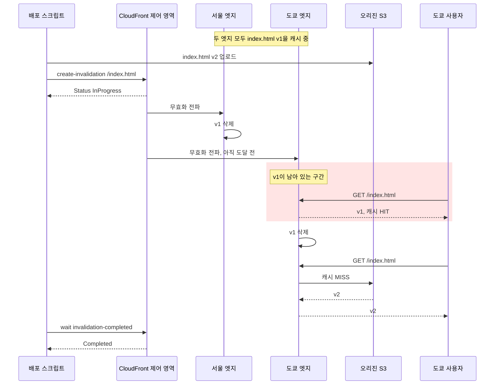
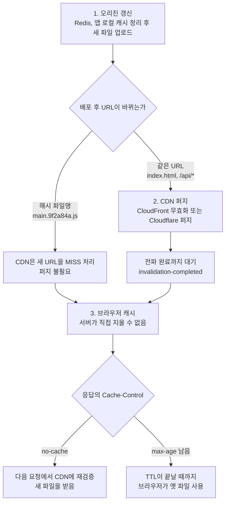

# CDN 캐시 무효화 정책 (CloudFront 중심, Cloudflare 비교)

CloudFront 같은 CDN은 엣지 로케이션(POP)에 콘텐츠를 캐싱해두고 요청 시 빠르게 제공한다.
콘텐츠가 변경되었을 때, 캐시된 오래된 파일을 어떻게 갱신할 것인가가 관건이다. 이 작업을 **Cache Invalidation(무효화)** 이라고 한다. Cloudflare에서는 같은 작업을 퍼지(purge)라고 부른다. 본문은 CloudFront 기준으로 쓰고, 10장에서 Cloudflare 퍼지 방식을 비교한다.

---

## 1. 캐시 무효화란?

CDN에 이미 저장된 캐시를 강제로 지워버리는 작업이다.
무효화 이후 다음 요청부터는 오리진 서버(S3, EC2 등)에서 새로운 콘텐츠를 가져온다.

무효화는 캐시 만료(Expiration)와 다르다. 만료는 TTL이나 Cache-Control 헤더에 의해 자연스럽게 캐시가 사라지는 것이고, 무효화는 TTL과 무관하게 수동으로 즉시 제거하는 것이다.

---

## 2. 무효화가 필요한 시점

- 정적 파일(HTML, JS, CSS, 이미지 등)을 배포했는데 변경사항이 반영되지 않을 때
- 긴 TTL로 캐싱해놨지만 긴급하게 파일을 바꿔야 할 때
- 앱 업데이트 후 웹 클라이언트가 구버전 JS 파일을 계속 받을 때
- 동일한 URL 경로에 다른 콘텐츠가 업로드됐을 때

---

## 3. 무효화 방법

### 3.1 AWS Console에서 수동 무효화

1. CloudFront 콘솔 접속
2. 배포 ID 클릭 → "Invalidations" 탭
3. "Create Invalidation" 클릭
4. 무효화 경로 입력

```
/index.html
/main.js
/images/*
```

`*` 와일드카드를 지원한다. 예: `/static/*`

### 3.2 AWS CLI로 무효화

```bash
aws cloudfront create-invalidation \
  --distribution-id YOUR_DIST_ID \
  --paths "/index.html" "/main.js"
```

여러 경로를 한 번에 지정할 수 있다. 동시에 진행 중일 수 있는 일반 경로는 3,000개, 와일드카드 경로는 15개가 기본 한도다([Invalidation 문서](https://docs.aws.amazon.com/AmazonCloudFront/latest/DeveloperGuide/Invalidation.html)). 한도에 걸리면 이전 무효화가 끝날 때까지 새 요청이 거절되므로 배포가 몰리는 시간대에는 요청을 합쳐서 보내야 한다. 와일드카드 하나는 경로 1개로 카운트된다.

쿼리스트링을 캐시 키에 넣은 배포라면 무효화 경로에도 쿼리스트링을 붙여야 한다. `/api/list`만 무효화하면 `/api/list?page=1` 사본은 남는다. 이 경우 `/api/list*`로 묶는 편이 낫다.

---

## 4. CI/CD 파이프라인 연동

배포할 때마다 수동으로 무효화를 실행하면 빠뜨리는 경우가 생긴다. GitHub Actions에 무효화 단계를 추가해두면 배포 직후 자동으로 실행된다.

### 4.1 GitHub Actions + AWS CLI

```yaml
name: Deploy to S3 and Invalidate CloudFront

on:
  push:
    branches: [main]

jobs:
  deploy:
    runs-on: ubuntu-latest
    steps:
      - uses: actions/checkout@v3

      - name: Configure AWS credentials
        uses: aws-actions/configure-aws-credentials@v2
        with:
          aws-access-key-id: ${{ secrets.AWS_ACCESS_KEY_ID }}
          aws-secret-access-key: ${{ secrets.AWS_SECRET_ACCESS_KEY }}
          aws-region: ap-northeast-2

      - name: Build
        run: npm ci && npm run build

      - name: Upload to S3
        run: |
          aws s3 sync ./dist s3://${{ secrets.S3_BUCKET }} \
            --delete \
            --cache-control "max-age=31536000,immutable" \
            --exclude "index.html"
          aws s3 cp ./dist/index.html s3://${{ secrets.S3_BUCKET }}/index.html \
            --cache-control "no-cache,no-store,must-revalidate"

      - name: Invalidate CloudFront cache
        run: |
          aws cloudfront create-invalidation \
            --distribution-id ${{ secrets.CLOUDFRONT_DIST_ID }} \
            --paths "/index.html"
```

여기서 핵심은 JS/CSS 파일에는 장기 캐시를 적용하고, `index.html`만 무효화하는 구조다. JS/CSS는 빌드 시 파일명에 해시가 붙으므로 URL 자체가 바뀐다.

### 4.2 GitHub Actions + AWS SDK (Node.js)

CLI 대신 SDK를 써야 하는 경우(빌드 결과에서 변경된 파일만 선별해서 무효화하는 등)에는 스크립트를 직접 작성한다.

```javascript
// scripts/invalidate-cloudfront.mjs
import {
  CloudFrontClient,
  CreateInvalidationCommand,
} from "@aws-sdk/client-cloudfront";

const client = new CloudFrontClient({ region: "ap-northeast-2" });

async function invalidate(distributionId, paths) {
  const command = new CreateInvalidationCommand({
    DistributionId: distributionId,
    InvalidationBatch: {
      CallerReference: `deploy-${Date.now()}`,
      Paths: {
        Quantity: paths.length,
        Items: paths,
      },
    },
  });

  const response = await client.send(command);
  console.log(
    "Invalidation ID:",
    response.Invalidation.Id,
    "Status:",
    response.Invalidation.Status
  );
}

// 변경된 파일 경로만 골라서 무효화
const changedPaths = process.argv.slice(2);
await invalidate(process.env.CLOUDFRONT_DIST_ID, changedPaths);
```

```yaml
# GitHub Actions 단계에서 호출
- name: Invalidate changed files
  run: |
    CHANGED=$(git diff --name-only HEAD~1 HEAD -- dist/ | sed 's|^dist||')
    node scripts/invalidate-cloudfront.mjs $CHANGED
```

변경된 파일만 무효화하는 방식은 비용 측면에서 유리하지만, 빌드 아티팩트와 Git diff를 맞추는 게 까다롭다. 단순히 `index.html`만 무효화하는 게 실수할 여지가 적다.

---

## 5. Terraform으로 자동 무효화

인프라를 Terraform으로 관리하는 경우, `null_resource`와 `local-exec`를 조합해서 배포 시 무효화를 자동으로 실행할 수 있다.

```hcl
resource "null_resource" "invalidate_cloudfront" {
  # S3 버킷에 파일이 업로드될 때마다 트리거
  triggers = {
    s3_etag = aws_s3_object.frontend.etag
  }

  provisioner "local-exec" {
    command = <<EOT
      aws cloudfront create-invalidation \
        --distribution-id ${aws_cloudfront_distribution.main.id} \
        --paths "/index.html"
    EOT
  }

  depends_on = [aws_s3_object.frontend]
}
```

`triggers`의 `s3_etag` 값이 바뀔 때만 실행된다. S3 파일이 그대로면 무효화도 실행하지 않는다.

`local-exec`는 Terraform을 실행하는 머신에서 AWS CLI가 설치되어 있고 적절한 권한이 있어야 동작한다. CI/CD 파이프라인에서 Terraform을 실행한다면 파이프라인 IAM 역할에 `cloudfront:CreateInvalidation` 권한을 추가해야 한다.

---

## 6. 무효화 비용과 경로 범위

CloudFront 무효화는 매월 기본 1,000개 경로가 무료다. 그 이후부터 경로 1개당 $0.005가 과금된다.

### 비용이 예상보다 많이 나오는 경우

와일드카드(`/*`)로 무효화를 요청하면 경로 1개로 카운트된다. 그런데 팀에서 이 사실을 모르고 배포 스크립트마다 `/*`를 쓰면 경로 개수는 적지만 실제 무효화 범위가 전체가 된다.

반대로 배포 스크립트에서 변경된 파일 경로를 하나씩 나열하면 경로 수가 늘어난다. 예를 들어 파일 200개를 개별 경로로 무효화하면 무료 한도(1,000개)가 하루 5번 배포만 해도 소진된다.

실무에서 자주 겪는 패턴:
- 매 배포마다 `/static/*`, `/assets/*`를 각각 무효화하도록 스크립트 작성
- 하루 배포 10회 × 경로 2개 = 20개/일 → 월 600개 (무료 범위 내)
- 배포 빈도가 올라가면 어느 순간 무료 한도를 초과하기 시작

무효화 경로는 변경이 발생한 디렉토리 단위로 범위를 제한하는 게 낫다. `/static/*` 대신 `/static/js/*`와 `/static/css/*`로 나누거나, `index.html` 하나만 무효화하고 나머지는 파일명 해시에 의존하는 구조가 비용 측면에서 안정적이다.

---

## 7. 무효화 전파 지연 문제

`create-invalidation`을 실행했다고 해서 즉시 모든 엣지에 반영되는 게 아니다. CloudFront는 전 세계 수백 개의 엣지 로케이션에 무효화 명령을 전파하는데, 이 과정이 보통 수 초에서 수 분 걸린다.

### 실제로 겪는 상황

- 배포 완료 후 `index.html` 무효화 요청을 보냄
- 서울 엣지에서는 즉시 반영됨
- 도쿄, 싱가포르 엣지에서는 1~3분 동안 구버전 HTML을 계속 응답
- 이 사이에 도쿄에서 접속한 사용자는 구버전 HTML + 신버전 JS를 받아서 앱이 깨짐

아래 시퀀스에서 붉게 칠한 구간이 일부 엣지만 옛 파일을 서빙하는 시간이다. 무효화 요청이 접수된 시점과 도쿄 엣지에서 사본이 지워지는 시점 사이가 그 구간이고, 배포 스크립트가 `InProgress` 응답을 받고 끝나버리면 이 구간은 아무도 보지 않는다.



서울 엣지는 첫 요청부터 v2를 받고, 도쿄 엣지는 `T->>T: v1 삭제` 전까지 v1을 내보낸다. 전파가 끝나는 시점은 엣지마다 다르기 때문에 `Completed`가 떨어지기 전에 트래픽을 전환하거나 검증 요청을 날리면 엣지마다 결과가 갈린다.

### 대응 방법

**방법 1: 파일명 해시로 JS/CSS 버전 관리**

`index.html`을 제외한 모든 정적 파일은 빌드 시 해시를 붙인다.
`main.abc123.js`로 파일명이 바뀌면 구버전 HTML이 `main.abc123.js`를 요청해도 문제가 없다. 신버전 HTML이 배포되기 전까지 구버전 HTML은 구버전 JS 파일명을 참조하기 때문이다.

**방법 2: 배포 완료 후 일정 시간 대기**

무효화 요청 후 모든 엣지에 전파가 완료되었는지 상태를 확인한다.

```bash
INVALIDATION_ID=$(aws cloudfront create-invalidation \
  --distribution-id $DIST_ID \
  --paths "/index.html" \
  --query 'Invalidation.Id' \
  --output text)

# 전파 완료될 때까지 대기 (보통 30초~3분)
aws cloudfront wait invalidation-completed \
  --distribution-id $DIST_ID \
  --id $INVALIDATION_ID

echo "Invalidation completed"
```

`aws cloudfront wait invalidation-completed`는 완료될 때까지 폴링하다가 완료 시 반환한다.

**방법 3: HTML에서 JS 경로를 절대 경로로 참조**

`index.html`이 항상 최신 해시가 붙은 파일명을 참조하므로, 구버전 HTML과 신버전 HTML이 동시에 서비스되더라도 각자 자신의 JS/CSS 버전을 정확히 참조한다.

---

## 8. 캐시 계층별 무효화 순서

CloudFront 무효화만 해도 충분한 경우가 많지만, 앱 서버 자체에 로컬 캐시나 Redis 캐시가 있다면 순서를 맞춰야 한다. 원칙은 오리진에 가까운 계층부터 지우고, 사용자에게 가까운 CDN을 마지막에 지우는 것이다.

```text
Redis → 앱 로컬 캐시 → CDN(CloudFront) → 브라우저(서버에서 지울 수 없음)
```

CDN을 먼저 지우면 문제가 생긴다. 무효화 직후 들어온 첫 요청이 CDN MISS로 앱까지 내려오는데, 이때 앱이나 Redis에 구버전이 남아 있으면 구버전을 받아서 CDN에 다시 캐싱한다. 방금 지운 사본이 새 TTL을 달고 되살아나는 셈이고, 무효화를 한 번 더 실행해야 한다.

아래 flowchart는 오리진 갱신부터 브라우저까지의 순서와, 파일명 해시를 쓰는 경우와 같은 URL을 무효화하는 경우의 분기를 보여 준다. 해시 파일명 쪽은 CDN 퍼지 단계를 건너뛰고, 브라우저 캐시는 어느 경로로 가든 `Cache-Control`에 달려 있다는 점을 보면 된다.



해시 파일명 쪽에서 하나 주의할 게 있다. 위 4.1의 `aws s3 sync --delete`는 새 배포에 없는 옛 해시 파일을 S3에서 바로 지운다. 아직 옛 `index.html`을 캐시한 엣지나 브라우저가 `main.old123.js`를 요청하면 오리진에서 403이나 404가 난다. 옛 해시 파일은 한두 배포 주기 동안 남겨두고 정리하는 편이 안전하다.

### 계층별 무효화 예제

```bash
#!/bin/bash

DIST_ID=$1
APP_ENDPOINT=$2
CACHE_KEY_PATTERN=$3

echo "1. Clearing Redis cache..."
redis-cli -h "$REDIS_HOST" -p 6379 \
  --scan --pattern "$CACHE_KEY_PATTERN" \
  | xargs -r redis-cli -h "$REDIS_HOST" -p 6379 DEL

echo "2. Clearing app local cache..."
curl -X POST "$APP_ENDPOINT/internal/cache/clear" \
  -H "Authorization: Bearer $INTERNAL_TOKEN"

echo "3. Invalidating CloudFront..."
aws cloudfront create-invalidation \
  --distribution-id "$DIST_ID" \
  --paths "/api/*"
```

`xargs -r`을 빼면 매칭되는 키가 없을 때 인자 없는 `DEL`이 실행되어 에러가 난다. 앱 로컬 캐시(예: Guava Cache, Caffeine)를 별도로 지우는 API는 인스턴스가 여러 대면 한 대에만 호출되기 쉽다. 로드밸런서 뒤에서 `curl` 한 번으로 끝내면 나머지 인스턴스의 캐시는 그대로 남는다. 인스턴스 목록을 순회하거나, 로컬 캐시 TTL을 짧게 두고 무효화 대상에서 빼는 쪽이 낫다.

---

## 9. 버전 태깅으로 무효화 최소화

무효화를 자주 실행하는 구조 자체를 피하는 방법이 있다.

### 해시 기반 파일명

```text
main.9f2a84a.js
style.d43dc0c.css
```

파일이 변경되면 파일명 자체가 바뀌므로 무효화가 불필요하다. Webpack, Vite, Create React App은 빌드 시 자동으로 해시를 붙여준다.

이 구조에서는 `index.html`만 무효화하면 된다. JS/CSS 파일은 URL이 달라지므로 기존 캐시와 충돌하지 않는다.

```yaml
# S3 업로드 시 파일 유형별로 다른 Cache-Control 적용
- name: Upload assets (hashed, long cache)
  run: |
    aws s3 sync ./dist/assets s3://$BUCKET/assets \
      --cache-control "max-age=31536000,immutable"

- name: Upload index.html (no cache)
  run: |
    aws s3 cp ./dist/index.html s3://$BUCKET/index.html \
      --cache-control "no-cache,no-store,must-revalidate"
```

`index.html`을 `no-cache`로 설정하면 브라우저와 CDN이 매번 오리진에서 검증한다. 이렇게 하면 CloudFront 무효화 없이도 새로운 `index.html`을 빠르게 반영할 수 있다.

---

## 10. TTL 설정

CloudFront는 TTL을 통해 콘텐츠의 캐시 수명을 조절한다.

- **MinTTL**: 최소 TTL. 이 시간 이전에는 오리진 재검사하지 않음
- **DefaultTTL**: 기본 TTL. 오리진에서 Cache-Control 헤더가 없을 때 사용
- **MaxTTL**: 최대 TTL. 오리진에서 너무 긴 TTL을 지정하더라도 이 값을 넘지 못함

```text
DefaultTTL: 86400 (1일)
MinTTL: 0
MaxTTL: 31536000 (1년)
```

오리진의 `Cache-Control` 헤더가 있으면 그 값을 우선 사용한다. S3에서 파일별로 `Cache-Control` 메타데이터를 다르게 설정하면 CloudFront 배포 설정과 무관하게 파일 단위로 TTL을 조절할 수 있다.

---

## 11. Cloudflare 퍼지와 CloudFront 무효화 비교

Cloudflare는 퍼지 단위가 CloudFront보다 다양하다. 특히 `Cache-Tag` 응답 헤더로 객체에 태그를 붙여두고 태그 단위로 지우는 기능은 CloudFront에 대응하는 게 없다. CloudFront는 경로 기반이라 지울 단위를 미리 URL 구조로 설계해야 한다.

| 항목 | CloudFront 무효화 | Cloudflare 퍼지 |
|---|---|---|
| 지정 단위 | 경로, 경로 끝 `*` 와일드카드 | URL, prefix, 호스트, 태그, 전체 |
| 태그 퍼지 | 없음 | 있음. 응답의 `Cache-Tag` 헤더 기준 |
| 전체 삭제 | `/*` (경로 1개로 카운트) | `purge_everything` |
| 쿼리스트링 | 캐시 키에 포함한 쿼리는 경로에 붙여야 함 | 캐시 키에 포함한 쿼리는 URL에 붙여야 함 |
| 비용 | 월 1,000경로 무료, 초과분 경로당 $0.005 | 퍼지 호출 자체는 과금 없음 |
| 요청 한도 | 동시 진행 중 일반 경로 3,000개, 와일드카드 15개 | 계정당 초당 URL 수 Free 800, Pro·Business 1,500, Enterprise 3,000 |
| 요청당 URL 수 | 요청당 경로 수는 위 동시 진행 한도에 포함 | Free·Pro·Business 100개, Enterprise 500개 |
| 태그·prefix·호스트 퍼지 | 해당 없음 | 전 플랜 사용 가능, Free는 분당 5회 수준의 요청 한도 |
| 전파 시간 | 보통 수십 초에서 수 분 | 수 초 이내를 표방, 공식 수치는 문서 확인 |

Cloudflare 수치는 [Purge cache 문서](https://developers.cloudflare.com/cache/how-to/purge-cache/) 기준이고 플랜 정책이 바뀌는 항목이라 적용 전에 다시 확인해야 한다. 전파 시간은 두 CDN 모두 배포 시점의 실측이 낫다. 문서의 수치를 그대로 믿고 `sleep`을 넣었다가 엣지 한 곳에서 구버전이 나가는 경우가 있다.

Cloudflare 퍼지는 API로 호출한다. 토큰에는 Cache Purge 권한만 준다.

```bash
# URL 단위
curl -X POST "https://api.cloudflare.com/client/v4/zones/$ZONE_ID/purge_cache" \
  -H "Authorization: Bearer $CF_API_TOKEN" \
  -H "Content-Type: application/json" \
  --data '{"files":["https://example.com/index.html"]}'

# 태그 단위: 오리진이 응답에 Cache-Tag: product-123,category-9 를 붙여둔 경우
curl -X POST "https://api.cloudflare.com/client/v4/zones/$ZONE_ID/purge_cache" \
  -H "Authorization: Bearer $CF_API_TOKEN" \
  -H "Content-Type: application/json" \
  --data '{"tags":["product-123"]}'

# prefix 단위: 스킴 없이 호스트부터 쓴다
curl -X POST "https://api.cloudflare.com/client/v4/zones/$ZONE_ID/purge_cache" \
  -H "Authorization: Bearer $CF_API_TOKEN" \
  -H "Content-Type: application/json" \
  --data '{"prefixes":["example.com/static/"]}'
```

`{"purge_everything":true}`는 모든 사본을 한 번에 지우므로 직후 오리진 요청이 몰린다. CloudFront의 `/*`도 같은 문제가 있어서 둘 다 장애 복구 같은 상황이 아니면 쓰지 않는 게 좋다.

### CDN을 바꿀 때는 양쪽을 다 퍼지한다

CloudFront와 Cloudflare를 같이 쓰는 기간이 있다. 전환 중이거나 Cloudflare를 앞에 두고 CloudFront를 오리진으로 쓰는 구성이다. 이때는 퍼지 대상이 두 곳이고, 순서는 8장과 같다. 오리진에 가까운 쪽을 먼저, 사용자에 가까운 쪽을 나중에 지운다.

1. 오리진 갱신 (Redis, 앱 캐시 포함)
2. CloudFront 무효화, `aws cloudfront wait invalidation-completed`로 완료 확인
3. Cloudflare 퍼지

CloudFront 무효화가 끝나기 전에 Cloudflare를 먼저 지우면, Cloudflare가 MISS로 CloudFront에 내려와 아직 남아 있는 옛 사본을 가져가서 새 TTL로 다시 캐싱한다. 전환 방향이 어느 쪽이든 DNS 변경 전에 기존 CDN을 퍼지해야 하고, DNS TTL과 기존 캐시 TTL이 겹치는 구간은 퍼지로 줄어들지 않는다. 이 구간 계산과 전환 순서는 [Cloudflare vs CloudFront의 CDN 전환 시 stale 콘텐츠](../../Cloudflare/Cloudflare_vs_Cloud_Front.md#cdn-전환-시-stale-콘텐츠)에 정리해 두었다.

## 참고 자료

- [CloudFront Invalidation 공식 문서](https://docs.aws.amazon.com/AmazonCloudFront/latest/DeveloperGuide/Invalidation.html)
- [CloudFront 가격 정책](https://aws.amazon.com/cloudfront/pricing/)
- [Cloudflare Purge cache 문서](https://developers.cloudflare.com/cache/how-to/purge-cache/)
- [웹 정적 리소스 캐싱](https://developer.mozilla.org/en-US/docs/Web/HTTP/Caching)
