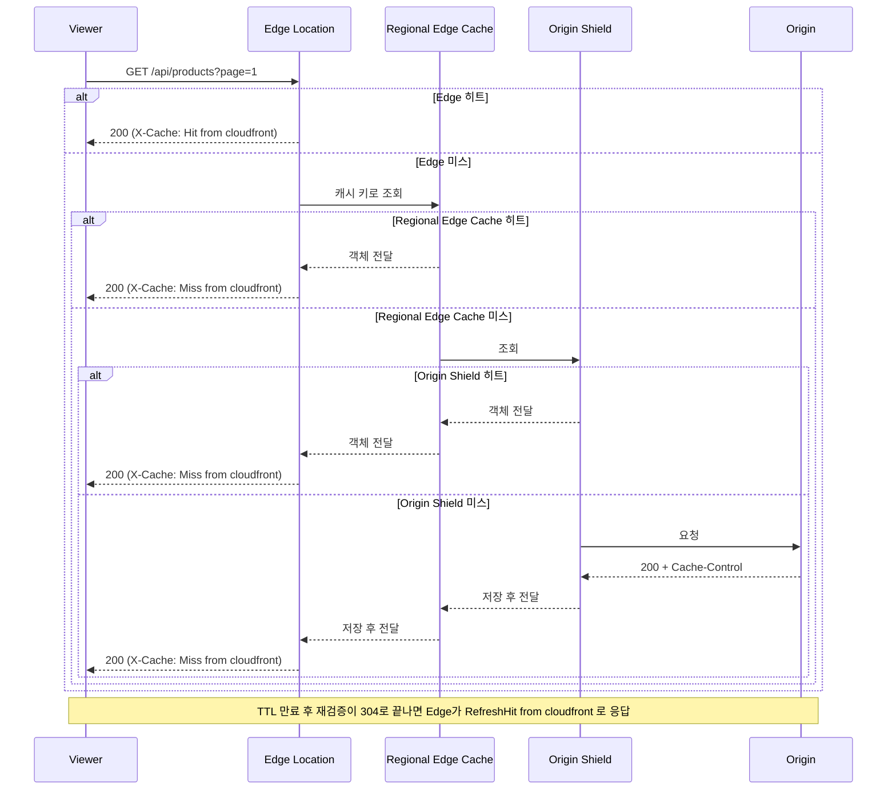
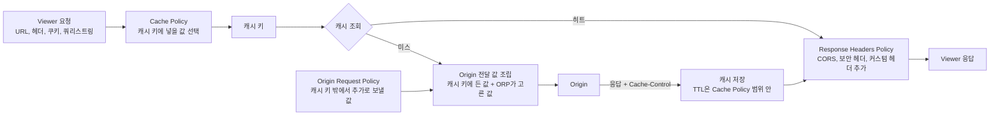
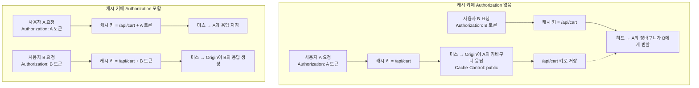
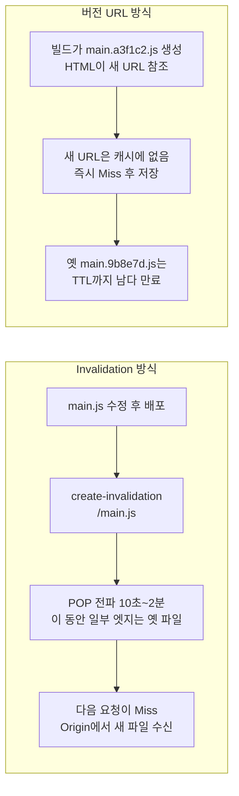
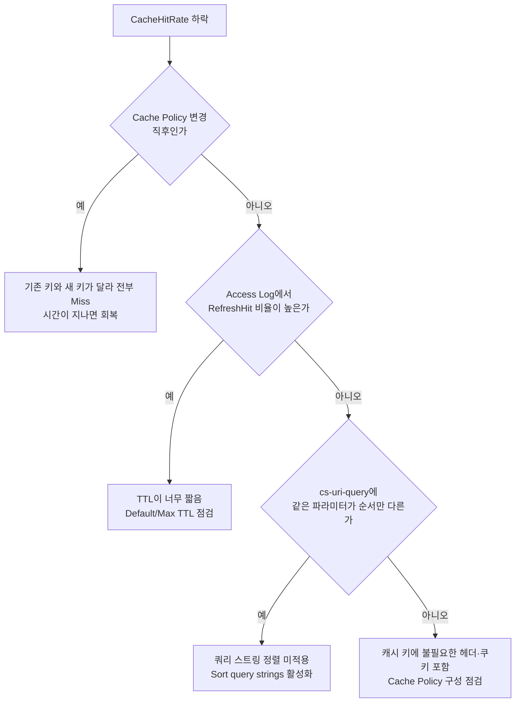
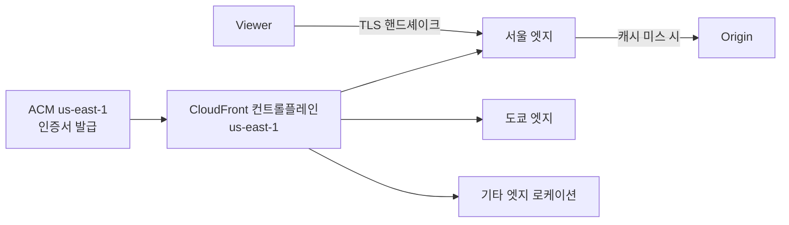
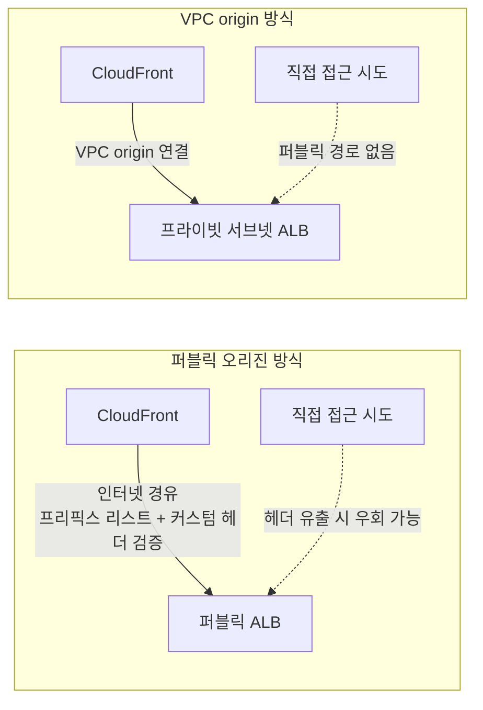

# AWS CloudFront

CloudFront는 전 세계 POP(Point of Presence) 서버에 콘텐츠를 캐싱해 가까운 곳에서 전달하는 AWS CDN 서비스다. Cloudflare와의 제품 비교는 [Cloudflare vs CloudFront](../../Cloudflare/Cloudflare_vs_Cloud_Front.md)에 있다.

CloudFront는 리전 서비스가 아니다. 배포(Distribution)를 생성하면 특정 리전에 귀속되지 않고, AWS가 운영하는 400개 이상의 엣지 로케이션 전체에 설정이 전파된다. 콘솔에서 리전 선택 없이 `us-east-1`로 고정된 것처럼 보이는 이유는 CloudFront 컨트롤플레인 자체가 us-east-1에 있어서다. 배포 ID(`E1234ABCD...`)는 리전 코드를 포함하지 않는다.

이 구조가 운영에서 의미를 갖는 상황이 두 가지 있다.

첫째, 배포 설정 변경은 전 세계 동시 전파가 아니라 순차 전파다. 설정을 바꾸면 `InProgress` → `Deployed` 전환에 보통 수분이 걸리는데, 이 시간 동안 일부 엣지는 새 설정으로, 다른 엣지는 구 설정으로 동작한다. 설정 변경 직후 지역마다 동작이 다르게 보이면 전파 중인 상태다.

둘째, ACM 인증서는 반드시 us-east-1에서 발급해야 한다. 이유는 아래 SSL 섹션에서 설명한다.

---

## 작동 흐름

캐시 계층은 엣지 하나로 끝나지 않는다. 엣지 로케이션에서 미스가 나면 Regional Edge Cache(자동, 끌 수 없다)를 거치고, Origin Shield를 켜 두었다면 그 뒤에 한 겹이 더 있다. 아래 시퀀스에서 각 계층이 어느 시점에 응답을 끊는지, 그때 뷰어가 받는 `X-Cache` 값이 뭔지 본다.



첫 요청 시 Origin에서 받아온 응답은 지나온 계층마다 저장된다. 이후 요청은 TTL이 남아있는 동안 가까운 계층에서 끊긴다. TTL 만료 또는 Invalidation이 발생하면 다음 요청에서 Origin을 다시 호출한다.

응답 헤더에서 `X-Cache`로 엣지 기준 히트 여부를 확인할 수 있다.

```
X-Cache: Hit from cloudfront    # 엣지 캐시 히트
X-Cache: Miss from cloudfront   # 엣지 미스, 상위 계층 또는 Origin 호출
X-Cache: RefreshHit from cloudfront  # TTL 만료 후 Origin 재검증 통과 (304)
```

`X-Cache`는 뷰어에게 보이는 엣지 시점의 결과라서 Regional Edge Cache나 Origin Shield에서 끊겼는지 Origin까지 갔는지는 구분하지 않는다. 계층별로 보려면 Access Log의 `x-edge-detailed-result-type`을 본다. Origin Shield 히트는 `OriginShieldHit`으로 따로 찍힌다. Origin 서버 로그에 요청이 얼마나 찍히는지와 엣지 `Miss` 비율이 크게 어긋나면 상위 계층이 미스를 흡수하고 있는 것이다.

---

## Cache Policy 실제 설정

Cache Policy는 두 가지를 정의한다: 캐시 키 구성과 TTL.

### TTL 우선순위

| 조건 | 적용되는 TTL |
|------|-------------|
| Origin이 `Cache-Control: max-age=N` 반환 | min(N, Max TTL) |
| Origin이 `Cache-Control: s-maxage=N` 반환 | min(N, Max TTL) (CDN 전용 지시어, max-age보다 우선) |
| Origin이 Cache-Control 헤더 없음 | Default TTL |
| Origin이 `Cache-Control: no-cache` | Min TTL 적용 |

Cache Policy의 Max TTL이 Origin 헤더보다 강제 제한이다. Origin이 `max-age=86400`을 보내도 Max TTL이 3600이면 3600초 후에 재검증한다.

### AWS CLI로 커스텀 Cache Policy 생성

```bash
aws cloudfront create-cache-policy \
  --cache-policy-config '{
    "Name": "ProductsAPIPolicy",
    "DefaultTTL": 3600,
    "MinTTL": 0,
    "MaxTTL": 86400,
    "ParametersInCacheKeyAndForwardedToOrigin": {
      "EnableAcceptEncodingGzip": true,
      "EnableAcceptEncodingBrotli": true,
      "HeadersConfig": {
        "HeaderBehavior": "none"
      },
      "CookiesConfig": {
        "CookieBehavior": "none"
      },
      "QueryStringsConfig": {
        "QueryStringBehavior": "whitelist",
        "QueryStrings": {
          "Quantity": 2,
          "Items": ["page", "limit"]
        }
      }
    }
  }'
```

AWS 관리 콘솔에서는 CloudFront → Policies → Cache → Create cache policy 경로로 동일한 설정을 GUI로 만들 수 있다.

### 기본 제공 정책

`CachingDisabled` — 모든 요청을 Origin으로 전달한다. 동적 API, 인증 필요 엔드포인트에 쓴다.

`CachingOptimized` — 쿼리 스트링, 헤더, 쿠키를 캐시 키에서 제외한다. URL 경로만으로 캐시를 구분하므로 정적 파일에 적합하다.

`CachingOptimizedForUncompressedObjects` — gzip/brotli 협상 없이 캐시한다. 이미 압축된 파일(jpg, mp4 등)에 쓴다.

---

## Cache-Control 헤더 동작 방식

Origin 서버가 내려보내는 `Cache-Control` 헤더가 CloudFront 동작에 영향을 준다. 헤더 종류별로 동작이 다르다.

```
Cache-Control: public, max-age=3600
  → CloudFront 캐시 O, 브라우저 캐시 O (1시간)

Cache-Control: private, max-age=300
  → CloudFront 캐시 X, 브라우저 캐시 O (5분)

Cache-Control: no-cache
  → 저장은 하되 매번 Origin에 재검증 요청 (ETag 활용)
  → CloudFront는 Min TTL만큼 캐시 후 재검증

Cache-Control: no-store
  → CloudFront 캐시 X, 브라우저 캐시 X

Cache-Control: s-maxage=7200, max-age=3600
  → CloudFront 2시간 캐시, 브라우저 1시간 캐시
  → s-maxage는 CDN(공유 캐시) 전용. 브라우저는 max-age를 본다
```

`s-maxage`는 CDN에만 적용되는 지시어라 브라우저와 CDN의 TTL을 다르게 가져가야 할 때 유용하다. API 응답을 CDN에서 10분 캐시하면서 브라우저에는 30초만 캐시하려면 `s-maxage=600, max-age=30`으로 설정한다.

`ETag`와 `If-None-Match`를 함께 쓰면 콘텐츠가 바뀌지 않았을 때 304 응답으로 데이터 전송을 줄인다. CloudFront는 304를 받으면 캐시의 TTL을 갱신하고 기존 데이터를 계속 서빙한다.

---

## Origin Request Policy

Cache Policy와 별개로 Origin Request Policy가 있다. Cache Policy는 캐시 키를 정의하고, Origin Request Policy는 Origin에 전달할 헤더·쿠키·쿼리 스트링을 정의한다.

캐시 키에는 포함하지 않지만 Origin에는 전달해야 하는 경우에 쓴다.

```
사용자 요청: Accept-Language: ko-KR, User-Agent: Mozilla/...

Cache Policy:    캐시 키 = URL + page 파라미터만
Origin Request Policy: Accept-Language, CloudFront-Viewer-Country 전달
```

이 구성에서 CloudFront는 URL + page 파라미터 조합으로 캐시를 찾는다. 캐시 미스 시 Origin에는 Accept-Language와 CloudFront-Viewer-Country 헤더까지 붙여 전달한다.

### AWS CLI로 Origin Request Policy 생성

```bash
aws cloudfront create-origin-request-policy \
  --origin-request-policy-config '{
    "Name": "ForwardLanguage",
    "HeadersConfig": {
      "HeaderBehavior": "whitelist",
      "Headers": {
        "Quantity": 2,
        "Items": ["Accept-Language", "CloudFront-Viewer-Country"]
      }
    },
    "CookiesConfig": {
      "CookieBehavior": "none"
    },
    "QueryStringsConfig": {
      "QueryStringBehavior": "all"
    }
  }'
```

### 기본 제공 정책

`AllViewer` — 사용자의 모든 헤더, 쿠키, 쿼리 스트링을 그대로 Origin에 전달한다.

`AllViewerExceptHostHeader` — Host 헤더만 빼고 전달한다. Origin이 CloudFront 도메인 대신 원래 도메인 헤더가 필요한 경우에 쓴다.

`CORS-S3Origin` — S3 Origin에 CORS 관련 헤더를 전달한다.

주의할 점은 Origin Request Policy에 캐시 키에 없는 헤더를 넣어도 히트율에 영향을 주지 않는다는 것이다. 캐시 키는 Cache Policy만 결정한다. Origin Request Policy는 캐시 미스 때 Origin에 뭘 보낼지만 제어한다.

### 세 정책이 닿는 자리

Behavior 하나에는 Cache Policy, Origin Request Policy, Response Headers Policy를 각각 하나씩 붙인다. 세 정책이 요청·응답 경로의 서로 다른 지점에 작용한다. 아래 도식은 캐시 키가 만들어지는 곳, Origin으로 나가는 요청이 만들어지는 곳, 뷰어에게 나가는 응답이 가공되는 곳을 나눠 보여준다.



Cache Policy에서 캐시 키에 넣은 값은 Origin Request Policy에 적지 않아도 Origin에 전달된다. 반대로 Origin Request Policy만으로 넣은 값은 키에 반영되지 않는다. Response Headers Policy는 캐시된 객체를 바꾸지 않고 응답이 뷰어로 나갈 때 헤더를 얹는다. 히트든 미스든 같은 헤더가 붙고, 캐시 키와 Origin 요청에는 영향이 없다. 그래서 CORS 헤더를 Origin 코드에서 내리다가 Response Headers Policy로 옮겨도 히트율은 그대로다.

---

## 캐시 키 설계와 히트율

캐시 키에 무엇을 포함하는지가 히트율을 결정한다. 키가 복잡할수록 같은 캐시를 재사용하는 요청이 줄어든다.

### 쿼리 스트링 순서 문제

CloudFront는 캐시 키를 문자열 비교로 처리한다. `?page=1&limit=10`과 `?limit=10&page=1`은 다른 캐시 키다.

```
GET /api/products?page=1&limit=10&sort=price   (캐시 키 A)
GET /api/products?sort=price&page=1&limit=10   (캐시 키 B — 미스)
GET /api/products?limit=10&sort=price&page=1   (캐시 키 C — 미스)
```

세 요청 모두 동일한 Origin 응답을 받지만 CloudFront에서는 세 번의 Origin 요청이 발생한다.

Cache Policy에서 Query strings를 `All`로 설정하고 `Sort query strings`를 활성화하면 CloudFront가 쿼리 파라미터를 알파벳순으로 정렬한 뒤 캐시 키를 만들어 순서에 관계없이 동일 캐시로 처리한다.

### 경로별 정책 분리

단일 CloudFront 배포에서 경로마다 다른 Cache Policy를 적용하는 것이 일반적인 구성이다.

```
Path Pattern: /static/*
  Cache Policy: CachingOptimized (TTL: 86400초)

Path Pattern: /api/products/*
  Cache Policy: Custom (쿼리스트링 포함, TTL: 3600초)

Path Pattern: /api/user/*
  Cache Policy: CachingDisabled

Path Pattern: /api/stats/*
  Cache Policy: Custom (TTL: 300초)
```

Default(`*`) Behavior가 가장 낮은 우선순위다. 명시적 경로 패턴이 먼저 매칭된다.

---

## Authorization 헤더와 캐시 — 데이터 혼용 사고

Authorization 헤더가 있는 응답에 `Cache-Control: public, max-age=3600`을 붙이면 CloudFront가 그 응답을 캐시에 저장한다. 이 상태에서 다른 사용자가 같은 URL로 요청하면 첫 번째 사용자의 응답이 그대로 반환된다.

```
GET /api/cart
Authorization: Bearer <user-A-token>
→ Cache-Control: public, max-age=300  ← Origin 실수
→ CloudFront가 캐시 저장

GET /api/cart
Authorization: Bearer <user-B-token>
→ Cache Key: /api/cart (Authorization 미포함)
→ user-A의 장바구니 데이터 반환
```

캐시 키에 Authorization 헤더가 들어 있는지에 따라 같은 요청이 어떻게 갈라지는지 비교한다. 왼쪽이 사고가 난 구성이고 오른쪽이 키에 헤더를 넣은 구성이다.



키에 헤더를 넣으면 데이터 혼용은 막힌다. 대신 토큰이 사용자마다, 로그인 세션마다 다르니 사실상 모든 요청이 다른 키가 되어 히트율이 0에 가까워진다. 캐시 비용만 들고 이득은 없는 구성이라 사용자별 응답에는 키에 헤더를 넣는 방식보다 아래의 `private`·`CachingDisabled` 쪽을 쓴다. 공개 데이터만 내리는 경로와 사용자별 경로를 Path Pattern으로 분리하는 것이 먼저다.

방어법은 두 가지다.

첫째, Origin에서 사용자별 데이터를 반환하는 엔드포인트에는 `Cache-Control: private, no-store`를 명시한다. CloudFront는 `private` 또는 `no-store`가 붙은 응답을 캐시하지 않는다.

둘째, CloudFront Behavior에서 해당 경로(`/api/user/*`, `/api/cart/*`)에 `CachingDisabled` 정책을 적용한다. Origin의 헤더 설정과 무관하게 캐시가 동작하지 않는다.

Origin 서버가 Cache-Control을 제대로 내려보낸다 해도, 미들웨어나 프레임워크 기본 설정이 `public`을 붙이는 경우가 있다. 두 방어선을 모두 쓰는 편이 안전하다.

---

## Invalidation — 비용과 주의사항

데이터가 바뀌었는데 TTL이 남아있을 때 강제로 캐시를 삭제한다.

```bash
# 전체 무효화
aws cloudfront create-invalidation \
  --distribution-id E1234567890 \
  --paths "/*"

# 특정 경로만
aws cloudfront create-invalidation \
  --distribution-id E1234567890 \
  --paths "/api/products/*" "/images/banner.jpg"
```

### 비용 구조

월 1,000 invalidation path까지 무료다. 이후 path당 $0.005다.

`/*`는 와일드카드 하나지만 path 1건으로 계산한다. `/images/*`와 `/api/*`를 별도로 넣으면 2건이다. 와일드카드를 쓰면 건수를 줄일 수 있다.

주의할 점은 와일드카드(`*`)가 단일 경로 레벨에서만 동작한다는 것이다. `/api/*`는 `/api/products/list`는 무효화하지만 `/api/v2/products/list`는 무효화하지 않는다. 경로 구조가 깊으면 `/*`로 전체 무효화가 필요할 수 있다.

### 전파 시간

Invalidation은 요청 즉시 적용되지 않는다. 전 세계 POP에 전파되는 데 통상 10초~2분이 걸린다. `aws cloudfront wait invalidation-completed` 명령으로 완료를 기다릴 수 있다.

```bash
aws cloudfront wait invalidation-completed \
  --distribution-id E1234567890 \
  --id INVALIDATION_ID
```

### Invalidation 대신 버전 URL

정적 파일에는 빌드 시 파일명에 해시를 넣어(`main.a3f1c2.js`) Invalidation 없이 캐시를 갱신하는 방법을 쓴다. URL이 바뀌면 자동으로 새 캐시가 생기고 이전 파일은 TTL까지 유지된다.

배포를 자주 하는 프론트엔드 빌드라면 Invalidation 비용과 전파 지연을 피하면서 즉각적인 캐시 갱신이 가능하다.

같은 파일을 갱신할 때 두 방식이 캐시를 어떻게 다르게 다루는지 비교한다. Invalidation은 같은 URL의 캐시를 지우고 전파를 기다리지만, 버전 URL은 새 URL이 처음부터 미스로 시작해서 기다릴 일이 없다.



동적 데이터(API 응답)는 버전 URL 방식을 쓰기 어렵기 때문에 애초에 짧은 TTL을 설정하거나 Invalidation을 쓴다.

---

## 캐시 히트율 측정과 트러블슈팅

### CloudWatch 메트릭

CloudFront 배포당 CloudWatch에 `CacheHitRate` 메트릭이 쌓인다.

```bash
aws cloudwatch get-metric-statistics \
  --namespace AWS/CloudFront \
  --metric-name CacheHitRate \
  --dimensions Name=DistributionId,Value=E1234567890 \
              Name=Region,Value=Global \
  --start-time 2026-08-18T00:00:00Z \
  --end-time 2026-08-18T23:59:00Z \
  --period 3600 \
  --statistics Average
```

히트율이 갑자기 내려가는 경우 확인할 것들:

아래 순서도는 네 가지 원인을 어떤 증상으로 구분하는지 보여준다. 배포 시점과 겹치는지부터 보고, 아니면 Access Log의 `x-edge-result-type` 비율과 `cs-uri-query`를 본다.



**캐시 키에 불필요한 값이 포함된 경우** — 헤더 하나가 캐시 키에 들어가면 그 헤더 값이 다른 모든 요청이 별도 캐시를 만든다. Cache Policy에서 헤더 구성을 점검한다.

**쿼리 스트링 정렬 미적용** — 위에서 설명한 순서 문제다. CloudFront Access Log에서 `cs-uri-query` 필드를 보면 실제로 어떤 쿼리 스트링이 캐시 키로 들어갔는지 확인된다.

**TTL이 너무 짧은 경우** — 로그에서 `RefreshHit`와 `Miss` 비율을 보면 TTL 만료 빈도를 알 수 있다.

**배포 직후 히트율 급락** — Cache Policy를 변경하면 기존 캐시 키와 새 캐시 키가 달라져 한동안 전부 미스가 난다. 의도된 현상이므로 시간이 지나면 회복된다.

### Access Log 활성화

S3 버킷에 접근 로그를 남기면 `x-edge-result-type` 필드로 히트/미스를 분석할 수 있다.

```bash
aws cloudfront update-distribution \
  --id E1234567890 \
  --distribution-config '{
    "Logging": {
      "Enabled": true,
      "Bucket": "my-cf-logs.s3.amazonaws.com",
      "Prefix": "cloudfront/"
    }
  }'
```

`x-edge-result-type` 값:

| 값 | 의미 |
|----|------|
| `Hit` | 캐시 히트 |
| `Miss` | 캐시 미스, Origin 호출 |
| `RefreshHit` | TTL 만료 후 Origin 재검증 통과 |
| `Error` | Origin 오류 |
| `LimitExceeded` | 요청 한도 초과 |

### Origin Shield

Origin Shield는 POP와 Origin 사이에 추가 캐시 계층을 넣는다. 여러 리전의 POP에서 미스가 나더라도 Origin Shield에서 히트나면 Origin 호출이 줄어든다. Origin이 단일 리전에 있을 때 글로벌 트래픽을 받는 경우에 효과적이다.

```bash
# Origin 설정에서 Origin Shield 활성화
"OriginShield": {
  "Enabled": true,
  "OriginShieldRegion": "ap-northeast-2"
}
```

Origin Shield 추가 비용이 발생하므로 Origin 부하가 병목인 경우에만 켠다.

---

## Origin 유형

| Origin | 용도 |
|--------|------|
| S3 | 정적 웹사이트, 이미지, 빌드 산출물 |
| ALB | 백엔드 API, 서버 기반 웹서비스 |
| EC2 | 커스텀 서버 직접 연결 |
| API Gateway | Lambda 기반 서버리스 API |

---

## SSL 및 커스텀 도메인

HTTPS를 쓰려면 ACM 인증서가 필요하다. CloudFront용 인증서는 반드시 `us-east-1` 리전에서 발급해야 한다.

**왜 us-east-1인가.** TLS 핸드셰이크는 엣지 로케이션에서 발생한다. 엣지 로케이션은 특정 AWS 리전에 속하지 않는다 — 서울 엣지는 ap-northeast-2 리전 내 인프라가 아니라 AWS 글로벌 네트워크 위에 있다. CloudFront가 엣지에 인증서를 배포할 때 us-east-1 컨트롤플레인을 통해 전 세계 엣지로 밀어 넣는다. 그래서 us-east-1 ACM에서 발급한 인증서만 CloudFront가 가져갈 수 있다.

인증서가 엣지까지 가는 경로와 뷰어의 TLS 종단 위치를 아래에 그렸다. 발급 리전이 us-east-1이어야 하는 이유는 컨트롤플레인이 거기 있기 때문이고, 핸드셰이크 자체는 뷰어와 가까운 엣지에서 끝난다.



ap-northeast-2 같은 다른 리전에서 발급한 인증서는 CloudFront 배포 설정의 인증서 선택 목록 자체에 뜨지 않는다. CLI로 붙이려 해도 `InvalidViewerCertificate` 오류가 난다.

```bash
aws acm request-certificate \
  --domain-name "cdn.example.com" \
  --validation-method DNS \
  --region us-east-1   # 반드시 us-east-1
```

ACM 인증서 검증(DNS 또는 이메일)이 완료된 후에야 CloudFront 배포에 붙일 수 있다. DNS 검증의 경우 Route 53을 쓰면 ACM 콘솔에서 버튼 하나로 CNAME 레코드가 자동 생성되지만, 외부 DNS를 쓰면 직접 레코드를 추가해야 한다.

DNS 설정:

```
cdn.example.com   A(ALIAS)   d1234abcd.cloudfront.net
```

---

## 비용 구조

| 항목 | 과금 기준 |
|------|-----------|
| Data Transfer Out | POP에서 사용자로 나가는 데이터량 |
| Requests | CDN 요청 수 |
| Invalidation | 1,000 path/월 무료, 이후 path당 $0.005 |
| Origin Shield | 추가 캐시 계층 사용 시 별도 과금 |

캐시 히트 시에는 Origin 요청 비용이 발생하지 않는다. 히트율이 높을수록 Origin 인프라 비용이 줄어든다.

---

## Cloudflare와 비교할 때 알아야 할 CloudFront 고유 동작

Cloudflare에서 CloudFront로 넘어오거나 둘을 같이 운영하면 같은 이름의 개념이 다르게 동작해서 막힌다. 제품 전체 비교(요금, WAF, 엣지 컴퓨팅, 선택 기준)는 [Cloudflare vs CloudFront](../../Cloudflare/Cloudflare_vs_Cloud_Front.md)에 있고, 여기서는 CloudFront 쪽 동작만 짚는다.

### DNS 기반 라우팅

CloudFront는 Anycast가 아니다. `d1234abcd.cloudfront.net`을 질의하면 AWS DNS가 리졸버 위치와 엣지 부하를 보고 엣지 IP를 골라 답한다. 사용자가 어느 엣지에 붙는지는 DNS 응답 시점에 정해진다. 커스텀 도메인은 Route 53 ALIAS나 CNAME으로 이 도메인에 연결한다. 이 구조의 영향이 두 가지 있다.

- 사용자가 공용 DNS(8.8.8.8 등)를 쓰면 리졸버 위치 기준으로 엣지가 골라져 실제 사용자와 먼 엣지가 배정되는 경우가 있다. 이 경우 `X-Amz-Cf-Pop` 응답 헤더로 어느 POP가 응답했는지 확인한다.
- 엣지 선택을 바꾸려면 DNS 응답이 바뀌어야 하므로 전환이 TTL 단위로 일어난다. 이미 열린 연결은 그 엣지에 계속 붙어 있다.

### 캐시 키는 Cache Policy로만 정해진다

CloudFront에서 캐시 키를 바꾸는 방법은 Behavior에 붙은 Cache Policy를 바꾸는 것뿐이다. Origin Request Policy나 Response Headers Policy를 아무리 고쳐도 키는 안 바뀐다. Cloudflare는 Cache Rules의 Custom cache key 항목과 규칙 목록이 같은 자리에 있어서, 규칙 하나를 보면 조건과 키 구성이 함께 보인다. CloudFront는 키가 정책 리소스에 있고 Behavior가 그것을 참조하는 구조라, 키를 확인하려면 Behavior에서 정책 이름을 따라가야 한다.

정책이 여러 Behavior에 공유되는 점도 사고 지점이다. `CachingOptimized`를 고쳐 쓸 수는 없고(관리형 정책), 커스텀 정책을 수정하면 그 정책을 붙인 모든 Behavior에 같이 반영된다. 하나만 바꾸려다 다른 경로의 키까지 바뀌어 히트율이 한꺼번에 떨어지는 경우가 있다. 경로별로 정책을 복제해서 따로 두는 편이 안전하다.

### 쿼리스트링·쿠키·헤더는 기본 캐시 키에서 빠진다

Cache Policy에서 `none`으로 두면 쿼리스트링, 쿠키, 헤더가 전부 키에서 빠진다. 관리형 `CachingOptimized`가 이 상태다(`Accept-Encoding`은 압축 협상용 플래그로 따로 키에 들어간다). `?lang=ko`, `?version=2`로 응답이 달라지는 경로에 이 정책을 붙이면 모든 사용자가 먼저 캐시된 하나를 받는다. 키에서 빠진 값은 Origin Request Policy에 적어도 캐시 미스일 때만 전달될 뿐 구분 기준이 되지 못한다.

Cloudflare 기본 캐시 키는 호스트, 경로, 쿼리스트링을 포함하고 쿠키·헤더는 넣지 않는다. 쿼리스트링을 무시하려면 규칙을 따로 써야 한다. CloudFront는 반대로 아무것도 안 넣은 상태에서 출발해 필요한 값을 추가하는 방식이다. Cloudflare 설정을 그대로 옮긴다고 생각하고 쿼리스트링 규칙을 빼먹으면, 페이지네이션이나 검색 파라미터 응답이 전부 첫 번째 응답으로 고정된다.

### 오리진 VPC origin 연결

CloudFront는 VPC origin 기능으로 프라이빗 서브넷의 ALB, NLB, EC2를 퍼블릭 IP 없이 오리진으로 쓸 수 있다. 예전에는 ALB를 퍼블릭으로 열고 보안 그룹에 CloudFront 관리형 프리픽스 리스트(`com.amazonaws.global.cloudfront.origin-facing`)를 허용한 뒤, 커스텀 헤더 값을 ALB 리스너 규칙으로 검증하는 방식을 썼다. 이 방식은 ALB의 DNS 이름을 아는 사람이 헤더만 알아내면 CloudFront를 우회할 여지가 남는다. VPC origin은 ALB 자체를 인터넷에서 안 보이게 해서 그 경로를 없앤다.



Cloudflare에서 같은 목적은 [Cloudflare Tunnel](../../Cloudflare/Cloudflare_Tunnel.md)이 맡는다. 방향이 반대다. Tunnel은 오리진 쪽 `cloudflared`가 바깥으로 연결을 열고, VPC origin은 CloudFront가 VPC 안쪽으로 들어온다. 그래서 Tunnel은 오리진 쪽에 프로세스를 띄우고 관리해야 하지만, VPC origin은 보안 그룹 설정이 주된 작업이다.

### Cloudflare Cache Rules와 대응되는 설정 항목

| Cloudflare Cache Rules / 관련 기능 | CloudFront 대응 | 차이 |
|---|---|---|
| 규칙 조건(호스트, 경로, 헤더) | Behavior의 Path Pattern | 조건이 경로 패턴뿐이다. 헤더·쿠키 조건 분기는 Behavior로 못 하고 CloudFront Functions로 처리한다 |
| 규칙 평가 순서(위에서 아래) | Behavior 우선순위 | 요청에 매칭되는 Behavior 하나만 적용된다. 규칙이 겹쳐 쌓이는 Cloudflare와 다르다 |
| Eligible for cache / Bypass cache | `CachingOptimized` / `CachingDisabled` 정책 | 기본이 캐시이므로 제외할 경로를 명시해야 한다 |
| Edge TTL | Cache Policy의 Min/Default/Max TTL | Origin 헤더와 세 값이 조합된다. 단일 값 지정이 아니다 |
| Custom cache key | Cache Policy의 헤더·쿠키·쿼리스트링 설정 | 설정 위치가 정책 리소스 |
| 오리진 요청 헤더 추가·전달 | Origin Request Policy | 캐시 키와 분리되어 있다 |
| Browser TTL | Origin의 `max-age` 또는 Response Headers Policy의 커스텀 `Cache-Control` | CloudFront에 Browser TTL 전용 항목은 없다 |
| 응답 헤더 수정(Transform Rules) | Response Headers Policy | CORS·보안 헤더는 관리형 정책이 있다 |
| Tiered Cache | Regional Edge Cache(자동), Origin Shield(선택) | Regional Edge Cache는 끌 수 없다 |
| Purge | Invalidation | path 건수 단위 과금, 와일드카드는 한 레벨 |

대응표에서 걸리는 건 두 번째 행이다. Cloudflare는 규칙 여러 개가 순서대로 적용돼 마지막 규칙이 앞 규칙의 설정을 덮어쓰는 방식으로 조합이 가능하다. CloudFront Behavior는 가장 먼저 매칭되는 것 하나로 끝나서, `/api/*`와 `/api/products/*`를 둘 다 만들어 두었다면 더 구체적인 패턴을 목록 위에 둬야 한다. 순서를 거꾸로 두면 `/api/*`가 먼저 잡혀서 상품 API에 `CachingDisabled`가 걸린 채로 운영되는 경우가 있다. 이 경우 히트율이 0으로 나오는데 설정은 맞아 보여서 원인을 찾는 데 시간이 걸린다.
