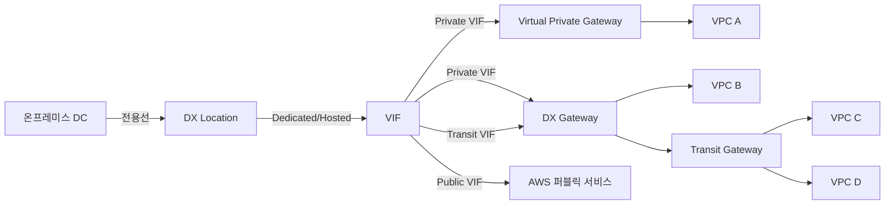
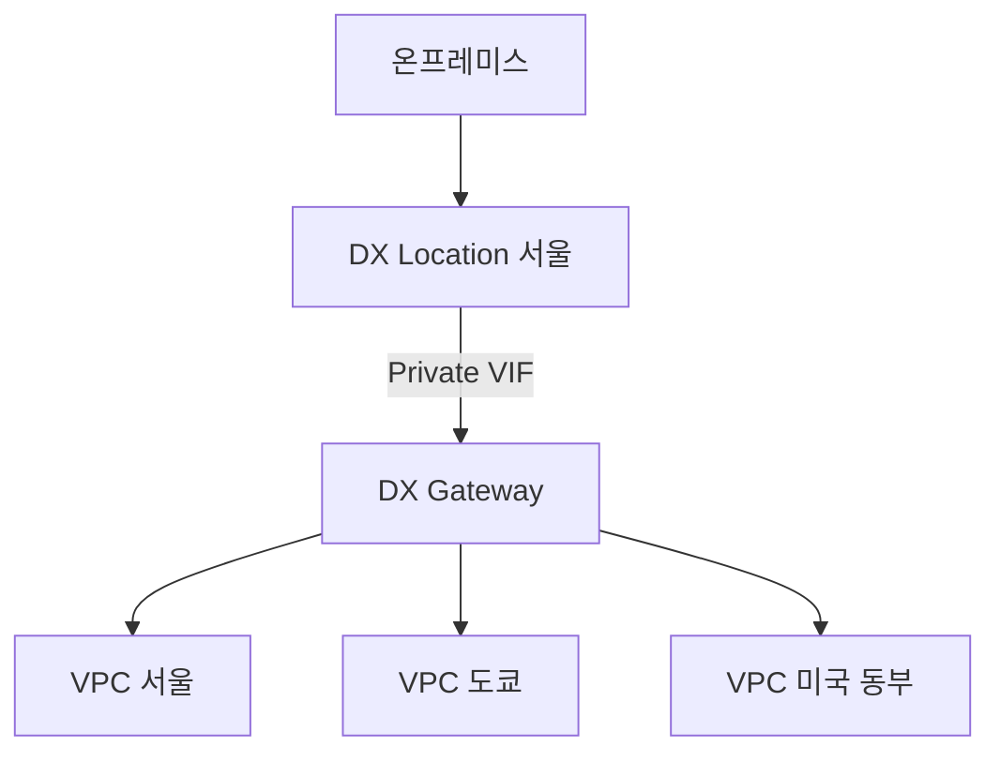
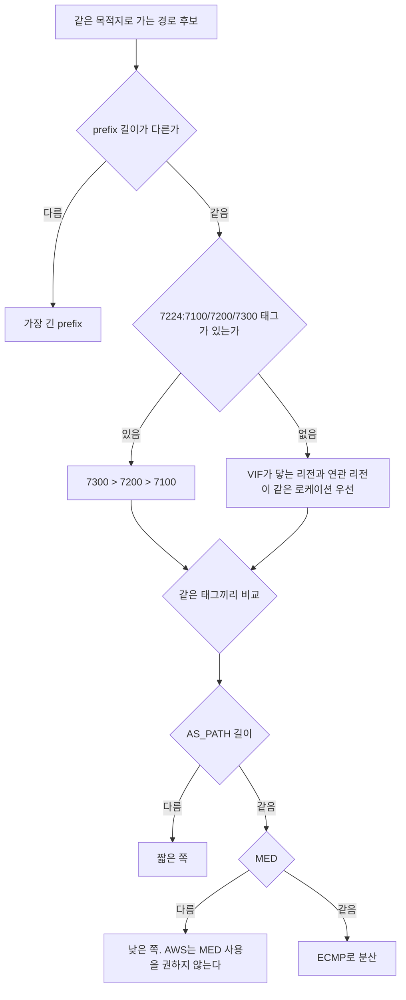
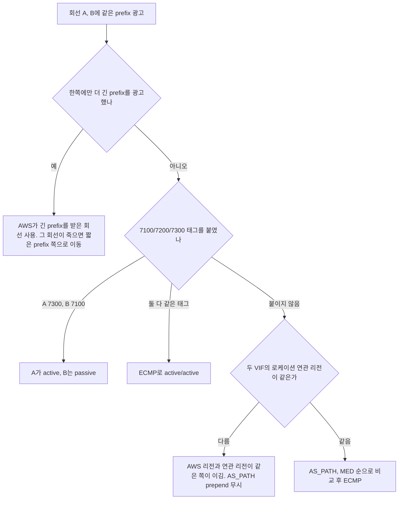
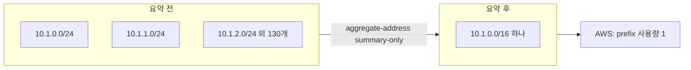
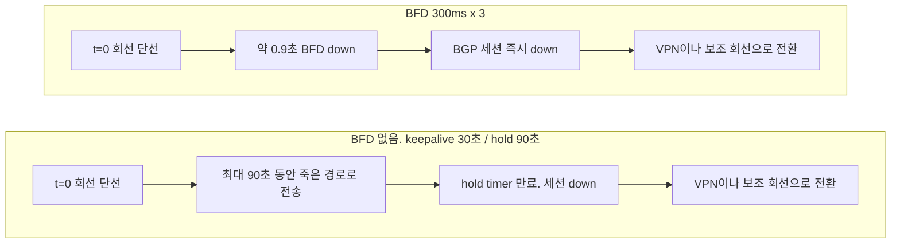
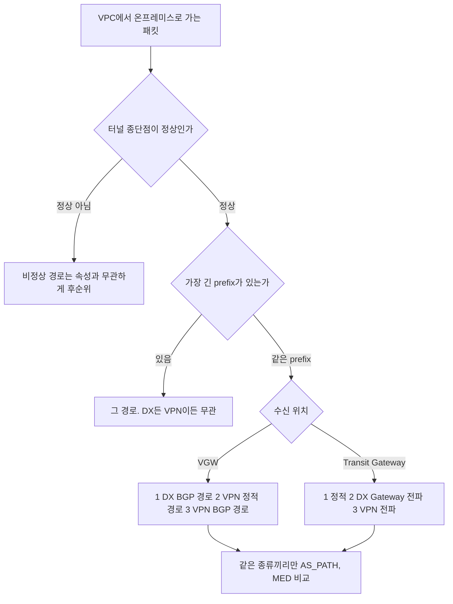

# AWS Direct Connect

Direct Connect(이하 DX)는 온프레미스 데이터센터와 AWS를 통신사 전용선으로 잇는 서비스다. 트래픽이 인터넷을 거치지 않아 지연이 일정하고, 대용량 전송 단가가 인터넷 송신보다 낮다. 회선은 통신사가 깔고, AWS는 그 끝단에 가상 인터페이스(VIF)를 붙여 준다.

이 문서는 회선 계약보다 BGP 쪽에 무게를 둔다. DX 운영에서 사고가 나는 자리는 대부분 회선이 아니라 BGP 정책이다. prefix 한도, community, 백업 경로 우선순위, 장애 감지 시간이 그렇다. BGP 자체의 경로 선택 알고리즘은 [BGP](../../../Network/7%20Layer/Network%20Layer/BGP.md), community와 route-map 문법은 [BGP community와 라우팅 정책](../../../Network/7%20Layer/Network%20Layer/BGP_Community_and_Routing_Policy.md), keepalive·hold timer와 세션 상태 전이는 [BGP 세션 상태와 타이머](../../../Network/7%20Layer/Network%20Layer/BGP_Session_State_and_Timers.md)에서 다룬다. 여기서는 그 내용이 DX에서 어떻게 달라지는지만 적는다.

## 회선, VIF, Gateway의 관계

물리 회선 한 가닥 위에 논리 회선인 VIF가 여러 개 올라가고, VIF는 용도에 따라 VGW, DX Gateway, Transit Gateway 중 하나에 붙는다. 세 계층을 따로 보지 않으면 설계가 꼬인다.



도식에서 Transit VIF가 DX Gateway를 거쳐 Transit Gateway로 간다는 점을 보면 된다. Transit VIF는 Transit Gateway에 직접 붙지 못한다.

DX는 인터넷 회선과 달리 끊기면 바로 복구되지 않는다. 광케이블이 굴착 공사로 끊기면 통신사 출동에 며칠이 걸린다. 단일 회선으로 시작했다가 서비스가 멈춘 사례가 흔해서, DX는 이중화나 VPN 백업을 전제로 설계한다.

## 회선 계약 형태

Dedicated Connection은 AWS와 직접 계약하는 1Gbps, 10Gbps, 100Gbps 포트다. 콘솔에서 신청하면 LOA-CFA 문서가 나오고, 이걸 통신사에 넘기면 통신사가 DX Location까지 점퍼 케이블을 깐다. 온프레미스에서 통신사 POP까지의 백홀 회선은 따로 신청해야 한다. 두 구간이 다 이어져야 포트가 올라온다. 한 회선에 private·public VIF를 50개까지 만들 수 있어서 여러 계정과 VPC를 한 포트로 나눠 쓸 때 맞다.

Hosted Connection은 DX Partner가 자기 회선을 잘라 파는 형태다. 50Mbps 같은 작은 단위로 사고 개통이 빠르다. 한 회선에 VIF가 1개만 붙기 때문에 VIF가 여러 개 필요하면 Hosted Connection을 여러 개 사야 한다. Jumbo Frame은 파트너가 부모 회선에서 켜 두지 않았으면 켜지 못한다.

이름이 비슷한 Hosted VIF는 다른 개념이다. 통신사가 자기 회선 위에 VIF를 만들어 고객 계정으로 넘겨 주는 방식이라 회선 운영 정보를 고객이 직접 볼 수 없다.

도입 일정은 통신사 작업이 변수다. 경험상 이 정도로 잡는다.

| 형태 | 신청부터 개통 | 늘어나는 구간 |
|---|---|---|
| Dedicated | 빨라야 6주, 보통 3~4개월 | 사내 결재 1~3주, 백홀 구축 2주~2개월. 외곽 데이터센터는 토목이 들어간다 |
| Hosted | 1~4주 | 파트너 재고와 VLAN 할당 |
| 이중화 포함 | 6개월 | 통신사가 둘이면 느린 쪽에 맞춰 끝난다 |

LOA-CFA는 유효기간이 90일이다. 백홀이 늦어져 만료되면 재발급을 받아야 한다.

## VIF 세 종류와 한도

Private VIF는 VPC의 사설 IP 대역과 통신한다. VGW에 직접 붙이면 한 VPC만 닿고, DX Gateway에 붙이면 여러 VPC와 여러 리전에 닿는다. 처음에는 VGW로 시작했다가 VPC가 늘면 DX Gateway로 옮기는 경우가 많다.

Public VIF는 S3, DynamoDB, 퍼블릭 엔드포인트처럼 AWS 퍼블릭 서비스에 인터넷 게이트웨이를 거치지 않고 접근한다. 매일 수 TB를 S3로 백업하는 환경이면 송신 비용 차이가 크다.

Transit VIF는 DX Gateway를 거쳐 Transit Gateway에 붙는다. 한 번 붙이면 한 회선으로 VPC 수십 개에 닿는다. 예전에는 1Gbps 미만 회선에서 못 만든다고 알려져 있었는데, 지금 문서는 Dedicated와 Hosted 모든 속도에서 쓸 수 있다고 적는다. 한도는 [Direct Connect quotas](https://docs.aws.amazon.com/directconnect/latest/UserGuide/limits.html) 기준으로 Dedicated 회선당 Transit VIF 4개, DX Gateway당 private·transit VIF 합쳐 30개다.

## DX Gateway

DX Gateway는 리전 경계를 넘는 글로벌 리소스다. 서울에 들어온 회선으로 도쿄와 미국 동부 VPC에도 닿는다.



제약이 두 가지다. DX Gateway에 붙은 VPC끼리는 서로 통신하지 못한다. VPC 간 통신은 [VPC Peering](VPC_Peering.md)이나 [Transit Gateway](Transit_Gateway.md)로 푼다. 그리고 DX Gateway에는 라우팅 테이블이 없어서 BGP 광고를 받아 연결된 게이트웨이로 넘기기만 한다. 한 DX Gateway에는 VGW 20개, Transit Gateway 6개까지 붙는다.

## BGP 세션 기본값

DX는 정적 라우팅을 쓰지 않는다. 세션 파라미터는 아래 표가 전부다.

| 항목 | 값 | 비고 |
|---|---|---|
| AWS 측 ASN | VGW·DX Gateway 생성 시 지정. 기본 64512 | 16비트 64512~65534, 32비트 4200000000~4294967294 |
| 고객 측 ASN | 회사가 정함 | 고객 ASN과 AWS 측 ASN은 같으면 안 된다 |
| Public VIF의 AWS 측 ASN | 7224 | 고객 라우터는 다른 ASN을 써야 한다 |
| MD5 | AWS가 기본으로 켬. 끌 수 없다 | 키를 비우면 AWS가 생성해 준다 |
| keepalive / hold | 30초 / 90초 | [AWS 문서](https://docs.aws.amazon.com/directconnect/latest/UserGuide/bgp-specific-settings.html), 라우터 쪽 값이 더 짧으면 협상으로 짧은 쪽이 쓰인다 |
| BFD | AWS 측 비동기 모드가 기본 활성. 300ms, multiplier 3 | 고객 라우터에서도 켜야 동작한다 |
| 피어 IP | AWS가 169.254.0.0/16 안에서 /30 할당 | 직접 지정도 가능 |

ASN이 겹쳐서 터지는 경우가 있다. 본사와 데이터센터 라우터가 같은 ASN이고 둘 사이에 AWS가 끼면, 한쪽이 광고한 경로가 반대쪽에서 자기 ASN을 보고 루프로 판단되어 버려진다. 사이트마다 ASN을 다르게 잡거나 `allowas-in`을 켠다. Transit Gateway와 DX Gateway를 연결할 때도 두 ASN이 같으면(둘 다 기본 64512) 연결 요청이 실패한다.

MD5 키는 영문과 숫자로만 만든다. 특수문자는 장비마다 설정 입력 단계에서 문제를 일으킨다.

### Cisco IOS 설정

```
router bgp 65001
 bgp log-neighbor-changes
 neighbor 169.254.0.1 remote-as 64512
 neighbor 169.254.0.1 password mySecretBgpKey2026
 neighbor 169.254.0.1 timers 10 30
 neighbor 169.254.0.1 fall-over bfd
 !
 address-family ipv4
  network 10.0.0.0 mask 255.255.0.0
  neighbor 169.254.0.1 activate
  neighbor 169.254.0.1 send-community
  neighbor 169.254.0.1 soft-reconfiguration inbound
  neighbor 169.254.0.1 prefix-list AWS-IN in
  neighbor 169.254.0.1 prefix-list AWS-OUT out
 exit-address-family
!
ip prefix-list AWS-OUT seq 10 permit 10.0.0.0/16
ip prefix-list AWS-IN seq 10 permit 10.100.0.0/14 le 24
!
interface TenGigabitEthernet0/0/1.100
 bfd interval 300 min_rx 300 multiplier 3
```

`send-community`가 빠지면 뒤에서 설명하는 community 태그가 AWS에 도달하지 않는다. IOS는 기본값이 보내지 않는 쪽이다. 반면 FRR은 표준 community를 기본으로 보낸다.

AWS가 광고하는 경로는 VPC CIDR뿐이어야 한다. AWS-IN prefix-list를 `0.0.0.0/0 le 32`로 열어 두면 광고 실수가 그대로 사내 라우팅 테이블에 들어온다. 출력 prefix-list를 안 걸면 사내 라우팅 테이블 전체가 AWS로 나가서 뒤에 나올 prefix 한도에 걸린다.

### Junos 설정

```
protocols {
    bgp {
        group AWS-DX {
            type external;
            local-address 169.254.0.2;
            authentication-key "mySecretBgpKey2026";
            export AWS-OUT;
            import AWS-IN;
            peer-as 64512;
            local-as 65001;
            bfd-liveness-detection {
                minimum-interval 300;
                multiplier 3;
            }
            neighbor 169.254.0.1;
        }
    }
}

policy-options {
    policy-statement AWS-OUT {
        term advertise-internal {
            from {
                route-filter 10.0.0.0/16 exact;
            }
            then accept;
        }
        then reject;
    }
    policy-statement AWS-IN {
        then accept;
    }
}
```

policy-statement 끝에 `then reject`를 둔다. export 정책에서 term에 걸리지 않은 경로가 기본 동작으로 흘러 나가는 사고를 막는다.

## AWS가 경로를 고르는 순서

private·transit VIF에서 AWS가 온프레미스 방향 경로를 고르는 순서는 [routing policies 문서](https://docs.aws.amazon.com/directconnect/latest/UserGuide/routing-and-bgp.html)에 정해져 있다. 일반 BGP 결정 과정과 다른 점이 있다. local preference가 community로 들어오고, AS_PATH보다 앞선다.



도식에서 AS_PATH가 세 번째 판단이라는 점이 핵심이다. 태그를 붙인 순간 AS_PATH 길이는 판단에 들어오지 못한다. 태그가 없으면 AWS는 같은 연관 리전의 로케이션을 기본으로 선호한다. 기본 동작은 7224:7200에 해당하는 값이 암묵적으로 걸린 것으로 이해하면 된다.

## community로 active/passive 정하기

두 회선에 같은 prefix를 광고하면서 한쪽만 쓰게 하려면 방법이 둘이다. 한쪽에만 더 긴 prefix를 광고하거나, local preference community를 붙인다. AWS는 prefix 길이가 같은 active/passive에는 community를 권한다.

| community | 의미 | 방향 |
|---|---|---|
| 7224:7100 | local preference 낮음 | 고객이 AWS로 광고하는 prefix에 붙임 |
| 7224:7200 | 중간 | 〃 |
| 7224:7300 | 높음 | 〃 |
| 7224:8100 | AWS가 광고하는 경로 중 DX 로케이션과 같은 리전에서 시작된 것 | AWS가 public VIF 광고에 붙임 |
| 7224:8200 | 같은 대륙에서 시작된 것. 태그 없음은 다른 대륙 | 〃 |
| 7224:9100 / 9200 / 9300 | 고객 prefix의 AWS 내 전파 범위(로컬 리전, 대륙, 전체) | 고객이 public VIF 광고에 붙임 |

7100~7300은 서로 배타적이어서 prefix 하나에 하나만 붙인다. 두 회선이 모두 정상이면 7300을 붙인 회선만 쓰고, 7300 회선의 세션이 죽으면 7100 회선으로 넘어간다. active/active로 쓰려면 두 회선에 같은 태그를 붙인다. 한쪽이 죽으면 남은 회선에서 ECMP가 이어진다.



Cisco IOS로 회선 A를 active, 회선 B를 passive로 만드는 예다. AWS로 나가는 방향에 route-map을 건다.

```
ip prefix-list ONPREM-NETS seq 10 permit 192.168.0.0/16

route-map DX-A-OUT permit 10
 match ip address prefix-list ONPREM-NETS
 set community 7224:7300

route-map DX-B-OUT permit 10
 match ip address prefix-list ONPREM-NETS
 set community 7224:7100

router bgp 65001
 address-family ipv4
  neighbor 169.254.10.1 send-community
  neighbor 169.254.10.1 route-map DX-A-OUT out
  neighbor 169.254.10.5 send-community
  neighbor 169.254.10.5 route-map DX-B-OUT out
```

FRR 8.1에서 같은 구조의 설정(`set community 7224:7300`, `neighbor ... bfd profile`)이 구문 오류 없이 로드되는 것을 확인했다. AWS 쪽 동작은 FRR로 재현할 수 없어서 위 표는 공식 문서 기준이다.

이 방향은 AWS에서 온프레미스로 오는 트래픽을 정한다. 온프레미스에서 AWS로 가는 트래픽은 내 라우터가 정한다. DX 쪽에서 받은 경로에 local-preference를 올려 두지 않으면 AS_PATH가 같을 때 라우터 ID나 경로 나이로 결정되어 나가는 길과 들어오는 길이 달라진다. 비대칭 라우팅은 상태 기반 방화벽이 끼어 있으면 응답을 버린다.

public VIF에서 받는 경로에도 community를 쓴다. `7224:8100`이 붙은 경로는 DX 로케이션과 같은 리전의 prefix다. 서울 로케이션에서 서울 리전의 S3만 DX로 보내고 나머지는 인터넷으로 보내고 싶으면 이 태그로 걸러서 받는다.

```
ip community-list standard AWS-SAME-REGION permit 7224:8100

route-map PUBVIF-IN permit 10
 match community AWS-SAME-REGION
 set local-preference 200
route-map PUBVIF-IN deny 20
```

AWS 문서는 모든 AWS 퍼블릭 prefix가 필요하면 필터를 걸지 말라고 적는다. 위 필터는 의도적으로 범위를 줄이는 경우에만 쓴다. 이 필터로 받은 prefix가 줄면 나머지 AWS 서비스 주소로 가는 트래픽은 인터넷으로 나간다.

## 공인 VIF가 받는 prefix와 광고하는 prefix

public VIF는 prefix 두 방향의 규칙이 다르다. [공식 문서](https://docs.aws.amazon.com/directconnect/latest/UserGuide/routing-and-bgp.html) 기준으로 정리한 것이다.

| 방향 | 조건 |
|---|---|
| 고객 → AWS | 고객이 소유한 공인 prefix여야 하고 지역 인터넷 레지스트리(RIR)에 등록돼 있어야 한다 |
| 고객 → AWS | VIF 생성 시 prefix를 최소 1개, 최대 1,000개 지정한다. 길이는 IPv4 /1~/32, IPv6 /1~/64 |
| 고객 → AWS | 소스 주소가 광고한 prefix 안에 있는지 AWS가 패킷 단위로 검사한다 |
| 고객 → AWS | prefix를 추가하려면 AWS Support 케이스를 연다. VIF 승인은 최대 72 영업시간이 걸린다 |
| AWS → 고객 | 로컬 리전과 원격 리전의 퍼블릭 prefix, CloudFront와 Route 53 같은 엣지 prefix |
| AWS → 고객 | 최소 AS_PATH 길이 3, 모든 경로에 NO_EXPORT 태그 |
| AWS → 고객 | 광고된 prefix를 인터넷 라우팅 테이블이나 다른 AS로 재광고하면 안 된다 |
| AWS → 고객 | BGP로 내려오는 prefix는 ip-ranges.json 목록과 병합·분할 형태가 다를 수 있다 |

실무에서 문제가 되는 건 세 가지다. 소유 확인이 안 되는 prefix를 쓰려고 해서 VIF 승인이 며칠씩 지연된다. 사설 ASN을 쓰면서 AS_PATH prepend로 경로를 조절하려 하면, AWS가 사설 ASN을 7224로 바꿔 내보내는 과정에서 prepend가 사라진다. 그리고 AWS가 준 경로를 그대로 사내 BGP로 재광고해서 NO_EXPORT 정책을 위반한다.

## prefix 한도에 걸리는 경우

private·transit VIF에서 온프레미스가 AWS로 광고할 수 있는 prefix는 기본 IPv4 100개, IPv6 100개다. 넘으면 세션이 idle 상태로 내려가고 콘솔에 BGP DOWN으로 표시된다. 회선과 라우터는 멀쩡한데 서비스가 끊기는 장애라 원인을 찾는 데 시간이 걸린다. 오래 운영한 환경에서 새 사이트를 붙이다 한도에 닿는 경우가 많다.

한도는 [prefix controls](https://docs.aws.amazon.com/directconnect/latest/UserGuide/prefix-controls.html)로 올릴 수 있다. VIF당 최대 1,000개까지 할당하고, 연결 단위 pool은 1·10Gbps에서 5,000개, DX Gateway 합계는 10,000개다. 할당을 올려도 VGW가 VPC 라우트 테이블에 전파하는 경로는 VPC 라우트 테이블 quota를 따로 받는다. 할당이 라우트 테이블 quota보다 커도 라우트 테이블이 다 받아주지 않을 수 있다.

public VIF의 한도는 1,000개이고 올릴 수 없다. AWS에서 온프레미스로 오는 방향은 Transit Gateway당 transit VIF에서 IPv4·IPv6 합쳐 200개다.

할당을 올리는 건 임시방편이다. 근본 해결은 광고하는 prefix 수를 줄이는 것이다.



요약 전에는 사이트 대역이 /24 단위로 130개 넘게 나가 한도를 넘긴다. 요약 후에는 /16 하나로 나간다. summary-only는 요약 경로를 만든 원본 경로를 광고 대상에서 뺀다.

```
router bgp 65001
 address-family ipv4
  aggregate-address 10.1.0.0 255.255.0.0 summary-only
```

요약에는 조건이 있다. BGP 테이블에 /16 안의 더 구체적인 경로가 하나라도 있어야 aggregate가 만들어진다. 구체적인 경로가 전부 사라지면 요약 경로도 사라진다. 요약한 대역 안에 실제로는 쓰지 않는 구간이 있어도 AWS 쪽에서는 그 /16 전체가 온프레미스 쪽으로 열린다. 요약 대역을 잡을 때 VPC CIDR과 겹치지 않는지 확인한다.

요약을 하면 구체적인 prefix로 트래픽을 나누는 방식(회선 A에는 /24, 회선 B에는 /16)을 쓸 수 없다. active/passive는 community로 정한다.

## BFD로 장애 감지 줄이기

BGP는 상대가 죽었는지 hold timer로 판단한다. DX 기본값은 hold 90초다. 회선이 끊겨도 라우터는 최대 90초 동안 그 경로가 살아 있다고 믿고 패킷을 흘려 보낸다. 이 구간이 블랙홀이다. BFD는 BGP와 별개의 가벼운 keepalive를 300ms 간격으로 주고받다가, 3번(900ms) 연속 응답이 없으면 BGP에 경로 장애를 알린다.



도식에서 두 흐름의 차이는 두 번째 노드에 있다. BFD가 없으면 기다리는 시간이 90초이고, 있으면 1초가 안 된다. 경로 전환 자체의 시간(라우팅 테이블 갱신)은 양쪽에 똑같이 붙는다.

AWS 쪽은 비동기 BFD가 기본으로 켜져 있고 기본값은 300ms, multiplier 3이다. 고객 라우터에서 켜지 않으면 동작하지 않는다. Cisco는 인터페이스에 `bfd interval 300 min_rx 300 multiplier 3`과 `neighbor fall-over bfd`가 둘 다 필요하고, FRR은 `neighbor X bfd`로 켠다. 설정 방법은 [BFD 설정 문서](https://repost.aws/knowledge-center/enable-bfd-direct-connect)를 따른다.

BFD를 켰는데 세션이 흔들리면 간격을 AWS 권장값보다 줄이지 말고 원인부터 본다. 라우터 컨트롤 플레인이 바쁜 장비는 BFD 패킷을 늦게 처리해서 정상 회선인데도 세션이 내려간다. 또 BFD는 라우터와 AWS 장비 사이 구간만 본다. AWS 내부 라우팅이 깨진 경우는 BFD가 up이라서 감지하지 못한다. 이건 CloudWatch 알람이나 애플리케이션 헬스 체크로 잡는다. hold timer 자체를 줄이는 방법도 있지만 AWS와 협상되는 값이어서 세션이 쉽게 흔들린다. 세션 상태 전이와 timer 계산은 [BGP 세션 상태와 타이머](../../../Network/7%20Layer/Network%20Layer/BGP_Session_State_and_Timers.md)에 있다.

## DX와 Site-to-Site VPN 백업의 경로 우선순위

DX 한 회선에 [Site-to-Site VPN](Site_to_Site_VPN.md)을 백업으로 두면 두 경로가 같은 prefix를 받는 경우가 생긴다. 이때 AWS가 고르는 순서는 [VPN route priority 문서](https://docs.aws.amazon.com/vpn/latest/s2svpn/vpn-route-priority.html)에 있다. 수신 대상이 VGW인지 Transit Gateway인지에 따라 다르다.



도식에서 먼저 보이는 건 longest prefix가 DX와 VPN의 구분보다 앞선다는 점이다. 같은 prefix일 때만 DX가 이기고, AS_PATH는 마지막에 같은 종류 경로끼리 비교할 때만 쓰인다. 그래서 DX 쪽에서 AS_PATH를 길게 만들어도 VPN이 선택되지 않는다.

백업이 의도대로 동작하려면 두 경로가 같은 prefix를 광고하면 된다. DX가 정상이면 DX가 쓰이고, DX 경로가 광고에서 사라지면 VPN이 올라온다. Transit Gateway 라우트 테이블에는 우선인 경로만 보이고, 백업 경로는 DX가 사라진 뒤에야 나타난다. TGW에서 DX를 VPN보다 우선시키려면 VPN을 BGP로 맺고 전파를 켜야 한다. VPN을 정적 라우트로 두면 정적이 DX 전파 경로보다 먼저라서 VPN이 이긴다.

반대로 온프레미스에서 AWS로 가는 방향은 내 라우터가 고른다. VPN과 DX 경로의 AS_PATH가 같은 길이면 DX가 선택된다는 보장이 없다. DX 쪽 neighbor에 inbound route-map으로 local-preference를 올려 둔다.

```
route-map FROM-DX permit 10
 set local-preference 200
route-map FROM-VPN permit 10
 set local-preference 100

router bgp 65001
 address-family ipv4
  neighbor 169.254.0.1 route-map FROM-DX in
  neighbor 169.254.100.1 route-map FROM-VPN in
```

VPN으로 넘어가면 MTU도 달라진다. 같은 경로를 DX와 VPN 양쪽으로 받으면 문서상 MTU는 1500으로 맞춰진다. VPN의 IPsec 오버헤드 때문에 실효 MTU는 더 낮아서, ICMP fragmentation needed가 막힌 환경에서는 DX가 정상일 때 보이지 않던 패킷 유실이 failover 직후에 나타난다. 이 부분은 [MTU, MSS, PMTUD](../../../Network/7%20Layer/Network%20Layer/MTU_MSS_PMTUD.md)를 참고한다. VPN 대역폭도 변수다. DX가 10Gbps인데 인터넷 회선이 100Mbps면 백업 모드에서 용량이 100분의 1로 줄어서, 비핵심 트래픽을 막거나 큐잉하는 정책이 필요하다.

## AS_PATH prepend가 DX에서 뒤집히는 경우

AS_PATH prepend는 일반 BGP에서 가장 먼저 쓰는 트래픽 조절 수단이다. DX에서는 평가 순서 때문에 의도와 반대로 나오는 경우가 있다.

| 상황 | 의도 | 실제 | 해결 |
|---|---|---|---|
| 서울 로케이션 VIF와 도쿄 로케이션 VIF를 같은 DX Gateway에 연결. 도쿄를 primary로 쓰려고 서울 VIF에 prepend를 건다 | 도쿄로 수신 | 서울 리전의 VPC는 연관 리전이 같은 서울 로케이션 VIF를 계속 선호한다 | 두 VIF에 7224:7300과 7224:7100을 붙인다 |
| 회선 A에 7224:7300을 붙여 둔 상태에서, 나중에 A를 내리려고 A의 AS_PATH만 늘린다 | A에서 B로 이동 | 태그가 AS_PATH보다 먼저 평가되어 A에 계속 몰린다 | A의 태그를 7224:7100으로 바꾸거나 B에 7224:7300을 붙인다 |
| DX를 백업으로 내리려고 DX 쪽 AS_PATH를 길게 만들고 VPN을 primary로 기대 | VPN 사용 | VGW와 Transit Gateway는 같은 prefix면 DX를 먼저 고른다 | VPN 쪽에 더 긴 prefix를 광고하거나 DX 광고를 빼는 방식으로 바꾼다 |
| public VIF에 사설 ASN을 쓰면서 prepend를 건다 | 외부로 나가는 경로 조절 | AWS가 사설 ASN을 7224로 바꾸면서 prepend가 제거된다 | 공인 ASN을 쓴다 |

도쿄·서울 사례는 처음 겪으면 원인을 찾기 어렵다. BGP 테이블에서 AS_PATH가 의도대로 길어졌는데 트래픽이 안 움직인다. 평가 순서에서 AS_PATH가 세 번째라는 점과, 태그가 없을 때 연관 리전이 먼저 적용된다는 점을 알아야 해석된다. 연관 리전과 로케이션 목록은 [Associated Region 문서](https://docs.aws.amazon.com/directconnect/latest/UserGuide/remote_regions.html)에서 확인한다.

Associated Region 문서에는 연관 리전이 data plane이 아니라 관리와 모니터링을 정한다는 문장이 있다. 반면 routing policies 문서와 VIF 문서의 SiteLink 항목은 같은 prefix를 여러 로케이션이 광고할 때 연관 리전이 같은 로케이션을 기본으로 선호한다고 적는다. 이 환경에서는 AWS 계정으로 재현하지 못해서 후자의 문서를 기준으로 쓴 내용이다. 리전이 다른 두 로케이션을 실제로 쓰기 전에 테스트 prefix로 선호 경로를 확인한다.

## 장애 시 동작

회선은 살아 있는데 BGP만 내려간 경우는 라우터 재부팅, MD5 키 변경, 설정 실수가 원인이다. 물리 링크가 up이라 패킷은 흐르는데 경로가 없다. DX 경로로 정적 라우트를 같이 쓰고 있으면 BGP가 죽어도 정적 라우트가 남아 죽은 회선으로 패킷을 계속 보낸다. DX 환경에서는 정적 라우트와 BGP를 섞지 않는다. `soft-reconfiguration inbound`를 켜 두면 세션을 끊지 않고 정책을 다시 적용할 수 있다.

회선 자체가 끊기면 통신사 콜센터에 바로 연락한다. 이중 회선이면 BGP가 자동으로 넘기고, VPN 백업이면 BFD 유무에 따라 1초 안팎 또는 최대 90초가 걸린다.

AWS 쪽 장비 문제로 회선과 BGP는 up인데 라우팅이 안 되는 경우는 고객이 할 수 있는 게 거의 없다. AWS Health Dashboard를 보고, CloudWatch의 ConnectionState, VirtualInterfaceState, BGPSessionState를 알람으로 건다.

prefix 한도 초과는 앞 절에서 다뤘다. 콘솔에서 BGP DOWN이 보이면 라우터 로그의 neighbor 메시지와 광고 prefix 수부터 확인한다. 광고를 줄여도 VIF 할당 아래로는 내려가야 세션이 다시 올라온다.

## 운영하면서 보는 것

모니터링은 CloudWatch의 ConnectionState, ConnectionBpsEgress·Ingress, ConnectionLightLevelTx·Rx, VirtualInterfaceBpsEgress·Ingress, BGPSessionState를 쓴다. 광 신호 세기가 떨어지기 시작하면 케이블 열화나 커넥터 오염을 의심한다. 회선이 죽기 전에 잡을 수 있는 유일한 지표다.

비용은 포트 시간당 요금과 데이터 송신 요금이 따로 붙고 수신은 무료다. 송신 단가는 리전마다 다르고, Hosted Connection은 파트너가 자체 요금으로 청구해서 콘솔 가격과 다르다. 최신 요금은 [Direct Connect 요금 페이지](https://aws.amazon.com/directconnect/pricing/)에서 본다.

MTU는 private VIF가 1500 또는 9001, transit VIF가 1500 또는 8500이다. Jumbo Frame을 켜면 기존 물리 연결이 갱신되면서 그 연결의 모든 VIF가 최대 30초 끊긴다. 변경 윈도우에서 한다.

보안은 DX가 통신사 망을 지난다는 점에서 출발한다. 평문 트래픽은 TLS나 IPsec으로 감싼다. MACsec은 지원하는 로케이션에서 10Gbps와 100Gbps 전용 회선에 쓸 수 있다. 가능 여부는 로케이션 표에서 확인한다.

용량은 80%를 넘기면 증설을 검토한다. 1Gbps에서 10Gbps로 올리려면 회선을 새로 깔아야 해서 6개월 전부터 준비한다. 라우팅 정책 변경은 변경 윈도우를 잡고, `show ip bgp summary`와 `show ip bgp neighbors <peer> advertised-routes` 결과를 변경 전후로 저장해 비교한다. prefix-list 한 줄이 트래픽 전체를 바꾼다.

운영 문서에는 Connection ID, VIF ID, VLAN, 양쪽 ASN, 피어 IP, 통신사 담당자 연락처, 백업 경로 동작을 적는다. MD5 키는 비밀번호 관리 시스템에 두고 문서에는 위치만 남긴다.

## 참고 문서

- [Direct Connect routing policies and BGP communities](https://docs.aws.amazon.com/directconnect/latest/UserGuide/routing-and-bgp.html)
- [Direct Connect quotas](https://docs.aws.amazon.com/directconnect/latest/UserGuide/limits.html)
- [Inbound prefix controls](https://docs.aws.amazon.com/directconnect/latest/UserGuide/prefix-controls.html)
- [Virtual interface prerequisites](https://docs.aws.amazon.com/directconnect/latest/UserGuide/WorkingWithVirtualInterfaces.html)
- [Site-to-Site VPN route priority](https://docs.aws.amazon.com/vpn/latest/s2svpn/vpn-route-priority.html)
- [Transit Gateway route evaluation order](https://docs.aws.amazon.com/vpc/latest/tgw/how-transit-gateways-work.html#tgw-route-evaluation-overview)
- 내부 문서: [BGP](../../../Network/7%20Layer/Network%20Layer/BGP.md), [BGP community와 라우팅 정책](../../../Network/7%20Layer/Network%20Layer/BGP_Community_and_Routing_Policy.md), [BGP 세션 상태와 타이머](../../../Network/7%20Layer/Network%20Layer/BGP_Session_State_and_Timers.md)
