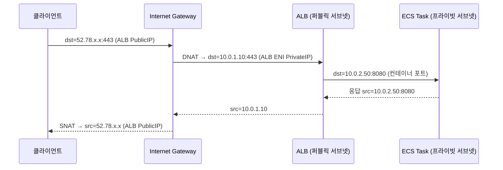
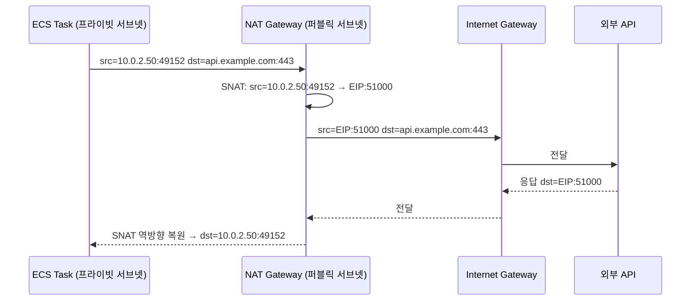

# AWS Internet Gateway

VPC와 인터넷 사이의 유일한 관문이다. ALB가 외부 트래픽을 받는 것도, ECS Task가 외부 API를 호출하는 것도 결국 IGW를 거친다. 설정 자체는 VPC에 붙이고 라우팅 테이블에 추가하는 게 전부지만, 어느 서브넷이 퍼블릭이어야 하고 어느 서브넷이 프라이빗이어야 하는지, 인바운드와 아웃바운드 경로가 어떻게 다른지를 이해하지 않으면 503이나 connection timeout을 디버깅하는 데 시간을 날린다.

## 퍼블릭 서브넷이란

"퍼블릭 서브넷"은 AWS 콘솔에서 따로 지정하는 속성이 아니다. 서브넷의 라우팅 테이블에 `0.0.0.0/0 → igw-xxxxxx`가 있으면 그 서브넷이 퍼블릭이다. 이 라우트가 없으면 인터넷으로 나갈 경로가 없는 프라이빗 서브넷이다.

퍼블릭 서브넷에 올라간 리소스가 퍼블릭 IP나 EIP를 가지면, IGW가 그 IP를 ENI의 프라이빗 IP에 1:1로 매핑해서 인터넷 통신이 가능해진다. 퍼블릭 IP 없이 퍼블릭 서브넷에만 있으면 외부에서 들어오는 트래픽을 받지 못한다. 둘 다 충족해야 한다.

```
# 퍼블릭 서브넷 라우팅 테이블
Destination     Target
10.0.0.0/16     local
0.0.0.0/0       igw-0abc1234   ← 이 한 줄이 퍼블릭/프라이빗을 가름

# 프라이빗 서브넷 라우팅 테이블
Destination     Target
10.0.0.0/16     local
0.0.0.0/0       nat-0def5678   ← NAT GW를 통해서만 외부로 나감
```

## 인바운드 흐름: 인터넷 → IGW → ALB → ECS

클라이언트가 서비스에 접근하는 경로다. ALB가 퍼블릭 서브넷에 있어야 하는 이유가 여기서 나온다.



IGW는 ALB의 퍼블릭 IP를 ALB ENI의 프라이빗 IP로 변환(DNAT)해서 넘긴다. ALB가 퍼블릭 서브넷에 없으면 IGW가 받은 패킷을 ALB로 전달할 경로가 없다. 퍼블릭 서브넷 라우팅 테이블은 `0.0.0.0/0 → igw`를 갖고 있어서 IGW가 그 서브넷 안의 ENI로 패킷을 넘길 수 있다.

ALB는 Layer 7에서 요청을 처리한 뒤 Target Group에 등록된 ECS Task로 포워딩한다. 이 구간은 VPC 내부 통신이라 IGW와 무관하다. ECS Task는 퍼블릭 IP가 없어도 되고, ALB가 ALB SG에서 허용한 포트로 접근하면 된다.

ECS Task를 프라이빗 서브넷에 두는 건 보안 때문이다. Task에 퍼블릭 IP를 붙이면 누군가 ALB를 우회해서 컨테이너 포트에 직접 접근할 수 있다. 프라이빗 서브넷에 넣으면 외부에서 직접 접근할 방법이 없고, 트래픽은 반드시 ALB를 통과해야 한다.

## IGW의 1:1 NAT 동작 원리

IGW의 NAT는 NAT GW와 다르다. NAT GW는 여러 프라이빗 IP를 단일 EIP로 SNAT하는 N:1 매핑이고, IGW는 퍼블릭 IP와 ENI 프라이빗 IP를 1:1로 매핑한다.

EC2 인스턴스에 EIP를 붙이면 AWS 내부에서 "EIP ↔ ENI 프라이빗 IP" 매핑 테이블이 생긴다. 외부에서 EIP로 패킷이 들어오면 IGW가 이 테이블을 보고 프라이빗 IP로 DNAT해서 인스턴스로 전달한다. 인스턴스가 응답을 보낼 때는 반대로 프라이빗 IP를 EIP로 SNAT해서 내보낸다.

인스턴스 OS 입장에서는 자신의 IP가 프라이빗 IP뿐이다. `ip addr`로 조회해도 EIP는 안 보인다. IGW가 중간에서 변환하는 것이라 OS는 알 필요가 없다.

ALB도 같은 원리다. ALB 리스너가 퍼블릭 IP를 갖고, 그 IP가 ALB ENI의 프라이빗 IP에 매핑되어 있다. ALB는 멀티 AZ로 배포하면 AZ마다 ENI가 하나씩 생기고, 각 ENI에 퍼블릭 IP가 1:1로 붙는다.

## 아웃바운드 흐름: ECS → NAT GW → IGW → 인터넷

ECS Task에서 외부 API를 호출할 때의 경로다. 프라이빗 서브넷에 있는 Task는 퍼블릭 IP가 없어서 IGW를 직접 쓸 수 없다.



ECS Task의 프라이빗 서브넷 라우팅 테이블에 `0.0.0.0/0 → nat-xxxx`가 있으면 외부로 나가는 패킷이 NAT GW로 향한다. NAT GW는 퍼블릭 서브넷에 있고, EIP를 가지므로 그 EIP를 소스 IP로 SNAT해서 IGW에 전달한다. IGW는 NAT GW가 퍼블릭 서브넷에 있고 EIP를 갖고 있으니 그대로 인터넷으로 내보낸다.

NAT GW의 EIP가 출구가 되는 이유는 간단하다. IGW는 자기에게 오는 패킷의 소스가 VPC 내부의 퍼블릭 IP(ENI에 매핑된 IP)인 경우에만 인터넷으로 내보낼 수 있다. 프라이빗 IP를 가진 ECS Task가 직접 IGW에 패킷을 보내면 IGW는 그 패킷을 처리할 방법이 없다. NAT GW가 EIP로 SNAT해서 줘야 IGW가 인터넷으로 전달한다.

## IGW의 stateless 특성

IGW 자체는 상태를 추적하지 않는다. 패킷이 들어오면 1:1 NAT를 적용하고 라우팅 테이블에 따라 다음 홉으로 넘길 뿐이다.

SG와 NACL과 비교하면 차이가 명확하다.

SG는 stateful이다. 인바운드 443을 허용하면 그 연결에 대한 응답은 아웃바운드 규칙이 뭐든 상관없이 자동으로 나간다. ALB SG에서 인바운드 443을 열면 클라이언트로 돌아가는 응답은 별도 아웃바운드 규칙 없이 처리된다.

NACL은 stateless다. 인바운드 443을 허용해도 응답 패킷은 아웃바운드 규칙에서 따로 허용해야 나간다. 직접 만든 NACL에서 아웃바운드 ephemeral 포트(1024-65535)를 빠뜨리면 TCP 3-way handshake는 성공하는데 데이터 전송이 안 되는 이상한 상황이 생긴다. `nc -zv`로 포트 확인은 성공(SYN-ACK 확인)인데 실제 HTTP 요청이 죽는 케이스가 이 경우다.

IGW는 이 둘과 다른 레이어다. NAT 변환과 라우팅만 담당하고, 패킷 필터링은 SG와 NACL이 한다. IGW에서 막힌다는 표현은 사실 잘못된 말이다. 거의 대부분 라우팅 테이블이나 SG, NACL에서 막히는 것이다.

## 라우팅 테이블·SG·NACL 설정 예제

실제 구성에서 인바운드와 아웃바운드 각각 어떻게 설정하는지 본다.

### 라우팅 테이블

```hcl
# 퍼블릭 서브넷 라우팅 테이블 (ALB용)
resource "aws_route_table" "public" {
  vpc_id = aws_vpc.main.id

  route {
    cidr_block = "0.0.0.0/0"
    gateway_id = aws_internet_gateway.main.id
  }
}

resource "aws_route_table_association" "public" {
  for_each       = aws_subnet.public
  subnet_id      = each.value.id
  route_table_id = aws_route_table.public.id
}

# 프라이빗 서브넷 라우팅 테이블 (ECS용, AZ별로 분리)
resource "aws_route_table" "private" {
  for_each = aws_subnet.private
  vpc_id   = aws_vpc.main.id

  route {
    cidr_block     = "0.0.0.0/0"
    nat_gateway_id = aws_nat_gateway.az[each.key].id
  }
}

resource "aws_route_table_association" "private" {
  for_each       = aws_subnet.private
  subnet_id      = each.value.id
  route_table_id = aws_route_table.private[each.key].id
}
```

### 보안 그룹

```hcl
# ALB SG
resource "aws_security_group" "alb" {
  name   = "alb-sg"
  vpc_id = aws_vpc.main.id

  ingress {
    from_port   = 443
    to_port     = 443
    protocol    = "tcp"
    cidr_blocks = ["0.0.0.0/0"]
  }

  ingress {
    from_port   = 80
    to_port     = 80
    protocol    = "tcp"
    cidr_blocks = ["0.0.0.0/0"]
  }

  egress {
    from_port       = 8080
    to_port         = 8080
    protocol        = "tcp"
    security_groups = [aws_security_group.ecs.id]
  }
}

# ECS Task SG
resource "aws_security_group" "ecs" {
  name   = "ecs-sg"
  vpc_id = aws_vpc.main.id

  ingress {
    from_port       = 8080
    to_port         = 8080
    protocol        = "tcp"
    security_groups = [aws_security_group.alb.id]
  }

  # 외부 API 호출용 (NAT GW 경유)
  egress {
    from_port   = 443
    to_port     = 443
    protocol    = "tcp"
    cidr_blocks = ["0.0.0.0/0"]
  }

  # ECR, CloudWatch Logs 등 VPC Endpoint 미사용 시
  egress {
    from_port   = 80
    to_port     = 80
    protocol    = "tcp"
    cidr_blocks = ["0.0.0.0/0"]
  }
}
```

### NACL

기본 NACL을 그대로 쓰면(모두 허용) NACL 때문에 막히는 일은 없다. 직접 만든 NACL을 쓸 때는 ephemeral 포트를 반드시 열어야 한다.

```
# 퍼블릭 서브넷 NACL (ALB가 있는 서브넷)
인바운드:
  100  TCP  0.0.0.0/0  포트 443   ALLOW   ← 클라이언트 인바운드
  110  TCP  0.0.0.0/0  포트 80    ALLOW
  120  TCP  0.0.0.0/0  1024-65535 ALLOW   ← ALB→ECS 응답이 돌아올 때 ephemeral
  *    모두                        DENY

아웃바운드:
  100  TCP  0.0.0.0/0  1024-65535 ALLOW   ← 클라이언트에게 응답할 ephemeral
  110  TCP  10.0.0.0/16  8080     ALLOW   ← ECS로 포워딩
  *    모두                        DENY

# 프라이빗 서브넷 NACL (ECS가 있는 서브넷)
인바운드:
  100  TCP  10.0.0.0/16  8080    ALLOW   ← ALB에서 오는 요청
  110  TCP  0.0.0.0/0   1024-65535 ALLOW ← 외부 API 응답
  *    모두                         DENY

아웃바운드:
  100  TCP  10.0.0.0/16  1024-65535 ALLOW ← ALB로 응답
  110  TCP  0.0.0.0/0    443        ALLOW  ← 외부 API 호출 (NAT GW 경유)
  *    모두                          DENY
```

## IGW 미설정·설정 오류 시 트러블슈팅

IGW 관련 문제는 크게 세 유형으로 나뉜다.

### 외부에서 ALB에 접근이 안 되는 경우

증상은 보통 connection timeout이다. DNS는 IP를 잘 반환하는데 TCP 연결 자체가 안 된다.

우선 퍼블릭 서브넷의 라우팅 테이블을 확인한다. `0.0.0.0/0 → igw-xxx`가 없으면 패킷이 VPC 밖으로 나갈 경로가 없어서 들어오는 트래픽도 IGW가 처리를 못한다. IGW는 VPC에 붙여 놨어도 라우팅 테이블에 연결하지 않으면 무용지물이다.

다음으로 ALB SG 인바운드에 443(또는 80)이 열려 있는지 본다. 퍼블릭 서브넷 NACL을 직접 만든 경우라면 인바운드 443과 아웃바운드 ephemeral 포트(1024-65535)가 있는지 확인한다.

IGW가 VPC에 아예 붙어 있지 않은 경우도 가끔 있다. 신규 VPC를 만들고 IGW 연결을 빠뜨렸거나, 누군가 detach한 경우다. VPC 콘솔에서 Internet Gateways를 보면 Attached VPCs 항목에 해당 VPC가 있는지 바로 확인된다.

### ALB는 접근되는데 503이 나오는 경우

ALB가 Target Health Check에서 ECS Task를 unhealthy로 판정하고 있을 가능성이 크다. ALB → ECS 구간은 VPC 내부 통신이라 IGW와 무관하지만, 원인은 다음을 차례로 본다.

ECS SG 인바운드에 ALB SG를 소스로 한 컨테이너 포트가 열려 있는지 확인한다. ALB SG를 소스로 지정하지 않고 VPC CIDR을 넣는 경우가 있는데, 이게 맞는 경우도 있지만 ALB SG로 좁히는 게 관리하기 쉽다.

Health Check 경로가 컨테이너에서 200을 반환하는지 확인한다. Health Check 포트와 컨테이너 포트가 다르게 설정된 경우도 있다.

Task 자체가 실행 중인지 ECS 콘솔에서 확인한다. 컨테이너가 시작 직후 죽고 있다면 CloudWatch Logs에 에러가 찍혀 있다.

### ECS Task에서 외부 API 호출이 안 되는 경우

증상은 connection timeout 또는 connection refused다. NAT GW와 IGW 연결 고리 중 어디가 끊겼는지를 찾아야 한다.

```bash
# ECS Exec으로 컨테이너에 접속해서 직접 확인
aws ecs execute-command \
    --cluster my-cluster \
    --task task-id \
    --container my-container \
    --command "/bin/sh" \
    --interactive

# 컨테이너 내부에서
curl -v https://1.1.1.1      # DNS를 피해 IP로 직접 테스트
curl -v https://api.example.com
```

프라이빗 서브넷 라우팅 테이블에 `0.0.0.0/0 → nat-xxx`가 없으면 외부로 가는 패킷이 어디로도 가지 않는다. 서브넷을 새로 추가했을 때 라우팅 테이블 연결을 빠뜨리는 경우가 흔하다. 새 서브넷은 기본적으로 메인 라우팅 테이블에 연결되는데, 메인 라우팅 테이블에 NAT 라우트가 없으면 조용히 실패한다.

NAT GW가 `available` 상태인지 확인한다. EIP가 붙어 있는지도 같이 본다.

ECS SG 아웃바운드에 443이 막혀 있는 경우도 있다. 보안 정책상 아웃바운드를 전부 deny하고 필요한 포트만 열었는데, 새로 추가한 외부 API의 포트를 빠뜨린 경우다.

VPC Flow Logs가 켜져 있으면 ECS Task ENI의 아웃바운드 트래픽이 ACCEPT인지 REJECT인지 바로 확인할 수 있다. REJECT가 찍히면 SG나 NACL 문제다. ACCEPT인데 응답이 없으면 NAT GW 문제나 라우팅 문제다.

```bash
# NAT GW ENI의 ErrorPortAllocation 확인 (CloudWatch)
aws cloudwatch get-metric-statistics \
    --namespace AWS/NatGateway \
    --metric-name ErrorPortAllocation \
    --dimensions Name=NatGatewayId,Value=nat-0abc1234 \
    --start-time 2026-08-10T00:00:00Z \
    --end-time 2026-08-10T01:00:00Z \
    --period 60 \
    --statistics Sum
```

Reachability Analyzer를 쓰면 라우팅·SG·NACL을 한 번에 정적 분석할 수 있다. 실제 패킷이 아닌 설정 기반 분석이라 포트 고갈 같은 동적 문제는 못 잡지만, 설정 오류로 인한 경로 단절은 금방 찾아준다.

```bash
# ECS Task ENI → IGW 경로 분석
aws ec2 create-network-insights-path \
    --source eni-0abc1234 \
    --destination igw-0def5678 \
    --protocol tcp \
    --destination-port 443

aws ec2 start-network-insights-analysis \
    --network-insights-path-id nip-0ghi9012
```

## 참조

- [AWS Internet Gateway 공식 문서](https://docs.aws.amazon.com/vpc/latest/userguide/VPC_Internet_Gateway.html)
- [NAT Gateway](Nat_Gateway.md)
- [라우팅 테이블](Route_Table.md)
- [Security Groups vs NACLs](Security_Groups_vs_NACLs.md)
- [ALB → ECS → S3 요청 흐름](ALB_ECS_S3_Request_Flow.md)
