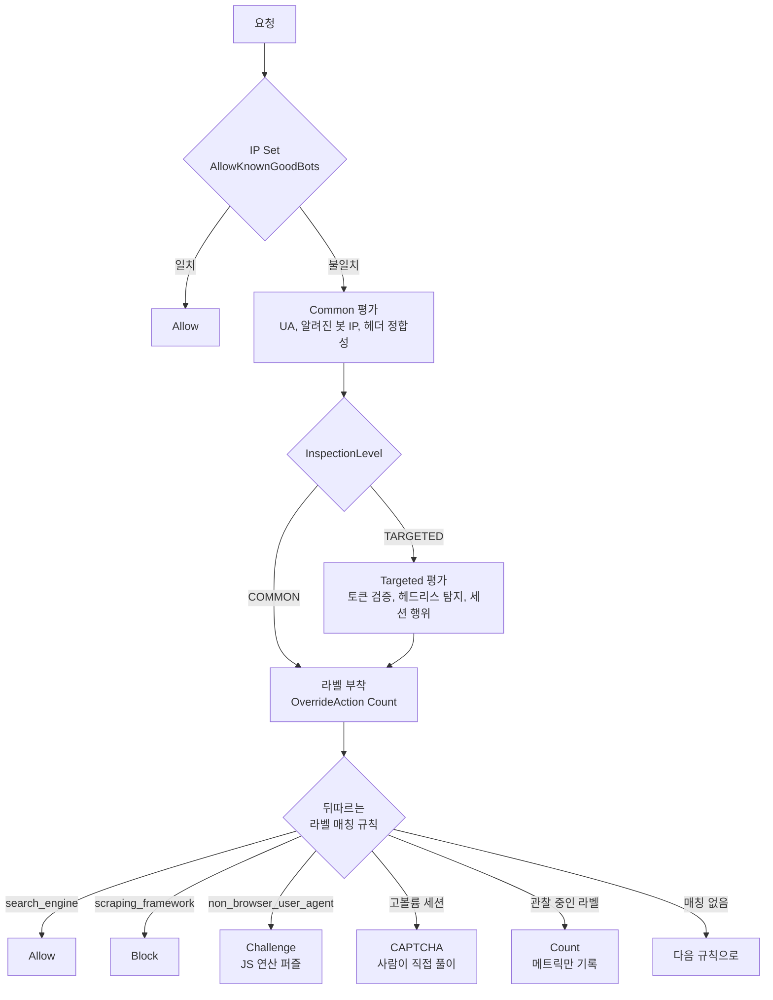
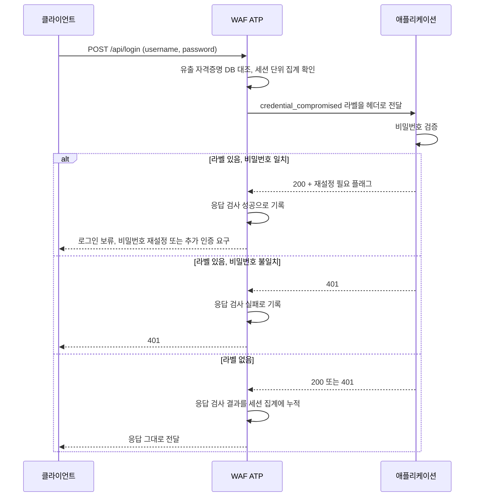

# AWS WAF Bot Control과 봇 방어

기본 Web ACL 생성, SQLi/XSS, IP 차단 같은 내용은 [WAF.md](WAF.md)에 정리되어 있다. 이 문서는 거기서 다루지 않는 봇 방어만 따로 정리한다. Bot Control 매니지드 룰 그룹, CAPTCHA/Challenge 액션, ATP, Rate-based 규칙과 라벨 체이닝, 그리고 정상 봇을 오탐 없이 통과시키는 운영 작업이 대상이다. 크리덴셜 스터핑 공격 자체의 동작과 애플리케이션 쪽 방어는 [크리덴션 스터핑](../../../Security/Credential_Stuffing.md)에 따로 있고, 이 문서는 그중 WAF가 맡는 구간만 다룬다.

## SQLi/XSS 룰로는 봇을 못 막는 이유

WAF.md의 Core Rule Set이나 SqliMatchStatement는 요청 한 건의 페이로드를 검사한다. 그런데 봇 공격은 페이로드가 정상이다. 크리덴셜 스터핑은 진짜 로그인 폼에 진짜 형식의 아이디/비밀번호를 보낸다. 스크래핑은 `GET /products?page=1` 같은 평범한 요청을 페이지 번호만 바꿔가며 수만 번 보낸다. 페이로드 한 건만 보면 정상 사용자와 구분이 안 된다.

봇은 행위 패턴으로 잡아야 한다. 같은 IP가 1초에 50번 로그인을 시도하는가, User-Agent가 헤드리스 브라우저인가, JavaScript를 실행하는가, 마우스 움직임이 있는가. 이 판단을 WAF에서 하려면 Bot Control 매니지드 룰 그룹이나 CAPTCHA/Challenge 토큰 검증이 필요하다.

## Bot Control 매니지드 룰 그룹

룰 그룹 이름은 `AWSManagedRulesBotControlRuleSet` 하나다. 안에서 Common과 Targeted 두 단계(inspection level)를 고른다.

### Common

User-Agent, 알려진 봇 IP 목록, 요청 헤더 정합성 같은 정적 시그널로 판단한다. 검색엔진 크롤러, 모니터링 서비스, 스크래퍼, 소셜 미디어 봇처럼 자기 정체를 숨기지 않는 봇을 분류한다. 추가 인프라 없이 룰만 켜면 된다.

```json
{
  "Name": "BotControl",
  "Priority": 5,
  "Statement": {
    "ManagedRuleGroupStatement": {
      "VendorName": "AWS",
      "Name": "AWSManagedRulesBotControlRuleSet",
      "ManagedRuleGroupConfigs": [
        {
          "AWSManagedRulesBotControlRuleSet": {
            "InspectionLevel": "COMMON"
          }
        }
      ]
    }
  },
  "OverrideAction": {
    "None": {}
  },
  "VisibilityConfig": {
    "SampledRequestsEnabled": true,
    "CloudWatchMetricsEnabled": true,
    "MetricName": "BotControl"
  }
}
```

### Targeted

`InspectionLevel`을 `TARGETED`로 올리면 정체를 숨기는 봇까지 잡는다. 동작 방식이 Common과 완전히 다르다. 클라이언트에 Challenge나 CAPTCHA 토큰을 심고, 그 토큰을 검증해서 진짜 브라우저인지 판별한다. 헤드리스 브라우저 탐지(`TGT_ML_CoordinatedActivityMedium` 같은 머신러닝 시그널), 토큰 재사용 탐지, 세션 단위 행위 분석이 들어간다.

Targeted를 켜면 토큰 발급/검증을 위해 응답에 자동으로 Challenge가 삽입되거나, JS SDK를 직접 붙여야 하는 룰이 생긴다. SDK 없이 켜면 토큰이 없는 요청이 전부 의심 라벨을 받아 오탐이 폭증한다. SDK는 아래에서 따로 다룬다.

Common과 Targeted는 비용 차이가 크다. 처음에는 Common만 켜서 정상 봇 분류가 어떻게 되는지 보고, 자동화 공격이 실제로 들어올 때 Targeted를 올리는 순서가 맞다.

### 평가 순서와 액션 분기

Targeted 레벨은 Common 룰을 포함한 상위 집합이다. Targeted로 올려도 Common 룰이 빠지지 않고, 그 위에 토큰 기반 룰이 얹힌다. 룰 그룹이 라벨을 붙인 뒤에 뒤쪽 규칙이 액션을 정하는 흐름을 그리면 이렇다.



위쪽 분기가 평가 순서이고 아래쪽 분기가 액션이다. Allow가 두 군데 있는 이유가 있다. 고정 IP 봇은 Bot Control 앞에서 빼 두고, 검색엔진처럼 IP가 바뀌는 봇은 라벨이 붙은 뒤에 허용한다. Challenge와 CAPTCHA는 Block과 달리 토큰을 받은 클라이언트가 다시 요청하면 통과하는 액션이라, 같은 규칙을 두 번 타는 요청이 로그에 남는다. 로그에서 같은 IP가 한 번은 Challenge, 한 번은 통과로 찍히는 건 정상이다.

## 라벨과 규칙 체이닝

Bot Control의 핵심은 룰 그룹이 직접 차단하지 않고 라벨(label)만 붙인다는 점이다. `OverrideAction`을 `None`이 아니라 `Count`로 두면 룰 그룹 안의 모든 규칙이 라벨만 달고 통과시킨다. 그 라벨을 뒤따르는 별도 규칙이 읽어서 Block이든 CAPTCHA든 결정한다. 이 구조 덕분에 "검색엔진 봇은 통과, 스크래퍼는 차단" 같은 세밀한 분기가 가능하다.

Bot Control이 다는 주요 라벨:

- `awswaf:managed:aws:bot-control:bot:category:search_engine` — 검색엔진 크롤러
- `awswaf:managed:aws:bot-control:bot:category:monitoring` — 가동 모니터링 봇
- `awswaf:managed:aws:bot-control:bot:category:scraping_framework` — 스크래핑 프레임워크
- `awswaf:managed:aws:bot-control:bot:verified` — 정체가 검증된 봇(역방향 DNS 확인 통과)
- `awswaf:managed:aws:bot-control:signal:non_browser_user_agent` — 브라우저가 아닌 UA
- `awswaf:managed:aws:bot-control:targeted:aggregate:volumetric:session:high` — 세션 단위 고볼륨

체이닝 예시. 룰 그룹은 Count로 두고 라벨만 받은 다음, 검증된 검색엔진은 명시적으로 허용하고 나머지 봇 시그널은 차단한다. 우선순위 숫자가 작을수록 먼저 실행되므로 룰 그룹이 라벨을 단 뒤에 라벨 매칭 규칙이 와야 한다.

```json
[
  {
    "Name": "BotControl",
    "Priority": 5,
    "Statement": {
      "ManagedRuleGroupStatement": {
        "VendorName": "AWS",
        "Name": "AWSManagedRulesBotControlRuleSet",
        "ManagedRuleGroupConfigs": [
          { "AWSManagedRulesBotControlRuleSet": { "InspectionLevel": "COMMON" } }
        ]
      }
    },
    "OverrideAction": { "Count": {} },
    "VisibilityConfig": {
      "SampledRequestsEnabled": true,
      "CloudWatchMetricsEnabled": true,
      "MetricName": "BotControl"
    }
  },
  {
    "Name": "AllowVerifiedSearchEngine",
    "Priority": 6,
    "Statement": {
      "LabelMatchStatement": {
        "Scope": "LABEL",
        "Key": "awswaf:managed:aws:bot-control:bot:category:search_engine"
      }
    },
    "Action": { "Allow": {} },
    "VisibilityConfig": {
      "SampledRequestsEnabled": true,
      "CloudWatchMetricsEnabled": true,
      "MetricName": "AllowVerifiedSearchEngine"
    }
  },
  {
    "Name": "BlockScrapers",
    "Priority": 7,
    "Statement": {
      "LabelMatchStatement": {
        "Scope": "LABEL",
        "Key": "awswaf:managed:aws:bot-control:bot:category:scraping_framework"
      }
    },
    "Action": { "Block": {} },
    "VisibilityConfig": {
      "SampledRequestsEnabled": true,
      "CloudWatchMetricsEnabled": true,
      "MetricName": "BlockScrapers"
    }
  }
]
```

`LabelMatchStatement`의 `Scope`는 `LABEL`이고 `Key`는 콜론으로 연결된 전체 네임스페이스다. 라벨 이름을 한 글자라도 틀리면 매칭이 조용히 실패한다. 차단이 안 될 때 가장 먼저 의심할 부분이 이 오타다. Sampled Requests에서 실제로 어떤 라벨이 붙었는지 확인하고 복사해서 쓰는 편이 안전하다.

검색엔진 봇을 허용 라벨로 빼는 게 중요한 이유가 있다. `search_engine` 카테고리는 단순히 UA가 Googlebot이라서 붙는 게 아니라, 역방향 DNS 조회로 정체가 검증된 경우에만 붙는다. UA만 Googlebot으로 위조한 스크래퍼는 이 라벨을 못 받는다. 그래서 라벨 기반 허용이 UA 문자열 매칭보다 안전하다.

## Rate-based 규칙과 라벨 결합

크리덴셜 스터핑과 스크래핑은 볼륨이 시그널이다. Rate-based 규칙으로 임계치를 잡는다. WAF.md의 단순 IP 기반 Rate Limit과 달리, 봇 방어에서는 집계 키와 스코프를 좁혀야 한다.

로그인 엔드포인트에만 적용하면서 IP로 집계하는 규칙. `ScopeDownStatement`로 `/api/login`만 카운트 대상으로 좁힌다. 사이트 전체 트래픽으로 임계치를 잡으면 로그인 폭주를 못 잡는다.

```json
{
  "Name": "LoginRateLimit",
  "Priority": 10,
  "Statement": {
    "RateBasedStatement": {
      "Limit": 100,
      "EvaluationWindowSec": 60,
      "AggregateKeyType": "IP",
      "ScopeDownStatement": {
        "ByteMatchStatement": {
          "SearchString": "/api/login",
          "FieldToMatch": { "UriPath": {} },
          "PositionalConstraint": "STARTS_WITH",
          "TextTransformations": [ { "Priority": 0, "Type": "NONE" } ]
        }
      }
    }
  },
  "Action": { "Block": {} },
  "VisibilityConfig": {
    "SampledRequestsEnabled": true,
    "CloudWatchMetricsEnabled": true,
    "MetricName": "LoginRateLimit"
  }
}
```

`EvaluationWindowSec`는 60/120/300/600 중에서 고른다. 예전에는 5분 고정이었는데 지금은 1분까지 내릴 수 있다. 로그인 무차별 대입은 짧은 창이 잡기 좋다. `Limit`은 1분 창 기준 100이면 정상 사용자가 1분에 로그인을 100번 할 일은 없으니 충분히 여유가 있고, 봇은 금방 넘긴다.

IP 집계는 한계가 있다. 공격자가 수천 개 IP를 돌리면 IP당 횟수가 임계치 아래로 깔린다. 이때는 집계 키를 IP가 아닌 다른 값으로 바꾼다. 헤더나 쿠키, 혹은 라벨로 집계할 수 있다. 예를 들어 로그인 폼에 보내는 username을 키로 잡으면, 한 계정에 대한 분산 공격을 IP와 무관하게 잡는다.

```json
{
  "RateBasedStatement": {
    "Limit": 50,
    "EvaluationWindowSec": 300,
    "AggregateKeyType": "CUSTOM_KEYS",
    "CustomKeys": [
      {
        "Header": {
          "Name": "x-username",
          "TextTransformations": [ { "Priority": 0, "Type": "LOWERCASE" } ]
        }
      }
    ],
    "ScopeDownStatement": {
      "ByteMatchStatement": {
        "SearchString": "/api/login",
        "FieldToMatch": { "UriPath": {} },
        "PositionalConstraint": "STARTS_WITH",
        "TextTransformations": [ { "Priority": 0, "Type": "NONE" } ]
      }
    }
  }
}
```

`CustomKeys`에는 IP와 헤더를 같이 넣어 조합 키로도 만들 수 있다. 키를 여러 개 넣으면 그 조합 단위로 카운트한다. 요청 본문의 필드는 집계 키로 쓸 수 없어서, username을 키로 잡으려면 클라이언트나 앞단 프록시가 본문 값을 헤더로 복사해 줘야 한다. 위 예제의 `x-username`이 그런 헤더다.

### 저속·분산 스터핑을 위한 키 조합

스터핑은 IP를 요청마다 바꾸고 요청 간격도 벌린다. 이 경우 IP 하나만 키로 쓰는 규칙은 IP당 1~3건에서 카운터가 멈춰 영원히 임계치에 닿지 않는다. 로그에서 본 형태가 딱 그랬다. 키를 IP, 헤더, 쿠키로 나눠 세 규칙을 따로 두고, 하나라도 걸리면 막는 구성이 현실적이다.

| 규칙 | 집계 키 | 잡는 대상 | 놓치는 대상 |
|---|---|---|---|
| IP 단독 | `IP` | 단일 서버에서 쏘는 단순 봇 | 요청마다 IP를 바꾸는 레지덴셜 프록시 |
| IP + 헤더 | `IP` + `x-username` | 같은 IP에서 여러 계정을 도는 봇 | IP를 계속 바꾸는 봇넷 |
| 헤더 단독 | `x-username` 또는 JA3 | 한 계정을 여러 IP로 노리는 분산 공격 | 계정마다 1~2건만 시도하는 스터핑 |
| 쿠키 + JA3 | `aws-waf-token` 쿠키 + `JA3Fingerprint` | IP가 달라도 같은 도구·같은 세션 | 쿠키를 매번 비우고 TLS 스택까지 바꾸는 공격 |

네 번째 줄이 스터핑에 가장 잘 맞는다. 계정은 매번 다르고 IP도 매번 다르지만, 공격 도구는 하나라서 TLS 핸드셰이크 지문(JA3)이 몇 개로 몰린다. 토큰 쿠키까지 키에 넣으면 같은 세션에서 나온 요청이 묶인다.

```json
{
  "Name": "LoginRateByFingerprint",
  "Priority": 11,
  "Statement": {
    "RateBasedStatement": {
      "Limit": 30,
      "EvaluationWindowSec": 600,
      "AggregateKeyType": "CUSTOM_KEYS",
      "CustomKeys": [
        { "JA3Fingerprint": { "FallbackBehavior": "NO_MATCH" } },
        {
          "Cookie": {
            "Name": "aws-waf-token",
            "TextTransformations": [ { "Priority": 0, "Type": "NONE" } ]
          }
        }
      ],
      "ScopeDownStatement": {
        "ByteMatchStatement": {
          "SearchString": "/api/login",
          "FieldToMatch": { "UriPath": {} },
          "PositionalConstraint": "STARTS_WITH",
          "TextTransformations": [ { "Priority": 0, "Type": "NONE" } ]
        }
      }
    }
  },
  "Action": { "Challenge": {} },
  "VisibilityConfig": {
    "SampledRequestsEnabled": true,
    "CloudWatchMetricsEnabled": true,
    "MetricName": "LoginRateByFingerprint"
  }
}
```

두 가지를 알고 써야 한다. 첫째, 키를 여러 개 넣으면 요청에 그 키가 전부 있어야 카운트된다. 쿠키가 없는 요청은 이 규칙에서 집계되지 않는다. 공격자가 토큰 쿠키를 아예 안 보내면 빠져나가므로, 쿠키가 없는 로그인 요청은 Challenge로 보내는 규칙을 앞에 하나 더 둬야 한다. 둘째, 평가 창은 최대 600초다. 10분에 임계치 미만으로 느리게 흘리는 공격은 Rate-based 규칙으로 잡히지 않는다. 그 구간은 아래 ATP의 세션 집계와 애플리케이션의 위험 점수가 맡아야 한다. 액션을 Block이 아니라 Challenge로 둔 이유는 JA3가 몰리는 것만으로는 정상 사용자의 같은 브라우저 버전과 구분이 안 되기 때문이다. 오탐이 나도 사람은 토큰을 받고 통과한다.

라벨과 결합하면 더 좁힐 수 있다. Bot Control이 단 `non_browser_user_agent` 라벨이 붙은 요청만 Rate 집계 대상으로 넣으면, 정상 브라우저 사용자는 임계치 계산에서 아예 빠진다. `ScopeDownStatement` 안에 `LabelMatchStatement`를 넣으면 된다. 정상 트래픽이 카운트에서 빠지니 임계치를 훨씬 공격적으로 낮춰도 오탐이 안 난다.

## CAPTCHA와 Challenge 액션

Block은 봇과 사람을 모두 막는다. 의심스럽지만 확신이 없을 때는 CAPTCHA나 Challenge로 사람만 통과시킨다. 둘 다 액션 타입이고 Block 자리에 넣는다.

- **Challenge**: 백그라운드에서 자바스크립트 연산 퍼즐(proof of work)을 풀게 한다. 사용자 화면에는 잠깐 지연만 생기고 보이는 입력은 없다. 진짜 브라우저면 JS를 실행해 토큰을 받고 통과한다. 봇이 JS 엔진이 없으면 막힌다.
- **CAPTCHA**: 사용자에게 퍼즐 화면을 띄운다. 사람이 풀어야 토큰을 받는다. 마찰이 크므로 정말 의심스러운 트래픽에만 쓴다.

```json
{
  "Name": "ChallengeSuspiciousBots",
  "Priority": 8,
  "Statement": {
    "LabelMatchStatement": {
      "Scope": "LABEL",
      "Key": "awswaf:managed:aws:bot-control:signal:non_browser_user_agent"
    }
  },
  "Action": {
    "Challenge": {}
  },
  "VisibilityConfig": {
    "SampledRequestsEnabled": true,
    "CloudWatchMetricsEnabled": true,
    "MetricName": "ChallengeSuspiciousBots"
  }
}
```

한 번 토큰을 받으면 토큰 유효시간(immunity time) 동안 다시 검사하지 않는다. 기본값은 Challenge 300초, CAPTCHA 300초인데 Web ACL이나 규칙 단위로 조절한다. 너무 짧으면 같은 사용자가 계속 퍼즐을 만나고, 너무 길면 토큰 탈취 위험이 커진다.

### 토큰이 API/SPA에서 깨지는 문제

CAPTCHA/Challenge는 토큰을 쿠키(`aws-waf-token`)에 담아 응답한다. 브라우저로 직접 페이지를 받으면 쿠키가 자동으로 저장되고 다음 요청에 실린다. 그런데 SPA에서 `fetch`로 API를 부르거나 모바일 앱이 호출할 때는 이 흐름이 끊긴다. fetch가 토큰 쿠키를 안 들고 가거나, 애초에 토큰을 받을 페이지 로드 과정이 없어서 API 요청이 전부 CAPTCHA 응답(405 + 본문)을 받는다.

여기서 JS SDK가 필요하다. SDK를 페이지에 붙이면 백그라운드에서 Challenge를 풀어 토큰을 미리 확보하고, `fetch` 요청 헤더에 토큰을 자동으로 끼워준다.

```html
<script type="text/javascript"
  src="https://XXXX.cloudfront.net/challenge.js"
  defer></script>
```

SDK가 로드되면 `window.AwsWafIntegration` 객체가 생긴다. fetch를 직접 쓰는 대신 SDK가 감싼 fetch를 쓰거나, 토큰을 직접 꺼내 헤더에 넣는다.

```javascript
// SDK가 토큰을 확보할 때까지 기다린 뒤 요청
await AwsWafIntegration.getToken();

const res = await fetch('/api/login', {
  method: 'POST',
  headers: {
    'Content-Type': 'application/json',
    'x-aws-waf-token': await AwsWafIntegration.getToken()
  },
  body: JSON.stringify({ username, password })
});
```

SDK URL은 Web ACL의 Application Integration URL에서 가져온다. CloudFront 도메인 형태로 발급되며 Web ACL마다 다르다. SDK를 붙이고도 토큰이 안 실리면 SDK 도메인과 보호 대상 도메인이 달라 쿠키가 SameSite 정책에 걸리는 경우가 많다. 같은 사이트 도메인에서 서빙되도록 맞춰야 한다.

## ATP (Account Takeover Prevention)

크리덴셜 스터핑 전용 매니지드 룰 그룹이다. 이름은 `AWSManagedRulesATPRuleSet`. Rate 기반 방어가 "너무 많이 시도하는가"를 보는 반면, ATP는 "탈취된 자격증명을 쓰는가", "응답이 로그인 성공인가 실패인가"까지 본다.

ATP는 로그인 엔드포인트 경로와 요청 본문에서 username/password 필드 위치를 알려줘야 동작한다. 응답까지 보고 로그인 실패가 반복되는 패턴, 유출된 자격증명 데이터베이스와 일치하는 자격증명(stolen credentials)을 라벨로 분류한다.

로그인 한 건이 지나가는 순서를 먼저 보자. 요청 쪽 판정(유출 DB 대조)과 응답 쪽 판정(성공·실패 집계)이 서로 다른 시점에 일어난다는 점을 보면 된다.



라벨을 달고 헤더로 넘기는 건 요청 단계에서 끝난다. 애플리케이션은 그 헤더를 읽어 자기 로직으로 분기한다. 응답을 보고 쌓은 실패 집계는 이미 지나간 요청을 되돌리지 못하고, 같은 세션이나 IP에서 오는 이후 요청의 라벨에 반영된다.

```json
{
  "Name": "ATP",
  "Priority": 4,
  "Statement": {
    "ManagedRuleGroupStatement": {
      "VendorName": "AWS",
      "Name": "AWSManagedRulesATPRuleSet",
      "ManagedRuleGroupConfigs": [
        {
          "AWSManagedRulesATPRuleSet": {
            "LoginPath": "/api/login",
            "RequestInspection": {
              "PayloadType": "JSON",
              "UsernameField": { "Identifier": "/username" },
              "PasswordField": { "Identifier": "/password" }
            },
            "ResponseInspection": {
              "StatusCode": {
                "SuccessCodes": [200],
                "FailureCodes": [401, 403]
              }
            }
          }
        }
      ]
    }
  },
  "OverrideAction": { "Count": {} },
  "VisibilityConfig": {
    "SampledRequestsEnabled": true,
    "CloudWatchMetricsEnabled": true,
    "MetricName": "ATP"
  }
}
```

`RequestInspection`의 `Identifier`는 JSON 본문일 때 JSON 포인터(`/username`)로 쓴다. 폼 인코딩이면 `PayloadType`을 `FORM_ENCODED`로 두고 필드명을 쓴다. `ResponseInspection`은 ATP가 로그인 성공/실패를 구분하는 근거다. 이걸 잘못 설정하면 ATP가 성공/실패를 거꾸로 학습해서 정상 로그인을 공격으로 본다.

### 응답 본문까지 보고 실패를 판정하는 방식

상태 코드만 믿으면 안 되는 서비스가 많다. 로그인 실패에도 200을 주고 본문에 `{"success": false}`를 담는 API가 흔하다. 위 예제처럼 `SuccessCodes: [200]`만 두면 이런 서비스에서는 실패한 로그인이 전부 성공으로 집계된다. ATP 입장에서는 로그인 성공률이 100%인 평화로운 엔드포인트가 되고, 실패 급증 시그널이 아예 만들어지지 않는다. 스터핑 공격 중에 성공률이 1~3%로 떨어지는 게 가장 먼저 보이는 신호인데, 그 신호를 눈앞에서 지우는 설정이다.

이런 서비스는 `Json`이나 `BodyContains`로 본문을 본다.

```json
"ResponseInspection": {
  "Json": {
    "Identifier": "/success",
    "SuccessValues": ["true"],
    "FailureValues": ["false"]
  }
}
```

본문 문자열로 판별하는 `BodyContains`도 있다. 응답 검사에는 제약이 셋 있다.

- 응답 검사는 CloudFront 배포에 붙은 Web ACL에서만 쓸 수 있다. ALB나 API Gateway에 붙인 Web ACL에서는 요청 검사만 동작한다.
- 본문은 앞쪽 일부(문서 기준 64KB)만 검사한다. 로그인 응답이 이보다 크면 판별 필드를 앞에 둬야 한다.
- 성공·실패 판별값은 오탈자 하나로 전부 어긋난다. 배포 전에 Sampled Requests의 라벨과 실제 로그인 결과를 몇 건 대조한다.

응답을 보는 검사는 시간차가 있다. 시퀀스 다이어그램에서 본 것처럼 실패 집계는 응답이 나간 뒤에 쌓인다. 분당 수천 건을 쏘는 봇이면 라벨이 붙기 전에 수백 건이 이미 통과한다. ATP를 단독으로 믿지 말고 위의 Rate-based 규칙을 앞에 같이 둬야 하는 이유다.

ATP가 다는 라벨로 다시 체이닝한다.

- `awswaf:managed:aws:atp:signal:credential_compromised` — 유출된 자격증명과 일치
- `awswaf:managed:aws:atp:aggregate:volumetric:session:high` — 세션 단위 로그인 시도 과다
- `awswaf:managed:aws:atp:signal:missing_credential` — 자격증명 누락(폼 스캔)

`credential_compromised`는 막아야 하지만 바로 Block보다 비밀번호 재설정을 강제하는 쪽이 사용자 보호에 맞는 경우가 있다. 진짜 사용자가 다른 사이트에서 유출된 비밀번호를 그대로 쓰고 있을 수 있기 때문이다. 그래서 ATP도 Count로 두고 라벨을 애플리케이션이 읽어 처리하는 패턴을 많이 쓴다.

라벨은 저절로 백엔드에 가지 않는다. 라벨을 매칭하는 규칙을 하나 두고, 그 규칙의 Count 액션에 커스텀 요청 헤더를 붙여야 한다. 헤더 이름 앞에는 WAF가 `x-amzn-waf-`를 자동으로 붙인다.

```json
{
  "Name": "ForwardCompromisedLabel",
  "Priority": 5,
  "Statement": {
    "LabelMatchStatement": {
      "Scope": "LABEL",
      "Key": "awswaf:managed:aws:atp:signal:credential_compromised"
    }
  },
  "Action": {
    "Count": {
      "CustomRequestHandling": {
        "InsertHeaders": [
          { "Name": "credential-compromised", "Value": "true" }
        ]
      }
    }
  },
  "VisibilityConfig": {
    "SampledRequestsEnabled": true,
    "CloudWatchMetricsEnabled": true,
    "MetricName": "ForwardCompromisedLabel"
  }
}
```

애플리케이션은 `x-amzn-waf-credential-compromised` 헤더가 있고 비밀번호도 맞으면 세션을 발급하지 않고 재설정 메일이나 MFA 단계로 보낸다. 클라이언트가 같은 이름의 헤더를 직접 보내 위조하는 경우를 막으려면 앞단에서 `x-amzn-waf-` 접두 헤더를 제거하거나, 규칙이 항상 값을 덮어쓰는 구조인지 확인해야 한다.

### 유출 DB 매칭의 한계

`credential_compromised`는 AWS가 가진 유출 자격증명 데이터베이스에 대한 대조 결과다. 그 데이터베이스에 없는 쌍은 라벨이 안 붙는다. 공격자가 방금 터진 유출본이나 비공개로 거래되는 combo list를 쓰면 ATP의 이 시그널은 조용하다. 유출 직후 몇 주가 가장 위험한 구간인데 DB 반영에는 시간이 걸리므로 그 구간에 구멍이 생긴다.

그러니 이 라벨이 없다는 사실을 안전하다는 뜻으로 읽으면 안 된다. 라벨이 붙은 요청은 확실히 위험하다는 정보지만, 라벨이 없는 요청은 아무 정보도 없다는 정보다. 실제로 새 유출본을 쓰는 공격에서는 `credential_compromised` 건수가 0에 가까운데도 로그인 성공률이 바닥으로 떨어진다. 이때 남는 시그널은 앞서 본 응답 기반 실패 집계, Rate-based 규칙의 지문 키, 그리고 애플리케이션이 가진 정보(새 기기, 새 국가, 평소와 다른 시간대)다. 애플리케이션 쪽 위험 점수와 유출 비밀번호 사전 대조 방법은 [크리덴션 스터핑](../../../Security/Credential_Stuffing.md)에서 다룬다.

ATP는 Bot Control과 별개 룰 그룹이고 요금도 따로 붙는다. 둘 다 켜면 WCU와 비용이 합산된다.

## WCU와 요금

Bot Control과 ATP는 Web ACL 기본 1,500 WCU 예산을 크게 먹는다. WCU 개념 자체는 [WAF.md](WAF.md)에 있다.

- Bot Control Common: 약 50 WCU
- Bot Control Targeted: 룰 그룹 전체로 수백 WCU. Targeted를 켜면 Common 대비 훨씬 많이 쓴다.
- ATP: 수십~수백 WCU

기본 1,500 WCU 안에서 Bot Control Targeted + ATP + 기존 Core Rule Set + 커스텀 규칙을 다 넣으면 한도를 넘기 쉽다. 넘으면 Web ACL 생성/수정이 거부된다. 한도는 요청하면 상향되지만 WCU가 늘수록 요청당 처리 비용도 늘어난다.

요금(us-east-1 기준 대략):

- Web ACL $5/월, 규칙당 $1/월, 요청 100만당 $0.60 — 여기까지는 WAF.md와 동일
- Bot Control: 추가 $10/월 + Bot Control이 검사한 요청 100만당 $1.00
- ATP: 추가 $10/월 + 검사 요청 100만당 추가 과금
- Targeted 단계는 머신러닝 분석분이 요청당 비용에 더 얹힌다

요청 과금이 핵심이다. 트래픽이 많은 사이트에 Bot Control을 전체 경로에 켜면 검사 요청 100만당 $1.00이 곱해져 청구서가 빠르게 커진다. 그래서 Bot Control 룰에 `ScopeDownStatement`를 걸어 로그인/결제/검색 같은 봇 표적 경로에만 적용하는 게 일반적이다. 정적 자산(`/static`, 이미지)까지 검사하면 돈만 나가고 잡을 게 없다.

```json
{
  "ManagedRuleGroupStatement": {
    "VendorName": "AWS",
    "Name": "AWSManagedRulesBotControlRuleSet",
    "ManagedRuleGroupConfigs": [
      { "AWSManagedRulesBotControlRuleSet": { "InspectionLevel": "TARGETED" } }
    ],
    "ScopeDownStatement": {
      "OrStatement": {
        "Statements": [
          {
            "ByteMatchStatement": {
              "SearchString": "/api/login",
              "FieldToMatch": { "UriPath": {} },
              "PositionalConstraint": "STARTS_WITH",
              "TextTransformations": [ { "Priority": 0, "Type": "NONE" } ]
            }
          },
          {
            "ByteMatchStatement": {
              "SearchString": "/checkout",
              "FieldToMatch": { "UriPath": {} },
              "PositionalConstraint": "STARTS_WITH",
              "TextTransformations": [ { "Priority": 0, "Type": "NONE" } ]
            }
          }
        ]
      }
    }
  }
}
```

## 정상 봇을 오탐 없이 통과시키는 디버깅

Bot Control을 켜고 가장 많이 받는 항의가 "구글 색인이 빠졌다", "결제 모니터링 봇이 막혔다"다. 정상 봇을 차단하면 매출과 운영에 바로 영향이 간다. Block을 켜기 전에 누가 오탐될지 데이터로 봐야 한다.

### Count 모드로 먼저 본다

Bot Control 룰 그룹 전체의 `OverrideAction`을 `Count`로 두고 최소 며칠 돌린다. 차단은 한 건도 안 일어나고 라벨과 메트릭만 쌓인다. WAF.md의 Count 패턴과 같은 원리인데, 봇 방어는 정상/비정상 경계가 더 흐려서 관찰 기간을 더 길게 잡는다. 주중/주말, 배치 작업 시간대까지 한 주기는 봐야 정기 크롤러가 다 드러난다.

### Sampled Requests로 라벨을 확인한다

콘솔의 Sampled Requests는 최근 3시간 동안 검사된 요청을 최대 100건 샘플로 보여준다. 각 요청에 어떤 라벨이 붙었는지, 어떤 규칙이 매칭됐는지가 그대로 나온다. 여기서 정상 봇이 어떤 라벨을 받는지 직접 확인하고, 허용 규칙의 `LabelMatchStatement` 키를 이 화면 값에서 복사한다. 머리로 라벨 문자열을 추측해서 쓰면 거의 틀린다.

### WAF 로그로 정밀 분석한다

Sampled Requests는 샘플이라 전수가 아니다. 정확히 누가 오탐되는지 보려면 WAF 로그(로깅 설정은 WAF.md 참고)를 S3에 쌓고 Athena로 본다. Count 라벨이 붙은 요청을 IP/UA별로 집계하면 정상 봇을 골라낼 수 있다.

```sql
SELECT
  httprequest.clientip AS ip,
  httprequest.headers_user_agent AS ua,
  label.name AS label,
  COUNT(*) AS cnt
FROM waf_logs
CROSS JOIN UNNEST(labels) AS t(label)
WHERE label.name LIKE 'awswaf:managed:aws:bot-control:%'
GROUP BY httprequest.clientip, httprequest.headers_user_agent, label.name
ORDER BY cnt DESC
LIMIT 50;
```

이 결과에서 모니터링 서비스 IP나 사내 배치 서버가 `non_browser_user_agent` 같은 차단 후보 라벨을 받고 있으면, 그 IP를 IP Set에 넣어 Bot Control 앞 우선순위에서 명시적으로 Allow 처리한다. 우선순위가 앞서면 Bot Control 규칙에 도달하기 전에 통과한다.

```json
{
  "Name": "AllowKnownGoodBots",
  "Priority": 1,
  "Statement": {
    "IPSetReferenceStatement": {
      "Arn": "arn:aws:wafv2:...:ipset/known-good-bots/..."
    }
  },
  "Action": { "Allow": {} },
  "VisibilityConfig": {
    "SampledRequestsEnabled": true,
    "CloudWatchMetricsEnabled": true,
    "MetricName": "AllowKnownGoodBots"
  }
}
```

검색엔진은 IP가 자주 바뀌므로 IP Set보다 `bot:category:search_engine` 라벨 허용이 안전하다. 반면 사내 배치나 계약된 모니터링 업체처럼 IP가 고정이고 라벨이 안 붙는 봇은 IP Set으로 빼는 게 확실하다. 둘을 섞어 쓴다.

### 단계적으로 Block을 켠다

Count로 충분히 보고 허용 규칙을 다 깔았으면 한 번에 전체를 Block하지 말고 좁은 라벨부터 Block으로 바꾼다. 예를 들어 `scraping_framework` 같은 확실한 라벨 하나만 Block하고 며칠 보고, 문제 없으면 `non_browser_user_agent`는 Challenge로, 그다음 더 의심스러운 라벨을 Block으로 넓힌다. CloudWatch의 BlockedRequests가 갑자기 튀면 정상 봇이 걸린 신호이니 직전에 바꾼 규칙을 Count로 되돌리고 로그를 다시 본다.

이 순서를 지키면 색인 누락이나 모니터링 단절 같은 사고를 차단 적용 전에 잡는다. 봇 방어는 한 번에 완성하는 게 아니라 Count → 라벨 확인 → 허용 정비 → 좁은 Block → 확대를 반복하면서 임계치와 허용 목록을 다듬는 작업이다.

## 참고

- Bot Control 룰 그룹: https://docs.aws.amazon.com/waf/latest/developerguide/aws-managed-rule-groups-bot.html
- ATP 룰 그룹: https://docs.aws.amazon.com/waf/latest/developerguide/aws-managed-rule-groups-atp.html
- CAPTCHA/Challenge와 JS SDK: https://docs.aws.amazon.com/waf/latest/developerguide/waf-captcha-and-challenge.html
- WAF 요금: https://aws.amazon.com/waf/pricing/
- 기본 Web ACL/SQLi/XSS는 [WAF.md](WAF.md) 참고
- 스터핑 공격 흐름과 애플리케이션 단 방어는 [크리덴션 스터핑](../../../Security/Credential_Stuffing.md) 참고
