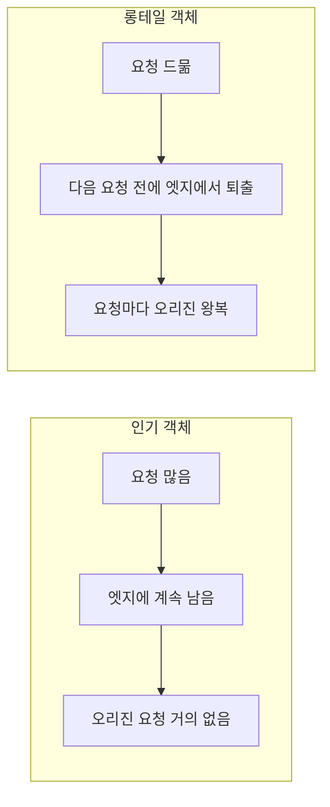
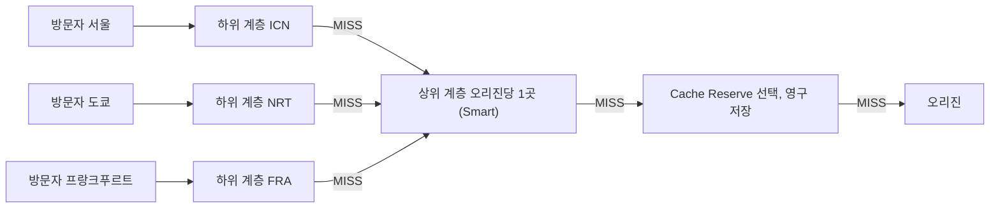
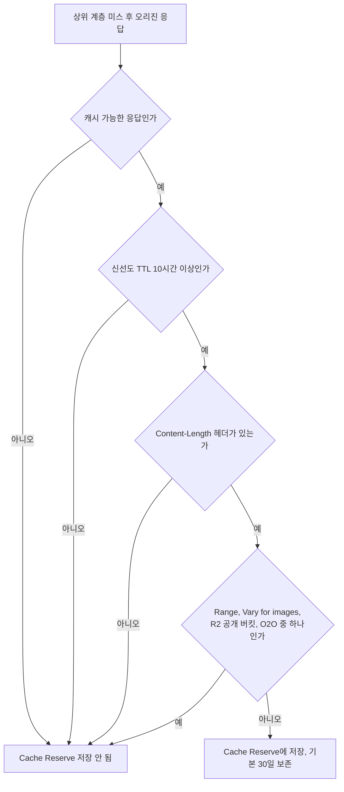
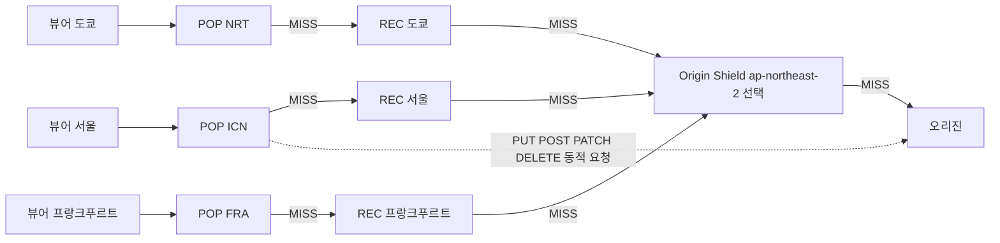
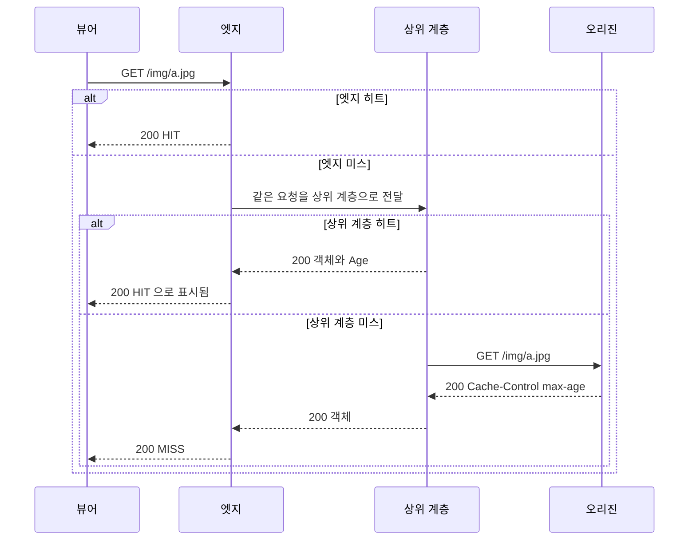
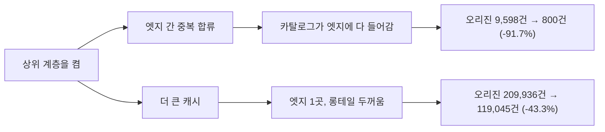
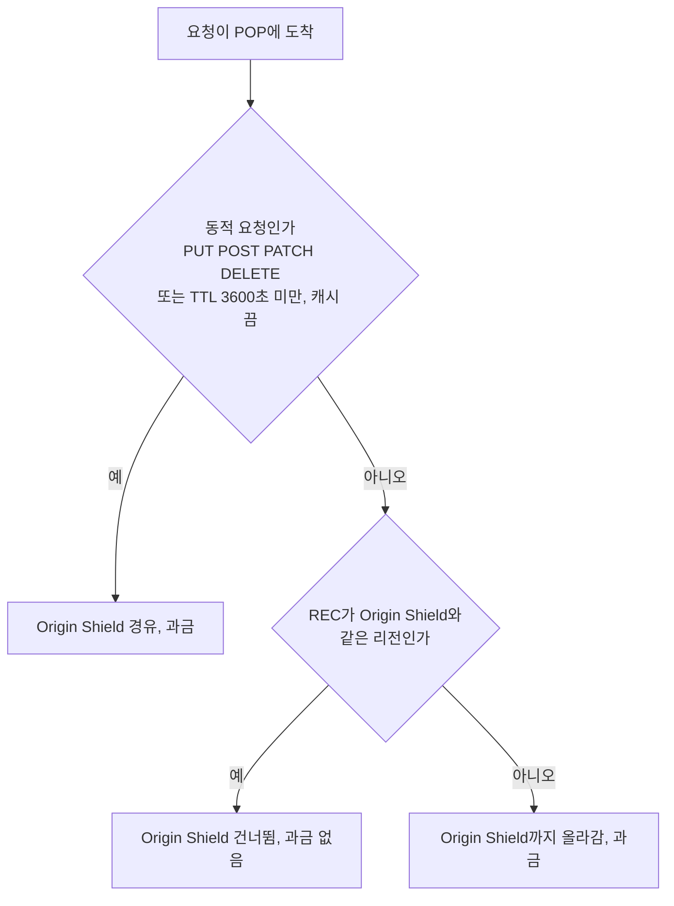
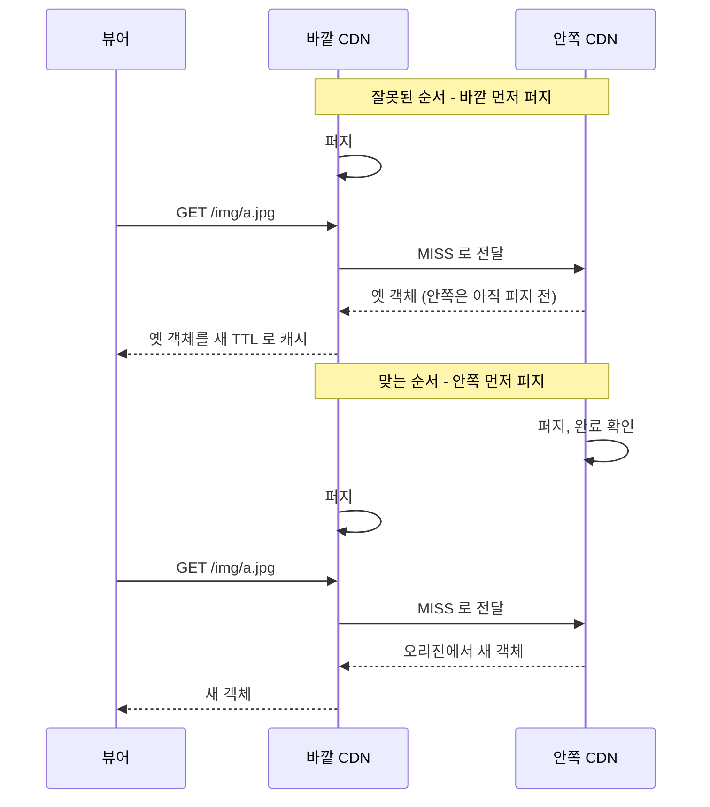
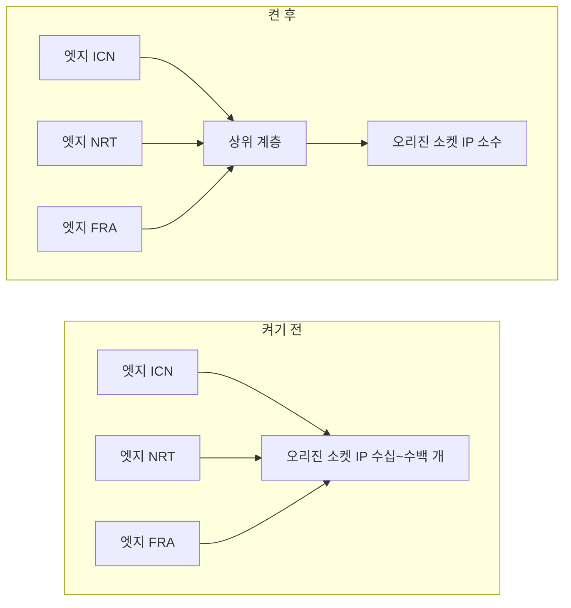

# CDN 상위 캐시 계층 비교 (Cloudflare Tiered Cache·Cache Reserve와 CloudFront Origin Shield)

CDN을 붙이고 엣지 히트율 대시보드가 80%를 넘으면 오리진 부하 문제는 끝났다고 생각하기 쉽다. 그런데 오리진 접속 로그를 열어 보면 같은 이미지 URL이 몇 분 간격으로 여러 번 찍혀 있다. 엣지 히트율은 방문자 쪽에서 본 숫자이고, 오리진이 받는 요청 수는 엣지가 몇 곳이고 각 엣지가 객체를 얼마나 오래 들고 있느냐에 따라 따로 움직인다.

엣지와 오리진 사이에 캐시를 한 겹 더 두는 기능이 이 틈을 메운다. Cloudflare는 Tiered Cache(필요하면 Cache Reserve까지), CloudFront는 Regional Edge Cache와 Origin Shield가 그 역할이다. 이 문서는 두 쪽의 구조를 나란히 놓고, 켜면 오리진 요청이 얼마나 줄어드는지, 얼마를 내는지, 켜고 나서 무엇이 달라지는지를 정리한다. 제품 전체 비교는 [Cloudflare vs CloudFront](Cloudflare_vs_Cloud_Front.md), CloudFront 단독 설정은 [AWS CloudFront](../AWS/Network/CDN.md), 프록시 모드와 DNS는 [Cloudflare DNS](Cloudflare_DNS.md)에 있다.

---

## 롱테일 객체가 엣지에서 먼저 쫓겨난다

엣지 캐시는 용량이 유한하다. Cloudflare는 캐시가 가득 차면 LRU로 객체를 내보내고, 객체가 얼마나 남아 있을지는 상대적 인기도와 캐시 크기가 정하며 설정으로 바꿀 수 없다([Retention vs Freshness](https://developers.cloudflare.com/cache/concepts/retention-vs-freshness/)). CloudFront 문서도 같은 얘기를 한다. 객체가 덜 인기 있어지면 개별 POP가 자리를 비우려고 내보내고, Regional Edge Cache는 POP보다 캐시가 커서 더 오래 들고 있는다([How CloudFront works with regional edge caches](https://docs.aws.amazon.com/AmazonCloudFront/latest/DeveloperGuide/HowCloudFrontWorks.html)).

TTL이 하루로 설정돼 있어도 이 사정은 달라지지 않는다. TTL은 "이 시간 동안은 오리진에 안 물어봐도 된다"는 상한일 뿐이고, 그 시간 안에 밀려나는 것은 막지 못한다. 상품 이미지 50만 장 중 하루에 한두 번 조회되는 장수가 대부분인 서비스를 생각하면 된다. 이런 객체는 요청이 올 때마다 그 엣지에서 이미 쫓겨나 있을 확률이 높다. 엣지가 12곳이면 같은 객체를 엣지마다 한 번씩, 최대 12번 오리진에서 받아 간다.



인기 객체는 엣지 히트율을 끌어올리는 쪽이고, 롱테일 객체는 히트율 숫자에 거의 영향이 없는데 오리진 요청 수는 이쪽이 만든다. 히트율이 95%여도 남은 5%가 전부 롱테일이면 오리진 요청은 "엣지 수 × 롱테일 객체 수"에 비례해 늘어난다. 상위 계층은 이 중복을 한 곳에서 받아 주려고 존재한다.

---

## 두 CDN의 계층 구조

### Cloudflare

Cloudflare는 데이터센터를 하위 계층(lower tier)과 상위 계층(upper tier)으로 나눈다. 하위 계층은 대체로 방문자와 가까운 곳이고, 여기서 미스가 나면 상위 계층에 물어본다. 오리진에 직접 요청하는 건 상위 계층뿐이다. 오리진 입장에서는 접속이 전 세계 수백 곳이 아니라 소수의 데이터센터에서 들어오게 된다([Tiered Cache](https://developers.cloudflare.com/cache/how-to/tiered-cache/)).



세 하위 계층의 미스가 상위 계층 한 곳으로 모이고, 거기서도 없을 때만 Cache Reserve와 오리진으로 간다는 점을 보면 된다. 토폴로지는 네 가지다.

| 토폴로지 | 상위 계층을 고르는 방식 | 플랜 |
|---|---|---|
| Smart | 오리진마다 지연이 가장 낮은 데이터센터 1곳을 자동 선택 | Free 포함 전 플랜 |
| Generic Global | 캐시 키의 일관 해시로 지역 풀에서 선택 | Enterprise |
| Regional (중간 계층) | 하위 계층 근처 허브를 한 번 더 거침 | Enterprise |
| Custom | 계정 담당자와 토폴로지 설계 | Enterprise |

Cache Reserve는 R2 위에 만든 영구 저장소다. 평소 CDN 캐시는 인기도에 따라 밀려나지만 Cache Reserve에 들어간 객체는 기본 보존 30일 동안 남고, 요청이 오면 보존 기간이 다시 시작된다. 상위 계층에서 미스가 나도 오리진에 가기 전에 한 번 더 막아 주는 층이라 롱테일 객체에 맞다. 대신 들어갈 수 있는 객체에 조건이 있다([Cache Reserve](https://developers.cloudflare.com/cache/advanced-configuration/cache-reserve/)).

- 캐시 가능한 응답이어야 한다
- 신선도 TTL이 10시간 이상이어야 한다
- 응답에 `Content-Length` 헤더가 있어야 한다
- 오리진 Range 요청, Vary for images, 존에 연결된 R2 공개 버킷, O2O 구성에서는 쓰이지 않는다

위 조건을 순서대로 통과해야 Cache Reserve에 저장된다.



### CloudFront

CloudFront는 POP(엣지 로케이션) 위에 Regional Edge Cache(REC)가 자동으로 붙는다. 끌 수 없다. POP에서 미스가 나면 REC로 가고, 여기도 없으면 오리진으로 간다. Origin Shield는 그 사이에 오리진 단위로 지정한 리전 한 곳을 끼워 넣는 선택 기능이다.



REC는 지역별로 하나씩 있어서 POP 사이의 중복은 합쳐 주지만 지역 사이의 중복은 못 합친다. 서울 REC와 도쿄 REC가 같은 객체를 각자 오리진에서 가져가는 걸 Origin Shield가 한 곳으로 모은다. 점선은 REC를 거치지 않는 경로다. PUT·POST·PATCH·OPTIONS·DELETE와 요청 시점에 동적으로 판정된 요청은 POP에서 오리진으로 바로 간다. 오리진이 S3이고 최적 REC가 같은 리전에 있으면 POP가 REC를 건너뛴다([HowCloudFrontWorks](https://docs.aws.amazon.com/AmazonCloudFront/latest/DeveloperGuide/HowCloudFrontWorks.html)).

### 구성 요소 대응표

| 역할 | Cloudflare | CloudFront |
|---|---|---|
| 방문자 쪽 캐시 | 하위 계층 데이터센터 | POP |
| 지역 합류 | Regional Tiered Cache (Enterprise) | Regional Edge Cache (자동) |
| 오리진 직전 단일 합류 지점 | 상위 계층 (Smart는 오리진당 1곳) | Origin Shield (리전 1곳 지정) |
| 오래 보관하는 층 | Cache Reserve (R2, 기본 30일) | 해당 없음 |
| 켜는 위치 | 존 설정 | 오리진 설정 |
| 켜는 비용 | Tiered Cache 자체는 전 플랜 사용 가능. Cache Reserve는 사용량 과금 | Origin Shield 요청당 과금 |

Cloudflare 대시보드의 일부 항목(Smart Tiered Cache, Regional Tiered Cache, Cache Reserve)은 2026년 현재 문서에서 "Smart Shield"라는 오리진 보호 기능으로 묶여 안내되고 있다. 기능이 사라진 게 아니라 메뉴 위치와 이름이 바뀌는 중이라, 화면이 여기 적은 것과 다를 수 있다.

---

## 캐시 미스 한 건이 오리진까지 가는 길

같은 구조를 요청 한 건의 시간 순서로 보면 각 계층이 어디서 응답을 끊는지 보인다. 아래 시퀀스는 두 CDN에 공통이다. Cloudflare에서는 "상위 계층"이 upper tier(필요하면 Cache Reserve 포함)이고, CloudFront에서는 REC와 Origin Shield 두 단이 이 자리를 차지한다.



확인할 점이 두 가지다. 첫째, 상위 계층에서 히트가 나면 뷰어에게는 HIT처럼 보인다. Cloudflare 문서는 `Age`가 네트워크 전체 캐시 기준이라 로컬 HIT도 상위 계층에서 물려받은 값을 가질 수 있다고 설명하고, CloudFront 문서는 Origin Shield 역할을 하는 REC에서 난 히트가 로그에 `OriginShieldHit`이 아니라 `Hit`으로 찍힌다고 설명한다. 둘째, 오리진까지 가는 건 맨 아래 분기뿐이라서 헤더만 봐서는 "엣지 히트"와 "상위 계층 히트"를 가르기 어렵다. 구분하는 방법은 마지막 절에 있다.

---

## 상위 계층을 켜면 오리진 요청이 얼마나 줄어드는가

실서비스 수치를 인용하는 대신 직접 시뮬레이션을 돌렸다. 두 CDN의 실제 캐시 용량과 퇴출 정책은 공개되어 있지 않아서 숫자를 그대로 믿으면 안 되고, 어느 방향으로 얼마나 움직이는지 감을 잡는 용도다. 조건은 이렇다.

- 엣지 12곳이 각자 LRU 캐시를 가진다. 용량은 1,000개
- 카탈로그는 객체 20만 개, 요청 분포는 Zipf(지수 0.9)
- 요청은 엣지 12곳에 균등하게 떨어진다
- TTL, 퍼지, 객체 크기 차이, 동시 미스 병합은 넣지 않았다
- 상위 계층은 하나이고 역시 LRU다

```python
import random, itertools, bisect
from collections import OrderedDict

class LRU:
    def __init__(self, cap): self.cap, self.d = cap, OrderedDict()
    def get(self, k):
        if k in self.d:
            self.d.move_to_end(k); return True
        return False
    def put(self, k):
        self.d[k] = 1; self.d.move_to_end(k)
        if len(self.d) > self.cap: self.d.popitem(last=False)

def run(requests, edges, catalog, alpha, edge_cap, upper_cap, seed=1):
    rng = random.Random(seed)
    cum = list(itertools.accumulate(1.0 / i ** alpha for i in range(1, catalog + 1)))
    draw = lambda: bisect.bisect_left(cum, rng.random() * cum[-1])
    E = [LRU(edge_cap) for _ in range(edges)]
    U = LRU(upper_cap) if upper_cap else None
    edge_hit = upper_hit = origin = 0
    for _ in range(requests):
        k, e = draw(), E[rng.randrange(edges)]
        if e.get(k):
            edge_hit += 1; continue
        if U is not None and U.get(k):
            upper_hit += 1
        else:
            origin += 1
            if U is not None: U.put(k)
        e.put(k)
    return edge_hit, upper_hit, origin

if __name__ == "__main__":
    n = 3_000_000
    base = run(n, 12, 200_000, 0.9, 1_000, 0)
    for cap in (0, 5_000, 20_000, 60_000):
        eh, uh, o = run(n, 12, 200_000, 0.9, 1_000, cap)
        print(f"상위 용량 {cap:>6,}  엣지히트 {eh/n:5.1%}  상위히트 {uh/n:5.1%}  "
              f"오리진 {o:>9,}  기준 대비 {o/base[2]-1:+.1%}")
```

요청 300만 건 기준 결과는 이렇다. 표준 라이브러리만 쓰고 돌리는 데 몇 분 걸린다.

| 상위 계층 용량 (카탈로그 대비) | 엣지 히트율 | 상위 계층 히트율 | 오리진 요청 | 기준 대비 |
|---|---|---|---|---|
| 없음 | 29.9% | 0% | 2,102,692 | 기준 |
| 5,000 (2.5%) | 29.9% | 14.8% | 1,657,635 | -21.2% |
| 20,000 (10%) | 29.9% | 31.5% | 1,157,674 | -44.9% |
| 60,000 (30%) | 29.9% | 47.4% | 679,997 | -67.7% |

엣지 히트율은 어느 행에서도 29.9%로 같다. 엣지 캐시 구성이 그대로이니 당연한데, 이 점이 중요하다. 대시보드의 엣지 히트율은 상위 계층을 켜도 움직이지 않고 오리진 요청 수만 줄어든다. 켠 효과를 엣지 히트율로 확인하려 하면 아무 변화가 없어서 "효과 없음"으로 오판하기 쉽다. 오리진 쪽 요청 수와 비교해야 한다.

효과가 어디서 나오는지 나눠 보려고 조건을 바꿔 더 돌렸다(요청 30만 건).

| 조건 | 상위 계층 없음 | 상위 계층 있음 | 변화 |
|---|---|---|---|
| 엣지 12곳, 카탈로그 800개(엣지 용량보다 작음), 상위 용량 20,000 | 오리진 9,598 | 800 | -91.7% |
| 엣지 1곳에 트래픽 집중, 카탈로그 20만, 상위 용량 20,000 | 오리진 209,936 | 119,045 | -43.3% |
| 엣지 12곳, 카탈로그 5,000, 상위 용량 5,000 | 오리진 106,229 | 5,000 | -95.3% |

카탈로그가 엣지에 다 들어가는 첫 행에서는 오리진 요청 9,598건이 800건이 된다. 객체 800개를 엣지 12곳이 각자 처음 한 번씩 받아 가던 것(800 × 12)이 상위 계층에서 한 번(800)으로 합쳐진 것이다. 엣지 1곳뿐인 두 번째 행에서는 합칠 엣지가 없는데도 줄어든다. 상위 계층이 엣지보다 캐시가 커서 엣지에서 밀려난 객체를 더 오래 들고 있기 때문이다. 상위 계층의 효과는 "엣지 간 중복 합류"와 "더 큰 캐시" 두 가지가 섞인 것이고, 롱테일이 두꺼울수록 후자가 크게 나온다.

두 요인이 어느 조건에서 각각 지배적인지를 위 세 행에 대응시키면 아래와 같다.



위쪽 가지는 합칠 엣지가 많을수록, 아래쪽 가지는 엣지에서 밀려나는 객체가 많을수록 크게 나온다.

트래픽이 작을 때는 어떨까. 같은 설정에서 총 요청을 2만 건으로 줄이면 상위 계층 용량이 5,000이든 60,000이든 오리진 요청이 비슷하게 11,000건대에서 멈춘다(상위 5,000이면 11,608건, 20,000 이상이면 11,003건). 아직 한 번도 안 본 객체는 어느 계층에서도 받아 줄 수 없기 때문이다. 상대적으로 22~27% 줄지만 절대 수는 4,000건 안팎이다. 이 정도 규모에서는 줄어드는 요청 수보다 켜는 비용과 미스 때의 지연 한 단계가 더 신경 쓰인다.

---

## 켜는 방법

### Cloudflare

Tiered Cache와 Smart 토폴로지는 API 한 번씩이다. 토큰에는 Zone Settings Write 또는 Zone Write 권한이 필요하다([Tiered Cache](https://developers.cloudflare.com/cache/how-to/tiered-cache/)).

```bash
export ZONE_ID=...
export CLOUDFLARE_API_TOKEN=...

# Tiered Cache 켜기
curl "https://api.cloudflare.com/client/v4/zones/$ZONE_ID/argo/tiered_caching" \
  --request PATCH \
  --header "Authorization: Bearer $CLOUDFLARE_API_TOKEN" \
  --json '{ "value": "on" }'

# Smart 토폴로지
curl "https://api.cloudflare.com/client/v4/zones/$ZONE_ID/cache/tiered_cache_smart_topology_enable" \
  --request PATCH \
  --header "Authorization: Bearer $CLOUDFLARE_API_TOKEN" \
  --json '{ "value": "on" }'
```

오리진이 AWS·GCP·Azure·Oracle Cloud 위에 있으면 클라우드 리전 힌트를 반드시 준다. 이 환경의 오리진은 애니캐스트나 리전 유니캐스트 주소를 쓰는 경우가 많아서 지연 측정만으로는 Smart가 오리진 위치를 못 찾는다. 힌트는 전 플랜에서 무료다.

```bash
curl "https://api.cloudflare.com/client/v4/zones/$ZONE_ID/cache/origin_cloud_regions" \
  --request PATCH \
  --header "Authorization: Bearer $CLOUDFLARE_API_TOKEN" \
  --json '{ "ip": "203.0.113.1", "vendor": "aws", "region": "ap-northeast-2" }'
```

Terraform으로 관리한다면 provider 5.x 기준 리소스는 아래다. 이 환경에는 `terraform`이 없어서 `validate`는 돌리지 못했고, 속성명은 provider 저장소 문서를 따랐다.

```hcl
terraform {
  required_providers {
    cloudflare = {
      source  = "cloudflare/cloudflare"
      version = "~> 5.0"
    }
  }
}

variable "zone_id" {
  type = string
}

resource "cloudflare_tiered_cache" "this" {
  zone_id = var.zone_id
  value   = "on"
}

# Cache Reserve 는 유료 플랜이 필요하다. Tiered Cache 없이 켜면 대시보드가 경고한다
resource "cloudflare_zone_cache_reserve" "this" {
  zone_id    = var.zone_id
  value      = "on"
  depends_on = [cloudflare_tiered_cache.this]
}
```

Cache Reserve 현재 상태는 GET으로 읽을 수 있다. 끌 때는 값을 `off`로 바꾼 뒤 저장된 데이터를 지우는 절차가 따로 있고, 삭제가 끝나기까지 최대 24시간이 걸린다.

```bash
curl "https://api.cloudflare.com/client/v4/zones/$ZONE_ID/cache/cache_reserve" \
  --header "Authorization: Bearer $CLOUDFLARE_API_TOKEN"
```

### CloudFront

Origin Shield는 오리진 블록 안에서 켠다. 리전은 오리진에서 지연이 가장 낮은 곳으로 고르고, 오리진이 Origin Shield를 제공하는 AWS 리전에 있으면 같은 리전을 쓴다. 서울(`ap-northeast-2`) 오리진이면 서울이다([Origin Shield](https://docs.aws.amazon.com/AmazonCloudFront/latest/DeveloperGuide/origin-shield.html)).

```hcl
# aws_cloudfront_distribution 리소스 안의 origin 블록
origin {
  domain_name = "origin.example.com"
  origin_id   = "api-origin"

  custom_origin_config {
    http_port              = 80
    https_port             = 443
    origin_protocol_policy = "https-only"
    origin_ssl_protocols   = ["TLSv1.2"]
  }

  origin_shield {
    enabled              = true
    origin_shield_region = "ap-northeast-2"
  }
}
```

Lambda@Edge를 쓰고 있다면 하나 더 알아야 한다. Origin Shield를 켜면 origin request·origin response 트리거가 Origin Shield 리전에서 실행된다. 장애로 보조 위치로 넘어가면 트리거도 같이 옮겨 간다. 뷰어 쪽 트리거는 영향이 없다. gRPC 요청은 Origin Shield를 거치지 않고 오리진으로 바로 간다.

---

## 비용과 켜면 손해인 경우

### Origin Shield

과금 단위는 Origin Shield로 들어온 요청 수이고, 요금은 엣지 위치가 아니라 지정한 Origin Shield 리전 기준이다. 오리진과 Origin Shield 사이 데이터 전송은 0원이다. 서울 리전 요금은 AWS 가격 목록(Price List API)에서 확인한 값으로 1만 건당 $0.009다([요금 페이지](https://aws.amazon.com/cloudfront/pricing/pay-as-you-go/), 리전별로 다르고 us-east-1은 $0.0075, 상파울루는 $0.016).

과금 대상이 되는 요청은 문서가 구분해 놓았다.

- 동적 요청은 전부 과금된다. PUT·POST·PATCH·DELETE이고, GET·HEAD라도 TTL이 3,600초 미만이거나 캐시를 끈 경우도 동적으로 취급한다
- 캐시 가능한 GET·HEAD·OPTIONS는 REC가 다른 리전에 있어서 Origin Shield까지 올라오는 요청만 과금된다
- REC가 Origin Shield와 같은 리전이면 Origin Shield를 건너뛰고 과금도 없다

요청 한 건이 과금되는지는 아래 순서로 갈린다.



한 달 1억 건을 가정하면 산수는 단순하다. TTL 60초짜리 API GET이 전부 Origin Shield를 지나면 1억 ÷ 1만 × $0.009 = $90이다. 그런데 TTL이 60초면 Origin Shield도 60초만 들고 있으니, 60초 안에 서로 다른 지역 REC가 같은 객체를 요청해야만 오리진 요청이 줄어든다. 돈은 모든 요청에 나가는데 흡수하는 요청은 일부다. 반대로 TTL 1일짜리 이미지에서 엣지 미스가 5%이고 그 전부가 다른 리전 REC에서 올라온다고 쳐도 1억 × 5% ÷ 1만 × $0.009 = $4.5다. 이미지 리사이즈 람다나 오리진 egress 비용이 한 번에 그보다 크면 켜는 쪽이 이득이다.

켜면 손해이거나 무의미한 경우는 문서에도 적혀 있다. 동적 콘텐츠, 캐시 가능성이 낮은 콘텐츠, 요청이 드문 콘텐츠다([Origin Shield](https://docs.aws.amazon.com/AmazonCloudFront/latest/DeveloperGuide/origin-shield.html)). 여기에 직접 따져 본 경우를 보태면 이렇다.

| 상황 | 이유 |
|---|---|
| 트래픽이 한국에 몰리고 오리진이 서울 | 뷰어가 가는 REC가 서울이면 Origin Shield(서울)는 건너뛰어지고 요금도 없지만 줄어드는 것도 없다 |
| API 응답을 TTL 수십 초로 캐시 | 모든 요청이 과금 대상이고 합류 효과는 TTL 안으로 제한된다 |
| 월 요청 수십만 건 이하 | 위 시뮬레이션처럼 절대 줄어드는 양이 작다. 요금도 몇 센트라 켜도 해는 없으나 효과를 측정하기 어렵다 |
| Origin Shield 리전을 오리진과 먼 곳에 지정 | 미스마다 홉이 하나 늘고 오리진까지 가는 구간도 길어져 지연만 붙는다 |
| 이미 오리진 앞에 캐시 서버가 한 겹 있다 | 합류 지점이 두 개가 되어 어느 쪽이 히트를 만드는지 가려지고 퍼지 순서도 꼬인다 |

### Cache Reserve

Cache Reserve는 저장량과 작업 횟수를 따로 센다. 요금은 문서 기준 저장 $0.015/GB-월, Class A(쓰기) 백만 건당 $4.50, Class B(읽기) 백만 건당 $0.36이고 작업은 백만 건 단위로 올림한다([Cache Reserve 요금](https://developers.cloudflare.com/cache/advanced-configuration/cache-reserve/)). Cache Reserve 미스 한 건은 보통 A 1건과 B 1건, 히트 한 건은 B 1건이다. 1GB 넘는 객체는 크기에 비례해 작업이 늘어난다.

문서의 두 번째 예시가 어디서 돈이 나가는지 잘 보여 준다. 1MB 객체 100만 개가 매일 한 번 만료돼 다시 쓰이고 하루 두 번 읽히면 한 달 비용은 $171.60이다. 저장은 1,000GB-월에 $15뿐이고 쓰기 3,000만 건이 $135를 차지한다. 객체가 자주 다시 채워지는 서비스에서는 저장 용량이 아니라 "다시 쓰는 횟수"가 비용을 결정한다.

Cache Reserve가 손해로 기우는 경우를 정리하면 이렇다.

- 객체 수정이 잦아 TTL이 10시간 미만이면 아예 들어가지 못해 효과가 없다. 반대로 10시간을 겨우 넘기는 TTL로 매일 갱신되면 위 예시처럼 쓰기 비용이 커진다
- Tiered Cache 없이 켜면 저장소 작업 비용이 더 나올 수 있다고 문서가 경고하고, 대시보드도 경고를 띄운다
- Cache Reserve는 오리진에 `Accept-Encoding: gzip`을 붙이지 않고 요청한다. 오리진이 압축 없이 원본 크기로 응답하므로, 텍스트 자산이 많으면 오리진 egress가 의외로 늘 수 있다
- 오리진 Range 요청은 Cache Reserve가 지원하지 않는다. 영상처럼 Range로 읽는 파일은 기대한 만큼 효과가 안 난다

Tiered Cache 자체는 Free 플랜에서도 켤 수 있고 추가 요금이 문서에 없다. 손해라면 요금이 아니라 지연과 동작 변화다. 미스가 났을 때 상위 계층을 한 번 거치므로 `OriginResponseDurationMs`가 늘 수 있고, 같은 URL의 일부 요청만 느린 증상으로 나타난다(진단법은 마지막 절). 오리진 IP나 DNS를 바꾸면 상위 계층이 재배정되어 일시적으로 MISS가 늘어난다는 점도 문서에 있다.

---

## 퍼지와 무효화에서 생기는 함정

상위 계층이 생기면 "지웠는데 안 지워진 것 같다"는 문의가 늘어난다. 원인은 대개 계층이 아니라 지운 범위와 시점이다. 문서로 확인된 동작부터 보면 이렇다.

CloudFront는 REC가 POP와 기능이 같아서 무효화 요청이 POP와 REC 양쪽에서 객체를 지운다. Origin Shield는 REC 기능을 바탕으로 만들어졌다고 되어 있지만, 무효화가 Origin Shield 캐시를 지운다고 명시한 문장은 찾지 못했다. 그래서 같은 URL을 덮어쓰는 배포는 확신하기 어렵고, AWS도 객체를 자주 바꾸면 무효화보다 파일명에 버전을 넣는 쪽을 권한다. 무효화는 요청을 보낸 뒤 취소할 수 없고 모든 엣지에 몇 초 안에 전달된다고 되어 있으니, 끝났는지 확인하는 단계를 배포 스크립트에 넣어 둔다([Invalidation](https://docs.aws.amazon.com/AmazonCloudFront/latest/DeveloperGuide/Invalidation.html)).

```bash
ID=$(aws cloudfront create-invalidation \
  --distribution-id E2EXAMPLE123 \
  --paths "/img/a.jpg" \
  --query 'Invalidation.Id' --output text)

aws cloudfront wait invalidation-completed \
  --distribution-id E2EXAMPLE123 --id "$ID"
```

Cloudflare의 Cache Reserve는 퍼지 방식에 따라 동작이 갈린다.

| 방법 | Cache Reserve에서의 동작 |
|---|---|
| URL 퍼지 | 저장된 객체를 삭제한다 |
| 태그·호스트·프리픽스·전체 퍼지 | 즉시 삭제하지 않는다. 다음 요청은 미스가 되지만 새로 쓰이거나 보존 기간이 끝날 때까지 저장 비용이 계속 나간다 |
| Invalidation(만료 표시) | 객체를 남기고 stale로 표시한다. 오리진이 304로 답하면 저장된 본문을 그대로 재사용하고, 이때 갱신은 Class A 작업이다 |

304 재사용에는 함정이 있다. Cache Response Rules로 붙인 캐시 태그 같은 메타데이터는 304 응답으로는 갱신되지 않으므로, 태그를 바꿨다면 invalidation이 아니라 퍼지로 지워야 한다. 본문이 바뀌었는데 ETag나 Last-Modified가 그대로여서 오리진이 304를 주는 경우도 같은 구조로 옛 본문이 계속 나간다.

두 CDN을 겹쳐 쓰는 구성(예를 들어 Cloudflare 앞단에 CloudFront 뒤단)에서는 문제가 더 직접적이다. 바깥 CDN을 퍼지해도 안쪽 CDN이 옛 객체를 들고 있으면 바깥이 그것을 다시 가져와 새 TTL로 캐시한다. 안쪽부터 지우고 바깥을 지우는 순서가 맞다. 아래 도식에서 두 순서의 차이를 본다.



퍼지 한도도 따로 있으니 [Cloudflare vs CloudFront](Cloudflare_vs_Cloud_Front.md)의 Invalidation 비용 절을 같이 본다.

퍼지가 먹었는지는 반복 요청으로 확인한다. `Age`가 0 근처로 리셋되고 `cf-cache-status`가 MISS로 한 번 바뀐 뒤 HIT로 돌아오면 정상이다. 여러 번 요청해도 오래된 `Age`가 나오면 어딘가 안쪽 계층이 옛 객체를 들고 있다는 뜻이다.

```bash
for i in $(seq 1 10); do
  curl -s -o /dev/null -D - "https://cdn.example.com/img/a.jpg" \
    | tr -d '\r' | grep -iE '^(cf-cache-status|age|x-cache):' | tr '\n' ' '
  echo
  sleep 1
done
```

---

## 오리진에서 보이는 출발지 IP가 바뀐다

상위 계층을 켜면 오리진에 접속하는 쪽이 "방문자와 가까운 엣지 수백 곳"에서 "상위 계층 소수 곳"으로 바뀐다. Cloudflare 문서도 연결이 소수 데이터센터에서 오게 된다고 적고 있다. 오리진 앞에서 소켓 IP로 뭔가를 하고 있었다면 영향이 있다.



영향이 나는 곳은 두 군데다.

**IP 허용목록.** CDN 대역만 오리진에 들이도록 보안 그룹이나 방화벽을 묶어 뒀다면 대역 목록이 새 출발지를 포함하는지 확인한다. Cloudflare는 `https://www.cloudflare.com/ips-v4`, `ips-v6`에 공개 대역을 올려 두며 2026-10-01에 받은 값은 IPv4 15개, IPv6 7개였다. CloudFront는 `ip-ranges.json`의 `CLOUDFRONT_ORIGIN_FACING` 서비스가 오리진으로 나가는 대역이고 같은 날 기준 46개였다. 보안 그룹에는 관리형 프리픽스 리스트 `com.amazonaws.global.cloudfront.origin-facing`을 쓰면 대역 갱신을 따라간다. Origin Shield 경유 요청이 같은 대역에서 나오는지는 문서에서 별도로 확인하지 못했으니, 켠 직후 오리진 접속 로그에서 출발지가 허용목록 안에 있는지 보는 게 안전하다.

```hcl
data "aws_ec2_managed_prefix_list" "cloudfront_origin" {
  name = "com.amazonaws.global.cloudfront.origin-facing"
}

resource "aws_vpc_security_group_ingress_rule" "from_cloudfront" {
  security_group_id = aws_security_group.origin.id
  prefix_list_id    = data.aws_ec2_managed_prefix_list.cloudfront_origin.id
  ip_protocol       = "tcp"
  from_port         = 443
  to_port           = 443
}
```

관리형 프리픽스 리스트는 보안 그룹 규칙 한도에 리스트의 최대 항목 수만큼 반영된다. 규칙이 많은 보안 그룹에 붙일 때는 AWS의 보안 그룹 한도 문서에서 계산 방식을 확인한다.

**레이트리밋과 접속 수 제한.** 오리진의 Nginx가 `$binary_remote_addr` 기준으로 `limit_req`를 걸고 있었다면, 켜기 전에도 소켓 IP는 CDN 주소였지만 그 주소가 많이 흩어져 있어 한도에 잘 안 걸렸다. 상위 계층 뒤에서는 같은 한도를 소수의 주소가 나눠 쓰므로 정상 트래픽이 429를 맞을 수 있다. 방문자 IP를 헤더에서 복원해서 그 값 기준으로 제한해야 한다.

```bash
# Cloudflare 대역을 nginx real_ip 설정으로 만든다
{ curl -s https://www.cloudflare.com/ips-v4; echo; curl -s https://www.cloudflare.com/ips-v6; } \
  | sed '/^$/d;s/.*/set_real_ip_from &;/' > /etc/nginx/cloudflare_ips.conf
```

```nginx
include /etc/nginx/cloudflare_ips.conf;
real_ip_header CF-Connecting-IP;

limit_req_zone $binary_remote_addr zone=perip:10m rate=20r/s;
```

`real_ip_header`로 복원한 뒤에는 `$binary_remote_addr`가 방문자 IP가 된다. 상위 계층 경유 요청에서도 `CF-Connecting-IP`가 방문자 IP로 유지되는지는 이 문서를 쓰면서 확인하지 못했다. 켠 직후 오리진 로그에서 이 헤더 값이 CDN 대역으로 나오는 요청이 없는지 확인하고 넘어간다. CloudFront 쪽 뷰어 IP는 오리진 요청 정책이 `X-Forwarded-For`나 `CloudFront-Viewer-Address`를 전달하도록 설정되어 있어야 오리진에 보인다.

---

## 헤더로 직접 확인하기

설정을 켠 뒤 값을 확인하는 가장 빠른 방법은 `curl`로 같은 URL을 여러 번 부르는 것이다. HEAD(`-I`)는 캐시 키가 GET과 다르게 취급될 수 있어서 `-o /dev/null -D -`로 GET 응답 헤더만 뽑는다.

```bash
#!/usr/bin/env bash
# probe.sh URL [횟수]
url="$1"; n="${2:-4}"
for i in $(seq 1 "$n"); do
  printf '#%s ' "$i"
  curl -s -o /dev/null -D - "$url" \
    | tr -d '\r' \
    | grep -iE '^(cf-cache-status|cf-ray|x-cache|x-amz-cf-pop|age):' \
    | tr '\n' ' '
  echo
  sleep 1
done
```

2026-10-01에 공개 사이트 세 곳에 이 스크립트를 돌린 출력이다. 서울에서 요청했다.

```text
== developers.cloudflare.com/cache/ (Cloudflare)
#1 cf-cache-status: HIT cf-ray: a43bfbba98eb5704-ICN
#2 cf-cache-status: HIT cf-ray: a43bfbc48964a422-ICN
#3 cf-cache-status: HIT cf-ray: a43bfbcd7b5bf428-ICN
#4 cf-cache-status: HIT cf-ray: a43bfbd8bfec580b-ICN

== docs.aws.amazon.com/ (CloudFront)
#1 X-Cache: Hit from cloudfront X-Amz-Cf-Pop: ICN53-P1 Age: 41
#2 X-Cache: Hit from cloudfront X-Amz-Cf-Pop: ICN53-P1 Age: 42
#3 X-Cache: Hit from cloudfront X-Amz-Cf-Pop: ICN53-P1 Age: 45

== cdnjs.cloudflare.com/ajax/libs/jquery/3.7.1/jquery.min.js
#1 cf-cache-status: BYPASS age: 591917 cf-ray: a43bfc0b5945723a-ICN
#2 cf-cache-status: BYPASS age: 591919 cf-ray: a43bfc164a6aa865-ICN
```

이 출력에서 읽을 수 있는 것과 없는 것을 나눠 둔다.

- `cf-ray` 끝의 `ICN`은 요청을 받은 하위 계층 데이터센터(공항 코드)다. 요청마다 앞부분 ID는 달라도 끝 코드는 같다
- CloudFront의 `X-Amz-Cf-Pop`은 응답한 POP다. `Age`가 요청 사이 시간만큼 늘어나면 같은 캐시 사본이 계속 나간다는 증거다
- 첫 번째 사이트는 `Age` 헤더가 아예 없었다. 문서는 HIT에 `Age`를 붙인다고 하는데 이 사이트는 달랐고, 이유(사이트 설정 여부)는 확인하지 못했다. `Age` 유무로 히트를 판정하면 안 된다
- 세 번째 사이트는 `BYPASS`인데 `Age`가 59만 초다. 문서에 따르면 `BYPASS` 응답의 `Age`는 오리진이 보낸 값이 그대로 전달된 것일 수 있다. 이 응답은 Cloudflare 캐시에서 나온 게 아니다
- 첫 번째 사이트에 존재하지 않는 쿼리스트링(`?x=난수`)을 붙여 처음 요청했는데도 바로 HIT가 나왔다. 이 사이트는 캐시 키가 쿼리를 무시하는 것으로 보인다. 캐시 우회 용도로 쿼리 난수를 붙여 롱테일을 흉내 내려 해도 이런 설정에서는 안 먹으니, 경로 자체가 다른 객체를 쓴다

헤더만으로는 엣지 히트와 상위 계층 히트가 구분되지 않는다. 구분하려면 로그를 본다.

| 보고 싶은 것 | Cloudflare | CloudFront |
|---|---|---|
| 상위 계층을 탔는지 | Logpush `http_requests`의 `CacheTieredFill`(true면 상위 계층 조회) | 표준 로그 `x-edge-detailed-result-type`의 `OriginShieldHit` |
| 어느 데이터센터인지 | `EdgeColoCode`, `UpperTierColoID` | `x-edge-location` |
| Cache Reserve 사용 | `CacheReserveUsed` | 해당 없음 |
| 주의 | `cf-cache-status`만으로는 어느 계층 히트인지 모른다 | REC가 Origin Shield 역할로 응답하면 `OriginShieldHit`이 아니라 `Hit`으로 찍힌다 |

Cloudflare에서 요청이 느린 URL이 있으면 Log Explorer에서 `CacheTieredFill`로 묶어 `OriginResponseDurationMs`를 비교한다. true인 쪽이 유독 길면 상위 계층 경유가 원인과 상관이 있다는 뜻이다. 다만 이 값은 상위 계층 조회, 오리진 이동, 오리진 처리 시간을 전부 합친 값이라 어느 구간이 느린지까지는 알려 주지 않는다([Investigate latency on tiered requests](https://developers.cloudflare.com/cache/troubleshooting/investigating-tiered-cache-latency/)).

켠 효과를 가장 정확히 보는 방법은 오리진 접속 로그다. 요청 경로에 무작위 토큰을 넣은 객체를 하나 만들고(`/probe/<토큰>.bin`), 서로 다른 지역의 서버 여러 대에서 한 번씩 요청해서 오리진에 몇 번 도착하는지 센다. 상위 계층이 없으면 지역 수만큼, 있으면 1번이어야 한다. 이 실험은 여러 지역에 접속할 수단이 있어야 해서 이 문서를 쓰는 환경에서는 돌리지 못했다. 위 시뮬레이션의 "카탈로그 800개" 행이 같은 현상을 숫자로 재현한 것이다.

### Worker로 반복 측정하기

로컬 터미널이 아니라 여러 지역에서 같은 확인을 반복하고 싶으면 Worker를 배포해 두고 URL만 바꿔 부르는 방법이 있다. 아래 Worker는 대상 URL에 `HEAD`를 다섯 번 보내고 응답 헤더를 JSON으로 돌려준다. Worker는 요청을 받은 Cloudflare 데이터센터에서 실행되므로 지역별 결과를 보려면 해당 지역에서 이 Worker를 호출해야 한다.

```toml
# wrangler.toml
name = "cache-probe"
main = "src/index.js"
compatibility_date = "2026-09-01"
```

```javascript
// src/index.js
export default {
  async fetch(request) {
    const target = new URL(request.url).searchParams.get("url");
    if (!target) return new Response("?url= 필요", { status: 400 });
    const rows = [];
    for (let i = 0; i < 5; i++) {
      const t0 = Date.now();
      const res = await fetch(target, { method: "HEAD" });
      rows.push({
        n: i + 1,
        status: res.status,
        ms: Date.now() - t0,
        cf: res.headers.get("cf-cache-status"),
        xcache: res.headers.get("x-cache"),
        age: res.headers.get("age"),
        pop: res.headers.get("x-amz-cf-pop"),
        ray: res.headers.get("cf-ray"),
      });
    }
    return Response.json(rows);
  },
};
```

```bash
npx wrangler deploy
curl "https://cache-probe.<서브도메인>.workers.dev/?url=https://docs.aws.amazon.com/"
```

이 환경에서는 `wrangler dev`가 워커 런타임(workerd)을 띄우지 못해서 Worker로는 실행하지 못했고, 같은 핸들러를 Node 20에서 직접 호출해 헤더 추출 로직만 확인했다. 그때 `docs.aws.amazon.com`은 다섯 번 모두 `Hit from cloudfront`, 같은 POP, 같은 `Age`가 나왔다. 응답 시간은 19~92ms 사이로 요청마다 흔들렸다. 배포 후 결과는 직접 확인해야 한다. 또 Worker의 `fetch`가 Cloudflare 존 안의 URL을 부르면 Worker 서브요청의 캐시 동작이 따로 적용되므로, 자기 존을 대상으로 측정할 때는 외부에서 `curl`로 부르는 쪽을 기준으로 삼는다.

---

## 관련 문서

- [Cloudflare vs CloudFront](Cloudflare_vs_Cloud_Front.md): 두 제품의 요금·보안·기능 전체 비교와 선택 기준
- [AWS CloudFront](../AWS/Network/CDN.md): 캐시 정책, `X-Cache` 값, Origin Shield 설정과 요금 구조
- [Cloudflare DNS](Cloudflare_DNS.md): 오렌지 클라우드 프록시 모드와 오리진 IP 노출
