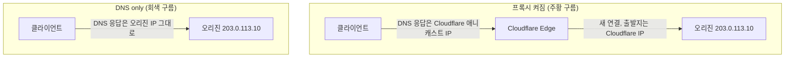
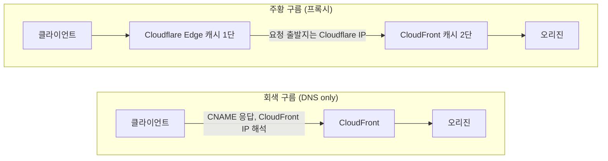
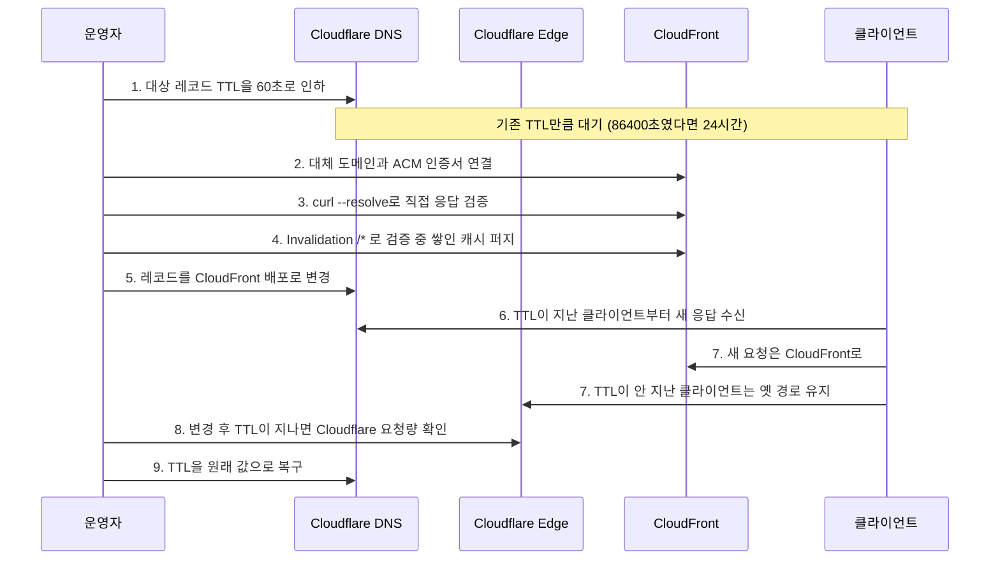
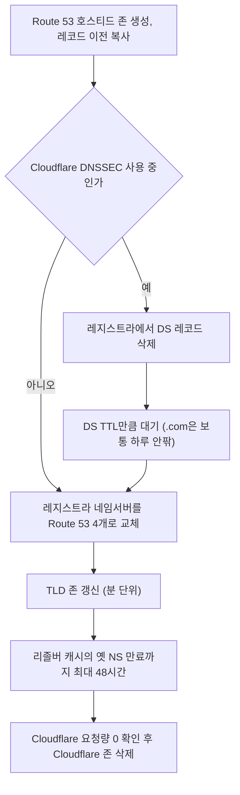

# Cloudflare DNS 설정 실무

도메인을 Cloudflare로 이전하면 DNS 관리 화면에서 레코드마다 작은 구름 아이콘이 붙는다. 주황색이면 Cloudflare 프록시를 통하는 것이고, 회색이면 DNS 조회만 한다. 이 둘의 차이를 모르고 쓰면 SSL이 예상대로 동작하지 않거나, 실제 서버 IP가 노출되거나, 특정 레코드 타입이 아예 프록시를 지원하지 않아 당황하게 된다.

## 프록시 모드(오렌지 클라우드) vs DNS-only

프록시 모드는 트래픽이 Cloudflare 엣지 서버를 경유한다. 클라이언트 입장에서는 실제 오리진 IP 대신 Cloudflare의 애니캐스트 IP를 받는다. DDoS 완화, WAF, 캐싱이 여기서 작동한다.

DNS-only(회색 구름)는 순수 DNS 레코드다. Cloudflare는 레코드를 저장하고 조회 응답만 내보내며 트래픽에는 관여하지 않는다. 오리진 IP가 그대로 노출된다.

아래 도식은 같은 `api.example.com`을 두 모드로 뒀을 때 클라이언트가 받는 IP와 오리진이 보는 출발지 IP가 어떻게 달라지는지 보여준다. 프록시가 켜지면 클라이언트는 오리진 IP를 알 방법이 없고, 오리진은 클라이언트가 아니라 Cloudflare 엣지만 본다.



위쪽은 TLS 연결이 두 번 맺어진다. 클라이언트와 엣지 사이, 엣지와 오리진 사이다. 아래쪽은 Cloudflare가 DNS 응답만 하고 빠지므로 WAF, 캐시, DDoS 완화가 전부 동작하지 않는다. 회색 구름으로 바꾸는 순간 오리진 IP가 `dig` 한 번으로 드러나기 때문에, 한번 노출된 IP는 이후 프록시를 다시 켜도 방화벽에서 Cloudflare 대역만 허용하도록 막아두지 않으면 우회 접근이 가능하다.

**프록시를 쓰면 발생하는 실질적인 차이:**

- 오리진으로 들어오는 연결은 Cloudflare IP에서 온다. `X-Forwarded-For`나 `CF-Connecting-IP` 헤더를 써야 실제 클라이언트 IP를 얻는다.
- `dig` 또는 `nslookup`으로 도메인을 조회하면 오리진 IP 대신 Cloudflare IP 대역(`104.x.x.x`, `172.x.x.x`)이 나온다.
- 오리진의 SSL 인증서 설정에 따라 SSL 모드(Flexible/Full/Full Strict)를 맞춰야 한다. Flexible은 브라우저-Cloudflare 구간만 HTTPS고 오리진은 HTTP다. Full Strict는 오리진에도 유효한 인증서가 있어야 한다.

**DNS-only가 필요한 경우:**

- MX 레코드 — Cloudflare 프록시는 MX를 지원하지 않는다. 이메일 서버 레코드는 항상 DNS-only다.
- SRV, CAA, NS, TXT 레코드 — 이 타입들은 프록시 토글 자체가 없거나 회색 고정이다.
- 오리진 서버에서 Cloudflare IP가 아닌 실제 클라이언트 IP를 받아야 하는 구조 — 이 경우는 프록시를 쓰되 `CF-Connecting-IP` 헤더를 처리하는 쪽이 낫다.

## 레코드 타입별 설정

### A / AAAA

A는 IPv4, AAAA는 IPv6를 가리킨다. 루트 도메인(`@`)과 서브도메인 모두 A 레코드를 쓸 수 있다.

```
Type: A
Name: @          (루트 도메인, example.com)
IPv4: 203.0.113.10
Proxy: 오렌지 (프록시 모드)
TTL: Auto

Type: A
Name: api        (api.example.com)
IPv4: 203.0.113.10
Proxy: 오렌지
TTL: Auto
```

여러 A 레코드를 같은 이름에 붙이면 라운드로빈으로 응답한다. Cloudflare 로드밸런서 없이 간단한 부하 분산을 할 수는 있지만, 특정 IP가 죽어도 DNS TTL만큼은 클라이언트 캐시에 남는다.

### CNAME

다른 도메인을 가리킨다. `www`를 루트 도메인에 붙이는 용도로 많이 쓴다.

```
Type: CNAME
Name: www
Target: example.com
Proxy: 오렌지
TTL: Auto
```

루트 도메인(`@`)에는 CNAME을 쓸 수 없다. CNAME은 같은 이름에 다른 레코드가 함께 있으면 안 된다는 RFC 규칙이 있고, 루트에는 SOA와 NS가 반드시 존재하기 때문이다. 일반 DNS 제공자에서 루트에 CNAME을 억지로 넣으면 MX, TXT 같은 레코드가 같이 깨진다.

### 루트 도메인 CNAME flattening과 Route 53 ALIAS

Cloudflare는 CNAME flattening으로 이 제약을 우회한다. `@`에 CNAME을 입력하면 Cloudflare가 대상 호스트명을 직접 조회해서 A/AAAA 레코드로 풀어 응답한다. 클라이언트에게는 CNAME이 보이지 않고 IP만 보이므로 루트에 MX가 공존해도 규칙을 어기지 않는다. 무료 플랜에서는 루트만 flatten되고, 서브도메인 CNAME까지 전부 flatten하는 옵션은 유료 플랜 기능이다.

Route 53에는 ALIAS 레코드가 같은 역할을 한다. 콘솔에서 A 레코드를 만들 때 Alias를 켜면 Route 53이 대상 AWS 리소스의 현재 IP로 응답한다. 이름이 CNAME 비슷하게 들리지만 레코드 타입은 A 또는 AAAA다.

| 항목 | Cloudflare CNAME flattening | Route 53 ALIAS |
|---|---|---|
| 입력하는 타입 | CNAME | A / AAAA (Alias 켬) |
| 클라이언트가 받는 응답 | A/AAAA | A/AAAA |
| 대상으로 지정할 수 있는 것 | 외부 도메인 포함 임의의 호스트명 | CloudFront, ELB, S3 웹사이트 엔드포인트, API Gateway 등 AWS 리소스와 같은 호스티드 존의 레코드 |
| TTL | 프록시 켜짐이면 Auto(300초), DNS only면 설정값 | 설정 불가. 대상 리소스의 TTL을 따른다 |
| 쿼리 비용 | 무료 | AWS 리소스를 대상으로 한 ALIAS 쿼리는 무료 |
| 대상 헬스 연동 | 없음 | Evaluate target health 옵션 |

Cloudflare에서 Route 53으로 옮길 때 가장 먼저 걸리는 곳이 대상 제한이다. Cloudflare에서는 루트가 `something.vercel-dns.com` 같은 외부 호스트를 가리키는 CNAME이어도 동작했다. Route 53 ALIAS는 AWS 밖의 호스트를 대상으로 못 잡기 때문에, 이런 루트 레코드는 고정 IP의 A 레코드로 바꾸거나 `www`만 CNAME으로 쓰고 루트는 리다이렉트로 돌려야 한다. 옮기기 전에 루트 레코드의 대상이 AWS 리소스인지부터 확인한다.

Terraform으로 루트를 CloudFront에 ALIAS로 연결하면 이렇게 쓴다. CloudFront의 호스티드 존 ID `Z2FDTNDATAQYW2`는 모든 배포에서 같은 고정값이다.

```hcl
resource "aws_route53_record" "apex" {
  zone_id = aws_route53_zone.main.zone_id
  name    = "example.com"
  type    = "A"

  alias {
    name                   = aws_cloudfront_distribution.main.domain_name
    zone_id                = "Z2FDTNDATAQYW2"
    evaluate_target_health = false
  }
}
```

IPv6 클라이언트용으로 같은 내용의 AAAA 레코드를 하나 더 만들어야 한다. A만 만들면 CloudFront에서 IPv6 접속이 조용히 빠진다.

### CloudFront 배포로 연결할 때 프록시를 켜면 생기는 일

Cloudflare DNS에 레코드를 두고 대상을 CloudFront 배포(`dxxxxxxxx.cloudfront.net`)로 잡는 구성은 흔하다. 이때 구름 색에 따라 동작이 완전히 달라진다.



주황 구름이면 캐시가 두 겹이 된다. 겪어본 문제는 대개 이 네 가지다.

첫째, 퍼지가 한쪽만 된다. 배포 파이프라인이 CloudFront Invalidation만 날리면 Cloudflare 엣지에는 옛 파일이 남는다. 정적 파일 해시가 바뀌었는데 HTML만 옛것이 나오는 증상이 여기서 나온다. 두 CDN을 다 비워야 하고, 어느 쪽이 응답했는지는 `cf-cache-status`와 `x-cache` 헤더를 같이 봐야 구분된다.

둘째, SSL 모드가 Flexible이면 리다이렉트 루프가 난다. Flexible은 Cloudflare가 오리진 쪽을 HTTP로 접속한다. CloudFront 배포의 Viewer protocol policy가 Redirect HTTP to HTTPS면 CloudFront가 301로 되돌려보내고, 클라이언트는 다시 Cloudflare로 들어와 같은 일이 반복된다. Full(Strict)로 바꾸면 해결된다. 이때 CloudFront에 대체 도메인 이름(CNAME)으로 `example.com`이 등록돼 있고 us-east-1의 ACM 인증서가 붙어 있어야 한다. Cloudflare는 원래 Host 헤더를 그대로 넘기기 때문에, 대체 도메인이 없으면 CloudFront가 403을 낸다.

셋째, 클라이언트 IP가 사라진다. CloudFront는 Cloudflare IP를 클라이언트로 보고, 오리진의 접근 로그와 지역 제한, 레이트 리밋이 전부 Cloudflare 대역 기준으로 동작한다. `CloudFront-Viewer-Address` 헤더에도 Cloudflare IP가 찍힌다. 실제 IP는 `CF-Connecting-IP`를 CloudFront origin request policy로 오리진에 전달해야 얻는다.

넷째, WAF가 두 곳에서 따로 동작한다. 한쪽에서 차단한 요청이 다른 쪽 로그에는 남지 않아서 원인을 찾을 때 양쪽 대시보드를 번갈아 봐야 한다.

CloudFront가 이미 캐시와 WAF를 맡고 있다면 해당 레코드는 회색 구름(DNS only)으로 둔다. Cloudflare를 DNS 호스팅으로만 쓰는 구성이다. 반대로 Cloudflare 캐시와 WAF를 쓰려는 것이면 CloudFront를 거치지 않고 오리진으로 바로 붙이는 편이 낫다. 두 CDN을 일부러 겹쳐 쓰는 경우는 이중 캐시 TTL과 퍼지 경로를 문서로 남겨두지 않으면 운영하는 사람이 바뀔 때 반드시 사고가 난다.

### MX

이메일 수신을 담당하는 레코드. 여러 MX를 등록할 수 있고 우선순위가 낮을수록 먼저 시도한다.

```
Type: MX
Name: @
Mail server: aspmx.l.google.com
Priority: 1

Type: MX
Name: @
Mail server: alt1.aspmx.l.google.com
Priority: 5
```

MX는 프록시 불가다. Cloudflare DNS 화면에서 자동으로 DNS-only로 고정된다. MX 레코드의 대상이 되는 서버도 A/CNAME으로 별도 등록해야 하는데, 그 레코드를 프록시로 설정하면 SMTP 연결이 막힌다. 메일 서버 레코드는 DNS-only로 유지한다.

### TXT

도메인 소유권 확인, SPF, DKIM, DMARC에 쓰인다.

```
Type: TXT
Name: @
Content: "v=spf1 include:_spf.google.com ~all"

Type: TXT
Name: _dmarc
Content: "v=DMARC1; p=quarantine; rua=mailto:dmarc@example.com"
```

TXT 레코드에 큰따옴표를 입력칸에 직접 넣을 필요는 없다. Cloudflare 대시보드가 자동으로 처리한다. API로 생성할 때도 마찬가지다.

## API 토큰으로 레코드 자동화

Cloudflare API를 쓰면 레코드 생성·수정·삭제를 코드로 관리할 수 있다. DDNS 갱신, CI/CD에서 배포 직후 레코드 업데이트 같은 용도에 쓴다.

**토큰 생성 순서:**

대시보드 오른쪽 위 프로필 → API Tokens → Create Token → "Edit zone DNS" 템플릿 선택. Zone Resource를 특정 도메인으로 제한하는 게 낫다. 전체 계정 권한을 주면 토큰 하나 유출로 모든 도메인이 위험해진다.

**Zone ID 확인:**

도메인 대시보드 오른쪽 사이드바에 Zone ID가 있다. API 호출 URL에 이 값이 들어간다.

**레코드 생성:**

```bash
curl -X POST "https://api.cloudflare.com/client/v4/zones/{ZONE_ID}/dns_records" \
  -H "Authorization: Bearer {API_TOKEN}" \
  -H "Content-Type: application/json" \
  --data '{
    "type": "A",
    "name": "api",
    "content": "203.0.113.10",
    "ttl": 1,
    "proxied": true
  }'
```

`ttl: 1`은 Cloudflare에서 Auto TTL을 의미한다. 프록시 모드에서는 TTL이 자동으로 300초로 고정되기 때문에 실제로 입력한 TTL 값은 무시된다.

**기존 레코드 업데이트 (PUT):**

레코드 ID를 먼저 조회해야 한다.

```bash
# 레코드 조회
curl "https://api.cloudflare.com/client/v4/zones/{ZONE_ID}/dns_records?type=A&name=api.example.com" \
  -H "Authorization: Bearer {API_TOKEN}"

# 응답에서 id 추출 후 업데이트
curl -X PUT "https://api.cloudflare.com/client/v4/zones/{ZONE_ID}/dns_records/{RECORD_ID}" \
  -H "Authorization: Bearer {API_TOKEN}" \
  -H "Content-Type: application/json" \
  --data '{
    "type": "A",
    "name": "api",
    "content": "203.0.113.20",
    "ttl": 1,
    "proxied": true
  }'
```

PATCH를 쓰면 변경할 필드만 넘겨도 된다. PUT은 레코드 전체를 교체하므로 `name`, `type`, `content`를 전부 넣어야 한다.

**Python으로 DDNS 갱신:**

```python
import httpx
import json

CF_TOKEN = "your_token"
ZONE_ID = "your_zone_id"
RECORD_NAME = "home.example.com"

def get_public_ip() -> str:
    return httpx.get("https://api.ipify.org").text.strip()

def get_record_id(name: str) -> tuple[str, str]:
    resp = httpx.get(
        f"https://api.cloudflare.com/client/v4/zones/{ZONE_ID}/dns_records",
        params={"type": "A", "name": name},
        headers={"Authorization": f"Bearer {CF_TOKEN}"},
    )
    result = resp.json()["result"]
    if not result:
        return "", ""
    return result[0]["id"], result[0]["content"]

def update_record(record_id: str, ip: str, name: str) -> None:
    httpx.put(
        f"https://api.cloudflare.com/client/v4/zones/{ZONE_ID}/dns_records/{record_id}",
        headers={"Authorization": f"Bearer {CF_TOKEN}", "Content-Type": "application/json"},
        content=json.dumps({"type": "A", "name": name, "content": ip, "ttl": 1, "proxied": False}),
    )

current_ip = get_public_ip()
record_id, existing_ip = get_record_id(RECORD_NAME)

if current_ip != existing_ip:
    update_record(record_id, current_ip, RECORD_NAME)
```

홈 서버처럼 유동 IP를 가진 환경에서 쓸 수 있다. DDNS 용도라면 `proxied: false`가 맞다 — 프록시를 켜면 Cloudflare IP로 응답하기 때문에 IP 변경 감지 로직이 의미 없어진다.

## TTL 주의사항

TTL은 DNS 캐시 유효 시간이다. 값이 클수록 레코드 변경이 전파되는 데 시간이 걸린다.

프록시 모드에서는 TTL을 직접 설정해도 Cloudflare가 외부에 300초로 고정해서 응답한다. 레코드를 바꾸면 5분 안에 반영된다.

DNS-only 모드에서는 설정한 TTL이 실제로 적용된다. Cloudflare 무료 플랜에서 최소 60초로 설정할 수 있다. 도메인 이전이나 레코드 변경을 앞두고 있다면 며칠 전에 TTL을 낮춰두는 게 낫다. 기존 TTL이 86400(24시간)이면 변경해도 24시간이 지나야 전파가 완료된다.

**실제로 겪은 문제:** 새 서버로 이전하면서 A 레코드를 바꿨는데, 일부 사용자가 몇 시간 뒤에도 옛 서버로 접속하는 경우가 있었다. DNS-only 상태에서 TTL이 3600이었고, 각 ISP와 중간 DNS 서버가 TTL까지 캐시를 유지하기 때문이다. 이전 작업 전에 TTL을 60초로 낮추고 적어도 기존 TTL 시간만큼 기다린 뒤 레코드를 변경해야 이런 일이 줄어든다.

### CDN을 Cloudflare에서 CloudFront로 바꿀 때의 순서

CDN 전환도 결국 레코드 한 줄 바꾸는 작업이다. 순서가 틀어지면 일부 사용자가 한동안 옛 CDN의 옛 파일을 받는다. 아래 시퀀스는 Cloudflare 프록시를 쓰던 `www`를 CloudFront로 넘기는 흐름이다. 이 순서의 포인트는 TTL 인하가 가장 앞에 오고, 퍼지가 레코드 변경보다 먼저라는 점이다.



단계별로 이유가 있다.

2~3단계에서 `curl --resolve www.example.com:443:<CloudFront IP>`로 DNS를 우회해 CloudFront가 해당 도메인을 제대로 받는지 먼저 본다. 대체 도메인이나 인증서 누락은 이 단계에서 걸러진다. 레코드를 바꾼 뒤에 알게 되면 이미 사용자 트래픽이 403을 맞고 있다.

4단계 퍼지는 새 CDN을 비우는 것이다. 검증하면서 요청한 응답이 CloudFront에 캐시되어 있으면 전환 직후 그 응답이 나간다. 오리진이 그 사이 배포됐다면 옛 내용이다. 반대로 CloudFront에서 Cloudflare로 돌아갈 때는 Cloudflare 쪽에서 Purge Everything을 하면 된다. 어느 방향이든 퍼지는 도착 CDN에서 한다.

5단계 이후 프록시가 켜져 있던 레코드는 TTL이 300초로 고정이라 변경 후 5분이면 대부분 끝난다. 사전 인하가 의미 있는 쪽은 DNS only로 TTL을 길게 잡았던 레코드다. 다만 5분이 지나도 일부 리졸버가 TTL을 무시하고 길게 캐시하는 경우가 있어서, 8단계에서 Cloudflare Analytics의 요청량이 0에 가까워진 걸 확인하기 전에는 Cloudflare 설정을 지우지 않는다. 롤백이 필요할 때 옛 경로가 살아 있어야 한다.

## 도메인 이전 절차

타 레지스트라에서 Cloudflare로 도메인을 이전하는 경우와, 기존 DNS 서버만 Cloudflare로 바꾸는 경우는 다르다.

### DNS 서버만 변경

레지스트라는 유지하고 네임서버만 Cloudflare로 바꾸는 방법이다. 레지스트라 잠금을 해제하거나 이전 요청 없이 할 수 있다.

```
1. Cloudflare 대시보드에서 "Add a Site" → 도메인 입력
2. Cloudflare가 기존 레코드를 자동 스캔해서 가져옴 (빠진 레코드 있는지 확인)
3. Cloudflare가 할당해준 네임서버 두 개를 메모
   (예: ada.ns.cloudflare.com, ken.ns.cloudflare.com)
4. 현재 레지스트라 관리 화면에서 네임서버를 위 두 개로 교체
5. 전파 완료까지 24~48시간 대기
```

네임서버 전파 전까지 Cloudflare 대시보드에 "Pending" 상태가 뜬다. 전파가 완료되면 "Active"로 바뀐다.

자동 스캔이 모든 레코드를 가져오지는 않는다. 특히 DNSSEC 관련 레코드, 일부 TXT 레코드는 빠지는 경우가 있다. 기존 레지스트라에서 레코드 목록을 수출하거나 직접 비교해서 확인해야 한다.

### Route 53으로 다시 위임할 때

Cloudflare 프록시를 걷어내고 DNS를 Route 53으로 되돌리는 경우다. CloudFront와 ACM, S3가 전부 AWS에 있으면 ALIAS를 쓸 수 있어서 이쪽이 단순해지기도 한다. 작업 자체는 호스티드 존을 만들고 레지스트라의 네임서버를 바꾸는 것뿐인데, 시간이 걸리는 곳은 전파다.



전파가 48시간씩 걸리는 이유는 레지스트라 화면에서 네임서버를 바꾸면 TLD(.com 등) 존의 위임 정보는 금방 갱신되지만, 이미 옛 네임서버 정보를 캐시한 리졸버는 그 NS 레코드의 TTL이 끝나야 새 정보를 물어보기 때문이다. `.com`은 위임 NS TTL이 보통 172800초(48시간)다. 이 값은 우리가 낮출 수 없다. 레코드 TTL은 사전 인하가 되지만 위임 TTL은 TLD 운영 주체가 정한다.

그래서 이 시간 동안은 두 DNS가 모두 응답한다. 리졸버에 따라 Cloudflare에 묻는 쪽과 Route 53에 묻는 쪽이 갈린다. 두 존의 레코드가 하나라도 다르면 사용자마다 다른 서버로 간다. Route 53 존에는 Cloudflare와 같은 레코드를 먼저 넣고 나서 NS를 바꾼다. 프록시가 켜져 있던 레코드는 Cloudflare IP가 아니라 실제 대상인 오리진 IP나 CloudFront를 넣어야 한다. 이전 기간에 레코드를 고쳐야 하면 양쪽 존에 똑같이 반영한다. Cloudflare 존은 48시간이 지나도 요청량이 남아 있으면 지우지 않는다. 일찍 지우면 옛 NS를 캐시한 리졸버가 응답을 받지 못해 SERVFAIL을 반환한다.

DNSSEC가 걸려 있으면 순서가 하나 더 붙는다. Cloudflare에서 DNSSEC를 켜면 레지스트라에 DS 레코드가 등록돼 있다. 이걸 지우지 않고 NS만 Route 53으로 바꾸면, Route 53 존에는 대응하는 서명이 없으므로 검증을 하는 리졸버(구글 8.8.8.8, 클라우드플레어 1.1.1.1 포함)가 해당 도메인을 SERVFAIL로 처리한다. 일부 사용자만 접속이 안 되는 형태로 나타나서 원인을 찾기 어렵다. DS를 먼저 삭제하고 TTL이 지난 뒤 NS를 바꾼다.

진행 상황은 두 지점에서 확인한다.

```bash
# TLD가 어떤 NS를 가리키는지 (위임 정보)
dig NS example.com @a.gtld-servers.net +norecurse

# 공용 리졸버가 현재 보는 NS와 남은 TTL
dig NS example.com @8.8.8.8
dig NS example.com @1.1.1.1
```

첫 번째에서 Route 53 네임서버가 나오고 두 번째에서 아직 Cloudflare 네임서버가 보이면 TLD는 끝났고 리졸버 캐시만 남은 상태다. 응답의 TTL 숫자가 줄어드는 걸 보면 몇 시간 남았는지 알 수 있다.

### 레지스트라 이전 (Transfer)

도메인 자체를 Cloudflare Registrar로 옮기는 것이다. ICANN 규정상 최근 60일 이내 등록 또는 이전한 도메인은 이전할 수 없다.

```
1. 현재 레지스트라에서 도메인 잠금 해제 (Registrar Lock 비활성화)
2. 이전 인증 코드(Auth Code, EPP Code) 발급
3. Cloudflare 대시보드 → Registrar → Transfer 탭 → 도메인 입력
4. Auth Code 입력 → 이전 비용 결제 (연장 포함)
5. 현재 레지스트라에서 이전 승인 이메일 확인 후 승인
6. 완료까지 최대 5~7일
```

이전 중에는 도메인 운영이 중단되지 않는다. 네임서버는 그대로 유지되기 때문에 DNS는 계속 동작한다.

이전 후 첫 갱신 시점이 헷갈리는 경우가 있다. Cloudflare는 이전 시 1년 연장을 포함하므로, 기존 만료일에 1년이 추가된 시점이 다음 갱신일이다. 만료 임박한 도메인을 이전하면 실질적으로 2년치가 되는 셈이다.

## API 토큰 관리

토큰을 코드에 하드코딩하지 않는다. 환경 변수나 시크릿 관리 도구를 쓴다.

토큰에 Zone 범위를 명확하게 제한한다. "Edit zone DNS" 권한을 전체 계정이 아닌 특정 Zone에만 부여하면 유출 피해 범위가 줄어든다.

오래된 토큰은 주기적으로 만료시킨다. 대시보드에서 토큰별로 마지막 사용 시각을 확인할 수 있다. 90일 이상 사용하지 않은 토큰은 삭제하는 게 낫다.

CI/CD 파이프라인에서 쓰는 토큰은 GitHub Actions Secrets, AWS Secrets Manager 같은 곳에 저장하고, 파이프라인 로그에 값이 출력되지 않는지 확인한다.
