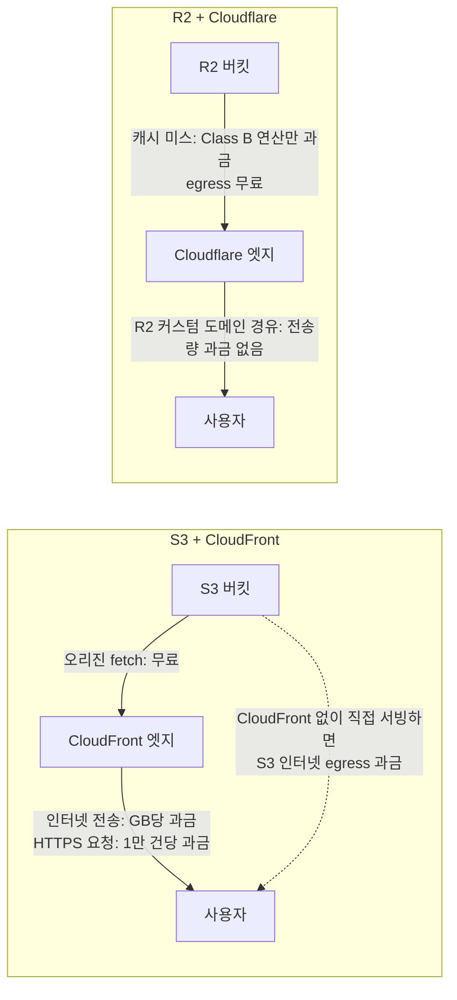
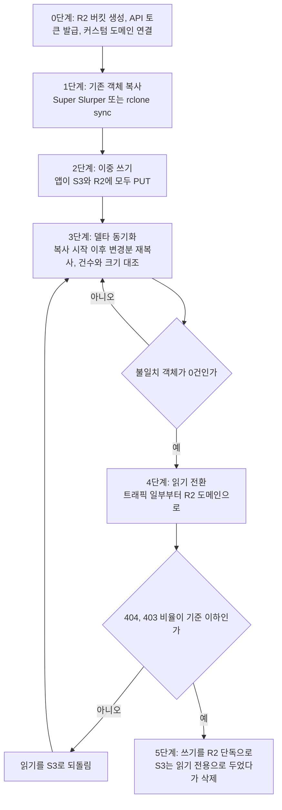
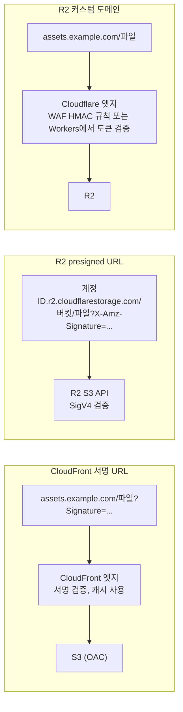

# Cloudflare R2

R2는 Cloudflare가 운영하는 오브젝트 스토리지다. S3와 API가 호환되고, 저장 단가가 S3 서울 리전 Standard보다 낮으며, egress(인터넷으로 나가는 다운로드) 비용이 0원이다. 트래픽이 많은 정적 자산이나 미디어 파일을 다룰 때 S3 + CloudFront 구성과 월 청구액 차이가 크게 벌어진다. CDN 쪽 비교는 [Cloudflare vs CloudFront](Cloudflare_vs_Cloud_Front.md)에 있고, 이 문서는 스토리지 쪽 비용과 이전 때 깨지는 지점을 다룬다.

## egress가 청구되는 구간

S3 + CloudFront 구성에서 돈이 나가는 곳은 S3가 아니라 CloudFront의 인터넷 전송 구간이다. S3에서 CloudFront로 가져오는 오리진 fetch는 무료이고, 사용자에게 내보내는 구간에 GB 단가와 요청 단가가 붙는다. CloudFront를 거치지 않고 S3를 직접 공개하면 S3 자체의 인터넷 egress 요금이 붙는다. 서울 리전은 월 100GB 무료 구간 이후 GB당 약 $0.126다([AWS 데이터 전송 요금](https://aws.amazon.com/ec2/pricing/on-demand/#Data_Transfer)).



위 도식에서 볼 것은 과금 지점의 위치다. 왼쪽은 사용자 쪽 마지막 구간(CF → 사용자)에 전송량이 곱해지고, 오른쪽은 R2 → 엣지 구간에 연산 횟수만 곱해진다. 캐시 히트 요청은 R2까지 가지 않으므로 Class B 연산도 발생하지 않는다.

R2는 인터넷 egress 요금이 없다. Workers나 공개 버킷 도메인으로 나가는 데이터 모두 해당한다([R2 요금](https://developers.cloudflare.com/r2/pricing/)).

R2 요금 구조는 세 항목이다:

| 항목 | 무료 구간 | 초과 요금 |
|---|---|---|
| 저장 용량 | 월 10GB | $0.015/GB |
| Class A 작업 (PUT, POST, LIST 등) | 월 100만 건 | $4.50/백만 건 |
| Class B 작업 (GET, HEAD 등) | 월 1000만 건 | $0.36/백만 건 |

Infrequent Access 클래스는 저장 $0.01/GB로 싸지만 Class A $9.00, Class B $0.90(백만 건당)에 읽은 용량 기준 $0.01/GB 조회 비용이 붙고, 최소 보관 기간이 30일이다. 자주 읽는 객체를 넣으면 Standard보다 비싸진다.

월 50GB 저장, 다운로드 500만 건, 업로드 50만 건 규모라면 R2 요금 계산은 이렇다:

```
저장: (50 - 10) × $0.015 = $0.60
Class A: 무료 구간 초과 없음 (50만 건)
Class B: 무료 구간 초과 없음 (500만 건)
합계: $0.60/월
```

같은 규모를 S3 서울 리전에 올리면 저장만 50 × $0.025 = $1.25이고, 사용자에게 내보내는 전송량이 더해진다. 전송량이 CloudFront 무료 1TB 안에 들어오면 이 규모에서는 둘 다 몇 달러 차이다. 차이가 벌어지는 구간은 다음 절에서 계산한다.

R2는 S3의 Transfer Acceleration, 리전 간 복제, Glacier 같은 스토리지 클래스가 없다. 요구사항이 단순한 정적 파일 서빙이라면 R2가 맞지만, 복잡한 수명 주기 정책이나 다중 리전 복제가 필요하면 S3를 써야 한다.

## S3 + CloudFront 대 R2 월 비용 비교

아래 표는 서울 리전 S3 Standard + 한국 엣지 CloudFront와 R2 Standard를 같은 조건으로 계산한 값이다. 가정은 세 가지다.

- 캐시 히트율 90%. 오리진(S3 GET, R2 Class B)에는 전체 요청의 10%만 도달한다.
- CloudFront는 한국 엣지 HTTPS 단가를 쓴다. 전송량 첫 1TB와 월 1,000만 요청은 무료, 이후 전송량은 9TB까지 $0.12, 다음 40TB는 $0.10, 그 다음 100TB는 $0.095, 요청은 1만 건당 $0.012다.
- S3는 저장 $0.025/GB, PUT 1,000건당 $0.0045, GET 1,000건당 $0.00035다. Cloudflare 플랜 비용($0 또는 $20)과 Workers 요금은 넣지 않았다.

| 시나리오 | 저장 | 월 요청 | 월 전송량 | S3 + CloudFront | R2 | 차이 |
|---|---|---|---|---|---|---|
| A. 소규모 사이트 | 50GB | 500만 | 200GB | $1.88 | $0.60 | $1.27 |
| B. 이미지 서비스 | 500GB | 5,000만 | 3TB | $303.87 | $7.35 | $296.52 |
| C. 대형 미디어 | 5TB | 5억 | 30TB | $3,834.92 | $107.25 | $3,727.67 |
| D. 저장 위주, 트래픽 적음 | 20TB | 2,000만 | 500GB | $521.70 | $304.35 | $217.35 |
| E. 영상 다운로드 위주 | 2TB | 2,000만 | 12TB | $1,346.87 | $29.85 | $1,317.02 |

시나리오별 업로드(PUT) 건수는 A 10만, B 100만, C 500만, D 200만, E 50만이다. 단가 출처는 [R2 요금](https://developers.cloudflare.com/r2/pricing/), [CloudFront 종량제 요금](https://aws.amazon.com/cloudfront/pricing/pay-as-you-go/), [S3 요금](https://aws.amazon.com/s3/pricing/)이다.

표에서 읽어야 할 것은 두 가지다. 전송량이 CloudFront 무료 1TB를 넘는 순간 차이가 전송량에 비례해서 벌어진다(B, C, E). 반대로 전송량이 1TB 아래이면 차이는 저장 단가 차이($0.025 대 $0.015)만 남고, 이 경우 D처럼 저장이 클 때만 의미가 있다. 이 가격표에서 R2가 월 비용으로 더 비싸지는 구간은 없었다. 비용 때문에 R2를 안 쓰는 경우는 없고, 이전 비용과 기능 손실이 판단을 가른다.

이전 비용 쪽도 계산해 둬야 한다. S3에서 R2로 객체를 복사할 때 R2는 업로드(ingress)에 요금이 없지만 S3가 데이터를 내보내는 쪽에서 인터넷 egress가 청구된다. 시나리오 B(500GB)는 100GB 무료 구간을 빼고 400GB × $0.126 ≈ $50이라 한 달 안에 회수된다. 시나리오 D(20TB)는 10TB까지 $0.126, 다음 구간 $0.122로 계산하면 약 $2,527이고 R2 Class A 연산(객체 약 2,000만 개 가정 시 약 $85)을 더해도 월 절감액 $217로 12개월 가까이 걸린다. 저장 위주 워크로드는 이전 이득이 작고 비용 회수가 느리다.

## 버킷 생성과 접근 정책

대시보드에서 생성하거나 Wrangler CLI로 만든다.

```bash
wrangler r2 bucket create my-bucket
```

버킷 공개 여부는 두 가지로 나뉜다.

**비공개(기본값)**: Workers 바인딩이나 API 토큰으로만 접근 가능하다. presigned URL을 발급해서 외부에 일시적 접근권을 줄 수 있다.

**공개**: 대시보드에서 r2.dev 공개 URL을 켜면 `https://pub-<해시>.r2.dev/<키>` 형태로 누구나 읽을 수 있다. r2.dev 주소는 테스트용이라 운영에는 Custom Domain(`https://assets.example.com/<키>`)을 연결한다. `<계정ID>.r2.cloudflarestorage.com`은 S3 API 엔드포인트라서 서명 없이는 읽히지 않는다.

공개 버킷이라도 쓰기는 허용되지 않는다. 읽기만 공개, 쓰기는 인증된 요청만 가능한 구조다.

CORS 설정이 필요한 경우 버킷 단위로 JSON을 등록한다:

```bash
wrangler r2 bucket cors put my-bucket --rules '[
  {
    "allowedOrigins": ["https://example.com"],
    "allowedMethods": ["GET", "PUT"],
    "allowedHeaders": ["Content-Type"],
    "maxAgeSeconds": 3600
  }
]'
```

S3의 버킷 정책(Bucket Policy)에 해당하는 세밀한 IAM 규칙은 R2에 없다. 접근 제어는 API 토큰 범위로만 한다. 토큰마다 "Object Read", "Object Read & Write", "Admin Read & Write" 중 하나를 부여한다.

## S3 SDK로 전환

S3 호환 API 엔드포인트는 `https://<ACCOUNT_ID>.r2.cloudflarestorage.com`이다. 기존 S3 클라이언트 코드에서 엔드포인트와 자격증명만 교체하면 된다.

```typescript
import { S3Client, PutObjectCommand, GetObjectCommand } from "@aws-sdk/client-s3";

const r2 = new S3Client({
  region: "auto",  // R2는 리전 개념이 없어서 "auto"로 고정
  endpoint: `https://${process.env.R2_ACCOUNT_ID}.r2.cloudflarestorage.com`,
  credentials: {
    accessKeyId: process.env.R2_ACCESS_KEY_ID!,
    secretAccessKey: process.env.R2_SECRET_ACCESS_KEY!,
  },
});
```

`region: "auto"`로 둔다. R2는 리전 개념이 없고, 리전을 지정할 수 없는 도구를 위해 빈 값과 `us-east-1`을 `auto`로 취급한다([S3 API 호환 목록](https://developers.cloudflare.com/r2/api/s3/api/)). 그 밖의 AWS 리전 이름은 호환 목록에 없으므로 넣지 않는다.

업로드와 다운로드는 일반 S3 SDK 사용법과 동일하다:

```typescript
// 업로드
await r2.send(new PutObjectCommand({
  Bucket: "my-bucket",
  Key: "images/profile/user-123.jpg",
  Body: fileBuffer,
  ContentType: "image/jpeg",
}));

// 다운로드
const response = await r2.send(new GetObjectCommand({
  Bucket: "my-bucket",
  Key: "images/profile/user-123.jpg",
}));
const body = await response.Body?.transformToByteArray();
```

Python boto3도 동일한 방식으로 엔드포인트만 교체한다:

```python
import boto3

r2 = boto3.client(
    "s3",
    region_name="auto",
    endpoint_url=f"https://{account_id}.r2.cloudflarestorage.com",
    aws_access_key_id=access_key_id,
    aws_secret_access_key=secret_access_key,
)
```

Go의 aws-sdk-go-v2도 `EndpointResolverWithOptions`를 커스텀하거나 `BaseEndpoint`를 설정해서 쓸 수 있다.

## presigned URL 발급

외부 클라이언트가 서버를 거치지 않고 R2에 직접 업로드하거나 다운로드할 때 쓴다. 서버가 서명된 URL을 발급하면 클라이언트는 그 URL로 직접 R2에 요청한다.

```typescript
import { getSignedUrl } from "@aws-sdk/s3-request-presigner";

// 업로드용 presigned URL (PUT)
const uploadUrl = await getSignedUrl(
  r2,
  new PutObjectCommand({
    Bucket: "my-bucket",
    Key: `uploads/${userId}/${filename}`,
    ContentType: "image/jpeg",
    ContentLength: fileSizeBytes,  // 크기 제한을 걸 때 명시
  }),
  { expiresIn: 300 }  // 초 단위, 5분
);

// 다운로드용 presigned URL (GET)
const downloadUrl = await getSignedUrl(
  r2,
  new GetObjectCommand({
    Bucket: "my-bucket",
    Key: `uploads/${userId}/${filename}`,
  }),
  { expiresIn: 3600 }
);
```

presigned URL로 업로드받을 때 주의할 점이 있다. `ContentLength`를 명시하지 않으면 클라이언트가 원하는 크기로 올릴 수 있다. 파일 크기 제한이 필요하면 발급 시 `ContentLength`와 `ContentType`을 고정하고, 클라이언트가 다른 값을 보내면 R2가 서명 불일치로 거부한다.

presigned URL의 유효기간은 최대 7일(604,800초)이다. 이보다 긴 접근이 필요하면 공개 버킷이나 Workers로 다른 방식을 써야 한다.

## Workers 바인딩으로 직접 접근

Workers에서 R2를 쓸 때는 S3 SDK 없이 바인딩으로 직접 접근한다. `wrangler.toml`에 바인딩을 선언하면 Workers 런타임이 `env` 객체에 R2 버킷 인스턴스를 주입한다.

```toml
[[r2_buckets]]
binding = "MY_BUCKET"
bucket_name = "my-bucket"
```

```typescript
export interface Env {
  MY_BUCKET: R2Bucket;
}

export default {
  async fetch(request: Request, env: Env): Promise<Response> {
    const url = new URL(request.url);
    const key = url.pathname.slice(1);

    if (request.method === "GET") {
      const object = await env.MY_BUCKET.get(key);
      if (!object) {
        return new Response("Not Found", { status: 404 });
      }

      const headers = new Headers();
      object.writeHttpMetadata(headers);
      headers.set("etag", object.httpEtag);

      return new Response(object.body, { headers });
    }

    if (request.method === "PUT") {
      await env.MY_BUCKET.put(key, request.body, {
        httpMetadata: {
          contentType: request.headers.get("content-type") ?? "application/octet-stream",
        },
      });
      return new Response("OK");
    }

    return new Response("Method Not Allowed", { status: 405 });
  },
};
```

바인딩 방식의 장점은 R2에 대한 요청이 Workers 내부 네트워크를 타기 때문에 API 토큰이나 서명 처리가 필요 없고, 레이턴시도 외부 HTTP 호출보다 낮다.

객체 목록 조회는 `list()` 메서드를 쓴다:

```typescript
const listed = await env.MY_BUCKET.list({
  prefix: `users/${userId}/`,
  limit: 100,
  cursor: nextCursor,  // 페이지네이션
});

for (const object of listed.objects) {
  console.log(object.key, object.size, object.uploaded);
}

if (listed.truncated) {
  // listed.cursor로 다음 페이지 요청
}
```

`list()`는 기본 최대 1000개까지 반환한다. `limit`으로 줄일 수 있고, `truncated`가 `true`이면 다음 페이지가 있다는 뜻이다.

## S3에서 R2로 옮기는 순서

복사만 하고 읽기를 바로 돌리면 복사 중에 쓰인 객체가 R2에 없어서 404가 난다. 이중 쓰기 구간을 두고, 읽기는 일부 트래픽부터 돌린다.



도식에서 3단계와 4단계 사이의 되돌림 경로가 핵심이다. 읽기 전환 후에도 S3 객체를 지우지 않아야 롤백할 수 있다.

1단계는 [Super Slurper](https://developers.cloudflare.com/r2/data-migration/super-slurper/)가 S3를 소스로 지원한다. 사용자 정의 메타데이터는 유지되지만 1TB를 넘는 객체와 Glacier 계열 보관 클래스 객체는 건너뛰므로 따로 복사해야 한다. 복사 후 검증은 ETag 비교로 하지 않는다. 멀티파트로 올린 객체의 ETag는 파트 크기와 개수에 따라 달라져서, 같은 내용이어도 S3와 R2에서 값이 다르게 나온다. 객체 수와 크기 합계를 비교하고, 중요한 객체는 SHA-256을 직접 계산해 대조한다.

이중 쓰기 구간에는 R2 쓰기 실패를 요청 실패로 만들지 않는 편이 안전하다. S3 쓰기가 성공하면 응답하고 R2 쓰기는 재시도 큐에 넣는다. 3단계 델타 동기화가 그 누락분을 잡는다.

## 이전할 때 깨지는 것들

### S3 기능 미지원

코드 수정으로 끝나지 않고 설계를 다시 해야 하는 항목이 있다. 아래는 [R2의 S3 API 호환 목록](https://developers.cloudflare.com/r2/api/s3/api/) 기준이다.

| S3 기능 | R2 | 이전 때 하는 일 |
|---|---|---|
| 버킷 정책, ACL | 미지원 | API 토큰 범위와 버킷 분리로 대체한다 |
| 객체 태깅 | 미지원 | 태그로 분류하던 규칙은 키 접두사나 메타데이터로 옮긴다 |
| 버전 관리 | 미지원 | 키에 버전 문자열을 넣는다. 실수로 지운 객체는 복구되지 않는다 |
| Object Lock, 보존 정책 | 미지원 | 규정상 삭제 금지가 필요한 데이터는 S3에 남긴다 |
| 리전 간 복제 | 미지원 | 별도 스크립트로 두 버킷에 쓴다 |
| 이벤트 알림 | S3 API로 설정 불가 | R2 자체 이벤트 알림 기능으로 다시 구성한다 |
| SSE-KMS | 미지원 (SSE-C는 지원) | KMS 키 정책에 의존하던 감사 요건은 재검토한다 |
| 액세스 로그, 인텔리전트 티어링 | 미지원 | 접근 기록이 필요하면 커스텀 도메인 앞단이나 Workers에서 직접 남긴다 |
| 수명 주기, 멀티파트, CopyObject | 지원 | 규칙 형식만 확인한다 |

이 중 가장 자주 걸리는 것은 버저닝이다. S3 버저닝을 켠 채 "덮어써도 이전 버전이 남는다"는 전제로 짠 배포 파이프라인은 R2에서 이전 파일을 복구하지 못한다.

같은 키에 쓰기를 초당 1회로 제한하는 점도 S3와 다르다([R2 한도](https://developers.cloudflare.com/r2/platform/limits/)). 초과하면 HTTP 429가 온다. `latest.json`이나 카운터 파일을 같은 키에 계속 덮어쓰던 코드가 이전 후에 간헐적으로 실패하는 경우가 있다. 이런 파일은 키에 시간이나 시퀀스를 붙여 쓰도록 바꿔야 한다.

### 서명 URL 방식 차이

R2 presigned URL은 S3 API 도메인(`<ACCOUNT_ID>.r2.cloudflarestorage.com`)에서만 동작하고 커스텀 도메인에서는 쓸 수 없다([presigned URL 문서](https://developers.cloudflare.com/r2/api/s3/presigned-urls/)). CloudFront 서명 URL(키 그룹, 커스텀 정책)을 `assets.example.com` 도메인으로 쓰던 서비스는 그대로 못 옮긴다.



공식 문서가 커스텀 도메인 인증 방법으로 안내하는 것은 WAF의 HMAC 검증 규칙이다. 요구사항별로 갈리는 것은 다음과 같다.

- 다운로드 링크를 짧은 시간만 열어야 하고 캐시가 필요 없다: presigned URL을 그대로 쓴다. 이 경우 요청이 S3 API 도메인으로 가므로 커스텀 도메인의 캐시를 타지 않는다고 보고, 모든 다운로드가 Class B 연산으로 계산된다고 가정한다.
- 서명 URL이어야 하지만 캐시도 필요하다: 커스텀 도메인 앞에 Workers나 WAF HMAC 규칙을 두고 토큰을 검증한다.
- 브라우저 폼 업로드(presigned POST + 조건 정책)를 쓰고 있다: R2 presigned URL은 GET, HEAD, PUT, DELETE만 지원하고 POST 폼 업로드는 지원하지 않는다. `content-length-range` 같은 정책 조건으로 업로드 크기를 제한하던 코드는 PUT 방식으로 바꾸고 크기 검증을 업로드 후 서버에서 해야 한다.

서명 후 URL의 리소스·메서드·만료 시각을 바꾸면 403 `SignatureDoesNotMatch`가 난다. 클라이언트가 URL에 쿼리를 덧붙이는 코드가 있으면 이전 후 처음 발견된다.

### 멀티파트 업로드 제한

S3 멀티파트 API는 R2에서 동작하지만 규칙이 더 엄격하다([멀티파트 문서](https://developers.cloudflare.com/r2/objects/multipart-objects/)).

| 항목 | R2 규칙 |
|---|---|
| 파트 크기 | 5MiB 이상 5GiB 이하 (마지막 파트는 5MiB 미만 허용) |
| 파트 구성 | 마지막을 제외한 모든 파트가 같은 크기여야 한다 |
| 파트 수 | 최대 10,000개 |
| 객체 크기 | 멀티파트 약 4.995TiB, 단일 PUT 약 4.995GiB |
| 같은 파트 번호 재업로드 | 이전 파트를 대체한다. 재업로드가 실패하면 원본 파트가 사라진다 |
| 미완료 업로드 | 기본 7일 뒤 자동 abort |

파트 크기가 같아야 한다는 조건에 자체 구현 업로더가 걸린다. 스트림에서 읽은 만큼 그대로 파트로 올리는 구현은 파트 크기가 들쭉날쭉해서 R2 규칙 위반으로 업로드가 거부될 수 있다. AWS SDK의 `lib-storage` 업로더처럼 파트 크기를 고정하는 도구는 문제가 없다. 파트 재시도 로직도 확인해야 한다. R2는 같은 파트 번호로 다시 올리다 실패하면 원본 파트가 사라지므로, 재시도가 한 번 실패한 업로드는 abort하고 처음부터 다시 올리는 쪽이 안전하다.

### 그 밖에 걸리는 것

**객체 메타데이터**: 사용자 메타데이터(`x-amz-meta-*`)는 지원된다. 태깅이 없어서 태그로 하던 분류는 메타데이터로 옮긴다.

**체크섬 검증**: `PutObject` 요청에 `x-amz-checksum-sha256` 같은 체크섬 헤더를 넣어 보내면 R2가 검증한다. SDK v3가 기본적으로 체크섬을 붙이는 경우가 있어서 기존 코드가 예상 못한 오류를 낼 수 있다. `requestChecksumCalculation: "when_required"`로 설정해서 끌 수 있다.

```typescript
const r2 = new S3Client({
  // ...
  requestChecksumCalculation: "when_required",
  responseChecksumValidation: "when_required",
});
```
