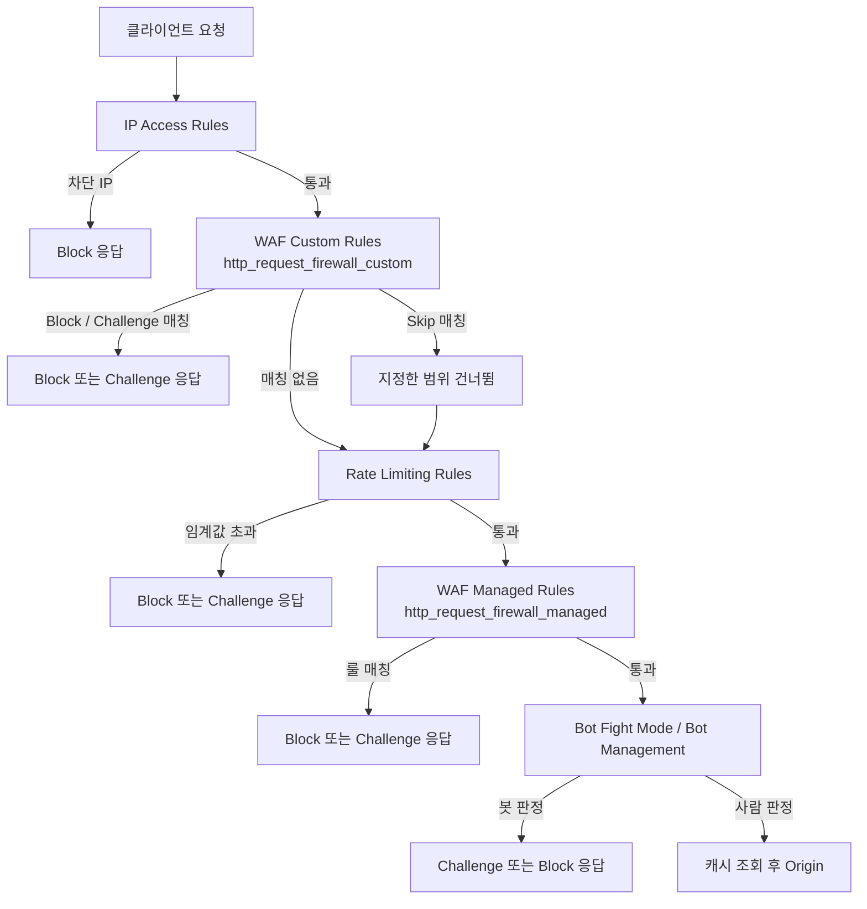
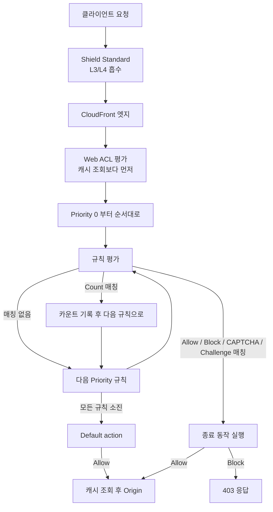
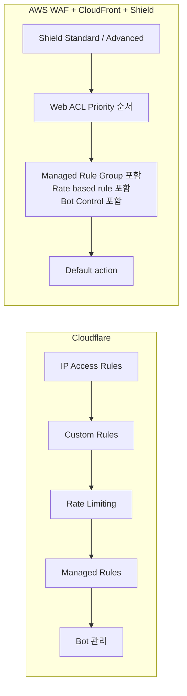
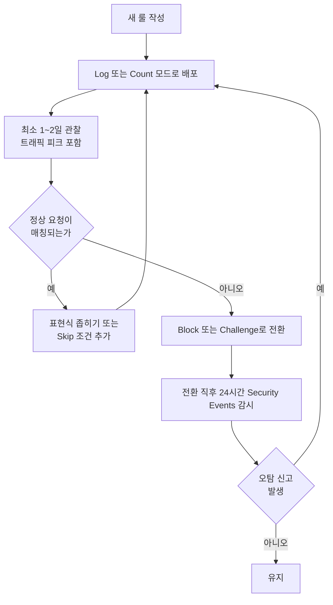
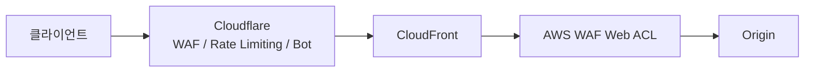

# Cloudflare WAF 룰 작성 실무

Cloudflare WAF는 2022년에 Firewall Rules에서 WAF Custom Rules로 이전됐다. 인터페이스가 바뀌고 API 경로가 달라졌는데, 오래된 문서를 보고 작업하면 엉뚱한 곳을 건드리게 된다. 지금은 Security → WAF → Custom Rules 탭이 맞다.

CDN까지 포함해서 Cloudflare와 CloudFront 중 무엇을 고를지는 [Cloudflare vs CloudFront](Cloudflare_vs_Cloud_Front.md)에 정리했다. 이 문서는 그중 WAF·DDoS 축만 따로 파고든다. AWS 쪽 룰 작성은 [AWS WAF](../AWS/Security/WAF.md), [WAF 고급 룰](../AWS/Security/WAF_Advanced_Rules.md), [Shield](../AWS/Security/Shield.md)를 본다.

## 표현식 언어

Cloudflare 표현식은 Wirefilter Expression Language를 쓴다. Wireshark 필터 문법과 구조가 비슷하다. 필드 + 연산자 + 값 조합이고, `and`, `or`, `not`으로 조건을 연결한다.

자주 쓰는 필드:

| 필드 | 설명 |
|---|---|
| `http.request.uri.path` | 쿼리 스트링 제외한 경로 |
| `http.request.uri` | 쿼리 스트링 포함 전체 URI |
| `http.request.method` | GET, POST 등 |
| `ip.src` | 클라이언트 IP |
| `ip.geoip.country` | ISO 국가 코드 (KR, US 등) |
| `cf.threat_score` | Cloudflare 위협 점수 0~100 |
| `http.request.headers["user-agent"]` | User-Agent 헤더 |
| `http.request.body.raw` | 요청 본문 (raw) |
| `http.host` | Host 헤더 |

기본 패턴:

```
# 특정 경로 차단
http.request.uri.path eq "/admin/wp-login.php"

# 경로 접두사 매칭
http.request.uri.path matches "^/api/v1/admin"

# 복수 IP 차단 — 값 사이는 공백으로 구분, 쉼표 쓰면 파싱 오류
ip.src in {203.0.113.1 203.0.113.2 198.51.100.0/24}

# 국가 + 경로 조합
ip.geoip.country eq "CN" and http.request.uri.path contains "/api/"

# POST 본문 검사
http.request.method eq "POST" and http.request.body.raw contains "UNION SELECT"
```

`contains`는 대소문자를 구분한다. 대소문자 무관 매칭이 필요하면 `lower()` 함수를 씌운다:

```
lower(http.request.uri.path) contains "/phpmyadmin"
```

`matches`는 RE2 정규식이다. PCRE가 아니라서 lookahead/lookbehind가 없다. 복잡한 패턴을 쓰다가 "Invalid regular expression" 오류가 나면 이 제약 때문이다.

`http.request.body.raw`는 POST 본문을 검사할 때 쓴다. Content-Type이 `application/x-www-form-urlencoded`면 파싱된 필드를 `http.request.body.form`으로도 접근할 수 있다. JSON 본문은 `http.request.body.raw`에서 문자열 검사만 가능하다. 구조적 파싱은 지원하지 않는다.

위협 점수(`cf.threat_score`)는 0에 가까울수록 안전하다. 통상적으로 10 이상이면 의심, 50 이상이면 차단 대상으로 잡는다. 점수 기준만으로 운영하면 오탐이 많다. 특정 경로나 메서드와 조합해서 써야 실용적이다.

## Rate Limiting 룰

WAF Custom Rules 탭이 아니라 Security → WAF → Rate Limiting Rules 탭에 따로 있다. 표현식 언어는 동일하지만 설정 구조가 다르다.

Rate Limiting 룰은 세 가지를 설정한다:

- 매칭 조건: 어떤 요청에 적용할지 (표현식)
- 임계값: 기간(period) 내 요청 횟수
- 동작: 초과 시 차단 또는 챌린지

```
# /api/login에 IP당 1분에 10회 초과 시 차단
조건:  http.request.uri.path eq "/api/login" and http.request.method eq "POST"
period: 60초
requests: 10
action: Block
```

기본 키는 IP 주소다. `cf.unique_visitor_id`를 키로 쓰면 NAT 뒤에 있는 여러 사용자를 같은 IP로 묶지 않을 수 있다. 단, `cf.unique_visitor_id`는 쿠키 기반이라 쿠키를 안 보내는 API 클라이언트에는 효과가 없다.

Rate Limiting 룰은 정상 트래픽도 걸린다. 배포 직후 정적 파일 CDN 요청이 폭증하거나, 모바일 앱 업데이트로 동시 접속이 몰릴 때 실수로 차단하는 경우가 있다. 처음에는 Log 모드로 설정해서 실제 분포를 본 다음 임계값을 정한다.

mitigation timeout은 차단 상태를 유지하는 시간이다. 기본값이 설정한 period와 같은데, 짧게 맞추면 공격자가 잠시 기다렸다가 재시도한다. API 무차별 대입 공격에는 timeout을 600초 이상으로 잡는다.

## Bot Fight Mode 오탐

Bot Fight Mode(BFM)와 Super Bot Fight Mode(SBFM)는 Pro/Business 플랜에서 쓸 수 있는 자동화 차단 기능이다. JS 챌린지로 브라우저 여부를 검증하는 방식이라, 브라우저가 아닌 클라이언트는 전부 봇으로 판정할 수 있다.

실제로 오탐이 나는 경우가 있다.

**내부 API 클라이언트**: 서버-서버 통신에서 `curl`, `httpx`, Python `requests` 같은 클라이언트는 JS 챌린지를 통과하지 못한다. BFM이 켜진 상태에서 내부 서비스가 Cloudflare를 거쳐 API를 호출하면 403이 난다.

**Googlebot 등 검색 크롤러**: SBFM에는 "Allow search engine crawlers" 옵션이 있다. 이걸 켜도 Googlebot을 사칭하는 봇은 막는다고 하지만, 실제 검색 크롤러가 잘못 차단되는 경우가 간헐적으로 보인다.

**모니터링 도구**: Uptime Robot, Datadog Synthetics 같은 외부 모니터링 툴이 BFM에 걸린다. 해당 IP 대역을 화이트리스트에 넣거나, 모니터링 요청에 커스텀 헤더를 달아서 Skip 룰로 우회한다.

**Cloudflare Workers**: Workers에서 `fetch()`로 같은 존의 도메인을 호출하면 BFM에 걸릴 수 있다. Workers의 outbound 요청은 내부 IP를 쓰지 않고 일반 인터넷으로 나간다.

BFM의 근본적인 한계는 Security Events에서 봇 판정 이유를 명확히 알 수 없다는 점이다. "Bot Fight Mode"가 source로 찍히는 정도가 전부다. 세밀한 제어가 필요하면 Enterprise 플랜의 Bot Management를 써야 한다. `cf.bot_management.score`(0~99) 필드가 노출되고, 점수 기반으로 커스텀 룰을 작성할 수 있다.

## Skip 룰로 화이트리스트 만들기

화이트리스트는 "Allow" 동작이 아니라 "Skip" 동작으로 구현한다. Allow는 그 요청을 통과시키는 게 아니라 WAF 매니지드 룰과 이후 검사를 건너뛰게 한다. Skip은 건너뛸 대상을 더 세밀하게 지정할 수 있다.

Skip의 대상 선택:

- All remaining custom rules
- All WAF Managed Rules
- Specific managed ruleset
- Rate Limiting Rules

특정 IP나 대역을 완전히 신뢰하려면 모든 검사를 Skip한다. 내부 네트워크 대역, CI/CD 에이전트 IP, 파트너사 IP 등이 여기 해당한다.

```
# 내부 네트워크 Skip
ip.src in {10.0.0.0/8 172.16.0.0/12 192.168.0.0/16}
→ Skip: All remaining custom rules, WAF Managed Rules
```

헤더 기반 화이트리스트는 IP가 유동적인 서비스(Lambda, Cloud Run 등)에서 쓴다. 비밀 헤더 값을 공유하고, 그 헤더가 있으면 Skip한다.

```
http.request.headers["x-internal-token"] eq "your-secret-value"
→ Skip: All remaining custom rules
```

이 헤더 값이 외부에 노출되면 WAF 전체를 우회하게 된다. Cloudflare Workers에서 헤더를 추가하거나, Origin 서버에서 이중으로 검증하는 구조가 안전하다.

## 룰 실행 순서

Security Events에서 룰은 위에서 아래로 순서대로 평가된다. 매칭된 룰의 동작이 Block이거나 Challenge면 이후 룰은 실행되지 않는다. Skip도 지정한 범위를 건너뛴 뒤 남은 룰부터 이어간다.

**Skip 룰은 반드시 Block 룰보다 앞에 있어야 한다.** 화이트리스트 IP가 Block 룰 뒤에 있으면, Block 룰이 먼저 매칭돼서 Skip 룰에 도달하지 못한다.

Phase가 다른 룰은 순서가 보장되지 않는다. Custom Rules는 `http_request_firewall_custom` 페이즈, Managed Rules는 `http_request_firewall_managed` 페이즈다. Custom Rules가 항상 Managed Rules보다 먼저 실행된다. Custom Rules의 Skip 룰이 Managed Rules 전체를 건너뛰게 할 수 있는 이유가 여기 있다.

Cloudflare 전체 처리 순서는 대략 이렇다. 요청이 어느 단계에서 끊기는지 보려면 이 그림을 기준으로 잡는다.



Custom Rules가 Managed Rules보다 앞이라는 점이 핵심이다. Custom Rules의 Skip이 Managed Rules를 통째로 건너뛰게 만들 수 있고, 반대로 Managed Rules에서 오탐이 나도 Custom Rules 쪽에서 앞단 예외를 만들 수 있다. Bot 계열이 이 흐름 어디에 끼는지는 플랜과 제품(BFM, SBFM, Bot Management)에 따라 달라서, 실제로 어느 단계에서 끊겼는지는 Security Events의 Service 값으로 확인한다.

IP Access Rules에서 차단된 요청은 WAF Custom Rules에 도달하지 않는다. WAF 레이어에서 허용 룰을 만들어도, IP 레이어에서 이미 막히면 소용없다.

룰 번호는 UI에서 드래그로 바꿀 수 있고, API로도 순서를 지정할 수 있다. Terraform으로 관리할 때는 `cloudflare_ruleset` 리소스에서 룰 배열 순서가 그대로 반영된다.

## 차단 로그 분석

Security → Security Events 탭에서 실시간 로그를 본다. 기본 24시간이고 최대 72시간까지 조회할 수 있다. 더 긴 기간이 필요하면 Cloudflare Logpush로 S3나 R2에 쌓아야 한다.

각 이벤트에서 봐야 할 필드:

- **Action**: 어떤 동작이 취해졌는지 (Managed Challenge, Block, Skip 등)
- **Service**: 어떤 기능이 차단했는지 (Custom Rules, Managed Rules, BFM 등)
- **Rule ID**: 매칭된 룰 ID
- **Ray ID**: Cloudflare 레이어의 요청 고유 ID
- **Expression**: Custom Rules의 경우 매칭된 표현식

Ray ID는 `cf-ray` 응답 헤더에도 들어있다. 사용자가 차단됐다고 신고하면 Ray ID를 받아서 Security Events에서 검색하면 어떤 룰이 매칭됐는지 바로 알 수 있다.

```bash
# 응답 헤더에서 Ray ID 확인
curl -sI https://example.com/path 2>&1 | grep -i cf-ray
```

Managed Rules가 차단한 경우, Rule ID가 `100xxx` 형태로 찍힌다. Security → WAF → Managed Rules에서 해당 Rule ID를 검색하면 어떤 패턴을 감지했는지 설명이 나온다. 오탐이면 해당 룰만 "Disable" 하거나, 특정 URL 경로에서만 Skip할 수 있다.

Rate Limiting에 걸린 경우 Service가 "Rate Limiting"으로 나온다. 어느 IP, 어느 경로가 임계값을 초과했는지 같이 보인다. 정상 트래픽이 걸렸다면 임계값을 올리거나 해당 경로를 조건에서 제외한다.

Logpush를 설정했으면 `http_requests` 데이터셋의 `WafAction`, `WafMatchedVar`, `RuleId` 필드를 쿼리한다. 특정 룰이 얼마나 차단하는지 대용량 로그에서 집계할 때 쓴다. Athena나 BigQuery에 올려서 분석하는 방식을 주로 쓴다.

## 플랜별 Managed Ruleset 범위

Managed Rules는 플랜에 따라 쓸 수 있는 룰셋이 다르다. Free에서 "WAF가 켜져 있다"고 안심했다가 SQLi 시그니처 룰이 없다는 걸 나중에 알게 되는 경우가 있다.

| 항목 | Free | Pro | Business | Enterprise |
|---|---|---|---|---|
| Cloudflare Free Managed Ruleset | 적용 | 적용 | 적용 | 적용 |
| Cloudflare Managed Ruleset | 없음 | 적용 | 적용 | 적용 |
| OWASP Core Ruleset | 없음 | 적용 | 적용 | 적용 |
| Exposed Credentials Check | 없음 | 적용 | 적용 | 적용 |
| Custom Rules 개수 | 5 | 20 | 100 | 1,000 |
| Rate Limiting Rules 개수 | 1 | 2 | 5 | 100 |
| Bot 관리 | Bot Fight Mode | Super Bot Fight Mode | Super Bot Fight Mode | Bot Management |

개수와 포함 범위는 Cloudflare가 플랜 개편 때마다 바꾼다. 도입 전에 [Cloudflare 플랜 비교 페이지](https://www.cloudflare.com/plans/)에서 현재 값을 다시 확인한다.

Free Managed Ruleset은 대형 취약점(Log4Shell 같은 것) 대응 룰만 소수 들어 있다. 일반 SQLi/XSS 시그니처 탐지는 Cloudflare Managed Ruleset부터 시작한다. OWASP Core Ruleset은 점수제라서 룰이 하나 매칭됐다고 바로 막지 않고, 누적 점수가 Paranoia Level과 Score Threshold를 넘을 때 동작한다. Paranoia Level을 올리면 탐지는 늘고 오탐도 같이 는다. 처음에는 PL1에 Score Threshold를 느슨하게 잡고, 로그를 보면서 조인다.

Enterprise가 아니면 Managed Rules를 Log 동작으로 돌리지 못하는 경우가 있다. 이 제약 때문에 오탐 검증 방식이 갈리는데, 뒤의 "오탐 검증 절차"에서 다룬다.

## AWS WAF 구성과 평가 순서

AWS에서는 CloudFront 앞단에 Web ACL(scope: CLOUDFRONT, us-east-1에서 생성)을 붙인다. Shield Standard는 별도 설정 없이 L3/L4 공격을 먼저 흡수하고, Shield Advanced를 켜면 L7 DDoS 자동 대응이 Web ACL 안의 룰 그룹으로 추가된다.



AWS WAF는 Priority 숫자가 낮은 규칙부터 평가한다. Allow, Block, CAPTCHA, Challenge는 종료 동작이라 매칭되면 그 자리에서 평가가 끝난다. Count는 종료하지 않고 다음 규칙으로 넘어간다. 이 점이 Cloudflare와 다르다. Cloudflare는 페이즈가 나뉘어 있고 페이즈 안에서 위에서 아래로 가지만, AWS는 Web ACL 하나에 규칙과 룰 그룹이 한 줄로 늘어선다.

두 구조를 나란히 놓으면 차이가 분명하다.



Cloudflare는 기능별로 페이즈가 갈라져 있어서 Custom Rules의 Skip으로 Managed Rules를 건너뛰는 식의 제어가 된다. AWS는 한 줄 순서라서 예외를 만들려면 Managed Rule Group보다 낮은 Priority 숫자에 Allow 규칙을 앞세워야 한다. Allow가 종료 동작이라 뒤의 룰 그룹이 전부 건너뛰어지고, 의도한 것보다 넓게 우회되는 경우가 생긴다. 특정 룰만 빼고 싶으면 Allow 대신 Rule Group의 Rule action override를 Count로 바꾸거나 scope-down statement로 범위를 줄인다.

## AWS WAF 과금과 Web ACL 규칙 한도

AWS WAF는 룰마다 WCU(Web ACL Capacity Unit)라는 복잡도 점수를 매기고, Web ACL의 합계 WCU에 상한을 둔다. 기본 상한은 1,500 WCU이고 5,000까지 올릴 수 있다. 1,500을 넘는 구간은 요청 수 기반 추가 요금이 붙는다. 따로 정해진 "규칙 개수 상한"이 있는 게 아니라 WCU 합계가 사실상의 규칙 수 상한이다.

| 규칙 종류 | 대략적인 WCU |
|---|---|
| IP set 매칭 | 1 |
| 단순 문자열 일치 | 약 2 |
| 정규식 패턴 세트 | 약 25 |
| SQLi 탐지 statement | 20 이상 (Sensitivity에 따라) |
| AWS Managed Rules Core rule set | 700 |
| AWS Managed Rules SQL database | 200 |
| AWS Managed Rules Known bad inputs | 200 |
| Rate-based rule | 2 이상 |

위 숫자는 룰 설정 옵션(텍스트 변환 개수 등)에 따라 달라지고, 룰 그룹의 WCU는 그룹을 만들 때 고정되어 나중에 바꿀 수 없다. 정확한 값은 룰을 추가할 때 콘솔이 보여주는 WCU로 본다. Core rule set 700 + SQL database 200 + Known bad inputs 200만 붙여도 1,100이고, 거기에 커스텀 정규식 룰 몇 개를 얹으면 1,500을 넘기 쉽다.

한도를 넘으면 룰 추가가 `WAFLimitsExceededException`으로 거부된다. 급하게 룰을 넣어야 하는 장애 시점에 이걸 만나면 곤란하다. 평소에 Web ACL의 Capacity를 확인해 두고, 안 쓰는 룰은 정리한다.

```bash
# Web ACL이 쓰고 있는 WCU 확인 (CloudFront scope는 us-east-1)
aws wafv2 get-web-acl \
  --scope CLOUDFRONT --region us-east-1 \
  --name my-web-acl --id <ACL_ID> \
  --query 'WebACL.Capacity'
```

요금 구성은 Web ACL 월 고정 요금, 규칙당 월 요금, 요청 100만 건당 요금이다. Bot Control, Fraud Control 같은 유료 룰 그룹은 요청 수 기반 요금이 따로 붙는다. 정확한 단가는 [AWS WAF 요금 페이지](https://aws.amazon.com/waf/pricing/)를 본다. 트래픽이 많은 서비스에서 Bot Control을 전체 경로에 걸면 청구서가 예상보다 크게 나오는 경우가 있어서, scope-down statement로 로그인·결제 같은 경로에만 적용하는 편이 낫다.

Cloudflare는 이 구조가 아니다. 플랜 요금에 Managed Rules가 포함되고, 룰 개수만 플랜별로 잘려 있다. 룰 수를 기준으로 하면 Business에서 Custom Rules 100개 안에서 쓰면 되고, 요청 수에 비례해 요금이 오르지 않는다. 비용 구조 비교는 [Cloudflare vs CloudFront](Cloudflare_vs_Cloud_Front.md)의 비용 절을 같이 본다.

## 오탐 검증 절차

새 룰을 Block으로 바로 올리면 정상 사용자가 막힌다. 먼저 관찰 모드로 돌려서 매칭 분포를 본 다음 차단으로 올린다. 이름이 제품마다 다르다.

| 제품 | 관찰 모드 | 비고 |
|---|---|---|
| Cloudflare Custom Rules | Log | 플랜에 따라 Log 동작이 안 열릴 수 있다 |
| Cloudflare Rate Limiting | Log | 같은 제한이 있다 |
| Cloudflare Managed Rules | 룰·룰셋 단위 Log override | Enterprise 위주 |
| AWS WAF 규칙 | Count | 전 플랜 동일 |
| AWS WAF 룰 그룹 | Rule action override를 Count로 | 그룹 전체 또는 개별 룰 단위 |



그림에서 오탐이 보이면 Block으로 가지 않고 관찰 모드로 되돌아가는 고리가 핵심이다. 룰 전환 후 오탐 신고가 들어와도 같은 고리를 탄다.

Log를 못 쓰는 플랜에서는 두 가지로 우회한다. 하나는 Managed Challenge로 먼저 건다. 사람 사용자는 챌린지를 통과해 서비스를 계속 쓰고, 봇과 API 클라이언트는 막힌다. Security Events에서 챌린지 통과율을 보면 룰이 사람을 얼마나 건드리는지 대략 가늠된다. 다른 하나는 표현식에 특정 테스트 경로나 헤더 조건을 AND로 붙여 일부 트래픽에만 먼저 적용하는 방식이다.

```
# 내부 테스터 헤더가 있는 요청에만 먼저 Block 적용
(새 룰의 표현식) and http.request.headers["x-waf-canary"][0] eq "1"
```

AWS 쪽은 Count로 돌리면 Web ACL 로그와 샘플 요청에 어떤 룰이 매칭됐는지 남는다. Count 매칭된 요청에 라벨을 붙여 두면 나중에 쿼리하기 쉽다. 라벨은 규칙 단위로 `RuleLabels`에 지정한다.

```json
{
  "Name": "sqli-candidate",
  "Priority": 20,
  "Statement": {
    "SqliMatchStatement": {
      "FieldToMatch": { "Body": { "OversizeHandling": "CONTINUE" } },
      "TextTransformations": [{ "Priority": 0, "Type": "URL_DECODE" }],
      "SensitivityLevel": "LOW"
    }
  },
  "Action": { "Count": {} },
  "RuleLabels": [{ "Name": "custom:sqli-candidate" }],
  "VisibilityConfig": {
    "SampledRequestsEnabled": true,
    "CloudWatchMetricsEnabled": true,
    "MetricName": "sqli-candidate"
  }
}
```

Count 룰은 종료 동작이 아니어서 뒤의 Managed Rule Group도 그대로 평가된다. 한 요청이 Count 룰과 뒤의 Block 룰 양쪽에 걸릴 수 있으니, 관찰 중에 "Count인데 왜 막히지"라는 의문이 나오면 뒤의 룰을 의심한다.

Count 기간에 `Body` 검사를 넣을 때는 본문 크기 제한도 같이 본다. CloudFront에 붙은 Web ACL이 검사하는 본문은 기본 16KB까지이고 그 뒤는 잘린다. 큰 JSON 본문 뒤쪽에 숨긴 페이로드는 이 룰이 못 본다. `OversizeHandling`을 `CONTINUE`, `MATCH`, `NO_MATCH` 중 무엇으로 두느냐에 따라 큰 본문 요청이 통과하기도 하고 전부 막히기도 한다. Cloudflare도 본문 검사 크기에 상한이 있으니 업로드 API는 별도로 확인한다.

## 이중 WAF에서 누가 막았는지 추적

Cloudflare를 앞에 두고 뒤에서 CloudFront + AWS WAF를 쓰는 구성이 실제로 있다. 마이그레이션 중이거나, 도메인은 Cloudflare가 쥐고 있는데 일부 경로의 Origin이 CloudFront인 경우다. 이때 403이 나오면 어느 쪽이 막았는지부터 갈라야 한다.



응답에서 단서를 찾는다.

```bash
curl -si https://example.com/api/test -H "User-Agent: curl-test" | head -20
```

| 단서 | Cloudflare가 막음 | AWS WAF가 막음 |
|---|---|---|
| `server` 헤더 | `cloudflare` | `CloudFront` |
| `cf-ray` 헤더 | 있음 | 있을 수 있음 (Cloudflare를 지나왔기 때문) |
| `x-amz-cf-id`, `x-amz-cf-pop` | 없음 | 있음 |
| `x-cache` | 없음 | `Error from cloudfront` |
| 차단 페이지 | Cloudflare 오류 페이지, Ray ID 표시 | `The request could not be satisfied`, Request ID 표시 |

`x-amz-cf-id`가 응답에 있으면 최소한 요청이 CloudFront까지 도달한 것이다. Cloudflare가 막았다면 요청이 CloudFront에 가지 않았으니 이 헤더가 없다. 반대로 `cf-ray`는 AWS WAF가 막은 경우에도 붙는다. Cloudflare를 통과한 응답에 Cloudflare가 헤더를 얹기 때문이다. `cf-ray`가 있다고 Cloudflare가 막았다고 단정하면 틀린다.

`cf-ray`와 `x-amz-cf-id`가 둘 다 있으면 두 로그를 서로 이어야 한다. Cloudflare Transform Rule(Modify Request Header)로 Ray ID를 Origin 방향 헤더에 실어 보내면 AWS WAF 로그에서 그 헤더로 검색할 수 있다.

```
# Cloudflare Transform Rules → Modify Request Header
# 요청 헤더 x-cf-ray-copy 에 값을 설정 (표현식)
cf.ray_id
```

AWS WAF 로그를 CloudWatch Logs나 S3로 보내고 `HTTPRequest.headers`에서 이 헤더를 찾는다. 이때 로깅 설정에서 `RedactedFields`로 가린 필드가 없는지 확인한다. 헤더를 가려 놓으면 검색이 안 된다. 쿼리 예시는 이렇다.

```
fields @timestamp, action, terminatingRuleId, terminatingRuleType, httpRequest.clientIp
| filter httpRequest.headers.0.name = "x-cf-ray-copy" or action = "BLOCK"
| sort @timestamp desc
| limit 50
```

실제 쿼리는 Logs Insights의 배열 필드 접근 방식이 로그 형식에 따라 달라서 `parse`나 `filter @message like /x-cf-ray-copy/`로 단순하게 가는 편이 빠르다.

두 WAF를 겹칠 때 놓치기 쉬운 문제가 둘 있다.

첫째는 클라이언트 IP다. AWS WAF에는 Cloudflare 엣지 IP가 클라이언트 IP로 보인다. IP 기반 룰과 Rate-based rule이 전부 Cloudflare IP 기준으로 돌아서, 엣지 한 곳을 쓰는 사용자 수천 명이 한 덩어리로 묶여 Rate-based rule에 한꺼번에 걸린다. AWS WAF의 Forwarded IP configuration에 `CF-Connecting-IP`(또는 `X-Forwarded-For`)를 지정해야 룰이 실제 클라이언트 IP를 본다. 이 설정은 IP set 룰과 Rate-based rule에 각각 따로 있고, 기본은 꺼져 있다.

둘째는 Origin 직접 호출 우회다. Cloudflare 뒤의 CloudFront 도메인(`dxxxx.cloudfront.net`)이 공개돼 있으면 Cloudflare WAF를 건너뛰고 직접 때릴 수 있다. CloudFront에 Origin 커스텀 헤더 검증이나 Cloudflare IP 대역 허용 룰을 두고, 그 외는 AWS WAF에서 Block한다.

```
AWS WAF 규칙 (Priority 0)
- IP set: Cloudflare 공개 IP 대역
- Action: Allow 가 아니라 "NOT 매칭이면 Block" 으로 구성
```

이중 구성은 룰 중복이 늘어 운영 부담이 커진다. 이전 기간이 끝나면 한쪽으로 정리하는 편이 낫다.
