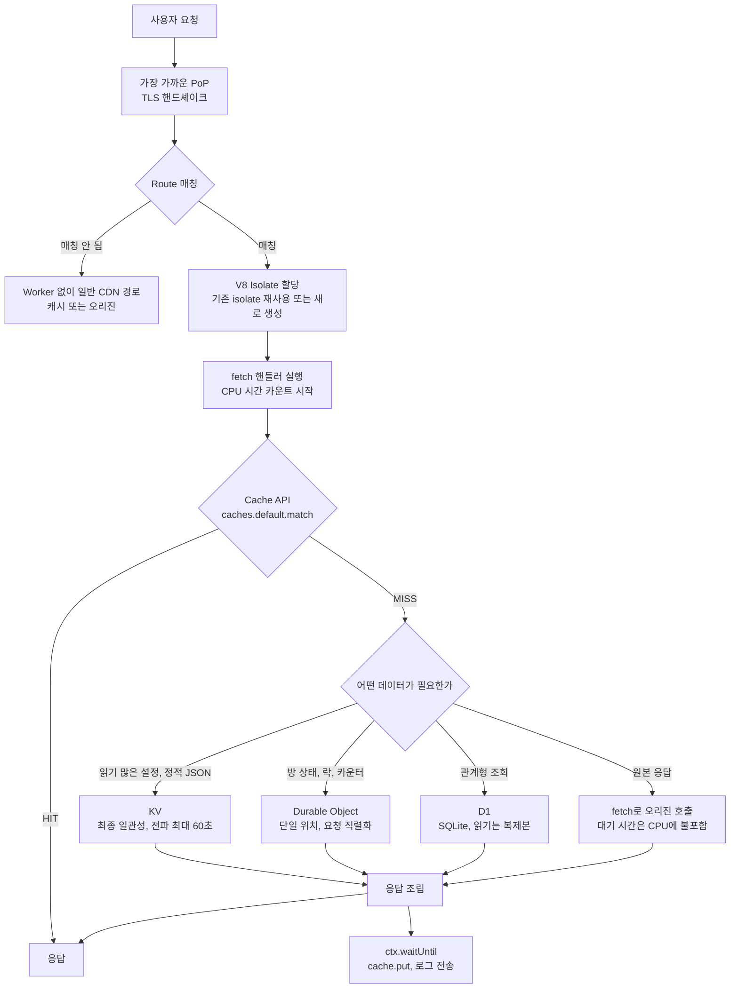
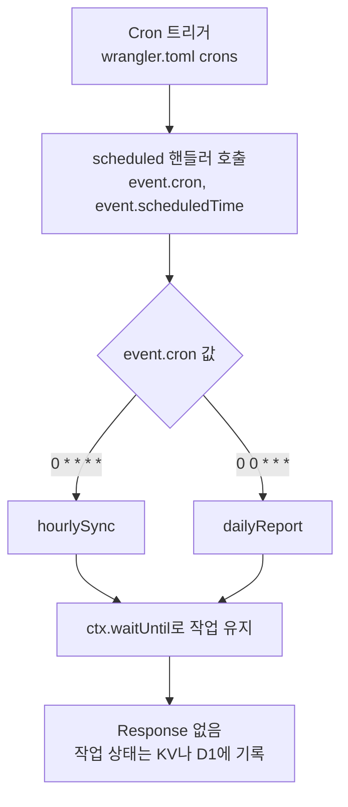
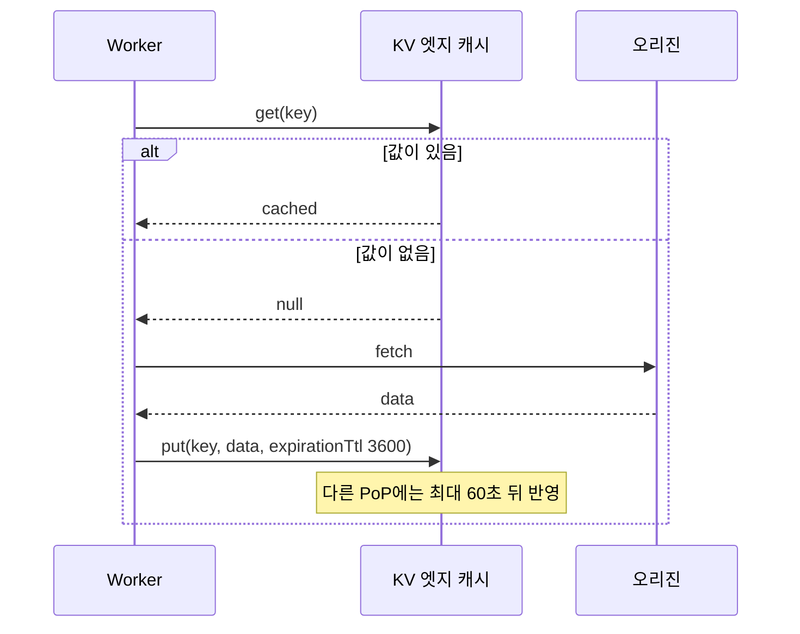
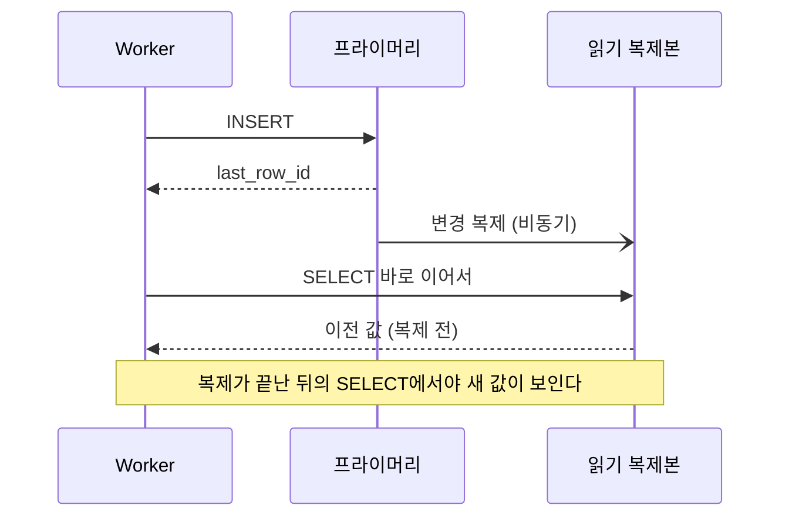
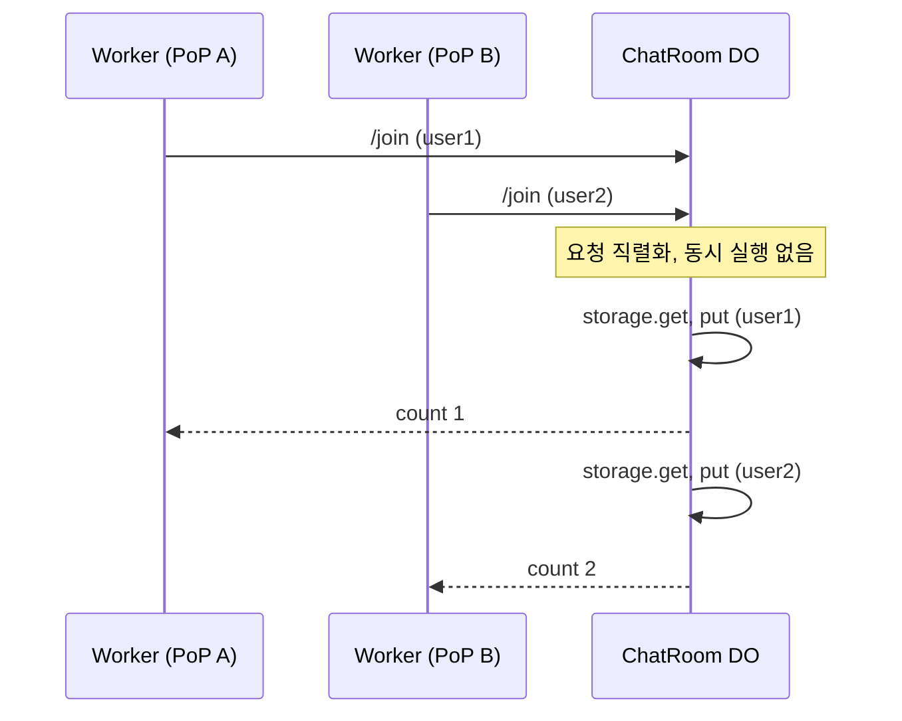
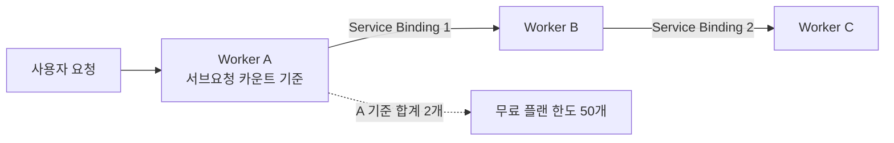
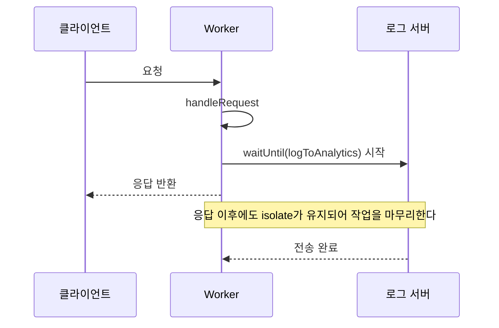
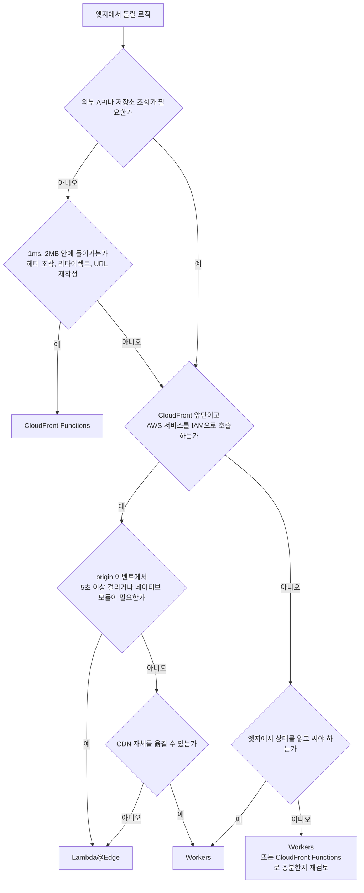
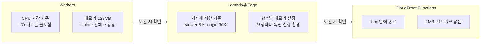

# Cloudflare Workers

Cloudflare Workers는 Cloudflare의 엣지 네트워크 위에서 돌아가는 서버리스 실행 환경이다. 300개 이상의 데이터센터에 코드가 배포되고, 요청은 사용자와 가장 가까운 노드에서 처리된다. AWS Lambda와 가장 큰 차이는 콜드스타트가 없다는 점인데, 그 이유가 V8 Isolate 방식에 있다.

## V8 Isolate와 콜드스타트

Lambda는 요청마다 컨테이너를 띄우거나 재사용한다. 이미 떠 있는 컨테이너가 없으면 수백 ms의 콜드스타트가 생긴다. Workers는 다르다. V8 Isolate는 Node.js나 컨테이너가 아니라 브라우저 탭처럼 작동한다. 이미 떠 있는 V8 엔진 위에서 새 Isolate를 만드는 비용이 수 ms 수준이라 콜드스타트로 느껴지지 않는다.

대신 제약이 있다. Isolate는 OS 프로세스가 아니라서 Node.js 표준 라이브러리를 쓸 수 없다. `fs`, `net`, `child_process`는 없다. `fetch`, `crypto`, `TextEncoder` 같은 Web API만 쓸 수 있다. npm 패키지도 Node API 없이 동작하는 것만 번들링해서 올릴 수 있다.

CPU 시간 제한도 있다. 무료 플랜은 요청당 CPU 10ms다. 유료(Workers Paid)는 기본 30초이고 설정으로 최대 5분까지 늘린다. 예전 문서에 "유료 30ms"로 적힌 것이 많은데, 30ms가 아니라 30초다. 네트워크 I/O 대기 시간은 여기 포함되지 않는다. `fetch()`로 외부 API를 부르는 동안 CPU 카운터는 멈춘다.

## 요청이 처리되는 경로

Worker 코드가 실행되기 전과 후에 어떤 단계를 거치는지 알아야 KV, Cache API, Durable Objects 중 무엇을 어디에 쓸지 정해진다. 아래 flowchart는 하나의 요청이 PoP에 도착해서 응답으로 나가기까지의 분기를 그린 것이다. 판단 지점은 Cache API 조회와 데이터 저장소 선택이다.



콜드스타트가 거의 없는 이유는 `ISO` 단계에 있다. Cloudflare는 TLS 핸드셰이크가 진행되는 동안 해당 Worker의 isolate를 미리 띄워 둔다. 핸드셰이크에 걸리는 왕복 시간이 isolate 생성 시간을 가려 주기 때문에, 첫 요청도 핸들러 진입 시점에는 이미 준비된 상태가 된다. 다만 Worker 번들이 크고 모듈 최상위에서 무거운 초기화를 하면 이 시간이 늘어난다. 최상위에서 큰 JSON을 파싱하거나 정규식을 수백 개 컴파일하는 코드는 첫 요청마다 지연으로 나타난다.

Cache API는 두 가지를 알고 써야 한다. 첫째, `caches.default`는 요청을 받은 데이터센터의 로컬 캐시다. 도쿄 PoP에서 `put`한 항목이 서울 PoP에서 보이지 않는다. 전역으로 공유되는 값은 KV를 써야 한다. 둘째, `workers.dev` 서브도메인에서는 Cache API가 동작하지 않는다. 로컬과 `workers.dev`에서 캐시가 계속 MISS라서 코드를 의심하다가, 사실은 도메인 문제였던 경우가 흔하다.

```typescript
export default {
  async fetch(request: Request, env: Env, ctx: ExecutionContext): Promise<Response> {
    const cache = caches.default;
    const cacheKey = new Request(request.url, { method: "GET" });

    const hit = await cache.match(cacheKey);
    if (hit) return hit;

    const origin = await fetch(request);
    // 캐시에 넣을 응답은 body를 한 번만 읽을 수 있어서 clone이 필요하다
    const response = new Response(origin.body, origin);
    response.headers.set("Cache-Control", "public, max-age=300");

    ctx.waitUntil(cache.put(cacheKey, response.clone()));
    return response;
  },
};
```

`cache.put`을 `await`하면 응답이 그만큼 늦어진다. `waitUntil`로 넘기면 응답은 먼저 나가고 저장은 뒤에서 끝난다.

## Request/Response 가로채기

Workers의 기본 진입점은 `fetch` 이벤트 핸들러다.

```typescript
export default {
  async fetch(request: Request, env: Env, ctx: ExecutionContext): Promise<Response> {
    const url = new URL(request.url);

    // 특정 경로만 가로채기
    if (url.pathname.startsWith("/api/")) {
      return handleApi(request, env);
    }

    // 나머지는 원본 서버로 그대로 전달
    return fetch(request);
  },
};
```

요청을 수정해서 오리진에 전달하거나, 오리진 응답을 받아서 헤더를 추가하거나 내용을 바꿀 수 있다.

```typescript
async function addSecurityHeaders(request: Request): Promise<Response> {
  const response = await fetch(request);

  // Response는 불변이라 새로 만들어야 한다
  const newHeaders = new Headers(response.headers);
  newHeaders.set("X-Frame-Options", "DENY");
  newHeaders.set("X-Content-Type-Options", "nosniff");

  return new Response(response.body, {
    status: response.status,
    headers: newHeaders,
  });
}
```

`Response`는 불변 객체다. 헤더를 추가하려면 기존 헤더를 복사해서 새 `Response`를 만들어야 한다. 이 부분을 모르면 `response.headers.set()`이 에러 없이 실행되는데 실제로 아무 효과가 없어서 디버깅이 어렵다.

## Cron 트리거

HTTP 요청 없이 주기적으로 실행하는 작업은 `scheduled` 핸들러로 처리한다. `wrangler.toml`에 크론 표현식을 등록하면 Cloudflare가 해당 Worker를 자동으로 호출한다.

```toml
# wrangler.toml
[triggers]
crons = ["0 * * * *", "0 0 * * *"]
```

```typescript
export default {
  async fetch(request: Request, env: Env, ctx: ExecutionContext): Promise<Response> {
    return new Response("OK");
  },

  async scheduled(event: ScheduledEvent, env: Env, ctx: ExecutionContext): Promise<void> {
    ctx.waitUntil(syncData(env));
  },
};
```

`scheduled` 핸들러는 `Response`를 반환하지 않는다. 실행 결과를 외부에 알릴 방법이 없으니, 작업 상태를 KV나 D1에 기록해두는 경우가 많다.

`event.cron`으로 어떤 크론 표현식이 발동했는지 알 수 있다. cron을 여러 개 등록하면 이걸로 분기한다. 아래 flowchart는 `fetch`와 달리 사용자 요청 없이 Cloudflare가 호출하는 `scheduled` 경로를 그린 것이다.



```typescript
async scheduled(event: ScheduledEvent, env: Env, ctx: ExecutionContext): Promise<void> {
  switch (event.cron) {
    case "0 * * * *":
      ctx.waitUntil(hourlySync(env));
      break;
    case "0 0 * * *":
      ctx.waitUntil(dailyReport(env));
      break;
  }
}
```

로컬에서 테스트할 때 `wrangler dev --test-scheduled`로 시작하고, 별도 터미널에서 아래 요청을 보낸다.

```bash
curl "http://localhost:8787/__scheduled?cron=*+*+*+*+*"
```

`event.scheduledTime`은 예정 실행 시각을 ms 단위 유닉스 타임으로 준다. 실제 실행 시점과 수십 초 차이가 날 수 있어서, 정확한 실행 시각이 필요하면 이 값을 기준으로 써야 한다. CPU 시간 제한은 `fetch` 핸들러와 동일하게 적용된다.

## 환경 변수 바인딩

Workers의 환경 변수는 `wrangler.toml`에 선언한다.

```toml
# wrangler.toml
name = "my-worker"
main = "src/index.ts"
compatibility_date = "2024-01-01"

[vars]
APP_ENV = "production"
API_BASE_URL = "https://api.example.com"
```

민감한 값(API 키, 비밀키)은 `vars`에 평문으로 넣으면 안 된다. `wrangler secret put`으로 따로 등록한다.

```bash
wrangler secret put DATABASE_PASSWORD
# 입력 프롬프트가 뜬다. 값이 터미널 히스토리에 남지 않는다.
```

TypeScript에서 타입 안전하게 쓰려면 `Env` 인터페이스를 직접 정의해야 한다.

```typescript
export interface Env {
  APP_ENV: string;
  API_BASE_URL: string;
  DATABASE_PASSWORD: string; // secret
  MY_KV: KVNamespace;        // KV 바인딩
}

export default {
  async fetch(request: Request, env: Env): Promise<Response> {
    const apiUrl = env.API_BASE_URL;
    // ...
  },
};
```

## wrangler.toml 라우트 패턴

Workers.dev 서브도메인(`xxx.workers.dev`)은 별도 설정 없이 자동으로 연결된다. 직접 소유한 도메인에 Worker를 붙이려면 라우트를 등록해야 한다.

```toml
[[routes]]
pattern = "example.com/api/*"
zone_name = "example.com"
```

`zone_name` 대신 `zone_id`를 써도 된다. Zone ID는 Cloudflare 대시보드에서 해당 도메인을 선택하면 우측 사이드바에 표시된다.

패턴에서 `*`는 `/`를 제외한 모든 문자에 매칭된다. `example.com/api/*`는 `example.com/api/users`는 잡지만 `example.com/api/v1/users`는 잡지 못한다. 하위 경로 전체를 잡으려면 `example.com/api/**`를 쓴다.

Worker를 여러 개 운영하면서 라우트를 나눠 붙이는 경우, 더 구체적인 패턴이 우선이다. `example.com/api/*`와 `example.com/*`가 같이 있으면 `/api/`로 시작하는 요청은 전자가 먼저 받는다.

라우트 매칭은 Cloudflare 엣지에서 처리된다. 로컬 `wrangler dev`에서는 라우트 패턴이 동작하지 않는다. 라우트 동작을 확인하려면 `wrangler dev --remote`로 에지에 올려서 테스트해야 한다.

## KV 스토리지 연동

Workers KV는 엣지 네트워크에 분산된 키-값 저장소다. 읽기 성능이 좋고 전 세계 어디서든 낮은 지연시간으로 접근할 수 있다. 대신 쓰기 후 전파에 최대 60초가 걸린다. 강한 일관성이 필요한 곳에는 쓰면 안 된다.

`wrangler.toml`에 KV 바인딩을 추가한다.

```toml
[[kv_namespaces]]
binding = "MY_KV"
id = "xxxxxxxxxxxxxxxxxxxxxxxxxxxxxxxx"
preview_id = "yyyyyyyyyyyyyyyyyyyyyyyyyyyyyyyy"
```

`id`는 프로덕션 네임스페이스, `preview_id`는 로컬 개발과 `wrangler dev`에서 쓰는 네임스페이스다. 둘 다 `wrangler kv:namespace create`로 만든다.

```bash
wrangler kv:namespace create MY_KV
wrangler kv:namespace create MY_KV --preview
```

코드에서는 이렇게 쓴다.

```typescript
export default {
  async fetch(request: Request, env: Env): Promise<Response> {
    const key = new URL(request.url).pathname;

    // 캐시에서 먼저 확인
    const cached = await env.MY_KV.get(key);
    if (cached !== null) {
      return new Response(cached, {
        headers: { "Content-Type": "application/json" },
      });
    }

    // 오리진에서 가져와서 KV에 저장
    const response = await fetch(`https://api.example.com${key}`);
    const data = await response.text();

    // TTL 설정: 3600초 후 자동 삭제
    await env.MY_KV.put(key, data, { expirationTtl: 3600 });

    return new Response(data, {
      headers: { "Content-Type": "application/json" },
    });
  },
};
```

위 코드의 흐름을 순서대로 보면 아래와 같다. 읽기는 엣지에서 끝나지만 쓰기는 전파 시간이 지나야 다른 PoP에서 보인다는 점을 보면 된다.



KV에는 객체를 그대로 넣을 수 없다. 반드시 `JSON.stringify()`로 직렬화해서 저장하고, 꺼낼 때 `JSON.parse()`로 복원한다. `getWithMetadata()`를 쓰면 메타데이터를 함께 저장하고 읽을 수 있는데, 만료 시간을 별도로 추적할 때 유용하다.

## D1 SQLite 연동

D1은 SQLite 기반 서버리스 데이터베이스다. KV처럼 키-값이 아니라 실제 SQL을 쓴다. 관계형 데이터가 필요한데 별도 데이터베이스 서버를 두기 부담스러운 경우에 쓴다.

```toml
[[d1_databases]]
binding = "DB"
database_name = "my-app-db"
database_id = "xxxxxxxx-xxxx-xxxx-xxxx-xxxxxxxxxxxx"
```

`database_id`는 `wrangler d1 create my-app-db`로 데이터베이스를 만들 때 출력된다.

```typescript
export interface Env {
  DB: D1Database;
}

export default {
  async fetch(request: Request, env: Env): Promise<Response> {
    const url = new URL(request.url);

    if (url.pathname === "/users" && request.method === "GET") {
      const { results } = await env.DB.prepare(
        "SELECT id, name, email FROM users ORDER BY created_at DESC LIMIT 20"
      ).all<{ id: number; name: string; email: string }>();

      return Response.json(results);
    }

    if (url.pathname === "/users" && request.method === "POST") {
      const body = await request.json() as { name: string; email: string };

      const result = await env.DB.prepare(
        "INSERT INTO users (name, email, created_at) VALUES (?, ?, ?)"
      ).bind(body.name, body.email, new Date().toISOString()).run();

      return Response.json({ id: result.meta.last_row_id });
    }

    return new Response("Not Found", { status: 404 });
  },
};
```

`.bind()`로 파라미터를 바인딩해야 한다. 문자열 보간으로 SQL을 만들면 SQL 인젝션 위험이 생기고, D1 자체도 권장하지 않는다.

여러 쿼리를 하나의 트랜잭션으로 묶을 때는 `batch()`를 쓴다.

```typescript
await env.DB.batch([
  env.DB.prepare("INSERT INTO orders (user_id, total) VALUES (?, ?)").bind(userId, total),
  env.DB.prepare("UPDATE inventory SET quantity = quantity - ? WHERE product_id = ?").bind(qty, productId),
  env.DB.prepare("INSERT INTO audit_log (action, user_id) VALUES (?, ?)").bind("purchase", userId),
]);
```

`batch()`는 원자적이다. 하나라도 실패하면 전체가 롤백된다.

스키마 마이그레이션은 SQL 파일로 관리한다.

```bash
# 마이그레이션 파일을 적용한다
wrangler d1 migrations apply my-app-db

# 로컬 D1에만 적용 (프로덕션에 반영 안 됨)
wrangler d1 migrations apply my-app-db --local
```

로컬 `wrangler dev`에서는 프로덕션 D1과 별도의 로컬 인스턴스를 쓴다. `wrangler d1 execute`를 `--local` 없이 실행하면 프로덕션에 반영된다. 개발 중에는 `--local`을 붙이는 습관이 필요하다.

D1이 SQLite 기반이라 단순해 보이지만, 분산 환경에서 돌아간다. 읽기는 리전 복제본에서 처리되고 쓰기는 프라이머리로 간다. 쓰기 직후 읽기가 이전 값을 반환하는 경우가 있다. 쓰기 직후 결과를 다시 읽어야 하는 경우 쿼리 흐름을 다시 설계해야 한다.

아래 시퀀스는 쓰기와 읽기가 서로 다른 곳으로 가서 이전 값이 보이는 구간을 그린 것이다.



## Durable Objects

KV는 eventually consistent다. 쓰기 후 읽기가 이전 값을 반환할 수 있다. 채팅방 참여자 목록, 게임 세션 상태, 분산 락처럼 강한 일관성이 필요한 경우 Durable Objects(DO)를 쓴다.

DO는 클래스 하나가 하나의 인스턴스 타입이다. 각 인스턴스는 단일 위치에서 실행되고, 해당 인스턴스로 들어오는 요청은 직렬화해서 처리한다. 여러 Worker가 동시에 같은 DO에 요청을 보내도 DO 내부에서는 동시 실행이 없다.

아래 시퀀스는 서로 다른 PoP의 Worker 두 개가 같은 방 DO에 동시에 요청을 보낼 때 DO가 요청을 하나씩 처리하는 모습이다.



`wrangler.toml`에 바인딩과 마이그레이션을 등록한다.

```toml
[[durable_objects.bindings]]
name = "ROOM"
class_name = "ChatRoom"

[[migrations]]
tag = "v1"
new_classes = ["ChatRoom"]
```

`migrations` 태그가 없으면 배포가 실패한다. 처음 등록하는 경우에도 필수다. 클래스를 추가할 때마다 `new_classes`에 넣고 태그를 올린다.

```typescript
export class ChatRoom implements DurableObject {
  private state: DurableObjectState;

  constructor(state: DurableObjectState, env: Env) {
    this.state = state;
  }

  async fetch(request: Request): Promise<Response> {
    const url = new URL(request.url);

    if (url.pathname === "/join") {
      const participants = (await this.state.storage.get<string[]>("participants")) ?? [];
      const user = await request.json() as { userId: string };

      if (!participants.includes(user.userId)) {
        participants.push(user.userId);
        await this.state.storage.put("participants", participants);
      }

      return new Response(JSON.stringify({ count: participants.length }));
    }

    return new Response("Not Found", { status: 404 });
  }
}

export default {
  async fetch(request: Request, env: Env): Promise<Response> {
    const roomId = new URL(request.url).searchParams.get("room") ?? "default";

    // 같은 roomId는 항상 같은 DO 인스턴스를 가리킨다
    const id = env.ROOM.idFromName(roomId);
    const room = env.ROOM.get(id);

    return room.fetch(request);
  },
};
```

`idFromName()`은 결정적이다. 같은 문자열은 항상 같은 DO 인스턴스를 가리킨다. 사용자별로 인스턴스를 만들 때 `idFromName(userId)`, 세션별로는 `idFromName(sessionId)` 식으로 쓴다.

`state.storage`는 트랜잭셔널이다. `put()` 이후 오류가 나도 원자적으로 처리된다.

DO 인스턴스는 한 위치에서만 돌아서 그 위치와 멀리 있는 요청은 왕복 지연이 생긴다. 글로벌 서비스에서 특정 인스턴스에 전 세계 트래픽을 모으면 지연시간이 크게 올라간다. DO는 무료 플랜에서 쓸 수 없고 Workers Paid 이상 필요하다.

## Service Bindings

하나의 Worker에서 다른 Worker를 직접 호출하는 방식이다. `fetch()`로 공개 URL을 부르는 것과 달리, Cloudflare 내부 네트워크를 통해 전달된다. 외부 인터넷을 거치지 않아 지연시간이 거의 없고, 별도 인증도 필요 없다.

```toml
# 호출하는 Worker의 wrangler.toml
[[services]]
binding = "AUTH_SERVICE"
service = "auth-worker"
```

`auth-worker`는 같은 계정 내에 이미 배포된 Worker 이름이어야 한다.

```typescript
export default {
  async fetch(request: Request, env: Env): Promise<Response> {
    const authResult = await env.AUTH_SERVICE.fetch(
      new Request("https://internal/verify", {
        method: "POST",
        headers: { "Content-Type": "application/json" },
        body: JSON.stringify({ token: request.headers.get("Authorization") }),
      })
    );

    if (authResult.status === 401) {
      return new Response("Unauthorized", { status: 401 });
    }

    return handleRequest(request, env);
  },
};
```

URL 호스트 부분은 어떤 값이든 상관없다. Cloudflare가 바인딩에 등록된 Worker로 전달하기 때문에 실제 네트워크 요청이 발생하지 않는다. 관행적으로 `https://internal/` 같은 더미 호스트를 쓴다.

인증 처리, 이미지 변환, 결제 같은 공통 기능을 별도 Worker로 분리하고 Service Binding으로 연결하면 각 Worker를 독립적으로 배포하고 버전 관리할 수 있다.

주의할 점은 서브요청 카운트다. A Worker가 B를 호출하고 B가 C를 호출하면, A 기준으로 서브요청이 2개로 잡힌다. 깊은 체인을 만들면 무료 플랜의 50개 제한에 빨리 걸린다.



## wrangler CLI 배포

로컬에서 개발할 때는 `wrangler dev`를 쓴다.

```bash
# 로컬 에뮬레이션 (기본 포트 8787)
wrangler dev

# 실제 Cloudflare 네트워크 위에서 실행 (원격 미리보기)
wrangler dev --remote
```

`wrangler dev`는 로컬에서 돌아가지만 실제 Workers 환경과 미묘한 차이가 있다. `--remote`는 Cloudflare 엣지에 임시 배포해서 실행하는 방식이라 더 정확하다. KV나 D1, R2 같은 바인딩을 쓸 때는 `--remote`를 권장한다.

배포는 `wrangler deploy`다.

```bash
# 프로덕션 배포
wrangler deploy

# 특정 환경 배포 (wrangler.toml에 [env.staging] 정의된 경우)
wrangler deploy --env staging
```

`wrangler.toml`에 환경별 설정을 넣을 수 있다.

```toml
name = "my-worker"
main = "src/index.ts"

[env.staging]
name = "my-worker-staging"
vars = { APP_ENV = "staging" }

[env.production]
name = "my-worker-production"
vars = { APP_ENV = "production" }
```

배포 후 로그를 실시간으로 보려면 `wrangler tail`을 쓴다.

```bash
wrangler tail my-worker
```

## 로컬 개발 시 주의사항

`wrangler dev`로 로컬 개발할 때 자주 걸리는 문제들이다.

**CORS 문제.** 로컬 Worker(`localhost:8787`)에서 다른 도메인 API를 호출하면 브라우저가 CORS 오류를 낸다. Worker 코드 자체는 서버 사이드라 CORS 제약이 없지만, 브라우저에서 Worker 응답을 받는 경우 Worker가 적절한 CORS 헤더를 내려줘야 한다.

**Miniflare와 실제 환경 차이.** `wrangler dev`는 내부적으로 Miniflare를 쓴다. Miniflare는 Workers 환경을 Node.js에서 에뮬레이션하는데, 완전히 동일하지 않다. `crypto.subtle`의 일부 알고리즘이나 `cache` API 동작이 다를 수 있다. 확인이 필요하면 `--remote`로 테스트한다.

**환경 변수 누락.** `wrangler dev` 로컬 실행에서 `wrangler secret put`으로 등록한 시크릿에 접근하려면 `.dev.vars` 파일을 만들어야 한다.

```bash
# .dev.vars (로컬 전용, 절대 커밋하지 말 것)
DATABASE_PASSWORD=local-dev-password
```

이 파일 없이 로컬에서 시크릿 값을 읽으면 `undefined`가 된다.

**CPU 시간 초과.** 로컬에서 잘 돌아가다가 프로덕션에서 CPU 초과 오류가 나는 경우가 있다. 로컬 Miniflare는 CPU 시간 제한이 느슨하다. 특히 JSON 파싱, 정규식, 암호화 연산이 많으면 실제 환경에서 10ms를 넘길 수 있다. `wrangler dev --remote`로 미리 확인해두는 게 낫다.

**KV 프리뷰 ID.** `wrangler dev`에서 KV를 쓰려면 `wrangler.toml`에 `preview_id`가 있어야 한다. `preview_id` 없이 로컬에서 KV 작업을 하면 인메모리 저장소를 쓰는데, 이 데이터는 `wrangler dev`를 재시작하면 사라진다.

## 실제로 쓸 때 자주 보게 되는 것들

Workers에서 `waitUntil()`을 모르면 응답을 보낸 후 처리가 필요한 작업을 놓치게 된다. Workers는 응답을 반환하는 순간 실행 컨텍스트가 종료된다. 로깅, 분석 데이터 전송처럼 응답 이후에 해도 되는 작업은 `ctx.waitUntil()`에 넘기면 응답과 비동기로 계속 실행된다.

```typescript
export default {
  async fetch(request: Request, env: Env, ctx: ExecutionContext): Promise<Response> {
    const response = await handleRequest(request, env);

    // 응답 반환 후에도 계속 실행됨
    ctx.waitUntil(logToAnalytics(request, response));

    return response;
  },
};
```

아래 시퀀스에서 응답이 나가는 시점과 `waitUntil` 작업이 끝나는 시점이 어긋나는 것을 보면 된다.



`subrequest` 제한도 있다. Workers 하나에서 보낼 수 있는 서브요청(fetch 호출)은 무료 플랜 50개이고, 유료는 이보다 훨씬 높다(예전 문서의 1,000개에서 상향되었으니 [한도 표](https://developers.cloudflare.com/workers/platform/limits/)에서 현재 값을 확인한다). 여러 외부 API를 병렬로 호출하는 경우 `Promise.all()`을 써도 카운트는 각각 잡힌다.

메모리 상태를 전역 변수에 저장하면 안 된다고 알려져 있지만, 실제로는 같은 Isolate가 재사용되는 동안에는 전역 상태가 유지된다. 다만 언제 새 Isolate로 전환되는지 보장이 없다. 요청 간 공유 상태가 필요하면 KV나 Durable Objects를 써야 한다.

## CloudFront Functions, Lambda@Edge와 실행 조건 비교

엣지에서 코드를 돌리는 선택지는 세 가지다. 같은 "엣지 함수"라는 이름이지만 실행 위치와 한도가 달라서, 로직이 한 군데에서 다른 군데로 그대로 옮겨지지 않는다. 제약이 제일 큰 CloudFront Functions부터 Workers까지 한 표에 놓으면 이렇다.

| 항목 | CloudFront Functions | Lambda@Edge | Workers |
|------|---------------------|-------------|---------|
| 실행 위치 | Edge Location (600개 이상) | Regional Edge Cache (13개 리전) | 모든 PoP |
| 실행 시간 한도 | 1ms | viewer 5초 / origin 30초 | CPU 기준. 무료 10ms, 유료 기본 30초(최대 5분) |
| 메모리 | 2MB | 128MB ~ 10GB (origin 이벤트 기준) | isolate당 128MB |
| 외부 네트워크 호출 | 불가 | 가능 | 가능 (`fetch`, 서비스 바인딩) |
| 런타임 | JavaScript 제한 런타임 | Node.js, Python | V8 isolate, Web API + `nodejs_compat` 일부 |
| 상태 저장 | 없음 (KeyValueStore 읽기 정도) | 없음 (DynamoDB 등을 직접 호출) | KV, Durable Objects, D1, R2 |
| 배포 반영 | 수 초 ~ 수십 초 | 수 분 | 수 초 |
| 과금 단위 | 호출 수 | 호출 수 + 실행 시간(GB-초) | 요청 수 + CPU 시간 |

CloudFront Functions와 Lambda@Edge의 세부 한도는 [CloudFront Functions와 Lambda@Edge](../AWS/Network/Cloud_Front_Functions_and_Lambda_at_Edge.md)에 따로 정리했다. 두 서비스와 Workers를 CDN 전체 관점에서 비교한 내용은 [Cloudflare vs CloudFront](Cloudflare_vs_Cloud_Front.md)의 엣지 컴퓨팅 절에 있다. 여기서는 Workers 쪽에서 본다.

표만으로는 어느 걸 골라야 할지 정해지지 않는다. 판단은 대체로 세 질문으로 갈린다. 외부 호출이나 저장소 조회가 필요한가, 1ms와 2MB 안에 들어가는가, 이미 AWS 계정과 IAM에 묶여 있는가.



`MOVE` 분기에서 막히는 경우가 많다. CloudFront 뒤에 이미 S3, ALB, 인증 구성이 붙어 있으면 엣지 함수 하나 때문에 DNS와 인증서와 WAF 규칙을 전부 옮기게 된다. 로직이 가벼우면 CloudFront Functions로 끝내는 편이 낫고, 로직이 무거운데 CloudFront를 못 버리면 Lambda@Edge가 현실적인 답이다.

## CloudFront로 옮길 때 깨지는 지점

Workers 코드를 CloudFront Functions나 Lambda@Edge로 가져가거나 반대로 가져올 때 실제로 막히는 곳은 정해져 있다. 문법 문제보다는 실행 환경이 가정하던 것이 없어서 생기는 문제다.

**Node API 의존.** Workers는 `fetch`, `Request`, `Response`, `crypto.subtle`, `URL` 같은 Web 표준 API 위에 있다. Lambda@Edge의 Node.js 런타임에서는 `Buffer`, `fs`, `zlib`, `https`, AWS SDK를 쓴다. 반대 방향이 더 아프다. Lambda@Edge 코드가 `sharp`로 이미지를 리사이즈하거나 `fs`로 임시 파일을 쓰고 있으면 Workers로 옮길 수 없다. `nodejs_compat` 플래그를 켜면 `Buffer`, `crypto`, `stream` 일부가 동작하지만 소켓을 쓰는 `net`이나 네이티브 애드온은 안 된다. 이미지 변환은 Workers에서 직접 하지 않고 Cloudflare 이미지 변환 기능에 넘기는 식으로 구조를 바꿔야 한다. CloudFront 쪽 구현은 [CDN 적응형 썸네일](../AWS/Network/CDN_Adaptive_Thumbnail.md)에 있다.

CloudFront Functions로 내려갈 때는 의존성이 더 줄어든다. `require`와 `import`가 없고 `fetch`도 없다. npm 패키지를 번들해서 올리는 방식 자체를 못 쓰고, 함수 하나에 순수 JavaScript만 넣는다. JWT 서명 검증처럼 라이브러리에 기대던 코드는 런타임이 제공하는 해시·HMAC 모듈로 다시 써야 하고, 그 코드가 1ms 안에 끝나는지는 콘솔 테스트 탭에서 실행 시간을 직접 재 봐야 안다.

**서브요청 제한.** Workers에서는 `fetch`를 여러 번 부르는 코드가 흔하다. 인증 서버 호출, 설정 조회, 오리진 호출이 한 요청 안에 들어간다. CloudFront Functions로 옮기면 이 호출이 전부 사라져야 한다. 설정 조회는 KeyValueStore 같은 읽기 전용 저장소로 바꾸고, 인증 서버 호출은 서명 검증으로 대체하는 식이다. Lambda@Edge로 옮길 때는 호출 자체는 가능하지만, viewer 이벤트의 5초 제한 안에서 리전 왕복이 붙는다. 사용자는 한국인데 Lambda@Edge가 다른 리전에서 돌고, 거기서 다시 서울 리전의 API를 부르면 왕복이 두 번 생긴다. Workers에서 서비스 바인딩으로 수 ms 걸리던 호출이 Lambda@Edge에서는 수십~수백 ms로 늘어난다.

반대로 Lambda@Edge에서 Workers로 갈 때는 AWS SDK 호출이 문제다. DynamoDB를 SDK로 부르던 코드는 Workers에서 SDK 번들 크기와 Node 의존 때문에 그대로 안 돌아가는 경우가 많다. HTTP로 직접 SigV4 서명을 만들어 부르거나, 데이터를 KV·D1로 옮겨야 한다. 데이터 이전은 코드 수정보다 훨씬 큰 일이다.

**시간·메모리 한도.** 두 한도는 측정 방식이 달라서 숫자만 비교하면 틀린다.



Workers의 128MB는 요청 하나가 아니라 isolate 하나에 걸린다. 같은 isolate가 여러 요청을 동시에 처리하기 때문에, 요청마다 50MB짜리 응답을 `await response.arrayBuffer()`로 통째로 읽으면 동시 요청 몇 개에서 메모리 한도에 걸려 isolate가 종료된다. 스트리밍(`response.body`를 그대로 통과)으로 쓰는 코드였다면 문제가 없는데, Lambda@Edge에서 버퍼링 방식으로 짠 코드를 그대로 옮기면 여기서 터진다. 증상은 간헐적으로 나오는 1102 오류다.

Lambda@Edge는 반대 방향으로 한도가 있다. origin 이벤트에서 생성한 응답 본문은 1MB까지이고, 이 값은 base64 인코딩 이후 크기라서 원본 이미지 기준으로는 700KB대에서 막힌다. Workers에서 응답 크기 제한 없이 스트리밍하던 코드를 옮기면 큰 응답에서 CloudFront가 오류를 반환한다.

반대로 Workers의 CPU 시간 개념은 Lambda@Edge에 없다. 외부 API를 2초 기다리는 코드는 Workers에서는 CPU 몇 ms만 쓰지만 Lambda@Edge에서는 2초 전체가 실행 시간으로 과금되고 viewer 이벤트라면 5초 한도에 가까워진다. 호출 대기가 긴 로직일수록 Lambda@Edge로 옮긴 뒤 비용이 크게 뛴다.

## Workers 요금 모델의 함정

Workers 요금은 요청 수와 CPU 시간 두 축으로 나온다. 유료 플랜은 월 $5가 기본이고, 여기에 요청 1,000만 건과 CPU 3,000만 ms가 포함된다. 초과분은 요청 100만 건당 $0.30, CPU 100만 ms당 $0.02다. 무료 플랜은 하루 10만 요청이다. 최신 단가는 [Workers 요금 페이지](https://developers.cloudflare.com/workers/platform/pricing/)에서 확인한다.

월 1억 요청에서 요청당 평균 CPU 시간이 5ms인 경우와 50ms인 경우를 계산하면 차이가 보인다.

| 평균 CPU 시간 | 요청 비용 | CPU 비용 | 월 합계 |
|--------------|----------|---------|--------|
| 5ms | 9,000만 × $0.30/백만 = $27 | (5억 − 3,000만) ms × $0.02/백만 = $9.4 | 약 $41 ($5 기본료 포함) |
| 50ms | $27 | (50억 − 3,000만) ms × $0.02/백만 = $99.4 | 약 $131 ($5 기본료 포함) |

요청 수는 똑같은데 CPU 시간 10배가 비용을 3배 이상 올린다. I/O 위주 Worker는 CPU 시간이 거의 안 잡혀서 싸고, 압축·암호화·큰 JSON 파싱·이미지 처리가 들어가면 CPU 항이 요청 항을 넘어선다. 비용을 줄이려면 요청 수보다 핸들러 안의 CPU 시간부터 본다.

실제로 자주 놓치는 함정은 이렇다.

**정적 파일 요청도 전부 과금된다.** 라우트를 `example.com/*`로 걸면 이미지, CSS, JS까지 Worker를 거친다. 캐시 HIT여도 Worker가 먼저 실행되니 요청 수에 잡힌다. 페이지 하나에 정적 자산이 40개면 사용자 한 명이 Worker를 41번 호출한다. 라우트를 `example.com/api/*`처럼 좁히고 정적 경로는 Worker를 타지 않게 한다. 정적 사이트라면 [Cloudflare Pages](Cloudflare_Pages.md)가 더 맞다.

**`waitUntil` 안의 CPU도 CPU 시간이다.** 응답을 먼저 보내고 뒤에서 로그를 직렬화하거나 분석 이벤트를 만드는 작업은 사용자 지연에는 안 보이지만 CPU 시간으로는 그대로 합산된다. 지연 지표가 좋아졌다고 비용이 같이 내려가지 않는다.

**무료 플랜의 10ms가 개발과 운영에서 다르게 보인다.** 로컬 Miniflare에서는 통과하던 코드가 운영에서 1102 오류를 내는 경우가 있다. 앞의 "로컬 개발 시 주의사항"에서 다룬 내용이고, 요금제를 정할 때도 유료 플랜의 30초 한도가 느슨해 보여서 무거운 로직을 넣다가 CPU 비용이 늘어나는 경우가 생긴다.

**저장소는 따로 과금된다.** 위 계산에는 KV 읽기·쓰기, Durable Objects 요청과 지속 시간, D1 행 읽기·쓰기가 들어 있지 않다. 엣지에서 카운터를 Durable Object로 처리하면 요청마다 DO 호출이 추가되고, 이 비용이 Worker 비용보다 큰 경우가 있다. Worker 비용만 보고 CloudFront Functions 대비 싸다고 결론 내리면 월말에 어긋난다.

**비교 상대에 따라 결론이 뒤집힌다.** CloudFront Functions는 호출당 단가가 가장 낮지만 1ms 안에 끝나는 로직만 올라간다. 그 범위 안이면 Workers보다 CloudFront Functions가 싸다. 외부 호출이 있는 로직이면 Lambda@Edge가 비교 대상이고, 이때는 대기 시간이 과금되지 않는 Workers가 유리해지는 구간이 있다. 어느 구간인지는 평균 CPU 시간과 평균 대기 시간을 실제로 재 봐야 나온다.

## 관련 문서

- [Cloudflare vs CloudFront](Cloudflare_vs_Cloud_Front.md): CDN 전체 관점의 비교와 선택 기준
- [CloudFront Functions와 Lambda@Edge](../AWS/Network/Cloud_Front_Functions_and_Lambda_at_Edge.md): 반대편 두 서비스의 한도와 구현
- [CDN 적응형 썸네일](../AWS/Network/CDN_Adaptive_Thumbnail.md): Lambda@Edge로 만든 이미지 변환 구조
- [Cloudflare R2](Cloudflare_R2.md), [Cloudflare Pages](Cloudflare_Pages.md): Workers와 같이 쓰는 저장소와 정적 호스팅
