# Cloudflare vs CloudFront

둘 다 CDN이지만 출발점이 다르다. Cloudflare는 원래 DNS 리졸버와 보안 프록시로 시작했고, CloudFront는 S3·EC2 앞에 캐시 레이어를 붙이기 위해 만들어졌다. 그 차이가 지금도 각 제품의 강점과 약점을 가른다. CloudFront 단독 동작(Cache Policy, Origin Shield, Invalidation)은 [AWS CloudFront](../AWS/Network/CDN.md)에 따로 정리했다.

## 네트워크 규모

Cloudflare는 2026년 기준 330개 이상의 PoP를 운영한다. 단순 개수보다 중요한 건 배치 방식이다. Cloudflare는 IXP(인터넷 교환점)에 직접 들어가는 방식을 택했다. 사용자 ISP와 피어링을 맺으면 트래픽이 퍼블릭 인터넷을 덜 거친다. 국내에서 테스트해보면 서울 PoP까지 RTT가 3~7ms 수준으로 나온다.

CloudFront는 AWS 리전 기반으로 엣지 로케이션을 배치한다. 서울 리전(ap-northeast-2) 덕분에 국내 레이턴시는 비슷한 수준이지만, 동남아·아프리카·남미 일부 지역은 Cloudflare보다 PoP 밀도가 낮다. AWS는 정확한 PoP 수를 공개하지 않지만 600개 이상이라고 한다 — 단, 이 숫자에는 리전 엣지 캐시(Regional Edge Cache)까지 포함된다.

실무에서 체감 차이가 나는 경우는 ISP 다양성이 높은 지역이다. 한국처럼 주요 ISP가 몇 개 안 되는 환경에서는 거의 차이가 없다.

## 요청 경로 비교

엣지 위치를 고르는 방식이 다르면 장애 때 움직이는 방식도 달라진다. 아래 flowchart는 사용자 요청이 오리진까지 가는 경로를 나란히 놓은 것이다. 위쪽이 Cloudflare, 아래쪽이 CloudFront다.

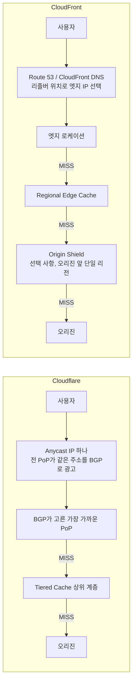

Cloudflare는 요청 경로에 이름 풀이 단계가 없다. 도메인이 Cloudflare 프록시 주소로 풀리면 이후는 BGP가 가까운 PoP를 정한다. CloudFront는 DNS 응답 단계에서 엣지가 정해지고, 캐시 미스가 나면 엣지 로케이션에서 Regional Edge Cache, 선택하면 Origin Shield를 지나서 오리진에 닿는다. 캐시 계층이 기본으로 두 겹이고 Origin Shield를 켜면 세 겹이 된다.

### Anycast와 DNS 라우팅이 다르게 깨지는 지점

| 상황 | Anycast (Cloudflare) | DNS 기반 (CloudFront) |
|---|---|---|
| PoP 하나가 죽음 | 그 PoP가 BGP 광고를 거두면 라우터가 다음으로 가까운 PoP로 경로를 바꾼다. DNS 캐시와 무관하다 | DNS 응답에서 해당 엣지 IP가 빠진다. 이미 응답을 캐시한 리졸버·클라이언트는 TTL이 끝날 때까지 죽은 IP로 간다 |
| 전환 중 이미 열린 연결 | 경로가 바뀌면 다른 PoP가 패킷을 받아 TCP 연결이 끊기는 경우가 있다. 클라이언트가 재연결해야 한다 | 열린 연결은 그 엣지에 붙어 있다. 새 연결만 새 IP로 간다 |
| 특정 지역 트래픽 쏠림 | 라우팅은 BGP 경로 길이를 따르지 부하를 보지 않는다. ISP 피어링 상태에 따라 한국 사용자가 다른 나라 PoP로 가는 일이 있다 | 응답 IP를 바꿔서 부하를 분산할 수 있다. 대신 DNS 리졸버 위치가 사용자 위치로 간주된다 |
| 공용 DNS 리졸버 사용자 | 영향 없다 | 리졸버가 EDNS Client Subnet을 안 보내면 리졸버 위치 기준 엣지가 선택된다 |

CloudFront 엣지 도메인의 A 레코드 TTL은 60초다(`d1.awsstatic.com`을 `dig`로 조회했을 때 60으로 나왔다). TTL이 짧아서 DNS 쏠림은 몇 분 안에 풀리는 편이지만, 이미 열린 연결과 TTL을 무시하는 클라이언트는 남는다. Anycast는 반대로 전환은 빠르고 끊김이 거칠다. 사용자가 긴 업로드나 WebSocket을 쓰는 서비스라면 BGP 경로 변경이 연결 리셋으로 보이는 경우가 있어 재연결 로직을 클라이언트에 넣어야 한다.

## SSL/TLS 종단 방식

Cloudflare와 CloudFront는 TLS를 끊는 방식이 구조적으로 다르다.

**Cloudflare**는 클라이언트-엣지 구간과 엣지-오리진 구간을 모드 하나로 묶어서 설정한다.

- **Off**: TLS 없이 HTTP만. 실무에서 쓸 이유가 없다.
- **Flexible**: 클라이언트-Cloudflare는 HTTPS, Cloudflare-오리진은 HTTP. 오리진에 인증서가 없어도 된다. Cloudflare-오리진 구간이 평문이라 ISP나 중간 네트워크에 노출된다. 개발 환경 외에는 쓰지 않는다.
- **Full**: 클라이언트-Cloudflare는 HTTPS, Cloudflare-오리진도 HTTPS. 단, 오리진 인증서 유효성을 검증하지 않는다. 자체 서명 인증서도 통과한다. 오리진이 실제로 본인이 주장하는 서버인지 확인이 안 된다는 뜻이다.
- **Full (Strict)**: 오리진 인증서 유효성까지 검증한다. CA 서명 또는 Cloudflare Origin CA 발급 인증서가 있어야 한다. 실무에서 써야 하는 설정이다.

Flexible 모드가 기본인 환경에서 Full (Strict)로 바꾸다가 오리진에 인증서가 없어서 502가 나는 경우가 있다. 반대로 Full 모드를 쓰면서 "오리진이 HTTPS니까 안전하다"고 착각하는 팀도 있다 — 인증서 검증이 없다.

**CloudFront**는 "Viewer Protocol Policy"와 "Origin Protocol Policy"를 별도 설정으로 분리한다.

- **Viewer Protocol Policy**: 클라이언트-CloudFront 구간. `HTTPS Only`, `Redirect HTTP to HTTPS`, `HTTP and HTTPS` 중 선택.
- **Origin Protocol Policy**: CloudFront-오리진 구간. `HTTP Only`, `HTTPS Only`, `Match Viewer` 중 선택.

`Match Viewer`는 클라이언트가 HTTP로 오면 오리진도 HTTP로, HTTPS로 오면 오리진도 HTTPS로 전달한다. Viewer Protocol Policy를 `Redirect HTTP to HTTPS`로 설정하면 CloudFront에 도달하는 요청은 전부 HTTPS라 오리진도 HTTPS로 간다.

오리진 SSL 검증은 기본으로 켜져 있다. 자체 서명 인증서를 오리진에 쓰면 CloudFront가 연결을 거부한다. Cloudflare Full 모드와 달리, CloudFront는 구성 수준에서 이 차이가 명시적으로 드러난다.

### 종단 구간별 암호화 여부

세 가지 모드에서 어느 구간이 평문인지 시퀀스로 보면 차이가 분명하다. 점선 응답은 같은 구간의 반대 방향이다.

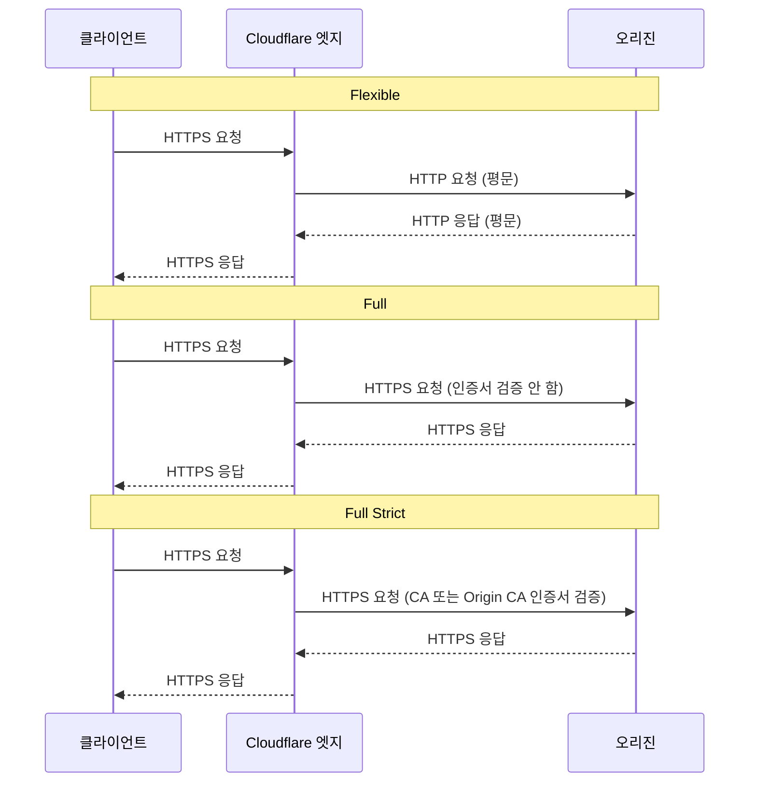

CloudFront에서는 같은 그림이 설정 두 개로 갈라진다.

| Cloudflare 모드 | 클라이언트 구간 | 오리진 구간 | CloudFront 대응 |
|---|---|---|---|
| Flexible | HTTPS | HTTP | Viewer `Redirect HTTP to HTTPS` + Origin `HTTP Only` |
| Full | HTTPS | HTTPS, 검증 없음 | 대응 없음 (오리진 검증은 항상 켜져 있다) |
| Full (Strict) | HTTPS | HTTPS, 검증함 | Viewer `HTTPS Only` + Origin `HTTPS Only` |

Full 모드에 해당하는 설정이 CloudFront에는 없다. 자체 서명 인증서를 오리진에 두고 "일단 암호화는 된다"고 넘어가던 구성은 CloudFront로 옮기는 순간 502가 난다. 이전하기 전에 오리진 인증서부터 정리해야 한다. 오리진 인증서의 CN이나 SAN이 CloudFront에 등록한 오리진 도메인명(Host 헤더를 전달하면 그 값)과 맞아야 하는 것도 자주 놓친다.

## 캐싱 동작

### TTL 정책

CloudFront는 origin에서 내려주는 `Cache-Control`, `Expires` 헤더를 따른다. 헤더가 없으면 기본 TTL 86,400초(24시간)를 쓴다. 최소 TTL(기본 0)과 최대 TTL(기본 31,536,000초)을 캐시 정책으로 별도 설정하는데, 이 세 값의 우선순위가 헷갈린다.

origin이 `max-age=300`을 보내도 CloudFront 캐시 정책의 최소 TTL이 600이면 600초 동안 캐시한다. 반대로 최대 TTL이 60이면 origin이 `max-age=3600`을 보내도 60초에 만료된다. 이걸 모르고 origin 헤더만 맞춰놨다가 캐시가 예상보다 길게 살아있는 경우가 있다.

아래 flowchart는 origin 헤더 값이 최소·최대 TTL에 걸려 어떻게 바뀌는지 보여 준다. 헤더가 있을 때만 범위 보정이 들어가는 점을 보면 된다.

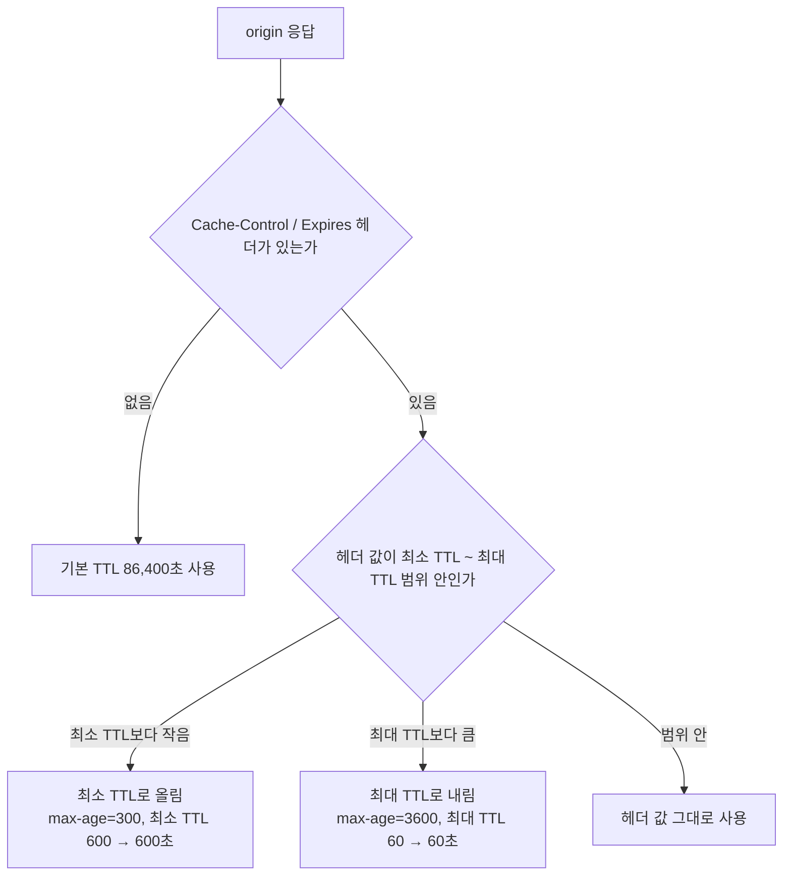

Cloudflare는 기본적으로 origin 헤더를 따르되, `Cache-Control: no-store` / `no-cache`가 없으면 정적 파일 확장자(css, js, png 등)는 자동으로 엣지 캐시에 올린다. 무료 플랜에서도 이 동작은 켜져 있다. 반면 HTML과 JSON은 기본적으로 캐시하지 않는다([기본 캐시 동작](https://developers.cloudflare.com/cache/concepts/default-cache-behavior/)) — 쿠키나 쿼리스트링 기반 동적 콘텐츠를 잘못 캐시하지 않기 위해서다.

### Cache Rules와 Cache Policy의 캐시 키 설계

CloudFront는 캐시 키에 무엇을 넣을지를 Cache Policy라는 별도 리소스로 정의하고, 오리진에 무엇을 보낼지는 Origin Request Policy로 분리한다. 헤더·쿠키·쿼리스트링을 캐시 키에 넣으면 그 값마다 별도 객체가 생기고, 키에 안 넣고 오리진에만 전달하려면 Origin Request Policy 쪽에 둔다. 위치 헤더 같은 값은 이 분리를 강제한다. 예를 들어 `CloudFront-Viewer-Address`는 Origin Request Policy에만 넣을 수 있고 Cache Policy에는 못 넣는다([헤더 문서](https://docs.aws.amazon.com/AmazonCloudFront/latest/DeveloperGuide/adding-cloudfront-headers.html)).

Cloudflare는 Cache Rules에서 조건(호스트, 경로, 확장자, 헤더 등)에 맞는 요청마다 캐시 적격 여부, Edge TTL, 캐시 키 구성을 지정한다. 정책 객체를 만들어 여러 behavior에 붙이는 CloudFront와 달리, 규칙 목록을 위에서부터 평가하는 구조다. 쿠키·쿼리스트링 무시, 쿼리 일부만 키에 포함, 사용자 국가를 키에 포함하는 설정이 규칙 하나에서 끝난다.

실무에서 갈리는 지점은 두 가지다. 하나는 기본값이다. CloudFront의 Managed `CachingOptimized` 정책은 쿼리스트링·쿠키·헤더를 키에 넣지 않으므로, `?lang=ko` 같은 파라미터로 응답이 달라지는 경로에 그대로 붙이면 모든 사용자가 같은 객체를 받는다. 다른 하나는 HTML이다. Cloudflare는 기본이 비캐시라 규칙을 직접 써야 하고, CloudFront는 behavior에 정책을 붙이는 순간 캐시된다. 둘 중 어느 쪽이든 로그인 쿠키가 있는 응답이 공용 캐시에 올라가는 사고는 키 설계를 빼먹을 때 난다.

### Tiered Cache와 Origin Shield

엣지에서 미스가 난 요청이 전부 오리진으로 가지 않게 막는 장치다. 이름은 다르지만 목적은 같고 구조가 다르다.

| 항목 | Cloudflare Tiered Cache | CloudFront Regional Edge Cache | CloudFront Origin Shield |
|---|---|---|---|
| 켜는 방법 | 설정에서 켠다. Smart Tiered Cache는 구성 없이 오리진별 상위 PoP를 자동 선택 | 자동. 끌 수 없다 | 오리진 단위로 지정 |
| 위치 | 오리진마다 가까운 상위 계층 PoP | 엣지 위에 있는 리전별 캐시 | 오리진 리전 근처 단일 캐시 |
| 비용 | Smart Topology는 전 플랜에서 무료 | 별도 과금 없음 | 요청 1만 건당 과금 (서울 $0.0090) |
| 효과 | 오리진으로 가는 미스 합류 | 엣지 간 미스 일부 합류 | 모든 리전의 미스를 한 곳으로 합류 |

Cloudflare 플랜별로 Smart Topology는 Free부터 쓸 수 있고, Generic Global·Regional·Custom 토폴로지는 Enterprise 전용이다([Tiered Cache 문서](https://developers.cloudflare.com/cache/how-to/tiered-cache/)). CloudFront Origin Shield 요금은 [종량제 요금 페이지](https://aws.amazon.com/cloudfront/pricing/pay-as-you-go/)에 있다.

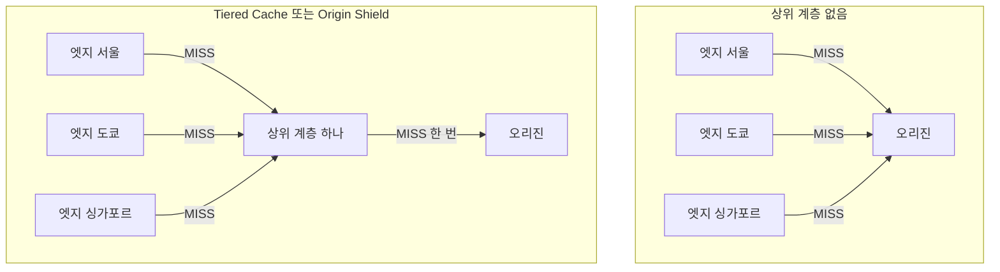

위쪽은 같은 객체를 엣지 세 곳이 각자 오리진에서 가져온다. 아래쪽은 상위 계층 하나가 미스를 모아서 오리진에는 한 번만 간다. 오리진 부하가 문제인 서비스, 특히 오리진이 리전 한 곳이고 트래픽이 여러 대륙에서 오는 서비스에서 효과가 크다. 반대로 인기 객체 몇 개만 반복 요청되는 서비스는 엣지 히트율이 이미 높아서 Origin Shield 요금만 늘고 얻는 게 적다. Origin Shield는 오리진과 같은 리전에 두지 않으면 오히려 한 단계가 더 늘어 지연만 추가된다.

### Invalidation 비용

CloudFront는 한 달에 1,000개 경로까지 무료로 무효화(invalidation)할 수 있다. 초과분은 경로당 $0.005다. 와일드카드(`/images/*`)도 1개로 카운트되지만, `/*` 하나로 전체를 날리는 건 일반적으로 권장하지 않는다 — 캐시 히트율이 급격히 떨어져 origin 부하가 치솟는다.

Cloudflare는 무료 플랜에서도 API로 캐시 퍼지(purge)가 가능하다. URL 퍼지가 무제한이라는 표현은 맞지 않다. 공식 문서 기준으로 계정당 초당 URL 수 한도가 있고 Free 800, Pro·Business 1,500, Enterprise 3,000이다. 요청 한 번에 담을 수 있는 URL도 Free·Pro·Business는 100개, Enterprise는 500개다. 태그·프리픽스·호스트 퍼지도 이제 모든 플랜에서 쓸 수 있지만 Free는 분당 5회 수준의 요청 한도가 걸린다([Purge cache 문서](https://developers.cloudflare.com/cache/how-to/purge-cache/)). 태그 퍼지가 Enterprise 전용이라던 이전 서술은 현재 문서와 맞지 않아 고쳤다. 전체 URL을 순회하며 날리는 배포 스크립트는 한도에 걸려 429를 받는다.

배포할 때마다 캐시를 퍼지해야 하는 SPA 구조라면 CloudFront의 invalidation 비용이 실제로 쌓인다. 파일명에 해시를 박는 방식(`main.8f2a1c.js`)을 쓰면 퍼지 없이도 되는데, 그렇게 못 하는 환경이 있다.

## 오리진 설정 세부사항

### 타임아웃

| 항목 | Cloudflare | CloudFront |
|---|---|---|
| 커넥션 타임아웃 | 19초 (고정, 초과 시 522) | 1~10초 설정 가능 (기본 10초) |
| 읽기 타임아웃 | 125초 (Enterprise만 변경 가능, 초과 시 524) | 1~60초 설정 가능 (기본 30초) |
| KeepAlive 타임아웃 | — | 1~60초 설정 가능 (기본 5초) |

Cloudflare는 Free·Pro·Business 플랜에서 오리진 타임아웃을 바꿀 수 없다. 읽기 타임아웃 조정은 Enterprise 전용이고 최대 6,000초까지 올릴 수 있다([524 오류 문서](https://developers.cloudflare.com/support/troubleshooting/http-status-codes/cloudflare-5xx-errors/error-524/), [연결 한도 표](https://developers.cloudflare.com/fundamentals/reference/connection-limits/)). 이 문서의 이전 판은 100초에 Pro 이상 변경 가능이라고 적었는데 둘 다 현재 문서와 다르다. 오리진이 2분 넘게 걸리는 요청을 처리한다면 Enterprise가 아닌 이상 Cloudflare 앞에 두기 어렵다.

CloudFront는 OriginReadTimeout을 최대 60초까지 늘릴 수 있고, 그 이상이 필요하면 AWS 지원을 통해 180초까지 가능하다. 오리진이 배치 처리를 하거나 SSR 렌더링이 느린 경우 이 값을 조정할 일이 생긴다.

### 오리진 헬스체크

CloudFront는 자체 헬스체크를 제공하지 않는다. 오리진이 죽으면 CloudFront는 5xx를 그대로 반환한다. Origin Group으로 주-보조 오리진을 구성하면 실패 시 보조로 전환되는데, 이건 헬스체크가 아니라 실제 요청이 실패할 때 발동하는 폴백이다.

Cloudflare Load Balancing(Pro 이상 별도 옵션)은 오리진 헬스체크를 직접 실행한다. 풀 안의 오리진이 실패하면 다음 오리진으로 전환한다. 헬스체크 간격, 임계값, HTTP vs TCP 방식을 설정할 수 있다.

단순 CloudFront CDN 구성에서는 ALB나 Route 53 Health Check가 오리진 상태 관리를 맡고, CloudFront는 오리진이 정상이라는 전제로 트래픽을 보내는 역할만 한다. 오리진 다운 시 자동 폴백이 필요하다면 Origin Group을 구성하거나 ALB 레벨에서 처리해야 한다.

Origin Group 폴백은 주기적 점검이 아니라 요청이 실패한 순간에 발동한다. 아래 시퀀스에서 사용자 요청 하나가 주 오리진에서 실패하고 보조 오리진으로 다시 나가는 순서를 보면 된다.

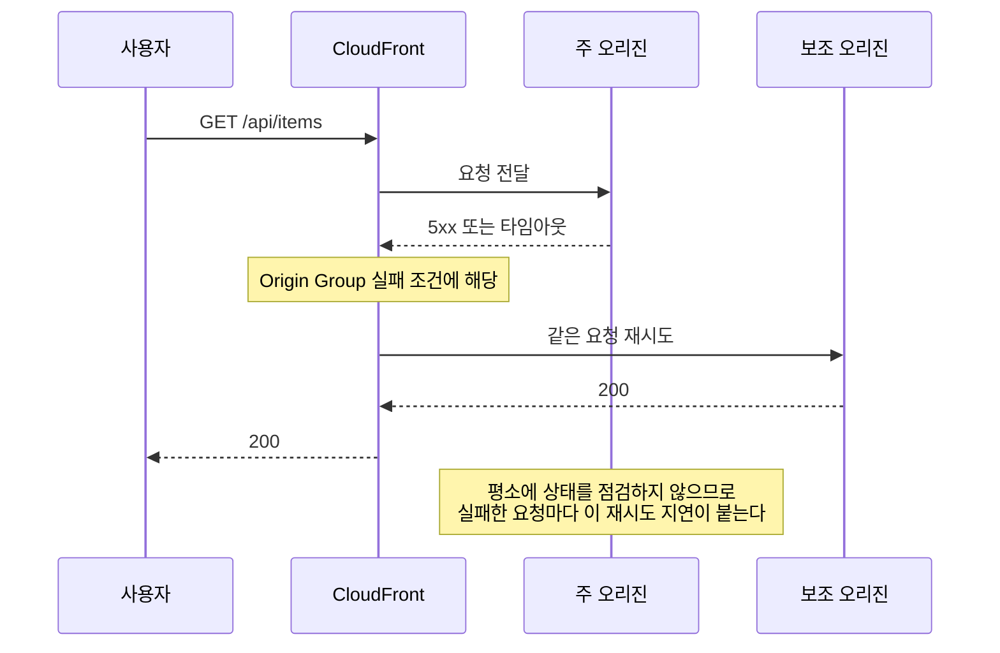

## 엣지 컴퓨팅

### CloudFront Functions vs Lambda@Edge vs Workers

CloudFront는 엣지 로직 실행을 두 계층으로 나눈다.

**CloudFront Functions**는 엣지 로케이션에서 실행된다. URL 재작성, 헤더 조작, 단순 리다이렉트 용도로만 쓸 수 있다. JavaScript 런타임이지만 `fetch`가 없다 — 외부 API를 부를 수 없다. 실행 시간 한도가 1ms다. 무료 티어는 월 2백만 호출까지다.

**Lambda@Edge**는 리전 엣지(Regional Edge Cache)에서 돌아간다. 진짜 Lambda 함수가 실행되는 것이라 Node.js나 Python을 쓸 수 있고 외부 API 호출도 된다. 대신 콜드스타트가 있고, 함수 배포가 전체 엣지에 전파되는 데 수 분이 걸린다. 요청 당 과금이 일반 Lambda보다 비싸다.

**Cloudflare Workers**는 모든 PoP에서 실행된다. V8 Isolate 방식이라 콜드스타트가 없다. `fetch`로 외부 API를 부를 수 있고, KV Store·Durable Objects·R2·D1 같은 Cloudflare 자체 스토리지와 연결된다. CPU 시간 제한(유료 30ms)이 있지만 대부분 요청 가공 로직은 여기서 끝난다.

A/B 테스트나 인증 토큰 검증처럼 "요청을 가로채서 뭔가를 보고 분기"하는 패턴은 Workers 쪽이 구현하기 편하다. CloudFront로 같은 걸 만들려면 Lambda@Edge를 써야 하는데, 배포 복잡도가 높고 전파 시간도 신경 써야 한다.

세 방식이 요청 경로의 어디에서 실행되는지가 제약을 가른다. 아래 flowchart에서 실행 위치와 외부 호출 가능 여부를 비교해 보면 된다.

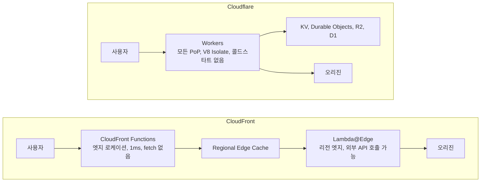

```javascript
// Cloudflare Workers: 국가 코드 기반 리다이렉트
export default {
  async fetch(request) {
    const country = request.cf?.country;
    if (country === 'KR') {
      return Response.redirect('https://kr.example.com' + new URL(request.url).pathname, 301);
    }
    return fetch(request);
  }
};
```

```javascript
// CloudFront Functions: 헤더 조작 (fetch 불가)
function handler(event) {
  var request = event.request;
  request.headers['x-forwarded-host'] = { value: request.headers['host'].value };
  return request;
}
```

## WAF·DDoS 보호

Cloudflare WAF는 무료 플랜에도 기본 규칙셋이 포함된다. Pro 이상에서는 OWASP 코어 룰셋과 Cloudflare 관리 규칙셋이 활성화된다. L3/L4 DDoS 보호는 모든 플랜에서 무제한으로 적용된다 — Cloudflare 입장에서 DDoS를 흡수하는 게 자사 네트워크를 지키는 일이기도 해서다.

실제로 3.8 Tbps 규모의 공격을 막은 사례가 있는데, 이 정도 용량은 단순 서비스 약관이 아니라 네트워크 구조의 문제다. Cloudflare 네트워크 자체 용량이 100 Tbps 이상이라 웬만한 볼류메트릭 공격은 그냥 흡수한다.

AWS Shield Standard는 CloudFront를 통해 자동 적용된다. L3/L4 보호는 무료지만, L7 공격(HTTP flood, slowloris 등)은 AWS WAF가 따로 필요하고 유료다. WAF 웹 ACL당 월 $5, 규칙당 $1, 백만 요청당 $0.6이 기본 과금이다. 관리 규칙셋(AWS Managed Rules)을 쓰면 거기에 추가 요금이 붙는다.

Bot 관리도 차이가 난다. Cloudflare Bot Management는 Pro 이상에서 기본 봇 차단이 가능하고, 크리덴셜 스터핑이나 스크레이핑을 막는 기능은 상위 플랜에 있다. AWS WAF도 Bot Control 관리 규칙이 있는데, Common 모드는 월 $10, Targeted 모드는 월 $40에 요청량 과금이 더해진다.

## 로깅·모니터링

**Cloudflare Analytics**

무료 플랜에서도 대시보드에서 실시간(약 1분 지연) 데이터를 볼 수 있다. 요청 수, 캐시 히트율, 국가·ASN 분포, WAF 이벤트가 기본 제공된다.

무료 플랜의 로그 보존 기간은 24시간이다. 로그를 외부로 내보내는 기능(Logpush)은 Enterprise 플랜이다. 무료·Pro 플랜에서 원시 로그를 S3나 Splunk로 보내는 방법은 없다.

Workers 로그는 `wrangler tail` 명령으로 실시간 스트리밍이 가능하다. 개발 중에는 유용한데, 프로덕션에서 집계해서 보관하려면 Logpush 없이 안 된다.

**CloudFront 액세스 로그**

CloudFront 액세스 로그는 S3 버킷에 쌓인다. 배달 지연이 있다 — 보통 수 분이지만 최대 수 시간 지연되는 경우도 있다. 실시간 분석이 필요하면 CloudWatch Real-time Logs를 별도로 설정해야 한다.

CloudWatch Real-time Logs는 Kinesis Data Stream으로 로그를 보내는 구조다. 설정이 복잡하고 Kinesis 비용이 별도로 붙는다. 표본 추출률(sampling rate)을 1~100%로 설정할 수 있어서 비용 절감을 위해 1%만 수집하기도 한다.

CloudWatch 기본 메트릭(요청 수, 오류율, 캐시 히트율, 레이턴시)은 별도 설정 없이 수집된다. 다만 국가 단위나 경로 단위 분석은 로그를 직접 파야 한다.

두 제품의 차이를 정리하면:

- 실시간 트래픽 파악: Cloudflare 대시보드에서 바로 볼 수 있다. CloudFront는 Real-time Logs 설정 필요.
- 원시 로그 장기 보관·분석: CloudFront가 유연하다. S3에 쌓고 Athena로 쿼리하는 방식이 자리를 잡았다.
- WAF 이벤트 분석: Cloudflare는 대시보드에서 바로 필터링된다. CloudFront는 WAF 로그를 별도 S3 버킷에 설정해야 한다.

로그가 어디로 흘러가는지를 나란히 놓으면 아래와 같다. 각 화살표에 붙은 지연과 플랜 조건을 보면 된다.

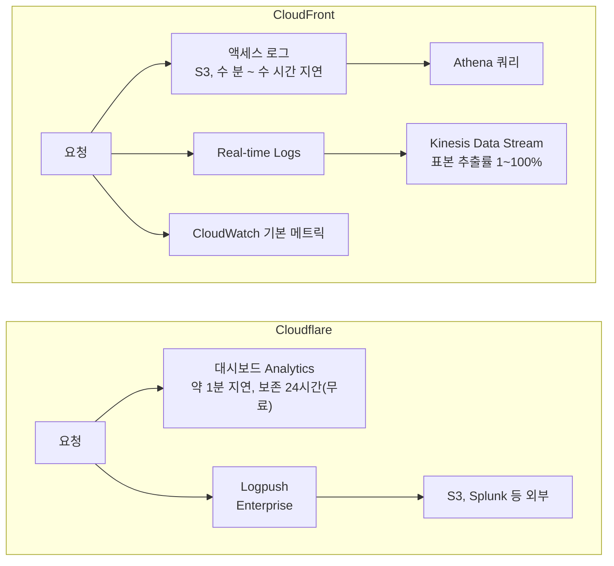

## 가격 구조

가격 비교는 트래픽 패턴에 따라 결과가 달라진다.

**Cloudflare**는 Pro 플랜이 월 $20으로 고정이고, 대역폭 과금이 없다. 엣지에서 내보내는 바이트 수에 돈을 내지 않는다. Workers도 무료 플랜 기준 일 10만 요청까지 무료, 유료($5/월)는 천만 요청까지다.

**CloudFront**는 대역폭과 요청 모두 과금한다. 한국 엣지로 나가는 트래픽 기준 HTTPS 요청 1만 건당 $0.0120이고, 대역폭은 첫 1TB 무료, 다음 9TB가 GB당 $0.120, 그다음 40TB가 $0.100, 그다음 100TB가 $0.095다([CloudFront 종량제 요금](https://aws.amazon.com/cloudfront/pricing/pay-as-you-go/)). 이전 판의 GB당 $0.114와 1만 건당 $0.0090은 현재 요금표와 맞지 않아 고쳤다. 대용량 파일을 많이 서빙하는 서비스는 대역폭 비용이 지배적이다. 반면 API 응답처럼 작은 크기의 요청이 많은 패턴은 요청 과금이 더 크다.

정적 자산을 월 50TB 서빙하면 한국 엣지 기준 대역폭 비용만 9TB x $0.120 + 40TB x $0.100으로 약 $5,080이 나온다. 이전 판의 $3,500은 미국·유럽 단가 구간(약 $3,965)에도 못 미쳐 어느 쪽으로 계산해도 맞지 않았다. Cloudflare Pro($20)나 Business($200)와 비교하면 규모가 다른 숫자지만, 이 비교가 성립하는 조건은 뒤의 대역폭 무과금 절에서 따진다. 단, CloudFront는 AWS 서비스 간 트래픽(S3 → CloudFront)은 무료다.

Workers 유사 기능(Lambda@Edge)은 요청 100만 건당 $0.60(호출당 $0.0000006), 실행 시간은 GB-초당 $0.00005001다. 이전 판의 GB-초 단가 $0.00000625125는 128MB 단위 값이라 GB-초로 읽으면 8배 작게 잡힌다. Cloudflare Workers 유료 플랜($5)과 직접 비교하기 어렵지만, 트래픽이 많아질수록 Lambda@Edge 비용이 가파르게 오른다.

### 대역폭 무과금 주장의 한계

"Cloudflare는 대역폭에 돈을 안 받는다"는 말은 서비스 약관 단서를 빼면 틀리다. Cloudflare는 서비스별 약관에서, 유료 서비스(Developer Platform, Images, Stream)를 쓰지 않고 CDN으로 영상이나 사진·오디오 등 큰 파일을 상당 비율로 서빙하면 접근을 제한할 수 있다고 적는다([Service-Specific Terms](https://www.cloudflare.com/service-specific-terms-application-services/)). 프록시를 켜 놓은 S3 이미지 버킷을 Free·Pro 플랜으로 월 수십 TB 서빙하는 구성이 여기에 걸린다. 약관은 "예측 가능한 임계치"를 정하지 않고 판단 재량을 Cloudflare에 둔다. 장애가 나기 전에는 문제가 없다가 어느 날 제한 통보를 받는 형태로 드러난다.

그래서 대용량 정적 파일은 R2에 올리고 R2 커스텀 도메인으로 내보내는 구성이 안전한 쪽이다. R2는 인터넷 egress가 무료다([R2 요금](https://developers.cloudflare.com/r2/pricing/)). 대신 저장 용량(Standard 월 GB당 $0.015)과 연산 과금(Class A 100만 건당 $4.50, Class B 100만 건당 $0.36)이 든다.

같은 큰 정적 파일을 내보내는 두 경로에서 어떤 비용과 위험이 붙는지는 아래 flowchart로 구분된다.

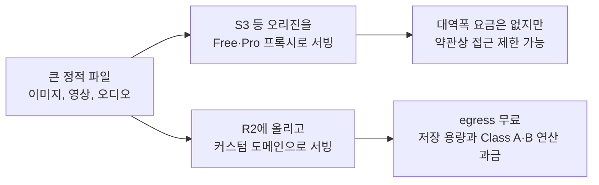

플랜별 한도도 같이 봐야 한다. 업로드 크기는 Free·Pro가 100MB, Business 200MB, Enterprise가 최대 5GB다. 캐시 가능한 파일 크기는 Free·Pro·Business가 512MB다([기본 캐시 동작](https://developers.cloudflare.com/cache/concepts/default-cache-behavior/)). 대용량 파일 업로드를 Cloudflare 프록시 뒤 API로 받는 서비스는 100MB에서 막힌다. 오리진 응답이 125초를 넘으면 524가 나는 것도 같은 부류의 한도다. 큰 업로드는 S3 presigned URL이나 R2 직접 업로드로 프록시를 우회해야 한다.

### 월 트래픽별 비용 손익분기

CloudFront 요금제는 종량제 외에 월 고정 요금제(Flat-rate) 계열이 생겼다. Free $0(요청 100만, 전송 100GB), Pro $15(요청 1,000만, 50TB), Business $200(요청 1억 2,500만, 50TB), Premium $1,000(요청 5억, 50TB)이고 초과 요금이 없다고 명시한다([CloudFront 요금 페이지](https://aws.amazon.com/cloudfront/pricing/)). 허용량과 포함 항목은 바뀔 수 있으니 계약 전에 페이지를 다시 확인한다.

아래 표는 전송량만 비교한 값이다. 서울(한국 엣지) 종량제는 위의 단가 구간으로 계산했고 요청 요금은 뺐다. Cloudflare 쪽은 Pro 플랜(연 결제 기준 월 $20, [플랜 페이지](https://www.cloudflare.com/plans/))에 R2 저장 1TB를 둔 구성이다.

| 월 전송량 | CloudFront 종량제 (한국 엣지) | CloudFront Flat-rate | Cloudflare Pro + R2 1TB 저장 |
|---|---|---|---|
| 1TB | $0 | $15 (Pro) | 약 $35 |
| 10TB | 약 $1,080 | $15 (Pro) | 약 $35 |
| 50TB | 약 $5,080 | $15 (Pro, 요청 1,000만 건 한도) | 약 $35 |
| 100TB | 약 $9,830 | Pro 한도 초과, 요금제 재검토 | 약 $35 + 연산 요금 |

종량제만 놓고 보면 손익분기는 낮다. Cloudflare Pro 월 $20는 한국 엣지에서 1TB를 넘긴 뒤 약 170GB만 더 나가도 넘는다. 그러나 현실에서 이 표를 그대로 쓰면 안 되는 이유가 세 가지 있다.

- 요청 수가 빠졌다. 작은 파일이 많은 서비스는 CloudFront 요청 요금이 전송 요금보다 크다. Flat-rate Pro의 요청 1,000만 건은 하루 33만 건이라 이미지가 많은 페이지 하나로도 소진된다.
- Cloudflare 쪽은 R2 저장 용량이 늘면 비례해서 오른다. 저장 100TB면 월 약 $1,500이다.
- 위 표의 R2 구성은 정적 파일에만 해당한다. API 응답이나 HTML을 Cloudflare 프록시로 내보내는 건 약관 문제가 아니라 캐시 정책 문제라 표의 숫자와 무관하다.

결국 AWS 안에 이미 있는 S3·ALB 앞에는 Flat-rate가, 파일을 R2로 옮길 수 있는 서비스는 Cloudflare가 싸게 나온다. 어느 쪽이든 월 고정 요금제 허용량과 요청 수 가정을 먼저 맞춰 본 다음 계산해야 한다.

## AWS 생태계 통합

CloudFront가 분명히 앞서는 영역이다.

S3 오리진을 CloudFront에 붙이면 OAC(Origin Access Control)로 S3 버킷을 퍼블릭으로 열지 않아도 된다. S3 정적 호스팅을 직접 노출하지 않고 CloudFront만 뚫어두는 구성이 자연스럽다.

ALB를 오리진으로 쓸 때도 CloudFront ↔ ALB 사이에 커스텀 헤더를 심어서 ALB로 직접 들어오는 요청을 막는다. API Gateway도 마찬가지다. IAM 정책으로 접근을 제한하는 것보다 훨씬 단순하다.

WAF 규칙, CloudWatch 메트릭, ACM 인증서, Route 53 — 전부 AWS 콘솔에서 관리한다. 별도 서비스를 배울 필요가 없다.

Cloudflare를 AWS 앞에 붙이는 건 가능하지만, 이 경우 Cloudflare와 AWS 두 곳에서 TLS를 끊어야 하고, 실제 클라이언트 IP를 origin에 전달하는 설정(`CF-Connecting-IP` 헤더 처리)도 직접 해야 한다. Cloudflare에서 AWS WAF로 이중 WAF를 운영하면 정책 충돌 디버깅도 복잡해진다.

AWS 안에서 닫힌 구성이 어떻게 생기는지는 아래 flowchart에서 보인다. 직접 접근 경로가 OAC와 커스텀 헤더에서 각각 막히는 지점이 핵심이다.

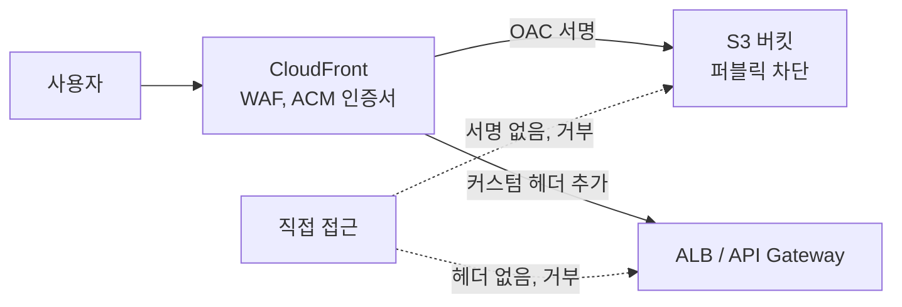

## HTTP/3, WebSocket, 클라이언트 IP

HTTP/3과 WebSocket은 둘 다 지원한다. 차이는 설정 위치와 오리진 구간이다. Cloudflare는 WebSocket을 모든 플랜에서 지원하고, 아무 데이터도 오가지 않는 유휴 연결은 끊으므로 클라이언트에서 ping/pong을 보내야 한다([WebSocket 문서](https://developers.cloudflare.com/network/websockets/)). CloudFront는 WebSocket을 쓰려면 캐시 동작에서 업그레이드 관련 헤더를 오리진으로 전달해야 한다. 두 CDN 모두 HTTP/3(QUIC)은 클라이언트와 엣지 사이 구간이고 오리진 구간은 HTTP/1.1 또는 HTTP/2로 간다고 보고 설계하는 편이 안전하다. 오리진 로그의 프로토콜 버전을 보고 "HTTP/3이 안 켜졌다"고 오해하는 경우가 있는데, 엣지 쪽을 `curl --http3`로 확인해야 한다.

오리진에서 실제 클라이언트 IP를 읽는 방식도 다르다. Cloudflare는 `CF-Connecting-IP`에 IP만 담는다. CloudFront는 `CloudFront-Viewer-Address` 헤더에 `IP:포트` 형태로 담는데, 위치 헤더이므로 Origin Request Policy에 넣어야 오리진에 전달된다. 값이 `198.51.100.10:46532` 형태라서 그대로 IP로 쓰면 안 된다. IPv6 클라이언트는 `[2001:db8::1]:46532`처럼 대괄호가 붙을 수 있어 `split(':')`으로 자르면 깨진다.

```javascript
// Node.js 오리진 (Express). 어느 CDN 뒤에 있는지에 따라 헤더가 갈린다
function clientIp(req) {
  const cf = req.headers['cf-connecting-ip'];
  if (cf) return cf;

  const viewer = req.headers['cloudfront-viewer-address'];
  if (viewer) {
    // "198.51.100.10:46532" 또는 "[2001:db8::1]:46532"
    const m = viewer.match(/^\[(.+)\]:\d+$/) || viewer.match(/^([^:]+):\d+$/);
    if (m) return m[1];
  }
  return req.socket.remoteAddress;
}
```

이 함수에는 보안 문제가 있다. 두 헤더 모두 클라이언트가 직접 보내면 위조된다. 오리진이 CDN 대역 외에서도 열려 있으면 `CF-Connecting-IP: 1.2.3.4`를 직접 박아 보내는 것만으로 IP 기반 접근 제어와 레이트 리밋을 우회한다. 오리진은 CDN이 알려진 대역에서 온 요청에서만 이 헤더를 신뢰해야 한다. CloudFront 쪽은 CloudFront 관리형 프리픽스 리스트를 보안 그룹에 걸고, Cloudflare 쪽은 공개된 IP 대역 또는 Authenticated Origin Pulls를 쓴다.

오리진에서 헤더를 믿어도 되는 조건은 아래 flowchart처럼 출발지 검증이 먼저다.

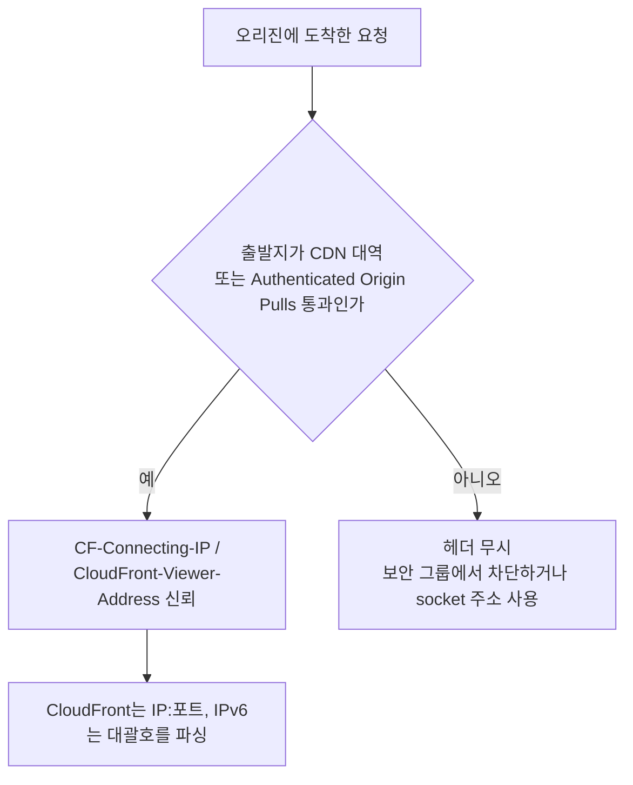

## CDN 전환 시 stale 콘텐츠

Cloudflare에서 CloudFront로, 또는 반대 방향으로 전환할 때 캐시 전파가 겹치는 구간이 생긴다. 이 구간 동안 stale 콘텐츠가 살아있는 시간을 미리 계산하고 들어가지 않으면 배포 직후 일부 사용자가 옛 파일을 받는 상황이 발생한다.

**최대 stale 지속 시간 계산**

시나리오: Cloudflare → CloudFront 전환, 동시에 오리진 콘텐츠 변경

```
최대 stale 지속 시간 = DNS TTL + 기존 CDN 잔여 캐시 TTL
```

DNS TTL이 300초이고 Cloudflare 엣지 캐시 TTL이 600초라면, DNS 변경 후 최대 900초(15분) 동안 일부 요청이 stale을 반환할 수 있다. DNS가 바뀌어도 Cloudflare IP를 캐싱한 클라이언트는 DNS TTL이 만료될 때까지 Cloudflare를 계속 바라보고, 그 사이 Cloudflare 엣지 캐시에 남아있는 콘텐츠는 캐시 TTL이 다할 때까지 살아있다.

전환 전 준비 순서:

1. 전환 수 시간 전에 DNS TTL을 60초로 낮춘다. 기존 TTL(보통 300~3600초)만큼 전파를 기다린다.
2. 기존 CDN(Cloudflare) 캐시를 퍼지한다.
3. DNS를 새 CDN(CloudFront)으로 변경한다.
4. 이제 stale 구간은 DNS TTL(60초) 정도로 줄어든다.

위 네 단계의 순서와 시점을 flowchart로 다시 놓으면 아래와 같다. 퍼지가 DNS 변경보다 앞서야 stale 구간이 줄어드는 점을 보면 된다.

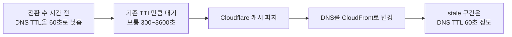

**이중 캐시 구성에서의 TTL 중첩**

Cloudflare를 앞에 두고 CloudFront를 오리진으로 쓰는 구성을 가끔 본다. 이 경우 TTL이 두 겹으로 쌓인다.

오리진의 `max-age=300`이 CloudFront에 캐시되면, Cloudflare는 CloudFront에서 내려온 `Cache-Control: max-age=300` 기준으로 다시 캐시한다. 오리진 콘텐츠를 바꾼 뒤 CloudFront 캐시를 퍼지해도 Cloudflare 캐시에 남아있는 건 별도로 퍼지해야 한다. 퍼지를 빠뜨리면 Cloudflare 캐시 TTL(최대 300초)만큼 stale이 계속 나간다.

아래 시퀀스는 오리진 콘텐츠를 바꾼 뒤 CloudFront 퍼지만 실행한 경우를 보여 준다. Cloudflare 엣지에 남은 사본이 TTL 동안 그대로 나가는 부분을 보면 된다.

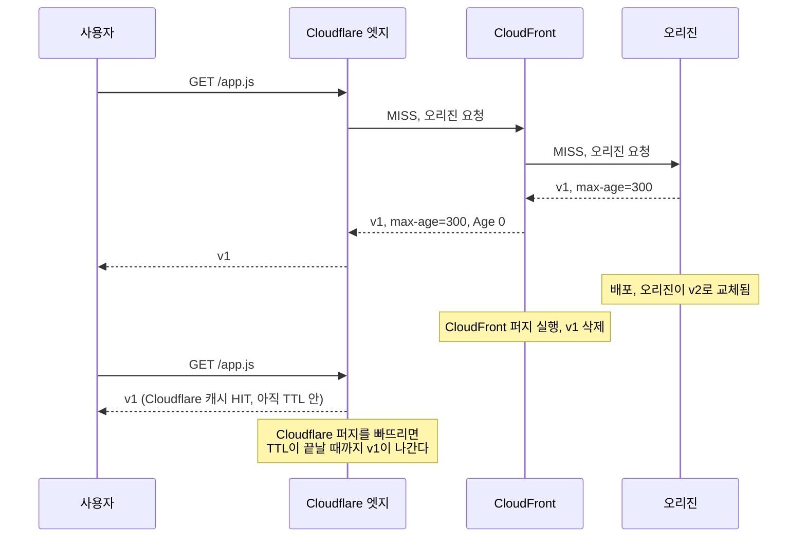

CloudFront가 응답에 붙이는 `Age`를 Cloudflare가 TTL 계산에 반영하는지는 Edge TTL 설정에 따라 다르다. 반영하지 않으면 CloudFront에서 이미 250초 묵은 객체를 받은 Cloudflare가 다시 300초를 살려서, 최악의 경우 오리진 변경 후 550초 가까이 옛 파일이 나간다. 이 동작은 규칙마다 확인해야 하고, 확인 전에는 두 계층의 TTL을 더한 값을 stale 상한으로 잡는다. 퍼지 자동화는 두 곳 모두 호출하는 스크립트로 묶어서 CloudFront 퍼지가 끝난 뒤 Cloudflare 퍼지를 하는 순서로 짠다. 순서가 반대면 Cloudflare가 다시 채우는 순간 CloudFront에 남은 옛 사본을 가져간다.

콘텐츠 변경이 잦은 서비스에서 이중 캐시 구성을 피해야 하는 이유가 여기 있다. 캐시 계층이 하나 늘어날 때마다 퍼지해야 하는 대상도 하나 늘어난다.

## 실무 선택 기준

분기점은 네 가지다. AWS 의존도, 월 대역폭 규모, 엣지 로직 비중, WAF를 누가 운영하는지다.

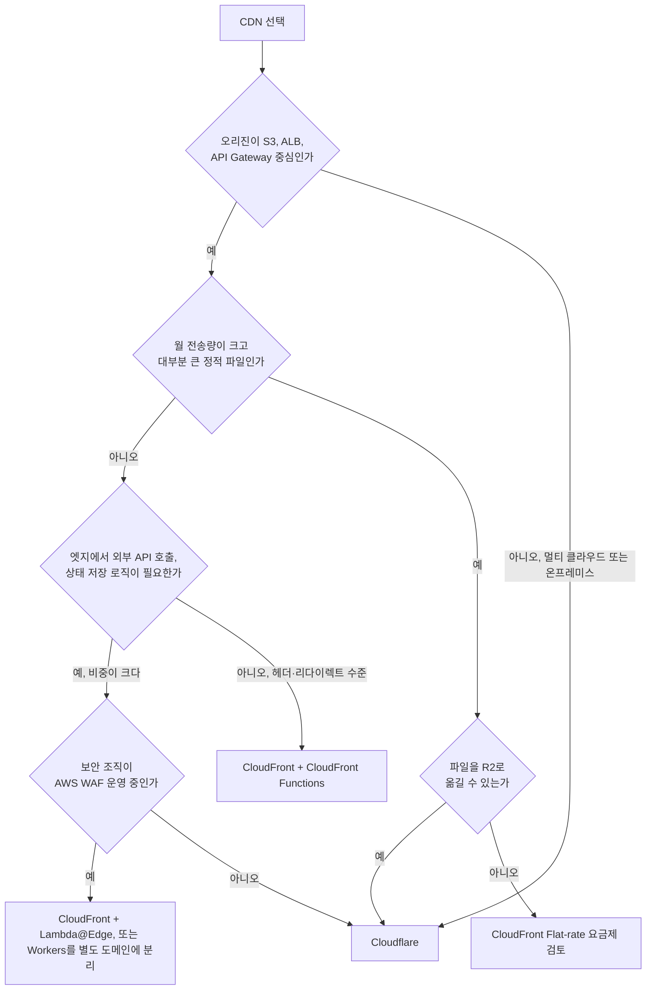

WAF 운영 주체는 기술보다 조직 문제로 갈린다. 보안팀이 AWS WAF 로그와 규칙 변경 이력을 이미 CloudWatch·S3에 쌓고 있다면 Cloudflare로 옮기는 순간 감사 경로가 둘이 된다. 반대로 AWS 계정을 개발팀이 쥐고 있고 보안 규칙을 빨리 바꿔야 한다면 Cloudflare 대시보드가 반복 속도가 빠르다.

**Cloudflare가 맞는 경우:**

AWS를 쓰지 않거나, 멀티 클라우드로 운영하는 경우. DNS를 Cloudflare로 옮기면 CDN과 WAF가 자동으로 붙어 오는 구조라 초기 설정이 단순하다.

대역폭이 많이 나가는 서비스. 이미지·동영상 스트리밍처럼 바이트 단위 과금이 부담스러울 때 Cloudflare의 정액제가 유리하다.

Workers로 엣지 로직을 많이 써야 할 때. A/B 테스트, 지역별 콘텐츠 분기, 엣지 캐시 커스터마이징을 코드로 제어하고 싶은 경우.

**CloudFront가 맞는 경우:**

이미 S3, ALB, API Gateway를 쓰고 있고, 이것들을 CDN 뒤에 놓는 게 주목적인 경우. OAC로 S3 버킷을 닫아두는 패턴이 잘 맞는다.

AWS 비용을 한 곳에서 관리하고 싶을 때. CloudFront + WAF + Shield 조합을 AWS 콘솔에서 통합 관리하는 편이 Cloudflare 대시보드를 추가로 운영하는 것보다 편하다.

Lambda@Edge가 아니라 리전 Lambda로 처리하면 되는 수준의 로직이라면 CloudFront Functions로 헤더 조작 정도만 쓰면 충분하다.

둘을 섞는 구성은 권장하지 않는다. Cloudflare를 앞에 두고 CloudFront를 오리진으로 쓰면 캐시가 두 겹이 되고, TTL 불일치로 예상치 못한 캐시가 살아있는 문제가 생긴다. 어느 쪽에서 WAF가 막은 건지도 추적이 어려워진다.

## 이 문서의 이전 서술 정정

가격과 한도 수치는 바뀐다. 이 문서가 한 번 틀렸던 값을 모아 둔다. 다음에 수치를 인용할 때 같은 곳에서 다시 틀리지 않으려는 용도다.

| 이전 서술 | 현재 확인한 값 | 출처 |
|---|---|---|
| Cloudflare URL 퍼지 무제한 | 계정당 초당 Free 800, Pro·Business 1,500, Enterprise 3,000 URL | [Purge cache](https://developers.cloudflare.com/cache/how-to/purge-cache/) |
| 태그 퍼지는 Enterprise 전용 | 모든 플랜에서 사용, 요청 한도만 다름 | 같은 문서 |
| 읽기 타임아웃 100초, Pro 이상 변경 가능 | 125초(524), Enterprise만 변경 | [Error 524](https://developers.cloudflare.com/support/troubleshooting/http-status-codes/cloudflare-5xx-errors/error-524/) |
| 커넥션 타임아웃 15초 | 19초(522) | [Connection limits](https://developers.cloudflare.com/fundamentals/reference/connection-limits/) |
| CloudFront 서울 GB당 $0.114 | 한국 엣지 첫 1TB 무료, 다음 9TB $0.120 | [종량제 요금](https://aws.amazon.com/cloudfront/pricing/pay-as-you-go/) |
| 요청 1만 건당 $0.0090 | 한국 엣지 HTTPS $0.0120 | 같은 페이지 |
| 월 50TB 약 $3,500 | 한국 엣지 약 $5,080 | 같은 페이지 단가로 계산 |
| Lambda@Edge GB-초 $0.00000625125 | $0.00005001 | 같은 페이지 |
| Cloudflare 대역폭 무과금 | 큰 파일 CDN 서빙은 약관상 제한 가능, R2 egress는 무료 | [약관](https://www.cloudflare.com/service-specific-terms-application-services/) |

요금표를 읽을 때 지역 구분을 놓치기 쉽다. 위 CloudFront 단가는 한국 엣지 기준이다. 미국·유럽은 같은 구간이 GB당 $0.085, $0.080, $0.060으로 더 싸다. 트래픽이 해외 사용자 중심이라면 한국 단가로 계산한 비용은 과대 추정이다.
