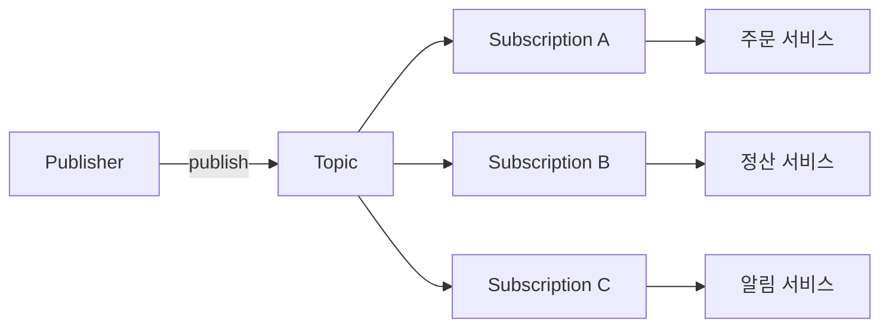

# Cloud Pub/Sub

GCP의 메시지 브로커다. 발행자(publisher)가 토픽에 메시지를 던지면, 그 토픽을 구독한 여러 구독(subscription)이 각자 사본을 받아간다. Kafka를 먼저 써봤다면 개념이 겹치는데, 파티션이라는 게 표면에 드러나지 않고 오프셋을 직접 관리하지 않는다는 점이 다르다. 스케일링과 저장은 GCP가 알아서 하고, 우리는 토픽과 구독만 만든다.

처음 쓸 때 가장 헷갈리는 게 토픽과 구독의 관계다. 메시지는 토픽에 저장되는 게 아니라 **구독마다 따로 쌓인다**. 토픽 하나에 구독 세 개가 붙어 있으면, 발행된 메시지 한 건이 세 개의 구독에 각각 복제되어 들어간다. 구독 A가 메시지를 ack해서 지워도 구독 B, C에는 그대로 남아 있다. 그래서 같은 이벤트를 서로 다른 서비스가 독립적으로 소비하게 만들려면 서비스마다 구독을 따로 파는 게 기본이다.



## 토픽과 구독 모델

토픽은 메시지가 들어오는 입구고, 구독은 그 메시지를 빼가는 출구다. 하나의 토픽에 구독이 없으면 발행한 메시지는 그냥 버려진다. 구독이 생기기 전에 발행한 메시지는 그 구독에서 볼 수 없다. 이 순서 때문에 초기 세팅에서 "메시지를 보냈는데 구독자가 못 받는다"는 상황이 종종 나온다. 구독을 먼저 만들고 발행을 시작해야 한다.

구독에는 메시지 보관 기간이 있다. 기본 7일이고 최대 31일까지 늘릴 수 있다. 구독자가 이 기간 안에 ack하지 못한 메시지는 사라진다. 장애로 컨슈머가 며칠 죽어 있어도 이 기간 안에만 복구하면 밀린 메시지를 그대로 받는다. 반대로 보관 기간을 넘겨 죽어 있었다면 그 사이 메시지는 유실이다.

```bash
# 토픽 생성
gcloud pubsub topics create order-events

# 풀 구독 생성 (ack deadline 30초, 보관 7일)
gcloud pubsub subscriptions create order-worker \
  --topic=order-events \
  --ack-deadline=30 \
  --message-retention-duration=7d
```

## 푸시 vs 풀 구독

구독은 메시지를 가져가는 방식에 따라 풀(pull)과 푸시(push)로 나뉜다. 이 선택이 나중에 운영 난이도를 크게 가른다.

풀 구독은 구독자가 능동적으로 Pub/Sub에 "메시지 있냐"고 요청해서 받아온다. 컨슈머 애플리케이션이 클라이언트 라이브러리로 스트리밍 풀 연결을 열고 계속 당겨오는 구조다. 처리 속도를 컨슈머가 제어하고, 동시에 몇 개까지 붙들지도 조절할 수 있다. 백엔드 워커를 직접 돌린다면 대부분 풀이 맞다.

푸시 구독은 Pub/Sub가 지정한 HTTPS 엔드포인트로 메시지를 POST로 밀어 넣는다. 컨슈머는 그냥 웹 서버로 요청을 받고 200 OK를 돌려주면 그게 ack다. Cloud Run이나 Cloud Functions처럼 요청 기반으로 뜨는 서버리스와 궁합이 좋다. 상시 떠 있는 워커 없이 이벤트 올 때만 인스턴스가 뜨는 구조를 만들 수 있다.

| 구분 | 풀(Pull) | 푸시(Push) |
|------|---------|-----------|
| 흐름 제어 | 구독자가 당겨오는 만큼 | Pub/Sub가 미는 대로 |
| 처리량 조절 | 동시 처리 수를 직접 제어 | 엔드포인트 응답 속도에 따라 자동 조절 |
| 인프라 | 상시 워커 필요 | 서버리스 엔드포인트로 충분 |
| 재시도 | ack 안 하면 재전송 | non-200 응답 시 재전송 |
| 적합 | 대량 배치, 처리량 큰 워커 | 저빈도 이벤트, 서버리스 |

푸시에서 자주 당하는 건 엔드포인트가 느려질 때다. 푸시는 응답이 200으로 돌아와야 ack로 처리하는데, 엔드포인트 처리가 느리면 Pub/Sub가 동시 푸시 개수를 자동으로 줄인다(slow-start 비슷하게 흐름을 조인다). 반대로 엔드포인트가 빠르게 200을 돌려주면 밀어 넣는 속도를 올린다. 그래서 푸시 엔드포인트에서 무거운 동기 처리를 그대로 하면 처리량이 안 올라간다. 받자마자 큐에 적재하고 200을 먼저 돌려주는 식으로 짜야 하는 경우가 있는데, 그러면 처리 실패 시 재전송 보장이 깨지므로 그 트레이드오프를 알고 써야 한다.

## 메시지 순서 보장 (ordering key)

기본적으로 Pub/Sub는 순서를 보장하지 않는다. A를 먼저 보내고 B를 나중에 보내도 구독자가 B를 먼저 받을 수 있다. 여러 서버에 분산되어 처리되기 때문에 이건 결함이 아니라 설계다.

순서가 필요하면 발행할 때 ordering key를 지정하고, 구독에서 message ordering을 켠다. 같은 ordering key를 가진 메시지들끼리는 발행 순서대로 전달된다. 키가 다르면 서로 순서 보장이 없다. 보통 이 키를 엔티티 ID로 잡는다. 주문 ID를 키로 쓰면 같은 주문에 대한 이벤트는 순서대로 오고, 다른 주문끼리는 병렬로 처리된다.

```python
from google.cloud import pubsub_v1

# 순서 보장을 켜려면 publisher 옵션에 enable_message_ordering 필요
publisher = pubsub_v1.PublisherClient(
    publisher_options=pubsub_v1.types.PublisherOptions(
        enable_message_ordering=True
    )
)
topic_path = publisher.topic_path("my-project", "order-events")

# 같은 ordering_key끼리 순서 보장
future = publisher.publish(
    topic_path,
    b'{"event": "created"}',
    ordering_key="order-12345",
)
future.result()
```

구독 쪽은 생성할 때 `--enable-message-ordering`을 줘야 한다. 발행만 키를 붙이고 구독에서 안 켜면 순서는 보장되지 않는다.

순서 보장을 켜면 대가가 있다. 같은 키의 메시지 하나가 처리에 실패해서 계속 재전송되면, 그 키의 뒤 메시지들이 앞의 것이 성공할 때까지 막힌다. 순서를 지키려니 앞의 것을 건너뛸 수 없어서다. 그래서 순서 보장 구독에서는 독성 메시지(poison message) 하나가 특정 키의 전체 흐름을 정지시키는 상황이 생긴다. 데드레터 토픽을 반드시 같이 걸어서, 몇 번 실패한 메시지는 옆으로 빼내야 흐름이 다시 흐른다. 그리고 순서 보장은 처리량을 떨어뜨리는 방향으로 작동하므로, 정말 순서가 필요한 토픽에만 켜는 게 맞다. 전 구간에 다 켜면 처리량이 이유 없이 깎인다.

## 중복 전달 (at-least-once)

Pub/Sub는 최소 1회 전달(at-least-once)을 보장한다. 정확히 1회가 아니다. 같은 메시지가 두 번 이상 올 수 있다는 뜻이고, 이건 예외 상황이 아니라 정상 동작 범위다. 네트워크 지연으로 ack가 제때 안 닿거나, ack deadline을 넘겨서 Pub/Sub가 "구독자가 못 받았나 보다" 판단하고 다시 보내는 경우가 대표적이다.

그래서 구독자는 **멱등하게(idempotent)** 짜야 한다. 같은 메시지를 두 번 처리해도 결과가 같아야 한다. 결제 승인처럼 두 번 실행되면 안 되는 작업이라면, 메시지에 붙는 `message_id`나 애플리케이션이 부여한 고유 키로 중복을 걸러낸다. 처리 이력 테이블에 키를 유니크 제약으로 걸고, 이미 있으면 스킵하는 방식이 흔하다.

```python
def callback(message):
    msg_id = message.message_id
    # 이미 처리한 메시지면 그냥 ack하고 넘어감
    if already_processed(msg_id):
        message.ack()
        return
    try:
        handle(message.data)
        mark_processed(msg_id)  # 처리 이력에 기록
        message.ack()
    except Exception:
        message.nack()  # 재전송 유도
```

정확히 1회에 가깝게 하고 싶으면 구독에 exactly-once delivery 옵션이 있다. 이걸 켜면 Pub/Sub가 ack된 메시지의 재전송을 억제한다. 다만 이건 단일 구독 안에서의 중복을 줄이는 것이지, 애플리케이션 레벨의 멱등성을 대체하지는 않는다. 여전히 멱등 처리를 기본으로 깔아두는 게 안전하다. exactly-once를 켜면 ack 처리 방식이 달라져서(ack가 성공했는지 응답을 받아야 함) 지연이 조금 늘고, 처리량도 영향을 받는다.

## 데드레터 토픽

몇 번을 재전송해도 계속 실패하는 메시지가 있다. 형식이 깨졌거나, 파싱이 안 되거나, 참조하는 데이터가 없어서 영원히 실패하는 것들이다. 이걸 그냥 두면 같은 메시지가 무한히 재전송되면서 워커 리소스를 계속 갉아먹고, 순서 보장 구독이라면 뒤 메시지까지 막는다.

데드레터 토픽(dead letter topic)은 일정 횟수 이상 전달 실패한 메시지를 별도 토픽으로 빼내는 장치다. 구독에 max delivery attempts를 설정하면, 그 횟수를 넘긴 메시지는 원래 구독에서 지워지고 지정한 데드레터 토픽으로 넘어간다. 거기에 다시 구독을 붙여서 실패 메시지를 따로 조사하거나, 수동으로 재처리한다.

```bash
# 데드레터용 토픽과 구독을 먼저 만들어 둠
gcloud pubsub topics create order-events-dlq
gcloud pubsub subscriptions create order-events-dlq-sub \
  --topic=order-events-dlq

# 원래 구독에 데드레터 정책 연결 (5회 실패 시 DLQ로)
gcloud pubsub subscriptions update order-worker \
  --dead-letter-topic=order-events-dlq \
  --max-delivery-attempts=5
```

여기서 놓치기 쉬운 게 권한이다. 데드레터로 메시지를 옮기는 주체는 우리 서비스가 아니라 Pub/Sub 서비스 계정이다. 이 서비스 계정에 원본 구독의 `subscriber` 권한과 데드레터 토픽의 `publisher` 권한을 둘 다 줘야 한다. 이 권한이 없으면 데드레터 정책을 걸어놨는데도 메시지가 DLQ로 안 넘어가고 계속 원래 구독에서 재전송된다. 설정은 됐는데 동작을 안 하는 것처럼 보이는 대부분의 경우가 이 권한 누락이다.

max delivery attempts 카운트는 정확한 값이 아니라 근사치라는 점도 알아둬야 한다. 5로 걸었다고 딱 5번 만에 넘어가는 게 아니라, 6~7번 시도된 뒤 넘어가기도 한다. DLQ로 넘어가는 시점을 카운트에 정밀하게 의존하는 로직은 짜지 않는 게 좋다.

## ack deadline 관리

구독자가 메시지를 받으면, 정해진 시간(ack deadline) 안에 ack를 보내야 한다. 이 시간을 넘기면 Pub/Sub는 그 메시지가 처리 안 됐다고 보고 다른(또는 같은) 구독자에게 다시 보낸다. 기본값은 10초, 최대 600초(10분)까지 설정할 수 있다.

이 값을 처리 시간에 맞게 잡는 게 중요하다. 메시지 하나 처리에 평균 20초 걸리는데 ack deadline을 10초로 두면, 아직 처리 중인 메시지를 Pub/Sub가 미처리로 판단해서 중복 전달한다. 워커는 멀쩡히 처리하고 있는데 같은 메시지가 계속 새로 들어오는 상황이 벌어진다. 처리 시간보다 넉넉하게 잡아야 한다.

처리 시간이 들쭉날쭉하면 고정 deadline으로는 맞추기 어렵다. 이럴 때 클라이언트 라이브러리의 ack deadline 자동 연장 기능을 쓴다. 라이브러리가 메시지를 붙들고 있는 동안 주기적으로 `modifyAckDeadline`을 호출해서 만료 시각을 미룬다. 파이썬/자바 공식 클라이언트는 이걸 기본으로 해주는데, 그래도 상한이 있다. 무한정 연장되는 게 아니라 max lease duration까지만 미룬다.

```python
from google.cloud import pubsub_v1

subscriber = pubsub_v1.SubscriberClient()
sub_path = subscriber.subscription_path("my-project", "order-worker")

# flow control로 동시에 붙드는 메시지 수 제한
flow_control = pubsub_v1.types.FlowControl(max_messages=100)

streaming_pull = subscriber.subscribe(
    sub_path, callback=callback, flow_control=flow_control
)
```

deadline을 너무 길게 잡는 것도 문제다. 600초로 잡아뒀는데 워커가 그 메시지를 잡은 채로 죽으면, Pub/Sub는 600초가 지나야 죽은 걸 알고 다른 워커에 재전송한다. 그 사이 그 메시지는 10분 동안 아무도 처리 못 하는 상태로 붙들려 있다. deadline은 처리 시간보다는 넉넉하되 지나치게 길지 않게, 실제 처리 시간에 여유분을 더한 값으로 잡는 게 낫다.

## 처리 지연 시 재전송 폭주

운영에서 제일 아프게 겪는 문제다. 구독자 처리가 느려지거나 일부 워커가 죽으면, ack deadline을 넘기는 메시지가 늘고, Pub/Sub는 미처리 판단한 메시지를 재전송한다. 그런데 이미 워커는 밀린 상태다. 재전송으로 들어온 메시지가 처리 큐에 더 쌓이고, 그것들도 deadline을 넘겨 또 재전송되면서 부하가 눈덩이처럼 불어난다. 처리가 느려서 재전송이 늘고, 재전송이 늘어서 더 느려지는 악순환이다.

이게 시작되면 백로그(미처리 메시지 수)가 급증하는데, 실제 유입량은 그대로인데도 재전송분 때문에 처리해야 할 양이 몇 배로 부풀어 보인다. 모니터링에서 `num_undelivered_messages`가 유입 대비 이상하게 크면 이 상황을 의심한다.

대응은 몇 갈래다.

첫째, flow control로 워커가 한 번에 붙드는 메시지 수를 제한한다. 위 예제의 `max_messages`가 그것이다. 워커가 감당할 만큼만 당겨오면, 붙들었다가 deadline 넘겨 재전송되는 메시지가 줄어든다. 소화도 못 할 만큼 당겨놓고 deadline을 넘기는 게 폭주의 흔한 시작점이다.

둘째, ack deadline과 실제 처리 시간의 간격을 다시 본다. 처리가 느려진 원인이 일시적이라면 deadline을 처리 시간보다 확실히 크게 잡아 불필요한 재전송을 막는다. 자동 연장이 켜져 있는지도 확인한다.

셋째, 처리 자체를 스케일아웃한다. 풀 구독이면 워커 인스턴스를 늘려서 백로그를 빼낸다. Pub/Sub는 컨슈머 수에 맞춰 분산해주므로 워커를 늘리면 처리량이 대체로 선형에 가깝게 오른다. 다만 순서 보장 구독이라면 같은 키는 한 번에 한 곳에서만 처리되므로 무작정 늘려도 그 키의 처리 속도는 안 오른다.

넷째, 실패가 특정 메시지 때문이라면 데드레터 토픽으로 그 메시지를 빼낸다. 독성 메시지 하나가 재전송을 반복하며 부하를 만드는 경우, DLQ로 격리하면 흐름이 정상으로 돌아온다.

마지막으로, 유입 자체가 순간적으로 폭증한 거라면 워커를 늘리는 것과 별개로 다운스트림(DB 등)이 병목인지 본다. Pub/Sub는 메시지를 잘 밀어주는데 워커 뒤의 DB가 못 받아내서 처리가 느려지는 경우가 많다. 이때 Pub/Sub만 튜닝해봐야 소용이 없고, DB 커넥션 풀이나 배치 처리를 손봐야 한다.

## 메시지 필터링

구독 레벨에서 CEL(Common Expression Language) 필터를 걸면, 토픽으로 들어온 메시지 중 조건에 맞는 것만 해당 구독에 전달된다. 필터는 메시지 attributes에만 적용되고, 데이터(body)에는 적용되지 않는다.

`order-events` 토픽에 주문 생성·결제·취소 이벤트가 섞여 들어올 때, 서비스마다 필요한 이벤트만 받고 싶은 상황이 대표적이다. 발행할 때 attributes에 분류 키를 붙이고, 구독 생성 시 필터를 건다.

```bash
# 발행 - attributes에 이벤트 타입과 리전 붙이기
gcloud pubsub topics publish order-events \
  --message='{"order_id":"123"}' \
  --attribute=event_type=order_created,region=KR

# order_created만 받는 구독
gcloud pubsub subscriptions create order-created-sub \
  --topic=order-events \
  --message-filter='attributes.event_type = "order_created"'

# AND 조건 - KR 리전의 결제 이벤트만
gcloud pubsub subscriptions create payment-kr-sub \
  --topic=order-events \
  --message-filter='attributes.event_type = "payment_completed" AND attributes.region = "KR"'
```

```python
from google.cloud import pubsub_v1

publisher = pubsub_v1.PublisherClient()
topic_path = publisher.topic_path("my-project", "order-events")

future = publisher.publish(
    topic_path,
    b'{"order_id": "123", "amount": 50000}',
    event_type="payment_completed",
    region="KR",
)
future.result()
```

필터는 구독 생성 시점에만 설정할 수 있다. 이후 수정이 안 되므로 필터 조건을 바꾸려면 구독을 지우고 새로 만들어야 한다. attributes 키 이름을 처음부터 잘 정해야 하는 이유다.

필터로 걸러진 메시지는 해당 구독에 전달되지 않는데, Pub/Sub가 그 메시지의 ack를 자동으로 처리한다. 구독자가 따로 신경 쓸 필요 없다. 토픽에는 모든 메시지가 들어오고 구독 단에서 잘리는 구조다.

비용 측면에서 한 가지 알아둘 게 있다. 필터에 걸려서 전달되지 않은 메시지에 대해서도 구독 처리 비용이 발생한다. 이벤트 종류가 매우 많고 구독마다 걸러지는 비율이 높다면, 토픽 자체를 이벤트 종류별로 나누는 게 비용 면에서 나을 수도 있다. 필터는 관리 편의성을 주지만, 발행 트래픽이 대용량이면 비용 구조를 한 번 확인해봐야 한다.

## Snapshot & Seek

Seek는 구독의 커서를 특정 시점으로 되돌리거나 앞으로 건너뛰는 기능이다. Kafka의 오프셋 리셋과 개념이 비슷한데, 파티션 오프셋 대신 타임스탬프나 스냅샷 기반으로 동작한다.

실무에서 이게 필요한 상황은 배포 버그로 잘못 처리한 메시지를 특정 시점부터 다시 처리해야 할 때, 또는 새로 짠 처리 로직을 과거 메시지로 검증하고 싶을 때다.

### 스냅샷 방식

스냅샷은 그 순간의 구독 ack 상태를 저장해둔다. 배포 전에 찍어두고, 문제가 생기면 그 시점으로 되돌린다.

```bash
# 배포 전 스냅샷 저장
gcloud pubsub snapshots create pre-deploy-snapshot \
  --subscription=order-worker

# 배포 후 문제 발생 시 스냅샷으로 롤백
gcloud pubsub subscriptions seek order-worker \
  --snapshot=pre-deploy-snapshot
```

스냅샷 보관 기간은 구독의 메시지 보관 기간과 같다. 구독 보관 기간이 7일이면 스냅샷도 7일이 지나면 사라진다.

### 타임스탬프 방식

스냅샷 없이 특정 시각으로 직접 Seek할 수도 있다.

```bash
# 2026-07-19 09:00 KST 이후 메시지부터 재처리
gcloud pubsub subscriptions seek order-worker \
  --time="2026-07-19T00:00:00Z"
```

```python
from google.cloud import pubsub_v1
from google.protobuf import timestamp_pb2
import datetime

subscriber = pubsub_v1.SubscriberClient()
sub_path = subscriber.subscription_path("my-project", "order-worker")

seek_time = datetime.datetime(2026, 7, 19, 0, 0, 0, tzinfo=datetime.timezone.utc)
ts = timestamp_pb2.Timestamp()
ts.FromDatetime(seek_time)

subscriber.seek(request={"subscription": sub_path, "time": ts})
```

Seek 후에는 이미 ack된 메시지가 다시 전달된다. 멱등 처리가 갖춰져 있지 않으면 중복 처리가 그대로 발생하므로, Seek 전에 반드시 확인해야 한다.

Seek는 메시지 자체를 복원하는 게 아니라 구독 커서를 움직이는 것이다. 되돌리려는 시점의 메시지가 구독 보관 기간 안에 있어야 받을 수 있다. 보관 기간이 7일인데 2주 전으로 Seek하면 그 사이 메시지는 이미 사라져서 받을 수 없다.

순서 보장 구독에서 Seek를 쓰면 특정 ordering key의 순서가 꼬일 수 있다. Seek 후에는 해당 키들의 처리 상태를 직접 확인하는 게 안전하다.

Seek와 동시에 워커를 재시작하지 않으면 메시지가 쌓이기만 하고 처리가 안 되는 상황이 생긴다. Seek 명령과 워커 재시작을 묶어서 진행해야 한다.

## Pub/Sub Schema Registry

토픽에 스키마를 연결하면, 스키마에 맞지 않는 메시지는 발행 단계에서 거부된다. Avro와 Protocol Buffers(proto3) 두 형식을 지원한다.

스키마 없이 쓰다가 발행 측이 필드명을 오타 내거나 타입을 바꾼 경우, 구독자가 파싱 오류를 낸 뒤에야 문제를 알게 된다. 스키마가 있으면 발행 시점에 잡힌다.

### Avro 스키마

```bash
# 스키마 정의 파일 작성
cat > order_schema.json << 'EOF'
{
  "type": "record",
  "name": "OrderEvent",
  "fields": [
    {"name": "order_id", "type": "string"},
    {"name": "amount",   "type": "int"},
    {"name": "event_type", "type": "string"},
    {"name": "created_at", "type": "long"}
  ]
}
EOF

# 스키마 등록
gcloud pubsub schemas create order-event-schema \
  --type=avro \
  --definition-file=order_schema.json

# 토픽에 스키마 연결 (JSON 인코딩)
gcloud pubsub topics create order-events \
  --schema=order-event-schema \
  --message-encoding=json
```

### Protobuf 스키마

```bash
cat > order_event.proto << 'EOF'
syntax = "proto3";

message OrderEvent {
  string order_id   = 1;
  int32  amount     = 2;
  string event_type = 3;
  int64  created_at = 4;
}
EOF

gcloud pubsub schemas create order-event-proto \
  --type=protocol-buffer \
  --definition-file=order_event.proto

gcloud pubsub topics create order-events-proto \
  --schema=order-event-proto \
  --message-encoding=binary
```

인코딩을 json으로 쓸지 binary로 쓸지는 트레이드오프가 있다. json은 GCP 콘솔에서 메시지를 직접 읽을 수 있어서 디버깅이 훨씬 편하다. binary는 메시지 크기가 작지만 콘솔에서는 깨진 문자로 보인다. 운영 초기나 디버깅이 잦은 환경이면 json이 낫고, 메시지 처리량이 매우 많아서 크기 절약이 중요하면 binary를 쓴다.

```python
import io
import avro.schema
import avro.io
from google.cloud import pubsub_v1

publisher = pubsub_v1.PublisherClient()
topic_path = publisher.topic_path("my-project", "order-events")

schema_str = '''
{
  "type": "record",
  "name": "OrderEvent",
  "fields": [
    {"name": "order_id",   "type": "string"},
    {"name": "amount",     "type": "int"},
    {"name": "event_type", "type": "string"},
    {"name": "created_at", "type": "long"}
  ]
}
'''
schema = avro.schema.parse(schema_str)
writer = avro.io.DatumWriter(schema)
buf = io.BytesIO()
encoder = avro.io.BinaryEncoder(buf)

writer.write({
    "order_id":   "order-123",
    "amount":     50000,
    "event_type": "order_created",
    "created_at": 1721347200000,
}, encoder)

future = publisher.publish(topic_path, buf.getvalue())
future.result()
```

스키마 변경은 조심해야 한다. 토픽에 연결된 스키마를 수정하려면 새 스키마 버전을 등록해야 한다. Avro는 스키마 진화(schema evolution)를 지원해서 optional 필드 추가는 하위 호환이 되지만, 필드 제거나 타입 변경은 기존 구독자 파싱을 깨뜨린다. 스키마를 바꿀 때는 발행자와 구독자 중 어느 쪽을 먼저 배포할지 순서를 정해야 한다. 필드를 추가하는 경우라면 구독자 먼저 배포해서 새 필드를 받을 준비를 하고, 그다음에 발행자를 바꾸는 게 안전하다.
