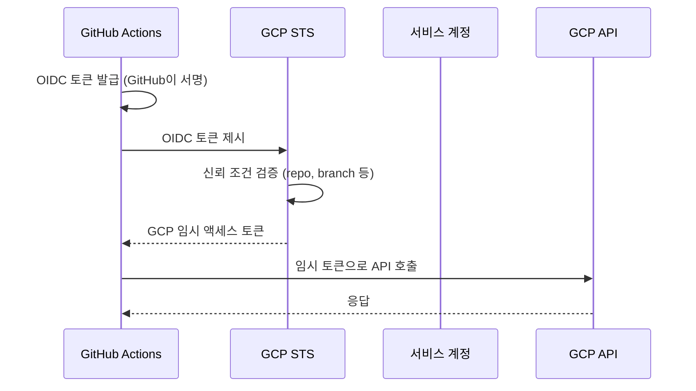

# GCP IAM

GCP에서 "누가 무엇을 할 수 있는가"를 정하는 게 IAM이다. AWS IAM을 써본 사람이라면 개념은 비슷한데, 정책이 붙는 방식과 상속 구조가 꽤 달라서 처음엔 헷갈린다. AWS는 정책 문서를 사용자나 역할에 직접 붙이는데, GCP는 "이 리소스에서 / 이 멤버가 / 이 역할을 가진다"는 세 쌍(바인딩)을 리소스에 붙이는 구조다. 그리고 이 바인딩이 리소스 계층을 따라 아래로 상속된다.

IAM 정책의 기본 단위는 이렇게 생겼다.

```
멤버(member)  →  역할(role)  →  리소스(resource)
user:kim@example.com  →  roles/storage.objectViewer  →  프로젝트 my-app
```

멤버는 사용자, 그룹, 서비스 계정, 도메인 전체가 될 수 있다. 역할은 권한(permission)의 묶음이다. 개별 권한을 멤버에게 직접 줄 수는 없고 항상 역할을 통해서만 준다. 이 점이 AWS와 크게 다르다. AWS는 인라인 정책으로 `s3:GetObject` 하나만 딱 줄 수 있지만, GCP는 `storage.objects.get` 권한을 주려면 그 권한이 포함된 역할을 만들거나 골라서 붙여야 한다.

## 리소스 계층과 정책 상속

GCP 리소스는 트리 구조로 묶인다. 맨 위가 조직(Organization), 그 아래 폴더(Folder), 그 아래 프로젝트(Project), 그 아래 실제 리소스(GCE 인스턴스, GCS 버킷 등)가 있다.

```
조직 (example.com)
├── 폴더: prod
│   ├── 프로젝트: prod-web
│   │   ├── GCE 인스턴스
│   │   └── GCS 버킷
│   └── 프로젝트: prod-batch
└── 폴더: dev
    └── 프로젝트: dev-sandbox
```

상속 규칙은 하나다. 상위에 붙인 정책은 하위 전체에 그대로 내려간다. 조직 레벨에서 `user:kim@example.com`에게 `roles/viewer`를 주면, 그 아래 모든 폴더·프로젝트·리소스에서 kim은 뷰어가 된다. 프로젝트 레벨에서 준 역할은 그 프로젝트 안에서만 유효하다.

여기서 실무자가 반드시 알아야 할 건, **상속된 권한은 하위에서 뺄 수 없다**는 점이다. 조직에서 편집자 권한을 받은 사람을 특정 프로젝트에서만 뷰어로 낮추는 게 안 된다. GCP IAM은 기본적으로 "합집합(additive)" 모델이라, 계층 어디에선가 권한을 받으면 그게 최종 권한에 더해진다. Deny를 걸려면 별도로 IAM Deny 정책을 써야 하는데 이건 나중에 도입된 기능이고 조건이 까다로워서, 대부분의 팀은 애초에 상위 레벨에 권한을 헤프게 주지 않는 쪽으로 운영한다.

이걸 모르고 조직 관리자가 "일단 다 개발자한테 조직 레벨 Editor 줘"라고 하면, 나중에 특정 prod 프로젝트만 접근 제한하려 할 때 방법이 없어서 골치가 아프다. 권한은 항상 필요한 가장 낮은 계층에 붙이는 게 정석이다. 팀 단위로 접근을 관리하고 싶으면 폴더로 묶고 폴더 레벨에 붙인다.

실제 정책을 확인하는 명령은 이렇다.

```bash
# 프로젝트에 직접 붙은 정책만 보인다 (상속분은 안 나온다)
gcloud projects get-iam-policy prod-web --format=json

# 특정 사용자가 이 프로젝트에서 실제로 가진 권한을 상속까지 포함해 보려면
gcloud projects get-ancestors-iam-policy 는 없고,
# Policy Analyzer(asset inventory)를 써야 한다
gcloud asset analyze-iam-policy \
  --organization=123456789 \
  --identity="user:kim@example.com"
```

`get-iam-policy`가 그 리소스에 **직접** 붙은 바인딩만 보여준다는 게 함정이다. 상속받은 권한은 안 나온다. "왜 이 사람이 접근되지?" 하고 프로젝트 정책만 봐선 답이 안 나오는 경우가 이래서 생긴다. 상위 폴더나 조직에 붙은 걸 봐야 한다.

## 사전 정의 역할 vs 커스텀 역할

역할은 세 종류다.

1. **기본 역할(Basic Role)**: `roles/owner`, `roles/editor`, `roles/viewer`. GCP 초창기부터 있던 것으로, 프로젝트 전체에 걸쳐 광범위한 권한을 준다. Editor는 거의 모든 리소스를 만들고 고칠 수 있다. 실무에서는 되도록 쓰지 말아야 한다. 특히 Owner는 IAM 정책 자체를 바꿀 수 있어서 아무한테나 주면 권한 관리가 무너진다.

2. **사전 정의 역할(Predefined Role)**: `roles/storage.objectViewer`, `roles/cloudsql.client`처럼 서비스별로 GCP가 미리 만들어 둔 역할이다. 이름을 보면 대충 뭘 하는지 감이 온다. `.objectViewer`는 객체 읽기, `.admin`은 그 서비스 전체 관리. 대부분의 경우 이 사전 정의 역할 중에 필요한 게 있다.

3. **커스텀 역할(Custom Role)**: 사전 정의 역할이 너무 넓거나 딱 맞는 게 없을 때 권한을 직접 골라 만든다.

사전 정의 역할을 고를 때 이름만 보고 방심하면 안 된다. `roles/storage.admin`은 버킷 삭제, IAM 정책 변경까지 다 포함한다. 배포 파이프라인에서 객체 업로드만 하면 되는데 이걸 붙이면 필요 이상으로 열어주는 셈이다. 각 역할이 실제로 어떤 권한을 품는지는 콘솔의 역할 상세나 `gcloud iam roles describe`로 확인한다.

```bash
gcloud iam roles describe roles/storage.objectAdmin
```

권한 목록이 수십 개씩 나오는 역할도 흔하다. 그걸 다 볼 필요는 없고, 문제되는 건 보통 `.setIamPolicy`(권한 위임), `.delete`(삭제) 같은 위험한 권한이 섞여 있느냐다.

커스텀 역할은 이렇게 만든다.

```yaml
# uploader-role.yaml
title: "GCS Uploader"
description: "버킷에 객체 업로드/조회만"
stage: "GA"
includedPermissions:
  - storage.objects.create
  - storage.objects.get
  - storage.objects.list
```

```bash
gcloud iam roles create gcsUploader \
  --project=prod-web \
  --file=uploader-role.yaml
```

커스텀 역할을 쓸 때 겪는 실무 문제가 두 개 있다. 하나는 GCP가 새 API를 내면서 권한 이름을 추가하거나 바꾸는데, 커스텀 역할은 자동으로 안 따라온다는 점이다. 어떤 기능이 갑자기 권한 에러를 내면 그 사이 새로 생긴 권한이 커스텀 역할에 빠져 있는 경우가 있다. 그래서 커스텀 역할은 만들어 두고 방치하면 안 되고 주기적으로 점검해야 한다.

다른 하나는 조직 레벨 커스텀 역할과 프로젝트 레벨 커스텀 역할이 따로 논다는 점이다. 프로젝트에 만든 커스텀 역할은 다른 프로젝트에서 못 쓴다. 여러 프로젝트에서 같은 커스텀 역할을 재사용하려면 조직 레벨에 만들어야 하는데, 그러려면 조직 레벨 권한이 필요해서 보통 플랫폼 팀이 관리한다.

## 서비스 계정과 키의 위험

서비스 계정(Service Account)은 사람이 아닌 워크로드(애플리케이션, VM, 배치 잡)를 위한 계정이다. `배포봇@프로젝트.iam.gserviceaccount.com` 같은 이메일 형태의 아이디를 가진다. 코드가 GCP API를 부를 때 이 서비스 계정 신원으로 부른다.

서비스 계정은 두 가지 얼굴을 가진다. 하나는 "멤버"로서 다른 리소스에 대한 권한을 받는 대상이고, 다른 하나는 "리소스"로서 누가 이걸 흉내낼(impersonate) 수 있는지 관리 대상이 된다. 이 둘을 헷갈리면 권한 설계가 꼬인다.

가장 위험한 게 서비스 계정 키(JSON 키 파일)다. 키를 만들면 프라이빗 키가 담긴 JSON 파일이 다운로드된다. 이걸 애플리케이션에 넣어두면 그 파일만 있으면 누구든 그 서비스 계정 행세를 할 수 있다. 문제는:

- 키에는 만료가 없다. 한 번 새면 폐기(revoke)하기 전까지 영원히 유효하다.
- 파일이라 유출 경로가 많다. Git 커밋, 도커 이미지 레이어, 로그, 슬랙에 붙여넣기.
- 누가 언제 어디서 그 키를 썼는지 추적하기 어렵다.

실제 사고의 상당수가 GitHub에 실수로 커밋된 서비스 계정 키에서 나온다. 봇들이 공개 리포지토리를 긁어서 키를 찾고, 그걸로 암호화폐 채굴 인스턴스를 대량으로 띄운다. 아침에 출근하면 청구서가 수천 달러 찍혀 있는 식이다.

그래서 원칙은 **서비스 계정 키를 만들지 않는 것**이다. GCP 콘솔에서도 키 생성 시 경고가 뜬다. 다음 순서로 대안을 찾는다.

- GCP 안에서 도는 워크로드(GCE, GKE, Cloud Run 등): 키가 필요 없다. 리소스에 서비스 계정을 붙이면 메타데이터 서버를 통해 자동으로 토큰을 받는다. 코드에서 별도 인증 설정 없이 클라이언트 라이브러리가 알아서 가져온다(Application Default Credentials).
- GCP 밖에서 도는 워크로드(온프렘, 다른 클라우드, GitHub Actions): 뒤에 나올 Workload Identity Federation을 쓴다.
- 로컬 개발: 개인 계정으로 `gcloud auth application-default login` 하거나, 서비스 계정을 흉내내는(impersonate) 방식을 쓴다.

impersonation 방식이 키보다 안전한 이유는 임시 토큰(보통 1시간)만 발급받기 때문이다. 파일로 저장되는 영구 비밀이 없다.

```bash
# 키 없이 서비스 계정 흉내내서 명령 실행
gcloud storage ls gs://my-bucket \
  --impersonate-service-account=deploy-bot@prod-web.iam.gserviceaccount.com
```

이게 되려면 실행하는 사람에게 그 서비스 계정에 대한 `roles/iam.serviceAccountTokenCreator` 역할이 있어야 한다. 이 역할 자체가 강력하다. 어떤 서비스 계정을 흉내낼 수 있다는 건 그 계정의 권한을 다 쓸 수 있다는 뜻이라, 이 역할을 누구에게 주는지도 최소 권한으로 관리해야 한다.

키를 이미 발급해 쓰고 있다면, 어떤 서비스 계정에 키가 몇 개 걸려 있는지부터 파악한다.

```bash
gcloud iam service-accounts keys list \
  --iam-account=deploy-bot@prod-web.iam.gserviceaccount.com
```

여기서 나오는 키 중에 `SYSTEM_MANAGED`는 GCP가 내부적으로 쓰는 거라 건드리면 안 되고, `USER_MANAGED`가 사람이 만든 JSON 키다. 이걸 없애는 게 목표다. 조직 정책(Organization Policy)으로 `iam.disableServiceAccountKeyCreation`을 걸어서 키 생성 자체를 막는 곳도 많다.

## Workload Identity Federation

GCP 밖 워크로드가 키 없이 GCP에 인증하는 방법이다. 핵심 발상은 "외부 신원 공급자(IdP)가 발급한 토큰을 GCP가 신뢰하고, 그 토큰을 GCP 임시 토큰으로 교환해준다"는 것이다.

GitHub Actions를 예로 들면 흐름이 이렇다.



GitHub Actions는 실행될 때마다 자기 신원을 담은 OIDC 토큰을 GitHub이 서명해서 발급한다. 이 토큰에는 어떤 리포지토리의 어떤 브랜치에서 도는지가 들어 있다. GCP 쪽에 "이 GitHub 리포의 이 브랜치에서 온 토큰이면 신뢰한다"는 조건을 미리 걸어두면, GCP STS가 그 토큰을 받아 검증하고 GCP 임시 토큰으로 바꿔준다. 이 과정 어디에도 파일로 저장되는 영구 키가 없다.

설정은 워크로드 아이덴티티 풀(pool)과 공급자(provider)를 만드는 것부터 시작한다.

```bash
# 풀 생성
gcloud iam workload-identity-pools create github-pool \
  --location=global \
  --display-name="GitHub Actions Pool"

# 공급자 생성 (GitHub OIDC)
gcloud iam workload-identity-pools providers create-oidc github-provider \
  --location=global \
  --workload-identity-pool=github-pool \
  --issuer-uri="https://token.actions.githubusercontent.com" \
  --attribute-mapping="google.subject=assertion.sub,attribute.repository=assertion.repository" \
  --attribute-condition="assertion.repository=='myorg/myrepo'"
```

`--attribute-condition`을 반드시 걸어야 한다. 이걸 빼거나 느슨하게 하면 어느 GitHub 리포지토리에서 온 토큰이든 다 받아버린다. 남의 리포에서도 우리 서비스 계정을 흉내낼 수 있게 되는 셈이라 키를 쓰는 것보다 오히려 위험해진다. 실무에서 이 조건을 `repository`만이 아니라 브랜치나 환경까지 좁히는 경우가 많다. prod 배포는 `ref=='refs/heads/main'`까지 걸어서 main 브랜치에서만 되게 한다.

그다음 외부 신원이 특정 서비스 계정을 흉내낼 수 있게 연결한다.

```bash
gcloud iam service-accounts add-iam-policy-binding \
  deploy-bot@prod-web.iam.gserviceaccount.com \
  --role=roles/iam.workloadIdentityUser \
  --member="principalSet://iam.googleapis.com/projects/123456789/locations/global/workloadIdentityPools/github-pool/attribute.repository/myorg/myrepo"
```

GitHub Actions 워크플로에서는 `google-github-actions/auth` 액션에 풀과 서비스 계정만 알려주면 된다. 키를 시크릿에 넣을 필요가 없다.

```yaml
- uses: google-github-actions/auth@v2
  with:
    workload_identity_provider: "projects/123456789/locations/global/workloadIdentityPools/github-pool/providers/github-provider"
    service_account: "deploy-bot@prod-web.iam.gserviceaccount.com"
```

설정하다 자주 막히는 지점이 몇 군데 있다. 하나는 attribute-mapping과 attribute-condition에서 참조하는 속성 이름이 안 맞는 경우다. `assertion.repository`는 매핑에 정의돼 있어야 condition에서 쓸 수 있다. 다른 하나는 `principalSet` 경로에 프로젝트 이름이 아니라 프로젝트 번호를 써야 한다는 점이다. 이름을 쓰면 조용히 매칭이 안 된다.

## 최소 권한과 권한 디버깅

최소 권한(least privilege)은 말은 쉬운데 실제로 적용하려면 "이 워크로드가 정확히 어떤 권한을 쓰는가"를 알아야 한다. 처음부터 딱 맞게 좁히려 하면 자꾸 권한 에러가 나서 진도가 안 나간다. 현실적인 순서는 이렇다. 일단 조금 넓게 주고 돌린 다음, 실제로 쓴 권한만 남기고 조여간다.

권한 에러가 났을 때 GCP 에러 메시지는 대체로 친절한 편이다.

```
PERMISSION_DENIED: Permission 'storage.objects.get' denied on resource
(or it may not exist).
```

여기서 `storage.objects.get`이 필요한 권한이고, 이 권한이 든 역할을 서비스 계정에 붙이면 된다. 문제는 어떤 역할에 이 권한이 있는지 바로 안 떠오를 때다. 콘솔의 IAM > 역할 화면에서 권한 이름으로 필터링하면 그 권한을 포함한 역할 목록이 나온다.

`(or it may not exist)`라는 꼬리표가 붙는 이유는 GCP가 보안상 "권한이 없다"와 "리소스가 없다"를 구분해서 알려주지 않기 때문이다. 존재 여부를 흘리지 않으려는 것이다. 그래서 이 에러가 뜨면 권한 문제인지 오타로 없는 버킷을 부른 건지 둘 다 의심해야 한다.

권한을 붙였는데도 계속 거부되면 다음을 순서대로 본다.

- **전파 지연**: IAM 정책 변경은 즉시 반영되지 않을 때가 있다. 보통 수십 초, 길면 몇 분 걸린다. 방금 역할을 붙였는데 안 되면 잠깐 기다렸다 다시 시도한다.
- **엉뚱한 신원으로 호출**: 코드가 내가 생각한 서비스 계정이 아니라 다른 계정으로 API를 부르고 있을 수 있다. GCE 기본 서비스 계정으로 도는 걸 모르고 다른 계정에 권한을 붙였다든지. 실제 어떤 신원인지 확인하려면 코드 안에서 토큰의 주체를 찍어보거나, 감사 로그에서 `authenticationInfo.principalEmail`을 확인한다.
- **리소스 레벨 정책과 프로젝트 레벨 정책의 혼동**: GCS 버킷은 버킷 자체에도 IAM 정책을 붙일 수 있다. 프로젝트에 역할을 줬는데 버킷에 uniform bucket-level access가 걸려 있고 다르게 설정돼 있으면 헷갈린다.
- **조건부 역할(IAM Condition)**: 역할에 시간·리소스 조건이 걸려 있으면 조건을 안 만족할 때 조용히 거부된다. 정책 JSON에 `condition` 필드가 있는지 본다.

가장 확실한 디버깅 도구는 감사 로그(Cloud Audit Logs)다. 데이터 액세스 로그를 켜두면 어떤 신원이 어떤 API를 불렀고 결과가 뭐였는지 다 남는다.

```bash
gcloud logging read \
  'protoPayload.authenticationInfo.principalEmail="deploy-bot@prod-web.iam.gserviceaccount.com"
   AND protoPayload.status.code!=0' \
  --limit=20 \
  --format="table(timestamp, protoPayload.methodName, protoPayload.status.message)"
```

`status.code!=0`으로 거른 게 실패한 호출이다. 어떤 메서드에서 어떤 신원이 막혔는지 여기서 다 보인다. 권한 문제를 추측으로 붙였다 뗐다 하지 말고 이 로그를 근거로 정확히 필요한 권한만 붙이는 게 최소 권한에 도달하는 가장 빠른 길이다.

반대 방향으로, 이미 넓게 준 권한을 조이려 할 때는 IAM Recommender가 도움이 된다. GCP가 지난 90일간의 실제 사용 이력을 보고 "이 서비스 계정은 Editor를 갖고 있는데 실제로는 storage 읽기만 쓴다"는 식으로 권한 축소를 제안한다. 콘솔 IAM 화면에서 초과 권한에 표시가 뜨고, `gcloud recommender`로도 뽑을 수 있다.

```bash
gcloud recommender recommendations list \
  --project=prod-web \
  --recommender=google.iam.policy.Recommender \
  --location=global
```

이 제안을 그대로 적용하면 과하게 조여서 나중에 필요할 권한까지 뗄 수 있으니, 90일 안에 안 돌아본 배치 잡 같은 게 있는지 확인하고 반영한다.
