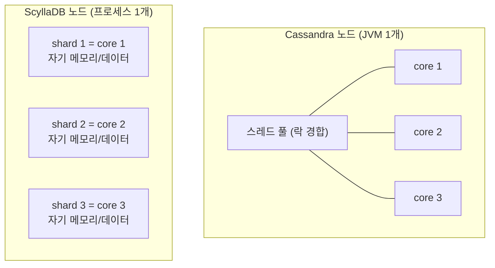
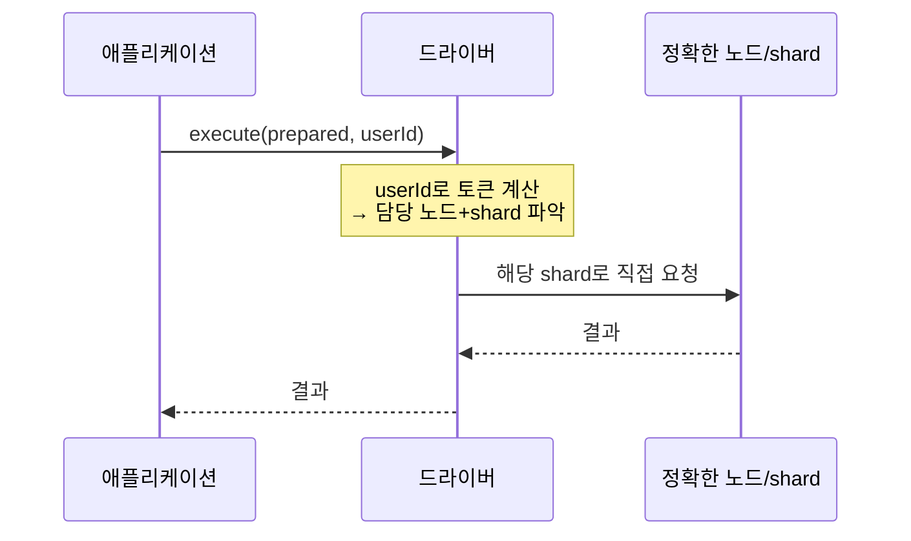

# ScyllaDB

> 와이드 컬럼 스토어를 처음 다룬다면 Cassandra 쪽 문서나 자료를 먼저 보고 오는 게 낫다. 이 문서는 ScyllaDB가 Cassandra와 뭐가 다른지, 그리고 실제로 운영하면서 부딪히는 부분 — 데이터 모델링, consistency level 선택, tombstone, compaction/repair, 드라이버 연결, 마이그레이션 — 을 정리한다.

---

## 1. ScyllaDB가 뭔가

ScyllaDB는 Apache Cassandra와 같은 데이터 모델·쿼리 언어(CQL)·프로토콜을 쓰면서, 코어를 C++로 다시 구현한 와이드 컬럼 스토어다. 2015년에 1.0이 나왔고, 만든 사람들이 KVM 하이퍼바이저와 OSv를 만들던 팀이라 시스템 프로그래밍 쪽 성향이 강하다.

겉으로 보면 Cassandra를 그대로 쓰던 애플리케이션을 거의 손대지 않고 옮길 수 있다. CQL 문법이 같고, 드라이버도 Cassandra 드라이버를 그대로 쓴다. 차이는 전부 내부에 있다. 같은 하드웨어에서 처리량이 몇 배 나오고, p99 지연이 훨씬 안정적이다. 이 차이가 어디서 오는지 이해하고 있어야 운영할 때 제대로 튜닝한다.

### 1.1 어디에 쓰나

쓰기가 많고, 키 기반 조회가 대부분이고, 데이터가 수 TB~PB 단위로 커지는 워크로드에 맞는다. 시계열 데이터, 이벤트 로그, 메시징, IoT 센서 데이터, 사용자별 피드/타임라인 같은 게 전형적이다.

반대로 조인이 필요하거나, 애드혹 쿼리를 자주 던지거나, 트랜잭션 정합성이 중요한 워크로드에는 맞지 않는다. 이건 ScyllaDB 한계라기보다 와이드 컬럼 스토어 전체의 성격이다. RDB로 풀 문제를 여기로 끌고 오면 데이터 모델링 단계에서부터 막힌다.

---

## 2. Cassandra와 뭐가 다른가

### 2.1 shard-per-core 아키텍처

Cassandra는 노드 하나에 JVM 프로세스 하나가 뜨고, 그 안에서 스레드 풀이 여러 코어를 공유한다. 스레드끼리 락을 잡고 공유 자료구조를 건드리니까 코어 수가 늘어도 락 경합 때문에 선형으로 안 늘어난다.

ScyllaDB는 코어(정확히는 하드웨어 스레드) 하나당 shard 하나를 둔다. 각 shard는 자기 메모리 영역, 자기 데이터 파티션, 자기 네트워크 큐를 독점한다. shard끼리 데이터를 공유하지 않으니까(shared-nothing) 락이 거의 없다. 코어 32개짜리 장비면 shard가 32개 뜨고, 각자 1/32씩 데이터를 맡아서 거의 독립적으로 돈다.



이 구조가 실무에서 의미하는 건, 파티션 키 설계가 코어 단위 부하 분산까지 결정한다는 점이다. 특정 파티션에 트래픽이 몰리면 그 파티션을 담당하는 단 하나의 shard, 즉 코어 하나만 일하고 나머지는 논다. hot partition이 Cassandra보다 더 직접적으로 성능을 깎는 이유가 여기 있다.

### 2.2 seastar 프레임워크

shard-per-core를 떠받치는 게 seastar라는 비동기 프레임워크다. 전통적인 서버는 요청마다 스레드를 잡고 블로킹 I/O를 한다. seastar는 shard마다 이벤트 루프 하나만 돌리고, 모든 I/O를 비동기로 처리한다. 디스크도 Linux의 AIO(나중에는 io_uring)로 직접 친다. 스레드 컨텍스트 스위칭 비용이 거의 없다.

seastar는 자체 메모리 할당자도 갖고 있어서 shard별로 메모리를 미리 나눠 잡는다. 그래서 ScyllaDB는 부팅할 때 시스템 메모리 대부분을 선점한다. 다른 프로세스와 같은 장비에 올리면 메모리 싸움이 난다. 보통 한 장비에 ScyllaDB만 단독으로 띄운다.

### 2.3 JVM GC가 없다

Cassandra를 운영해봤으면 GC 튜닝으로 고생한 기억이 있을 거다. heap 크기, G1GC 파라미터, stop-the-world 때문에 튀는 p99 지연. 노드가 GC 도느라 잠깐 멈추면 그 사이 요청이 밀리고, 심하면 다른 노드가 그 노드를 죽은 걸로 판단한다.

ScyllaDB는 C++라 JVM 자체가 없다. GC pause가 없으니 지연이 일정하다. 대신 메모리 관리를 직접 한다는 뜻이라, 메모리가 부족하면 GC로 버티는 게 아니라 그냥 OOM이 난다. Cassandra에서 "heap이 모자라면 GC가 더 자주 돌면서 느려진다" 였다면, ScyllaDB는 "메모리 안에서 처리할 수 있느냐 없느냐"가 더 칼같다. 그래서 cache/memtable 메모리 배분과 워크로드를 처음부터 맞춰야 한다.

### 2.4 호환되는 버전

ScyllaDB는 Cassandra 호환 모드 외에 자체 기능도 추가했다. CDC, workload prioritization(워크로드별 자원 격리), 그리고 자체 강한 일관성 메타데이터 관리(Raft 기반) 같은 게 그렇다. 호환이 깨지는 부분도 있는데 13장에서 따로 다룬다.

---

## 3. 설치와 docker-compose 기동

### 3.1 단일 노드로 빠르게

개발용으로 한 노드만 띄울 때:

```bash
docker run --name scylla-dev -d \
  -p 9042:9042 \
  scylladb/scylla:5.4 \
  --smp 2 --memory 2G --overprovisioned 1
```

옵션을 짚고 넘어가야 한다.

- `--smp 2`: shard(코어) 수를 2개로 제한한다. 안 주면 호스트 코어를 전부 잡는다.
- `--memory 2G`: 쓸 메모리 상한. 안 주면 거의 다 가져간다.
- `--overprovisioned 1`: 노트북처럼 다른 프로세스와 자원을 나눠 쓰는 환경이라고 알려주는 옵션이다. 이걸 안 주면 ScyllaDB가 "이 장비는 내 거"라고 가정하고 폴링 기반으로 코어를 100% 점유한다. 로컬에서 팬이 미친 듯이 도는 걸 막는다.

운영 환경에서는 `--overprovisioned`를 빼고 장비를 단독으로 쓰는 게 정상이다.

### 3.2 docker-compose로 3노드 클러스터

복제와 consistency를 실제로 테스트하려면 노드가 최소 3개는 있어야 한다. RF=3, QUORUM을 검증하려면 그렇다.

```yaml
# docker-compose.yml
version: "3"

services:
  scylla-node1:
    image: scylladb/scylla:5.4
    container_name: scylla-node1
    command: --seeds=scylla-node1 --smp 1 --memory 1G --overprovisioned 1 --api-address 0.0.0.0
    ports:
      - "9042:9042"
    volumes:
      - scylla-node1-data:/var/lib/scylla

  scylla-node2:
    image: scylladb/scylla:5.4
    container_name: scylla-node2
    command: --seeds=scylla-node1 --smp 1 --memory 1G --overprovisioned 1 --api-address 0.0.0.0
    depends_on:
      - scylla-node1
    volumes:
      - scylla-node2-data:/var/lib/scylla

  scylla-node3:
    image: scylladb/scylla:5.4
    container_name: scylla-node3
    command: --seeds=scylla-node1 --smp 1 --memory 1G --overprovisioned 1 --api-address 0.0.0.0
    depends_on:
      - scylla-node1
    volumes:
      - scylla-node3-data:/var/lib/scylla

volumes:
  scylla-node1-data:
  scylla-node2-data:
  scylla-node3-data:
```

`--seeds`는 노드가 클러스터에 합류할 때 처음 접속할 주소다. seed 노드 하나만 지정해도 나머지가 gossip으로 서로를 찾는다.

여기서 자주 하는 실수가 노드 세 개를 동시에 올리는 건데, depends_on만으로는 node1이 "준비됐다"는 보장이 안 된다. ScyllaDB는 노드가 한 번에 하나씩 붙어야 안전하다. 운영 스크립트에서는 node1이 완전히 뜬 걸 확인하고 node2, 그다음 node3 순으로 시간 간격을 두고 올린다. compose에서는 이게 깔끔하게 안 되니, 클러스터 상태를 확인하면서 단계적으로 띄우는 게 낫다.

```bash
docker-compose up -d scylla-node1
# node1이 UN(Up/Normal) 될 때까지 대기
until docker exec scylla-node1 nodetool status 2>/dev/null | grep -q "^UN"; do sleep 5; done

docker-compose up -d scylla-node2
until docker exec scylla-node1 nodetool status 2>/dev/null | grep -c "^UN" | grep -q 2; do sleep 5; done

docker-compose up -d scylla-node3
```

클러스터가 떴는지 확인:

```bash
docker exec scylla-node1 nodetool status
```

```
Datacenter: datacenter1
========================
Status=Up/Down
|/ State=Normal/Leaving/Joining/Moving
--  Address     Load     Tokens  Owns  Host ID  Rack
UN  172.18.0.2  1.2 MB   256     ?     ...      rack1
UN  172.18.0.3  1.1 MB   256     ?     ...      rack1
UN  172.18.0.4  1.0 MB   256     ?     ...      rack1
```

세 노드가 모두 `UN`이면 정상이다. `UJ`(Joining), `DN`(Down)이 보이면 아직 합류 중이거나 죽은 거다.

---

## 4. CQL 기본

cqlsh로 접속한다.

```bash
docker exec -it scylla-node1 cqlsh
```

### 4.1 KEYSPACE 생성과 replication factor

KEYSPACE는 RDB의 데이터베이스에 해당한다. 여기서 복제 방식을 정한다.

```sql
CREATE KEYSPACE shop
WITH replication = {
  'class': 'NetworkTopologyStrategy',
  'datacenter1': 3
};
```

`NetworkTopologyStrategy`는 데이터센터별로 복제본 수를 따로 지정한다. `'datacenter1': 3`은 datacenter1에 복제본 3벌을 둔다는 뜻이다. 운영에서는 이걸 쓴다.

`SimpleStrategy`라는 것도 있는데, 데이터센터 개념 없이 RF만 정한다. 개발/단일 DC 테스트 외에는 쓰지 않는다. 나중에 멀티 DC로 확장할 때 전략을 바꾸려면 데이터 재배치가 필요해서 처음부터 NetworkTopologyStrategy로 잡는 걸 권한다.

replication factor(RF)는 같은 데이터를 몇 개 노드에 복제할지다. RF=3이면 데이터 하나가 노드 3개에 들어간다. 노드 하나가 죽어도 나머지 2개에서 읽을 수 있다. RF는 consistency level과 같이 봐야 의미가 생긴다(6장).

### 4.2 TABLE 생성

```sql
USE shop;

CREATE TABLE orders_by_user (
  user_id     uuid,
  order_id    timeuuid,
  product_id  uuid,
  amount      decimal,
  status      text,
  created_at  timestamp,
  PRIMARY KEY (user_id, order_id)
) WITH CLUSTERING ORDER BY (order_id DESC);
```

`PRIMARY KEY (user_id, order_id)`에서 첫 번째 `user_id`가 파티션 키, 그 뒤 `order_id`가 클러스터링 키다. 이 구분이 ScyllaDB 데이터 모델링의 전부라고 봐도 된다(5장).

`CLUSTERING ORDER BY (order_id DESC)`는 파티션 안에서 데이터를 order_id 내림차순으로 저장한다. timeuuid를 내림차순으로 두면 최신 주문이 디스크상 앞에 와서 "최근 N건" 조회가 빠르다. 정렬을 디스크 저장 시점에 박아두는 거라, 나중에 ORDER BY로 뒤집으려면 비용이 든다.

---

## 5. 파티션 키와 클러스터링 키 설계

### 5.1 둘이 하는 일이 다르다

- 파티션 키: 데이터가 어느 노드(그리고 어느 shard)로 갈지 결정한다. 해시해서 토큰을 만들고, 그 토큰이 속한 노드에 저장한다.
- 클러스터링 키: 한 파티션 안에서 데이터를 어떻게 정렬할지 결정한다.

쿼리할 때 파티션 키는 반드시 같음(`=`) 조건으로 줘야 한다. 그래야 어느 노드로 가야 할지 안다. 파티션 키 없이 조회하면 모든 노드를 다 뒤지는 풀스캔이 되고, ScyllaDB는 이걸 기본적으로 막는다(`ALLOW FILTERING`을 강제로 붙여야 통과되는데, 운영에서 붙이면 안 된다).

```sql
-- 정상: 파티션 키로 특정 사용자의 주문을 가져온다
SELECT * FROM orders_by_user WHERE user_id = ? LIMIT 20;

-- 정상: 파티션 키 + 클러스터링 키 범위
SELECT * FROM orders_by_user
WHERE user_id = ? AND order_id > ?;

-- 위험: 파티션 키 없이 status로 조회 → 풀스캔, ALLOW FILTERING 없이는 거부됨
SELECT * FROM orders_by_user WHERE status = 'PAID';
```

### 5.2 hot partition 문제

파티션 하나가 너무 커지거나, 특정 파티션에 트래픽이 몰리는 게 hot partition이다. 2.1에서 본 shard-per-core 때문에 ScyllaDB에서는 이게 더 아프다. 한 파티션은 한 노드의 한 shard가 담당하니까, 그 파티션에 쓰기가 몰리면 코어 하나만 100%로 타고 나머지는 논다. 노드를 아무리 늘려도 그 파티션은 빨라지지 않는다.

전형적인 실수는 파티션 키를 카디널리티가 낮은 값으로 잡는 거다.

```sql
-- 안티패턴: 모든 이벤트가 날짜 하나에 다 들어간다
CREATE TABLE events_bad (
  event_date  date,      -- 파티션 키: 하루치가 전부 한 파티션
  event_id    timeuuid,
  payload     text,
  PRIMARY KEY (event_date, event_id)
);
```

하루에 이벤트가 수천만 건이면 그날 파티션 하나가 수 GB로 부푼다. 그 파티션을 담당하는 shard 하나가 그날 트래픽을 다 받는다. 게다가 파티션이 너무 크면 읽을 때 메모리에 다 못 올려서 지연이 튄다. 경험상 파티션 하나는 수백 MB를 넘기지 않게 잡고, 가능하면 수십 MB 안쪽으로 둔다.

해결은 파티션을 쪼개는 거다(버킷팅).

```sql
-- 개선: 시간 단위 버킷으로 파티션을 나눈다
CREATE TABLE events_good (
  event_hour  text,      -- 예: '2026-06-15-14' (날짜+시)
  event_id    timeuuid,
  payload     text,
  PRIMARY KEY (event_hour, event_id)
);
```

트래픽이 더 많으면 `event_hour` 뒤에 샤드 번호(`hash(event_id) % 10` 같은)를 붙여서 한 시간을 다시 10개 파티션으로 쪼갠다. 대신 조회할 때 10개 파티션을 다 읽어 합쳐야 하니까, 쓰기 분산과 읽기 비용 사이에서 균형을 잡아야 한다.

### 5.3 tombstone 누적

ScyllaDB(Cassandra 계열)에서 데이터를 지우면 그 자리에 바로 삭제되는 게 아니라 "삭제됐음" 표시(tombstone)가 남는다. 분산 환경에서 삭제를 다른 노드에 전파하려면 이 표시가 있어야 한다. 표시는 `gc_grace_seconds`(기본 10일)가 지난 다음 compaction 때 실제로 사라진다.

문제는 한 파티션 안에 tombstone이 쌓이면 읽기가 느려진다는 거다. 살아있는 데이터를 읽으려고 디스크를 훑는데, 그 사이에 낀 tombstone을 전부 거쳐가야 한다. 1000건을 읽는데 그 앞에 tombstone 10만 개가 있으면, 10만 개를 스캔하면서 버리고 1000건을 찾는다.

특히 안 좋은 패턴이 큐/시계열처럼 "넣고 곧 지우는" 워크로드다. 같은 파티션에서 계속 insert/delete가 돌면 tombstone이 산처럼 쌓인다. 이런 워크로드는 delete 대신 TTL을 쓰거나(10장), 파티션을 시간으로 굴려서 오래된 파티션을 통째로 버리는 식으로 설계한다.

tombstone 경고는 로그에 이렇게 뜬다.

```
Read 1234 live rows and 98765 tombstone cells for query ...
(see tombstone_warn_threshold)
```

`live rows`보다 `tombstone cells`가 훨씬 많으면 그 테이블 모델링을 다시 봐야 한다.

---

## 6. 쿼리 기반 데이터 모델링

### 6.1 왜 쿼리부터 시작하나

RDB는 데이터를 정규화해서 테이블을 짜고, 그다음 필요한 쿼리를 조인으로 조립한다. ScyllaDB는 조인이 없고 파티션 키로만 효율적으로 조회한다. 그래서 순서가 거꾸로다. 먼저 애플리케이션이 던질 쿼리를 다 적고, 그 쿼리 하나하나가 파티션 키 하나로 풀리도록 테이블을 만든다.

같은 데이터를 여러 방식으로 조회해야 하면, 테이블을 여러 벌 만들고 같은 데이터를 중복 저장한다. 정규화가 미덕인 RDB와 정반대다. 디스크는 싸고, 쓰기는 빠르니까, 읽기를 위해 데이터를 복제해서 미리 모양을 맞춰두는 거다.

```sql
-- 쿼리 1: 사용자별 주문 목록 → user_id가 파티션 키
CREATE TABLE orders_by_user (
  user_id   uuid,
  order_id  timeuuid,
  amount    decimal,
  PRIMARY KEY (user_id, order_id)
) WITH CLUSTERING ORDER BY (order_id DESC);

-- 쿼리 2: 주문 ID로 단건 조회 → order_id가 파티션 키
CREATE TABLE orders_by_id (
  order_id  timeuuid,
  user_id   uuid,
  amount    decimal,
  PRIMARY KEY (order_id)
);
```

같은 주문 데이터를 두 테이블에 동시에 쓴다. 쓰는 쪽이 두 번 일하더라도 읽는 쪽이 파티션 키 한 방에 끝난다. 이 중복을 일관되게 유지하려면 BATCH로 묶거나 애플리케이션에서 둘 다 쓰는 걸 보장해야 한다.

### 6.2 안티패턴 사례

실제로 자주 보는 잘못된 모델링.

1. RDB 스키마를 그대로 옮기기. 테이블 하나에 다 넣고 `WHERE`에 이것저것 붙이려다 `ALLOW FILTERING` 떡칠을 하게 된다.
2. `IN` 절에 파티션 키 수백 개 넣기. 코디네이터 노드가 그 파티션들을 다 모으느라 과부하가 걸린다. 차라리 병렬로 단건 쿼리 여러 개를 던지는 게 낫다.
3. 카운터를 일반 컬럼으로 read-modify-write 하기. 동시성 문제로 값이 깨진다. 카운트가 필요하면 counter 타입을 쓰거나, 이벤트를 적재하고 따로 집계한다.
4. 큰 파티션에 무한정 append. 5.2의 hot partition + 큰 파티션 문제로 이어진다.

---

## 7. Consistency Level

### 7.1 RF와 CL의 관계

consistency level(CL)은 한 번의 읽기/쓰기에서 몇 개 복제본의 응답을 기다릴지다. RF가 "몇 벌 복제하나"라면 CL은 "몇 벌의 응답을 확인하고 성공으로 칠까"다.

- `ONE`: 복제본 1개만 응답하면 성공. 빠르지만, 방금 쓴 값이 다른 노드에는 아직 안 갔을 수 있어서 바로 읽으면 옛날 값이 나올 수 있다.
- `QUORUM`: 과반(RF=3이면 2개)이 응답해야 성공. 읽기 CL + 쓰기 CL의 합이 RF를 넘으면(QUORUM+QUORUM = 2+2=4 > 3) 항상 최신 값을 읽는다.
- `ALL`: 모든 복제본이 응답해야 성공. 정합성은 최고지만 노드 하나만 느려도 전체가 느려지고, 하나만 죽어도 실패한다.

### 7.2 선택 기준

대부분의 운영 워크로드는 읽기/쓰기 모두 `QUORUM`으로 시작한다. RF=3에서 QUORUM이면 노드 하나가 죽어도 읽기/쓰기가 계속 된다(2개는 살아있으니까). 정합성과 가용성의 균형이 여기 있다.

`ALL`은 거의 안 쓴다. 노드 하나가 죽는 순간 그 데이터에 대한 읽기/쓰기가 전부 막힌다. 분산 DB를 쓰는 이유를 스스로 버리는 셈이다.

`ONE`은 정합성을 좀 포기해도 되는 곳에 쓴다. 로그 적재, 분석용 대량 쓰기처럼 "조금 늦게 보여도 되고 잠깐 옛날 값이어도 되는" 경우다.

```python
# python 드라이버 예시 — 쿼리 단위로 CL 지정
from cassandra import ConsistencyLevel
from cassandra.query import SimpleStatement

stmt = SimpleStatement(
    "SELECT * FROM orders_by_user WHERE user_id = %s",
    consistency_level=ConsistencyLevel.QUORUM
)
rows = session.execute(stmt, (user_id,))
```

### 7.3 트레이드오프

읽기 CL을 낮추면(ONE) 읽기는 빨라지지만 stale read 위험이 생긴다. 쓰기 CL을 낮추면 쓰기는 빨라지지만 일부 노드에 안 써진 채로 성공 처리될 수 있다(나중에 hinted handoff나 repair로 맞춰진다).

핵심 규칙: `읽기 CL + 쓰기 CL > RF`이면 강한 일관성(읽으면 항상 최신)이 보장된다. 그래서 RF=3에서 둘 다 QUORUM(2+2>3)이 기본 조합이 된다. 둘 다 ONE(1+1=2, 3 이하)이면 빠르지만 옛날 값을 읽을 수 있다.

진짜 강한 일관성(compare-and-set 같은)이 필요하면 lightweight transaction(`IF NOT EXISTS`, `IF` 조건)을 쓰는데, Paxos를 돌려서 라운드트립이 몇 배로 늘어난다. 꼭 필요한 곳에만, 드물게 쓴다.

---

## 8. Secondary Index와 Materialized View의 한계

### 8.1 secondary index

파티션 키가 아닌 컬럼으로 조회하고 싶을 때 secondary index를 만들 수 있다.

```sql
CREATE INDEX ON orders_by_user (status);
SELECT * FROM orders_by_user WHERE status = 'PAID';
```

문법은 RDB 인덱스처럼 보이지만 동작이 완전히 다르다. ScyllaDB의 secondary index는 내부적으로 숨겨진 인덱스 테이블이고, 인덱스 컬럼 값으로 조회하면 그 값이 어느 파티션에 있는지를 다시 찾아 들어간다. 인덱스 컬럼의 카디널리티가 낮으면(예: status가 몇 종류뿐) 그 값 하나에 대응하는 행이 너무 많아 인덱스 파티션 자체가 hot partition이 된다.

쓸 수 있는 경우: 카디널리티가 적당히 높고, 조회 빈도가 낮은 보조 조회. 쓰면 안 되는 경우: 카디널리티가 매우 낮은 컬럼(boolean, status), 또는 핵심 조회 경로. 핵심 조회는 6장처럼 전용 테이블을 따로 만드는 게 맞다.

### 8.2 materialized view

같은 데이터를 다른 파티션 키로 자동 복제해주는 게 materialized view다. 6.1에서 손으로 만들던 중복 테이블을 ScyllaDB가 대신 유지해준다.

```sql
CREATE MATERIALIZED VIEW orders_by_status AS
  SELECT * FROM orders_by_user
  WHERE status IS NOT NULL AND user_id IS NOT NULL AND order_id IS NOT NULL
  PRIMARY KEY (status, user_id, order_id);
```

편해 보이지만 한계가 분명하다. base 테이블에 쓰기가 일어나면 view도 갱신해야 하니 쓰기 비용이 늘고, base와 view가 일시적으로 어긋날 수 있다(eventually consistent). view의 파티션 키도 카디널리티가 낮으면 똑같이 hot partition이 된다. 위 예시는 status로 묶었으니 사실상 안티패턴에 가깝다.

실무에서는 materialized view를 쓰기보다, 6.1처럼 애플리케이션에서 명시적으로 여러 테이블에 쓰는 쪽을 택하는 경우가 많다. 일관성 깨짐과 운영 중 view 재구축 비용을 통제하기가 더 쉬워서다.

---

## 9. TTL과 tombstone 폭증

### 9.1 TTL 기본

TTL은 데이터에 만료 시간을 주는 기능이다. 지정한 시간이 지나면 자동으로 사라진다.

```sql
-- 행 단위 TTL: 30일 후 만료 (초 단위, 30*86400)
INSERT INTO sessions (session_id, user_id, data)
VALUES (?, ?, ?)
USING TTL 2592000;

-- 테이블 기본 TTL
CREATE TABLE sessions (
  session_id  uuid,
  user_id     uuid,
  data        text,
  PRIMARY KEY (session_id)
) WITH default_time_to_live = 2592000;
```

세션, 캐시, 임시 토큰처럼 수명이 정해진 데이터에 잘 맞는다.

### 9.2 TTL이 만드는 tombstone

여기서 함정이 있다. TTL로 만료된 데이터도 결국 tombstone이 된다. 5.3에서 본 그 tombstone이다. TTL을 쓴다고 디스크가 즉시 비는 게 아니라, 만료 → tombstone → gc_grace_seconds 경과 → compaction에서 제거, 라는 같은 경로를 탄다.

문제가 터지는 전형적 상황: 한 파티션 안에서 짧은 TTL로 데이터가 계속 만료되는 경우다. 시계열을 한 파티션에 길게 쌓으면서 TTL을 걸면, 오래된 쪽이 줄줄이 tombstone으로 바뀌고, 그 파티션을 읽을 때마다 tombstone 무덤을 지나가야 한다. "TTL 걸었는데 왜 갈수록 느려지지"의 거의 대부분이 이거다.

### 9.3 해결

1. TTL 데이터에는 TimeWindowCompactionStrategy(TWCS)를 쓴다. 시간 창 단위로 SSTable을 묶어서, 한 시간 창이 통째로 만료되면 그 SSTable 파일을 통째로 버린다. tombstone을 하나하나 거두는 게 아니라 파일 단위로 날리니까 깔끔하다.

```sql
ALTER TABLE events_good WITH compaction = {
  'class': 'TimeWindowCompactionStrategy',
  'compaction_window_unit': 'HOURS',
  'compaction_window_size': 24
};
```

2. TWCS를 쓸 땐 한 파티션이 여러 시간 창에 걸치지 않게, 파티션을 시간으로 끊어서 설계한다(5.2의 버킷팅). 그래야 오래된 SSTable이 통째로 만료된다.

3. TTL 데이터 파티션에서는 in-place 업데이트나 부분 delete를 피한다. 시간 창 안에서 데이터를 건드리면 그 SSTable이 만료 시점에 깔끔히 안 버려진다.

4. `gc_grace_seconds`를 워크로드에 맞게 조정할 수 있지만, 너무 줄이면 삭제가 전파되기 전에 tombstone이 사라져서 지운 데이터가 되살아나는 사고가 난다. 줄이려면 repair 주기를 그 안쪽으로 가져가야 한다(11장).

---

## 10. nodetool로 compaction/repair 운영

`nodetool`은 노드 단위 운영 명령이다. Cassandra와 거의 같은 명령을 쓴다.

### 10.1 compaction

ScyllaDB는 쓰기를 일단 메모리(memtable)에 받고, 차면 디스크에 SSTable로 내린다. SSTable은 불변 파일이라 같은 키의 갱신/삭제가 여러 SSTable에 흩어진다. compaction이 이 파일들을 합쳐서 최신 값만 남기고 tombstone을 정리한다.

```bash
# 현재 compaction 진행 상황
nodetool compactionstats

# 특정 keyspace/table 강제 compaction (주의: I/O 폭증)
nodetool compact shop orders_by_user

# compaction 처리량 제한 (MB/s, 0이면 무제한)
nodetool setcompactionthroughput 64
```

강제 compaction(`nodetool compact`)은 운영 중에 함부로 돌리면 안 된다. 디스크 I/O를 크게 잡아먹어서 그 시간 동안 읽기/쓰기 지연이 튄다. tombstone이 많아 읽기가 느릴 때 임시방편으로 쓰긴 하는데, 근본 해결은 compaction strategy를 워크로드에 맞게 바꾸는 거다(9.3).

compaction strategy는 워크로드별로 다르게 잡는다.

- SizeTieredCompactionStrategy(STCS): 기본값. 쓰기 위주에 무난.
- LeveledCompactionStrategy(LCS): 읽기 위주, 같은 행을 자주 갱신하는 경우. 읽을 때 훑는 SSTable 수가 적다. 대신 compaction I/O가 많다.
- TimeWindowCompactionStrategy(TWCS): 시계열/TTL 데이터. 9.3에서 설명.

### 10.2 repair

복제본끼리 데이터가 어긋날 수 있다. CL을 ONE으로 쓰거나, 노드가 잠깐 죽었다 살아나면 그 노드는 죽은 동안의 쓰기를 놓친다. repair는 복제본끼리 비교해서 빠진 데이터를 채운다.

```bash
# 전체 repair (primary range만 도는 게 일반적)
nodetool repair -pr shop

# 특정 테이블만
nodetool repair shop orders_by_user
```

repair는 반드시 `gc_grace_seconds`(기본 10일) 주기 안쪽으로 정기적으로 돌려야 한다. 안 돌리면 tombstone이 사라진 뒤에 늦게 전파된 삭제 때문에 지운 데이터가 부활하는 사고가 난다. 이걸 "zombie data"라고 부른다.

운영에서는 nodetool repair를 직접 cron으로 돌리기보다 ScyllaDB Manager를 쓰는 게 낫다. repair를 노드/테이블 단위로 쪼개고 부하를 분산해서 돌려준다. 손으로 `nodetool repair`를 풀로 돌리면 클러스터 전체에 부하가 확 몰린다.

---

## 11. 드라이버 연결과 prepared statement

### 11.1 Java

ScyllaDB는 자체 샤드 인식 드라이버를 제공하지만, Cassandra의 DataStax 드라이버도 그대로 동작한다. 가능하면 ScyllaDB가 포크한 샤드 인식 버전을 쓴다. 코디네이터를 거치지 않고 데이터가 있는 노드의 shard로 바로 요청을 보낸다.

```java
import com.datastax.oss.driver.api.core.CqlSession;
import com.datastax.oss.driver.api.core.cql.*;

CqlSession session = CqlSession.builder()
    .addContactPoint(new InetSocketAddress("127.0.0.1", 9042))
    .withLocalDatacenter("datacenter1")
    .withKeyspace("shop")
    .build();

// prepared statement는 한 번만 prepare하고 재사용한다
PreparedStatement ps = session.prepare(
    "SELECT * FROM orders_by_user WHERE user_id = ? LIMIT ?"
);

BoundStatement bound = ps.bind(userId, 20)
    .setConsistencyLevel(DefaultConsistencyLevel.QUORUM);

ResultSet rs = session.execute(bound);
for (Row row : rs) {
    System.out.println(row.getUuid("order_id"));
}
```

### 11.2 Node.js

```javascript
const cassandra = require('cassandra-driver');

const client = new cassandra.Client({
  contactPoints: ['127.0.0.1'],
  localDataCenter: 'datacenter1',
  keyspace: 'shop',
  pooling: {
    // shard 수에 맞춰 코어 연결을 충분히 잡는다
    coreConnectionsPerHost: { [cassandra.types.distance.local]: 4 }
  }
});

async function getOrders(userId) {
  const query = 'SELECT * FROM orders_by_user WHERE user_id = ? LIMIT ?';
  // prepare: true 가 prepared statement를 켠다
  const result = await client.execute(query, [userId, 20], {
    prepare: true,
    consistency: cassandra.types.consistencies.quorum
  });
  return result.rows;
}
```

### 11.3 prepared statement를 왜 꼭 쓰나

prepared statement는 쿼리 문자열을 서버에 한 번 등록해두고, 이후엔 파라미터 값만 보낸다. 매번 쿼리를 파싱하지 않으니 빠르고, 값이 바인딩으로 들어가니 CQL injection도 막힌다.

그런데 ScyllaDB에서 더 중요한 이유가 따로 있다. prepared statement는 어느 컬럼이 파티션 키인지 서버가 알려준다. 드라이버는 이 정보로 파라미터 값에서 토큰을 직접 계산해서, 데이터가 있는 노드의 shard로 바로 보낸다(token-aware routing). prepare 안 한 일반 쿼리(`execute`에 `prepare: false`)는 드라이버가 파티션 키를 모르니까 아무 노드에나 보내고, 그 노드가 코디네이터가 되어 실제 노드로 한 번 더 넘긴다. 홉이 한 번 더 생긴다.

같은 쿼리를 매번 새로 prepare하는 것도 실수다. prepare는 애플리케이션 시작 때 한 번 하고 객체를 재사용해야 한다. 루프 안에서 prepare하면 캐시가 있긴 해도 불필요한 왕복이 생긴다.

---

## 12. token-aware load balancing

토큰 인식 라우팅이 ScyllaDB 드라이버 성능의 핵심이다. 11.3에서 본 흐름을 정리하면 이렇다.



토큰 인식이 꺼져 있거나 prepared가 아니면, 요청이 임의 노드로 가서 코디네이터를 한 번 거친다. RF=3에 노드가 많은 클러스터에서는 이 한 홉이 지연과 노드 간 트래픽을 눈에 띄게 늘린다.

드라이버 설정에서 확인할 것:

- 로드 밸런싱 정책이 token-aware인지(최신 드라이버는 기본값).
- `localDataCenter`/`withLocalDatacenter`를 정확히 지정했는지. 안 맞으면 다른 DC로 요청이 새서 지연이 폭증한다.
- ScyllaDB 샤드 인식 드라이버는 노드 안에서 shard까지 라우팅한다. 일반 Cassandra 드라이버는 노드까지만 라우팅하고 shard 분배는 노드가 한다 — 동작은 하지만 한 단계 덜 최적이다.

---

## 13. Cassandra에서 마이그레이션

ScyllaDB가 Cassandra 호환을 내세우지만, 실제로 옮겨보면 걸리는 게 몇 가지 있다.

### 13.1 버전·기능 호환

먼저 어느 Cassandra 버전과 호환되는지 확인한다. ScyllaDB 버전마다 호환 목표 Cassandra 버전이 다르다. 쓰던 CQL 기능(특정 함수, UDT, 특정 secondary index 동작)이 그대로 되는지 작은 데이터셋으로 먼저 검증한다.

비호환으로 자주 걸리는 것:

- 일부 시스템 테이블(`system.*`) 구조가 달라서, 그걸 직접 읽던 운영 스크립트가 깨진다.
- Cassandra의 일부 compaction/설정 옵션 이름이나 기본값이 다르다.
- JMX 기반 모니터링을 쓰던 경우, ScyllaDB는 JVM이 없어서 JMX가 없다. 메트릭 수집을 Prometheus 방식으로 바꿔야 한다(14장).

### 13.2 데이터 이전 방법

- 스키마는 `cqlsh -e "DESCRIBE KEYSPACE ..."`로 뽑아서 ScyllaDB에 그대로 적용한다. compaction strategy 같은 테이블 옵션은 ScyllaDB 권장값으로 손보는 게 낫다.
- 데이터는 양에 따라 방법이 갈린다. 적으면 `sstableloader`로 SSTable을 직접 적재한다. 많거나 다운타임을 줄여야 하면 ScyllaDB Migrator(Spark 기반)로 옮기거나, 일정 기간 양쪽에 동시에 쓰는 dual-write를 두고 과거 데이터를 백필한다.
- DataStax 드라이버를 쓰던 애플리케이션은 contact point만 바꿔도 대체로 붙는다. 다만 샤드 인식 드라이버로 교체하면 성능 이점을 더 챙긴다.

### 13.3 마이그레이션 중 자주 겪는 일

- 운영 자동화(JMX/nodetool 스크립트, 모니터링)가 먼저 깨진다. 데이터보다 주변 도구가 더 문제다.
- 기본 설정 차이로 디스크/메모리 사용 패턴이 달라져서, Cassandra에서 멀쩡하던 파티션 모델이 ScyllaDB에서 경고를 뱉기도 한다. 큰 파티션·tombstone에 대한 경고 임계값이 다르다. 이건 ScyllaDB가 깐깐한 거라 오히려 문제를 일찍 잡아준다고 보면 된다.
- 같은 장비 사양에서 처리량이 크게 오르니, 노드 수를 줄여서 옮기는 경우가 많은데, 노드를 너무 줄이면 노드당 데이터가 커져서 repair/compaction 시간이 길어진다. 데이터량과 운영 부하를 같이 보고 노드 수를 정한다.

---

## 14. 모니터링

### 14.1 Scylla Monitoring Stack

ScyllaDB는 Prometheus + Grafana 기반의 모니터링 스택을 공식으로 제공한다. 각 노드가 Prometheus 형식으로 메트릭을 노출하고(`9180` 포트 등), Prometheus가 긁어가고, Grafana 대시보드로 본다. JMX가 없으니 Cassandra의 JMX 기반 모니터링을 그대로 쓸 수 없고 이쪽으로 가야 한다.

```bash
# Scylla Monitoring Stack 받아서 실행
git clone https://github.com/scylladb/scylla-monitoring.git
cd scylla-monitoring
# scylla_servers.yml 에 노드 IP를 등록한 뒤
./start-all.sh -v 5.4
```

`scylla_servers.yml`에 모니터링 대상 노드들을 적고, Grafana(`3000` 포트)로 접속하면 버전별 대시보드가 미리 들어 있다.

### 14.2 꼭 봐야 하는 지표

- shard별 부하 분포: 특정 shard만 CPU가 높으면 hot partition 신호다(5.2).
- p95/p99 읽기·쓰기 지연: 평균은 멀쩡한데 p99가 튀면 큰 파티션이나 tombstone을 의심한다.
- tombstone 스캔 수: 읽기당 tombstone이 많으면 모델/compaction을 손봐야 한다(5.3, 9장).
- compaction 적체: pending compaction이 계속 쌓이면 쓰기가 디스크 정리 속도를 앞지른 거다.
- cache hit rate: 떨어지면 메모리 대비 작업셋이 크거나, 큰 파티션이 캐시를 밀어내는 중이다.

평균 지표만 보면 안 된다. ScyllaDB의 강점이 일정한 꼬리 지연인데, 그게 무너지는 건 p99에서 먼저 보인다.

---

## 15. 정리

ScyllaDB를 제대로 쓰려면 두 가지를 몸에 익혀야 한다. 하나는 shard-per-core라서 파티션 키 하나가 코어 단위 부하 분산까지 결정한다는 것, 그래서 hot partition과 큰 파티션이 더 치명적이라는 것. 다른 하나는 와이드 컬럼 스토어 공통의 함정인 tombstone — delete든 TTL이든 결국 tombstone을 만들고, 이게 읽기를 갉아먹는다는 것이다.

데이터 모델링은 쿼리에서 시작해서 파티션 키 한 방으로 풀리게 짜고, consistency는 RF=3에 읽기·쓰기 QUORUM을 기본으로 두고, TTL/시계열에는 TWCS와 시간 버킷팅을 쓰고, repair는 gc_grace_seconds 안쪽으로 정기적으로 돌린다. 이 네 가지를 지키면 운영에서 겪는 문제의 대부분을 미리 막는다.
