# RDBMS에서의 Index

## 인덱스의 본질

### 인덱스가 무엇인가?
인덱스는 데이터베이스에서 데이터를 빠르게 찾기 위한 별도의 자료구조입니다. 마치 도서관에서 책을 찾을 때 사용하는 카드 목록과 같은 역할을 합니다. 

실제 데이터는 테이블에 저장되어 있지만, 인덱스는 그 데이터의 위치 정보를 별도로 관리합니다. 이렇게 분리된 구조 덕분에 전체 테이블을 뒤지지 않고도 원하는 데이터를 빠르게 찾을 수 있게 됩니다.

### 왜 인덱스가 필요한가?
데이터베이스에서 데이터를 찾는 방법은 크게 두 가지입니다:

**1. 전체 테이블 스캔 (Table Full Scan)**
- 테이블의 모든 행을 처음부터 끝까지 순차적으로 읽어가며 조건에 맞는 데이터를 찾는 방식
- 작은 테이블에서는 괜찮지만, 수백만 개의 레코드가 있는 테이블에서는 매우 비효율적
- 시간 복잡도: O(n)

**2. 인덱스 스캔 (Index Scan)**
- 인덱스를 통해 필요한 데이터만 선택적으로 읽는 방식
- 인덱스는 이미 정렬되어 있어 이진 탐색이 가능
- 시간 복잡도: O(log n)

### 인덱스의 물리적 구조 이해
데이터베이스는 디스크에 페이지 단위로 데이터를 저장합니다:

- **데이터 페이지**: 실제 테이블 데이터가 저장되는 공간
- **인덱스 페이지**: 인덱스 정보가 저장되는 공간  
- **페이지 링크**: 페이지들 간의 연결 정보로 순차 접근을 가능하게 함

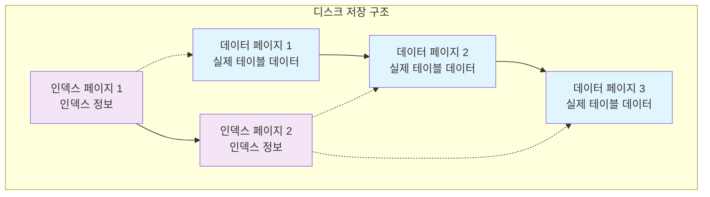

## 인덱스의 다양한 형태

### B-Tree 인덱스 - 가장 널리 사용되는 구조
B-Tree 인덱스는 현재 대부분의 관계형 데이터베이스에서 기본으로 사용하는 인덱스 구조입니다. 

**특징:**
- 균형 이진 트리의 확장된 형태로, 각 노드가 여러 개의 자식을 가질 수 있음
- 데이터가 정렬된 상태로 저장되어 범위 검색에 매우 효율적
- 삽입, 삭제, 수정 시에도 자동으로 균형을 유지
- MySQL InnoDB, PostgreSQL, Oracle 등에서 표준으로 사용

**동작 원리:**
루트 노드에서 시작해서 키 값을 비교하며 리프 노드까지 내려가면서 데이터의 위치를 찾습니다. 100만 개의 데이터가 있어도 최대 20번 정도의 비교만으로 원하는 데이터를 찾을 수 있습니다.

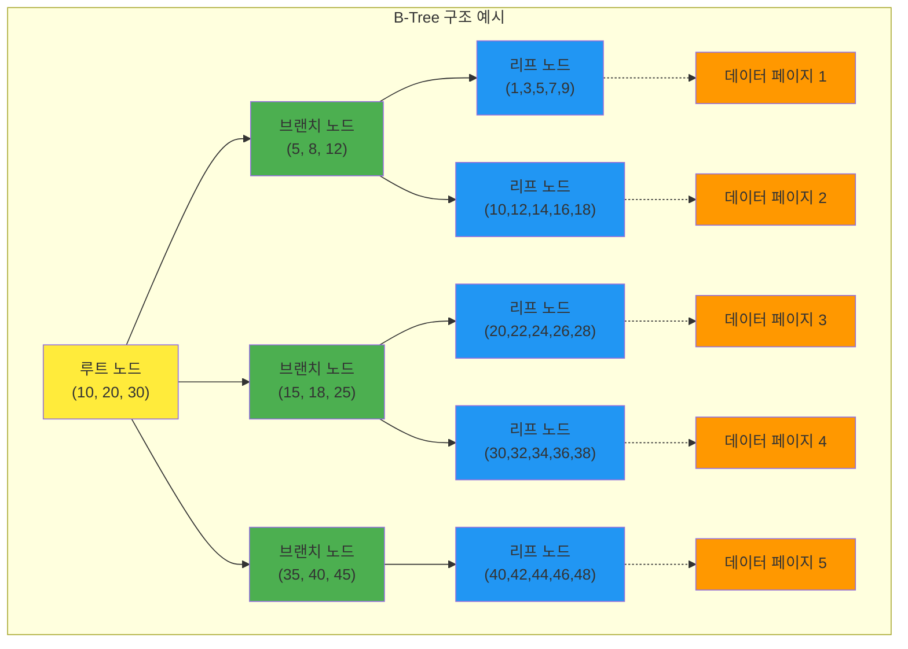

### Hash 인덱스 - 정확한 매칭에 특화
해시 함수를 사용해서 데이터를 저장하는 방식입니다.

**장점:**
- 동등 비교(=) 연산이 매우 빠름 (O(1)에 가까움)
- 메모리 기반 데이터베이스에서 효과적

**단점:**
- 범위 검색이나 정렬된 데이터 접근이 불가능
- 해시 충돌 처리로 인한 추가 오버헤드
- MySQL Memory 엔진에서만 지원

```mermaid
graph LR
    subgraph "해시 인덱스 구조"
        A[키: "John"] --> B[해시함수]
        C[키: "Jane"] --> D[해시함수]
        E[키: "Bob"] --> F[해시함수]
        
        B --> G[해시값: 1234]
        D --> H[해시값: 5678]
        F --> I[해시값: 9012]
        
        G --> J[버킷 1234<br/>데이터 포인터]
        H --> K[버킷 5678<br/>데이터 포인터]
        I --> L[버킷 9012<br/>데이터 포인터]
        
        J --> M[실제 데이터]
        K --> N[실제 데이터]
        L --> O[실제 데이터]
    end
    
    style A fill:#e3f2fd
    style C fill:#e3f2fd
    style E fill:#e3f2fd
    style G fill:#f3e5f5
    style H fill:#f3e5f5
    style I fill:#f3e5f5
    style J fill:#e8f5e8
    style K fill:#e8f5e8
    style L fill:#e8f5e8
    style M fill:#fff3e0
    style N fill:#fff3e0
    style O fill:#fff3e0
```

### 인덱스의 실제 저장 방식 - 해시가 아닌 B-Tree 구조

**중요한 오해 해결:**
많은 사람들이 인덱스가 해시 형태로 저장된다고 생각하지만, 실제로는 **대부분의 관계형 데이터베이스에서 B-Tree 구조로 저장**됩니다.

**B-Tree 인덱스의 물리적 저장 구조:**

**1. 페이지 기반 저장**

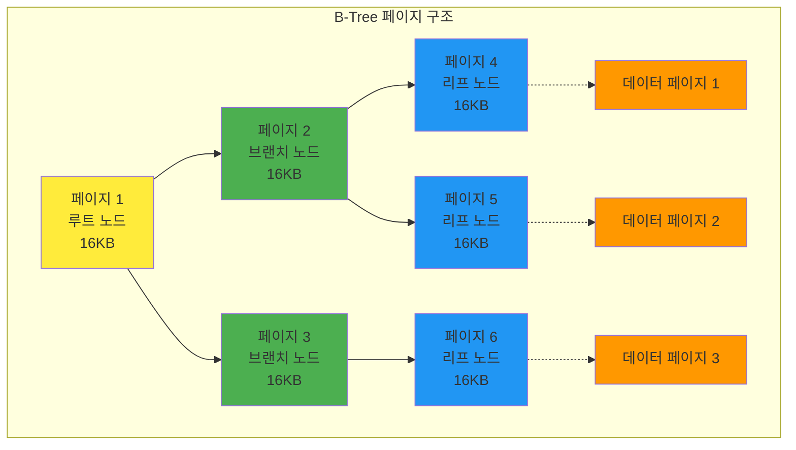

**2. 인덱스 레코드의 실제 구조**
```
인덱스 페이지 내부:
┌─────────────────────────────────────┐
│ 페이지 헤더 (96 bytes)              │
├─────────────────────────────────────┤
│ 인덱스 레코드 1: [키값][포인터]      │
│ 인덱스 레코드 2: [키값][포인터]      │
│ 인덱스 레코드 3: [키값][포인터]      │
│ ...                                 │
├─────────────────────────────────────┤
│ 페이지 푸터 (8 bytes)               │
└─────────────────────────────────────┘
```

**3. B-Tree vs Hash 비교**

| 특성 | B-Tree 인덱스 | Hash 인덱스 |
|------|---------------|-------------|
| **저장 방식** | 정렬된 트리 구조 | 해시 테이블 |
| **검색 시간** | O(log n) | O(1) |
| **범위 검색** | 가능 (매우 효율적) | 불가능 |
| **정렬** | 자동으로 정렬됨 | 정렬되지 않음 |
| **메모리 사용** | 적음 | 많음 |
| **디스크 저장** | 효율적 | 비효율적 |

**4. 실제 저장 예시**
```sql
-- 테이블 생성
CREATE TABLE users (
  id INT PRIMARY KEY,
  name VARCHAR(100),
  email VARCHAR(100)
);

-- B-Tree 인덱스 생성 (기본값)
CREATE INDEX idx_name ON users(name);
```

**B-Tree 인덱스의 물리적 저장:**

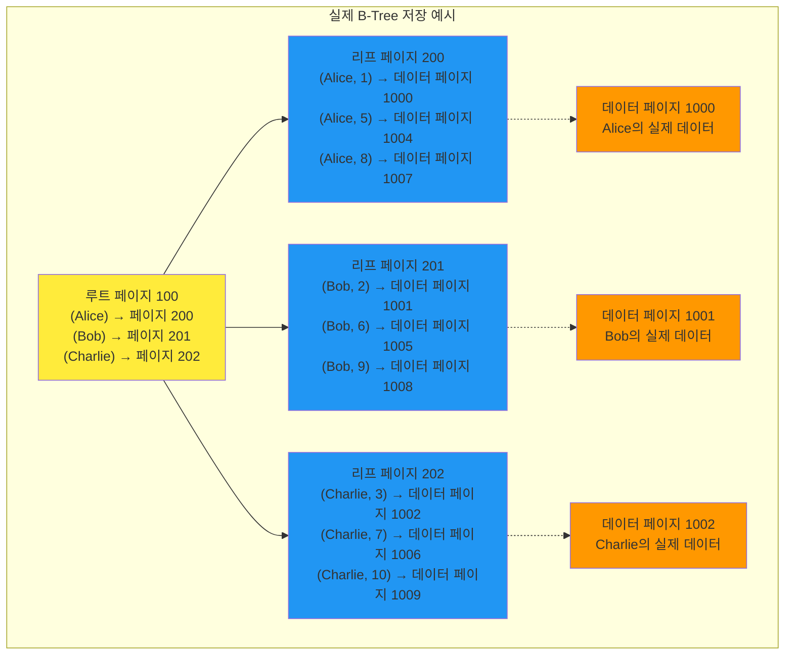

**5. 해시 인덱스의 실제 사용 사례**
```sql
-- MySQL Memory 엔진에서만 지원
CREATE TABLE temp_data (
  id INT,
  value VARCHAR(100)
) ENGINE=MEMORY;

-- 해시 인덱스 생성
CREATE INDEX idx_hash ON temp_data(id) USING HASH;
```

**해시 인덱스의 물리적 저장:**

```mermaid
graph LR
    subgraph "해시 테이블 구조"
        A[키: 1] --> B[해시함수]
        C[키: 5] --> D[해시함수]
        E[키: 9] --> F[해시함수]
        
        B --> G[해시값: 0]
        D --> H[해시값: 1]
        F --> I[해시값: 2]
        
        G --> J[버킷 0<br/>[1, 데이터포인터]]
        H --> K[버킷 1<br/>[5, 데이터포인터]]
        I --> L[버킷 2<br/>[9, 데이터포인터]]
        
        J --> M[실제 데이터]
        K --> N[실제 데이터]
        L --> O[실제 데이터]
    end
    
    style A fill:#e3f2fd
    style C fill:#e3f2fd
    style E fill:#e3f2fd
    style G fill:#f3e5f5
    style H fill:#f3e5f5
    style I fill:#f3e5f5
    style J fill:#e8f5e8
    style K fill:#e8f5e8
    style L fill:#e8f5e8
    style M fill:#fff3e0
    style N fill:#fff3e0
    style O fill:#fff3e0
```

**6. 왜 B-Tree가 표준인가?**

**B-Tree의 장점:**
1. **범위 검색 지원**: `WHERE age BETWEEN 20 AND 30` 같은 쿼리 가능
2. **정렬된 접근**: `ORDER BY` 절과 자연스럽게 연동
3. **디스크 친화적**: 페이지 단위로 효율적인 디스크 I/O
4. **동시성 제어**: 락 범위를 페이지 단위로 제한 가능
5. **부분 인덱스**: 인덱스의 일부만 스캔 가능

**Hash 인덱스의 한계:**
1. **범위 검색 불가**: `WHERE age > 25` 같은 쿼리 불가능
2. **정렬 불가**: `ORDER BY` 절 사용 시 추가 정렬 필요
3. **메모리 의존적**: 디스크 저장 시 성능 저하
4. **해시 충돌**: 동일한 해시값을 가진 데이터 처리 복잡

**7. 실제 데이터베이스별 인덱스 구현**

**MySQL InnoDB:**
- 기본: B+Tree (B-Tree의 변형)
- 클러스터링: PRIMARY KEY가 클러스터링 인덱스
- 보조 인덱스: 실제 데이터가 아닌 PRIMARY KEY 참조

**PostgreSQL:**
- 기본: B-Tree
- 추가 지원: Hash, GIN, GiST, SP-GiST, BRIN
- 부분 인덱스, 함수 인덱스 지원

**Oracle:**
- 기본: B-Tree
- 추가 지원: Bitmap, Function-based, Reverse Key
- 클러스터링 인덱스 지원

**결론:**
인덱스는 **해시 형태가 아닌 B-Tree 구조로 저장**되며, 이는 범위 검색, 정렬, 디스크 효율성 등의 이유 때문입니다. Hash 인덱스는 특수한 경우에만 사용되는 예외적인 구조입니다.

### 특수 목적 인덱스들

**Full-Text 인덱스**
- 텍스트 내용을 기반으로 한 검색을 위한 인덱스
- 자연어 처리 기능을 지원하여 "비슷한 의미"의 검색도 가능
- MySQL의 FULLTEXT, PostgreSQL의 GIN 인덱스가 대표적

**Spatial 인덱스**
- 지리적 위치 데이터를 위한 인덱스
- R-Tree 구조를 사용하여 "이 지역 근처의 데이터"를 효율적으로 검색
- GPS 좌표, 지도 데이터 처리에 필수

**Fractal 인덱스**
- 프랙탈 기하학을 기반으로 한 특수한 인덱스
- 대용량 시계열 데이터나 공간 데이터 처리에 특화
- 일반적인 용도로는 거의 사용되지 않음

## 인덱스의 장단점 분석

### 인덱스가 가져다주는 이점들

**1. 극적인 검색 성능 향상**
- 전체 테이블을 스캔하는 대신 인덱스를 통해 필요한 데이터만 접근
- 100만 개 레코드에서도 몇 번의 비교만으로 원하는 데이터 발견
- 대용량 데이터베이스에서 필수적인 성능 최적화 수단

**2. 정렬 작업의 자동화**
- 인덱스는 이미 정렬된 상태로 저장되어 있음
- ORDER BY 절이 인덱스 순서를 따르면 별도의 정렬 작업 불필요
- 메모리 사용량과 CPU 부하를 크게 줄일 수 있음

**3. 조인 연산의 효율성**
- 두 테이블을 조인할 때 조인 조건 컬럼에 인덱스가 있으면 매우 빠름
- Nested Loop Join에서 특히 효과적
- 대용량 테이블 간 조인에서 필수적

**4. 데이터 무결성 보장**
- 유니크 인덱스를 통해 중복 데이터 자동 방지
- 데이터베이스 레벨에서 무결성 제약 조건 강제

### 인덱스의 숨겨진 비용들

**1. 저장 공간의 추가 소모**
- 인덱스는 별도의 저장 공간을 차지함
- 대용량 테이블에서는 인덱스 크기가 상당할 수 있음
- 디스크 공간과 메모리 사용량 증가

**2. 데이터 변경 시의 성능 저하 - 무분별한 인덱스 사용의 심각한 문제**

무분별하게 인덱스를 생성하면 조회는 빨라질지언정, 데이터 변경 작업에서 심각한 성능 저하가 발생합니다.

**INSERT 작업의 오버헤드:**
```sql
-- 예시: 과도한 인덱스가 있는 테이블
CREATE TABLE products (
  id INT PRIMARY KEY,
  name VARCHAR(100),
  category VARCHAR(50),
  price DECIMAL(10,2),
  brand VARCHAR(50),
  created_at TIMESTAMP,
  updated_at TIMESTAMP,
  status ENUM('active', 'inactive'),
  -- 과도한 인덱스들
  INDEX idx_name (name),
  INDEX idx_category (category),
  INDEX idx_price (price),
  INDEX idx_brand (brand),
  INDEX idx_created_at (created_at),
  INDEX idx_status (status),
  INDEX idx_name_category (name, category),
  INDEX idx_category_price (category, price),
  INDEX idx_brand_status (brand, status)
);

-- INSERT 시 발생하는 작업들
INSERT INTO products (name, category, price, brand, created_at, status) 
VALUES ('iPhone 15', 'Electronics', 999.99, 'Apple', NOW(), 'active');
```

**INSERT 시 각 인덱스별로 수행되는 작업:**
1. **B-Tree 구조 유지**: 각 인덱스의 B-Tree에 새로운 키 삽입
2. **페이지 분할**: 인덱스 페이지가 가득 차면 페이지 분할 발생
3. **포인터 업데이트**: 부모 노드의 포인터 정보 업데이트
4. **동시성 제어**: 락(Lock) 획득 및 해제
5. **로그 기록**: 트랜잭션 로그에 모든 변경사항 기록

**실제 성능 영향:**
- 인덱스 1개: INSERT 시간 = 기본 시간 + α
- 인덱스 10개: INSERT 시간 = 기본 시간 + 10α (거의 10배 느려짐)
- 대용량 배치 INSERT: 인덱스가 많을수록 기하급수적으로 느려짐

**UPDATE 작업의 복잡성:**
```sql
-- 인덱싱된 컬럼을 UPDATE하는 경우
UPDATE products SET price = 899.99 WHERE id = 1;
```

**UPDATE 시 발생하는 작업:**
1. **기존 인덱스 엔트리 삭제**: 이전 값에 대한 인덱스 엔트리 제거
2. **새 인덱스 엔트리 삽입**: 새로운 값에 대한 인덱스 엔트리 추가
3. **B-Tree 재구성**: 삭제와 삽입으로 인한 트리 구조 조정
4. **페이지 병합**: 빈 공간이 생긴 페이지의 병합 작업
5. **동시성 제어**: 읽기/쓰기 락 관리

**DELETE 작업의 연쇄 효과:**
```sql
DELETE FROM products WHERE id = 1;
```

**DELETE 시 발생하는 작업:**
1. **모든 인덱스에서 엔트리 제거**: 해당 레코드와 관련된 모든 인덱스 엔트리 삭제
2. **B-Tree 구조 조정**: 삭제로 인한 트리 구조 재정렬
3. **페이지 정리**: 빈 공간 정리 및 페이지 병합
4. **동시성 제어**: 삭제 중 다른 트랜잭션의 접근 제어

**무분별한 인덱스 사용의 실제 문제점:**

**1. 메모리 사용량 급증**
- 각 인덱스는 메모리에 캐시되어야 함
- 인덱스가 많을수록 메모리 사용량 증가
- 다른 중요한 데이터가 메모리에서 밀려남

**2. 디스크 I/O 증가**
- 인덱스 페이지도 디스크에 저장됨
- 인덱스가 많을수록 디스크 공간과 I/O 증가
- 백업/복원 시간도 증가

**3. 동시성 문제**
- 인덱스 업데이트 시 락 경합 증가
- 데드락(Deadlock) 발생 가능성 증가
- 동시 사용자 수가 많을 때 심각한 성능 저하

**4. 유지보수 비용**
- 인덱스 통계 정보 업데이트 시간 증가
- 인덱스 조각화로 인한 성능 저하
- 정기적인 인덱스 재구성 필요

**실제 성능 측정 예시:**
```sql
-- 테스트: 100만 건 INSERT 성능 비교
-- 인덱스 1개: 10초
-- 인덱스 5개: 45초  
-- 인덱스 10개: 120초
-- 인덱스 15개: 300초 (5분)
```

**권장사항:**
1. **필수 인덱스만 생성**: PRIMARY KEY, UNIQUE 제약조건, 자주 사용되는 WHERE 조건
2. **복합 인덱스 활용**: 여러 컬럼을 하나의 인덱스로 결합
3. **정기적인 인덱스 분석**: 사용되지 않는 인덱스 제거
4. **배치 작업 시 인덱스 비활성화**: 대량 데이터 삽입 시 임시로 인덱스 비활성화

**3. 지속적인 관리 필요**
- 인덱스 조각화로 인한 성능 저하
- 통계 정보 업데이트 필요
- 사용하지 않는 인덱스의 정기적인 정리

## 실제 사용 사례와 예시

### B-Tree 인덱스의 동작 과정
B-Tree 인덱스가 데이터를 찾는 과정을 단계별로 살펴보면:

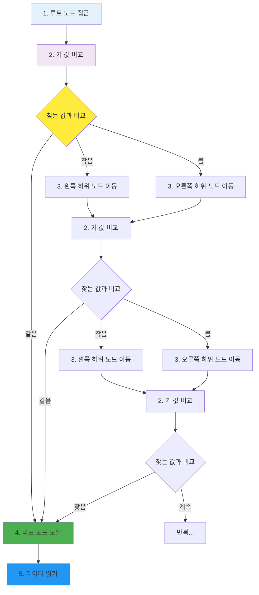

**단계별 설명:**
1. **루트 노드 접근**: 인덱스의 최상위 노드에서 시작
2. **키 값 비교**: 찾고자 하는 값과 노드의 키 값들을 비교
3. **하위 노드 이동**: 비교 결과에 따라 적절한 하위 노드로 이동
4. **리프 노드 도달**: 최종적으로 실제 데이터 위치 정보가 있는 리프 노드에 도달
5. **데이터 읽기**: 리프 노드의 포인터를 통해 실제 데이터 페이지에서 데이터를 읽음

이 과정에서 100만 개의 레코드가 있어도 최대 20번 정도의 비교만으로 원하는 데이터를 찾을 수 있습니다.

### 인덱스 생성과 활용 예시

**기본 테이블 구조:**
```sql
CREATE TABLE users (
  id INT PRIMARY KEY,
  name VARCHAR(100),
  email VARCHAR(100),
  age INT,
  created_at TIMESTAMP,
  active BOOLEAN DEFAULT true
);
```

**다양한 인덱스 생성:**
```sql
-- 단일 컬럼 인덱스
CREATE INDEX idx_users_name ON users(name);
CREATE INDEX idx_users_email ON users(email);

-- 복합 인덱스 (여러 컬럼을 조합)
CREATE INDEX idx_users_age_created ON users(age, created_at);

-- 부분 인덱스 (특정 조건을 만족하는 행만 인덱싱)
CREATE INDEX idx_users_active ON users(email) WHERE active = true;

-- 유니크 인덱스 (중복 방지)
CREATE UNIQUE INDEX idx_users_email_unique ON users(email);
```

**인덱스가 효과적인 쿼리들:**
```sql
-- 정확한 매칭 (인덱스 스캔)
SELECT * FROM users WHERE name = 'John Doe';

-- 범위 검색 (인덱스 범위 스캔)
SELECT * FROM users WHERE age BETWEEN 20 AND 30;

-- 정렬과 함께 사용
SELECT * FROM users WHERE age = 25 ORDER BY created_at DESC;

-- 복합 인덱스 활용
SELECT * FROM users WHERE age = 25 AND created_at > '2023-01-01';
```

### I/O 패턴의 차이점

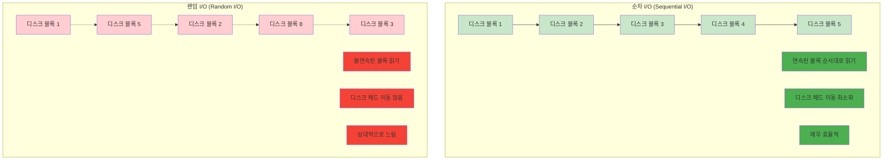

**순차 I/O (Sequential I/O)**
- 연속된 디스크 블록을 순서대로 읽는 방식
- 디스크 헤드의 이동이 최소화되어 효율적
- 인덱스 범위 스캔이나 전체 테이블 스캔에서 발생

**랜덤 I/O (Random I/O)**
- 불연속된 디스크 블록을 읽는 방식
- 디스크 헤드의 이동이 많아 상대적으로 느림
- 인덱스를 통한 개별 레코드 접근에서 발생

### 성능 차이의 실제 예시

100만 개의 사용자 데이터가 있는 테이블에서 특정 사용자를 찾는 경우:

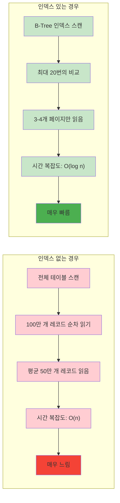

**인덱스 없는 경우:**
- 전체 테이블을 순차적으로 스캔
- 평균적으로 50만 개의 레코드를 읽어야 함
- 시간 복잡도: O(n)

**인덱스 있는 경우:**
- B-Tree 인덱스를 통해 최대 20번의 비교
- 실제로는 3-4개의 페이지만 읽으면 됨
- 시간 복잡도: O(log n)

실제로는 수십 배에서 수백 배의 성능 차이가 발생할 수 있습니다.

## 인덱스 설계와 운영 가이드

### 효과적인 인덱스 설계 원칙

**1. 선택도(Selectivity)를 고려한 컬럼 선정**
- 선택도가 높은 컬럼일수록 인덱스 효과가 큼
- 성별(남/여 2개 값)보다는 나이(다양한 값)가 더 좋은 인덱스
- 카디널리티가 높은 컬럼을 우선적으로 고려

**2. 복합 인덱스의 컬럼 순서**
- 가장 자주 사용되는 조건을 앞에 배치
- 등호 조건(=)이 있는 컬럼을 범위 조건(>, <, BETWEEN)보다 앞에 배치
- 자주 함께 사용되는 컬럼들을 그룹화

**복합 인덱스에서 첫 번째 컬럼만 검색할 때의 동작 - 상세 분석:**

복합 인덱스 `(A, B, C)`가 있을 때, A만으로 검색하는 경우를 단계별로 살펴보겠습니다.

```sql
-- 복합 인덱스 생성
CREATE INDEX idx_composite ON users(age, created_at, active);

-- A(age)만으로 검색 - 인덱스 활용 가능
SELECT * FROM users WHERE age = 25;
```

### 복합 인덱스의 내부 구조 이해

**1. 복합 인덱스의 실제 저장 방식:**
복합 인덱스는 여러 컬럼의 값을 **연결(concatenate)**하여 하나의 키로 만듭니다.

```
실제 인덱스 키 구조:
┌─────────────────────────────────────────────────────────┐
│ [age, created_at, active] → 데이터 포인터              │
│ [25, 2023-01-01, true] → 페이지 1000, 오프셋 50       │
│ [25, 2023-01-02, false] → 페이지 1000, 오프셋 100     │
│ [25, 2023-01-03, true] → 페이지 1001, 오프셋 25       │
│ [26, 2023-01-01, true] → 페이지 1001, 오프셋 75       │
│ [26, 2023-01-02, false] → 페이지 1002, 오프셋 10      │
└─────────────────────────────────────────────────────────┘
```

**2. 왜 A만으로 검색이 가능한가?**

**B-Tree의 정렬 특성:**
- 복합 인덱스는 **사전식 정렬(Lexicographic Order)**로 저장됩니다
- 첫 번째 컬럼(age)이 우선적으로 정렬되고, 그 다음 두 번째 컬럼(created_at), 마지막에 세 번째 컬럼(active)이 정렬됩니다

```
정렬 순서:
1. age = 25인 모든 레코드들이 먼저 그룹화됨
2. 그 안에서 created_at으로 정렬
3. 마지막에 active로 정렬

age=25인 레코드들:
[25, 2023-01-01, true]
[25, 2023-01-01, false]  
[25, 2023-01-02, true]
[25, 2023-01-02, false]
[25, 2023-01-03, true]
[25, 2023-01-03, false]
```

### 실제 검색 과정 - 단계별 분석

**1단계: B-Tree 탐색 시작**
```
루트 노드에서 시작:
┌─────────────────────────────────────┐
│ [25] → 브랜치 노드 A                │
│ [26] → 브랜치 노드 B                │
│ [27] → 브랜치 노드 C                │
└─────────────────────────────────────┘
```

**2단계: age = 25 범위 찾기**
- B-Tree에서 age = 25인 첫 번째 레코드를 찾음
- 이는 `[25, 2023-01-01, false]`가 될 것

**3단계: 범위 스캔 수행**
- age = 25인 모든 레코드를 순차적으로 읽음
- age = 26이 나오면 스캔 종료

**4단계: 실제 데이터 읽기**
- 각 인덱스 엔트리의 포인터를 따라 실제 데이터 페이지에서 데이터를 읽음

### 상세한 예시로 이해하기

```sql
-- 테스트 데이터
INSERT INTO users VALUES 
(1, 'John', 25, '2023-01-01', true),
(2, 'Jane', 25, '2023-01-02', false),
(3, 'Bob', 25, '2023-01-03', true),
(4, 'Alice', 26, '2023-01-01', true),
(5, 'Charlie', 26, '2023-01-02', false);

-- 복합 인덱스 생성
CREATE INDEX idx_age_created_active ON users(age, created_at, active);
```

**인덱스의 실제 저장 순서:**
```
1. [25, 2023-01-01, true] → John
2. [25, 2023-01-02, false] → Jane  
3. [25, 2023-01-03, true] → Bob
4. [26, 2023-01-01, true] → Alice
5. [26, 2023-01-02, false] → Charlie
```

**A만으로 검색할 때의 동작:**
```sql
SELECT * FROM users WHERE age = 25;
```

1. **인덱스 스캔 시작**: `[25, 2023-01-01, true]`에서 시작
2. **범위 스캔**: age = 25인 모든 레코드 순차 읽기
   - `[25, 2023-01-01, true]` → John
   - `[25, 2023-01-02, false]` → Jane
   - `[25, 2023-01-03, true]` → Bob
3. **스캔 종료**: `[26, 2023-01-01, true]`를 만나면 종료

### 성능 특성 분석

**효율적인 경우:**
```sql
-- age = 25인 레코드가 적은 경우 (선택도가 높음)
SELECT * FROM users WHERE age = 25;  -- 매우 빠름
```

**비효율적인 경우:**
```sql
-- age = 25인 레코드가 매우 많은 경우 (선택도가 낮음)
SELECT * FROM users WHERE age = 25;  -- 느림 (많은 레코드 읽기)
```

### 다른 조합들의 동작

**1. A, B로 검색 (가장 효율적):**
```sql
SELECT * FROM users WHERE age = 25 AND created_at = '2023-01-01';
```
- 인덱스의 첫 두 컬럼을 모두 활용
- 정확한 매칭으로 매우 빠름

**2. A, C로 검색 (부분 활용):**
```sql
SELECT * FROM users WHERE age = 25 AND active = true;
```
- 첫 번째 컬럼(age)으로 범위를 좁힌 후
- 세 번째 컬럼(active)으로 필터링
- B-Tree 스캔 후 추가 필터링 필요

**3. B만으로 검색 (인덱스 활용 불가):**
```sql
SELECT * FROM users WHERE created_at = '2023-01-01';
```
- 첫 번째 컬럼(age) 조건이 없으므로 인덱스 활용 불가
- 전체 테이블 스캔 발생

### 최적화 전략과 주의사항

**좋은 복합 인덱스 설계:**
```sql
-- 자주 함께 사용되는 조건들을 순서대로 배치
CREATE INDEX idx_optimized ON users(email, age, created_at);

-- 사용 예시:
SELECT * FROM users WHERE email = 'john@example.com';                    -- A만 사용
SELECT * FROM users WHERE email = 'john@example.com' AND age = 25;       -- A, B 사용
SELECT * FROM users WHERE email = 'john@example.com' AND age = 25 AND created_at > '2023-01-01'; -- A, B, C 사용
```

**나쁜 복합 인덱스 설계:**
```sql
-- 선택도가 낮은 컬럼을 앞에 배치
CREATE INDEX idx_poor ON users(active, age, created_at); -- active는 true/false만 있음

-- 문제점:
-- active = true인 레코드가 전체의 50%라면, 인덱스 효과가 반감됨
```

### 해시 인덱스의 실제 한계: A만 조회가 불가능한 이유

**핵심 답변:**
해시 인덱스에서는 **A만으로 조회가 불가능**합니다. 이것이 해시 인덱스의 근본적인 한계점입니다.

### 해시 인덱스에서 복합 키 저장 방식

**해시 인덱스의 실제 동작:**
```sql
-- 해시 인덱스 생성 (MySQL Memory 엔진에서만 지원)
CREATE TABLE temp_users (
  id INT,
  age INT,
  created_at DATE,
  active BOOLEAN
) ENGINE=MEMORY;

-- 해시 인덱스 생성
CREATE INDEX idx_hash ON temp_users(age, created_at, active) USING HASH;
```

**해시 테이블의 실제 저장:**

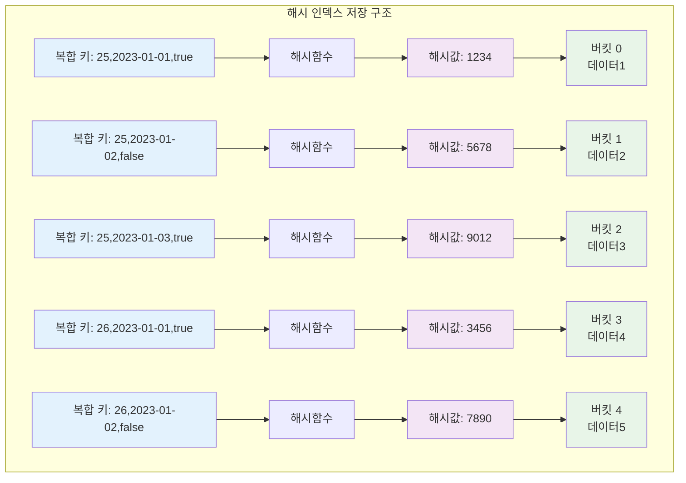

### 해시 인덱스에서 A만 검색 시도

**시도해보는 쿼리:**
```sql
SELECT * FROM temp_users WHERE age = 25;
```

**실제로 일어나는 일:**

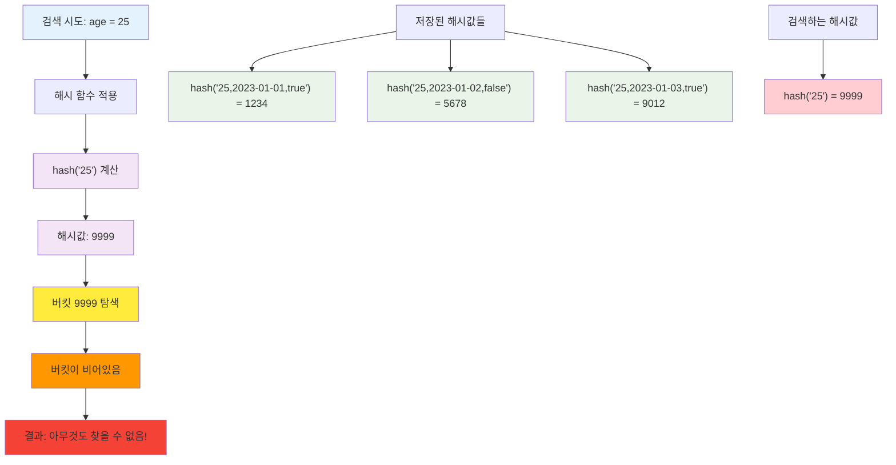

**왜 찾을 수 없는가?**
- 저장된 해시값: `hash("25,2023-01-01,true")`, `hash("25,2023-01-02,false")` 등
- 검색하는 해시값: `hash("25")`
- **완전히 다른 해시값**이므로 매칭되지 않음

### 해시 인덱스에서 가능한 검색들

**1. 정확한 매칭만 가능:**
```sql
-- 가능: 모든 컬럼을 정확히 지정
SELECT * FROM temp_users WHERE age = 25 AND created_at = '2023-01-01' AND active = true;

-- 불가능: 일부 컬럼만 지정
SELECT * FROM temp_users WHERE age = 25;                    -- ❌ 불가능
SELECT * FROM temp_users WHERE age = 25 AND active = true;  -- ❌ 불가능
```

**2. 범위 검색 불가능:**
```sql
-- 모두 불가능:
SELECT * FROM temp_users WHERE age > 25;                    -- ❌
SELECT * FROM temp_users WHERE age BETWEEN 20 AND 30;      -- ❌
SELECT * FROM temp_users WHERE created_at > '2023-01-01';  -- ❌
```

### 해시 인덱스의 근본적인 문제점

**1. 부분 키 검색 불가능**
- 복합 인덱스 `(A, B, C)`에서 A만으로 검색 불가
- A, B만으로 검색도 불가
- **모든 컬럼을 정확히 지정**해야만 검색 가능

**2. 범위 검색 불가능**
- `>`, `<`, `BETWEEN` 등의 범위 조건 사용 불가
- 정렬된 데이터 접근 불가

**3. 정렬 불가능**
- `ORDER BY` 절과 함께 사용 시 추가 정렬 필요
- 인덱스 자체가 정렬되지 않음

### 실제 사용 사례와 한계

**해시 인덱스가 적합한 경우:**
```sql
-- 정확한 매칭만 필요한 경우
SELECT * FROM users WHERE email = 'john@example.com';  -- 단일 컬럼
SELECT * FROM products WHERE id = 123;                 -- PRIMARY KEY
```

**해시 인덱스가 부적합한 경우:**
```sql
-- 복합 인덱스에서 부분 검색이 필요한 경우
SELECT * FROM users WHERE age = 25;                    -- ❌ 불가능
SELECT * FROM products WHERE category = 'Electronics'; -- ❌ 불가능

-- 범위 검색이 필요한 경우
SELECT * FROM users WHERE age BETWEEN 20 AND 30;      -- ❌ 불가능
SELECT * FROM orders WHERE created_at > '2023-01-01'; -- ❌ 불가능
```

### 결론: 해시 인덱스의 한계

**핵심 답변:**
해시 인덱스에서는 **A, B, C를 통째로 저장하고, A만으로는 조회가 불가능**합니다. 이것이 해시 인덱스의 근본적인 한계점이며, 그래서 대부분의 관계형 데이터베이스에서 B-Tree 인덱스를 기본으로 사용하는 이유입니다.

**해시 인덱스 사용 권장사항:**
1. **단일 컬럼**에만 사용
2. **정확한 매칭**만 필요한 경우
3. **메모리 기반** 임시 테이블에서만 사용
4. **범위 검색이나 부분 검색**이 필요하면 B-Tree 인덱스 사용

### B-Tree 인덱스의 우수성

**B-Tree에서 복합 키 저장:**
```
B-Tree 구조 (정렬된 상태):
┌─────────────────────────────────────┐
│ [25, 2023-01-01, true] → 데이터1    │
│ [25, 2023-01-01, false] → 데이터2   │
│ [25, 2023-01-02, true] → 데이터3    │
│ [25, 2023-01-02, false] → 데이터4   │
│ [25, 2023-01-03, true] → 데이터5    │
│ [26, 2023-01-01, true] → 데이터6    │
│ [26, 2023-01-02, false] → 데이터7   │
└─────────────────────────────────────┘
```

**B-Tree의 장점:**
- **정렬된 상태로 저장**: 첫 번째 컬럼(25)이 같은 모든 레코드가 **연속으로** 배치됨
- A=25인 레코드들을 **범위 스캔**으로 빠르게 찾을 수 있음

### 실제 동작 과정 비교

**해시 인덱스에서 A=25 검색:**
```
1. hash("25,2023-01-01,true") 계산 → 해시값1
2. hash("25,2023-01-02,false") 계산 → 해시값2 (완전히 다름!)
3. hash("25,2023-01-03,true") 계산 → 해시값3 (또 다름!)
4. ... 모든 가능한 조합을 시도해야 함
5. 결국 전체 테이블 스캔 필요 → 비효율적
```

**B-Tree 인덱스에서 A=25 검색:**
```
1. B-Tree에서 [25, ...] 범위의 시작점 찾기
2. [25, 2023-01-01, true]에서 시작
3. [25, 2023-01-01, false] 읽기
4. [25, 2023-01-02, true] 읽기
5. [25, 2023-01-02, false] 읽기
6. [25, 2023-01-03, true] 읽기
7. [26, 2023-01-01, true]를 만나면 종료
→ 연속된 범위 스캔으로 매우 효율적!
```

### 구체적인 예시로 이해하기

**실제 데이터:**
```sql
CREATE TABLE products (
  id INT,
  category VARCHAR(50),
  price DECIMAL(10,2),
  brand VARCHAR(50)
);

INSERT INTO products VALUES
(1, 'Electronics', 999.99, 'Apple'),
(2, 'Electronics', 899.99, 'Samsung'),
(3, 'Electronics', 799.99, 'LG'),
(4, 'Clothing', 99.99, 'Nike'),
(5, 'Clothing', 89.99, 'Adidas');

-- 복합 인덱스 생성
CREATE INDEX idx_category_price_brand ON products(category, price, brand);
```

**B-Tree 인덱스의 실제 저장:**

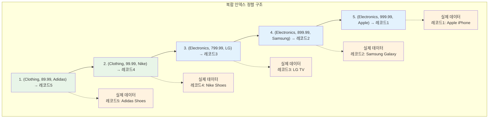

**A만으로 검색 (category = 'Electronics'):**
```sql
SELECT * FROM products WHERE category = 'Electronics';
```

**B-Tree 검색 과정:**

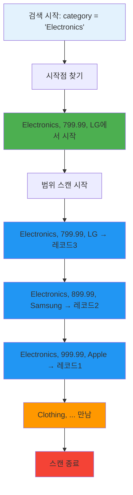

### 왜 B-Tree가 이렇게 동작하는가?

**1. 사전식 정렬 (Lexicographic Order)**
```
문자열 정렬과 동일한 원리:
"Apple" < "Banana" < "Cherry"

복합 키 정렬:
[25, 2023-01-01, true] < [25, 2023-01-02, false] < [26, 2023-01-01, true]
```

**2. 범위 스캔의 효율성**
- 첫 번째 컬럼이 같은 모든 레코드가 **물리적으로 연속**으로 저장
- 디스크 I/O 최소화 (연속된 페이지 읽기)
- 메모리 캐시 효율성 극대화

**3. 부분 키 검색 지원**
```sql
-- 모두 가능한 검색들:
WHERE category = 'Electronics'                    -- A만 사용
WHERE category = 'Electronics' AND price = 999.99 -- A, B 사용  
WHERE category = 'Electronics' AND price = 999.99 AND brand = 'Apple' -- A, B, C 사용
```

### 해시 vs B-Tree 최종 비교

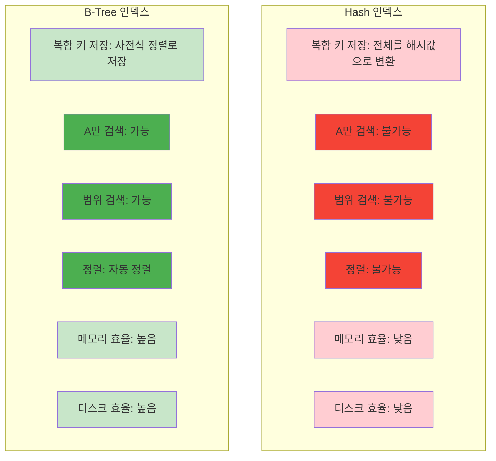

| 특성 | Hash 인덱스 | B-Tree 인덱스 |
|------|-------------|---------------|
| **복합 키 저장** | 전체를 해시값으로 변환 | 사전식 정렬로 저장 |
| **A만 검색** | 불가능 (전체 스캔 필요) | 가능 (범위 스캔) |
| **범위 검색** | 불가능 | 가능 |
| **정렬** | 불가능 | 자동 정렬 |
| **메모리 효율** | 낮음 (해시 충돌 처리) | 높음 |
| **디스크 효율** | 낮음 | 높음 (연속 읽기) |

**핵심 원리 정리:**
1. **B-Tree는 정렬된 구조**: 첫 번째 컬럼이 같은 레코드들이 연속으로 배치
2. **범위 스캔 가능**: A=25인 모든 레코드를 연속으로 읽을 수 있음
3. **해시는 정렬되지 않음**: A만으로 검색하려면 전체 스캔 필요
4. **선택도가 중요**: 첫 번째 컬럼의 선택도가 인덱스 효율성을 결정
5. **순서가 중요**: 자주 사용되는 조건을 앞에 배치해야 함

**3. 쿼리 패턴 분석**
- 실제 애플리케이션에서 사용되는 쿼리 패턴을 분석
- WHERE 절, ORDER BY 절, JOIN 조건을 종합적으로 고려
- 자주 사용되지 않는 인덱스는 제거 고려

### 인덱스 모니터링과 관리

**인덱스 사용 현황 확인:**
```sql
-- MySQL에서 인덱스 사용 통계 확인
SELECT 
  table_name,
  index_name,
  cardinality,
  index_type
FROM information_schema.statistics 
WHERE table_schema = 'your_database'
ORDER BY table_name, index_name;

-- PostgreSQL에서 인덱스 사용 통계 확인
SELECT 
  schemaname, 
  tablename, 
  indexname, 
  idx_scan, 
  idx_tup_read, 
  idx_tup_fetch
FROM pg_stat_user_indexes
WHERE tablename = 'users';
```

**인덱스 크기와 효율성 분석:**
```sql
-- 인덱스 크기 확인
SELECT 
  table_name,
  index_name,
  ROUND(((data_length + index_length) / 1024 / 1024), 2) AS 'Size (MB)'
FROM information_schema.tables 
WHERE table_schema = 'your_database';
```

### 인덱스 최적화 작업

**정기적인 인덱스 관리:**
```sql
-- 불필요한 인덱스 제거
DROP INDEX idx_unused_index ON users;

-- 인덱스 재구성 (MySQL)
OPTIMIZE TABLE users;

-- 인덱스 통계 업데이트 (PostgreSQL)
ANALYZE users;

-- 인덱스 조각화 확인 및 해결
-- 조각화가 심한 인덱스는 재구성 필요
```

**성능 모니터링 지표:**
- 인덱스 사용 빈도 (idx_scan)
- 인덱스를 통한 읽은 튜플 수 (idx_tup_read)
- 인덱스 크기와 테이블 크기 비율
- 인덱스 조각화 정도

## B-Tree 인덱스의 내부 구조

### 노드의 구성과 역할

**루트 노드(Root Node)**
- B-Tree의 최상위 노드로, 모든 검색의 시작점
- 일반적으로 메모리에 캐시되어 있어 매우 빠른 접근 가능
- 브랜치 노드나 리프 노드로의 포인터를 포함

**브랜치 노드(Branch Node)**
- 중간 단계의 노드들로, 자식 노드들의 범위 정보를 관리
- 키 값과 자식 노드 포인터의 쌍으로 구성
- 페이지 분할과 병합이 발생할 수 있는 동적 구조

**리프 노드(Leaf Node)**
- 실제 데이터의 위치 정보를 저장하는 최하위 노드
- 키 값과 실제 데이터 레코드의 포인터를 포함
- 양방향 링크로 연결되어 범위 스캔에 효율적

### 페이지 구조의 세부 사항

**페이지 크기와 최적화**
- 일반적으로 16KB (MySQL InnoDB 기준)
- 운영체제의 페이지 크기와 맞추는 것이 성능상 유리
- 페이지 크기는 I/O 효율성에 직접적인 영향

**페이지 내부 구성**
- **페이지 헤더**: 페이지의 메타데이터 저장
  - 페이지 타입, 이전/다음 페이지 포인터
  - 페이지 내 레코드 수, 최소/최대 키 값
- **인덱스 레코드**: 실제 인덱스 데이터
  - 키 값과 포인터의 쌍
  - 슬롯 디렉토리로 빠른 접근 지원
- **페이지 푸터**: 다음 페이지의 포인터 등
  - 체크섬, 페이지 상태 정보

### 인덱스 레코드의 구조

**키 값 관리**
- 인덱싱된 컬럼의 실제 값이 정렬된 순서로 저장
- 중복 키 처리 방식을 포함한 메타데이터
- NULL 값 처리 방식도 인덱스 구조에 반영

**포인터 정보**
- 실제 데이터 레코드의 정확한 위치 정보
- 페이지 번호와 오프셋 정보의 조합
- 클러스터링 여부에 따라 구조가 달라짐

**트랜잭션 정보**
- MVCC(Multi-Version Concurrency Control)를 위한 정보
- 트랜잭션 ID, 롤백 포인터
- 삭제 마커 등 동시성 제어 관련 데이터

## 핵심 용어 정리

### 인덱스 관련 전문 용어
- **Cardinality**: 인덱스에서 고유한 값의 개수, 인덱스 효율성의 지표
- **Selectivity**: 선택도, 인덱스가 얼마나 선택적인지를 나타내는 비율
- **Covering Index**: 쿼리에서 필요한 모든 컬럼이 인덱스에 포함된 경우
- **Index Fragmentation**: 인덱스 조각화, 성능 저하의 주요 원인
- **Index Scan vs Index Range Scan**: 단일 값 검색과 범위 검색의 차이

### 실제 적용 사례
1. **웹 애플리케이션**: 사용자 검색, 상품 검색 기능
2. **로그 분석 시스템**: 날짜별, 시간별 데이터 조회
3. **게시판 시스템**: 제목, 작성자, 날짜별 검색
4. **전자상거래**: 카테고리, 가격, 브랜드별 상품 검색
5. **소셜 네트워크**: 친구 관계, 활동 피드 조회

## 마무리

인덱스는 데이터베이스 성능 최적화의 핵심 도구입니다. 적절한 인덱스 설계와 관리를 통해 검색 성능을 극적으로 향상시킬 수 있지만, 과도한 인덱스는 오히려 성능을 저하시킬 수 있습니다. 

실제 애플리케이션의 쿼리 패턴을 철저히 분석하고, 선택도가 높은 컬럼을 우선적으로 인덱싱하며, 정기적인 모니터링을 통해 인덱스의 효율성을 지속적으로 관리하는 것이 중요합니다.

## 참조

- MySQL 8.0 Reference Manual - Indexes
- PostgreSQL Documentation - Indexes
- Oracle Database Concepts - Indexes
- Database System Concepts (Silberschatz, Korth, Sudarshan)
- High Performance MySQL (Baron Schwartz, Peter Zaitsev, Vadim Tkachenko)
