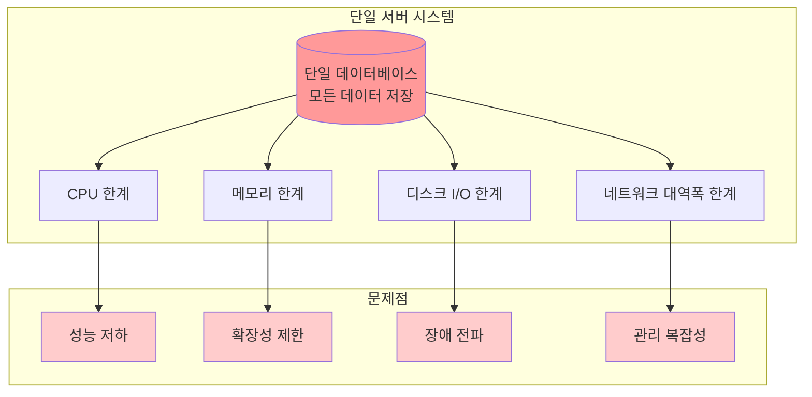
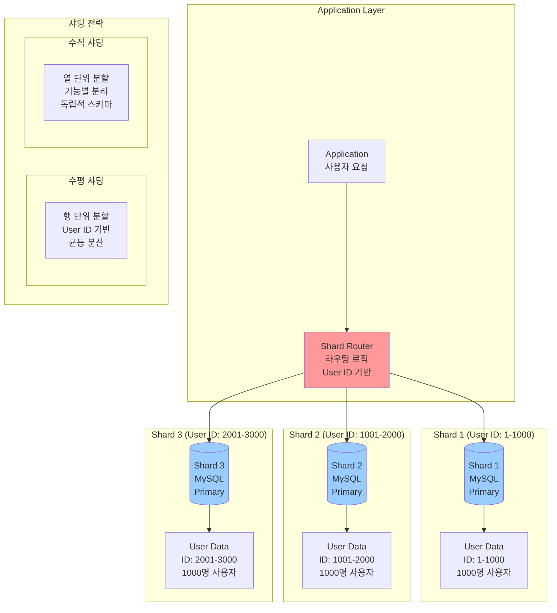
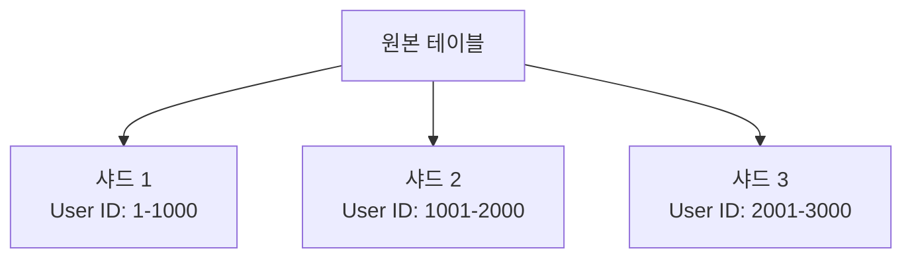
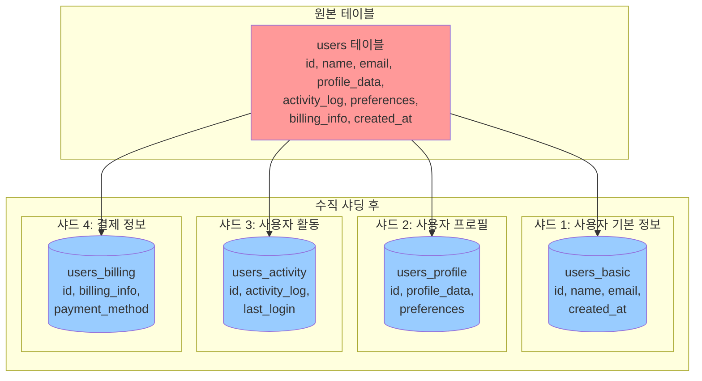

# 데이터베이스 샤딩

## 📋 목차
1. [샤딩 개요](#샤딩-개요)
2. [수평/수직 샤딩 비교](#수평수직-샤딩-비교)
3. [샤딩 키 선택 전략](#샤딩-키-선택-전략)
4. [샤드 간 쿼리 라우팅](#샤드-간-쿼리-라우팅)
5. [샤드 리밸런싱 방법](#샤드-리밸런싱-방법)
6. [샤딩의 복잡성과 해결 방안](#샤딩의-복잡성과-해결-방안)
7. [실무 적용 사례](#실무-적용-사례)
8. [모니터링 및 관리](#모니터링-및-관리)
9. [결론](#결론)
10. [참고 자료](#참고-자료)

## 샤딩 개요

### 샤딩이란 무엇인가?

샤딩(Sharding)은 하나의 거대한 데이터베이스를 여러 개의 작은 조각으로 나누어 각각 독립적인 데이터베이스 인스턴스에 분산 저장하는 기법입니다. 이는 데이터베이스 **수평 확장(Horizontal Scaling)**의 핵심 전략으로, 단일 서버의 물리적 한계를 극복하고 대용량 데이터를 효율적으로 처리하기 위해 사용됩니다.

#### 샤딩의 기본 개념

**데이터 분산의 원리:**
샤딩은 전체 데이터를 논리적으로 분할하여 여러 물리적 서버에 분산시킵니다. 각 서버는 "샤드(Shard)"라고 불리며, 전체 데이터의 일부분만을 담당합니다. 예를 들어, 1억 명의 사용자 데이터를 4개의 샤드로 나눈다면, 각 샤드는 약 2,500만 명의 데이터를 관리하게 됩니다.

```
전체 데이터: 1억 명의 사용자

샤드 분할 후:
├─ 샤드 1: 사용자 ID 1 ~ 2,500만
├─ 샤드 2: 사용자 ID 2,500만+1 ~ 5,000만
├─ 샤드 3: 사용자 ID 5,000만+1 ~ 7,500만
└─ 샤드 4: 사용자 ID 7,500만+1 ~ 1억
```

**샤딩 vs 파티셔닝:**
많은 사람들이 샤딩과 파티셔닝을 혼동하지만, 미묘한 차이가 있습니다:

- **파티셔닝(Partitioning)**: 하나의 데이터베이스 서버 내에서 테이블을 논리적으로 나누는 것입니다. 물리적으로는 여전히 같은 서버에 존재합니다.
  
- **샤딩(Sharding)**: 데이터를 여러 개의 독립적인 데이터베이스 서버로 물리적으로 분산시키는 것입니다. 각 샤드는 별도의 하드웨어에서 실행됩니다.

### 왜 샤딩이 필요한가?

#### 1. 단일 서버의 근본적인 한계

모든 데이터를 하나의 데이터베이스 서버에 저장하는 전통적인 방식은 다음과 같은 한계에 직면하게 됩니다:

**저장 용량의 한계:**
단일 서버의 디스크 용량에는 물리적 한계가 있습니다. 엔터프라이즈급 서버라도 수십 테라바이트 이상의 데이터를 효율적으로 관리하기 어렵습니다. 특히 소셜 미디어, 전자상거래, IoT 서비스처럼 데이터가 지속적으로 증가하는 환경에서는 저장 용량이 빠르게 소진됩니다.

**처리 성능의 한계:**
데이터양이 증가하면 쿼리 성능이 저하됩니다. 인덱스 크기가 메모리에 다 들어가지 않으면 디스크 I/O가 증가하고, 이는 응답 시간의 급격한 증가로 이어집니다. 예를 들어, 1억 건의 데이터를 검색하는 것은 1천만 건을 검색하는 것보다 훨씬 오래 걸립니다.

**동시성 처리의 한계:**
하나의 서버는 동시에 처리할 수 있는 연결 수와 트랜잭션 수에 제한이 있습니다. 사용자 수가 증가하면 데이터베이스 연결 대기 시간이 늘어나고, 락 경합이 심화되어 전체 시스템의 처리량이 감소합니다.

**비용 증가의 비효율성:**
수직 확장(Scale Up)으로 서버 사양을 업그레이드하는 것은 비용이 기하급수적으로 증가합니다. CPU 코어를 2배로 늘리는 것이 성능을 2배로 향상시키지는 않으며, 특정 시점 이후에는 하드웨어 업그레이드만으로는 의미 있는 성능 향상을 얻을 수 없습니다.

#### 2. 샤딩이 해결하는 실제 비즈니스 문제

**대규모 사용자 기반 서비스:**
Instagram, Twitter 같은 소셜 미디어 플랫폼은 수억 명의 사용자 데이터를 관리해야 합니다. 단일 데이터베이스로는 이러한 규모를 감당할 수 없습니다. 샤딩을 통해 사용자 데이터를 여러 데이터베이스에 분산시켜, 각 데이터베이스가 관리하는 데이터양을 줄이고 쿼리 성능을 유지할 수 있습니다.

**지역별 데이터 분산:**
글로벌 서비스를 제공하는 경우, 사용자의 지리적 위치에 따라 데이터를 가까운 데이터 센터에 저장하면 네트워크 지연을 크게 줄일 수 있습니다. 예를 들어, 한국 사용자의 데이터는 서울 리전에, 미국 사용자의 데이터는 버지니아 리전에 저장하는 방식입니다.

**규제 준수:**
GDPR, 개인정보보호법 등의 규제는 특정 국가의 사용자 데이터를 해당 국가 내에 저장하도록 요구합니다. 샤딩을 통해 국가별로 데이터를 물리적으로 분리하여 이러한 규제를 준수할 수 있습니다.

**장애 격리:**
하나의 샤드에 문제가 발생해도 다른 샤드는 정상적으로 작동할 수 있습니다. 예를 들어, 샤드 1에 장애가 발생하더라도 샤드 2, 3, 4의 사용자들은 영향을 받지 않습니다. 이는 전체 서비스의 가용성을 크게 향상시킵니다.

#### 3. 샤딩의 실질적인 이점

**선형적 확장성:**
서버를 추가할수록 전체 시스템의 처리 능력이 비례하여 증가합니다. 샤드를 2배로 늘리면 이론적으로 처리 능력도 2배가 됩니다. 이는 트래픽 증가에 대응하는 가장 효과적인 방법입니다.

**쿼리 성능 향상:**
각 샤드가 관리하는 데이터양이 줄어들면 인덱스 크기도 줄어듭니다. 작은 인덱스는 메모리에 완전히 적재될 가능성이 높아져 디스크 I/O가 감소하고 쿼리 속도가 빨라집니다. 예를 들어, 1억 건의 데이터를 10개의 샤드로 나누면 각 샤드는 1천만 건만 관리하므로 쿼리가 훨씬 빠릅니다.

**병렬 처리:**
여러 샤드에서 동시에 쿼리를 실행할 수 있어 전체 처리 시간이 단축됩니다. 예를 들어, 전체 사용자 통계를 계산할 때 각 샤드가 자신이 담당하는 사용자의 통계를 병렬로 계산한 후 결과를 합치면 됩니다.

**비용 효율성:**
고가의 엔터프라이즈 서버 한 대보다 중급 사양의 서버 여러 대를 사용하는 것이 비용 효율적입니다. 또한 클라우드 환경에서는 필요에 따라 샤드를 추가하거나 제거할 수 있어 자원 활용을 최적화할 수 있습니다.

### 샤딩을 언제 고려해야 하는가?

샤딩은 강력한 도구지만 복잡성을 크게 증가시키므로, 정말 필요한 시점에 도입해야 합니다.

#### 샤딩 도입을 고려해야 하는 신호

**데이터베이스 성능 저하:**
- 쿼리 응답 시간이 지속적으로 증가
- 인덱스 최적화로도 성능이 개선되지 않음
- 데이터베이스 CPU 사용률이 지속적으로 80% 이상
- 디스크 I/O 대기 시간이 계속 증가

**저장 용량 부족:**
- 현재 디스크 사용률이 70% 이상
- 데이터 증가 속도를 고려할 때 6개월 내 용량 부족 예상
- 백업 및 복구 시간이 허용 가능한 수준을 초과

**확장성 한계:**
- 수직 확장(서버 업그레이드)의 비용이 너무 높음
- 현재 하드웨어로는 예상 트래픽 증가를 감당할 수 없음
- 피크 시간대에 데이터베이스가 병목 구간

**비즈니스 요구사항:**
- 글로벌 서비스 확장 계획
- 지역별 데이터 격리가 필요 (규제 준수)
- 특정 고객군에 대한 전용 인프라 필요

#### 샤딩을 아직 도입하지 말아야 하는 경우

**데이터가 충분히 작을 때:**
- 전체 데이터가 100GB 미만
- 단일 서버로 충분히 처리 가능한 트래픽
- 향후 1~2년 내에도 큰 증가 예상되지 않음

**다른 최적화가 가능할 때:**
- 인덱스 최적화, 쿼리 튜닝으로 해결 가능
- 읽기 전용 복제본(Read Replica) 추가로 충분
- 캐싱 레이어 도입으로 데이터베이스 부하 감소 가능

**팀의 역량이 부족할 때:**
- 분산 시스템 운영 경험이 없음
- 샤딩 관련 기술 스택에 대한 이해 부족
- 복잡성 증가로 인한 운영 부담을 감당할 수 없음

### 샤딩의 기본 원칙

#### 샤딩의 핵심 원리

1. **데이터 분산 (Data Distribution)**
   - 전체 데이터를 논리적으로 분할하여 여러 물리적 저장소에 분산
   - 각 샤드는 독립적인 데이터베이스 인스턴스
   - 데이터의 일관성과 무결성 유지

2. **수평적 확장 (Horizontal Scaling)**
   - 단일 서버의 성능 한계를 넘어서는 확장
   - 서버 수를 늘려서 처리 능력 향상
   - 선형적 확장 가능성 제공

3. **부하 분산 (Load Distribution)**
   - 쿼리와 트랜잭션을 여러 샤드에 분산
   - 각 샤드의 부하 감소
   - 전체 시스템의 처리량 증가

### 샤딩이 필요한 이유

#### 1. 단일 서버의 한계점



#### 2. 데이터 증가의 영향

- **데이터 볼륨 증가**: 테라바이트, 페타바이트 단위의 데이터
- **사용자 증가**: 수백만, 수천만 명의 동시 사용자
- **트랜잭션 증가**: 초당 수만 건의 트랜잭션 처리 요구
- **복잡한 쿼리**: 대용량 데이터에 대한 복잡한 분석 쿼리

### 샤딩의 목적과 이점

#### 1. 확장성 (Scalability)
- **수평적 확장**: 서버 추가를 통한 용량 확장
- **선형적 성능 향상**: 샤드 수에 비례한 처리 능력 증가
- **무제한 확장**: 이론적으로 무제한 확장 가능

#### 2. 성능 향상 (Performance)
- **병렬 처리**: 여러 샤드에서 동시 쿼리 실행
- **로컬 캐싱**: 각 샤드의 독립적인 캐시 활용
- **인덱스 최적화**: 작은 데이터셋에 대한 효율적인 인덱싱

#### 3. 가용성 (Availability)
- **장애 격리**: 한 샤드의 장애가 전체 시스템에 미치는 영향 최소화
- **부분적 서비스**: 일부 샤드 장애 시에도 서비스 지속
- **빠른 복구**: 작은 단위의 데이터 복구로 복구 시간 단축

#### 4. 관리 용이성 (Manageability)
- **독립적 관리**: 각 샤드의 독립적인 백업, 복구, 업그레이드
- **점진적 확장**: 필요에 따른 단계적 샤드 추가
- **리소스 최적화**: 샤드별 특성에 맞는 리소스 할당

### 샤딩의 기본 원칙

#### 1. 데이터 일관성 원칙
- **ACID 속성**: 각 샤드 내에서는 ACID 속성 보장
- **분산 트랜잭션**: 크로스 샤드 트랜잭션의 복잡성 인식
- **최종 일관성**: 분산 환경에서의 일관성 모델 적용

#### 2. 쿼리 라우팅 원칙
- **효율적 라우팅**: 쿼리를 적절한 샤드로 전달
- **병렬 처리**: 가능한 경우 여러 샤드에서 병렬 실행
- **결과 병합**: 분산된 결과를 효율적으로 통합

#### 3. 확장성 원칙
- **균등 분산**: 데이터와 부하의 균등한 분산
- **동적 리밸런싱**: 데이터 증가에 따른 자동 재분배
- **점진적 확장**: 서비스 중단 없는 확장 가능

## 수평/수직 샤딩 비교

### 샤딩의 두 가지 접근 방식

데이터를 분산시키는 방법에는 크게 두 가지 전략이 있으며, 각각은 서로 다른 문제를 해결합니다:

**수평 샤딩(Horizontal Sharding)**: 같은 종류의 데이터를 여러 데이터베이스에 나누어 저장합니다. 테이블의 행(Row)을 기준으로 분할하는 방식으로, 각 샤드는 동일한 스키마를 가지지만 서로 다른 데이터를 저장합니다.

**수직 샤딩(Vertical Sharding)**: 다른 종류의 데이터를 각각의 데이터베이스에 저장합니다. 테이블의 열(Column)을 기준으로 분할하는 방식으로, 각 샤드는 서로 다른 스키마와 목적을 가집니다.

### 수평 샤딩의 이해

#### 수평 샤딩이란?

수평 샤딩은 테이블의 행을 여러 데이터베이스로 분산시키는 방식입니다. 마치 하나의 큰 책장에 있던 책들을 여러 개의 작은 책장으로 나누는 것과 같습니다. 각 책장(샤드)의 구조는 동일하지만, 담겨있는 책(데이터)이 다릅니다.

**실제 예시:**
온라인 쇼핑몰의 주문 테이블을 생각해봅시다. 주문이 1억 건에 달한다면, 이를 4개의 샤드로 나눌 수 있습니다:

```
전체 주문 테이블 (1억 건)

수평 샤딩 적용:
├─ 샤드 1: 주문 ID 1 ~ 2,500만 (2,500만 건)
├─ 샤드 2: 주문 ID 2,500만+1 ~ 5,000만 (2,500만 건)
├─ 샤드 3: 주문 ID 5,000만+1 ~ 7,500만 (2,500만 건)
└─ 샤드 4: 주문 ID 7,500만+1 ~ 1억 (2,500만 건)

각 샤드의 테이블 구조는 동일:
orders (order_id, user_id, product_id, amount, created_at, ...)
```

#### 수평 샤딩의 동작 원리

**데이터 분산 규칙:**
수평 샤딩에서 가장 중요한 것은 "어떤 데이터를 어느 샤드에 저장할 것인가?"를 결정하는 규칙입니다. 이를 샤딩 전략이라고 하며, 주로 다음 세 가지 방법을 사용합니다:

1. **범위 기반(Range-based)**: 특정 값의 범위로 구분
   ```
   사용자 ID 기준:
   - 1 ~ 100만: 샤드 A
   - 100만 ~ 200만: 샤드 B
   - 200만 ~ 300만: 샤드 C
   ```
   
   **장점**: 범위 검색이 효율적입니다. "ID가 50만~60만인 사용자" 조회 시 샤드 A만 검색하면 됩니다.
   
   **단점**: 데이터 분포가 불균등할 수 있습니다. 최근 가입자가 많으면 마지막 샤드에 부하가 집중됩니다.

2. **해시 기반(Hash-based)**: 해시 함수를 사용하여 균등 분배
   ```
   hash(user_id) % 4 = 0 → 샤드 A
   hash(user_id) % 4 = 1 → 샤드 B
   hash(user_id) % 4 = 2 → 샤드 C
   hash(user_id) % 4 = 3 → 샤드 D
   ```
   
   **장점**: 데이터가 균등하게 분산됩니다. 각 샤드의 부하가 비슷합니다.
   
   **단점**: 범위 검색이 비효율적입니다. 모든 샤드를 검색해야 할 수 있습니다.

3. **디렉토리 기반(Directory-based)**: 매핑 테이블 사용
   ```
   매핑 테이블:
   - 사용자 A → 샤드 1
   - 사용자 B → 샤드 2
   - 사용자 C → 샤드 1
   ```
   
   **장점**: 가장 유연합니다. 비즈니스 로직에 맞춰 자유롭게 분배 가능합니다.
   
   **단점**: 매핑 테이블 자체가 병목이 될 수 있고, 관리가 복잡합니다.

#### 수평 샤딩의 실제 활용

**소셜 미디어 플랫폼:**
Instagram은 사용자 ID를 기준으로 수평 샤딩을 적용합니다. 각 사용자의 게시물, 좋아요, 댓글 데이터는 사용자 ID에 해당하는 샤드에 함께 저장됩니다. 이렇게 하면 특정 사용자의 타임라인을 조회할 때 하나의 샤드만 접근하면 됩니다.

**전자상거래:**
Amazon은 주문 데이터를 주문 ID를 기준으로 샤딩합니다. 각 샤드는 특정 범위의 주문만 관리하므로, 주문 검색과 통계 생성이 빠릅니다.

**게임 서비스:**
게임 회사들은 서버(샤드)별로 사용자를 분리합니다. 각 서버는 독립적으로 운영되며, 서버 간 데이터 이동은 최소화합니다.

#### 수평 샤딩의 장점과 단점

**장점:**

1. **선형적 확장**: 샤드를 추가하면 처리 능력도 비례하여 증가합니다
2. **병렬 처리**: 여러 샤드에서 동시에 쿼리 실행 가능합니다
3. **부하 분산**: 트래픽이 여러 서버에 분산됩니다
4. **장애 격리**: 한 샤드의 문제가 다른 샤드에 영향을 주지 않습니다

**단점:**

1. **복잡한 쿼리**: 여러 샤드에 걸친 조인이나 집계가 어렵습니다
   ```
   예: 전체 사용자의 평균 구매액 계산
   → 각 샤드에서 부분 합계를 구한 후 애플리케이션에서 최종 계산 필요
   ```

2. **트랜잭션 복잡성**: 여러 샤드에 걸친 트랜잭션은 분산 트랜잭션이 필요합니다
   ```
   예: 사용자 A(샤드 1)가 사용자 B(샤드 2)에게 포인트 전송
   → 두 샤드 모두 성공해야 하는 복잡한 트랜잭션
   ```

3. **리밸런싱 어려움**: 샤드를 추가하거나 제거할 때 데이터 재분배가 필요합니다

4. **샤드 키 선택의 중요성**: 잘못된 샤드 키는 불균등한 분산을 초래합니다

### 수직 샤딩의 이해

#### 수직 샤딩이란?

수직 샤딩은 테이블의 열을 기능이나 접근 패턴에 따라 분리하여 각각 다른 데이터베이스에 저장하는 방식입니다. 마치 하나의 큰 서류 캐비닛에 있던 서류들을 목적별로 여러 캐비닛에 나누는 것과 같습니다.

**실제 예시:**
사용자 테이블이 50개의 컬럼을 가지고 있다면:

```
원본 사용자 테이블 (단일 데이터베이스):
users (
  id, username, email, password_hash,
  first_name, last_name, birth_date, phone,
  address, city, country, postal_code,
  profile_image, bio, website, social_links,
  preferences, settings, theme, language,
  last_login, login_count, ip_address,
  ...
)

수직 샤딩 적용:
┌─────────────────────────────────────────┐
│ 샤드 1: 인증 데이터베이스 (고빈도 접근)  │
│ users_auth (                            │
│   id, username, email, password_hash,   │
│   last_login, login_count               │
│ )                                       │
└─────────────────────────────────────────┘

┌─────────────────────────────────────────┐
│ 샤드 2: 프로필 데이터베이스 (중빈도 접근)│
│ users_profile (                         │
│   id, first_name, last_name, birth_date,│
│   profile_image, bio, website           │
│ )                                       │
└─────────────────────────────────────────┘

┌─────────────────────────────────────────┐
│ 샤드 3: 설정 데이터베이스 (저빈도 접근)  │
│ users_settings (                        │
│   id, preferences, settings, theme,     │
│   language                              │
│ )                                       │
└─────────────────────────────────────────┘

┌─────────────────────────────────────────┐
│ 샤드 4: 주소 데이터베이스 (저빈도 접근)  │
│ users_address (                         │
│   id, address, city, country,           │
│   postal_code, phone                    │
│ )                                       │
└─────────────────────────────────────────┘
```

#### 수직 샤딩의 동작 원리

**분리 기준:**
수직 샤딩은 다음과 같은 기준으로 데이터를 분리합니다:

1. **접근 빈도**: 자주 접근하는 데이터와 그렇지 않은 데이터를 분리
   - 로그인할 때마다 필요한 인증 정보는 빠른 서버에
   - 거의 변경되지 않는 주소 정보는 일반 서버에

2. **데이터 크기**: 큰 데이터와 작은 데이터를 분리
   - 텍스트 데이터는 메인 데이터베이스에
   - 이미지, 비디오 같은 큰 파일은 별도 스토리지에

3. **보안 수준**: 민감한 데이터와 일반 데이터를 분리
   - 비밀번호, 카드 정보는 고도로 보호되는 데이터베이스에
   - 공개 프로필 정보는 일반 데이터베이스에

4. **비즈니스 도메인**: 기능별로 데이터를 분리
   - 사용자 관리, 주문 처리, 결제 시스템을 각각 독립적인 데이터베이스로

#### 수직 샤딩의 실제 활용

**전자상거래 플랫폼:**
- **사용자 DB**: 로그인, 회원 정보
- **상품 DB**: 상품 카탈로그, 재고
- **주문 DB**: 주문 내역, 배송 정보
- **결제 DB**: 결제 정보, 거래 내역

각 데이터베이스는 독립적으로 확장하고 최적화할 수 있습니다. 예를 들어, 상품 카탈로그는 읽기가 많으므로 읽기 전용 복제본을 많이 배치하고, 결제 데이터베이스는 보안이 중요하므로 별도의 네트워크에 격리합니다.

**금융 시스템:**
- **계좌 정보 DB**: 계좌 번호, 잔액
- **거래 내역 DB**: 입출금 내역
- **고객 정보 DB**: 개인 정보
- **감사 로그 DB**: 모든 변경 이력

특히 감사 로그는 절대 삭제되어서는 안 되고 변경도 불가능해야 하므로, WORM(Write Once Read Many) 스토리지에 저장합니다.

**콘텐츠 플랫폼:**
- **메타데이터 DB**: 제목, 설명, 태그
- **콘텐츠 스토리지**: 실제 이미지, 비디오 파일
- **분석 DB**: 조회수, 좋아요, 댓글 통계
- **사용자 활동 DB**: 시청 기록, 재생 위치

메타데이터는 빠른 SSD에, 오래된 콘텐츠는 저렴한 HDD에 저장하여 비용을 최적화합니다.

#### 수직 샤딩의 장점과 단점

**장점:**

1. **명확한 책임 분리**: 각 데이터베이스가 하나의 목적만 담당합니다
   ```
   인증 DB는 로그인만, 프로필 DB는 프로필만 관리
   ```

2. **독립적 확장**: 필요한 부분만 확장 가능합니다
   ```
   로그인이 많으면 인증 DB만 강화
   프로필 조회가 많으면 프로필 DB만 복제본 추가
   ```

3. **보안 강화**: 민감한 데이터를 물리적으로 격리할 수 있습니다
   ```
   결제 정보는 별도 네트워크의 암호화된 데이터베이스에
   ```

4. **성능 최적화**: 각 데이터베이스를 용도에 맞게 최적화할 수 있습니다
   ```
   읽기 전용 데이터는 읽기 최적화
   쓰기 위주 데이터는 쓰기 최적화
   ```

5. **팀 간 독립성**: 각 팀이 자신의 데이터베이스를 독립적으로 관리할 수 있습니다
   ```
   인증 팀, 프로필 팀, 주문 팀이 서로 방해받지 않고 작업
   ```

**단점:**

1. **조인 복잡성**: 여러 데이터베이스의 데이터를 조합해야 합니다
   ```
   사용자 정보 + 주문 내역 조회 시
   → 인증 DB에서 사용자 조회
   → 주문 DB에서 주문 조회
   → 애플리케이션에서 조합
   ```

2. **트랜잭션 관리**: 여러 데이터베이스에 걸친 원자적 작업이 어렵습니다
   ```
   회원 탈퇴 시:
   - 인증 DB에서 계정 삭제
   - 프로필 DB에서 프로필 삭제
   - 주문 DB에서 개인정보 삭제
   → 중간에 실패하면 일관성 깨짐
   ```

3. **데이터 중복**: ID 같은 공통 데이터가 여러 곳에 중복 저장됩니다

4. **운영 복잡성**: 관리해야 할 데이터베이스가 늘어납니다
   ```
   백업, 모니터링, 버전 관리 등을 각 DB마다 수행
   ```

### 수평 vs 수직 샤딩 비교

#### 수평 샤딩의 특징

- **동일한 스키마**: 모든 샤드가 동일한 테이블 구조를 가짐
- **행 분할**: 각 샤드는 전체 데이터의 일부분만 저장
- **독립적 처리**: 각 샤드에서 독립적으로 쿼리 실행 가능
- **확장성**: 샤드 추가를 통한 용량 확장 용이

#### 수평 샤딩의 분할 전략

1. **범위 기반 분할 (Range-based)**
   - 연속된 값의 범위로 분할
   - 예: 사용자 ID 1-1000, 1001-2000, 2001-3000

2. **해시 기반 분할 (Hash-based)**
   - 해시 함수를 사용한 균등 분할
   - 예: user_id % 4 = 0,1,2,3

3. **디렉토리 기반 분할 (Directory-based)**
   - 매핑 테이블을 통한 분할
   - 예: 사용자별 샤드 매핑 테이블

### 데이터베이스 샤딩 구조 다이어그램



### 기존 수평 샤딩 다이어그램



**장점 (Advantages):**
- 동일한 스키마 유지
- 선형적 확장 가능
- 부하 분산 효과

**단점 (Disadvantages):**
- 복잡한 쿼리 라우팅
- 크로스 샤드 조인 어려움
- 리밸런싱 복잡성

### 수직 샤딩 (Vertical Sharding)

수직 샤딩은 **열 단위 분할(Column-level Partitioning)**으로, 테이블의 컬럼을 기능별로 분리하여 다른 샤드에 저장하는 방식입니다.

#### 수직 샤딩의 특징

- **기능별 분리**: 관련된 컬럼들을 그룹화하여 분리
- **다른 스키마**: 각 샤드마다 다른 테이블 구조를 가짐
- **도메인 분리**: 비즈니스 도메인에 따른 논리적 분리
- **독립적 스키마**: 각 샤드의 독립적인 스키마 진화

#### 수직 샤딩의 분할 전략

1. **기능별 분할 (Functional Partitioning)**
   - 사용자 기본 정보, 프로필, 활동 로그 등으로 분리
   - 각 기능별로 독립적인 데이터베이스 관리

2. **도메인별 분할 (Domain Partitioning)**
   - 사용자 관리, 주문 관리, 상품 관리 등으로 분리
   - 마이크로서비스 아키텍처와 유사한 접근

3. **접근 패턴별 분할 (Access Pattern Partitioning)**
   - 자주 접근하는 데이터와 드물게 접근하는 데이터 분리
   - 성능 최적화를 위한 분할

#### 수직 샤딩 구조 다이어그램



#### 수직 샤딩의 장점과 단점

**장점 (Advantages):**
- **단순한 쿼리 라우팅**: 기능별로 명확한 라우팅 규칙
- **기능별 분리**: 각 도메인의 독립적 관리 가능
- **보안 강화**: 민감한 데이터의 분리 저장
- **성능 최적화**: 각 샤드의 특성에 맞는 최적화
- **스키마 진화**: 독립적인 스키마 변경 가능

**단점 (Disadvantages):**
- **크로스 샤드 조인**: 여러 샤드의 데이터를 조합해야 하는 경우
- **트랜잭션 복잡성**: 분산 트랜잭션의 복잡성 증가
- **데이터 일관성**: 여러 샤드 간의 일관성 관리 어려움
- **관리 복잡성**: 여러 스키마의 동기화 및 관리
- **네트워크 오버헤드**: 샤드 간 통신으로 인한 지연

### 수평 vs 수직 샤딩 비교

| 특성 | 수평 샤딩 | 수직 샤딩 |
|------|-----------|-----------|
| **분할 단위** | 행(Row) | 열(Column) |
| **스키마** | 동일한 스키마 | 다른 스키마 |
| **확장성** | 선형적 확장 용이 | 기능별 확장 |
| **쿼리 복잡성** | 복잡한 라우팅 | 단순한 라우팅 |
| **조인** | 크로스 샤드 조인 어려움 | 크로스 샤드 조인 필요 |
| **트랜잭션** | 단일 샤드 내 트랜잭션 | 분산 트랜잭션 복잡 |
| **관리** | 동일한 스키마 관리 | 다양한 스키마 관리 |
| **적용 사례** | 대용량 단일 테이블 | 기능별 분리된 시스템 |

## 샤딩 키 선택 전략 (Sharding Key Selection Strategy)

### 샤딩 키의 중요성

샤딩 키(Sharding Key)는 데이터를 어떤 샤드에 저장할지 결정하는 핵심 요소입니다. 샤딩 키의 선택은 시스템의 성능, 확장성, 그리고 관리 복잡성에 직접적인 영향을 미칩니다.

#### 샤딩 키 선택 시 고려사항

1. **데이터 분산 균등성**: 모든 샤드에 고르게 분산되어야 함
2. **쿼리 패턴**: 자주 사용되는 쿼리의 WHERE 조건에 포함되어야 함
3. **확장성**: 새로운 샤드 추가 시 재분배가 용이해야 함
4. **일관성**: 데이터의 논리적 그룹핑을 유지해야 함
5. **변경 빈도**: 자주 변경되지 않는 안정적인 값이어야 함

### 샤딩 키 선택 전략의 종류

#### 1. 해시 기반 샤딩 (Hash-based Sharding)

해시 기반 샤딩은 샤딩 키의 해시 값을 사용하여 샤드를 결정하는 방식입니다.

**특징:**
- 균등한 데이터 분산 보장
- 예측 가능한 샤드 할당
- 범위 쿼리 불가능
- 리밸런싱 시 전체 데이터 재분배 필요

**적용 사례:**
- 사용자 ID, 이메일 주소 등 고유 식별자
- 균등한 분산이 중요한 경우
- 범위 쿼리가 필요 없는 경우

**동작 과정:**
```
입력: 사용자 ID "user123"
  ↓
해시 함수 적용: hash("user123") = 438972
  ↓
샤드 수로 나머지 연산: 438972 % 4 = 0
  ↓
결과: 샤드 0에 저장
```

#### 2. 범위 기반 샤딩 (Range-based Sharding)

범위 기반 샤딩은 샤딩 키의 값 범위를 기반으로 샤드를 결정하는 방식입니다.

**특징:**
- 범위 쿼리 지원 가능
- 데이터의 논리적 그룹핑 유지
- 불균등한 데이터 분산 가능성
- 리밸런싱 시 부분적 재분배 가능

**적용 사례:**
- 날짜, 시간 기반 데이터
- 순차적 ID (auto-increment)
- 범위 쿼리가 필요한 경우
- 지역별, 시간대별 데이터 분리

**장점:**
- 범위 쿼리 최적화 가능
- 데이터의 논리적 그룹핑 유지
- 부분적 리밸런싱 가능

**단점:**
- 핫스팟(Hotspot) 발생 가능
- 불균등한 데이터 분산
- 리밸런싱 복잡성

**동작 과정:**
```
범위 정의:
샤드 0: ID 1 ~ 1,000
샤드 1: ID 1,001 ~ 2,000
샤드 2: ID 2,001 ~ 3,000

예시 1) ID 1,500 조회:
  → 1,001 ≤ 1,500 ≤ 2,000
  → 샤드 1에서 조회

예시 2) ID 500~1,500 범위 조회:
  → 샤드 0: 500~1,000 조회
  → 샤드 1: 1,001~1,500 조회
  → 결과 병합
```

#### 3. 디렉토리 기반 샤딩 (Directory-based Sharding)

디렉토리 기반 샤딩은 매핑 테이블을 사용하여 샤딩 키와 샤드 간의 관계를 관리하는 방식입니다.

**특징:**
- 유연한 샤드 할당
- 복잡한 매핑 규칙 지원
- 동적 샤드 재할당 가능
- 메타데이터 관리 필요

**적용 사례:**
- 복잡한 비즈니스 로직이 필요한 경우
- 사용자별 맞춤형 샤드 할당
- 지역별, 조직별 데이터 분리
- 동적 샤드 할당이 필요한 경우

**장점:**
- 최대한의 유연성 제공
- 복잡한 매핑 규칙 지원
- 동적 리밸런싱 가능

**단점:**
- 메타데이터 관리 복잡성
- 성능 오버헤드
- 단일 장애점 가능성

**동작 과정:**
```
매핑 테이블:
┌────────────────┬──────────┐
│ 키            │ 샤드 ID  │
├────────────────┼──────────┤
│ user:1-1000   │ 0        │
│ user:1001-2000│ 1        │
│ user:2001-3000│ 2        │
│ user:admin    │ 0        │ (특별 규칙)
│ user:premium  │ 1        │ (특별 규칙)
└────────────────┴──────────┘

조회 과정:
1. 사용자 ID 입력
   ↓
2. 매핑 테이블 조회
   ↓
3. 해당 샤드 ID 반환
   ↓
4. 샤드에서 데이터 조회

특징:
- 비즈니스 로직 반영 가능
- VIP 고객은 전용 샤드에 배치
- 지역별, 조직별 맞춤 할당
```

### 샤딩 키 선택 기준

#### 좋은 샤딩 키의 조건

1. **고유성 (Uniqueness)**
   - 각 레코드를 고유하게 식별할 수 있어야 함
   - 중복 값이 없어야 함

2. **안정성 (Stability)**
   - 자주 변경되지 않는 값이어야 함
   - 변경 시 리밸런싱이 필요하므로 안정성이 중요

3. **균등성 (Uniformity)**
   - 모든 샤드에 고르게 분산되어야 함
   - 핫스팟을 방지할 수 있어야 함

4. **쿼리 친화성 (Query-friendly)**
   - 자주 사용되는 쿼리의 조건에 포함되어야 함
   - 단일 샤드 쿼리가 가능해야 함

#### 나쁜 샤딩 키의 예시

1. **자주 변경되는 값**
   - 사용자 상태, 로그인 시간 등
   - 변경 시마다 리밸런싱 필요

2. **불균등한 분포**
   - 대부분의 값이 특정 범위에 집중
   - 핫스팟 발생 가능

3. **쿼리 패턴과 무관한 값**
   - 자주 사용되지 않는 컬럼
   - 크로스 샤드 쿼리 증가

#### 복합 샤딩 키 (Composite Sharding Key)

여러 컬럼을 조합하여 샤딩 키로 사용하는 방식입니다.

**개념:**
```
단일 키 샤딩:
user_id만 사용 → hash(user_id) % 샤드 수

복합 키 샤딩:
user_id + region_id 조합 → hash(user_id + region_id) % 샤드 수

예시:
- 사용자 A, 서울: hash("A_seoul") % 4 = 2 → 샤드 2
- 사용자 A, 도쿄: hash("A_tokyo") % 4 = 3 → 샤드 3
- 사용자 B, 서울: hash("B_seoul") % 4 = 1 → 샤드 1

장점:
- 같은 사용자의 다른 지역 데이터를 분리 가능
- 지역별 쿼리가 빠름
- 더 세밀한 데이터 분산 제어
```

**복합 샤딩 키의 장점:**
- 더 세밀한 데이터 분산 제어
- 비즈니스 로직 반영 가능
- 쿼리 패턴 최적화

**복합 샤딩 키의 단점:**
- 복잡성 증가
- 키 변경 시 리밸런싱 복잡성
- 디버깅 어려움

## 샤드 간 쿼리 라우팅

쿼리 라우팅은 사용자의 요청을 적절한 샤드로 보내는 과정입니다. 라우팅 전략에 따라 성능과 복잡성이 크게 달라집니다.

### 1. 단일 샤드 쿼리 라우팅

가장 이상적인 경우로, 쿼리가 하나의 샤드에서만 처리되는 경우입니다.

**동작 과정:**
```
1. 클라이언트 요청
   "사용자 ID 1234의 정보 조회"
   ↓
2. 라우팅 레이어
   - 샤드 키 추출: user_id = 1234
   - 샤드 결정: hash(1234) % 4 = 2
   ↓
3. 샤드 2에 쿼리 전송
   SELECT * FROM users WHERE id = 1234
   ↓
4. 결과 반환
   { id: 1234, name: "홍길동", ... }
```

**특징:**
- 빠른 응답 속도 (단일 데이터베이스 조회)
- 네트워크 오버헤드 최소화
- 트랜잭션이 단순함
- 가장 권장되는 패턴

### 2. 멀티 샤드 쿼리 라우팅

모든 샤드에서 데이터를 조회하고 결과를 병합하는 경우입니다.

**동작 과정:**
```
1. 클라이언트 요청
   "전체 사용자 수 조회"
   ↓
2. 라우팅 레이어
   - 모든 샤드에 쿼리 전송 (병렬)
   ↓
3. 각 샤드에서 쿼리 실행
   샤드 0: SELECT COUNT(*) → 250,000
   샤드 1: SELECT COUNT(*) → 240,000
   샤드 2: SELECT COUNT(*) → 260,000
   샤드 3: SELECT COUNT(*) → 250,000
   ↓
4. 결과 병합
   총 사용자 수 = 1,000,000
```

**특징:**
- 느린 응답 속도 (모든 샤드 조회)
- 네트워크 트래픽 증가
- 결과 병합 로직 필요
- 집계 쿼리에 주로 사용

**병합 방법:**
```
SUM, COUNT: 각 샤드 결과를 더함
  샤드 0: 100
  샤드 1: 150  → 총합: 400
  샤드 2: 150

AVG: 가중 평균 계산
  샤드 0: AVG=50 (100건)
  샤드 1: AVG=60 (150건)  → 전체 AVG = (50*100 + 60*150 + 55*150) / 400
  샤드 2: AVG=55 (150건)

ORDER BY + LIMIT: 각 샤드에서 정렬 후 최종 병합 정렬
  샤드 0: [5, 8, 10]
  샤드 1: [3, 7, 12]  → 병합 정렬 → [3, 5, 7, 8, 10, 12]
  샤드 2: [4, 9, 11]     → LIMIT 5 → [3, 5, 7, 8, 10]
```

### 3. 크로스 샤드 조인

여러 샤드의 데이터를 조인해야 하는 경우입니다. 가장 복잡하고 피해야 하는 패턴입니다.

**문제 상황:**
```
상황: 사용자와 주문 정보 조인
- users 테이블: user_id로 샤딩
- orders 테이블: order_id로 샤딩
- 쿼리: 특정 사용자의 주문 목록 조회

문제:
사용자 A (샤드 2)의 주문이 여러 샤드에 분산
  → 샤드 0: 주문 1, 3
  → 샤드 1: 주문 2
  → 샤드 2: 주문 4, 5
```

**해결 방법:**

**방법 1: 애플리케이션 레벨 조인**
```
1. 사용자 정보 조회 (샤드 2)
   SELECT * FROM users WHERE id = A
   ↓
2. 모든 샤드에서 주문 조회 (병렬)
   샤드 0: SELECT * FROM orders WHERE user_id = A
   샤드 1: SELECT * FROM orders WHERE user_id = A
   샤드 2: SELECT * FROM orders WHERE user_id = A
   ↓
3. 애플리케이션에서 결과 병합
   사용자 정보 + 모든 주문 목록
```

**방법 2: 데이터 중복 저장 (Denormalization)**
```
주문 테이블에 사용자 정보도 저장:
orders {
  order_id,
  user_id,
  user_name,    ← 중복 저장
  user_email,   ← 중복 저장
  ...
}

장점: 조인 불필요
단점: 데이터 중복, 일관성 관리 복잡
```

**방법 3: 샤드 키 재설계**
```
users와 orders를 모두 user_id로 샤딩:
- 사용자 A의 데이터: 샤드 2
- 사용자 A의 주문: 샤드 2 (같은 샤드)

장점: 조인이 단일 샤드에서 가능
단점: 초기 설계 단계에서 결정 필요
```

### 쿼리 라우팅 최적화 전략

**1. 샤드 키를 쿼리에 포함**
```
❌ 나쁜 예: SELECT * FROM users WHERE email = 'user@example.com'
   → 샤드 키(user_id)가 없어서 모든 샤드 검색

✅ 좋은 예: SELECT * FROM users WHERE user_id = 1234
   → 샤드 키로 바로 샤드 결정, 단일 샤드만 검색
```

**2. 캐싱 활용**
```
자주 조회되는 크로스 샤드 쿼리 결과를 캐싱:
- 전체 사용자 통계
- 인기 상품 목록
- 대시보드 데이터

Redis 같은 캐시에 저장하여 DB 부하 감소
```

**3. 비동기 처리**
```
즉시 필요하지 않은 집계는 백그라운드 처리:
- 일별 통계: 새벽에 계산하여 캐싱
- 분석 리포트: 큐에 넣고 비동기 처리
- 복잡한 조인: 배치 작업으로 처리
```

## 샤드 리밸런싱 방법

샤드 리밸런싱은 데이터가 증가하거나 부하 분산이 불균등해졌을 때 샤드를 재구성하는 과정입니다. 서비스 중단 없이 진행하는 것이 핵심입니다.

### 1. 온라인 리밸런싱 (서비스 중단 없이)

서비스를 계속 제공하면서 데이터를 재분배하는 방식입니다.

**단계:**
```
1단계: 새로운 샤드 생성
├─ 새 샤드 서버 준비
├─ 스키마 생성
└─ 연결 테스트

2단계: 이중 쓰기 (Dual Write)
├─ 새 데이터는 기존 샤드 + 새 샤드에 동시 저장
├─ 읽기는 여전히 기존 샤드에서만
└─ 데이터 정합성 확인

3단계: 데이터 마이그레이션
├─ 기존 데이터를 배치로 복사
│   배치 크기: 1,000~10,000건
│   진행률 모니터링
│   실패 시 재시도
└─ 점진적 진행 (피크 시간 피함)

4단계: 읽기 전환
├─ 소수 사용자만 새 샤드에서 읽기 (카나리)
├─ 문제 없으면 점진적으로 확대
│   1% → 10% → 50% → 100%
└─ 문제 발생 시 즉시 롤백

5단계: 완전 전환
├─ 모든 트래픽이 새 샤드로
├─ 기존 샤드는 백업용으로 유지
└─ 1~2주 후 기존 샤드 제거
```

**장점:**
- 서비스 중단 없음
- 단계별 검증 가능
- 문제 발생 시 롤백 가능

**단점:**
- 시간이 오래 걸림 (수일~수주)
- 복잡한 구현
- 이중 쓰기로 인한 리소스 증가

**실제 마이그레이션 예시:**
```
현재: 샤드 4개 (각 25%)
목표: 샤드 8개 (각 12.5%)

샤드 0 (25%) → 샤드 0 (12.5%) + 샤드 4 (12.5%)
샤드 1 (25%) → 샤드 1 (12.5%) + 샤드 5 (12.5%)
샤드 2 (25%) → 샤드 2 (12.5%) + 샤드 6 (12.5%)
샤드 3 (25%) → 샤드 3 (12.5%) + 샤드 7 (12.5%)

마이그레이션 진행:
Day 1: 샤드 0 데이터 재분배 (25%)
Day 2: 샤드 1 데이터 재분배 (50%)
Day 3: 샤드 2 데이터 재분배 (75%)
Day 4: 샤드 3 데이터 재분배 (100%)
Day 5: 읽기 전환 시작
Day 7: 완전 전환
```

### 2. 오프라인 리밸런싱 (서비스 중단)

서비스를 일시 중단하고 빠르게 재분배하는 방식입니다.

**단계:**
```
1단계: 준비
├─ 사용자에게 유지보수 공지
├─ 모든 샤드 백업
└─ 새 샤드 서버 준비

2단계: 서비스 중단
├─ 애플리케이션 중지
├─ 쓰기 작업 차단
└─ 진행 중인 트랜잭션 완료 대기

3단계: 데이터 재분배
├─ 모든 샤드에서 데이터 추출
├─ 새로운 샤딩 전략 적용
└─ 새 샤드에 데이터 저장

4단계: 검증 및 재시작
├─ 데이터 무결성 검증
├─ 라우팅 설정 변경
└─ 서비스 재시작
```

**장점:**
- 빠른 완료 (수 시간)
- 간단한 구현
- 데이터 일관성 보장

**단점:**
- 서비스 중단 (다운타임)
- 롤백이 어려움
- 사용자 경험 악화

**적용 사례:**
- 소규모 서비스 (다운타임 허용)
- 심야 유지보수 시간 활용
- 긴급한 리밸런싱 필요 시

## 실무 적용 사례

### 샤딩 도입 전 준비 사항

샤딩은 시스템에 큰 변화를 가져오므로, 충분한 준비와 계획이 필요합니다.

#### 1. 현재 시스템 분석

**데이터 규모 파악:**
- 현재 데이터 크기와 증가 속도
- 예상 데이터 크기 (1년, 2년, 5년 후)
- 테이블별 데이터 분포

**성능 병목 지점 파악:**
- 느린 쿼리 분석
- 데이터베이스 CPU, 메모리, I/O 사용률
- 피크 시간대 부하 패턴

**쿼리 패턴 분석:**
- 자주 실행되는 쿼리
- 조인이 많은 쿼리
- 크로스 샤드 쿼리가 필요한 부분

#### 2. 샤딩 전략 수립

**샤드 키 선택:**
가장 중요한 결정입니다. 잘못 선택하면 나중에 바꾸기 매우 어렵습니다.

```
샤드 키 선택 기준:
├─ 고유성: 각 레코드를 고유하게 식별
├─ 균등 분산: 모든 샤드에 데이터가 고르게 분포
├─ 쿼리 친화성: 대부분의 쿼리에서 사용
└─ 불변성: 변경되지 않는 값
```

**샤드 수 결정:**
처음부터 많은 샤드를 만들 필요는 없습니다. 너무 많으면 관리가 복잡해지고, 너무 적으면 나중에 다시 분할해야 합니다.

```
권장 접근:
- 초기: 현재 필요한 수의 2배
- 예: 현재 2개 필요 → 4개로 시작
- 각 샤드: 전체 용량의 50% 미만 사용
```

#### 3. 마이그레이션 계획

**점진적 마이그레이션:**
한 번에 모든 데이터를 옮기는 것은 위험합니다. 단계적으로 진행해야 합니다.

```
마이그레이션 단계:
1단계: 샤딩 인프라 구축
  - 새로운 샤드 데이터베이스 생성
  - 라우팅 레이어 구현
  
2단계: 이중 쓰기 (Dual Write)
  - 기존 DB와 새 샤드에 동시 쓰기
  - 데이터 일관성 확인
  
3단계: 읽기 전환
  - 점진적으로 읽기를 샤드로 이동
  - 카나리 배포 (소수 사용자 먼저)
  
4단계: 완전 전환
  - 모든 읽기/쓰기를 샤드로
  - 기존 DB는 백업용으로 유지
  
5단계: 정리
  - 기존 DB 제거
  - 불필요한 코드 정리
```

### 실제 기업 사례

#### Instagram의 샤딩 전략

Instagram은 초기부터 사용자가 폭발적으로 증가하여 빠르게 샤딩을 도입해야 했습니다.

**샤딩 키: 사용자 ID**
- 모든 사용자 관련 데이터를 같은 샤드에 저장
- 타임라인 조회 시 단일 샤드만 접근
- 해시 기반 샤딩으로 균등 분산

**특징:**
```
데이터 배치:
사용자 ID를 기준으로 다음 데이터를 같은 샤드에:
├─ 사용자 프로필
├─ 게시물
├─ 좋아요
├─ 댓글
└─ 팔로우 관계

장점:
- 사용자별 데이터 접근이 빠름
- 트랜잭션이 단일 샤드 내에서 처리
- 스케일아웃이 용이
```

**실제 효과:**
- 수억 명의 사용자 지원
- 초당 수만 건의 쿼리 처리
- 평균 응답 시간 100ms 미만 유지

#### Uber의 지역 기반 샤딩

Uber는 지리적 위치가 핵심인 서비스이므로 지역 기반 샤딩을 사용합니다.

**샤딩 키: 지역 (도시)**
- 각 도시의 데이터를 독립적인 샤드에 저장
- 지역별 규제 준수
- 네트워크 지연 최소화

**특징:**
```
데이터 배치:
├─ 서울 샤드 (서울 데이터 센터)
│   └─ 서울 지역 사용자, 운전자, 주문
├─ 뉴욕 샤드 (미국 동부 데이터 센터)
│   └─ 뉴욕 지역 데이터
└─ 런던 샤드 (유럽 데이터 센터)
    └─ 런던 지역 데이터

장점:
- 낮은 레이턴시 (사용자와 가까운 곳에 데이터)
- 지역별 독립적 운영
- 규제 준수 용이
```

**도전 과제:**
- 사용자가 다른 도시로 이동하는 경우 처리
- 도시 경계 지역의 데이터 처리
- 글로벌 집계 쿼리 처리

#### Slack의 워크스페이스 기반 샤딩

Slack은 워크스페이스(팀) 단위로 데이터를 분리합니다.

**샤딩 키: 워크스페이스 ID**
- 각 워크스페이스의 모든 데이터를 같은 샤드에
- 워크스페이스 간 데이터 격리
- 엔터프라이즈 고객에게 전용 샤드 제공

**특징:**
```
데이터 배치:
├─ 일반 샤드 1-100: 소규모 워크스페이스
├─ 전용 샤드 101: 대기업 A 워크스페이스
├─ 전용 샤드 102: 대기업 B 워크스페이스
└─ 전용 샤드 103: 대기업 C 워크스페이스

장점:
- 워크스페이스 내 데이터 접근 빠름
- 대형 고객 격리로 성능 보장
- 데이터 주권 요구사항 충족
```

**비즈니스 이점:**
- 엔터프라이즈 고객에게 전용 인프라 제공
- SLA 보장
- 규제 준수 (금융, 의료 등)

### 샤딩 도입 시 흔한 문제와 해결책

#### 문제 1: 핫스팟 (Hotspot)

**상황:**
특정 샤드에 부하가 집중되어 성능이 저하됩니다.

**원인:**
- 잘못된 샤드 키 선택
- 데이터 분포의 불균형
- 특정 사용자/데이터의 인기 급증

**해결책:**
```
1. 샤드 키 재선택
   - 더 균등하게 분산되는 키로 변경
   - 복합 키 사용 (예: user_id + timestamp)

2. 핫 데이터 캐싱
   - 인기 있는 데이터는 캐시에 저장
   - 데이터베이스 부하 감소

3. 샤드 분할
   - 핫스팟 샤드를 더 작은 샤드로 분할
   - 점진적으로 데이터 이동

4. 읽기 전용 복제본
   - 핫스팟 샤드의 복제본 추가
   - 읽기 부하 분산
```

**실제 사례:**
Twitter에서 유명인의 트윗이 속한 샤드에 부하가 집중되는 문제가 발생했습니다. 이를 해결하기 위해 유명인 데이터는 별도 캐싱 계층에서 처리하고, 일반 사용자 데이터만 샤딩을 적용했습니다.

#### 문제 2: 크로스 샤드 조인

**상황:**
여러 샤드의 데이터를 조인해야 하는 쿼리가 느립니다.

**원인:**
- 애플리케이션에서 여러 샤드를 조회하고 조합
- 네트워크 왕복 시간 증가
- 메모리 사용량 증가

**해결책:**
```
1. 데이터 중복 저장 (Denormalization)
   - 자주 조인되는 데이터는 함께 저장
   - 예: 사용자 이름을 주문 테이블에도 저장

2. 샤드 키 재설계
   - 자주 함께 조회되는 데이터가 같은 샤드에 있도록
   - 예: 사용자와 주문을 user_id로 샤딩

3. 집계 테이블
   - 미리 계산된 결과를 별도 테이블에 저장
   - 예: 일별 사용자 통계

4. 비동기 처리
   - 즉시 필요하지 않은 조인은 백그라운드에서 처리
   - 예: 분석 쿼리는 별도 프로세스로
```

**실제 사례:**
Facebook은 친구 추천 기능에서 여러 샤드의 데이터를 조인해야 했습니다. 이를 해결하기 위해 하둡과 같은 배치 처리 시스템에서 미리 계산하여 결과를 캐싱하는 방식을 사용했습니다.

#### 문제 3: 분산 트랜잭션

**상황:**
여러 샤드에 걸친 트랜잭션이 필요하지만 구현이 복잡합니다.

**원인:**
- ACID 속성을 분산 환경에서 보장하기 어려움
- 네트워크 장애 가능성
- 성능 저하

**해결책:**
```
1. 샤드 키 재설계
   - 트랜잭션이 필요한 데이터를 같은 샤드에
   - 가장 근본적인 해결책

2. 최종 일관성 허용
   - 즉시 일관성이 필요 없는 경우
   - 비동기로 최종 일관성 보장

3. Saga 패턴
   - 트랜잭션을 여러 단계로 분리
   - 각 단계는 독립적으로 커밋
   - 실패 시 보상 트랜잭션 실행

4. Two-Phase Commit (2PC)
   - 분산 트랜잭션 프로토콜
   - 성능 저하 감수
   - 정말 필요한 경우만 사용
```

**실제 사례:**
이커머스에서 주문 처리 시 재고 감소(상품 DB)와 주문 생성(주문 DB)이 서로 다른 샤드에 있을 수 있습니다. 이를 해결하기 위해 Saga 패턴을 사용하여:
1. 주문 생성 (pending 상태)
2. 재고 감소 시도
3. 성공 시 주문 확정, 실패 시 주문 취소

### 샤딩 모니터링과 유지보수

샤딩 시스템은 지속적인 모니터링과 관리가 필요합니다.

#### 모니터링 항목

**샤드별 메트릭:**
```
각 샤드마다 측정:
├─ 데이터 크기
├─ 쿼리 응답 시간
├─ CPU, 메모리 사용률
├─ 디스크 I/O
├─ 네트워크 트래픽
└─ 에러율
```

**불균형 감지:**
```
샤드 간 비교:
- 데이터 크기 차이 > 30% → 리밸런싱 필요
- 쿼리 수 차이 > 50% → 핫스팟 존재
- 응답 시간 차이 > 2배 → 성능 문제
```

**알림 설정:**
```
즉시 알림:
- 샤드 다운
- 에러율 > 1%
- 응답 시간 > 1초

경고 알림:
- 디스크 사용률 > 70%
- CPU 사용률 > 80%
- 데이터 불균형 > 30%
```

### 실무 적용 체크리스트

샤딩 도입 전 반드시 확인해야 할 사항들입니다.

```
[ ] 기술적 준비
  [ ] 현재 데이터 크기와 증가 속도 분석
  [ ] 병목 지점 파악
  [ ] 쿼리 패턴 분석
  [ ] 샤드 키 선택
  [ ] 샤드 수 결정
  [ ] 라우팅 로직 설계
  
[ ] 인프라 준비
  [ ] 샤드 데이터베이스 서버 준비
  [ ] 네트워크 구성
  [ ] 백업 시스템
  [ ] 모니터링 시스템
  
[ ] 코드 수정
  [ ] 라우팅 레이어 구현
  [ ] 크로스 샤드 쿼리 최적화
  [ ] 분산 트랜잭션 처리
  [ ] 에러 처리
  
[ ] 마이그레이션 계획
  [ ] 이중 쓰기 구현
  [ ] 데이터 마이그레이션 스크립트
  [ ] 롤백 계획
  [ ] 테스트 시나리오
  
[ ] 운영 준비
  [ ] 팀 교육
  [ ] 문서화
  [ ] 장애 대응 계획
  [ ] 모니터링 대시보드
```

## 샤딩 구현 핵심 요소

실제 샤딩 시스템을 구현할 때 필요한 핵심 컴포넌트들입니다.

### 1. 샤드 라우터 (Shard Router)

**역할**: 쿼리를 적절한 샤드로 전달하는 핵심 컴포넌트

**핵심 기능:**
```
1. 샤드 키 추출
   - 요청에서 샤드 키(user_id, order_id 등) 식별
   - 키가 없는 경우 에러 처리

2. 샤드 결정
   - 해시 함수 또는 범위 규칙 적용
   - 타겟 샤드 ID 계산

3. 쿼리 전송
   - 해당 샤드의 연결 풀에서 연결 획득
   - 쿼리 실행 및 결과 반환
   - 연결 반환

4. 에러 처리
   - 샤드 장애 시 재시도
   - 타임아웃 처리
   - 장애 샤드 격리
```

### 2. 연결 풀 관리 (Connection Pool Management)

**각 샤드마다 독립적인 연결 풀 유지:**
```
샤드별 연결 풀:
├─ 샤드 0: 최대 20개 연결
├─ 샤드 1: 최대 20개 연결
├─ 샤드 2: 최대 20개 연결
└─ 샤드 3: 최대 20개 연결

설정 고려사항:
- 최소/최대 연결 수
- 연결 타임아웃
- 유휴 연결 정리
- 재연결 로직
```

### 3. 쿼리 실행 패턴

**단일 샤드 쿼리:**
```
API: GET /users/1234

처리 과정:
1. user_id = 1234 추출
2. 샤드 계산: hash(1234) % 4 = 2
3. 샤드 2 연결 풀에서 연결 획득
4. 쿼리 실행: SELECT * FROM users WHERE id = 1234
5. 결과 반환 및 연결 반환
```

**멀티 샤드 쿼리 (집계):**
```
API: GET /users/stats

처리 과정:
1. 모든 샤드에 병렬 요청
   ├─ 샤드 0: SELECT COUNT(*) → 250,000
   ├─ 샤드 1: SELECT COUNT(*) → 240,000
   ├─ 샤드 2: SELECT COUNT(*) → 260,000
   └─ 샤드 3: SELECT COUNT(*) → 250,000

2. 결과 병합
   총 사용자: 1,000,000명
```

### 4. 트랜잭션 처리

**단일 샤드 트랜잭션:**
```
주문 생성 (user_id와 order_id가 같은 샤드):
1. BEGIN TRANSACTION
2. 사용자 포인트 차감
3. 주문 생성
4. COMMIT

→ 일반적인 DB 트랜잭션과 동일
```

**크로스 샤드 트랜잭션 (Saga 패턴):**
```
포인트 전송 (서로 다른 샤드의 사용자):
1. 사용자 A 포인트 차감 (샤드 1)
   - 성공 시 다음 단계
   - 실패 시 전체 취소

2. 사용자 B 포인트 증가 (샤드 2)
   - 성공 시 완료
   - 실패 시 1번 보상 트랜잭션 (A 복구)
```

### 5. 모니터링 및 관찰성

**필수 메트릭:**
```
샤드별 모니터링:
├─ 쿼리 응답 시간 (P50, P95, P99)
├─ 초당 쿼리 수 (QPS)
├─ 에러율
├─ 연결 풀 사용률
├─ 데이터 크기
└─ CPU/메모리 사용률

불균형 감지:
- 데이터 크기 차이 > 30%
- QPS 차이 > 50%
- 응답 시간 차이 > 2배
```

### 6. 장애 복구 전략

**샤드 장애 시 처리:**
```
1. 헬스체크 실패 감지
   ├─ 3회 연속 실패 → 장애로 판단
   └─ 해당 샤드를 불가용으로 표시

2. 트래픽 차단
   ├─ 해당 샤드로의 쿼리 차단
   └─ 사용자에게 에러 메시지 반환

3. 자동 복구 시도
   ├─ 1분 후 재시도
   ├─ 성공 시 정상으로 복귀
   └─ 실패 시 알림 발송

4. 수동 개입
   ├─ 샤드 서버 재시작
   ├─ 복제본에서 복구
   └─ 백업에서 복원
```

## 모니터링 및 관리

샤딩 시스템의 안정적인 운영을 위해서는 지속적인 모니터링과 관리가 필수입니다.

### 1. 샤드 상태 모니터링

**헬스 체크:**
```
각 샤드마다 주기적으로 상태 확인 (30초마다):
├─ 연결 가능 여부 (SELECT 1)
├─ 응답 시간 측정
├─ 에러 발생 여부
└─ 3회 연속 실패 시 장애로 판단

샤드 상태 구분:
- healthy: 정상 동작
- degraded: 느린 응답 (> 500ms)
- unhealthy: 연결 불가
```

**데이터 분포 모니터링:**
```
샤드별 레코드 수:
├─ 샤드 0: 250,000건 (25%)
├─ 샤드 1: 240,000건 (24%)
├─ 샤드 2: 320,000건 (32%) ← 불균형 감지!
└─ 샤드 3: 190,000건 (19%)

알림 기준:
- 평균 대비 30% 이상 차이 → 경고
- 평균 대비 50% 이상 차이 → 심각
```

**부하 분석:**
```
샤드별 메트릭 수집:
├─ 초당 쿼리 수 (QPS)
├─ 평균 응답 시간
├─ 활성 연결 수
├─ CPU/메모리 사용률
└─ 디스크 I/O

대시보드에 시각화:
- 시계열 그래프
- 샤드 간 비교
- 임계치 표시
```

### 2. 자동 장애 복구

**장애 감지 및 격리:**
```
1. 헬스체크 실패 감지
   3회 연속 실패 → 장애 상태로 전환

2. 장애 샤드 격리
   해당 샤드로의 쿼리 차단
   
3. 사용자 알림
   "일시적으로 서비스 이용이 어렵습니다"
   (해당 샤드 데이터에만 영향)
```

**재시도 전략 (Exponential Backoff):**
```
재시도 시도:
1차: 1초 후  → 실패
2차: 2초 후  → 실패
3차: 4초 후  → 실패
4차: 8초 후  → 실패
5차: 16초 후 → 실패
최대: 30초 후 재시도 계속

성공 시:
- 샤드를 정상 상태로 복귀
- 트래픽 재개

5회 실패 시:
- 관리자에게 알림
- 수동 개입 필요
```

**읽기 전용 복제본 활용:**
```
장애 복구 옵션:
1. 마스터 샤드 장애 발생
   ↓
2. 자동으로 읽기 전용 복제본으로 전환
   - 읽기 쿼리는 계속 처리
   - 쓰기 쿼리는 에러 반환
   ↓
3. 마스터 복구 작업 진행
   ↓
4. 마스터 복구 완료 시 전환
```

### 3. 알림 및 대응

**알림 레벨:**
```
INFO (정보):
- 샤드 추가/제거
- 리밸런싱 시작/완료
- 정기 백업 완료

WARNING (경고):
- 데이터 불균형 30% 초과
- 응답 시간 500ms 초과
- 디스크 사용률 70% 초과
- 에러율 1% 초과

CRITICAL (심각):
- 샤드 다운
- 데이터 불균형 50% 초과
- 응답 시간 1초 초과
- 에러율 5% 초과

알림 채널:
- Slack/Teams 알림
- 이메일 발송
- SMS (심각한 경우)
- PagerDuty (24/7 대응)
```

### 4. 운영 작업

**정기 백업:**
```
일일 백업 (새벽 2시):
├─ 각 샤드 개별 백업
├─ S3 등 외부 저장소에 업로드
├─ 이전 백업 정리 (7일 보관)
└─ 백업 무결성 검증

주간 백업:
- 전체 샤드 통합 백업
- 장기 보관 (30일)

복구 테스트:
- 월 1회 복구 시뮬레이션
- 복구 시간 측정
- 절차 문서화
```

**성능 튜닝:**
```
주기적 점검 (주 1회):
├─ 느린 쿼리 분석
│   - 실행 시간 > 1초인 쿼리 식별
│   - 인덱스 추가 검토
│   - 쿼리 최적화
│
├─ 인덱스 재구성
│   - 조각화 확인
│   - OPTIMIZE TABLE 실행
│
└─ 연결 풀 조정
    - 사용률 분석
    - 최적 연결 수 설정
```

**리밸런싱 계획:**
```
리밸런싱 필요 시점:
- 데이터 불균형 > 30%
- 특정 샤드 디스크 > 80%
- 성능 저하 지속

리밸런싱 절차:
1. 영향도 분석 (2~3일)
2. 상세 계획 수립 (1주)
3. 테스트 환경 검증 (1주)
4. 프로덕션 적용 (2~4주)
5. 사후 모니터링 (1주)
```

## 샤딩의 복잡성과 해결 방안 (Sharding Complexity and Solutions)

### 샤딩이 가져오는 복잡성

샤딩은 확장성과 성능을 제공하지만, 동시에 시스템의 복잡성을 크게 증가시킵니다.

#### 1. 쿼리 복잡성 (Query Complexity)

**문제점:**
- 크로스 샤드 조인의 어려움
- 집계 쿼리의 복잡성 증가
- 트랜잭션 범위의 제한

**해결 방안:**

**쿼리 복잡성 분석:**
```
쿼리 분류:
1. 단일 샤드 쿼리 (이상적)
   - 샤드 키 포함
   - 빠른 응답
   - 권장 패턴

2. 멀티 샤드 쿼리 (주의)
   - 모든 샤드 검색
   - 느린 응답
   - 캐싱 권장

3. 크로스 샤드 조인 (피해야 함)
   - 매우 복잡
   - 성능 저하
   - 재설계 검토
```

**최적화 전략:**
```
전략 1: 쿼리 재작성
기존: SELECT u.*, o.* FROM users u JOIN orders o
      → 모든 샤드에서 조인 필요

개선: 1. 사용자 정보 조회 (샤드 2)
     2. 해당 사용자 주문 조회 (여러 샤드)
     3. 애플리케이션에서 병합

전략 2: 데이터 역정규화
orders 테이블에 자주 쓰는 user 정보 복사
  → 조인 없이 단일 쿼리로 해결

전략 3: 캐싱 레이어
집계 결과를 Redis에 캐싱
  → DB 부하 감소, 빠른 응답
```

#### 2. 트랜잭션 복잡성 (Transaction Complexity)

**문제점:**
- 분산 트랜잭션의 복잡성
- 2PC(Two-Phase Commit)의 성능 이슈
- 일관성과 가용성의 트레이드오프

**해결 방안:**

**2PC (Two-Phase Commit):**
```
단계:
1. Prepare Phase (준비 단계)
   코디네이터 → 모든 샤드에 "커밋 가능?"
   ├─ 샤드 0: "Yes"
   ├─ 샤드 1: "Yes"
   ├─ 샤드 2: "Yes"
   └─ 샤드 3: "No" ← 하나라도 No면 전체 롤백

2. Commit Phase (커밋 단계)
   모두 Yes → 커밋 명령
   하나라도 No → 롤백 명령

문제점:
- 느린 성능 (동기적)
- 코디네이터 장애 시 블로킹
- 복잡한 구현
```

**Saga 패턴 (권장):**
```
개념: 각 단계를 독립적으로 실행하고, 실패 시 보상 트랜잭션으로 복구

예시: 포인트 전송 (A → B)
1. 사용자 A 포인트 차감 (샤드 1)
   → 성공 (보상: A 포인트 복구)

2. 사용자 B 포인트 증가 (샤드 2)
   → 실패!

3. 보상 트랜잭션 실행
   → 사용자 A 포인트 복구 (샤드 1)

장점:
- 비동기 처리 가능
- 확장성 좋음
- 각 단계 독립적

단점:
- 최종 일관성 (즉시 일관성 X)
- 보상 로직 구현 필요
```

#### 3. 데이터 일관성 복잡성 (Data Consistency Complexity)

**문제점:**
- 최종 일관성(Eventual Consistency) 모델
- CAP 정리의 트레이드오프
- 데이터 동기화의 복잡성

**해결 방안:**

**일관성 수준 선택:**
```
강한 일관성 (Strong Consistency):
- 모든 샤드가 동일한 데이터
- 느린 성능
- 중요한 데이터 (결제, 잔액)

최종 일관성 (Eventual Consistency):
- 일시적으로 불일치 허용
- 빠른 성능
- 일반 데이터 (프로필, 설정)

약한 일관성 (Weak Consistency):
- 불일치 허용
- 매우 빠름
- 중요하지 않은 데이터 (조회수, 통계)
```

**CAP 정리 이해:**
```
CAP Theorem:
- Consistency (일관성)
- Availability (가용성)
- Partition tolerance (분할 내성)

셋 중 둘만 선택 가능:
├─ CP: 일관성 + 분할 내성 (샤딩 일반적 선택)
├─ AP: 가용성 + 분할 내성 (NoSQL)
└─ CA: 일관성 + 가용성 (단일 DB)
```

### 샤딩 패턴과 아키텍처

#### 1. 샤드별 복제 패턴

각 샤드를 여러 복제본으로 구성하여 가용성을 높이는 패턴입니다.

**구조:**
```
샤드 0:
├─ Primary (읽기/쓰기)
└─ Replicas (읽기 전용)
    ├─ Replica 1
    └─ Replica 2

장애 시:
Primary 다운 → Replica 1이 Primary로 승격
```

**읽기 전략:**
```
Primary Preferred:
  → 기본적으로 Primary에서 읽기
  → 가장 최신 데이터 보장

Secondary Preferred:
  → 복제본에서 읽기
  → Primary 부하 감소
  → 약간의 지연 가능

Nearest:
  → 가장 가까운 노드에서 읽기
  → 최저 레이턴시
```

#### 2. 샤드 분할 패턴 (Shard Splitting)

하나의 샤드가 커졌을 때 두 개로 나누는 패턴입니다.

**시나리오:**
```
샤드 0이 너무 커짐:
데이터: 500GB (다른 샤드는 200GB)
QPS: 5,000 (다른 샤드는 2,000)

분할:
샤드 0 → 샤드 0A (250GB, 2,500 QPS)
       → 샤드 0B (250GB, 2,500 QPS)
```

**온라인 분할 과정:**
```
1. 새 샤드 생성 (샤드 0B)
2. 데이터 절반 복사
3. 이중 쓰기 시작
4. 읽기 점진적 전환
5. 샤드 0에서 이동한 데이터 삭제
```

#### 3. 샤드 병합 패턴 (Shard Merging)

작은 샤드들을 하나로 합치는 패턴입니다.

**시나리오:**
```
샤드 3과 샤드 4가 작음:
샤드 3: 50GB (다른 샤드는 200GB)
샤드 4: 60GB

병합:
샤드 3 + 샤드 4 → 새 샤드 3 (110GB)
```

**온라인 병합 과정:**
```
1. 대상 샤드 선택
2. 한 샤드로 데이터 통합
3. 라우팅 규칙 업데이트
4. 빈 샤드 제거
```

## 샤딩 도입 모범 사례

### 1. 점진적 도입

**단계별 접근:**
```
Phase 1: 준비 (1개월)
├─ 샤드 키 선택
├─ 아키텍처 설계
├─ 테스트 환경 구축
└─ 팀 교육

Phase 2: 이중 쓰기 (2주)
├─ 새 샤딩 시스템 설치
├─ 기존 + 새 시스템에 동시 쓰기
└─ 데이터 정합성 검증

Phase 3: 카나리 테스트 (2주)
├─ 1% 사용자만 새 시스템 사용
├─ 모니터링 및 문제 해결
└─ 점진적 확대 (1% → 10% → 50%)

Phase 4: 완전 전환 (1주)
├─ 100% 전환
├─ 기존 시스템 백업용 유지
└─ 1개월 후 기존 시스템 제거
```

### 2. 모니터링 및 알림

**핵심 메트릭:**
```
샤드 레벨:
- QPS (Queries Per Second)
- 평균 응답 시간
- 에러율
- 데이터 크기
- 연결 수

애플리케이션 레벨:
- 크로스 샤드 쿼리 비율
- 캐시 히트율
- 트랜잭션 성공률
```

### 3. 체크리스트

**샤딩 도입 전:**
```
☐ 비즈니스 요구사항 명확히 정의
☐ 샤드 키 선택 및 검증
☐ 쿼리 패턴 분석
☐ 트랜잭션 요구사항 확인
☐ 팀 역량 평가
☐ 롤백 계획 수립
☐ 테스트 환경 구축
☐ 모니터링 대시보드 준비
```

**샤딩 도입 후:**
```
☐ 데이터 분포 모니터링
☐ 성능 메트릭 추적
☐ 에러 로그 분석
☐ 사용자 피드백 수집
☐ 정기 백업 확인
☐ 리밸런싱 계획 수립
☐ 문서화 업데이트
☐ 팀 지식 공유
```

## 핵심 요약

샤딩 도입 전 고려사항:
- 인덱스 최적화, 쿼리 튜닝, 읽기 복제본, 캐싱 등 다른 방법 먼저 시도
- 샤드 키는 변경이 어려우므로 신중하게 선택 (균등 분산, 쿼리 패턴 일치)
- 점진적 도입 (이중 쓰기 → 소수 테스트 → 전환)
- 복잡성 증가에 대한 준비 (크로스 샤드 쿼리, 분산 트랜잭션, 모니터링)

### 실무 적용 로드맵

**초기 단계 (데이터 < 100GB)**
```
단일 데이터베이스로 충분
├─ 인덱스 최적화
├─ 쿼리 튜닝
├─ 커넥션 풀 최적화
└─ 모니터링 기반 구축
```

**성장 단계 (데이터 100GB~1TB)**
```
읽기 성능 개선 시작
├─ 읽기 전용 복제본 추가
├─ 캐싱 레이어 도입 (Redis)
├─ CDN 활용 (정적 콘텐츠)
└─ 샤딩 준비 (키 선택, 전략 수립)
```

**확장 단계 (데이터 > 1TB)**
```
샤딩 도입 검토
├─ 수평 샤딩 또는 수직 샤딩 선택
├─ 점진적 마이그레이션
├─ 크로스 샤드 쿼리 최적화
└─ 분산 트랜잭션 전략 수립
```

**성숙 단계**
```
지속적 최적화
├─ 샤드 리밸런싱
├─ 핫스팟 해결
├─ 성능 모니터링 강화
└─ 장애 대응 자동화
```

### 의사결정 가이드

**샤딩이 필요한 경우:**
- ✅ 데이터가 1TB 이상이고 계속 증가
- ✅ 단일 서버 업그레이드로 해결 불가
- ✅ 글로벌 서비스 확장 필요
- ✅ 지역별 데이터 격리 필요 (규제)
- ✅ 피크 시간대 DB가 병목

**샤딩이 불필요한 경우:**
- ❌ 데이터가 100GB 미만
- ❌ 인덱스 최적화로 해결 가능
- ❌ 읽기 복제본으로 충분
- ❌ 캐싱으로 DB 부하 해결 가능
- ❌ 팀에 분산 시스템 경험 부족

### 성공을 위한 마지막 조언

**1. 과도한 엔지니어링을 피하세요**
지금 당장 필요하지 않은 샤딩을 도입하는 것은 시간 낭비입니다. 실제 필요성이 생길 때까지 기다리는 것이 현명합니다.

**2. 모니터링이 핵심입니다**
샤딩 시스템은 지속적인 모니터링 없이는 운영할 수 없습니다. 샤드별 메트릭, 데이터 분포, 쿼리 성능을 실시간으로 추적해야 합니다.

**3. 팀 역량을 고려하세요**
샤딩은 기술적으로 복잡합니다. 팀이 분산 시스템을 운영할 준비가 되어 있는지 확인하세요.

**4. 문서화와 지식 공유가 중요합니다**
샤딩 구조, 라우팅 로직, 장애 대응 절차를 명확히 문서화하고 팀원들과 공유하세요.

**5. 롤백 계획을 항상 준비하세요**
샤딩 도입 중 문제가 발생했을 때 빠르게 되돌릴 수 있는 계획을 세워두세요.

### 마치며

샤딩은 대용량 데이터를 다루는 시스템에서 피할 수 없는 선택이 될 수 있습니다. 하지만 그것이 언제나 최선의 답은 아닙니다. 비즈니스 요구사항, 팀의 역량, 시스템의 성장 단계를 종합적으로 고려하여 신중하게 결정해야 합니다.

샤딩을 도입하기로 결정했다면, 철저한 준비와 점진적인 접근이 성공의 열쇠입니다. 다른 기업들의 사례를 학습하고, 작은 규모로 시작하여 경험을 쌓은 후 점진적으로 확대하는 것이 안전한 방법입니다.

---

## 참고 자료

### 서적

- **"Designing Data-Intensive Applications"** (Martin Kleppmann)
  - 분산 데이터 시스템 설계의 필독서
  - 샤딩, 파티셔닝, 복제에 대한 깊이 있는 설명
  - [O'Reilly](https://dataintensive.net/)

- **"Database Internals"** (Alex Petrov)
  - 데이터베이스 내부 동작 원리
  - 저장 엔진, 분산 시스템, 샤딩 메커니즘
  - [O'Reilly](https://www.databass.dev/)

- **"High Performance MySQL"** (Baron Schwartz 외)
  - MySQL 성능 최적화
  - 샤딩 전략과 구현 방법
  - [O'Reilly](https://www.oreilly.com/library/view/high-performance-mysql/9781492080503/)

### 기술 블로그 및 케이스 스터디

**Instagram Engineering Blog**
- Instagram의 샤딩 여정
- PostgreSQL에서 Cassandra로의 전환
- [Instagram Engineering](https://instagram-engineering.com/)

**Uber Engineering Blog**
- 지역 기반 샤딩 전략
- Schemaless (분산 데이터 저장소)
- [Uber Engineering](https://eng.uber.com/)

**Slack Engineering**
- 워크스페이스 기반 샤딩
- 대규모 엔터프라이즈 고객 지원
- [Slack Engineering](https://slack.engineering/)

**Discord Engineering**
- 메시지 데이터 샤딩 (10억 개 이상)
- Cassandra 활용 사례
