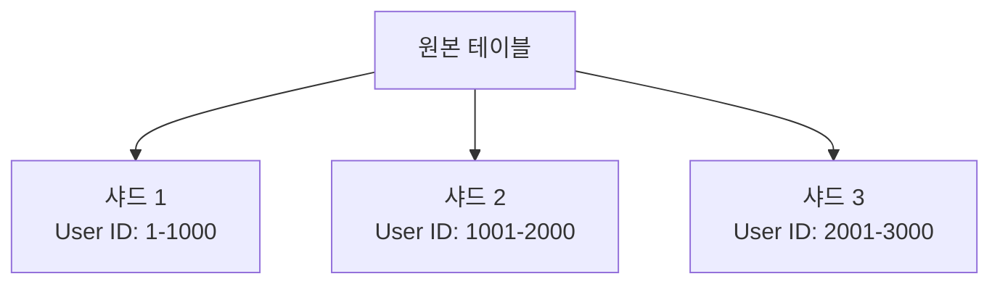
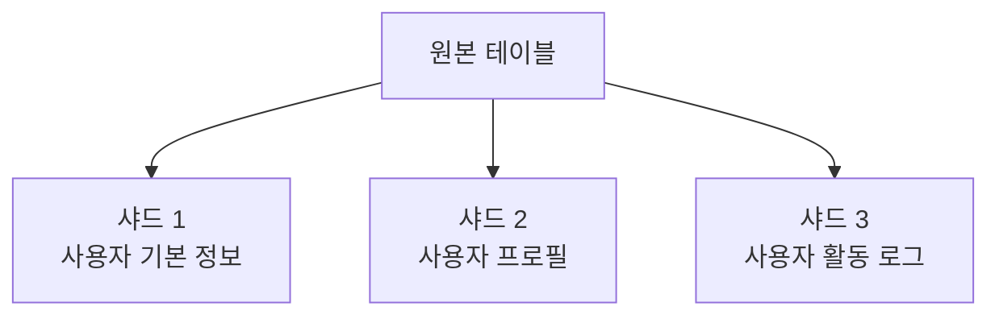

# 데이터베이스 샤딩 가이드 (Database Sharding Guide)

## 목차 (Table of Contents)
1. [샤딩 개요 (Sharding Overview)](#샤딩-개요)
2. [수평/수직 샤딩 비교 (Horizontal vs Vertical Sharding)](#수평수직-샤딩-비교)
3. [샤딩 키 선택 전략 (Sharding Key Selection Strategy)](#샤딩-키-선택-전략)
4. [샤드 간 쿼리 라우팅 (Query Routing Between Shards)](#샤드-간-쿼리-라우팅)
5. [샤드 리밸런싱 방법 (Shard Rebalancing Methods)](#샤드-리밸런싱-방법)
6. [실제 구현 예제 (Real Implementation Examples)](#실제-구현-예제)
7. [모니터링 및 관리 (Monitoring and Management)](#모니터링-및-관리)

## 샤딩 개요 (Sharding Overview)

샤딩(Sharding)은 대용량 데이터베이스를 여러 개의 작은 데이터베이스로 분할하여 성능과 확장성을 향상시키는 기술입니다.

### 샤딩의 목적 (Purpose of Sharding)

- **확장성 (Scalability)**: 단일 서버의 한계를 극복
- **성능 향상 (Performance)**: 쿼리 응답 시간 단축
- **가용성 (Availability)**: 장애 격리 및 복구 시간 단축
- **관리 용이성 (Manageability)**: 작은 단위로 관리

## 수평/수직 샤딩 비교 (Horizontal vs Vertical Sharding)

### 수평 샤딩 (Horizontal Sharding)

데이터를 행(Row) 단위로 분할하는 방식입니다.



**장점 (Advantages):**
- 동일한 스키마 유지
- 선형적 확장 가능
- 부하 분산 효과

**단점 (Disadvantages):**
- 복잡한 쿼리 라우팅
- 크로스 샤드 조인 어려움
- 리밸런싱 복잡성

### 수직 샤딩 (Vertical Sharding)

데이터를 열(Column) 단위로 분할하는 방식입니다.



**장점 (Advantages):**
- 단순한 쿼리 라우팅
- 기능별 분리 가능
- 보안 강화

**단점 (Disadvantages):**
- 크로스 샤드 조인 필요
- 스키마 변경 복잡성
- 데이터 일관성 관리

## 샤딩 키 선택 전략 (Sharding Key Selection Strategy)

### 1. 해시 기반 샤딩 (Hash-based Sharding)

```javascript
class HashSharding {
  constructor(shardCount) {
    this.shardCount = shardCount;
  }

  // 해시 함수를 사용한 샤드 결정
  getShardId(key) {
    const hash = this.hashFunction(key);
    return hash % this.shardCount;
  }

  // 간단한 해시 함수
  hashFunction(str) {
    let hash = 0;
    for (let i = 0; i < str.length; i++) {
      const char = str.charCodeAt(i);
      hash = ((hash << 5) - hash) + char;
      hash = hash & hash; // 32비트 정수로 변환
    }
    return Math.abs(hash);
  }
}

// 사용 예제
const sharding = new HashSharding(4);
console.log(sharding.getShardId('user123')); // 0-3 중 하나
```

### 2. 범위 기반 샤딩 (Range-based Sharding)

```javascript
class RangeSharding {
  constructor(ranges) {
    this.ranges = ranges.sort((a, b) => a.min - b.min);
  }

  // 범위를 기반으로 샤드 결정
  getShardId(key) {
    const numKey = parseInt(key);
    
    for (let i = 0; i < this.ranges.length; i++) {
      const range = this.ranges[i];
      if (numKey >= range.min && numKey <= range.max) {
        return range.shardId;
      }
    }
    
    throw new Error(`키 ${key}에 대한 샤드를 찾을 수 없습니다`);
  }
}

// 사용 예제
const ranges = [
  { min: 1, max: 1000, shardId: 0 },
  { min: 1001, max: 2000, shardId: 1 },
  { min: 2001, max: 3000, shardId: 2 }
];

const rangeSharding = new RangeSharding(ranges);
console.log(rangeSharding.getShardId(1500)); // 1
```

### 3. 디렉토리 기반 샤딩 (Directory-based Sharding)

```javascript
class DirectorySharding {
  constructor() {
    this.shardMap = new Map();
    this.initializeShardMap();
  }

  // 샤드 맵 초기화
  initializeShardMap() {
    // 실제로는 데이터베이스나 캐시에서 로드
    this.shardMap.set('user:1-1000', 0);
    this.shardMap.set('user:1001-2000', 1);
    this.shardMap.set('user:2001-3000', 2);
  }

  // 디렉토리에서 샤드 조회
  getShardId(key) {
    for (const [range, shardId] of this.shardMap) {
      if (this.isKeyInRange(key, range)) {
        return shardId;
      }
    }
    throw new Error(`키 ${key}에 대한 샤드를 찾을 수 없습니다`);
  }

  // 키가 범위에 속하는지 확인
  isKeyInRange(key, range) {
    const [prefix, rangeStr] = range.split(':');
    const [min, max] = rangeStr.split('-').map(Number);
    const numKey = parseInt(key);
    
    return numKey >= min && numKey <= max;
  }

  // 샤드 맵 업데이트
  updateShardMap(key, newShardId) {
    // 실제로는 트랜잭션으로 처리
    this.shardMap.set(key, newShardId);
  }
}
```

## 샤드 간 쿼리 라우팅 (Query Routing Between Shards)

### 1. 단일 샤드 쿼리 라우팅 (Single Shard Query Routing)

```javascript
class ShardRouter {
  constructor(shardConnections) {
    this.shardConnections = shardConnections;
    this.sharding = new HashSharding(shardConnections.length);
  }

  // 단일 샤드 쿼리 실행
  async executeSingleShardQuery(query, shardKey) {
    const shardId = this.sharding.getShardId(shardKey);
    const connection = this.shardConnections[shardId];
    
    try {
      const result = await connection.query(query);
      return {
        shardId,
        result,
        success: true
      };
    } catch (error) {
      return {
        shardId,
        error: error.message,
        success: false
      };
    }
  }

  // 사용자 조회 예제
  async getUser(userId) {
    const query = 'SELECT * FROM users WHERE id = ?';
    return await this.executeSingleShardQuery(query, userId);
  }
}
```

### 2. 멀티 샤드 쿼리 라우팅 (Multi-shard Query Routing)

```javascript
class MultiShardRouter extends ShardRouter {
  // 모든 샤드에서 쿼리 실행
  async executeMultiShardQuery(query, params = []) {
    const promises = this.shardConnections.map(async (connection, index) => {
      try {
        const result = await connection.query(query, params);
        return {
          shardId: index,
          result,
          success: true
        };
      } catch (error) {
        return {
          shardId: index,
          error: error.message,
          success: false
        };
      }
    });

    const results = await Promise.all(promises);
    return this.mergeResults(results);
  }

  // 결과 병합
  mergeResults(results) {
    const successfulResults = results.filter(r => r.success);
    const failedResults = results.filter(r => !r.success);
    
    const mergedData = successfulResults.reduce((acc, curr) => {
      return acc.concat(curr.result);
    }, []);

    return {
      data: mergedData,
      totalShards: results.length,
      successfulShards: successfulResults.length,
      failedShards: failedResults.length,
      errors: failedResults.map(r => r.error)
    };
  }

  // 사용자 통계 조회 예제
  async getUserStats() {
    const query = 'SELECT COUNT(*) as user_count FROM users';
    return await this.executeMultiShardQuery(query);
  }
}
```

### 3. 크로스 샤드 조인 (Cross-shard Join)

```javascript
class CrossShardJoin {
  constructor(shardRouter) {
    this.shardRouter = shardRouter;
  }

  // 크로스 샤드 조인 실행
  async executeCrossShardJoin(joinQuery) {
    // 1. 각 샤드에서 데이터 수집
    const shardResults = await this.collectShardData(joinQuery);
    
    // 2. 애플리케이션 레벨에서 조인 수행
    return this.performApplicationJoin(shardResults, joinQuery);
  }

  // 샤드별 데이터 수집
  async collectShardData(joinQuery) {
    const promises = this.shardRouter.shardConnections.map(async (connection, index) => {
      try {
        const result = await connection.query(joinQuery.shardQuery);
        return {
          shardId: index,
          data: result,
          success: true
        };
      } catch (error) {
        return {
          shardId: index,
          error: error.message,
          success: false
        };
      }
    });

    return await Promise.all(promises);
  }

  // 애플리케이션 레벨 조인
  performApplicationJoin(shardResults, joinQuery) {
    const allData = shardResults
      .filter(r => r.success)
      .reduce((acc, curr) => acc.concat(curr.data), []);

    // 간단한 해시 조인 구현
    const hashTable = new Map();
    
    // 첫 번째 테이블을 해시 테이블에 저장
    allData.forEach(row => {
      const key = row[joinQuery.joinKey];
      if (!hashTable.has(key)) {
        hashTable.set(key, []);
      }
      hashTable.get(key).push(row);
    });

    // 조인 결과 생성
    const joinResults = [];
    allData.forEach(row => {
      const key = row[joinQuery.joinKey];
      const matchingRows = hashTable.get(key) || [];
      
      matchingRows.forEach(match => {
        joinResults.push({ ...row, ...match });
      });
    });

    return joinResults;
  }
}
```

## 샤드 리밸런싱 방법 (Shard Rebalancing Methods)

### 1. 온라인 리밸런싱 (Online Rebalancing)

```javascript
class OnlineRebalancer {
  constructor(shardRouter) {
    this.shardRouter = shardRouter;
    this.rebalanceQueue = [];
    this.isRebalancing = false;
  }

  // 리밸런싱 시작
  async startRebalancing(newShardCount) {
    if (this.isRebalancing) {
      throw new Error('리밸런싱이 이미 진행 중입니다');
    }

    this.isRebalancing = true;
    
    try {
      // 1. 새로운 샤드 생성
      await this.createNewShards(newShardCount);
      
      // 2. 데이터 마이그레이션 계획 수립
      const migrationPlan = await this.createMigrationPlan(newShardCount);
      
      // 3. 단계별 데이터 마이그레이션
      await this.executeMigration(migrationPlan);
      
      // 4. 트래픽 전환
      await this.switchTraffic();
      
      // 5. 기존 샤드 정리
      await this.cleanupOldShards();
      
    } finally {
      this.isRebalancing = false;
    }
  }

  // 마이그레이션 계획 수립
  async createMigrationPlan(newShardCount) {
    const currentShardCount = this.shardRouter.shardConnections.length;
    const migrationPlan = [];

    // 각 샤드의 데이터 분포 분석
    for (let i = 0; i < currentShardCount; i++) {
      const shardData = await this.analyzeShardData(i);
      const targetShards = this.calculateTargetShards(shardData, newShardCount);
      
      migrationPlan.push({
        sourceShard: i,
        targetShards,
        data: shardData
      });
    }

    return migrationPlan;
  }

  // 샤드 데이터 분석
  async analyzeShardData(shardId) {
    const connection = this.shardRouter.shardConnections[shardId];
    const result = await connection.query('SELECT id FROM users ORDER BY id');
    
    return result.map(row => row.id);
  }

  // 대상 샤드 계산
  calculateTargetShards(data, newShardCount) {
    const sharding = new HashSharding(newShardCount);
    const targetShards = new Map();

    data.forEach(id => {
      const targetShard = sharding.getShardId(id);
      if (!targetShards.has(targetShard)) {
        targetShards.set(targetShard, []);
      }
      targetShards.get(targetShard).push(id);
    });

    return targetShards;
  }

  // 마이그레이션 실행
  async executeMigration(migrationPlan) {
    for (const plan of migrationPlan) {
      for (const [targetShard, ids] of plan.targetShards) {
        await this.migrateData(plan.sourceShard, targetShard, ids);
      }
    }
  }

  // 데이터 마이그레이션
  async migrateData(sourceShard, targetShard, ids) {
    const sourceConnection = this.shardRouter.shardConnections[sourceShard];
    const targetConnection = this.shardRouter.shardConnections[targetShard];

    // 배치 단위로 데이터 이동
    const batchSize = 1000;
    for (let i = 0; i < ids.length; i += batchSize) {
      const batch = ids.slice(i, i + batchSize);
      
      // 1. 소스에서 데이터 읽기
      const data = await this.readDataFromSource(sourceConnection, batch);
      
      // 2. 타겟에 데이터 쓰기
      await this.writeDataToTarget(targetConnection, data);
      
      // 3. 소스에서 데이터 삭제
      await this.deleteDataFromSource(sourceConnection, batch);
      
      console.log(`마이그레이션 진행: ${i + batch.length}/${ids.length}`);
    }
  }
}
```

### 2. 오프라인 리밸런싱 (Offline Rebalancing)

```javascript
class OfflineRebalancer {
  constructor(shardRouter) {
    this.shardRouter = shardRouter;
  }

  // 오프라인 리밸런싱 실행
  async executeOfflineRebalancing(newShardCount) {
    // 1. 모든 샤드 백업
    await this.backupAllShards();
    
    // 2. 서비스 중단
    await this.stopService();
    
    // 3. 데이터 재분배
    await this.redistributeData(newShardCount);
    
    // 4. 서비스 재시작
    await this.startService();
  }

  // 모든 샤드 백업
  async backupAllShards() {
    const backupPromises = this.shardRouter.shardConnections.map(async (connection, index) => {
      const backupFile = `backup_shard_${index}_${Date.now()}.sql`;
      await this.createBackup(connection, backupFile);
      return backupFile;
    });

    return await Promise.all(backupPromises);
  }

  // 데이터 재분배
  async redistributeData(newShardCount) {
    // 1. 모든 데이터 수집
    const allData = await this.collectAllData();
    
    // 2. 새로운 샤딩 전략 적용
    const newSharding = new HashSharding(newShardCount);
    const redistributedData = this.redistributeByNewStrategy(allData, newSharding);
    
    // 3. 새로운 샤드에 데이터 저장
    await this.saveToNewShards(redistributedData);
  }
}
```

## 실제 구현 예제 (Real Implementation Examples)

### 1. Node.js + MySQL 샤딩 구현

```javascript
const mysql = require('mysql2/promise');

class MySQLSharding {
  constructor(config) {
    this.shards = config.shards.map(shardConfig => ({
      ...shardConfig,
      connection: null
    }));
    this.sharding = new HashSharding(this.shards.length);
    this.initializeConnections();
  }

  // 연결 초기화
  async initializeConnections() {
    for (let i = 0; i < this.shards.length; i++) {
      this.shards[i].connection = await mysql.createConnection({
        host: this.shards[i].host,
        port: this.shards[i].port,
        user: this.shards[i].user,
        password: this.shards[i].password,
        database: this.shards[i].database
      });
    }
  }

  // 사용자 생성
  async createUser(userData) {
    const userId = userData.id;
    const shardId = this.sharding.getShardId(userId);
    const connection = this.shards[shardId].connection;

    const query = `
      INSERT INTO users (id, name, email, created_at) 
      VALUES (?, ?, ?, NOW())
    `;

    const [result] = await connection.execute(query, [
      userData.id,
      userData.name,
      userData.email
    ]);

    return {
      shardId,
      userId: result.insertId,
      success: true
    };
  }

  // 사용자 조회
  async getUser(userId) {
    const shardId = this.sharding.getShardId(userId);
    const connection = this.shards[shardId].connection;

    const query = 'SELECT * FROM users WHERE id = ?';
    const [rows] = await connection.execute(query, [userId]);

    return {
      shardId,
      user: rows[0] || null,
      success: true
    };
  }

  // 모든 사용자 조회 (멀티 샤드)
  async getAllUsers() {
    const promises = this.shards.map(async (shard, index) => {
      try {
        const [rows] = await shard.connection.execute('SELECT * FROM users');
        return {
          shardId: index,
          users: rows,
          success: true
        };
      } catch (error) {
        return {
          shardId: index,
          error: error.message,
          success: false
        };
      }
    });

    const results = await Promise.all(promises);
    return this.mergeResults(results);
  }

  // 결과 병합
  mergeResults(results) {
    const successfulResults = results.filter(r => r.success);
    const allUsers = successfulResults.reduce((acc, curr) => {
      return acc.concat(curr.users);
    }, []);

    return {
      users: allUsers,
      totalShards: results.length,
      successfulShards: successfulResults.length,
      failedShards: results.length - successfulResults.length
    };
  }
}

// 사용 예제
const shardingConfig = {
  shards: [
    { host: 'localhost', port: 3306, user: 'root', password: 'password', database: 'shard_0' },
    { host: 'localhost', port: 3307, user: 'root', password: 'password', database: 'shard_1' },
    { host: 'localhost', port: 3308, user: 'root', password: 'password', database: 'shard_2' }
  ]
};

const mysqlSharding = new MySQLSharding(shardingConfig);

// 사용자 생성
await mysqlSharding.createUser({
  id: 'user123',
  name: 'John Doe',
  email: 'john@example.com'
});

// 사용자 조회
const user = await mysqlSharding.getUser('user123');
console.log(user);
```

### 2. Express.js API with Sharding

```javascript
const express = require('express');
const app = express();

// 샤딩 서비스 초기화
const shardingService = new MySQLSharding(shardingConfig);

// 사용자 생성 API
app.post('/api/users', async (req, res) => {
  try {
    const { name, email } = req.body;
    const userId = `user_${Date.now()}_${Math.random().toString(36).substr(2, 9)}`;
    
    const result = await shardingService.createUser({
      id: userId,
      name,
      email
    });

    res.json({
      success: true,
      data: {
        userId,
        shardId: result.shardId
      }
    });
  } catch (error) {
    res.status(500).json({
      success: false,
      error: error.message
    });
  }
});

// 사용자 조회 API
app.get('/api/users/:userId', async (req, res) => {
  try {
    const { userId } = req.params;
    const result = await shardingService.getUser(userId);

    if (result.user) {
      res.json({
        success: true,
        data: {
          ...result.user,
          shardId: result.shardId
        }
      });
    } else {
      res.status(404).json({
        success: false,
        error: '사용자를 찾을 수 없습니다'
      });
    }
  } catch (error) {
    res.status(500).json({
      success: false,
      error: error.message
    });
  }
});

// 사용자 통계 API (멀티 샤드)
app.get('/api/users/stats', async (req, res) => {
  try {
    const result = await shardingService.getAllUsers();
    
    res.json({
      success: true,
      data: {
        totalUsers: result.users.length,
        shardDistribution: result.users.reduce((acc, user) => {
          const shardId = shardingService.sharding.getShardId(user.id);
          acc[shardId] = (acc[shardId] || 0) + 1;
          return acc;
        }, {}),
        shardStatus: {
          totalShards: result.totalShards,
          successfulShards: result.successfulShards,
          failedShards: result.failedShards
        }
      }
    });
  } catch (error) {
    res.status(500).json({
      success: false,
      error: error.message
    });
  }
});

app.listen(3000, () => {
  console.log('샤딩 API 서버가 포트 3000에서 실행 중입니다');
});
```

## 모니터링 및 관리 (Monitoring and Management)

### 1. 샤드 상태 모니터링

```javascript
class ShardMonitor {
  constructor(shardingService) {
    this.shardingService = shardingService;
  }

  // 샤드 상태 체크
  async checkShardHealth() {
    const healthChecks = this.shardingService.shards.map(async (shard, index) => {
      try {
        const startTime = Date.now();
        await shard.connection.execute('SELECT 1');
        const responseTime = Date.now() - startTime;

        return {
          shardId: index,
          status: 'healthy',
          responseTime,
          timestamp: new Date()
        };
      } catch (error) {
        return {
          shardId: index,
          status: 'unhealthy',
          error: error.message,
          timestamp: new Date()
        };
      }
    });

    return await Promise.all(healthChecks);
  }

  // 샤드별 데이터 분포 조회
  async getShardDistribution() {
    const distribution = await Promise.all(
      this.shardingService.shards.map(async (shard, index) => {
        try {
          const [rows] = await shard.connection.execute('SELECT COUNT(*) as count FROM users');
          return {
            shardId: index,
            recordCount: rows[0].count,
            status: 'active'
          };
        } catch (error) {
          return {
            shardId: index,
            recordCount: 0,
            status: 'error',
            error: error.message
          };
        }
      })
    );

    return distribution;
  }

  // 샤드 부하 분석
  async analyzeShardLoad() {
    const loadAnalysis = await Promise.all(
      this.shardingService.shards.map(async (shard, index) => {
        try {
          // 연결 수 조회
          const [connections] = await shard.connection.execute(
            'SHOW STATUS LIKE "Threads_connected"'
          );
          
          // 쿼리 수 조회
          const [queries] = await shard.connection.execute(
            'SHOW STATUS LIKE "Queries"'
          );

          return {
            shardId: index,
            activeConnections: connections[0].Value,
            totalQueries: queries[0].Value,
            timestamp: new Date()
          };
        } catch (error) {
          return {
            shardId: index,
            error: error.message,
            timestamp: new Date()
          };
        }
      })
    );

    return loadAnalysis;
  }
}
```

### 2. 자동 장애 복구

```javascript
class ShardFailover {
  constructor(shardingService) {
    this.shardingService = shardingService;
    this.failedShards = new Set();
    this.retryAttempts = new Map();
  }

  // 장애 샤드 처리
  async handleShardFailure(shardId, error) {
    console.log(`샤드 ${shardId} 장애 감지:`, error.message);
    
    this.failedShards.add(shardId);
    this.retryAttempts.set(shardId, 0);

    // 재시도 로직 시작
    this.scheduleRetry(shardId);
  }

  // 재시도 스케줄링
  scheduleRetry(shardId) {
    const retryCount = this.retryAttempts.get(shardId) || 0;
    const delay = Math.min(1000 * Math.pow(2, retryCount), 30000); // 최대 30초

    setTimeout(async () => {
      await this.retryShard(shardId);
    }, delay);
  }

  // 샤드 재시도
  async retryShard(shardId) {
    try {
      const shard = this.shardingService.shards[shardId];
      await shard.connection.execute('SELECT 1');
      
      // 성공 시 장애 목록에서 제거
      this.failedShards.delete(shardId);
      this.retryAttempts.delete(shardId);
      
      console.log(`샤드 ${shardId} 복구 완료`);
    } catch (error) {
      const retryCount = this.retryAttempts.get(shardId) + 1;
      this.retryAttempts.set(shardId, retryCount);
      
      if (retryCount < 5) {
        console.log(`샤드 ${shardId} 재시도 ${retryCount}/5`);
        this.scheduleRetry(shardId);
      } else {
        console.error(`샤드 ${shardId} 복구 실패 - 최대 재시도 횟수 초과`);
      }
    }
  }

  // 장애 샤드 우회 쿼리 실행
  async executeWithFailover(query, params, shardKey) {
    const shardId = this.shardingService.sharding.getShardId(shardKey);
    
    if (this.failedShards.has(shardId)) {
      // 장애 샤드인 경우 다른 샤드로 라우팅
      return await this.routeToHealthyShard(query, params, shardId);
    }
    
    // 정상 샤드에서 실행
    try {
      const shard = this.shardingService.shards[shardId];
      return await shard.connection.execute(query, params);
    } catch (error) {
      await this.handleShardFailure(shardId, error);
      throw error;
    }
  }

  // 건강한 샤드로 라우팅
  async routeToHealthyShard(query, params, failedShardId) {
    const healthyShards = this.shardingService.shards
      .map((shard, index) => ({ shard, index }))
      .filter(({ index }) => !this.failedShards.has(index));

    if (healthyShards.length === 0) {
      throw new Error('모든 샤드가 장애 상태입니다');
    }

    // 라운드 로빈으로 선택
    const selectedShard = healthyShards[Math.floor(Math.random() * healthyShards.length)];
    
    console.log(`샤드 ${failedShardId} 장애로 인해 샤드 ${selectedShard.index}로 라우팅`);
    
    return await selectedShard.shard.connection.execute(query, params);
  }
}
```

## 결론 (Conclusion)

데이터베이스 샤딩은 대용량 데이터를 처리하는 시스템에서 필수적인 기술입니다. 올바른 샤딩 전략을 선택하고 구현하면 시스템의 성능과 확장성을 크게 향상시킬 수 있습니다.

### 주요 고려사항 (Key Considerations)

1. **샤딩 키 선택**: 균등한 데이터 분산을 위한 적절한 키 선택
2. **쿼리 라우팅**: 효율적인 쿼리 분산 및 결과 병합
3. **리밸런싱**: 데이터 증가에 따른 동적 재분배
4. **장애 처리**: 샤드 장애 시 자동 복구 및 우회
5. **모니터링**: 지속적인 성능 및 상태 모니터링

적절한 샤딩 구현을 통해 확장 가능하고 안정적인 데이터베이스 시스템을 구축할 수 있습니다.
