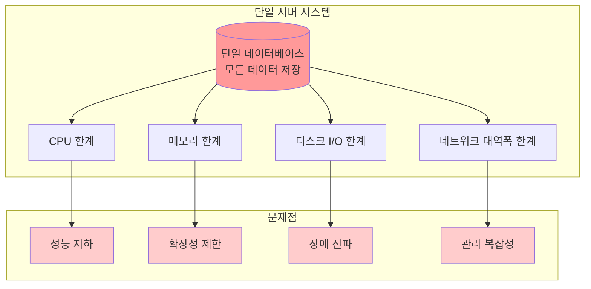
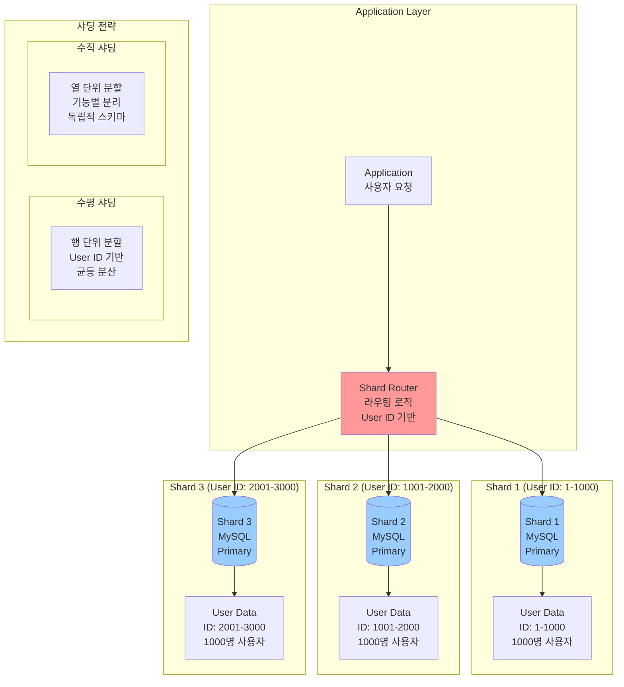
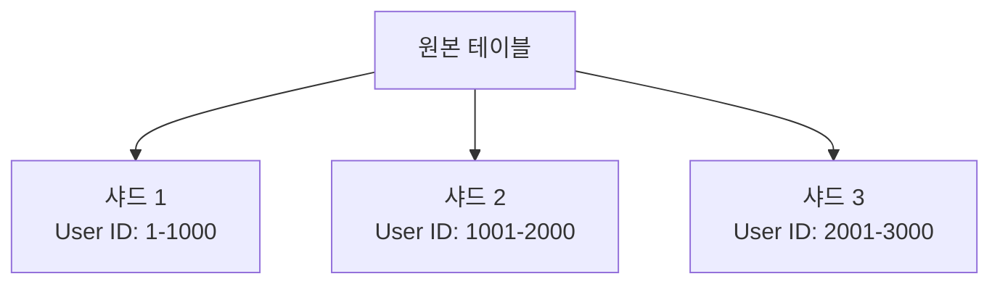
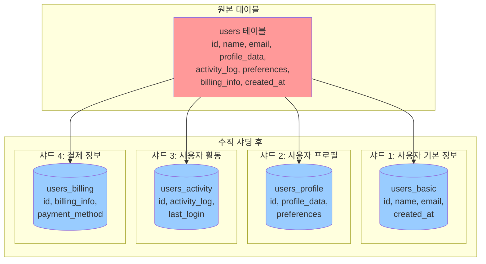

# 데이터베이스 샤딩 가이드 (Database Sharding Guide)

## 목차 (Table of Contents)
1. [샤딩 개요 (Sharding Overview)](#샤딩-개요)
2. [수평/수직 샤딩 비교 (Horizontal vs Vertical Sharding)](#수평수직-샤딩-비교)
3. [샤딩 키 선택 전략 (Sharding Key Selection Strategy)](#샤딩-키-선택-전략)
4. [샤드 간 쿼리 라우팅 (Query Routing Between Shards)](#샤드-간-쿼리-라우팅)
5. [샤드 리밸런싱 방법 (Shard Rebalancing Methods)](#샤드-리밸런싱-방법)
6. [샤딩의 복잡성과 해결 방안 (Sharding Complexity and Solutions)](#샤딩의-복잡성과-해결-방안)
7. [실제 구현 예제 (Real Implementation Examples)](#실제-구현-예제)
8. [모니터링 및 관리 (Monitoring and Management)](#모니터링-및-관리)
9. [결론 (Conclusion)](#결론)

## 샤딩 개요 (Sharding Overview)

### 샤딩의 정의와 핵심 개념

샤딩(Sharding)은 대용량 데이터베이스를 여러 개의 독립적인 데이터베이스 인스턴스로 분할하여 저장하는 데이터베이스 아키텍처 패턴입니다. 이는 **데이터 파티셔닝(Data Partitioning)**의 한 형태로, 각 샤드는 전체 데이터의 일부분만을 담당합니다.

#### 샤딩의 핵심 원리

1. **데이터 분산 (Data Distribution)**
   - 전체 데이터를 논리적으로 분할하여 여러 물리적 저장소에 분산
   - 각 샤드는 독립적인 데이터베이스 인스턴스
   - 데이터의 일관성과 무결성 유지

2. **수평적 확장 (Horizontal Scaling)**
   - 단일 서버의 성능 한계를 넘어서는 확장
   - 서버 수를 늘려서 처리 능력 향상
   - 선형적 확장 가능성 제공

3. **부하 분산 (Load Distribution)**
   - 쿼리와 트랜잭션을 여러 샤드에 분산
   - 각 샤드의 부하 감소
   - 전체 시스템의 처리량 증가

### 샤딩이 필요한 이유

#### 1. 단일 서버의 한계점



#### 2. 데이터 증가의 영향

- **데이터 볼륨 증가**: 테라바이트, 페타바이트 단위의 데이터
- **사용자 증가**: 수백만, 수천만 명의 동시 사용자
- **트랜잭션 증가**: 초당 수만 건의 트랜잭션 처리 요구
- **복잡한 쿼리**: 대용량 데이터에 대한 복잡한 분석 쿼리

### 샤딩의 목적과 이점

#### 1. 확장성 (Scalability)
- **수평적 확장**: 서버 추가를 통한 용량 확장
- **선형적 성능 향상**: 샤드 수에 비례한 처리 능력 증가
- **무제한 확장**: 이론적으로 무제한 확장 가능

#### 2. 성능 향상 (Performance)
- **병렬 처리**: 여러 샤드에서 동시 쿼리 실행
- **로컬 캐싱**: 각 샤드의 독립적인 캐시 활용
- **인덱스 최적화**: 작은 데이터셋에 대한 효율적인 인덱싱

#### 3. 가용성 (Availability)
- **장애 격리**: 한 샤드의 장애가 전체 시스템에 미치는 영향 최소화
- **부분적 서비스**: 일부 샤드 장애 시에도 서비스 지속
- **빠른 복구**: 작은 단위의 데이터 복구로 복구 시간 단축

#### 4. 관리 용이성 (Manageability)
- **독립적 관리**: 각 샤드의 독립적인 백업, 복구, 업그레이드
- **점진적 확장**: 필요에 따른 단계적 샤드 추가
- **리소스 최적화**: 샤드별 특성에 맞는 리소스 할당

### 샤딩의 기본 원칙

#### 1. 데이터 일관성 원칙
- **ACID 속성**: 각 샤드 내에서는 ACID 속성 보장
- **분산 트랜잭션**: 크로스 샤드 트랜잭션의 복잡성 인식
- **최종 일관성**: 분산 환경에서의 일관성 모델 적용

#### 2. 쿼리 라우팅 원칙
- **효율적 라우팅**: 쿼리를 적절한 샤드로 전달
- **병렬 처리**: 가능한 경우 여러 샤드에서 병렬 실행
- **결과 병합**: 분산된 결과를 효율적으로 통합

#### 3. 확장성 원칙
- **균등 분산**: 데이터와 부하의 균등한 분산
- **동적 리밸런싱**: 데이터 증가에 따른 자동 재분배
- **점진적 확장**: 서비스 중단 없는 확장 가능

## 수평/수직 샤딩 비교 (Horizontal vs Vertical Sharding)

### 샤딩 방식의 분류

샤딩은 데이터를 분할하는 방식에 따라 크게 두 가지로 나뉩니다:

1. **수평 샤딩 (Horizontal Sharding)**: 행(Row) 단위로 데이터 분할
2. **수직 샤딩 (Vertical Sharding)**: 열(Column) 단위로 데이터 분할

### 수평 샤딩 (Horizontal Sharding)

수평 샤딩은 **행 단위 분할(Row-level Partitioning)**으로, 동일한 스키마를 가진 여러 샤드에 데이터를 분산시키는 방식입니다.

#### 수평 샤딩의 특징

- **동일한 스키마**: 모든 샤드가 동일한 테이블 구조를 가짐
- **행 분할**: 각 샤드는 전체 데이터의 일부분만 저장
- **독립적 처리**: 각 샤드에서 독립적으로 쿼리 실행 가능
- **확장성**: 샤드 추가를 통한 용량 확장 용이

#### 수평 샤딩의 분할 전략

1. **범위 기반 분할 (Range-based)**
   - 연속된 값의 범위로 분할
   - 예: 사용자 ID 1-1000, 1001-2000, 2001-3000

2. **해시 기반 분할 (Hash-based)**
   - 해시 함수를 사용한 균등 분할
   - 예: user_id % 4 = 0,1,2,3

3. **디렉토리 기반 분할 (Directory-based)**
   - 매핑 테이블을 통한 분할
   - 예: 사용자별 샤드 매핑 테이블

### 데이터베이스 샤딩 구조 다이어그램



### 기존 수평 샤딩 다이어그램



**장점 (Advantages):**
- 동일한 스키마 유지
- 선형적 확장 가능
- 부하 분산 효과

**단점 (Disadvantages):**
- 복잡한 쿼리 라우팅
- 크로스 샤드 조인 어려움
- 리밸런싱 복잡성

### 수직 샤딩 (Vertical Sharding)

수직 샤딩은 **열 단위 분할(Column-level Partitioning)**으로, 테이블의 컬럼을 기능별로 분리하여 다른 샤드에 저장하는 방식입니다.

#### 수직 샤딩의 특징

- **기능별 분리**: 관련된 컬럼들을 그룹화하여 분리
- **다른 스키마**: 각 샤드마다 다른 테이블 구조를 가짐
- **도메인 분리**: 비즈니스 도메인에 따른 논리적 분리
- **독립적 스키마**: 각 샤드의 독립적인 스키마 진화

#### 수직 샤딩의 분할 전략

1. **기능별 분할 (Functional Partitioning)**
   - 사용자 기본 정보, 프로필, 활동 로그 등으로 분리
   - 각 기능별로 독립적인 데이터베이스 관리

2. **도메인별 분할 (Domain Partitioning)**
   - 사용자 관리, 주문 관리, 상품 관리 등으로 분리
   - 마이크로서비스 아키텍처와 유사한 접근

3. **접근 패턴별 분할 (Access Pattern Partitioning)**
   - 자주 접근하는 데이터와 드물게 접근하는 데이터 분리
   - 성능 최적화를 위한 분할

#### 수직 샤딩 구조 다이어그램



#### 수직 샤딩의 장점과 단점

**장점 (Advantages):**
- **단순한 쿼리 라우팅**: 기능별로 명확한 라우팅 규칙
- **기능별 분리**: 각 도메인의 독립적 관리 가능
- **보안 강화**: 민감한 데이터의 분리 저장
- **성능 최적화**: 각 샤드의 특성에 맞는 최적화
- **스키마 진화**: 독립적인 스키마 변경 가능

**단점 (Disadvantages):**
- **크로스 샤드 조인**: 여러 샤드의 데이터를 조합해야 하는 경우
- **트랜잭션 복잡성**: 분산 트랜잭션의 복잡성 증가
- **데이터 일관성**: 여러 샤드 간의 일관성 관리 어려움
- **관리 복잡성**: 여러 스키마의 동기화 및 관리
- **네트워크 오버헤드**: 샤드 간 통신으로 인한 지연

### 수평 vs 수직 샤딩 비교

| 특성 | 수평 샤딩 | 수직 샤딩 |
|------|-----------|-----------|
| **분할 단위** | 행(Row) | 열(Column) |
| **스키마** | 동일한 스키마 | 다른 스키마 |
| **확장성** | 선형적 확장 용이 | 기능별 확장 |
| **쿼리 복잡성** | 복잡한 라우팅 | 단순한 라우팅 |
| **조인** | 크로스 샤드 조인 어려움 | 크로스 샤드 조인 필요 |
| **트랜잭션** | 단일 샤드 내 트랜잭션 | 분산 트랜잭션 복잡 |
| **관리** | 동일한 스키마 관리 | 다양한 스키마 관리 |
| **적용 사례** | 대용량 단일 테이블 | 기능별 분리된 시스템 |

## 샤딩 키 선택 전략 (Sharding Key Selection Strategy)

### 샤딩 키의 중요성

샤딩 키(Sharding Key)는 데이터를 어떤 샤드에 저장할지 결정하는 핵심 요소입니다. 샤딩 키의 선택은 시스템의 성능, 확장성, 그리고 관리 복잡성에 직접적인 영향을 미칩니다.

#### 샤딩 키 선택 시 고려사항

1. **데이터 분산 균등성**: 모든 샤드에 고르게 분산되어야 함
2. **쿼리 패턴**: 자주 사용되는 쿼리의 WHERE 조건에 포함되어야 함
3. **확장성**: 새로운 샤드 추가 시 재분배가 용이해야 함
4. **일관성**: 데이터의 논리적 그룹핑을 유지해야 함
5. **변경 빈도**: 자주 변경되지 않는 안정적인 값이어야 함

### 샤딩 키 선택 전략의 종류

#### 1. 해시 기반 샤딩 (Hash-based Sharding)

해시 기반 샤딩은 샤딩 키의 해시 값을 사용하여 샤드를 결정하는 방식입니다.

**특징:**
- 균등한 데이터 분산 보장
- 예측 가능한 샤드 할당
- 범위 쿼리 불가능
- 리밸런싱 시 전체 데이터 재분배 필요

**적용 사례:**
- 사용자 ID, 이메일 주소 등 고유 식별자
- 균등한 분산이 중요한 경우
- 범위 쿼리가 필요 없는 경우

```javascript
class HashSharding {
  constructor(shardCount) {
    this.shardCount = shardCount;
  }

  // 해시 함수를 사용한 샤드 결정
  getShardId(key) {
    const hash = this.hashFunction(key);
    return hash % this.shardCount;
  }

  // 간단한 해시 함수
  hashFunction(str) {
    let hash = 0;
    for (let i = 0; i < str.length; i++) {
      const char = str.charCodeAt(i);
      hash = ((hash << 5) - hash) + char;
      hash = hash & hash; // 32비트 정수로 변환
    }
    return Math.abs(hash);
  }
}

// 사용 예제
const sharding = new HashSharding(4);
console.log(sharding.getShardId('user123')); // 0-3 중 하나
```

#### 2. 범위 기반 샤딩 (Range-based Sharding)

범위 기반 샤딩은 샤딩 키의 값 범위를 기반으로 샤드를 결정하는 방식입니다.

**특징:**
- 범위 쿼리 지원 가능
- 데이터의 논리적 그룹핑 유지
- 불균등한 데이터 분산 가능성
- 리밸런싱 시 부분적 재분배 가능

**적용 사례:**
- 날짜, 시간 기반 데이터
- 순차적 ID (auto-increment)
- 범위 쿼리가 필요한 경우
- 지역별, 시간대별 데이터 분리

**장점:**
- 범위 쿼리 최적화 가능
- 데이터의 논리적 그룹핑 유지
- 부분적 리밸런싱 가능

**단점:**
- 핫스팟(Hotspot) 발생 가능
- 불균등한 데이터 분산
- 리밸런싱 복잡성

```javascript
class RangeSharding {
  constructor(ranges) {
    this.ranges = ranges.sort((a, b) => a.min - b.min);
  }

  // 범위를 기반으로 샤드 결정
  getShardId(key) {
    const numKey = parseInt(key);
    
    for (let i = 0; i < this.ranges.length; i++) {
      const range = this.ranges[i];
      if (numKey >= range.min && numKey <= range.max) {
        return range.shardId;
      }
    }
    
    throw new Error(`키 ${key}에 대한 샤드를 찾을 수 없습니다`);
  }

  // 범위 쿼리 지원
  getShardsForRange(minKey, maxKey) {
    const affectedShards = [];
    
    for (let i = 0; i < this.ranges.length; i++) {
      const range = this.ranges[i];
      // 범위가 겹치는 샤드 찾기
      if (range.min <= maxKey && range.max >= minKey) {
        affectedShards.push(range.shardId);
      }
    }
    
    return affectedShards;
  }
}

// 사용 예제
const ranges = [
  { min: 1, max: 1000, shardId: 0 },
  { min: 1001, max: 2000, shardId: 1 },
  { min: 2001, max: 3000, shardId: 2 }
];

const rangeSharding = new RangeSharding(ranges);
console.log(rangeSharding.getShardId(1500)); // 1
console.log(rangeSharding.getShardsForRange(500, 1500)); // [0, 1]
```

#### 3. 디렉토리 기반 샤딩 (Directory-based Sharding)

디렉토리 기반 샤딩은 매핑 테이블을 사용하여 샤딩 키와 샤드 간의 관계를 관리하는 방식입니다.

**특징:**
- 유연한 샤드 할당
- 복잡한 매핑 규칙 지원
- 동적 샤드 재할당 가능
- 메타데이터 관리 필요

**적용 사례:**
- 복잡한 비즈니스 로직이 필요한 경우
- 사용자별 맞춤형 샤드 할당
- 지역별, 조직별 데이터 분리
- 동적 샤드 할당이 필요한 경우

**장점:**
- 최대한의 유연성 제공
- 복잡한 매핑 규칙 지원
- 동적 리밸런싱 가능

**단점:**
- 메타데이터 관리 복잡성
- 성능 오버헤드
- 단일 장애점 가능성

```javascript
class DirectorySharding {
  constructor() {
    this.shardMap = new Map();
    this.initializeShardMap();
  }

  // 샤드 맵 초기화
  initializeShardMap() {
    // 실제로는 데이터베이스나 캐시에서 로드
    this.shardMap.set('user:1-1000', 0);
    this.shardMap.set('user:1001-2000', 1);
    this.shardMap.set('user:2001-3000', 2);
    
    // 특별한 사용자들을 특정 샤드에 할당
    this.shardMap.set('user:admin', 0);
    this.shardMap.set('user:premium', 1);
  }

  // 디렉토리에서 샤드 조회
  getShardId(key) {
    // 직접 매핑 확인
    if (this.shardMap.has(key)) {
      return this.shardMap.get(key);
    }
    
    // 범위 매핑 확인
    for (const [range, shardId] of this.shardMap) {
      if (this.isKeyInRange(key, range)) {
        return shardId;
      }
    }
    
    throw new Error(`키 ${key}에 대한 샤드를 찾을 수 없습니다`);
  }

  // 키가 범위에 속하는지 확인
  isKeyInRange(key, range) {
    if (!range.includes(':')) return false;
    
    const [prefix, rangeStr] = range.split(':');
    if (!rangeStr.includes('-')) return false;
    
    const [min, max] = rangeStr.split('-').map(Number);
    const numKey = parseInt(key);
    
    return numKey >= min && numKey <= max;
  }

  // 샤드 맵 업데이트
  updateShardMap(key, newShardId) {
    // 실제로는 트랜잭션으로 처리
    this.shardMap.set(key, newShardId);
    console.log(`샤드 맵 업데이트: ${key} -> 샤드 ${newShardId}`);
  }

  // 샤드 맵 백업
  backupShardMap() {
    return Array.from(this.shardMap.entries());
  }

  // 샤드 맵 복원
  restoreShardMap(backup) {
    this.shardMap.clear();
    backup.forEach(([key, shardId]) => {
      this.shardMap.set(key, shardId);
    });
  }
}
```

### 샤딩 키 선택 가이드라인

#### 좋은 샤딩 키의 조건

1. **고유성 (Uniqueness)**
   - 각 레코드를 고유하게 식별할 수 있어야 함
   - 중복 값이 없어야 함

2. **안정성 (Stability)**
   - 자주 변경되지 않는 값이어야 함
   - 변경 시 리밸런싱이 필요하므로 안정성이 중요

3. **균등성 (Uniformity)**
   - 모든 샤드에 고르게 분산되어야 함
   - 핫스팟을 방지할 수 있어야 함

4. **쿼리 친화성 (Query-friendly)**
   - 자주 사용되는 쿼리의 조건에 포함되어야 함
   - 단일 샤드 쿼리가 가능해야 함

#### 나쁜 샤딩 키의 예시

1. **자주 변경되는 값**
   - 사용자 상태, 로그인 시간 등
   - 변경 시마다 리밸런싱 필요

2. **불균등한 분포**
   - 대부분의 값이 특정 범위에 집중
   - 핫스팟 발생 가능

3. **쿼리 패턴과 무관한 값**
   - 자주 사용되지 않는 컬럼
   - 크로스 샤드 쿼리 증가

#### 복합 샤딩 키 (Composite Sharding Key)

여러 컬럼을 조합하여 샤딩 키로 사용하는 방식입니다.

```javascript
class CompositeSharding {
  constructor(shardCount) {
    this.shardCount = shardCount;
  }

  // 복합 키를 사용한 샤드 결정
  getShardId(userId, regionId) {
    // 사용자 ID와 지역 ID를 조합
    const compositeKey = `${userId}_${regionId}`;
    const hash = this.hashFunction(compositeKey);
    return hash % this.shardCount;
  }

  hashFunction(str) {
    let hash = 0;
    for (let i = 0; i < str.length; i++) {
      const char = str.charCodeAt(i);
      hash = ((hash << 5) - hash) + char;
      hash = hash & hash;
    }
    return Math.abs(hash);
  }
}
```

**복합 샤딩 키의 장점:**
- 더 세밀한 데이터 분산 제어
- 비즈니스 로직 반영 가능
- 쿼리 패턴 최적화

**복합 샤딩 키의 단점:**
- 복잡성 증가
- 키 변경 시 리밸런싱 복잡성
- 디버깅 어려움

## 샤드 간 쿼리 라우팅 (Query Routing Between Shards)

### 1. 단일 샤드 쿼리 라우팅 (Single Shard Query Routing)

```javascript
class ShardRouter {
  constructor(shardConnections) {
    this.shardConnections = shardConnections;
    this.sharding = new HashSharding(shardConnections.length);
  }

  // 단일 샤드 쿼리 실행
  async executeSingleShardQuery(query, shardKey) {
    const shardId = this.sharding.getShardId(shardKey);
    const connection = this.shardConnections[shardId];
    
    try {
      const result = await connection.query(query);
      return {
        shardId,
        result,
        success: true
      };
    } catch (error) {
      return {
        shardId,
        error: error.message,
        success: false
      };
    }
  }

  // 사용자 조회 예제
  async getUser(userId) {
    const query = 'SELECT * FROM users WHERE id = ?';
    return await this.executeSingleShardQuery(query, userId);
  }
}
```

### 2. 멀티 샤드 쿼리 라우팅 (Multi-shard Query Routing)

```javascript
class MultiShardRouter extends ShardRouter {
  // 모든 샤드에서 쿼리 실행
  async executeMultiShardQuery(query, params = []) {
    const promises = this.shardConnections.map(async (connection, index) => {
      try {
        const result = await connection.query(query, params);
        return {
          shardId: index,
          result,
          success: true
        };
      } catch (error) {
        return {
          shardId: index,
          error: error.message,
          success: false
        };
      }
    });

    const results = await Promise.all(promises);
    return this.mergeResults(results);
  }

  // 결과 병합
  mergeResults(results) {
    const successfulResults = results.filter(r => r.success);
    const failedResults = results.filter(r => !r.success);
    
    const mergedData = successfulResults.reduce((acc, curr) => {
      return acc.concat(curr.result);
    }, []);

    return {
      data: mergedData,
      totalShards: results.length,
      successfulShards: successfulResults.length,
      failedShards: failedResults.length,
      errors: failedResults.map(r => r.error)
    };
  }

  // 사용자 통계 조회 예제
  async getUserStats() {
    const query = 'SELECT COUNT(*) as user_count FROM users';
    return await this.executeMultiShardQuery(query);
  }
}
```

### 3. 크로스 샤드 조인 (Cross-shard Join)

```javascript
class CrossShardJoin {
  constructor(shardRouter) {
    this.shardRouter = shardRouter;
  }

  // 크로스 샤드 조인 실행
  async executeCrossShardJoin(joinQuery) {
    // 1. 각 샤드에서 데이터 수집
    const shardResults = await this.collectShardData(joinQuery);
    
    // 2. 애플리케이션 레벨에서 조인 수행
    return this.performApplicationJoin(shardResults, joinQuery);
  }

  // 샤드별 데이터 수집
  async collectShardData(joinQuery) {
    const promises = this.shardRouter.shardConnections.map(async (connection, index) => {
      try {
        const result = await connection.query(joinQuery.shardQuery);
        return {
          shardId: index,
          data: result,
          success: true
        };
      } catch (error) {
        return {
          shardId: index,
          error: error.message,
          success: false
        };
      }
    });

    return await Promise.all(promises);
  }

  // 애플리케이션 레벨 조인
  performApplicationJoin(shardResults, joinQuery) {
    const allData = shardResults
      .filter(r => r.success)
      .reduce((acc, curr) => acc.concat(curr.data), []);

    // 간단한 해시 조인 구현
    const hashTable = new Map();
    
    // 첫 번째 테이블을 해시 테이블에 저장
    allData.forEach(row => {
      const key = row[joinQuery.joinKey];
      if (!hashTable.has(key)) {
        hashTable.set(key, []);
      }
      hashTable.get(key).push(row);
    });

    // 조인 결과 생성
    const joinResults = [];
    allData.forEach(row => {
      const key = row[joinQuery.joinKey];
      const matchingRows = hashTable.get(key) || [];
      
      matchingRows.forEach(match => {
        joinResults.push({ ...row, ...match });
      });
    });

    return joinResults;
  }
}
```

## 샤드 리밸런싱 방법 (Shard Rebalancing Methods)

### 1. 온라인 리밸런싱 (Online Rebalancing)

```javascript
class OnlineRebalancer {
  constructor(shardRouter) {
    this.shardRouter = shardRouter;
    this.rebalanceQueue = [];
    this.isRebalancing = false;
  }

  // 리밸런싱 시작
  async startRebalancing(newShardCount) {
    if (this.isRebalancing) {
      throw new Error('리밸런싱이 이미 진행 중입니다');
    }

    this.isRebalancing = true;
    
    try {
      // 1. 새로운 샤드 생성
      await this.createNewShards(newShardCount);
      
      // 2. 데이터 마이그레이션 계획 수립
      const migrationPlan = await this.createMigrationPlan(newShardCount);
      
      // 3. 단계별 데이터 마이그레이션
      await this.executeMigration(migrationPlan);
      
      // 4. 트래픽 전환
      await this.switchTraffic();
      
      // 5. 기존 샤드 정리
      await this.cleanupOldShards();
      
    } finally {
      this.isRebalancing = false;
    }
  }

  // 마이그레이션 계획 수립
  async createMigrationPlan(newShardCount) {
    const currentShardCount = this.shardRouter.shardConnections.length;
    const migrationPlan = [];

    // 각 샤드의 데이터 분포 분석
    for (let i = 0; i < currentShardCount; i++) {
      const shardData = await this.analyzeShardData(i);
      const targetShards = this.calculateTargetShards(shardData, newShardCount);
      
      migrationPlan.push({
        sourceShard: i,
        targetShards,
        data: shardData
      });
    }

    return migrationPlan;
  }

  // 샤드 데이터 분석
  async analyzeShardData(shardId) {
    const connection = this.shardRouter.shardConnections[shardId];
    const result = await connection.query('SELECT id FROM users ORDER BY id');
    
    return result.map(row => row.id);
  }

  // 대상 샤드 계산
  calculateTargetShards(data, newShardCount) {
    const sharding = new HashSharding(newShardCount);
    const targetShards = new Map();

    data.forEach(id => {
      const targetShard = sharding.getShardId(id);
      if (!targetShards.has(targetShard)) {
        targetShards.set(targetShard, []);
      }
      targetShards.get(targetShard).push(id);
    });

    return targetShards;
  }

  // 마이그레이션 실행
  async executeMigration(migrationPlan) {
    for (const plan of migrationPlan) {
      for (const [targetShard, ids] of plan.targetShards) {
        await this.migrateData(plan.sourceShard, targetShard, ids);
      }
    }
  }

  // 데이터 마이그레이션
  async migrateData(sourceShard, targetShard, ids) {
    const sourceConnection = this.shardRouter.shardConnections[sourceShard];
    const targetConnection = this.shardRouter.shardConnections[targetShard];

    // 배치 단위로 데이터 이동
    const batchSize = 1000;
    for (let i = 0; i < ids.length; i += batchSize) {
      const batch = ids.slice(i, i + batchSize);
      
      // 1. 소스에서 데이터 읽기
      const data = await this.readDataFromSource(sourceConnection, batch);
      
      // 2. 타겟에 데이터 쓰기
      await this.writeDataToTarget(targetConnection, data);
      
      // 3. 소스에서 데이터 삭제
      await this.deleteDataFromSource(sourceConnection, batch);
      
      console.log(`마이그레이션 진행: ${i + batch.length}/${ids.length}`);
    }
  }
}
```

### 2. 오프라인 리밸런싱 (Offline Rebalancing)

```javascript
class OfflineRebalancer {
  constructor(shardRouter) {
    this.shardRouter = shardRouter;
  }

  // 오프라인 리밸런싱 실행
  async executeOfflineRebalancing(newShardCount) {
    // 1. 모든 샤드 백업
    await this.backupAllShards();
    
    // 2. 서비스 중단
    await this.stopService();
    
    // 3. 데이터 재분배
    await this.redistributeData(newShardCount);
    
    // 4. 서비스 재시작
    await this.startService();
  }

  // 모든 샤드 백업
  async backupAllShards() {
    const backupPromises = this.shardRouter.shardConnections.map(async (connection, index) => {
      const backupFile = `backup_shard_${index}_${Date.now()}.sql`;
      await this.createBackup(connection, backupFile);
      return backupFile;
    });

    return await Promise.all(backupPromises);
  }

  // 데이터 재분배
  async redistributeData(newShardCount) {
    // 1. 모든 데이터 수집
    const allData = await this.collectAllData();
    
    // 2. 새로운 샤딩 전략 적용
    const newSharding = new HashSharding(newShardCount);
    const redistributedData = this.redistributeByNewStrategy(allData, newSharding);
    
    // 3. 새로운 샤드에 데이터 저장
    await this.saveToNewShards(redistributedData);
  }
}
```

## 실제 구현 예제 (Real Implementation Examples)

### 1. Node.js + MySQL 샤딩 구현

```javascript
const mysql = require('mysql2/promise');

class MySQLSharding {
  constructor(config) {
    this.shards = config.shards.map(shardConfig => ({
      ...shardConfig,
      connection: null
    }));
    this.sharding = new HashSharding(this.shards.length);
    this.initializeConnections();
  }

  // 연결 초기화
  async initializeConnections() {
    for (let i = 0; i < this.shards.length; i++) {
      this.shards[i].connection = await mysql.createConnection({
        host: this.shards[i].host,
        port: this.shards[i].port,
        user: this.shards[i].user,
        password: this.shards[i].password,
        database: this.shards[i].database
      });
    }
  }

  // 사용자 생성
  async createUser(userData) {
    const userId = userData.id;
    const shardId = this.sharding.getShardId(userId);
    const connection = this.shards[shardId].connection;

    const query = `
      INSERT INTO users (id, name, email, created_at) 
      VALUES (?, ?, ?, NOW())
    `;

    const [result] = await connection.execute(query, [
      userData.id,
      userData.name,
      userData.email
    ]);

    return {
      shardId,
      userId: result.insertId,
      success: true
    };
  }

  // 사용자 조회
  async getUser(userId) {
    const shardId = this.sharding.getShardId(userId);
    const connection = this.shards[shardId].connection;

    const query = 'SELECT * FROM users WHERE id = ?';
    const [rows] = await connection.execute(query, [userId]);

    return {
      shardId,
      user: rows[0] || null,
      success: true
    };
  }

  // 모든 사용자 조회 (멀티 샤드)
  async getAllUsers() {
    const promises = this.shards.map(async (shard, index) => {
      try {
        const [rows] = await shard.connection.execute('SELECT * FROM users');
        return {
          shardId: index,
          users: rows,
          success: true
        };
      } catch (error) {
        return {
          shardId: index,
          error: error.message,
          success: false
        };
      }
    });

    const results = await Promise.all(promises);
    return this.mergeResults(results);
  }

  // 결과 병합
  mergeResults(results) {
    const successfulResults = results.filter(r => r.success);
    const allUsers = successfulResults.reduce((acc, curr) => {
      return acc.concat(curr.users);
    }, []);

    return {
      users: allUsers,
      totalShards: results.length,
      successfulShards: successfulResults.length,
      failedShards: results.length - successfulResults.length
    };
  }
}

// 사용 예제
const shardingConfig = {
  shards: [
    { host: 'localhost', port: 3306, user: 'root', password: 'password', database: 'shard_0' },
    { host: 'localhost', port: 3307, user: 'root', password: 'password', database: 'shard_1' },
    { host: 'localhost', port: 3308, user: 'root', password: 'password', database: 'shard_2' }
  ]
};

const mysqlSharding = new MySQLSharding(shardingConfig);

// 사용자 생성
await mysqlSharding.createUser({
  id: 'user123',
  name: 'John Doe',
  email: 'john@example.com'
});

// 사용자 조회
const user = await mysqlSharding.getUser('user123');
console.log(user);
```

### 2. Express.js API with Sharding

```javascript
const express = require('express');
const app = express();

// 샤딩 서비스 초기화
const shardingService = new MySQLSharding(shardingConfig);

// 사용자 생성 API
app.post('/api/users', async (req, res) => {
  try {
    const { name, email } = req.body;
    const userId = `user_${Date.now()}_${Math.random().toString(36).substr(2, 9)}`;
    
    const result = await shardingService.createUser({
      id: userId,
      name,
      email
    });

    res.json({
      success: true,
      data: {
        userId,
        shardId: result.shardId
      }
    });
  } catch (error) {
    res.status(500).json({
      success: false,
      error: error.message
    });
  }
});

// 사용자 조회 API
app.get('/api/users/:userId', async (req, res) => {
  try {
    const { userId } = req.params;
    const result = await shardingService.getUser(userId);

    if (result.user) {
      res.json({
        success: true,
        data: {
          ...result.user,
          shardId: result.shardId
        }
      });
    } else {
      res.status(404).json({
        success: false,
        error: '사용자를 찾을 수 없습니다'
      });
    }
  } catch (error) {
    res.status(500).json({
      success: false,
      error: error.message
    });
  }
});

// 사용자 통계 API (멀티 샤드)
app.get('/api/users/stats', async (req, res) => {
  try {
    const result = await shardingService.getAllUsers();
    
    res.json({
      success: true,
      data: {
        totalUsers: result.users.length,
        shardDistribution: result.users.reduce((acc, user) => {
          const shardId = shardingService.sharding.getShardId(user.id);
          acc[shardId] = (acc[shardId] || 0) + 1;
          return acc;
        }, {}),
        shardStatus: {
          totalShards: result.totalShards,
          successfulShards: result.successfulShards,
          failedShards: result.failedShards
        }
      }
    });
  } catch (error) {
    res.status(500).json({
      success: false,
      error: error.message
    });
  }
});

app.listen(3000, () => {
  console.log('샤딩 API 서버가 포트 3000에서 실행 중입니다');
});
```

## 모니터링 및 관리 (Monitoring and Management)

### 1. 샤드 상태 모니터링

```javascript
class ShardMonitor {
  constructor(shardingService) {
    this.shardingService = shardingService;
  }

  // 샤드 상태 체크
  async checkShardHealth() {
    const healthChecks = this.shardingService.shards.map(async (shard, index) => {
      try {
        const startTime = Date.now();
        await shard.connection.execute('SELECT 1');
        const responseTime = Date.now() - startTime;

        return {
          shardId: index,
          status: 'healthy',
          responseTime,
          timestamp: new Date()
        };
      } catch (error) {
        return {
          shardId: index,
          status: 'unhealthy',
          error: error.message,
          timestamp: new Date()
        };
      }
    });

    return await Promise.all(healthChecks);
  }

  // 샤드별 데이터 분포 조회
  async getShardDistribution() {
    const distribution = await Promise.all(
      this.shardingService.shards.map(async (shard, index) => {
        try {
          const [rows] = await shard.connection.execute('SELECT COUNT(*) as count FROM users');
          return {
            shardId: index,
            recordCount: rows[0].count,
            status: 'active'
          };
        } catch (error) {
          return {
            shardId: index,
            recordCount: 0,
            status: 'error',
            error: error.message
          };
        }
      })
    );

    return distribution;
  }

  // 샤드 부하 분석
  async analyzeShardLoad() {
    const loadAnalysis = await Promise.all(
      this.shardingService.shards.map(async (shard, index) => {
        try {
          // 연결 수 조회
          const [connections] = await shard.connection.execute(
            'SHOW STATUS LIKE "Threads_connected"'
          );
          
          // 쿼리 수 조회
          const [queries] = await shard.connection.execute(
            'SHOW STATUS LIKE "Queries"'
          );

          return {
            shardId: index,
            activeConnections: connections[0].Value,
            totalQueries: queries[0].Value,
            timestamp: new Date()
          };
        } catch (error) {
          return {
            shardId: index,
            error: error.message,
            timestamp: new Date()
          };
        }
      })
    );

    return loadAnalysis;
  }
}
```

### 2. 자동 장애 복구

```javascript
class ShardFailover {
  constructor(shardingService) {
    this.shardingService = shardingService;
    this.failedShards = new Set();
    this.retryAttempts = new Map();
  }

  // 장애 샤드 처리
  async handleShardFailure(shardId, error) {
    console.log(`샤드 ${shardId} 장애 감지:`, error.message);
    
    this.failedShards.add(shardId);
    this.retryAttempts.set(shardId, 0);

    // 재시도 로직 시작
    this.scheduleRetry(shardId);
  }

  // 재시도 스케줄링
  scheduleRetry(shardId) {
    const retryCount = this.retryAttempts.get(shardId) || 0;
    const delay = Math.min(1000 * Math.pow(2, retryCount), 30000); // 최대 30초

    setTimeout(async () => {
      await this.retryShard(shardId);
    }, delay);
  }

  // 샤드 재시도
  async retryShard(shardId) {
    try {
      const shard = this.shardingService.shards[shardId];
      await shard.connection.execute('SELECT 1');
      
      // 성공 시 장애 목록에서 제거
      this.failedShards.delete(shardId);
      this.retryAttempts.delete(shardId);
      
      console.log(`샤드 ${shardId} 복구 완료`);
    } catch (error) {
      const retryCount = this.retryAttempts.get(shardId) + 1;
      this.retryAttempts.set(shardId, retryCount);
      
      if (retryCount < 5) {
        console.log(`샤드 ${shardId} 재시도 ${retryCount}/5`);
        this.scheduleRetry(shardId);
      } else {
        console.error(`샤드 ${shardId} 복구 실패 - 최대 재시도 횟수 초과`);
      }
    }
  }

  // 장애 샤드 우회 쿼리 실행
  async executeWithFailover(query, params, shardKey) {
    const shardId = this.shardingService.sharding.getShardId(shardKey);
    
    if (this.failedShards.has(shardId)) {
      // 장애 샤드인 경우 다른 샤드로 라우팅
      return await this.routeToHealthyShard(query, params, shardId);
    }
    
    // 정상 샤드에서 실행
    try {
      const shard = this.shardingService.shards[shardId];
      return await shard.connection.execute(query, params);
    } catch (error) {
      await this.handleShardFailure(shardId, error);
      throw error;
    }
  }

  // 건강한 샤드로 라우팅
  async routeToHealthyShard(query, params, failedShardId) {
    const healthyShards = this.shardingService.shards
      .map((shard, index) => ({ shard, index }))
      .filter(({ index }) => !this.failedShards.has(index));

    if (healthyShards.length === 0) {
      throw new Error('모든 샤드가 장애 상태입니다');
    }

    // 라운드 로빈으로 선택
    const selectedShard = healthyShards[Math.floor(Math.random() * healthyShards.length)];
    
    console.log(`샤드 ${failedShardId} 장애로 인해 샤드 ${selectedShard.index}로 라우팅`);
    
    return await selectedShard.shard.connection.execute(query, params);
  }
}
```

## 샤딩의 복잡성과 해결 방안 (Sharding Complexity and Solutions)

### 샤딩이 가져오는 복잡성

샤딩은 확장성과 성능을 제공하지만, 동시에 시스템의 복잡성을 크게 증가시킵니다.

#### 1. 쿼리 복잡성 (Query Complexity)

**문제점:**
- 크로스 샤드 조인의 어려움
- 집계 쿼리의 복잡성 증가
- 트랜잭션 범위의 제한

**해결 방안:**

```javascript
class QueryComplexityManager {
  constructor(shardRouter) {
    this.shardRouter = shardRouter;
    this.queryCache = new Map();
  }

  // 쿼리 복잡성 분석
  analyzeQueryComplexity(query) {
    const analysis = {
      isCrossShard: false,
      requiredShards: [],
      complexity: 'simple'
    };

    // 샤딩 키가 포함된 쿼리인지 확인
    if (this.hasShardingKey(query)) {
      analysis.complexity = 'single-shard';
      analysis.requiredShards = [this.getShardFromQuery(query)];
    } else {
      analysis.isCrossShard = true;
      analysis.complexity = 'cross-shard';
      analysis.requiredShards = this.getAllShards();
    }

    return analysis;
  }

  // 쿼리 최적화
  optimizeQuery(query, analysis) {
    if (analysis.complexity === 'cross-shard') {
      return this.optimizeCrossShardQuery(query);
    }
    return query;
  }

  // 크로스 샤드 쿼리 최적화
  optimizeCrossShardQuery(query) {
    // 쿼리를 여러 단계로 분할
    return {
      steps: [
        { type: 'collect', query: this.extractCollectQuery(query) },
        { type: 'aggregate', query: this.extractAggregateQuery(query) },
        { type: 'merge', query: this.extractMergeQuery(query) }
      ]
    };
  }
}
```

#### 2. 트랜잭션 복잡성 (Transaction Complexity)

**문제점:**
- 분산 트랜잭션의 복잡성
- 2PC(Two-Phase Commit)의 성능 이슈
- 일관성과 가용성의 트레이드오프

**해결 방안:**

```javascript
class DistributedTransactionManager {
  constructor() {
    this.activeTransactions = new Map();
    this.coordinator = null;
  }

  // 분산 트랜잭션 시작
  async beginDistributedTransaction(transactionId, participants) {
    const transaction = {
      id: transactionId,
      participants: participants,
      state: 'preparing',
      votes: new Map()
    };

    this.activeTransactions.set(transactionId, transaction);

    // 1단계: Prepare
    const prepareResults = await this.preparePhase(transaction);
    
    // 모든 참여자가 준비되었는지 확인
    const allPrepared = prepareResults.every(result => result.success);
    
    if (allPrepared) {
      // 2단계: Commit
      await this.commitPhase(transaction);
      transaction.state = 'committed';
    } else {
      // 2단계: Abort
      await this.abortPhase(transaction);
      transaction.state = 'aborted';
    }

    return transaction;
  }

  // Prepare 단계
  async preparePhase(transaction) {
    const promises = transaction.participants.map(async (participant) => {
      try {
        const result = await participant.prepare(transaction.id);
        transaction.votes.set(participant.id, 'yes');
        return { participant: participant.id, success: true };
      } catch (error) {
        transaction.votes.set(participant.id, 'no');
        return { participant: participant.id, success: false, error };
      }
    });

    return await Promise.all(promises);
  }

  // Commit 단계
  async commitPhase(transaction) {
    const promises = transaction.participants.map(async (participant) => {
      try {
        await participant.commit(transaction.id);
        return { participant: participant.id, success: true };
      } catch (error) {
        return { participant: participant.id, success: false, error };
      }
    });

    return await Promise.all(promises);
  }

  // Abort 단계
  async abortPhase(transaction) {
    const promises = transaction.participants.map(async (participant) => {
      try {
        await participant.abort(transaction.id);
        return { participant: participant.id, success: true };
      } catch (error) {
        return { participant: participant.id, success: false, error };
      }
    });

    return await Promise.all(promises);
  }
}
```

#### 3. 데이터 일관성 복잡성 (Data Consistency Complexity)

**문제점:**
- 최종 일관성(Eventual Consistency) 모델
- CAP 정리의 트레이드오프
- 데이터 동기화의 복잡성

**해결 방안:**

```javascript
class ConsistencyManager {
  constructor() {
    this.consistencyLevels = {
      STRONG: 'strong',
      EVENTUAL: 'eventual',
      WEAK: 'weak'
    };
    this.syncQueue = [];
  }

  // 일관성 수준에 따른 읽기 처리
  async readWithConsistency(key, consistencyLevel = 'eventual') {
    switch (consistencyLevel) {
      case 'strong':
        return await this.readWithStrongConsistency(key);
      case 'eventual':
        return await this.readWithEventualConsistency(key);
      case 'weak':
        return await this.readWithWeakConsistency(key);
      default:
        throw new Error(`지원하지 않는 일관성 수준: ${consistencyLevel}`);
    }
  }

  // 강한 일관성 읽기
  async readWithStrongConsistency(key) {
    // 모든 샤드에서 동일한 값 확인
    const shardResults = await this.readFromAllShards(key);
    const values = shardResults.map(result => result.value);
    
    // 모든 값이 동일한지 확인
    const isConsistent = values.every(value => value === values[0]);
    
    if (!isConsistent) {
      // 불일치 시 동기화 수행
      await this.synchronizeData(key, values);
    }

    return values[0];
  }

  // 최종 일관성 읽기
  async readWithEventualConsistency(key) {
    // 가장 최근에 업데이트된 샤드에서 읽기
    const shardId = this.getMostRecentShard(key);
    return await this.readFromShard(shardId, key);
  }

  // 약한 일관성 읽기
  async readWithWeakConsistency(key) {
    // 가장 가까운 샤드에서 읽기
    const shardId = this.getNearestShard(key);
    return await this.readFromShard(shardId, key);
  }

  // 데이터 동기화
  async synchronizeData(key, values) {
    // 가장 최근 값으로 모든 샤드 동기화
    const latestValue = this.getLatestValue(values);
    
    const syncPromises = this.getAllShards().map(async (shard) => {
      await shard.update(key, latestValue);
    });

    await Promise.all(syncPromises);
  }
}
```

### 샤딩 패턴과 아키텍처 패턴

#### 1. 샤드별 복제 패턴 (Shard Replication Pattern)

각 샤드를 여러 복제본으로 구성하여 가용성을 높이는 패턴입니다.

```javascript
class ShardReplicationPattern {
  constructor(shardConfig) {
    this.shards = shardConfig.map(config => ({
      id: config.id,
      primary: config.primary,
      replicas: config.replicas,
      readPreference: 'primary' // primary, secondary, nearest
    }));
  }

  // 읽기 전용 복제본에서 읽기
  async readFromReplica(shardId, query) {
    const shard = this.shards.find(s => s.id === shardId);
    const replica = this.selectReplica(shard);
    
    try {
      return await replica.query(query);
    } catch (error) {
      // 복제본 실패 시 다른 복제본으로 재시도
      return await this.failoverRead(shard, query);
    }
  }

  // 복제본 선택 전략
  selectReplica(shard) {
    switch (shard.readPreference) {
      case 'primary':
        return shard.primary;
      case 'secondary':
        return shard.replicas[0];
      case 'nearest':
        return this.getNearestReplica(shard);
      default:
        return shard.primary;
    }
  }

  // 장애 복구 읽기
  async failoverRead(shard, query) {
    for (const replica of shard.replicas) {
      try {
        return await replica.query(query);
      } catch (error) {
        continue; // 다음 복제본 시도
      }
    }
    throw new Error('모든 복제본이 실패했습니다');
  }
}
```

#### 2. 샤드 분할 패턴 (Shard Splitting Pattern)

샤드가 너무 커질 때 자동으로 분할하는 패턴입니다.

```javascript
class ShardSplittingPattern {
  constructor(shardManager) {
    this.shardManager = shardManager;
    this.splitThreshold = 1000000; // 100만 레코드
    this.splitInProgress = new Set();
  }

  // 샤드 크기 모니터링
  async monitorShardSize() {
    const shardSizes = await this.getShardSizes();
    
    for (const [shardId, size] of shardSizes) {
      if (size > this.splitThreshold && !this.splitInProgress.has(shardId)) {
        await this.splitShard(shardId);
      }
    }
  }

  // 샤드 분할 실행
  async splitShard(shardId) {
    this.splitInProgress.add(shardId);
    
    try {
      // 1. 새로운 샤드 생성
      const newShardId = await this.createNewShard();
      
      // 2. 데이터 분할 계획 수립
      const splitPlan = await this.createSplitPlan(shardId);
      
      // 3. 데이터 마이그레이션
      await this.migrateData(shardId, newShardId, splitPlan);
      
      // 4. 라우팅 테이블 업데이트
      await this.updateRoutingTable(shardId, newShardId, splitPlan);
      
      console.log(`샤드 ${shardId} 분할 완료: 새 샤드 ${newShardId}`);
      
    } finally {
      this.splitInProgress.delete(shardId);
    }
  }

  // 분할 계획 수립
  async createSplitPlan(shardId) {
    const shard = this.shardManager.getShard(shardId);
    const data = await shard.getAllData();
    
    // 데이터를 두 부분으로 분할
    const midPoint = Math.floor(data.length / 2);
    
    return {
      originalShard: shardId,
      newShard: null, // 나중에 할당
      splitPoint: midPoint,
      dataToMove: data.slice(midPoint)
    };
  }
}
```

#### 3. 샤드 병합 패턴 (Shard Merging Pattern)

작은 샤드들을 병합하여 관리 효율성을 높이는 패턴입니다.

```javascript
class ShardMergingPattern {
  constructor(shardManager) {
    this.shardManager = shardManager;
    this.mergeThreshold = 100000; // 10만 레코드 미만
    this.mergeInProgress = new Set();
  }

  // 작은 샤드 식별 및 병합
  async identifyAndMergeSmallShards() {
    const shardSizes = await this.getShardSizes();
    const smallShards = shardSizes
      .filter(([shardId, size]) => size < this.mergeThreshold)
      .map(([shardId]) => shardId);

    if (smallShards.length >= 2) {
      await this.mergeShards(smallShards.slice(0, 2)); // 두 개씩 병합
    }
  }

  // 샤드 병합 실행
  async mergeShards(shardIds) {
    const mergeId = shardIds.join('_');
    this.mergeInProgress.add(mergeId);
    
    try {
      // 1. 병합 대상 샤드들의 데이터 수집
      const allData = await this.collectDataFromShards(shardIds);
      
      // 2. 새로운 통합 샤드 생성
      const mergedShardId = await this.createMergedShard();
      
      // 3. 데이터 통합
      await this.consolidateData(mergedShardId, allData);
      
      // 4. 라우팅 테이블 업데이트
      await this.updateRoutingForMergedShards(shardIds, mergedShardId);
      
      // 5. 기존 샤드들 제거
      await this.removeOldShards(shardIds);
      
      console.log(`샤드 병합 완료: ${shardIds.join(', ')} -> ${mergedShardId}`);
      
    } finally {
      this.mergeInProgress.delete(mergeId);
    }
  }
}
```

### 샤딩의 베스트 프랙티스

#### 1. 점진적 샤딩 도입

```javascript
class GradualShardingIntroduction {
  constructor() {
    this.migrationPhases = [
      'preparation',
      'dual-write',
      'read-migration',
      'cleanup'
    ];
    this.currentPhase = 'preparation';
  }

  // 단계별 샤딩 도입
  async introduceSharding() {
    for (const phase of this.migrationPhases) {
      await this.executePhase(phase);
      this.currentPhase = phase;
    }
  }

  // 각 단계 실행
  async executePhase(phase) {
    switch (phase) {
      case 'preparation':
        await this.prepareSharding();
        break;
      case 'dual-write':
        await this.enableDualWrite();
        break;
      case 'read-migration':
        await this.migrateReads();
        break;
      case 'cleanup':
        await this.cleanupOldData();
        break;
    }
  }

  // 이중 쓰기 활성화
  async enableDualWrite() {
    // 기존 DB와 새 샤드에 동시 쓰기
    this.writeToBoth = true;
    console.log('이중 쓰기 모드 활성화');
  }

  // 읽기 마이그레이션
  async migrateReads() {
    // 점진적으로 읽기를 새 샤드로 전환
    this.readFromShards = true;
    console.log('샤드에서 읽기 시작');
  }
}
```

#### 2. 모니터링 및 알림

```javascript
class ShardingMonitoring {
  constructor(shardManager) {
    this.shardManager = shardManager;
    this.metrics = {
      queryLatency: new Map(),
      shardLoad: new Map(),
      errorRates: new Map()
    };
    this.alerts = [];
  }

  // 샤딩 메트릭 수집
  async collectMetrics() {
    const metrics = {
      timestamp: Date.now(),
      shardCount: this.shardManager.getShardCount(),
      totalQueries: 0,
      averageLatency: 0,
      errorRate: 0
    };

    // 각 샤드의 메트릭 수집
    for (const shard of this.shardManager.getAllShards()) {
      const shardMetrics = await this.getShardMetrics(shard);
      metrics.totalQueries += shardMetrics.queryCount;
      metrics.averageLatency += shardMetrics.averageLatency;
      metrics.errorRate += shardMetrics.errorRate;
    }

    metrics.averageLatency /= this.shardManager.getShardCount();
    metrics.errorRate /= this.shardManager.getShardCount();

    return metrics;
  }

  // 알림 체크
  checkAlerts(metrics) {
    const alerts = [];

    if (metrics.averageLatency > 1000) {
      alerts.push({
        type: 'high_latency',
        message: `평균 응답 시간이 ${metrics.averageLatency}ms를 초과했습니다`,
        severity: 'warning'
      });
    }

    if (metrics.errorRate > 0.05) {
      alerts.push({
        type: 'high_error_rate',
        message: `에러율이 ${(metrics.errorRate * 100).toFixed(2)}%를 초과했습니다`,
        severity: 'critical'
      });
    }

    return alerts;
  }
}
```

## 결론 (Conclusion)

데이터베이스 샤딩은 대용량 데이터를 처리하는 시스템에서 필수적인 기술입니다. 올바른 샤딩 전략을 선택하고 구현하면 시스템의 성능과 확장성을 크게 향상시킬 수 있습니다.

### 주요 고려사항 (Key Considerations)

1. **샤딩 키 선택**: 균등한 데이터 분산을 위한 적절한 키 선택
2. **쿼리 라우팅**: 효율적인 쿼리 분산 및 결과 병합
3. **리밸런싱**: 데이터 증가에 따른 동적 재분배
4. **장애 처리**: 샤드 장애 시 자동 복구 및 우회
5. **모니터링**: 지속적인 성능 및 상태 모니터링
6. **복잡성 관리**: 샤딩으로 인한 시스템 복잡성 관리
7. **일관성 보장**: 분산 환경에서의 데이터 일관성 유지

### 샤딩 도입 시 체크리스트

- [ ] 샤딩이 정말 필요한지 검토
- [ ] 적절한 샤딩 키 선택
- [ ] 샤딩 전략 수립 (수평/수직)
- [ ] 쿼리 패턴 분석 및 최적화
- [ ] 리밸런싱 전략 수립
- [ ] 모니터링 및 알림 시스템 구축
- [ ] 장애 복구 계획 수립
- [ ] 점진적 도입 계획 수립

적절한 샤딩 구현을 통해 확장 가능하고 안정적인 데이터베이스 시스템을 구축할 수 있습니다. 하지만 샤딩은 복잡성을 증가시키므로, 충분한 계획과 준비가 필요합니다.
