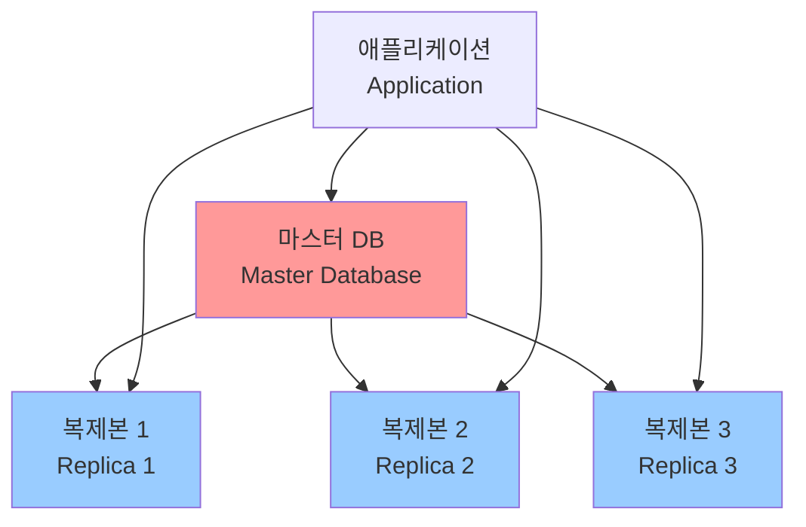

# 읽기 전용 복제본 활용 가이드 (Read-Only Replica Utilization Guide)

## 목차 (Table of Contents)
1. [복제본 개요 (Replica Overview)](#복제본-개요)
2. [MySQL 복제 설정 (MySQL Replication Setup)](#mysql-복제-설정)
3. [PostgreSQL 복제 설정 (PostgreSQL Replication Setup)](#postgresql-복제-설정)
4. [읽기/쓰기 분리 로직 (Read/Write Separation Logic)](#읽기쓰기-분리-로직)
5. [복제 지연 처리 방법 (Replication Lag Handling)](#복제-지연-처리-방법)
6. [로드 밸런싱 전략 (Load Balancing Strategy)](#로드-밸런싱-전략)
7. [Node.js ORM 예제 (Node.js ORM Examples)](#nodejs-orm-예제)
8. [모니터링 및 관리 (Monitoring and Management)](#모니터링-및-관리)

## 복제본 개요 (Replica Overview)

읽기 전용 복제본(Read-Only Replica)은 마스터 데이터베이스의 데이터를 복제하여 읽기 작업의 부하를 분산시키는 기술입니다.

### 복제본의 장점 (Benefits of Replicas)

- **성능 향상 (Performance)**: 읽기 작업 부하 분산
- **가용성 (Availability)**: 마스터 장애 시 백업 역할
- **확장성 (Scalability)**: 수평적 확장 가능
- **지역 분산 (Geographic Distribution)**: 지역별 데이터 접근 최적화

### 복제 아키텍처 (Replication Architecture)



## MySQL 복제 설정 (MySQL Replication Setup)

### 1. 마스터 서버 설정 (Master Server Configuration)

```sql
-- my.cnf 설정
[mysqld]
server-id = 1
log-bin = mysql-bin
binlog-format = ROW
gtid-mode = ON
enforce-gtid-consistency = ON

-- 복제용 사용자 생성
CREATE USER 'replica_user'@'%' IDENTIFIED BY 'replica_password';
GRANT REPLICATION SLAVE ON *.* TO 'replica_user'@'%';
FLUSH PRIVILEGES;

-- 바이너리 로그 상태 확인
SHOW MASTER STATUS;
```

### 2. 슬레이브 서버 설정 (Slave Server Configuration)

```sql
-- my.cnf 설정
[mysqld]
server-id = 2
relay-log = mysql-relay-bin
read-only = 1
gtid-mode = ON
enforce-gtid-consistency = ON

-- 복제 설정
CHANGE MASTER TO
  MASTER_HOST='master_host',
  MASTER_USER='replica_user',
  MASTER_PASSWORD='replica_password',
  MASTER_AUTO_POSITION=1;

-- 복제 시작
START SLAVE;

-- 복제 상태 확인
SHOW SLAVE STATUS\G
```

### 3. 자동 복구 설정 (Automatic Recovery Setup)

```sql
-- 슬레이브에서 자동 재시작 설정
SET GLOBAL slave_net_timeout = 60;
SET GLOBAL slave_parallel_workers = 4;
SET GLOBAL slave_preserve_commit_order = ON;
```

## PostgreSQL 복제 설정 (PostgreSQL Replication Setup)

### 1. 마스터 서버 설정 (Master Server Configuration)

```bash
# postgresql.conf 설정
wal_level = replica
max_wal_senders = 3
max_replication_slots = 3
hot_standby = on

# pg_hba.conf 설정
host replication replica_user 0.0.0.0/0 md5
```

```sql
-- 복제용 사용자 생성
CREATE USER replica_user WITH REPLICATION ENCRYPTED PASSWORD 'replica_password';

-- 복제 슬롯 생성
SELECT pg_create_physical_replication_slot('replica_slot');
```

### 2. 슬레이브 서버 설정 (Slave Server Configuration)

```bash
# 기본 백업 생성
pg_basebackup -h master_host -D /var/lib/postgresql/data -U replica_user -v -P -W

# recovery.conf 설정
standby_mode = 'on'
primary_conninfo = 'host=master_host port=5432 user=replica_user password=replica_password'
primary_slot_name = 'replica_slot'
```

## 읽기/쓰기 분리 로직 (Read/Write Separation Logic)

### 1. 기본 읽기/쓰기 분리 클래스 (Basic Read/Write Separation Class)

```javascript
const mysql = require('mysql2/promise');

class DatabaseRouter {
  constructor(config) {
    this.master = mysql.createPool({
      host: config.master.host,
      port: config.master.port,
      user: config.master.user,
      password: config.master.password,
      database: config.master.database,
      connectionLimit: 10
    });

    this.replicas = config.replicas.map(replica => 
      mysql.createPool({
        host: replica.host,
        port: replica.port,
        user: replica.user,
        password: replica.password,
        database: replica.database,
        connectionLimit: 5
      })
    );

    this.currentReplicaIndex = 0;
  }

  // 쓰기 작업 (마스터)
  async write(query, params = []) {
    try {
      const [rows] = await this.master.execute(query, params);
      return rows;
    } catch (error) {
      console.error('마스터 DB 쓰기 오류:', error);
      throw error;
    }
  }

  // 읽기 작업 (복제본)
  async read(query, params = []) {
    const replica = this.getNextReplica();
    
    try {
      const [rows] = await replica.execute(query, params);
      return rows;
    } catch (error) {
      console.error('복제본 DB 읽기 오류:', error);
      // 복제본 오류 시 마스터로 폴백
      return await this.master.execute(query, params);
    }
  }

  // 라운드 로빈으로 복제본 선택
  getNextReplica() {
    const replica = this.replicas[this.currentReplicaIndex];
    this.currentReplicaIndex = (this.currentReplicaIndex + 1) % this.replicas.length;
    return replica;
  }

  // 특정 복제본 선택
  getReplica(index) {
    if (index >= 0 && index < this.replicas.length) {
      return this.replicas[index];
    }
    throw new Error('유효하지 않은 복제본 인덱스');
  }
}
```

### 2. 트랜잭션 인식 읽기/쓰기 분리 (Transaction-Aware Read/Write Separation)

```javascript
class TransactionAwareRouter extends DatabaseRouter {
  constructor(config) {
    super(config);
    this.transactionConnections = new Map();
  }

  // 트랜잭션 시작
  async beginTransaction(sessionId) {
    const connection = await this.master.getConnection();
    await connection.beginTransaction();
    this.transactionConnections.set(sessionId, connection);
    return connection;
  }

  // 트랜잭션 내에서 읽기 (마스터에서 읽기)
  async readInTransaction(sessionId, query, params = []) {
    const connection = this.transactionConnections.get(sessionId);
    if (!connection) {
      throw new Error('트랜잭션이 시작되지 않았습니다');
    }

    const [rows] = await connection.execute(query, params);
    return rows;
  }

  // 트랜잭션 내에서 쓰기
  async writeInTransaction(sessionId, query, params = []) {
    const connection = this.transactionConnections.get(sessionId);
    if (!connection) {
      throw new Error('트랜잭션이 시작되지 않았습니다');
    }

    const [rows] = await connection.execute(query, params);
    return rows;
  }

  // 트랜잭션 커밋
  async commitTransaction(sessionId) {
    const connection = this.transactionConnections.get(sessionId);
    if (!connection) {
      throw new Error('트랜잭션이 시작되지 않았습니다');
    }

    await connection.commit();
    connection.release();
    this.transactionConnections.delete(sessionId);
  }

  // 트랜잭션 롤백
  async rollbackTransaction(sessionId) {
    const connection = this.transactionConnections.get(sessionId);
    if (!connection) {
      throw new Error('트랜잭션이 시작되지 않았습니다');
    }

    await connection.rollback();
    connection.release();
    this.transactionConnections.delete(sessionId);
  }
}
```

### 3. 세션 기반 읽기/쓰기 분리 (Session-Based Read/Write Separation)

```javascript
class SessionBasedRouter extends DatabaseRouter {
  constructor(config) {
    super(config);
    this.sessionStickyReplicas = new Map();
  }

  // 세션별 복제본 고정
  async readWithSession(sessionId, query, params = []) {
    let replica = this.sessionStickyReplicas.get(sessionId);
    
    if (!replica) {
      replica = this.getNextReplica();
      this.sessionStickyReplicas.set(sessionId, replica);
    }

    try {
      const [rows] = await replica.execute(query, params);
      return rows;
    } catch (error) {
      console.error('세션 복제본 오류:', error);
      // 복제본 오류 시 새 복제본 할당
      this.sessionStickyReplicas.delete(sessionId);
      return await this.read(query, params);
    }
  }

  // 세션 정리
  clearSession(sessionId) {
    this.sessionStickyReplicas.delete(sessionId);
  }
}
```

## 복제 지연 처리 방법 (Replication Lag Handling)

### 1. 복제 지연 모니터링 (Replication Lag Monitoring)

```javascript
class ReplicationLagMonitor {
  constructor(databaseRouter) {
    this.router = databaseRouter;
    this.lagThreshold = 5000; // 5초
    this.lagHistory = new Map();
  }

  // 복제 지연 확인
  async checkReplicationLag() {
    const lagInfo = await Promise.all(
      this.router.replicas.map(async (replica, index) => {
        try {
          // MySQL의 경우
          const [rows] = await replica.execute('SHOW SLAVE STATUS');
          const lag = rows[0] ? rows[0].Seconds_Behind_Master * 1000 : 0;
          
          return {
            replicaIndex: index,
            lag: lag,
            status: lag < this.lagThreshold ? 'healthy' : 'lagging'
          };
        } catch (error) {
          return {
            replicaIndex: index,
            lag: Infinity,
            status: 'error',
            error: error.message
          };
        }
      })
    );

    return lagInfo;
  }

  // 지연 이력 기록
  recordLagHistory(lagInfo) {
    const timestamp = Date.now();
    lagInfo.forEach(info => {
      if (!this.lagHistory.has(info.replicaIndex)) {
        this.lagHistory.set(info.replicaIndex, []);
      }
      
      const history = this.lagHistory.get(info.replicaIndex);
      history.push({ timestamp, lag: info.lag });
      
      // 최근 100개 기록만 유지
      if (history.length > 100) {
        history.shift();
      }
    });
  }

  // 평균 지연 시간 계산
  getAverageLag(replicaIndex, timeWindow = 300000) { // 5분
    const history = this.lagHistory.get(replicaIndex) || [];
    const now = Date.now();
    const recentHistory = history.filter(h => now - h.timestamp < timeWindow);
    
    if (recentHistory.length === 0) return 0;
    
    const totalLag = recentHistory.reduce((sum, h) => sum + h.lag, 0);
    return totalLag / recentHistory.length;
  }
}
```

### 2. 지연 인식 읽기 라우팅 (Lag-Aware Read Routing)

```javascript
class LagAwareRouter extends DatabaseRouter {
  constructor(config) {
    super(config);
    this.lagMonitor = new ReplicationLagMonitor(this);
    this.lagThreshold = 5000; // 5초
    this.startLagMonitoring();
  }

  // 지연 모니터링 시작
  startLagMonitoring() {
    setInterval(async () => {
      const lagInfo = await this.lagMonitor.checkReplicationLag();
      this.lagMonitor.recordLagHistory(lagInfo);
    }, 10000); // 10초마다 체크
  }

  // 지연을 고려한 읽기
  async readWithLagAwareness(query, params = []) {
    const lagInfo = await this.lagMonitor.checkReplicationLag();
    const healthyReplicas = lagInfo.filter(info => 
      info.status === 'healthy' && info.lag < this.lagThreshold
    );

    if (healthyReplicas.length === 0) {
      console.log('모든 복제본이 지연 중이므로 마스터에서 읽기');
      return await this.master.execute(query, params);
    }

    // 가장 지연이 적은 복제본 선택
    const bestReplica = healthyReplicas.reduce((best, current) => 
      current.lag < best.lag ? current : best
    );

    const replica = this.getReplica(bestReplica.replicaIndex);
    const [rows] = await replica.execute(query, params);
    return rows;
  }

  // 강제 마스터 읽기 (최신 데이터 필요)
  async readFromMaster(query, params = []) {
    const [rows] = await this.master.execute(query, params);
    return rows;
  }
}
```

### 3. 일관성 보장 읽기 (Consistency-Guaranteed Read)

```javascript
class ConsistencyAwareRouter extends LagAwareRouter {
  constructor(config) {
    super(config);
    this.writeTimestamps = new Map();
  }

  // 쓰기 타임스탬프 기록
  async write(query, params = []) {
    const result = await super.write(query, params);
    this.writeTimestamps.set(Date.now(), true);
    return result;
  }

  // 일관성 보장 읽기
  async readWithConsistency(query, params = [], maxLag = 1000) {
    const lastWriteTime = Math.max(...this.writeTimestamps.keys());
    const currentTime = Date.now();
    const timeSinceLastWrite = currentTime - lastWriteTime;

    // 최근 쓰기가 있었고 지연이 허용 범위를 초과하면 마스터에서 읽기
    if (timeSinceLastWrite < maxLag) {
      console.log('최근 쓰기로 인해 마스터에서 읽기');
      return await this.readFromMaster(query, params);
    }

    // 일반적인 지연 인식 읽기
    return await this.readWithLagAwareness(query, params);
  }
}
```

## 로드 밸런싱 전략 (Load Balancing Strategy)

### 1. 가중치 기반 로드 밸런싱 (Weighted Load Balancing)

```javascript
class WeightedLoadBalancer {
  constructor(replicas, weights) {
    this.replicas = replicas;
    this.weights = weights || replicas.map(() => 1);
    this.currentWeights = [...this.weights];
    this.currentIndex = 0;
  }

  // 가중치 기반 복제본 선택
  getNextReplica() {
    let totalWeight = 0;
    let selectedIndex = 0;

    // 현재 가중치 계산
    for (let i = 0; i < this.currentWeights.length; i++) {
      totalWeight += this.currentWeights[i];
    }

    // 가중치 기반 선택
    let random = Math.random() * totalWeight;
    for (let i = 0; i < this.currentWeights.length; i++) {
      random -= this.currentWeights[i];
      if (random <= 0) {
        selectedIndex = i;
        break;
      }
    }

    // 선택된 복제본의 가중치 감소
    this.currentWeights[selectedIndex] = Math.max(0, this.currentWeights[selectedIndex] - 1);

    // 모든 가중치가 0이 되면 초기화
    if (this.currentWeights.every(w => w === 0)) {
      this.currentWeights = [...this.weights];
    }

    return this.replicas[selectedIndex];
  }

  // 복제본 상태에 따른 가중치 조정
  adjustWeight(replicaIndex, isHealthy) {
    if (isHealthy) {
      this.weights[replicaIndex] = Math.min(this.weights[replicaIndex] + 1, 10);
    } else {
      this.weights[replicaIndex] = Math.max(this.weights[replicaIndex] - 1, 0);
    }
  }
}
```

### 2. 응답 시간 기반 로드 밸런싱 (Response Time-Based Load Balancing)

```javascript
class ResponseTimeBalancer {
  constructor(replicas) {
    this.replicas = replicas;
    this.responseTimes = new Map();
    this.requestCounts = new Map();
    
    // 초기화
    replicas.forEach((_, index) => {
      this.responseTimes.set(index, []);
      this.requestCounts.set(index, 0);
    });
  }

  // 응답 시간 기록
  recordResponseTime(replicaIndex, responseTime) {
    const times = this.responseTimes.get(replicaIndex);
    times.push(responseTime);
    
    // 최근 100개 기록만 유지
    if (times.length > 100) {
      times.shift();
    }
  }

  // 평균 응답 시간 계산
  getAverageResponseTime(replicaIndex) {
    const times = this.responseTimes.get(replicaIndex);
    if (times.length === 0) return 0;
    
    const sum = times.reduce((acc, time) => acc + time, 0);
    return sum / times.length;
  }

  // 최적 복제본 선택
  getBestReplica() {
    let bestIndex = 0;
    let bestScore = Infinity;

    for (let i = 0; i < this.replicas.length; i++) {
      const avgResponseTime = this.getAverageResponseTime(i);
      const requestCount = this.requestCounts.get(i);
      
      // 응답 시간과 요청 수를 고려한 점수 계산
      const score = avgResponseTime * (1 + requestCount * 0.1);
      
      if (score < bestScore) {
        bestScore = score;
        bestIndex = i;
      }
    }

    // 요청 수 증가
    this.requestCounts.set(bestIndex, this.requestCounts.get(bestIndex) + 1);
    
    return this.replicas[bestIndex];
  }

  // 요청 완료 처리
  completeRequest(replicaIndex, responseTime) {
    this.recordResponseTime(replicaIndex, responseTime);
    this.requestCounts.set(replicaIndex, Math.max(0, this.requestCounts.get(replicaIndex) - 1));
  }
}
```

## Node.js ORM 예제 (Node.js ORM Examples)

### 1. Sequelize를 사용한 읽기/쓰기 분리 (Sequelize Read/Write Separation)

```javascript
const { Sequelize } = require('sequelize');

class SequelizeRouter {
  constructor(config) {
    // 마스터 연결
    this.master = new Sequelize({
      host: config.master.host,
      port: config.master.port,
      username: config.master.user,
      password: config.master.password,
      database: config.master.database,
      dialect: 'mysql',
      pool: {
        max: 10,
        min: 0,
        acquire: 30000,
        idle: 10000
      }
    });

    // 복제본 연결들
    this.replicas = config.replicas.map(replica => 
      new Sequelize({
        host: replica.host,
        port: replica.port,
        username: replica.user,
        password: replica.password,
        database: replica.database,
        dialect: 'mysql',
        pool: {
          max: 5,
          min: 0,
          acquire: 30000,
          idle: 10000
        }
      })
    );

    this.currentReplicaIndex = 0;
  }

  // 쓰기 작업
  async write(operation) {
    return await operation(this.master);
  }

  // 읽기 작업
  async read(operation) {
    const replica = this.getNextReplica();
    return await operation(replica);
  }

  // 다음 복제본 선택
  getNextReplica() {
    const replica = this.replicas[this.currentReplicaIndex];
    this.currentReplicaIndex = (this.currentReplicaIndex + 1) % this.replicas.length;
    return replica;
  }
}

// 사용 예제
const router = new SequelizeRouter({
  master: {
    host: 'master-db.example.com',
    port: 3306,
    user: 'root',
    password: 'password',
    database: 'myapp'
  },
  replicas: [
    {
      host: 'replica1-db.example.com',
      port: 3306,
      user: 'readonly',
      password: 'password',
      database: 'myapp'
    },
    {
      host: 'replica2-db.example.com',
      port: 3306,
      user: 'readonly',
      password: 'password',
      database: 'myapp'
    }
  ]
});

// 사용자 모델 정의
const User = router.master.define('User', {
  id: {
    type: Sequelize.INTEGER,
    primaryKey: true,
    autoIncrement: true
  },
  name: {
    type: Sequelize.STRING,
    allowNull: false
  },
  email: {
    type: Sequelize.STRING,
    allowNull: false,
    unique: true
  }
});

// 사용자 생성 (쓰기)
async function createUser(userData) {
  return await router.write(async (db) => {
    return await User.create(userData);
  });
}

// 사용자 조회 (읽기)
async function getUser(userId) {
  return await router.read(async (db) => {
    return await User.findByPk(userId);
  });
}

// 모든 사용자 조회 (읽기)
async function getAllUsers() {
  return await router.read(async (db) => {
    return await User.findAll();
  });
}
```

### 2. TypeORM을 사용한 읽기/쓰기 분리 (TypeORM Read/Write Separation)

```javascript
const { createConnection, getConnection } = require('typeorm');

class TypeORMRouter {
  constructor() {
    this.masterConnection = null;
    this.replicaConnections = [];
    this.currentReplicaIndex = 0;
  }

  // 연결 초기화
  async initialize(config) {
    // 마스터 연결
    this.masterConnection = await createConnection({
      name: 'master',
      type: 'mysql',
      host: config.master.host,
      port: config.master.port,
      username: config.master.user,
      password: config.master.password,
      database: config.master.database,
      entities: config.entities,
      synchronize: false,
      logging: false
    });

    // 복제본 연결들
    for (let i = 0; i < config.replicas.length; i++) {
      const replica = config.replicas[i];
      const connection = await createConnection({
        name: `replica_${i}`,
        type: 'mysql',
        host: replica.host,
        port: replica.port,
        username: replica.user,
        password: replica.password,
        database: replica.database,
        entities: config.entities,
        synchronize: false,
        logging: false
      });
      
      this.replicaConnections.push(connection);
    }
  }

  // 쓰기 작업
  async write(operation) {
    const connection = getConnection('master');
    return await operation(connection);
  }

  // 읽기 작업
  async read(operation) {
    const connection = this.getNextReplica();
    return await operation(connection);
  }

  // 다음 복제본 선택
  getNextReplica() {
    const connection = this.replicaConnections[this.currentReplicaIndex];
    this.currentReplicaIndex = (this.currentReplicaIndex + 1) % this.replicaConnections.length;
    return connection;
  }
}

// 사용 예제
const router = new TypeORMRouter();

// 엔티티 정의
const User = {
  name: 'User',
  columns: {
    id: {
      primary: true,
      type: 'int',
      generated: true
    },
    name: {
      type: 'varchar',
      length: 255
    },
    email: {
      type: 'varchar',
      length: 255,
      unique: true
    }
  }
};

// 초기화
await router.initialize({
  master: {
    host: 'master-db.example.com',
    port: 3306,
    user: 'root',
    password: 'password',
    database: 'myapp'
  },
  replicas: [
    {
      host: 'replica1-db.example.com',
      port: 3306,
      user: 'readonly',
      password: 'password',
      database: 'myapp'
    }
  ],
  entities: [User]
});

// 사용자 생성 (쓰기)
async function createUser(userData) {
  return await router.write(async (connection) => {
    const userRepository = connection.getRepository('User');
    const user = userRepository.create(userData);
    return await userRepository.save(user);
  });
}

// 사용자 조회 (읽기)
async function getUser(userId) {
  return await router.read(async (connection) => {
    const userRepository = connection.getRepository('User');
    return await userRepository.findOne(userId);
  });
}
```

### 3. Prisma를 사용한 읽기/쓰기 분리 (Prisma Read/Write Separation)

```javascript
const { PrismaClient } = require('@prisma/client');

class PrismaRouter {
  constructor(config) {
    // 마스터 클라이언트
    this.master = new PrismaClient({
      datasources: {
        db: {
          url: `mysql://${config.master.user}:${config.master.password}@${config.master.host}:${config.master.port}/${config.master.database}`
        }
      }
    });

    // 복제본 클라이언트들
    this.replicas = config.replicas.map(replica => 
      new PrismaClient({
        datasources: {
          db: {
            url: `mysql://${replica.user}:${replica.password}@${replica.host}:${replica.port}/${replica.database}`
          }
        }
      })
    );

    this.currentReplicaIndex = 0;
  }

  // 쓰기 작업
  async write(operation) {
    return await operation(this.master);
  }

  // 읽기 작업
  async read(operation) {
    const replica = this.getNextReplica();
    return await operation(replica);
  }

  // 다음 복제본 선택
  getNextReplica() {
    const replica = this.replicas[this.currentReplicaIndex];
    this.currentReplicaIndex = (this.currentReplicaIndex + 1) % this.replicas.length;
    return replica;
  }

  // 연결 종료
  async disconnect() {
    await this.master.$disconnect();
    await Promise.all(this.replicas.map(replica => replica.$disconnect()));
  }
}

// 사용 예제
const router = new PrismaRouter({
  master: {
    host: 'master-db.example.com',
    port: 3306,
    user: 'root',
    password: 'password',
    database: 'myapp'
  },
  replicas: [
    {
      host: 'replica1-db.example.com',
      port: 3306,
      user: 'readonly',
      password: 'password',
      database: 'myapp'
    }
  ]
});

// 사용자 생성 (쓰기)
async function createUser(userData) {
  return await router.write(async (client) => {
    return await client.user.create({
      data: userData
    });
  });
}

// 사용자 조회 (읽기)
async function getUser(userId) {
  return await router.read(async (client) => {
    return await client.user.findUnique({
      where: { id: userId }
    });
  });
}

// 사용자 목록 조회 (읽기)
async function getUsers() {
  return await router.read(async (client) => {
    return await client.user.findMany();
  });
}
```

## 모니터링 및 관리 (Monitoring and Management)

### 1. 복제 상태 모니터링 (Replication Status Monitoring)

```javascript
class ReplicationMonitor {
  constructor(databaseRouter) {
    this.router = databaseRouter;
    this.monitoringInterval = null;
    this.statusHistory = [];
  }

  // 모니터링 시작
  startMonitoring(interval = 30000) {
    this.monitoringInterval = setInterval(async () => {
      await this.checkReplicationStatus();
    }, interval);
  }

  // 모니터링 중지
  stopMonitoring() {
    if (this.monitoringInterval) {
      clearInterval(this.monitoringInterval);
      this.monitoringInterval = null;
    }
  }

  // 복제 상태 확인
  async checkReplicationStatus() {
    const timestamp = Date.now();
    const status = {
      timestamp,
      master: await this.checkMasterStatus(),
      replicas: await this.checkReplicasStatus()
    };

    this.statusHistory.push(status);
    
    // 최근 100개 기록만 유지
    if (this.statusHistory.length > 100) {
      this.statusHistory.shift();
    }

    return status;
  }

  // 마스터 상태 확인
  async checkMasterStatus() {
    try {
      const [rows] = await this.router.master.execute('SHOW MASTER STATUS');
      return {
        status: 'healthy',
        binlogFile: rows[0]?.File,
        binlogPosition: rows[0]?.Position
      };
    } catch (error) {
      return {
        status: 'error',
        error: error.message
      };
    }
  }

  // 복제본 상태 확인
  async checkReplicasStatus() {
    const replicaStatuses = await Promise.all(
      this.router.replicas.map(async (replica, index) => {
        try {
          const [rows] = await replica.execute('SHOW SLAVE STATUS');
          const slaveStatus = rows[0];
          
          return {
            replicaIndex: index,
            status: slaveStatus?.Slave_IO_Running === 'Yes' && slaveStatus?.Slave_SQL_Running === 'Yes' ? 'healthy' : 'error',
            lag: slaveStatus?.Seconds_Behind_Master || 0,
            ioRunning: slaveStatus?.Slave_IO_Running,
            sqlRunning: slaveStatus?.Slave_SQL_Running,
            lastError: slaveStatus?.Last_Error
          };
        } catch (error) {
          return {
            replicaIndex: index,
            status: 'error',
            error: error.message
          };
        }
      })
    );

    return replicaStatuses;
  }

  // 상태 이력 조회
  getStatusHistory(timeWindow = 3600000) { // 1시간
    const now = Date.now();
    return this.statusHistory.filter(status => now - status.timestamp < timeWindow);
  }

  // 평균 지연 시간 계산
  getAverageLag(timeWindow = 3600000) {
    const history = this.getStatusHistory(timeWindow);
    if (history.length === 0) return 0;

    const totalLag = history.reduce((sum, status) => {
      const replicaLags = status.replicas
        .filter(r => r.status === 'healthy')
        .map(r => r.lag || 0);
      
      return sum + (replicaLags.length > 0 ? replicaLags.reduce((a, b) => a + b, 0) / replicaLags.length : 0);
    }, 0);

    return totalLag / history.length;
  }
}
```

### 2. 자동 장애 복구 (Automatic Failover)

```javascript
class AutomaticFailover {
  constructor(databaseRouter, replicationMonitor) {
    this.router = databaseRouter;
    this.monitor = replicationMonitor;
    this.failedReplicas = new Set();
    this.retryAttempts = new Map();
    this.maxRetries = 3;
  }

  // 장애 복구 시작
  startFailover() {
    this.monitor.startMonitoring(10000); // 10초마다 체크
    
    // 상태 체크 이벤트 리스너
    setInterval(async () => {
      await this.handleFailover();
    }, 15000); // 15초마다 장애 처리
  }

  // 장애 처리
  async handleFailover() {
    const status = await this.monitor.checkReplicationStatus();
    
    // 복제본 장애 처리
    status.replicas.forEach(replica => {
      if (replica.status === 'error' && !this.failedReplicas.has(replica.replicaIndex)) {
        this.handleReplicaFailure(replica);
      } else if (replica.status === 'healthy' && this.failedReplicas.has(replica.replicaIndex)) {
        this.handleReplicaRecovery(replica);
      }
    });
  }

  // 복제본 장애 처리
  handleReplicaFailure(replica) {
    console.log(`복제본 ${replica.replicaIndex} 장애 감지`);
    this.failedReplicas.add(replica.replicaIndex);
    this.retryAttempts.set(replica.replicaIndex, 0);
    
    // 재시도 스케줄링
    this.scheduleRetry(replica.replicaIndex);
  }

  // 복제본 복구 처리
  handleReplicaRecovery(replica) {
    console.log(`복제본 ${replica.replicaIndex} 복구 완료`);
    this.failedReplicas.delete(replica.replicaIndex);
    this.retryAttempts.delete(replica.replicaIndex);
  }

  // 재시도 스케줄링
  scheduleRetry(replicaIndex) {
    const retryCount = this.retryAttempts.get(replicaIndex) || 0;
    
    if (retryCount >= this.maxRetries) {
      console.log(`복제본 ${replicaIndex} 최대 재시도 횟수 초과`);
      return;
    }

    const delay = Math.min(1000 * Math.pow(2, retryCount), 30000); // 최대 30초
    
    setTimeout(async () => {
      await this.retryReplica(replicaIndex);
    }, delay);
  }

  // 복제본 재시도
  async retryReplica(replicaIndex) {
    try {
      const replica = this.router.replicas[replicaIndex];
      await replica.execute('SELECT 1');
      
      // 성공 시 장애 목록에서 제거
      this.failedReplicas.delete(replicaIndex);
      this.retryAttempts.delete(replicaIndex);
      
      console.log(`복제본 ${replicaIndex} 재시도 성공`);
    } catch (error) {
      const retryCount = this.retryAttempts.get(replicaIndex) + 1;
      this.retryAttempts.set(replicaIndex, retryCount);
      
      console.log(`복제본 ${replicaIndex} 재시도 실패 (${retryCount}/${this.maxRetries})`);
      this.scheduleRetry(replicaIndex);
    }
  }

  // 건강한 복제본만 사용하는 읽기
  async readFromHealthyReplicas(query, params = []) {
    const healthyReplicas = this.router.replicas
      .map((replica, index) => ({ replica, index }))
      .filter(({ index }) => !this.failedReplicas.has(index));

    if (healthyReplicas.length === 0) {
      console.log('모든 복제본이 장애 상태이므로 마스터에서 읽기');
      return await this.router.master.execute(query, params);
    }

    // 라운드 로빈으로 선택
    const selectedReplica = healthyReplicas[Math.floor(Math.random() * healthyReplicas.length)];
    
    try {
      return await selectedReplica.replica.execute(query, params);
    } catch (error) {
      console.error(`복제본 ${selectedReplica.index} 읽기 오류:`, error);
      this.handleReplicaFailure({ replicaIndex: selectedReplica.index, status: 'error' });
      throw error;
    }
  }
}
```

## 결론 (Conclusion)

읽기 전용 복제본을 활용하면 데이터베이스의 성능과 가용성을 크게 향상시킬 수 있습니다. 올바른 구현과 모니터링을 통해 안정적이고 확장 가능한 시스템을 구축할 수 있습니다.

### 주요 포인트 (Key Points)

1. **복제 설정**: MySQL/PostgreSQL 복제 환경 구축
2. **읽기/쓰기 분리**: 효율적인 트래픽 분산
3. **지연 처리**: 복제 지연 모니터링 및 대응
4. **로드 밸런싱**: 다양한 부하 분산 전략
5. **ORM 통합**: Sequelize, TypeORM, Prisma 활용
6. **모니터링**: 지속적인 상태 모니터링 및 자동 복구

적절한 복제본 활용을 통해 높은 성능과 가용성을 가진 데이터베이스 시스템을 구축할 수 있습니다.
