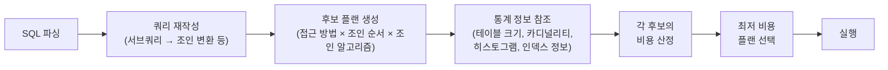
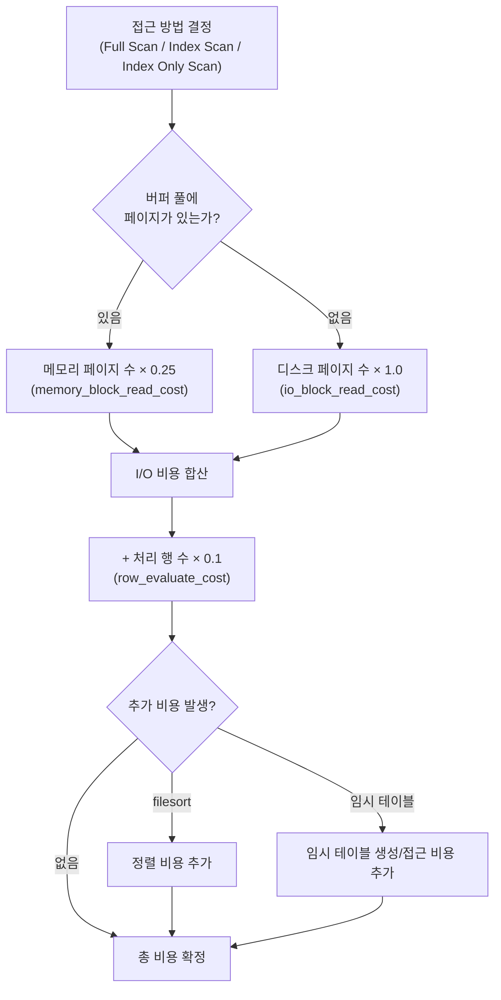
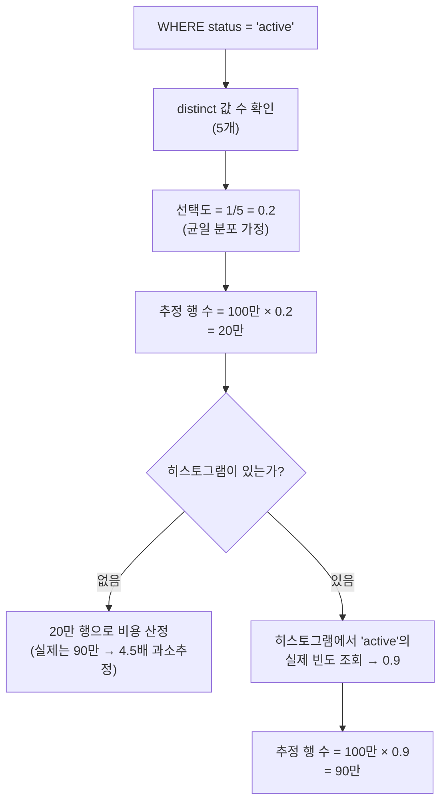
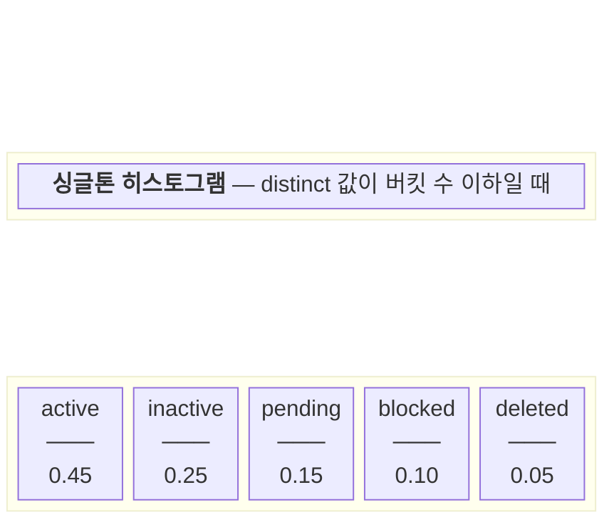
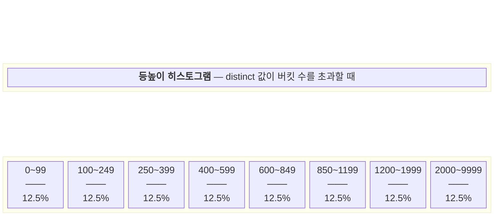
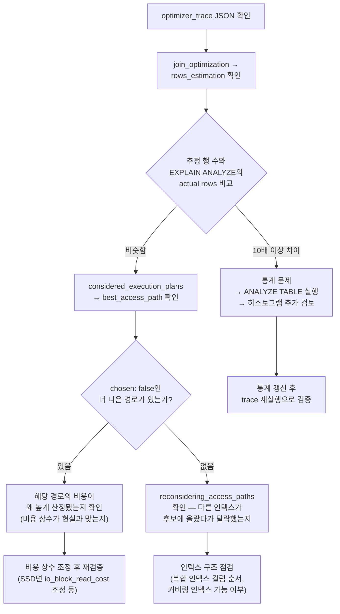

# 데이터베이스 옵티마이저

## 옵티마이저가 하는 일

SQL은 선언형 언어다. "무엇을 원하는지"만 쓰고, "어떻게 가져올지"는 옵티마이저가 결정한다. 테이블 3개를 조인하는 쿼리 하나가 들어오면, 조인 순서만 해도 3! = 6가지, 여기에 접근 방법(풀 스캔, 인덱스 스캔, 인덱스 온리 스캔)과 조인 알고리즘(Nested Loop, Hash Join, Merge Join)의 조합까지 고려하면 수십~수백 개의 실행 계획 후보가 나온다. 옵티마이저는 이 후보들의 비용을 추정하고, 가장 낮은 비용의 계획을 선택한다.

핵심은 **추정**이라는 점이다. 옵티마이저는 실제로 쿼리를 실행해보지 않는다. 통계 정보를 기반으로 비용을 계산하기 때문에, 통계가 부정확하면 잘못된 플랜을 선택한다. 실무에서 발생하는 대부분의 쿼리 성능 문제는 여기서 시작된다.

### SQL → 실행 계획까지의 흐름



파싱 → 재작성 → 플랜 생성 → 비용 비교 → 실행 순서로 진행된다. 비용 산정 단계에서 통계 정보를 참조하기 때문에, 통계가 낡아 있으면 그 이후 과정이 전부 잘못된 전제 위에서 돌아간다.


## 비용 모델(Cost Model)

### I/O 비용

디스크에서 페이지를 읽는 횟수를 기준으로 산정한다. 옵티마이저는 테이블의 전체 페이지 수, 인덱스의 depth, 리프 노드 수를 참고해서 각 접근 방법별 I/O 횟수를 추정한다.

MySQL 8.0의 비용 모델에서 디스크 I/O 비용의 기본 단위는 `io_block_read_cost = 1.0`이다. 메모리에 있는 페이지를 읽는 비용은 `memory_block_read_cost = 0.25`로 설정되어 있다. 이 값은 `mysql.engine_cost` 테이블에서 확인하고 변경할 수 있다.

```sql
-- MySQL 비용 상수 확인
SELECT * FROM mysql.engine_cost;
SELECT * FROM mysql.server_cost;
```

PostgreSQL은 `seq_page_cost = 1.0`, `random_page_cost = 4.0`이 기본값이다. 순차 읽기 대비 랜덤 읽기가 4배 비싸다고 가정한다. SSD를 쓰고 있다면 `random_page_cost`를 1.1~1.5 정도로 낮추는 경우가 많다.

```sql
-- PostgreSQL 비용 파라미터 확인
SHOW seq_page_cost;
SHOW random_page_cost;

-- 세션 레벨에서 변경
SET random_page_cost = 1.1;
```

### CPU 비용

행 하나를 처리하는 비용, 인덱스 엔트리를 비교하는 비용으로 산정한다. MySQL에서는 `row_evaluate_cost = 0.1`, PostgreSQL에서는 `cpu_tuple_cost = 0.01`, `cpu_index_tuple_cost = 0.005`, `cpu_operator_cost = 0.0025`가 기본값이다.

WHERE 절의 필터 조건이 많을수록, 정렬이 추가될수록 CPU 비용이 올라간다. I/O 비용에 비하면 CPU 비용의 비중은 상대적으로 작지만, 인메모리 테이블이나 이미 버퍼 풀에 올라간 데이터를 다룰 때는 CPU 비용이 플랜 선택을 좌우하기도 한다.

### 총 비용 산정

```
총 비용 = (디스크 페이지 수 × io_block_read_cost)
        + (메모리 페이지 수 × memory_block_read_cost)
        + (처리 행 수 × row_evaluate_cost)
```

이건 단순화한 공식이고, 실제로는 조인 버퍼 사용 여부, 임시 테이블 생성, 파일 정렬(filesort) 발생 등 추가 요소가 반영된다. 중요한 건 이 비용이 절대적인 시간 단위가 아니라 **상대적 비교를 위한 수치**라는 점이다. cost 5000이 cost 1000보다 5배 느린 건 아니다.

### 비용 산정 흐름

아래는 MySQL 기준 하나의 접근 경로에 대한 비용 산정 과정이다.



SSD 환경에서는 `io_block_read_cost`와 `memory_block_read_cost`의 차이가 줄어든다. PostgreSQL에서 `random_page_cost`를 1.1로 낮추는 것도 같은 맥락이다.


## 카디널리티 추정

카디널리티(Cardinality)는 특정 연산의 결과 행 수를 의미한다. 옵티마이저가 내리는 모든 판단의 기초가 된다.

### 선택도(Selectivity) 계산

옵티마이저는 조건절의 선택도를 먼저 구한다. `WHERE status = 'active'`라는 조건이 있을 때, status 컬럼에 distinct 값이 5개이면 선택도는 1/5 = 0.2로 추정한다. 테이블 행 수가 100만이면, 결과 행 수는 100만 × 0.2 = 20만으로 추정하는 식이다.

문제는 이게 균일 분포(uniform distribution)를 가정한다는 점이다. status 값이 `active: 90만, inactive: 5만, pending: 3만, blocked: 1만, deleted: 1만`으로 분포되어 있다면, `status = 'active'`의 실제 선택도는 0.9인데 옵티마이저는 0.2로 추정한다. 이런 **데이터 편향(skew)**이 잘못된 플랜 선택의 가장 흔한 원인이다.



히스토그램 없이 균일 분포로 추정하면, 편향된 데이터에서 실제와 큰 차이가 나는 것을 볼 수 있다. 이 오차가 인덱스 스캔 vs 풀 스캔 판단을 뒤집는다.

### 복합 조건의 추정

```sql
WHERE status = 'active' AND city = 'Seoul'
```

두 조건이 독립적이라고 가정하고 선택도를 곱한다. status 선택도 0.2 × city 선택도 0.01 = 0.002. 그런데 실제로는 서울에 active 사용자가 집중되어 있다면, 실제 선택도는 훨씬 높다. 컬럼 간 상관관계(correlation)를 옵티마이저는 기본적으로 고려하지 않는다.

PostgreSQL 10부터 `CREATE STATISTICS`로 다중 컬럼 통계를 생성할 수 있다.

```sql
-- 다중 컬럼 상관관계 통계 생성
CREATE STATISTICS stat_status_city (dependencies)
ON status, city FROM users;

ANALYZE users;
```

MySQL은 이런 기능이 없어서, 복합 인덱스를 만들면 인덱스 다이브(index dive)를 통해 실제 범위의 행 수를 직접 세는 방식으로 보완한다. `eq_range_index_dive_limit` 설정값보다 IN 목록의 값이 적으면 인덱스 다이브를, 많으면 인덱스 통계를 사용한다.


## 히스토그램과 통계 정보

### MySQL의 통계 체계

MySQL InnoDB는 두 가지 레벨의 통계를 관리한다.

**영구 통계(persistent statistics)**가 기본이다. `innodb_stats_persistent = ON`이면 `ANALYZE TABLE` 실행 시 `mysql.innodb_table_stats`, `mysql.innodb_index_stats` 테이블에 저장된다.

```sql
-- 테이블 통계 확인
SELECT * FROM mysql.innodb_table_stats WHERE table_name = 'orders';

-- 인덱스 통계 확인
SELECT * FROM mysql.innodb_index_stats
WHERE table_name = 'orders' AND stat_name = 'n_diff_pfx01';
```

`innodb_stats_persistent_sample_pages`는 통계를 수집할 때 샘플링하는 페이지 수다. 기본값 20인데, 대용량 테이블에서는 적은 샘플링이 부정확한 통계로 이어진다. 테이블 단위로 조정할 수 있다.

```sql
ALTER TABLE orders STATS_SAMPLE_PAGES = 100;
ANALYZE TABLE orders;
```

**히스토그램**은 MySQL 8.0에서 추가됐다. 인덱스가 없는 컬럼의 값 분포를 저장한다.

```sql
ANALYZE TABLE orders UPDATE HISTOGRAM ON status WITH 100 BUCKETS;

-- 히스토그램 확인
SELECT JSON_PRETTY(histogram)
FROM information_schema.column_statistics
WHERE table_name = 'orders' AND column_name = 'status';
```

싱글톤 히스토그램(distinct 값이 적을 때)과 등높이 히스토그램(값이 많을 때) 두 종류가 자동 선택된다. 히스토그램이 있으면 데이터 편향 문제를 상당히 완화할 수 있다.

#### 싱글톤 히스토그램 vs 등높이 히스토그램



**싱글톤 히스토그램**: 각 distinct 값마다 버킷 하나를 배정하고, 해당 값의 정확한 빈도를 저장한다. `status` 컬럼처럼 값 종류가 적은 경우에 선택된다. `WHERE status = 'active'`에 대해 정확히 선택도 0.45를 사용할 수 있다.



**등높이 히스토그램**: 전체 데이터를 행 수가 동일한 버킷으로 나눈다. `amount` 컬럼처럼 값 종류가 많으면 이쪽이 선택된다. 각 버킷의 행 수는 같지만 값 범위는 다르다. 위 예시에서 마지막 버킷(2000~9999)은 범위가 넓은데 행 수는 같다 — 이 구간에 데이터가 희소하다는 뜻이다. 범위 조건(`WHERE amount BETWEEN 100 AND 400`) 추정 시 버킷 경계를 기준으로 비율을 계산한다.

### PostgreSQL의 통계 체계

PostgreSQL은 `pg_statistic` 카탈로그(사람이 읽기 쉬운 뷰는 `pg_stats`)에 통계를 저장한다.

```sql
SELECT tablename, attname, null_frac, n_distinct,
       most_common_vals, most_common_freqs, histogram_bounds
FROM pg_stats
WHERE tablename = 'orders' AND attname = 'status';
```

각 필드의 의미:

- `null_frac`: NULL 비율
- `n_distinct`: distinct 값 수. 음수면 비율(예: -0.5는 행 수의 50%가 고유값)
- `most_common_vals`: 가장 빈번한 값 목록
- `most_common_freqs`: 각 값의 빈도
- `histogram_bounds`: MCV에 포함되지 않은 값들의 등높이 히스토그램

PostgreSQL은 자동으로 히스토그램을 관리하고, `default_statistics_target`(기본 100)으로 히스토그램 버킷 수를 제어한다.

```sql
-- 특정 컬럼의 통계 상세도를 높이기
ALTER TABLE orders ALTER COLUMN status SET STATISTICS 500;
ANALYZE orders;
```

autovacuum 데몬이 자동으로 `ANALYZE`를 실행하지만, 대량 데이터 변경 직후에는 수동으로 돌려야 한다. `INSERT`/`UPDATE`/`DELETE`가 테이블 행 수의 10% + 50행을 넘으면 자동 ANALYZE가 트리거된다.


## 옵티마이저가 틀리는 경우

### 통계 미갱신

가장 많이 겪는 케이스다. 대량 배치 INSERT 직후 통계가 갱신되기 전에 쿼리가 실행되면, 옵티마이저는 이전 데이터 분포 기준으로 플랜을 세운다. 테이블에 1000만 행이 추가됐는데 옵티마이저는 여전히 100만 행 기준으로 비용을 계산하는 상황이 발생한다.

```sql
-- 배치 작업 후 반드시 통계 갱신
-- MySQL
ANALYZE TABLE orders;

-- PostgreSQL
ANALYZE orders;
```

### 데이터 편향(Skew)

앞서 설명한 것처럼 특정 값에 데이터가 몰려 있는 경우다. 주문 테이블에서 `status = 'completed'`가 95%를 차지하는데, 옵티마이저가 히스토그램 없이 균일 분포로 추정하면 인덱스 스캔을 선택할 수 있다. 95%를 인덱스로 읽으면 풀 스캔보다 느리다.

### 파라미터 스니핑(Parameter Sniffing)

SQL Server와 Oracle에서 주로 발생한다. Prepared Statement의 첫 번째 실행 시 바인딩된 파라미터 값으로 플랜을 생성하고, 이후 실행에서도 동일한 플랜을 재사용한다.

```sql
-- 첫 실행: user_id = 1 (주문 3건)
-- → Nested Loop + Index Seek 선택
EXEC sp_get_orders @user_id = 1;

-- 이후 실행: user_id = 99999 (주문 50만 건)
-- → 여전히 Nested Loop + Index Seek 사용 → 매우 느림
EXEC sp_get_orders @user_id = 99999;
```

MySQL은 프리페어드 스테이트먼트마다 매번 플랜을 생성하기 때문에 이 문제가 거의 없다. PostgreSQL은 `plan_cache_mode` 설정으로 제어하며, 5번 실행 후 generic plan이 custom plan보다 비용이 높지 않으면 generic plan으로 전환한다.

### 상관 서브쿼리의 카디널리티 오추정

```sql
SELECT * FROM orders o
WHERE o.amount > (
    SELECT AVG(amount) FROM orders WHERE customer_id = o.customer_id
);
```

옵티마이저가 서브쿼리 결과의 행 수를 제대로 추정하지 못하는 경우가 있다. 특히 서브쿼리 결과와 외부 쿼리의 필터 조건이 겹치면 카디널리티 추정이 크게 벗어난다.

### 조인 순서 오판

테이블이 4개 이상 조인되면 가능한 조인 순서 조합이 급격히 늘어난다. 옵티마이저는 모든 조합을 다 평가하지 않고, 동적 프로그래밍이나 휴리스틱으로 탐색 공간을 줄인다. 이 과정에서 실제로 빠른 조인 순서를 놓칠 수 있다.


## Optimizer Trace로 디버깅 (MySQL)

MySQL의 optimizer trace는 옵티마이저가 어떤 후보 플랜을 고려했고, 왜 특정 플랜을 선택했는지 보여준다. EXPLAIN은 최종 결과만 보여주지만, optimizer trace는 과정을 보여준다.

```sql
-- optimizer trace 활성화
SET optimizer_trace = 'enabled=on';

-- 쿼리 실행
SELECT * FROM orders o
JOIN customers c ON o.customer_id = c.id
WHERE o.status = 'pending' AND c.city = 'Seoul';

-- trace 확인
SELECT * FROM information_schema.optimizer_trace\G

-- 비활성화 (트레이스는 메모리를 잡으므로 확인 후 끌 것)
SET optimizer_trace = 'enabled=off';
```

trace 결과의 주요 확인 포인트:

```json
{
  "steps": [
    {
      "join_optimization": {
        "steps": [
          {
            "rows_estimation": [
              {
                "table": "`orders`",
                "rows": 15000,
                "cost": 3245.5,
                "chosen": true
              }
            ]
          },
          {
            "considered_execution_plans": [
              {
                "plan_prefix": [],
                "table": "`orders`",
                "best_access_path": {
                  "considered_access_paths": [
                    {
                      "access_type": "ref",
                      "index": "idx_status",
                      "rows": 15000,
                      "cost": 5250.0,
                      "chosen": true
                    },
                    {
                      "access_type": "scan",
                      "rows": 1000000,
                      "cost": 102345.0,
                      "chosen": false
                    }
                  ]
                }
              }
            ]
          }
        ]
      }
    }
  ]
}
```

`rows_estimation`에서 옵티마이저가 추정한 행 수를 확인한다. 실제 행 수와 크게 차이나면 통계 문제다. `considered_access_paths`에서 각 접근 방법의 비용을 비교할 수 있다. 옵티마이저가 왜 그 인덱스를 선택하거나 무시했는지가 여기 나온다.

### optimizer trace 해석 흐름

trace JSON을 받았을 때 어디부터 봐야 하는지 정리한 흐름이다.



실무에서 가장 많이 보는 패턴은 `rows_estimation`의 추정값이 실제와 크게 다른 경우다. 이때는 통계 갱신이 우선이고, 통계를 갱신해도 차이가 줄지 않으면 히스토그램 추가를 검토한다.


## PostgreSQL 쿼리 플래너 특성

### GEQO (Genetic Query Optimization)

조인할 테이블이 `geqo_threshold`(기본 12) 이상이면, PostgreSQL은 동적 프로그래밍 대신 유전 알고리즘(GEQO)으로 조인 순서를 탐색한다. 동적 프로그래밍은 n개 테이블에 대해 O(2^n)의 시간이 걸리기 때문이다.

GEQO는 비결정적(non-deterministic)이다. 같은 쿼리를 여러 번 실행하면 다른 플랜이 나올 수 있다. `geqo_seed`를 고정해서 재현성을 확보할 수 있지만, 근본적으로 GEQO가 개입하는 쿼리는 조인 수를 줄이는 방향으로 리팩토링하는 게 낫다.

```sql
-- GEQO 설정 확인
SHOW geqo;
SHOW geqo_threshold;

-- 특정 쿼리에서 GEQO 비활성화 (조인이 12개 미만일 때와 동일하게 동작)
SET geqo = off;
```

### JIT 컴파일

PostgreSQL 11부터 JIT(Just-In-Time) 컴파일을 지원한다. 쿼리의 WHERE 절 평가, 튜플 디포밍(deforming), 집계 함수 등을 LLVM으로 네이티브 코드로 컴파일한다.

```sql
SHOW jit;
SHOW jit_above_cost;           -- 기본 100000
SHOW jit_inline_above_cost;    -- 기본 500000
SHOW jit_optimize_above_cost;  -- 기본 500000
```

비용이 `jit_above_cost`를 넘으면 JIT가 활성화된다. 큰 테이블의 집계 쿼리에서 20~30% 성능 향상이 있지만, OLTP 성격의 짧은 쿼리에서는 컴파일 오버헤드가 더 클 수 있다. 짧은 쿼리가 많은 서비스에서는 `jit = off`로 끄는 경우도 있다.

### Parallel Query

PostgreSQL은 비용이 `parallel_tuple_cost` 임계값을 넘으면 병렬 쿼리를 고려한다. Seq Scan, Hash Join, Aggregate 등에서 worker 프로세스를 활용한다.

```sql
EXPLAIN ANALYZE
SELECT city, COUNT(*) FROM users GROUP BY city;
```

```
Finalize GroupAggregate  (cost=22845.97..22945.97 rows=100 ...)
  ->  Gather Merge  (cost=22845.97..22935.97 rows=200 ...)
        Workers Planned: 2
        Workers Launched: 2
        ->  Sort  (cost=21845.95..21846.20 rows=100 ...)
              ->  Partial HashAggregate  (cost=21840.00..21841.00 rows=100 ...)
                    ->  Parallel Seq Scan on users  (cost=0.00..19340.00 rows=500000 ...)
```

`Workers Planned`과 `Workers Launched`가 다르면 `max_parallel_workers` 부족이다. 병렬 처리가 되어야 할 쿼리가 단일 프로세스로 실행되고 있을 수 있다.


## 서브쿼리, CTE, 뷰의 내부 처리

### 서브쿼리 변환

옵티마이저는 서브쿼리를 가능한 한 조인으로 변환(unnesting)한다.

```sql
-- 원본: IN 서브쿼리
SELECT * FROM orders
WHERE customer_id IN (SELECT id FROM customers WHERE city = 'Seoul');

-- 옵티마이저가 내부적으로 변환하는 형태
SELECT orders.* FROM orders
SEMI JOIN customers ON orders.customer_id = customers.id
WHERE customers.city = 'Seoul';
```

이 변환이 안 되는 경우가 있다. `NOT IN`에 NULL이 포함될 수 있는 컬럼, 상관 서브쿼리에서 외부 참조가 복잡한 경우, `LIMIT`이 포함된 서브쿼리 등이다. 변환이 안 되면 서브쿼리를 반복 실행하는 방식(materialization 또는 row-by-row)으로 처리하는데, 행 수가 많으면 심각하게 느려진다.

### CTE의 처리 방식 차이

MySQL 8.0과 PostgreSQL 12 이후는 CTE를 인라인(inline)할 수 있다. 이전 버전의 PostgreSQL은 CTE를 **optimization fence**로 취급해서, CTE 내부와 외부를 독립적으로 최적화했다.

```sql
WITH active_orders AS (
    SELECT * FROM orders WHERE status = 'active'
)
SELECT * FROM active_orders WHERE amount > 10000;
```

PostgreSQL 12 이후: CTE가 한 번만 참조되고 재귀적이지 않으면 인라인한다. `WHERE amount > 10000` 조건이 CTE 안으로 밀어 넣어져서(predicate pushdown), `status = 'active' AND amount > 10000` 조건으로 한 번에 처리된다.

CTE가 여러 번 참조되면 `MATERIALIZED` 힌트로 한 번만 실행하도록 강제하거나, `NOT MATERIALIZED`로 매번 인라인하도록 지정할 수 있다.

```sql
-- 강제 물리화
WITH active_orders AS MATERIALIZED (
    SELECT * FROM orders WHERE status = 'active'
)
SELECT * FROM active_orders a1 JOIN active_orders a2 ON a1.customer_id = a2.customer_id;
```

### 뷰(View)

뷰는 대부분의 DBMS에서 인라인된다. 뷰를 참조하는 쿼리의 WHERE 조건이 뷰 내부로 밀어 넣어진다. 다만, 뷰에 `DISTINCT`, `GROUP BY`, `LIMIT`, 윈도우 함수 등이 포함되면 predicate pushdown이 안 되는 경우가 있다.


## 플랜 레그레이션 대응

플랜 레그레이션은 어제까지 잘 돌던 쿼리가 갑자기 느려지는 현상이다. 원인은 대부분 통계 변경, DBMS 업그레이드, 데이터 분포 변화 중 하나다.

### 감지

느려진 쿼리를 슬로우 쿼리 로그로 잡아내는 게 기본이다.

```sql
-- MySQL 슬로우 쿼리 로그 설정
SET GLOBAL slow_query_log = 1;
SET GLOBAL long_query_time = 1;  -- 1초 이상 걸리는 쿼리 기록

-- PostgreSQL
-- postgresql.conf
-- log_min_duration_statement = 1000  (1초)
```

PostgreSQL의 `pg_stat_statements` 확장을 쓰면 쿼리별 평균 실행 시간의 변화를 추적할 수 있다.

```sql
-- 평균 실행 시간이 긴 쿼리 상위 10개
SELECT query, calls, mean_exec_time, stddev_exec_time
FROM pg_stat_statements
ORDER BY mean_exec_time DESC
LIMIT 10;
```

### 원인 파악

1. `EXPLAIN ANALYZE`로 현재 실행 계획 확인
2. 추정 행 수(rows)와 실제 행 수(actual rows)를 비교. 10배 이상 차이나면 통계 문제
3. 통계 갱신 후 재확인
4. MySQL이라면 optimizer trace로 플랜 선택 과정 확인

### 대응 방법

**통계 갱신이 해결하는 경우 (가장 흔함)**

```sql
-- MySQL
ANALYZE TABLE 문제_테이블;

-- PostgreSQL
ANALYZE 문제_테이블;
```

**힌트로 플랜 고정**

근본 원인을 해결하기 전 임시 대응으로 쓴다.

```sql
-- MySQL 8.0 힌트
SELECT /*+ JOIN_ORDER(c, o) INDEX(o idx_customer_status) */
    o.*
FROM orders o JOIN customers c ON o.customer_id = c.id
WHERE c.city = 'Seoul' AND o.status = 'pending';
```

PostgreSQL은 공식 힌트 문법이 없다. `pg_hint_plan` 확장을 설치해서 사용한다.

```sql
/*+ SeqScan(orders) HashJoin(orders customers) */
SELECT * FROM orders JOIN customers ON orders.customer_id = customers.id;
```

**플랜 고정(Plan Pinning)**

SQL Server의 Query Store, Oracle의 SQL Plan Baseline처럼 특정 쿼리에 대해 검증된 플랜을 고정하는 기능을 활용한다. PostgreSQL은 `pg_hint_plan` + 뷰 조합으로 유사하게 구현할 수 있으나 관리가 번거롭다.

힌트나 플랜 고정은 임시 방편이다. 데이터가 계속 변하므로, 고정된 플랜이 나중에는 오히려 비효율적이 될 수 있다. 근본적으로는 통계 갱신 주기를 조정하거나, 히스토그램을 추가하거나, 쿼리 자체를 개선하는 방향으로 해결해야 한다.
