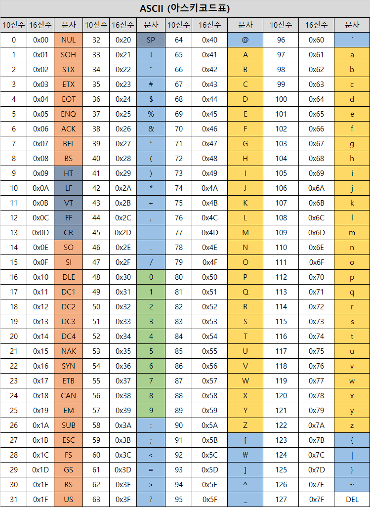

# Bit, Binary

# Bit란?
- Bit 는 컴퓨터에서 다루는 최소의 데이터 단위이다.
- 1 비트 를 이용해서 나타낼 수 있는 데이터 수는 "0 과 1"또는 "true 와 false" 또는 "on 과 off" 등과 같이 2가지이다.

# Binary란?
- 바이너리 코드는 컴퓨터가 인식할 수 있는 0과 1로 구성된 이진수이다.
- 여기서 수 와 수표기법에 대해서 설명을 하면 우리가 보통 일상 생활에서 쓰는 수 표기법은 10진수 이다.  

> 2진수(Binary System) : 1 과 0으로 수(Number)를 나타내는 수표기법이다.

# Byte (바이트)
- **정의** : Byte는 8개의 비트로 구성된 데이터 단위입니다. 즉, 1 byte는 8 비트의 연속된 묶음입니다.
- **단위** : 1 byte = 8 bits
- **사용 예** : Byte는 데이터 크기를 측정하는 표준 단위로 사용됩니다. 예를 들어, 메모리 크기(예: 4GB RAM), 파일 크기(예: 10MB 파일) 등을 표현할 때 사용됩니다.
- **데이터 표현** : 한 byte는 256가지(2^8)의 서로 다른 값을 가질 수 있습니다. 따라서, 다양한 문자를 표현하거나 작은 숫자 값을 저장하는 데 사용됩니다.

---

# Binary Data와 Byte Data의 차이

    

### Byte와 Binary가 헷갈린다면?
- "0100 1100"은 binary 표현입니다. 이 binary 표현이 8개의 비트로 구성되어 있기 때문에, 동시에 byte로도 간주될 수 있습니다.

 

**Binary** : 0100 1100은 이진수로, 각 숫자는 비트를 나타냅니다.

**Byte** : 8비트로 구성되어 있으므로 1바이트입니다.
> 즉, "0100 1100"은 binary 값이면서 1바이트 크기의 데이터입니다.

---

## 추가로, Hex에 대해 알아보자

# Hex (16진수)
**정의** : Hexadecimal(줄여서 Hex)는 16진수 체계로, 0부터 9까지의 숫자와 A부터 F까지의 문자(총 16개의 기호)를 사용하여 숫자를 표현합니다.

**단위** : 한 자리의 hex 값은 4비트를 나타냅니다. 두 자리의 hex 값은 8비트를 나타내므로 1바이트와 동일합니다.

**사용 예** : Hex는 주로 컴퓨터 과학에서 메모리 주소, 색상 코드, 기계어 코드, 디버깅, 데이터 표현 등에서 사용됩니다. 

## **예시 변환**

**Binary**: 0100 1100  
**Hex**: 4C

---

# ASCII 코드표
- ASCII 코드 표는 각 문자를 10진수와 16진수, 그리고 2진수 값으로 매핑한 표입니다. 
- ASCII 표는 각 문자를 숫자로 변환하여 컴퓨터가 이해할 수 있도록 합니다. 이러한 숫자는 10진수(decimal)와 16진수(hexadecimal)로 표현될 수 있습니다.

    

