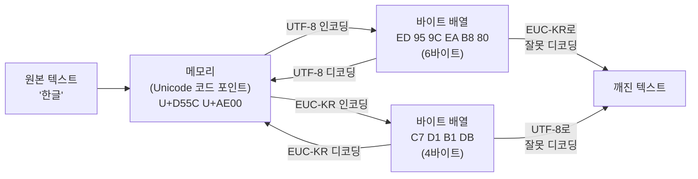
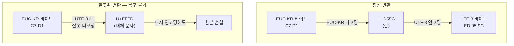
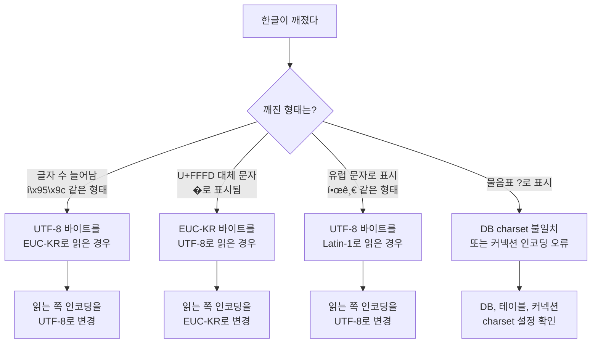

# 문자 인코딩 (Character Encoding)

## 문자 인코딩이 뭔지부터

컴퓨터는 숫자만 다룬다. 문자를 저장하려면 "A는 65번, B는 66번"처럼 문자와 숫자를 대응시키는 약속이 필요하다. 이 약속이 문자 인코딩이다.

문제는 이 약속이 하나가 아니라는 것이다. 미국에서 만든 약속(ASCII), 한국에서 만든 약속(EUC-KR), 전 세계를 통합하려는 약속(Unicode)이 각각 존재한다. 서로 다른 약속을 쓰는 시스템끼리 데이터를 주고받으면 글자가 깨진다.

## ASCII

1963년에 만들어진 7비트 인코딩이다. 0~127까지 128개 문자를 표현한다.

```
0x00~0x1F: 제어 문자 (줄바꿈, 탭 등)
0x20~0x7E: 출력 가능한 문자 (영문, 숫자, 특수문자)
0x7F:      DEL
```

영어권에서는 이걸로 충분했다. 하지만 7비트라 128개가 한계고, 한글이나 한자 같은 문자는 표현 자체가 불가능하다.

### 확장 ASCII

8비트로 확장해서 128~255 영역을 추가한 버전이 있다. 문제는 이 영역을 나라마다 다르게 정의했다는 것이다. ISO-8859-1(서유럽), ISO-8859-2(중유럽) 등이 각각 다른 문자를 배치했다. 같은 바이트 값인데 인코딩에 따라 다른 글자가 나온다.

## EUC-KR과 CP949

### EUC-KR

한글을 표현하기 위해 만들어진 인코딩이다. 완성형 방식으로, 자주 쓰는 한글 2,350자를 2바이트로 표현한다.

```
ASCII 영역:   1바이트 (0x00~0x7F) — 영문과 호환
한글 영역:    2바이트 (0xA1A1~0xFEFE)
```

2,350자라는 한계가 문제다. "똠"이나 "뷁" 같은 글자는 EUC-KR에 포함되어 있지 않다. 사람 이름에 포함된 한글이 표현 불가능한 경우가 실제로 발생한다.

### CP949 (MS949)

마이크로소프트가 EUC-KR을 확장한 것이다. 11,172자의 현대 한글 완성형을 모두 포함한다. Windows에서 "EUC-KR"이라고 표시되는 것은 사실 CP949인 경우가 많다.

```java
// Java에서 CP949 명시
byte[] bytes = "테스트".getBytes("MS949");
String str = new String(bytes, "MS949");
```

레거시 시스템과 연동할 때 EUC-KR로 지정했는데 실제로는 CP949로 동작하는 경우가 있다. 특히 Windows 환경에서 만든 데이터를 Linux에서 읽을 때 차이가 드러난다.

## Unicode

### 코드 포인트

Unicode는 전 세계 모든 문자에 고유한 번호(코드 포인트)를 부여하는 표준이다. 인코딩 방식이 아니라 문자 집합(Character Set)이다.

```
U+0041: A
U+AC00: 가
U+1F600: 😀 (이모지)
```

현재 15만 자 이상의 문자가 등록되어 있다. 코드 포인트는 0x0000부터 0x10FFFF까지의 범위를 가진다.

### 평면(Plane) 구조

```
Unicode 코드 포인트 공간

U+000000 ┌──────────────────────────────────┐
         │  BMP (Basic Multilingual Plane)  │  ← 대부분의 일상 문자
         │  ASCII, 한글, 한자, 라틴 등         │
         │  UTF-16: 2바이트 / UTF-8: 1~3바이트 │
U+00FFFF ├──────────────────────────────────┤
         │  SMP                             │  ← 이모지, 고대 문자
         │  UTF-16: 4바이트(서로게이트 페어)    │
U+01FFFF ├──────────────────────────────────┤
         │  SIP (한자 확장 B, C, D ...)       │
U+02FFFF ├──────────────────────────────────┤
         │  Plane 3 ~ 13 (대부분 미사용)      │
         │          ⋮                        │
U+0DFFFF ├──────────────────────────────────┤
         │  Plane 14 (태그, 변형 선택자)      │
U+0EFFFF ├──────────────────────────────────┤
         │  Plane 15~16 (사용자 정의 영역)    │
U+10FFFF └──────────────────────────────────┘
```

실무에서 마주치는 문자 대부분은 BMP에 있다. BMP 바깥에서 자주 만나는 건 이모지 정도다.

중요한 건 Unicode 자체는 "이 문자의 번호는 몇 번이다"만 정의한다는 것이다. 이 번호를 실제로 바이트 배열로 어떻게 저장할지는 UTF-8, UTF-16 같은 인코딩이 결정한다.

## UTF-8

현재 웹에서 가장 많이 쓰이는 인코딩이다. 가변 길이 인코딩으로, 문자에 따라 1~4바이트를 사용한다.

### 바이트 구조

```
1바이트: 0xxxxxxx                          (U+0000 ~ U+007F)    — ASCII와 동일
2바이트: 110xxxxx 10xxxxxx                  (U+0080 ~ U+07FF)
3바이트: 1110xxxx 10xxxxxx 10xxxxxx         (U+0800 ~ U+FFFF)   — 한글이 여기
4바이트: 11110xxx 10xxxxxx 10xxxxxx 10xxxxxx (U+10000 ~ U+10FFFF) — 이모지
```

첫 바이트의 비트 패턴만 보면 몇 바이트짜리 문자인지 바로 알 수 있다. 이 구조 덕분에 바이트 스트림 중간부터 읽더라도 문자 경계를 찾을 수 있다.

```
UTF-8 가변 길이 바이트 구조

┌─────────────────────────────────────────────────────────────────┐
│  첫 바이트 비트 패턴으로 문자 길이를 판별한다                          │
├─────────────┬───────────────────────────────────────────────────┤
│  0xxxxxxx   │  1바이트 문자 (ASCII)                               │
│  ▼          │  데이터 비트: 7bit → 128자 표현                       │
│  "A" = 0x41 │  [0][1000001]                                     │
│             │   ↑ 0으로 시작하면 1바이트                             │
├─────────────┼───────────────────────────────────────────────────┤
│  110xxxxx   │  2바이트 문자                                       │
│  10xxxxxx   │  데이터 비트: 5+6 = 11bit → 1,920자 표현              │
│  ▼          │                                                   │
│  "é" = C3A9 │  [110]00011 [10]101001                             │
│             │   ↑↑↑        ↑↑                                   │
│             │   길이표식    연속 바이트 표식                          │
├─────────────┼───────────────────────────────────────────────────┤
│  1110xxxx   │  3바이트 문자 (한글, 한자, 일본어 등)                   │
│  10xxxxxx   │  데이터 비트: 4+6+6 = 16bit → 63,488자 표현           │
│  10xxxxxx   │                                                   │
│  ▼          │                                                   │
│  "가" = EAB080│ [1110]1010 [10]110000 [10]000000                 │
│             │   ↑↑↑↑       ↑↑         ↑↑                       │
│             │   3바이트     연속        연속                        │
├─────────────┼───────────────────────────────────────────────────┤
│  11110xxx   │  4바이트 문자 (이모지, 고대 문자 등)                    │
│  10xxxxxx   │  데이터 비트: 3+6+6+6 = 21bit → 1,112,064자 표현     │
│  10xxxxxx   │                                                   │
│  10xxxxxx   │                                                   │
└─────────────┴───────────────────────────────────────────────────┘
```

한글은 3바이트다. "가"(U+AC00)를 예로 들면:

```
U+AC00 = 1010 1100 0000 0000 (16비트)

3바이트 템플릿에 비트를 채워 넣는 과정:

  코드 포인트:     1010   110000   000000
                  ────   ──────   ──────
  템플릿:      1110____  10______  10______
                  ↓         ↓         ↓
  결과:        1110 1010  10 110000  10 000000
               ─────────  ─────────  ─────────
                 0xEA       0xB0       0x80
```

### ASCII 호환

UTF-8의 가장 큰 장점이다. ASCII 범위(0x00~0x7F)는 1바이트 그대로 표현한다. 영문으로만 된 파일은 ASCII와 UTF-8이 바이트 단위로 동일하다. 기존 ASCII 기반 시스템과 바로 호환된다.

### 한글과 용량

한글 한 글자가 3바이트라는 점은 무시할 수 없다. 순수 한글 텍스트 기준으로 EUC-KR(2바이트) 대비 50% 용량이 늘어난다. 대부분의 경우 문제가 되지 않지만, 대량의 한글 데이터를 다루는 시스템에서 스토리지 비용이나 네트워크 전송 크기를 따질 때 고려 대상이다.

## UTF-16

2바이트 또는 4바이트를 사용하는 인코딩이다. BMP 범위(U+0000~U+FFFF)는 2바이트, 그 이상은 서로게이트 페어(surrogate pair)로 4바이트를 쓴다.

### 서로게이트 페어

BMP 바깥의 문자(이모지 등)를 표현하는 방식이다.

```
U+1F600 (😀)를 UTF-16으로 인코딩하면:

1. 0x10000을 빼면: 0x0F600
2. 상위 10비트: 0x003D → 0xD83D (High Surrogate)
3. 하위 10비트: 0x0200 → 0xDE00 (Low Surrogate)
4. 결과: 0xD83D 0xDE00
```

Java의 `String`과 JavaScript의 문자열이 내부적으로 UTF-16을 쓴다. 이모지 처리에서 버그가 나는 이유가 대부분 서로게이트 페어 때문이다.

```java
String emoji = "😀";
System.out.println(emoji.length());        // 2 (UTF-16 코드 유닛 기준)
System.out.println(emoji.codePointCount(0, emoji.length())); // 1 (실제 문자 수)

// charAt()으로 접근하면 서로게이트 반쪽만 가져온다
char high = emoji.charAt(0); // 0xD83D — 의미 없는 값
char low = emoji.charAt(1);  // 0xDE00 — 의미 없는 값
```

```javascript
const emoji = "😀";
console.log(emoji.length);       // 2
console.log([...emoji].length);  // 1 — 스프레드 연산자는 코드 포인트 단위로 분리
```

문자열 자르기, 길이 계산, 인덱스 접근에서 이모지를 고려하지 않으면 문자가 잘리거나 깨진다.

### UTF-16 바이트 순서

UTF-16은 2바이트 단위로 저장하기 때문에 바이트 순서(엔디언) 문제가 생긴다.

```
"가" (U+AC00)
UTF-16 BE: AC 00
UTF-16 LE: 00 AC
```

## BOM (Byte Order Mark)

파일 맨 앞에 붙여서 인코딩 방식과 바이트 순서를 알려주는 표식이다.

```
UTF-8:    EF BB BF
UTF-16 BE: FE FF
UTF-16 LE: FF FE
```

### UTF-8 BOM 문제

UTF-8은 바이트 순서가 의미 없는데도 BOM을 넣는 경우가 있다. Windows의 메모장이 대표적이다(최근 버전은 BOM 없이 저장하는 게 기본값으로 바뀌었다).

이 3바이트(EF BB BF)가 문제를 일으키는 경우:

```bash
# BOM이 있는 쉘 스크립트
$ cat -v script.sh
M-oM-;M-?#!/bin/bash    # ← shebang 앞에 BOM이 붙어 있다

$ ./script.sh
./script.sh: line 1: #!/bin/bash: No such file or directory
```

```
# BOM이 있는 CSV 파일
HTTP 응답으로 CSV를 내려줄 때 BOM이 포함되면,
첫 번째 컬럼 이름 앞에 보이지 않는 3바이트가 붙어서
파싱 시 첫 번째 헤더를 인식하지 못한다.
```

```php
// BOM이 있는 PHP 파일
// <?php 앞에 BOM 3바이트가 출력되어
// "headers already sent" 에러가 발생한다
```

BOM 확인 방법:

```bash
# 파일 앞부분 hex로 확인
hexdump -C file.txt | head -1
# EF BB BF로 시작하면 UTF-8 BOM

# BOM 제거
sed -i '1s/^\xEF\xBB\xBF//' file.txt
```

## 인코딩 변환 흐름

실제 시스템에서 데이터가 어떤 과정을 거쳐 인코딩이 바뀌는지 흐름을 보면 깨지는 지점을 파악하기 쉽다.



핵심은 가운데 있는 Unicode 코드 포인트 단계다. 모든 인코딩 변환은 `원본 바이트 → 코드 포인트 → 대상 바이트`로 두 단계를 거친다. 바이트 배열에서 다른 바이트 배열로 직접 변환하는 게 아니다.

레거시 시스템 연동에서 데이터가 깨지는 대부분의 경우는, 이 흐름 중 디코딩 단계에서 잘못된 인코딩을 지정했기 때문이다. EUC-KR 바이트를 UTF-8로 읽거나, 그 반대를 하면 코드 포인트 자체가 엉뚱한 값이 되어 복구가 안 된다.



## 실무에서 겪는 인코딩 문제

### 1. DB 인코딩 설정

MySQL에서 가장 흔하게 겪는 문제다. `utf8`과 `utf8mb4`는 다르다.

```sql
-- MySQL의 utf8은 3바이트까지만 지원한다 (BMP만)
-- 이모지(4바이트)를 넣으면 에러나거나 잘린다
CREATE TABLE bad_table (
    name VARCHAR(100)
) CHARACTER SET utf8;

-- utf8mb4가 진짜 UTF-8이다
CREATE TABLE good_table (
    name VARCHAR(100)
) CHARACTER SET utf8mb4 COLLATE utf8mb4_unicode_ci;
```

MySQL의 `utf8`은 역사적 이유로 3바이트 제한이 있다. 2010년에 `utf8mb4`가 추가되었는데, 신규 프로젝트라면 무조건 `utf8mb4`를 쓴다.

커넥션 레벨에서도 설정해야 한다:

```properties
# JDBC URL
jdbc:mysql://localhost:3306/mydb?characterEncoding=UTF-8&connectionCollation=utf8mb4_unicode_ci

# my.cnf
[client]
default-character-set = utf8mb4

[mysqld]
character-set-server = utf8mb4
collation-server = utf8mb4_unicode_ci
```

DB, 테이블, 컬럼, 커넥션 네 군데 인코딩이 모두 맞아야 한다. 하나라도 다르면 변환 과정에서 깨질 수 있다.

```sql
-- 현재 설정 확인
SHOW VARIABLES LIKE 'character_set%';
SHOW VARIABLES LIKE 'collation%';

-- 테이블 인코딩 확인
SHOW CREATE TABLE my_table;
```

### 2. HTTP Content-Type과 charset

```
Content-Type: text/html; charset=UTF-8
```

이 헤더가 없거나 잘못 설정되면 브라우저가 인코딩을 추측한다. 추측이 틀리면 한글이 깨진다.

```html
<!-- HTML meta 태그도 설정해야 한다 -->
<meta charset="UTF-8">
<!-- 이 태그는 반드시 <head>의 첫 1024바이트 안에 위치해야 한다 -->
```

Spring Boot에서 기본 charset이 달라서 겪는 문제:

```java
// Spring Boot 2.x에서는 기본값이 UTF-8이 아닌 경우가 있다
// application.properties에 명시
server.servlet.encoding.charset=UTF-8
server.servlet.encoding.enabled=true
server.servlet.encoding.force=true
```

### 3. 파일 읽기에서의 인코딩

```java
// 잘못된 방법 — 시스템 기본 인코딩에 의존
BufferedReader reader = new BufferedReader(new FileReader("data.txt"));

// 올바른 방법 — 인코딩 명시
BufferedReader reader = new BufferedReader(
    new InputStreamReader(new FileInputStream("data.txt"), StandardCharsets.UTF_8)
);

// Java 11+
String content = Files.readString(Path.of("data.txt"), StandardCharsets.UTF_8);
```

```python
# Python 3 — 인코딩 명시
with open('data.txt', 'r', encoding='utf-8') as f:
    content = f.read()

# 인코딩을 모를 때 — chardet 라이브러리 사용
import chardet

with open('data.txt', 'rb') as f:
    raw = f.read()
    detected = chardet.detect(raw)
    print(detected)  # {'encoding': 'EUC-KR', 'confidence': 0.99, ...}
    content = raw.decode(detected['encoding'])
```

### 4. 레거시 시스템 연동

오래된 시스템에서 EUC-KR로 인코딩된 데이터를 받아서 UTF-8 시스템에 저장할 때:

```java
// EUC-KR → UTF-8 변환
byte[] euckrBytes = receiveFromLegacy();
String text = new String(euckrBytes, "EUC-KR");
byte[] utf8Bytes = text.getBytes(StandardCharsets.UTF_8);
```

```python
# EUC-KR 파일을 UTF-8로 변환
with open('legacy.txt', 'r', encoding='euc-kr') as f:
    content = f.read()

with open('converted.txt', 'w', encoding='utf-8') as f:
    f.write(content)
```

변환할 때 주의할 점: EUC-KR에는 있지만 의미가 달라지는 문자는 없다(Unicode가 EUC-KR을 포함한다). 하지만 깨진 채로 저장된 데이터는 변환해도 복구되지 않는다. 이미 깨진 데이터는 원본을 찾아야 한다.

### 5. 한글 깨짐 디버깅

한글이 깨질 때 깨지는 패턴으로 원인을 추정할 수 있다.



```
원본: "한글 테스트"

UTF-8로 저장 → EUC-KR로 읽으면:
"í\x95\x9cê¸\x80 í\x85\x8cì\x8a¤í\x8a¸"  — 바이트가 더 많아서 글자 수가 늘어남

EUC-KR로 저장 → UTF-8로 읽으면:
"�۱� ���" 같은 형태 — replacement character(U+FFFD)가 나옴

UTF-8로 저장 → Latin-1로 읽으면:
"한글 테스트" — 한글이 2~3글자의 유럽 문자로 표시됨
```

디버깅 순서:

```bash
# 1. 파일의 실제 인코딩 확인
file -bi data.txt
# text/plain; charset=utf-8

# 2. hex로 바이트 직접 확인
xxd data.txt | head

# 3. iconv로 변환 시도
iconv -f EUC-KR -t UTF-8 data.txt > converted.txt
# 변환 실패 시 해당 인코딩이 아닌 것

# 4. 특정 인코딩으로 강제 해석
python3 -c "
import sys
with open('data.txt', 'rb') as f:
    raw = f.read()
for enc in ['utf-8', 'euc-kr', 'cp949', 'latin-1', 'shift_jis']:
    try:
        print(f'{enc}: {raw.decode(enc)[:50]}')
    except:
        print(f'{enc}: FAILED')
"
```

### 6. URL 인코딩과의 관계

URL에서 한글을 쓸 때는 퍼센트 인코딩이 적용된다. 이때 어떤 문자 인코딩을 기준으로 퍼센트 인코딩하느냐가 중요하다.

```
"한" (U+D55C)

UTF-8 기준:  %ED%95%9C  (3바이트를 각각 퍼센트 인코딩)
EUC-KR 기준: %C7%D1     (2바이트를 각각 퍼센트 인코딩)
```

```java
// Java — 인코딩 명시
String encoded = URLEncoder.encode("한글", StandardCharsets.UTF_8);
// %ED%95%9C%EA%B8%80

String decoded = URLDecoder.decode(encoded, StandardCharsets.UTF_8);
// 한글
```

현재 표준(RFC 3986)은 UTF-8을 사용하도록 규정하고 있다. 하지만 오래된 웹 애플리케이션에서 EUC-KR 기준으로 퍼센트 인코딩한 URL이 아직 남아 있는 경우가 있다.

## 인코딩 선택 기준

새로 만드는 시스템이라면 UTF-8 외에 다른 선택지는 없다. 이유는 간단하다:

- 모든 Unicode 문자를 표현할 수 있다
- ASCII와 하위 호환된다
- 웹 표준이다 (HTTP, HTML, JSON, XML 전부 UTF-8 기본)
- 거의 모든 프로그래밍 언어와 프레임워크가 UTF-8을 기본으로 지원한다

EUC-KR/CP949를 써야 하는 경우는 레거시 시스템 연동뿐이다. 이 경우에도 내부 처리는 UTF-8로 하고, 외부 시스템과의 경계에서만 변환한다.

MySQL에서 `utf8` 대신 `utf8mb4`를 쓴다. JSON은 스펙 자체가 UTF-8이다. API 응답에 charset을 명시한다. 파일 I/O에서 인코딩을 항상 지정한다. 이 네 가지만 지키면 인코딩 문제의 대부분은 발생하지 않는다.
