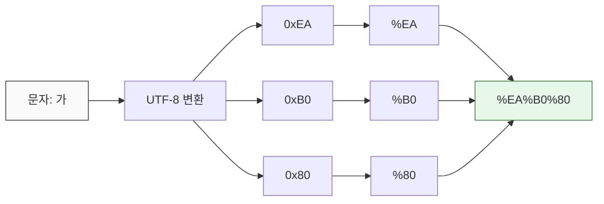
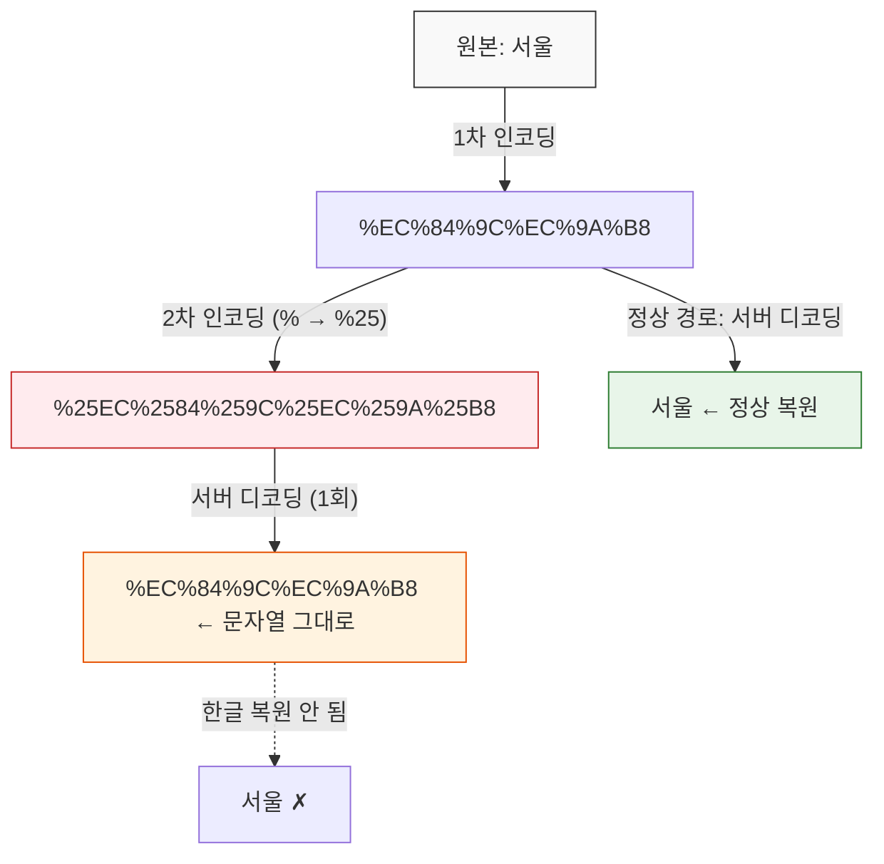

# URL 인코딩 (Percent Encoding)

## URL에서 쓸 수 있는 문자는 정해져 있다

RFC 3986 기준으로 URL에 그대로 쓸 수 있는 문자(Unreserved Characters)는 다음뿐이다.

```
A-Z a-z 0-9 - _ . ~
```

이 외의 문자는 퍼센트 인코딩 처리를 해야 한다. `%` 뒤에 해당 바이트의 16진수 값 두 자리를 붙이는 방식이다.

```
공백 → %20
/ → %2F
? → %3F
# → %23
& → %26
= → %3D
```

예약 문자(Reserved Characters)인 `:`, `/`, `?`, `#`, `&`, `=` 등은 URL 구조에서 구분자 역할을 한다. 이 문자들을 데이터 값으로 쓰려면 반드시 인코딩해야 한다.


## 한글은 어떻게 인코딩되는가

한글은 UTF-8로 인코딩하면 한 글자가 3바이트다. 퍼센트 인코딩은 바이트 단위로 처리하므로, 한글 한 글자가 `%XX%XX%XX` 형태로 변환된다.

```
"가" → UTF-8 바이트: 0xEA 0xB0 0x80 → %EA%B0%80
"서울" → %EC%84%9C%EC%9A%B8
```

아래 다이어그램은 한글 "가"가 퍼센트 인코딩되는 전체 흐름이다.



각 바이트 앞에 `%`를 붙여서 16진수로 표현하는 것이 퍼센트 인코딩의 전부다. 한글은 UTF-8에서 3바이트이므로 `%XX` 3개가 나온다. 영문 알파벳은 1바이트이므로 `%XX` 1개로 끝난다.

브라우저 주소창에 `https://example.com/검색?q=서울` 이라고 입력하면, 실제 요청은 이렇게 나간다.

```
GET /%EA%B2%80%EC%83%89?q=%EC%84%9C%EC%9A%B8 HTTP/1.1
```

브라우저 주소창에서는 사용자 편의를 위해 디코딩된 한글을 보여주지만, 실제 HTTP 요청에서는 퍼센트 인코딩된 형태로 전송된다.


## encodeURI vs encodeURIComponent

JavaScript에서 URL 인코딩을 다룰 때 이 두 함수의 차이를 혼동하면 버그가 생긴다.

### encodeURI

URL 전체를 인코딩할 때 쓴다. URL 구조를 유지해야 하므로 `:`, `/`, `?`, `#`, `&`, `=` 같은 예약 문자는 인코딩하지 않는다.

```javascript
encodeURI('https://example.com/path?q=서울&page=1')
// "https://example.com/path?q=%EC%84%9C%EC%9A%B8&page=1"
// ?, &, = 는 그대로 남아있다
```

### encodeURIComponent

쿼리 파라미터의 값처럼, URL의 일부분을 인코딩할 때 쓴다. 예약 문자까지 전부 인코딩한다.

```javascript
encodeURIComponent('서울&부산')
// "%EC%84%9C%EC%9A%B8%26%EB%B6%80%EC%82%B0"
// & 도 %26으로 인코딩된다
```

### 잘못 쓰면 생기는 문제

쿼리 파라미터 값에 `encodeURI`를 쓰면 값 안의 `&`가 파라미터 구분자로 해석된다.

```javascript
// 검색어가 "A&B" 인 경우
const query = 'A&B';

// 잘못된 방법
const bad = `https://example.com/search?q=${encodeURI(query)}`;
// "https://example.com/search?q=A&B"
// 서버는 q=A, B=(빈값) 두 개의 파라미터로 해석한다

// 올바른 방법
const good = `https://example.com/search?q=${encodeURIComponent(query)}`;
// "https://example.com/search?q=A%26B"
// 서버는 q=A&B 하나의 파라미터로 해석한다
```

URL 전체에 `encodeURIComponent`를 쓰면 `://`과 `/`까지 인코딩되어 URL 자체가 깨진다.

```javascript
encodeURIComponent('https://example.com/path')
// "https%3A%2F%2Fexample.com%2Fpath"
// URL로 사용할 수 없다
```

정리하면, URL 전체는 `encodeURI`, 파라미터 값은 `encodeURIComponent`를 쓴다.


## URLSearchParams를 쓰면 직접 인코딩할 일이 줄어든다

직접 `encodeURIComponent`를 호출하는 대신 `URLSearchParams`를 쓰면 인코딩 실수를 줄일 수 있다.

```javascript
const params = new URLSearchParams();
params.set('q', '서울&부산');
params.set('page', '1');

console.log(params.toString());
// "q=%EC%84%9C%EC%9A%B8%26%EB%B6%80%EC%82%B0&page=1"

const url = `https://example.com/search?${params}`;
```

주의할 점이 하나 있다. `URLSearchParams`는 공백을 `%20`이 아니라 `+`로 인코딩한다. 이건 `application/x-www-form-urlencoded` 스펙을 따르기 때문이다.

```javascript
const params = new URLSearchParams({ q: 'hello world' });
params.toString(); // "q=hello+world"  (%20이 아니다)
```

대부분의 서버는 `+`와 `%20` 둘 다 공백으로 해석하지만, 일부 API에서 `+`를 리터럴 플러스로 처리하는 경우가 있다. 그런 API와 연동할 때는 `toString()` 결과에서 `+`를 `%20`으로 치환해야 한다.


## Spring에서의 URL 디코딩

### 자동 디코딩

Spring MVC는 요청이 들어오면 서블릿 컨테이너(Tomcat 등)가 URL을 자동으로 디코딩해서 넘겨준다. 컨트롤러에서 받는 값은 이미 디코딩된 상태다.

```java
// 요청: GET /search?q=%EC%84%9C%EC%9A%B8
@GetMapping("/search")
public String search(@RequestParam String q) {
    // q = "서울" (이미 디코딩된 상태)
    return q;
}
```

`@PathVariable`도 마찬가지다.

```java
// 요청: GET /cities/%EC%84%9C%EC%9A%B8
@GetMapping("/cities/{name}")
public String city(@PathVariable String name) {
    // name = "서울"
    return name;
}
```

### 수동으로 디코딩해야 하는 경우

쿠키 값이나 헤더 값은 자동 디코딩 대상이 아니다. 직접 디코딩해야 한다.

```java
String raw = request.getHeader("X-Custom-Value");
String decoded = URLDecoder.decode(raw, StandardCharsets.UTF_8);
```

`URLDecoder.decode`에 charset을 지정하지 않으면 플랫폼 기본 인코딩을 쓰는데, 운영 환경에 따라 달라질 수 있으므로 반드시 `UTF_8`을 명시한다.


## Express(Node.js)에서의 URL 디코딩

Express도 쿼리 파라미터와 경로 파라미터를 자동으로 디코딩해서 넘겨준다.

```javascript
// 요청: GET /search?q=%EC%84%9C%EC%9A%B8
app.get('/search', (req, res) => {
    console.log(req.query.q); // "서울"
});

// 요청: GET /cities/%EC%84%9C%EC%9A%B8
app.get('/cities/:name', (req, res) => {
    console.log(req.params.name); // "서울"
});
```

`req.path`도 디코딩된 값이지만, `req.originalUrl`은 디코딩 전 원본 URL이다.

```javascript
// 요청: GET /cities/%EC%84%9C%EC%9A%B8
app.get('/cities/:name', (req, res) => {
    console.log(req.path);        // "/cities/서울"
    console.log(req.originalUrl); // "/cities/%EC%84%9C%EC%9A%B8"
});
```


## 이중 인코딩 문제

실무에서 가장 흔하게 겪는 인코딩 버그다. 이미 인코딩된 문자열을 한 번 더 인코딩하면 `%`가 `%25`로 변환되면서 원본 복원이 안 된다.

```
원본: 서울
1차 인코딩: %EC%84%9C%EC%9A%B8
2차 인코딩: %25EC%2584%259C%25EC%259A%25B8  (% → %25)
```

아래 흐름도로 보면 이중 인코딩이 왜 문제인지 한눈에 보인다.



서버는 보통 디코딩을 한 번만 수행한다. 이중 인코딩된 값은 1회 디코딩 후에도 퍼센트 인코딩 문자열이 남아서, 원본 한글로 돌아오지 않는다.

이렇게 되면 서버에서 한 번 디코딩해도 `%EC%84%9C%EC%9A%B8`이 나오고, 한글로 복원되지 않는다.

### 자주 발생하는 상황

**1. 프론트엔드에서 인코딩하고, HTTP 클라이언트가 다시 인코딩하는 경우**

```javascript
// 프론트엔드
const keyword = encodeURIComponent('서울');
// keyword = "%EC%84%9C%EC%9A%B8"

// axios는 파라미터를 자동으로 인코딩한다
axios.get('/search', { params: { q: keyword } });
// 실제 요청: /search?q=%25EC%2584%259C%25EC%259A%25B8
// 이중 인코딩 발생
```

axios, fetch, RestTemplate 같은 HTTP 클라이언트는 파라미터를 자동 인코딩한다. 직접 인코딩한 값을 파라미터로 넣으면 이중 인코딩이 된다.

```javascript
// 올바른 방법: 원본 문자열을 넣고 클라이언트에 맡긴다
axios.get('/search', { params: { q: '서울' } });
```

**2. Spring의 RestTemplate에서 발생하는 경우**

```java
// 이중 인코딩 발생
String encoded = URLEncoder.encode("서울", StandardCharsets.UTF_8);
String url = "https://api.example.com/search?q=" + encoded;
restTemplate.getForObject(url, String.class);
// RestTemplate이 URL을 다시 인코딩한다

// 해결 방법 1: UriComponentsBuilder 사용
URI uri = UriComponentsBuilder
    .fromHttpUrl("https://api.example.com/search")
    .queryParam("q", "서울")  // 원본 문자열
    .build()
    .encode()
    .toUri();
restTemplate.getForObject(uri, String.class);

// 해결 방법 2: 이미 인코딩된 URL은 URI 객체로 감싸서 재인코딩 방지
URI uri = URI.create("https://api.example.com/search?q=" + encoded);
restTemplate.getForObject(uri, String.class);
```

**3. 리다이렉트 체인에서 발생하는 경우**

서비스 A → 서비스 B → 서비스 C로 리다이렉트되면서, 각 서비스가 URL 파라미터를 인코딩하면 단계마다 `%25`가 누적된다. 리다이렉트 URL을 만들 때는 이미 인코딩된 파라미터를 다시 인코딩하지 않도록 주의해야 한다.

### 이중 인코딩 디버깅

URL에 `%25`가 보이면 이중 인코딩을 의심한다.

```
정상: q=%EC%84%9C%EC%9A%B8
이중 인코딩: q=%25EC%2584%259C%25EC%259A%25B8
```

서버 로그에서 파라미터 값이 `%EC%84%9C%EC%9A%B8` 같은 문자열로 찍히면(한글로 안 나오면), 어딘가에서 이중 인코딩이 일어나고 있는 것이다.


## + 와 %20 차이

공백을 인코딩하는 방식이 두 가지다.

| 스펙 | 공백 표현 | 사용 위치 |
|------|-----------|-----------|
| RFC 3986 (URL) | `%20` | URL 경로, 프래그먼트 |
| application/x-www-form-urlencoded (HTML 폼) | `+` | 쿼리 스트링 (폼 전송 시) |

Java의 `URLEncoder.encode`는 폼 인코딩 스펙을 따르므로 공백을 `+`로 인코딩한다.

```java
URLEncoder.encode("hello world", StandardCharsets.UTF_8);
// "hello+world"
```

URL 경로에 쓸 값을 인코딩할 때 `URLEncoder`를 쓰면 `+`가 그대로 들어가서 문제가 된다. 경로에서는 `+`가 공백이 아니라 리터럴 플러스이기 때문이다.

```java
// 경로에 넣을 값 인코딩 시
String value = URLEncoder.encode("hello world", StandardCharsets.UTF_8)
    .replace("+", "%20");
// "hello%20world"
```

Spring의 `UriUtils.encodePathSegment`를 쓰면 이런 처리를 알아서 해준다.

```java
UriUtils.encodePathSegment("hello world", StandardCharsets.UTF_8);
// "hello%20world"
```


## 파일 업로드 시 파일명 인코딩

`Content-Disposition` 헤더에 한글 파일명을 넣을 때도 인코딩 문제가 발생한다.

```java
// Spring에서 파일 다운로드 응답
@GetMapping("/download")
public ResponseEntity<Resource> download() {
    String filename = "보고서.pdf";
    String encoded = UriUtils.encode(filename, StandardCharsets.UTF_8);

    return ResponseEntity.ok()
        .header(HttpHeaders.CONTENT_DISPOSITION,
            "attachment; filename*=UTF-8''" + encoded)
        .body(resource);
}
```

`filename*=UTF-8''`은 RFC 5987 규격이다. 오래된 브라우저는 이 형식을 못 읽을 수 있어서, `filename`과 `filename*`을 같이 보내는 게 안전하다.

```
Content-Disposition: attachment; filename="report.pdf"; filename*=UTF-8''%EB%B3%B4%EA%B3%A0%EC%84%9C.pdf
```
