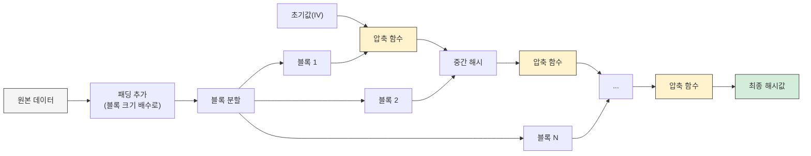
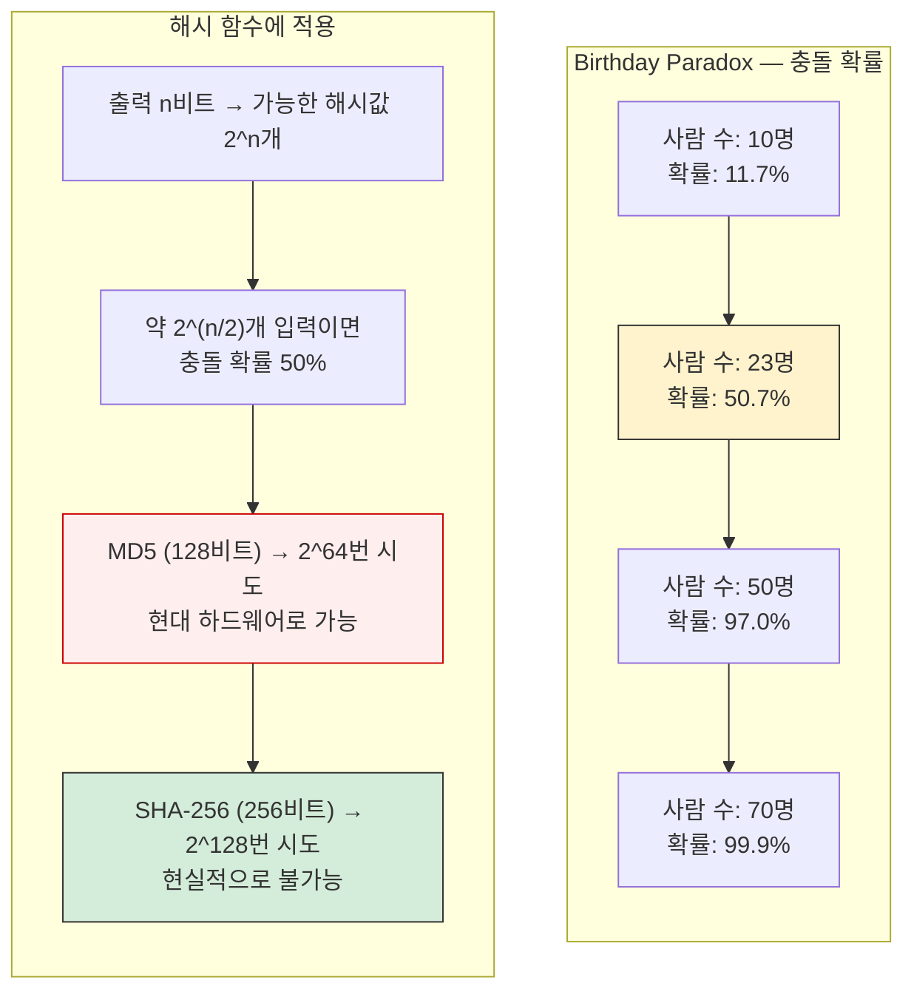
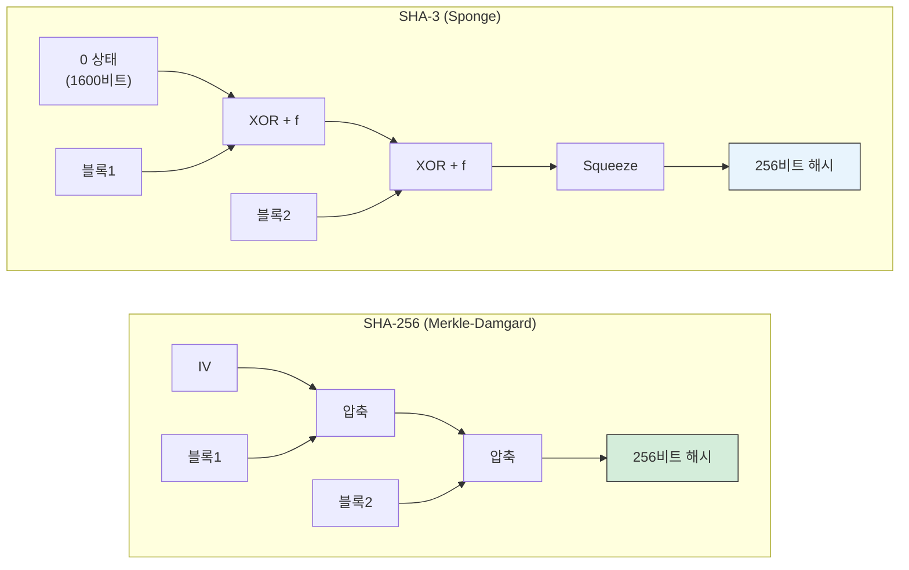

# 해시와 체크섬

## 해시 함수란

임의 길이의 데이터를 고정 길이의 값으로 변환하는 함수다. 같은 입력은 항상 같은 출력을 만들고, 출력값만으로 원래 입력을 복원할 수 없다(단방향성).

체크섬은 데이터 전송이나 저장 과정에서 오류가 발생했는지 확인하는 값이다. 해시 함수로 체크섬을 만들 수 있지만, 모든 체크섬이 해시인 건 아니다. CRC32처럼 단순 오류 검출용 알고리즘도 체크섬에 포함된다.

### 해시 함수 내부 동작 흐름

암호학적 해시 함수는 대부분 비슷한 구조로 동작한다. 입력 데이터를 일정 크기 블록으로 나누고, 각 블록을 순서대로 압축 함수에 통과시켜 최종 해시값을 만든다.



이 구조를 **Merkle-Damgard 구조**라고 한다. MD5, SHA-1, SHA-256 모두 이 방식이다. SHA-3는 이 구조 대신 스펀지(Sponge) 구조를 쓰는데, 뒤에서 설명한다.

핵심은 압축 함수가 **이전 블록의 출력**과 **현재 블록의 데이터**를 받아서 새 해시값을 만든다는 것이다. 첫 번째 블록은 미리 정해진 초기값(IV)을 사용한다. 이 체이닝 덕분에 입력의 어느 부분이 바뀌어도 최종 해시값이 완전히 달라진다.

---

## MD5 / SHA-256 / CRC32 비교

| 항목 | CRC32 | MD5 | SHA-256 |
|------|-------|-----|---------|
| 출력 길이 | 32비트 (8자리 hex) | 128비트 (32자리 hex) | 256비트 (64자리 hex) |
| 속도 | 매우 빠름 | 빠름 | MD5보다 느림 |
| 충돌 저항성 | 낮음 | 취약 (충돌 발견됨) | 높음 |
| 용도 | 오류 검출 | 파일 무결성 (보안 목적 X) | 보안이 필요한 무결성 검증 |

**CRC32**는 네트워크 패킷이나 ZIP 파일의 오류 검출에 쓴다. 의도적인 조작을 막는 용도로는 쓸 수 없다. 같은 CRC32 값을 가진 다른 데이터를 만드는 건 쉽다.

**MD5**는 2004년에 충돌이 발견됐다. 두 개의 서로 다른 파일이 같은 MD5 해시를 가질 수 있다는 뜻이다. 보안 목적으로 쓰면 안 된다. 그런데 실무에서는 아직도 파일 다운로드 검증용으로 쓰는 곳이 있다. 악의적 변조가 아닌 단순 전송 오류 확인이면 충분하긴 하다.

**SHA-256**은 현재 보안 용도로 가장 많이 쓰이는 해시 함수다. TLS 인증서, Git 커밋 해시(Git은 SHA-1이지만 SHA-256 전환 중), 블록체인 등에서 사용한다.

---

## 실무 사용처

### 1. 파일 무결성 검증

배포 파일이 변조되지 않았는지 확인할 때 쓴다. S3에 파일을 올리고 내려받은 뒤 해시를 비교하는 식이다.

```python
import hashlib

def file_sha256(path: str) -> str:
    h = hashlib.sha256()
    with open(path, "rb") as f:
        while chunk := f.read(8192):
            h.update(chunk)
    return h.hexdigest()

# 업로드 전 해시
original = file_sha256("release-v2.3.1.tar.gz")
# 다운로드 후 해시
downloaded = file_sha256("/tmp/release-v2.3.1.tar.gz")

if original != downloaded:
    raise RuntimeError("파일이 손상됐다. 다시 다운로드해야 한다.")
```

파일 전체를 메모리에 올리면 안 된다. 위 코드처럼 chunk 단위로 읽어야 대용량 파일도 처리할 수 있다.

### 2. 비밀번호 저장 — bcrypt / scrypt

비밀번호를 SHA-256으로 해싱해서 저장하면 안 된다. SHA-256은 빠르기 때문에 GPU로 초당 수십억 개의 해시를 계산할 수 있다. Rainbow table 공격에도 취약하다.

비밀번호 저장에는 **의도적으로 느린** 해시 함수를 써야 한다.

```java
// Java — bcrypt (Spring Security)
import org.springframework.security.crypto.bcrypt.BCryptPasswordEncoder;

BCryptPasswordEncoder encoder = new BCryptPasswordEncoder(12); // cost factor 12
String hashed = encoder.encode("user_password");

// 검증
boolean matches = encoder.matches("user_password", hashed);
```

```python
# Python — bcrypt
import bcrypt

password = "user_password".encode("utf-8")
salt = bcrypt.gensalt(rounds=12)
hashed = bcrypt.hashpw(password, salt)

# 검증
if bcrypt.checkpw(password, hashed):
    print("비밀번호 일치")
```

bcrypt의 `rounds` 값은 2^n 번 반복한다는 뜻이다. 12면 4096번 반복. 서버 성능에 따라 조절하는데, 로그인 요청 하나에 100ms~300ms 정도 걸리게 설정하는 게 일반적이다.

**scrypt**는 bcrypt보다 메모리를 많이 사용하도록 설계됐다. GPU 기반 공격에 더 강하다. 새 프로젝트라면 bcrypt 대신 **Argon2**를 고려해볼 만하다. 2015년 Password Hashing Competition 우승 알고리즘이다.

### 3. HTTP ETag 생성

응답 본문의 해시값을 ETag로 쓰면 캐시 검증에 활용할 수 있다.

```javascript
// Node.js — Express ETag
const crypto = require('crypto');

function generateETag(body) {
  return crypto
    .createHash('md5')  // ETag는 보안 목적이 아니라 MD5로 충분하다
    .update(body)
    .digest('hex');
}

app.get('/api/products', (req, res) => {
  const data = JSON.stringify(getProducts());
  const etag = generateETag(data);

  if (req.headers['if-none-match'] === etag) {
    return res.status(304).end();
  }

  res.set('ETag', etag);
  res.json(JSON.parse(data));
});
```

Express는 기본적으로 `etag` 미들웨어가 활성화되어 있어서 직접 구현할 필요는 없다. 위 코드는 동작 원리를 보여주기 위한 것이다.

### 4. 데이터 중복 제거 (Deduplication)

파일 저장소에서 같은 파일을 여러 번 저장하지 않으려면, 파일 내용의 해시를 키로 쓴다.

```python
import hashlib
import os
import shutil

STORE_DIR = "/data/blob-store"

def store_file(source_path: str) -> str:
    """파일을 해시 기반으로 저장하고, 해시값을 반환한다."""
    sha = file_sha256(source_path)
    dest = os.path.join(STORE_DIR, sha[:2], sha[2:4], sha)

    if os.path.exists(dest):
        # 이미 같은 내용의 파일이 있다
        return sha

    os.makedirs(os.path.dirname(dest), exist_ok=True)
    shutil.copy2(source_path, dest)
    return sha
```

해시값 앞 2~4자리로 디렉토리를 나누는 건 한 디렉토리에 파일이 너무 많아지는 걸 막기 위해서다. Git의 `.git/objects` 디렉토리가 이 방식을 쓴다.

### 5. 해시 기반 캐시 키

```java
// Java — 요청 파라미터 조합으로 캐시 키 생성
import java.security.MessageDigest;
import java.nio.charset.StandardCharsets;
import java.util.HexFormat;

public class CacheKeyGenerator {

    public static String generate(String userId, String query, int page) {
        String raw = userId + ":" + query + ":" + page;
        try {
            MessageDigest md = MessageDigest.getInstance("SHA-256");
            byte[] hash = md.digest(raw.getBytes(StandardCharsets.UTF_8));
            return HexFormat.of().formatHex(hash);
        } catch (Exception e) {
            throw new RuntimeException(e);
        }
    }
}
```

캐시 키가 너무 길거나 특수문자가 포함되면 Redis 같은 저장소에서 문제가 생길 수 있다. 해시값을 키로 쓰면 길이가 고정되고 안전한 문자만 포함된다.

---

## 해시 충돌

### 충돌이란

서로 다른 입력 A, B에 대해 `hash(A) == hash(B)`인 경우다. 비둘기집 원리상 해시 함수는 반드시 충돌이 존재한다. 입력 공간은 무한인데 출력 공간은 유한하기 때문이다.

### Birthday Attack (생일 역설)

23명만 모여도 같은 생일인 사람이 있을 확률이 50%를 넘는다. 직관적으로는 365명은 있어야 할 것 같지만 실제로는 훨씬 적은 수로 충분하다. 해시 충돌도 같은 원리다.



핵심 공식은 이렇다. 해시 출력이 n비트이면, 약 **2^(n/2)**개의 입력만 시도하면 50% 확률로 충돌 쌍을 찾을 수 있다. 특정 입력과 같은 해시를 찾는 것(역상 공격, 2^n번 필요)보다 "아무 충돌이든 찾는 것"이 훨씬 쉽다는 점이 중요하다.

MD5(128비트)는 약 2^64번 시도로 충돌을 찾을 수 있고, 2004년에 실제로 성공했다. SHA-256(256비트)은 2^128번이 필요해서 현재 기술로는 불가능하다.

### 실무에서 충돌이 문제가 되는 경우

**Git의 SHA-1 충돌**: 2017년 Google이 SHA-1 충돌을 실제로 만들어냈다(SHAttered 공격). 같은 SHA-1 해시를 가진 두 개의 서로 다른 PDF를 생성했다. Git이 SHA-256으로 전환하는 이유다.

**해시 테이블 DoS**: 웹 프레임워크에서 요청 파라미터를 해시 테이블에 넣을 때, 같은 해시 버킷에 몰리도록 파라미터를 조작하면 O(n^2) 성능 저하가 발생한다. 이걸 HashDoS라고 한다. Java의 HashMap은 버킷 내 요소가 8개를 넘으면 Red-Black Tree로 전환해서 이 문제를 완화한다.

```java
// HashMap의 treeifyBin이 호출되는 조건
// 버킷 내 노드 수 >= TREEIFY_THRESHOLD(8)이고
// 전체 테이블 크기 >= MIN_TREEIFY_CAPACITY(64)일 때
// LinkedList -> Red-Black Tree로 변환
```

### 주의사항

- SHA-256이라도 **절대적으로 안전한 건 아니다**. 양자 컴퓨터가 실용화되면 Grover 알고리즘으로 탐색 공간이 제곱근으로 줄어든다. 256비트가 128비트 수준이 된다는 뜻인데, 당장 걱정할 수준은 아니다.
- 해시값을 **잘라서(truncate)** 사용하면 충돌 확률이 급격히 올라간다. SHA-256 출력을 앞 8자리만 쓰면 32비트 해시나 마찬가지다.
- 비밀번호 해싱에 **salt 없이** 사용하면 Rainbow table 공격에 노출된다. bcrypt/scrypt/Argon2는 salt를 자동으로 포함한다.

---

## 알고리즘 선택 기준

| 상황 | 권장 알고리즘 |
|------|-------------|
| 네트워크 전송 오류 검출 | CRC32 |
| 파일 무결성 (보안 불필요) | MD5, xxHash |
| 파일 무결성 (보안 필요) | SHA-256 |
| 비밀번호 저장 | Argon2, bcrypt, scrypt |
| 캐시 키 / ETag | MD5, xxHash |
| 데이터 중복 제거 | SHA-256 |
| 해시 테이블 (HashMap 등) | 언어/프레임워크 기본값 사용 |

**xxHash**는 비암호학적 해시 함수로, MD5보다 훨씬 빠르다. 보안이 필요 없는 체크섬이나 해시 테이블 용도로 쓴다.

---

## SHA-256 vs SHA-3: 성능 차이와 구조적 차이

SHA-256과 SHA-3는 둘 다 안전한 해시 함수지만, 내부 구조가 완전히 다르다.

### 구조 비교

| 항목 | SHA-256 (SHA-2 계열) | SHA-3-256 (Keccak) |
|------|---------------------|---------------------|
| 내부 구조 | Merkle-Damgard | 스펀지(Sponge) |
| 상태 크기 | 256비트 | 1600비트 |
| 블록 크기 | 512비트 | 1088비트 (rate) |
| 라운드 수 | 64 | 24 |
| 길이 확장 공격 | 취약 (HMAC으로 방어) | 면역 |
| 가변 길이 출력 | 불가 | 가능 (SHAKE128/256) |

SHA-3의 스펀지 구조는 Merkle-Damgard와 근본적으로 다르다. 입력을 흡수(absorb)하고 출력을 짜내는(squeeze) 방식이다.



SHA-3에서 내부 상태 1600비트 중 rate(r) 부분만 외부와 데이터를 주고받고, capacity(c) 부분은 외부에 노출되지 않는다. SHA-3-256은 r=1088, c=512이다. c가 출력 길이의 2배(512 = 256 x 2)여서, Birthday Attack 기준으로 256비트 수준의 보안을 보장한다.

### 소프트웨어 성능

일반적인 x86 서버 CPU에서의 처리 속도 비교다.

| 알고리즘 | 처리량 (대략) | 비고 |
|---------|-------------|------|
| SHA-256 | ~500 MB/s | Intel SHA Extensions 지원 시 ~2 GB/s 이상 |
| SHA-3-256 | ~300 MB/s | 하드웨어 가속 없는 순수 소프트웨어 |
| SHA-512 | ~700 MB/s | 64비트 연산에 최적화, 64비트 CPU에서 SHA-256보다 빠름 |
| SHAKE256 | ~300 MB/s | SHA-3와 동일 엔진, 출력 길이 가변 |

수치는 CPU 아키텍처, 컴파일러, 구현체에 따라 크게 달라진다. 위 값은 OpenSSL 기준 대략적인 수준이다.

SHA-256이 소프트웨어에서 SHA-3보다 보통 빠르다. 이유가 있다. SHA-256은 32비트 정수 연산 위주고, 현대 CPU에는 SHA-NI(SHA New Instructions)라는 전용 명령어셋이 있다. Intel Goldmont(2016), AMD Zen(2017) 이후 CPU에서 지원한다. SHA-3는 64비트 XOR과 비트 회전 연산 위주인데, 범용 명령어로 처리해야 해서 하드웨어 가속 효과가 적다.

반면 SHA-3는 **하드웨어 구현**(FPGA, ASIC)에서는 SHA-256보다 효율적인 경우가 있다. IoT 디바이스나 임베디드 환경에서 SHA-3가 선택되는 이유 중 하나다.

### 실무에서 SHA-3를 선택하는 경우

대부분의 서버 애플리케이션에서는 SHA-256이면 된다. SHA-3를 선택하는 경우는 몇 가지로 한정된다.

**길이 확장 공격 방어가 필요할 때**: SHA-256은 Merkle-Damgard 구조 특성상 `hash(message)`를 알면 `message`를 모르더라도 `hash(message || padding || extra)`를 계산할 수 있다. 이게 길이 확장 공격이다. 보통 HMAC으로 감싸서 방어하는데, SHA-3는 구조적으로 이 공격이 불가능하다.

```python
# SHA-256으로 단순히 key + message를 해싱하면 길이 확장 공격에 노출된다
import hashlib
bad_mac = hashlib.sha256(secret_key + message).hexdigest()  # 위험

# HMAC으로 감싸야 안전하다
import hmac
good_mac = hmac.new(secret_key, message, hashlib.sha256).hexdigest()  # 안전

# SHA-3는 단순 프리픽스 방식도 안전하다 (하지만 관례상 HMAC을 쓰는 게 낫다)
safe_mac = hashlib.sha3_256(secret_key + message).hexdigest()
```

**가변 길이 출력이 필요할 때**: SHAKE128, SHAKE256은 원하는 만큼 출력을 뽑을 수 있다. 키 유도(Key Derivation)나 마스크 생성에 쓴다.

```python
from hashlib import shake_256

# 32바이트 출력
shake_256(b"input data").hexdigest(32)

# 64바이트 출력 — 같은 입력에서 더 긴 출력을 뽑을 수 있다
shake_256(b"input data").hexdigest(64)
```

**SHA-2와 다른 계열이 필요할 때**: 규정상 두 가지 독립적인 해시 알고리즘을 요구하는 경우가 있다. SHA-2에서 취약점이 발견될 경우를 대비하는 것이다.

---

## 언어별 해시 함수 사용법

### Java

```java
import java.security.MessageDigest;
import java.nio.charset.StandardCharsets;
import java.util.HexFormat;

// SHA-256
MessageDigest md = MessageDigest.getInstance("SHA-256");
byte[] hash = md.digest("hello".getBytes(StandardCharsets.UTF_8));
String hex = HexFormat.of().formatHex(hash);
// 2cf24dba5fb0a30e26e83b2ac5b9e29e1b161e5c1fa7425e73043362938b9824

// MD5 — 같은 방식, 알고리즘명만 바꾸면 된다
MessageDigest md5 = MessageDigest.getInstance("MD5");
```

`HexFormat`은 Java 17부터 사용 가능하다. 그 이전 버전에서는 직접 변환하거나 Apache Commons Codec을 써야 한다.

### Python

```python
import hashlib
import zlib

# SHA-256
hashlib.sha256(b"hello").hexdigest()

# MD5
hashlib.md5(b"hello").hexdigest()

# CRC32
hex(zlib.crc32(b"hello") & 0xffffffff)
```

Python 3.9+에서는 `hashlib.file_digest()`로 파일 해시를 간단하게 구할 수 있다.

```python
import hashlib

with open("large_file.bin", "rb") as f:
    digest = hashlib.file_digest(f, "sha256")
    print(digest.hexdigest())
```

### JavaScript (Node.js)

```javascript
const crypto = require('crypto');

// SHA-256
crypto.createHash('sha256').update('hello').digest('hex');

// MD5
crypto.createHash('md5').update('hello').digest('hex');

// 스트림으로 대용량 파일 처리
const fs = require('fs');

function fileHash(path, algorithm = 'sha256') {
  return new Promise((resolve, reject) => {
    const hash = crypto.createHash(algorithm);
    const stream = fs.createReadStream(path);
    stream.on('data', chunk => hash.update(chunk));
    stream.on('end', () => resolve(hash.digest('hex')));
    stream.on('error', reject);
  });
}
```

### JavaScript (브라우저)

```javascript
// Web Crypto API — SHA-256
async function sha256(text) {
  const data = new TextEncoder().encode(text);
  const hashBuffer = await crypto.subtle.digest('SHA-256', data);
  const hashArray = Array.from(new Uint8Array(hashBuffer));
  return hashArray.map(b => b.toString(16).padStart(2, '0')).join('');
}
```

브라우저에서는 `crypto.subtle`만 사용할 수 있다. MD5는 Web Crypto API에서 지원하지 않는다. 필요하면 별도 라이브러리를 써야 한다.
