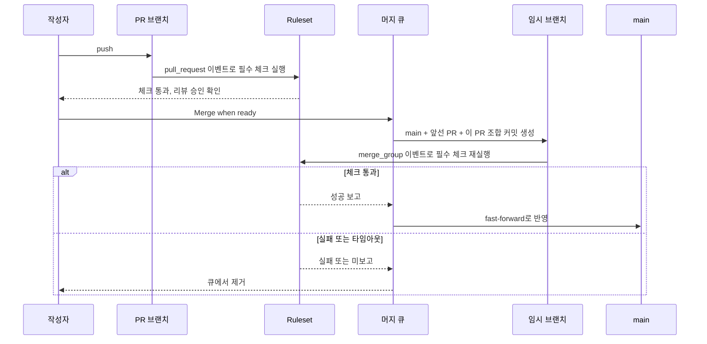
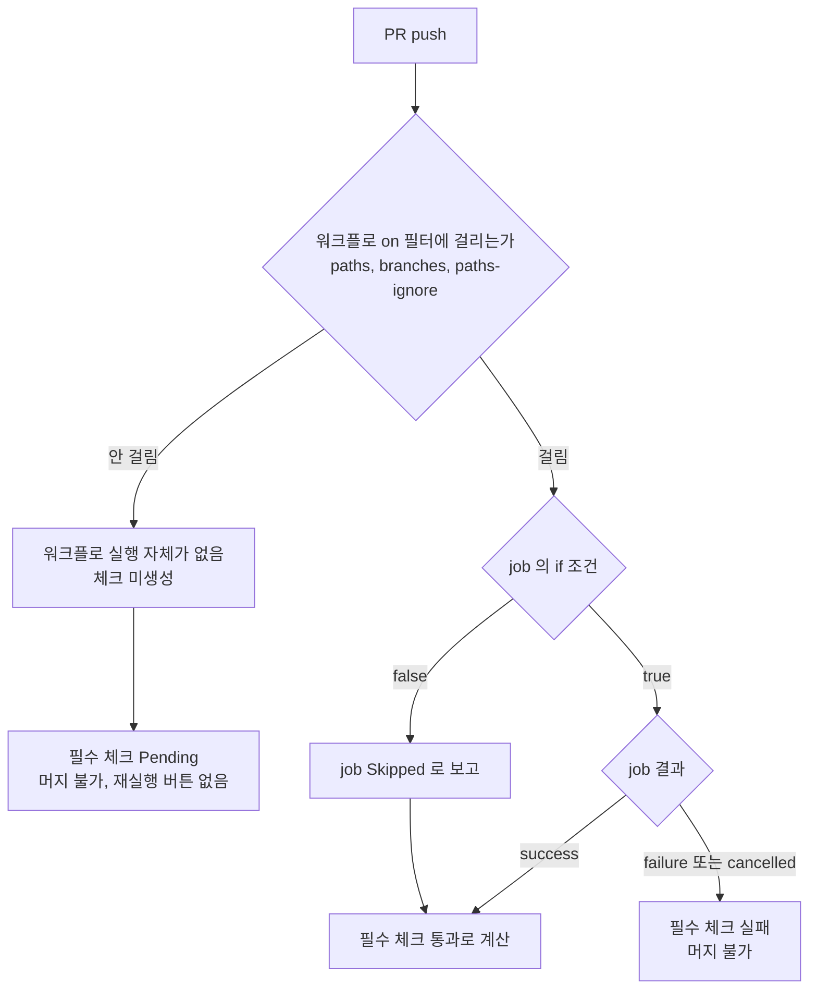
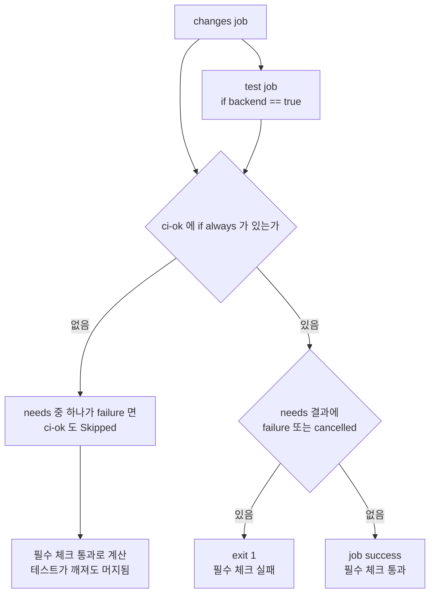
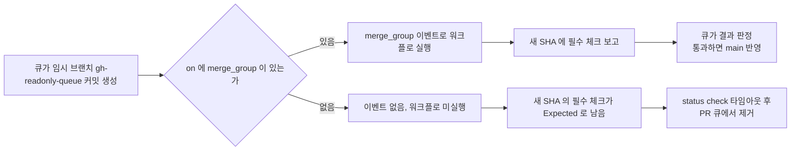
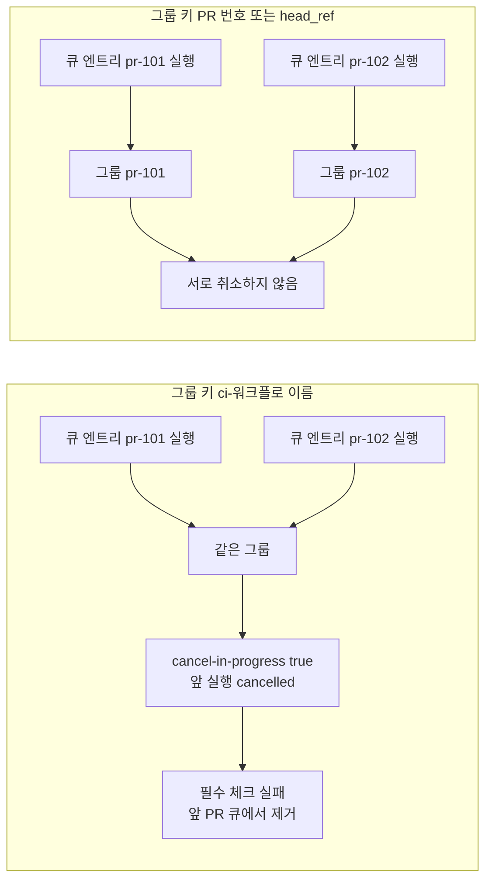
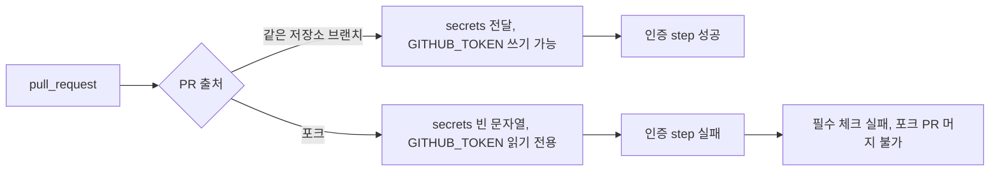

# GitHub Actions 머지 관문 운영, 필수 체크와 머지 큐

[GitHub Actions](GitHub_Actions.md)로 CI를 짜는 것과, 그 CI를 main 머지의 관문으로 쓰는 것은 다른 일이다. 워크플로가 돌기만 하면 되던 시기에는 job이 하나 빠져도, 이름이 바뀌어도 아무도 모른다. 필수 체크로 걸어 두는 순간 job 이름 하나, 트리거 하나가 PR 전체를 막는다.

이 문서는 Ruleset(또는 Branch protection)에 필수 체크를 걸고 머지 큐까지 켠 저장소에서 실제로 막히는 지점을 증상, 원인, 해결 순서로 정리한다. 표현식 평가와 `needs` 결과 전파는 [표현식과 워크플로 명령](Git_Hub_Actions_Expressions_And_Workflow_Commands.md)에서 다뤘으므로 여기서는 결과만 가져다 쓴다.

## PR에서 main까지 검사가 도는 위치

머지 큐를 켜면 검사가 두 번 돈다. PR 브랜치에서 한 번, 큐에 들어간 뒤 임시 브랜치에서 한 번이다. 두 번째 검사는 PR 커밋이 아니라 "현재 main + 큐 앞쪽 PR들 + 이 PR"을 합친 커밋을 대상으로 한다. 필수 체크의 결과는 커밋 SHA에 붙기 때문에 PR에서 초록불이던 체크가 큐에서는 새 SHA에 다시 보고돼야 한다.



그림에서 보면 되는 곳은 `Tmp`에서 `Rule`로 가는 화살표다. 임시 브랜치 이름은 `gh-readonly-queue/main/pr-123-<sha>` 형태이고, 이 브랜치에 push가 일어나는 것이 아니라 `merge_group` 이벤트가 발생한다. 워크플로가 이 이벤트를 받지 않으면 `Rule`은 영원히 보고를 기다린다. 아래 증상들은 대부분 이 흐름의 어딘가에서 보고가 오지 않거나 엉뚱한 상태로 오는 문제다.

## 필수 체크가 Pending에서 움직이지 않는다

### 증상

PR을 열었는데 머지 버튼 아래에 `Expected — Waiting for status to be reported`가 뜬 체크가 있고, Actions 탭에는 그 워크플로 실행이 아예 없다. 문서만 고친 PR에서 주로 나온다. 재실행할 실행 자체가 없어서 "Re-run" 버튼도 없다.

### 원인

필수 체크는 job 이름으로 건다. 그런데 그 job이 속한 워크플로가 `on.pull_request.paths` 필터에 걸려 시작조차 안 되면, 체크 자체가 만들어지지 않는다. 시작하지 않은 체크는 "실패"도 "건너뜀"도 아닌 "아직 보고 없음"이라 Pending으로 남는다.

반면 워크플로는 시작됐고 job 단위 `if`로 건너뛴 경우는 Skipped로 보고되고, 필수 체크는 이걸 통과로 센다. 같은 "안 돌았다"인데 한쪽은 막고 한쪽은 통과시킨다.



`[skip ci]`를 커밋 메시지에 넣은 경우도 왼쪽 가지와 같다. 워크플로가 시작되지 않으니 Pending이다.

matrix는 이름이 하나 더 얽힌다. matrix job의 체크 이름은 `test (17)`, `test (21)`처럼 값이 붙은 이름으로 만들어진다. Ruleset에 `test (17)`을 걸어 놓고 나중에 matrix를 `[17, 21]`에서 `[21, 25]`로 바꾸면 `test (17)`은 더 이상 만들어지지 않고 모든 PR이 Pending에 걸린다. matrix 전체가 `if`로 건너뛰어졌을 때는 값이 치환되지 않은 이름으로 보고된다는 설명을 본 기억이 있는데, 이 부분은 직접 재현하지 못했다. 이름이 이상하면 PR의 Checks 탭에서 실제로 만들어진 이름을 눈으로 확인하는 게 빠르다.

Reusable workflow를 호출하는 경우 체크 이름은 `호출한job / 호출된job` 형태로 합쳐진다. 호출 측 job 이름을 바꾸면 같은 문제가 난다.

### 해결

워크플로 수준의 `paths` 필터를 걷어내고, 항상 시작되는 워크플로 안에서 변경 파일을 보고 job을 건너뛴다. 그리고 필수 체크는 개별 job이 아니라 마지막에 결과를 모으는 집계 job 하나에만 건다. matrix를 바꾸든 job을 추가하든 필수 체크 이름은 `ci-ok` 하나로 고정된다.

```yaml
name: ci

on:
  pull_request:
  merge_group:

permissions:
  contents: read

jobs:
  changes:
    runs-on: ubuntu-latest
    outputs:
      backend: ${{ steps.diff.outputs.backend }}
    steps:
      - uses: actions/checkout@v4
        with:
          fetch-depth: 0
      - id: diff
        env:
          BASE: ${{ github.event.pull_request.base.sha || github.event.merge_group.base_sha }}
          HEAD: ${{ github.event.pull_request.head.sha || github.event.merge_group.head_sha }}
        run: |
          if git diff --name-only "$BASE...$HEAD" | grep -qE '^(backend/|build\.gradle|settings\.gradle|gradle/)'; then
            echo "backend=true" >> "$GITHUB_OUTPUT"
          else
            echo "backend=false" >> "$GITHUB_OUTPUT"
          fi

  test:
    needs: changes
    if: needs.changes.outputs.backend == 'true'
    runs-on: ubuntu-latest
    strategy:
      matrix:
        java: [17, 21]
    steps:
      - uses: actions/checkout@v4
      - uses: actions/setup-java@v4
        with:
          distribution: temurin
          java-version: ${{ matrix.java }}
      - run: ./gradlew test

  ci-ok:
    if: always()
    needs: [changes, test]
    runs-on: ubuntu-latest
    steps:
      - name: needs 결과 확인
        if: contains(needs.*.result, 'failure') || contains(needs.*.result, 'cancelled')
        run: |
          echo "실패 또는 취소된 job이 있다: ${{ join(needs.*.result, ', ') }}"
          exit 1
```

집계 job에는 두 가지 함정이 있다.

첫째는 `if: always()`를 빼먹는 경우다. `needs`에 걸린 job이 실패하면 기본 동작은 의존하는 job을 건너뛰는 것이다. 집계 job이 Skipped가 되고, 필수 체크는 Skipped를 통과로 센다. 테스트가 깨졌는데 `ci-ok`는 초록이고 머지가 된다. 필수 체크를 하나로 모으는 패턴이 오히려 관문에 구멍을 내는 가장 흔한 형태다.

둘째는 `needs`에 job을 하나 추가하고 `ci-ok`의 `needs`에는 넣지 않는 경우다. 새 job이 실패해도 집계는 모른다. job을 추가하는 PR에서 `needs` 목록을 같이 보는 습관 말고는 막을 방법이 없어서, 리뷰 때 `ci-ok`의 `needs`를 확인하는 항목을 PR 템플릿이 아니라 CODEOWNERS로 걸어 두는 쪽이 낫다(아래 절 참고).

`ci-ok`가 어디서 구멍이 나는지는 `needs` 안의 job 결과가 집계 job까지 전달되는 경로로 보면 쉽다.



위쪽 가지가 앞에서 말한 첫 번째 함정이고, `ci-ok`의 `needs`에 빠진 job은 이 그림에 아예 화살표가 오지 않는 두 번째 함정이다.

집계 job이 `needs.*.result`를 보고 내리는 판정은 아래 표대로 갈린다.

| needs 안의 결과 | ci-ok 동작 | 필수 체크 |
|---|---|---|
| 전부 success | step 건너뜀, job success | 통과 |
| 일부 skipped, 나머지 success | step 건너뜀, job success | 통과 |
| 하나라도 failure | `exit 1` | 실패 |
| 하나라도 cancelled | `exit 1` | 실패 |

skipped를 통과로 취급하는 것은 의도한 설계다. 문서만 바꾼 PR에서 `test`가 건너뛰어져도 막히지 않아야 하기 때문이다. 다만 `changes` job 자체가 실패해서 `test`가 건너뛰어지는 경우는 `changes`의 failure가 `needs`에 들어 있어 잡힌다. `changes`를 `needs`에서 빼면 이 경로가 뚫린다.

## merge_group 트리거가 없어서 큐가 타임아웃 난다

### 증상

머지 큐에 PR을 넣었더니 큐에서 대기 상태로 한참 있다가 제거된다. PR에서는 모든 체크가 초록이었다. 임시 브랜치 `gh-readonly-queue/...`의 커밋 상태를 보면 필수 체크가 전부 "Expected"에서 멈춰 있다. Actions 탭에는 그 브랜치의 실행이 없다.

### 원인

위 워크플로 맨 위의 `on:` 에 `merge_group`이 없는 경우다. 워크플로가 `pull_request`와 `push`만 받고 있으면, 큐가 만든 임시 커밋에 대해서는 아무 이벤트도 받지 못한다. 임시 브랜치는 `push` 이벤트도 일으키지 않는다. 그래서 필수 체크가 새 SHA에 보고되지 않고, 큐는 설정된 status check 타임아웃이 지날 때까지 기다리다 PR을 뺀다. 타임아웃 값은 Ruleset의 머지 큐 설정 화면에서 바꿀 수 있다.

머지 큐를 처음 켠 날 이걸 겪는 경우가 많다. 필수 체크는 이미 몇 달째 잘 동작하고 있었기 때문에 의심 순서에서 한참 뒤로 밀린다.

워크플로에 `merge_group`이 있을 때와 없을 때 큐가 받는 결과를 나란히 놓으면 다음과 같다.



갈림길은 `on:` 블록 한 줄이다. 오른쪽 경로는 실패 로그가 하나도 남지 않기 때문에 Actions 탭에서 임시 브랜치의 실행이 있는지부터 확인한다.

### 해결

필수 체크를 보고하는 모든 워크플로에 `merge_group`을 추가한다. 하나라도 빠지면 그 워크플로가 보고하는 체크만 Pending으로 남는다.

```yaml
on:
  pull_request:
  merge_group:
    types: [checks_requested]
```

`types`는 현재 `checks_requested` 하나뿐이라 생략해도 된다. 주의할 점은 이벤트마다 쓸 수 있는 값이 달라진다는 것이다.

| 쓰는 값 | pull_request | merge_group |
|---|---|---|
| 베이스 SHA | `github.event.pull_request.base.sha` | `github.event.merge_group.base_sha` |
| 헤드 SHA | `github.event.pull_request.head.sha` | `github.event.merge_group.head_sha` |
| PR 번호 | `github.event.pull_request.number` | 없음 |
| 브랜치 이름 | `github.head_ref` | `github.event.merge_group.head_ref` |

`github.event.pull_request.*`를 그대로 쓰는 step은 큐에서 빈 값을 받는다. PR 번호로 코멘트를 달거나 라벨로 분기하는 step이 있으면 `merge_group`에서는 건너뛰도록 `if: github.event_name == 'pull_request'`를 붙인다. 큐 단계에서 PR 번호가 필요하면 `head_ref` 문자열의 `pr-123-` 부분을 잘라 써야 하는데, 이 형식에 기대는 코드는 깨지기 쉬워서 가능하면 피한다.

`on.pull_request.paths` 필터는 `merge_group` 쪽에 같은 방식으로 걸 수 없다고 알고 있다. 이 필터를 쓰는 워크플로를 그대로 두면 큐에서 보고가 없을 수 있다는 점에서도, 앞 절처럼 필터를 job 안으로 옮기는 편이 안전하다.

임시 브랜치가 필요 이상으로 길게 도는 문제도 있다. `merge_group` 이벤트로 시작된 워크플로는 PR에서 이미 돌린 무거운 검사(예: 전체 통합 테스트)를 한 번 더 돈다. "base + PR 조합"에서의 충돌을 잡는 게 큐의 목적이므로 단위 테스트와 빌드는 돌리되, 배포 미리보기나 이미지 푸시 같은 부수효과 있는 job은 `if: github.event_name != 'merge_group'`로 뺀다.

## concurrency로 취소하면 체크가 cancelled로 남는다

### 증상

머지 큐에서 PR 두 개가 연달아 들어가면 앞 PR의 검사가 중간에 취소되고, 그 PR이 큐에서 제거된다. 로그에는 "Canceling since a higher priority waiting request for ... exists"가 남아 있다. 또는 PR에 push를 연달아 했을 때 마지막 실행까지 취소된 것처럼 보이는 경우가 있다.

### 원인

PR에서 쓰던 concurrency 설정을 그대로 두면 이런 일이 난다.

```yaml
concurrency:
  group: ci-${{ github.workflow }}
  cancel-in-progress: true
```

그룹 키가 워크플로 이름뿐이면 서로 다른 PR의 실행이 같은 그룹이 된다. 그룹당 실행 중 하나, 대기 하나만 유지되고 새로 들어온 실행이 앞 실행을 취소한다. 머지 큐는 병렬로 여러 임시 브랜치를 검사하는 구조이므로, 큐 안의 검사끼리 서로를 취소한다. 취소된 체크는 `cancelled`이고, 필수 체크는 cancelled를 통과로 세지 않는다.

그룹 키가 워크플로 이름뿐일 때와 PR·큐 엔트리별로 나눴을 때 취소가 어디까지 번지는지 비교하면 아래와 같다.



왼쪽은 서로 다른 엔트리가 한 그룹으로 묶여 앞 실행이 죽는 경로이고, 오른쪽은 엔트리마다 그룹이 달라 취소가 같은 PR의 이전 실행에만 걸리는 경로다.

`github.ref`로 그룹을 나눈 경우에도 얽힌다. `pull_request` 이벤트에서 `github.ref`는 `refs/pull/123/merge`라 PR마다 나뉘지만, 같은 PR에 라벨을 붙이는 `labeled` 이벤트까지 `pull_request` 트리거에 넣었다면 라벨 한 번에 진행 중인 실행이 취소된다. 새로 시작된 실행이 job `if`로 건너뛰면 그 시점의 체크 상태가 어떻게 보이는지는 환경에서 직접 확인하지 못했다. 실행 목록에서 "Cancelled"가 보이는데 새 실행이 없거나 Skipped라면 이 경우를 의심한다.

### 해결

그룹 키에 PR 또는 큐 엔트리를 구분하는 값을 넣고, 큐에서는 취소하지 않는다.

```yaml
concurrency:
  group: ci-${{ github.event.pull_request.number || github.event.merge_group.head_ref }}
  cancel-in-progress: ${{ github.event_name == 'pull_request' }}
```

PR에서는 같은 PR의 이전 실행만 취소하고, 큐에서는 임시 브랜치마다 고유한 `head_ref`를 그룹으로 삼아 서로 건드리지 않게 한다. `cancel-in-progress`에 표현식을 쓸 수 있어서 이벤트별로 갈라 쓸 수 있다.

취소는 같은 SHA의 체크가 아니라 이전 SHA의 체크에서 일어난다는 점도 구분해야 한다. PR에 push 두 번을 하면 첫 SHA의 실행이 취소되는데, 필수 체크는 PR의 현재 head SHA를 보므로 문제가 없다. 막히는 경우는 마지막 SHA의 실행이 취소됐을 때뿐이고, 그건 대부분 위처럼 그룹 키가 넓어서다.

## 포크 PR에서 필수 체크가 실패한다

### 증상

외부 기여자가 포크에서 연 PR만 특정 체크가 실패한다. 로그에는 인증 실패나 빈 토큰 관련 오류가 보인다. 사내 브랜치에서 연 PR은 통과한다.

### 원인

`pull_request` 이벤트로 도는 포크 PR의 워크플로에는 저장소 시크릿이 전달되지 않고 `GITHUB_TOKEN`도 읽기 전용이다. 시크릿 참조는 에러가 아니라 빈 문자열이 된다. 그래서 `SONAR_TOKEN`이나 레지스트리 인증이 필요한 step은 인증 오류로 실패하거나, 빈 값을 받아 엉뚱한 메시지를 낸다. 필수 체크에 그 job이 걸려 있으면 포크 PR은 영원히 머지할 수 없다.

Dependabot이 연 PR도 비슷하다. Dependabot PR은 Actions 시크릿이 아니라 Dependabot 전용 시크릿 저장소를 읽으므로, 같은 이름의 시크릿을 Dependabot 쪽에도 등록해야 한다.

아래 흐름에서 보듯 같은 job이 이벤트 출처에 따라 다른 길로 간다. 문제는 오른쪽 가지에서 실패한 job이 필수 체크에 걸려 있을 때다.



### 해결

시크릿이 필요한 job을 필수 체크에서 분리하는 쪽이 맞다. 시크릿 없이 돌 수 있는 빌드와 테스트만 `ci-ok`에 묶고, 정적 분석 업로드 같은 job은 선택 체크로 둔다. 같은 job을 유지해야 하면 토큰이 없을 때 건너뛰게 한다.

```yaml
  sonar:
    runs-on: ubuntu-latest
    env:
      SONAR_TOKEN: ${{ secrets.SONAR_TOKEN }}
    steps:
      - uses: actions/checkout@v4
      - name: 분석 업로드
        if: env.SONAR_TOKEN != ''
        run: ./gradlew sonar
```

`secrets` 컨텍스트는 step의 `if`에서 직접 못 쓰기 때문에 job의 `env`로 한 번 받아서 비교한다. 이 방식은 포크 PR이 분석 없이 통과한다는 뜻이다. 분석이 품질 기준이라면 메인테이너가 포크 브랜치를 사내 브랜치로 옮겨 다시 여는 절차를 정해야 한다.

`pull_request_target`으로 바꾸면 시크릿이 전달되므로 해결된 것처럼 보이지만, 이 이벤트는 base 브랜치의 워크플로를 시크릿 권한으로 돌리면서 PR 코드를 체크아웃하는 순간 외부 코드가 시크릿에 접근하게 된다. 포크 PR의 코드를 체크아웃해서 빌드하는 job에는 쓰지 않는다. 라벨 붙이기, 코멘트 달기처럼 PR 코드를 실행하지 않는 용도로만 쓴다.

## CODEOWNERS와 필수 리뷰어 조합

필수 체크가 코드의 상태를 보증한다면, 코드 소유자 리뷰는 누가 봤는지를 보증한다. Ruleset에서 "Require review from Code Owners"를 켜면 PR이 건드린 경로의 소유자 중 최소 한 명의 승인이 있어야 한다.

```text
# .github/CODEOWNERS
*                       @my-org/backend
/.github/workflows/     @my-org/platform
/.github/CODEOWNERS     @my-org/platform
/db/migration/          @my-org/dba @my-org/backend
```

실무에서 걸리는 지점은 몇 가지다.

- 마지막으로 매치되는 패턴이 이긴다. `*` 뒤에 `/.github/workflows/`가 있으므로 워크플로 변경은 `backend`가 아니라 `platform`만 승인할 수 있다. 순서를 바꾸면 `*`가 이긴다.
- `@my-org/platform` 팀에 저장소 write 권한이 없으면 그 줄은 효력이 없다. 에러가 나는 게 아니라 CODEOWNERS 파일 화면에 오류로 표시만 되고, 해당 경로는 소유자가 없는 것처럼 동작한다.
- PR 작성자 본인이 유일한 소유자이면 본인 승인은 세지 않으므로 PR이 막힌다. 소유자가 한 명뿐인 경로에는 팀을 쓴다.
- 새 push 후 승인을 무효화하는 설정(Dismiss stale approvals)을 켜 두면, 리뷰 반영 push마다 소유자가 다시 승인해야 한다. 머지 큐에서는 큐에 들어간 뒤에 승인이 취소되지 않는다. 임시 브랜치는 PR의 새 push가 아니기 때문이다.
- `/.github/CODEOWNERS`와 `/.github/workflows/`를 platform 소유로 두면, `ci-ok`의 `needs` 목록을 몰래 줄이는 PR이 platform 리뷰 없이는 머지되지 않는다. 앞에서 말한 집계 job 누락 문제를 사람이 아니라 구조로 막는 쪽이다.

Ruleset에서 필수 체크를 추가할 때는 체크를 보고하는 주체(integration)도 지정할 수 있다. GitHub Actions 앱으로 고정해 두면 외부 앱이 같은 이름의 상태를 임의로 보고해서 관문을 통과하는 것을 막는다. 지정하지 않으면 이름만 맞으면 어느 주체의 보고든 받는다.

## 확인한 범위

이 문서에 넣은 두 워크플로 YAML은 actionlint로 문법과 표현식을 검사했다. 아래 동작은 로컬에서 재현하지 못했고, GitHub 문서와 운영 중 겪은 증상에 근거한다. Pending/Skipped 판정, `merge_group` 임시 브랜치 이름, 큐 타임아웃, 포크 PR 시크릿 제한이 여기에 속한다. matrix job이 건너뛰어질 때의 정확한 체크 이름과 `labeled` 이벤트로 취소된 뒤의 체크 표시는 확인하지 못해서 본문에서도 단정하지 않았다. 적용 전에는 테스트용 저장소에서 문서만 고친 PR과 `merge_group` 없는 워크플로를 하나씩 만들어 위 흐름을 확인해 보는 편이 확실하다.
