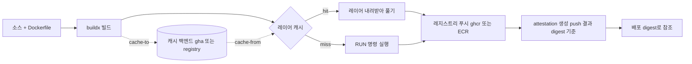
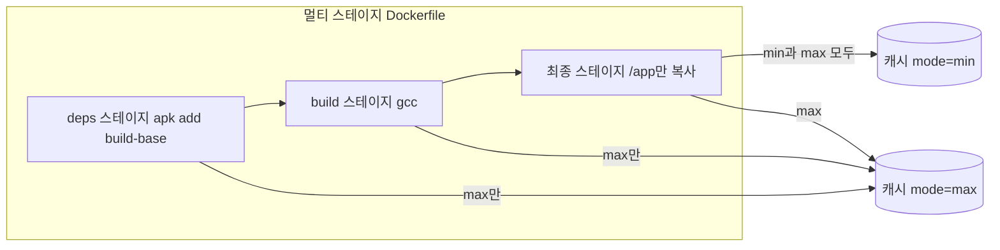
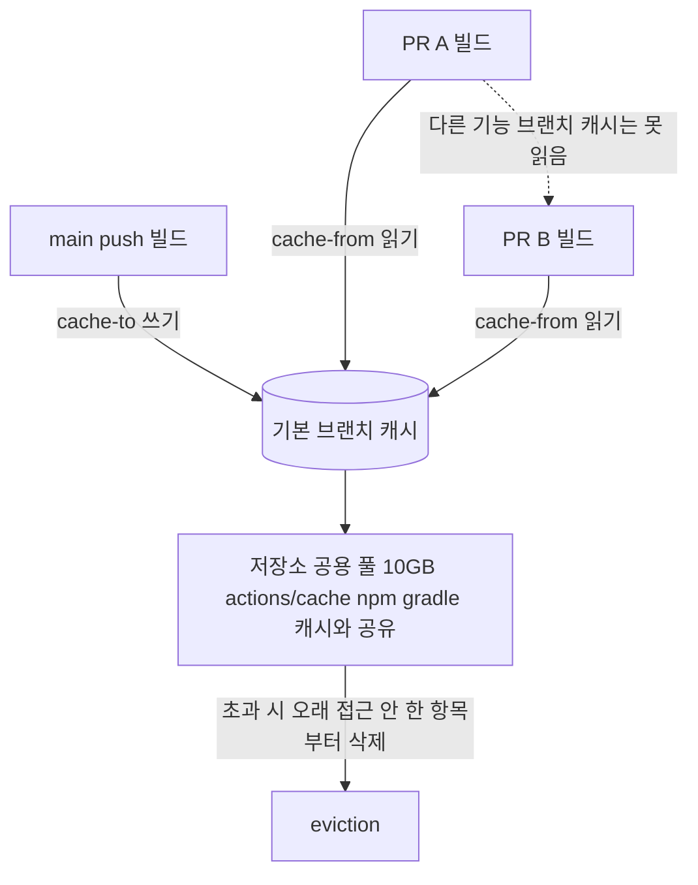
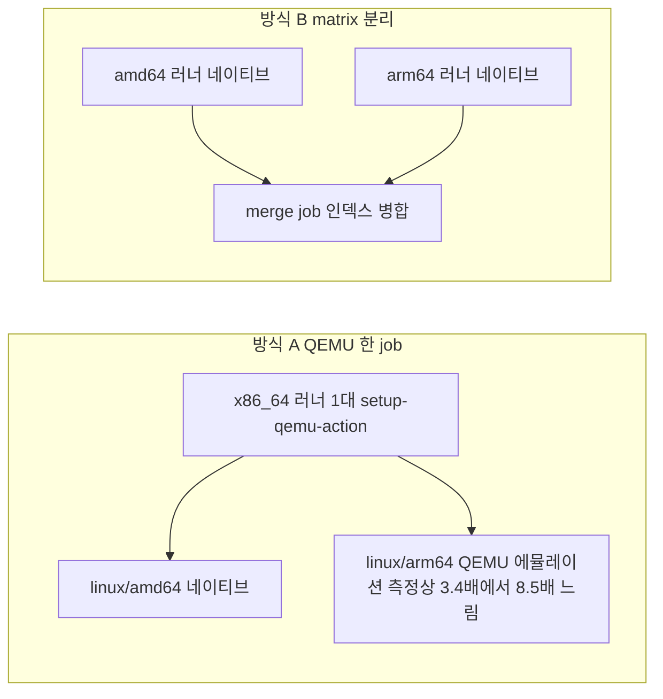
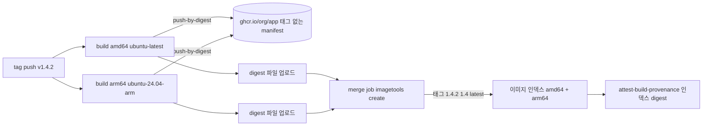
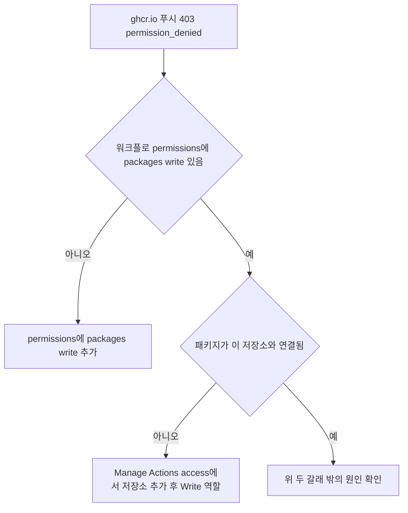
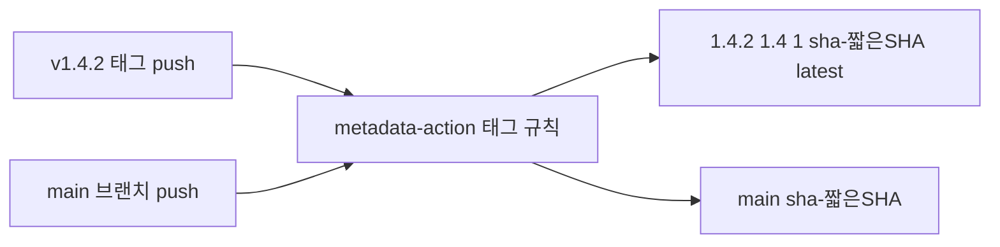
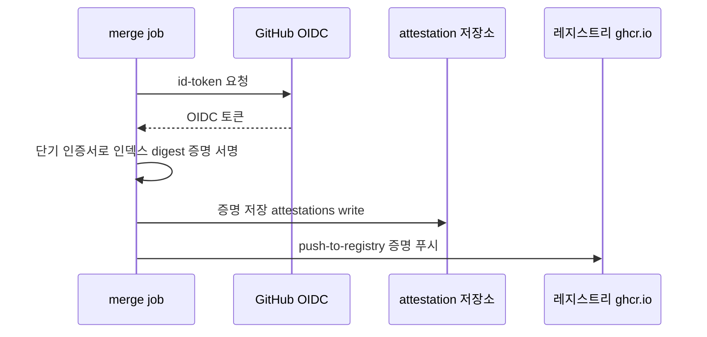
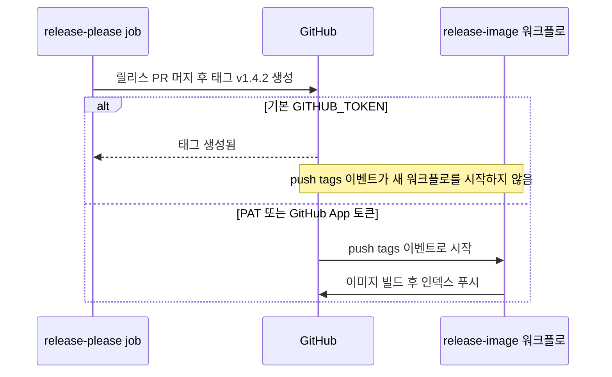

# GitHub Actions 컨테이너 이미지 빌드와 릴리스, buildx 캐시·멀티 아키텍처·태그·attestation

[GitHub Actions](GitHub_Actions.md) 문서의 ECR → ECS 예제는 `docker build` 한 줄과 `docker push` 한 줄로 이미지를 만든다. 러너는 매번 빈 상태로 뜨니 `FROM`부터 `npm ci`까지 전부 처음부터 돈다. 태그는 커밋 SHA 하나뿐이라 "지금 운영에 나간 게 몇 버전인지"를 SHA에서 역으로 찾아야 한다. arm64 서버(Graviton)로 옮기는 순간 이 파일은 그대로 쓸 수 없다. 이미지가 어디서 어떻게 빌드됐는지 증명할 방법도 없다.

이 문서는 그 빈칸을 채운다. 빌드 캐시를 붙이고, 두 아키텍처를 만들고, ghcr.io에 올리고, 태그를 붙이고, 릴리스 이벤트로 묶고, 출처 증명을 남기는 순서다. 캐시 모드와 QEMU 시간, manifest 병합은 로컬에서 직접 돌려 쟀고, GitHub 쪽 동작(gha 캐시, ghcr, attestation)은 돌리지 못했다. 어느 쪽인지는 마지막 절에 구분해 적었다.

## 소스에서 배포까지 이미지가 지나는 길

흐름은 한 줄이다. 소스를 buildx로 빌드하고, 레이어마다 캐시를 보고, 레지스트리에 올리고, 올라간 digest에 증명을 붙이고, 배포는 그 digest로 참조한다. 아래 도식에서 볼 곳은 캐시 백엔드가 빌드의 입력(`cache-from`)이자 출력(`cache-to`)이라는 점과, attestation이 태그가 아니라 푸시 결과의 digest에 붙는다는 점이다.



hit 쪽 노드를 "레이어 내려받아 풀기"로 적은 데는 이유가 있다. 원격 캐시는 공짜가 아니다. 캐시된 레이어를 네트워크로 받아 디스크에 풀어야 하고, 그 비용이 `RUN`을 다시 실행하는 비용보다 크면 캐시가 오히려 손해다. 다음 절에서 실제로 그런 숫자가 나왔다.

## buildx 캐시, gha 백엔드와 mode

### 기본 설정

`docker/setup-buildx-action`이 `docker-container` 드라이버 빌더를 만들고, `docker/build-push-action`이 그 빌더로 빌드한다. gha 캐시는 이 둘이 있어야 쓴다. 러너에 설치된 기본 `docker build`는 캐시를 러너 로컬 디스크에만 둔다.

```yaml
- uses: docker/setup-buildx-action@v3

- uses: docker/build-push-action@v6
  with:
    context: .
    push: ${{ github.event_name != 'pull_request' }}
    tags: ghcr.io/example-org/app:ci
    cache-from: type=gha,scope=app
    cache-to: ${{ github.event_name == 'push' && 'type=gha,scope=app,mode=min' || '' }}
```

`cache-to`를 push 이벤트에서만 켠 이유는 뒤의 eviction 절에서 설명한다. `scope`를 지정하지 않으면 기본값 `buildkit` 하나를 모든 빌드가 공유한다. 이미지를 두 개 만드는 워크플로나 아키텍처별 matrix에서 scope 없이 `cache-to`를 쓰면 서로의 캐시를 덮어쓴다. 캐시가 "가끔만 맞는" 증상이 나오면 먼저 scope를 본다.

### mode=min과 mode=max

`mode`는 캐시에 어떤 레이어를 넣느냐를 정한다.

- `min`(기본값)은 최종 이미지에 들어가는 레이어만 캐시에 넣는다.
- `max`는 멀티 스테이지 빌드의 중간 스테이지 레이어까지 전부 넣는다.

차이는 Dockerfile이 멀티 스테이지이고 중간 스테이지가 무거울 때 드러난다. 최종 이미지가 `COPY --from=build /app /app` 하나로 끝나는 구조라면, 최종 이미지 레이어에는 컴파일러도 `node_modules`도 없다. `min`으로 내보낸 캐시에는 그 스테이지의 결과가 없으니 소스가 한 줄만 바뀌어도 의존성 설치부터 다시 돈다.

아래 도식에서 볼 곳은 `min`이 최종 스테이지 레이어만 캐시로 내보내는 반면 `max`는 `deps`와 `build` 스테이지까지 내보낸다는 점이다.



이걸 로컬에서 재현했다. Dockerfile은 세 스테이지다. `deps`(`apk add build-base`, 레이어 78MB), `build`(`COPY main.c` 후 `gcc`), 그리고 `/app`만 복사하는 최종 스테이지. 레지스트리 캐시를 `min`과 `max`로 각각 내보낸 다음, 빌더 캐시를 전부 지우고 `main.c`를 바꿔서 `--cache-from`으로 다시 빌드했다.

| 조건 | 시간 (3회) | `apk add` 재실행 | 캐시에서 받은 레이어 | 내보낸 캐시 |
|---|---|---|---|---|
| 캐시 없음 (`--no-cache`) | 9.2s, 9.5s, 12.0s | 예 | 0 | 없음 |
| `mode=min` | 11.5s, 11.8s, 12.3s | 예 | 1~2개 | 레이어 2개, 3MB |
| `type=inline` | 11.6s (1회) | 예 | 2개 | 이미지에 내장 |
| `mode=max` | 14.4s, 14.9s, 15.5s | 아니오 | 4개 | 레이어 5개, 77MB |

측정 조건은 Docker 29.1.3, buildx 0.30.1, BuildKit v0.33.1(`docker-container` 드라이버), 4 vCPU·메모리 2GB의 x86_64 리눅스 호스트다. 캐시 저장소는 같은 호스트의 `registry:2`라서 네트워크 지연이 거의 없다. 베이스는 alpine:3.20이고 `apk add`는 외부 미러에서 받는다. 숫자 자체보다 방향을 봐야 한다. GitHub 러너와 gha 캐시 서비스에서는 다른 값이 나온다.

`max`가 `apk add`를 다시 실행하지 않은 것은 맞다. 그런데 빌드는 더 느렸다. `max` 로그에서 78MB 레이어를 받는 데 1.3초, 디스크에 풀어 쓰는 데 10.2초가 걸렸다. 반면 `apk add` 자체는 이 호스트에서 7~8초면 끝난다. 중간 레이어를 복원하는 비용이 그 레이어를 만드는 비용을 넘은 경우다.

이 결과를 일반화하면 안 된다. `apk add build-base`는 미러가 빠르고 설치가 짧다. `gradle build`로 의존성 수백 개를 받거나, 빌드가 몇 분 걸리는 스테이지는 레이어 복원보다 실행 시간이 훨씬 길다. 판단 기준은 하나다. 중간 스테이지 한 단계의 실행 시간이 그 레이어의 다운로드와 압축 해제 시간보다 긴가. 모르겠으면 `min`으로 시작하고, 소스만 바꾼 빌드가 의존성 설치에서 오래 걸리는 것을 로그에서 확인한 뒤에 `max`로 바꾼다.

`max`로 바꾸면 캐시 용량도 같이 커진다. 위 표에서 3MB가 77MB가 됐다. gha 캐시는 용량 한도가 있으니 이 증가가 다음 절의 문제로 이어진다.

### 캐시 백엔드 비교

백엔드 선택은 용량 한도, 공유 범위, 러너 환경에서 갈린다.

| 백엔드 | 캐시가 놓이는 곳 | mode | 중간 스테이지 | 공유 범위 | 한도와 정리 | 맞는 환경 |
|---|---|---|---|---|---|---|
| `type=gha` | GitHub 캐시 서비스 | min, max | max일 때 | 같은 저장소, 브랜치 스코프 규칙 적용 | 저장소당 기본 10GB, 7일 미접근 삭제 | GitHub-hosted 러너의 일반 CI |
| `type=registry` | 이미지와 별도 태그(예: `:buildcache`)의 캐시 매니페스트 | min, max | max일 때 | 레지스트리에 접근하는 곳 어디서나 | 레지스트리 정책(ECR 수명 주기 규칙 등) | self-hosted·ARC 러너, 로컬 개발과 CI 공유, 용량이 큰 이미지 |
| `type=inline` | 이미지 설정(config)에 메타데이터 내장 | min만 | 못 담음 | 이미지를 pull할 수 있는 곳 | 이미지 수명과 같음 | 단일 스테이지, 설정을 최소로 두고 싶을 때 |

로컬에서 `inline`을 같은 방식으로 돌려 보니 `min`과 같은 결과가 나왔다. `apk add`가 다시 실행됐다. 멀티 스테이지에서 inline은 중간 스테이지를 못 담는다.

`type=registry`는 ECR에서 설정이 하나 더 붙는다. ECR은 이미지 매니페스트 형식의 캐시만 받으므로 `cache-to: type=registry,ref=<계정>.dkr.ecr.ap-northeast-2.amazonaws.com/app:buildcache,mode=max,image-manifest=true,oci-mediatypes=true`처럼 두 옵션을 같이 줘야 한다. 이 부분은 AWS 문서를 읽고 쓴 것이고 ECR에는 올려 보지 않았다.

### 10GB 한도와 eviction

gha 캐시는 저장소 하나에 기본 10GB다. 문서 기준으로 이 한도를 넘으면 가장 오래 접근하지 않은 항목부터 지워지고, 7일 동안 한 번도 접근하지 않은 항목은 그 전에 사라진다. 여기서 놓치기 쉬운 점이 둘 있다.

첫째, 10GB는 이미지 캐시만의 몫이 아니다. `actions/cache`, `setup-node`의 npm 캐시, `setup-java`의 gradle 캐시가 같은 풀을 쓴다. 이미지 캐시를 `mode=max`로 올려 2GB씩 쌓으면 빌드 캐시가 의존성 캐시를 밀어낸다. 그러면 의존성 캐시가 매번 miss가 나서 CI가 느려지는데, 원인은 이미지 쪽에 있다.

둘째, 캐시는 브랜치 스코프다. 기능 브랜치는 자기 브랜치와 기본 브랜치의 캐시를 읽을 수 있고, 다른 기능 브랜치의 캐시는 못 읽는다. 그런데 `cache-to`를 모든 브랜치에서 켜면 PR마다 자기 몫의 캐시를 새로 쓴다. 활발한 저장소는 PR 20개가 각자 몇백 MB씩 쓰면 금방 10GB를 채우고, 정작 모두가 읽는 기본 브랜치의 캐시가 LRU 규칙으로 밀려난다. 위 예제에서 `cache-to`를 `push` 이벤트에만 건 이유다. PR은 읽기만 한다.

아래 도식은 이 구조를 그린 것이다. PR 빌드는 기본 브랜치 캐시를 읽기만 하고, 쓰기는 `push` 빌드만 하며, 모든 캐시는 10GB 공용 풀에서 경쟁한다.



다른 방법으로 `cache-to`를 기본 브랜치에서만 쓰게 제한할 수도 있다.

```yaml
cache-to: ${{ github.ref == 'refs/heads/main' && 'type=gha,scope=app,mode=min' || '' }}
```

현재 사용량은 CLI로 본다.

```bash
gh api repos/{owner}/{repo}/actions/cache/usage
gh cache list --sort size_in_bytes --order desc --limit 20
gh cache delete --all
```

buildx가 만든 항목은 키 접두어가 `buildkit`로 시작한다. 용량 대부분을 이런 항목이 차지하면 `mode`를 `min`으로 낮추거나 `registry` 백엔드로 옮기는 것을 고려한다.

한 가지 더 있다. Dockerfile의 `RUN --mount=type=cache`로 만든 패키지 매니저 캐시(`/root/.m2`, `/root/.npm`)는 `cache-to`로 내보내는 대상이 아니다. 레이어에 들어가지 않는 마운트라서 gha 캐시에 안 올라가고, 러너가 바뀌면 비어 있다. 이 동작은 BuildKit 문서에서 읽은 것이며 gha에서 따로 확인하지는 않았다. 이 마운트를 CI에서도 살리려면 별도로 저장했다 복원하는 단계를 붙여야 한다.

## 멀티 아키텍처 빌드

### QEMU 에뮬레이션의 비용

`docker/setup-qemu-action`을 넣고 `platforms: linux/amd64,linux/arm64`로 바꾸면 한 job에서 두 아키텍처가 나온다. 제일 짧은 길이고, 동작도 한다. 문제는 arm64 쪽이 에뮬레이션으로 도는 동안 모든 `RUN`이 느려진다는 것이다.

x86_64 호스트에서 binfmt로 `qemu-aarch64`를 등록하고 같은 Dockerfile을 두 플랫폼으로 3회씩 빌드했다. 둘 다 `--no-cache`다. 첫 번째는 앞 절의 세 스테이지 Dockerfile이다.

| 빌드 (`--no-cache`, 3회) | linux/amd64 | linux/arm64 (QEMU) |
|---|---|---|
| 세 스테이지 Dockerfile 전체 | 9.2s, 9.5s, 12.0s | 30.6s, 32.1s, 32.6s |

두 번째는 컴파일 비중을 키우려고 만든 Dockerfile이다. `apk add build-base` 뒤에, 함수 4000개짜리 C 파일을 `gcc -O2`로 컴파일하는 단계가 있다. 단계별 시간은 BuildKit 로그의 `DONE` 값이다.

| 단계 (3회) | linux/amd64 | linux/arm64 (QEMU) |
|---|---|---|
| `apk add build-base` | 7.7s, 8.2s, 8.3s | 27.5s, 28.2s, 28.3s |
| `gcc -O2` (함수 4000개) | 0.9s, 0.9s, 0.9s | 7.6s, 7.6s, 7.8s |

설치 단계는 3.4배 안팎이고, CPU를 쓰는 컴파일 단계는 약 8.5배였다. 같은 4코어에서 같은 소스를 같은 컴파일러로 돌린 값이다. 에뮬레이션 오버헤드는 단계의 성격에 따라 달라진다. 네트워크를 기다리는 단계는 덜 벌어지고, 컴파일·압축·JIT처럼 CPU를 쓰는 단계는 훨씬 벌어진다. Go나 Rust를 arm64 대상으로 QEMU 안에서 컴파일하면 이 차이를 그대로 맞는다.

한 가지 우회로가 있다. Go처럼 크로스 컴파일이 되는 언어는 빌드 스테이지를 `FROM --platform=$BUILDPLATFORM`으로 고정하고 `GOARCH=$TARGETARCH`만 바꿔서, 컴파일은 네이티브로 하고 최종 이미지만 대상 아키텍처로 만든다. 이게 되는 언어라면 QEMU가 필요 없다. 안 되는 경우(네이티브 확장을 컴파일하는 Python, Node 이미지 등)에 matrix 분리로 간다.

두 방식의 차이는 arm64 `RUN`이 어디서 도느냐다. 아래 도식에서 방식 A는 arm64 쪽만 에뮬레이션을 거치고, 방식 B는 두 아키텍처 모두 네이티브로 돈다.



### matrix로 나누고 manifest를 병합하기

아키텍처마다 자기 아키텍처의 러너에서 빌드하고, 결과를 하나의 이미지 인덱스로 묶는 방식이다. 흐름은 build job 두 개와 merge job 하나다. 도식에서 볼 곳은 build job이 **태그 없이 digest로만** 푸시한다는 점이다. 태그는 merge job에서 인덱스에 한 번에 붙인다.



각 build job이 올린 이미지는 태그가 없는 상태다. 레지스트리에는 올라가 있지만 `:amd64`처럼 부를 이름이 없어서, digest를 아티팩트로 넘겨야 merge job이 안다. 이 방식의 장점은 두 아키텍처 중 하나가 실패해도 레지스트리에 반쪽짜리 태그가 남지 않는다는 점이다. 아키텍처별 태그(`1.4.2-amd64`)로 푸시하는 방식은 한쪽만 성공하면 그 태그가 레지스트리에 남는다.

digest 전용 푸시와 병합을 로컬 레지스트리로 확인했다. `--output type=image,name=...,push-by-digest=true,name-canonical=true,push=true`로 올리면 레지스트리 태그 목록에 아무것도 생기지 않았다. 이어서 `docker buildx imagetools create -t ...:1.4.2 -t ...:1.4 -t ...:latest <이미지>@sha256:...`를 실행하자 태그 세 개가 같은 인덱스를 가리켰고, `docker buildx imagetools inspect <이미지>:1.4.2 --format '{{json .Manifest}}' | jq -r .digest`로 인덱스 digest를 뽑을 수 있었다. 이 digest가 뒤에서 attestation의 subject가 된다.

한 가지 부딪히는 부분이 있다. `provenance`를 끄지 않고 푸시한 per-arch 이미지는 인덱스 안에 `unknown/unknown` 플랫폼 항목(BuildKit이 붙이는 attestation 매니페스트)을 하나씩 달고 있다. 이것들을 `imagetools create`로 병합하면 최종 인덱스에 `linux/amd64`, `linux/arm64`와 함께 `unknown/unknown` 두 개가 따라 들어와서 항목이 네 개가 됐다. 동작에 문제는 없지만, 레지스트리 UI에서 정체 모를 항목이 보이는 이유이기도 하다. 아키텍처별 빌드에서는 `provenance: false`를 주고, 출처 증명은 merge job에서 `actions/attest-build-provenance`로 최종 인덱스에 한 번만 붙이는 구성을 아래 워크플로에 썼다. 이 기본 동작은 buildx 0.30.1에서 관찰한 것이고, 액션 버전이 달라지면 기본값이 다를 수 있다.

arm64 러너는 `ubuntu-24.04-arm` 라벨을 쓴다. 공개 저장소에서 쓸 수 있는 것은 확인했지만, 비공개 저장소와 조직 플랜에서의 요금 조건은 확인하지 않았다. 이 환경에서 arm 러너를 직접 돌려 보지 못했으니 위의 QEMU와 비교한 네이티브 빌드 시간은 없다.

## ghcr.io에 올리기

### 권한과 GITHUB_TOKEN

ghcr.io 푸시에는 별도 시크릿이 필요 없다. 워크플로가 받는 `GITHUB_TOKEN`에 `packages: write`를 주면 된다.

```yaml
permissions:
  contents: read
  packages: write

steps:
  - uses: docker/login-action@v3
    with:
      registry: ghcr.io
      username: ${{ github.actor }}
      password: ${{ secrets.GITHUB_TOKEN }}
```

`permissions`를 job이나 워크플로 레벨에 한 줄이라도 쓰면 적지 않은 권한은 전부 `none`이 된다. `packages: write`만 적고 `contents: read`를 빼면 `actions/checkout`이 비공개 저장소에서 실패한다. 반대로 `permissions`를 아예 안 쓰면 저장소 설정의 기본 토큰 권한을 따라가는데, 읽기 전용으로 잠가 둔 저장소에서는 푸시가 403으로 끝난다.

푸시가 403(`denied: permission_denied`)으로 실패하는 경우는 두 갈래다.

- 워크플로 `permissions`에 `packages: write`가 없다. 위 설정을 확인한다.
- 패키지가 이미 있는데 이 저장소와 연결되지 않았다. 누군가 개인 토큰으로 로컬에서 처음 푸시해서 만든 패키지가 대표적이다. 이 경우 `GITHUB_TOKEN`은 그 패키지에 쓸 권한이 없다. 패키지 설정의 "Manage Actions access"에서 저장소를 추가하고 Write 역할을 준다.

403을 만나면 아래 순서로 확인한다. 워크플로 설정이 먼저고, 패키지 연결이 그다음이다.



이미지 이름은 소문자여야 한다. `github.repository`는 저장소 소유자의 대소문자를 그대로 담고 있어서 `GYUTORY/app`처럼 대문자가 들어 있으면 로컬에서 `docker build -t ghcr.io/GYUTORY/app:1`을 해 본 것만으로도 `repository name must be lowercase`로 실패한다. `docker/metadata-action`은 `images` 값을 소문자로 바꿔서 태그를 만들어 주지만, 직접 `ghcr.io/${{ github.repository }}`를 `tags:`에 쓰거나 `outputs: name=`에 넣으면 그대로 실패한다. 직접 쓰는 곳에서는 `${GITHUB_REPOSITORY,,}`로 소문자로 내린다.

## 태그 규칙, metadata-action

태그를 손으로 `${{ github.sha }}`나 `${{ github.ref_name }}`으로 조립하면 곧 예외 처리가 늘어난다. `v1.4.2` 태그에서 `v`를 떼야 하고, `1.4`와 `1`도 같이 붙이고 싶고, `latest`는 정식 릴리스에만 붙어야 한다. `docker/metadata-action`이 이걸 규칙으로 처리한다.

```yaml
- id: meta
  uses: docker/metadata-action@v5
  with:
    images: ghcr.io/${{ github.repository }}
    tags: |
      type=semver,pattern={{version}}
      type=semver,pattern={{major}}.{{minor}}
      type=semver,pattern={{major}},enable=${{ !startsWith(github.ref, 'refs/tags/v0.') }}
      type=sha,format=short
      type=ref,event=branch
      type=ref,event=pr
```

`v1.4.2` 태그가 push되면 `1.4.2`, `1.4`, `1`, `sha-<7자리>`가 붙고, `flavor`의 `latest` 기본값(`auto`) 때문에 `latest`도 붙는다. 브랜치 push에서는 브랜치 이름과 `sha-...`만 나온다. 세 가지 동작은 알아 두어야 한다.



위 도식처럼 같은 규칙에서도 이벤트에 따라 나오는 태그 집합이 달라진다.

- 메이저 버전이 0인 태그(`v0.9.1`)에 `0`이라는 이동 태그가 붙으면, 0.x에서는 마이너가 올라갈 때도 호환이 깨질 수 있어서 `0`을 따라가는 쪽이 위험하다. 위 예제의 `enable=` 조건은 `v0.` 태그에서 `{{major}}` 규칙을 끄는 장치다.
- `type=sha`는 기본이 짧은 SHA(7자리)에 `sha-` 접두어다. 배포 매니페스트에서 `sha-` 태그로 이미지를 고정해 두면 롤백할 때 어느 커밋인지 바로 찾는다.
- `latest`가 자동으로 붙는 조건은 semver 태그가 push됐을 때다. 이게 불편하면 `flavor: latest=false`로 끄고 `type=raw,value=latest,enable={{is_default_branch}}`처럼 직접 규칙을 쓴다. 기본 브랜치마다 `latest`가 덮이면 운영이 매번 최신 main 이미지를 끌어가므로 정식 릴리스 시점에만 움직이게 두는 편이 낫다.

태그는 이동하는 포인터다. `latest`도, `1.4`도, 심지어 `1.4.2`도 누군가 다시 푸시하면 다른 이미지를 가리킨다. 배포 쪽에서 안정적으로 쓸 수 있는 식별자는 digest뿐이다. 이 점이 뒤의 attestation 절로 이어진다.

metadata-action의 출력은 `tags`, `labels`, `json` 세 개를 쓴다. `labels`에는 `org.opencontainers.image.source`가 자동으로 들어가는데, ghcr.io는 이 레이블을 보고 패키지를 저장소에 연결한다. build-push-action에 `labels: ${{ steps.meta.outputs.labels }}`를 꼭 넘겨야 한다.

## 태그 push로 릴리스하기

릴리스는 `v*` 태그 push 하나를 이벤트로 삼는다. 아래 워크플로는 앞의 내용을 합친 전체 모양이다. 아키텍처별 build job 두 개, 인덱스를 묶고 attestation과 GitHub Release를 만드는 merge job 한 개다.

```yaml
name: release-image

on:
  push:
    tags: ['v*']

jobs:
  build:
    strategy:
      fail-fast: true
      matrix:
        include:
          - platform: linux/amd64
            runner: ubuntu-latest
            pair: linux-amd64
          - platform: linux/arm64
            runner: ubuntu-24.04-arm
            pair: linux-arm64
    runs-on: ${{ matrix.runner }}
    permissions:
      contents: read
      packages: write
    steps:
      - uses: actions/checkout@v4

      - name: 이미지 이름 소문자화
        run: echo "IMAGE=ghcr.io/${GITHUB_REPOSITORY,,}" >> "$GITHUB_ENV"

      - uses: docker/setup-buildx-action@v3

      - uses: docker/login-action@v3
        with:
          registry: ghcr.io
          username: ${{ github.actor }}
          password: ${{ secrets.GITHUB_TOKEN }}

      - id: meta
        uses: docker/metadata-action@v5
        with:
          images: ${{ env.IMAGE }}

      - id: build
        uses: docker/build-push-action@v6
        with:
          context: .
          platforms: ${{ matrix.platform }}
          labels: ${{ steps.meta.outputs.labels }}
          provenance: false
          outputs: type=image,name=${{ env.IMAGE }},push-by-digest=true,name-canonical=true,push=true
          cache-from: type=gha,scope=${{ matrix.pair }}
          cache-to: type=gha,scope=${{ matrix.pair }},mode=min

      - name: digest 기록
        env:
          DIGEST: ${{ steps.build.outputs.digest }}
        run: |
          mkdir -p "$RUNNER_TEMP/digests"
          touch "$RUNNER_TEMP/digests/${DIGEST#sha256:}"

      - uses: actions/upload-artifact@v4
        with:
          name: digests-${{ matrix.pair }}
          path: ${{ runner.temp }}/digests/*
          if-no-files-found: error
          retention-days: 1

  merge:
    needs: build
    runs-on: ubuntu-latest
    permissions:
      contents: write
      packages: write
      id-token: write
      attestations: write
    steps:
      - name: 이미지 이름 소문자화
        run: echo "IMAGE=ghcr.io/${GITHUB_REPOSITORY,,}" >> "$GITHUB_ENV"

      - uses: actions/download-artifact@v4
        with:
          path: ${{ runner.temp }}/digests
          pattern: digests-*
          merge-multiple: true

      - uses: docker/setup-buildx-action@v3

      - uses: docker/login-action@v3
        with:
          registry: ghcr.io
          username: ${{ github.actor }}
          password: ${{ secrets.GITHUB_TOKEN }}

      - id: meta
        uses: docker/metadata-action@v5
        with:
          images: ${{ env.IMAGE }}
          tags: |
            type=semver,pattern={{version}}
            type=semver,pattern={{major}}.{{minor}}
            type=sha,format=short

      - name: 인덱스 생성과 태그 부여
        working-directory: ${{ runner.temp }}/digests
        run: |
          docker buildx imagetools create \
            $(jq -cr '.tags | map("-t " + .) | join(" ")' <<< "$DOCKER_METADATA_OUTPUT_JSON") \
            $(printf "${IMAGE}@sha256:%s " *)

      - id: index
        env:
          VERSION: ${{ steps.meta.outputs.version }}
        run: |
          digest=$(docker buildx imagetools inspect "${IMAGE}:${VERSION}" --format '{{json .Manifest}}' | jq -r .digest)
          echo "digest=${digest}" >> "$GITHUB_OUTPUT"

      - uses: actions/attest-build-provenance@v2
        with:
          subject-name: ${{ env.IMAGE }}
          subject-digest: ${{ steps.index.outputs.digest }}
          push-to-registry: true

      - name: GitHub Release 생성
        env:
          GH_TOKEN: ${{ github.token }}
          TAG: ${{ github.ref_name }}
        run: |
          flags=(--generate-notes --verify-tag)
          [[ "$TAG" == *-* ]] && flags+=(--prerelease)
          gh release create "$TAG" "${flags[@]}"
```

짚어 둘 부분이 몇 개 있다.

`fail-fast: true`로 둔 이유는 한 아키텍처가 실패했을 때 나머지를 계속 돌려도 merge가 `needs`에서 막히기 때문이다. 단, 이미 digest 전용으로 올라간 이미지는 레지스트리에 남는다. 태그가 없어서 아무도 쓰지 않을 뿐이고, 정리는 ghcr 패키지의 untagged 버전 삭제로 한다.

merge job의 `tags:` 규칙에서 `latest`를 따로 쓰지 않은 것은 `flavor`의 기본값이 semver 태그 push에서 `latest`를 붙이기 때문이다. `v1.4.2-rc.1` 같은 프리릴리스 태그에서 `latest`가 어떻게 되는지는 확인하지 못했으니 metadata-action 로그의 tags 출력으로 먼저 본다. 프리릴리스를 `latest`로 내보내고 싶지 않으면 `flavor: latest=false`를 주고 `type=raw,value=latest,enable=${{ !contains(github.ref_name, '-') }}`로 직접 조건을 쓴다.

`gh release create --verify-tag`는 태그가 원격에 없으면 릴리스를 만들지 않는다. 이 옵션이 없으면 `gh`가 기본 브랜치 HEAD에서 태그를 새로 만들 수 있다. 태그 push 이벤트 안이니 있어야 정상이지만, 워크플로를 수동 실행으로도 열어 두는 경우를 대비한 방어다. `--generate-notes`는 마지막 릴리스 이후 머지된 PR로 노트를 만든다. `contents: write`는 릴리스를 만드는 merge job에만 주고 build job은 읽기로 둔다.

작성한 워크플로는 `actionlint`로 정적 검사했다. 문법과 표현식 오류가 없는 것을 확인했을 뿐, Actions에서 실행한 것은 아니다.

## attestation으로 출처 남기기

이미지에 붙은 `1.4.2` 태그가 정말 그 저장소의 그 워크플로가 만든 것인지는 이미지만 봐서는 모른다. 레지스트리 권한이 있는 누군가가 같은 태그로 다른 이미지를 올려도 `docker pull`은 성공한다. `actions/attest-build-provenance`는 워크플로가 이미지 digest를 만들었다는 사실을 서명된 증명으로 남긴다. 증명에는 저장소, 워크플로 파일, 커밋 SHA, 러너 정보가 들어간다. 서명은 GitHub OIDC 토큰으로 발급한 단기 인증서로 이뤄지므로 `id-token: write`가 필요하고, 저장 위치는 `attestations: write`로 연다.

위 워크플로에서 `subject-digest`는 merge job이 뽑은 **인덱스 digest**다. 증명 대상이 build job이 푸시한 아키텍처별 manifest가 아니라 사용자가 pull하는 최종 인덱스에 걸려야 검증이 맞는다. `subject-name`에는 태그를 붙이지 않은 이미지 이름만 쓴다. `push-to-registry: true`를 주면 증명이 레지스트리에도 올라가서, 별도 서비스 없이 이미지와 함께 다닌다.

아래 시퀀스에서 볼 곳은 서명 대상이 인덱스 digest이고, 서명에 쓰는 인증서가 OIDC 토큰으로 발급된다는 점이다.



검증은 `gh` CLI로 한다.

```bash
gh attestation verify oci://ghcr.io/example-org/app:1.4.2 --owner example-org

gh attestation verify oci://ghcr.io/example-org/app@sha256:<digest> \
  --repo example-org/app \
  --signer-workflow example-org/app/.github/workflows/release-image.yml
```

`--owner`만 주면 그 조직의 아무 저장소에서 서명한 증명도 통과한다. 배포 직전 검증이라면 `--repo`와 `--signer-workflow`까지 줘서 "이 워크플로가 만든 것"으로 좁힌다. 태그로 검증하면 `gh`가 그 시점의 digest로 풀어서 확인하고, digest로 직접 검증하면 이후 태그가 바뀌어도 영향이 없다. 배포 파이프라인에서는 digest를 쓴다.

한계도 있다. 비공개 저장소에서 attestation을 쓰려면 GitHub Enterprise Cloud 플랜이 필요하다고 문서에 쓰여 있다. 공개 저장소는 제약이 없다. 또 attestation은 "이 워크플로가 이 digest를 만들었다"만 증명한다. 그 워크플로가 안전한 코드를 빌드했는지, 의존성에 취약점이 없는지는 별개다.

## release-please와 연결할 때 걸리는 곳

`release-please`는 Conventional Commits를 읽어 릴리스 PR을 만들고, 그 PR을 머지하면 `CHANGELOG.md`를 갱신하고 태그와 GitHub Release를 만든다. 위 워크플로의 `on: push: tags: ['v*']`와 붙이면 "머지 → 태그 → 이미지 빌드"가 이어질 것 같지만 그대로는 안 된다.

원인은 `GITHUB_TOKEN`의 제약이다. `GITHUB_TOKEN`으로 만든 이벤트(태그 push, 릴리스 생성)는 새 워크플로를 시작하지 않는다. 재귀 실행을 막으려는 규칙이다. `release-please-action`의 기본 토큰이 `GITHUB_TOKEN`이라, 릴리스 PR을 머지해도 태그만 생기고 이미지 빌드 워크플로는 조용히 안 돈다. 워크플로 실행 목록에도 아무 흔적이 없어서 한참 헤매기 쉽다.



해결은 두 가지다.

- `release-please-action`의 `token`에 PAT나 GitHub App 설치 토큰을 넘긴다. 그러면 태그 push가 일반 사용자의 push처럼 취급되어 `on: push: tags`가 돈다. 토큰은 사람 계정에 묶지 않고 App 쪽이 낫다.
- 같은 워크플로 안에서 이어 붙인다. release-please의 출력 `release_created`와 `tag_name`을 다음 job의 조건으로 쓰면 이벤트에 의존하지 않는다.

```yaml
name: release

on:
  push:
    branches: [main]

permissions:
  contents: write
  pull-requests: write

jobs:
  release-please:
    runs-on: ubuntu-latest
    outputs:
      release_created: ${{ steps.rp.outputs.release_created }}
      tag_name: ${{ steps.rp.outputs.tag_name }}
    steps:
      - id: rp
        uses: googleapis/release-please-action@v4
        with:
          release-type: simple

  image:
    needs: release-please
    if: ${{ needs.release-please.outputs.release_created == 'true' }}
    uses: ./.github/workflows/build-image.yml
    with:
      ref: ${{ needs.release-please.outputs.tag_name }}
    secrets: inherit
```

두 번째 방식에서는 이미지 빌드를 `workflow_call`을 받는 재사용 워크플로로 빼야 한다. 그리고 그 안의 `metadata-action`이 태그를 읽을 때 `github.ref`가 `refs/heads/main`이라는 점에 걸린다. 이 상태에서는 `type=semver`가 아무 태그도 만들지 못한다. `type=semver,pattern={{version}},value=${{ inputs.ref }}`처럼 `value`로 버전을 넘겨 줘야 한다.

한 가지 주의할 점은 `release-type: simple` 설정이다. `simple`은 버전 파일이 없는 저장소의 기본값이고, `package.json`이나 `pom.xml`을 같이 올려야 하면 `node`, `maven`, 또는 `release-please-config.json`의 `extra-files` 설정이 필요하다. 이 부분은 release-please 문서를 읽은 것이고 직접 돌리지는 않았다.

## ECR로 보낼 때 달라지는 것

기존 문서의 ECR 예제를 위 구조에 얹으면 바뀌는 곳은 로그인과 푸시 대상이다. `docker/login-action`의 `registry`에 ECR 주소를 주거나 `aws-actions/amazon-ecr-login@v2`의 출력(`registry`)을 쓰고, `permissions`에서 `packages: write` 대신 OIDC용 `id-token: write`가 필요하다. 이미지 이름은 `<계정>.dkr.ecr.ap-northeast-2.amazonaws.com/myapp`처럼 소문자 문제도 없다.

ECR은 태그 불변(immutability) 설정을 켜 둘 수 있다. 켜면 `latest`나 `1.4` 같은 이동 태그를 덮어쓸 수 없어서 푸시가 실패한다. 이동 태그가 필요하면 불변 설정과 맞지 않으니 둘 중 하나를 고른다. 배포가 digest로 참조된다면 불변 설정을 켜고 이동 태그를 포기하는 쪽이 일관된다. 이 부분은 AWS 문서를 읽은 것이고 ECR에서 실행하지는 않았다.

## 확인한 범위

GitHub에서 워크플로를 돌리지 못했다. 로컬에서 직접 돌린 것과 문서·기억에 의존한 것을 나눈다.

직접 돌린 것은 아래다. 환경은 Docker 29.1.3, buildx 0.30.1, BuildKit v0.33.1(`docker-container` 드라이버), 4 vCPU·메모리 2GB의 x86_64 호스트, 캐시 저장소는 로컬 `registry:2`다.

- `mode=min`, `mode=max`, `type=inline`의 캐시 내용과 소스 변경 후 재빌드 시간. 레이어 개수와 크기는 레지스트리에 올라간 캐시 매니페스트의 `layers`에서 읽었다. 시간은 각 3회(inline은 1회)다.
- QEMU(`qemu-aarch64` binfmt 등록) 아래의 arm64 빌드와 네이티브 amd64 빌드의 단계별 시간. 측정이 끝난 뒤 `tonistiigi/binfmt --uninstall`로 등록을 제거했다.
- `push-by-digest` 푸시, `imagetools create`로 태그 여러 개를 한 번에 붙이기, `imagetools inspect --format '{{json .Manifest}}'`로 인덱스 digest 추출, 기본 provenance가 인덱스에 `unknown/unknown` 항목을 붙이는 것.
- 대문자 저장소 이름이 `repository name must be lowercase`로 실패하는 것.
- 본문의 워크플로 YAML을 `actionlint`로 정적 검사.

돌리지 못한 것은 아래다. 이 부분은 공식 문서와 기억에 근거하므로 도입하기 전에 한 번 재현해야 한다.

- `type=gha` 백엔드의 실제 속도. 로컬 표의 `max`가 `min`보다 느린 결과는 로컬 레지스트리에서 나온 것이고, gha 캐시 서비스의 업로드·다운로드 속도에서는 방향이 달라질 수 있다.
- 10GB 한도, 7일 미접근 삭제, 브랜치 스코프 규칙, `gh cache` 명령의 출력과 키 접두어. 한도를 일부러 넘겨서 eviction을 재현하지는 않았다.
- ghcr.io 푸시, 403 두 갈래의 오류 메시지, `org.opencontainers.image.source` 레이블의 패키지 연결.
- `actions/attest-build-provenance`의 입력·권한, `gh attestation verify` 옵션, 비공개 저장소의 Enterprise Cloud 요건. `gh` CLI가 이 환경에 없어서 실행하지 못했다.
- `ubuntu-24.04-arm` 러너, release-please-action의 출력 이름과 `release-type`, `GITHUB_TOKEN` 이벤트의 워크플로 비시작 규칙, ECR의 캐시 옵션과 태그 불변 동작.
- 액션 메이저 버전(`@v3`, `@v5`, `@v6`, `@v2`, `@v4`)은 작성 시점의 기억이다. 최신 메이저는 각 액션의 릴리스 페이지에서 확인한다.

기준으로 삼은 공식 문서는 [Docker 빌드 캐시 백엔드](https://docs.docker.com/build/cache/backends/), [GitHub Actions 캐시 백엔드](https://docs.docker.com/build/cache/backends/gha/), [GitHub Actions로 멀티 플랫폼 이미지 빌드](https://docs.docker.com/build/ci/github-actions/multi-platform/), [docker/metadata-action](https://github.com/docker/metadata-action), [GitHub Actions 캐시 의존성](https://docs.github.com/en/actions/using-workflows/caching-dependencies-to-speed-up-workflows), [아티팩트 증명](https://docs.github.com/en/actions/security-for-github-actions/using-artifact-attestations/using-artifact-attestations-to-establish-provenance-for-builds), [release-please-action](https://github.com/googleapis/release-please-action)이다.
