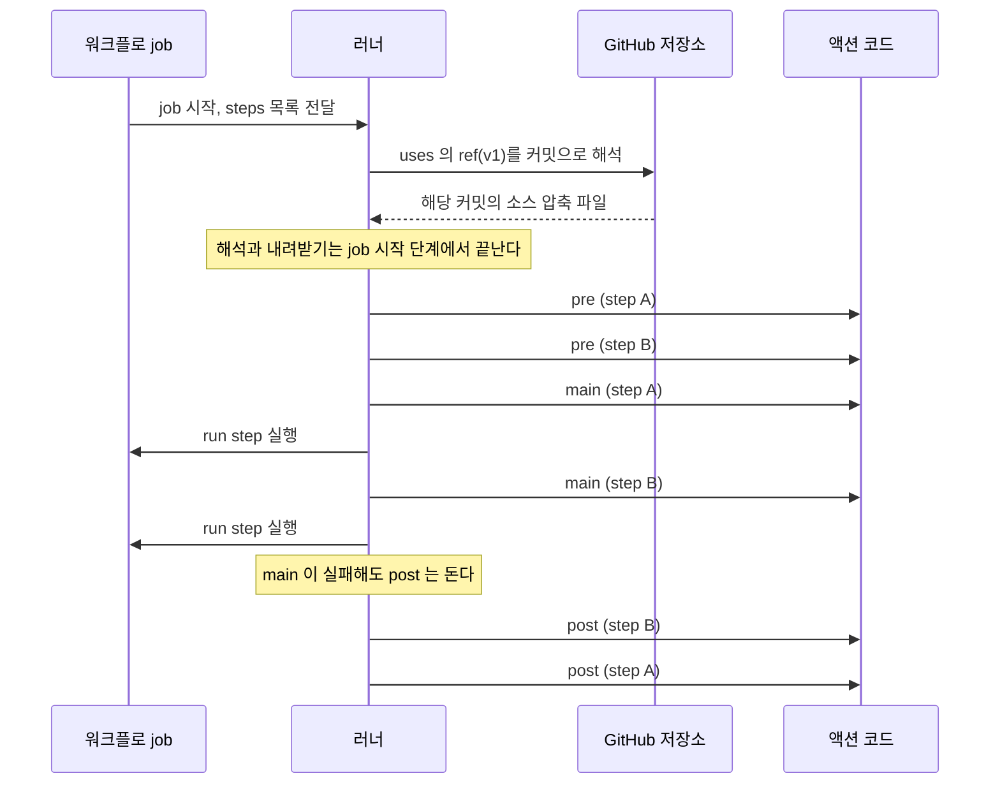
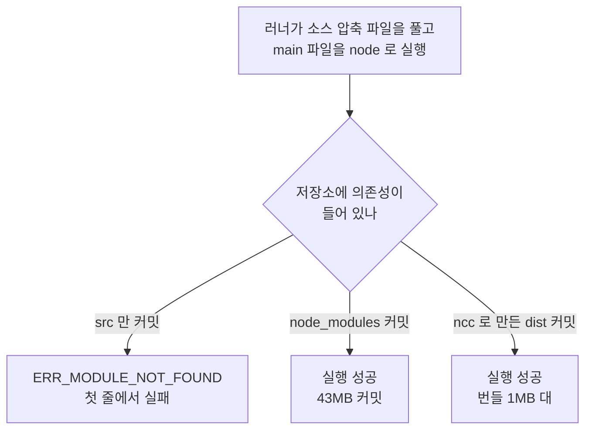
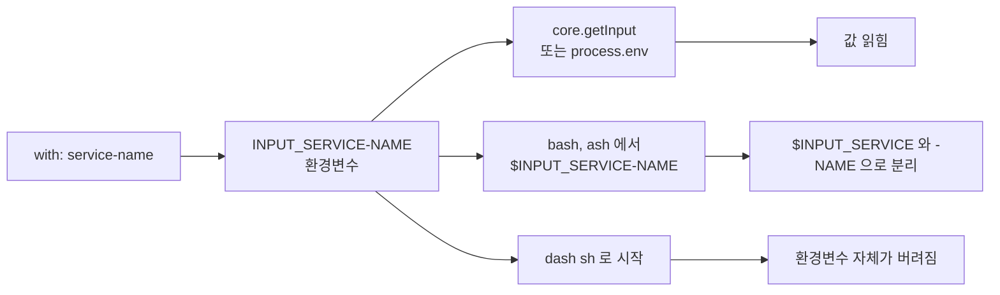
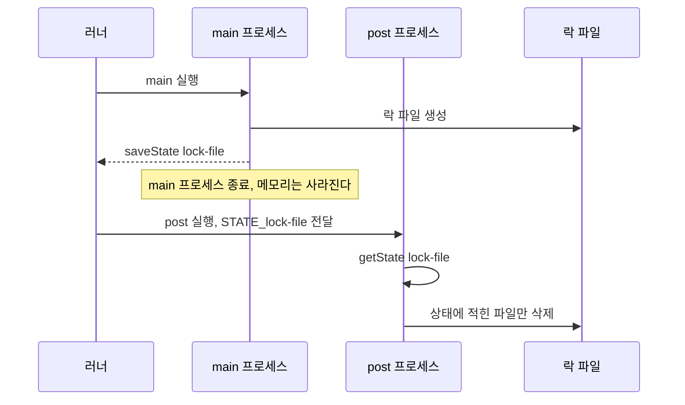
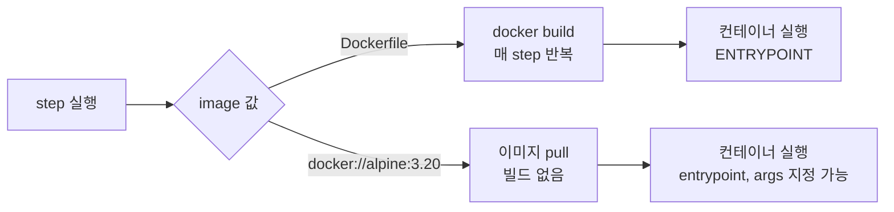
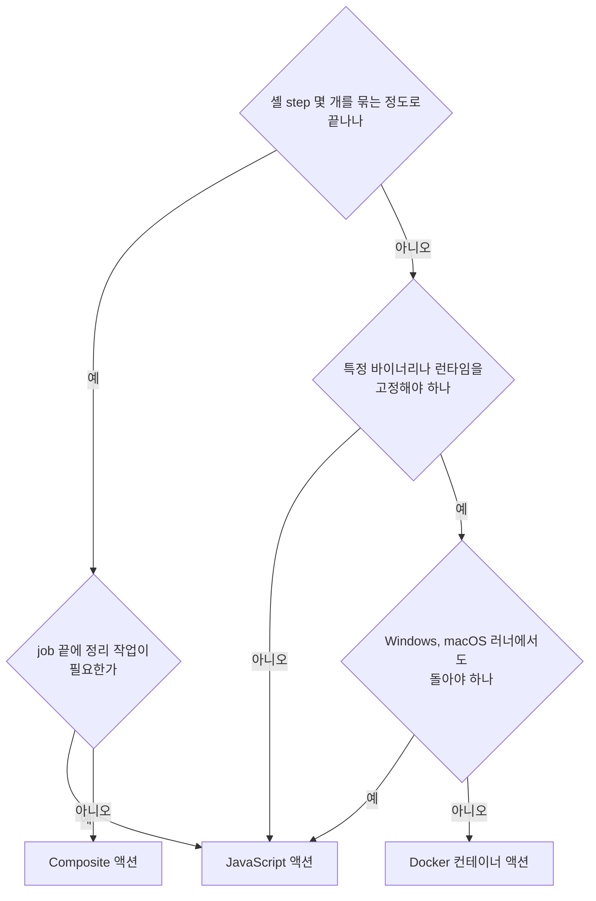
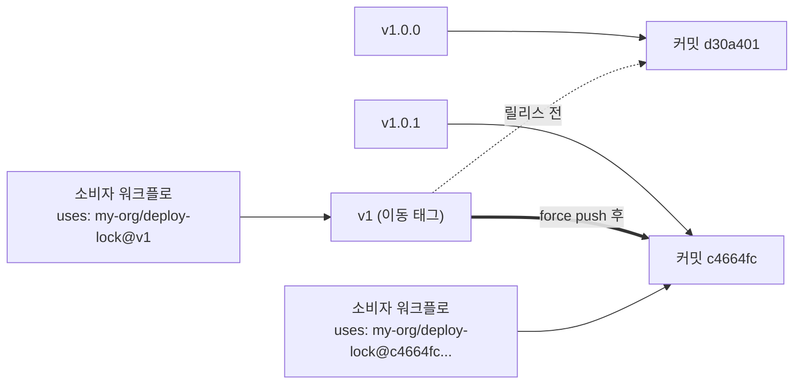

# GitHub Actions 커스텀 액션, JavaScript·Docker·Composite 직접 만들기

[GitHub Actions](GitHub_Actions.md) 문서의 "커스텀 액션 만들기" 절은 Composite 액션 하나만 다룬다. step 서너 줄을 묶는 용도로는 그걸로 충분한데, 워크플로 세 개쯤에서 같은 로직이 복붙되기 시작하면 API를 호출하거나 job이 끝날 때 뒷정리를 해야 하는 액션이 필요해진다. 그때부터는 JavaScript 액션이나 Docker 액션을 고르게 되고, 둘 다 Composite에 없는 사고 지점이 있다. `dist/`를 커밋하지 않아서 첫 실행에서 죽거나, 입력 이름에 하이픈을 넣었더니 컨테이너 안에서 값이 사라지거나, `v1` 태그가 소리 없이 다른 커밋을 가리키는 식이다.

이 문서는 세 종류를 모두 로컬에서 만들어 돌린 결과를 기준으로 쓴다. 도구와 못 돌린 범위는 마지막 절에 따로 적었다.

## 워크플로가 액션을 부르는 순서

step에 `uses:`가 있으면 러너는 job 시작 단계에서 해당 액션의 소스를 내려받고, 그 뒤 `pre`, `main`, `post` 순으로 실행한다. 아래 그림은 같은 액션을 step 두 곳에서 쓴 job에서 각 단계가 어느 순서로 도는지 보여준다. 눈여겨볼 곳은 `pre`가 모든 `main`보다 앞에 모여 있고, `post`는 `main`의 역순이라는 점이다.



같은 액션을 두 번 쓴 워크플로로 실제 순서를 찍어 봤다. `pre.js`, `main.js`, `post.js`가 각각 한 줄만 출력하는 액션이다.

```text
Run Pre  me/order-demo@v1   | [pre] label=A
Run Pre  me/order-demo@v1   | [pre] label=B
Run Main me/order-demo@v1   | [main] label=A
Run Main echo "[run] 중간 step"
Run Main me/order-demo@v1   | [main] label=B
Run Main echo "[run] 마지막 step"
Run Post me/order-demo@v1   | [post] label=B
Run Post me/order-demo@v1   | [post] label=A
```

`pre`에서 하는 일이 `main`보다 앞선다는 점은 생각보다 자주 문제가 된다. 첫 번째 step의 `main`이 만든 파일을 두 번째 액션의 `pre`가 읽으려 하면 아직 없다. `pre`는 환경 준비(캐시 복원, 도구 확인)에만 쓰고, 이전 step의 결과물에 의존하는 로직은 `main`에 둔다.

`post`는 이전 step이 실패해도 돈다. 예제 액션에 `post-if: always()`를 적었기 때문이고, 아래 JavaScript 액션 절에서 실제로 실패한 job에서 도는 것을 확인했다. `main`이 시작도 못 한 액션(그 앞 step에서 job이 죽은 경우)의 `post`는 돌지 않는 것으로 알고 있는데, 이 경우는 돌려보지 못했다.

## JavaScript 액션

러너가 Node를 직접 실행하므로 컨테이너 빌드가 없고 시작이 가장 빠르다. 예제로 서비스 단위 배포 락을 잡고 job이 끝나면 풀어주는 액션을 만들었다. 락 저장소는 러너의 임시 디렉터리 안 파일로 단순화했다. 진짜 락이라면 외부 저장소(DynamoDB, Redis)에 있어야 하지만, 이 문서의 관심사는 액션 구조라서 파일로 뒀다.

### action.yml

```yaml
# .github/actions/deploy-lock/action.yml
name: Deploy Lock
description: 서비스 단위 배포 락을 잡고, job 이 끝나면 풀어준다
inputs:
  service-name:
    description: 락을 잡을 서비스 이름
    required: true
  ttl-seconds:
    description: 락 유효 시간
    required: false
    default: "600"
outputs:
  lock-id:
    description: 잡은 락의 ID
runs:
  using: node20
  main: dist/main/index.js
  post: dist/post/index.js
  post-if: always()
```

`runs.using`에는 `node20` 같은 런타임 이름이 들어간다. GitHub은 액션의 Node 버전을 올려가는 중이라, 새로 만들 때는 공식 문서의 `runs` 항목에서 지금 허용되는 값을 확인하고 쓴다. 이 문서의 예제는 로컬 Node 20에서 돌렸기 때문에 `node20`이다.

`main`과 `post`가 `src/`가 아니라 `dist/`를 가리키는 점을 봐 둔다. 이유는 "dist 번들을 커밋해야 하는 이유" 절에서 다룬다.

### 소스

```javascript
// src/main.js
import * as core from '@actions/core';
import * as github from '@actions/github';
import { mkdirSync, writeFileSync, existsSync } from 'node:fs';
import { randomUUID } from 'node:crypto';

const service = core.getInput('service-name', { required: true });
const ttl = parseInt(core.getInput('ttl-seconds'), 10);
if (Number.isNaN(ttl) || ttl <= 0) {
  core.setFailed(`ttl-seconds 는 양의 정수여야 한다: ${core.getInput('ttl-seconds')}`);
} else {
  const dir = `${process.env.RUNNER_TEMP}/deploy-locks`;
  const file = `${dir}/${service}.lock`;
  if (existsSync(file)) {
    core.setFailed(`${service} 는 이미 락이 잡혀 있다`);
  } else {
    mkdirSync(dir, { recursive: true });
    const id = randomUUID();
    writeFileSync(file, JSON.stringify({ id, ttl, actor: github.context.actor }));
    core.saveState('lock-file', file);
    core.setOutput('lock-id', id);
    core.info(`락 획득: ${service} (${id.slice(0, 8)}), actor=${github.context.actor}, ref=${github.context.ref}`);
  }
}
```

```javascript
// src/post.js
import * as core from '@actions/core';
import { rmSync, existsSync } from 'node:fs';

const file = core.getState('lock-file');
if (file && existsSync(file)) {
  rmSync(file);
  core.info(`락 해제: ${file}`);
} else {
  core.info('해제할 락이 없다');
}
```

`@actions/core`는 입력·출력·상태·로그 명령을 감싼 라이브러리다. `getInput`은 환경변수를 읽고, `setOutput`은 `$GITHUB_OUTPUT` 파일에 쓰고, `setFailed`는 에러 어노테이션을 남기면서 종료 코드를 1로 만든다. `@actions/github`는 `context`(actor, ref, repo, payload)와 Octokit 클라이언트를 준다. 위 예제는 `context`만 썼다. `getOctokit(token)`으로 API를 부르는 코드는 토큰이 있는 실제 러너가 필요해서 로컬에서 돌리지 못했고, 그래서 예제에 넣지 않았다.

`@actions/core` 3.x는 ESM 전용 패키지다. 그래서 위 소스는 `import` 문법이고 `package.json`에 `"type": "module"`이 있다. `require('@actions/core')`로 쓰던 예전 글을 따라 하면 Node 20.20에서 `ERR_PACKAGE_PATH_NOT_EXPORTED`로 바로 막힌다(직접 `require`해서 확인했다).

### dist 번들을 커밋해야 하는 이유

러너는 액션을 내려받을 때 `npm install`을 돌려주지 않는다. 저장소 소스를 압축 파일로 받아 풀고 `main`에 적힌 파일을 `node`로 실행할 뿐이다. `node_modules`가 저장소에 없으면 `import '@actions/core'`가 첫 줄에서 죽는다. `src/`를 바로 가리키게 만든 액션을 돌려보면 이렇게 나온다.

```text
Run Main ./.github/actions/deploy-lock-raw
  | Error [ERR_MODULE_NOT_FOUND]: Cannot find package '@actions/core' imported from .../deploy-lock-raw/src/main.js
  | Node.js v20.20.0
Failure - Main ./.github/actions/deploy-lock-raw
```

해결은 두 가지다. `node_modules`를 통째로 커밋하거나(이 예제는 43MB다), 의존성을 한 파일로 묶은 번들을 커밋한다. 후자가 표준이고 도구는 `@vercel/ncc`다.

러너가 `main`을 실행하는 시점에 무엇이 저장소에 있는지에 따라 결과가 갈린다. 아래 그림은 세 가지 선택지의 결말을 비교한다.



```json
{
  "name": "deploy-lock",
  "private": true,
  "type": "module",
  "scripts": {
    "build": "ncc build src/main.js -o dist/main && ncc build src/post.js -o dist/post"
  },
  "dependencies": {
    "@actions/core": "^3.0.1",
    "@actions/github": "^9.1.1"
  },
  "devDependencies": {
    "@vercel/ncc": "^0.45.0"
  }
}
```

```bash
npm install
npm run build
```

```text
ncc: Compiling file index.js into ESM
   0kB  dist/main/package.json
1253kB  dist/main/index.js
```

`dist/main/index.js`는 1,282,666바이트, `dist/post/index.js`는 1,060,057바이트다. 진입점마다 `@actions/github`와 Octokit이 통째로 들어가서 1MB가 넘는다. `post.js`는 `@actions/core`만 쓰는데도 그 정도다.

커밋 대상은 `action.yml`, `package.json`, `package-lock.json`, `src/`, `dist/` 전체다. 놓치기 쉬운 것이 `dist/main/package.json`(23바이트, `{"type": "module"}`)으로, ncc가 ESM 번들 옆에 같이 만든다. `.gitignore`에는 `node_modules`만 넣는다. 빌드 산출물 디렉터리를 일괄로 무시하는 전역 `.gitignore`나 템플릿을 쓰고 있다면 액션 저장소에서는 `dist`를 예외로 뺀다.

### dist를 안 다시 만들면 소스 수정이 반영되지 않는다

번들은 소스와 별개의 파일이라서 `src/main.js`만 고치고 커밋하면 러너는 옛 `dist`를 실행한다. 로그 메시지의 "락 획득"을 "LOCK ACQUIRED"로 바꾸고 `npm run build` 없이 커밋한 뒤 돌려 보면 이렇다.

```text
Run Main ./.github/actions/deploy-lock
  | 락 획득: payment-api (d3789df6), actor=nektos/act, ref=refs/heads/master
```

소스는 바뀌었는데 출력은 옛 문구다. 빌드 결과가 같은 입력에서 항상 같은 바이트인지 먼저 확인했다. `npm run build`를 두 번 돌려 `sha256sum`을 비교했더니 동일했다. 그래서 CI에서 "다시 빌드했을 때 `dist`가 바뀌면 실패"라는 검사를 걸 수 있다.

```bash
cd .github/actions/deploy-lock
npm run build
git status --porcelain .
```

```text
 M .github/actions/deploy-lock/dist/main/index.js
```

`src` 수정을 커밋한 뒤 빌드하면 `dist/main/index.js`만 `M`으로 나온다. `post`는 소스를 안 건드렸으니 그대로다. CI에서는 이 출력이 비어 있지 않으면 실패시키면 된다. 의존성 버전이 달라지면 번들도 달라지므로 `package-lock.json`을 커밋하고 `npm ci`로 설치하는 쪽이 이 검사와 맞는다.

## 입력이 환경변수로 바뀌는 규칙

워크플로의 `with:` 값은 액션 프로세스에 `INPUT_<이름>` 환경변수로 들어간다. 이름 변환은 대문자화이고, 하이픈은 그대로 남는다. 입력 세 개를 선언한 액션(`service-name`, `ServiceName`, `retry_count`)에 값을 넣고 환경변수를 찍었다.

```text
INPUT_RETRY_COUNT="3"
INPUT_SERVICE-NAME="payment-api"
INPUT_SERVICENAME="  padded  "
```

세 가지를 확인했다.

- `service-name`은 `INPUT_SERVICE_NAME`이 아니라 `INPUT_SERVICE-NAME`이 된다.
- `ServiceName`은 `INPUT_SERVICENAME`이 된다. 입력 이름의 대소문자 구분은 환경변수에서 사라진다.
- 값의 앞뒤 공백은 환경변수에 그대로 있다. `core.getInput`이 기본으로 `trim`해서 `"padded"`를 돌려주고, `{ trimWhitespace: false }`를 주면 `"  padded  "`가 나온다.

아래 그림은 같은 입력이 어느 경로에서 읽히고 어느 경로에서 사라지는지 보여준다. `core.getInput`은 환경변수를 직접 읽어서 안전하지만 셸을 거치는 두 갈래는 하이픈 때문에 값을 놓친다.



`core.getBooleanInput('flag')`에 `yes`가 들어오면 `Input does not meet YAML 1.2 "Core Schema" specification: flag` 오류가 나고, `true`/`True`/`TRUE`/`false` 계열만 받는다. 선언하지 않은 입력을 읽으면 에러가 아니라 빈 문자열이 온다.

### 하이픈이 든 이름은 셸에서 읽기 어렵다

JavaScript 액션은 `process.env['INPUT_SERVICE-NAME']`으로 읽거나 `core.getInput`을 쓰면 되니 문제가 없다. 셸이 끼면 달라진다. 하이픈은 셸 변수 이름에 못 쓰므로 `$INPUT_SERVICE-NAME`은 `$INPUT_SERVICE`와 문자열 `-NAME`으로 해석된다. bash와 alpine의 `sh`(busybox ash)에서 같은 결과가 나왔다.

```text
[bash] -NAME
ash: [-NAME]
```

변수 자체는 환경에 있어서 bash에서는 `env | grep`이나 `printenv 'INPUT_SERVICE-NAME'`으로 꺼낼 수 있고, alpine에서도 `printenv`는 `payment-api`를 돌려줬다. 더 곤란한 쪽은 Debian·Ubuntu의 `sh`(dash)다. `debian:12-slim` 컨테이너에 `-e 'INPUT_SERVICE-NAME=payment-api'`를 주고 `sh -c 'env | grep SERVICE'`를 돌렸더니 아무것도 안 나오고 종료 코드 1이었다. 같은 컨테이너에서 `bash -c`로 돌리면 보인다. dash는 식별자 규칙에 맞지 않는 이름의 환경변수를 시작할 때 버린다. Debian 계열 이미지를 베이스로 `#!/bin/sh` 엔트리포인트를 짠 Docker 액션에서 하이픈 입력은 값이 통째로 사라지고 에러도 없다.

Docker 액션이나 셸로 읽는 액션은 입력 이름에 언더스코어를 쓴다(`retry_count`, `service_name`). JavaScript 액션은 하이픈 이름이 관례지만 같은 액션을 나중에 Docker로 옮길 가능성이 있으면 처음부터 언더스코어로 정해 두는 편이 낫다.

## post 단계와 saveState

`main`과 `post`는 별개의 프로세스다. 메모리를 공유하지 않으므로 `main`이 만든 락 파일 경로를 `post`가 알려면 `core.saveState('lock-file', file)`로 넘겨야 한다. 값은 러너가 `STATE_lock-file` 환경변수 형태로 `post` 프로세스에 전달하고, `core.getState('lock-file')`이 읽는다.

아래 그림은 `main`이 상태를 남기고 `post`가 그것만 읽어 정리하는 흐름이다. 두 프로세스 사이에 오가는 것은 러너가 전달하는 `STATE_` 환경변수뿐이라는 점을 본다.



앞의 배포 락 액션을 job에서 돌렸다. 락을 잡고, 다음 step에서 일부러 실패시킨 경우다.

```text
Run Main ./.github/actions/deploy-lock
  | 락 획득: payment-api (9898d55b), actor=nektos/act, ref=refs/heads/master
Run Main 배포 단계에서 실패
  | payment-api.lock
Failure - Main 배포 단계에서 실패
Run Post ./.github/actions/deploy-lock
  | 락 해제: .../tmp/deploy-locks/payment-api.lock
Job failed
```

job은 실패했는데 `post`가 락을 풀었다. `post-if: always()` 덕분이고, 이게 없다면 락 파일이 남아 다음 배포가 영원히 대기한다. 성공했을 때만 돌고 싶으면 `post-if: success()`로 바꾼다.

`post`에서 하나 더 주의할 점은 "내가 잡은 락만 푼다"는 조건이다. 같은 job에서 같은 서비스로 액션을 두 번 쓰면 두 번째 `main`은 락이 이미 있어서 실패한다. 이때 두 번째 `post`는 풀 락이 없고, 첫 번째 `post`가 실제로 푼다.

```text
Run Main ./.github/actions/deploy-lock
  | 락 획득: payment-api (b6d72717), ...
Run Main ./.github/actions/deploy-lock
  ::error::payment-api 는 이미 락이 잡혀 있다
Run Post ./.github/actions/deploy-lock
  | 해제할 락이 없다
Run Post ./.github/actions/deploy-lock
  | 락 해제: .../deploy-locks/payment-api.lock
```

두 번째 `main`이 `saveState`를 호출하기 전에 실패했기 때문에 `getState`가 빈 문자열을 돌려주고, `post`는 아무것도 지우지 않는다. 만약 `post`가 서비스 이름으로 락 파일을 다시 계산해서 지웠다면, 두 번째 호출이 첫 번째 호출의 락을 잘못 풀어 버렸을 것이다. 정리 작업은 `main`이 상태로 남긴 것만 대상으로 한다.

## Docker 컨테이너 액션

러너가 `Dockerfile`을 빌드하거나 지정된 이미지를 받아서 컨테이너로 실행한다. 어떤 언어든 쓸 수 있고 시스템 패키지를 마음대로 깔 수 있는 대신 제약이 셋이다.

첫째, Linux 러너에서만 돈다. GitHub 공식 문서에 명시된 제약이고, 워크플로 한 곳이라도 `windows-latest`나 `macos-latest` 매트릭스에 들어가면 그 칸에서 이 액션은 실패한다. 이 부분은 로컬에서 재현하지 못했다. 둘째, self-hosted 러너에서는 그 머신에 Docker가 있어야 한다. 셋째, 시작이 느리다.

### 액션 정의

CHANGELOG에 해당 버전 항목이 있는지 검사하는 액션이다.

```dockerfile
# changelog-check/Dockerfile
FROM alpine:3.20
COPY entrypoint.sh /entrypoint.sh
RUN chmod +x /entrypoint.sh
ENTRYPOINT ["/entrypoint.sh"]
```

```bash
#!/bin/sh
# changelog-check/entrypoint.sh
set -eu
version="$INPUT_VERSION"
file="${INPUT_FILE:-CHANGELOG.md}"
if grep -q "^## \[$version\]" "$file"; then
  echo "found=true" >> "$GITHUB_OUTPUT"
else
  echo "found=false" >> "$GITHUB_OUTPUT"
  echo "::error file=$file::$version 항목이 없다"
  exit 1
fi
```

```yaml
# changelog-check/action.yml
name: changelog-check
description: CHANGELOG 에 해당 버전 항목이 있는지 본다
inputs:
  version:
    description: 확인할 버전
    required: true
  file:
    description: 파일 경로
    default: CHANGELOG.md
outputs:
  found:
    description: true 또는 false
runs:
  using: docker
  image: Dockerfile
```

입력 이름이 `version`, `file`로 하이픈이 없다. 앞 절의 이유다. 컨테이너 안에서 `INPUT_VERSION`, `INPUT_FILE`로 읽히고, `GITHUB_OUTPUT`도 파일 경로가 환경변수로 들어온다.

`image: Dockerfile`이면 러너가 step이 돌 때마다 빌드한다. `image: docker://alpine:3.20`처럼 이미 만들어진 이미지를 지정하면 빌드 없이 받아서 실행하고, 이때 `entrypoint:`와 `args:`로 실행할 명령을 줄 수 있다.

`image` 값에 따라 러너가 하는 일이 갈린다. 아래 그림에서 빌드 단계가 step마다 반복되는 쪽과 한 번도 없는 쪽을 비교해 본다.



### 시작 지연

세 변형을 같은 job 안에서 순서대로 돌려 step 시간을 쟀다. 실행 모드는 `node:20-bookworm-slim` 컨테이너 job이고, 비교 기준으로 같은 job의 `echo` step이 387ms 걸렸다.

| step | 시간 |
|---|---|
| Dockerfile 액션, 첫 실행 (이미지 레이어 일부 새로 만듦) | 3.8초 |
| Dockerfile 액션, 같은 job의 두 번째 | 1.9초 |
| `docker://alpine:3.20` 직접 지정 | 1.2초 |
| `echo` step (기준) | 0.39초 |
| JavaScript 액션 (host 모드, 같은 머신) | 0.03~0.14초 |

수치는 이 머신 한 대에서 쟀고 GitHub 호스티드 러너와는 다르다. 방향만 믿는다. Dockerfile 액션은 같은 레이어 캐시가 있어도 step마다 `docker build`를 다시 돌려서 1초 대 후반이 붙고, 호스티드 러너는 job마다 새 VM이라 캐시가 없어서 첫 실행 쪽 숫자에 가깝다. 한 job에서 이 액션을 서너 번 부르면 그만큼 곱해진다. 빌드가 길어지는 액션이라면 이미지를 레지스트리에 미리 올려 두고 `docker://`로 가리킨다.

## Composite 액션

기존 step을 묶는 용도다. 새 프로세스를 띄우지 않고 호출한 job의 러너에서 그대로 step이 이어진다. 태그 ref에서 버전 문자열을 뽑는 짧은 액션을 만들었다.

```yaml
# version-from-ref/action.yml
name: version-from-ref
description: refs/tags/v1.4.0 같은 ref 에서 버전 문자열을 뽑는다
inputs:
  ref:
    description: 태그 ref
    required: true
outputs:
  version:
    description: v 를 뗀 버전
    value: ${{ steps.parse.outputs.version }}
runs:
  using: composite
  steps:
    - id: parse
      shell: bash
      env:
        REF: ${{ inputs.ref }}
      run: echo "version=${REF#refs/tags/v}" >> "$GITHUB_OUTPUT"
```

```text
Run Main echo "version=${REF#refs/tags/v}" >> "$GITHUB_OUTPUT"
Run Main echo "version=1.4.0"
  | version=1.4.0
```

Composite에서 자주 틀리는 것이 세 가지다.

- 모든 `run` step에는 `shell:`을 써야 한다. 일반 워크플로는 기본 셸이 있지만 Composite는 없다. 이 규칙은 실제 러너가 검사하는데, 로컬에서 쓴 `act`는 `shell`을 뺀 액션도 그냥 실행해 버려서 내 환경에서는 잡히지 않았다. `act`로 통과했다고 안심하지 않는다.
- 출력은 step의 출력을 `outputs.<이름>.value`로 한 번 더 이어 줘야 밖으로 나간다.
- 입력을 `run:` 안에 `${{ inputs.ref }}`로 직접 쓰면 값이 셸 코드로 치환된다. `"; curl ... #` 같은 값이 들어오면 그대로 실행된다. 위 예제처럼 `env:`로 받고 `$REF`로 읽는다. 표현식 평가 시점에 대해서는 [표현식과 워크플로 명령](Git_Hub_Actions_Expressions_And_Workflow_Commands.md)에 정리했다.

Composite 안에서는 `$GITHUB_ACTION_PATH`로 액션 자기 디렉터리를 가리킬 수 있다. 같은 디렉터리에 둔 스크립트를 부를 때 쓴다. 이 변수로 `basename`을 찍어 보면 `version-from-ref`가 나온다.

Composite에서 `post`로 정리 작업이 되는지는 로컬에서 확인하지 못했다. 정리가 필수인 액션은 JavaScript로 만든다.

## 세 종류 가운데 고르기

기준은 "셸로 충분한가, 라이브러리가 필요한가, 런타임을 고정해야 하는가" 순서다.



Docker로 가는 길은 한 갈래뿐이다. 런타임을 고정해야 하고 Linux 러너만 쓸 때다. 런타임 고정이 필요한데 다른 OS 러너도 지원해야 하면 JavaScript 액션에서 도구를 설치하는 쪽으로 간다. 비교는 표로 정리했다.

| 항목 | Composite | JavaScript | Docker |
|---|---|---|---|
| 실행 위치 | 호출 job의 러너 그대로 | 러너의 Node | 별도 컨테이너 |
| 지원 러너 | 전부 | 전부 | Linux만 |
| 시작 비용 | 거의 없음 | 수십~수백 ms | 1~4초 (로컬 측정) |
| 작성 언어 | 셸, 다른 액션 호출 | JavaScript, TypeScript | 아무 언어 |
| 의존성 | 러너에 깔린 도구 | `dist/` 번들에 포함 | 이미지에 포함 |
| 정리 작업(post) | 확인 못 함 | `post:` 지원, 로컬 확인 | `post-entrypoint`가 있는 것으로 알고 있음, 확인 못 함 |
| 배포 시 챙길 것 | `shell:` 누락 | `dist/` 재빌드 | 이미지 빌드 시간 |
| 입력 이름 | 자유 | 자유 | 하이픈 피함 |

현실적으로는 처음 Composite로 만들고, step 사이에서 JSON 파싱이나 재시도 로직이 셸로 감당이 안 되기 시작하면 JavaScript로 옮기는 흐름이 가장 많다. Docker는 "이 CLI 도구의 특정 버전이 있어야 한다"처럼 런타임 요구가 명확할 때만 쓴다. Docker 액션의 느린 시작은 job 시간 합계로 드러나므로 매 PR마다 도는 검사에 넣기 전에 한 번 재 본다.

## 릴리스 태그와 v1 이동 태그

액션을 `uses: my-org/deploy-lock@v1`처럼 메이저 태그로 부르는 건 관례다. 패치 릴리스(`v1.0.1`)를 낼 때마다 사용자가 워크플로를 고치지 않아도 되게 하려는 방식이다. 그래서 릴리스 담당자는 `v1.0.1` 태그를 만들면서 `v1`을 같은 커밋으로 옮긴다.



실선은 불변 태그, 점선은 이동 전 위치, 굵은 선이 이동 후 위치다. `v1.0.0`과 `v1.0.1`은 한 번 쓰면 그대로지만 `v1`은 옮겨 다닌다. 소비자는 `@v1`만 적었는데 가리키는 커밋이 바뀐다.

로컬 bare 저장소로 실제 동작을 재현했다.

```bash
git tag v1.0.0 && git tag v1
git push origin HEAD:main v1.0.0 v1
# 수정 커밋 후
git tag v1.0.1 && git push origin v1.0.1

git tag -f v1
git push origin v1
```

```text
 ! [rejected]        v1 -> v1 (already exists)
hint: Updates were rejected because the tag already exists in the remote.
```

그냥 push하면 거부되고, 릴리스 스크립트는 반드시 `git push -f origin v1`을 쓰게 된다.

```text
 + d30a401...c4664fc v1 -> v1 (forced update)
```

```text
c4664fc503bba2ec4db506da21699ca33b8aab45	v1
d30a40168691faa991e2ee36fac16bc766ef91c1	v1.0.0
c4664fc503bba2ec4db506da21699ca33b8aab45	v1.0.1
```

`v1`이 `v1.0.1`과 같은 SHA를 가리킨다. 릴리스 담당자가 하는 정상 작업과 공격자가 하는 태그 이동은 명령이 똑같다. 저장소 쓰기 권한이 털리면 `v1`을 악성 커밋으로 옮기는 것도 같은 `git push -f`이고, 소비자 쪽 워크플로 파일은 한 글자도 안 바뀐다. 2025년 3월 tj-actions/changed-files 사고가 정확히 이 경로였고, 사고 경위와 대응은 [CI/CD 파이프라인 공격](../../Security/CI_CD_Pipeline_Attacks.md)에 정리되어 있다.

액션을 만드는 쪽과 쓰는 쪽에서 할 수 있는 일이 다르다.

- 쓰는 쪽은 서드파티 액션을 40자 커밋 SHA로 고정한다(`uses: owner/repo@<sha> # v1.0.1`). 외부 액션 갱신은 Dependabot 같은 도구가 SHA를 올려 준다.
- 만드는 쪽은 `v1` 같은 이동 태그를 제공하더라도 정확한 패치 태그(`v1.0.1`)를 남기고, 릴리스 권한을 가진 계정을 줄이고, 태그 보호 규칙(저장소 설정의 tag ruleset)으로 `v*` 태그를 직접 push하지 못하게 한다. 이동 태그의 이동은 릴리스 워크플로가 하도록 맡긴다. 태그 보호 규칙의 화면 구성은 로컬에서 확인할 수 없어서 설정 위치는 적지 않는다.

같은 조직의 사설 저장소 액션을 쓰는 경우에도 SHA 고정이 낫다. 조직 안 신뢰는 외부보다 높지만 태그를 옮길 수 있는 사람이 많을수록 사고 확률은 오른다.

## 사설 저장소 액션을 조직 안에서 쓰기

마켓플레이스에 올리지 않아도 된다. 액션 저장소를 사설로 두고, `uses: <org>/<repo>@<ref>` 또는 저장소 안 하위 경로를 가리키는 `uses: <org>/<repo>/<경로>@<ref>` 형태로 같은 조직의 다른 저장소 워크플로에서 부른다. 기본값에서는 사설 저장소의 액션을 다른 저장소가 못 쓰기 때문에 액션 저장소 쪽 설정을 바꿔야 한다. 저장소 Settings의 Actions 메뉴에 있는 Access 항목에서 "같은 조직의 저장소에서 접근 가능"으로 바꾸는 방식이다. 같은 설정을 REST API로도 바꿀 수 있다고 알고 있다.

이 절은 로컬에서 재현하지 못했다. 조직과 사설 저장소, 권한이 있는 GitHub 계정이 필요해서 `act`로는 따라 할 수 없다. 설정 이름과 위치는 바뀔 수 있으니 실제로 적용하기 전에 공식 문서의 조직 내 액션·워크플로 공유 항목에서 최신 화면을 본다. 허용 범위는 같은 조직(설정에 따라 엔터프라이즈)까지다. 외부 조직의 저장소에서 부르려면 액션 저장소를 공개로 돌려야 한다.

같은 저장소 안에서 쓰는 로컬 액션(`uses: ./.github/actions/deploy-lock`)에는 한 가지 순서 규칙이 있다. 이 경로는 러너의 워크스페이스에서 찾기 때문에 앞 step에 `actions/checkout`이 있어야 한다. 빼고 돌리면 이렇게 나온다.

```text
Run Main 락
failed to read 'action.yml' from action '락' with path '' of step: lstat .../.github/actions/deploy-lock/action.yml: no such file or directory
```

`act`가 찍은 메시지고 실제 러너의 문구는 다르다. 실제 러너에서도 `action.yml`을 못 찾아 막히는 건 같다. 로컬 액션은 `checkout` 뒤에 둔다. `owner/repo@ref` 형태의 원격 액션은 `checkout` 없이도 쓸 수 있다.

## 로컬에서 확인한 범위

도구는 `nektos/act` 0.2.89, Docker 29.1.3, Node v20.20.0이다. 실행 모드는 둘을 썼다. JavaScript·Composite 예제는 `-P ubuntu-latest=-self-hosted`(호스트에서 직접 실행)로 돌렸고, Docker 액션은 호스트 모드에서 `GITHUB_OUTPUT` 경로를 컨테이너에 못 넘겨 실패해서 `node:20-bookworm-slim` 컨테이너 job(`--bind`)으로 돌렸다. 본문의 로그는 이 실행 결과다.

`act`와 실제 러너가 다르게 동작한 부분이 세 곳 있다.

- `pre`는 `uses: ./.github/actions/...`로 부른 로컬 액션에서 실행되지 않았다. 원격 참조(`owner/repo@v1`을 `--local-repository`로 로컬 디렉터리에 연결)에서만 돌아서, 앞 절의 순서 로그는 그 방식으로 얻었다. 실제 러너에서 로컬 액션의 `pre`가 도는지는 직접 확인하지 못했다.
- `shell:`을 빼먹은 Composite를 거부하지 않았다.
- 출력이 `::set-output::` 형태로 찍힌다. 이건 `act`의 표시 방식이고, 파일 명령(`$GITHUB_OUTPUT`)은 정상 동작했다.

로컬에서 확인하지 못해 공식 문서나 일반적으로 알려진 내용에 기대어 쓴 부분은 이렇다.

- Docker 액션이 Linux 러너 전용이라는 제약
- 호스티드 러너에서의 실제 시작 시간, 액션 내려받기 시점
- `main`이 시작하지 못한 액션의 `post` 동작, Docker 액션의 `post-entrypoint`
- Dependabot이 SHA 고정 참조를 갱신하는 동작
- `runs.using`에 허용되는 Node 버전의 현재 목록
- 사설 저장소 액션을 조직에 공유하는 설정의 정확한 화면과 API
- 태그 보호 규칙의 설정 위치
- `getOctokit`으로 API를 호출하는 코드
- Composite의 `post` 정리 동작

예제에 나온 해시와 시간은 전부 이 머신에서 한 번 돌린 값이다.
