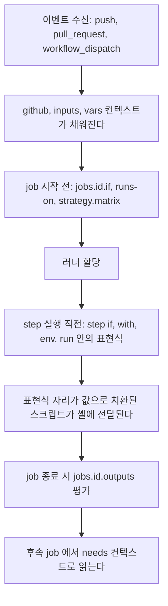
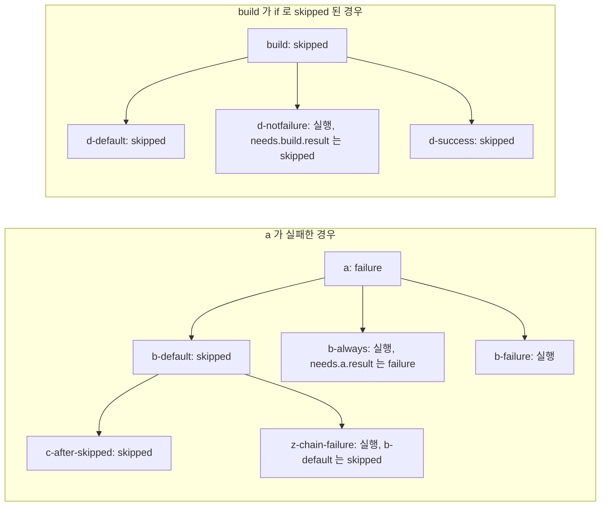
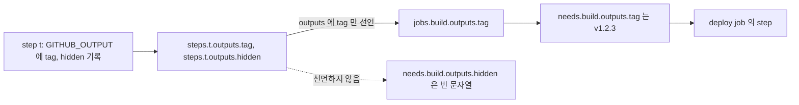
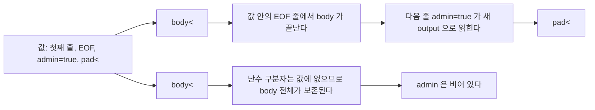

# GitHub Actions 표현식과 워크플로 명령

[GitHub Actions](GitHub_Actions.md) 문서가 워크플로 구조와 배포 예제를 다룬다면, 이 문서는 `${{ }}` 표현식과 `$GITHUB_OUTPUT` 같은 워크플로 명령만 다룬다. 워크플로가 커지면 YAML 구조보다 이 두 가지에서 사고가 난다. 배포가 안 나갔는데 초록불이고, `if: false` 라고 적었는데 step이 돌고, 값 하나를 넘겼더니 다른 output이 생겨 있는 식이다.

본문의 동작은 로컬에서 직접 돌려서 확인했다. 사용한 도구와 못 돌린 범위는 마지막 절에 정리했다.

## 표현식은 세 시점에 나뉘어 평가된다

`${{ }}` 안의 식은 한 번에 평가되지 않는다. 키마다 평가되는 시점이 다르고, 시점마다 쓸 수 있는 컨텍스트가 다르다. 컨텍스트에 없는 값을 쓰면 빈 문자열이 되는 것이 아니라 워크플로 검증 단계에서 막힌다.



위 그림에서 볼 곳은 러너 할당을 기준으로 앞뒤가 갈린다는 점이다. 러너가 정해지기 전에 평가되는 `jobs.<id>.if`와 `runs-on`에서는 `env`, `secrets`, `runner`를 쓸 수 없다. 러너가 떠야 생기는 정보이기 때문이다.

actionlint 1.7.12로 아래 워크플로를 검사하면 이 경계가 그대로 오류로 나온다.

```yaml
name: ctx
on: push
env:
  MODE: prod
jobs:
  a:
    runs-on: ubuntu-latest
    if: env.MODE == 'prod'
    steps:
      - run: echo a
  b:
    runs-on: ubuntu-latest
    if: secrets.TOKEN != ''
    steps:
      - run: echo b
  c:
    runs-on: ${{ env.MODE == 'prod' && 'ubuntu-latest' || 'macos-latest' }}
    steps:
      - run: echo c
  d:
    runs-on: ubuntu-latest
    steps:
      - if: secrets.TOKEN != ''
        run: echo d
```

실제 출력은 이렇다.

```text
ctx.yml:8:9: context "env" is not allowed here. available contexts are "github", "inputs", "needs", "vars".
ctx.yml:13:9: context "secrets" is not allowed here. available contexts are "github", "inputs", "needs", "vars".
ctx.yml:17:18: context "env" is not allowed here. available contexts are "github", "inputs", "matrix", "needs", "strategy", "vars".
ctx.yml:23:13: context "secrets" is not allowed here. available contexts are "env", "github", "inputs", "job", "matrix", "needs", "runner", "steps", "strategy", "vars".
```

키별로 보면 이렇다.

| 키 | 쓸 수 있는 컨텍스트 | 못 쓰는 것 |
|---|---|---|
| `jobs.<id>.if` | github, inputs, needs, vars | env, secrets, runner, matrix |
| `jobs.<id>.runs-on` | 위 + matrix, strategy | env |
| step의 `if` | 위 + env, job, runner, steps | secrets |

`secrets`는 step의 `if`에서도 안 된다. 시크릿 유무로 분기하고 싶으면 `env: HAS_TOKEN: ${{ secrets.TOKEN != '' }}`처럼 step의 `env`로 먼저 받고 `if: env.HAS_TOKEN == 'true'`로 검사한다. step `env`에서는 `secrets`를 쓸 수 있다.

run 안의 `${{ }}`는 셸이 실행되기 전에 문자열로 치환된다. 셸 변수가 아니라 스크립트 텍스트 자체가 바뀐다는 뜻이다. PR 제목 같은 외부 입력을 `run`에 직접 넣으면 안 되는 이유가 여기에 있고, 이 내용은 [GitHub Actions 보안 절](GitHub_Actions.md)에서 다룬다.

## if 조건에서 `${{ }}`를 붙이느냐에 따라 달라지는 평가

`if`는 `${{ }}` 없이 써도 전체가 표현식으로 평가된다. 문제는 붙이는 경우다. 같은 의도로 쓴 아홉 줄이 서로 다르게 동작했다.

```yaml
name: truthy
on:
  workflow_dispatch:
    inputs:
      deploy:
        type: boolean
        default: false
env:
  FLAG: 'false'
  EMPTY: ''
jobs:
  t:
    runs-on: ubuntu-latest
    steps:
      - id: o
        run: echo "flag=false" >> "$GITHUB_OUTPUT"
      - name: A
        if: env.FLAG
        run: echo "A 실행됨"
      - name: B
        if: env.FLAG == 'true'
        run: echo "B 실행됨"
      - name: C
        if: env.EMPTY
        run: echo "C 실행됨"
      - name: D
        if: steps.o.outputs.flag
        run: echo "D 실행됨"
      - name: E
        if: ${{ steps.o.outputs.flag == 'true' }}
        run: echo "E 실행됨"
      - name: F
        if: ${{ steps.o.outputs.flag }} == 'true'
        run: echo "F 실행됨"
      - name: G
        if: inputs.deploy
        run: echo "G 실행됨"
      - name: H
        if: github.event.inputs.deploy
        run: echo "H 실행됨"
      - name: I
        if: fromJSON(github.event.inputs.deploy)
        run: echo "I 실행됨"
```

`FLAG`는 문자열 `'false'`, `deploy`는 `false`로 두고 돌린 결과다.

| step | 조건 | 실행 | 이유 |
|---|---|---|---|
| A | `env.FLAG` | 실행됨 | 문자열 `'false'`는 비어 있지 않아 참이다 |
| B | `env.FLAG == 'true'` | 건너뜀 | 문자열 비교가 거짓 |
| C | `env.EMPTY` | 건너뜀 | 빈 문자열은 거짓 |
| D | `steps.o.outputs.flag` | 실행됨 | step output은 항상 문자열이라 A와 같다 |
| E | `${{ ... == 'true' }}` | 건너뜀 | 식 전체가 `${{ }}` 안에 있다 |
| F | `${{ ... }} == 'true'` | 실행됨 | 바깥에 글자가 붙으면 문자열 `"false == 'true'"`가 되어 참이다 |
| G | `inputs.deploy` | 건너뜀 | `inputs` 컨텍스트는 boolean을 그대로 보존한다 |
| H | `github.event.inputs.deploy` | 실행됨 | 이벤트 페이로드의 값은 문자열 `'false'`다 |
| I | `fromJSON(github.event.inputs.deploy)` | 건너뜀 | 문자열을 boolean으로 풀었다 |

actionlint도 F를 잡는다. `if: condition "${{ steps.o.outputs.flag }} == 'true'" is always evaluated to true because extra characters are around ${{ }}`라고 나온다. YAML 린트 한 번이면 막을 수 있는 실수인데, 린터가 없으면 `false == 'true'`라는 문자열이 참으로 읽히는 상태로 몇 달씩 간다.

`workflow_dispatch`의 boolean 입력은 `inputs.deploy`로 읽어야 boolean이다. 같은 값을 `github.event.inputs.deploy`로 읽으면 문자열이라 `'false'`가 참이 된다. step output이나 이벤트 페이로드에서 꺼낸 값은 문자열이라고 보고 `== 'true'`로 비교하는 쪽이 안전하다.

문자열 비교는 대소문자를 구분하지 않았다. `'ABC' == 'abc'`가 참이었다. `'1' == 1`도 참인데, 문자열이 숫자로 변환되어 비교되기 때문이다. 브랜치 이름이나 태그를 비교할 때 대소문자 차이로 분기하는 로직은 의도대로 안 돈다.

또 하나, `if: !cancelled()`처럼 `!`로 시작하는 값은 YAML 태그로 읽힌다. PyYAML은 `could not determine a constructor for the tag '!cancelled()'`로 파싱을 포기했고, actionlint는 `string should not be empty`라고 했다. `!`로 시작하는 조건은 `if: ${{ !cancelled() }}`로 쓴다.

## 상태 함수와 needs 실패 시 후속 job

step의 `if`에 조건이 없으면 암묵적으로 `success()`가 붙는다. 앞 step이 하나라도 실패하면 뒤 step은 줄줄이 건너뛴다. `failure()`, `always()`, `cancelled()`는 이 기본 동작을 바꾼다. 아래는 step 0이 실패한 job과, 성공한 job, `continue-on-error: true`로 실패를 허용한 job에서 각 조건이 실행됐는지 돌려서 확인한 표다.

| step의 if | 앞 step 성공 | 앞 step 실패 | 앞 step 실패 + continue-on-error |
|---|---|---|---|
| 없음 | 실행 | 건너뜀 | 실행 |
| `success()` | 실행 | 건너뜀 | 실행 |
| `failure()` | 건너뜀 | 실행 | 건너뜀 |
| `always()` | 실행 | 실행 | 실행 |
| `cancelled()` | 건너뜀 | 건너뜀 | 건너뜀 |

`continue-on-error: true`가 붙은 step은 실패해도 job 입장에서는 성공으로 취급된다. 이 때문에 뒤 step의 `failure()`가 거짓이다. 이 step이 실제로는 실패했다는 정보는 `steps.<id>.outcome`에 남는다.

```yaml
- name: 실패 허용
  id: c0
  continue-on-error: true
  run: exit 1
- run: echo "outcome=${{ steps.c0.outcome }} conclusion=${{ steps.c0.conclusion }}"
```

실행하면 `outcome=failure conclusion=success`가 찍혔다. `outcome`은 `continue-on-error`를 적용하기 전의 결과이고 `conclusion`은 적용한 뒤의 결과다. 린트 실패를 허용하되 "허용했지만 실패했다"는 사실을 PR 코멘트에 남기고 싶을 때 `outcome == 'failure'`로 걸러야 한다. `failure()`로는 못 잡는다.

`cancelled()`는 이 표에서 전부 건너뜀으로 나왔는데, 워크플로를 실제로 취소하는 경우는 로컬에서 재현하지 못했다. 취소됐을 때 참이 된다는 것은 정의에 따른 설명이다.

### needs로 걸린 job이 실패하거나 건너뛰면

job 수준에서도 규칙은 같다. `needs`로 걸린 job이 성공하지 못하면 `if`가 없는 후속 job은 건너뛴다. 아래 워크플로로 두 경우를 돌렸다. 하나는 `a`가 실패하는 경우이고, 하나는 `build`가 자기 `if` 때문에 건너뛰어지는 경우다.

```yaml
name: needs-chain
on: push
jobs:
  a:
    runs-on: ubuntu-latest
    steps:
      - run: exit 1
  b-default:
    needs: a
    runs-on: ubuntu-latest
    steps:
      - run: echo "RAN b-default"
  b-always:
    needs: a
    if: always()
    runs-on: ubuntu-latest
    steps:
      - run: echo "RAN b-always result=${{ needs.a.result }}"
  b-failure:
    needs: a
    if: failure()
    runs-on: ubuntu-latest
    steps:
      - run: echo "RAN b-failure"
  c-after-skipped:
    needs: b-default
    runs-on: ubuntu-latest
    steps:
      - run: echo "RAN c-after-skipped"
  z-chain-failure:
    needs: b-default
    if: failure()
    runs-on: ubuntu-latest
    steps:
      - run: echo "RAN z-chain-failure b-default=${{ needs.b-default.result }}"
  build:
    if: github.ref == 'refs/heads/none'
    runs-on: ubuntu-latest
    steps:
      - run: echo build
  d-default:
    needs: build
    runs-on: ubuntu-latest
    steps:
      - run: echo "RAN d-default"
  d-notfailure:
    needs: build
    if: ${{ !cancelled() && !failure() }}
    runs-on: ubuntu-latest
    steps:
      - run: echo "RAN d-notfailure result=${{ needs.build.result }}"
  d-success:
    needs: build
    if: needs.build.result == 'success'
    runs-on: ubuntu-latest
    steps:
      - run: echo "RAN d-success"
```



그림에서 볼 곳은 `z-chain-failure`와 `d-notfailure`다. `z-chain-failure`는 `a`에 직접 걸려 있지 않고 skipped인 `b-default`에만 걸려 있는데도 `failure()`가 참이었다. `failure()`는 직접 의존하는 job만이 아니라 `needs` 체인 위쪽에서 실패한 job이 있으면 참이 된다. 반대로 `d-notfailure`는 `build`가 실패가 아니라 건너뛰어진 것이라 `!failure()`가 참이고, 그래서 돈다.

이 차이 때문에 배포 게이트는 이렇게 쓰는 편이 안전하다.

| 의도 | 쓰는 조건 | 건너뛴 앞 job이 있을 때 |
|---|---|---|
| 앞 job이 전부 성공했을 때만 | 조건 없음 또는 `needs.build.result == 'success'` | 건너뜀 |
| 앞 job이 건너뛰어져도 진행 | `!cancelled() && !failure()` | 실행 |
| 성공이든 실패든 정리 작업 | `always()` | 실행 |
| 실패했을 때 알림 | `failure()` | 체인 어디서든 실패하면 실행 |

`always()`는 이름 그대로 취소된 실행에서도 참이다. 로컬에서 취소를 재현하지는 못했지만, 배포 job에 `always()`를 붙이면 취소 버튼을 눌러도 배포가 시작될 수 있는 조건이다. 정리나 알림 용도가 아니면 `!cancelled()`를 쓴다.

### 한 job 안의 값을 다음 job으로 넘기는 흐름

step이 쓴 output은 같은 job 안의 `steps.<id>.outputs.<name>`으로만 보인다. 다른 job에서 읽으려면 job의 `outputs:`에 명시적으로 올려야 하고, 후속 job은 `needs.<job>.outputs.<name>`으로 읽는다.

```yaml
name: out
on: push
jobs:
  build:
    runs-on: ubuntu-latest
    outputs:
      tag: ${{ steps.t.outputs.tag }}
    steps:
      - id: t
        run: |
          echo "tag=v1.2.3" >> "$GITHUB_OUTPUT"
          echo "hidden=not-exported" >> "$GITHUB_OUTPUT"
  deploy:
    needs: build
    runs-on: ubuntu-latest
    steps:
      - run: |
          echo "tag=[${{ needs.build.outputs.tag }}] hidden=[${{ needs.build.outputs.hidden }}]"
```



실행 결과는 `tag=[v1.2.3] hidden=[]`였다. 선언하지 않은 `hidden`은 빈 문자열이다. actionlint는 이걸 정적으로 잡아서 `property "hidden" is not defined in object type {tag: string}`라고 알려 준다. 오타를 낸 output 이름이 조용히 빈 값이 되어 `docker push app:`처럼 태그 없는 이미지가 나가는 사고는 이 린트로 대부분 막힌다.

앞 job이 건너뛰어졌을 때 그 job의 output이 어떻게 보이는지는 로컬 도구(act)가 선언식을 그대로 문자열로 내놓는 등 실제 러너와 다르게 동작해서 확인하지 못했다. output 값에 의존하는 후속 job은 `needs.<job>.result == 'success'`를 함께 걸어 두는 쪽이 낫다.

## 내장 함수

`contains`, `startsWith`, `format`, `hashFiles`, `fromJSON`을 한 step에서 찍어 본 결과다.

```yaml
name: fn
on: push
jobs:
  fn:
    runs-on: ubuntu-latest
    env:
      MSG: "Fix login [Deploy] now"
      LIST: '["api","web"]'
    steps:
      - run: |
          echo "contains-case=${{ contains(env.MSG, '[deploy]') }}"
          echo "contains-array=${{ contains(fromJSON(env.LIST), 'api') }}"
          echo "startsWith=${{ startsWith('refs/heads/main', 'refs/heads/') }}"
          echo "format=${{ format('{0}-{1}-{{literal}}', 'a', 'b') }}"
          echo "join=${{ join(fromJSON(env.LIST), ',') }}"
          echo "null-eq-empty=${{ null == '' }}"
          echo "hash-miss=[${{ hashFiles('nope.lock') }}]"
```

| 식 | 결과 |
|---|---|
| `contains('Fix login [Deploy] now', '[deploy]')` | `true` (대소문자 무시) |
| `contains(fromJSON('["api","web"]'), 'api')` | `true` |
| `startsWith('refs/heads/main', 'refs/heads/')` | `true` |
| `format('{0}-{1}-{{literal}}', 'a', 'b')` | `a-b-{literal}` |
| `join(fromJSON(...), ',')` | `api,web` |
| `null == ''` | `true` |
| `hashFiles('nope.lock')` | 빈 문자열 |

`contains(github.event.head_commit.message, '[deploy]')`로 커밋 메시지 키워드 배포를 만들 때 대소문자 무시가 걸린다. `[Deploy]`, `[DEPLOY]`가 전부 배포를 일으킨다. `format`에서 중괄호 리터럴은 `{{`와 `}}`로 이스케이프한다.

`hashFiles`는 패턴에 맞는 파일이 하나도 없으면 빈 문자열을 돌려준다. 캐시 키를 `${{ hashFiles('**/package-lock.json') }}`로 만들 때 경로 오타가 나면 키가 `npm-` 뒤에 아무것도 없는 값이 되어 모든 실행이 같은 캐시를 공유한다. 이 값이 맞는 해시로 나오는지는 로컬에서 확인하지 못했다. act의 호스트 모드는 워크스페이스에 저장소 파일을 두지 않아서 일치하는 파일이 없는 경우만 재현됐다. 해시 값 자체는 실제 러너에서 한 번 찍어 보고 쓰는 편이 안전하다.

## 변경된 서비스만 빌드하는 동적 매트릭스

모노레포에서 서비스 열 개를 매번 전부 빌드하는 것은 낭비라서, 바뀐 디렉터리만 뽑아 `matrix`로 넘기는 구성을 쓴다. 첫 job이 JSON 배열을 output으로 내고, 둘째 job이 `fromJSON`으로 풀어서 매트릭스로 쓴다.

```yaml
name: dynamic-matrix
on: push
jobs:
  detect:
    runs-on: ubuntu-latest
    outputs:
      services: ${{ steps.diff.outputs.services }}
      any: ${{ steps.diff.outputs.any }}
    steps:
      - uses: actions/checkout@v4
        with:
          fetch-depth: 0
      - id: diff
        env:
          BASE_SHA: ${{ github.event.before }}
        run: |
          set -euo pipefail
          base="${BASE_SHA:-HEAD~1}"
          if [[ "$base" =~ ^0+$ ]]; then base=""; fi
          if [ -z "$base" ]; then
            changed=$(ls services)
          else
            changed=$(git diff --name-only "$base" HEAD -- services | cut -d/ -f2 | sort -u)
          fi
          existing=""
          for s in $changed; do
            if [ -d "services/$s" ]; then existing="$existing$s"$'\n'; fi
          done
          json=$(printf '%s' "$existing" | jq -Rnc '[inputs | select(length>0)]')
          echo "services=$json" >> "$GITHUB_OUTPUT"
          if [ "$json" = '[]' ]; then echo "any=false" >> "$GITHUB_OUTPUT"; else echo "any=true" >> "$GITHUB_OUTPUT"; fi
          echo "changed -> $json"
  build:
    needs: detect
    if: needs.detect.outputs.any == 'true'
    runs-on: ubuntu-latest
    strategy:
      fail-fast: false
      matrix:
        service: ${{ fromJSON(needs.detect.outputs.services) }}
    steps:
      - run: echo "build ${{ matrix.service }}"
  release-gate:
    needs: build
    if: ${{ !cancelled() && !failure() }}
    runs-on: ubuntu-latest
    steps:
      - run: echo "build=${{ needs.build.result }}"
```

스크립트가 다루는 경우를 서비스 세 개(`api`, `web`, `worker`)가 있는 임시 저장소에서 `GITHUB_OUTPUT`을 파일로 지정해 돌렸다.

| 상황 | `BASE_SHA` | 출력 |
|---|---|---|
| api, web을 고친 커밋 | 비어 있음 (HEAD~1로 대체) | `["api","web"]`, any=true |
| 브랜치 첫 푸시 | `0000...0000` | 전체 `["api","web","worker"]` |
| services 밖만 바뀐 커밋 | 비어 있음 | `[]`, any=false |
| worker 디렉터리를 지운 커밋 | 비어 있음 | `[]`, any=false |
| 저장소에 없는 SHA | `deadbeef` | `fatal: bad revision 'deadbeef'`, 종료코드 128 |

네 번째 줄이 `-d` 검사를 넣은 이유다. 지운 서비스도 `git diff`에는 나오기 때문에 걸러내지 않으면 존재하지 않는 서비스를 빌드하려다 실패한다. 첫 푸시에서 `github.event.before`가 0으로 채워진 SHA인 점도 그냥 `git diff`에 넘기면 깨지는 부분이라 전체 빌드로 대체했다. 다섯째 줄은 force push로 `before` 커밋이 저장소에서 사라진 경우를 흉내 낸 것이고, `fetch-depth`가 얕으면 정상 푸시에서도 같은 오류가 난다. 위 워크플로가 `fetch-depth: 0`을 쓰는 이유다.

변경이 없는 커밋은 `services`가 `[]`가 된다. 이 값을 그대로 `matrix`에 넘기는 경우는 act가 `fromJSON`으로 만든 매트릭스를 해석하지 못해서 로컬에서 재현하지 못했다. 그래서 빈 배열이 `matrix`에 들어가는 일 자체를 없애려고 `any` output을 따로 만들고 `build` job에 `if: needs.detect.outputs.any == 'true'`를 걸었다. 이 경우 `build`는 건너뛰어지고, 뒤의 `release-gate`는 앞 절에서 확인한 대로 `!cancelled() && !failure()`라서 돈다. 조건 없이 `needs: build`만 걸었다면 변경이 없는 커밋에서 `release-gate`도 건너뛰어졌을 것이다.

### fail-fast와 continue-on-error

공식 문서는 `fail-fast`가 매트릭스 전체에 적용되며 기본값이 `true`라고 설명한다. 하나가 실패하면 진행 중이거나 대기 중인 나머지 매트릭스 job을 취소한다. job 수준의 `continue-on-error`는 그 job이 실패해도 워크플로 실행을 실패로 만들지 않는다. 문서의 예시는 `continue-on-error: ${{ matrix.experimental }}`와 `fail-fast: false`를 함께 쓴다.

이 두 옵션의 상호작용은 act에서 재현되지 않았다. 서비스 세 개 매트릭스에서 `api`만 실패시켰을 때 `fail-fast: true`에서도 나머지 두 개가 끝까지 돌았고, job 수준 `continue-on-error`도 반영되지 않아 워크플로가 실패로 끝났다. act가 취소와 실패 허용을 구현하지 않기 때문이라서, 이 절의 동작은 문서 설명에 근거하고 로컬 실행 결과가 아니다. 서비스별 빌드 결과를 전부 보고 싶다면 `fail-fast: false`를 명시하고, 실험적인 조합만 실패를 허용하려면 `continue-on-error`를 그 항목에만 거는 구성이 문서 예시와 일치한다. 이 조합을 `fail-fast: true`와 섞어 쓸 때 취소 범위는 실제 러너에서 한 번 확인하고 쓴다.

## GITHUB_OUTPUT, GITHUB_ENV, GITHUB_PATH, GITHUB_STEP_SUMMARY

러너는 step마다 네 개의 파일 경로를 환경 변수로 준다. step이 이 파일에 한 줄씩 추가하면 러너가 step이 끝난 뒤 읽어서 반영한다.

| 파일 | 쓰는 형식 | 반영되는 곳 |
|---|---|---|
| `GITHUB_OUTPUT` | `name=value` | `steps.<id>.outputs.name` |
| `GITHUB_ENV` | `NAME=value` | 이후 step의 환경 변수와 `env` 컨텍스트 |
| `GITHUB_PATH` | 디렉터리 경로 한 줄 | 이후 step의 `PATH` 앞쪽 |
| `GITHUB_STEP_SUMMARY` | 마크다운 | job 요약 페이지 |

한 step 안에서 네 가지를 모두 써 보고 다음 step에서 읽었다.

```yaml
name: cmd
on: push
jobs:
  files:
    runs-on: ubuntu-latest
    steps:
      - id: w
        run: |
          echo "FOO=bar" >> "$GITHUB_ENV"
          echo "자기 step 에서 FOO=[${FOO:-}]"
          mkdir -p "$RUNNER_TEMP/bin"
          printf '#!/bin/sh\necho mytool-ok\n' > "$RUNNER_TEMP/bin/mytool"
          chmod +x "$RUNNER_TEMP/bin/mytool"
          echo "$RUNNER_TEMP/bin" >> "$GITHUB_PATH"
          if command -v mytool >/dev/null; then echo "자기 step 에서 mytool 찾음"; else echo "자기 step 에서 mytool 못 찾음"; fi
          echo "out1=hello" >> "$GITHUB_OUTPUT"
          echo "## 요약" >> "$GITHUB_STEP_SUMMARY"
      - name: 다음 step
        run: |
          echo "다음 step 에서 FOO=[${FOO:-}] ctx=[${{ env.FOO }}]"
          mytool
          echo "out1=[${{ steps.w.outputs.out1 }}]"
```

출력은 이렇다.

```text
자기 step 에서 FOO=[]
자기 step 에서 mytool 못 찾음
다음 step 에서 FOO=[bar] ctx=[bar]
mytool-ok
out1=[hello]
```

`GITHUB_ENV`와 `GITHUB_PATH`는 쓴 step에서는 효과가 없고 다음 step부터 보인다. 같은 step에서 `echo "VERSION=1.2" >> "$GITHUB_ENV"` 하고 바로 `$VERSION`을 쓰는 스크립트는 값이 비어서 돈다. 같은 step 안에서 쓰려면 셸 변수로 따로 `export` 한다.

`GITHUB_ENV`로 넣은 값은 다음 step에서 `${{ env.NAME }}`과 `$NAME` 양쪽으로 읽혔다. 앞 절에서 본 대로 `env` 컨텍스트가 없는 `jobs.<id>.if`와 `runs-on`에서는 이 값을 쓸 수 없다.

### ::set-output 은 쓰지 않는다

예전 방식인 `echo "::set-output name=x::legacy"`는 지금도 act에서는 동작했다. 하지만 actionlint 1.7.12는 이렇게 막는다.

```text
workflow command "set-output" was deprecated. use `echo "{name}={value}" >> $GITHUB_OUTPUT` instead
```

act가 받아 준다는 사실은 GitHub 러너가 계속 받아 준다는 보증이 아니다. 오래된 워크플로나 복붙한 예제에 남아 있으면 `>> "$GITHUB_OUTPUT"`로 바꾼다. 린트 규칙으로 걸러 두면 CI에서 바로 잡힌다.

## 멀티라인 값과 구분자 충돌

값에 줄바꿈이 들어가면 `name=value` 한 줄로 쓸 수 없고 `name<<구분자` 형식을 쓴다. 구분자를 `EOF`처럼 고정하면 값 안에 `EOF`만 있는 줄이 있을 때 파싱이 거기서 끊긴다.



그림의 위쪽 갈래가 취약한 경우다. 값 중간의 `pad<<EOF` 줄이 중요하다. 처음에는 값 끝에 `마지막 줄`이라는 일반 문장을 뒀는데, 그때는 `invalid format '마지막 줄', expected a line with '=' or '<<'`로 step이 실패해서 오염이 드러났다. 값을 짠 쪽이 스크립트가 붙이는 마지막 `EOF`까지 흡수하게 만들면 step은 성공으로 끝난다.

```yaml
name: ml
on: push
env:
  BODY: |
    첫째 줄
    EOF
    admin=true
    pad<<EOF
    꼬리
jobs:
  fixed-delim:
    runs-on: ubuntu-latest
    steps:
      - id: a
        run: |
          {
            echo "body<<EOF"
            echo "$BODY"
            echo "EOF"
          } >> "$GITHUB_OUTPUT"
      - env:
          B: ${{ steps.a.outputs.body }}
          A: ${{ steps.a.outputs.admin }}
        run: |
          printf '[body]=%s\n' "$B"
          printf '[admin]=%s\n' "$A"
  random-delim:
    runs-on: ubuntu-latest
    steps:
      - id: a
        run: |
          delim="ghadelim_$(od -An -N8 -tx1 /dev/urandom | tr -d ' \n')"
          {
            echo "body<<$delim"
            echo "$BODY"
            echo "$delim"
          } >> "$GITHUB_OUTPUT"
      - env:
          B: ${{ steps.a.outputs.body }}
          A: ${{ steps.a.outputs.admin }}
        run: |
          printf '[body]=%s\n' "$B"
          printf '[admin]=%s\n' "$A"
```

| job | `body` | `admin` | step 결과 |
|---|---|---|---|
| fixed-delim | `첫째 줄` 한 줄로 잘림 | `true` | 성공 |
| random-delim | 다섯 줄 전부 보존 | 빈 문자열 | 성공 |

고정 구분자로는 값을 만든 쪽이 `admin`이라는 output을 새로 만들어 넣었는데도 step은 성공이었다. 이 값이 PR 본문, 이슈 코멘트, 커밋 메시지처럼 외부 사람이 쓴 텍스트라면 `needs.*.outputs.admin == 'true'` 같은 조건이 외부 입력으로 뒤집힌다. GitHub 문서도 값이 완전히 임의라면 이 형식을 쓰지 말고 파일에 쓰라고 경고한다.

`name=value` 한 줄 형식도 같은 문제가 있다. 제목에 줄바꿈이 들어간 값을 `printf 'title=%s\n'`로 쓰면 둘째 줄이 별도 output이 된다. 같은 방식으로 돌렸을 때 `title`은 `정상 제목`, `role`은 `admin`으로 읽혔다. 외부에서 온 문자열을 한 줄 형식으로 쓸 때는 줄바꿈을 먼저 제거한다.

```bash
title="${TITLE//$'\n'/ }"
echo "title=$title" >> "$GITHUB_OUTPUT"
```

멀티라인이 꼭 필요하면 구분자를 매번 새로 만든다. `$(uuidgen)`이나 위처럼 `/dev/urandom`에서 뽑은 값을 쓰면 값 안에서 우연히 겹칠 일이 없다. 값이 크거나 구조가 있으면 `GITHUB_OUTPUT`에 쓰지 말고 아티팩트나 파일로 넘기고, output에는 경로만 둔다.

`GITHUB_ENV`도 같은 `NAME=value` 형식이라 똑같이 뚫린다. 외부 입력에 줄바꿈이 있으면 `PATH`나 `NODE_OPTIONS` 같은 변수를 추가로 심을 수 있고, 그 값은 이후 step 전부에 남는다. 이 부분은 형식이 같다는 점에서 추론한 것이고 로컬에서 재현하지는 않았다. 외부 입력은 `GITHUB_ENV`에 쓰지 않고, 필요한 step의 `env:`로 그 step에만 넘긴다.

## 어디까지 실행해서 확인했는가

확인에 쓴 도구는 두 개다. YAML 검증은 actionlint 1.7.12를 썼고, 워크플로 실행은 Docker 없이 호스트 모드로 돌린 [act](https://github.com/nektos/act) 0.2.89를 썼다. act는 GitHub 러너의 재구현이지 같은 코드가 아니다. 그래서 act가 실제 러너와 같다고 볼 수 있는 부분과 아닌 부분을 나눠 둔다.

| 항목 | 확인 방법 | 비고 |
|---|---|---|
| `if`의 truthy 평가 (9가지) | act 실행 + actionlint | F의 오류는 actionlint도 같은 경고를 낸다 |
| 컨텍스트 사용 범위 | actionlint | 공식 문서의 context availability 표를 구현한 검사 |
| step 상태 함수 표 | act 실행 | `cancelled()`가 참인 경우는 재현 못 함 |
| needs 실패·skipped 전파 | act 실행 | `failure()`의 체인 동작 포함 |
| step output → job output → needs | act 실행 + actionlint | |
| `GITHUB_OUTPUT`/`ENV`/`PATH`/`STEP_SUMMARY` | act 실행 | summary는 기록만 확인, 화면 렌더링은 못 봄 |
| 멀티라인 구분자 충돌 | act 실행 | 파서 구현이 act와 러너에서 일치하는지는 확인 못 함 |
| detect 스크립트 | bash로 직접 실행 | `GITHUB_OUTPUT`을 파일로 지정, 5개 시나리오 |
| `fromJSON` 동적 매트릭스 확장 | 못 함 | act가 `fatal`로 종료, YAML은 actionlint 통과 |
| `fail-fast`, job `continue-on-error` | 못 함 | act가 두 옵션을 반영하지 않음, 공식 문서 설명 인용 |
| `hashFiles` 해시 값 | 못 함 | 호스트 모드 워크스페이스에 파일이 없음 |
| skipped job의 output | 못 함 | act가 선언식을 문자열로 내놓음 |

본문의 완전한 워크플로 블록 여덟 개를 문서에서 그대로 추출해 actionlint를 돌렸다. `cmd`, `dynamic-matrix`, `fn`, `ml`, `needs-chain` 다섯 개는 오류가 없었다. `ctx`, `truthy`, `out` 세 개는 설명하려고 일부러 만든 오류만 정확히 그 줄에서 나왔다. 이 중 `needs-chain`, `truthy`, `out`, `cmd`, `ml`은 추출한 파일 그대로 act로 실행해서 본문의 결과와 대조했다. 못 돌린 항목은 실제 저장소에 올려서 Actions 탭에서 한 번 확인한 뒤에 팀 템플릿에 반영한다.

## 참고

- [GitHub Actions 표현식](https://docs.github.com/en/actions/reference/workflows-and-actions/expressions)
- [컨텍스트 사용 가능 범위](https://docs.github.com/en/actions/reference/workflows-and-actions/contexts#context-availability)
- [워크플로 명령](https://docs.github.com/en/actions/reference/workflows-and-actions/workflow-commands)
- [워크플로 문법](https://docs.github.com/en/actions/reference/workflows-and-actions/workflow-syntax)
- [actionlint](https://github.com/rhysd/actionlint)
- [act](https://github.com/nektos/act)
