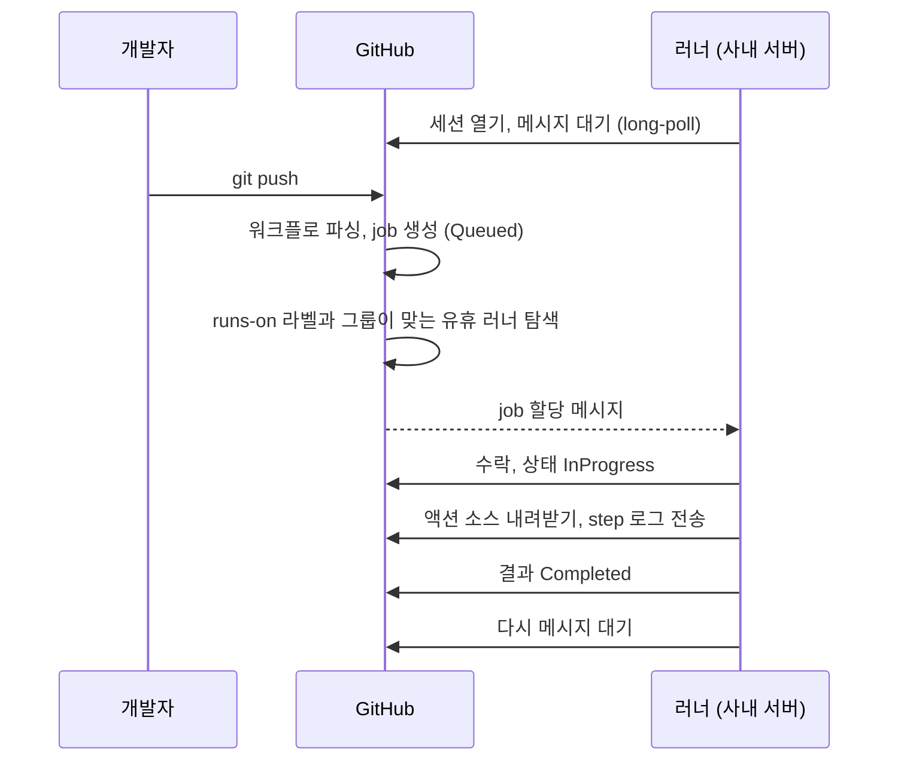
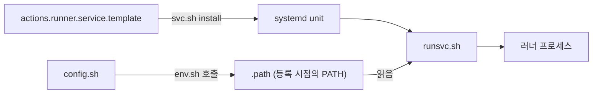
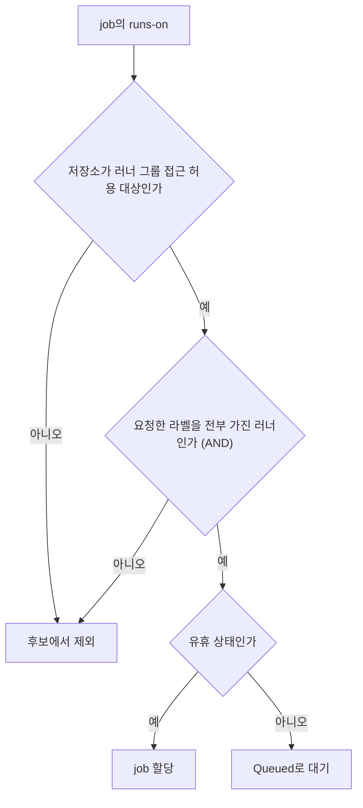
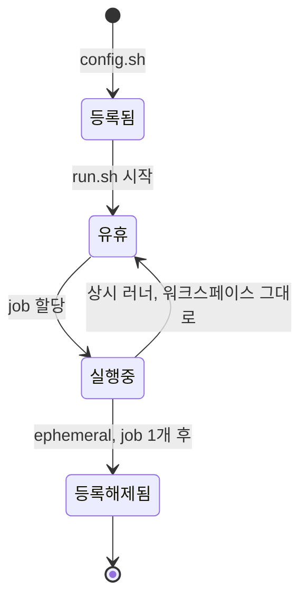
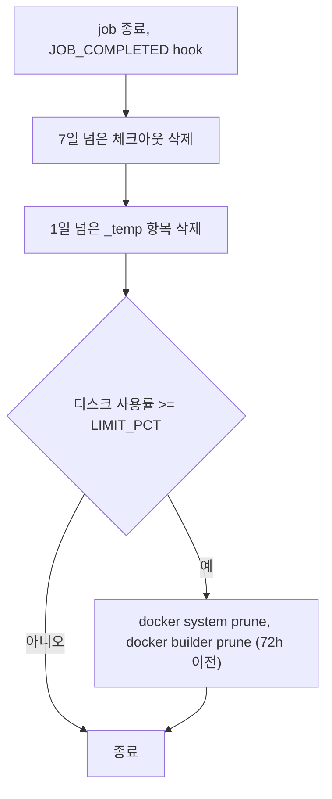
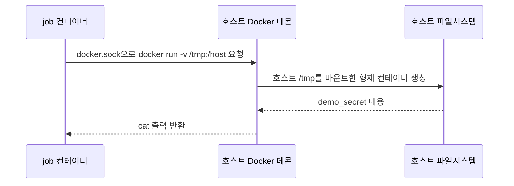
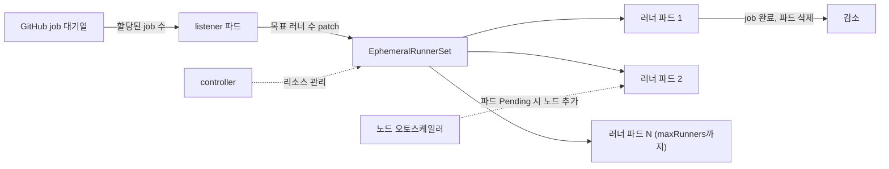
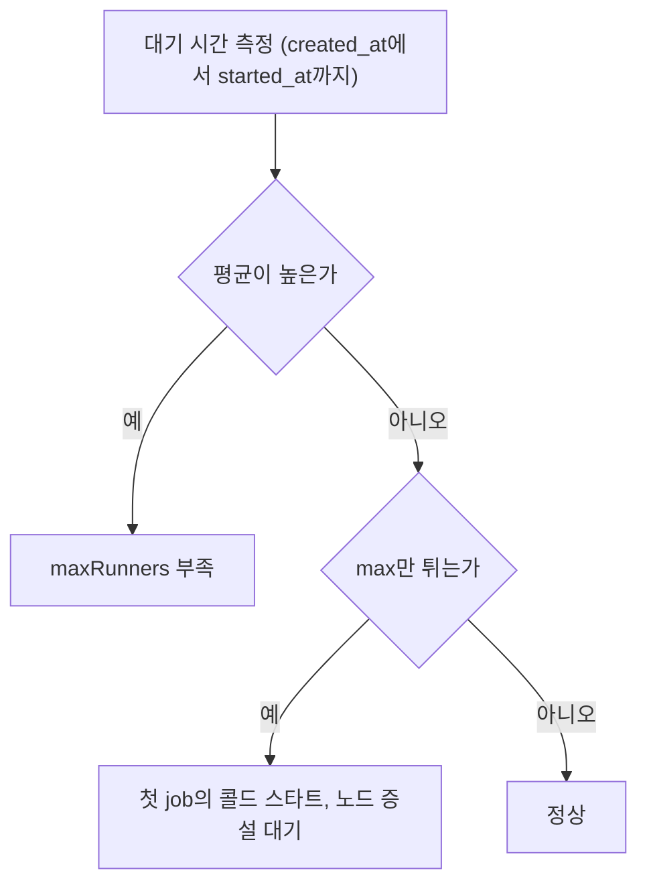
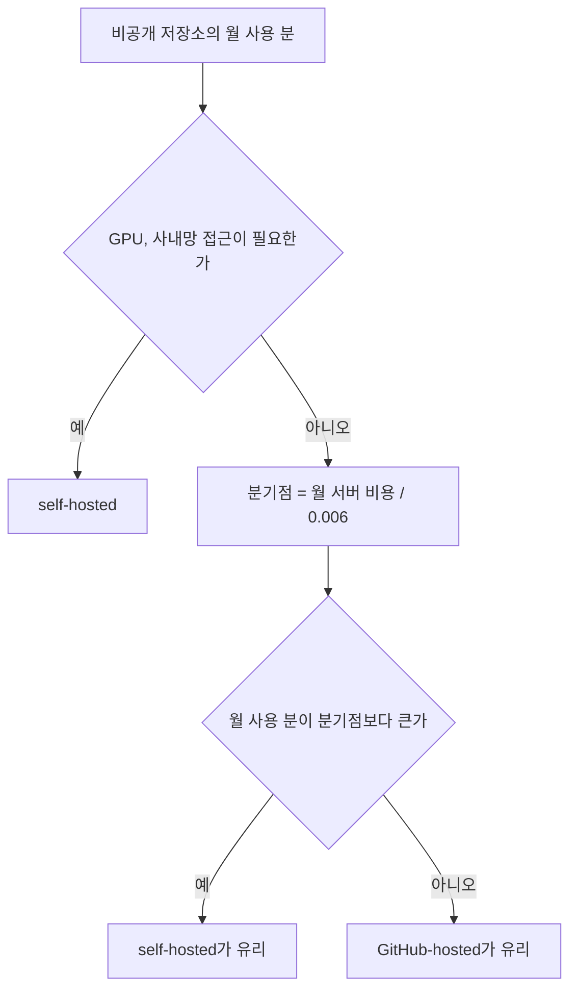
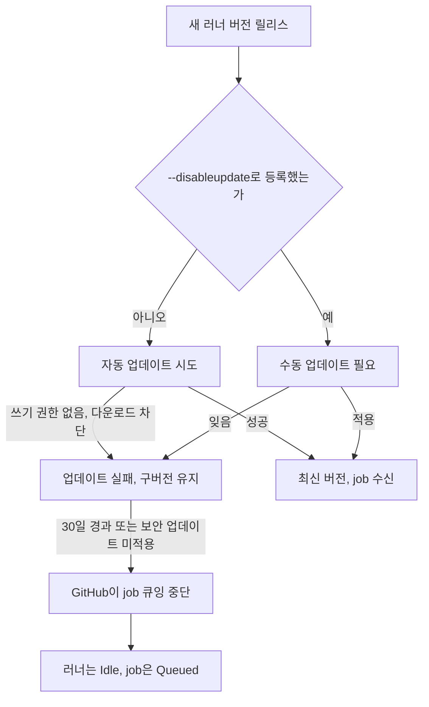

# GitHub Actions self-hosted 러너 운영, ephemeral·ARC·디스크·비용

[GitHub Actions](GitHub_Actions.md) 문서의 보안 절은 공개 저장소에 self-hosted 러너를 붙이면 안 되는 이유만 다룬다. 러너를 붙이는 것까지는 30분이면 끝난다. 문제는 그 뒤에 나온다. 석 달쯤 지나 job이 이유 없이 멈추고, 보면 디스크가 100%다. 어느 날 갑자기 모든 job이 `Queued`에서 움직이지 않는데, 러너 버전이 한 달 넘게 오르지 않았다. 앞 job이 남긴 `node_modules`가 다음 job의 빌드 결과를 바꾸고, 팀원이 편의로 넣은 Docker 소켓 마운트 하나가 러너 호스트의 root 권한과 같다.

이 문서는 러너를 설치한 다음부터 필요한 운영 이야기를 모았다. 설치와 라우팅, 러너를 job마다 새로 띄우는 이유, 디스크, Docker 소켓, Kubernetes 위의 오토스케일링, 비용 계산, 업데이트 중단 사고 순서다. 직접 돌려서 확인한 것과 문서로만 확인한 것은 마지막 절에 구분해 적었다.

## job이 러너까지 오는 경로

러너는 GitHub 쪽 포트를 받는 서버가 아니다. 러너가 GitHub로 나가는 HTTPS(443) 연결을 열어 두고 일감이 오기를 기다린다. 공식 문서가 요구하는 것도 아웃바운드 443과 `github.com`, `api.github.com`, `*.actions.githubusercontent.com` 접근이 전부다. 그래서 방화벽에서 인바운드를 열 필요가 없고, 반대로 아웃바운드를 프록시로 막은 회사망에서는 이 세 도메인이 막혔는지부터 본다.

아래 시퀀스는 push 하나가 job이 되어 러너에서 끝나기까지다. 봐야 할 곳은 러너가 job이 생기기 전부터 요청을 걸어 놓고 있다는 점, 그리고 GitHub이 라벨이 맞는 러너를 골라 그 대기 중인 요청에 일감을 실어 보낸다는 점이다.



맞는 러너가 하나도 없으면 job은 `Queued`로 남는다. 공식 문서 기준으로 24시간 넘게 큐에 있으면 job이 실패한다. 라벨 오타 하나로 24시간을 기다리는 일이 실제로 생기니, 새 라벨을 쓰는 워크플로를 처음 돌릴 때는 `Queued`에서 1분 넘게 움직이지 않으면 러너 쪽보다 `runs-on`을 먼저 의심한다.

## 설치와 systemd 등록

저장소 Settings의 Actions > Runners > New self-hosted runner 화면이 OS와 아키텍처에 맞는 명령과 일회용 토큰을 만들어 준다. 공식 문서도 명령을 직접 적지 않고 이 화면을 따르라고 한다. 아래는 Linux x64에서 내가 받아서 푼 순서다. 2026-10-08 기준 최신 릴리스는 v2.338.0이고 tarball은 227,660,598바이트(약 228MB)였다. 버전은 설치하는 날 화면에 나오는 값을 쓰고, 릴리스 페이지에 같이 올라오는 SHA-256으로 받은 파일을 대조한다.

```bash
mkdir actions-runner && cd actions-runner
curl -o actions-runner-linux-x64-2.338.0.tar.gz -L \
  https://github.com/actions/runner/releases/download/v2.338.0/actions-runner-linux-x64-2.338.0.tar.gz
tar xzf ./actions-runner-linux-x64-2.338.0.tar.gz

sudo ./bin/installdependencies.sh        # libicu 등 .NET 의존성
./config.sh --url https://github.com/ORG/REPO --token <등록 토큰>
```

등록 토큰은 발급 후 1시간이 지나면 못 쓴다. 장비 여러 대에 손으로 붙이다 보면 앞서 받은 토큰이 만료돼 있는 경우가 있어서, 스크립트로 자동화할 때는 REST API(`POST /repos/{owner}/{repo}/actions/runners/registration-token`)로 매번 새로 받는다.

`./run.sh`는 터미널을 닫으면 같이 죽는다. 상시 운영은 systemd에 올린다. `config.sh`가 끝나면 러너 디렉터리에 `svc.sh`가 생긴다. tarball을 푼 직후에는 이 파일이 없고, `bin/`에 `systemd.svc.sh.template`만 있다.

```bash
sudo ./svc.sh install ci-runner     # 실행 사용자를 지정한다
sudo ./svc.sh start
sudo ./svc.sh status
```

사용자 인자를 생략하면 `sudo`를 부른 계정(`$SUDO_USER`)으로 등록된다. root로 직접 로그인해서 돌리면 서비스도 root로 뜨는데, 이 서비스가 곧 모든 job의 실행 계정이니 전용 계정을 만들어서 넣는다. 서비스 이름은 `actions.runner.<대상>.<러너 이름>.service` 꼴로 만들어지므로 로그는 `journalctl -u 'actions.runner.*' -f`로 본다.

아래 그림은 등록부터 서비스 기동까지의 파일 흐름이다. `config.sh`가 `.path`를 한 번 쓰고 `runsvc.sh`가 그것을 읽는다는 점, 그리고 템플릿에서 unit이 만들어진다는 점을 보면 된다.



내가 템플릿 파일을 열어서 확인한 것 중 운영에 영향이 있는 것이 두 가지다.

첫째, `bin/actions.runner.service.template`에 `Restart=` 줄이 없다. 러너 프로세스가 비정상 종료하면 systemd가 다시 띄워 주지 않는다. 팀에서 "러너가 가끔 오프라인이 된다"고 하면 대부분 이 경우다. 직접 쓰는 템플릿에 `Restart=always`를 넣거나, `GITHUB_ACTIONS_RUNNER_SERVICE_TEMPLATE` 환경변수로 템플릿 경로를 바꿔서 `svc.sh`가 그 파일로 unit을 만들게 한다. 공식 문서도 커스텀 서비스를 만들 때는 `runsvc.sh`를 진입점으로 쓰라고 한다.

둘째, 서비스가 쓰는 `PATH`는 `config.sh`를 돌린 시점의 값이다. `config.sh`가 부르는 `env.sh`가 `echo $PATH>.path`로 파일에 박고, `runsvc.sh`가 그 파일을 읽는다. 등록 후에 `nvm`이나 `pyenv`로 도구를 깔고 서비스에서 `command not found`가 나면 이 파일이 원인이다. 도구 경로를 `.path`에 반영하거나, 워크플로에서 `setup-node` 같은 액션으로 버전을 명시한다.

네트워크가 의심스러우면 등록 전에 먼저 점검한다.

```bash
./run.sh --check --url https://github.com/ORG/REPO --pat <PAT>
```

## 그룹과 라벨로 job을 어디에 보낼지 정하기

`runs-on`은 배열을 받으면 "전부 가진 러너"를 찾는다. OR이 아니라 AND다.

```yaml
jobs:
  train:
    runs-on: [self-hosted, linux, gpu]
```

이 job은 세 라벨을 모두 가진 러너만 받는다. `config.sh`는 `--no-default-labels`를 주지 않으면 `self-hosted,Linux,X64`를 기본으로 붙이고, 커스텀 라벨은 `--labels gpu,a100`처럼 쉼표로 넣는다. `--no-default-labels`를 쓰면 `--labels`가 필수다. 라벨은 문자열일 뿐이고 공식 문서도 GitHub이 러너가 실제로 그 OS인지 검증하지 않는다고 적고 있다. 라벨을 `gpu`로 붙여 놓고 GPU가 없는 장비에 등록하면 그 장비로 GPU job이 간다.

라벨을 만들 때 규칙이 없으면 반드시 엉킨다. 내 경우 `linux`, `gpu`, `a100`, `prod-deploy`가 섞여 쓰이다가 누가 `gpu-a100`을 새로 만들어서 같은 장비가 두 이름으로 불렸다. 팀에서 정하는 쪽이 낫다. 하드웨어 라벨(`gpu`, `arm64`)과 용도 라벨(`deploy`)은 섞지 않는다. 배포용 러너에는 하드웨어 라벨을 붙이지 않는다.

라벨은 "어떤 장비인가"를 고르는 장치고, 러너 그룹은 "누가 쓸 수 있나"를 정하는 장치다. 공식 문서에서도 둘을 독립된 라우팅 수단으로 설명한다. 조직 설정에서 그룹을 만들고 접근을 허용할 저장소를 지정하면, 허용되지 않은 저장소의 워크플로는 그 그룹의 러너로 갈 수 없다. 러너를 그룹에 붙이는 것은 등록할 때 `--runnergroup`이다.

job이 러너를 고르는 판정 순서는 아래와 같다. 그룹이 먼저 후보를 걸러 내고, 그 안에서 라벨이 전부 맞는 러너만 남는다는 점을 보면 된다.



```bash
./config.sh --url https://github.com/ORG --token <TOKEN> \
  --runnergroup gpu-pool --labels gpu,a100 --name gpu-01
```

워크플로에서는 그룹을 `runs-on`에 직접 쓸 수 있다.

```yaml
jobs:
  train:
    runs-on:
      group: gpu-pool
      labels: [self-hosted, gpu]
```

저장소 단위로 붙인 러너에는 그룹이 없다. 그룹은 조직이나 엔터프라이즈 단위 러너의 기능이다. 사용 중인 플랜에서 커스텀 그룹을 만들 수 있는지는 조직 Settings > Actions > Runner groups에서 확인한다. 운영 규칙은 이렇게 잡는다. 배포 권한이 있는 러너는 별도 그룹에 넣고 그 그룹을 쓸 수 있는 저장소를 소수로 제한한다. 신뢰할 수 없는 PR을 받는 저장소는 그 그룹에 접근하지 못하게 한다. 라벨만으로는 이 경계가 만들어지지 않는다.

## 러너를 job마다 새로 띄우는 이유

기본 설정의 self-hosted 러너는 같은 프로세스, 같은 디렉터리로 job을 계속 받는다. GitHub-hosted 러너와 가장 크게 갈리는 지점이다. 상시 러너에서 job 사이에 이어지는 것은 이렇다.

- 워크스페이스. `actions/checkout`은 기본값으로 이전 체크아웃 위에 덮어쓴다. 추적하지 않는 파일(`.env`, 빌드 산출물, `node_modules`)은 `git clean`을 따로 하지 않으면 남는다. 어제 job이 만든 파일 때문에 오늘 테스트가 통과하고, 새 장비에서는 실패하는 일이 생긴다.
- 캐시와 도구 디렉터리. `_work/_tool`, 홈 디렉터리의 패키지 캐시가 계속 쌓인다. 빠르다는 장점이 되기도 하지만, 오염된 캐시를 다음 job이 그대로 쓰는 문제도 된다.
- 자격증명. `docker login`이 남긴 `~/.docker/config.json`, 클라우드 CLI 프로필, 에이전트 소켓이 다음 job에서 보인다. 공식 보안 문서도 명령행 인자로 시크릿이 넘어간 job은 같은 러너의 다른 job이 `ps x -w`로 볼 수 있다고 경고한다.
- 악성 코드의 지속. 신뢰하지 않는 코드가 한 번 job에서 실행되면 러너 호스트에 무엇이든 심어 둘 수 있고, 다음 job에도 남는다. 공식 문서는 self-hosted 러너가 깨끗한 일회용 VM이라는 보장이 없다고 명시한다.

`--ephemeral`은 러너가 job 하나만 받고 서비스가 등록을 해제하게 한다. `config.sh --help`는 "only take one job and then let the service un-configure the runner after the job finishes"라고 설명한다. 공식 오토스케일링 문서는 상시 러너가 아니라 ephemeral 러너로 오토스케일링을 구현하라고 권한다. 작업이 할당되는 도중에 상시 러너를 끄면 job이 날아가는 문제가 있기 때문이다.



위 다이어그램에서 `실행중`에서 `유휴`로 돌아가는 화살표가 문제의 근원이다. ephemeral은 이 화살표가 없다. 그 대신 러너를 다시 만드는 작업이 외부 몫이 된다.

여기서 설치 절의 `Restart=` 이야기가 이어진다. ephemeral 러너를 `svc.sh`로 올리면 job 하나가 끝나고 러너가 등록 해제된 뒤 서비스가 멈추고, 다시 `config.sh`를 돌려야 하는데 토큰은 이미 쓰였다. 한 장비에서 같은 러너가 job을 계속 받게 하려는 용도가 아니라, 장비(VM이나 파드)를 job마다 만들고 버리는 구조를 전제로 설계된 옵션이다. 인스턴스를 띄우는 쪽에서 `--ephemeral`로 등록하고, job이 끝나면 인스턴스를 지운다. REST API로 JIT(just-in-time) 러너 설정을 만들어 그 값으로 바로 러너를 띄우는 방법도 공식 문서에 있다. 오래 쓰는 등록 토큰을 장비에 두지 않아도 되는 쪽이다.

ephemeral만으로 깨끗해지지 않는 것도 있다. 공식 보안 문서가 JIT 러너를 같은 하드웨어에서 재사용하면 환경 정보가 노출될 수 있으니 자동화로 깨끗한 환경을 보장하라고 적고 있다. 러너 프로세스만 새로 뜨고 같은 VM의 홈 디렉터리와 Docker 데이터가 남아 있다면 상시 러너와 차이가 크지 않다. 파드나 VM 자체가 새로 만들어져야 의미가 있다.

## 디스크가 차서 job이 멈출 때

증상은 제각각이다. 체크아웃 단계에서 `No space left on device`가 나오기도 하고, `docker build`가 레이어를 쓰다 죽기도 하고, 러너가 job 로그를 못 써서 상태가 `Running`에서 멎은 듯 보이기도 한다. 어느 경우든 `df -h`부터 본다.

상시 러너에서 디스크를 먹는 것은 대개 세 곳이다. `_work/<저장소>/<저장소>`의 체크아웃 결과물, `_work/_tool`과 `_work/_temp`, 그리고 `/var/lib/docker`의 이미지와 빌드 캐시다. 이 중 Docker가 가장 크다. 러너가 만드는 하위 디렉터리 구성은 버전에 따라 다를 수 있으니 지우기 전에 `du`로 확인한다.

```bash
du -xh --max-depth=2 /opt/actions-runner/_work | sort -h | tail -15
docker system df
```

job이 끝날 때마다 정리 스크립트를 걸어 두는 방법으로 러너 hook을 쓴다. 러너 바이너리 안에 `ACTIONS_RUNNER_HOOK_JOB_STARTED`와 `ACTIONS_RUNNER_HOOK_JOB_COMPLETED` 문자열이 있는 것을 2.338.0에서 확인했다. 러너 디렉터리의 `.env`에 스크립트 경로를 넣는다.

```bash
echo 'ACTIONS_RUNNER_HOOK_JOB_COMPLETED=/opt/actions-runner/cleanup.sh' >> .env
sudo ./svc.sh stop && sudo ./svc.sh start     # .env 는 재시작해야 읽힌다
```

아래는 내가 쓰는 정리 스크립트다. 임계치를 넘을 때만 Docker를 정리한다. `DRY_RUN=1`로 임의 디렉터리에 돌려서, 7일 넘은 체크아웃과 하루 넘은 `_temp` 파일만 대상이 되는지 확인했다.

```bash
#!/usr/bin/env bash
set -euo pipefail

WORK="${RUNNER_WORK:-/opt/actions-runner/_work}"
LIMIT_PCT="${LIMIT_PCT:-80}"
DRY_RUN="${DRY_RUN:-0}"

used_pct() { df --output=pcent "$WORK" | tail -1 | tr -dc '0-9'; }
run() { if [ "$DRY_RUN" = 1 ]; then echo "[dry] $*"; else "$@"; fi; }

echo "disk before: $(used_pct)%"

# 7일 넘게 안 건드린 저장소 체크아웃. 밑줄로 시작하는 디렉터리는 러너 내부용이라 제외
find "$WORK" -mindepth 1 -maxdepth 1 -type d ! -name '_*' -mtime +7 -print0 |
  while IFS= read -r -d '' d; do run rm -rf -- "$d"; done

find "$WORK/_temp" -mindepth 1 -maxdepth 1 -mtime +1 -print0 2>/dev/null |
  while IFS= read -r -d '' d; do run rm -rf -- "$d"; done

if [ "$(used_pct)" -ge "$LIMIT_PCT" ]; then
  run docker system prune --all --force --filter "until=72h"
  run docker builder prune --all --force --filter "until=72h"
fi

echo "disk after: $(used_pct)%"
```

스크립트가 도는 순서는 아래와 같다. 체크아웃과 `_temp`는 무조건 정리하고, Docker 정리는 사용률이 임계치를 넘을 때만 간다.



주의할 점이 몇 가지 있다. 디렉터리의 `-mtime`은 그 디렉터리 바로 아래 항목이 바뀐 시각이라, 안쪽 깊은 곳 파일이 최근에 바뀌어도 오래된 것으로 나올 수 있다. 같은 러너에서 job이 동시에 돌 수 있는 구성(러너 하나에 job 하나가 원칙이지만 장비 하나에 러너 여러 개를 띄우는 경우)에서는 다른 러너의 `_work`를 건드리지 않도록 경로를 러너별로 분리한다. 그리고 `docker system prune --all`은 다른 job이 쓰는 중이 아닌 이미지를 전부 지우므로 다음 job의 첫 `docker pull`이 느려진다. 이 비용이 싫으면 `--all`을 빼고 dangling만 지운다. `until=72h` 필터는 방금 받은 베이스 이미지가 지워지는 것을 막으려고 넣었다.

장비 한 대에 여러 job이 몰리는 환경에서 정리 스크립트를 계속 고치는 것보다 ephemeral 러너로 장비 자체를 버리는 쪽이 운영 부담이 적다. 위 스크립트는 상시 러너를 어쩔 수 없이 유지할 때 쓴다.

## Docker 소켓을 마운트하면 생기는 일

"러너 안에서 Docker를 쓰고 싶다"는 요구에 가장 흔한 답이 `/var/run/docker.sock` 마운트다. 컨테이너 job이나 파드에 소켓을 넣으면 안의 `docker` 명령이 호스트 데몬에 닿는다. 편하다. 그런데 이 소켓은 호스트 데몬의 root 권한 API다.

직접 해봤다. 소켓과 docker 바이너리만 넣은 컨테이너 안에서 호스트 파일을 읽는 과정이다. 호스트의 `/tmp/demo_secret`에 파일을 만들어 두고 실행했다.

```bash
docker run --rm \
  -v /var/run/docker.sock:/var/run/docker.sock \
  -v /usr/bin/docker:/usr/bin/docker \
  debian:12-slim sh -c '
    ls /tmp/demo_secret                                   # 컨테이너 안에는 없다
    docker run --rm -v /tmp:/host alpine:3.20 cat /host/demo_secret
    docker run --rm --privileged --pid=host alpine:3.20 ps | head -3
  '
```

```
ls: cannot access '/tmp/demo_secret': No such file or directory
host-secret-<호스트명>
PID   USER     TIME  COMMAND
    1 root     16:32 {systemd} /sbin/init
    2 root      0:13 [kthreadd]
```

아래 시퀀스는 위 실험에서 파일이 새어 나간 경로다. job 컨테이너가 직접 호스트 파일을 읽는 것이 아니라 호스트 데몬에게 부탁해 읽는다는 점이 핵심이다.



바깥 컨테이너에서는 파일이 보이지 않는다. 그런데 소켓으로 형제 컨테이너를 띄우고 호스트 경로를 마운트하자 파일 내용이 그대로 나왔다. `--privileged --pid=host`로 띄운 컨테이너의 PID 1은 호스트의 systemd다. 컨테이너가 격리되어 있다고 생각하는 순간에도 소켓이 있으면 호스트 전체가 열려 있다. 이 job을 돌리는 사람, 그 job이 내려받는 모든 액션과 npm 패키지가 같은 권한을 갖는다.

그래서 Docker가 필요한 job의 선택지는 이렇게 갈린다.

- 신뢰하는 저장소의 내부 job만 있고 러너가 ephemeral VM이라 호스트가 곧 버려진다면, 소켓 마운트나 호스트 Docker 사용은 감수할 수 있다. 피해 범위가 VM 하나로 제한되기 때문이다.
- 러너 호스트가 다른 용도로도 쓰인다면 마운트하지 않는다. rootless Docker나 BuildKit 데몬을 따로 두고 소켓이 아니라 원격 빌더로 접근한다.
- ARC에서는 `containerMode`로 `dind`(Docker-in-Docker 사이드카)와 `kubernetes`(job을 별도 파드로 실행)를 고른다. `dind`는 보통 privileged 컨테이너가 필요하고, `kubernetes` 모드는 job 컨테이너를 쿠버네티스 파드로 띄우기 때문에 노드의 Docker 소켓과 무관하다. 대신 `docker build`를 그대로 쓸 수 없어서 Kaniko·BuildKit 같은 도구로 바꿔야 한다.

공개 저장소의 PR을 받는 러너에 Docker 소켓이 열려 있으면 앞 절의 "공개 저장소에 self-hosted 러너를 붙이면 안 된다"는 말이 가장 구체적인 형태로 현실이 된다.

## ARC로 Kubernetes에서 오토스케일링하기

러너 장비를 사람이 늘리고 줄이는 방식은 오래 못 간다. 아침 출근 시간에 PR이 몰려 큐가 20분씩 밀리고, 밤에는 장비가 놀고 있다. Actions Runner Controller(ARC)는 이 문제를 Kubernetes에서 푼다. 여기서 말하는 ARC는 `gha-runner-scale-set` 차트를 쓰는 GitHub 공식 버전이다. 예전 `summerwind` 계열(`actions.summerwind.net`)과는 구조가 달라서 인터넷에서 찾은 설정을 섞어 쓰면 맞지 않는다.

구성은 컨트롤러 하나와 scale set마다 하나씩 붙는 listener 파드다. listener가 GitHub에 long-poll로 이 scale set 앞으로 온 메시지를 받고, 필요한 러너 수를 계산해 쿠버네티스 리소스를 고친다. 아래 그림은 대기열 증가가 파드 증가로 이어지는 경로다. 눈여겨볼 것은 파드 수를 정하는 쪽이 HPA 같은 쿠버네티스 지표가 아니라 GitHub이 알려 주는 할당된 job 수라는 점이다.



설치 명령은 공식 문서의 형태다. 컨트롤러를 먼저 올리고 scale set을 올린다. 공식 문서에 따르면 `--version`으로 차트 버전을 지정할 수 있고, 위 명령은 지정하지 않아 최신이 설치된다. 2026-10-08에 확인한 최신 릴리스 태그는 `gha-runner-scale-set-0.15.0`이었다. 운영에서는 버전을 명시해서 고정하고, 올리기 전에 스테이징에서 먼저 돌린다.

```bash
helm install arc \
  --namespace arc-systems --create-namespace \
  oci://ghcr.io/actions/actions-runner-controller-charts/gha-runner-scale-set-controller

helm install arc-runner-set \
  --namespace arc-runners --create-namespace \
  --set githubConfigUrl="https://github.com/ORG" \
  --set githubConfigSecret.github_token="${GITHUB_PAT}" \
  --set minRunners=1 \
  --set maxRunners=20 \
  oci://ghcr.io/actions/actions-runner-controller-charts/gha-runner-scale-set
```

워크플로는 scale set 이름(위에서는 Helm 릴리스 이름 `arc-runner-set`)을 `runs-on`에 쓴다. 배열이 아니라 문자열 하나다.

```yaml
jobs:
  build:
    runs-on: arc-runner-set
```

ARC 러너는 항상 ephemeral이다. job이 끝나면 파드가 지워지고, 다음 job은 새 파드에서 시작한다. 앞서 말한 워크스페이스·캐시·자격증명 잔존이 구조적으로 없다. 대신 캐시도 매번 비어 있다. 의존성 설치가 느려지는 것이 가장 흔한 불만이고, `actions/cache`나 PVC로 캐시 위치를 따로 둬야 한다.

`minRunners`와 `maxRunners`는 이름이 직관적이지 않다. listener 소스(`cmd/ghalistener/scaler/scaler.go`)를 읽으면 목표 러너 수는 `min(minRunners + 할당된 job 수, maxRunners)`다. `minRunners`는 "항상 떠 있는 유휴 러너 수"여서, 이미 job 3개가 할당된 상태에서 `minRunners: 2`면 5개를 목표로 한다. `minRunners: 0`이면 평소에 파드가 하나도 없어 비용은 가장 적지만, 첫 job은 파드 스케줄링과 이미지 pull을 기다린다. 노드까지 없어서 노드 오토스케일러가 장비를 먼저 띄워야 한다면 대기가 몇 분 단위로 늘어난다. 큐 대기를 허용할 수 없는 저장소가 있으면 `minRunners`를 1~2로 둔다. 이 값은 감으로 정하지 말고 다음 절의 측정으로 정한다.

`maxRunners`는 비용과 클러스터 보호 장치다. 비용을 제한하려면 이 값이 필요하지만, 값이 작으면 PR이 몰릴 때 큐가 길어진다. 클러스터 노드 수와 리소스 request를 같이 봐야 한다. `maxRunners`가 20인데 노드가 10개 분량이면 파드 10개가 `Pending`에 걸려 러너가 등록조차 못하고 job만 `Queued`에 쌓인다.

## 큐 대기 시간을 재야 하는 이유

오토스케일링 설정이 맞는지는 "job이 생겨서 시작되기까지 몇 초"로 판단한다. 체감으로는 판단이 안 된다. 개발자는 "CI가 느리다"고 말하지만 실행 시간이 느린지 대기가 긴지는 구분하지 못한다.

API로 job의 `created_at`과 `started_at`을 받아서 차이를 계산한다. 아래 스크립트는 최근 완료된 run에서 특정 라벨을 쓴 job의 대기 시간을 모은다. `jq` 필터와 통계 부분은 가짜 JSON으로 검증했고, `gh api` 호출 부분은 실제 저장소에 돌려보지 못했다.

```bash
#!/usr/bin/env bash
# 사용: qwait.sh OWNER/REPO 라벨 [최근 run 개수]
set -euo pipefail
repo="$1"; label="$2"; n="${3:-30}"

gh api "repos/$repo/actions/runs?per_page=$n&status=completed" --jq '.workflow_runs[].id' |
while read -r run; do
  gh api "repos/$repo/actions/runs/$run/jobs?per_page=100" |
  jq -r --arg l "$label" '
    .jobs[]
    | select(.started_at != null and (.labels | index($l)))
    | [.name, ((.started_at | fromdateiso8601) - (.created_at | fromdateiso8601))]
    | @tsv'
done | cut -f2 | jq -s -r '
  sort as $s
  | if ($s | length) == 0 then "no jobs"
    else "jobs=\($s|length) avg=\(add/length|floor)s p50=\($s[(length/2|floor)])s max=\($s[-1])s" end'
```

ARC의 job은 `labels`에 scale set 이름만 들어오고 `self-hosted`가 없을 수 있어서, 라벨 인자는 `runs-on`에 쓴 값 그대로 넘긴다. 예를 들어 `./qwait.sh ORG/REPO arc-runner-set 50`처럼 쓴다. 이 값이 평균은 낮은데 max만 튄다면 첫 job의 콜드 스타트나 노드 증설 문제이고, 평균 자체가 높다면 `maxRunners`가 모자란 것이다.

이 판단을 순서대로 놓으면 아래와 같다. 평균을 먼저 보고, 그다음 max를 본다.



실시간 지표는 ARC가 내보내는 Prometheus 메트릭이 맞다. 컨트롤러 차트 `values.yaml`에서 `metrics:` 블록의 주석을 풀어야 켜진다. 기본값은 꺼져 있다.

```yaml
metrics:
  controllerManagerAddr: ":8080"
  listenerAddr: ":8080"
  listenerEndpoint: "/metrics"
```

listener 소스에서 확인한 메트릭 이름 중 운영에서 보는 것은 `gha_assigned_jobs`(할당된 job 수), `gha_desired_runners`(목표 러너 수), `gha_min_runners`·`gha_max_runners`, `gha_registered_runners`, `gha_busy_runners`, `gha_idle_runners`, 그리고 히스토그램 `gha_job_startup_duration_seconds`와 `gha_job_execution_duration_seconds`다. `gha_desired_runners`가 `gha_max_runners`에 붙어 있는 시간이 길면 상한에 걸린 것이다. `gha_desired_runners`는 높은데 `gha_registered_runners`가 안 따라오면 파드가 안 뜨는 쪽(노드, 이미지 pull, 쿼터)이 문제다. 메트릭의 레이블과 버킷 설정은 차트 버전에 따라 달라지고 레이블이 많아 카디널리티 문제가 이슈로 올라온 적이 있으니, 켜기 전에 사용 중인 버전의 `values.yaml` 주석을 읽는다.

## GitHub-hosted와 비용 분기점

비용 비교의 출발은 분당 단가다. 공식 청구 문서 기준으로 GitHub-hosted Linux 2코어(x64)는 분당 $0.006이고, self-hosted 러너 사용 자체는 Actions 분 과금 대상이 아니다. 플랜별 월 포함 분은 Free 2,000, Pro 3,000, Team 3,000, Enterprise Cloud 50,000분이다(2026-10-08에 문서를 읽은 값). 공개 저장소의 표준 러너는 무료여서 이 계산은 비공개 저장소 얘기다.

2025년 12월에 GitHub이 self-hosted 러너에도 분당 $0.002의 플랫폼 요금을 붙이겠다고 발표했다가 며칠 안에 유예한 일이 있었다. 2026-10-08 시점에 공식 문서는 self-hosted 사용이 무료라고 적고 있다. 이 문서를 쓰는 시점 이후에 정책이 바뀌었는지는 청구 문서를 다시 확인해야 한다.

분기점은 한 줄이다. 서버 상시 비용을 분당 단가로 나눈 분수가 손익분기 사용량이다.

```
분기점(분/월) = 월 서버 비용 / 0.006
```

| 월 서버 비용(운영 인건비 포함) | 분기점 |
|---|---|
| $80 | 13,333분 (약 222시간) |
| $150 | 25,000분 (약 417시간) |
| $300 | 50,000분 (약 833시간) |

월 25,000분을 쓰는 팀이 $150짜리 서버를 쓰면 같아지고, 월 60,000분을 쓰면 GitHub-hosted가 Team 포함 3,000분을 빼고 $342, 서버는 $150라서 서버 쪽이 낫다. 월 8,000분만 쓰는 팀은 GitHub-hosted가 포함 분을 빼고 $30 정도여서 서버를 둘 이유가 없다.

선택 순서를 그림으로 놓으면 아래와 같다. 비용 계산이 필요한 것은 GPU나 사내망 요구가 없어서 선택이 가능한 경우뿐이다.



이 계산에서 틀리기 쉬운 곳이 세 가지다.

첫째, 서버 비용에 사람 시간이 빠진다. 앞 절들의 디스크 정리, 러너 업데이트, 장애 대응이 전부 사람 몫이다. 월 4시간만 쓴다 해도 시급에 따라 $200 안팎이 더해져서 위 표의 분기점이 두 배로 밀린다. 서버 $150에 인건비 $200을 더하면 $350이고, 분기점은 58,333분이다.

둘째, 속도 차이를 분으로 환산하지 않는다. 2코어 GitHub-hosted에서 20분 걸리던 빌드가 8코어 self-hosted에서 8분 걸리면 청구 분 자체가 줄어든다. 같은 사양의 larger runner 단가와 비교해야 공정하다. larger runner의 분당 단가는 크기마다 다르니 요금표를 직접 확인한다.

셋째, 상시 서버는 놀고 있는 시간도 비용이다. 사용률이 30%면 실제 분당 단가는 계산값의 3배 이상이다. 이 점에서 ARC는 `minRunners: 0`으로 두면 노드 비용만 쓴 만큼 나가므로 상시 서버의 이 약점을 줄여 준다. 대신 클러스터 자체의 운영 비용이 생긴다.

GPU처럼 GitHub-hosted에 해당 사양이 없거나, 사내망 자원(내부 레지스트리, DB)에 접근해야 하는 경우는 비용과 관계없이 self-hosted가 답이다. 비용 계산은 "선택이 가능한 경우"에만 의미가 있다.

## 세 방식을 나란히 놓으면

| 항목 | GitHub-hosted | self-hosted 상시 러너 | ARC runner scale set |
|---|---|---|---|
| job마다 새 환경 | 항상 | 아니오, `--ephemeral` 쓰고 장비를 새로 만들어야 | 항상 (파드 단위) |
| 확장 | GitHub이 처리 | 사람이 장비 추가 | `minRunners`~`maxRunners` 자동 |
| 첫 job 대기 | 수 초 | 유휴 러너가 있으면 거의 0 | `minRunners: 0`이면 파드·노드 기동 시간 |
| 사내망 접근 | 어려움 | 가능 | 클러스터 네트워크 정책에 따름 |
| 특수 하드웨어(GPU) | larger runner 범위 | 가능 | 노드 풀에 GPU가 있으면 가능 |
| 디스크 관리 | 불필요 | 직접 정리 필요 | 파드 삭제로 사라짐, 캐시는 별도 |
| 러너 버전 관리 | GitHub | 자동 업데이트 또는 직접 | 러너 이미지 태그를 올려야 함 |
| Docker 사용 | 그대로 가능 | 소켓 마운트 위험 | `dind` 또는 `kubernetes` 모드 선택 |
| 비용 | 분당 과금 | 서버 상시 비용 | 클러스터 비용 + 운영 인건비 |
| 운영 부담 | 없음 | 장비·OS·러너 | 쿠버네티스·차트 버전·이미지 |

표에서 마지막 줄이 선택을 가른다. 팀에 이미 쿠버네티스를 운영하는 사람이 있으면 ARC가 상시 러너보다 적게 든다. 없다면 ARC를 위해 쿠버네티스를 새로 운영하는 부담이 상시 러너 몇 대의 관리보다 크다.

## 러너 업데이트가 멈췄을 때 job이 오지 않는 경우

러너는 기본적으로 새 버전이 나오면 스스로 업데이트한다. `--disableupdate`로 이 동작을 끌 수 있다. 공식 문서의 규칙은 두 가지다. 30일 안에 업데이트하지 않으면 GitHub Actions 서비스가 그 러너에 job을 큐잉하지 않는다. 중요한 보안 업데이트가 있으면 그 업데이트를 마칠 때까지 큐잉하지 않는다.

증상이 헷갈린다. 러너는 Settings에 `Idle`로 보이는데 job이 오지 않는다. job은 `Queued`에서 움직이지 않다가 24시간 뒤에 실패한다. 러너 로그에는 오류가 없고, 러너가 뜨는 것도 정상이다. 러너를 고쳐야 한다는 신호가 없어서 라벨, 그룹, 권한을 먼저 의심하게 된다.

아래 흐름에서 러너 프로세스는 계속 정상인데 GitHub 쪽 큐잉만 끊기는 경로를 보면 된다.



원인이 되는 상황은 몇 가지로 나뉜다.

- `--disableupdate`로 등록해 놓고 수동 업데이트를 잊었다. 이미지나 AMI에 러너를 구워서 버전을 고정하는 구성에서 가장 흔하다.
- 자동 업데이트가 실패한다. 업데이트는 러너 디렉터리 안의 파일을 바꾸는 방식이라 서비스 실행 계정에 그 디렉터리 쓰기 권한이 없으면 실패한다. `update.sh` 템플릿이 남기는 로그는 `_diag/SelfUpdate-<시각>.log`이니 여기를 본다. root로 압축을 풀고 다른 계정으로 서비스를 돌리면 이 문제가 난다.
- 아웃바운드 제한으로 업데이트 파일을 못 받는다. 프록시가 `github.com` 요청은 통과시키고 릴리스 파일을 서빙하는 도메인은 막는 경우가 있다.
- ARC나 컨테이너 환경에서 러너 이미지 태그를 오래전 것으로 고정했다. 이미지 안의 러너 버전이 기준이므로 이 이미지를 몇 주째 그대로 쓰면 위 30일 규칙에 같은 방식으로 걸릴 수 있다. 이미지 태그를 주기적으로 올리는 일을 자동화한다.

대응은 두 가지 방향이다. 자동 업데이트를 그대로 두고 업데이트 실패를 감시하거나, ephemeral 러너를 새 이미지로 계속 만들어 구버전이 남을 수 없게 한다. 장비가 오래 살아 있는 구성에서는 `Idle`로 보이는 러너가 있는데 지난 하루 동안 job을 한 번도 받지 않았다면, 그 러너의 버전을 `./bin/Runner.Listener --version`으로 확인하는 알림을 둔다. 버전 숫자는 릴리스 페이지의 최신과 비교한다.

## 확인한 범위

실제 GitHub 저장소에 러너를 등록하지는 못했다. 등록 토큰이 필요하기 때문이다. 아래는 확인한 방법과 범위다.

- 러너 v2.338.0 tarball을 내려받아 `config.sh --help`의 옵션(`--ephemeral`, `--disableupdate`, `--labels`, `--no-default-labels`, `--runnergroup`, `--work`, `--check`)과 기본 라벨 `self-hosted,Linux,X64`를 확인했다. `bin/` 안의 `actions.runner.service.template`(`Restart=` 없음, `KillMode=process`, `TimeoutStopSec=5min`), `systemd.svc.sh.template`(실행 사용자 기본값 `$SUDO_USER`), `runsvc.sh`(`.path` 읽기), `env.sh`(`.path` 쓰기)를 읽었다. `ACTIONS_RUNNER_HOOK_JOB_COMPLETED` 문자열이 바이너리에 있는 것까지 확인했고, hook이 실제 job에서 호출되는 것은 돌려보지 못했다.
- Docker 소켓 마운트 실험은 Docker 29.1.3이 있는 리눅스 호스트에서 위 로그 그대로 실행했다.
- 정리 스크립트는 임의 디렉터리에서 `DRY_RUN=1`로만 돌렸고, 7일 넘은 디렉터리와 하루 넘은 `_temp` 항목만 대상이 되는 것을 확인했다. 실제 삭제와 `docker system prune` 동작은 실행하지 않았다.
- ARC는 클러스터에 설치하지 못했다. 설치 명령과 values 키는 공식 문서에서, `min(minRunners + assigned, maxRunners)` 공식과 메트릭 이름은 `actions/actions-runner-controller`의 listener 소스에서 읽었다. 이 소스는 `master` 브랜치 기준이라 사용 중인 차트 버전과 다를 수 있다.
- 큐 대기 시간 스크립트는 `jq`·통계 부분만 가짜 JSON으로 검증했다.
- 비용은 공식 청구 문서의 분당 단가와 포함 분을 2026-10-08에 읽은 값이고, 서버 월 비용과 인건비는 계산 예시를 위한 가정이다.
- 업데이트 중단과 24시간 큐 만료는 공식 문서의 서술이며, 30일이 지난 러너를 만들어서 재현하지는 않았다.

공식 문서는 [Self-hosted runners 레퍼런스](https://docs.github.com/en/actions/reference/runners/self-hosted-runners), [러너 서비스 등록](https://docs.github.com/en/actions/hosting-your-own-runners/managing-self-hosted-runners/configuring-the-self-hosted-runner-application-as-a-service), [러너 오토스케일링](https://docs.github.com/en/actions/hosting-your-own-runners/managing-self-hosted-runners/autoscaling-with-self-hosted-runners), [ARC runner scale set 배포](https://docs.github.com/en/actions/hosting-your-own-runners/managing-self-hosted-runners-with-actions-runner-controller/deploying-runner-scale-sets-with-actions-runner-controller), [Actions 청구](https://docs.github.com/en/billing/managing-billing-for-your-products/about-billing-for-github-actions)를 기준으로 했다.
