# GitHub Actions 워크플로 린트와 디버깅, actionlint·zizmor·act·gh run

[GitHub Actions](GitHub_Actions.md) 문서의 디버깅 절은 `ACTIONS_STEP_DEBUG` 한 줄과 로그 읽는 요령 정도로 끝난다. 워크플로 디버깅이 힘든 이유는 확인 수단이 푸시뿐이라는 데 있다. 오타 하나 확인하는 데 커밋을 만들고, 푸시하고, 러너가 잡히길 기다린다. 이 문서는 푸시 전에 잡을 수 있는 것을 먼저 정리하고, 그래도 푸시 후에 실패한 경우 로그를 어떻게 파헤치는지를 이어서 다룬다. 표현식 문법 자체는 [표현식과 워크플로 명령](Git_Hub_Actions_Expressions_And_Workflow_Commands.md) 문서에 있다.

출력은 전부 이 문서를 쓰는 동안 직접 설치해서 돌린 결과다. 버전은 actionlint 1.7.12, shellcheck 0.11.0, zizmor 1.30.1, act 0.2.89, gh 2.60.0이다. 돌리지 못한 부분(실제 저장소에 대한 `gh` 출력, 서버가 내는 에러 원문)은 마지막 절에 따로 적었다.

## 푸시 전에 걸러내는 단계와 푸시 후에 파헤치는 단계

도구마다 보는 층이 다르다. actionlint는 YAML과 표현식과 `run:` 안의 셸을 보고, zizmor는 보안상 위험한 패턴을 보고, act는 실제로 실행해서 셸 로직과 조건이 맞는지 본다. 이 셋을 통과해도 시크릿 값, OIDC, 권한은 서버에서만 확인된다. 그래서 실패하면 `gh run`으로 로그를 가져와 읽는 단계가 뒤에 붙는다.

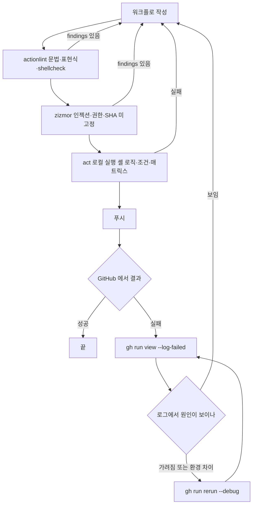

이 그림에서 볼 곳은 되돌아가는 화살표가 전부 작성 단계로 간다는 점이다. 로컬 단계는 푸시 없이 반복할 수 있으니 여기서 고치는 편이 싸다. 서버 단계로 넘어간 뒤의 순환(`gh run rerun --debug` 후 다시 로그 읽기)은 한 바퀴에 몇 분씩 걸린다.

## actionlint가 잡는 것

실험용으로 일부러 틀리게 쓴 워크플로 하나를 만들었다. 러너 라벨 오타, `needs` 오타, `steps` id 오타, `if:`에 `${{ }}`를 섞은 것, PR 제목을 `run:`에 직접 끼운 것, `ls` 출력을 for로 도는 셸이 들어 있다.

```text
$ actionlint
bad.yml:8:14: label "ubuntu-lates" is unknown. available labels are "windows-latest", ... [runner-label]
bad.yml:12:27: "github.event.pull_request.title" is potentially untrusted. avoid using it directly in inline scripts. ... [expression]
bad.yml:14:9: shellcheck reported issue in this script: SC2035:info:1:15: Use ./*glob* or -- *glob* so names with dashes won't become options [shellcheck]
bad.yml:14:9: shellcheck reported issue in this script: SC2045:error:1:10: Iterating over ls output is fragile. Use globs [shellcheck]
bad.yml:14:9: shellcheck reported issue in this script: SC2086:info:2:7: Double quote to prevent globbing and word splitting [shellcheck]
bad.yml:19:9: shellcheck reported issue in this script: SC2086:info:1:15: Double quote to prevent globbing and word splitting [shellcheck]
bad.yml:20:23: property "vr" is not defined in object type {ver: {conclusion: string; outcome: string; outputs: {string => string}}} [expression]
bad.yml:21:13: if: condition "github.ref == 'refs/heads/main' && ${{ success() }}" is always evaluated to true because extra characters are around ${{ }} [if-cond]
bad.yml:23:3: job "deploy" needs job "biuld" which does not exist in this workflow [job-needs]
exit=1
```

가장 값어치가 큰 것은 `if-cond`다. `if: github.ref == 'refs/heads/main' && ${{ success() }}`처럼 `${{ }}` 앞뒤에 글자가 붙으면 GitHub는 문자열 전체를 비어 있지 않은 문자열로 보고 항상 참으로 평가한다. 오류도 경고도 안 나고 조건이 조용히 사라지는 유형이라 눈으로는 못 찾는다. `steps.vr`처럼 존재하지 않는 step id를 참조하면 서버에서는 빈 문자열이 되고, 이것도 실패 없이 지나간다.

### shellcheck가 PATH에 없으면 조용히 빠진다

위 결과에서 `[shellcheck]` 4건은 actionlint가 `run:` 블록을 shellcheck에 넘겨서 나온 것이다. shellcheck가 PATH에 없는 셸에서 같은 파일을 돌리면 9건이 5건이 된다. 종료 코드는 여전히 1이라서 통과로 착각할 일은 없지만, 다른 오류가 하나라도 남아 있는 동안에는 SC 계열이 사라졌다는 사실을 알아채지 못한다. 개발자 노트북마다 shellcheck 설치 여부가 다르면 같은 커밋이 어떤 사람에게는 통과하고 어떤 사람에게는 실패한다. `-shellcheck=`로 외부 연동을 끈 상태와 경로를 지정한 상태를 팀에서 하나로 맞춰야 한다.

`run:`이 `${{ }}`를 포함하면 actionlint가 그 자리를 자리표시자로 바꿔서 shellcheck에 넘기므로, 표현식 안쪽 오류는 shellcheck가 아니라 actionlint의 `[expression]` 규칙이 맡는다. `echo ${{ github.event.inputs.x }`처럼 닫는 괄호가 모자란 경우 shellcheck는 SC2296을 내고 actionlint는 `got unexpected EOF while lexing end marker }}`를 낸다. 같은 줄에서 두 메시지가 나오면 뒤쪽(표현식)이 원인이다.

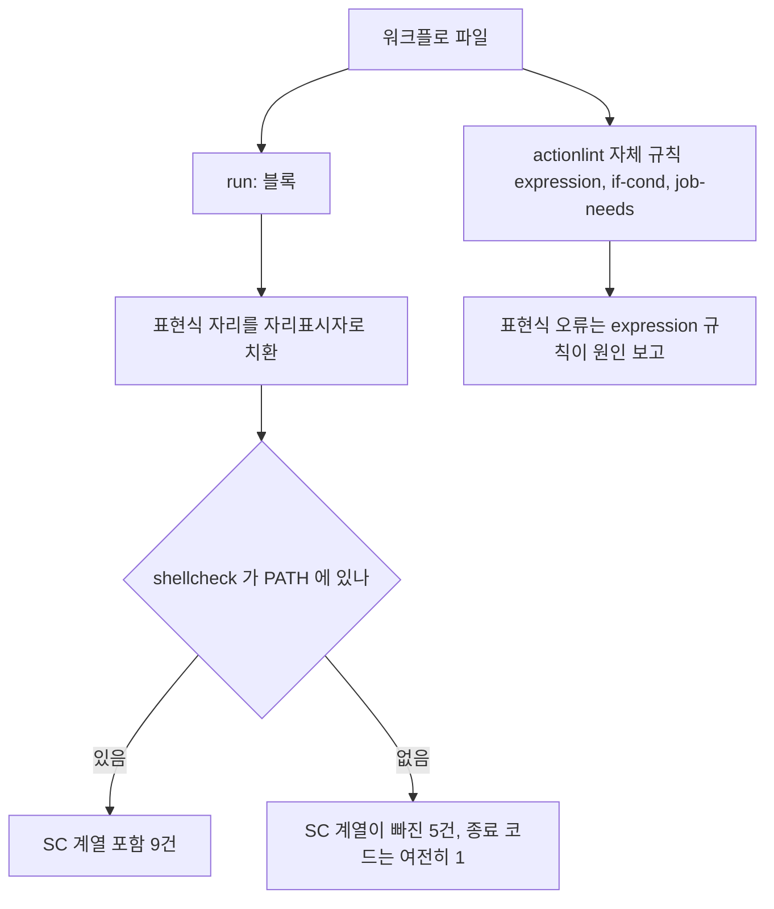

그림에서 볼 곳은 shellcheck 유무와 상관없이 종료 코드가 같다는 점이다. 그래서 SC 계열이 빠졌다는 사실이 종료 코드로는 드러나지 않는다.

### 서버가 거부하는 파일을 로컬에서 재현하기

푸시했더니 run이 job 없이 실패로 뜨는 경우의 대부분은 actionlint로 재현된다. 결함 7종을 각각 파일로 만들어 돌린 결과다.

| 결함 | actionlint 출력 |
|---|---|
| 들여쓰기가 한 칸 어긋난 step | `y1.yml:6:6: could not parse as YAML: did not find expected '-' indicator [syntax-check]` |
| 잡 수준 `if:`에서 `secrets` 참조 | `context "secrets" is not allowed here. available contexts are "github", "inputs", "needs", "vars"` |
| `on: pushh` 오타 | `unknown Webhook event "pushh" [events]` |
| `needs`가 서로를 가리킴 | `cyclic dependencies in "needs" job configurations are detected. detected cycle is "a" -> "b" -> "a"` |
| `uses: actions/checkout` ref 누락 | `specifying action "actions/checkout" in invalid format because ref is missing [action]` |
| `timeout-minute` 오타 | `unexpected key "timeout-minute" for "job" section. expected one of ...` |
| `with:` 입력 이름 오타 | `input "fetch-dept" is not defined in action "actions/checkout@v4". available inputs are ...` |

첫 줄에서 주의할 점이 있다. 잘못 들여쓴 줄은 8번째 줄이었는데 actionlint는 6:6을 가리켰다. YAML 파서가 보고하는 위치는 실수한 줄이 아니라 파서가 막힌 블록의 시작이다. GitHub 쪽 메시지의 줄 번호도 같은 성격이라고 보고, 지목된 줄 위아래 몇 줄을 같이 봐야 한다.

마지막 줄도 쓸모가 있다. `actions/setup-node@v3`에 대해서는 `the runner of "actions/setup-node@v3" action is too old to run on GitHub Actions`가 나왔다. 액션의 `runs.using`이 더는 지원하지 않는 Node 버전인지까지 봐 준다. 반대로 못 잡은 것도 있다. `uses: ./.github/workflows/none.yml`처럼 존재하지 않는 로컬 재사용 워크플로를 가리키는 job은 내가 돌린 환경에서 아무 출력이 없었다.

### 오탐과 사설 러너 라벨

self-hosted 러너에 `gpu-box` 같은 라벨을 쓰면 actionlint는 모르는 라벨이라며 실패한다. `.github/actionlint.yaml`에 라벨을 등록하고, 특정 규칙은 정규식으로 끈다.

```yaml
self-hosted-runner:
  labels:
    - gpu-box
paths:
  .github/workflows/**/*.yml:
    ignore:
      - 'SC2086:'
```

이 설정을 두자 `gpu-box` 오류와 `echo $HOME`의 SC2086이 둘 다 사라지고 종료 코드가 0이 됐다. `ignore`는 메시지에 대한 정규식이라 `'SC2086:'`처럼 규칙 번호 뒤에 콜론을 붙여 쓰면 다른 SC 번호와 겹치지 않는다. CLI에서 한 번만 끄려면 `-ignore 'SC2086'`을 쓴다. actionlint에는 YAML 안에 쓰는 인라인 무시 주석이 없어서, 무시 사유는 설정 파일 위에 주석으로 남겨야 한다.

## zizmor가 잡는 것

zizmor는 문법이 아니라 위험한 패턴을 본다. 같은 `bad.yml`에 돌린 결과는 이렇다.

```text
$ zizmor --offline .
warning[artipacked]: credential persistence through GitHub Actions artifacts
  --> ./.github/workflows/bad.yml:10:9
   |  - uses: actions/checkout@v4   does not set persist-credentials: false

error[template-injection]: code injection via template expansion
  --> ./.github/workflows/bad.yml:12:27
   |  run: echo "PR ${{ github.event.pull_request.title }}"   may expand into attacker-controllable code

error[unpinned-uses]: unpinned action reference
  --> ./.github/workflows/bad.yml:10:15
   |  action is not pinned to a hash (required by blanket policy)

error[unsound-condition]: unsound conditional expression
  --> ./.github/workflows/bad.yml:21:9    condition always evaluates to true

warning[excessive-permissions] x3  (워크플로 1, job 2: permissions: 블록 없음)
info[template-injection]  ./.github/workflows/bad.yml:20:23   (steps.vr.outputs.v, audit confidence → Low)

13 findings (5 suppressed, 3 unsafe fixes): 1 informational, 0 low, 4 medium, 3 high
exit=14
```

actionlint와 겹치는 것은 PR 제목 인젝션과 `if:` 조건 두 가지다. 나머지는 서로 못 보는 영역이다. `permissions:` 블록이 없어서 기본 권한이 쓰이는 문제, `actions/checkout@v4`가 태그라서 SHA로 고정되지 않은 문제, checkout이 남기는 토큰이 아티팩트에 섞일 수 있는 문제는 zizmor만 말한다. 반대로 `steps.vr` 오타는 zizmor가 `info`, 신뢰도 Low로 "인젝션 가능성"이라고 엉뚱하게 받아 적을 뿐이고, 오타라는 사실은 actionlint만 안다. 두 도구를 같이 돌리는 이유가 이것이다.

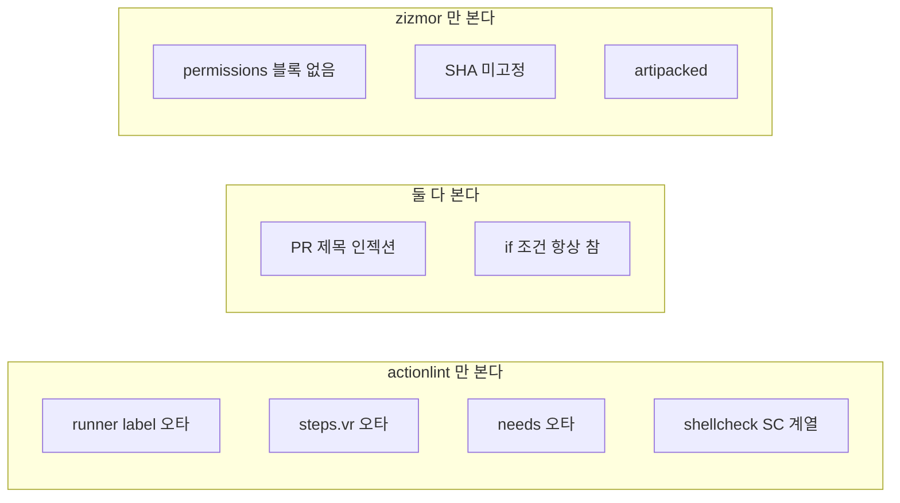

가운데 겹치는 영역은 두 가지뿐이고, 양쪽 끝은 서로 못 보는 영역이다.

종료 코드는 가장 높은 심각도를 따라간다. 이번에 본 값은 finding이 없을 때 0, 최고 심각도가 medium일 때 13, high일 때 14다. 낮은 심각도에서 종료 코드가 어떻게 나오는지는 돌려 보지 않았다. CI에 그대로 물리기 전에 `--min-severity`와 `--min-confidence`로 기준을 명시한다. 같은 파일에 `--min-severity=medium --min-confidence=high`를 주면 error 3건만 남았고 종료 코드는 14였다.

`--persona`는 보고 범위를 바꾼다. 기본(`regular`)은 위 8건이고, `pedantic`은 `anonymous-definition`(이름 없는 워크플로·잡) 2건이 더 붙고, `auditor`는 거기에 `secrets-outside-env`(전용 environment 없이 시크릿 참조)가 더 붙었다. 처음 도입할 때는 기본으로 시작하고 나머지는 정리가 끝난 뒤에 켜는 편이 낫다.

### 이 저장소 워크플로에 돌린 결과

이 저장소의 `.github/workflows/`에는 두 파일이 있다. actionlint는 0건이었고 zizmor는 16건(5건은 기본 페르소나에서 제외)을 냈다. 심각도는 high 6, medium 3, low 2다. high 6건은 전부 `unpinned-uses`로, 두 파일에 각각 있는 `actions/checkout@v4`, `actions/setup-python@v5`, `actions/cache@v4`다. medium은 `artipacked` 2건과 `excessive-permissions` 1건이다. 이 상태에서 "모든 finding에서 실패"로 게이트를 켜면 첫 푸시부터 막히므로, 기존 파일 전체가 아니라 바뀐 파일만 검사하는 쪽이 현실적이다.

```bash
git diff --name-only --diff-filter=AM "$BASE_SHA"...HEAD -- '.github/workflows/*.yml' \
  | xargs -r zizmor --offline --min-severity=high
```

파일 경로를 직접 넘기는 방식은 `quality-gate.yml` 하나로 돌려서 7건이 나오는 것을 확인했다. `git diff`로 목록을 만드는 부분은 여기서 쓰는 형태 그대로 돌리지는 않았다.

`deploy-docs.yml`의 `artipacked` 경고는 이 저장소에서 오탐에 가깝다. checkout 뒤에 `ghp-import --push`가 `gh-pages`로 푸시하기 때문에 `persist-credentials: false`를 주면 푸시가 실패한다. 이런 건 규칙을 끄지 않고 그 줄에만 사유를 붙여 무시한다.

```yaml
- uses: actions/checkout@v4 # zizmor: ignore[unpinned-uses,artipacked] 이후 스텝이 gh-pages 로 푸시한다
```

주석 무시를 걸자 출력이 `No findings to report. Good job! (1 ignored, 3 suppressed)`로 바뀌었다. 규칙 전체의 기준을 바꾸는 것은 `zizmor.yml`이 맡는다.

```yaml
rules:
  unpinned-uses:
    config:
      policies:
        actions/*: ref-pin
```

기본 정책은 모든 액션에 SHA 고정을 요구한다. 위 설정은 `actions/*`에 한해 태그 참조를 허용하며, 적용하자 `actions/checkout@v4`에 대한 finding이 사라졌다. 서드파티 액션까지 풀어주면 SHA 고정을 하는 의미가 없어지므로 `actions/*`나 사내 조직 이름 정도까지만 허용한다.

### SHA로 고정할 때 확인할 것

태그를 SHA로 바꾸는 작업은 `git ls-remote`로 충분하다. 직접 조회한 값은 이렇다.

```text
$ git ls-remote https://github.com/actions/checkout refs/tags/v4.2.2 refs/tags/v4
11d5960a326750d5838078e36cf38b85af677262	refs/tags/v4
11bd71901bbe5b1630ceea73d27597364c9af683	refs/tags/v4.2.2
```

`v4`와 `v4.2.2`가 서로 다른 커밋을 가리킨다. `v4`는 이동 태그라서 그사이 더 새 릴리스로 옮겨졌다. 워크플로에 `actions/checkout@11bd719... # v4.2.2`처럼 적고 SHA 뒤에 버전 주석을 붙여 두면 갱신 도구(Dependabot, Renovate)가 주석의 버전을 보고 SHA를 올려 준다. 태그가 annotated 태그면 `ls-remote`가 태그 오브젝트의 SHA를 주므로 `refs/tags/v4.2.2^{}`로 커밋 SHA를 다시 받아야 한다. 이번에 조회한 `actions/checkout` 태그는 가리키는 값이 곧 커밋이어서 이 처리가 필요 없었다.

zizmor는 `--offline`이 아닌 기본 실행에서 "offline mode by default; some audits and auto-fixes will not be available"이라는 경고를 낸다. 온라인 감사(존재하지 않는 커밋을 가리키는 SHA 등)는 GitHub 토큰이 있어야 하며, 이번에는 돌리지 않았다.

## pre-commit과 CI에 물리기

두 도구를 pre-commit의 `repo: local` 훅으로 묶어서 돌렸다.

```yaml
repos:
  - repo: local
    hooks:
      - id: actionlint
        name: actionlint
        language: system
        entry: actionlint
        files: ^\.github/workflows/.*\.ya?ml$
      - id: zizmor
        name: zizmor
        language: system
        entry: zizmor --offline --min-severity=medium
        files: ^\.github/(workflows|actions)/.*\.ya?ml$
```

워크플로의 `run:`에 `${{ github.head_ref }}`를 넣고 커밋하자 둘 다 막았다.

```text
actionlint...............................................................Failed
- hook id: actionlint
- exit code: 1
.github/workflows/a.yml:13:23: "github.head_ref" is potentially untrusted. ...
zizmor...................................................................Failed
- hook id: zizmor
- exit code: 14
error[template-injection]: code injection via template expansion
  --> .github/workflows/a.yml:13:23
```

여기서 하나 걸렸다. `.pre-commit-config.yaml`을 만든 직후 같은 위반을 커밋했을 때는 막히지 않고 그대로 통과했다. `pre-commit run --all-files`로 확인하면 훅이 동작하는데, `.git/hooks/pre-commit`은 `pre-commit install`을 실행해야 생긴다. 설정 파일만 저장소에 있고 설치는 각자 한 번씩 해야 하므로, 새로 클론한 사람에게는 아무 검사도 안 돌고 있을 수 있다. 그래서 pre-commit은 편의 장치로만 두고 CI를 실제 게이트로 삼는다.

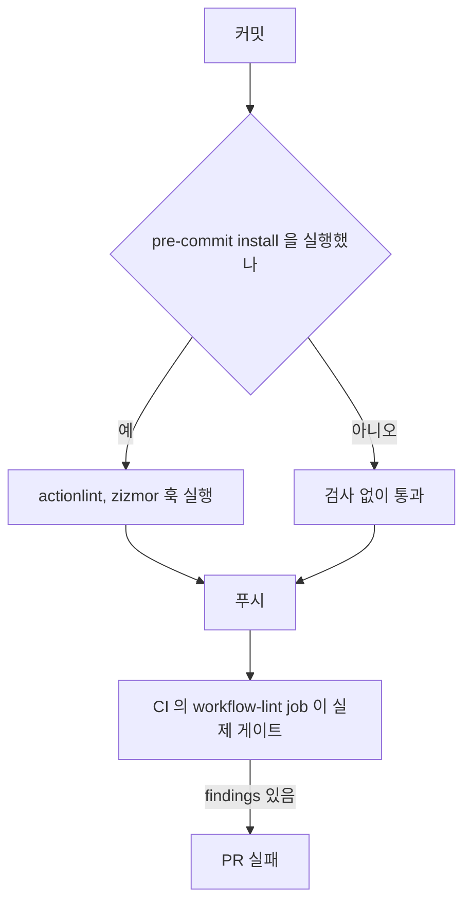

"아니오" 갈래는 오류도 경고도 없이 통과한다. 이 구멍을 CI가 막는다.

`language: system`은 PATH에 있는 바이너리를 쓰므로 앞서 말한 shellcheck 부재 문제가 그대로 따라온다. 버전을 고정하려면 각 프로젝트가 제공하는 훅을 쓴다. 두 저장소의 `.pre-commit-hooks.yaml`을 읽어 보면 actionlint는 `actionlint`(golang으로 빌드), `actionlint-docker`(`docker.io/rhysd/actionlint:1.7.12`), `actionlint-system` 세 개를 제공한다. zizmor는 `woodruffw/zizmor-pre-commit`의 `zizmor`가 python 환경을 자체로 만들고 `--no-progress`를 기본 인자로 넣는다. 이 외부 훅들은 설정만 읽었고 실제로 클론해서 돌리지는 않았다.

CI 쪽은 도구를 설치해서 부르는 job 하나면 된다. SHA는 위에서 조회한 값이다.

```yaml
name: workflow-lint
on:
  pull_request:
    paths:
      - ".github/**"
permissions: {}
jobs:
  lint:
    runs-on: ubuntu-latest
    permissions:
      contents: read
    steps:
      - uses: actions/checkout@11bd71901bbe5b1630ceea73d27597364c9af683 # v4.2.2
        with:
          persist-credentials: false
      - name: actionlint
        run: docker run --rm -v "$PWD:/repo" --workdir /repo rhysd/actionlint:1.7.12 -color
      - name: zizmor
        run: pipx run zizmor==1.30.1 --offline --min-severity=medium --format=github .
```

`--format=github`은 `::warning file=.github/workflows/bad.yml,line=10,title=artipacked::...` 형태의 워크플로 명령을 내보내서 PR diff에 주석으로 달리게 한다. 앞의 `bad.yml`에서 그 출력을 확인했다. 이 CI 파일 자체는 실제 Actions에서 돌려 보지 않았고, 로컬에서 같은 인자로 돌려서 종료 코드를 본 수준이다. 이 저장소처럼 이미 high 6건이 쌓여 있다면 앞서 본 변경분 검사 방식으로 시작한다. 오탐이 많은 게이트는 결국 꺼진다.

## act로 돌려서 알 수 있는 것과 없는 것

act는 워크플로를 도커 컨테이너에서 실행한다. 처음 실행하면 이미지 크기를 고르라고 묻는다. 출력된 선택지는 Large(약 17GB 다운로드, 저장 공간 53.1GB), Medium(약 500MB), Micro(200MB 미만, NodeJS만 있고 모든 액션과 호환되지는 않음)다. 비대화형으로 쓸 때는 `-P ubuntu-latest=이미지`로 직접 지정한다. 이번에는 로컬에 있던 `node:20-bookworm-slim`을 썼다. 러너 이미지 차이가 결과에 그대로 드러난 셈이다.

```bash
act push -P ubuntu-latest=node:20-bookworm-slim --pull=false -s MY_SECRET=hunter2
act workflow_dispatch -W .github/workflows/svc.yml --input who=kim
act -l            # 인식한 잡 목록
act push -v       # act 내부 로그와 ::debug:: 줄까지 출력
```

환경, 시크릿, OIDC, 표현식을 한 번에 찍는 워크플로를 만들어 돌린 결과를 항목별로 정리했다.

| 항목 | act 에서 본 값 | 실제 러너와의 관계 |
|---|---|---|
| `ACT` | `true` | act 에서만 존재한다. 이 변수로 분기하는 코드는 서버에서 다른 길을 탄다 |
| `RUNNER_OS`, `RUNNER_ARCH` | `Linux`, `X64` | 맞음 |
| `ImageOS` | `ubuntu20` | `ubuntu-latest` 와 무관하게 이 값이 들어간다 |
| OS 이미지 | Debian 12 (bookworm) | 사용한 이미지 때문. `jq`, `gh`, `curl`, `git` 이 하나도 없었다 |
| `github.actor` | `nektos/act` | 실제 사용자명이 아니다 |
| `github.ref` | `refs/heads/master` | 로컬 저장소의 현재 브랜치. `main` 으로 분기한 `if:` 를 검증하려면 브랜치 이름을 맞춰야 한다 |
| `runner.temp` | `/tmp` | 서버는 `/home/runner/work/_temp` 계열 |
| 시크릿 | `-s MY_SECRET=hunter2` 로 주입, 길이 7, 출력은 `***` | 주입과 마스킹 둘 다 동작 |
| OIDC | `id-token: write` 인데 `ACTIONS_ID_TOKEN_REQUEST_URL` 이 `unset`, 토큰도 빈 값 | 동작하지 않는다 |
| 서비스 컨테이너 | `redis:7-alpine` 을 `ports: 6379:6379` 로 띄우자 `127.0.0.1:6379` 로 `PONG` | 포트 접근은 됨 |
| `workflow_dispatch` 입력 | `--input who=kim` → `inputs.who` 가 `kim` | 동작 |
| `::debug::` | `-v` 일 때만 `[DEBUG]` 줄로 보임. `-s ACTIONS_STEP_DEBUG=true` 는 효과 없음 | 서버 동작과 다름 |

OIDC는 `aws-actions/configure-aws-credentials`처럼 토큰을 받아 역할을 맡는 단계가 로컬에서 통과하지 못한다는 뜻이다. 이 액션 자체를 act에서 돌려 보지는 않았고, 토큰 발급용 변수가 주입되지 않는다는 데까지 확인했다. 클라우드 연동 단계는 `if: ${{ !env.ACT }}`로 건너뛰게 하거나, 로컬용 자격 증명을 시크릿으로 넣어 우회한다. 후자는 서버에서 쓰는 인증 경로를 검증하지 못한다는 점을 알고 써야 한다.

서비스 컨테이너는 주의할 점이 있다. act 로그를 보면 job 컨테이너가 `network="host"`로 만들어진다. 이 환경에서 서비스 이름 `cache`를 조회하자 서비스 컨테이너가 아닌 엉뚱한 주소가 나왔다. GitHub의 job 컨테이너에서는 서비스 이름이 그대로 호스트명이 되지만 act에서는 그렇게 기대하면 안 되고, `localhost:매핑된포트`로 접근하는 쪽이 둘 다 통한다. 서비스 이름을 접속 문자열에 박아 둔 워크플로는 act에서 실패하다가 서버에서는 성공할 수 있다.

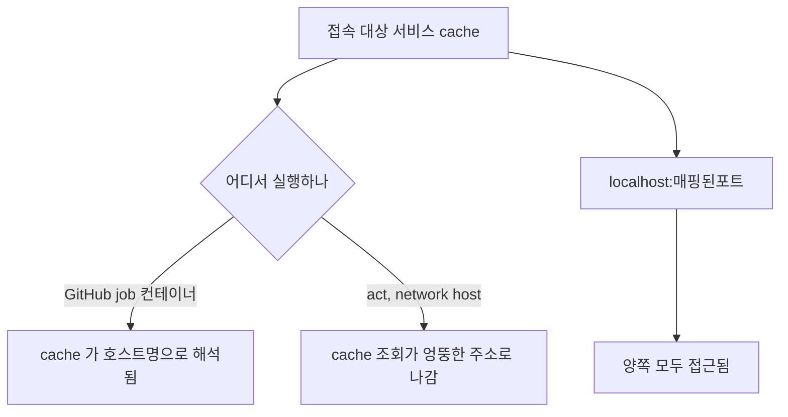

서비스 이름 대신 `localhost:매핑된포트`를 쓰면 두 환경의 차이가 사라진다.

시크릿과 환경변수는 작업 디렉터리의 `.secrets`, `.env`, `.input` 파일에서 자동으로 읽힌다(`-v` 로그에 `Loading secrets from .../.secrets`로 찍혔다). `.secrets`를 `.gitignore`에 넣지 않고 커밋하는 사고가 생기기 쉽다.

이번에 돌리지 않은 항목이 있다. `actions/checkout`, `actions/cache`, `actions/upload-artifact`, 매트릭스 전개, 재사용 워크플로는 실행해 보지 않았으므로 되는지 여부를 이 문서에서 주장하지 않는다. 확인해 본 범위에서 act가 믿을 만한 영역은 셸 로직, 표현식 평가, 환경변수 전달, 단계 간 출력 전달까지다. 권한, OIDC, 캐시, 동시성 제어, 이벤트 페이로드의 세부 필드는 서버에서만 확정된다.

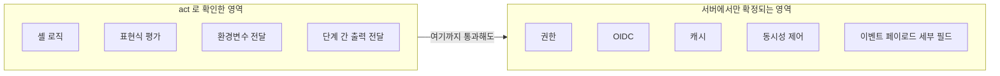

왼쪽을 통과한 뒤에도 오른쪽은 푸시해야 알 수 있다.

## gh run으로 터미널에서 실패 보기

푸시 후 실패하면 브라우저를 열기 전에 터미널에서 먼저 본다. 이번 환경에는 gh 인증이 없어서 실제 저장소 출력은 얻지 못했다. 대신 gh 2.60.0의 `--help`로 플래그가 존재하는지 하나씩 확인했다.

```bash
# 최근 실패한 run 만 골라 본다
gh run list -w "Quality Gate" -b main -s failure -L 5

# 실패한 step 의 로그만 가져온다
gh run view 37709541305 --log-failed

# job 단위, step 목록 포함
gh run view 37709541305 -v
gh run view 37709541305 --job 123456789 --log

# 실패한 job 만 다시 돌린다 (의존 job 포함)
gh run rerun 37709541305 --failed

# 디버그 로그를 켜고 다시 돌린다
gh run rerun 37709541305 --failed --debug

# 끝날 때까지 지켜보고 실패하면 종료 코드 1
gh run watch 37709541305 --exit-status
```

`-s`가 받는 값에는 `failure`, `cancelled`, `skipped`와 함께 `startup_failure`, `action_required`가 들어 있다. 워크플로 파일이 거부된 run은 아래에서 설명하듯 job이 없는 실패이므로, `gh run list -s failure`에 섞여 나올 수 있고 `-s startup_failure`는 따로 확인해 볼 만하다. `--json`으로 받을 수 있는 필드에는 `databaseId`, `conclusion`, `headSha`, `displayTitle`, `workflowName`, `attempt`, `url`이 있다. 스크립트에서 쓸 때는 `--json databaseId,conclusion -q '.[0].databaseId'` 식으로 id만 뽑아서 `gh run view`에 넘긴다.

진행 중인 run에 `--log`나 `--log-failed`를 쓰면 `run N is still in progress; logs will be available when it is complete`라는 메시지가 나온다(바이너리에서 확인한 문구). 로그가 필요하면 끝날 때까지 기다리거나 `gh run watch`를 쓴다. `gh run view`는 도움말에 fine-grained PAT를 지원하지 않는다고 적혀 있다. 스크립트에 fine-grained 토큰만 넣어 둔 환경에서는 이 명령이 실패한다.

`--log-failed`는 실패로 끝난 step의 로그만 뽑는다. 따라서 step이 `cancelled`로 끝났거나 `if:` 때문에 건너뛴 경우에는 보여 줄 로그가 없다. 그런 경우에는 `gh run view -v`로 step별 상태를 먼저 보고 어느 job이 어디서 멈췄는지 확인한다.

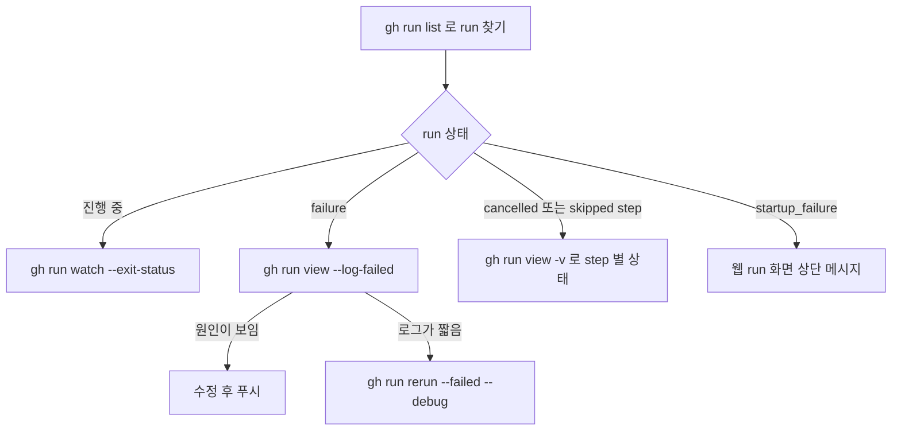

상태에 따라 첫 명령이 달라진다. `--log-failed`는 실패 step이 있을 때만 쓸모가 있다.

## 디버그 로그 켜기

`ACTIONS_STEP_DEBUG`와 `ACTIONS_RUNNER_DEBUG`는 이름 그대로 저장소의 시크릿이나 변수로 만들어 값을 `true`로 두면 켜진다. 앞의 것은 액션이 `::debug::`로 내는 로그와 step 내부 정보를 노출하고, 뒤의 것은 러너 진단 로그를 더한다. 이 두 변수의 서버 동작은 직접 확인하지 못했고, 문서에서 알려진 동작을 적는다. act에서는 앞서 표에 적었듯 둘 다 효과가 없고 `-v`가 비슷한 역할을 한다.

저장소에 영구 설정을 넣는 것보다 `gh run rerun --debug`(웹에서는 Re-run jobs 창의 Enable debug logging 체크)를 쓴다. 영구 설정은 켠 사람이 잊으면 모든 run의 로그가 계속 길어지고, 디버그 로그에는 평소보다 많은 환경 정보가 찍힌다. 재실행에 붙이는 방식은 그 한 번에만 적용된다. 다만 재실행은 같은 커밋과 같은 이벤트 페이로드로 돌기 때문에, 워크플로 파일이나 시크릿이 바뀌지 않았다면 같은 이유로 다시 실패한다는 점을 기대하고 쓴다.

## 로그의 `***` 가 원인을 가릴 때

마스킹은 값이 문자열로 일치하는지만 본다. 이 성질 때문에 두 방향으로 문제가 생기는데, act에서 시크릿 세 개를 주입하고 실제로 찍어 봤다.

```text
secret ENVNAME=prod, PIN=0, TOKEN=abcd1234efgh

| deploying to ***uction, env=***
| build 2***24 finished in 34 seconds, exit=***
| pin=***
| plain=***
| base64=YWJjZDEyMzRlZmdo
| reversed=hgfe4321dcba
| split=abcd 1234efgh
| after add-mask: ***
```

짧은 시크릿이 본문을 먹는다. `prod`를 시크릿으로 만들면 `production`이 `***uction`이 되고, `0`이 시크릿이면 `2024`가 `2***24`가 되며 `exit=0`도 `exit=***`로 바뀐다. 배포 환경 이름, 포트 번호, `true` 같은 값을 습관적으로 시크릿에 넣는 팀에서 흔하다. 로그에서 숫자나 일반 단어 자리가 `***`로 채워져 있으면 어떤 시크릿이 그 값과 일치하는지부터 의심한다. 시크릿이 아닌 설정값은 `vars.`로 옮기면 마스킹 대상에서 빠진다.

반대로 파생된 값은 마스킹을 빠져나간다. 같은 `TOKEN`을 base64로 바꾸거나, 뒤집거나, 중간에서 둘로 쪼개 출력하면 그대로 나온다. 실제 러너도 문자열 일치에 의존한다고 문서에 있고 JSON 같은 구조화된 값이 문제가 된다고 경고하지만, 위 출력은 act의 동작이다. `curl -v`나 `set -x`가 `Authorization: Bearer ...`를 인코딩한 형태로 찍어도 마스킹이 걸리지 않을 수 있다. 런타임에 만든 값은 `echo "::add-mask::runtime-value"` 이후 `***`로 바뀌는 것을 확인했다.

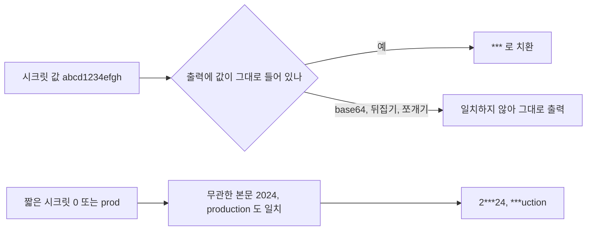

그림의 두 갈래가 각각 다른 증상이다. 왼쪽은 "가렸다고 믿었는데 샌다"이고 오른쪽은 "로그가 망가져서 원인을 못 본다"이다. 디버깅하다가 값이 맞는지 확인하려고 시크릿을 직접 찍는 것은 피한다. 길이만 출력해도 대부분 판단이 선다(앞의 act 실험에서 `len=7`은 마스킹 없이 그대로 나왔다). 포크에서 온 PR은 시크릿이 비어 있는 상태로 전달되므로, 길이가 0이면 시크릿 설정이 아니라 트리거 종류가 원인이다. 빈 시크릿은 마스킹할 값이 없어서 로그에 `***`도 나타나지 않고 인증 오류만 남는다.

잡 출력(`outputs`)에 시크릿과 일치하는 값이 섞이면 러너가 그 출력을 건너뛴다고 알려져 있다(`Skip output '...' since it may contain secret.` 경고). 이번에 재현하지는 못했다. 다음 job이 받는 `needs.x.outputs.y`가 비어 있는데 원인이 보이지 않을 때 앞 job 로그에서 이 경고 줄을 찾아본다.

## Invalid workflow file과 workflow file issue 읽기

파일 자체가 거부될 때 화면에는 두 가지 모양이 나온다. 하나는 푸시한 뒤 Actions 탭에 run이 생기기는 하는데 이름이 워크플로의 `name:`이 아니라 `.github/workflows/x.yml` 경로로 표시되고, job이 하나도 없이 실패하며, 상단에 `This run likely failed because of a workflow file issue.`라는 안내가 붙는 경우다. 다른 하나는 수동 실행(`workflow_dispatch`)이나 재사용 워크플로 호출에서 `Invalid workflow file: .github/workflows/x.yml#L12` 같은 메시지와 함께 이유가 나오는 경우다. 이유는 `You have an error in your yaml syntax on line 12`이거나 `(Line: 8, Col: 14): Unexpected value 'foo'` 꼴이다. 이 서버 메시지들의 원문은 이번에 푸시해서 재현하지 못했고, 메시지 형태는 기억과 문서를 기준으로 적었다.

읽는 순서는 정해져 있다. 첫째, 메시지에 있는 줄 번호 근처가 아니라 앞서 본 7가지 결함 표에 해당하는지 actionlint로 먼저 돌린다. 둘째, 같은 이유가 아니면 서버만 아는 사정을 의심한다. 서버만 아는 사정으로는 조직 정책이 허용하지 않는 액션이나 재사용 워크플로를 호출한 경우, 호출 대상 저장소가 비공개인데 접근 설정이 없는 경우, 호출한 쪽과 호출된 쪽의 `permissions`가 안 맞는 경우가 있다. 이런 경우는 파일 문법이 완벽해도 `startup_failure`로 끝난다. actionlint는 여기에 침묵하므로, `gh run list -s startup_failure`로 모아 보고 웹의 run 화면 상단 메시지를 직접 읽는다.

서버 쪽 메시지와 actionlint가 같은 결함을 다르게 부르는 경우가 있다. 예를 들어 잡 수준 `if:`에서 `secrets`를 쓰면 서버는 `Unrecognized named-value: 'secrets'` 계열로 말하는 것으로 기억하는데, actionlint는 `context "secrets" is not allowed here. available contexts are "github", "inputs", "needs", "vars"`로 허용되는 컨텍스트 목록까지 알려 준다. 목록이 있어서 어디서 쓸 수 있는지 바로 알 수 있다. 서버 문구를 검색해서 찾기 전에 로컬에서 actionlint를 먼저 돌리는 편이 빠르다.

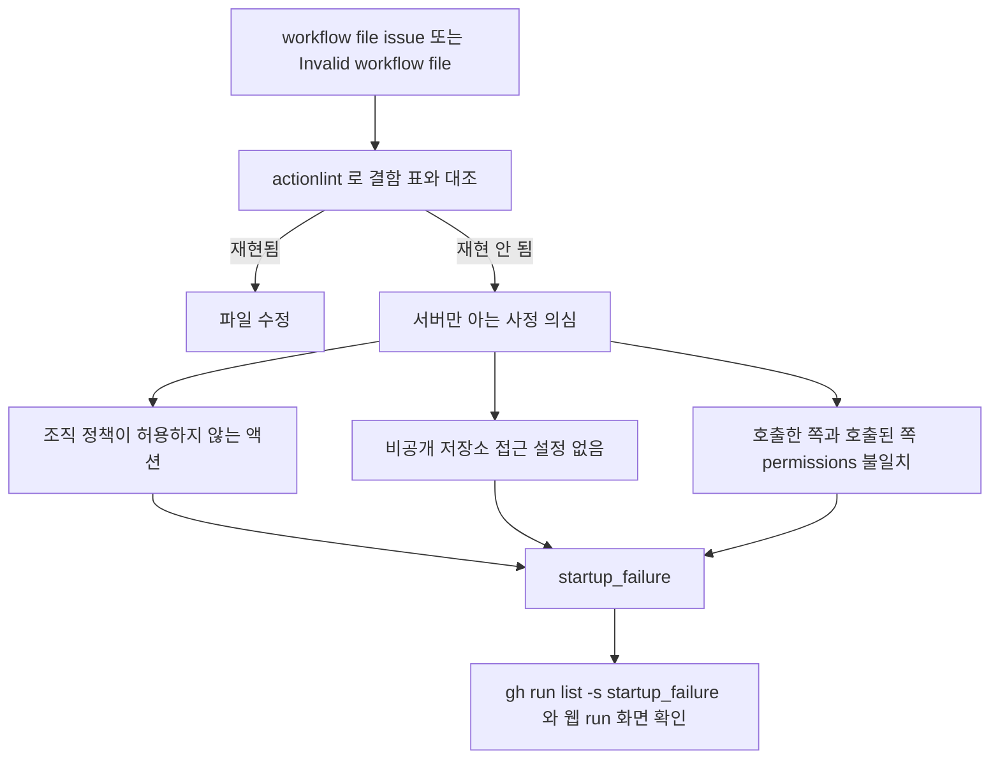

위쪽 갈래는 로컬에서 끝나고, 아래쪽 갈래는 actionlint가 침묵하므로 서버 화면을 직접 읽어야 한다.

## 스케줄 워크플로가 조용히 멈췄을 때

공개 저장소에서 60일 동안 저장소 활동이 없으면 `schedule`로 트리거되는 워크플로가 자동으로 비활성화된다고 문서에 나와 있다. 에러도 실패도 없이 cron 실행이 그냥 사라지는 형태라서 알아채기 어렵다. 확인은 워크플로의 `state`로 한다.

```bash
gh workflow list --all           # --all 이 있어야 비활성 워크플로까지 나온다
gh workflow enable "nightly"     # 다시 켠다
```

`gh workflow list`의 `-a, --all` 도움말은 "Include disabled workflows"이고, gh 바이너리 안에는 상태값 `disabled_inactivity`와 `disabled_manually`가 들어 있다. 비활성 사유가 비활동이면 `disabled_inactivity`, 사람이 껐으면 `disabled_manually`로 구분된다. REST API로도 같은 값이 나온다. 이 저장소에 인증 없이 `GET /repos/GYUTORY/YGSTUDY/actions/workflows`를 호출하자 3개 워크플로 모두 `state`가 `active`로 나왔다. 비활동으로 꺼진 실제 사례는 재현하지 못했다.

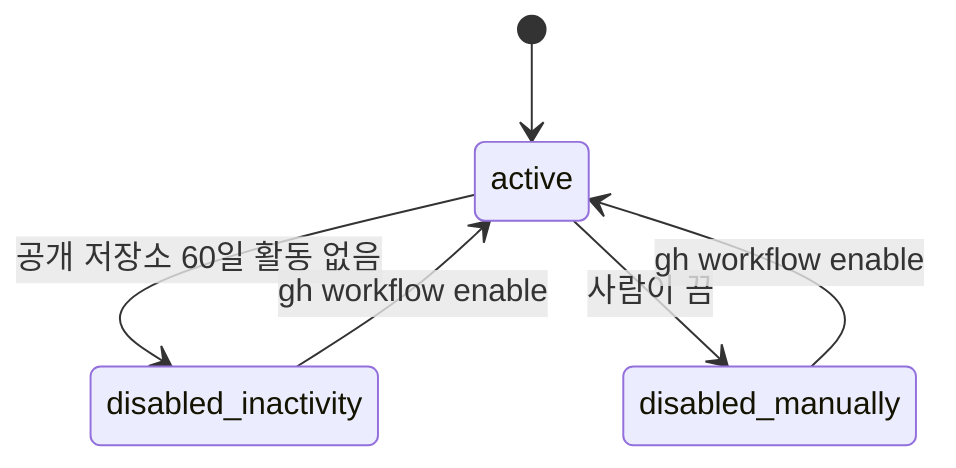

두 비활성 상태는 모두 에러 없이 cron 실행만 사라지므로 `state` 값으로만 구분된다.

```bash
curl -s https://api.github.com/repos/OWNER/REPO/actions/workflows \
  | python3 -c "import json,sys; [print(w['name'], w['state']) for w in json.load(sys.stdin)['workflows']]"
```

운영하는 스케줄 워크플로가 몇 개 있다면 이 호출을 외부 모니터링이나 다른 저장소의 점검 워크플로에 걸어 두고 `active`가 아닌 상태를 알림으로 받는다. 같은 저장소의 스케줄 워크플로가 스스로를 감시하게 두면, 꺼지는 순간 감시도 같이 꺼진다.

## 증상에서 원인으로

도구를 증상별로 연결한 그림이다. 위쪽 분기는 run이 생겼는지, 아래쪽은 run이 생긴 뒤 어떤 상태인지를 가른다.

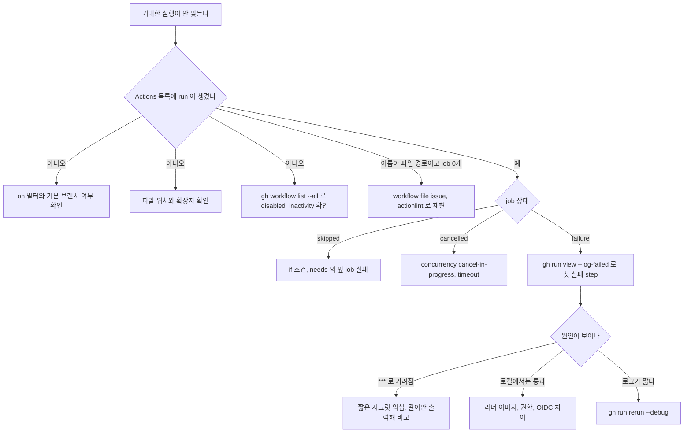

run이 아예 안 생기는 갈래는 모두 "워크플로 파일이 읽히는가"의 문제다. 푸시한 브랜치에 파일이 있어도 `schedule`, `workflow_dispatch`, `issue_comment` 같은 이벤트는 기본 브랜치의 파일만 본다는 점이 자주 걸린다. 기능 브랜치에서 `on: workflow_dispatch`를 추가하고 Run workflow 버튼이 안 보이면 이 경우다. `skipped` 갈래에서는 `if:`를 먼저 의심하되, actionlint의 `if-cond` 규칙이 이미 잡았어야 하는 유형(`${{ }}` 주위 글자)인지 확인한다. `cancelled`는 이 저장소의 배포 워크플로가 `cancel-in-progress: true`이기 때문에 연달아 푸시하면 앞 run이 취소되는 식으로 보인다. 취소는 실패가 아니다.

## 이번에 재현한 범위

직접 돌려서 출력을 확인한 것은 actionlint(문법·표현식·shellcheck·설정·인라인 무시), zizmor(오프라인 감사·페르소나·종료 코드·주석 무시·정책 설정), pre-commit 로컬 훅, act(환경·시크릿·OIDC 변수·서비스 컨테이너·입력·마스킹·`::debug::`), 공개 REST API의 워크플로 상태 조회다. 확인하지 못한 것은 인증된 `gh run list/view/rerun`의 실제 출력(플래그 이름만 `--help`로 확인), 서버가 내는 `Invalid workflow file` 계열 메시지 원문, `ACTIONS_STEP_DEBUG`·`ACTIONS_RUNNER_DEBUG`가 서버에서 만드는 로그, zizmor의 온라인 감사, 60일 비활동으로 실제로 꺼진 워크플로, 위 CI 예시를 실제 Actions에서 돌린 결과다. 이 항목들을 적용할 때는 문서의 설명을 가설로 두고 한 번 직접 확인한다.
