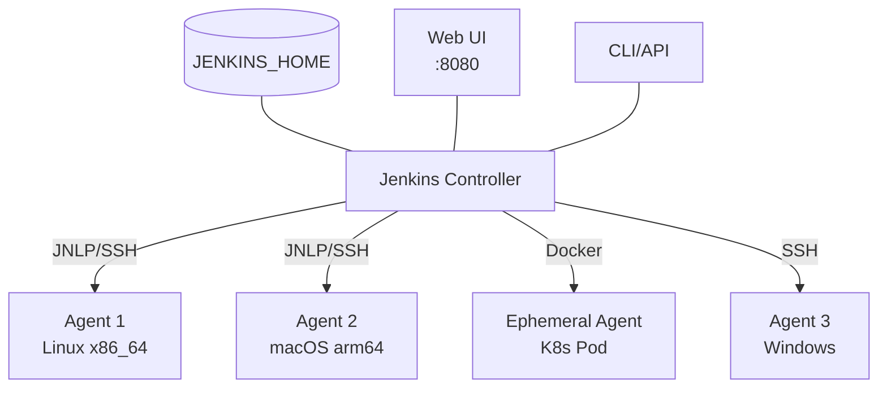
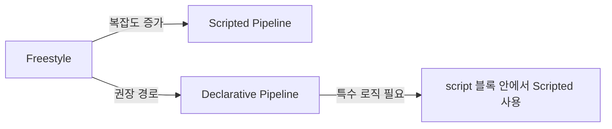
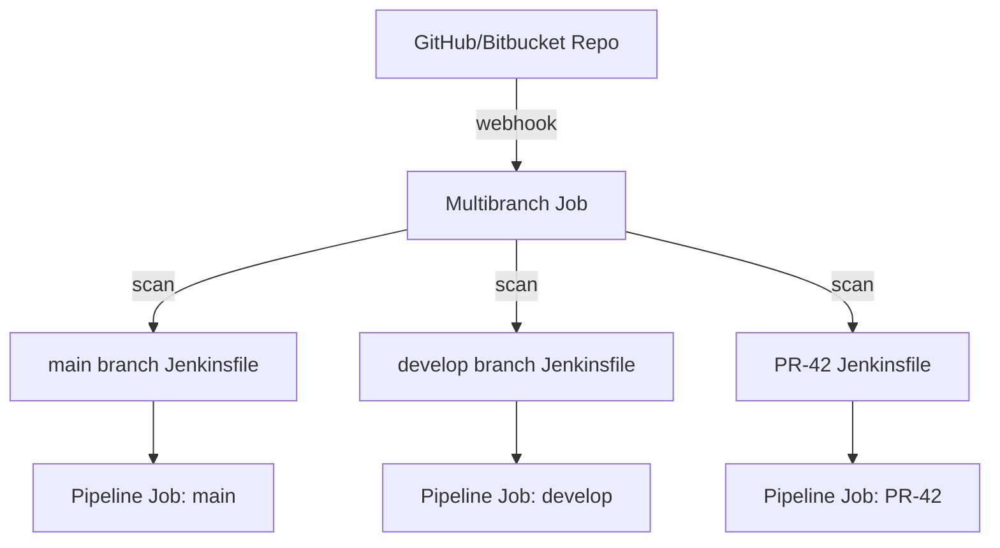

# Jenkins

## 정의

Jenkins는 Java로 작성된 오픈소스 자동화 서버다. 2004년 Hudson 프로젝트에서 출발했고 2011년 Oracle과의 라이선스 분쟁 이후 Jenkins로 포크되어 지금에 이르렀다. CI/CD 도구의 사실상 표준으로 자리잡은 이유는 단순하다. 자체 서버에서 무료로 돌릴 수 있고, 플러그인 생태계가 압도적으로 크며, 어떤 빌드 도구든 셸 스크립트만 돌릴 수 있으면 통합이 된다.

GitHub Actions나 GitLab CI 같은 클라우드 기반 도구가 많이 쓰이는 요즘에도 Jenkins가 여전히 살아남는 영역이 있다. 폐쇄망 환경, 온프레미스 인프라, 특수 하드웨어가 필요한 빌드(GPU 트레이닝, 임베디드 펌웨어 빌드, 라이선스가 묶인 컴파일러), 그리고 수십 개의 레거시 잡이 이미 돌고 있는 회사들이다. 한 번 Jenkins 클러스터를 깔아두면 빠져나오기가 정말 어렵다. 그래서 어떤 식으로든 한 번은 마주치게 되는 도구다.

문제는 Jenkins가 진입 장벽이 꽤 높다는 거다. UI는 2000년대 그대로고, 플러그인 의존성 지옥이 있고, 마스터에 부하가 몰리면 OOM으로 죽는 일이 흔하다. 운영하면서 한 번씩 겪게 되는 트러블슈팅 패턴들이 거의 정해져 있다.

## 아키텍처

### Master/Agent 구조

Jenkins는 마스터(Controller)와 에이전트(Agent, 옛 명칭은 Slave)로 나뉜다. 2020년부터 공식 용어가 Controller로 바뀌었지만 현장에서는 여전히 Master라는 표현을 더 많이 쓴다.



마스터의 책임은 다음과 같다. 웹 UI 제공, 잡 스케줄링, 빌드 큐 관리, 빌드 결과와 로그 저장, 플러그인 관리, 사용자 인증/권한 관리. 실제 빌드는 마스터가 아니라 에이전트에서 돌리는 것이 정석이다. 마스터에서 빌드를 직접 돌리면(built-in node) 마스터 JVM 메모리가 빌드 프로세스와 경쟁하면서 UI가 멈추거나 OOM으로 마스터가 다운되는 일이 자주 생긴다.

에이전트는 빌드 실행만 담당한다. 에이전트마다 라벨을 붙여서 특정 잡을 특정 에이전트에서만 돌리도록 제어한다. 예를 들어 `label: "linux && docker"` 같은 식으로 표현식을 쓸 수 있다.

### JENKINS_HOME

Jenkins의 모든 상태가 `JENKINS_HOME` 디렉토리에 평문 XML로 저장된다. 데이터베이스가 없다. 이게 양날의 검이다. 백업이 단순하다는 장점이 있지만(디렉토리 통째로 압축하면 끝), 잡이 수천 개로 늘어나면 마스터 시작 시간이 분 단위로 느려진다.

```
JENKINS_HOME/
├── config.xml                    # 글로벌 설정
├── credentials.xml               # 자격증명 (암호화)
├── secrets/                      # 마스터 키
├── jobs/
│   └── my-pipeline/
│       ├── config.xml            # 잡 정의
│       └── builds/
│           └── 42/               # 42번째 빌드 결과
│               ├── log
│               ├── build.xml
│               └── archive/
├── plugins/                      # 설치된 플러그인
├── workspace/                    # 빌드 작업 공간 (정리 대상)
└── users/
```

운영하다 보면 `JENKINS_HOME` 용량이 폭증한다. 빌드 히스토리, 워크스페이스, 아티팩트가 쌓이기 때문이다. 디스크 100% 차서 모든 빌드가 멈추는 상황을 한 번쯤 겪게 된다. 잡마다 `Discard old builds` 설정을 반드시 해두고, `cleanWs()` 단계를 파이프라인 끝에 넣는 것이 안전하다.

### 빌드 큐와 익스큐터

잡이 트리거되면 빌드 큐에 들어간다. 큐에 쌓인 잡은 라벨 매칭과 가용 익스큐터(executor)를 기다린다. 익스큐터는 에이전트당 동시 실행 가능한 빌드 슬롯이다. CPU 코어 수만큼 잡는 것이 일반적이지만, I/O 바운드 빌드라면 코어 수의 1.5~2배까지 잡기도 한다.

큐에 잡이 적체되는 상황이 자주 발생한다. 원인은 보통 세 가지다. 첫째, 라벨이 너무 좁아서 특정 에이전트만 노릴 때. 둘째, 에이전트가 오프라인인데 다른 에이전트로 폴백되지 않을 때. 셋째, 동시성 제한(`disableConcurrentBuilds()`) 때문에 같은 잡이 직렬로 도는 경우다.

## 설치

### Docker 설치

가장 간단한 방법이고 실제로 많이 쓰는 방식이다. 공식 LTS 이미지를 쓰는 것이 안정적이다.

```bash
docker run -d \
  --name jenkins \
  -p 8080:8080 \
  -p 50000:50000 \
  -v jenkins_home:/var/jenkins_home \
  -v /var/run/docker.sock:/var/run/docker.sock \
  --restart unless-stopped \
  jenkins/jenkins:lts-jdk17
```

50000 포트는 JNLP 에이전트 연결용이다. Docker socket을 마운트하는 이유는 Jenkins 컨테이너 안에서 호스트 Docker로 빌드를 돌리기 위함이다. 보안상 좋은 방식은 아니지만, DinD(Docker in Docker)에 비하면 성능과 캐시 측면에서 낫다.

초기 관리자 패스워드는 컨테이너 로그나 `/var/jenkins_home/secrets/initialAdminPassword`에서 확인한다.

```bash
docker exec jenkins cat /var/jenkins_home/secrets/initialAdminPassword
```

### 패키지 설치 (Ubuntu)

장기 운영용 서버에는 패키지 설치를 선호한다. systemd로 통합되고 로그도 journald로 모이기 때문에 다루기 편하다.

```bash
# Java 17 설치 (Jenkins 2.426+ 요구)
sudo apt update
sudo apt install -y fontconfig openjdk-17-jre

# Jenkins 저장소 등록
sudo wget -O /usr/share/keyrings/jenkins-keyring.asc \
  https://pkg.jenkins.io/debian-stable/jenkins.io-2023.key
echo "deb [signed-by=/usr/share/keyrings/jenkins-keyring.asc] \
  https://pkg.jenkins.io/debian-stable binary/" | \
  sudo tee /etc/apt/sources.list.d/jenkins.list > /dev/null

sudo apt update
sudo apt install -y jenkins

sudo systemctl enable --now jenkins
```

설정 파일은 `/etc/default/jenkins` 또는 `/lib/systemd/system/jenkins.service`에 있다. JVM 힙 사이즈, HTTP 포트, JENKINS_HOME 위치 같은 것을 여기서 조정한다.

### JVM 튜닝

운영 환경에서 가장 자주 건드리는 설정이다. 기본값은 작은 환경 기준이라 잡이 100개 넘어가면 부족하다.

```bash
JAVA_OPTS="-Xms4g -Xmx4g \
  -XX:+UseG1GC \
  -XX:+ParallelRefProcEnabled \
  -XX:+DisableExplicitGC \
  -XX:+HeapDumpOnOutOfMemoryError \
  -XX:HeapDumpPath=/var/log/jenkins/heap.hprof \
  -Djenkins.install.runSetupWizard=false"
```

힙은 컨테이너/서버 메모리의 50~60%로 잡고 나머지는 OS 캐시와 빌드 자식 프로세스용으로 남긴다. G1GC를 쓰는 것이 멈춤 시간(stop-the-world) 측면에서 안정적이다. 마스터 OOM이 잦다면 힙 덤프를 받아보고 어떤 잡이 메모리를 잡고 있는지 확인해야 한다. 보통 콘솔 로그가 비대한 잡(MB 단위 텍스트)이나 잡 설정이 너무 많은 폴더가 범인이다.

## Job vs Pipeline

### Freestyle Job

UI에서 빌드 단계를 클릭으로 조립하는 전통적인 방식이다. 단순한 잡(스크립트 한 번 실행, 패키지 빌드 후 업로드)에는 충분하다. 문제는 잡 정의가 XML로 `JENKINS_HOME`에 저장되기 때문에 코드 리뷰가 안 되고, 잡 간 복사가 어렵고, 변경 이력 추적이 안 된다는 점이다.

운영해보면 Freestyle 잡이 수십 개 쌓인 시점부터 관리 불능이 된다. "그 잡 누가 만들었지?", "왜 이 옵션이 켜져 있지?" 같은 질문에 답할 수가 없다. 이 시점에서 Pipeline으로 옮기는 것이 정답이다.

### Pipeline

빌드 단계를 코드(Groovy DSL)로 정의한다. Jenkinsfile이라는 파일에 작성해서 저장소에 커밋한다. 이게 Pipeline as Code 개념의 핵심이다. 코드 리뷰가 가능해지고, 브랜치별로 다른 파이프라인을 가질 수 있고, 롤백도 git revert로 끝난다.

Pipeline에는 두 가지 문법이 있다. Scripted와 Declarative다. Scripted는 자유로운 Groovy 코드를 쓸 수 있어 강력하지만 복잡하고 검증이 약하다. Declarative는 정해진 구조 안에서만 작성하지만 가독성이 좋고 IDE 지원도 낫다. 새로 시작한다면 Declarative부터 쓰는 것이 맞다. 정 안 되는 케이스에서만 Scripted로 떨어진다.



## Declarative Pipeline 문법

### 기본 구조

```groovy
pipeline {
    agent any

    environment {
        APP_NAME = 'my-service'
        REGISTRY = 'registry.example.com'
    }

    options {
        timeout(time: 30, unit: 'MINUTES')
        buildDiscarder(logRotator(numToKeepStr: '20'))
        disableConcurrentBuilds()
    }

    stages {
        stage('Checkout') {
            steps {
                checkout scm
            }
        }

        stage('Build') {
            steps {
                sh './gradlew clean build -x test'
            }
        }

        stage('Test') {
            steps {
                sh './gradlew test'
            }
            post {
                always {
                    junit 'build/test-results/test/*.xml'
                }
            }
        }

        stage('Deploy') {
            when {
                branch 'main'
            }
            steps {
                sh './deploy.sh'
            }
        }
    }

    post {
        success { echo 'Build succeeded' }
        failure {
            slackSend channel: '#alerts',
                      message: "Build failed: ${env.BUILD_URL}"
        }
        always { cleanWs() }
    }
}
```

### agent

빌드를 어디서 돌릴지 지정한다. `any`는 아무 에이전트나, `none`은 글로벌 에이전트 없이 stage별로 따로 지정한다는 뜻이다.

```groovy
// 라벨 매칭
agent { label 'linux && docker' }

// Docker 이미지에서 실행
agent {
    docker {
        image 'node:20-alpine'
        args '-v /tmp/.npm:/root/.npm'
    }
}

// Kubernetes Pod
agent {
    kubernetes {
        yaml '''
            apiVersion: v1
            kind: Pod
            spec:
              containers:
              - name: maven
                image: maven:3.9-eclipse-temurin-17
                command: ['sleep']
                args: ['infinity']
        '''
    }
}
```

Docker 에이전트를 쓸 때 자주 막히는 부분은 컨테이너 안에서 다시 docker 명령을 쓰는 경우다. host의 docker socket을 마운트해서 우회하지만, 컨테이너 사용자 UID와 docker 그룹 GID가 안 맞으면 permission denied가 난다.

### environment

파이프라인이나 stage 단위로 환경 변수를 주입한다. Credentials와 결합해서 비밀값을 안전하게 다룰 수 있다.

```groovy
environment {
    DATABASE_URL = credentials('db-url')                    // Secret text
    DOCKER_CRED  = credentials('docker-registry')           // Username/Password
    // DOCKER_CRED_USR, DOCKER_CRED_PSW 자동 생성
}

steps {
    sh 'echo $DOCKER_CRED_USR'                              // 사용자명
    sh 'docker login -u $DOCKER_CRED_USR -p $DOCKER_CRED_PSW'
}
```

환경 변수에 비밀값을 담으면 Jenkins가 콘솔 로그에서 자동으로 `****`로 마스킹한다. 다만 base64 인코딩된 형태로 출력하면 마스킹이 풀리는 케이스가 있어서, 절대 비밀값을 echo하지 않는 습관이 중요하다.

### post 조건

빌드 결과별로 후처리를 정의한다.

```groovy
post {
    always   { /* 항상 실행 */ }
    success  { /* 성공 시 */ }
    failure  { /* 실패 시 */ }
    unstable { /* 테스트 실패 등으로 unstable일 때 */ }
    changed  { /* 이전 빌드와 결과가 다를 때 */ }
    aborted  { /* 사용자가 중단했을 때 */ }
}
```

`always`에 `cleanWs()`를 넣는 것이 워크스페이스 정리의 기본이다. 안 그러면 워크스페이스가 누적돼서 디스크가 차거나, 이전 빌드 잔여 파일 때문에 다음 빌드가 이상하게 동작한다.

### when 조건

stage를 조건부로 실행한다.

```groovy
stage('Deploy to Prod') {
    when {
        allOf {
            branch 'main'
            not { changeRequest() }                  // PR이 아닐 때
            environment name: 'DEPLOY_ENV', value: 'prod'
        }
    }
    steps { sh './deploy-prod.sh' }
}
```

`when`은 stage 진입 전에 평가된다. 특정 파일이 바뀌었을 때만 빌드하는 `changeset`, 태그 푸시일 때만 도는 `tag` 같은 조건이 자주 쓰인다.

## Jenkinsfile 작성 실무

### 단계 분리 원칙

stages를 의미 단위로 잘 쪼개는 것이 중요하다. 한 stage 안에 너무 많은 일을 몰아넣으면 실패 지점을 파악하기 어렵고, Blue Ocean 같은 시각화 도구에서 가독성이 떨어진다. 보통 다음 정도로 나눈다.

```
Checkout → Build → Unit Test → Integration Test → Static Analysis
       → Package → Push Image → Deploy → Smoke Test
```

각 stage는 독립적으로 재시도 가능한 단위여야 한다. 통합 테스트가 깨지면 통합 테스트만 다시 돌릴 수 있도록 stage를 분리한다.

### 변수 스코핑 함정

Declarative와 Scripted가 섞이면 변수 스코프 문제가 자주 생긴다. `def`로 선언한 변수는 `script {}` 블록 안에서만 살아 있고, stage 간 공유하려면 파이프라인 최상단에 변수를 두거나 `env`를 통해 전달해야 한다.

```groovy
pipeline {
    agent any

    stages {
        stage('Get Version') {
            steps {
                script {
                    env.APP_VERSION = sh(
                        script: "git describe --tags --always",
                        returnStdout: true
                    ).trim()
                }
            }
        }

        stage('Tag Image') {
            steps {
                sh "docker tag app:latest app:${env.APP_VERSION}"
            }
        }
    }
}
```

`returnStdout: true`로 셸 출력을 변수에 담는 패턴이 자주 쓰이는데, 끝의 줄바꿈을 `.trim()`으로 제거하지 않으면 다음 명령에서 이상하게 동작한다. 처음 Pipeline 작성할 때 거의 한 번씩 다 겪는다.

### 입력 단계 (input)

배포 전 수동 승인이 필요할 때 쓴다.

```groovy
stage('Approve Production Deploy') {
    steps {
        timeout(time: 1, unit: 'HOURS') {
            input message: 'Deploy to production?',
                  ok: 'Deploy',
                  submitter: 'admin,devops-team'
        }
    }
}
```

`timeout`을 꼭 같이 둬야 한다. 안 그러면 응답이 없을 때 빌드가 무한정 걸린다. 익스큐터를 점유한 채로 멈춰 있어서 큐 적체의 원인이 된다.

## Multibranch Pipeline

### 개념

저장소를 스캔해서 브랜치/PR 마다 자동으로 잡을 만들어주는 잡 타입이다. 각 브랜치의 Jenkinsfile을 읽어서 파이프라인을 구성한다. 브랜치가 새로 생기면 잡이 생기고, 브랜치가 삭제되면 잡도 정리된다.



### 설정 시 주의점

PR 빌드를 켜면 PR마다 잡이 생기는데, fork에서 온 PR을 자동으로 빌드하면 보안 문제가 생긴다. 외부 기여자가 Jenkinsfile을 수정해서 자격증명을 빼낼 수 있기 때문이다. "Discover pull requests from forks" 옵션을 끄거나, "Trusted users only" 모드로 설정해야 한다.

브랜치 인덱싱 주기도 중요하다. 기본값은 1일에 한 번이라 새 브랜치가 늦게 잡힌다. Webhook을 연결하면 즉시 반응하지만, 안 된다면 인덱싱 주기를 5~10분으로 줄이는 것이 현실적이다. 너무 짧게 잡으면 큰 저장소에서는 SCM API 레이트 리밋에 걸린다.

## Credentials 관리

Jenkins는 자체 자격증명 저장소를 가진다. `JENKINS_HOME/secrets/`에 있는 마스터 키로 AES 암호화해서 `credentials.xml`에 저장한다. 마스터 키가 유출되면 모든 자격증명이 풀린다는 뜻이라 백업할 때 secrets 디렉토리 권한을 600으로 유지해야 한다.

### Credential 타입

- **Secret text**: API 토큰, 단일 문자열 비밀
- **Username with password**: 도커 레지스트리, DB 접근
- **SSH Username with private key**: 에이전트 연결, git clone over SSH
- **Secret file**: 인증서, kubeconfig 같은 파일
- **Certificate**: PKCS#12 인증서

### 사용 패턴

```groovy
// 1. environment에서 한 번에 주입
environment {
    AWS = credentials('aws-prod')      // AWS_USR, AWS_PSW 자동 생성
}

// 2. withCredentials 블록으로 명시적 사용
steps {
    withCredentials([
        sshUserPrivateKey(
            credentialsId: 'deploy-key',
            keyFileVariable: 'SSH_KEY',
            usernameVariable: 'SSH_USER'
        )
    ]) {
        sh 'ssh -i $SSH_KEY $SSH_USER@server "deploy.sh"'
    }
}

// 3. 파일로 받기
withCredentials([file(credentialsId: 'kube-config', variable: 'KUBECONFIG')]) {
    sh 'kubectl apply -f deployment.yaml'
}
```

폴더(Folder) 단위로 credentials를 분리하는 것이 권한 관리에 유리하다. 팀 A 폴더의 credentials는 팀 A 사람만 접근하도록 RBAC을 걸 수 있다. 글로벌 credentials에 모든 비밀값을 다 넣으면 권한 분리가 안 된다.

외부 비밀 관리 시스템(HashiCorp Vault, AWS Secrets Manager) 연동 플러그인도 있다. Jenkins에 비밀값을 저장하지 않고 빌드 시점에 가져오는 방식이다. 자격증명 회전(rotation)이 자주 일어나는 환경이라면 이쪽이 운영 부담이 적다.

## Plugin 운영

### 핵심 플러그인

운영하면서 거의 항상 쓰게 되는 플러그인들이다.

- **Pipeline**: Declarative/Scripted Pipeline 자체가 플러그인이다
- **Git, GitHub Branch Source, Bitbucket Branch Source**: SCM 연동
- **Credentials Binding**: withCredentials 등 자격증명 주입
- **Blue Ocean**: 모던 UI, 파이프라인 시각화
- **Workspace Cleanup**: cleanWs() 단계 제공
- **Timestamper**: 콘솔 로그에 타임스탬프
- **AnsiColor**: 빌드 로그 색상 출력
- **JUnit**: 테스트 리포트 시각화
- **Warnings Next Generation**: 정적 분석 결과 통합

### 플러그인 호환성 지옥

Jenkins 운영의 가장 큰 골칫거리다. 플러그인끼리 의존성이 얽혀서 하나를 업데이트하면 다른 게 깨지는 일이 흔하다. 패턴이 몇 가지 있다.

첫째, 메이저 플러그인 업데이트 후 잡이 안 뜨는 경우. 보통 호환성 정보가 잡 설정에 직렬화돼 있어서 그렇다. `Manage Jenkins → Plugins → Installed`에서 빨간 경고 메시지를 확인하고, 깨진 잡은 config.xml을 직접 손봐야 한다.

둘째, 보안 취약점 때문에 강제 업데이트해야 하는데 의존 플러그인이 호환되지 않는 경우. 운영 마스터를 업데이트하기 전에 별도 인스턴스에 같은 플러그인 셋을 깔고 동일 잡을 돌려보는 것이 유일한 방어책이다.

셋째, 플러그인이 더 이상 유지보수되지 않아 deprecated되는 경우. 대체 플러그인이 있으면 마이그레이션 가이드를 따르고, 없으면 자체 sh 스크립트로 대체해야 한다.

### Plugin 설치 자동화

JCasC(Configuration as Code)와 plugins.txt를 같이 쓰면 마스터 자체를 코드로 관리할 수 있다.

```bash
# plugins.txt
git:5.2.0
workflow-aggregator:596.v8c21c963d92d
blueocean:1.27.13
credentials-binding:657.v2b_19db_7d6e6d
```

```dockerfile
FROM jenkins/jenkins:lts-jdk17
COPY plugins.txt /usr/share/jenkins/ref/plugins.txt
RUN jenkins-plugin-cli --plugin-file /usr/share/jenkins/ref/plugins.txt
COPY jenkins.yaml /var/jenkins_home/casc_configs/jenkins.yaml
ENV CASC_JENKINS_CONFIG=/var/jenkins_home/casc_configs
```

이렇게 해두면 마스터를 새 인스턴스로 옮길 때 데이터만 복원하면 끝난다. 플러그인 버전이 코드로 관리되니 재현성도 좋아진다.

## 빌드 트리거

### SCM Polling

Jenkins가 일정 주기로 SCM에 변경이 있는지 묻는 방식이다. cron 표현식으로 주기를 지정한다.

```groovy
triggers {
    pollSCM('H/5 * * * *')   // 5분마다
}
```

가장 단순하지만 비효율적이다. 변경이 없어도 매번 폴링하면서 git ls-remote 같은 호출을 반복한다. 잡이 많으면 SCM 서버에 부하를 준다. Webhook을 쓸 수 없는 환경(폐쇄망의 sftp 미러 같은 경우)에서만 쓴다.

### Webhook

SCM이 변경 이벤트를 Jenkins에 푸시하는 방식이다. 즉시 반응하고 폴링 부하도 없다. GitHub, Bitbucket, GitLab 모두 지원한다.

GitHub의 경우 저장소 Settings → Webhooks → Payload URL에 `https://jenkins.example.com/github-webhook/`를 등록한다. 끝의 슬래시가 빠지면 동작 안 한다. 한 번 정도 다 겪는 함정이다.

내부 Jenkins로 외부 SCM의 webhook을 받으려면 방화벽/프록시 설정이 필요하다. 회사 정책상 인바운드를 못 열면 polling으로 갈 수밖에 없다.

### Cron 트리거

정기 빌드용이다. nightly build, 주간 의존성 점검 같은 용도.

```groovy
triggers {
    cron('H 2 * * *')              // 매일 새벽 2시 (H는 부하 분산 해시)
    cron('H H(2-4) * * 1-5')       // 평일 새벽 2~4시 사이
}
```

`H`(hash) 표현식이 Jenkins만의 특이점이다. 같은 시간에 모든 잡이 몰리는 것을 방지하려고 잡 이름 해시 기반으로 분 단위를 분산시킨다. `0 2 * * *` 대신 `H 2 * * *`을 쓰면 새벽 2시 0분~59분 사이 어느 시점에 시작된다.

### Upstream/Downstream

다른 잡이 끝나면 트리거하는 방식이다. 빌드 잡 → 배포 잡 같은 체이닝에 쓴다. 다만 Pipeline 안에서 `build job: 'deploy-prod'`로 직접 호출하는 것이 더 명시적이라 요즘은 이쪽을 선호한다.

## 병렬 실행 (parallel)

여러 stage를 동시에 돌린다. 테스트 매트릭스, 멀티 플랫폼 빌드에 자주 쓴다.

```groovy
stage('Test Matrix') {
    parallel {
        stage('Unit Test') {
            steps { sh 'npm test' }
        }
        stage('Lint') {
            steps { sh 'npm run lint' }
        }
        stage('Type Check') {
            steps { sh 'npm run typecheck' }
        }
    }
}
```

`failFast true` 옵션을 주면 한 분기가 실패할 때 나머지를 즉시 중단한다. CI 비용을 줄이는 데 효과가 있지만, 모든 실패 정보를 한 번에 보고 싶다면 끄고 끝까지 돌리는 것이 낫다.

병렬 실행이 익스큐터를 그만큼 점유한다는 점을 주의해야 한다. 4개 분기를 병렬로 돌리면 동시에 4개의 익스큐터를 잡는다. 클러스터 익스큐터가 모자라면 병렬이 제 역할을 못 한다. 그리고 동적으로 분기를 만드는 패턴도 가능하다.

```groovy
script {
    def services = ['auth', 'api', 'worker']
    def parallelStages = services.collectEntries { svc ->
        ["build-${svc}": {
            stage("Build ${svc}") {
                sh "./build.sh ${svc}"
            }
        }]
    }
    parallel parallelStages
}
```

## Shared Library

여러 Jenkinsfile에서 공통 코드를 쓰고 싶을 때 쓴다. Groovy 함수와 클래스를 별도 git 저장소에 두고 파이프라인에서 import한다.

### 디렉토리 구조

```
shared-lib/
├── vars/
│   ├── deployToK8s.groovy        # 글로벌 변수/스텝
│   └── deployToK8s.txt            # 도움말
├── src/
│   └── com/example/
│       └── DeployHelper.groovy    # 클래스
└── resources/
    └── com/example/
        └── deploy-template.yaml
```

### 사용 예

```groovy
// vars/deployToK8s.groovy
def call(Map config) {
    sh """
        kubectl set image deployment/${config.name} \\
            ${config.name}=${config.image}:${config.tag} \\
            -n ${config.namespace}
        kubectl rollout status deployment/${config.name} \\
            -n ${config.namespace} --timeout=5m
    """
}
```

```groovy
// Jenkinsfile
@Library('my-shared-lib@v1.2.0') _

pipeline {
    agent any
    stages {
        stage('Deploy') {
            steps {
                deployToK8s(
                    name: 'my-app',
                    image: 'registry.example.com/my-app',
                    tag: env.GIT_COMMIT,
                    namespace: 'production'
                )
            }
        }
    }
}
```

`@Library` 뒤에 버전을 명시하는 것이 중요하다. `@v1.2.0` 같은 태그나 commit hash를 박지 않으면 default branch가 변하면서 모든 파이프라인이 한꺼번에 깨질 수 있다. main을 가리키면 빠른 전파가 가능하지만 그만큼 위험하다.

Shared Library는 강력한 만큼 디버깅이 어렵다. Groovy 컴파일 에러가 파이프라인 실행 시점에 터지고, 라이브러리 안에서 발생한 예외의 stack trace가 친절하지 않다. 라이브러리 단위 테스트(JenkinsPipelineUnit) 도입을 진지하게 고려해야 한다.

## 에이전트 연결 방식

### SSH

마스터가 에이전트로 SSH 접속해서 java agent jar를 띄운다. 마스터에서 에이전트로의 인바운드만 열면 되고, 에이전트는 SSH 데몬만 있으면 된다. 클라우드 VM, 베어메탈 서버에 적합하다.

설정할 때 SSH key 인증을 쓰는 것이 표준이다. 패스워드 인증은 자동화가 어렵다. 에이전트 노드 설정에서 "SSH Username with private key" credentials를 선택하고, Host Key Verification Strategy를 "Known hosts file"로 두는 것이 안전하다. "Non verifying"은 MITM에 노출된다.

### JNLP (inbound)

에이전트가 마스터로 접속하는 방식이다. 마스터 50000 포트(또는 설정한 포트)로 에이전트가 java agent jar를 받아서 실행한다. 마스터 인바운드를 열 수 없는 환경에서는 못 쓰지만, 반대로 에이전트가 NAT 뒤에 있어 마스터에서 접속 못 하는 경우에 유용하다. Windows 에이전트, 컨테이너 에이전트에 자주 쓴다.

```bash
# 에이전트에서 실행
curl -O http://jenkins:8080/jnlpJars/agent.jar
java -jar agent.jar \
  -url http://jenkins:8080/ \
  -secret <에이전트 시크릿> \
  -name "agent-1" \
  -workDir /home/jenkins/agent
```

### Kubernetes 동적 에이전트

가장 운영 부담이 적은 방식이다. 빌드가 시작되면 K8s Pod이 생기고, 빌드가 끝나면 Pod이 삭제된다. 워크스페이스 정리 걱정도 없고, 에이전트 OS 패치 부담도 없다.

```groovy
agent {
    kubernetes {
        defaultContainer 'maven'
        yaml '''
            apiVersion: v1
            kind: Pod
            spec:
              containers:
              - name: maven
                image: maven:3.9-eclipse-temurin-17
                command: ['cat']
                tty: true
              - name: docker
                image: docker:24-dind
                securityContext:
                  privileged: true
        '''
    }
}
```

다만 Pod 시작 시간(이미지 풀 + JVM 구동)이 매 빌드마다 들어가서 짧은 빌드에는 오히려 손해다. 빌드 시간이 1분 미만인 잡은 영구 에이전트가 더 빠르다.

## 롤백 전략

Jenkins 자체에는 "롤백" 버튼이 없다. 배포 잡을 어떻게 짜느냐에 따라 갈린다. 실무에서 쓰이는 패턴 몇 가지가 있다.

### 이미지 태그 기반 롤백

배포 시점에 이전 버전 태그를 기록해두고, 별도 롤백 잡에서 그 태그로 다시 배포한다.

```groovy
stage('Deploy') {
    steps {
        script {
            def previousImage = sh(
                script: "kubectl get deployment my-app -o jsonpath='{.spec.template.spec.containers[0].image}'",
                returnStdout: true
            ).trim()

            writeFile file: 'previous-image.txt', text: previousImage
            archiveArtifacts artifacts: 'previous-image.txt'

            sh "kubectl set image deployment/my-app my-app=${env.NEW_IMAGE}"
        }
    }
}
```

롤백 잡에서는 이전 빌드의 아티팩트(`previous-image.txt`)를 읽어와 그 이미지로 다시 배포한다. Copy Artifact 플러그인이나 `copyArtifacts` 스텝을 쓴다.

### Blue/Green, Canary

Jenkins가 직접 트래픽을 옮기는 것이 아니라, K8s/로드밸런서/서비스 메시에 명령을 내려서 전환하는 방식이다. Jenkins는 오케스트레이션 역할만 한다. Argo Rollouts, Spinnaker 같은 전용 도구와 결합하는 것이 일반적이다.

### 빌드 재실행 (Replay)

Pipeline의 Replay 기능이 있다. 이전 빌드의 Jenkinsfile을 가져와서 수정한 뒤 다시 돌릴 수 있다. 긴급 핫픽스나 디버깅에 유용하다. 다만 Replay로 돌린 빌드의 변경 사항은 git에 반영되지 않으니 임시방편이다.

## 자주 겪는 트러블슈팅

### Workspace 권한 문제

Docker 에이전트와 호스트 에이전트를 섞어 쓰면 워크스페이스 권한이 꼬인다. Docker 컨테이너가 root로 파일을 만들면 다음 빌드에서 호스트 jenkins 사용자가 그 파일을 읽지 못한다.

```bash
Permission denied: '/var/jenkins_home/workspace/my-job/build'
```

대처는 두 가지다. 첫째, Docker 에이전트 실행 시 `--user $(id -u):$(id -g)`를 줘서 호스트 jenkins UID로 실행한다. 둘째, 빌드 끝나기 전에 컨테이너 안에서 `chown -R 1000:1000 .`로 권한을 돌려놓는다. 더 깔끔하게는 cleanWs를 root 권한 컨테이너로 한 번 돌려서 정리한다.

### Docker socket 권한

`/var/run/docker.sock`을 마운트했는데 jenkins 사용자가 이 socket에 접근 못 하는 경우가 있다. 호스트의 docker 그룹 GID와 컨테이너 안 jenkins 사용자의 docker 그룹 GID가 달라서 그렇다.

```bash
docker run -d \
  --name jenkins \
  --group-add $(stat -c '%g' /var/run/docker.sock) \
  -v /var/run/docker.sock:/var/run/docker.sock \
  ...
  jenkins/jenkins:lts-jdk17
```

`--group-add`로 호스트 docker 그룹 GID를 jenkins 사용자에게 추가하는 방식이 단순하고 안정적이다.

### OOM (마스터/에이전트)

마스터 OOM은 보통 다음 원인이다. 빌드 콘솔 로그가 너무 큼(MB~GB 단위 출력), 잡 수가 폭증, 플러그인 메모리 누수, 빌드 히스토리 미정리. heap dump를 받아서 MAT(Memory Analyzer Tool)로 보면 어떤 객체가 메모리를 잡고 있는지 보인다. 보통 `Run`(빌드 결과) 객체가 수만 개씩 떠 있다.

대처는 다음과 같다. 빌드 로그 출력을 줄인다(특히 `set -x` 주의). Discard old builds로 빌드 히스토리 자동 정리. 잡을 폴더로 분리해 한 화면에 다 안 떠도 되게 한다. 힙 사이즈를 늘리는 것은 임시방편이고 근본 원인 해결이 우선이다.

에이전트 OOM은 빌드 자식 프로세스가 메모리를 많이 쓰는 경우다. 자바 빌드라면 `-Xmx`를 명시하지 않은 Gradle/Maven이 데몬 메모리를 무한정 늘릴 수 있다. `gradle.properties`에 `org.gradle.jvmargs=-Xmx2g`를 박고, 매 빌드마다 데몬을 재시작하는 옵션을 쓴다.

### 빌드 큐 적체

큐 모니터링은 `Manage Jenkins → System Information`이나 Prometheus exporter 플러그인으로 한다. 적체 원인 진단 순서.

1. 라벨 매칭 확인. 잡이 요구하는 라벨에 매칭되는 에이전트가 있는지 확인한다.
2. 에이전트 상태 확인. 오프라인이거나 익스큐터가 0인 에이전트가 없는지 본다.
3. 동시성 제한 확인. `disableConcurrentBuilds()`나 `Lockable Resources`로 직렬화된 잡이 큐를 막고 있을 수 있다.
4. Throttle Concurrent Builds 플러그인 설정 확인.

근본 해결은 에이전트 풀을 동적으로 확장하는 것이다. K8s plugin이나 EC2 plugin으로 빌드 부하에 따라 에이전트를 띄우는 방식이 가장 안정적이다.

### 인증서 문제

사내 CA로 서명된 SCM이나 레지스트리에 접근할 때 자주 터진다.

```
javax.net.ssl.SSLHandshakeException: PKIX path building failed
```

JVM truststore에 사내 CA를 추가해야 한다. 컨테이너 환경이라면 다음과 같다.

```dockerfile
FROM jenkins/jenkins:lts-jdk17
USER root
COPY corporate-ca.crt /usr/local/share/ca-certificates/
RUN update-ca-certificates && \
    keytool -import -trustcacerts -noprompt \
            -alias corporate-ca \
            -file /usr/local/share/ca-certificates/corporate-ca.crt \
            -keystore $JAVA_HOME/lib/security/cacerts \
            -storepass changeit
USER jenkins
```

Java 인증서 저장소(`cacerts`)와 OS 인증서 저장소(`/etc/ssl/certs`)는 별개다. git/curl 같은 명령은 OS 저장소를 보고, JVM은 자기 truststore를 본다. 둘 다 등록해야 안전하다.

### 플러그인 호환성

업데이트 후 잡이 안 뜨면 `JENKINS_HOME/logs/`의 jenkins.log 또는 systemd journal을 본다. `ClassNotFoundException`이나 `NoSuchMethodError`가 보이면 플러그인 의존성 문제다. 다운그레이드하려면 `plugins/` 디렉토리의 `.jpi` 또는 `.hpi` 파일을 이전 버전으로 교체하고 마스터를 재시작한다.

가능하면 운영과 동일한 플러그인 셋을 가진 스테이징 마스터를 운영해서, 업데이트는 스테이징에서 먼저 검증하는 것이 사고를 줄이는 거의 유일한 방법이다.

## 참고

- 공식 문서: https://www.jenkins.io/doc/
- Pipeline Syntax: https://www.jenkins.io/doc/book/pipeline/syntax/
- Plugin Index: https://plugins.jenkins.io/
- JCasC: https://www.jenkins.io/projects/jcasc/
