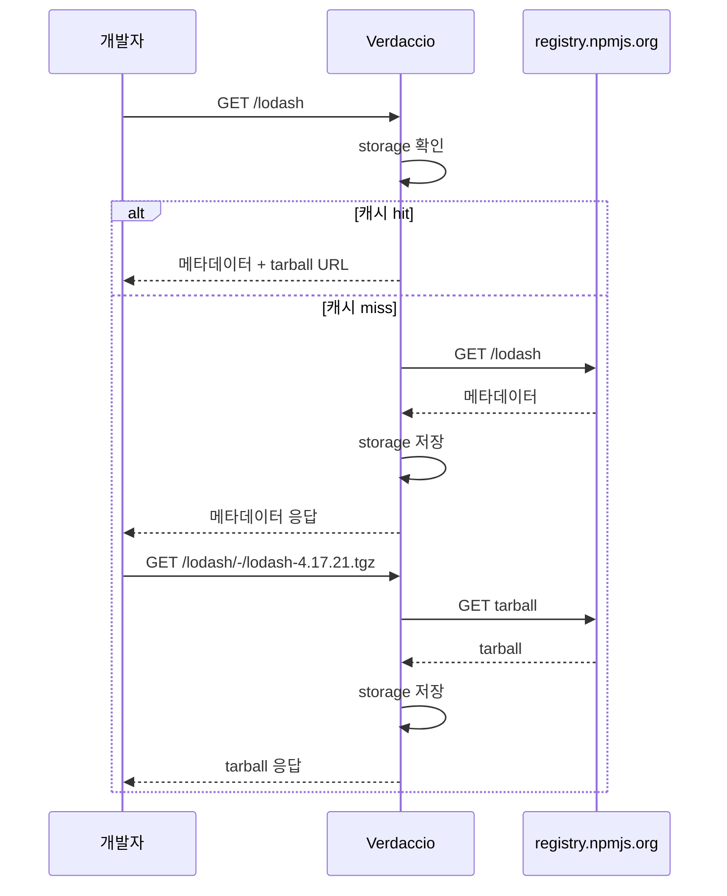

# Verdaccio

## 왜 사설 레지스트리가 필요한가

사내에서 공통 라이브러리를 만들기 시작하면 Git submodule, npm link, 모노레포 workspace 같은 선택지가 차례로 검토된다. 모듈이 늘어나면 결국 npm 레지스트리에 올리는 게 가장 단순한데, 회사 코드를 public registry에 올릴 수는 없다. 이때 Verdaccio가 가장 만만한 선택지로 나온다.

GitHub Packages, AWS CodeArtifact, JFrog Artifactory도 같은 역할을 하지만 Verdaccio는 단일 Node.js 프로세스로 돌고, 설정 파일 한 개로 끝나며, 디스크 폴더에 tarball을 그대로 저장한다. 운영 부담이 거의 없어서 팀 규모 50명 이하에서는 대부분 Verdaccio로 시작한다. 설치하고 30분 안에 첫 publish가 되는 게 가장 큰 장점이다.

내부 동작은 단순하다. publish가 들어오면 `storage/` 아래에 패키지 폴더를 만들고 tarball과 `package.json` 메타데이터를 저장한다. install 요청이 들어오면 로컬에 있으면 바로 응답하고, 없으면 uplink로 설정된 npmjs.org에 요청을 던져 받은 결과를 캐시한다. 이게 전부다. 데이터베이스도 없고, 큐도 없고, 워커도 없다.

## 설치

### Docker로 설치 (운영 권장)

운영은 Docker가 답이다. 컨테이너 한 개로 끝나고 볼륨만 잘 마운트하면 백업도 쉽다.

```bash
docker run -d \
  --name verdaccio \
  -p 4873:4873 \
  -v /opt/verdaccio/storage:/verdaccio/storage \
  -v /opt/verdaccio/conf:/verdaccio/conf \
  -v /opt/verdaccio/plugins:/verdaccio/plugins \
  --restart unless-stopped \
  verdaccio/verdaccio:5
```

처음 띄우면 `/opt/verdaccio/conf/config.yaml`이 자동 생성된다. 컨테이너 내부 사용자 UID가 10001이라 호스트 디렉토리 소유권을 맞춰주지 않으면 권한 에러가 난다. `chown -R 10001:65533 /opt/verdaccio`를 먼저 실행해야 한다. 이 부분에서 한 번씩 막히는 사람이 있다.

docker-compose 예시는 아래처럼 쓴다.

```yaml
version: '3.8'
services:
  verdaccio:
    image: verdaccio/verdaccio:5
    container_name: verdaccio
    ports:
      - "4873:4873"
    volumes:
      - ./storage:/verdaccio/storage
      - ./conf:/verdaccio/conf
      - ./plugins:/verdaccio/plugins
    environment:
      - VERDACCIO_PORT=4873
      - VERDACCIO_PUBLIC_URL=https://npm.example.com
    restart: unless-stopped
```

`VERDACCIO_PUBLIC_URL`은 nginx 뒤에 둘 때 반드시 설정해야 한다. 안 그러면 `npm install`이 받아오는 tarball URL이 `http://localhost:4873/...`로 박혀서 다른 머신에서는 다운로드가 실패한다. 이걸 모르고 며칠 헤매는 케이스가 흔하다.

### npm으로 직접 설치 (로컬 개발용)

```bash
npm install -g verdaccio
verdaccio
```

기본 포트 4873으로 뜨고 설정 파일은 `~/.config/verdaccio/config.yaml`에 생성된다. 노트북에서 모노레포 패키지 publish 테스트할 때 이 방식을 쓴다. 운영에서는 권하지 않는다. 프로세스 매니저(systemd, pm2)를 따로 붙여야 하고 업그레이드도 번거롭다.

## config.yaml 구조

설정 파일이 Verdaccio의 거의 전부다. 핵심 섹션 4개만 알면 된다.

### storage

```yaml
storage: /verdaccio/storage
```

tarball과 메타데이터가 저장될 경로다. 이 디렉토리가 곧 패키지 데이터베이스다. 백업은 이 폴더만 떠놓으면 된다. 한 가지 함정은 storage 경로 안에 `.verdaccio-db.json`이라는 파일이 있는데, 이게 패키지 인덱스다. 이 파일이 깨지면 publish 이력이 날아간 것처럼 보인다. 실제 tarball은 남아있어서 복구는 가능하지만 인덱스 재생성 스크립트를 따로 돌려야 한다.

### uplinks

```yaml
uplinks:
  npmjs:
    url: https://registry.npmjs.org/
    timeout: 30s
    maxage: 2m
    max_fails: 5
    fail_timeout: 5m
    cache: true
```

외부 레지스트리를 프록시하는 설정이다. `cache: true`로 두면 한 번 받아온 패키지는 storage에 캐시되어 다음번부터는 외부 호출 없이 응답한다. 이게 Verdaccio를 쓰는 또 다른 이유다. 사내 빌드 머신 수십 대가 lodash를 npmjs.org에서 매번 받아오는 것보다 Verdaccio가 한 번 받아 캐시한 걸 나눠주는 게 빠르고 외부 장애에도 강하다.

`timeout`을 너무 짧게 잡으면 npmjs.org 응답이 늦을 때 install이 줄줄이 실패한다. 30초가 안전한 기본값이다. `max_fails`와 `fail_timeout`은 uplink 장애 감지 설정인데, npmjs.org가 잠깐 흔들릴 때 Verdaccio가 죽은 걸로 판단해서 캐시 응답까지 막아버리는 경우가 있다. 이 값들을 조금 여유있게 잡아야 한다.

### packages

권한 매트릭스다. 위에서부터 매칭되는 패턴이 우선한다.

```yaml
packages:
  '@mycompany/*':
    access: $authenticated
    publish: $authenticated
    unpublish: $authenticated
    proxy: ~
  '@*/*':
    access: $all
    publish: $authenticated
    proxy: npmjs
  '**':
    access: $all
    publish: $authenticated
    proxy: npmjs
```

`@mycompany/*`는 사내 스코프라 `proxy: ~`로 외부 프록시를 끄는 게 핵심이다. 이걸 안 끄면 사내 패키지 install 요청이 npmjs.org로도 새서, npmjs에 동일 이름이 있으면 그걸 받아온다. 보안 사고로 직결된다. 실제로 의존성 confusion 공격이 이 구멍을 노린다.

권한 키워드는 `$all`(누구나), `$authenticated`(로그인 사용자), `$anonymous`(비로그인) 세 개다. 그룹 단위 권한은 htpasswd 기반으로는 안 되고 ldap이나 github plugin을 붙여야 한다.

### auth (htpasswd)

기본 인증은 htpasswd 파일이다. 작은 팀에서는 충분하다.

```yaml
auth:
  htpasswd:
    file: ./htpasswd
    max_users: 50
```

`max_users: -1`로 두면 회원가입이 막혀서 관리자가 직접 추가해야 한다. 운영 환경은 항상 -1로 둔다. 안 그러면 누군가 `npm adduser` 한 번으로 publish 권한까지 가져간다.

사용자 추가는 직접 htpasswd 명령으로 한다.

```bash
htpasswd -B ./htpasswd alice
```

`-B`는 bcrypt다. Verdaccio 5는 bcrypt만 안전하게 검증한다. md5 해시는 거부될 수 있다.

## publish/install 흐름

### 로그인과 토큰

```bash
npm adduser --registry http://localhost:4873/
```

이 명령이 성공하면 `~/.npmrc`에 인증 토큰이 박힌다.

```
//localhost:4873/:_authToken="abc123..."
```

토큰은 Verdaccio storage의 `.sinopia-db.json`에 저장된다(이름이 sinopia인 건 Verdaccio가 sinopia에서 fork된 흔적이다). JWT 모드로 바꾸려면 config.yaml에 다음을 추가한다.

```yaml
security:
  api:
    jwt:
      sign:
        expiresIn: 30d
        notBefore: 0
  web:
    sign:
      expiresIn: 7d
```

JWT는 만료가 명확해서 운영에서 권장된다. 기본값은 만료 없는 long-lived 토큰이라 한번 유출되면 회수가 까다롭다. 이게 운영 1년쯤 지나면 항상 문제가 된다.

### publish

```bash
cd packages/my-lib
npm publish --registry http://localhost:4873/
```

`package.json`에 `publishConfig`를 박아두면 매번 registry 옵션을 안 줘도 된다.

```json
{
  "name": "@mycompany/my-lib",
  "version": "1.2.3",
  "publishConfig": {
    "registry": "http://localhost:4873/"
  }
}
```

publish 실패 패턴 중 가장 흔한 게 "you cannot publish over the previously published versions"다. Verdaccio는 기본적으로 같은 버전 재배포를 막는다. 강제로 덮어쓰려면 unpublish 후 재publish인데, 정책상 unpublish 자체를 막는 경우가 많다.

### install

```bash
npm install @mycompany/my-lib --registry http://localhost:4873/
```

또는 `.npmrc`에 등록한다.

```
@mycompany:registry=http://localhost:4873/
registry=https://registry.npmjs.org/
```

스코프별로 레지스트리를 분리하는 이 패턴이 실무에서 가장 안전하다. `@mycompany/*`만 사내로 보내고 나머지는 그대로 npmjs.org로 보내면 Verdaccio 부하도 줄고 캐시도 깨끗하게 유지된다. 모든 트래픽을 Verdaccio로 보내는 구성도 가능한데, Verdaccio가 죽으면 빌드 전체가 멈춘다는 점을 감안해야 한다.

## 캐시 동작 자세히

uplink 캐시는 두 단계다.



메타데이터(버전 목록, dependencies)와 tarball(실제 파일)이 별도로 캐시된다. 메타데이터는 `maxage`(기본 2분)가 지나면 다시 npmjs에 물어본다. tarball은 한 번 받으면 영구 보관이다. 디스크가 계속 차오른다는 뜻이다.

운영 1~2년 지나면 storage가 수십 GB로 불어난다. 자주 쓰지 않는 캐시 tarball 정리 스크립트를 cron으로 돌리는 팀이 많다. Verdaccio는 자체 GC 기능이 빈약해서 직접 마지막 접근 시각 기준으로 지워야 한다. 사내 패키지(`@mycompany/*`)는 절대 지우면 안 된다는 안전장치를 꼭 넣어야 한다.

## nginx reverse proxy + HTTPS

운영은 반드시 HTTPS다. Verdaccio 자체는 TLS 처리가 빈약해서 nginx 앞단에 두는 게 표준이다.

```nginx
upstream verdaccio {
    server 127.0.0.1:4873;
    keepalive 32;
}

server {
    listen 443 ssl http2;
    server_name npm.example.com;

    ssl_certificate     /etc/letsencrypt/live/npm.example.com/fullchain.pem;
    ssl_certificate_key /etc/letsencrypt/live/npm.example.com/privkey.pem;

    client_max_body_size 200M;

    location / {
        proxy_pass http://verdaccio;
        proxy_set_header Host $host;
        proxy_set_header X-Real-IP $remote_addr;
        proxy_set_header X-Forwarded-For $proxy_add_x_forwarded_for;
        proxy_set_header X-Forwarded-Proto $scheme;

        proxy_read_timeout 300s;
        proxy_connect_timeout 30s;
        proxy_redirect off;
    }
}
```

`client_max_body_size`를 안 늘리면 큰 패키지 publish가 413으로 떨어진다. 기본 1M에서 막히는데 모노레포 빌드 결과물이 50M 넘어가는 경우도 흔하다. 200M 정도가 무난하다.

`proxy_read_timeout`도 중요하다. publish 도중 네트워크가 잠깐 느려지면 nginx가 60초에서 끊어버린다. 빌드 머신이 ARM이거나 디스크가 느릴 때 자주 본다.

config.yaml에는 이 nginx 앞단에 맞춰 다음을 잡아야 한다.

```yaml
listen:
  - 0.0.0.0:4873

url_prefix: /
```

그리고 환경변수 `VERDACCIO_PUBLIC_URL=https://npm.example.com`을 반드시 준다. 위에서 언급한 tarball URL 문제의 해결책이다.

## GitHub Actions에서 publish 자동화

태그 기반 자동 publish 워크플로우는 다음 형태가 가장 단순하다.

```yaml
name: Publish to Verdaccio

on:
  push:
    tags:
      - 'v*'

jobs:
  publish:
    runs-on: ubuntu-latest
    steps:
      - uses: actions/checkout@v4

      - uses: actions/setup-node@v4
        with:
          node-version: 20
          registry-url: https://npm.example.com

      - name: Configure auth
        run: |
          echo "//npm.example.com/:_authToken=${VERDACCIO_TOKEN}" >> ~/.npmrc
          echo "@mycompany:registry=https://npm.example.com" >> ~/.npmrc
        env:
          VERDACCIO_TOKEN: ${{ secrets.VERDACCIO_TOKEN }}

      - name: Build
        run: |
          npm ci
          npm run build

      - name: Publish
        run: npm publish --access restricted
```

CI 전용 publish 계정을 따로 만들고 토큰을 GitHub Secrets에 박는다. 개인 계정 토큰을 CI에 쓰면 사람이 퇴사할 때마다 파이프라인이 깨진다. 이게 운영 안티패턴 1순위다.

`--access restricted`는 사내 스코프 publish 시 명시한다. 안 쓰면 npm CLI가 기본 access 정책을 적용해서 의도치 않게 public으로 박히려 시도한다. Verdaccio는 막아주지만 경고 로그가 잔뜩 쌓인다.

publish 자동화에서 한 가지 더 신경 쓸 게 버전 bump 전략이다. 태그 기반이면 태그가 곧 버전이라 깔끔한데, main 브랜치 푸시마다 publish하려면 changesets나 semantic-release 같은 도구로 자동 bump를 걸어야 한다. 자동 bump 없이 매번 푸시할 때마다 publish하면 같은 버전 재publish 에러가 줄줄이 난다.

## S3 storage 플러그인

storage를 S3로 빼는 옵션이 있다. HA 구성을 시도하는 팀에서 검토하지만, 함정이 많다.

```yaml
store:
  aws-s3-storage:
    bucket: my-verdaccio-storage
    keyPrefix: verdaccio/
    region: ap-northeast-2
    s3ForcePathStyle: false
    endpoint: ~
```

플러그인 자체는 `verdaccio-aws-s3-storage`를 설치한다.

```bash
docker exec -u root verdaccio npm install --prefix /verdaccio verdaccio-aws-s3-storage
```

S3 storage의 함정은 publish가 느려진다는 점이다. tarball을 매번 S3에 올려야 해서 로컬 디스크 대비 publish가 5~10배 느리다. install은 캐시 메타데이터 갱신이 S3 GET 라운드트립을 일으켜서 latency가 눈에 띄게 늘어난다. 메타데이터 일관성도 문제다. Verdaccio 인스턴스 두 개를 띄워서 S3를 공유하면 같은 패키지를 동시에 publish할 때 메타데이터 race condition이 생긴다. 락 메커니즘이 없어서 마지막 쓰기가 이긴다. 결과적으로 어떤 버전이 인덱스에서 사라지는 사태가 가끔 발생한다.

S3는 백업/디재스터 리커버리 용도로 쓰는 게 안전하다. 매일 새벽에 storage를 S3로 sync하는 cron 정도가 현실적이다. 진짜 HA가 필요하면 Verdaccio가 아니라 Artifactory나 Nexus로 가야 한다.

## 실무에서 자주 만나는 문제

### 스토리지 백업

storage 디렉토리만 백업하면 된다고 알려져 있지만, 백업 도중 publish가 들어오면 인덱스와 tarball이 어긋난 스냅샷이 만들어진다. rsync로 단순 복사하면 이 문제가 자주 터진다. 안전한 방법은 LVM snapshot이나 ZFS snapshot으로 일관된 시점을 떠서 복사하는 것이다. EBS snapshot도 같은 효과를 낸다. 클라우드 환경이면 EBS snapshot이 가장 단순하다.

복구 테스트를 분기에 한 번은 해야 한다. 백업은 떠놨는데 복구가 안 되는 경우가 의외로 많다. 인덱스 깨짐 복구는 `verdaccio-storage-fix` 같은 커뮤니티 도구가 있긴 한데 안정적이지 않다.

### 권한 충돌

packages 섹션 매칭 순서를 헷갈리는 게 가장 흔한 실수다. 위에서 아래로 첫 매칭이 적용된다. `'**'`을 위에 두면 모든 하위 규칙이 무시된다. 새로운 규칙을 추가할 때 항상 위쪽에 넣고, 변경 후 `npm install` 한 번이라도 돌려서 권한이 의도대로 동작하는지 확인해야 한다.

또 하나는 사내 스코프 패키지가 외부에도 같은 이름으로 존재하는 경우다. `proxy: ~`를 빼먹으면 npmjs.org에서 동명 패키지를 받아온다. 의도치 않게 외부 코드가 사내 빌드에 섞이는 사고로 직결된다. 모든 사내 스코프 정의에 `proxy: ~`를 강제하는 lint를 걸어두는 팀도 있다.

### uplink 타임아웃

npmjs.org가 한국에서 가끔 느리다. 특히 새벽 시간대 미국 트래픽 피크와 겹치면 응답이 5초 이상 걸린다. `timeout: 30s`로 두면 안전한데, `max_fails`가 낮으면 몇 번 느린 응답에 uplink가 죽은 것으로 판단된다. 이때 캐시된 패키지조차 응답이 늦어진다. `max_fails: 5`, `fail_timeout: 5m` 정도가 무난하다.

회사 방화벽이 npmjs.org와 그 CDN(`registry.yarnpkg.com`, `nodejs.org`)을 모두 허용해야 한다. tarball이 별도 CDN에서 서빙되는 케이스가 있어서 메타데이터는 받아왔는데 tarball은 못 받는 상황이 가끔 발생한다.

### 토큰 만료

JWT 모드를 켜면 토큰이 만료되는데, CI 토큰 만료를 깜빡하면 어느 날 갑자기 모든 빌드가 401로 떨어진다. 만료 30일 전 알림을 어딘가에 걸어두지 않으면 반드시 한 번은 당한다. 모니터링 대시보드에 토큰 만료일을 노출하거나, 캘린더 알림을 거는 게 현실적인 대응이다.

토큰을 무한으로 둘 거면 IP 화이트리스트나 서비스 계정 분리 같은 보조 장치를 꼭 같이 둬야 한다.

### HA 구성의 한계

Verdaccio는 단일 노드 전제로 설계된 도구다. 여러 인스턴스로 같은 storage를 공유하는 시나리오는 공식적으로 권장되지 않는다. 락 메커니즘이 없어서 동시 publish 시 인덱스 손상이 발생한다.

현실적인 HA 흉내는 active-passive 구성이다. 같은 storage(NFS, EFS)를 두 인스턴스가 바라보지만 한쪽만 active로 두고 다른 쪽은 stand-by다. failover는 keepalived나 HAProxy로 처리한다. 이마저도 publish 도중 failover가 일어나면 데이터가 깨질 수 있다. 운영하는 팀들 대부분이 단일 노드 + 빠른 복구 절차로 가는 이유다. install은 캐시 덕에 readonly 모드로도 어느 정도 동작하니, 마스터 다운 시 readonly slave로 install만 받게 하는 식의 절충도 있다.

### 버전 충돌과 unpublish 정책

같은 버전 재publish는 막혀있다. 실수로 잘못된 버전을 올렸을 때 unpublish가 필요한데, npm 공식 정책처럼 Verdaccio도 24시간 룰이나 publish 후 일정 시간 후 unpublish 금지 같은 정책을 흉내낼 수 있다.

```yaml
packages:
  '@mycompany/*':
    access: $authenticated
    publish: $authenticated
    unpublish: admin
```

`unpublish`만 별도 그룹으로 분리하면 일반 개발자는 unpublish 자체가 안 된다. 잘못 올린 버전은 patch bump로 새 버전을 올리는 게 정석이다. unpublish하면 의존하는 다른 빌드가 사라진 버전을 참조해서 깨진다. 이미 install된 lockfile은 더 처참해진다.

운영 정책은 단순하게 잡는 게 좋다. unpublish 금지, 잘못된 버전은 deprecate하고 다음 버전으로 수정. `npm deprecate @mycompany/my-lib@1.2.3 "broken build, use 1.2.4"` 한 줄이면 충분하다. deprecate된 버전은 install은 가능하지만 경고가 뜬다.

## 운영 후 한 마디

Verdaccio는 첫 셋업이 단순해서 시작하기 좋지만, 1년쯤 운영하다 보면 한계가 보인다. storage가 수십 GB로 불어나고, HA가 안 되고, 권한 관리가 LDAP이나 SSO와 자연스럽게 연결되지 않는다. 회사 규모가 커지면 결국 Artifactory나 GitHub Packages로 이전을 검토하게 된다.

그래도 50명 이하 팀에서는 Verdaccio가 가장 가성비 좋다. 도커 한 줄로 띄우고, 설정 파일 50줄로 끝내고, 백업도 폴더 복사로 끝난다. 운영 부담을 다른 곳에 쓸 수 있게 해준다는 점이 가장 큰 가치다. 문제가 생기면 storage 디렉토리를 통째로 다른 머신에 옮겨서 다시 띄우면 그만이다. 이 단순함은 다른 도구에서 보기 어렵다.
