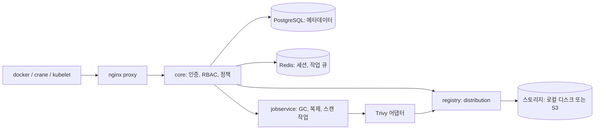
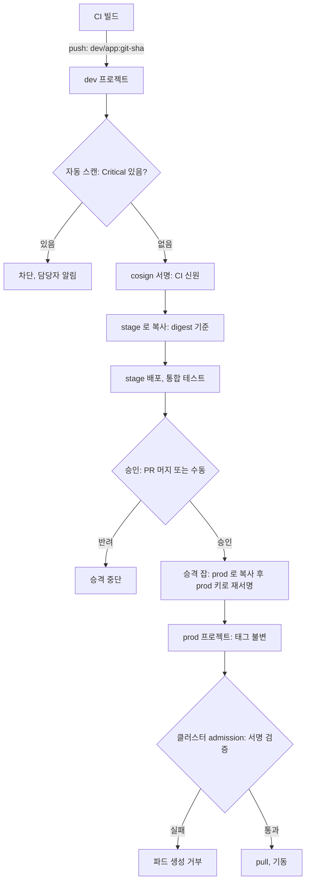
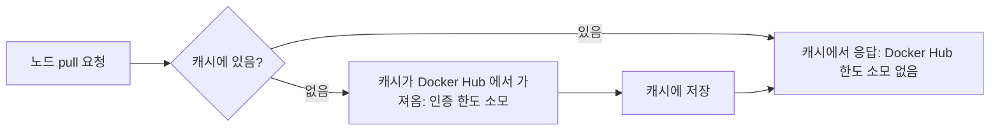
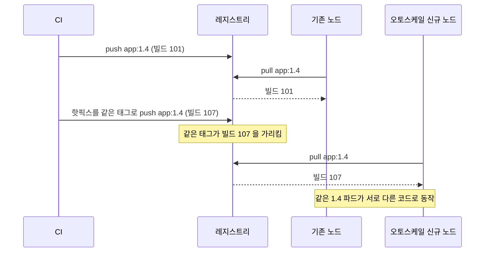
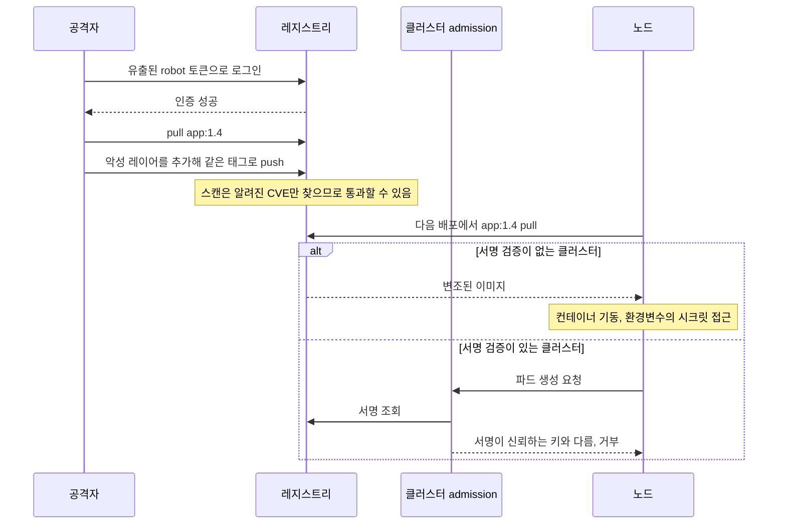

# 프라이빗 컨테이너 레지스트리 구축과 운영

## 왜 자체 레지스트리를 두는가

처음엔 Docker Hub에 이미지를 올려서 썼다. 무료고 설정도 필요 없으니 편했다. 문제가 터진 건 서비스가 커지고 배포가 잦아진 다음이다. 어느 날 오토스케일링으로 노드가 한꺼번에 뜨면서 같은 이미지를 동시에 수십 번 pull 했더니 `toomanyrequests: You have reached your pull rate limit` 에러가 떨어지고 신규 파드가 ImagePullBackOff로 멈췄다. Docker Hub의 익명 pull은 IP당 6시간에 100회, 인증해도 200회로 제한된다. 노드가 NAT 게이트웨이 한 개를 공유하면 클러스터 전체가 하나의 IP로 보여서 이 한도가 순식간에 찬다.

자체 레지스트리를 두면 이 한도에서 벗어나고, 이미지가 외부망을 타지 않으니 pull 속도도 빨라진다. 사내 정책상 소스나 빌드 산출물을 외부에 두면 안 되는 경우에도 선택지가 없다. 운영하는 레지스트리는 크게 두 부류다. 단순히 이미지를 저장하고 내려주기만 하면 되는 `distribution`(예전 이름 Docker Registry)과, 인증·권한·취약점 스캔·서명·복제까지 묶은 Harbor다.

## distribution과 Harbor 중 무엇을 쓸까

distribution은 CNCF 프로젝트로, 레지스트리 API v2를 구현한 단일 바이너리다. 띄우는 건 1분이면 된다.

```bash
docker run -d -p 5000:5000 --name registry \
  -v /opt/registry/data:/var/lib/registry \
  registry:2.8
```

이게 전부다. 푸시하려면 `myhost:5000/myapp:1.0`처럼 호스트를 붙여 태그하고 push 하면 된다. 가볍고 의존성이 없어서 빌드 캐시 저장소나 폐쇄망 미러로 쓰기 좋다. 대신 인증은 basic auth 한 겹뿐이고, UI도 없고, 취약점 스캔이나 사용자별 권한 같은 건 전혀 없다. 누가 어떤 이미지를 올렸는지 추적할 방법이 없으니 여러 팀이 공유하는 순간 관리가 안 된다.

Harbor는 distribution을 저장 엔진으로 깔고 그 위에 운영에 필요한 것들을 얹은 제품이다. 프로젝트 단위로 이미지를 격리하고, LDAP·OIDC 연동, RBAC, Trivy 스캔, cosign 서명 검증, 다른 레지스트리와의 복제를 다 내장한다. 혼자 쓰거나 CI 캐시 용도면 distribution으로 충분하고, 여러 팀이 함께 쓰고 보안 요건이 있으면 Harbor를 쓴다. 아래 운영 얘기는 대부분 Harbor 기준이다.

Harbor 안에서 이미지가 오가는 길을 그림으로 그리면 이렇다. 클라이언트의 요청은 앞단 프록시가 받아 core로 넘기고, core가 인증과 권한을 확인한 뒤 실제 blob 읽기·쓰기는 distribution(registry 컴포넌트)에 맡긴다. 스캔은 core가 jobservice에 작업을 던지고 Trivy 어댑터가 받아 처리한다. 장애가 났을 때 어느 컴포넌트 로그를 먼저 볼지 감이 안 오면 이 구조를 떠올리면 된다. push 가 401 이면 core, 업로드 도중 끊기면 registry와 스토리지, 스캔이 `Pending` 에서 안 움직이면 jobservice와 Trivy 쪽이다.



## Harbor 설치

Harbor는 컴포넌트가 여럿이라 docker-compose로 묶어 배포하는 게 표준이다. 오프라인 설치 패키지를 받아서 `harbor.yml`을 채우고 설치 스크립트를 돌린다.

```yaml
# harbor.yml 핵심 부분
hostname: registry.example.com

https:
  port: 443
  certificate: /data/cert/registry.example.com.crt
  private_key: /data/cert/registry.example.com.key

harbor_admin_password: <초기-admin-비번>

data_volume: /data

trivy:
  enabled: true

# 기본 PostgreSQL/Redis는 내장. 외부 DB를 쓰려면 external_database 섹션 사용
```

```bash
./prepare
./install.sh --with-trivy
```

여기서 가장 자주 막히는 게 HTTPS다. Harbor를 HTTP로 띄우면 docker가 push/pull을 거부한다. docker는 기본적으로 레지스트리가 TLS를 쓴다고 가정하기 때문이다. 사내 CA로 발급한 인증서를 쓰면 클라이언트마다 그 CA를 신뢰 목록에 넣어줘야 한다.

```bash
# 각 docker 데몬 호스트에서
mkdir -p /etc/docker/certs.d/registry.example.com
cp ca.crt /etc/docker/certs.d/registry.example.com/ca.crt
```

이걸 빼먹으면 `x509: certificate signed by unknown authority`가 뜬다. 테스트 환경이라 인증서 검증을 건너뛰고 싶으면 `/etc/docker/daemon.json`에 `insecure-registries`로 호스트를 등록하는 방법도 있지만, 운영에서는 절대 쓰지 않는다. 한 번 열어두면 중간자 공격에 그대로 노출된다.

## 인증과 접근 제어

Harbor의 권한 모델은 프로젝트 → 멤버 → 역할 구조다. 프로젝트는 이미지를 담는 네임스페이스고, 각 프로젝트에 사용자나 그룹을 멤버로 넣으면서 역할을 준다. 역할은 게스트(읽기), 개발자(읽기·푸시), 마스터(+스캔·삭제), 프로젝트 관리자(+멤버 관리)로 나뉜다.

사람 계정은 보통 LDAP이나 OIDC로 연동한다. 사내 IdP에 OIDC를 붙여두면 Harbor에서 별도로 비밀번호를 관리할 필요가 없고, 퇴사자 처리도 IdP에서 끝난다.

CI 파이프라인이나 쿠버네티스가 이미지를 받을 때는 사람 계정을 쓰면 안 된다. 사람 계정의 비밀번호를 CI 시크릿에 박아두면 그 사람이 비번을 바꾸거나 퇴사하는 순간 파이프라인이 깨진다. 이럴 때 쓰는 게 robot account다. 특정 프로젝트에 한정해서 push/pull 권한만 가진 전용 계정을 만들고, 만료일을 박아둔다.

```bash
# robot account 토큰으로 로그인 (이름은 robot$프로젝트+이름 형식)
docker login registry.example.com \
  -u 'robot$ci+deployer' \
  -p '<robot-token>'
```

robot account의 토큰은 생성 시점에 한 번만 보여준다. 그 자리에서 시크릿 매니저에 저장하지 않으면 다시 못 보고 새로 만들어야 한다. 권한은 프로젝트별·동작별로 잘게 줄 수 있으니, 배포용은 pull만, 빌드용은 push만 주는 식으로 분리한다. CI가 통째로 탈취돼도 pull 전용 토큰이면 이미지를 덮어쓰지는 못한다.

쿠버네티스에서 프라이빗 레지스트리 이미지를 받으려면 pull 시크릿을 만들어 ServiceAccount에 붙인다.

```bash
kubectl create secret docker-registry harbor-pull \
  --docker-server=registry.example.com \
  --docker-username='robot$prod+puller' \
  --docker-password='<robot-token>' \
  -n prod
```

```yaml
apiVersion: v1
kind: ServiceAccount
metadata:
  name: default
  namespace: prod
imagePullSecrets:
  - name: harbor-pull
```

## 이미지 취약점 스캔 (Trivy 연동)

Harbor는 Trivy를 스캐너로 내장한다. 설치 때 `--with-trivy`를 주면 같이 뜨고, 이미지를 push 하면 자동으로 스캔하거나(프로젝트 설정의 "Automatically scan images on push") 수동으로 스캔을 돌릴 수 있다. 스캔 결과는 CVE 목록과 심각도(Critical/High/Medium/Low)로 나온다.

운영에서 진짜 쓸모 있는 건 배포 차단이다. 프로젝트 설정에서 "Prevent vulnerable images from running"을 켜고 임계치를 Critical로 잡으면, Critical 취약점이 있는 이미지는 pull 자체가 막힌다. 다만 이 차단은 Harbor가 pull 요청을 거부하는 방식이라, 이미지를 노드가 이미 캐시하고 있으면 우회된다는 점은 알아둬야 한다.

처음 이걸 켜면 멀쩡히 돌던 배포가 갑자기 막혀서 당황한다. 베이스 이미지에 깔린 OS 패키지에서 Critical이 줄줄이 나오는 경우가 많다. 현실적으로는 베이스 이미지를 slim이나 distroless로 바꿔서 패키지 표면을 줄이는 게 먼저다. 당장 패치가 없는 CVE는 Harbor의 CVE allowlist에 등록해 예외 처리하되, 만료일을 걸어서 방치되지 않게 한다.

Trivy DB는 주기적으로 갱신돼야 의미가 있다. 폐쇄망이면 Trivy가 취약점 DB를 외부에서 못 받아와서 스캔 결과가 텅 비거나 오래된 상태로 남는다. 이때는 `trivy-db`를 사내 미러에 받아두고 Harbor의 Trivy가 그쪽을 바라보게 설정해야 한다.

## 이미지 서명 (cosign)

스캔이 "이 이미지에 알려진 취약점이 있나"를 본다면, 서명은 "이 이미지가 우리가 만든 그 이미지가 맞나"를 본다. 누군가 레지스트리에 침투해 이미지를 바꿔치기해도, 서명이 안 맞으면 배포 단계에서 걸러낸다.

cosign은 sigstore 프로젝트의 서명 도구다. 키 쌍을 만들고 이미지에 서명한다.

```bash
cosign generate-key-pair          # cosign.key / cosign.pub 생성

# 이미지 다이제스트에 서명 (태그가 아니라 다이제스트로 거는 게 안전)
cosign sign --key cosign.key \
  registry.example.com/prod/app@sha256:<digest>

# 검증
cosign verify --key cosign.pub \
  registry.example.com/prod/app@sha256:<digest>
```

서명은 태그가 아니라 다이제스트에 거는 게 핵심이다. 태그는 나중에 다른 이미지를 가리키게 옮길 수 있어서, 태그에 서명하면 의미가 약해진다.

서명을 만들기만 하고 검증하지 않으면 아무 의미가 없다. 검증은 배포 게이트에서 강제해야 한다. 쿠버네티스라면 admission controller(Kyverno나 sigstore policy-controller)를 붙여서, 서명이 검증되지 않은 이미지는 클러스터에 아예 못 뜨게 막는다. Harbor 자체도 cosign 서명 존재 여부를 확인해 미서명 이미지의 pull을 막는 설정이 있다.

CI에서 키 파일을 다루는 게 부담이면 keyless 서명을 쓴다. OIDC 신원으로 단기 인증서를 발급받아 서명하므로 장기 비밀키를 보관할 필요가 없다. 다만 검증 시 신뢰할 발급자와 신원을 명시해야 해서 설정이 한 단계 더 들어간다.

## push에서 prod pull까지, 이미지 승격 흐름

스캔, 서명, 불변 태그를 각각 켜 놓는 것과 이 셋이 한 흐름으로 이어지는 것은 다르다. 항목마다 따로 켜 두면 "스캔은 통과했는데 서명은 다른 이미지에 걸려 있다" 같은 틈이 생긴다. 틈을 없애려면 이미지가 환경을 넘어갈 때마다 같은 digest를 들고 가야 한다.

내가 쓰는 구조는 레지스트리 프로젝트를 `dev`, `stage`, `prod`로 나누고, CI는 `dev`에만 push 하게 하는 것이다. `prod`에는 사람도 CI 빌드 잡도 직접 push 하지 못한다. 승격 전용 계정 하나만 `prod`에 쓸 수 있다. 빌드 잡이 탈취돼도 prod 프로젝트에는 손이 닿지 않는다.



위 그림에서 볼 부분은 두 군데다. 첫째, stage와 prod로 넘어가는 칸은 "다시 빌드"가 아니라 "복사"다. 같은 소스를 다시 빌드하면 베이스 이미지가 그 사이 갱신돼 다른 digest가 나오고, 스캔하고 테스트한 이미지와 실제로 나가는 이미지가 달라진다. 둘째, prod에서는 승격 잡만 가진 키로 다시 서명한다. CI 신원의 서명은 "빌드가 이 파이프라인에서 나왔다"는 증거이고, prod 서명은 "사람이나 정책이 승인했다"는 증거라서 의미가 다르다. admission은 후자만 믿게 한다.

승격 잡의 핵심은 이 세 줄이다.

```bash
DIGEST=$(crane digest registry.example.com/dev/app:${GIT_SHA})

# 태그가 아니라 digest 로 복사한다. 복사하는 사이 dev 태그가 바뀌어도 영향이 없다
crane copy registry.example.com/dev/app@${DIGEST} \
           registry.example.com/prod/app:${VERSION}

cosign sign --key awskms:///alias/prod-promote \
  registry.example.com/prod/app@${DIGEST}
```

`crane copy`는 이미지만 복사하고 cosign 서명 아티팩트는 따라가지 않는다. 그래서 prod에서 새로 서명하는 것이다. 서명까지 옮기고 싶으면 `cosign copy`를 쓰거나 Harbor 복제 규칙을 쓰는데, 복제가 서명 아티팩트를 함께 옮기는지는 Harbor 버전에 따라 다르니 쓰는 버전에서 확인해야 한다.

프로젝트를 나누지 않고 한 프로젝트에서 태그로만 단계를 구분하는 방식(`app:1.4.0-rc` → `app:1.4.0`)도 쓴다. 팀이 작고 레지스트리가 하나뿐이면 현실적이다. 대신 같은 프로젝트에 push 권한이 있는 계정은 정식 버전 태그도 쓸 수 있으니 권한 분리가 안 된다. 이럴 때는 불변 태그를 켜서 최소한 덮어쓰기는 막아야 한다. 덮어쓰기가 왜 문제인지는 아래 태그 절에서 다룬다.

## GC와 스토리지 백엔드

레지스트리를 운영하면서 가장 흔하게 겪는 사고가 디스크 폭증이다. 이미지를 push 할 때마다 레이어가 쌓이는데, 태그를 덮어쓰거나 삭제해도 실제 blob 데이터는 디스크에 그대로 남는다. CI가 하루에도 수십 번 같은 태그로 push 하면, 참조가 끊긴 레이어가 계속 누적돼서 어느 날 디스크가 꽉 찬다.

이 끊긴 데이터를 지우는 게 garbage collection이다. distribution에서는 이렇게 돈다.

```bash
# 먼저 무엇이 지워질지 확인 (dry-run)
docker exec registry \
  registry garbage-collect --dry-run /etc/docker/registry/config.yml

# 실제 삭제
docker exec registry \
  registry garbage-collect /etc/docker/registry/config.yml
```

GC에서 반드시 알아야 할 건, 표준 GC가 mark-and-sweep 방식이라 그동안 push가 들어오면 정합성이 깨질 수 있다는 점이다. 그래서 distribution GC는 레지스트리를 읽기 전용으로 돌리거나 잠깐 멈춘 상태에서 하는 게 안전하다. Harbor는 GC를 작업 큐로 관리하면서 그 시간 동안 push를 막아주므로, Harbor UI에서 스케줄을 걸어 새벽 시간대에 돌리는 게 낫다.

또 하나, GC는 "참조 끊긴 blob"만 지운다. 태그가 살아있는 한 그 이미지는 안 지워진다. 오래된 태그 자체를 정리하려면 Harbor의 tag retention 정책을 따로 걸어야 한다. "최근 10개만 남기고 나머지 삭제" 같은 규칙을 프로젝트별로 설정한다. retention으로 태그를 정리한 뒤 GC를 돌려야 실제 디스크가 빈다. 이 순서를 헷갈리면 retention만 돌리고 디스크는 그대로라 당황한다.

스토리지가 커지면 로컬 디스크 대신 S3 같은 오브젝트 스토리지를 백엔드로 쓴다. config.yml에서 storage driver를 바꾼다.

```yaml
storage:
  s3:
    region: ap-northeast-2
    bucket: my-registry-bucket
    rootdirectory: /registry
    # 인스턴스 프로파일(IAM Role)을 쓰면 accesskey/secretkey 생략 가능
  delete:
    enabled: true   # 이게 false면 이미지 삭제·GC가 동작 안 한다
  redirect:
    disable: false  # S3 presigned URL로 클라이언트가 직접 받게 함
```

`delete.enabled: true`를 빼먹으면 삭제 API가 막혀서 GC도 안 되고 디스크(버킷)만 계속 큰다. 자주 놓치는 부분이다. `redirect`를 켜두면 클라이언트가 레지스트리를 거치지 않고 S3에서 직접 레이어를 받으므로 레지스트리 서버의 대역폭 부담이 줄지만, 클라이언트가 S3 엔드포인트에 직접 닿을 수 있어야 한다. VPC 안에서만 도는 폐쇄망이면 S3 VPC 엔드포인트가 필요하다.

## 레플리케이션

Harbor는 다른 레지스트리와 이미지를 복제하는 기능을 내장한다. 쓰는 상황은 대개 두 가지다. 하나는 멀티 리전 배포에서 서울 레지스트리의 이미지를 다른 리전 레지스트리로 복제해 pull 지연을 줄이는 경우, 다른 하나는 Docker Hub나 외부 레지스트리의 이미지를 사내로 끌어와 캐시하는 경우다.

복제는 endpoint(대상 레지스트리)를 등록하고, rule(어떤 이미지를 어느 방향으로 복제할지)을 만든다. push-based(원본에서 push 시점에 밀어줌)와 pull-based(주기적으로 당겨옴) 두 모드가 있다. 외부에서 끌어오는 미러 용도는 pull-based로 패턴 매칭(`library/**` 같은)을 걸어둔다.

여기서 주의할 건 복제도 결국 한도와 대역폭을 쓴다는 점이다. Docker Hub에서 pull-based로 너무 광범위한 패턴을 걸면 그쪽 rate limit에 걸려서 복제가 계속 실패한다. 필요한 이미지만 좁게 거는 게 맞다.

## ECR·GCR 같은 매니지드와의 비교

직접 Harbor를 세우는 대신 클라우드 매니지드 레지스트리를 쓰는 선택지도 있다. AWS는 ECR, GCP는 Artifact Registry(예전 GCR), Azure는 ACR이다.

매니지드의 장점은 운영 부담이 거의 없다는 것이다. 디스크 관리, GC, 가용성, 백업을 클라우드가 알아서 한다. ECR은 IAM으로 권한을 관리하니 클러스터가 같은 계정에 있으면 pull 시크릿을 따로 안 만들고 노드의 IAM Role로 바로 받는다. 스캔도 기본으로 들어있고(ECR은 Basic 스캔과 Inspector 연동 Enhanced 스캔 두 가지), lifecycle policy로 오래된 이미지 자동 삭제도 된다.

직접 구축이 나은 경우는 폐쇄망이라 외부 클라우드에 못 붙거나, 멀티 클라우드라 특정 벤더에 묶이기 싫거나, Harbor의 RBAC·복제·서명 검증을 한 곳에서 통합 관리하고 싶을 때다. 비용 구조도 다르다. 매니지드는 저장 용량과 데이터 전송(특히 리전 밖으로 나가는 트래픽)에 과금되므로, 이미지가 크고 pull이 잦으면 전송 비용이 의외로 크다. 같은 클라우드 안에서 pull 하면 전송비가 없거나 싸지만, 다른 리전이나 온프렘으로 끌어오면 비용이 붙는다.

ECR도 IAM 인증 토큰의 유효기간이 12시간이라, CI가 `aws ecr get-login-password`로 토큰을 받아 docker login 하는 흐름을 자동화해두지 않으면 토큰 만료로 push가 실패한다. 매니지드라고 신경 쓸 게 없는 건 아니다.

## 레지스트리별 보안 기능 비교

보안 쪽 기능만 뽑아서 네 곳을 표로 나란히 놓았다. 어디를 쓸지 고민할 때 "스캔·서명·불변 태그·복제를 레지스트리가 해 주는가, 내가 따로 붙여야 하는가"로 갈린다.

| 항목 | ECR | Harbor | GHCR | Docker Hub |
|---|---|---|---|---|
| 취약점 스캔 | Basic, Inspector 연동 Enhanced | Trivy 내장. push 시 자동, 취약 이미지 pull 차단 | 레지스트리 자체 스캔 없음. Dependabot·코드 스캐닝은 별개 | Docker Scout. 플랜별로 범위가 다름 |
| 서명 | cosign 아티팩트 저장, AWS Signer(Notation) 연동 | cosign·Notation 서명 저장, 미서명 pull 차단 설정 | cosign 서명을 저장할 수는 있으나 검증 강제는 클러스터 쪽 몫 | Docker Content Trust, cosign 서명 저장 |
| 불변 태그 | 저장소 단위 설정 | 프로젝트 규칙, 패턴으로 대상 지정 | 레지스트리 설정으로는 없음 | 플랜에 따라 다름. 도입 전 확인 |
| 복제 | 리전·계정 간 복제 규칙 | 레지스트리 간 push·pull 복제 | 없음 | 없음 |
| pull-through cache | 지원. Docker Hub·GHCR 등은 자격증명 필요 | 프록시 캐시 프로젝트 | 해당 없음 | 해당 없음 |
| pull 한도 | 서비스 쿼터 | 직접 운영하는 만큼 | 공개 이미지에서 Docker Hub 같은 한도는 겪지 못했다 | 익명 IP당 100회, 인증 200회 (6시간) |
| 오래된 이미지 정리 | lifecycle policy | tag retention + GC | 패키지 버전 수동·API 삭제 | 수동 삭제 |

이 표는 쓰는 시점마다 바뀐다. 플랜 개편이나 신기능 때문에 반년 전 기억이 틀린 경우가 많아서, 도입을 결정하기 전에 각 서비스의 현재 문서로 해당 칸을 다시 확인해야 한다. 특히 Docker Hub와 GHCR은 칸이 비어 있는 곳을 CI 쪽 도구(Trivy 스캔 스텝, cosign 서명 스텝, admission 정책)로 메우게 된다. 레지스트리가 못 하는 일을 파이프라인이 하게 되니 파이프라인 계정의 권한 관리가 그만큼 중요해진다.

## pull-through cache와 Docker Hub 한도 장애

앞에서 Docker Hub 한도 얘기를 했지만 실제 장애는 한도 숫자보다 "언제 터지는가"가 문제였다. 평소엔 아무 일 없다가 배포 직후, 오토스케일링이 노드를 한꺼번에 늘리는 순간에 터진다. 노드는 10개 남짓인데 노드마다 시스템 파드(로그 수집기, 모니터링 에이전트)가 Docker Hub 이미지를 쓰고 있었고, 새 노드가 뜨면 전부 한 번에 pull 한다. NAT 게이트웨이 IP 하나에서 나가니 한도를 같이 쓴다. 파드 수십 개가 ImagePullBackOff 로 멈췄고, 한도는 6시간 단위로 풀리니 기다리는 것 말고 방법이 없었다.

해결은 pull-through cache였다. 노드가 Docker Hub 대신 사내 캐시에 요청하고, 캐시에 없을 때만 캐시가 Docker Hub로 나간다.



그림에서 한도를 쓰는 곳은 "없음" 가지 하나뿐이다. 노드가 100대여도 같은 이미지는 캐시 채우는 한 번만 센다. ECR 설정은 두 단계다. Docker Hub 자격증명을 Secrets Manager 에 넣어야 하고, 시크릿 이름은 `ecr-pullthroughcache/` 접두어로 시작해야 한다.

```bash
aws secretsmanager create-secret \
  --name ecr-pullthroughcache/docker-hub \
  --secret-string '{"username":"<hub-user>","accessToken":"<hub-pat>"}'

aws ecr create-pull-through-cache-rule \
  --ecr-repository-prefix docker-hub \
  --upstream-registry-url registry-1.docker.io \
  --credential-arn arn:aws:secretsmanager:ap-northeast-2:111122223333:secret:ecr-pullthroughcache/docker-hub-AbCdEf
```

이미지 주소는 `111122223333.dkr.ecr.ap-northeast-2.amazonaws.com/docker-hub/library/nginx:1.27` 처럼 쓴다. 공식 이미지는 `library/` 를 직접 붙여야 하는데, 이걸 빼먹어 `not found` 를 맞고 한참 헤맨 적이 있다.

적용하고 나서 겪은 함정이 세 가지 있다.

첫째, 첫 pull 권한이다. 캐시에 처음 들어오는 이미지는 ECR이 저장소를 새로 만들고 upstream에서 가져오는데, 이때 노드의 IAM Role 에 `ecr:CreateRepository` 와 `ecr:BatchImportUpstreamImage` 가 있어야 한다. pull 권한만 줬던 노드 Role로는 처음 보는 이미지가 전부 실패한다. 평소 쓰던 이미지는 이미 캐시에 있어 멀쩡하다가, 새 이미지를 추가하는 날에만 터지니 원인 찾기가 어렵다.

둘째, 캐시가 비어 있을 때 동시에 몰리는 경우다. 새 태그를 배포하는 순간 노드 수십 개가 동시에 요청하면 캐시가 채워지기 전이라 요청이 upstream으로 겹쳐 나갈 수 있다. 큰 배포 전에 CI에서 한 번 미리 pull 해서 캐시를 데워 두면 이 문제가 없어진다.

셋째, 보안 쪽이다. 캐시는 upstream의 가변 태그를 그대로 따라간다. 캐시 갱신 주기 동안 `nginx:1.27` 이 어제 이미지를 가리킬 수도 있고, upstream이 태그를 지워도 캐시에는 남아 있을 수 있다. 캐시를 쓴다고 불변이 되지 않으니 베이스 이미지는 여전히 digest로 고정해야 한다. Harbor 프록시 캐시 프로젝트도 같다.

## 태그 덮어쓰기와 오래된 이미지 정리

mutable 태그의 문제는 롤백이 안 되는 것 정도로 생각하기 쉽다. 실제로 겪은 건 같은 태그가 다른 코드를 실행하는 상황이었다.



기존 노드는 이미지가 로컬에 있어 `imagePullPolicy: IfNotPresent` 에서 다시 받지 않는다. 새로 뜬 노드만 핫픽스를 받는다. 로그에는 둘 다 `app:1.4` 로 찍히니 "버전은 같은데 동작이 다르다"는 이상한 버그로 보인다. 해당 서비스에서 일부 요청만 에러가 나서 원인을 찾는 데 꽤 걸렸다. 불변 태그를 켜면 두 번째 push가 거부되어 이런 상황이 만들어지지 않는다. Harbor는 프로젝트 설정의 Tag immutability 규칙, ECR은 저장소의 `imageTagMutability` 값이다.

```bash
aws ecr put-image-tag-mutability \
  --repository-name prod/app \
  --image-tag-mutability IMMUTABLE
```

불변 태그에는 비용이 따른다. `latest` 같은 이동형 태그를 쓰던 파이프라인은 push 가 실패하기 시작한다. 이동형 태그가 필요한 저장소는 불변 설정에서 빼거나(Harbor는 패턴으로 제외 가능), 아예 이동형 태그를 안 쓰고 배포 매니페스트에 `@sha256:...` 으로 박는 편이 낫다. 쿠버네티스에서 `image: registry.example.com/prod/app:1.4@sha256:...` 처럼 태그와 digest를 같이 쓰면, 실제 pull은 digest로 하고 태그는 사람이 읽기 위한 표시로 남는다.

### lifecycle 정책이 쓰던 이미지를 지우는 경우

불변 태그를 켜면 태그가 영원히 쌓이니 정리 정책이 필요해진다. 여기서 사고가 한 번 났다. ECR lifecycle policy를 "push 후 90일 지난 이미지 삭제"로 걸어 뒀는데, 안정적이라 석 달 넘게 재배포하지 않은 서비스의 이미지가 지워졌다. 파드는 멀쩡히 돌았다. 노드가 교체되는 날 이미지를 못 찾아 ImagePullBackOff 가 났다. 정책은 push 시각만 보고, 지금 클러스터에서 쓰는지는 보지 않는다.

오삭제가 나는 지점을 정리하면 이렇다.

| 상황 | 결과 | 대응 |
|---|---|---|
| 기간 기준 삭제(`sinceImagePushed`)를 운영 이미지에 적용 | 오래 안 바뀐 서비스 이미지가 삭제됨 | 운영 저장소는 기간 기준 없이 개수 기준만 쓰고 넉넉하게 남긴다 |
| "any" 대상 개수 규칙 | cosign 서명 태그(`sha256-....sig`)와 attestation 도 이미지로 세어져 서명이 먼저 지워지거나 이미지 개수가 어긋남 | 태그 접두어로 대상을 좁힌다. 서명 태그는 규칙에 걸리지 않게 한다 |
| 태그 없는 이미지 삭제 | 멀티 아키텍처 이미지의 자식 매니페스트는 태그가 없어 정리 대상처럼 보임 | 정리 후 `docker buildx imagetools inspect` 로 인덱스가 온전한지 확인한다 |
| 규칙 우선순위 | ECR은 우선순위 숫자가 작은 규칙부터 평가하고, `any` 규칙은 가장 뒤에 와야 한다 | 우선순위 설계를 먼저 그린 뒤 적용한다 |

멀티 아키텍처 이미지가 정리에서 어떻게 처리되는지는 레지스트리와 버전에 따라 달랐다. 이건 내가 쓰는 환경에서 직접 지워 보고 확인해야 하는 부분이다.

```json
{
  "rules": [
    {
      "rulePriority": 1,
      "description": "릴리스 태그는 500개까지 유지",
      "selection": {
        "tagStatus": "tagged",
        "tagPrefixList": ["v"],
        "countType": "imageCountMoreThan",
        "countNumber": 500
      },
      "action": { "type": "expire" }
    },
    {
      "rulePriority": 2,
      "description": "CI 빌드 태그는 30일",
      "selection": {
        "tagStatus": "tagged",
        "tagPrefixList": ["git-"],
        "countType": "sinceImagePushed",
        "countUnit": "days",
        "countNumber": 30
      },
      "action": { "type": "expire" }
    },
    {
      "rulePriority": 3,
      "description": "태그 없는 이미지는 7일",
      "selection": {
        "tagStatus": "untagged",
        "countType": "sinceImagePushed",
        "countUnit": "days",
        "countNumber": 7
      },
      "action": { "type": "expire" }
    }
  ]
}
```

위 정책은 `git-` 접두어의 개발 빌드만 기간으로 지우고 `v` 릴리스는 개수로만 지운다. 그래도 바로 적용하면 안 된다. ECR은 삭제 전에 대상 이미지를 미리 볼 수 있다.

```bash
aws ecr start-lifecycle-policy-preview \
  --repository-name prod/app \
  --lifecycle-policy-text file://policy.json

aws ecr get-lifecycle-policy-preview --repository-name prod/app
```

Harbor의 tag retention 에도 Dry Run 버튼이 있다. 삭제 대상 목록을 받으면 한 가지를 더 대조한다. 지금 클러스터가 쓰는 이미지가 그 목록에 있는지 본다.

```bash
kubectl get pods -A -o jsonpath='{range .items[*]}{range .spec.containers[*]}{.image}{"\n"}{end}{end}' | sort -u
```

이 목록에 있는 태그나 digest가 삭제 대상에 들어 있으면 정책이 틀린 것이다. 정리 정책은 한 번 지나가면 되돌릴 수 없으니, 적용 전 이 대조를 빼먹지 않는다.

## 레지스트리 자격 증명이 유출되면

레지스트리는 "읽는 곳"으로 보여서 자격 증명 관리가 느슨하기 쉽다. CI 로그에 `docker login` 출력이 남거나, 개발자 노트북의 `~/.docker/config.json` 이 백업에 딸려 나가거나, 이미지 레이어 안에 설정 파일이 같이 들어가는 식으로 샌다. 유출된 계정에 push 권한이 있으면 문제는 정보 노출에서 끝나지 않는다. 우리 이미지를 공격자가 바꿔 넣을 수 있다.



두 가지를 짚어 둔다. 하나는 스캔이 이 공격을 못 막는다는 점이다. 스캔은 알려진 CVE 와 대조하는 도구라서 공격자가 새로 넣은 바이너리는 걸리지 않는다. 다른 하나는 서명 검증이 효과를 내려면 신뢰하는 키나 신원을 정책에 고정해야 한다는 점이다. "서명이 있기만 하면 통과"로 설정하면 공격자가 자기 키로 서명해 올릴 수 있다. 서명 키가 레지스트리 자격 증명과 다른 곳(KMS, CI의 OIDC 신원)에 있어야 레지스트리가 뚫려도 서명은 위조되지 않는다.

토큰이 가진 권한에 따라 피해 범위는 이렇게 다르다.

| 유출된 권한 | 가능한 일 |
|---|---|
| pull 전용 | 이미지에 들어 있는 소스, 설정, 하드코딩된 키를 읽음. 변조는 못 함 |
| push 가능 | 기존 태그 덮어쓰기(불변 태그가 꺼진 경우), 새 태그로 악성 이미지 올리기 |
| 삭제 가능 | 태그를 지워 배포와 롤백을 막음. 서비스 중단 |
| 프로젝트 관리자 | 스캔 차단, 불변 태그 규칙, 서명 정책을 꺼서 위 방어선을 해제 |

유출을 알았을 때 순서는 정해져 있다. 먼저 토큰을 폐기한다. 그다음 유출 추정 시각 이후에 push 된 이미지를 전부 확인한다. ECR은 CloudTrail 의 `PutImage` 이벤트, Harbor는 감사 로그에서 push 기록을 뽑는다. 배포 기록에 남은 digest 와 레지스트리의 현재 digest 를 대조해서 다른 것이 있으면 변조 후보다. 이 단계에서 digest를 배포 매니페스트에 기록해 두었는지가 갈린다. 기록이 없으면 "원래 뭐였는지"를 알 방법이 없어서 그 기간의 이미지를 전부 새로 빌드하게 된다.

이미지 서명, SBOM, 빌드 출처 증명 같은 공급망 전체의 방어는 [공급망 공격 방어](../../Security/Supply_Chain_Security.md)에서 따로 다룬다. 레지스트리는 그 흐름의 한 구간이고, 이 문서의 승격 흐름과 불변 태그가 그 구간을 좁히는 장치다.

## 실무에서 자주 터지는 문제

**pull rate limit.** 앞서 말한 Docker Hub 한도가 가장 흔하다. 해결은 사내 레지스트리에 자주 쓰는 베이스 이미지를 미러로 받아두고, 빌드와 배포가 그 미러를 바라보게 하는 것이다. 쿠버네티스라면 `registry-mirror`를 설정하거나, 이미지 태그를 사내 레지스트리 주소로 바꿔서 쓴다. 인증된 Docker Hub 계정을 pull 시크릿으로 붙이는 것만으로도 익명 한도(100)에서 인증 한도(200)로 늘어나 급한 불은 끈다.

**디스크 폭증.** GC 미설정, retention 미설정, `delete.enabled: false`가 겹치면 반드시 터진다. retention으로 오래된 태그를 정리하고, GC를 새벽에 정기적으로 돌리고, 스토리지 사용량에 알람을 건다. 어느 프로젝트가 디스크를 먹는지 모르겠으면 blob 사용량을 프로젝트별로 본다.

**태그 immutable 미설정.** `app:latest`나 `app:1.0`을 매 배포마다 덮어쓰면 "그때 배포한 1.0이 정확히 어떤 이미지였나"를 못 찾고, 노드마다 같은 태그로 다른 코드가 돌 수 있다. 불변 태그 설정과 digest 고정은 위의 "태그 덮어쓰기와 오래된 이미지 정리" 절에 정리했다. CI가 push 후 출력하는 digest를 배포 매니페스트에 박아 두는 것이 롤백과 유출 대응의 기준점이 된다.

**ImagePullBackOff인데 원인이 안 보일 때.** 노드에서 직접 `crictl pull` 또는 `docker pull`을 쳐보면 진짜 에러 메시지가 나온다. 쿠버네티스 이벤트는 메시지가 잘려서 인증 문제인지 인증서 문제인지 네트워크 문제인지 구분이 안 될 때가 많다. 인증서(`x509`), 인증(`unauthorized`), 한도(`toomanyrequests`), 네임 해석 실패가 대부분이다.
