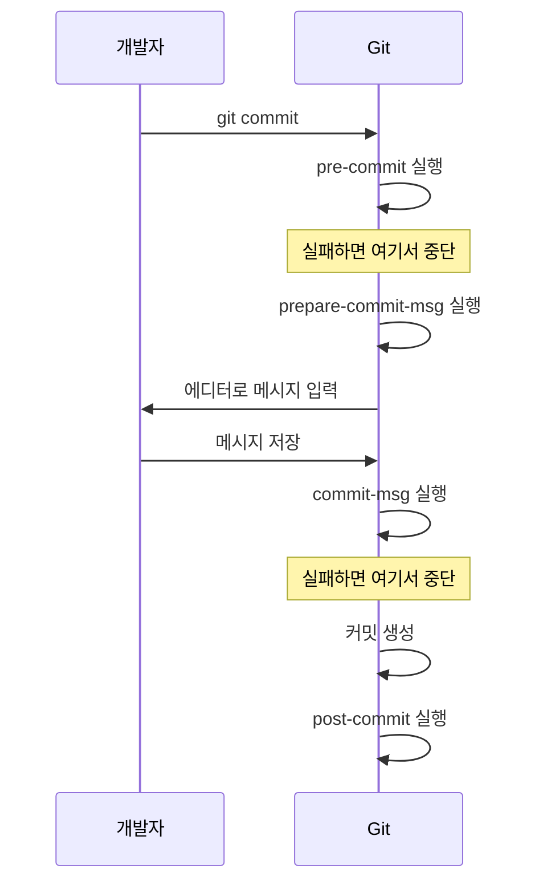
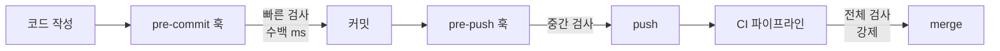

# Git Hooks 실무

Git은 특정 시점에 스크립트를 자동 실행하는 훅(hook)을 제공한다. 커밋 직전에 린트를 돌리거나, 커밋 메시지 형식을 검사하거나, push 전에 테스트를 돌리는 식이다. 실무에서 훅을 쓰는 이유는 하나다. "규칙을 사람이 지키기를 기대하지 말고 기계가 강제하게 만든다." 리뷰에서 "여기 세미콜론 빠졌어요" 같은 지적을 반복하는 게 지겨우면 훅으로 막는 게 낫다.

문제는 훅이 생각보다 손이 많이 간다는 것이다. `.git/hooks`는 clone으로 공유되지 않아서 팀원마다 따로 설치해야 하고, 훅이 느리면 커밋할 때마다 몇 초씩 기다려야 해서 결국 `--no-verify`로 우회하는 사람이 생긴다. 이 문서는 훅의 종류와 동작 방식보다 이런 실무 문제를 어떻게 다루는지에 초점을 맞춘다.

## 훅이 저장되는 위치

`git init`을 하면 `.git/hooks` 디렉토리에 샘플 파일들이 깔린다.

```bash
$ ls .git/hooks
applypatch-msg.sample
commit-msg.sample
pre-commit.sample
pre-push.sample
prepare-commit-msg.sample
...
```

전부 `.sample` 확장자가 붙어 있고, 이 상태로는 실행되지 않는다. 확장자를 떼고 실행 권한(`chmod +x`)을 줘야 Git이 인식한다. 파일명이 곧 훅 이름이라 `pre-commit`이라는 이름의 실행 가능한 파일이 있으면 커밋 직전에 자동으로 돌아간다.

```bash
$ cd .git/hooks
$ mv pre-commit.sample pre-commit   # 확장자 제거
$ chmod +x pre-commit               # 실행 권한
```

내용은 셸 스크립트든 파이썬이든 상관없다. 첫 줄 shebang(`#!/bin/sh`, `#!/usr/bin/env python3` 등)만 맞으면 그 인터프리터로 실행된다. 종료 코드가 0이 아니면 Git은 해당 동작(커밋, push 등)을 중단한다. 이 "0이 아니면 중단"이 훅의 핵심 동작이다.

## 자주 쓰는 로컬 훅

로컬 훅은 개발자 각자의 머신에서 도는 훅이다. 실무에서 손대는 건 대부분 이 세 개다.

### pre-commit

커밋 메시지를 입력하기 전, 스테이징된 내용으로 커밋이 만들어지기 직전에 실행된다. 린트, 포매터, 간단한 테스트를 여기서 돌린다. 종료 코드가 0이 아니면 커밋 자체가 취소된다.

```bash
#!/bin/sh
# 스테이징된 JS 파일에 console.log가 있으면 커밋 막기
if git diff --cached --name-only | grep '\.js$' | xargs grep -n 'console\.log' 2>/dev/null; then
  echo "console.log가 남아있다. 지우고 다시 커밋해라."
  exit 1
fi
```

여기서 중요한 건 `--cached`(스테이징된 것만)와 working tree(실제 파일)의 차이다. 스테이징하지 않은 변경까지 검사하면, 방금 고쳤지만 아직 `git add` 안 한 코드까지 잡혀서 혼란스럽다. 훅은 실제로 커밋될 내용, 즉 스테이징된 것만 봐야 한다. 이 부분은 뒤의 lint-staged에서 다시 다룬다.

### commit-msg

커밋 메시지가 입력된 직후, 커밋이 확정되기 직전에 실행된다. 인자로 커밋 메시지가 담긴 임시 파일 경로를 받는다. 메시지 형식을 강제할 때 쓴다. Conventional Commits(`feat:`, `fix:` 같은 접두사)를 팀 규칙으로 정했으면 여기서 검사한다.

```bash
#!/bin/sh
# 커밋 메시지가 "type: 설명" 형식인지 검사
msg_file=$1
first_line=$(head -n1 "$msg_file")

if ! echo "$first_line" | grep -qE '^(feat|fix|docs|refactor|test|chore)(\(.+\))?: .+'; then
  echo "커밋 메시지 형식이 틀렸다: $first_line"
  echo "예) feat: 로그인 기능 추가"
  exit 1
fi
```

`$1`로 넘어오는 파일에는 사용자가 방금 입력한 메시지가 들어있다. 이 파일을 읽어서 검사하거나, 덮어써서 메시지를 자동 수정할 수도 있다. 이슈 번호를 브랜치명에서 뽑아 메시지 앞에 자동으로 붙이는 용도로도 쓴다.

### pre-push

로컬 커밋을 원격으로 push하기 직전에 실행된다. push는 커밋보다 덜 자주 하니까, 커밋마다 돌리기엔 무거운 작업(전체 테스트, 빌드)을 여기에 두는 경우가 있다. 표준입력으로 push되는 ref 정보가 들어온다.

```bash
#!/bin/sh
# main 브랜치로 직접 push하는 걸 막기
protected_branch='main'
current_branch=$(git symbolic-ref --short HEAD)

if [ "$current_branch" = "$protected_branch" ]; then
  echo "main으로 직접 push하지 마라. PR을 열어라."
  exit 1
fi
```

다만 pre-push에 전체 테스트를 넣으면 push할 때마다 몇 분씩 기다려야 해서 불만이 나온다. 무거운 검증은 pre-push보다 CI에 두는 게 낫다. 이유는 뒤에서 설명한다.

### 실행 순서

커밋 한 번에 여러 훅이 순서대로 돈다.



`post-commit`처럼 이름에 `post`가 붙은 훅은 이미 동작이 끝난 뒤에 도는 알림용이라, 종료 코드로 동작을 막을 수 없다.

## 서버측 훅

지금까지는 로컬 훅이었다. 원격 저장소(bare repository) 쪽에도 훅이 있다. push를 받는 서버에서 도는 훅이라 개발자가 우회할 수 없다는 게 로컬 훅과 결정적으로 다르다.

- `pre-receive` — push를 받기 시작할 때 한 번 실행. 전체 push를 통째로 거부할 수 있다.
- `update` — push되는 ref(브랜치)마다 한 번씩 실행. 특정 브랜치만 보호할 때 쓴다.
- `post-receive` — push가 다 받아진 뒤 실행. 배포 트리거나 알림에 쓴다.

서버측 훅은 자체 호스팅 Git 서버(Gitea, 직접 운영하는 bare repo)를 쓸 때나 직접 만진다. GitHub/GitLab을 쓰면 서버 훅에 직접 접근할 수 없고, 대신 branch protection rule, required status check, push rule 같은 웹 UI 설정이 서버측 훅 역할을 대신한다. 실무에서 "main 브랜치 보호", "리뷰 승인 없이 merge 금지" 같은 걸 GitHub 설정으로 거는 게 사실상 서버측 훅을 대체하는 것이다.

로컬 훅은 개발자가 `--no-verify`로 건너뛸 수 있으니 강제력이 없다. 진짜로 막아야 하는 규칙(보호 브랜치, 필수 검사)은 서버측, 즉 CI나 branch protection에 둬야 한다. 이 역할 분담이 훅 설계의 핵심이다.

## .git/hooks가 공유되지 않는 문제

훅을 처음 팀에 도입하려는 사람이 반드시 부딪히는 벽이다. `.git` 디렉토리는 clone할 때 따라오지 않는다. 그래서 내가 아무리 좋은 pre-commit 훅을 만들어도, 팀원이 clone하면 그 훅은 없다. `.git/hooks`에 있는 스크립트는 나만 갖고 있는 것이다.

이걸 해결하는 방법이 몇 가지 있다.

### core.hooksPath로 디렉토리 옮기기

Git 2.9부터 `core.hooksPath` 설정으로 훅 디렉토리 위치를 바꿀 수 있다. 훅 스크립트를 `.git/hooks` 대신 저장소 안의 추적되는 디렉토리(예: `.githooks`)에 두면 clone으로 같이 딸려온다.

```bash
$ mkdir .githooks
$ mv my-pre-commit .githooks/pre-commit
$ chmod +x .githooks/pre-commit
$ git config core.hooksPath .githooks
```

이제 `.githooks` 디렉토리를 커밋하면 훅 스크립트 자체는 공유된다. 하지만 `git config core.hooksPath .githooks` 이 설정 명령은 각자 한 번씩 실행해줘야 한다. 이 설정은 `.git/config`에 저장되고, 그건 clone으로 공유되지 않기 때문이다.

그래서 보통 이 설정을 자동화한다. `package.json`의 `postinstall`이나 셋업 스크립트에 넣어서, 프로젝트를 처음 세팅할 때 자동으로 걸리게 한다.

```json
{
  "scripts": {
    "prepare": "git config core.hooksPath .githooks"
  }
}
```

`npm install`을 하면 `prepare`가 돌면서 설정이 걸린다. 이게 husky가 내부적으로 하는 일과 거의 같다.

### 왜 설정 한 줄까지 자동화해야 하나

"설정 명령 한 번 실행하는 걸 README에 적어두면 되지 않나"라고 생각할 수 있는데, 실제로 해보면 안 된다. 새로 합류한 사람은 README를 끝까지 안 읽고, 읽어도 그 줄을 건너뛴다. 훅이 안 걸린 채로 몇 주가 지나면 그 사람 커밋만 규칙을 안 지킨 상태가 된다. 설치를 사람 손에 맡기면 반드시 새는 구멍이 생긴다. `npm install` 한 번으로 자동으로 걸리게 만들어야 실제로 팀 전체에 적용된다.

## 훅 프레임워크

훅을 직접 셸 스크립트로 관리하면 위에서 본 설치·공유 문제를 매번 손으로 처리해야 한다. 이걸 대신 해주는 프레임워크가 있다.

### husky (JS 프로젝트)

Node 진영에서 표준처럼 쓴다. `npm install`할 때 훅을 자동으로 설치해준다.

```bash
$ npm install --save-dev husky
$ npx husky init
```

`husky init`을 하면 `.husky` 디렉토리가 생기고, `package.json`에 `"prepare": "husky"`가 추가된다. 이 `prepare` 스크립트가 `npm install`마다 돌면서 `core.hooksPath`를 `.husky`로 걸어준다. 앞에서 손으로 하던 걸 husky가 대신 해주는 것이다.

훅을 추가하려면 `.husky/pre-commit` 파일을 만들고 실행할 명령을 적으면 된다.

```bash
# .husky/pre-commit
npx lint-staged
```

버전 주의사항이 하나 있다. husky v9에서 훅 파일 형식이 바뀌었다. v8 이하에서 쓰던 `#!/usr/bin/env sh`와 `. "$(dirname -- "$0")/_/husky.sh"` 헤더가 v9에서는 필요 없어졌다. 오래된 블로그 글을 보고 따라 하면 형식이 안 맞아서 헤맬 수 있으니, husky 버전을 먼저 확인해라.

### lint-staged

husky만으로는 pre-commit에서 "무엇을 검사할지"를 정해야 한다. 전체 파일에 린트를 돌리면 커밋과 상관없는 파일까지 검사해서 느리고, 남이 만든 기존 오류까지 내 커밋을 막는다. lint-staged는 스테이징된 파일에만 명령을 돌린다.

```json
{
  "lint-staged": {
    "*.{js,ts}": ["eslint --fix", "prettier --write"],
    "*.css": ["prettier --write"]
  }
}
```

이렇게 두면 pre-commit에서 `npx lint-staged`가 돌 때, 이번 커밋에 포함된 JS/TS 파일에만 eslint와 prettier를 적용한다. `--fix`, `--write`로 자동 수정된 결과는 lint-staged가 알아서 다시 스테이징한다. 커밋 대상만 검사하니까 빠르고, 남의 코드 때문에 내 커밋이 막히는 일도 없다.

husky + lint-staged 조합이 실무에서 가장 흔하다. husky가 훅 설치·공유를 맡고, lint-staged가 "커밋되는 파일만 검사" 부분을 맡는 역할 분담이다.

### pre-commit 프레임워크 (언어 무관)

파이썬으로 만들어졌지만 언어에 상관없이 쓸 수 있는 도구다. 이름이 훅 이름 `pre-commit`과 같아서 헷갈리는데, 별개의 프레임워크다. 저장소 루트에 `.pre-commit-config.yaml`을 두고 검사 규칙을 선언한다.

```yaml
repos:
  - repo: https://github.com/pre-commit/pre-commit-hooks
    rev: v4.5.0
    hooks:
      - id: trailing-whitespace
      - id: end-of-file-fixer
      - id: check-yaml
```

```bash
$ pip install pre-commit
$ pre-commit install   # .git/hooks/pre-commit 생성
```

husky와 달리 미리 만들어진 검사 규칙(hook)을 조합해 쓰는 방식이라, 흔한 검사(공백 정리, YAML 문법 검사, 시크릿 탐지)는 직접 스크립트를 안 짜도 된다. 파이썬/멀티 언어 프로젝트에서 많이 쓴다. 다만 이것도 `pre-commit install`을 각자 한 번 실행해야 하는 건 마찬가지다.

## 훅이 느려서 커밋이 답답한 문제

훅을 도입하고 나면 자주 나오는 불만이 "커밋할 때마다 5초씩 걸린다"이다. 커밋은 하루에 수십 번 하는데 그때마다 기다리면 흐름이 끊긴다. 이게 심해지면 사람들이 `--no-verify`로 훅을 통째로 건너뛰기 시작하고, 그러면 훅을 만든 의미가 없어진다.

느려지는 원인은 대부분 이거다.

- pre-commit에서 전체 파일을 검사한다 → lint-staged로 스테이징된 파일만 검사하게 바꾼다.
- pre-commit에서 무거운 작업(전체 테스트, 타입 체크 전체, 빌드)을 돌린다 → 이건 커밋 단위로 돌릴 게 아니다. pre-push로 옮기거나 CI로 넘긴다.
- 린터가 매번 전체 프로젝트를 콜드 스타트한다 → 캐시 옵션(`eslint --cache`)을 켠다.

원칙은 "커밋에서 도는 훅은 몇 백 밀리초 안에 끝나야 한다"이다. 커밋은 자주 하는 동작이라 여기에 무거운 걸 넣으면 반드시 우회당한다. 무거운 검증일수록 뒤쪽(pre-push, CI)으로 미뤄야 한다.

## --no-verify의 함정

`git commit --no-verify`(짧게 `-n`)를 쓰면 pre-commit과 commit-msg 훅을 건너뛴다. push에서는 `git push --no-verify`가 pre-push를 건너뛴다.

정당한 용도가 있긴 하다. 훅에 버그가 있어서 정상 커밋을 막을 때, 급하게 hotfix를 넣어야 하는데 린트가 무관한 걸로 막을 때 등이다. 문제는 이게 습관이 되는 것이다. 한 번 `--no-verify`로 편하게 넘기기 시작하면 훅이 잔소리처럼 느껴져서 계속 건너뛰게 된다.

여기서 얻는 교훈이 두 개다.

첫째, 로컬 훅은 강제 수단이 아니라 편의 수단이다. `--no-verify`로 언제든 우회할 수 있으니, 훅만으로 코드 품질을 보장할 수 없다. 훅은 "실수를 커밋 전에 잡아주는 도구"지 "규칙을 강제하는 장치"가 아니다.

둘째, 진짜로 막아야 하는 건 CI에서 막아야 한다. 로컬에서 `--no-verify`로 린트를 건너뛰고 push해도, CI에서 같은 린트가 돌아서 PR을 막으면 결국 고쳐야 한다. 로컬 훅은 빠른 피드백용, CI는 강제용. 이 이중 구조가 정상이다.

## 훅과 CI의 역할 분담

같은 검사(린트, 테스트)를 로컬 훅과 CI 양쪽에서 돌리는 게 낭비처럼 보일 수 있는데, 역할이 다르다.



로컬 훅은 빠른 피드백이 목적이다. 오타 수준의 린트 오류를 커밋 전에 잡아서, CI까지 갔다가 빨간불 보고 돌아오는 왕복 시간을 줄인다. 몇 백 밀리초 안에 끝나는 가벼운 검사만 둔다.

CI는 강제가 목적이다. `--no-verify`로 우회할 수 없고, 실행 환경이 개발자 머신과 무관하게 일정하다. 전체 테스트, 전체 빌드, 통합 테스트처럼 무겁지만 반드시 통과해야 하는 검사를 여기에 둔다. branch protection으로 "CI 통과 안 하면 merge 금지"를 걸면 이게 진짜 방어선이 된다.

정리하면 이렇게 나눈다.

- 로컬 훅(pre-commit): 포매팅, 린트, 스테이징된 파일 대상 — 빠르고 자주
- 로컬 훅(pre-push): 관련 테스트 정도 — 무겁지 않게, 선택적으로
- CI: 전체 테스트, 빌드, 보안 스캔 — 느려도 되고, 우회 불가

로컬 훅에서 하는 검사는 CI 검사의 부분집합이어야 한다. 로컬에서 통과한 게 CI에서 떨어지면 개발자가 혼란스럽고, 반대로 로컬에만 있고 CI에 없는 검사는 훅이 없는 사람(clone만 하고 설정 안 한 사람)에게는 아예 적용되지 않는다. 로컬 훅은 CI를 앞당겨 실행하는 미리보기라고 보면 된다.

## 정리

- 훅은 `.git/hooks`에 있고 clone으로 공유되지 않는다. `core.hooksPath`로 추적되는 디렉토리에 옮기고, 그 설정을 `npm install` 등으로 자동화해야 팀 전체에 걸린다.
- husky + lint-staged가 JS 진영 표준, pre-commit 프레임워크가 언어 무관 선택지다. 공통 목표는 "설치를 사람 손에 맡기지 않는 것"이다.
- 커밋에서 도는 훅은 가볍게 유지한다. 무거우면 `--no-verify`로 우회당하고, 그러면 훅이 무의미해진다.
- 로컬 훅은 빠른 피드백, CI는 강제. 진짜 방어선은 CI와 branch protection이다. 훅은 그걸 앞당겨 보여주는 편의 장치다.
