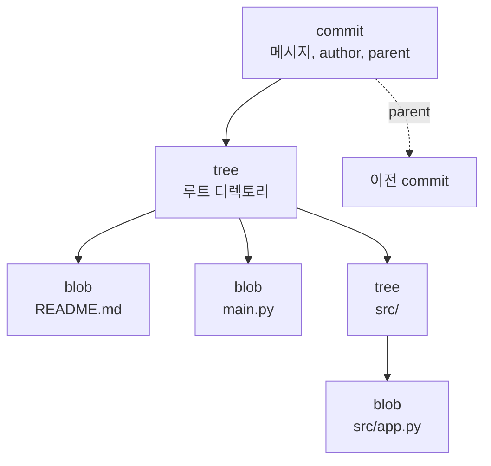
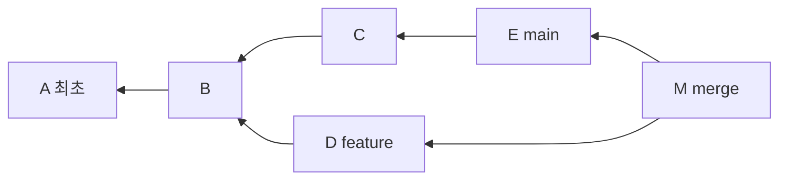
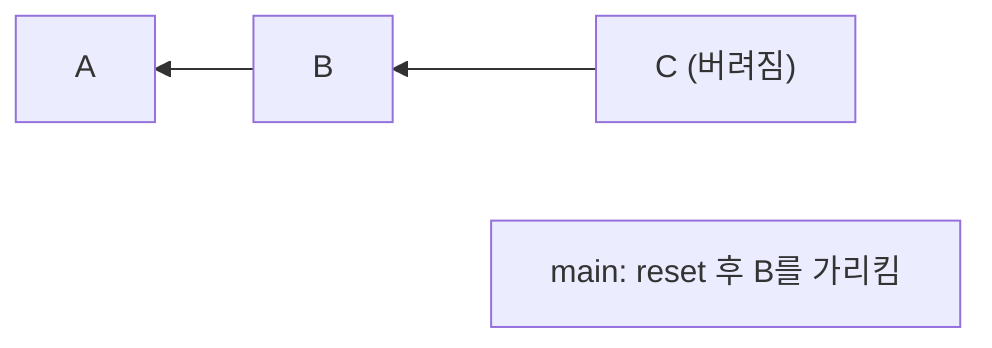
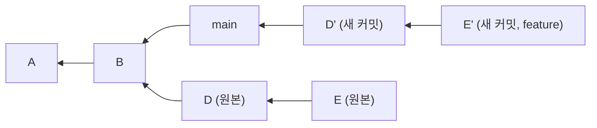

# Git 내부 구조

명령어를 외워서 쓰다 보면 언젠가 벽에 부딪힌다. reset --hard로 날린 커밋이 왜 reflog로 복구되는지, rebase가 왜 커밋 해시를 전부 바꾸는지, force push가 뭘 덮어쓰는 건지. 이런 건 명령어 설명서만 봐서는 이해가 안 된다. Git이 데이터를 어떻게 저장하는지 알면 이 명령어들이 전부 같은 오브젝트 모델 위에서 도는 몇 가지 조작에 불과하다는 게 보인다.

이 문서는 `.git` 디렉토리 안을 직접 열어보면서 Git이 실제로 뭘 저장하는지 확인한다. [Git 자주 사용하는 명령어](Git_자주_사용하는_명령어.md) 문서에서 다룬 reset, rebase, reflog가 왜 그렇게 동작하는지를 여기서 오브젝트 관점으로 설명한다.

## .git 디렉토리

`git init`을 하면 `.git` 디렉토리가 생긴다. Git이 관리하는 모든 것은 여기 들어있다. 이 디렉토리를 통째로 지우면 버전 관리 이력이 전부 사라지고, 반대로 이 디렉토리만 있으면 working tree는 언제든 복원된다.

```bash
$ git init test && cd test
$ ls -la .git
HEAD
config
description
hooks/
info/
objects/
refs/
```

실무에서 알아둘 게 몇 개 있다.

- `objects/` — 실제 데이터가 저장되는 곳. blob, tree, commit이 전부 여기 들어간다. 저장소 용량의 대부분이 여기다.
- `refs/` — 브랜치와 태그. `refs/heads/`에 로컬 브랜치, `refs/tags/`에 태그, `refs/remotes/`에 원격 추적 브랜치가 있다.
- `HEAD` — 지금 어느 브랜치에 있는지 가리키는 파일. 텍스트 파일이라 열어보면 `ref: refs/heads/main` 한 줄이다.
- `config` — 저장소별 설정. `git config --local`로 바꾸는 게 여기 쓰인다.
- `logs/` — reflog가 저장되는 곳. 처음엔 없다가 커밋이나 브랜치 이동이 생기면 만들어진다.

`.git/config`나 `HEAD`는 그냥 텍스트 파일이라 에디터로 열어도 된다. 반면 `objects/` 안은 압축된 바이너리라 직접 열면 안 되고 Git 명령으로 봐야 한다.

## 오브젝트 세 종류

Git의 데이터 모델은 단순하다. 오브젝트 세 종류가 전부다. blob, tree, commit. (태그를 별도 오브젝트로 치면 네 종류지만 실무에서 내부를 들여다볼 일은 앞의 셋이다.)

모든 오브젝트는 내용을 SHA-1로 해싱한 40자리 해시로 식별된다. 내용이 같으면 해시가 같고, 한 글자만 달라도 완전히 다른 해시가 나온다. 이게 Git이 중복을 자동으로 제거하고 무결성을 보장하는 방식이다.

### blob — 파일 내용

blob은 파일의 내용만 담는다. 파일 이름도, 권한도, 경로도 없다. 순수하게 바이트 덩어리다.

```bash
$ echo "hello git" | git hash-object --stdin
8d0e41234f24b6da002d962a26c2495ea16a425f
```

`hash-object`는 내용을 받아서 blob 해시를 계산한다. `-w`를 붙이면 계산만 하는 게 아니라 실제로 `objects/`에 써넣는다.

```bash
$ echo "hello git" | git hash-object -w --stdin
8d0e41234f24b6da002d962a26c2495ea16a425f
$ ls .git/objects/8d/
0e41234f24b6da002d962a26c2495ea16a425f
```

해시 앞 2자리가 디렉토리 이름, 나머지 38자리가 파일 이름이 된다. `objects/8d/0e41...` 이런 식이다. 파일이 많아도 디렉토리 하나에 몰리지 않게 나누는 것이다.

여기서 중요한 점. 같은 내용의 파일이 저장소 안에 100개 있어도 blob은 하나만 저장된다. 내용이 같으면 해시가 같으니까. 그래서 같은 파일을 여러 디렉토리에 복사해도 저장소 용량이 그만큼 늘지 않는다.

### tree — 디렉토리 구조

blob에는 파일 이름이 없다고 했다. 이름과 구조를 담는 게 tree다. tree는 디렉토리 하나에 대응하고, 그 안에 어떤 파일(blob)과 하위 디렉토리(tree)가 있는지를 목록으로 가진다.

```bash
$ git ls-tree HEAD
100644 blob 8d0e41234f24b6da002d962a26c2495ea16a425f    README.md
100644 blob a1b2c3...    main.py
040000 tree f4e5d6...    src
```

각 줄이 담는 것은 권한, 오브젝트 타입, 해시, 이름이다. `100644`는 일반 파일, `100755`는 실행 파일, `040000`은 디렉토리(하위 tree)다. tree가 blob과 다른 tree를 가리키는 구조라, 프로젝트 전체 디렉토리 구조가 tree의 중첩으로 표현된다.

정리하면 blob은 파일 내용, tree는 그 내용에 이름과 계층을 붙인 것이다. 파일 시스템으로 치면 blob이 inode의 데이터, tree가 디렉토리 엔트리에 해당한다.

### commit — 스냅샷 + 메타데이터

commit은 tree 하나를 가리킨다. 그 tree가 그 커밋 시점의 프로젝트 전체 스냅샷이다. 여기에 부모 커밋, 작성자, 커밋 메시지가 붙는다.

```bash
$ git cat-file -p HEAD
tree 9c8d7e6f5a4b3c2d1e0f...
parent 3f2e1d0c9b8a7654321...
author GYUTORY <azure0563@gmail.com> 1719800000 +0900
committer GYUTORY <azure0563@gmail.com> 1719800000 +0900

첫 커밋 메시지
```

commit이 가진 것을 보자.

- `tree` — 이 커밋의 스냅샷. 프로젝트 루트 디렉토리에 대응하는 tree.
- `parent` — 부모 커밋의 해시. 첫 커밋은 parent가 없고, merge 커밋은 parent가 둘 이상이다.
- `author` / `committer` — 작성자와 커밋한 사람. rebase나 amend를 하면 author는 유지되고 committer만 바뀐다.
- 메시지 — 빈 줄 다음부터가 커밋 메시지.

여기서 흔한 오해 하나. 커밋은 "변경사항(diff)"을 저장하지 않는다. 커밋은 그 시점의 전체 스냅샷(tree)을 가리킨다. `git show`나 `git diff`가 보여주는 diff는 부모 커밋의 tree와 현재 tree를 비교해서 그때그때 계산하는 것이지, 저장돼 있는 게 아니다. Git이 diff 기반이 아니라 스냅샷 기반이라는 점이 다른 버전 관리 도구와 다른 부분이다.

### 오브젝트 관계

세 오브젝트가 어떻게 물려 있는지 그림으로 보면 이렇다.



commit이 tree를 가리키고, tree가 blob과 하위 tree를 가리킨다. commit은 parent로 이전 commit을 가리킨다. 이 포인터 구조가 Git 저장소 전체다.

## HEAD와 refs는 그냥 포인터다

여기가 Git을 이해하는 핵심이다. 브랜치는 무거운 실체가 아니다. 특정 커밋 해시를 가리키는 40바이트짜리 텍스트 파일 한 개일 뿐이다.

```bash
$ cat .git/refs/heads/main
3f2e1d0c9b8a765432109876543210fedcba9876
```

`main` 브랜치의 정체가 이거다. 커밋 해시 한 줄이 든 파일. `git branch feature`로 브랜치를 만드는 건 같은 해시가 든 파일 하나(`refs/heads/feature`)를 더 만드는 것뿐이라 즉시 끝난다. 브랜치를 100개 만들어도 저장소 용량은 거의 안 는다. 파일 100개가 각각 40바이트니까.

HEAD는 "지금 내가 어느 브랜치에 있는지"를 가리킨다.

```bash
$ cat .git/HEAD
ref: refs/heads/main
```

HEAD가 `refs/heads/main`을 가리키고, `main`이 커밋 해시를 가리킨다. 이 간접 참조 구조를 알면 여러 동작이 한 번에 설명된다.

- `git checkout feature` — HEAD 파일 내용을 `ref: refs/heads/feature`로 바꾼다. 그다음 working tree를 그 커밋의 tree에 맞춰 갈아끼운다.
- `git commit` — 새 commit 오브젝트를 만들고, **현재 브랜치 ref 파일**의 내용을 새 커밋 해시로 갱신한다. 브랜치가 새 커밋으로 한 칸 전진한다.
- **detached HEAD** — HEAD가 `ref: ...` 대신 커밋 해시를 직접 담고 있는 상태. `git checkout <해시>`로 커밋을 직접 체크아웃하면 이렇게 된다. 이 상태에서 커밋하면 어느 브랜치도 그 커밋을 가리키지 않아서, 브랜치를 만들어두지 않고 다른 데로 이동하면 그 커밋을 잃어버린다.

`git rev-parse`로 ref가 실제로 어떤 해시로 풀리는지 확인할 수 있다.

```bash
$ git rev-parse HEAD          # HEAD가 최종적으로 가리키는 커밋 해시
3f2e1d0c9b8a765432109876543210fedcba9876
$ git rev-parse main          # main 브랜치가 가리키는 해시
3f2e1d0c9b8a765432109876543210fedcba9876
$ git rev-parse HEAD~2        # HEAD의 두 번째 부모
7a6b5c4d...
$ git rev-parse --short HEAD  # 짧은 해시
3f2e1d0
```

`HEAD~2`, `HEAD^`, `main@{2}` 같은 표기를 실제 해시로 바꿔주는 게 `rev-parse`다. 스크립트에서 커밋 해시가 필요할 때 자주 쓴다.

## 히스토리는 DAG다

commit이 parent를 가리킨다고 했다. 커밋들을 parent 방향으로 이으면 그래프가 된다. 방향이 있고(자식→부모) 순환이 없어서(과거로만 감) 방향성 비순환 그래프, DAG다.



이 그래프가 Git 히스토리의 실체다. 몇 가지가 이 구조에서 바로 나온다.

- 브랜치는 이 그래프 위 한 노드를 가리키는 포인터다. `main`은 E를, `feature`는 D를 가리킨다.
- merge 커밋(M)은 parent가 둘이다. 두 갈래를 다시 합친 지점이다.
- 두 브랜치의 공통 조상(여기선 B)을 Git이 찾아서 merge나 rebase의 기준으로 삼는다.
- `git log`는 이 그래프를 특정 커밋에서 시작해 parent 방향으로 훑는 것이다. `git log --graph --oneline`으로 보면 이 그래프 모양이 그대로 나온다.

커밋 해시가 내용에서 나온다는 걸 여기 대입하면 중요한 성질이 하나 나온다. commit 해시는 tree, parent, author, 메시지를 전부 포함해서 계산된다. 그래서 **부모가 바뀌면 자식 커밋의 해시도 바뀐다.** rebase가 커밋 해시를 전부 새로 만드는 이유가 이거다. 뒤에서 다시 본다.

## reset, rebase, reflog를 오브젝트로 설명하기

명령어 문서에서 "reset은 되돌리기, rebase는 히스토리 정리"라고 기능으로 설명했다. 여기서는 이 명령들이 오브젝트 모델 위에서 실제로 뭘 하는지 본다. 알고 나면 왜 그렇게 동작하는지, 왜 어떤 건 복구되고 어떤 건 안 되는지가 명확해진다.

### reset은 브랜치 포인터를 옮기는 것

`git reset`의 본질은 **현재 브랜치 ref가 가리키는 커밋을 다른 커밋으로 바꾸는 것**이다. 브랜치가 그냥 포인터라는 걸 알면 reset이 이해된다.

`git reset --hard HEAD~1`을 하면:

1. 현재 브랜치 ref 파일(`refs/heads/main`)의 내용을 `HEAD~1`의 해시로 덮어쓴다. 포인터가 한 칸 뒤로 간다.
2. `--hard`니까 working tree와 staging area도 그 커밋의 tree 상태로 갈아끼운다.

여기서 핵심. reset은 커밋 오브젝트를 지우지 않는다. 단지 브랜치가 그 커밋을 안 가리키게 될 뿐이다. `HEAD~1`로 옮기면 원래 가리키던 커밋은 `objects/`에 그대로 남아있다. 다만 아무 브랜치도 그걸 안 가리켜서 `git log`에 안 보일 뿐이다.



reset 전엔 main이 C를 가리켰다. `reset --hard HEAD~1` 후엔 main이 B를 가리킨다. C는 오브젝트로 남아있지만 도달 경로가 없어졌다. 이렇게 어느 ref로도 도달 못 하는 커밋을 dangling(매달린) 커밋이라 한다.

`--soft`, `--mixed`, `--hard`의 차이도 이 관점에서 정리된다. 셋 다 브랜치 포인터를 옮기는 건 같고, working tree와 staging을 어디까지 건드리냐만 다르다.

- `--soft` — 포인터만 옮긴다. staging, working tree 그대로. 그래서 방금 커밋한 변경이 staged 상태로 남는다.
- `--mixed` (기본) — 포인터 옮기고 staging도 리셋. working tree는 그대로. 변경이 unstaged로 남는다.
- `--hard` — 포인터 옮기고 staging, working tree 전부 그 커밋 상태로. 변경이 사라진다.

`--hard`로 날린 커밋이 복구되는 건 오브젝트가 안 지워졌기 때문이다. 그 해시만 알면 다시 브랜치로 가리킬 수 있다. 그 해시를 어떻게 찾느냐가 reflog다.

### reflog는 HEAD 이동 기록이다

`.git/logs/HEAD`를 열어보면 HEAD가 지금까지 어떤 커밋들을 거쳐왔는지 한 줄씩 기록돼 있다.

```bash
$ git reflog
3f2e1d0 HEAD@{0}: reset: moving to HEAD~1
9c8d7e6 HEAD@{1}: commit: 방금 날린 커밋
7a6b5c4 HEAD@{2}: commit: 그 전 커밋
```

commit, reset, checkout, rebase 등으로 HEAD가 움직일 때마다 Git이 여기 이전 위치를 기록한다. 그래서 `reset --hard`로 브랜치가 C를 안 가리키게 됐어도, reflog엔 방금 전 HEAD가 C(`9c8d7e6`)였다는 기록이 남는다.

복구는 그 해시를 다시 브랜치로 가리키게 하면 된다.

```bash
$ git reset --hard HEAD@{1}      # 방금 전 위치로 되돌림
# 또는
$ git reset --hard 9c8d7e6       # dangling 커밋 해시를 직접 지정
```

reflog가 로컬 기록이라는 점이 중요하다. `.git/logs/`에 있어서 push되지 않고, clone에도 안 따라온다. 남의 저장소에서 날아간 커밋은 내 reflog로 못 살린다. 그리고 reflog 엔트리는 기본 90일(도달 불가 커밋은 30일) 지나면 gc가 정리한다. 그 뒤엔 오브젝트도 진짜로 지워질 수 있다. 그래서 "reset --hard로 날려도 복구된다"는 건 그날 안에, 로컬에서, gc 돌기 전이라는 조건이 붙는다.

### rebase는 커밋을 새로 만드는 것

rebase가 커밋 해시를 전부 바꾸는 게 처음엔 당황스럽다. 오브젝트 모델을 알면 당연한 결과다.

`git rebase main`을 feature 브랜치에서 하면, feature의 각 커밋을 main 끝에 하나씩 다시 얹는다. "다시 얹는다"는 건 부모를 바꾼다는 뜻이다. 그런데 앞에서 봤듯이 commit 해시는 parent를 포함해서 계산된다. 부모가 바뀌면 해시가 바뀐다. 그래서 rebase는 기존 커밋을 옮기는 게 아니라, 내용은 같지만 부모가 다른 **새 커밋 오브젝트를 만든다.**



원래 feature는 D→E였다(부모가 B 쪽). rebase 후 feature는 D'→E'가 된다(부모가 main 쪽). D'와 E'는 D, E와 코드 변경 내용은 같지만 부모가 달라서 해시가 다른 새 오브젝트다. 원본 D, E는 dangling 커밋으로 남는다. 그래서 rebase도 잘못되면 reflog로 원본 커밋 해시를 찾아 되돌릴 수 있다.

이 성질에서 실무 규칙이 나온다. 이미 push해서 남이 받아간 커밋을 rebase하면, 내 쪽 커밋 해시가 전부 바뀌어서 원격과 히스토리가 어긋난다. 그래서 force push를 해야 하고, 남들은 옛날 해시 기준으로 작업하고 있어서 꼬인다. rebase를 push 안 한 로컬 커밋에만 쓰라는 이유가 이거다. 명령어 문서에서 규칙으로만 언급한 걸 여기서 해시 관점으로 풀면 이 그림이다.

`amend`도 같은 원리다. `git commit --amend`는 마지막 커밋을 고치는 게 아니라 새 커밋 오브젝트를 만들고 브랜치가 그걸 가리키게 한다. 원본은 dangling으로 남는다. 그래서 amend 후에도 일반 push가 거부되고 force push가 필요하다.

## 오브젝트 직접 들여다보기

내부를 확인할 때 쓰는 명령 셋을 정리한다. 문제가 생겼을 때 저장소가 실제로 어떤 상태인지 보는 도구다.

### cat-file — 오브젝트 내용 보기

```bash
$ git cat-file -t 3f2e1d0        # 오브젝트 타입 (commit/tree/blob)
commit
$ git cat-file -s 3f2e1d0        # 오브젝트 크기(바이트)
215
$ git cat-file -p 3f2e1d0        # 오브젝트 내용 출력 (pretty-print)
tree 9c8d7e6...
parent 7a6b5c4...
author ...
```

`-p`가 제일 많이 쓴다. 커밋 해시를 넣으면 tree/parent/메시지가 나오고, tree 해시를 넣으면 그 안의 blob 목록이 나오고, blob 해시를 넣으면 파일 내용이 나온다. 해시만 있으면 오브젝트 그래프를 손으로 타고 내려갈 수 있다.

```bash
# 커밋 → tree → blob 순으로 손으로 타고 내려가기
$ git cat-file -p HEAD | grep tree      # 커밋의 tree 해시 확인
tree 9c8d7e6f...
$ git cat-file -p 9c8d7e6f              # 그 tree의 blob 목록
100644 blob 8d0e412...    README.md
$ git cat-file -p 8d0e412               # 그 blob의 내용
hello git
```

### rev-parse — 참조를 해시로

앞에서 봤듯이 `HEAD`, `main`, `HEAD~2`, `v1.0` 같은 참조를 실제 해시로 바꾼다.

```bash
$ git rev-parse HEAD
$ git rev-parse main~3           # main에서 3칸 위 부모
$ git rev-parse --abbrev-ref HEAD  # 현재 브랜치 이름 (스크립트에서 유용)
main
$ git rev-parse --show-toplevel  # 저장소 루트 경로
/Users/me/project
```

`--abbrev-ref HEAD`로 현재 브랜치 이름을 얻는 건 셸 프롬프트나 CI 스크립트에서 자주 쓴다.

### ls-tree — tree 구조 보기

```bash
$ git ls-tree HEAD               # HEAD 커밋의 루트 tree
$ git ls-tree HEAD src/          # 특정 디렉토리
$ git ls-tree -r HEAD            # 하위 디렉토리까지 재귀적으로 전부
$ git ls-tree -r --name-only HEAD  # 파일 경로만
```

`-r --name-only HEAD`는 특정 커밋 시점에 어떤 파일들이 있었는지 목록을 뽑을 때 쓴다. `git ls-files`가 working tree/staging 기준이라면 `ls-tree`는 커밋된 tree 기준이라는 차이가 있다.

## packfile과 gc

여기까지 보면 커밋 하나 할 때마다 blob, tree, commit 오브젝트가 `objects/`에 파일로 쌓인다. 이걸 loose object(느슨한 오브젝트)라 한다. 파일이 하나씩 있는 상태다. 커밋이 수만 개면 파일도 수만 개가 되고, 게다가 한 글자만 바꿔도 blob 전체가 새로 저장돼서 낭비가 크다.

Git은 이걸 주기적으로 packfile로 압축한다. 여러 오브젝트를 파일 하나(`objects/pack/pack-*.pack`)로 모으고, 비슷한 오브젝트끼리 delta 압축을 한다. 버전 3과 버전 4가 거의 같은 파일이면 전체를 두 번 저장하는 대신 차이만 저장하는 식이다. 스냅샷 기반이라 저장은 통째로 하지만, packfile 단계에서 delta로 공간을 아낀다.

이 정리를 하는 게 `git gc`(garbage collection)다.

```bash
$ git gc              # loose object를 packfile로 모으고 불필요한 것 정리
$ git count-objects -v  # loose object 수와 packfile 상태 확인
count: 12             # loose object 12개
size: 48
in-pack: 340          # packfile 안에 340개
packs: 1
```

gc는 두 가지를 한다. loose object를 packfile로 압축하는 것, 그리고 도달 불가능하고 만료된 오브젝트를 실제로 삭제하는 것. `git commit`, `git fetch` 같은 명령이 내부적으로 조건이 맞으면 자동으로 gc를 돌린다(auto gc).

여기서 앞의 reflog 얘기와 연결된다. reset --hard로 dangling된 커밋은 오브젝트로 남아있어서 복구된다고 했다. 그런데 gc가 돌고, 그 커밋이 reflog 만료 기간(도달 불가 커밋 기본 30일)도 지났으면, gc가 그 오브젝트를 진짜로 지운다. 그 뒤엔 복구가 안 된다. "복구된다"에 시간 제한이 붙는 이유가 gc다.

실무에서 gc를 손으로 칠 일은 드물다. 다만 `.git` 용량이 이상하게 크거나, 히스토리에서 큰 파일을 지웠는데 저장소가 안 줄어들 때 확인용으로 쓴다. 히스토리에서 파일을 지워도 과거 커밋의 tree가 여전히 그 blob을 가리키면 gc가 못 지운다. 이럴 때 오브젝트 모델을 알면 "커밋을 지워야 도달 경로가 끊기고, 그래야 gc가 blob을 지운다"는 게 이해된다.

## 정리하면서

Git 명령어가 헷갈릴 때 오브젝트 모델로 돌아가면 대부분 풀린다. 브랜치는 포인터, 커밋은 스냅샷을 가리키는 오브젝트, 히스토리는 parent로 이어진 DAG. reset은 포인터 이동, rebase는 부모를 바꾼 새 커밋 생성, reflog는 HEAD 이동 기록, gc는 도달 불가 오브젝트 정리.

`cat-file -p`, `rev-parse`, `ls-tree` 세 개만 손에 익혀두면 저장소가 이상해졌을 때 추측하지 않고 실제 상태를 직접 확인할 수 있다. 명령어 사용법은 [Git 자주 사용하는 명령어](Git_자주_사용하는_명령어.md) 문서에 정리돼 있다. 그 문서의 명령들이 여기서 본 오브젝트 조작 위에서 돈다는 걸 알면 명령어를 외우는 게 아니라 이해하게 된다.
