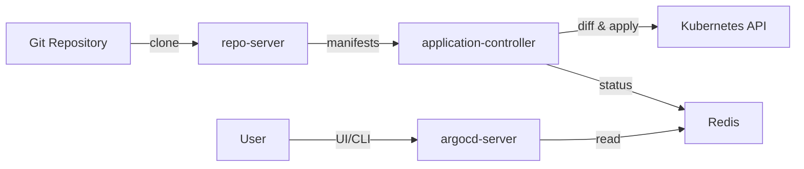

# Argo CD

쿠버네티스 클러스터 수가 늘어나면 `kubectl apply`로 배포를 관리하는 방식은 금방 한계에 부딪친다. 누가 언제 무엇을 바꿨는지 추적이 안 되고, 장애 복구할 때 직전 상태로 되돌릴 방법이 명확하지 않다. Argo CD는 이 문제를 Git 저장소를 단일 진실 원천(SSOT)으로 삼아 해결한다. 클러스터 상태를 Git에 기록된 매니페스트와 지속적으로 비교하고, 차이가 생기면 감지하거나 자동으로 맞춘다.

운영하면서 느끼는 Argo CD의 성격은 "선언적 파이프라인"이다. Jenkins나 GitLab CI처럼 절차를 실행하는 것이 아니라, 원하는 상태를 선언해두면 컨트롤러가 그 상태로 수렴시킨다. 이 차이를 이해하지 못하고 쓰면 "왜 내가 수동으로 바꾼 게 원복되지?" 같은 질문을 하게 된다.

## 전체 구조

Argo CD는 몇 개의 컴포넌트로 나뉜다. 각 컴포넌트의 역할을 알아야 장애가 났을 때 어디를 봐야 할지 감이 온다.

- `argocd-server`: API/UI 서버. RBAC 검사, gRPC/REST 요청 처리
- `argocd-repo-server`: Git 저장소에서 매니페스트를 가져와 렌더링 (Helm template, Kustomize build)
- `argocd-application-controller`: 실제로 클러스터 상태와 Git 상태를 비교하고 sync를 수행
- `argocd-redis`: 캐시 (매니페스트 렌더링 결과, 상태 정보)
- `argocd-dex-server`: SSO 연동용 (OIDC, SAML)
- `argocd-notifications-controller`: Slack/이메일 알림
- `argocd-applicationset-controller`: ApplicationSet CRD 처리



성능 문제 대부분은 `repo-server`와 `application-controller`에서 발생한다. repo-server는 매니페스트 렌더링으로 CPU/메모리를 쓰고, controller는 클러스터 상태 감시로 워치 커넥션을 많이 유지한다. Application이 수백 개를 넘어가면 이 두 컴포넌트가 병목이 된다.

## Application 리소스

Argo CD의 기본 단위는 `Application` CRD다. "어떤 Git 경로의 매니페스트를 어느 클러스터의 어느 네임스페이스에 배포할지"를 정의한다.

```yaml
apiVersion: argoproj.io/v1alpha1
kind: Application
metadata:
  name: payment-api
  namespace: argocd
  finalizers:
    - resources-finalizer.argocd.argoproj.io
spec:
  project: payments
  source:
    repoURL: https://github.com/example/k8s-manifests
    targetRevision: main
    path: apps/payment-api/overlays/prod
  destination:
    server: https://kubernetes.default.svc
    namespace: payment
  syncPolicy:
    automated:
      prune: true
      selfHeal: true
      allowEmpty: false
    syncOptions:
      - CreateNamespace=true
      - PrunePropagationPolicy=foreground
      - ServerSideApply=true
    retry:
      limit: 5
      backoff:
        duration: 5s
        factor: 2
        maxDuration: 3m
```

`finalizers`에 `resources-finalizer.argocd.argoproj.io`를 넣어두지 않으면 Application을 지워도 클러스터 리소스는 남는다. 이것 때문에 "지웠는데 왜 파드가 계속 살아 있지?" 하는 경우가 있다. 반대로 실수로 Application을 지웠을 때 리소스까지 다 날아가면 곤란하니, 프로덕션에서는 `ServerSideDiff`와 같이 Application 삭제 전 확인 절차를 두는 것을 권장한다.

`targetRevision`에 브랜치를 쓰면 브랜치의 HEAD를 따라간다. 태그나 커밋 해시를 고정하면 그 리비전에 머문다. 프로덕션은 태그 기반, 개발은 브랜치 기반으로 운영하는 패턴이 흔하다. HEAD를 따라가면 누군가 브랜치에 푸시하는 순간 바로 배포되므로 통제가 필요한 환경에서는 위험하다.

### source 필드와 multiple sources

Argo CD 2.6부터 `sources` 배열을 지원한다. Helm values는 별도 레포에 두고 차트는 공식 레포에서 가져오는 패턴이 가능해졌다.

```yaml
spec:
  sources:
    - repoURL: https://charts.bitnami.com/bitnami
      chart: postgresql
      targetRevision: 13.2.24
      helm:
        valueFiles:
          - $values/charts/postgres/values-prod.yaml
    - repoURL: https://github.com/example/helm-values
      targetRevision: main
      ref: values
```

`ref: values`로 참조용 source를 선언하고 `$values/...` 문법으로 다른 source의 파일을 values로 사용한다. 이 방식을 쓰기 전에는 values만 바꿔도 Git 서브모듈이나 별도 처리가 필요했는데, 지금은 운영이 깔끔하다.

## Sync 정책

운영에서 가장 많이 실수하는 부분이 sync 정책이다. 옵션 조합에 따라 동작이 크게 달라진다.

### Automated vs Manual

`syncPolicy.automated`가 없으면 Manual 모드다. Git에 변경이 생겨도 자동 배포되지 않고 사용자가 Sync 버튼을 눌러야 한다. 감사가 엄격한 환경이나 릴리스 승인 절차가 있는 환경에서는 Manual이 맞다.

Automated를 켜면 Git 변경이 감지되는 순간 자동으로 적용된다. 폴링 주기는 기본 3분이고 `timeout.reconciliation` 설정으로 조정할 수 있다. Git webhook을 설정하면 거의 즉시 반응한다.

### Prune

`prune: false`(기본값)면 Git에서 리소스를 지워도 클러스터에서는 남는다. 첫 배포에서 이걸 몰라 Git에서 삭제한 Service가 계속 남아 있는 사례가 많다. 프로덕션에서는 `prune: true`를 켜되, 처음 적용할 때 무엇이 지워질지 반드시 확인해야 한다. `prune: true`를 아무 생각 없이 켰다가 레이블이 안 맞아 의도치 않은 리소스가 고아 처리되는 사고가 있었다.

Prune 동작을 세분화하려면 리소스 단위 어노테이션을 쓴다.

```yaml
metadata:
  annotations:
    argocd.argoproj.io/sync-options: Prune=false
```

이 어노테이션을 PVC나 Secret에 붙이면 Git에서 지워져도 클러스터에 남는다. 데이터가 있는 리소스는 보통 `Prune=false`로 빼둔다.

### SelfHeal

`selfHeal: true`를 켜면 누군가 `kubectl edit`으로 직접 수정해도 Argo CD가 Git 상태로 되돌린다. 사람의 수동 개입을 원천 차단하는 것이 목표라면 켜는 게 맞다. 다만 장애 상황에서 긴급 패치를 `kubectl`로 넣었을 때 바로 원복되면 곤란하니, 긴급 대응 절차와 함께 운영해야 한다.

SelfHeal이 반복적으로 돌면 `sync loop`처럼 보인다. 원인 대부분은:

1. 클러스터에 Admission Webhook이 매니페스트를 수정 (예: istio sidecar 주입)
2. Helm 차트가 `generateName` 같은 동적 필드 생성
3. Operator가 CR 스펙을 자동으로 변경

이런 경우 `ignoreDifferences`로 특정 필드를 diff 비교에서 제외한다.

```yaml
spec:
  ignoreDifferences:
    - group: apps
      kind: Deployment
      jsonPointers:
        - /spec/replicas
    - group: ""
      kind: Service
      jqPathExpressions:
        - .spec.clusterIP
```

HPA와 같이 외부에서 replicas를 조정하는 리소스는 `spec.replicas`를 diff에서 빼지 않으면 HPA가 올린 파드를 Argo CD가 다시 내려버린다. 이 함정에 한 번쯤 다 빠진다.

## App of Apps 패턴

Application 수가 늘면 Application 자체를 선언적으로 관리하고 싶어진다. App of Apps는 "Application을 만드는 Application"이다. 루트 Application 하나를 배포하면 그 안에서 여러 Application을 생성한다.

```
manifests/
├── root/
│   └── applications/
│       ├── payment-api.yaml      # Application CRD
│       ├── payment-worker.yaml   # Application CRD
│       └── payment-db.yaml       # Application CRD
└── apps/
    ├── payment-api/
    ├── payment-worker/
    └── payment-db/
```

루트 Application은 `manifests/root/applications` 경로를 바라본다. 하위 Application들은 각각 `manifests/apps/...` 경로를 바라본다. 하위 Application을 추가/삭제하려면 YAML 파일을 추가/삭제하면 된다.

단점은 계층이 깊어질수록 디버깅이 어려워진다는 점이다. 루트가 sync fail 나면 하위는 배포가 안 되는데, 어느 단계에서 막혔는지 UI에서 한 번에 보기 어렵다. 또 루트 Application이 Git에서 사라지면 cascade로 하위가 다 지워질 수 있어서 cascade 처리 정책을 명확히 해야 한다.

App of Apps를 쓸 만한 시점은 Application이 20개쯤 될 때다. 그 전까지는 오히려 직접 선언하는 게 디버깅이 쉽다.

## ApplicationSet

App of Apps의 단점을 해소하려고 도입된 것이 ApplicationSet이다. 템플릿과 Generator로 Application을 동적으로 생성한다. 멀티 클러스터, 멀티 환경 배포에서 강점이 있다.

```yaml
apiVersion: argoproj.io/v1alpha1
kind: ApplicationSet
metadata:
  name: payment-services
  namespace: argocd
spec:
  generators:
    - matrix:
        generators:
          - list:
              elements:
                - cluster: prod-us-east
                  url: https://k8s-prod-us-east.example.com
                - cluster: prod-eu-west
                  url: https://k8s-prod-eu-west.example.com
          - git:
              repoURL: https://github.com/example/k8s-manifests
              revision: main
              directories:
                - path: apps/payment-*
  template:
    metadata:
      name: '{{path.basename}}-{{cluster}}'
    spec:
      project: payments
      source:
        repoURL: https://github.com/example/k8s-manifests
        targetRevision: main
        path: '{{path}}'
      destination:
        server: '{{url}}'
        namespace: payment
      syncPolicy:
        automated:
          prune: true
          selfHeal: true
```

matrix generator로 클러스터 목록과 앱 디렉토리를 교차시켜 Application을 만든다. 위 예제는 앱 3개 × 클러스터 2개 = 6개 Application을 만든다. 클러스터가 늘어도 list에 한 줄 추가하면 끝이다.

Generator 종류:

- `list`: 정적 리스트
- `cluster`: Argo CD에 등록된 클러스터 자동 탐색 (레이블 셀렉터 지원)
- `git`: Git 디렉토리/파일 탐색
- `scm-provider`: GitHub/GitLab의 레포/브랜치 탐색
- `pull-request`: PR별 프리뷰 환경 생성
- `matrix`: 두 generator 조합
- `merge`: generator 결과 병합

pull-request generator는 PR마다 독립 환경을 만드는 데 쓰인다. PR이 닫히면 환경도 자동 삭제된다. 프리뷰 환경 인프라를 직접 만들면 꽤 귀찮은데 이 generator로 간단히 해결된다.

ApplicationSet 운영에서 주의할 점은 `preserveResourcesOnDeletion`이다. 기본값은 false라서 ApplicationSet을 지우면 생성된 Application들이 cascade로 지워지고 리소스까지 날아간다. 실수로 ApplicationSet을 수정했다가 generator 결과가 바뀌어 Application이 무더기로 재생성되는 경우도 있다. 변경 전에는 `--dry-run`으로 어떤 Application이 추가/삭제될지 확인해야 한다.

## Helm/Kustomize 연동

### Helm

Argo CD는 `helm template`을 내부적으로 실행해서 매니페스트를 렌더링한다. Tiller(Helm 2) 같은 서버 컴포넌트는 사용하지 않는다. 이 때문에 Helm hook이 Argo CD의 sync hook과 동작이 다르다.

```yaml
spec:
  source:
    repoURL: https://github.com/example/charts
    targetRevision: main
    path: charts/payment-api
    helm:
      releaseName: payment-api
      valueFiles:
        - values.yaml
        - values-prod.yaml
      values: |
        image:
          tag: v1.2.3
      parameters:
        - name: replicaCount
          value: "5"
      passCredentials: false
      skipCrds: false
```

values 파일을 여러 개 지정하면 뒤에 오는 파일이 앞 파일을 덮어쓴다. `values` 블록은 인라인 values로 파일보다 우선순위가 높다. `parameters`는 `--set` 옵션에 해당하고 가장 높은 우선순위를 가진다.

Helm 차트의 `lookup` 함수는 Argo CD에서 제대로 동작하지 않는다. repo-server는 클러스터 API 접근 권한이 없어서 기존 리소스를 조회할 수 없기 때문이다. `lookup`을 쓴 차트를 들여오면 첫 렌더링과 두 번째 렌더링 결과가 달라져서 sync loop가 발생한다. 이럴 때는 차트를 fork해서 `lookup` 사용 부분을 제거하거나, 해당 필드를 `ignoreDifferences`로 뺀다.

### Kustomize

Kustomize는 Helm보다 직관적이고 Argo CD와 궁합이 좋다. overlay 구조로 환경별 설정을 관리하는 것이 일반적이다.

```
apps/payment-api/
├── base/
│   ├── kustomization.yaml
│   ├── deployment.yaml
│   └── service.yaml
└── overlays/
    ├── dev/
    │   ├── kustomization.yaml
    │   └── config.yaml
    ├── staging/
    │   └── kustomization.yaml
    └── prod/
        ├── kustomization.yaml
        └── resources.yaml
```

```yaml
spec:
  source:
    path: apps/payment-api/overlays/prod
    kustomize:
      namePrefix: prod-
      images:
        - payment-api=registry.example.com/payment-api:v1.2.3
      commonLabels:
        env: prod
```

Argo CD는 Kustomize 버전을 custom으로 설정할 수 있다. `argocd-cm` ConfigMap에 여러 버전을 등록하고 Application에서 선택한다. Kustomize 버전을 맞추지 않으면 로컬에서는 되는데 Argo CD에서는 렌더링 실패하는 경우가 있다.

## 이미지 업데이터

Argo CD Image Updater는 별도 컴포넌트로, 컨테이너 레지스트리를 폴링해서 새 이미지 태그가 올라오면 Git 매니페스트의 태그를 업데이트하거나 Application 어노테이션을 수정한다. "CD 파이프라인에서 이미지 태그를 바꿔주던 스크립트"를 선언적으로 대체한다.

```yaml
metadata:
  annotations:
    argocd-image-updater.argoproj.io/image-list: api=registry.example.com/payment-api
    argocd-image-updater.argoproj.io/api.update-strategy: semver
    argocd-image-updater.argoproj.io/api.allow-tags: regexp:^v[0-9]+\.[0-9]+\.[0-9]+$
    argocd-image-updater.argoproj.io/write-back-method: git
    argocd-image-updater.argoproj.io/git-branch: main
```

`write-back-method`가 핵심이다. `argocd`로 두면 Application 스펙의 parameters/images를 직접 수정하는데, Git에는 반영되지 않아서 GitOps 원칙이 깨진다. `git`으로 두면 Git 저장소에 커밋을 만든다. 실무에서는 무조건 `git`을 쓴다.

update strategy:

- `semver`: SemVer 규칙으로 최신 버전 선택
- `latest`: 생성 시각이 가장 최근인 태그
- `digest`: 동일 태그의 digest 변경 감지 (mutable tag)
- `name`: 알파벳순 가장 뒤

`latest`는 태그 생성 시각 기준이라 rebuild 시점에 의도치 않은 버전으로 바뀌는 경우가 있다. 실무에서는 `semver`로 고정하는 것이 안정적이다.

## RBAC

Argo CD RBAC는 두 계층이다. 첫째는 Argo CD 내부의 Role과 Policy, 둘째는 실제 쿠버네티스 RBAC다.

```yaml
# argocd-rbac-cm ConfigMap
data:
  policy.default: role:readonly
  policy.csv: |
    p, role:payments-admin, applications, *, payments/*, allow
    p, role:payments-admin, applications, delete, payments/*, deny
    p, role:payments-dev, applications, get, payments/*, allow
    p, role:payments-dev, applications, sync, payments/*, allow
    p, role:payments-dev, applications, action/*, payments/*, allow

    g, payments-admins@example.com, role:payments-admin
    g, payments-devs@example.com, role:payments-dev
```

Casbin 기반 문법이다. `p`는 policy, `g`는 group-role 매핑이다. 개발자에게는 sync 권한만 주고 delete는 막는 패턴이 일반적이다. delete를 허용하면 실수로 Application을 지우고 cascade로 리소스까지 날려먹는 사고가 난다.

Project 단위 RBAC도 있다. `AppProject` CRD에서 `roles`를 선언하고 role별로 JWT 토큰을 발급한다. CI/CD 파이프라인에서 특정 프로젝트에만 접근하는 토큰이 필요할 때 쓴다.

클러스터 접근 권한은 Argo CD ServiceAccount에 달려 있다. 보통 cluster-admin을 주는데, 단일 Argo CD가 여러 클러스터를 관리하는 환경에서는 클러스터별로 필요한 최소 권한만 주는 것이 맞다. 네임스페이스 단위로 권한을 제한하면 `clusterResourceBlacklist`, `namespaceResourceWhitelist`를 `AppProject`에서 정의한다.

## Drift Detection

drift는 Git 매니페스트와 실제 클러스터 상태가 어긋난 상황이다. Argo CD는 이를 감지해서 OutOfSync 상태로 표시한다. 감지 주기는 기본 3분이고, webhook으로 즉시 트리거할 수 있다.

drift 감지 시 제공되는 상태:

- `Synced`: Git과 클러스터가 일치
- `OutOfSync`: 불일치 발견, 자동/수동 sync 필요
- `Unknown`: 비교 실패 (Git 접근 불가, 렌더링 실패 등)

Health 상태도 별도로 본다. Deployment는 `Progressing/Healthy/Degraded/Suspended/Missing` 중 하나다. custom resource는 기본적으로 Health 계산이 안 되고 Argo CD에 Lua 스크립트로 Health 판정 로직을 추가해야 한다.

```lua
-- argocd-cm ConfigMap의 resource.customizations
hs = {}
if obj.status ~= nil and obj.status.phase ~= nil then
  if obj.status.phase == "Running" then
    hs.status = "Healthy"
    hs.message = obj.status.message
    return hs
  end
end
hs.status = "Progressing"
hs.message = "Waiting for resource to be ready"
return hs
```

custom resource를 많이 쓰는 환경에서는 Health 스크립트를 관리하는 것이 꽤 일이다. Argo CD 업그레이드 시 스크립트 호환성도 신경써야 한다.

## Sync Wave

배포 순서를 제어할 때 sync wave를 쓴다. 같은 Application 내에서 리소스 간 의존성을 표현한다. 숫자가 작을수록 먼저 적용된다.

```yaml
metadata:
  annotations:
    argoproj.io/sync-wave: "-1"  # Namespace, CRD 먼저
---
metadata:
  annotations:
    argoproj.io/sync-wave: "0"   # 기본 리소스
---
metadata:
  annotations:
    argoproj.io/sync-wave: "1"   # Deployment
---
metadata:
  annotations:
    argoproj.io/sync-wave: "2"   # Job (마이그레이션)
```

같은 wave 내에서는 Argo CD가 내부 순서(Namespace → CRD → ServiceAccount → ... → Deployment)를 따른다. wave 간에는 앞 wave의 리소스가 Healthy가 될 때까지 다음 wave를 시작하지 않는다.

DB 마이그레이션 Job을 마지막 wave에 두는 패턴이 흔하다. 애플리케이션이 먼저 뜨고 마이그레이션 Job이 돌면 스키마 변경과 애플리케이션 버전 호환성 문제가 생길 수 있어서, 보통은 Deployment 직전 wave에 마이그레이션을 두고 `argoproj.io/hook: PreSync`로 hook을 건다.

Sync hook 종류:

- `PreSync`: sync 시작 전
- `Sync`: sync 중 (wave에 따라)
- `PostSync`: 모든 리소스가 Healthy 상태가 된 후
- `SyncFail`: sync 실패 시

hook은 Job으로 구현하는 경우가 많고, `argoproj.io/hook-delete-policy`로 Job 정리 정책을 설정한다. `HookSucceeded`로 두면 성공 시 삭제, `HookFailed`면 실패 시 삭제다. 기본값은 삭제 안 함이라 Job이 쌓이면 네임스페이스가 더러워진다.

## 대규모 클러스터와 샤딩

Application이 500개를 넘어가면 Argo CD 자체가 느려진다. UI 로딩이 수 초 걸리고, sync reconcile 주기가 지연되고, repo-server가 OOM을 맞기도 한다. 병목은 보통 순서대로 나타난다.

1. repo-server CPU/메모리: 매니페스트 렌더링 부하
2. application-controller 메모리: 워치 객체 증가
3. Redis 메모리: 캐시 증가
4. argocd-server: 단순 API 서버라 비교적 덜 문제

### repo-server 튜닝

`--parallelism-limit`로 동시 렌더링 수를 조절한다. 기본 무제한인데, 무제한으로 두면 모든 Application이 동시에 refresh될 때 CPU가 폭주한다. 50~100 정도로 제한하는 것이 좋다.

Helm/Kustomize 캐시도 중요하다. `reposerver.repo.cache.expiration`(기본 24h)을 늘리면 렌더링 횟수가 줄어든다. 단 Git 리비전이 같으면 캐시를 쓰는 방식이라 브랜치 타겟에서는 캐시 효과가 제한적이다.

repo-server를 여러 replica로 띄울 수 있다. 스케일 아웃이 필요하면 replica를 3~5로 올린다. 다만 repo-server는 상태가 없어 보이지만, 각자 Git clone을 들고 있어서 디스크 IO가 크다. PVC를 붙여서 다시 clone받지 않도록 해도 replica 간 공유는 안 된다.

### application-controller 샤딩

controller는 전체 클러스터/Application을 감시한다. 2.5부터 샤딩을 지원한다. `argocd-application-controller`를 StatefulSet으로 띄우고 replica를 여러 개로 설정하면 해시 기반으로 클러스터를 분할해서 감시한다.

```yaml
# argocd-cmd-params-cm
data:
  controller.sharding.algorithm: consistent-hashing
  controller.replicas: "3"
```

샤딩은 클러스터 단위로 나뉜다. 단일 클러스터에 Application이 많으면 샤딩 효과가 없다. 멀티 클러스터 환경에서 특히 도움이 된다.

실제로 겪었던 문제는 샤드가 재분배되는 시점이다. controller pod 하나가 재시작되면 해시가 바뀌어 샤드가 이동하고, 그 순간 수십 개 Application이 동시에 refresh되면서 repo-server가 폭주하는 일이 있었다. consistent-hashing 알고리즘을 쓰면 재분배 범위가 줄어든다.

### Redis HA

Argo CD가 Redis에 의존하는 비중이 크다. Redis가 죽으면 모든 UI 요청이 느려지고, 캐시를 다시 쌓는 동안 repo-server 부하가 올라간다. 프로덕션에서는 Redis HA(Sentinel) 구성을 권장한다. 공식 차트에 `redis-ha` 옵션이 있다.

## 실제 배포 사고 사례

### 사례 1: `prune: true`로 스테이트풀셋 날림

Redis가 StatefulSet으로 떠 있고 PVC에 데이터가 있었다. 매니페스트 리팩토링 중 StatefulSet의 레이블을 바꿨는데, Argo CD는 "기존 레이블의 StatefulSet이 Git에서 사라졌고, 새 레이블의 StatefulSet이 추가됨"으로 해석했다. `prune: true`가 켜져 있어 기존 StatefulSet을 지우고, cascade로 PVC까지 회수됐다.

복구는 스냅샷에서 볼륨 복원 후 수동으로 맞춰서 했다. 교훈은:

- 레이블 같은 immutable 필드 변경은 신중하게. 가능하면 한 번에 바꾸지 말고 새 리소스를 나란히 올린 뒤 전환
- Stateful 리소스는 `Prune=false` 어노테이션으로 보호
- 스냅샷과 PV reclaim policy를 `Retain`으로

### 사례 2: selfHeal과 HPA 충돌

Argo CD Application에 `spec.replicas: 3`이 박혀 있었는데 HPA가 트래픽 증가로 10으로 스케일업. 30초 뒤 Argo CD가 selfHeal로 다시 3으로 내림. HPA가 다시 10으로 올림. 이 상태가 몇 분 반복되면서 파드가 계속 ready/terminating 상태를 오갔고, 그 사이 실제 처리 용량이 부족해 지연이 튀었다.

해결은 `ignoreDifferences`에 `spec.replicas` 추가. 처음부터 매니페스트에 `replicas` 필드를 빼면 되긴 하지만, 실수 방지 목적으로 `ignoreDifferences`도 함께 설정하는 것이 안전하다.

### 사례 3: Image Updater의 잘못된 태그 선택

`allow-tags`를 `regexp:^.*$`로 너무 넓게 설정했더니, 누군가 테스트용으로 올린 `debug` 태그가 semver 비교에서 예외 처리되면서 프로덕션에 배포됐다. 테스트 이미지는 log level이 trace였고 개인 정보가 로그에 출력됐다. GDPR 이슈로 번짐.

교훈:

- `allow-tags` 정규식을 엄격하게. 프로덕션은 `^v\d+\.\d+\.\d+$` 같이 고정 패턴
- 레지스트리 레벨에서 태그 네이밍 규칙 강제 (OPA, 레지스트리 webhook)
- 로그에 민감 정보가 안 찍히도록 애플리케이션 설정

### 사례 4: App of Apps cascade 삭제

루트 Application의 경로를 `apps/`에서 `applications/`로 바꾸려고 Git에서 디렉토리를 이동. Argo CD는 `apps/` 경로가 비었다고 판단해 하위 Application 50개를 cascade 삭제. `prune: true`, `resources-finalizer` 설정이 되어 있어서 실제 클러스터 리소스도 같이 날아감.

해결은 매니페스트를 Git에서 복원 후 재sync. 복구 동안 프로덕션 트래픽 일부가 끊겼음. 교훈:

- 경로 변경은 새 경로에 먼저 매니페스트를 두고, 루트 Application의 path를 바꾼 뒤 옛 경로를 지우는 순서로
- 큰 변경 전에는 `argocd app diff`로 무엇이 지워질지 확인
- 프로덕션 네임스페이스는 AppProject에서 `orphanedResources`를 감시하도록 해서 의도치 않은 삭제를 경고

### 사례 5: repo-server OOM으로 전체 마비

Application이 800개쯤 된 시점에 거대한 Helm umbrella 차트를 추가했더니 repo-server 메모리가 8GB를 넘겼다. 다른 Application 렌더링도 같이 느려져 sync가 지연. repo-server를 재시작하면 캐시가 비어 있어 다시 OOM.

임시 대응은 repo-server replica를 늘리고 memory limit을 16GB로 올림. 근본 대응은 umbrella 차트를 여러 subchart Application으로 분리. `--parallelism-limit`를 설정해 동시 렌더링 제한도 추가.

## 운영에서 얻은 감각

Argo CD를 몇 년 돌려보면 몇 가지 원칙이 생긴다.

- Application 스펙과 AppProject는 Git으로 관리한다. UI에서 직접 만든 Application은 언젠가 잃어버리게 된다
- `prune`과 `selfHeal`은 프로덕션에서 켜되, 예외 리소스는 명시적으로 보호한다
- 매니페스트 변경은 항상 `argocd app diff`나 `app manifests`로 렌더링 결과를 먼저 본다
- 실수로 지워지면 안 되는 리소스는 Argo CD 밖에서도 이중 방어 (PV reclaim policy, 백업, 별도 스냅샷)
- 대규모에서는 Argo CD 인스턴스를 팀별/환경별로 쪼개는 것도 선택지다. 단일 거대 인스턴스보다 분리된 여러 인스턴스가 복구와 운영이 쉽다

Argo CD는 선언적 배포의 표준 도구지만, 자동화가 강해진 만큼 잘못 설정했을 때의 반경도 크다. 처음 도입할 때는 한 팀의 한 네임스페이스부터 시작해서 실패 시나리오를 미리 겪어보는 편이 낫다.
