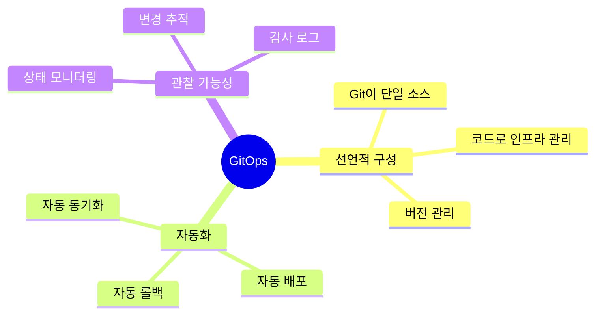
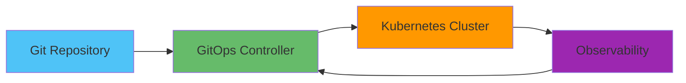

# 🔄 GitOps 전략

## 📌 개요

> **GitOps**는 Git을 단일 소스 오브 트루스(Single Source of Truth)로 사용하여 인프라와 애플리케이션 배포를 관리하는 운영 패러다임입니다. 선언적 배포와 자동 동기화를 통해 일관성과 안정성을 보장합니다.

### 🎯 GitOps의 핵심 원칙



### 📊 GitOps 아키텍처



## 🚀 ArgoCD 전략

### ArgoCD 설치 및 설정

```yaml
# argocd-install.yaml
apiVersion: v1
kind: Namespace
metadata:
  name: argocd

---
apiVersion: argoproj.io/v1alpha1
kind: Application
metadata:
  name: nodejs-app
  namespace: argocd
spec:
  project: default
  source:
    repoURL: https://github.com/example/nodejs-app
    targetRevision: main
    path: k8s
  destination:
    server: https://kubernetes.default.svc
    namespace: production
  syncPolicy:
    automated:
      prune: true
      selfHeal: true
    syncOptions:
    - CreateNamespace=true
```

### ArgoCD 애플리케이션 구성

```yaml
# application.yaml
apiVersion: argoproj.io/v1alpha1
kind: Application
metadata:
  name: nodejs-app
  namespace: argocd
  finalizers:
    - resources-finalizer.argocd.argoproj.io
spec:
  project: default
  source:
    repoURL: https://github.com/example/nodejs-app
    targetRevision: main
    path: k8s/overlays/production
    helm:
      valueFiles:
      - values.yaml
  destination:
    server: https://kubernetes.default.svc
    namespace: production
  syncPolicy:
    automated:
      prune: true
      selfHeal: true
      allowEmpty: false
    syncOptions:
    - CreateNamespace=true
    - PrunePropagationPolicy=foreground
    - PruneLast=true
  revisionHistoryLimit: 10
```

### ArgoCD 헬스 체크

```yaml
# health-check.yaml
apiVersion: argoproj.io/v1alpha1
kind: Application
metadata:
  name: nodejs-app
spec:
  source:
    repoURL: https://github.com/example/nodejs-app
    targetRevision: main
    path: k8s
  destination:
    server: https://kubernetes.default.svc
    namespace: production
  syncPolicy:
    automated:
      prune: true
      selfHeal: true
    syncOptions:
    - CreateNamespace=true
  healthChecks:
  - apiVersion: v1
    kind: Service
    name: nodejs-service
    namespace: production
  - apiVersion: apps/v1
    kind: Deployment
    name: nodejs-deployment
    namespace: production
```

## 🔄 Flux 전략

### Flux 설치

```bash
# Flux CLI 설치
curl -s https://fluxcd.io/install.sh | sudo bash

# Flux 부트스트랩
flux bootstrap github \
  --owner=example \
  --repository=gitops-repo \
  --branch=main \
  --path=clusters/production \
  --personal
```

### Flux 애플리케이션 구성

```yaml
# flux-app.yaml
apiVersion: kustomize.toolkit.fluxcd.io/v1beta2
kind: Kustomization
metadata:
  name: nodejs-app
  namespace: flux-system
spec:
  interval: 5m
  path: ./apps/nodejs-app
  prune: true
  sourceRef:
    kind: GitRepository
    name: gitops-repo
  validation: client
  healthChecks:
    - apiVersion: apps/v1
      kind: Deployment
      name: nodejs-deployment
      namespace: production
  timeout: 5m
```

### Flux GitRepository

```yaml
# git-repository.yaml
apiVersion: source.toolkit.fluxcd.io/v1beta2
kind: GitRepository
metadata:
  name: gitops-repo
  namespace: flux-system
spec:
  interval: 1m
  url: https://github.com/example/gitops-repo
  ref:
    branch: main
  secretRef:
    name: gitops-repo-credentials
```

## 🔄 자동 동기화 전략

### ArgoCD 자동 동기화

```yaml
# auto-sync.yaml
apiVersion: argoproj.io/v1alpha1
kind: Application
metadata:
  name: nodejs-app
spec:
  syncPolicy:
    automated:
      prune: true
      selfHeal: true
      allowEmpty: false
    syncOptions:
    - CreateNamespace=true
    - PrunePropagationPolicy=foreground
    - PruneLast=true
    retry:
      limit: 5
      backoff:
        duration: 5s
        factor: 2
        maxDuration: 3m
```

### Flux 자동 동기화

```yaml
# flux-auto-sync.yaml
apiVersion: kustomize.toolkit.fluxcd.io/v1beta2
kind: Kustomization
metadata:
  name: nodejs-app
spec:
  interval: 5m
  path: ./apps/nodejs-app
  prune: true
  sourceRef:
    kind: GitRepository
    name: gitops-repo
  wait: true
  timeout: 5m
```

## 🔄 롤백 전략

### ArgoCD 롤백

```bash
# 이전 버전으로 롤백
argocd app rollback nodejs-app <revision-hash>

# 특정 리비전으로 롤백
argocd app rollback nodejs-app HEAD~1
```

### Flux 롤백

```bash
# Git에서 이전 커밋으로 롤백
git revert HEAD
git push origin main

# Flux가 자동으로 동기화
```

## 📊 모니터링 및 알람

### ArgoCD 알람

```yaml
# argocd-notifications.yaml
apiVersion: v1
kind: ConfigMap
metadata:
  name: argocd-notifications-cm
  namespace: argocd
data:
  service.slack: |
    token: $slack-token
  trigger.on-sync-succeeded: |
    - description: Application synced
      send:
      - slack:
          message: |
            Application {{.app.metadata.name}} is now synced
  trigger.on-sync-failed: |
    - description: Application sync failed
      send:
      - slack:
          message: |
            Application {{.app.metadata.name}} sync failed
```

### Flux 알람

```yaml
# flux-alert.yaml
apiVersion: notification.toolkit.fluxcd.io/v1beta2
kind: Alert
metadata:
  name: nodejs-app-alert
  namespace: flux-system
spec:
  providerRef:
    name: slack
  eventSeverity: info
  eventSources:
    - kind: Kustomization
      name: nodejs-app
      namespace: flux-system
```

## 🎯 실전 예제: 완전한 GitOps 설정

```yaml
# ArgoCD Application
apiVersion: argoproj.io/v1alpha1
kind: Application
metadata:
  name: nodejs-app
  namespace: argocd
  finalizers:
    - resources-finalizer.argocd.argoproj.io
spec:
  project: default
  source:
    repoURL: https://github.com/example/nodejs-app
    targetRevision: main
    path: k8s/overlays/production
    helm:
      valueFiles:
      - values.yaml
  destination:
    server: https://kubernetes.default.svc
    namespace: production
  syncPolicy:
    automated:
      prune: true
      selfHeal: true
      allowEmpty: false
    syncOptions:
    - CreateNamespace=true
    - PrunePropagationPolicy=foreground
    - PruneLast=true
    retry:
      limit: 5
      backoff:
        duration: 5s
        factor: 2
        maxDuration: 3m
  revisionHistoryLimit: 10
  ignoreDifferences:
  - group: apps
    kind: Deployment
    jsonPointers:
    - /spec/replicas
```

```yaml
# Flux Kustomization
apiVersion: kustomize.toolkit.fluxcd.io/v1beta2
kind: Kustomization
metadata:
  name: nodejs-app
  namespace: flux-system
spec:
  interval: 5m
  path: ./apps/nodejs-app
  prune: true
  sourceRef:
    kind: GitRepository
    name: gitops-repo
  validation: client
  healthChecks:
    - apiVersion: apps/v1
      kind: Deployment
      name: nodejs-deployment
      namespace: production
  wait: true
  timeout: 5m
  dependsOn:
    - name: gitops-repo
```

## 📝 결론

GitOps는 인프라와 애플리케이션 배포를 Git 기반으로 관리하여 일관성과 안정성을 보장합니다.

### 핵심 포인트

- ✅ **선언적 배포**: Git을 단일 소스로 사용
- ✅ **자동 동기화**: 변경사항 자동 반영
- ✅ **자동 롤백**: 실패 시 자동 롤백
- ✅ **관찰 가능성**: 상태 모니터링 및 추적
- ✅ **버전 관리**: 모든 변경사항 버전 관리

### 모범 사례

1. **Git 단일 소스**: 모든 구성은 Git에 저장
2. **자동화**: 수동 개입 최소화
3. **환경 분리**: 환경별 브랜치/디렉토리 분리
4. **헬스 체크**: 배포 후 헬스 체크 필수
5. **모니터링**: 배포 상태 지속적 모니터링

### 관련 문서

- [CI/CD 고급 패턴](../CI_CD/고급_CI_CD_패턴.md) - CI/CD 파이프라인
- [Kubernetes 심화 전략](../Kubernetes/Kubernetes_심화_전략.md) - Kubernetes 배포
- [배포 전략](../../Framework/Node/배포/배포_전략.md) - 배포 전략 상세

