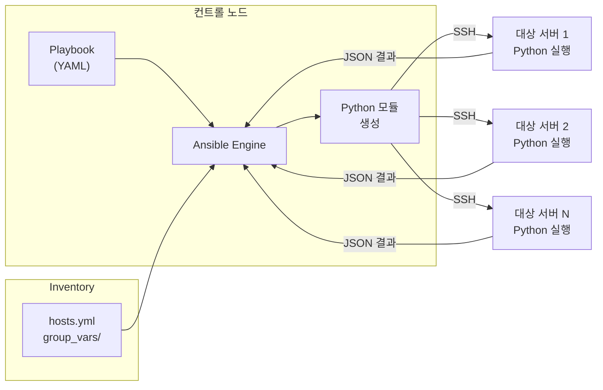
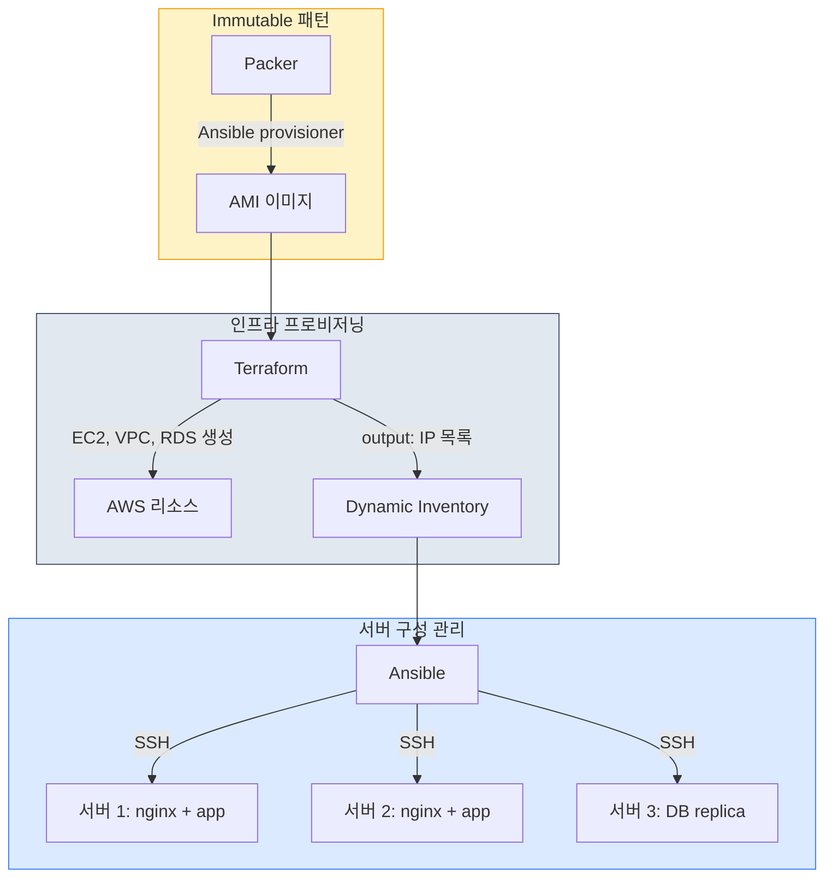
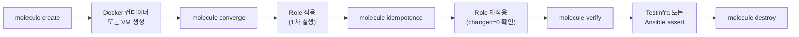
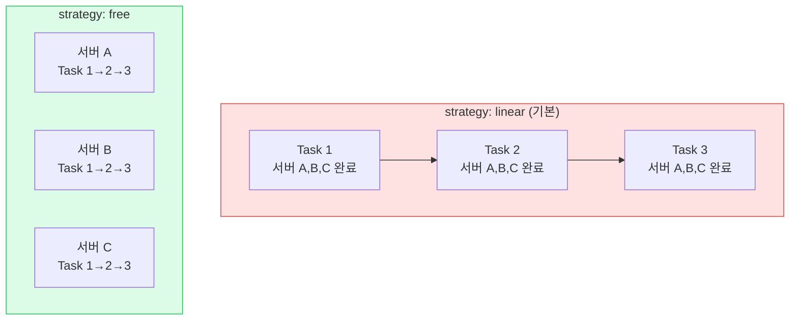

# Ansible

## Ansible이 뭔가

Red Hat이 관리하는 서버 구성 관리 도구다. YAML로 작성한 Playbook을 SSH로 원격 서버에 실행해서 패키지 설치, 설정 변경, 서비스 재시작 같은 작업을 자동화한다.

Chef, Puppet 같은 도구와 비교하면 가장 큰 차이는 **에이전트가 필요 없다**는 점이다. 대상 서버에 별도 데몬을 설치하지 않는다. SSH 접속만 되면 바로 쓸 수 있다. 서버 100대에 에이전트를 깔고 관리하는 것 자체가 이미 운영 부담인데, Ansible은 그 부담이 없다.

Python으로 만들어졌고, 대상 서버에도 Python이 설치되어 있어야 한다. 대부분의 리눅스 배포판에 Python이 기본 설치되어 있어서 실무에서 문제가 되는 경우는 드물지만, 최소 설치 이미지를 쓰는 경우 `raw` 모듈로 Python부터 설치해야 하는 상황이 생긴다.

## 핵심 구성 요소

### Inventory

Ansible이 관리할 서버 목록이다. INI 형식이나 YAML로 작성한다.

```ini
# inventory/production.ini

[web]
web-01.example.com
web-02.example.com

[db]
db-01.example.com ansible_port=2222

[web:vars]
ansible_user=deploy
ansible_python_interpreter=/usr/bin/python3
```

그룹으로 묶어서 특정 그룹에만 Playbook을 실행할 수 있다. 실무에서는 환경별로 inventory 파일을 분리한다. `inventory/production.ini`, `inventory/staging.ini` 이런 식이다.

Dynamic Inventory라는 것도 있다. AWS EC2 인스턴스 목록을 태그 기반으로 자동으로 가져오는 플러그인이 있어서, 서버가 오토스케일링으로 늘었다 줄었다 하는 환경에서 inventory를 수동으로 관리하지 않아도 된다.

```yaml
# inventory/aws_ec2.yml
plugin: amazon.aws.aws_ec2
regions:
  - ap-northeast-2
filters:
  tag:Environment: production
keyed_groups:
  - key: tags.Role
    prefix: role
```

### Playbook

실행할 작업을 정의하는 YAML 파일이다. "어떤 서버에, 어떤 순서로, 뭘 할 것인가"를 기술한다.

```yaml
# playbooks/setup-web.yml
---
- name: 웹 서버 설정
  hosts: web
  become: true

  vars:
    nginx_version: "1.24"
    app_port: 8080

  tasks:
    - name: nginx 설치
      apt:
        name: "nginx={{ nginx_version }}.*"
        state: present
        update_cache: true

    - name: nginx 설정 파일 배포
      template:
        src: templates/nginx.conf.j2
        dest: /etc/nginx/sites-available/default
        owner: root
        group: root
        mode: "0644"
      notify: restart nginx

    - name: nginx 서비스 활성화
      systemd:
        name: nginx
        state: started
        enabled: true

  handlers:
    - name: restart nginx
      systemd:
        name: nginx
        state: restarted
```

`become: true`는 sudo 권한으로 실행한다는 뜻이다. `notify`와 `handlers`는 설정 파일이 변경됐을 때만 서비스를 재시작하는 구조다. 매번 재시작하면 서비스 다운타임이 생기니까, 변경이 있을 때만 재시작하는 게 맞다.

### Module

Ansible이 실제로 서버에서 실행하는 단위다. `apt`, `yum`, `copy`, `template`, `systemd`, `user` 같은 수백 개의 내장 모듈이 있다.

`shell`이나 `command` 모듈로 임의의 명령어를 실행할 수도 있지만, 가능하면 전용 모듈을 써야 한다. 전용 모듈은 멱등성을 보장하는데, `shell`은 매번 실행되기 때문이다.

```yaml
# 나쁜 예 - 멱등성 없음
- name: 유저 추가
  shell: useradd deploy

# 좋은 예 - 이미 있으면 건너뜀
- name: 유저 추가
  user:
    name: deploy
    state: present
    shell: /bin/bash
```

### Role

Playbook이 커지면 Role로 분리한다. 디렉토리 구조 자체가 규칙이다.

```
roles/
  nginx/
    tasks/
      main.yml       # 실행할 태스크
    handlers/
      main.yml       # 핸들러
    templates/
      nginx.conf.j2  # Jinja2 템플릿
    files/
      ssl.crt         # 정적 파일
    vars/
      main.yml       # 변수
    defaults/
      main.yml       # 기본값 (우선순위 가장 낮음)
    meta/
      main.yml       # 의존성
```

Role을 Playbook에서 사용하는 방법:

```yaml
---
- name: 웹 서버 구성
  hosts: web
  become: true

  roles:
    - common
    - nginx
    - role: app
      vars:
        app_port: 8080
```

Ansible Galaxy에서 커뮤니티가 만든 Role을 받아 쓸 수 있다. `ansible-galaxy install geerlingguy.docker` 같은 식이다. 다만 프로덕션에서 외부 Role을 그대로 쓰면 버전 업데이트 시 예상치 못한 변경이 생길 수 있어서, `requirements.yml`에 버전을 고정해야 한다.

```yaml
# requirements.yml
roles:
  - name: geerlingguy.docker
    version: "6.1.0"
  - name: geerlingguy.nginx
    version: "3.2.0"
```

## SSH 기반 에이전트리스 구조

Ansible의 실행 흐름을 좀 더 구체적으로 보면 이렇다:

1. 컨트롤 노드(Ansible이 설치된 머신)에서 Playbook 파싱
2. 각 태스크를 Python 스크립트로 변환
3. SSH로 대상 서버에 스크립트 전송
4. 대상 서버에서 Python 스크립트 실행
5. 결과를 JSON으로 컨트롤 노드에 반환



SSH 연결은 기본적으로 `forks` 설정만큼 동시에 열린다. 위 그림에서 서버 3대를 동시에 처리하는 것처럼 보이지만, `forks = 5`가 기본값이라 서버가 50대면 한 태스크당 10번에 나눠서 실행된다.

이 구조 때문에 생기는 실무 이슈가 있다.

**SSH 연결 수 문제**

서버가 많으면 SSH 연결을 동시에 여는 수가 문제가 된다. 기본값은 5개(`forks = 5`)인데, 서버 50대에 배포하면 한 번에 5대씩 처리해서 시간이 오래 걸린다.

```ini
# ansible.cfg
[defaults]
forks = 20

[ssh_connection]
pipelining = True
ssh_args = -o ControlMaster=auto -o ControlPersist=60s
```

`pipelining = True`는 SSH 세션 하나에서 여러 명령을 실행해서 연결 오버헤드를 줄인다. 다만 대상 서버의 `/etc/sudoers`에 `requiretty` 설정이 있으면 pipelining이 실패한다. CentOS 7 이하에서 이 문제를 겪는 경우가 있다.

**Pull 모드**

기본은 Push 모드(컨트롤 노드에서 서버로 밀어넣기)지만, `ansible-pull`이라는 Pull 모드도 있다. 서버가 직접 Git에서 Playbook을 받아서 실행하는 방식이다. 서버가 수백 대 이상이거나 네트워크 환경이 복잡할 때 쓴다.

## Terraform과의 차이

둘 다 IaC 도구지만 담당하는 영역이 다르다.

| 구분 | Terraform | Ansible |
|------|-----------|---------|
| 주요 역할 | 인프라 프로비저닝 | 서버 구성 관리 |
| 방식 | 선언적(declarative) | 절차적(procedural) |
| 상태 관리 | tfstate 파일로 상태 추적 | 상태 파일 없음 |
| 대상 | 클라우드 리소스(EC2, VPC, RDS 등) | 서버 내부(패키지, 설정, 서비스) |
| 에이전트 | 불필요 (API 호출) | 불필요 (SSH) |

Terraform은 "EC2 인스턴스 3대, RDS 1개, VPC 1개를 만들어라"를 담당한다. Ansible은 "그 EC2에 nginx 설치하고, 설정 파일 넣고, 서비스 시작해라"를 담당한다.

Terraform의 선언적 방식은 `terraform plan`으로 변경사항을 미리 확인할 수 있다. Ansible은 `--check` 모드가 있긴 하지만, 실제 실행과 결과가 다른 경우가 꽤 있다. 특히 `shell` 모듈이 섞여 있으면 `--check`로는 정확한 예측이 안 된다.

### Terraform + Ansible 조합 패턴

실무에서 가장 많이 쓰는 조합이다. 인프라 생성은 Terraform, 서버 설정은 Ansible로 나눈다.



세 가지 패턴이 있는데, 실무에서는 프로젝트 규모와 배포 빈도에 따라 선택한다. 소규모는 패턴 1로 충분하고, 오토스케일링이 빈번하면 패턴 3(Immutable)이 맞다.

**패턴 1: Terraform output을 Ansible inventory로 사용**

```hcl
# terraform/outputs.tf
output "web_server_ips" {
  value = aws_instance.web[*].private_ip
}
```

Terraform으로 서버를 만들고, output에서 IP를 뽑아서 Ansible의 Dynamic Inventory로 넘긴다.

```bash
# deploy.sh
cd terraform && terraform apply -auto-approve
WEB_IPS=$(terraform output -json web_server_ips | jq -r '.[]')

# Dynamic inventory 생성
echo "[web]" > ../ansible/inventory/hosts
for ip in $WEB_IPS; do
  echo "$ip" >> ../ansible/inventory/hosts
done

cd ../ansible && ansible-playbook -i inventory/hosts playbooks/setup-web.yml
```

**패턴 2: Terraform의 provisioner로 Ansible 실행**

```hcl
resource "aws_instance" "web" {
  ami           = "ami-0c55b159cbfafe1f0"
  instance_type = "t3.medium"

  provisioner "local-exec" {
    command = "ansible-playbook -i '${self.private_ip},' playbooks/setup-web.yml"
  }
}
```

`provisioner`는 Terraform에서 공식적으로 권장하지 않는 기능이다. 인스턴스 생성과 설정이 강하게 결합되어서, provisioner가 실패하면 인스턴스를 `taint`해서 다시 만들어야 한다. 패턴 1처럼 분리하는 게 낫다.

**패턴 3: Packer + Terraform (Ansible은 이미지 빌드 시)**

```json
// packer/web.pkr.hcl
source "amazon-ebs" "web" {
  ami_name      = "web-{{timestamp}}"
  instance_type = "t3.medium"
  source_ami    = "ami-base"
}

build {
  sources = ["source.amazon-ebs.web"]

  provisioner "ansible" {
    playbook_file = "../ansible/playbooks/setup-web.yml"
  }
}
```

Packer로 AMI를 만들 때 Ansible로 서버 설정을 미리 넣고, Terraform은 그 AMI로 인스턴스만 띄운다. 배포 속도가 빠르고, 모든 인스턴스가 동일한 상태를 보장한다. Immutable Infrastructure 패턴이다.

## 멱등성 문제와 해결

Ansible의 모듈 대부분은 멱등성을 보장한다. `apt` 모듈은 패키지가 이미 설치되어 있으면 건너뛴다. `template` 모듈은 파일 내용이 같으면 "changed"가 아닌 "ok"를 반환한다.

문제는 멱등성이 깨지는 상황이다.

### shell/command 모듈

가장 흔한 원인이다. 이 모듈은 Ansible이 결과를 판단할 수 없어서 매번 "changed"로 처리한다.

```yaml
# 문제 - 매번 실행됨
- name: 데이터베이스 초기화
  shell: /opt/app/init-db.sh

# 해결 - creates로 멱등성 확보
- name: 데이터베이스 초기화
  shell: /opt/app/init-db.sh
  args:
    creates: /opt/app/.db-initialized
```

`creates`는 해당 파일이 존재하면 태스크를 건너뛴다. 비슷하게 `removes`는 파일이 없으면 건너뛴다.

더 정확하게 하려면 `changed_when`을 쓴다.

```yaml
- name: 마이그레이션 실행
  shell: /opt/app/migrate.sh
  register: migration_result
  changed_when: "'No migrations to apply' not in migration_result.stdout"
```

### 파일 권한 문제

`copy`나 `template`로 파일을 배포할 때, 모드를 문자열로 지정하지 않으면 예상과 다르게 동작한다.

```yaml
# 문제 - 숫자 0644가 8진수가 아닌 10진수로 해석될 수 있음
- name: 설정 파일 배포
  copy:
    src: app.conf
    dest: /etc/app/app.conf
    mode: 0644

# 해결 - 문자열로 지정
- name: 설정 파일 배포
  copy:
    src: app.conf
    dest: /etc/app/app.conf
    mode: "0644"
```

YAML에서 `0644`는 파서에 따라 8진수 정수(`420`)로 해석되기도 한다. 문자열로 쓰면 이 문제를 피할 수 있다.

### 서비스 재시작 중복

handler를 쓰지 않고 매번 서비스를 재시작하는 패턴을 자주 본다.

```yaml
# 문제 - 설정 변경이 없어도 매번 재시작
- name: 설정 파일 배포
  template:
    src: app.conf.j2
    dest: /etc/app/app.conf

- name: 서비스 재시작
  systemd:
    name: app
    state: restarted

# 해결 - handler로 변경 시에만 재시작
- name: 설정 파일 배포
  template:
    src: app.conf.j2
    dest: /etc/app/app.conf
  notify: restart app

# handlers/main.yml
- name: restart app
  systemd:
    name: app
    state: restarted
```

### 패키지 버전 고정

`state: latest`를 쓰면 실행할 때마다 패키지가 업데이트된다. 같은 Playbook을 한 달 뒤에 실행하면 다른 버전이 설치될 수 있다.

```yaml
# 문제 - 실행 시점에 따라 다른 버전 설치
- name: nginx 설치
  apt:
    name: nginx
    state: latest

# 해결 - 버전 고정
- name: nginx 설치
  apt:
    name: nginx=1.24.0-1~jammy
    state: present
```

## 디렉토리 구조 실무 예시

프로젝트가 커지면 이런 구조로 관리한다.

```
ansible/
  ansible.cfg
  inventory/
    production/
      hosts.yml
      group_vars/
        all.yml
        web.yml
        db.yml
      host_vars/
        web-01.yml
    staging/
      hosts.yml
      group_vars/
        all.yml
  playbooks/
    setup-web.yml
    deploy-app.yml
    db-backup.yml
  roles/
    common/
    nginx/
    app/
    monitoring/
  requirements.yml
```

`group_vars`와 `host_vars`로 환경별, 서버별 변수를 분리한다. Playbook 자체는 환경에 독립적으로 작성하고, 변수만 바꿔서 staging과 production에서 같은 Playbook을 실행한다.

```bash
# staging에 배포
ansible-playbook -i inventory/staging/hosts.yml playbooks/deploy-app.yml

# production에 배포
ansible-playbook -i inventory/production/hosts.yml playbooks/deploy-app.yml
```

## 실무에서 주의할 점

**Ansible Vault로 비밀 관리**

비밀번호, API 키 같은 값을 평문으로 넣으면 안 된다. Ansible Vault로 암호화한다.

```bash
# 파일 암호화
ansible-vault encrypt inventory/production/group_vars/db.yml

# 암호화된 변수 사용
ansible-playbook playbooks/setup-db.yml --ask-vault-pass

# 비밀번호 파일 지정 (CI/CD에서 사용)
ansible-playbook playbooks/setup-db.yml --vault-password-file ~/.vault_pass
```

**태스크 실행 순서**

Ansible은 Playbook에 쓴 순서대로 태스크를 실행한다. 한 서버의 모든 태스크가 끝나야 다음 서버로 넘어가는 게 아니라, 한 태스크를 모든 서버에서 실행한 뒤 다음 태스크로 넘어간다. 이 동작 방식을 모르면 "왜 1번 서버에서 nginx 설치와 설정이 연속으로 안 되지?"라고 혼란스러울 수 있는데, 기본 동작이 그렇다. `serial` 키워드로 한 번에 처리할 서버 수를 제한하면 롤링 배포가 가능하다.

```yaml
- name: 롤링 배포
  hosts: web
  serial: 2  # 한 번에 2대씩
  become: true

  tasks:
    - name: 로드밸런서에서 제거
      uri:
        url: "http://lb.internal/api/deregister/{{ inventory_hostname }}"
        method: POST

    - name: 앱 배포
      # ...

    - name: 로드밸런서에 재등록
      uri:
        url: "http://lb.internal/api/register/{{ inventory_hostname }}"
        method: POST
```

**디버깅**

실행이 실패하면 `-vvv` 옵션으로 상세 로그를 볼 수 있다. SSH 연결 문제인지, 모듈 실행 문제인지 구분이 된다.

```bash
ansible-playbook playbooks/setup-web.yml -vvv

# 특정 태스크만 실행
ansible-playbook playbooks/setup-web.yml --start-at-task="nginx 설치"

# 특정 서버만 대상
ansible-playbook playbooks/setup-web.yml --limit web-01.example.com
```

## Ansible Collections

Ansible 2.10부터 모듈 배포 방식이 바뀌었다. 이전에는 모든 모듈이 `ansible` 패키지에 포함되어 있었는데, 지금은 Collection이라는 단위로 분리되어 있다.

### Collection 구조

Collection은 `namespace.collection_name` 형태의 이름을 가진다. `amazon.aws`, `community.general`, `community.docker` 같은 식이다.

```
collections/
  ansible_collections/
    amazon/
      aws/
        plugins/
          modules/
            ec2_instance.py
            s3_bucket.py
        roles/
        playbooks/
        docs/
        galaxy.yml
```

모듈을 쓸 때 FQCN(Fully Qualified Collection Name)으로 지정해야 한다. 이전처럼 `ec2_instance`만 쓰면 동작은 하지만, 어느 Collection에서 온 모듈인지 모호해진다.

```yaml
# 이전 방식 - 모호함
- name: EC2 생성
  ec2_instance:
    name: web-01
    instance_type: t3.medium

# Collection 방식 - 명확
- name: EC2 생성
  amazon.aws.ec2_instance:
    name: web-01
    instance_type: t3.medium
```

### Collection 의존성 관리

`requirements.yml`에 Role과 Collection 의존성을 같이 관리한다.

```yaml
# requirements.yml
roles:
  - name: geerlingguy.docker
    version: "6.1.0"

collections:
  - name: amazon.aws
    version: ">=7.0.0,<8.0.0"
  - name: community.general
    version: ">=8.0.0"
  - name: community.docker
    version: "3.8.0"
```

```bash
# Role과 Collection 한 번에 설치
ansible-galaxy install -r requirements.yml

# Collection만 설치
ansible-galaxy collection install -r requirements.yml
```

버전 범위를 지정할 수 있는데, 프로덕션에서는 메이저 버전은 고정하는 게 안전하다. Collection 메이저 버전이 올라가면 모듈 파라미터가 바뀌거나 삭제되는 경우가 있다. `amazon.aws` 6.x에서 7.x로 올릴 때 `ec2` 모듈이 `ec2_instance`로 완전히 대체되면서 기존 Playbook이 깨지는 걸 겪은 적이 있다.

### 자체 Collection 만들기

팀에서 공통으로 쓰는 Role이나 모듈이 있으면 Collection으로 묶어서 내부 Galaxy 서버나 Git 저장소에서 배포할 수 있다.

```bash
# 스켈레톤 생성
ansible-galaxy collection init mycompany.infra

# 빌드
cd mycompany/infra
ansible-galaxy collection build

# 설치 (로컬 파일 또는 Git)
ansible-galaxy collection install mycompany-infra-1.0.0.tar.gz
```

`requirements.yml`에서 Git 저장소를 직접 참조하는 것도 가능하다.

```yaml
collections:
  - name: https://github.com/mycompany/ansible-collection-infra.git
    type: git
    version: v1.2.0
```

## Molecule로 Role 테스트

Ansible Role을 작성하고 "서버에 올려서 돌려보자"만으로 검증하면 문제가 생긴다. Role이 다른 OS에서 동작하는지, 멱등성이 보장되는지 확인하려면 매번 서버를 프로비저닝해야 한다. Molecule은 이 과정을 자동화하는 테스트 프레임워크다.

### 기본 동작 흐름



`molecule test`를 실행하면 위 과정을 순서대로 전부 수행한다. 개발 중에는 `create` → `converge`만 반복하다가, 완성되면 `test`로 전체 사이클을 돌린다.

### 설정과 사용

```bash
# Molecule 설치
pip install molecule molecule-docker

# 기존 Role에 Molecule 초기화
cd roles/nginx
molecule init scenario --driver-name docker
```

```yaml
# roles/nginx/molecule/default/molecule.yml
dependency:
  name: galaxy
driver:
  name: docker
platforms:
  - name: ubuntu-test
    image: ubuntu:22.04
    pre_build_image: true
    command: /sbin/init
    privileged: true
    volumes:
      - /sys/fs/cgroup:/sys/fs/cgroup:rw
  - name: rocky-test
    image: rockylinux:9
    pre_build_image: true
    command: /usr/sbin/init
    privileged: true
provisioner:
  name: ansible
verifier:
  name: ansible
```

`platforms`에 여러 OS를 지정하면 하나의 Role이 Ubuntu와 Rocky Linux에서 모두 동작하는지 한 번에 검증된다. systemd를 쓰는 Role이면 컨테이너에 `privileged: true`와 `/sbin/init` 설정이 필요하다. 이걸 빠뜨리면 `systemd` 모듈이 동작하지 않아서 테스트가 실패한다.

### converge와 verify 작성

```yaml
# roles/nginx/molecule/default/converge.yml
---
- name: Converge
  hosts: all
  become: true
  vars:
    nginx_port: 8080
  roles:
    - role: nginx
```

```yaml
# roles/nginx/molecule/default/verify.yml
---
- name: Verify
  hosts: all
  become: true
  tasks:
    - name: nginx 프로세스 확인
      command: pgrep nginx
      changed_when: false

    - name: 설정 파일 존재 확인
      stat:
        path: /etc/nginx/sites-available/default
      register: nginx_conf

    - name: 설정 파일 검증
      assert:
        that:
          - nginx_conf.stat.exists
          - nginx_conf.stat.mode == '0644'

    - name: 포트 리스닝 확인
      wait_for:
        port: 8080
        timeout: 10
```

```bash
# 전체 테스트 실행
molecule test

# 개발 중 반복 (컨테이너 유지)
molecule converge
molecule verify

# 컨테이너 접속해서 디버깅
molecule login -h ubuntu-test
```

멱등성 테스트(`molecule idempotence`)가 실패하면 `shell` 모듈을 잘못 쓰고 있거나, `changed_when` 처리가 빠진 태스크가 있다는 뜻이다.

## CI/CD 파이프라인 연동

### GitHub Actions

```yaml
# .github/workflows/ansible-test.yml
name: Ansible Role Test

on:
  push:
    paths:
      - 'ansible/roles/**'
  pull_request:
    paths:
      - 'ansible/roles/**'

jobs:
  molecule:
    runs-on: ubuntu-latest
    strategy:
      matrix:
        role:
          - nginx
          - app
          - monitoring
    steps:
      - uses: actions/checkout@v4

      - name: Python 설치
        uses: actions/setup-python@v5
        with:
          python-version: '3.11'

      - name: 의존성 설치
        run: |
          pip install ansible molecule molecule-docker docker

      - name: Molecule 테스트
        working-directory: ansible/roles/${{ matrix.role }}
        run: molecule test

  deploy:
    needs: molecule
    if: github.ref == 'refs/heads/main'
    runs-on: ubuntu-latest
    steps:
      - uses: actions/checkout@v4

      - name: Ansible 설치
        run: pip install ansible

      - name: SSH 키 설정
        run: |
          mkdir -p ~/.ssh
          echo "${{ secrets.SSH_PRIVATE_KEY }}" > ~/.ssh/id_rsa
          chmod 600 ~/.ssh/id_rsa
          ssh-keyscan -H ${{ secrets.SERVER_HOST }} >> ~/.ssh/known_hosts

      - name: Vault 비밀번호 설정
        run: echo "${{ secrets.VAULT_PASSWORD }}" > .vault_pass

      - name: Playbook 실행
        working-directory: ansible
        run: |
          ansible-playbook \
            -i inventory/production/hosts.yml \
            playbooks/deploy-app.yml \
            --vault-password-file ../.vault_pass
```

`paths` 필터로 Role 파일이 변경됐을 때만 CI가 돌게 한다. 모든 push에서 Molecule 테스트를 돌리면 시간이 낭비된다.

`matrix`로 여러 Role을 병렬 테스트하는 게 핵심이다. Role이 10개인데 순차 실행하면 CI가 30분 넘게 걸린다.

### Jenkins Pipeline

```groovy
// Jenkinsfile
pipeline {
    agent any

    environment {
        ANSIBLE_VAULT_PASSWORD = credentials('ansible-vault-pass')
        SSH_KEY = credentials('deploy-ssh-key')
    }

    stages {
        stage('Lint') {
            steps {
                sh 'pip install ansible-lint'
                sh 'ansible-lint ansible/playbooks/*.yml'
            }
        }

        stage('Molecule Test') {
            steps {
                sh '''
                    pip install molecule molecule-docker
                    cd ansible/roles/nginx
                    molecule test
                '''
            }
        }

        stage('Deploy to Staging') {
            when {
                branch 'develop'
            }
            steps {
                sh '''
                    ansible-playbook \
                        -i ansible/inventory/staging/hosts.yml \
                        ansible/playbooks/deploy-app.yml \
                        --vault-password-file $ANSIBLE_VAULT_PASSWORD \
                        --private-key $SSH_KEY
                '''
            }
        }

        stage('Deploy to Production') {
            when {
                branch 'main'
            }
            input {
                message "프로덕션 배포를 진행하시겠습니까?"
            }
            steps {
                sh '''
                    ansible-playbook \
                        -i ansible/inventory/production/hosts.yml \
                        ansible/playbooks/deploy-app.yml \
                        --vault-password-file $ANSIBLE_VAULT_PASSWORD \
                        --private-key $SSH_KEY
                '''
            }
        }
    }
}
```

프로덕션 배포 전에 `input` 단계를 넣어서 수동 승인을 받는다. 자동으로 프로덕션에 배포되게 두면 잘못된 Role 변경이 그대로 나간다.

### ansible-lint 연동

CI에서 `ansible-lint`를 돌리면 Playbook의 일반적인 실수를 잡아준다. `command` 모듈 대신 전용 모듈을 써야 하는 경우, `mode`를 8진수 문자열로 써야 하는 경우 등을 감지한다.

```yaml
# .ansible-lint
skip_list:
  - yaml[line-length]    # 긴 줄 허용
  - name[casing]         # 태스크 이름 대소문자 유연하게

warn_list:
  - experimental         # 실험적 규칙은 경고만

exclude_paths:
  - .github/
  - molecule/
```

## 대규모 인프라 성능 튜닝

서버가 수십 대를 넘어가면 Ansible 실행 시간이 문제가 된다. 기본 설정으로 서버 200대에 Playbook을 실행하면 태스크 하나에 수 분이 걸리기도 한다.

### strategy 설정

기본 strategy는 `linear`다. 태스크 하나를 모든 서버에서 실행한 뒤 다음 태스크로 넘어간다. 서버마다 실행 시간이 다르면 가장 느린 서버를 기다리느라 전체가 지연된다.



`strategy: free`로 바꾸면 각 서버가 독립적으로 태스크를 진행한다. 서버 A가 Task 1을 끝내면 서버 B를 기다리지 않고 바로 Task 2로 넘어간다.

```yaml
- name: 앱 서버 설정
  hosts: app
  strategy: free
  become: true

  tasks:
    - name: 패키지 업데이트
      apt:
        upgrade: safe
    # ...
```

주의할 점이 있다. `strategy: free`에서는 태스크 간 실행 순서가 서버마다 다르다. 서버 A는 Task 3을 실행 중인데 서버 B는 아직 Task 1에 있을 수 있다. 서버 간 의존성이 있는 작업(DB 마이그레이션 후 앱 서버 재시작 같은)에서는 `free`를 쓰면 안 된다.

### Mitogen

Ansible의 기본 실행 방식은 태스크마다 SSH 연결을 새로 열고, Python 스크립트를 전송하고, 실행하고, 결과를 받는다. Mitogen은 이 과정을 근본적으로 바꾼다.

Mitogen이 하는 일:
- SSH 연결을 한 번 열고 재사용한다(기본 Ansible도 `ControlPersist`로 비슷하게 하지만, Mitogen이 더 공격적으로 최적화한다)
- Python 모듈을 매번 전송하지 않고, 원격 서버에 인터프리터 프로세스를 유지하면서 필요한 코드만 스트리밍한다
- 전송 데이터를 압축한다

```bash
# 설치
pip install mitogen

# 또는 특정 버전 (Ansible 버전과 호환성 확인 필요)
pip install mitogen==0.3.7
```

```ini
# ansible.cfg
[defaults]
strategy_plugins = /path/to/mitogen/ansible_mitogen/plugins/strategy
strategy = mitogen_linear
```

`mitogen_linear`은 기본 `linear`과 동일한 동작인데, 실행 방식만 Mitogen으로 대체한 것이다. `mitogen_free`도 있다.

체감 성능 차이는 크다. 서버 50대 기준으로 간단한 Playbook(패키지 설치 + 설정 배포 + 서비스 재시작)을 돌리면 기본 대비 2~5배 빨라진다. 태스크가 많을수록 차이가 더 벌어진다.

다만 주의할 점이 있다:
- Ansible 버전과 Mitogen 버전의 호환성을 맞춰야 한다. Ansible 9.x에서 Mitogen 0.3.4가 동작하지 않아서 한참 삽질한 경우가 있다. 공식 호환성 매트릭스를 확인해야 한다
- 일부 모듈(`raw`, `script`)은 Mitogen에서 동작하지 않는다
- `become` 방식이 `su`인 경우 문제가 생길 수 있다. `sudo`는 정상 동작한다

### 기타 성능 설정

```ini
# ansible.cfg
[defaults]
# 동시 실행 수 증가
forks = 50

# Fact 캐싱 - 매번 서버 정보를 수집하지 않음
gathering = smart
fact_caching = jsonfile
fact_caching_connection = /tmp/ansible_fact_cache
fact_caching_timeout = 3600

[ssh_connection]
# SSH 멀티플렉싱
pipelining = True
ssh_args = -o ControlMaster=auto -o ControlPersist=300s -o PreferredAuthentications=publickey

# SCP 대신 SFTP 사용 (대부분의 환경에서 더 빠름)
transfer_method = sftp
```

`gathering = smart`는 Fact(서버의 OS, IP, 메모리 같은 정보)를 처음 한 번만 수집하고 캐시한다. 서버 200대에서 매번 Fact를 수집하면 그것만으로 몇 분이 걸린다.

`forks`를 무작정 올리면 컨트롤 노드의 CPU와 메모리가 부족해진다. 서버 대수의 절반 정도가 적당한 시작점이다. 컨트롤 노드가 4코어면 `forks = 30` 이상은 오히려 느려질 수 있다.

`ControlPersist=300s`는 SSH 연결을 5분간 유지한다는 뜻이다. Playbook 실행 중에는 같은 서버에 여러 번 연결하니까, 연결을 유지하면 핸드셰이크 비용을 아낀다.
