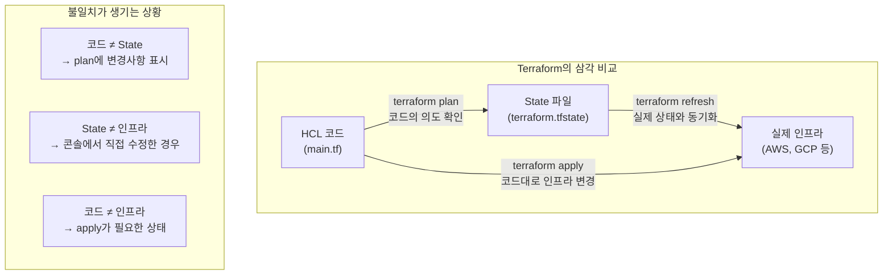
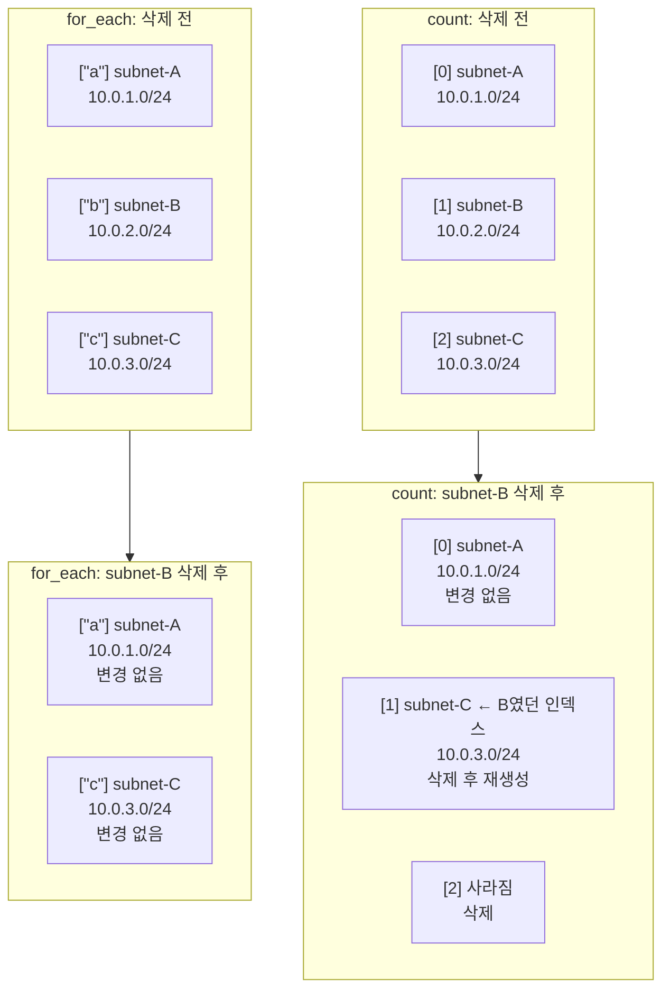
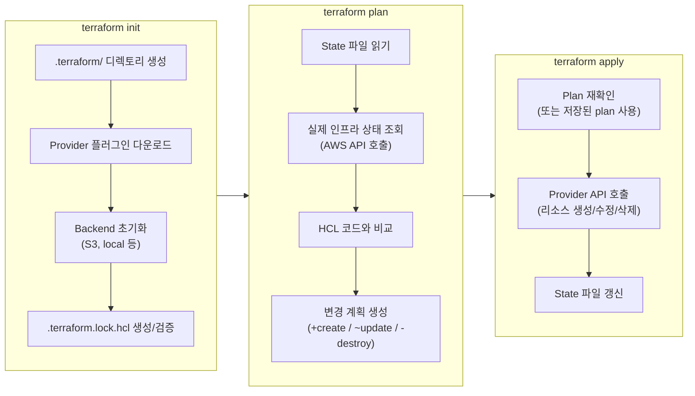

# Terraform 기초

Terraform은 HashiCorp가 만든 IaC 도구다. 인프라를 HCL(HashiCorp Configuration Language)로 정의하고, `plan` → `apply` 흐름으로 생성/변경/삭제한다. 이 문서는 Terraform을 처음 쓸 때 실제로 부딪히는 문제 위주로 정리한다.

> Terraform의 개념, 문법, 모듈 시스템, AWS 인프라 구축 예제는 [Terraform 인프라 자동화](./Terraform.md)에서 다룬다.

---

## 설치와 프로젝트 초기 설정

### 설치

```bash
# macOS
brew tap hashicorp/tap
brew install hashicorp/tap/terraform

# Linux
wget https://releases.hashicorp.com/terraform/1.9.0/terraform_1.9.0_linux_amd64.zip
unzip terraform_1.9.0_linux_amd64.zip
sudo mv terraform /usr/local/bin/

# 설치 확인
terraform version
```

tfenv을 쓰면 프로젝트별로 Terraform 버전을 다르게 쓸 수 있다. 팀에서 버전이 다를 때 문제가 잦으니 `.terraform-version` 파일을 프로젝트 루트에 두는 게 낫다.

```bash
brew install tfenv
tfenv install 1.9.0
tfenv use 1.9.0
```

### 프로젝트 구조

```
project/
├── main.tf            # 리소스 정의
├── variables.tf       # 변수 선언
├── outputs.tf         # 출력 값
├── terraform.tfvars   # 변수 값 (git에 올리지 않음)
├── versions.tf        # required_providers, required_version
├── .gitignore         # 반드시 설정
└── .terraform.lock.hcl # provider 버전 잠금 (git에 올림)
```

### .gitignore 필수 설정

이거 안 하면 state 파일이나 `.terraform/` 디렉토리가 git에 올라간다. state 파일에는 DB 비밀번호 같은 민감 정보가 평문으로 들어가기 때문에 절대 커밋하면 안 된다.

```gitignore
# Terraform
.terraform/
*.tfstate
*.tfstate.*
*.tfvars
*.tfvars.json
crash.log
crash.*.log
override.tf
override.tf.json
*_override.tf
*_override.tf.json
.terraformrc
terraform.rc
```

`.terraform.lock.hcl`은 `.gitignore`에 넣지 않는다. 이유는 아래에서 설명한다.

---

## terraform init 실패 트러블슈팅

`terraform init`은 provider 플러그인을 다운로드하고 backend를 초기화한다. 처음 쓸 때 여기서 막히는 경우가 많다.

### provider를 못 찾는 경우

```
Error: Failed to query available provider packages
Could not retrieve the list of available versions for provider hashicorp/aws
```

원인은 대부분 네트워크 문제거나 provider source를 잘못 쓴 경우다.

```hcl
# 틀린 예 - source 없이 쓰면 Terraform 0.12 이전 방식
provider "aws" {
  region = "ap-northeast-2"
}

# 맞는 예 - required_providers에 source 명시
terraform {
  required_providers {
    aws = {
      source  = "hashicorp/aws"
      version = "~> 5.0"
    }
  }
}
```

회사 내부 네트워크에서 프록시 뒤에 있으면 `HTTPS_PROXY` 환경변수를 설정해야 한다.

```bash
export HTTPS_PROXY=http://proxy.company.com:8080
terraform init
```

### backend 설정 변경 후 init 실패

backend를 로컬에서 S3로 바꾸거나 S3 버킷 이름을 변경하면 `terraform init`이 실패한다.

```bash
# backend 설정이 바뀌었을 때
terraform init -reconfigure

# 기존 state를 새 backend로 옮기고 싶을 때
terraform init -migrate-state
```

`-reconfigure`는 기존 state를 버리고 새로 시작한다. `-migrate-state`는 기존 state를 새 backend로 복사한다. 둘의 차이를 모르고 `-reconfigure`를 썼다가 state를 날리는 사고가 생긴다.

### .terraform 디렉토리가 깨진 경우

`.terraform/` 디렉토리를 삭제하고 다시 init하면 된다. 이 디렉토리는 캐시일 뿐이라 지워도 문제없다.

```bash
rm -rf .terraform
terraform init
```

---

## .terraform.lock.hcl 관리

`.terraform.lock.hcl`은 provider의 정확한 버전과 해시값을 기록한다. `package-lock.json`이나 `go.sum`과 같은 역할이다.

### git에 올려야 하는 이유

이 파일을 git에 안 올리면 팀원마다 `terraform init` 할 때 다른 버전의 provider를 받을 수 있다. A는 aws provider 5.30.0, B는 5.31.0을 쓰면 plan 결과가 달라진다.

### 플랫폼 해시 문제

macOS에서 lock 파일을 생성하면 `h1:` 해시만 들어간다. CI/CD가 Linux에서 돌면 해시가 안 맞아서 init이 실패한다.

```bash
# 여러 플랫폼의 해시를 한 번에 추가
terraform providers lock \
  -platform=darwin_amd64 \
  -platform=darwin_arm64 \
  -platform=linux_amd64
```

이걸 안 하면 CI에서 `terraform init` 할 때마다 `-lock=false`를 붙여야 하는데, 그러면 lock 파일의 의미가 없어진다.

### provider 버전 올릴 때

```bash
# lock 파일의 특정 provider 버전을 갱신
terraform init -upgrade
```

`-upgrade` 없이 `terraform init`만 하면 lock 파일에 적힌 버전을 고수한다. 의도적으로 버전을 올리려면 `-upgrade`를 써야 한다.

---

## terraform plan에서 예상 외 변경사항 대응

`plan`을 찍었는데 내가 바꾸지 않은 리소스에 변경이 뜨는 경우가 있다. 처음 겪으면 당황스러운데 원인은 몇 가지로 나뉜다.

### 누군가 콘솔에서 직접 바꾼 경우

Terraform은 state에 기록된 상태와 실제 인프라를 비교한다. 누군가 AWS 콘솔에서 직접 보안 그룹 규칙을 추가했으면, plan에서 그 규칙을 삭제하겠다고 나온다.

대응 방법:

```bash
# 실제 인프라 상태를 state에 반영
terraform apply -refresh-only
```

`-refresh-only`는 코드는 안 바꾸고 state만 실제 인프라에 맞춘다. 다만 이렇게 하면 코드와 state가 어긋나니까, 코드도 같이 수정해야 한다.

### provider 업데이트 후 기본값이 바뀐 경우

aws provider를 5.x에서 올렸더니 갑자기 S3 버킷에 `bucket_regional_domain_name` 같은 필드가 생겨서 변경사항으로 잡히는 경우가 있다. 대부분 `plan`에서 `~ update in-place`로 뜨고 실제로 인프라가 바뀌진 않지만, 모르면 불안하다.

```bash
# 특정 리소스의 plan 결과만 보고 싶을 때
terraform plan -target=aws_s3_bucket.main
```

### plan 결과 저장하고 그대로 apply

plan 결과를 파일로 저장하면 apply 할 때 정확히 그 plan대로만 적용된다. plan과 apply 사이에 인프라가 바뀌는 사고를 막는다.

```bash
terraform plan -out=tfplan
terraform apply tfplan
```

---

## State 파일과 실제 인프라의 관계

Terraform은 HCL 코드, State 파일, 실제 인프라 세 가지를 비교해서 동작한다. 이 관계를 이해해야 plan 결과가 왜 그렇게 나오는지 판단할 수 있다.



| 상황 | 원인 | plan 결과 | 대응 |
|------|------|-----------|------|
| 코드 변경, State/인프라 그대로 | 정상 개발 흐름 | 변경사항 표시 | `apply` 실행 |
| State에 있는데 인프라에 없음 | 콘솔에서 삭제 | 에러 또는 재생성 | `state rm` |
| 인프라에 있는데 State에 없음 | 수동 생성 또는 state 유실 | 인식 못함 | `import` |
| 코드/State 동일, 인프라만 다름 | 콘솔에서 수정 | 되돌리려는 변경 표시 | `apply -refresh-only` |

---

## State 꼬임 해결법

state가 꼬이면 plan이 이상하게 나오거나 apply가 실패한다. 가장 흔한 상황과 해결법을 정리한다.

### 리소스가 이미 존재하는데 state에 없는 경우

다른 방법으로 만든 리소스를 Terraform으로 관리하고 싶거나, state에서 실수로 빠진 리소스를 다시 넣어야 할 때 import를 쓴다.

```bash
# 기존 리소스를 state로 가져오기
terraform import aws_instance.web i-0abc123def456
```

Terraform 1.5부터는 `import` 블록을 코드에 쓸 수 있다. 이 방식이 더 낫다. plan으로 미리 확인할 수 있기 때문이다.

```hcl
import {
  to = aws_instance.web
  id = "i-0abc123def456"
}
```

### state에 있는데 실제 리소스가 삭제된 경우

누군가 콘솔에서 리소스를 삭제했는데 state에는 남아있으면, plan에서 에러가 나거나 재생성하겠다고 뜬다. 재생성하고 싶지 않으면 state에서 빼야 한다.

```bash
terraform state rm aws_instance.web
```

### state lock이 풀리지 않는 경우

`terraform apply` 중에 프로세스가 죽으면 DynamoDB의 lock이 남는다. 다음 apply 때 "state is locked"라고 뜬다.

```bash
# lock ID는 에러 메시지에 나온다
terraform force-unlock LOCK_ID
```

실제로 다른 사람이 apply 중인 건 아닌지 확인하고 써야 한다. 두 명이 동시에 apply 하면 state가 꼬진다.

### state를 직접 수정해야 할 때

리소스 이름을 바꾸면 Terraform은 기존 리소스 삭제 + 새 리소스 생성으로 판단한다. 실제 인프라를 그대로 두고 state만 옮기고 싶으면:

```bash
# 리소스 이름 변경: old_name → new_name
terraform state mv aws_instance.old_name aws_instance.new_name
```

Terraform 1.1부터는 `moved` 블록을 쓸 수 있다.

```hcl
moved {
  from = aws_instance.old_name
  to   = aws_instance.new_name
}
```

`moved` 블록이 더 안전하다. plan에서 미리 확인할 수 있고, 코드에 이력이 남는다.

---

## count vs for_each 실무 차이

둘 다 리소스를 여러 개 만들 때 쓰는데, 실무에서 count로 시작했다가 for_each로 바꾸는 일이 잦다.

### 인덱스 동작 비교

아래 다이어그램에서 "B 삭제" 시 count와 for_each의 차이를 보면 왜 for_each가 안전한지 바로 알 수 있다.



count는 인덱스가 밀리면서 `[1]`에 있던 B가 사라지고 C가 `[1]`로 내려온다. Terraform은 `[1]`의 내용이 바뀌었다고 판단해서 삭제 후 재생성한다. for_each는 키 기반이라 B만 삭제되고 나머지는 아무 영향이 없다.

### count의 문제

count는 인덱스 기반이다. 리스트 중간 항목을 삭제하면 뒤의 인덱스가 전부 밀린다.

```hcl
variable "subnet_cidrs" {
  default = ["10.0.1.0/24", "10.0.2.0/24", "10.0.3.0/24"]
}

resource "aws_subnet" "main" {
  count      = length(var.subnet_cidrs)
  cidr_block = var.subnet_cidrs[count.index]
  vpc_id     = aws_vpc.main.id
}
```

여기서 두 번째 서브넷(`10.0.2.0/24`)을 리스트에서 빼면, 기존 세 번째 서브넷이 인덱스 1로 밀려서 **삭제 후 재생성**된다. 프로덕션에서 서브넷이 재생성되면 그 안의 EC2, RDS가 전부 영향받는다.

### for_each가 안전한 이유

for_each는 키 기반이다. 중간 항목을 빼도 다른 리소스에 영향이 없다.

```hcl
variable "subnets" {
  default = {
    "public-a"  = "10.0.1.0/24"
    "public-c"  = "10.0.2.0/24"
    "private-a" = "10.0.3.0/24"
  }
}

resource "aws_subnet" "main" {
  for_each   = var.subnets
  cidr_block = each.value
  vpc_id     = aws_vpc.main.id

  tags = {
    Name = each.key
  }
}
```

`"public-c"`를 빼면 그 서브넷만 삭제된다. 나머지는 건드리지 않는다.

### 언제 count를 쓰는가

count는 단순히 "같은 걸 N개 만들고 싶을 때"만 쓴다. 개별 리소스를 구분할 필요가 없고, 중간에 하나를 뺄 일이 없는 경우에 적합하다.

```hcl
# 이런 경우에만 count
resource "aws_instance" "worker" {
  count         = var.worker_count
  ami           = data.aws_ami.amazon_linux.id
  instance_type = "t3.micro"
}
```

그 외에는 for_each를 쓴다. count에서 for_each로 바꾸면 state를 전부 옮겨야 하니까, 처음부터 for_each로 시작하는 게 낫다.

---

## 변수 타입 활용

Terraform 변수는 `string`, `number`, `bool` 외에 `list`, `map`, `object` 타입을 지원한다. 실무에서는 리소스 설정을 변수로 뽑을 때 이 타입들을 자주 쓰게 된다.

### list — 순서가 있는 같은 타입의 값

```hcl
variable "availability_zones" {
  type    = list(string)
  default = ["ap-northeast-2a", "ap-northeast-2c"]
}

resource "aws_subnet" "private" {
  count             = length(var.availability_zones)
  availability_zone = var.availability_zones[count.index]
  cidr_block        = cidrsubnet("10.0.0.0/16", 8, count.index + 10)
  vpc_id            = aws_vpc.main.id
}
```

list는 인덱스로 접근한다. 순서가 바뀌면 리소스가 재생성될 수 있으니, 순서가 고정된 값에만 쓴다. AZ 목록처럼 거의 바뀌지 않는 값이 적합하다.

### map — 키-값 쌍

```hcl
variable "instance_types" {
  type = map(string)
  default = {
    dev     = "t3.micro"
    staging = "t3.small"
    prod    = "t3.medium"
  }
}

resource "aws_instance" "app" {
  instance_type = var.instance_types[terraform.workspace]
  ami           = data.aws_ami.amazon_linux.id
}
```

workspace 이름을 키로 써서 환경별 인스턴스 타입을 분기하는 패턴이다. `var.instance_types["dev"]`처럼 직접 키를 지정할 수도 있다.

### object — 구조화된 설정 묶음

여러 속성을 하나의 변수로 묶을 때 쓴다. DB 설정처럼 관련 있는 값들을 한 변수에 넣으면 `variables.tf`가 깔끔해진다.

```hcl
variable "database" {
  type = object({
    engine         = string
    engine_version = string
    instance_class = string
    storage_gb     = number
    multi_az       = bool
  })
  default = {
    engine         = "mysql"
    engine_version = "8.0"
    instance_class = "db.t3.medium"
    storage_gb     = 100
    multi_az       = false
  }
}

resource "aws_db_instance" "main" {
  engine            = var.database.engine
  engine_version    = var.database.engine_version
  instance_class    = var.database.instance_class
  allocated_storage = var.database.storage_gb
  multi_az          = var.database.multi_az
}
```

`tfvars`에서 환경별로 다른 object 값을 넘기면 된다.

```hcl
# prod.tfvars
database = {
  engine         = "mysql"
  engine_version = "8.0"
  instance_class = "db.r6g.large"
  storage_gb     = 500
  multi_az       = true
}
```

### map(object) — 여러 리소스를 한 변수로 정의

for_each와 조합하면 리소스 정의를 변수 하나로 관리할 수 있다.

```hcl
variable "buckets" {
  type = map(object({
    versioning = bool
    lifecycle_days = number
  }))
  default = {
    "logs" = {
      versioning     = false
      lifecycle_days = 30
    }
    "backups" = {
      versioning     = true
      lifecycle_days = 90
    }
  }
}

resource "aws_s3_bucket" "this" {
  for_each = var.buckets
  bucket   = "${var.project}-${each.key}"
}

resource "aws_s3_bucket_versioning" "this" {
  for_each = { for k, v in var.buckets : k => v if v.versioning }
  bucket   = aws_s3_bucket.this[each.key].id

  versioning_configuration {
    status = "Enabled"
  }
}
```

`for` 표현식에서 `if v.versioning`으로 필터링하면, versioning이 true인 버킷에만 설정이 적용된다.

---

## locals 블록 실무 패턴

`locals`는 반복되는 표현식이나 계산 결과를 이름 붙여서 재사용할 때 쓴다. 변수와 다른 점은 외부에서 값을 주입하지 않는다는 것이다. 코드 내부에서만 쓰는 계산 결과를 정리하는 용도다.

### 공통 태그 정리

모든 리소스에 동일한 태그를 붙여야 할 때, 매번 복붙하면 하나 빠뜨리기 쉽다.

```hcl
locals {
  common_tags = {
    Project     = var.project
    Environment = var.environment
    ManagedBy   = "terraform"
    Team        = var.team
  }
}

resource "aws_instance" "app" {
  ami           = data.aws_ami.amazon_linux.id
  instance_type = "t3.micro"
  tags          = merge(local.common_tags, { Name = "app-server" })
}

resource "aws_s3_bucket" "logs" {
  bucket = "${var.project}-logs"
  tags   = local.common_tags
}
```

`merge`로 공통 태그에 리소스별 태그를 추가한다. 태그 정책이 바뀌면 `locals` 한 곳만 고치면 된다.

### 이름 규칙 통일

리소스 이름에 프로젝트명, 환경, 리전을 넣는 규칙이 있을 때 locals로 접두사를 만들어두면 이름이 일관된다.

```hcl
locals {
  name_prefix = "${var.project}-${var.environment}"
  region_short = {
    "ap-northeast-2" = "apne2"
    "us-east-1"      = "use1"
    "eu-west-1"      = "euw1"
  }
}

resource "aws_vpc" "main" {
  cidr_block = "10.0.0.0/16"
  tags = {
    Name = "${local.name_prefix}-vpc-${local.region_short[var.region]}"
  }
}
```

결과: `myapp-prod-vpc-apne2` 같은 이름이 자동으로 만들어진다.

### 조건부 값 계산

환경에 따라 달라지는 설정을 locals에서 미리 계산해두면 리소스 블록이 깔끔해진다.

```hcl
locals {
  is_prod       = var.environment == "prod"
  instance_type = local.is_prod ? "t3.large" : "t3.micro"
  min_capacity  = local.is_prod ? 2 : 1
  max_capacity  = local.is_prod ? 10 : 3
}

resource "aws_autoscaling_group" "app" {
  min_size         = local.min_capacity
  max_size         = local.max_capacity
  desired_capacity = local.min_capacity
}
```

삼항 연산자를 리소스 블록 안에 직접 쓰면 가독성이 떨어지니까, locals에서 계산하고 리소스에서는 결과만 참조하는 게 낫다.

### 주의할 점

locals를 너무 많이 쓰면 값의 출처를 추적하기 어려워진다. "이 값이 변수에서 온 건지, locals에서 계산한 건지, 다른 locals를 참조한 건지" 따라가야 하는 상황이 생긴다.

기준은 이렇다:

- 같은 표현식이 3번 이상 반복되면 locals로 뽑는다
- 조건 분기가 복잡하면 locals에서 미리 계산한다
- 한 번만 쓰는 단순한 값은 locals로 안 만든다

---

## depends_on과 lifecycle 블록

### depends_on은 되도록 안 쓴다

Terraform은 리소스 간 참조를 분석해서 의존성을 자동으로 파악한다. `aws_instance`에서 `aws_subnet.main.id`를 참조하면 서브넷이 먼저 생성된다. `depends_on`은 이 자동 의존성이 작동하지 않을 때만 쓴다.

실제로 `depends_on`이 필요한 경우:

```hcl
# IAM 정책을 붙인 role을 EC2에 쓸 때
# aws_iam_role_policy_attachment는 EC2와 직접 참조 관계가 없다
resource "aws_instance" "app" {
  ami                  = data.aws_ami.amazon_linux.id
  instance_type        = "t3.micro"
  iam_instance_profile = aws_iam_instance_profile.app.name

  depends_on = [aws_iam_role_policy_attachment.app_policy]
}
```

IAM 정책이 아직 적용되지 않은 상태에서 EC2가 뜨면 권한 에러가 난다. 이런 "간접 의존성"에만 depends_on을 쓴다.

depends_on을 남발하면 불필요한 순차 실행이 생겨서 apply가 느려진다.

### lifecycle 블록 사용 시점

#### prevent_destroy

프로덕션 DB 같은 리소스를 실수로 삭제하는 걸 막는다.

```hcl
resource "aws_db_instance" "production" {
  identifier     = "prod-db"
  engine         = "mysql"
  instance_class = "db.t3.medium"

  lifecycle {
    prevent_destroy = true
  }
}
```

`terraform destroy`나 리소스 삭제를 시도하면 에러가 난다. 정말 삭제하려면 이 블록을 제거하고 apply해야 한다.

#### ignore_changes

AWS 콘솔에서 바꾸는 값을 Terraform이 되돌리지 않게 한다. Auto Scaling Group의 desired_count처럼 동적으로 변하는 값에 쓴다.

```hcl
resource "aws_autoscaling_group" "app" {
  desired_capacity = 2
  min_size         = 1
  max_size         = 10

  lifecycle {
    ignore_changes = [desired_capacity]
  }
}
```

스케일링 정책이 desired_capacity를 4로 올렸는데, `terraform apply` 할 때마다 2로 되돌리면 안 되니까 ignore_changes를 건다.

#### create_before_destroy

리소스를 교체할 때 새 리소스를 먼저 만들고 기존 리소스를 삭제한다. 다운타임 없이 교체해야 할 때 쓴다.

```hcl
resource "aws_instance" "web" {
  ami           = var.ami_id
  instance_type = "t3.micro"

  lifecycle {
    create_before_destroy = true
  }
}
```

AMI를 바꿔서 인스턴스를 교체할 때, 기본 동작은 기존 인스턴스 삭제 → 새 인스턴스 생성이라 중간에 서비스가 끊긴다. `create_before_destroy`를 쓰면 새 인스턴스가 먼저 뜬 뒤 기존 인스턴스를 삭제한다.

---

## Provider version pinning 실수 사례

### version 제약 안 거는 경우

```hcl
# 이렇게 쓰면 init 할 때마다 최신 버전을 받는다
terraform {
  required_providers {
    aws = {
      source = "hashicorp/aws"
    }
  }
}
```

aws provider 메이저 버전이 올라가면서 기존 코드가 깨지는 경우가 있다. `~> 5.0`처럼 메이저 버전은 고정하고 마이너 버전만 올라가게 해야 한다.

### 너무 느슨하게 거는 경우

```hcl
# ">= 4.0" 이러면 5.x도 받을 수 있다
aws = {
  source  = "hashicorp/aws"
  version = ">= 4.0"
}
```

4.x에서 5.x로 올라가면서 `aws_s3_bucket` 리소스의 구조가 크게 바뀌었다. ACL, versioning, encryption 설정이 별도 리소스로 분리됐다. `>= 4.0`으로 열어두면 어느 날 갑자기 CI에서 init 할 때 5.x를 받아서 plan이 깨진다.

### 권장하는 방식

```hcl
terraform {
  required_version = ">= 1.5.0, < 2.0.0"

  required_providers {
    aws = {
      source  = "hashicorp/aws"
      version = "~> 5.0"     # 5.x 내에서만 업데이트
    }
  }
}
```

`~> 5.0`은 `>= 5.0.0, < 6.0.0`과 같다. 마이너 업데이트는 호환성이 유지되니까 자동으로 받아도 되지만, 메이저 업데이트는 수동으로 확인하고 올려야 한다.

Terraform 자체 버전도 `required_version`으로 걸어둔다. 팀원 중 한 명이 Terraform 2.x를 쓰면서 state 포맷이 바뀌면 나머지 팀원이 작업할 수 없다.

---

## 처음 쓸 때 자주 하는 실수

### sensitive 변수를 tfvars에 평문으로 넣기

`terraform.tfvars`에 DB 비밀번호를 넣고 git에 커밋하는 사고가 많다. `.gitignore`에 `*.tfvars`를 넣는 것만으로 충분하지 않다. 이미 커밋된 적이 있으면 git 히스토리에 남아있다.

비밀번호는 환경변수나 Secrets Manager로 주입한다.

```bash
# 환경변수로 전달 (TF_VAR_ 접두사)
export TF_VAR_db_password="실제비밀번호"
terraform apply
```

```hcl
# AWS Secrets Manager에서 가져오기
data "aws_secretsmanager_secret_version" "db_password" {
  secret_id = "prod/db/password"
}

resource "aws_db_instance" "main" {
  password = data.aws_secretsmanager_secret_version.db_password.secret_string
}
```

### -auto-approve를 습관적으로 쓰기

`terraform apply -auto-approve`는 plan 확인 없이 바로 적용한다. 개발 환경에서 반복 테스트할 때는 편하지만, 프로덕션에서 습관적으로 쓰면 사고가 난다. plan을 눈으로 확인하는 게 Terraform의 안전장치다.

### terraform destroy를 전체에 쓰기

`terraform destroy`는 state에 있는 모든 리소스를 삭제한다. 특정 리소스만 삭제하고 싶으면 `-target`을 쓴다.

```bash
# 특정 리소스만 삭제
terraform destroy -target=aws_instance.test

# 전체 삭제 전에 plan으로 확인
terraform plan -destroy
```

### output으로 민감 정보 노출

output에 sensitive 표시를 안 하면 `terraform output`이나 CI 로그에 비밀번호가 찍힌다.

```hcl
output "database_endpoint" {
  value     = aws_db_instance.main.endpoint
  sensitive = true
}
```

---

## 기본 워크플로우 정리

### init → plan → apply 흐름

Terraform의 핵심 워크플로우는 세 단계다. 각 단계에서 무슨 일이 일어나는지 알아야 디버깅할 때 어디서 문제가 생겼는지 판단할 수 있다.



`plan` 단계에서 실제 AWS API를 호출해서 현재 상태를 확인한다는 점이 중요하다. 코드만 보는 게 아니라, state와 실제 인프라를 삼각 비교한다.

```bash
# 1. 프로젝트 초기화
terraform init

# 2. 코드 포맷 정리
terraform fmt

# 3. 문법 검증
terraform validate

# 4. 변경사항 확인
terraform plan

# 5. 적용
terraform apply

# 6. 상태 확인
terraform state list
terraform state show aws_instance.web

# 7. 리소스 삭제 (주의)
terraform destroy
```

`fmt` → `validate` → `plan` → `apply` 순서를 지키면 된다. CI/CD에서도 이 순서대로 파이프라인을 구성한다. `fmt -check`와 `validate`를 PR 단계에서 돌리고, `plan` 결과를 PR 코멘트에 붙이고, merge 후에 `apply`를 실행하는 구조다.
