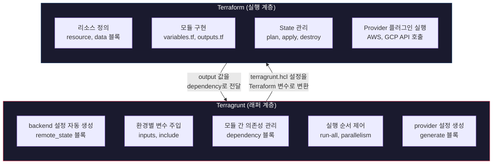
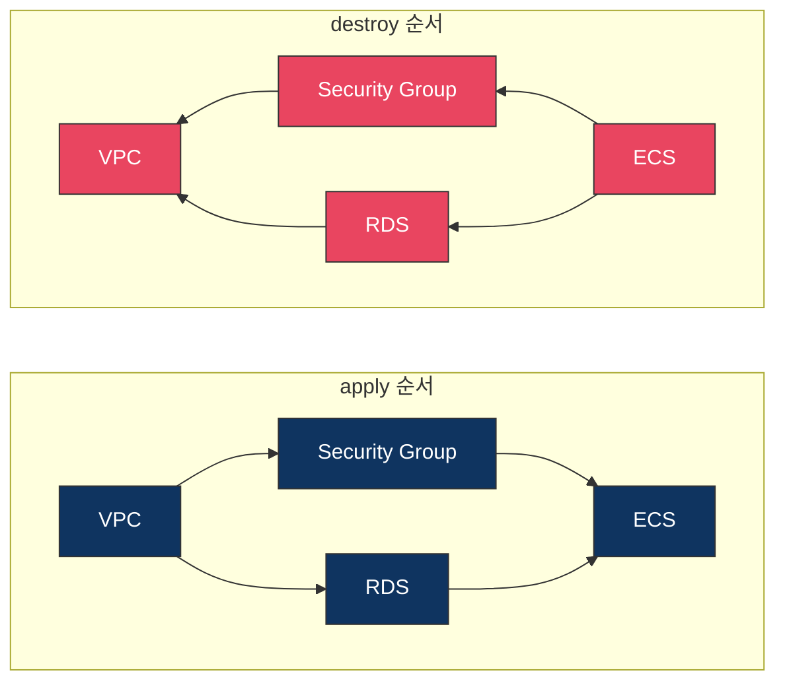
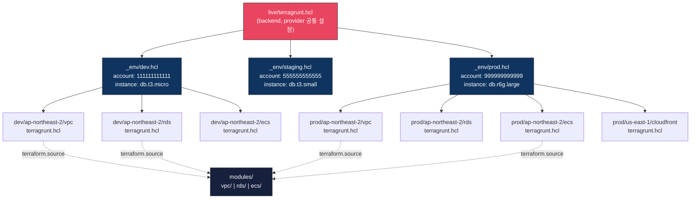

# Terragrunt

## Terragrunt가 뭔가

Gruntwork에서 만든 Terraform 래퍼(wrapper) 도구다. Terraform 코드를 직접 바꾸는 게 아니라, Terraform을 실행하기 전에 설정을 주입하고 모듈 간 의존성을 관리한다.

Terraform만 쓸 때 환경이 3개(dev, staging, prod)만 돼도 같은 코드를 복사해서 변수만 바꾸는 작업이 반복된다. backend 설정도 환경마다 복붙해야 하고, 모듈 간 의존성도 수동으로 맞춰야 한다. Terragrunt는 이 반복 작업을 `terragrunt.hcl` 파일 하나로 정리한다.

## Terraform과 Terragrunt의 역할 분리

Terraform과 Terragrunt가 각각 어떤 영역을 담당하는지 정리하면 다음과 같다.



Terragrunt는 "어떤 설정으로 실행할지"를 결정하고, Terraform은 "실제 인프라를 어떻게 만들지"를 정의한다. Terragrunt가 `backend.tf`와 `provider.tf`를 생성하고 변수를 주입한 다음, Terraform이 그 파일들을 읽어서 실제로 AWS API를 호출하는 구조다.

## Terraform만으로 부족해지는 시점

Terraform 프로젝트 초기에는 `main.tf`, `variables.tf`, `terraform.tfvars` 정도로 충분하다. 환경 하나에 리소스 수십 개 수준이면 Terragrunt 없이도 문제 없다.

부족해지는 시점은 명확하다:

- **환경이 3개 이상으로 늘어날 때**: dev/staging/prod 각각에 backend 설정, provider 설정, 변수 파일을 따로 관리해야 한다. `backend.tf`에 S3 버킷명, DynamoDB 테이블명, key 경로를 환경마다 하드코딩하게 된다.
- **모듈 간 출력값을 참조해야 할 때**: VPC 모듈의 subnet ID를 ECS 모듈에서 써야 하는데, `terraform_remote_state` data source를 매번 선언하는 코드가 쌓인다.
- **여러 AWS 계정을 쓸 때**: 계정마다 provider 설정이 다르고, assume role 설정을 각 디렉토리에 복사해야 한다.
- **팀원이 3명 이상일 때**: 누군가 dev 환경 backend 설정을 바꿨는데 staging은 안 바꿔서 state가 꼬이는 일이 생긴다.

하나라도 해당되면 Terragrunt 도입을 고려할 시점이다. 반대로 환경 하나에 모듈 몇 개 수준이면 Terragrunt는 오버엔지니어링이다.

## terragrunt.hcl 구조

Terragrunt의 설정 파일은 `terragrunt.hcl`이다. Terraform의 HCL과 같은 문법을 쓰지만, Terragrunt 전용 블록이 추가됐다.

### 기본 구조

```hcl
# live/dev/vpc/terragrunt.hcl

terraform {
  source = "../../../modules/vpc"
}

include "root" {
  path = find_in_parent_folders()
}

inputs = {
  vpc_cidr       = "10.0.0.0/16"
  environment    = "dev"
  azs            = ["ap-northeast-2a", "ap-northeast-2c"]
  private_subnets = ["10.0.1.0/24", "10.0.2.0/24"]
  public_subnets  = ["10.0.101.0/24", "10.0.102.0/24"]
}
```

`terraform.source`로 어떤 모듈을 사용할지 지정하고, `inputs`로 변수를 넘긴다. Terraform의 `terraform.tfvars`가 하던 역할을 여기서 한다.

### include 블록

`include`는 상위 디렉토리의 `terragrunt.hcl`을 상속받는 블록이다. 공통 설정(backend, provider)을 루트에 한 번만 쓰고, 하위 디렉토리에서 상속받아 쓴다.

```hcl
# live/terragrunt.hcl (루트)

remote_state {
  backend = "s3"
  generate = {
    path      = "backend.tf"
    if_exists = "overwrite_terragrunt"
  }
  config = {
    bucket         = "my-company-terraform-state"
    key            = "${path_relative_to_include()}/terraform.tfstate"
    region         = "ap-northeast-2"
    encrypt        = true
    dynamodb_table = "terraform-locks"
  }
}

generate "provider" {
  path      = "provider.tf"
  if_exists = "overwrite_terragrunt"
  contents  = <<EOF
provider "aws" {
  region = "ap-northeast-2"

  default_tags {
    tags = {
      ManagedBy   = "Terraform"
      Environment = "${local.environment}"
    }
  }
}
EOF
}
```

`path_relative_to_include()`가 핵심이다. `live/dev/vpc/terragrunt.hcl`에서 실행하면 `dev/vpc`가 되고, `live/prod/vpc/terragrunt.hcl`에서 실행하면 `prod/vpc`가 된다. 환경마다 state 파일 경로가 자동으로 분리된다.

`find_in_parent_folders()`는 상위 디렉토리를 재귀적으로 탐색해서 `terragrunt.hcl`을 찾는다. 디렉토리 깊이가 달라도 동작한다.

### dependency 블록

모듈 간 출력값을 참조할 때 쓴다. Terraform의 `terraform_remote_state` data source를 대체한다.

```hcl
# live/dev/ecs/terragrunt.hcl

dependency "vpc" {
  config_path = "../vpc"
}

dependency "rds" {
  config_path = "../rds"
}

inputs = {
  vpc_id             = dependency.vpc.outputs.vpc_id
  private_subnet_ids = dependency.vpc.outputs.private_subnet_ids
  db_endpoint        = dependency.rds.outputs.endpoint
}
```

`dependency`를 쓰면 Terragrunt가 실행 순서를 자동으로 결정한다. VPC → RDS → ECS 순서로 apply되고, 역순으로 destroy된다.



VPC와 Security Group처럼 의존 관계가 없는 모듈은 병렬로 실행된다. `run-all apply`를 하면 Terragrunt가 이 DAG(방향 비순환 그래프)를 분석해서 가능한 모듈부터 동시에 처리한다.

한 가지 주의할 점은, dependency가 아직 apply되지 않은 상태에서 `plan`을 돌리면 에러가 난다. 이때 `mock_outputs`를 쓴다:

```hcl
dependency "vpc" {
  config_path = "../vpc"

  mock_outputs = {
    vpc_id             = "vpc-mock"
    private_subnet_ids = ["subnet-mock-1", "subnet-mock-2"]
  }
  mock_outputs_allowed_terraform_commands = ["validate", "plan"]
}
```

`mock_outputs`는 `validate`와 `plan`에서만 동작하게 제한하는 게 좋다. `apply`에서 mock 값이 들어가면 실제 리소스가 잘못 생성될 수 있다.

## 멀티 계정 디렉토리 구조

실무에서 많이 쓰는 구조다. AWS 계정을 환경별로 분리하고, 리전도 나눈다. 전체 구조를 그림으로 보면 설정 파일이 어떻게 상속되는지 파악하기 쉽다.



루트 `terragrunt.hcl`에서 backend와 provider를 정의하고, `_env/` 파일이 환경별 변수를 갖고 있다. 각 모듈의 `terragrunt.hcl`은 `include`로 이 두 설정을 상속받고, `terraform.source`로 공유 모듈을 참조한다. 환경을 추가할 때 `_env/` 파일과 디렉토리만 복사하면 된다.

트리 구조로 보면 다음과 같다.

```
infrastructure/
├── live/
│   ├── terragrunt.hcl              # 루트 설정 (backend, 공통 변수)
│   ├── _env/
│   │   ├── dev.hcl                 # dev 환경 공통 변수
│   │   ├── staging.hcl
│   │   └── prod.hcl
│   ├── dev/
│   │   └── ap-northeast-2/
│   │       ├── vpc/
│   │       │   └── terragrunt.hcl
│   │       ├── rds/
│   │       │   └── terragrunt.hcl
│   │       └── ecs/
│   │           └── terragrunt.hcl
│   ├── staging/
│   │   └── ap-northeast-2/
│   │       ├── vpc/
│   │       │   └── terragrunt.hcl
│   │       └── ecs/
│   │           └── terragrunt.hcl
│   └── prod/
│       ├── ap-northeast-2/
│       │   ├── vpc/
│       │   │   └── terragrunt.hcl
│       │   ├── rds/
│       │   │   └── terragrunt.hcl
│       │   └── ecs/
│       │       └── terragrunt.hcl
│       └── us-east-1/
│           └── cloudfront/
│               └── terragrunt.hcl
└── modules/
    ├── vpc/
    │   ├── main.tf
    │   ├── variables.tf
    │   └── outputs.tf
    ├── rds/
    └── ecs/
```

`_env/` 디렉토리에 환경별 공통 변수를 넣는다:

```hcl
# live/_env/dev.hcl

locals {
  environment    = "dev"
  account_id     = "111111111111"
  instance_class = "db.t3.micro"
}
```

하위 `terragrunt.hcl`에서 이 파일을 읽는다:

```hcl
# live/dev/ap-northeast-2/rds/terragrunt.hcl

include "root" {
  path = find_in_parent_folders()
}

include "env" {
  path   = "${get_terragrunt_dir()}/../../_env/dev.hcl"
  expose = true
}

terraform {
  source = "../../../../modules/rds"
}

dependency "vpc" {
  config_path = "../vpc"
}

inputs = {
  environment       = include.env.locals.environment
  instance_class    = include.env.locals.instance_class
  vpc_id            = dependency.vpc.outputs.vpc_id
  subnet_ids        = dependency.vpc.outputs.private_subnet_ids
}
```

이 구조의 장점은 환경을 추가할 때 디렉토리를 복사하고 `_env/` 파일만 새로 만들면 된다는 것이다. Terraform 모듈 코드는 건드리지 않는다.

멀티 계정에서 assume role이 필요하면 루트 `terragrunt.hcl`에서 처리한다:

```hcl
# live/terragrunt.hcl

locals {
  account_vars = read_terragrunt_config(find_in_parent_folders("account.hcl"))
  account_id   = local.account_vars.locals.account_id
}

generate "provider" {
  path      = "provider.tf"
  if_exists = "overwrite_terragrunt"
  contents  = <<EOF
provider "aws" {
  region = "ap-northeast-2"

  assume_role {
    role_arn = "arn:aws:iam::${local.account_id}:role/TerraformRole"
  }
}
EOF
}
```

각 환경 디렉토리에 `account.hcl`을 둔다:

```hcl
# live/dev/account.hcl
locals {
  account_id = "111111111111"
}

# live/prod/account.hcl
locals {
  account_id = "999999999999"
}
```

## run-all 명령어

`run-all`은 하위 디렉토리의 모든 Terragrunt 모듈을 한 번에 실행한다.

```bash
# dev 환경 전체 plan
cd live/dev
terragrunt run-all plan

# dev 환경 전체 apply
terragrunt run-all apply

# 특정 리전만
cd live/dev/ap-northeast-2
terragrunt run-all apply
```

dependency를 기반으로 실행 순서를 결정하고, 의존성이 없는 모듈은 병렬로 실행한다.

### run-all 사용 시 주의사항

**prod 환경에서 `run-all apply`는 쓰지 않는 게 좋다.** 모듈이 10개 넘으면 중간에 하나가 실패했을 때 어디까지 적용됐는지 파악하기 어렵다. prod는 모듈 단위로 하나씩 apply하는 게 안전하다.

`run-all plan`은 유용하다. 변경사항 전체를 한 눈에 볼 수 있다. 다만 출력이 길어지면 모듈별 plan 결과가 섞여서 읽기 어려우니, `--terragrunt-log-level error` 옵션으로 불필요한 로그를 줄인다.

```bash
terragrunt run-all plan --terragrunt-log-level error
```

`run-all destroy`는 더 위험하다. dependency 역순으로 삭제하긴 하지만, 실수로 상위 디렉토리에서 실행하면 전체 인프라가 날아간다. `--terragrunt-exclude-dir` 옵션으로 특정 디렉토리를 제외할 수 있지만, 근본적으로 `destroy`는 모듈 단위로 실행하는 게 맞다.

```bash
# 이렇게 하지 말 것
cd live/prod
terragrunt run-all destroy

# 이렇게 해야 한다
cd live/prod/ap-northeast-2/ecs
terragrunt destroy
```

`run-all`에서 특정 모듈만 제외하려면:

```bash
terragrunt run-all apply \
  --terragrunt-exclude-dir live/prod/ap-northeast-2/rds
```

### 병렬 실행 제어

기본적으로 Terragrunt는 의존성 없는 모듈을 동시에 실행한다. AWS API rate limit에 걸리면 `--terragrunt-parallelism` 옵션으로 동시 실행 수를 제한한다.

```bash
# 동시에 최대 3개 모듈만 실행
terragrunt run-all apply --terragrunt-parallelism 3
```

리소스가 많은 환경에서 parallelism을 안 걸면 `ThrottlingException`이 나면서 apply가 실패하는 경우가 있다. 특히 IAM 관련 리소스를 여러 모듈에서 동시에 만들 때 자주 발생한다.

## 실무에서 자주 겪는 문제

### 캐시 디렉토리 문제

Terragrunt는 모듈 소스를 `.terragrunt-cache` 디렉토리에 다운로드한다. 이 캐시가 오래되면 모듈 변경사항이 반영 안 되는 경우가 있다.

```bash
# 캐시 삭제
find . -type d -name ".terragrunt-cache" -exec rm -rf {} +

# 또는 모듈별로
cd live/dev/vpc
rm -rf .terragrunt-cache
terragrunt init
```

`.gitignore`에 `.terragrunt-cache`를 넣는 건 기본이다. 안 넣으면 PR에 캐시 파일이 수백 개 올라온다.

### state lock 충돌

`run-all`로 여러 모듈을 동시에 실행할 때, 같은 DynamoDB 테이블을 쓰면 lock 충돌이 생길 수 있다. state 파일 경로(`key`)가 모듈마다 다르니 실제로 lock이 충돌하는 일은 드물지만, DynamoDB 테이블에 write capacity가 부족하면 에러가 난다. on-demand 모드로 설정하면 이 문제는 사라진다.

### generate 파일 관리

`generate` 블록으로 만든 `backend.tf`, `provider.tf`는 Terragrunt가 자동 생성한 파일이다. 이 파일을 직접 수정하면 다음 `terragrunt init` 때 덮어쓰기 된다. `generate` 파일은 절대 수동으로 편집하지 않는다.

### Terraform 버전 고정

팀에서 Terraform 버전이 다르면 state 호환성 문제가 생긴다. `terragrunt.hcl`에서 버전을 강제할 수 있다:

```hcl
terraform_version_constraint = ">= 1.5.0, < 1.7.0"
```

이 설정이 없으면 팀원 한 명이 최신 버전으로 `apply`한 뒤 다른 팀원이 구버전으로 `plan`하면 state 파일 포맷이 안 맞아서 에러가 난다.
