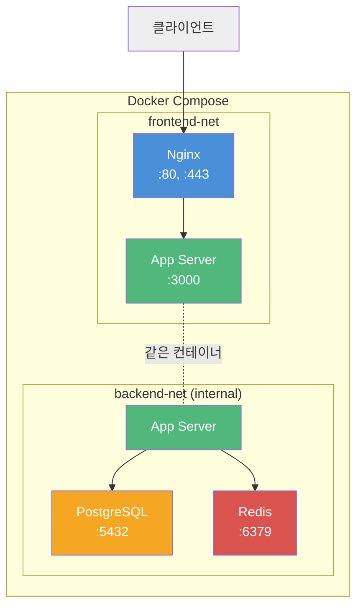
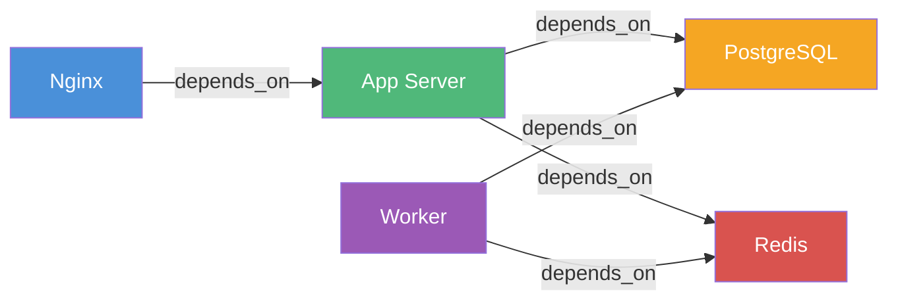
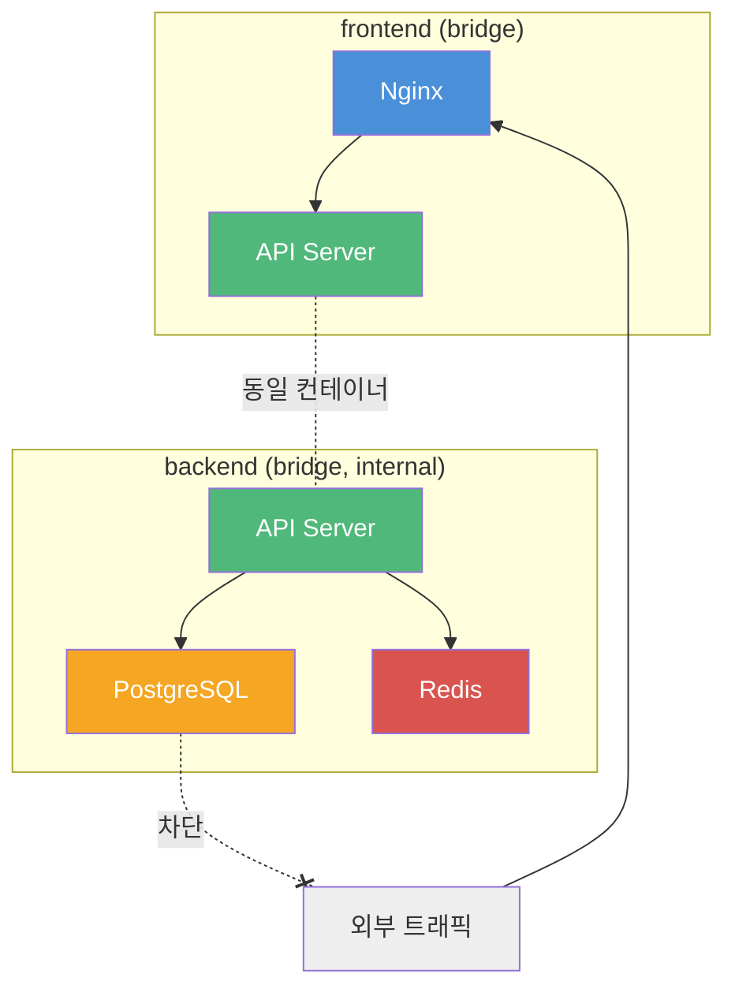
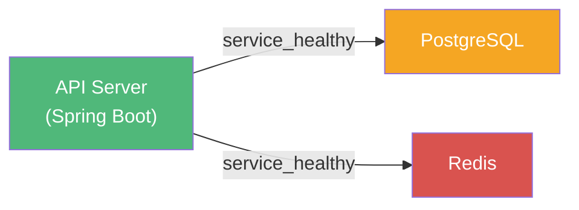

# Docker Compose

## Docker Compose가 뭔가

여러 컨테이너를 하나의 YAML 파일로 정의하고, `docker-compose up` 한 번으로 전부 띄우는 도구다.

컨테이너를 하나씩 `docker run`으로 띄우다 보면 금방 한계가 온다. 웹 서버, DB, 캐시 서버를 각각 실행하면서 네트워크 연결, 볼륨 마운트, 환경 변수를 매번 커맨드라인에 적어야 한다. 팀원이 합류하면 이 과정을 문서로 공유해야 하고, 문서가 코드와 어긋나는 순간 "내 로컬에서는 되는데"가 시작된다.

Compose는 이 문제를 해결한다. `docker-compose.yml`에 서비스 구성을 선언하면, 그 파일 자체가 인프라 명세서가 된다. git으로 버전 관리되니까 누가 언제 뭘 바꿨는지 추적할 수 있고, 새 팀원은 `docker-compose up -d`만 치면 된다.

단, Compose는 단일 호스트 환경을 전제로 한다. 여러 서버에 컨테이너를 분산 배치하는 건 Kubernetes나 Docker Swarm 영역이다. 로컬 개발 환경이나 소규모 서비스 운영에 Compose를 쓰고, 규모가 커지면 오케스트레이션 도구로 넘어가는 게 일반적이다.

---

## Compose 파일 구조

### 기본 골격

```yaml
services:
  web:
    image: nginx:alpine
    ports:
      - "80:80"

  api:
    build: ./api
    ports:
      - "3000:3000"
    depends_on:
      - db

  db:
    image: postgres:16
    volumes:
      - db-data:/var/lib/postgresql/data

volumes:
  db-data:

networks:
  default:
    driver: bridge
```

Compose 파일은 크게 `services`, `volumes`, `networks` 세 섹션으로 나뉜다.

`version` 키는 Compose V2(2023년 이후 기본)부터 더 이상 필요 없다. 아직 쓰는 프로젝트가 많지만, 새로 작성할 때는 생략해도 된다.

### 서비스 구성도

아래는 전형적인 웹 애플리케이션의 Compose 서비스 구성이다. 각 서비스가 어떤 역할을 맡고, 어디서 외부 요청을 받는지 보여준다.



Nginx는 외부 요청을 받아서 App Server로 프록시한다. App Server는 frontend-net과 backend-net 양쪽에 연결되어 있다. DB와 Redis는 backend-net에만 있으므로 외부에서 직접 접근할 수 없다. 이렇게 네트워크를 분리하면 DB 포트를 호스트에 노출하지 않아도 된다.

### 서비스 의존성 관계



`depends_on`은 컨테이너 시작 순서만 제어한다. DB 컨테이너가 시작됐다고 해서 DB가 쿼리를 받을 준비가 된 건 아니다. 이 문제는 뒤에서 다룬다.

---

## 주요 설정 옵션

### image vs build

```yaml
services:
  # 이미 만들어진 이미지 사용
  redis:
    image: redis:7-alpine

  # Dockerfile로 이미지 빌드
  api:
    build:
      context: ./api
      dockerfile: Dockerfile
      args:
        NODE_ENV: production
```

`image`는 Docker Hub나 레지스트리에서 이미지를 가져온다. `build`는 Dockerfile로 이미지를 직접 만든다. 둘 다 지정하면 빌드한 이미지에 `image`에 지정한 이름을 붙인다.

### ports

```yaml
ports:
  - "3000:3000"     # 호스트 3000 → 컨테이너 3000
  - "8080:80"       # 호스트 8080 → 컨테이너 80
  - "127.0.0.1:5432:5432"  # localhost에서만 접근 가능
```

DB 포트를 호스트에 열 때는 `127.0.0.1`을 붙이는 습관을 들이자. 안 그러면 `0.0.0.0`에 바인딩되어서 같은 네트워크의 다른 장비에서도 접근 가능해진다. 개발 환경에서는 상관없다고 생각하기 쉽지만, 카페 WiFi에서 작업하다가 DB가 노출되는 경우가 실제로 있다.

### volumes

```yaml
volumes:
  - db-data:/var/lib/postgresql/data   # named volume
  - ./app:/app                          # bind mount
  - /app/node_modules                   # anonymous volume
```

named volume은 Docker가 관리하는 영역에 데이터를 저장한다. `docker-compose down`으로 컨테이너를 내려도 데이터가 남는다. `docker-compose down -v`를 하면 볼륨까지 삭제되니 주의해야 한다.

bind mount는 호스트의 디렉토리를 컨테이너에 그대로 연결한다. 개발 중에 코드 변경을 실시간으로 반영할 때 쓴다. 다만 macOS에서는 bind mount가 느리다. `node_modules`처럼 파일 수가 많은 디렉토리는 anonymous volume으로 분리하면 체감 속도가 크게 좋아진다.

### environment

```yaml
services:
  api:
    environment:
      - NODE_ENV=production
      - DB_HOST=db
    env_file:
      - .env
```

환경 변수를 인라인으로 넣을 수도 있고, `.env` 파일로 빼둘 수도 있다. `.env` 파일은 반드시 `.gitignore`에 추가해야 한다. 패스워드가 git 히스토리에 한번 들어가면 삭제하기 매우 까다롭다.

### depends_on과 healthcheck

```yaml
services:
  api:
    depends_on:
      db:
        condition: service_healthy

  db:
    image: postgres:16
    healthcheck:
      test: ["CMD-SHELL", "pg_isready -U postgres"]
      interval: 5s
      timeout: 3s
      retries: 5
```

`depends_on`만 쓰면 컨테이너 시작 순서만 보장한다. DB 프로세스가 떴는지, 실제로 커넥션을 받을 수 있는지는 확인하지 않는다.

`condition: service_healthy`를 쓰면 healthcheck가 통과할 때까지 기다린다. DB가 준비되기 전에 API 서버가 시작해서 커넥션 에러를 뿜는 문제를 여기서 잡는다.

healthcheck 없이 해결하는 방법도 있다. API 서버 코드에서 DB 커넥션 재시도 로직을 넣는 건데, 어차피 프로덕션에서도 필요한 로직이라 둘 다 하는 게 맞다.

---

## 네트워크

### 기본 동작

Compose는 프로젝트 단위로 기본 네트워크를 하나 만든다. 같은 Compose 파일에 정의된 서비스는 서비스 이름으로 서로 통신할 수 있다.

```yaml
services:
  api:
    image: myapi:latest
    # api 컨테이너에서 "db"라는 호스트명으로 PostgreSQL에 접근 가능
  db:
    image: postgres:16
```

`api` 컨테이너 안에서 `db:5432`로 접근하면 PostgreSQL에 연결된다. Docker 내부 DNS가 서비스 이름을 컨테이너 IP로 변환해준다.

### 네트워크 분리

```yaml
services:
  nginx:
    image: nginx:alpine
    networks:
      - frontend

  api:
    build: ./api
    networks:
      - frontend
      - backend

  db:
    image: postgres:16
    networks:
      - backend

networks:
  frontend:
    driver: bridge
  backend:
    driver: bridge
    internal: true
```

`internal: true`로 설정한 네트워크는 외부 인터넷 접근이 차단된다. DB 컨테이너가 외부로 패킷을 보낼 이유가 없으니, backend 네트워크를 internal로 설정하면 보안이 한 단계 올라간다.

네트워크 분리 구조를 다이어그램으로 보면 이렇다.



---

## 다중 환경 구성

Compose 파일 여러 개를 겹쳐서 사용할 수 있다. 기본 설정에 환경별 오버라이드를 얹는 방식이다.

**docker-compose.yml** (공통)
```yaml
services:
  api:
    build: ./api
    depends_on:
      - db

  db:
    image: postgres:16
    volumes:
      - db-data:/var/lib/postgresql/data

volumes:
  db-data:
```

**docker-compose.dev.yml** (개발 환경 오버라이드)
```yaml
services:
  api:
    ports:
      - "3000:3000"
    volumes:
      - ./api:/app
    environment:
      - NODE_ENV=development
      - DEBUG=true

  db:
    ports:
      - "127.0.0.1:5432:5432"
```

**docker-compose.prod.yml** (운영 환경 오버라이드)
```yaml
services:
  api:
    restart: always
    environment:
      - NODE_ENV=production
    deploy:
      replicas: 2
      resources:
        limits:
          cpus: '1.0'
          memory: 512M

  db:
    restart: always
```

```bash
# 개발 환경
docker compose -f docker-compose.yml -f docker-compose.dev.yml up -d

# 운영 환경
docker compose -f docker-compose.yml -f docker-compose.prod.yml up -d
```

뒤에 지정한 파일이 앞의 파일을 덮어쓴다. 개발 환경에서는 소스 코드를 bind mount하고 DB 포트를 열고, 운영 환경에서는 리소스 제한을 걸고 재시작 정책을 설정한다.

`docker-compose.override.yml`이라는 파일이 있으면 자동으로 로드된다. 개인 개발 설정을 여기에 넣고 `.gitignore`에 추가하면 팀원마다 다른 포트 번호를 쓰거나 디버그 모드를 켜는 게 가능하다.

---

## 리소스 제한

컨테이너에 리소스 제한을 안 걸면, 하나의 서비스가 메모리를 다 잡아먹어서 다른 서비스까지 죽는 일이 생긴다. 특히 Java 애플리케이션은 JVM이 가용 메모리를 최대한 확보하려 하기 때문에 제한이 필수다.

### 메모리

```yaml
services:
  api:
    image: myapi:latest
    deploy:
      resources:
        limits:
          memory: 512M
        reservations:
          memory: 256M
```

- **limits**: 이 값을 넘기면 OOM Killer가 컨테이너를 죽인다
- **reservations**: 최소 보장 메모리. 시스템 메모리가 부족할 때 이만큼은 확보해준다

limits와 reservations의 차이를 그림으로 보면 이렇다.

```
메모리 사용량
 │
 │  ┌─── limits (512M) ─── 넘으면 OOM Kill
 │  │
 │  │  ← 이 구간은 여유가 있을 때만 쓸 수 있음
 │  │
 │  ├─── reservations (256M) ─── 항상 보장
 │  │
 │  │  ← 이 구간은 무조건 사용 가능
 │  │
 └──┘
```

DB처럼 메모리가 중요한 서비스는 `mem_swappiness: 0`을 추가로 설정해서 스왑을 쓰지 않게 해야 한다. 디스크로 스왑이 일어나면 쿼리 응답 시간이 수십 배 느려진다.

### CPU

```yaml
services:
  api:
    deploy:
      resources:
        limits:
          cpus: '1.5'
        reservations:
          cpus: '0.5'
```

`cpus: '1.5'`는 1.5코어까지 사용 가능하다는 뜻이다. CPU 제한에 걸리면 스로틀링이 발생해서 응답 시간이 불규칙해진다. 평소 사용량의 1.5~2배 정도로 limits를 잡는 게 적당하다.

`cpu_shares`라는 옵션도 있는데, 이건 상대적 가중치다. 모든 컨테이너가 CPU를 100% 쓰려고 할 때만 비율에 맞게 나눈다. 여유가 있으면 어떤 컨테이너든 자유롭게 쓸 수 있어서, limits보다 유연하다.

### 디스크 I/O

```yaml
services:
  db:
    image: postgres:16
    blkio_weight: 1000       # 높은 I/O 우선순위 (10~1000)
    device_read_bps:
      - "/dev/sda:50mb"
    device_write_bps:
      - "/dev/sda:30mb"

  log-collector:
    image: fluentd:latest
    blkio_weight: 100        # 낮은 I/O 우선순위
```

DB는 디스크 I/O가 성능에 직결되므로 높은 우선순위를 주고, 로그 수집처럼 즉시성이 덜 중요한 서비스는 낮게 잡는다.

### 프로세스와 파일 디스크립터

```yaml
services:
  api:
    pids_limit: 200
    ulimits:
      nofile:
        soft: 65536
        hard: 65536
```

`pids_limit`은 컨테이너 내부에서 생성할 수 있는 프로세스 수 상한이다. fork bomb 같은 상황에서 호스트 전체가 죽는 걸 막아준다.

`nofile`은 동시에 열 수 있는 파일 디스크립터 수인데, 소켓도 파일 디스크립터를 사용하므로 동시 접속이 많은 서비스에서는 기본값(1024)이 부족하다.

---

## 명령어 정리

자주 쓰는 명령어만 모았다. Compose V2 기준이라 `docker compose`(하이픈 없음)로 실행한다.

```bash
# 서비스 실행/중지
docker compose up -d              # 백그라운드 실행
docker compose up -d --build      # 이미지 다시 빌드 후 실행
docker compose down               # 중지 및 컨테이너 삭제
docker compose down -v            # 볼륨까지 삭제 (DB 데이터 날아감)

# 상태 확인
docker compose ps                 # 실행 중인 서비스 목록
docker compose logs -f api        # 특정 서비스 로그 실시간 확인
docker compose top                # 각 컨테이너의 프로세스 목록

# 디버깅
docker compose exec api sh        # 컨테이너 내부 셸 접속
docker compose exec api ping db   # 서비스 간 네트워크 확인

# 특정 서비스만 조작
docker compose up -d api          # api만 실행
docker compose restart api        # api만 재시작
docker compose up -d --no-deps api  # 의존 서비스 무시하고 api만 실행

# 스케일링
docker compose up -d --scale api=3  # api 인스턴스 3개로 늘림
```

`docker-compose`(하이픈)는 V1 CLI다. 2023년 7월에 EOL되었고, 이후 버전에서는 `docker compose`(공백)를 써야 한다. 기존 CI 스크립트에 `docker-compose`가 남아있다면 바꿔야 한다.

---

## 실전 예제: Spring Boot + PostgreSQL + Redis

실제 프로젝트에서 쓸 법한 구성이다.

```yaml
services:
  api:
    build:
      context: .
      dockerfile: Dockerfile
    ports:
      - "8080:8080"
    environment:
      SPRING_DATASOURCE_URL: jdbc:postgresql://db:5432/myapp
      SPRING_DATASOURCE_USERNAME: myapp
      SPRING_DATASOURCE_PASSWORD: ${DB_PASSWORD}
      SPRING_REDIS_HOST: redis
    depends_on:
      db:
        condition: service_healthy
      redis:
        condition: service_healthy
    deploy:
      resources:
        limits:
          memory: 768M
          cpus: '1.0'
    restart: unless-stopped

  db:
    image: postgres:16-alpine
    ports:
      - "127.0.0.1:5432:5432"
    environment:
      POSTGRES_DB: myapp
      POSTGRES_USER: myapp
      POSTGRES_PASSWORD: ${DB_PASSWORD}
    volumes:
      - db-data:/var/lib/postgresql/data
      - ./init.sql:/docker-entrypoint-initdb.d/init.sql
    healthcheck:
      test: ["CMD-SHELL", "pg_isready -U myapp"]
      interval: 5s
      timeout: 3s
      retries: 5
    deploy:
      resources:
        limits:
          memory: 1G
    restart: unless-stopped

  redis:
    image: redis:7-alpine
    command: redis-server --appendonly yes --maxmemory 256mb --maxmemory-policy allkeys-lru
    ports:
      - "127.0.0.1:6379:6379"
    volumes:
      - redis-data:/data
    healthcheck:
      test: ["CMD", "redis-cli", "ping"]
      interval: 5s
      timeout: 3s
      retries: 5
    deploy:
      resources:
        limits:
          memory: 512M
    restart: unless-stopped

volumes:
  db-data:
  redis-data:
```

이 구성에서 짚어볼 점들:

- DB 패스워드는 `${DB_PASSWORD}`로 `.env` 파일에서 가져온다. YAML에 패스워드를 직접 쓰면 안 된다
- DB와 Redis 포트에 `127.0.0.1`을 붙였다. 개발 중에 호스트에서 직접 접속할 일이 있어서 포트를 열되, 외부 노출은 막는다
- healthcheck로 의존 서비스가 준비될 때까지 기다린다
- Redis에 `maxmemory`와 `eviction policy`를 설정했다. 안 하면 메모리를 무한정 쓰다가 OOM으로 죽는다
- JVM 기반 서비스는 메모리 limits를 넉넉하게 잡아야 한다. JVM 힙 외에 metaspace, thread stack, native memory 등이 별도로 필요하다

### 의존성 관계



---

## 트러블슈팅

### 컨테이너가 시작하자마자 죽는 경우

```bash
docker compose logs api
```

로그를 먼저 확인한다. 대부분 환경 변수 누락이거나 의존 서비스 연결 실패다.

`depends_on` 없이 쓰면 DB보다 API가 먼저 뜨는 경우가 있다. 컨테이너 생성 순서가 보장되지 않기 때문이다. healthcheck 기반 `depends_on`을 쓰거나, 애플리케이션에서 재시도 로직을 넣어야 한다.

### 볼륨 권한 문제

Linux에서는 컨테이너 내부 프로세스의 UID와 호스트 파일의 소유자가 다르면 권한 에러가 난다. PostgreSQL 컨테이너가 data 디렉토리에 쓸 수 없다는 에러를 내는 경우가 이것이다.

```bash
# 볼륨 데이터 초기화
docker compose down -v
docker compose up -d
```

named volume을 쓰면 Docker가 권한을 알아서 처리해준다. bind mount를 써야 하는 상황이면 Dockerfile에서 해당 UID로 디렉토리 소유권을 바꿔야 한다.

### 포트 충돌

```bash
# 어떤 프로세스가 포트를 점유하고 있는지 확인
lsof -i :3000
```

`docker compose up`할 때 "port is already allocated" 에러가 나면 호스트에서 해당 포트를 이미 사용 중이라는 뜻이다. 다른 Compose 프로젝트가 같은 포트를 쓰고 있을 수도 있다.

### 이미지 캐시 문제

코드를 바꿨는데 반영이 안 되면 이미지 캐시 때문이다.

```bash
docker compose build --no-cache api
docker compose up -d api
```

`--no-cache`로 빌드하면 캐시를 무시하고 처음부터 다시 빌드한다. Dockerfile의 `COPY` 이전 레이어가 바뀌지 않으면 Docker는 캐시를 재사용하는데, 이 때문에 코드 변경이 반영 안 되는 경우가 있다.

### 네트워크 문제 디버깅

```bash
# 서비스 간 DNS 확인
docker compose exec api nslookup db

# 네트워크 목록 확인
docker network ls

# 특정 네트워크에 연결된 컨테이너 확인
docker network inspect <project>_default
```

서비스 이름으로 통신이 안 되면 두 서비스가 같은 네트워크에 있는지 확인한다. 네트워크를 명시적으로 설정했을 때 한쪽을 빠뜨리는 실수가 종종 있다.

---

## 운영 팁

### 로그 관리

컨테이너 로그는 기본적으로 json-file 드라이버로 저장된다. 로그 크기 제한을 안 걸면 디스크가 찬다.

```yaml
services:
  api:
    logging:
      driver: "json-file"
      options:
        max-size: "10m"
        max-file: "3"
```

서비스마다 최대 10MB 파일 3개까지만 유지한다. 30MB를 넘으면 오래된 로그부터 삭제된다.

### Docker Secrets

환경 변수에 패스워드를 넣는 건 `docker inspect`로 누구나 볼 수 있어서 보안상 좋지 않다. Swarm 모드가 아니더라도 파일 기반 secrets를 쓸 수 있다.

```yaml
services:
  api:
    secrets:
      - db_password
    environment:
      DB_PASSWORD_FILE: /run/secrets/db_password

secrets:
  db_password:
    file: ./secrets/db_password.txt
```

애플리케이션에서 `DB_PASSWORD_FILE` 경로의 파일을 읽어서 패스워드로 사용한다. 공식 PostgreSQL, MySQL 이미지는 `*_FILE` 환경 변수를 기본 지원한다.

### CI에서의 활용

```yaml
# docker-compose.test.yml
services:
  test:
    build: .
    command: npm test
    environment:
      - NODE_ENV=test
      - DB_HOST=test-db
    depends_on:
      test-db:
        condition: service_healthy

  test-db:
    image: postgres:16-alpine
    environment:
      POSTGRES_DB: testdb
      POSTGRES_PASSWORD: test
    tmpfs:
      - /data/db
    healthcheck:
      test: ["CMD-SHELL", "pg_isready -U postgres"]
      interval: 3s
      retries: 5
```

```bash
docker compose -f docker-compose.test.yml up --build --abort-on-container-exit
echo $?  # 테스트 종료 코드
docker compose -f docker-compose.test.yml down
```

`--abort-on-container-exit` 옵션이 중요하다. 테스트 컨테이너가 끝나면 나머지 서비스도 같이 종료시킨다. `tmpfs`를 쓰면 디스크에 쓰지 않아서 테스트가 빠르고, 정리할 것도 없다.

---

## 참고

- [Docker Compose 공식 문서](https://docs.docker.com/compose/)
- [Compose 파일 레퍼런스](https://docs.docker.com/compose/compose-file/)
- [Compose V2 마이그레이션](https://docs.docker.com/compose/migrate/)
