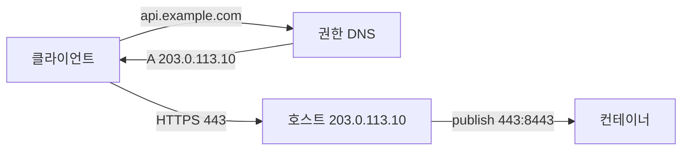
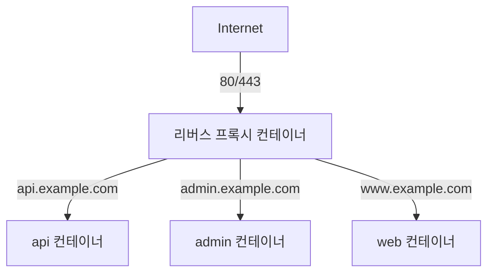

# Docker에서 도메인 연결하는 방법

## 목차
- [기본 흐름: DNS → 호스트 → 컨테이너](#기본-흐름-dns--호스트--컨테이너)
- [단일 컨테이너를 80/443에 직접 노출하기](#단일-컨테이너를-80443에-직접-노출하기)
- [리버스 프록시 패턴 비교](#리버스-프록시-패턴-비교)
- [nginx-proxy + acme-companion](#nginx-proxy--acme-companion)
- [Traefik 라벨 기반 라우팅](#traefik-라벨-기반-라우팅)
- [서브도메인별 컨테이너 분기](#서브도메인별-컨테이너-분기)
- [컨테이너 내부 DNS와 host.docker.internal](#컨테이너-내부-dns와-hostdockerinternal)
- [네트워크 모드와 80/443 권한 문제](#네트워크-모드와-80443-권한-문제)
- [로컬 개발에서 도메인 + HTTPS](#로컬-개발에서-도메인--https)
- [운영 배포: Cloudflare DNS + DNS-01 챌린지](#운영-배포-cloudflare-dns--dns-01-챌린지)
- [트러블슈팅](#트러블슈팅)

---

## 기본 흐름: DNS → 호스트 → 컨테이너

도메인을 컨테이너에 붙이는 일은 결국 세 단계다. 이 순서가 머릿속에 잡혀 있어야 어디서 막혔는지 빠르게 진단한다.

1. 도메인 등록기관(가비아, Cloudflare, Route53 등)에서 A 레코드를 호스트 서버의 공인 IP로 지정한다.
2. 호스트의 80/443 포트로 트래픽이 들어온다.
3. Docker가 그 포트를 컨테이너 내부 포트로 매핑한다.



A 레코드 변경은 TTL 만큼 캐시가 남는다. 보통 300초(5분)로 두고 운영 중 IP 바꿀 일이 있으면 미리 60초로 낮춰둔다. dig로 권한 DNS에 직접 물어봐서 전파 여부를 확인한다.

```bash
dig api.example.com @8.8.8.8 +short
dig api.example.com @1.1.1.1 +short
```

여러 리졸버에서 같은 IP가 나오면 전파가 끝난 거다. 클라이언트 PC의 OS 캐시까지 비우려면 macOS는 `sudo dscacheutil -flushcache`, 리눅스 systemd-resolved는 `sudo resolvectl flush-caches`.

---

## 단일 컨테이너를 80/443에 직접 노출하기

가장 단순한 형태. 도메인 하나, 컨테이너 하나.

```bash
docker run -d \
  --name web \
  -p 80:80 -p 443:443 \
  -v /etc/letsencrypt:/etc/letsencrypt:ro \
  nginx:1.27
```

이 방식의 한계가 명확하다.

- 한 호스트에서 여러 도메인을 운영하기 어렵다. 80 포트는 하나뿐이라 두 번째 컨테이너는 8080 같은 다른 포트를 써야 한다.
- 인증서 갱신을 컨테이너 안에서 해야 하는데, certbot을 컨테이너 안에서 돌리면 nginx 재시작이 까다롭다.
- 호스트 OS의 nginx와 충돌하는 경우가 잦다. 처음 깐 서버에서 80 포트가 LISTEN 중이면 십중팔구 호스트의 nginx나 apache가 살아있다. `sudo lsof -i :80`으로 확인하고 정리한 뒤에 시작한다.

도메인이 하나, 트래픽도 단순하다면 이대로 써도 된다. 하지만 두 번째 도메인이 추가되는 순간부터는 리버스 프록시 패턴으로 가야 한다.

---

## 리버스 프록시 패턴 비교

호스트의 80/443은 프록시 컨테이너 하나가 점유하고, 뒤에 붙는 애플리케이션 컨테이너는 도메인/경로 기준으로 분기한다.



세 가지 옵션을 비교한다.

| 항목 | nginx-proxy | Traefik | Caddy |
|------|-------------|---------|-------|
| 설정 방식 | docker-gen이 nginx.conf 자동 생성 | 라벨 기반 동적 라우팅 | Caddyfile 또는 라벨 |
| Let's Encrypt | acme-companion 별도 컨테이너 | 내장 | 내장 (자동) |
| 진입 장벽 | 낮음, nginx 문법 그대로 | 중간, 자체 개념 학습 필요 | 가장 낮음 |
| 동적 갱신 | 컨테이너 추가/삭제 시 nginx reload | 즉시 반영 | 즉시 반영 |
| 운영 안정성 | 검증된 기간 가장 길다 | 마이크로서비스에 강함 | 가장 단순 |

5년 가까이 운영해본 체감으로는, 단일 호스트에서 docker-compose로 몇 개 서비스 돌리는 정도면 Caddy가 가장 손이 안 간다. 컨테이너 수가 늘고 동적으로 추가/삭제가 잦으면 Traefik이 편하다. 기존 nginx 설정 자산이 많고 그대로 살리고 싶으면 nginx-proxy다.

---

## nginx-proxy + acme-companion

`jwilder/nginx-proxy`는 컨테이너의 환경변수 `VIRTUAL_HOST`를 보고 자동으로 가상호스트를 만들어준다. 인증서는 `nginxproxy/acme-companion`이 별도로 처리한다.

```yaml
version: "3.8"

services:
  nginx-proxy:
    image: nginxproxy/nginx-proxy:1.6
    container_name: nginx-proxy
    ports:
      - "80:80"
      - "443:443"
    volumes:
      - /var/run/docker.sock:/tmp/docker.sock:ro
      - certs:/etc/nginx/certs
      - vhost:/etc/nginx/vhost.d
      - html:/usr/share/nginx/html
    networks:
      - proxy

  acme-companion:
    image: nginxproxy/acme-companion:2.4
    container_name: acme-companion
    depends_on:
      - nginx-proxy
    environment:
      DEFAULT_EMAIL: admin@example.com
    volumes:
      - /var/run/docker.sock:/var/run/docker.sock:ro
      - certs:/etc/nginx/certs
      - vhost:/etc/nginx/vhost.d
      - html:/usr/share/nginx/html
      - acme:/etc/acme.sh
    networks:
      - proxy

  api:
    image: my-api:latest
    container_name: api
    expose:
      - "3000"
    environment:
      VIRTUAL_HOST: api.example.com
      VIRTUAL_PORT: "3000"
      LETSENCRYPT_HOST: api.example.com
      LETSENCRYPT_EMAIL: admin@example.com
    networks:
      - proxy

volumes:
  certs:
  vhost:
  html:
  acme:

networks:
  proxy:
    name: proxy
```

여기서 자주 빠뜨리는 게 두 가지 있다.

첫째, `expose`만 쓰고 `ports`는 쓰지 않는다. `ports`로 호스트 포트를 열면 외부에서 컨테이너에 직접 붙어버려서 프록시를 우회한다.

둘째, `VIRTUAL_PORT`는 컨테이너 내부 포트다. nginx-proxy 기본값이 80이라 애플리케이션이 다른 포트에서 듣는다면 반드시 명시한다. 디폴트만 믿고 안 적었다가 502 보면서 한참 헤매는 경우가 있다.

acme-companion은 시작 직후 인증서를 발급받고, 이후 매일 자정 갱신 여부를 체크한다. 처음 발급 실패하면 `docker logs acme-companion`에서 `account.thumbprint` 같은 키워드 주변에 원인이 찍혀 있다. Let's Encrypt 레이트 리밋(주당 도메인당 50건)에 걸리면 staging 환경으로 먼저 테스트한다. `ACME_CA_URI=https://acme-staging-v02.api.letsencrypt.org/directory`를 acme-companion에 넣는다.

---

## Traefik 라벨 기반 라우팅

Traefik은 컨테이너 라벨로 라우터(어떤 도메인/경로) → 서비스(어떤 컨테이너) → 미들웨어(인증, 리다이렉트) 흐름을 구성한다.

```yaml
version: "3.8"

services:
  traefik:
    image: traefik:v3.2
    container_name: traefik
    command:
      - "--providers.docker=true"
      - "--providers.docker.exposedbydefault=false"
      - "--entrypoints.web.address=:80"
      - "--entrypoints.websecure.address=:443"
      - "--certificatesresolvers.le.acme.email=admin@example.com"
      - "--certificatesresolvers.le.acme.storage=/letsencrypt/acme.json"
      - "--certificatesresolvers.le.acme.tlschallenge=true"
      - "--entrypoints.web.http.redirections.entrypoint.to=websecure"
      - "--entrypoints.web.http.redirections.entrypoint.scheme=https"
    ports:
      - "80:80"
      - "443:443"
    volumes:
      - /var/run/docker.sock:/var/run/docker.sock:ro
      - letsencrypt:/letsencrypt
    networks:
      - proxy

  api:
    image: my-api:latest
    container_name: api
    labels:
      - "traefik.enable=true"
      - "traefik.http.routers.api.rule=Host(`api.example.com`)"
      - "traefik.http.routers.api.entrypoints=websecure"
      - "traefik.http.routers.api.tls.certresolver=le"
      - "traefik.http.services.api.loadbalancer.server.port=3000"
    networks:
      - proxy

volumes:
  letsencrypt:

networks:
  proxy:
    name: proxy
```

Traefik에서 라벨이 길어지는 게 부담스러우면 동적 설정 파일(`dynamic.yml`)로 빼는 방법도 있다. 그래도 라벨 방식이 컨테이너 단위로 라우팅이 묶여서 운영 중에 헷갈릴 일이 적다.

`acme.json`은 Traefik이 직접 권한 0600으로 만든다. 호스트 볼륨으로 마운트할 때 권한이 600이 아니면 Traefik이 거부한다. `chmod 600 acme.json` 한 번 해주거나, 아예 named volume으로 둔다.

TLS-ALPN-01 챌린지는 Let's Encrypt가 443 포트로 직접 검증한다. 호스트 방화벽에서 443이 막혀 있으면 발급 자체가 안 된다. `curl -v https://api.example.com` 했을 때 인증서 부분에서 멈추거나 self-signed 에러가 뜨면 챌린지가 통과 못 한 거다.

---

## 서브도메인별 컨테이너 분기

같은 도메인의 여러 서브도메인을 다른 컨테이너로 라우팅하는 패턴은 위 설정의 연장이다. Traefik 기준으로는 라우터 룰에 도메인을 나열한다.

```yaml
labels:
  - "traefik.http.routers.api.rule=Host(`api.example.com`) || Host(`api-v2.example.com`)"
```

와일드카드(`*.example.com`)를 컨테이너 단위로 잡고 싶으면 HostRegexp를 쓴다. 단 와일드카드 인증서는 TLS-ALPN-01로는 못 받는다. DNS-01 챌린지가 필요하다.

```yaml
labels:
  - "traefik.http.routers.tenant.rule=HostRegexp(`{tenant:[a-z0-9-]+}.example.com`)"
  - "traefik.http.routers.tenant.tls.domains[0].main=example.com"
  - "traefik.http.routers.tenant.tls.domains[0].sans=*.example.com"
  - "traefik.http.routers.tenant.tls.certresolver=le-dns"
```

DNS-01은 Traefik이 DNS 제공자 API로 TXT 레코드를 직접 쓴다. Cloudflare를 쓰면 다음과 같이 환경변수로 토큰을 넘긴다.

```yaml
traefik:
  environment:
    CF_DNS_API_TOKEN: ${CF_DNS_API_TOKEN}
  command:
    - "--certificatesresolvers.le-dns.acme.dnschallenge=true"
    - "--certificatesresolvers.le-dns.acme.dnschallenge.provider=cloudflare"
    - "--certificatesresolvers.le-dns.acme.email=admin@example.com"
    - "--certificatesresolvers.le-dns.acme.storage=/letsencrypt/acme.json"
```

API 토큰은 Cloudflare 대시보드의 My Profile → API Tokens에서 만든다. 권한은 Zone:DNS:Edit, Zone:Zone:Read 두 개만 주면 된다. Global API Key 쓰지 마라. 한 번 유출되면 계정 전체가 털린다.

---

## 컨테이너 내부 DNS와 host.docker.internal

같은 Docker 네트워크에 붙은 컨테이너끼리는 컨테이너 이름으로 서로를 찾는다. Docker가 내장 DNS 서버를 `127.0.0.11`로 띄워두고, 각 컨테이너의 `/etc/resolv.conf`에 이 주소를 자동으로 넣어준다.

```bash
docker exec api cat /etc/resolv.conf
# nameserver 127.0.0.11
# options ndots:0

docker exec api nslookup db
# Server:    127.0.0.11
# Address:   127.0.0.11:53
# Name:  db
# Address: 172.18.0.3
```

이 내장 DNS 덕분에 docker-compose에서 `db:5432` 같은 식으로 연결 문자열을 쓸 수 있다. 단 default bridge 네트워크에서는 이 자동 DNS가 동작하지 않는다. 반드시 사용자 정의 네트워크를 만들어 붙여라.

호스트의 서비스에 컨테이너에서 접근하려면 `host.docker.internal`을 쓴다. Docker Desktop(Mac/Windows)은 자동으로 이 호스트명을 잡아준다. 리눅스는 `--add-host=host.docker.internal:host-gateway`를 명시해야 한다.

```yaml
services:
  api:
    extra_hosts:
      - "host.docker.internal:host-gateway"
```

호스트에서 돌리는 PostgreSQL이나 Redis에 컨테이너에서 붙어야 할 때 자주 쓴다. 운영에서는 가급적 호스트 서비스에 의존하지 말고 같이 컨테이너로 띄우는 게 깔끔하다.

---

## 네트워크 모드와 80/443 권한 문제

### --network host

`--network host`는 컨테이너가 호스트의 네트워크 네임스페이스를 그대로 쓴다. 포트 매핑이 필요 없고 성능 손실도 없다. 대신 트레이드오프가 있다.

- 포트 충돌 가능성. 컨테이너가 80을 듣겠다고 하면 호스트의 다른 프로세스가 80을 쓰고 있으면 안 된다.
- macOS Docker Desktop에서는 host 모드가 의미대로 동작하지 않는다. VM을 거치는 구조라 호스트의 IP를 그대로 쓰지 못한다. 4.34부터 실험 기능으로 들어왔지만 기본 비활성이다.
- 컨테이너 격리가 깨진다. 컨테이너 안에서 `ss -tlnp` 하면 호스트의 모든 LISTEN 포트가 보인다.

리눅스 단일 호스트에서 단순 프록시 한 개만 돌릴 거면 `--network host`가 가장 빠르다. 그 외에는 포트 publish가 정석이다.

### 80/443 권한 (rootless docker)

rootless docker로 데몬을 돌리면 1024 미만 포트는 기본적으로 못 연다. 두 가지 해법이 있다.

```bash
sudo setcap cap_net_bind_service=ep $(which rootlesskit)
systemctl --user restart docker
```

또는 firewalld/iptables로 호스트의 80을 컨테이너의 8080으로 리다이렉트한다.

```bash
sudo iptables -t nat -A PREROUTING -p tcp --dport 80 -j REDIRECT --to-port 8080
```

Kubernetes에서는 NET_BIND_SERVICE capability를 securityContext로 부여하는 게 일반적인데, Docker 단독 운영에서는 capability 추가가 가능하긴 해도 setcap 방식이 단순하다.

---

## 로컬 개발에서 도메인 + HTTPS

운영처럼 보이는 환경에서 개발하려면 `localhost`로는 부족하다. 쿠키 도메인, OAuth 콜백, CORS 등이 진짜 도메인을 요구한다.

### *.localhost 활용

대부분의 OS와 브라우저는 `*.localhost`를 자동으로 127.0.0.1로 본다. Chrome, Firefox, Safari 모두 동작한다.

```yaml
# docker-compose.yml
labels:
  - "traefik.http.routers.api.rule=Host(`api.localhost`)"
  - "traefik.http.routers.admin.rule=Host(`admin.localhost`)"
```

`http://api.localhost`, `http://admin.localhost`로 바로 접속된다. hosts 파일 수정도 필요 없다.

### dnsmasq로 와일드카드

`*.localhost`로 안 되는 케이스(예: 모바일 기기에서 개발 머신 접속)는 dnsmasq로 와일드카드 도메인을 만든다. macOS 기준이다.

```bash
brew install dnsmasq
echo 'address=/.test/127.0.0.1' >> /opt/homebrew/etc/dnsmasq.conf
sudo brew services start dnsmasq

sudo mkdir -p /etc/resolver
echo 'nameserver 127.0.0.1' | sudo tee /etc/resolver/test
```

이러면 `*.test` 전체가 127.0.0.1로 풀린다. `api.test`, `admin.test` 등 자유롭게 쓴다.

### mkcert로 로컬 인증서

로컬 도메인에 진짜 HTTPS를 붙이고 싶으면 mkcert가 가장 단순하다. 자체 CA를 만들어 OS 신뢰 저장소에 등록한다.

```bash
brew install mkcert nss
mkcert -install
mkcert "*.localhost" localhost 127.0.0.1
```

`_wildcard.localhost+2.pem`, `_wildcard.localhost+2-key.pem` 두 파일이 생긴다. 이걸 Traefik 동적 설정에 넣는다.

```yaml
# dynamic.yml
tls:
  certificates:
    - certFile: /certs/wildcard.localhost.pem
      keyFile: /certs/wildcard.localhost-key.pem
```

Docker Desktop의 .local 도메인은 mDNS와 충돌하는 경우가 있다. Bonjour가 `.local`을 가로채서 컨테이너 도메인이 안 풀린다. `.test`나 `.localhost`를 쓰는 편이 안전하다.

---

## 운영 배포: Cloudflare DNS + DNS-01 챌린지

운영 환경은 보통 다음 조합으로 간다.

- DNS: Cloudflare (proxied 또는 DNS-only)
- 인증서: Let's Encrypt + DNS-01 챌린지 (와일드카드 지원)
- 프록시: Traefik 또는 Caddy

Cloudflare proxied 모드(주황 구름)를 켜면 Cloudflare가 직접 TLS 종료를 한다. 이때 origin 서버(우리 호스트)의 인증서는 Cloudflare Origin CA 인증서를 쓰거나, full(strict) 모드면 Let's Encrypt 인증서가 그대로 유효해야 한다. proxied 모드에서 origin이 self-signed면 Cloudflare 대시보드에서 SSL/TLS를 Full(not strict)로 낮춰야 한다.

DNS-01 챌린지는 80/443 포트가 외부에 열려있지 않아도 인증서를 받는다. 사내망 서버에 인증서를 넣을 때 유용하다. Traefik 설정은 위에 있는 그대로다.

Caddy의 경우 DNS provider 플러그인을 쓰려면 커스텀 빌드가 필요하다. `xcaddy`로 빌드하거나 `caddy/cloudflare` 같은 사전 빌드 이미지를 쓴다.

```dockerfile
FROM caddy:2.8-builder AS builder
RUN xcaddy build \
    --with github.com/caddy-dns/cloudflare

FROM caddy:2.8
COPY --from=builder /usr/bin/caddy /usr/bin/caddy
```

Caddyfile은 다음과 같이 한 줄이면 끝난다.

```caddyfile
*.example.com {
    tls {
        dns cloudflare {env.CF_API_TOKEN}
    }
    reverse_proxy api:3000
}
```

---

## 트러블슈팅

### 502 Bad Gateway

프록시는 살아있는데 백엔드 컨테이너로 연결이 안 갈 때 뜬다. 체감상 가장 자주 보는 에러다. 원인 후보를 순서대로 본다.

1. 프록시와 백엔드가 같은 네트워크에 있는가. `docker network inspect proxy`로 둘 다 들어있는지 확인한다.
2. 백엔드 컨테이너의 포트가 라벨/환경변수와 일치하는가. 컨테이너는 3000에서 듣는데 `VIRTUAL_PORT=8080`이면 502.
3. 백엔드가 0.0.0.0이 아니라 127.0.0.1에서만 듣고 있지 않은가. Node.js의 `app.listen(3000, '127.0.0.1')`은 컨테이너 외부에서 못 본다. 반드시 `0.0.0.0` 또는 미지정으로 해야 한다.
4. 백엔드 컨테이너가 정말 살아있는가. `docker exec proxy wget -qO- http://api:3000/health` 같은 식으로 프록시 입장에서 직접 찔러본다.

### 컨테이너 재시작 시 IP 변경

기본 bridge 네트워크에서 컨테이너 IP는 시작 순서에 따라 바뀐다. 그래서 IP 하드코딩은 절대 하지 말고 컨테이너 이름으로 참조한다. 사용자 정의 네트워크에서는 내장 DNS가 항상 최신 IP를 돌려준다.

연결 풀링하는 클라이언트(nginx의 `upstream`, HAProxy 등)는 시작 시점의 IP를 캐싱한다. 백엔드 컨테이너를 재시작하면 nginx가 새 IP를 못 본다. nginx에서는 `resolver 127.0.0.11 valid=10s;`를 server 블록에 넣고 `proxy_pass`에 변수를 쓴다.

```nginx
resolver 127.0.0.11 valid=10s;
set $upstream_api http://api:3000;
proxy_pass $upstream_api;
```

이렇게 하면 nginx가 10초마다 DNS를 다시 조회한다. Traefik은 컨테이너 라벨을 직접 보기 때문에 이 문제가 없다.

### DNS 캐시 때문에 새 IP가 안 보임

A 레코드를 바꿨는데 클라이언트에서는 여전히 옛날 IP로 붙는 경우. TTL이 끝날 때까지 기다리는 게 정석이지만 급하면 다음을 본다.

- 브라우저 캐시: Chrome은 `chrome://net-internals/#dns`에서 Clear host cache.
- OS 캐시: macOS `sudo dscacheutil -flushcache; sudo killall -HUP mDNSResponder`, Linux `sudo resolvectl flush-caches`.
- 중간 ISP/회사 리졸버: 우회 불가능. dig로 권한 DNS에 직접 물어 전파 확인만 가능.
- Cloudflare proxied 도메인은 A 레코드 변경이 즉시 반영된다. proxied가 아닌 DNS-only로 두고 변경하면 TTL을 따라간다.

### Let's Encrypt 발급 실패

`acme: Error -> One or more domains had a problem`이 가장 흔하다. 구체 메시지를 본다.

- `urn:ietf:params:acme:error:dns`: A 레코드가 잘못 설정됐거나 전파 안 됨.
- `Connection refused` 또는 `Timeout during connect`: 호스트 80 포트가 차단됨. AWS Security Group, 클라우드 방화벽 확인.
- `urn:ietf:params:acme:error:rateLimited`: 같은 도메인으로 너무 자주 발급 시도. staging 환경으로 먼저 테스트하고, production은 신중히.

### 인증서는 받았는데 브라우저가 신뢰 안 함

체인이 빠졌을 가능성. Let's Encrypt는 ISRG Root X1과 R3/R10 중간 인증서를 함께 보낸다. nginx 설정에서 `ssl_certificate`에 `fullchain.pem`을 써야지 `cert.pem`만 쓰면 중간 인증서가 빠져서 모바일 브라우저에서 실패하는 경우가 있다.

```bash
openssl s_client -connect api.example.com:443 -servername api.example.com < /dev/null 2>&1 | grep -i 'verify\|chain'
```

이걸로 체인이 제대로 붙어있는지 확인한다.
