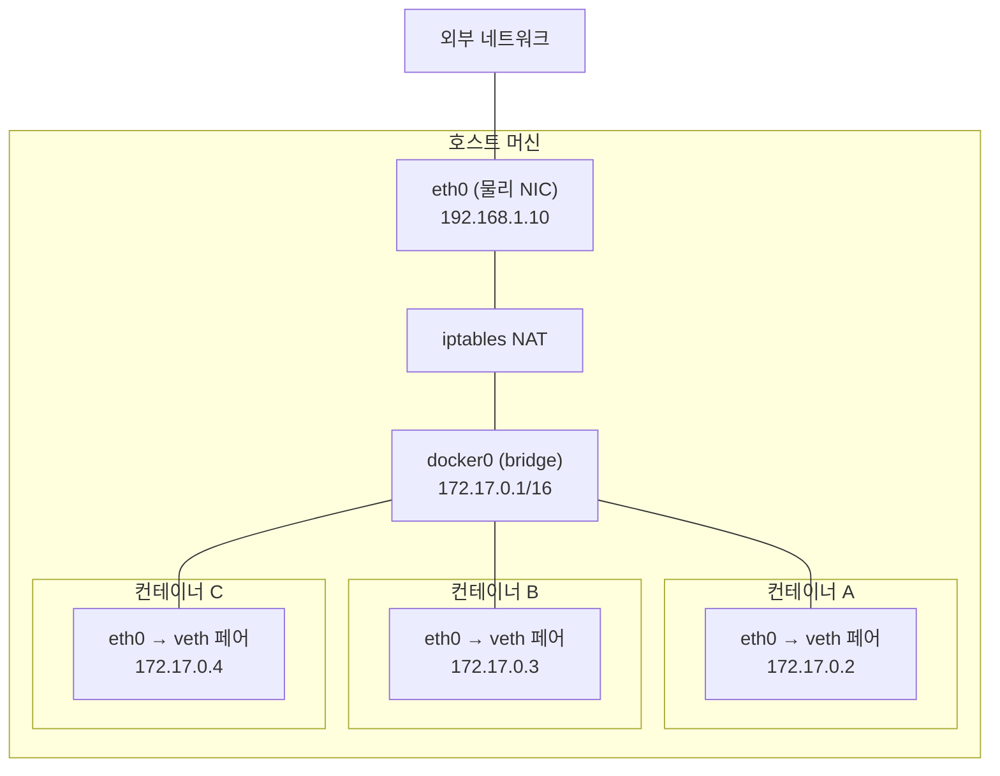
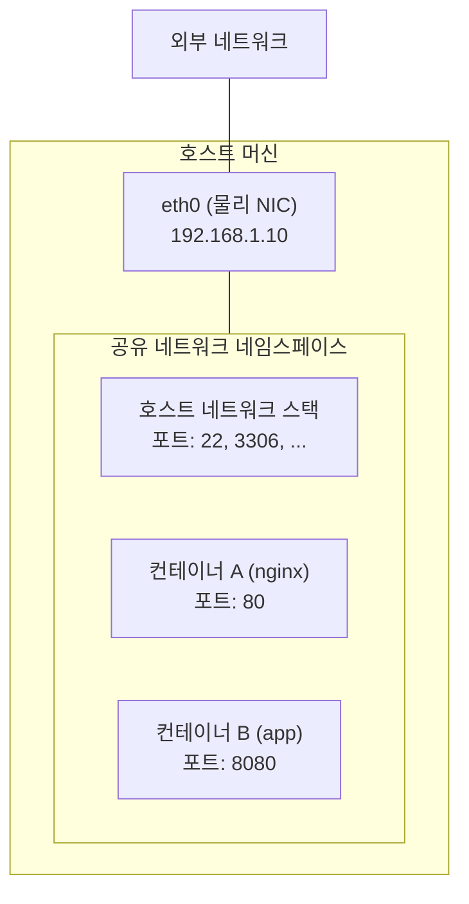
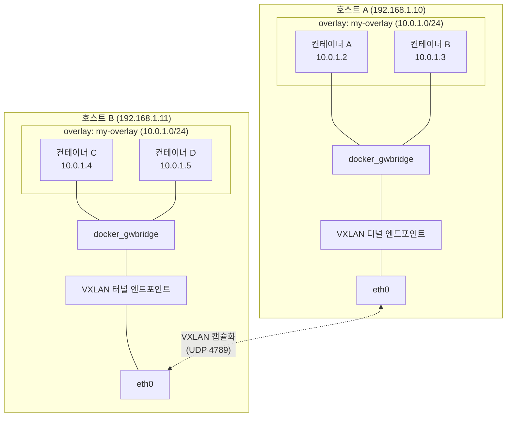
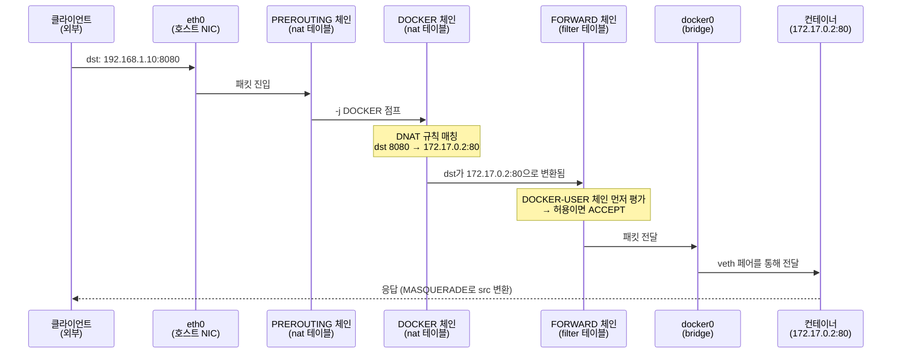

# Docker 네트워크

## 목차
- [네트워크 드라이버](#네트워크-드라이버)
- [default bridge vs 커스텀 bridge](#default-bridge-vs-커스텀-bridge)
- [컨테이너 간 통신](#컨테이너-간-통신)
- [포트 매핑](#포트-매핑)
- [docker network 명령어](#docker-network-명령어)
- [Compose에서의 네트워크](#compose에서의-네트워크)
- [트러블슈팅](#트러블슈팅)

---

## 네트워크 드라이버

Docker는 네 가지 기본 네트워크 드라이버를 제공한다.

### bridge

컨테이너를 만들면 기본으로 붙는 드라이버다. 호스트에 `docker0`라는 가상 브릿지 인터페이스가 생기고, 각 컨테이너는 veth 페어를 통해 이 브릿지에 연결된다.



같은 bridge 네트워크에 붙은 컨테이너끼리는 IP로 통신이 된다. 외부와 통신할 때는 호스트의 NAT를 거친다.

단독 서버에서 여러 컨테이너를 돌릴 때 대부분 bridge를 쓴다. 개발 환경에서도 이걸 쓰게 된다.

### host

컨테이너가 호스트의 네트워크 네임스페이스를 그대로 쓴다. 네트워크 격리가 없다.



bridge와 비교하면 구조 자체가 다르다. veth 페어도 없고, 브릿지도 없다. 컨테이너 프로세스가 호스트의 네트워크 스택을 직접 쓰기 때문에 NAT 변환 없이 패킷이 바로 나간다.

```bash
docker run --network host nginx
```

이렇게 띄우면 nginx가 호스트의 80번 포트에 직접 바인딩된다. `-p` 옵션이 필요 없다.

쓰는 경우:
- 네트워크 성능이 중요할 때. NAT 오버헤드가 없다.
- 컨테이너가 호스트의 네트워크 상태를 직접 봐야 할 때(모니터링 에이전트 같은 것).

주의할 점은 포트 충돌이다. 같은 포트를 쓰는 컨테이너를 두 개 띄우면 하나가 바인딩에 실패한다. 그리고 Linux에서만 동작한다. macOS/Windows의 Docker Desktop에서는 host 네트워크가 기대한 대로 작동하지 않는다. Docker Desktop은 VM 안에서 Docker를 돌리기 때문에, `--network host`를 써도 VM의 네트워크를 공유하는 거지 macOS 호스트의 네트워크가 아니다.

### none

네트워크 인터페이스가 loopback밖에 없다. 외부 통신이 완전히 차단된다.

```bash
docker run --network none alpine ip addr
# lo만 보인다
```

보안상 네트워크 접근을 원천 차단해야 하는 배치 작업이나, 파일 처리만 하는 컨테이너에서 쓴다. 실무에서 자주 쓰는 건 아니다.

### overlay

여러 Docker 호스트에 걸쳐 있는 컨테이너들을 하나의 네트워크로 묶는다. Docker Swarm이나 Kubernetes 환경에서 사용한다.



호스트 A의 컨테이너 A에서 호스트 B의 컨테이너 C로 패킷을 보내면, VXLAN이 원본 패킷을 UDP로 감싸서 호스트 간 물리 네트워크를 통해 전달한다. 컨테이너 입장에서는 같은 서브넷(10.0.1.0/24)에 있는 것처럼 보인다.

```bash
docker network create --driver overlay my-overlay
```

단일 호스트 환경에서는 쓸 일이 없고, 멀티 호스트 오케스트레이션을 쓰기 시작하면 그때 알아보면 된다.

### 드라이버 선택 기준

| 상황 | 드라이버 |
|------|---------|
| 일반적인 컨테이너 운영 (개발, 단일 서버) | bridge |
| NAT 없이 최대 성능이 필요 (Linux) | host |
| 네트워크 접근을 완전히 차단 | none |
| 여러 호스트에 걸친 컨테이너 통신 | overlay |

대부분의 상황에서는 bridge를 쓴다. host는 특수한 경우에만 쓰고, none은 거의 안 쓴다.

---

## default bridge vs 커스텀 bridge

Docker를 설치하면 `bridge`라는 이름의 기본 네트워크가 만들어진다. `docker run`할 때 네트워크를 지정하지 않으면 여기에 붙는다. 그런데 이 default bridge와 직접 만든 커스텀 bridge는 동작이 다르다.

### DNS 해상도

가장 큰 차이다. 커스텀 bridge에서는 컨테이너 이름으로 통신할 수 있다.

```bash
# 커스텀 네트워크 생성
docker network create my-net

# 두 컨테이너를 같은 네트워크에 연결
docker run -d --name db --network my-net postgres:16
docker run -d --name app --network my-net my-app

# app 컨테이너에서 db를 이름으로 찾을 수 있다
docker exec app ping db  # 동작함
```

default bridge에서는 이게 안 된다. `--link` 옵션으로 연결하거나 IP를 직접 지정해야 한다. `--link`는 deprecated된 기능이니까 쓰지 말고, 커스텀 네트워크를 만들어서 써야 한다.

Docker의 내장 DNS 서버(127.0.0.11)가 컨테이너 이름을 IP로 변환해준다. 이 DNS 서버는 커스텀 네트워크에서만 활성화된다.

### 격리

default bridge에 붙은 컨테이너들은 서로 전부 통신이 된다. 관련 없는 컨테이너끼리도 IP만 알면 접근할 수 있다.

커스텀 네트워크를 분리하면 네트워크 단위로 격리가 된다.

```bash
docker network create frontend-net
docker network create backend-net

# frontend-net에 있는 컨테이너는 backend-net에 직접 접근 못함
docker run -d --name web --network frontend-net nginx
docker run -d --name api --network frontend-net --network backend-net my-api
docker run -d --name db --network backend-net postgres:16
```

이렇게 하면 web은 api에 접근할 수 있지만 db에는 직접 접근할 수 없다. api가 두 네트워크에 모두 연결되어 있으니까 중간 다리 역할을 한다.

### 런타임 연결/해제

커스텀 네트워크는 컨테이너가 실행 중일 때도 네트워크를 붙이거나 뗄 수 있다.

```bash
docker network connect my-net running-container
docker network disconnect my-net running-container
```

default bridge에서는 이게 안 된다. 컨테이너를 재시작해야 한다.

### 결론: 항상 커스텀 bridge를 쓴다

default bridge를 쓸 이유가 없다. 테스트로 `docker run` 한 번 쳐보는 경우 말고는, 프로젝트에서 사용하는 컨테이너는 커스텀 네트워크에 붙여야 한다.

---

## 컨테이너 간 통신

### 같은 네트워크 안에서

같은 커스텀 bridge 안에 있으면 컨테이너 이름이 호스트네임으로 동작한다. 애플리케이션 코드에서 호스트를 컨테이너 이름으로 지정하면 된다.

```yaml
# Spring Boot application.yml 예시
spring:
  datasource:
    url: jdbc:postgresql://db:5432/mydb
  redis:
    host: redis
    port: 6379
```

여기서 `db`와 `redis`는 컨테이너 이름이다. Docker DNS가 알아서 IP로 바꿔준다.

### 네트워크 별칭(alias)

하나의 컨테이너에 여러 이름을 붙일 수 있다.

```bash
docker run -d --name postgres-primary --network my-net \
  --network-alias db \
  --network-alias database \
  postgres:16
```

`postgres-primary`, `db`, `database` 세 가지 이름 모두 같은 컨테이너를 가리킨다. 마이그레이션할 때 유용하다. 기존에 `db`라는 이름으로 접근하던 서비스가 있으면 새 컨테이너에 같은 alias를 붙이면 된다.

같은 alias를 여러 컨테이너에 붙이면 라운드 로빈으로 분산된다. 간단한 로드밸런싱이 필요할 때 쓸 수 있다. 다만 헬스체크가 없어서 죽은 컨테이너에도 요청이 갈 수 있다. 프로덕션에서 이걸 로드밸런서로 쓰진 않는다.

### 다른 네트워크와 통신

서로 다른 커스텀 네트워크에 있는 컨테이너는 직접 통신할 수 없다. 통신이 필요하면 두 가지 방법이 있다.

1. 컨테이너를 두 네트워크에 동시에 연결한다 (위에서 본 api 예시).
2. 호스트의 포트 매핑을 통해 간접적으로 연결한다.

1번이 깔끔하다. 2번은 호스트 포트를 거치니까 불필요한 NAT가 발생한다.

---

## 포트 매핑

`-p` 옵션으로 호스트의 포트와 컨테이너의 포트를 연결한다.

### 기본 사용법

```bash
# 호스트 8080 → 컨테이너 80
docker run -d -p 8080:80 nginx

# 호스트의 모든 인터페이스에 바인딩
docker run -d -p 0.0.0.0:8080:80 nginx

# 특정 인터페이스에만 바인딩
docker run -d -p 127.0.0.1:8080:80 nginx

# 호스트 포트를 생략하면 랜덤 포트가 할당됨
docker run -d -p 80 nginx
docker port <container-id>  # 할당된 포트 확인
```

### 동작 원리

`-p 8080:80`을 하면 Docker가 호스트의 iptables에 DNAT 규칙을 추가한다. 호스트의 8080 포트로 들어온 패킷을 컨테이너의 80 포트로 포워딩하는 규칙이다.

아래는 외부 클라이언트가 호스트의 8080 포트로 요청을 보냈을 때 패킷이 컨테이너까지 도달하는 과정이다.



이 흐름에서 핵심은 두 가지다.

1. **DNAT**: 목적지 주소를 호스트 IP:8080에서 컨테이너 IP:80으로 바꾼다. PREROUTING 단계에서 일어난다.
2. **MASQUERADE**: 응답 패킷의 출발지 주소를 컨테이너 IP에서 호스트 IP로 바꾼다. POSTROUTING 단계에서 일어난다.

실제 iptables에 어떤 규칙이 들어가는지 확인하면 다음과 같다.

```bash
# DNAT 규칙 확인 (PREROUTING → DOCKER 체인)
sudo iptables -t nat -L DOCKER -n --line-numbers
# 출력 예시:
# 1  DNAT  tcp  --  0.0.0.0/0  0.0.0.0/0  tcp dpt:8080 to:172.17.0.2:80

# MASQUERADE 규칙 확인 (POSTROUTING)
sudo iptables -t nat -L POSTROUTING -n
# 출력 예시:
# MASQUERADE  all  --  172.17.0.0/16  0.0.0.0/0

# FORWARD 체인에서 컨테이너 포트 허용 규칙
sudo iptables -L DOCKER -n
# 출력 예시:
# ACCEPT  tcp  --  0.0.0.0/0  172.17.0.2  tcp dpt:80
```

이 과정에서 패킷이 NAT를 거치기 때문에 약간의 오버헤드가 있다. 대부분의 웹 서비스에서는 체감하기 어렵지만, 초당 수만 건의 요청을 처리하는 경우에는 `--network host`를 고려해볼 수 있다.

### 주의사항

**`0.0.0.0`에 바인딩하면 외부에서 접근 가능하다.**

`-p 8080:80`은 `-p 0.0.0.0:8080:80`과 같다. 서버에 공인 IP가 있으면 외부에서 바로 접근할 수 있다. 개발용 DB를 이렇게 노출해놓고 모르는 경우가 있다.

```bash
# 로컬에서만 접근하려면 반드시 127.0.0.1을 명시
docker run -d -p 127.0.0.1:5432:5432 postgres:16
```

**Docker는 UFW/firewalld를 우회한다.**

Docker가 직접 iptables를 조작하기 때문에 UFW나 firewalld 규칙으로 막아둔 포트도 Docker 포트 매핑은 통과한다. UFW에서 8080을 막아놨어도 `-p 8080:80`으로 띄운 컨테이너는 외부에서 접근된다.

이걸 방지하려면 `/etc/docker/daemon.json`에서 iptables 사용을 끄거나, DOCKER-USER 체인에 규칙을 추가해야 한다.

```json
// /etc/docker/daemon.json - iptables 직접 조작 끄기
{
  "iptables": false
}
```

하지만 iptables를 끄면 컨테이너의 외부 통신도 직접 설정해야 하니까, DOCKER-USER 체인을 쓰는 편이 낫다.

```bash
# DOCKER-USER 체인에서 특정 포트 차단
sudo iptables -I DOCKER-USER -p tcp --dport 5432 -j DROP
sudo iptables -I DOCKER-USER -p tcp --dport 5432 -s 10.0.0.0/8 -j ACCEPT
```

**TCP/UDP 구분**

기본은 TCP다. UDP가 필요하면 명시해야 한다.

```bash
docker run -d -p 53:53/udp dns-server
# TCP와 UDP 동시에
docker run -d -p 53:53/tcp -p 53:53/udp dns-server
```

---

## docker network 명령어

### 네트워크 생성

```bash
# 기본 생성 (bridge 드라이버)
docker network create my-net

# 서브넷과 게이트웨이 지정
docker network create \
  --subnet 10.10.0.0/24 \
  --gateway 10.10.0.1 \
  my-net

# IP 대역이 기존 네트워크와 겹치면 컨테이너가 외부 통신에 실패한다.
# 회사 VPN 대역이 172.17.0.0/16이면 Docker 기본 대역과 충돌할 수 있다.
```

서브넷 충돌은 실무에서 자주 겪는 문제다. Docker의 기본 bridge 대역이 172.17.0.0/16인데, 회사 내부망이나 VPN이 같은 대역을 쓰면 라우팅이 꼬인다. VPN 연결하면 갑자기 컨테이너 통신이 안 되거나, 반대로 특정 내부 서비스에 접근이 안 되는 상황이 생긴다. 이때는 Docker의 기본 대역을 변경하거나, 커스텀 네트워크를 만들 때 겹치지 않는 대역을 지정해야 한다.

```json
// /etc/docker/daemon.json - 기본 대역 변경
{
  "default-address-pools": [
    {"base": "10.200.0.0/16", "size": 24}
  ]
}
```

### 네트워크 조회

```bash
# 목록
docker network ls

# 상세 정보 (연결된 컨테이너, 서브넷 등)
docker network inspect my-net

# 특정 정보만 뽑기
docker network inspect --format '{{range .Containers}}{{.Name}} {{.IPv4Address}}{{"\n"}}{{end}}' my-net
```

### 연결/해제

```bash
# 실행 중인 컨테이너에 네트워크 추가
docker network connect my-net my-container

# 고정 IP로 연결
docker network connect --ip 10.10.0.100 my-net my-container

# 네트워크에서 분리
docker network disconnect my-net my-container
```

### 삭제

```bash
# 특정 네트워크 삭제 (연결된 컨테이너가 없어야 함)
docker network rm my-net

# 사용하지 않는 네트워크 일괄 삭제
docker network prune
```

`docker network prune`은 어떤 컨테이너에도 연결되지 않은 커스텀 네트워크를 삭제한다. default bridge, host, none은 삭제되지 않는다.

---

## Compose에서의 네트워크

### 기본 동작

Compose는 `docker compose up` 하면 프로젝트 이름으로 네트워크를 자동 생성한다. 프로젝트 디렉토리가 `my-app`이면 `my-app_default`라는 네트워크가 만들어지고, 모든 서비스가 여기에 붙는다.

```yaml
# docker-compose.yml
services:
  web:
    image: nginx
  api:
    image: my-api
  db:
    image: postgres:16
```

이 상태에서 api 컨테이너 안에서 `db`라는 호스트명으로 PostgreSQL에 접근할 수 있다. 서비스 이름이 DNS 이름이 된다. 별도 설정 없이 이렇게 동작하는 게 Compose의 장점이다.

### 커스텀 네트워크 정의

서비스를 네트워크 단위로 분리하고 싶으면 직접 정의한다.

```yaml
services:
  web:
    image: nginx
    networks:
      - frontend

  api:
    image: my-api
    networks:
      - frontend
      - backend

  db:
    image: postgres:16
    networks:
      - backend

  redis:
    image: redis:7
    networks:
      - backend

networks:
  frontend:
  backend:
```

web은 api만 볼 수 있고, db와 redis는 볼 수 없다. api는 양쪽 모두 접근할 수 있다. 이렇게 프론트엔드 트래픽이 DB에 직접 닿지 않도록 구성한다.

### 네트워크 옵션 설정

```yaml
networks:
  backend:
    driver: bridge
    ipam:
      config:
        - subnet: 10.10.1.0/24
          gateway: 10.10.1.1

  legacy:
    external: true  # 이미 존재하는 네트워크 사용
    name: my-existing-network
```

`external: true`는 Compose 밖에서 만든 네트워크를 참조할 때 쓴다. 여러 Compose 프로젝트가 같은 네트워크를 공유해야 하는 경우에 사용한다.

### 서비스에 고정 IP 할당

```yaml
services:
  db:
    image: postgres:16
    networks:
      backend:
        ipv4_address: 10.10.1.100

networks:
  backend:
    ipam:
      config:
        - subnet: 10.10.1.0/24
```

일반적으로는 DNS를 쓰면 되니까 IP를 고정할 필요가 없다. 레거시 시스템이 IP를 하드코딩하고 있어서 바꿀 수 없는 경우에만 쓴다.

### 여러 Compose 프로젝트 간 통신

프로젝트 A의 서비스가 프로젝트 B의 서비스와 통신해야 하면, 공유 네트워크를 만들어야 한다.

```bash
# 외부 네트워크 미리 생성
docker network create shared-net
```

```yaml
# project-a/docker-compose.yml
services:
  api:
    image: project-a-api
    networks:
      - shared

networks:
  shared:
    external: true
    name: shared-net
```

```yaml
# project-b/docker-compose.yml
services:
  worker:
    image: project-b-worker
    networks:
      - shared

networks:
  shared:
    external: true
    name: shared-net
```

이렇게 하면 project-a의 api 컨테이너에서 `worker`라는 이름으로 project-b의 worker 컨테이너에 접근할 수 있다.

---

## 트러블슈팅

### 컨테이너에서 외부 인터넷 접근 안 됨

```bash
# 컨테이너 안에서 DNS 확인
docker exec my-container cat /etc/resolv.conf

# 외부 연결 테스트
docker exec my-container ping -c 2 8.8.8.8
docker exec my-container nslookup google.com
```

ping은 되는데 nslookup이 안 되면 DNS 문제다. Docker 데몬의 DNS 설정을 확인한다.

```json
// /etc/docker/daemon.json
{
  "dns": ["8.8.8.8", "8.8.4.4"]
}
```

ping도 안 되면 IP 포워딩이 꺼져있을 수 있다.

```bash
sysctl net.ipv4.ip_forward
# 0이면 꺼져있는 것. 1로 변경해야 한다.
sudo sysctl -w net.ipv4.ip_forward=1
```

### 컨테이너 이름으로 접근 안 됨

default bridge를 쓰고 있을 가능성이 높다. 커스텀 네트워크를 만들어서 연결한다.

```bash
# 현재 컨테이너의 네트워크 확인
docker inspect --format '{{json .NetworkSettings.Networks}}' my-container | python3 -m json.tool
```

`bridge`라는 이름의 네트워크에 붙어있으면 default bridge다.

### VPN 연결 시 컨테이너 통신 이상

Docker 네트워크 대역과 VPN 대역이 겹치는 경우다. 위에서 설명한 `default-address-pools` 설정으로 Docker 대역을 변경한다. 설정 변경 후 Docker 데몬을 재시작해야 하고, 기존 네트워크는 삭제 후 재생성해야 새 대역이 적용된다.

### 포트 매핑했는데 접근 안 됨

순서대로 확인한다.

```bash
# 1. 컨테이너가 실제로 해당 포트를 리스닝하고 있는지
docker exec my-container ss -tlnp

# 2. 포트 매핑 상태 확인
docker port my-container

# 3. 호스트에서 포트 확인
ss -tlnp | grep 8080

# 4. 컨테이너가 0.0.0.0에 바인딩하고 있는지
# 컨테이너 안의 서비스가 127.0.0.1에만 바인딩하면 외부에서 접근 못함
```

4번이 흔한 실수다. 컨테이너 안의 애플리케이션이 `localhost`나 `127.0.0.1`에만 바인딩하면 포트 매핑을 해도 외부에서 접근할 수 없다. 컨테이너 안에서는 `0.0.0.0`에 바인딩해야 한다. Spring Boot의 경우 `server.address=0.0.0.0`, Node.js는 `app.listen(3000, '0.0.0.0')` 같이 설정한다.
