# Dockerfile 작성법

## 목차
- [Dockerfile 기본 구조](#dockerfile-기본-구조)
- [FROM - 베이스 이미지 선택](#from---베이스-이미지-선택)
- [RUN - 명령 실행](#run---명령-실행)
- [COPY vs ADD](#copy-vs-add)
- [CMD vs ENTRYPOINT](#cmd-vs-entrypoint)
- [ARG vs ENV](#arg-vs-env)
- [.dockerignore 설정](#dockerignore-설정)
- [빌드 시크릿이 이미지에 남는 경로](#빌드-시크릿이-이미지에-남는-경로)
- [레이어 캐싱 원리](#레이어-캐싱-원리)
- [멀티스테이지 빌드](#멀티스테이지-빌드)
- [이미지 크기 줄이기](#이미지-크기-줄이기)
- [HEALTHCHECK 문법](#healthcheck-문법)
- [빌드 시 자주 겪는 실수와 디버깅](#빌드-시-자주-겪는-실수와-디버깅)

이 문서의 수치는 Docker 29.1.3(overlayfs 스토리지, BuildKit, buildx 0.30.1)에서 직접 빌드해 `docker images`, `docker history`, `docker save` 로 확인한 값이다. 이미지 크기는 `docker images` 의 SIZE 열을 그대로 옮긴 것이라 환경에 따라 달라질 수 있다. 어느 레이어가 얼마를 차지하는지, 어느 단계가 다시 실행됐는지를 보는 용도로 읽으면 된다. non-root 실행, 베이스 이미지 선택·digest 고정, 스캔처럼 런타임·운영 보안에 걸친 항목은 [Docker 컨테이너 보안](../../../Security/Container_Security.md)에서 다루고, 여기서는 Dockerfile 문법과 빌드 동작만 남긴다.

---

## Dockerfile 기본 구조

Dockerfile은 이미지를 만드는 스크립트다. 한 줄 한 줄이 이미지 레이어 하나에 대응되고, 위에서 아래로 순서대로 실행된다.

```dockerfile
FROM node:20-alpine
WORKDIR /app
COPY package*.json ./
RUN npm ci --production
COPY . .
EXPOSE 3000
CMD ["node", "server.js"]
```

이 Dockerfile을 `docker build -t my-app .` 으로 빌드하면 각 명령어가 순차적으로 실행되면서 레이어가 쌓인다.

위 예제의 명령어가 어떤 결과물로 이어지는지 그리면 아래와 같다. 파일시스템을 바꾸는 명령은 레이어를 만들고, `EXPOSE`·`CMD` 는 이미지 메타데이터만 기록한다.

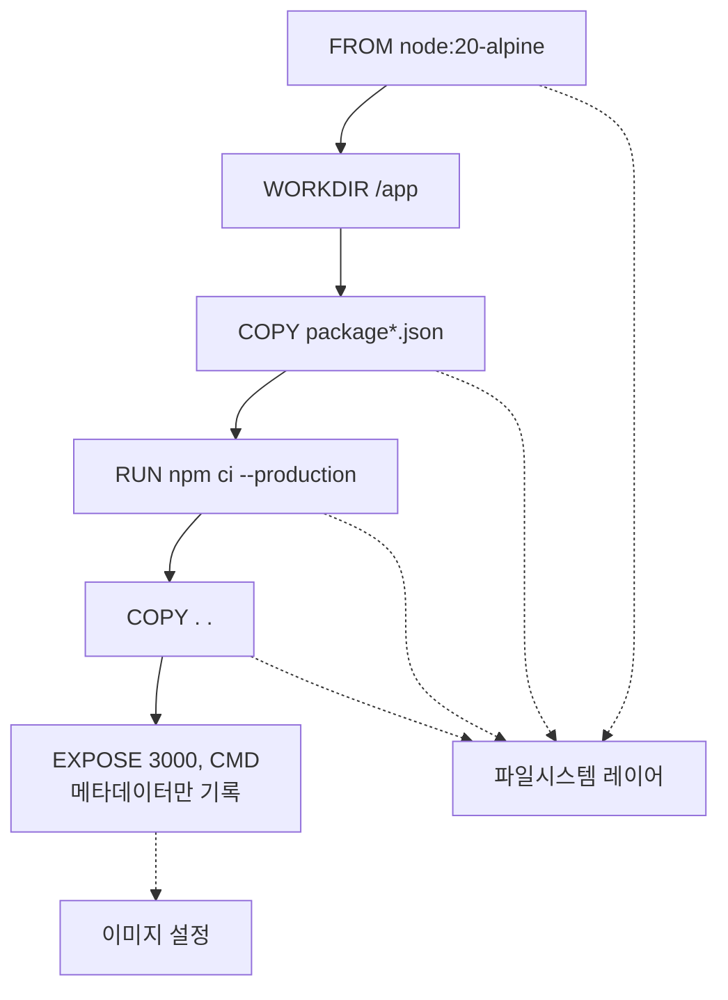

---

## FROM - 베이스 이미지 선택

모든 Dockerfile은 `FROM`으로 시작한다. 어떤 베이스 이미지를 고르느냐에 따라 이미지 크기와 디버깅 편의성이 달라진다.

```dockerfile
# 태그를 명시하지 않으면 latest가 붙는다
FROM node

# 버전을 고정해야 빌드가 재현 가능하다
FROM node:20.11.1-alpine3.19

# digest 로 지정하면 태그가 가리키는 대상이 바뀌어도 같은 이미지를 받는다
FROM node@sha256:abcdef1234567890...
```

`FROM node:20-alpine`으로 써두면 오늘 빌드한 이미지와 한 달 뒤 빌드한 이미지가 다를 수 있다. 태그는 레지스트리에서 다른 이미지로 옮겨 갈 수 있는 이름표라서 alpine 패치 버전이 올라가면 베이스가 바뀐다. CI에서 갑자기 빌드가 깨지는 원인 중 하나가 이거다. 태그와 digest 를 어떻게 섞어 고정할지, 어떤 베이스를 고를지는 [Docker 컨테이너 보안](../../../Security/Container_Security.md)의 베이스 이미지 선택과 이미지 서명 절에서 다룬다.

`FROM scratch`는 빈 이미지에서 시작하는 거다. Go 같은 정적 바이너리를 배포할 때 쓴다.

```dockerfile
FROM scratch
COPY myapp /myapp
CMD ["/myapp"]
```

---

## RUN - 명령 실행

`RUN`은 빌드 시점에 컨테이너 안에서 명령을 실행한다. 실행 결과가 새 레이어로 커밋된다.

```dockerfile
# shell form - /bin/sh -c 로 실행된다
RUN apt-get update && apt-get install -y curl

# exec form - 셸 없이 직접 실행한다
RUN ["apt-get", "install", "-y", "curl"]
```

shell form은 환경변수 치환이 되고, exec form은 안 된다. 대부분의 경우 shell form을 쓰면 되는데, exec form은 셸이 없는 이미지(scratch 등)에서 필요하다.

**RUN 명령은 가능하면 하나로 합쳐야 한다.** `RUN`마다 레이어가 생기는데, 패키지 설치 후 캐시를 지우는 걸 별도 `RUN`으로 하면 캐시가 이전 레이어에 남아서 이미지 크기가 줄지 않는다.

```dockerfile
# 잘못된 예 - 캐시가 첫 번째 레이어에 남아있다
RUN apt-get update
RUN apt-get install -y curl
RUN rm -rf /var/lib/apt/lists/*

# 올바른 예 - 하나의 레이어에서 설치와 정리를 같이 한다
RUN apt-get update && \
    apt-get install -y --no-install-recommends curl && \
    rm -rf /var/lib/apt/lists/*
```

`debian:bookworm-slim`(116MB)에 curl 과 ca-certificates 를 설치하는 두 Dockerfile 을 빌드해 대조했다.

| 구성 | 이미지 크기 | `docker history` 의 레이어 |
|------|-------------|---------------------------|
| `RUN` 3개로 분리 | 169MB | update 19.8MB, install 15.2MB, `rm -rf /var/lib/apt/lists/*` 20.5kB |
| `&&` 로 한 줄 | 134MB | 15.2MB 하나 |

분리한 쪽에서 `rm` 레이어는 20.5kB 뿐이다. 앞선 `apt-get update` 레이어가 만든 19.8MB 는 그대로 남아 있고, `rm` 은 그 위에 "지웠다"는 표시만 얹는다. 같은 원리가 [빌드 시크릿이 이미지에 남는 경로](#빌드-시크릿이-이미지에-남는-경로)에서는 시크릿 노출로 이어진다. 이미지에 패키지를 덜 넣는 쪽의 이야기(멀티스테이지, 베이스 이미지 선택)는 [Docker 컨테이너 보안](../../../Security/Container_Security.md)의 해당 절에서 다룬다. 여기서 기억할 것은 정리 명령이 설치와 같은 `RUN` 안에 있어야 한다는 점 하나다. `--no-install-recommends` 를 빼면 추천 패키지까지 설치돼서 install 레이어 자체가 커진다.

두 구성의 레이어를 나란히 그리면 `rm` 이 왜 크기를 못 줄이는지 보인다. 분리한 쪽은 `rm` 이 위 레이어 내용을 가릴 뿐이고, 합친 쪽은 지워진 상태로 커밋된다.

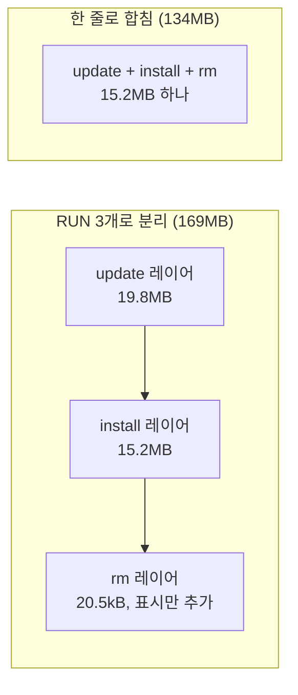

---

## COPY vs ADD

둘 다 호스트의 파일을 이미지 안에 넣는 명령이다. 거의 모든 경우에 `COPY`를 쓰면 된다.

```dockerfile
# COPY - 단순 복사
COPY src/ /app/src/
COPY config.json /app/

# ADD - tar 자동 해제, URL 다운로드 기능이 있다
ADD archive.tar.gz /app/
ADD https://example.com/file.txt /app/
```

**`ADD`를 쓰면 안 되는 이유가 있다.** `ADD`는 tar 파일을 자동으로 풀고, URL에서 파일을 다운로드하는 기능이 있는데, 이게 의도치 않은 동작을 만들 수 있다. `.tar.gz` 파일을 풀지 않고 그대로 복사하고 싶은데 `ADD`를 쓰면 자동으로 풀려버린다.

URL 다운로드는 `ADD`보다 `RUN curl`이나 `RUN wget`을 쓰는 게 낫다. `ADD`로 다운로드하면 캐시가 안 되고, 다운로드 실패 시 에러 핸들링도 안 된다.

```dockerfile
# ADD 대신 이렇게
RUN curl -fsSL https://example.com/file.txt -o /app/file.txt
```

tar 자동 해제가 필요한 경우에만 `ADD`를 쓴다. 나머지는 전부 `COPY`.

**`COPY`의 `--chown` 플래그**: 파일을 복사하면서 소유자를 바꿀 수 있다.

```dockerfile
COPY --chown=node:node . /app/
```

이걸 안 쓰고 `RUN chown -R`을 별도로 실행하면 레이어가 하나 더 생기면서 이미지 크기가 늘어난다.

---

## CMD vs ENTRYPOINT

이 둘의 차이를 제대로 이해하지 않으면 컨테이너 실행 시 이상한 동작을 겪게 된다.

**CMD**: 컨테이너 시작 시 기본 명령을 지정한다. `docker run` 뒤에 명령을 붙이면 CMD가 덮어써진다.

```dockerfile
CMD ["node", "server.js"]
```

```bash
docker run my-app               # node server.js 실행
docker run my-app node repl.js  # CMD 무시, node repl.js 실행
docker run my-app sh            # CMD 무시, 셸 진입
```

**ENTRYPOINT**: 컨테이너가 실행할 바이너리를 고정한다. `docker run` 뒤에 붙이는 건 ENTRYPOINT의 인자로 들어간다.

```dockerfile
ENTRYPOINT ["node"]
CMD ["server.js"]
```

```bash
docker run my-app               # node server.js 실행
docker run my-app repl.js       # node repl.js 실행 (CMD가 덮어써짐)
```

**ENTRYPOINT + CMD 조합 패턴**: ENTRYPOINT로 실행 바이너리를 고정하고, CMD로 기본 인자를 주는 방식이다.

```dockerfile
ENTRYPOINT ["java", "-jar"]
CMD ["app.jar"]
```

`docker run` 뒤에 붙인 인자가 있느냐에 따라 최종 실행 명령이 어떻게 달라지는지 비교하면 아래와 같다.

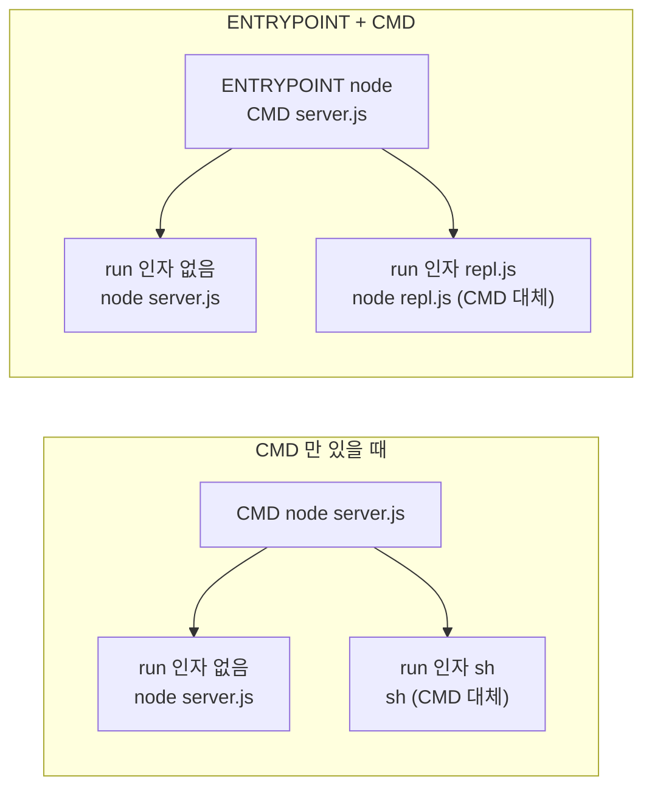

실무에서 많이 쓰는 패턴은 entrypoint 스크립트를 두는 것이다.

```dockerfile
COPY docker-entrypoint.sh /usr/local/bin/
RUN chmod +x /usr/local/bin/docker-entrypoint.sh
ENTRYPOINT ["docker-entrypoint.sh"]
CMD ["start"]
```

entrypoint 스크립트 안에서 환경변수 검증, 설정 파일 생성, DB 마이그레이션 대기 같은 초기화 로직을 넣고, 마지막에 `exec "$@"`로 CMD를 실행한다.

```bash
#!/bin/sh
set -e

# 환경변수 검증
if [ -z "$DATABASE_URL" ]; then
  echo "DATABASE_URL is required" >&2
  exit 1
fi

# CMD 실행
exec "$@"
```

`exec "$@"` 를 빼먹으면 entrypoint 스크립트가 PID 1이 되고, 실제 애플리케이션은 자식 프로세스로 뜬다. 시그널 전달이 안 되면서 `docker stop`에 graceful shutdown이 안 되는 문제가 생긴다.

**shell form vs exec form 차이**:

```dockerfile
# exec form - 프로세스가 PID 1로 직접 뜬다
CMD ["node", "server.js"]

# shell form - /bin/sh -c 가 PID 1이고, node는 자식 프로세스
CMD node server.js
```

shell form을 쓰면 SIGTERM이 node 프로세스에 전달되지 않는다. `docker stop`하면 10초 대기 후 SIGKILL로 강제 종료된다. 운영 환경에서는 exec form을 써야 한다.

두 형식에서 `docker stop` 이 보낸 시그널이 어디까지 가는지 비교하면 아래와 같다.

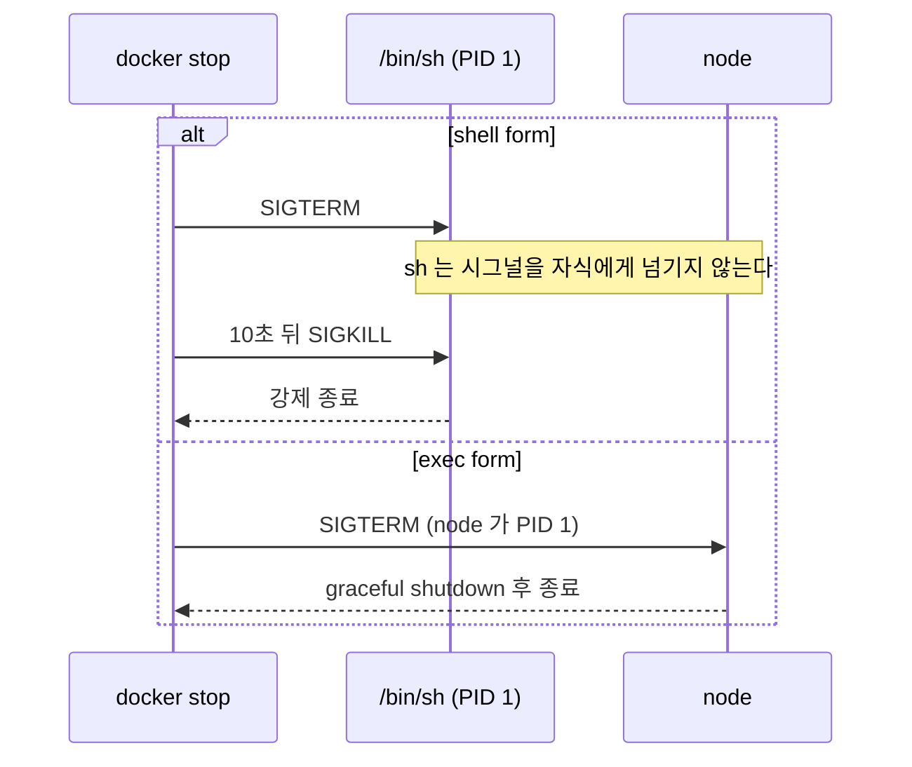

---

## ARG vs ENV

빌드 시점과 런타임 시점에서의 변수 사용을 구분해야 한다.

**ARG**: 빌드 시점에만 사용 가능하다. 컨테이너의 환경변수에는 들어가지 않는다. 다만 이미지 메타데이터에는 남는다(아래 시크릿 절 참조).

```dockerfile
ARG NODE_VERSION=20
FROM node:${NODE_VERSION}-alpine

ARG BUILD_ENV=production
RUN echo "Building for ${BUILD_ENV}"
```

```bash
docker build --build-arg NODE_VERSION=18 --build-arg BUILD_ENV=staging .
```

**ENV**: 빌드 시점과 런타임 모두에서 사용 가능하다. 이미지에 남는다.

```dockerfile
ENV NODE_ENV=production
ENV APP_PORT=3000
```

**주의할 점**: `ARG`로 선언한 변수를 `ENV`로 넘겨야 런타임에서도 쓸 수 있다.

```dockerfile
ARG APP_VERSION
ENV APP_VERSION=${APP_VERSION}
```

**ARG에 민감한 정보를 넣으면 안 된다.** `docker history --no-trunc`로 조회하면 ARG 값이 그대로 보인다. `ENV` 로 넣은 값도 마찬가지다. 실제 출력과 대처는 [빌드 시크릿이 이미지에 남는 경로](#빌드-시크릿이-이미지에-남는-경로)에 정리했다. 빌드 중에 필요한 비밀 정보는 `--secret` 플래그와 `RUN --mount=type=secret` 으로 넘긴다.

**ARG는 FROM 앞뒤로 스코프가 다르다.** `FROM` 전에 선언한 ARG는 `FROM` 명령에서만 쓸 수 있다. `FROM` 뒤의 명령에서 쓰려면 다시 선언해야 한다.

```dockerfile
ARG BASE_TAG=3.19
FROM alpine:${BASE_TAG}

# 여기서 BASE_TAG를 쓰려면 다시 선언해야 한다
ARG BASE_TAG
RUN echo ${BASE_TAG}
```

이거 모르면 빌드할 때 변수가 빈 문자열로 들어가서 삽질하게 된다.

아래 도식은 위 예제에서 `BASE_TAG` 가 어느 구간에서 보이는지 나타낸다. `FROM` 앞 선언은 `FROM` 줄에서 끝나고, 뒤쪽 `RUN` 에서 쓰려면 다시 선언해야 한다.

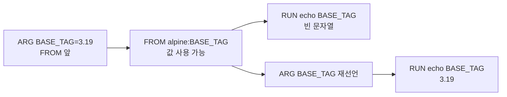

---

## .dockerignore 설정

`.dockerignore`는 빌드 컨텍스트에서 제외할 파일을 지정한다. `.gitignore`와 문법이 비슷하다.

빌드 컨텍스트란 `docker build .`에서 `.`에 해당하는 디렉토리 전체다. Docker 데몬에 이 디렉토리를 통째로 전송하기 때문에, 불필요한 파일이 있으면 빌드 시작 전 전송 시간이 길어진다.

```
# .dockerignore

# 버전 관리
.git
.gitignore

# 의존성 - 이미지 안에서 새로 설치한다
node_modules
vendor

# 빌드 산출물
dist
build
*.jar
target

# 환경 설정
.env
.env.*
docker-compose*.yml
Dockerfile*

# IDE/에디터
.idea
.vscode
*.swp

# 테스트
test
tests
__tests__
coverage

# 문서
README.md
docs
```

아래 도식은 `.dockerignore` 가 어느 시점에 걸러내는지 보여준다. 제외된 파일은 데몬으로 전송되지 않으므로 `COPY` 로도 들어올 수 없다.

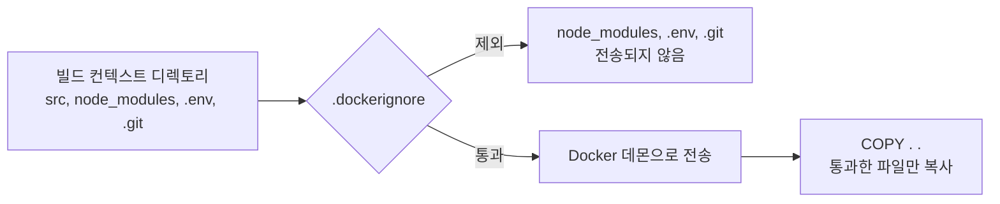

`.dockerignore`를 안 만들면 생기는 문제:

- **node_modules가 빌드 컨텍스트에 포함된다.** 로컬의 node_modules가 수백 MB일 수 있고, 이걸 Docker 데몬에 전송하느라 빌드가 느려진다. `COPY . .`으로 이미지에 들어가면 `RUN npm ci`로 설치한 의존성과 충돌할 수도 있다.
- **.env 파일이 이미지에 들어간다.** DB 비밀번호, API 키 같은 게 이미지에 포함되면 이미지를 레지스트리에 푸시했을 때 민감 정보가 노출된다.
- **.git 디렉토리가 포함된다.** 프로젝트에 따라 수백 MB가 넘는 경우가 있다.

빌드 컨텍스트가 뭔가 크다 싶으면 `docker build` 시작할 때 나오는 "Sending build context to Docker daemon" 메시지에서 크기를 확인할 수 있다. BuildKit 으로 빌드하면 `--progress=plain` 출력의 `transferring context` 줄이 같은 정보다.

`.dockerignore` 는 이미지에 뭐가 들어가는지뿐 아니라 레이어 캐시에도 걸린다. `COPY . .` 의 캐시 키는 복사 대상 파일 전체의 체크섬이라서, 이미지에 쓰지도 않는 파일(`Dockerfile` 자체, 로그, 에디터 임시 파일)이 바뀌어도 그 아래 레이어가 전부 다시 만들어진다. 이 부분은 [레이어 캐싱 원리](#레이어-캐싱-원리)에서 이어진다.

---

## 빌드 시크릿이 이미지에 남는 경로

이미지는 레이어를 쌓은 tar 묶음이고, 레이어는 추가만 된다. `RUN rm` 은 앞 레이어의 파일을 없애지 않고 "이 경로는 지워진 것으로 본다"는 표시(whiteout)를 새 레이어에 적을 뿐이다. 컨테이너를 띄우면 안 보이니까 지워졌다고 믿기 쉬운데, 이미지를 받은 사람은 컨테이너를 실행할 필요 없이 레이어 tar 를 직접 열 수 있다.

아래 Dockerfile 로 직접 확인했다. 빌드 컨텍스트에는 `app.js`, `.env`(`DB_PASSWORD=hunter2-ENVFILE`), `.git` 이 있고 `.dockerignore` 는 없다.

```dockerfile
FROM alpine:3.19
WORKDIR /app
ARG NPM_TOKEN
ENV API_KEY=sk-live-ENVINSTR
RUN echo "registry auth ${NPM_TOKEN}" | wc -c
COPY . .
RUN rm .env
CMD ["sh"]
```

```bash
docker build --build-arg NPM_TOKEN=ghp_ARGSECRET -t leak .
```

### ARG 와 ENV 는 history 에 값째로 남는다

```bash
docker history --no-trunc --format '{{.CreatedBy}}' leak
```

시크릿이 들어 있는 줄만 추리면 이렇게 나온다.

```
RUN |1 NPM_TOKEN=ghp_ARGSECRET /bin/sh -c rm .env # buildkit
COPY . . # buildkit
RUN |1 NPM_TOKEN=ghp_ARGSECRET /bin/sh -c echo "registry auth ${NPM_TOKEN}" | wc -c # buildkit
ENV API_KEY=sk-live-ENVINSTR
ARG NPM_TOKEN=ghp_ARGSECRET
```

`ARG NPM_TOKEN` 은 값 없이 선언만 했는데도 빌드 인자 값이 `ARG` 줄에 기록됐다. 그 뒤의 `RUN` 은 `NPM_TOKEN` 을 쓰지 않는 `rm .env` 까지 전부 `RUN |1 NPM_TOKEN=...` 형태로 값을 달고 있다. 반면 `docker inspect` 의 `Config.Env` 에는 `API_KEY` 만 있고 `NPM_TOKEN` 은 없었다. 환경변수 목록만 보고 "ARG 는 안 새는구나" 하고 넘어가면 놓치고, ARG 노출은 history 에서만 보인다.

값이 어디에 보이는지를 정리하면 아래와 같다. ARG 는 history 한 곳에만, ENV 는 history 와 `Config.Env` 두 곳에 남는다.

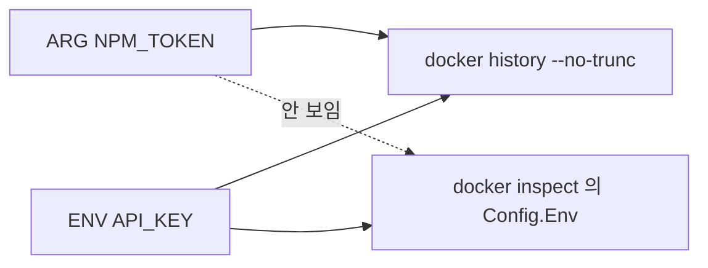

### rm 으로 지운 파일은 앞 레이어에 그대로 있다

```bash
mkdir save && cd save && docker save leak | tar -x

# 레이어별로 .env 와 whiteout 표시를 찾는다
for b in blobs/sha256/*; do
  zcat -f "$b" | tar -t 2>/dev/null | grep -E '(^|/)\.env$|\.wh\.\.env' \
    | sed "s|^|$(basename $b | cut -c1-12)  |"
done
```

```
e5264e95903d  app/.wh..env
ffbc3ca16a33  app/.env
```

레이어가 둘로 갈라져서 나온다. `ffbc3ca16a33` 은 `COPY . .` 가 만든 레이어이고 `.env` 원본이 들어 있다. `e5264e95903d` 는 `RUN rm .env` 가 만든 레이어로, 파일 없이 `.wh..env` 표시 하나만 있다(layer blob 이 127바이트). 원본은 이렇게 꺼낸다.

```bash
for b in blobs/sha256/*; do zcat -f "$b" | tar -xO app/.env 2>/dev/null; done
# DB_PASSWORD=hunter2-ENVFILE
```

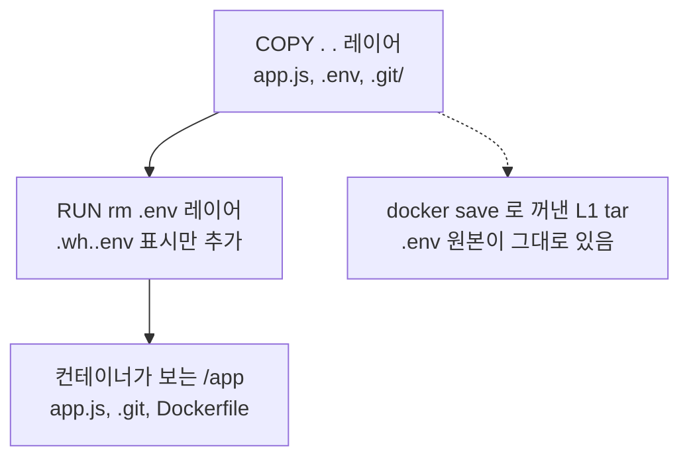

도식에서 실선은 컨테이너가 파일시스템을 합치는 순서이고, 점선은 레이어 tar 를 직접 열었을 때 보이는 것이다. 컨테이너 안에서 `cat /app/.env` 는 `No such file or directory` 로 실패하지만 `COPY . .` 레이어에는 원본이 있다.
### .dockerignore 가 없으면 .git 이 따라 들어간다

같은 이미지에서 `docker run --rm leak ls -A /app` 은 `.git`, `Dockerfile`, `app.js` 를 보여줬다. `.env` 는 지웠어도 `.git` 은 그대로 들어간 것이다. 저장소에 커밋했다가 지운 시크릿은 이미지 안 `.git` 에서 복원된다. 같은 저장소 사본에서 `old.env` 를 커밋하고 다음 커밋에서 지운 뒤 같은 Dockerfile 로 다시 빌드해 확인했다.

```bash
mkdir -p extract && for b in blobs/sha256/*; do
  zcat -f "$b" | tar -x -C extract app/.git 2>/dev/null
done
git --git-dir=extract/app/.git log --oneline
# 25cba53 remove env
# 2144d43 add env
# 4831ba1 init
git --git-dir=extract/app/.git log --all -p | grep -E '^\+AWS_SECRET'
# +AWS_SECRET=oldsecret-IN-GIT-HISTORY
```

작업 트리에서는 이미 지운 파일인데도 `.git` 만 있으면 `-p` 로 내용이 나온다.

### 고치는 방법

`.dockerignore` 로 애초에 컨텍스트에서 빼고, 빌드에 필요한 토큰은 secret mount 로 넘긴다.

```
# .dockerignore
.git
.env
.env.*
Dockerfile*
```

```dockerfile
FROM alpine:3.19
WORKDIR /app
RUN --mount=type=secret,id=npm_token \
    echo "registry auth $(cat /run/secrets/npm_token)" | wc -c
COPY . .
CMD ["sh"]
```

```bash
docker build --secret id=npm_token,src=./npm_token.txt -t fixed .
```

secret mount 는 그 `RUN` 이 도는 동안만 `/run/secrets/npm_token` 에 파일로 보이고 레이어에는 기록되지 않는다. `npm_token.txt`(내용 `ghp_SECRETMOUNT`)는 빌드 컨텍스트 밖에 둬야 한다.

처음 구성과 고친 구성의 차이는 시크릿이 레이어를 거치느냐 마운트로만 보이느냐다.

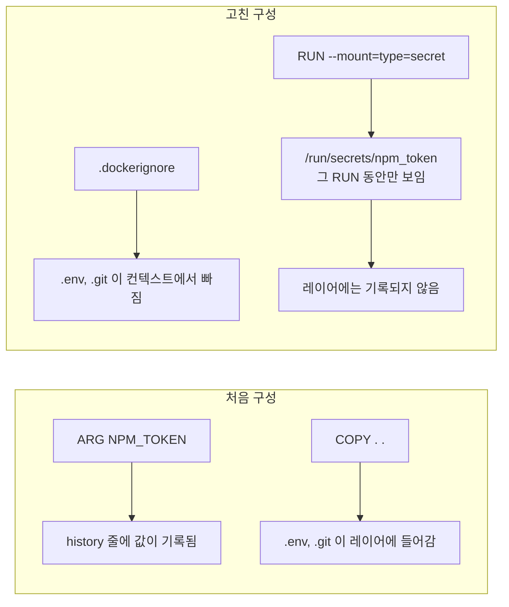

앞에서 쓴 점검을 고친 이미지에 다시 돌렸다.

| 점검 | 처음 이미지 | 고친 이미지 |
|------|-------------|-------------|
| `docker history --no-trunc` 에서 토큰 문자열이 든 줄 | 3줄 | 0줄 |
| 레이어 tar 안의 `.env`, `.wh.` 표시, `app/.git` | 있음 | 없음 |
| 모든 blob 에서 `SECRETMOUNT` 검색 | - | 0건 |
| `ls -A /app` | `.git`, `Dockerfile`, `app.js` | `.dockerignore`, `app.js` |

`.dockerignore` 자신은 `Dockerfile*` 패턴에 안 걸려서 `/app` 에 복사된다. 내용이 시크릿이 아니라 문제는 없지만 `ls` 에서 보이는 이유가 이거다. secret mount 와 SSH mount, 캐시 마운트 문법은 [Docker BuildKit](Docker_Build_Kit.md)에서, 런타임 시크릿 주입과 이미지 서명까지 포함한 관리 방법은 [Docker 컨테이너 보안](../../../Security/Container_Security.md)의 Secrets 관리 절에서 다룬다.

### 멀티스테이지는 메타데이터를 가려주지만 값이 파일로 넘어가면 못 가린다

build 스테이지에서 `ARG NPM_TOKEN` 을 쓰고 최종 스테이지에서 산출물만 `COPY --from=build` 로 가져오는 구성을 빌드했다.

| 이미지 | history 에서 `ghp_MSARG` 검색 |
|--------|------------------------------|
| 최종 이미지 | 0건 |
| `--target build` 로 만든 이미지 | 2건 |

최종 이미지는 마지막 스테이지의 레이어만 가져가므로 build 스테이지의 ARG 줄이 history 에 없다. 하지만 build 스테이지가 `echo "registry auth ${NPM_TOKEN}" > /out.txt` 로 만든 파일을 `COPY --from=build /out.txt` 로 가져오면, 최종 이미지에서 `docker run` 만으로 `registry auth ghp_MSARG` 가 출력된다. 멀티스테이지가 막는 건 build 스테이지 레이어가 이미지에 실리는 것까지이고, 복사해 온 산출물 안의 값은 그대로 들어간다. build 스테이지 이미지와 캐시는 빌드한 머신에 남으므로 CI 러너를 공유한다면 그 캐시도 시크릿이 담긴 것으로 취급해야 한다.

도식으로 보면 값이 최종 이미지로 넘어가는 경로는 `COPY --from` 으로 가져온 파일 하나뿐이다. ARG 줄이 남는 history 는 build 스테이지 이미지에만 있다.

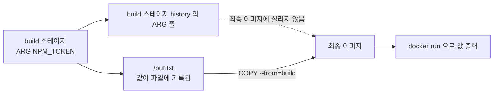

---

## 레이어 캐싱 원리

Docker 빌드 성능의 핵심이다. 제대로 이해하지 않으면 매번 전체 빌드를 하게 된다.

**캐싱 규칙**: Docker는 각 명령을 실행하기 전에 동일한 명령의 캐시된 레이어가 있는지 확인한다. 캐시 히트 조건은 명령어 종류에 따라 다르다.

- `RUN`: 명령 문자열이 동일하면 캐시 사용
- `COPY`/`ADD`: 복사 대상 파일의 체크섬이 동일하면 캐시 사용

**캐시 무효화는 연쇄적이다.** 한 레이어의 캐시가 무효화되면 그 아래 모든 레이어가 재빌드된다. 이게 핵심이다.

```dockerfile
# 나쁜 예 - 소스 한 줄 바꾸면 npm ci부터 다시 실행
FROM node:20-alpine
WORKDIR /app
COPY . .
RUN npm ci
CMD ["node", "server.js"]

# 좋은 예 - package.json이 안 바뀌면 npm ci 캐시 사용
FROM node:20-alpine
WORKDIR /app
COPY package.json package-lock.json ./
RUN npm ci
COPY . .
CMD ["node", "server.js"]
```

의존성 설치는 오래 걸리지만 자주 바뀌지 않고, 소스 코드는 자주 바뀐다. 변경 빈도가 낮은 것을 위에, 높은 것을 아래에 배치하는 게 원칙이다.

### 재빌드 범위를 직접 재봤다

express 와 typescript 를 쓰는 작은 프로젝트(`npm ci` 로 `node_modules` 38MB)에서 두 Dockerfile 을 빌드했다. `.dockerignore` 에는 `Dockerfile*`, `node_modules`, `dist` 를 넣어 `COPY . .` 에 Dockerfile 이 섞이지 않게 했다. 변경은 `src/server.ts` 에 주석 한 줄 추가, 그리고 `package.json` 의 `version` 필드 한 글자 수정이다.

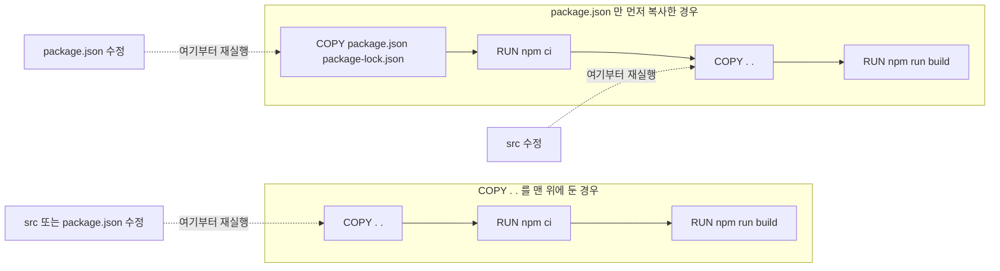

점선이 가리키는 노드부터 화살표 방향의 뒤쪽이 전부 다시 돈다. `COPY . .` 를 먼저 둔 구성은 어떤 파일이 바뀌어도 첫 `COPY . .` 의 체크섬이 달라지므로 `npm ci` 가 매번 돈다. `package.json` 을 먼저 복사한 구성은 `src` 만 바뀌면 `npm ci` 레이어가 캐시에서 올라온다.

| 변경 | 구성 | 다시 실행된 단계 | 캐시 히트 | 빌드 소요 |
|------|------|------------------|-----------|-----------|
| src 한 줄 수정 | `COPY . .` 먼저 | COPY, npm ci, npm run build (3개) | WORKDIR 까지 | 28.4초 |
| src 한 줄 수정 | package.json 먼저 | COPY . ., npm run build (2개) | WORKDIR, COPY package.json, npm ci | 12.3초 |
| package.json 수정 | `COPY . .` 먼저 | COPY, npm ci, npm run build (3개) | WORKDIR 까지 | 29.9초 |
| package.json 수정 | package.json 먼저 | COPY package.json, npm ci, COPY . ., npm run build (4개) | WORKDIR 까지 | 30.3초 |

각 조건을 한 번씩 돌린 값이고 시간에는 이 머신의 디스크·네트워크가 섞여 있다. 절대 시간보다 어느 단계가 다시 돌았는지를 봐야 한다. 로그에서 `npm ci` 는 9.8~10.6초, `npm run build` 는 8.5~9.8초였다. 마지막 줄을 보면 `package.json` 이 바뀐 커밋에서는 순서를 어떻게 잡아도 `npm ci` 를 피하지 못한다. 순서를 바꿔 얻는 이득은 의존성이 안 바뀐 커밋에서만 나오고, 오히려 `COPY` 하나가 더 실행되는 만큼 4단계가 돌았다(소요 시간은 둘 다 30초 안팎이라 차이가 없었다).

**RUN 캐시의 함정**: `RUN apt-get update`의 결과가 캐시되면 패키지 목록이 오래된 상태로 고정된다. 그래서 `apt-get update`와 `apt-get install`을 반드시 같은 `RUN`에 넣어야 한다.

```dockerfile
# 위험 - apt-get update가 캐시되면 오래된 패키지 목록으로 설치한다
RUN apt-get update
RUN apt-get install -y curl=7.88.1-10

# 안전
RUN apt-get update && apt-get install -y curl
```

**캐시를 강제로 무효화하는 방법**:

```bash
# 전체 캐시 무시
docker build --no-cache .

# 특정 시점부터 캐시 무효화하는 트릭
ARG CACHE_BUST=1
RUN echo "${CACHE_BUST}" && apt-get update
# --build-arg CACHE_BUST=$(date +%s) 로 빌드하면 매번 캐시가 깨진다
```

**BuildKit 캐시 마운트**: npm, pip, maven 같은 패키지 매니저의 캐시를 빌드 간에 공유할 수 있다.

```dockerfile
RUN --mount=type=cache,target=/root/.npm \
    npm ci --production
```

이렇게 하면 `npm ci`가 매번 모든 패키지를 네트워크에서 받지 않고, 캐시된 패키지를 재사용한다. CI 환경에서 빌드 시간 단축에 쓸만하다.

---

## 멀티스테이지 빌드

하나의 Dockerfile에 여러 `FROM`을 두고, 빌드 단계와 실행 단계를 분리하는 방식이다. 마지막 스테이지의 레이어만 최종 이미지가 되고, 앞 스테이지에서는 `COPY --from` 으로 지정한 경로만 넘어온다.

### 어떤 레이어가 남는가

```dockerfile
FROM node:20-alpine AS build
WORKDIR /app
COPY package.json package-lock.json ./
RUN npm ci
COPY tsconfig.json ./
COPY src ./src
RUN npm run build

FROM node:20-alpine AS production
WORKDIR /app
COPY package.json package-lock.json ./
RUN npm ci --omit=dev && npm cache clean --force
COPY --from=build /app/dist ./dist
CMD ["node", "dist/server.js"]
```

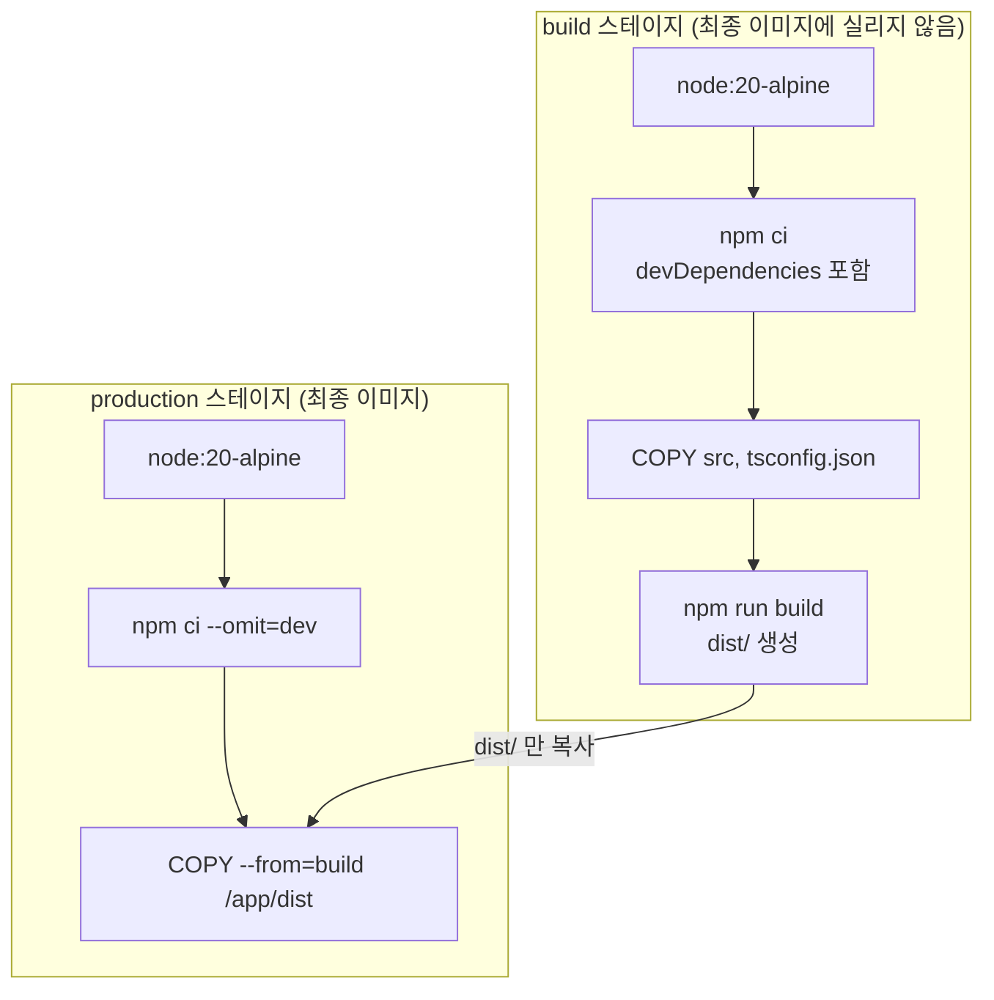

`b2`, `b3` 의 레이어는 최종 이미지에 없고, 최종 이미지에는 `p1`~`p3` 의 레이어만 있다. 둘 사이를 잇는 선은 `dist/` 폴더 하나다. 단일 스테이지(`npm ci` → `COPY src` → `npm run build`)로 같은 앱을 만든 이미지와 대조했다.

| 구성 | 이미지 크기 | `node_modules` | typescript | `/app` 안의 src, tsconfig.json |
|------|-------------|----------------|------------|-------------------------------|
| 단일 스테이지 | 258MB | 38MB | 있음 | 있음 |
| 멀티스테이지, production 에서 `npm ci --omit=dev` | 199MB | 5MB | 없음 | 없음 |
| 멀티스테이지, build 의 `node_modules` 를 `COPY --from` | 240MB | 38MB | 있음 | 없음 |

`docker history` 로 보면 단일 스테이지에서는 `npm ci` 레이어가 50MB 인데 멀티스테이지 production 의 `npm ci --omit=dev` 레이어는 4.6MB 다. `docker build --target build` 로 build 스테이지까지만 만든 이미지는 258MB 로 단일 스테이지와 크기가 같았다. build 스테이지의 내용은 단일 스테이지 빌드와 같다.

세 번째 줄은 build 스테이지의 `node_modules` 를 통째로 복사하는, 흔히 보이는 구성이다. 소스는 빠졌지만 devDependencies(typescript 등)가 그대로 따라온다. 단일 스테이지 대비 줄어든 크기가 두 번째 구성은 59MB(258MB → 199MB)인데 세 번째 구성은 18MB(258MB → 240MB)다. `COPY --from=build` 는 가져올 경로를 고르는 명령이라 `node_modules` 폴더 안에서 devDependencies 만 골라 낼 수 없다. production 스테이지에서 `npm ci --omit=dev` 로 의존성을 다시 설치해야 뺄 수 있다.

### Go 애플리케이션의 경우

Go는 정적 바이너리를 만들 수 있어서 최종 스테이지에 바이너리 하나만 남길 수 있다.

```dockerfile
FROM golang:1.22 AS build
WORKDIR /src
COPY go.mod go.sum ./
RUN go mod download
COPY . .
RUN CGO_ENABLED=0 GOOS=linux go build -o /app ./cmd/server

FROM scratch
COPY --from=build /app /app
COPY --from=build /etc/ssl/certs/ca-certificates.crt /etc/ssl/certs/
ENTRYPOINT ["/app"]
```

`/health` 하나만 있는 `net/http` 서버로 빌드해 보니 `--target build` 로 만든 이미지가 1.31GB, 최종 이미지가 11MB 였다. 최종 이미지의 `COPY /app /app` 레이어는 7.01MB 다. `scratch`에는 셸도 없고 패키지 매니저도 없다.

`ca-certificates.crt`를 빼먹으면 HTTPS 호출이 전부 실패한다. 외부 API를 호출하는 서비스라면 반드시 복사해야 한다.

### Java 애플리케이션의 경우

```dockerfile
FROM maven:3.9-eclipse-temurin-21 AS build
WORKDIR /app
COPY pom.xml .
RUN mvn dependency:go-offline
COPY src ./src
RUN mvn package -DskipTests

FROM eclipse-temurin:21-jre-alpine
WORKDIR /app
COPY --from=build /app/target/*.jar app.jar
ENTRYPOINT ["java", "-jar", "app.jar"]
```

`mvn dependency:go-offline`으로 의존성만 먼저 받아두면 소스 변경 시 의존성 다운로드를 건너뛸 수 있다.

최종 스테이지의 베이스는 JDK 가 아니라 JRE 이미지다. 컴파일러와 디버거는 build 스테이지에서만 쓰고 최종 이미지에는 필요 없다.

### 스테이지를 선택적으로 빌드하기

```bash
# 빌드 스테이지만 실행 (디버깅 용도)
docker build --target build -t my-app:build .

# 테스트 스테이지만 실행
docker build --target test -t my-app:test .
```

```dockerfile
FROM node:20 AS build
# ...빌드

FROM build AS test
RUN npm test

FROM node:20-alpine AS production
COPY --from=build /app/dist ./dist
# ...
```

CI에서 테스트 스테이지까지만 돌리고, 배포할 때는 production 스테이지까지 빌드하는 식으로 쓴다.

---

## 이미지 크기 줄이기

이미지가 작으면 레지스트리 전송이 빠르고, 디스크를 덜 먹고, 보안 공격 표면도 줄어든다.

### 베이스 이미지 선택 기준

| 이미지 | 크기 (대략) | 패키지 매니저 | 셸 | 용도 |
|--------|-------------|--------------|-----|------|
| ubuntu/debian | 100~130MB | apt | bash | 개발/디버깅 환경, 시스템 라이브러리 의존성이 많을 때 |
| alpine | 5~7MB | apk | sh (busybox) | 대부분의 프로덕션 워크로드 |
| slim (debian-slim) | 70~80MB | apt | bash | alpine에서 glibc 호환 문제가 생길 때 |
| distroless | 2~20MB | 없음 | 없음 | 보안이 최우선인 프로덕션 환경 |
| scratch | 0MB | 없음 | 없음 | Go, Rust 등 정적 바이너리 |

표의 크기는 대략치다. 이 환경의 `docker images` 에서는 `alpine:3.19` 가 11.6MB, `debian:bookworm-slim` 이 116MB, `node:20-alpine` 이 194MB 로 나왔다. 압축 여부와 스토리지 드라이버에 따라 표시값이 달라지므로 같은 환경에서 후보를 직접 받아 비교하는 편이 정확하다.

위 표를 고르는 순서로 바꾸면 아래 분기가 된다. 정적 바이너리인지가 첫 질문이고, 그다음이 glibc 호환과 셸 디버깅 필요 여부다.

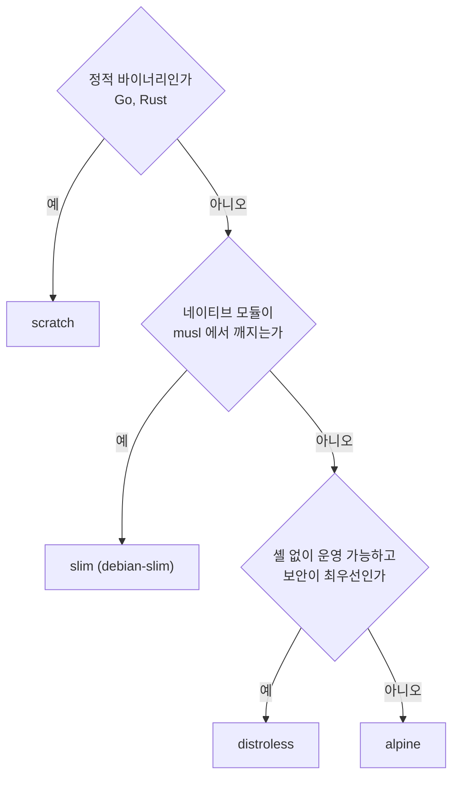

**alpine 쓸 때 주의할 점**: alpine은 glibc 대신 musl을 쓴다. Python의 일부 C 확장 모듈이나 Node.js의 네이티브 모듈(bcrypt, sharp 등)이 musl에서 빌드가 안 되거나, 빌드 시간이 길어지는 경우가 있다. 이런 경우에 slim을 쓴다.

```dockerfile
# alpine에서 bcrypt 설치가 실패하는 경우
FROM node:20-alpine
RUN npm install bcrypt  # 빌드 에러 가능

# slim으로 바꾸면 해결
FROM node:20-slim
RUN npm install bcrypt
```

**distroless**: Google이 관리하는 이미지로, 애플리케이션 런타임만 들어있다. 셸이 없으니 `docker exec`로 컨테이너에 들어가서 디버깅하는 게 불가능하다. 운영 환경에서 보안을 강화할 때 쓴다.

```dockerfile
FROM gcr.io/distroless/java21-debian12
COPY app.jar /app.jar
ENTRYPOINT ["java", "-jar", "/app.jar"]
```

디버깅이 필요하면 `:debug` 태그를 쓴다. busybox 셸이 포함된 버전이다.

### 이미지 크기를 줄이는 실질적인 방법

**1. 패키지 설치 후 캐시를 삭제한다.**

```dockerfile
# apt
RUN apt-get update && \
    apt-get install -y --no-install-recommends curl && \
    rm -rf /var/lib/apt/lists/*

# apk
RUN apk add --no-cache curl

# pip
RUN pip install --no-cache-dir -r requirements.txt

# npm
RUN npm ci --production && npm cache clean --force
```

**2. 빌드 전용 패키지는 설치 후 삭제한다.**

```dockerfile
# alpine - 가상 패키지로 묶어서 한번에 삭제
RUN apk add --no-cache --virtual .build-deps gcc musl-dev && \
    pip install --no-cache-dir cryptography && \
    apk del .build-deps
```

**3. 이미지 크기를 확인한다.**

```bash
# 이미지 전체 크기
docker images my-app

# 레이어별 크기 확인
docker history my-app

# dive 도구로 시각적으로 분석 (별도 설치 필요)
dive my-app
```

`docker history`에서 어떤 레이어가 큰지 보고, 그 레이어를 만드는 `RUN` 명령을 개선하는 방식으로 접근하면 된다.

---

## HEALTHCHECK 문법

컨테이너가 정상 동작하는지 Docker가 주기적으로 확인하는 명령이다. `docker ps`의 STATUS 컬럼에 healthy/unhealthy가 표시된다.

```dockerfile
HEALTHCHECK --interval=30s --timeout=5s --start-period=10s --retries=3 \
  CMD curl -f http://localhost:3000/health || exit 1
```

- `--interval`: 헬스체크 간격. 기본 30초.
- `--timeout`: 이 시간 안에 응답이 없으면 실패.
- `--start-period`: 컨테이너 시작 후 이 시간 동안은 실패해도 재시도 횟수에 세지 않는다. JVM 기반 앱처럼 기동이 느리면 넉넉하게 잡는다.
- `--retries`: 연속 실패 횟수. 이만큼 연속 실패하면 unhealthy 상태가 된다.

아래 상태도는 위 옵션이 상태를 어떻게 바꾸는지 보여준다. `start-period` 안의 실패는 `retries` 에 세지 않고, 그 뒤의 연속 실패만 unhealthy 로 넘어간다.

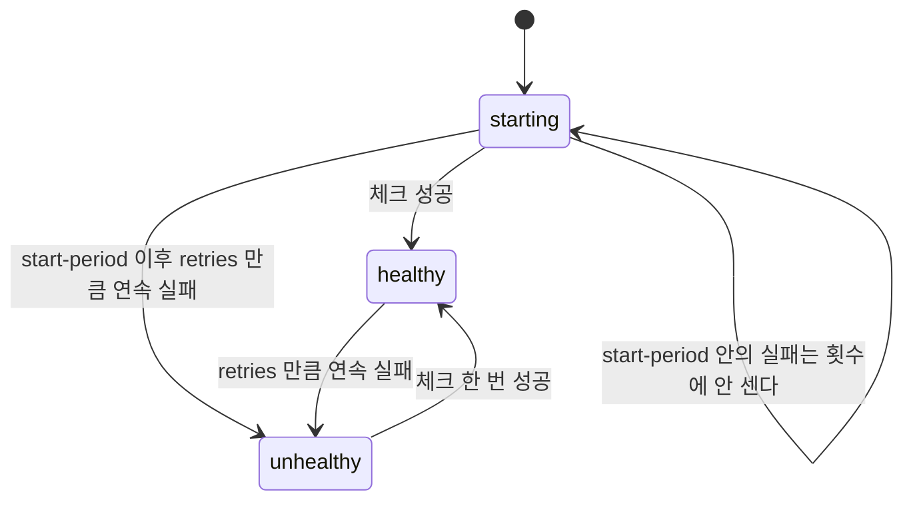

`CMD` 뒤는 셸 형식(`curl ... || exit 1`)과 exec 형식(`["node", "healthcheck.js"]`) 모두 쓸 수 있다. 셸 형식은 이미지에 `/bin/sh` 가 있어야 하고, `scratch` 나 distroless 에서는 exec 형식에 이미지 안에 들어 있는 실행 파일을 지정해야 한다. 런타임 설정(헬스체크, 실행 사용자, 읽기 전용 파일시스템 등)을 보안 관점에서 어떻게 묶는지는 [Docker 컨테이너 보안](../../../Security/Container_Security.md)을 본다. Kubernetes 는 Dockerfile 의 HEALTHCHECK 를 쓰지 않고 Pod spec 의 livenessProbe/readinessProbe 를 쓴다.

---

## 빌드 시 자주 겪는 실수와 디버깅

### COPY 경로 문제

```dockerfile
# 에러: COPY failed: file not found in build context
COPY config/settings.json /app/

# 원인 1: .dockerignore에서 config/를 제외하고 있다
# 원인 2: docker build 명령의 컨텍스트 경로가 잘못됐다
# 원인 3: 파일이 실제로 없다 (오타)
```

빌드 컨텍스트 밖의 파일은 절대 복사할 수 없다. `COPY ../something /app/` 같은 건 안 된다. 상위 디렉토리 파일이 필요하면 빌드 컨텍스트를 상위로 잡아야 한다.

```bash
# 프로젝트 루트에서 빌드하되, 하위 디렉토리의 Dockerfile을 지정
docker build -f services/api/Dockerfile .
```

### USER 와 파일 소유권

```dockerfile
FROM node:20-alpine
RUN addgroup -S appgroup && adduser -S appuser -G appgroup
WORKDIR /app
COPY --chown=appuser:appgroup . .
USER appuser
CMD ["node", "server.js"]
```

문법으로 알아둘 것은 두 가지다. `USER` 아래의 `RUN` 은 그 사용자 권한으로 돌기 때문에 패키지 설치처럼 root 가 필요한 작업은 `USER` 앞에 둔다. `COPY` 는 기본이 root 소유라서 `USER` 를 바꿨다면 `--chown` 을 같이 줘야 쓰기 권한이 필요한 파일을 앱이 열 수 있다. node 공식 이미지에는 `node` 유저가 이미 있어서 `USER node` 만 쓰면 된다. non-root 로 돌려야 하는 이유와 이미지별 유저 생성 방법은 [Docker 컨테이너 보안](../../../Security/Container_Security.md)의 non-root 실행 절에서 다룬다.

### 빌드 중간에 디버깅하기

```bash
# 특정 스테이지에서 멈추고 셸로 진입
docker build --target build -t debug-build .
docker run -it debug-build sh

# BuildKit 없이 빌드하면 중간 레이어 ID가 나온다 (레거시)
DOCKER_BUILDKIT=0 docker build .
# 실패 직전 레이어 ID로 컨테이너를 띄워서 확인
docker run -it <layer-id> sh
```

### 플랫폼 관련 문제

M1/M2 Mac에서 빌드한 이미지를 Linux AMD64 서버에 배포하면 실행이 안 되는 경우가 있다.

```bash
# 명시적으로 플랫폼 지정
docker build --platform linux/amd64 -t my-app .

# 멀티 플랫폼 빌드 (buildx 필요)
docker buildx build --platform linux/amd64,linux/arm64 -t my-app .
```

Dockerfile에서도 플랫폼을 지정할 수 있다.

```dockerfile
FROM --platform=linux/amd64 node:20-alpine
```

### 캐시가 안 먹는 경우

빌드할 때마다 모든 레이어가 재빌드되면 다음을 확인한다.

- `COPY . .` 가 의존성 설치보다 위에 있는지 (위에서 설명한 레이어 순서 문제)
- `docker build`할 때 컨텍스트에 자주 바뀌는 파일(로그, `.git`, Dockerfile 자신 등)이 `COPY . .` 로 들어오는지. `.dockerignore` 에 넣으면 이미지에서 빠질 뿐 아니라 캐시도 안 깨진다
- CI 환경에서 매번 깨끗한 환경을 쓰는지 (이 경우 캐시가 없으니 `--cache-from` 옵션으로 레지스트리 캐시를 활용한다)

```bash
# 이전 빌드 이미지를 캐시로 사용
docker build --cache-from my-app:latest -t my-app:new .
```

### EXPOSE는 실제로 포트를 열지 않는다

```dockerfile
EXPOSE 3000
```

이건 문서화 용도일 뿐이다. 실제 포트 매핑은 `docker run -p 3000:3000`으로 해야 한다. `EXPOSE`를 안 써도 `-p` 옵션으로 포트를 열 수 있고, `EXPOSE`를 써도 `-p` 없이는 외부에서 접근할 수 없다.

### WORKDIR을 안 쓰고 절대경로로 모든 걸 지정하는 실수

```dockerfile
# 읽기 어렵고 실수하기 쉽다
RUN mkdir -p /usr/src/app
COPY package.json /usr/src/app/package.json
RUN cd /usr/src/app && npm install
COPY . /usr/src/app

# WORKDIR을 쓰면 깔끔하다
WORKDIR /app
COPY package.json ./
RUN npm install
COPY . .
```

`RUN cd /some/path && command` 이렇게 하면 다음 `RUN`에서는 다시 `/`로 돌아간다. `RUN`마다 새 셸이 뜨기 때문이다. `WORKDIR`을 쓰면 이후 모든 명령의 작업 디렉토리가 고정된다.
