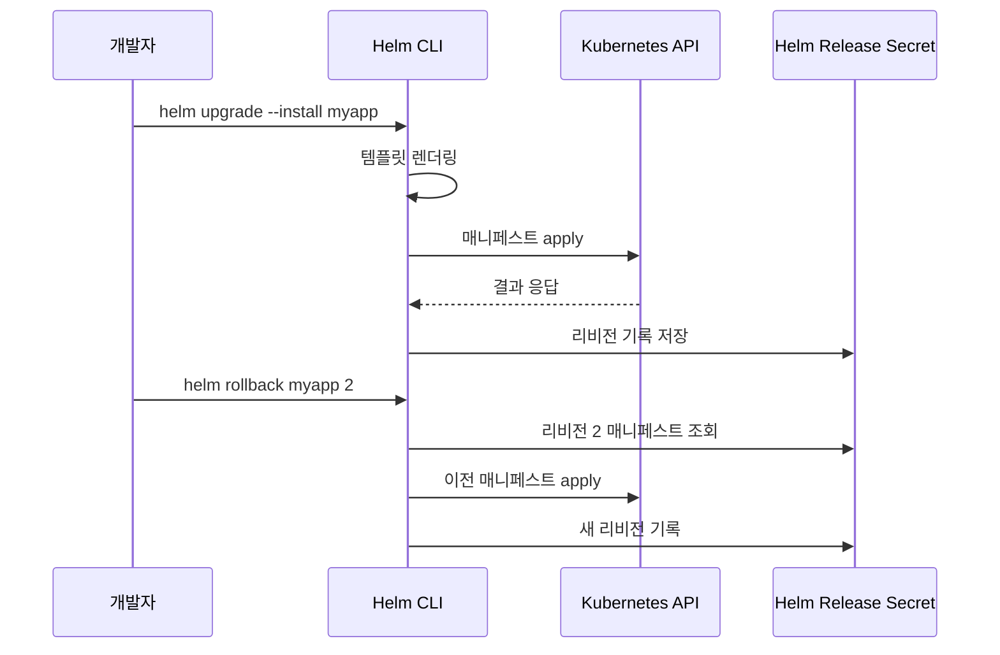

# Helm

## 1. Helm이 해결하는 문제

Helm은 Kubernetes 매니페스트를 패키지 단위로 묶어 배포하는 도구다. 공식 설명에서는 "Kubernetes의 패키지 매니저"라고 하는데, 실제로 apt나 yum을 쓰듯 `helm install nginx bitnami/nginx` 한 줄로 복잡한 앱을 띄울 수 있다.

운영에서 Helm을 쓰는 이유는 크게 세 가지다.

첫째, **템플릿화**. 같은 애플리케이션을 dev/stg/prod에 배포할 때 replica 수, 리소스 limit, 이미지 태그, ingress host가 다 다르다. 평문 YAML로 관리하면 환경별로 파일이 복제되고, 한쪽만 수정되는 사고가 반복된다. Helm은 Go template으로 이 부분을 변수화한다.

둘째, **배포 이력 관리**. `helm install`이나 `upgrade`를 할 때마다 리비전이 기록된다. `helm history`로 이전 배포 내역을 보고, `helm rollback`으로 특정 리비전으로 되돌릴 수 있다. kubectl apply로 배포하면 이런 이력이 없어서 "어제 버전으로 돌려줘"가 불가능하다.

셋째, **서드파티 앱 설치**. Prometheus, Grafana, ArgoCD, cert-manager 같은 걸 직접 매니페스트로 작성하면 수백 줄이 넘는다. Helm 차트를 쓰면 values 몇 줄만 오버라이드하면 된다.

Kustomize와 비교해서 얘기를 하는 경우가 많은데, 관점이 다르다. Kustomize는 "원본 YAML을 건드리지 않고 patch로 덮어쓰자"는 접근이고, Helm은 "템플릿 변수를 값으로 채우자"는 접근이다. 사내 서비스는 Kustomize가 단순해서 좋고, 외부 앱 설치나 다중 환경 릴리스 관리는 Helm이 유리하다.

## 2. 차트 구조

`helm create mychart`로 스캐폴드를 만들면 이런 구조가 나온다.

```
mychart/
├── Chart.yaml          # 차트 메타데이터
├── values.yaml         # 기본 값
├── charts/             # 의존 차트 (서브차트)
├── templates/
│   ├── _helpers.tpl    # 템플릿 헬퍼 함수
│   ├── deployment.yaml
│   ├── service.yaml
│   ├── ingress.yaml
│   ├── hpa.yaml
│   ├── serviceaccount.yaml
│   ├── NOTES.txt       # 설치 후 출력 메시지
│   └── tests/
└── .helmignore
```

`Chart.yaml`은 차트의 신원증명 같은 역할을 한다. 가장 헷갈리는 필드가 `version`과 `appVersion`이다. `version`은 차트 자체의 버전이고, `appVersion`은 차트가 배포하는 애플리케이션의 버전이다. 예를 들어 nginx 1.25를 배포하는 차트의 5번째 수정본이라면 `version: 0.5.0`, `appVersion: "1.25"`가 된다. SemVer를 반드시 따라야 하고, 두 필드를 헷갈려서 `version`만 올리고 `appVersion`을 그대로 두는 실수가 잦다.

```yaml
apiVersion: v2
name: mychart
description: My application chart
type: application
version: 0.5.0
appVersion: "1.25"
kubeVersion: ">=1.24.0"
dependencies:
  - name: redis
    version: "17.x.x"
    repository: "https://charts.bitnami.com/bitnami"
    condition: redis.enabled
```

`type`은 `application`과 `library` 두 가지가 있다. library 차트는 재사용 가능한 템플릿 함수만 제공하고 설치는 불가능하다. 사내에서 공통 레이블, 공통 어노테이션, 공통 Deployment 템플릿을 만들어 쓸 때 library 타입으로 만든다.

## 3. values.yaml과 템플릿 문법

`values.yaml`은 차트의 기본값이다. 템플릿에서 `.Values.이름`으로 접근한다.

```yaml
replicaCount: 2

image:
  repository: myapp
  tag: "1.0.0"
  pullPolicy: IfNotPresent

service:
  type: ClusterIP
  port: 8080

resources:
  limits:
    cpu: 500m
    memory: 512Mi
  requests:
    cpu: 100m
    memory: 256Mi

ingress:
  enabled: false
  className: nginx
  hosts:
    - host: app.example.com
      paths:
        - path: /
          pathType: Prefix

env:
  - name: LOG_LEVEL
    value: info
```

템플릿에서는 Go template 문법에 Sprig 함수 라이브러리가 추가된 형태로 쓴다. `templates/deployment.yaml`에서는 이렇게 사용한다.

```yaml
apiVersion: apps/v1
kind: Deployment
metadata:
  name: {{ include "mychart.fullname" . }}
  labels:
    {{- include "mychart.labels" . | nindent 4 }}
spec:
  replicas: {{ .Values.replicaCount }}
  selector:
    matchLabels:
      {{- include "mychart.selectorLabels" . | nindent 6 }}
  template:
    metadata:
      labels:
        {{- include "mychart.selectorLabels" . | nindent 8 }}
    spec:
      containers:
        - name: {{ .Chart.Name }}
          image: "{{ .Values.image.repository }}:{{ .Values.image.tag | default .Chart.AppVersion }}"
          imagePullPolicy: {{ .Values.image.pullPolicy }}
          ports:
            - containerPort: {{ .Values.service.port }}
          {{- with .Values.env }}
          env:
            {{- toYaml . | nindent 12 }}
          {{- end }}
          resources:
            {{- toYaml .Values.resources | nindent 12 }}
          {{- if .Values.livenessProbe }}
          livenessProbe:
            {{- toYaml .Values.livenessProbe | nindent 12 }}
          {{- end }}
```

몇 가지 함정이 있다.

**`{{-`와 `-}}`의 공백 처리**. 대시 유무에 따라 앞뒤 공백과 개행이 제거된다. 잘못 쓰면 YAML 들여쓰기가 깨져서 렌더링은 성공해도 apply에서 실패한다. 렌더링 결과를 바로 확인하려면 `helm template` 명령을 쓴다.

**`nindent`와 `indent`**. nindent는 앞에 개행을 추가하고 들여쓰기를 하는데, indent는 그냥 들여쓰기만 한다. toYaml과 조합해서 쓸 때는 대부분 nindent를 쓴다.

**`default` 함수**. `.Values.image.tag | default .Chart.AppVersion`은 tag가 비어있으면 차트의 appVersion을 쓴다. 실수로 values에서 tag를 빼먹었을 때 안전하게 동작한다.

**`required`**. 필수 값은 `{{ required "image.repository는 필수다" .Values.image.repository }}`로 강제한다. 비어있으면 helm install이 에러로 중단된다.

**`_helpers.tpl`**. `define`으로 함수를 정의하고 `include`로 호출한다. fullname 생성, 공통 레이블 생성 로직을 여기 모아둔다.

```yaml
{{/*
Common labels
*/}}
{{- define "mychart.labels" -}}
helm.sh/chart: {{ include "mychart.chart" . }}
{{ include "mychart.selectorLabels" . }}
{{- if .Chart.AppVersion }}
app.kubernetes.io/version: {{ .Chart.AppVersion | quote }}
{{- end }}
app.kubernetes.io/managed-by: {{ .Release.Service }}
{{- end }}
```

참고로 `.Release.Name`, `.Release.Namespace`, `.Chart.Name`, `.Chart.Version`, `.Values` 외에 `.Capabilities`(클러스터 API 버전 확인)와 `.Files`(차트 내 파일 읽기)도 자주 쓴다. ConfigMap을 외부 설정 파일에서 읽어올 때 `{{ .Files.Get "config/app.yaml" | indent 2 }}` 같이 쓴다.

## 4. install, upgrade, rollback

배포는 `install`과 `upgrade` 두 가지 명령을 쓴다. 실무에서는 `upgrade --install` 조합을 더 자주 쓴다. 릴리스가 없으면 설치하고, 있으면 업그레이드한다. CI/CD에서 멱등성을 보장하려면 이게 편하다.

```bash
# 설치
helm install myapp ./mychart -n myns --create-namespace

# 업그레이드 (없으면 설치)
helm upgrade --install myapp ./mychart \
  -n myns \
  -f values-prod.yaml \
  --set image.tag=1.2.3

# 현재 상태 확인
helm list -n myns
helm status myapp -n myns

# 배포 이력
helm history myapp -n myns

# 롤백 (리비전 지정)
helm rollback myapp 3 -n myns

# 제거
helm uninstall myapp -n myns
```

`--set`은 CLI에서 값을 오버라이드한다. 여러 개 주면 여러 필드를 동시에 덮어쓴다. 중첩 구조는 점으로 구분한다(`--set image.tag=1.2.3`). 배열은 중괄호(`--set env={a,b,c}`)를 쓰는데 특수문자 이스케이프가 번거로워서, 복잡한 오버라이드는 `-f values-override.yaml`로 파일을 주는 편이 낫다.

`--dry-run`과 `--debug`는 배포 전 확인용이다. `--dry-run` 단독으로는 클러스터에 요청을 보내서 검증까지 하고, `--dry-run=client`를 쓰면 로컬에서만 렌더링한다. 렌더링만 보고 싶으면 `helm template`이 더 빠르다.

```bash
# 렌더링만 보기
helm template myapp ./mychart -f values-prod.yaml > out.yaml

# dry-run (서버 검증 포함)
helm upgrade --install myapp ./mychart --dry-run --debug
```

롤백은 실수로 이상한 버전을 배포했을 때 바로 복구할 수 있어서 Helm의 가장 큰 장점 중 하나다. 다만 리비전 개수에는 한도가 있다. 기본값이 10이라 10번 이상 배포하면 가장 오래된 리비전부터 삭제된다. 한 달 전 리비전으로 롤백해야 할 일이 생길 수 있으니, 중요한 서비스는 `--history-max`를 넉넉히 잡거나 Git에서 values를 관리해서 재배포로 복구하는 흐름을 병행한다.



Helm 3부터 릴리스 정보는 기본적으로 해당 네임스페이스의 Secret에 `sh.helm.release.v1.<name>.v<revision>` 이름으로 저장된다. Helm 2 시절의 Tiller는 사라졌다. 릴리스 데이터가 날아갔을 때 이 Secret을 백업/복원하면 복구된다.

## 5. 멀티 환경 values 분리

실무에서는 dev/stg/prod 환경별로 values를 분리한다. 디렉토리 구조는 대체로 이렇게 잡는다.

```
mychart/
├── Chart.yaml
├── values.yaml                  # 공통 기본값
├── values-dev.yaml              # dev 오버라이드
├── values-staging.yaml
├── values-prod.yaml
└── templates/
```

공통 기본값을 `values.yaml`에 두고, 환경별 파일에는 달라지는 값만 둔다. `-f`는 여러 번 줄 수 있고 뒤쪽 파일이 앞쪽 값을 덮어쓴다.

```bash
helm upgrade --install myapp ./mychart \
  -f values.yaml \
  -f values-prod.yaml \
  -n prod
```

`-f values.yaml`은 생략해도 된다(차트 내부의 values.yaml은 자동 로드). 명시해도 무방하다.

비밀값은 values 파일에 평문으로 넣으면 안 된다. sops나 helm-secrets 플러그인을 쓰거나, Kubernetes Secret을 외부에서 만들고 차트에서는 Secret 이름만 참조하는 식으로 분리한다. `values-prod.yaml`을 Git에 올릴 때 DB 비밀번호가 들어있는 사고를 방지하려면, 비밀값은 `values-secrets-prod.enc.yaml` 같은 별도 파일로 떼어 내고 `.gitignore`에 넣거나 암호화한다.

ArgoCD와 연계할 때는 Application 리소스의 `valueFiles`에 여러 values를 나열한다. 이 경우 helm 명령을 직접 치지 않고 ArgoCD가 렌더링과 동기화를 한다.

## 6. Dependency 관리

차트가 다른 차트를 포함할 수 있다. 대표적으로 애플리케이션 차트 안에 Redis, PostgreSQL 서브차트를 포함하는 구조다.

```yaml
# Chart.yaml
dependencies:
  - name: redis
    version: "17.15.0"
    repository: "https://charts.bitnami.com/bitnami"
    condition: redis.enabled
    alias: cache
  - name: postgresql
    version: "12.x.x"
    repository: "https://charts.bitnami.com/bitnami"
    condition: postgresql.enabled
```

의존성을 명시하면 `helm dependency update`로 `charts/` 디렉토리에 tgz 파일로 다운로드된다. `helm dependency build`는 `Chart.lock` 파일을 기준으로 재빌드한다. `Chart.lock`은 lockfile 역할을 해서 팀원 간에 같은 버전의 서브차트를 쓰도록 보장한다. 반드시 Git에 커밋한다.

`condition`은 특정 값이 true일 때만 서브차트를 설치하는 플래그다. `redis.enabled: false`를 주면 Redis가 설치되지 않는다. 로컬 개발에서는 in-cluster Redis를 쓰고 프로덕션에서는 ElastiCache를 쓰는 식으로 분리할 때 편리하다.

`alias`를 쓰면 같은 차트를 여러 이름으로 설치할 수 있다. Redis를 캐시용과 세션용으로 각각 띄우는 경우다.

서브차트의 values는 부모 차트의 values 하위에 해당 이름으로 넣는다.

```yaml
# values.yaml
redis:
  enabled: true
  auth:
    password: "changeme"
  master:
    persistence:
      size: 8Gi

postgresql:
  enabled: false
```

부모 차트에서 서브차트의 값을 오버라이드할 때 주의할 점은 서브차트 내부에서 해당 값을 어떻게 참조하는지 문서를 확인해야 한다는 것이다. Bitnami 차트는 values 구조가 자주 바뀌어서, 메이저 업그레이드할 때마다 values 구조 변경이 있는지 CHANGELOG를 확인하는 습관이 필요하다.

서브차트끼리 값을 공유하려면 `global` 네임스페이스를 쓴다.

```yaml
global:
  storageClass: gp3
  imageRegistry: myregistry.io
```

`global.*` 아래 값은 모든 서브차트에서 `.Values.global.*`로 읽을 수 있다.

## 7. Hook과 Lifecycle

Helm에는 배포 전후에 Job을 실행하는 hook이 있다. DB 마이그레이션이 대표적인 용도다.

```yaml
apiVersion: batch/v1
kind: Job
metadata:
  name: {{ include "mychart.fullname" . }}-migration
  annotations:
    "helm.sh/hook": pre-upgrade,pre-install
    "helm.sh/hook-weight": "-5"
    "helm.sh/hook-delete-policy": before-hook-creation,hook-succeeded
spec:
  template:
    spec:
      restartPolicy: Never
      containers:
        - name: migrate
          image: "{{ .Values.image.repository }}:{{ .Values.image.tag }}"
          command: ["./migrate.sh"]
```

주요 hook 종류는 다음과 같다.

- `pre-install`, `post-install`: 설치 전/후
- `pre-upgrade`, `post-upgrade`: 업그레이드 전/후
- `pre-delete`, `post-delete`: 삭제 전/후
- `pre-rollback`, `post-rollback`: 롤백 전/후
- `test`: `helm test` 명령으로 실행

`hook-weight`는 여러 hook의 실행 순서를 결정한다. 작은 값이 먼저 실행된다. 음수도 가능하다.

`hook-delete-policy`에는 세 가지가 있다.

- `before-hook-creation`: 새 hook을 만들기 전에 이전 hook 리소스를 삭제한다. 기본값이라 보통 이것만 써도 된다.
- `hook-succeeded`: hook이 성공하면 삭제한다.
- `hook-failed`: hook이 실패하면 삭제한다. 실패 원인을 디버깅해야 한다면 이걸 빼야 Pod 로그가 남는다.

실무에서 가장 흔히 겪는 문제는 **마이그레이션 hook이 실패했는데 앱 Pod은 이미 새 이미지로 업데이트되는 경우**다. hook이 `pre-upgrade`라면 실패 시 upgrade 전체가 롤백되지만, 이미 실행된 DB 변경은 되돌아가지 않는다. 마이그레이션 스크립트는 반드시 idempotent하게 작성하고, 실패 시 수동 복구 가능한 상태로 남겨야 한다.

또 하나, hook으로 생성된 리소스는 Helm 릴리스에 포함되지 않는다. 즉 `helm uninstall`을 해도 hook 리소스는 삭제되지 않을 수 있다. `hook-succeeded` 정책을 명시해서 자동 정리하거나 수동으로 관리한다.

## 8. 사내 차트 리포지토리 운영

공개 차트(bitnami, prometheus-community 등) 외에 사내 차트를 공유하는 리포지토리가 필요하다. 선택지가 몇 개 있다.

**ChartMuseum**. 가장 전통적인 방법. Helm repo HTTP API를 구현한 단일 서버다. S3, GCS, Azure Blob에 차트를 저장하도록 설정한다.

**OCI 레지스트리**. Helm 3.8부터 stable로 승격된 방식. Docker Registry, Harbor, ECR, ACR, GCR 같은 OCI 레지스트리에 차트를 이미지처럼 저장한다. 컨테이너 이미지와 차트를 하나의 레지스트리에서 관리할 수 있어 최근에 이 방식으로 옮기는 팀이 많다.

```bash
# OCI 레지스트리에 push
helm package mychart
helm push mychart-0.5.0.tgz oci://registry.company.com/charts

# 설치
helm install myapp oci://registry.company.com/charts/mychart --version 0.5.0
```

**Harbor**. Helm repo 기능과 OCI 레지스트리를 모두 지원한다. 사내 배포용으로 가장 많이 선택되는 옵션이다. RBAC, 취약점 스캔, replication도 된다.

**GitHub Pages + gh-pages**. 소규모 팀이 부담 없이 시작할 수 있는 방법. `helm package` 후 `helm repo index`로 index.yaml을 만들고 gh-pages 브랜치에 푸시한다.

```bash
helm package mychart -d docs/charts/
helm repo index docs/charts/ --url https://myorg.github.io/charts/
git add docs/charts/
git commit -m "Publish chart 0.5.0"
git push origin gh-pages
```

사내 운영에서 중요한 건 **버전 정책**이다. 차트 버전은 올리지 않고 파일만 수정해서 덮어쓰는 일이 생기면 클라이언트가 캐시된 버전을 받아 이상 동작한다. 반드시 변경이 있으면 `version`을 올리고, 한번 publish된 버전은 수정하지 않는 규칙을 지켜야 한다. OCI 방식에서는 태그 mutability를 막아두는 설정이 있으면 켜둔다.

## 9. 버전 충돌과 롤백 실패 트러블슈팅

실무에서 자주 만나는 문제들이다.

**`UPGRADE FAILED: another operation (install/upgrade/rollback) is in progress`**. 이전 작업이 비정상 종료되면서 릴리스 상태가 `pending-upgrade`에 멈춘 상태다. `helm status`로 확인하면 상태가 pending으로 나온다. Helm 3.6부터 `--force` 없이 `helm rollback`으로 해결할 수 있지만, 릴리스가 처음부터 막혀있으면 불가능하다. 이 경우에는 해당 리비전의 Secret을 수동으로 수정하거나 삭제해야 한다.

```bash
# pending 상태 확인
kubectl get secrets -n myns -l owner=helm

# 가장 최근 리비전 Secret 삭제 (위험, 백업 후)
kubectl delete secret sh.helm.release.v1.myapp.v15 -n myns

# 또는 helm 3.13+에서 릴리스를 초기 상태로 되돌림
helm rollback myapp 14 -n myns --cleanup-on-fail
```

**`cannot patch "xxx" with kind Deployment: ... field is immutable`**. Deployment의 `spec.selector` 같은 immutable 필드를 변경했을 때 발생한다. Helm은 kubectl apply와 비슷하게 patch로 업데이트하는데, immutable 필드는 patch가 안 된다. 이 경우 해당 리소스를 삭제하고 재생성하거나, 차트에서 selector 로직을 바꿔야 한다. PVC 크기 축소, StatefulSet volumeClaimTemplates 변경에서도 같은 에러가 난다.

**롤백했는데 Pod이 새 이미지로 남아있다**. ImmutableField와 비슷한 상황이다. 롤백 당시의 매니페스트를 apply했는데, 이미지 태그가 `latest`라서 실제 Pod은 그대로 최신 이미지를 받아버린 경우다. 태그는 반드시 고정 버전을 쓰고, `imagePullPolicy`를 `IfNotPresent`로 해서 이미지 풀링을 최소화한다.

**`Error: rendered manifests contain a resource that already exists`**. 기존에 helm이 아닌 방법(kubectl apply)으로 만든 리소스를 Helm으로 관리하려 할 때 발생한다. Helm 3.2부터는 기존 리소스에 `meta.helm.sh/release-name`과 `meta.helm.sh/release-namespace` 어노테이션, `app.kubernetes.io/managed-by: Helm` 레이블을 붙이면 adopt가 된다.

```bash
kubectl annotate configmap myconfig \
  meta.helm.sh/release-name=myapp \
  meta.helm.sh/release-namespace=myns -n myns
kubectl label configmap myconfig app.kubernetes.io/managed-by=Helm -n myns
```

**서브차트 업그레이드 후 CRD 충돌**. `crds/` 디렉토리에 둔 CRD는 `helm install` 때만 생성되고 `upgrade` 때 업데이트되지 않는다. Helm의 의도적 제약이다. CRD 스키마를 바꿔야 한다면 수동으로 `kubectl apply -f`하거나, 별도 차트로 분리해서 관리한다. Prometheus Operator, cert-manager처럼 CRD가 중요한 차트는 대부분 CRD를 별도 매니페스트로 배포하도록 문서화되어 있다.

**`exceeded history max` 이후 롤백 불가**. 앞서 말한 히스토리 한도 문제다. 30일 전 리비전을 찾는데 이미 지워져 있다면 롤백할 수 없다. 이때는 Git에서 당시 values를 꺼내와서 `upgrade --install`로 재배포하는 게 유일한 방법이다. Helm에만 의존하지 말고 values를 반드시 Git에 두는 이유다.

**`helm diff`를 꼭 쓰자**. `helm-diff` 플러그인은 업그레이드 전에 실제로 어떤 리소스가 어떻게 변경되는지 보여준다. `helm diff upgrade myapp ./mychart -f values-prod.yaml`로 확인한 뒤 실행하는 습관을 들이면 실수 사고가 확연히 줄어든다. ArgoCD처럼 GitOps를 쓴다면 UI에서 자동으로 diff를 보여주지만, CI/CD 파이프라인에서 helm을 직접 호출한다면 반드시 diff 단계를 넣는다.

**values 구조가 바뀐 차트 업그레이드**. 서드파티 차트를 메이저 버전 올릴 때 values 키가 바뀌는 경우가 많다. `nginx.controller.replicaCount`가 `controller.replicas`로 바뀌는 식이다. 이전 values 그대로 넣으면 기본값이 적용되면서 replica가 1로 줄거나 엉뚱한 동작을 한다. helm template으로 렌더링 결과를 비교하고, CHANGELOG에서 breaking change를 확인한 뒤에만 업그레이드한다.

```bash
# 버전 A로 렌더링
helm template myapp ./mychart --version 17.0.0 -f values.yaml > before.yaml

# 버전 B로 렌더링
helm template myapp ./mychart --version 18.0.0 -f values.yaml > after.yaml

diff before.yaml after.yaml
```

마지막으로, Helm을 잘 쓰려면 결국 Kubernetes 리소스를 잘 이해해야 한다. Helm은 매니페스트를 만드는 도구일 뿐이고, 잘못된 매니페스트를 만들면 Helm도 막아주지 않는다. 템플릿을 작성할 때 `helm template`으로 렌더링해보고, `kubectl apply --dry-run=server -f`로 서버 검증까지 거치는 흐름이 안전하다.
