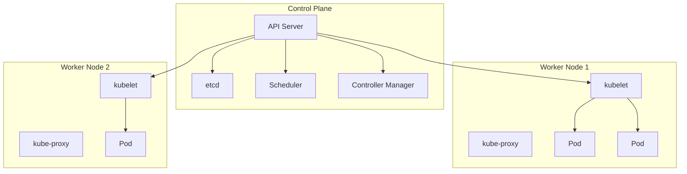
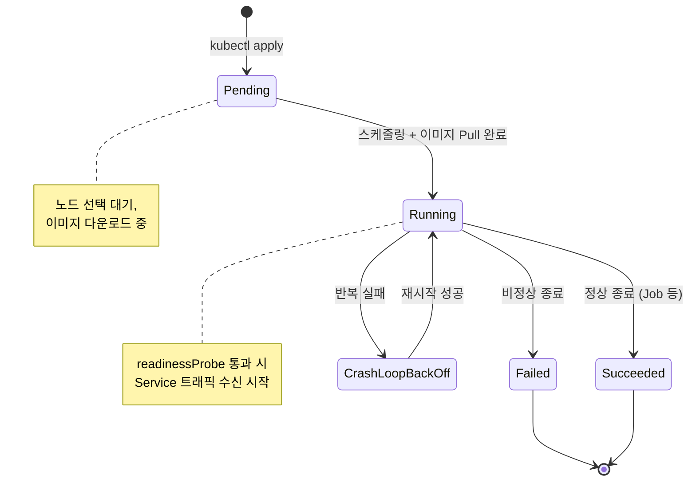
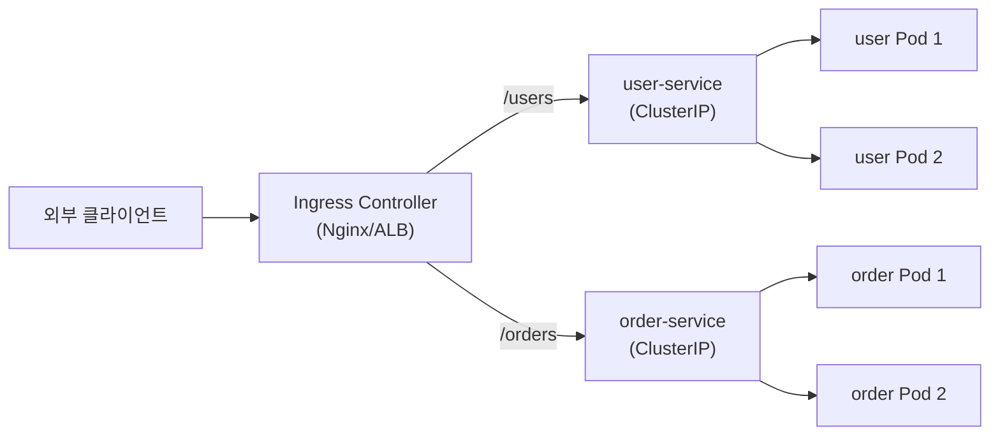
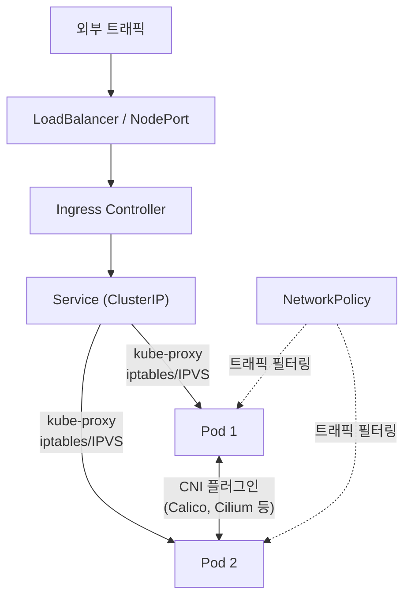
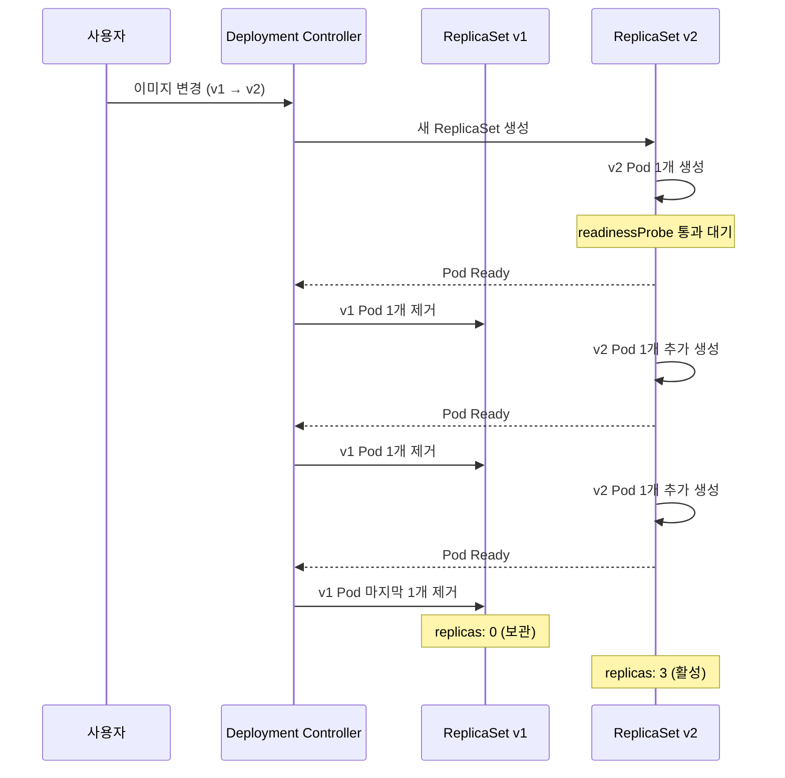
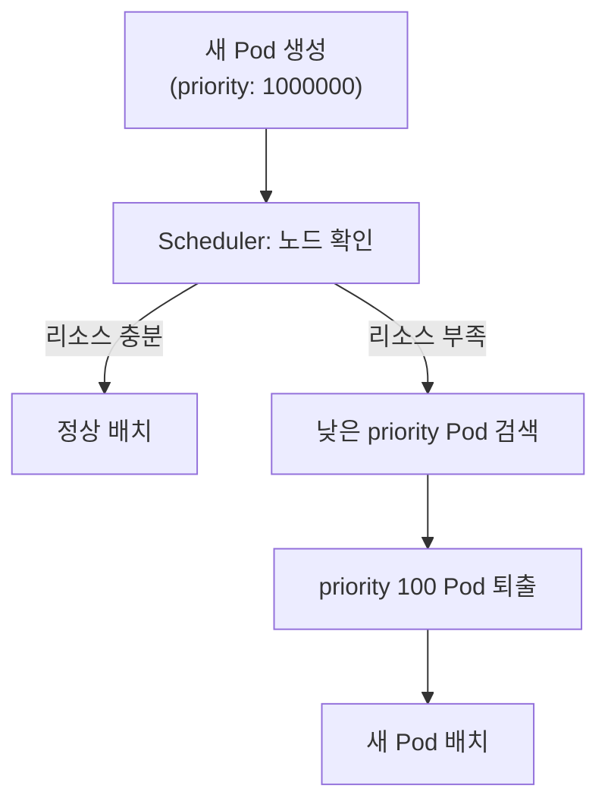
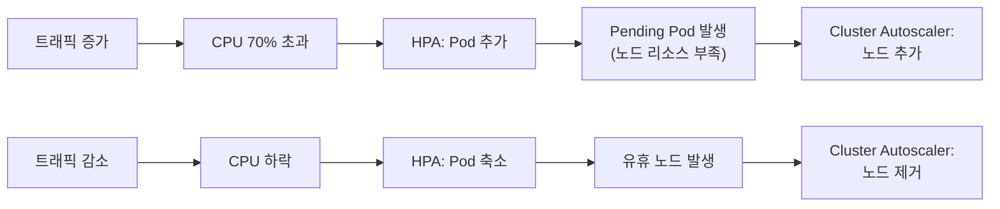

# Kubernetes (K8s)

## 1. Kubernetes란

**Kubernetes(K8s)**는 Google이 내부에서 사용하던 Borg 시스템을 기반으로 2014년에 오픈소스로 공개한 **컨테이너 오케스트레이션 플랫폼**이다. 현재 CNCF(Cloud Native Computing Foundation)에서 관리하며, 컨테이너화된 워크로드의 배포, 스케일링, 운영을 자동화한다.

### 1.1 왜 Kubernetes가 필요한가

Docker로 컨테이너를 만들 수는 있지만, 프로덕션 환경에서는 추가적인 문제가 발생한다.

```
Docker만으로 운영할 때의 한계:

서버 A          서버 B          서버 C
┌──────┐       ┌──────┐       ┌──────┐
│ App  │       │ App  │       │      │
│ App  │       │      │       │      │
└──────┘       └──────┘       └──────┘

- 컨테이너가 죽으면 누가 재시작하나?
- 트래픽이 몰리면 어떻게 확장하나?
- 서버 3대에 어떻게 분배하나?
- 새 버전 배포 시 무중단이 가능한가?
```

```
Kubernetes로 운영할 때:

┌─────────────────────────────────────────┐
│            Kubernetes Cluster            │
│                                         │
│  Node A        Node B        Node C     │
│  ┌──────┐     ┌──────┐     ┌──────┐    │
│  │Pod   │     │Pod   │     │Pod   │    │
│  │Pod   │     │Pod   │     │Pod   │    │
│  └──────┘     └──────┘     └──────┘    │
│                                         │
│  - 자동 재시작 (Self-healing)              │
│  - 자동 스케일링 (HPA)                    │
│  - 자동 스케줄링 (Scheduler)              │
│  - 무중단 배포 (Rolling Update)           │
└─────────────────────────────────────────┘
```

### 1.2 핵심 특징

| 특징 | 설명 |
|------|------|
| **자동 스케줄링** | 리소스 상황을 고려해 최적의 노드에 Pod 배치 |
| **자가 치유** | 컨테이너 실패 시 자동 재시작, 노드 장애 시 다른 노드로 이동 |
| **수평 스케일링** | CPU/메모리 기반으로 Pod 수를 자동 조절 |
| **서비스 디스커버리** | DNS 기반으로 서비스 간 자동 연결 |
| **롤링 업데이트** | 무중단으로 새 버전 배포, 문제 시 즉시 롤백 |
| **선언적 관리** | YAML로 원하는 상태를 선언하면 K8s가 달성 |
| **시크릿 관리** | 비밀번호, 토큰 등을 안전하게 관리 |

### 1.3 오케스트레이션 도구 비교

| 항목 | Kubernetes | Docker Compose | Docker Swarm |
|------|-----------|----------------|--------------|
| **규모** | 수천 노드 | 단일 호스트 | 수백 노드 |
| **자동 스케일링** | HPA/VPA/CA | 없음 | 없음 |
| **자가 치유** | 완전 지원 | 없음 | 기본 지원 |
| **학습 곡선** | 높음 | 낮음 | 중간 |
| **생태계** | 매우 풍부 | 제한적 | 제한적 |
| **프로덕션 적합성** | 최적 | 개발/테스트 | 소규모 프로덕션 |
| **커뮤니티** | 최대 | Docker 포함 | 축소 중 |

**실무 기준**: 프로덕션에는 Kubernetes, 로컬 개발에는 Docker Compose가 일반적이다.

---

## 2. 아키텍처

### 2.1 전체 구조

```
┌─────────────────────────────────────────────────────────┐
│                    Kubernetes Cluster                     │
│                                                          │
│  ┌──────────────── Control Plane (Master) ─────────────┐ │
│  │                                                      │ │
│  │  ┌───────────┐  ┌──────┐  ┌───────────┐  ┌───────┐ │ │
│  │  │API Server │  │ etcd │  │ Scheduler │  │Ctrl   │ │ │
│  │  │           │  │      │  │           │  │Manager│ │ │
│  │  └─────┬─────┘  └──────┘  └───────────┘  └───────┘ │ │
│  └────────┼─────────────────────────────────────────────┘ │
│           │                                               │
│  ┌────────▼──────── Data Plane (Worker Nodes) ──────────┐ │
│  │                                                       │ │
│  │  Node 1              Node 2              Node 3       │ │
│  │  ┌─────────────┐    ┌─────────────┐    ┌───────────┐ │ │
│  │  │ kubelet     │    │ kubelet     │    │ kubelet   │ │ │
│  │  │ kube-proxy  │    │ kube-proxy  │    │ kube-proxy│ │ │
│  │  │ ┌───┐ ┌───┐│    │ ┌───┐ ┌───┐│    │ ┌───┐     │ │ │
│  │  │ │Pod│ │Pod││    │ │Pod│ │Pod││    │ │Pod│     │ │ │
│  │  │ └───┘ └───┘│    │ └───┘ └───┘│    │ └───┘     │ │ │
│  │  └─────────────┘    └─────────────┘    └───────────┘ │ │
│  └───────────────────────────────────────────────────────┘ │
└─────────────────────────────────────────────────────────────┘
```

### 2.2 컨트롤 플레인 (Control Plane)

클러스터의 "두뇌" 역할. 전체 클러스터의 상태를 관리하고 의사결정을 수행한다.

| 구성 요소 | 역할 | 비유 |
|-----------|------|------|
| **API Server** | 모든 요청의 진입점. kubectl, UI, 내부 컴포넌트 모두 여기를 통해 통신 | 프론트 데스크 |
| **etcd** | 클러스터의 모든 상태를 저장하는 분산 키-값 저장소 | 데이터베이스 |
| **Scheduler** | 새 Pod를 어떤 노드에 배치할지 결정 (리소스, 친화성, 제약 조건 고려) | 인사 배치 담당 |
| **Controller Manager** | Deployment, ReplicaSet 등의 상태를 감시하고 원하는 상태로 유지 | 현장 관리자 |

```
요청 흐름:

kubectl apply → API Server → etcd (상태 저장)
                    │
                    ├→ Scheduler (노드 선택)
                    └→ Controller Manager (상태 유지)
                           │
                           ▼
                    kubelet (Pod 생성)
```



### 2.3 데이터 플레인 (Worker Node)

실제 애플리케이션 컨테이너가 실행되는 곳이다.

| 구성 요소 | 역할 |
|-----------|------|
| **kubelet** | 각 노드에서 실행. API Server의 지시를 받아 Pod를 생성/관리 |
| **kube-proxy** | 네트워크 규칙 관리. Service의 트래픽을 적절한 Pod로 전달 |
| **Container Runtime** | 실제 컨테이너 실행 엔진. containerd(기본), CRI-O 등 |

---

## 3. 핵심 오브젝트

Kubernetes는 **선언적(declarative)** 방식으로 동작한다. "원하는 상태"를 YAML로 정의하면, K8s가 현재 상태를 원하는 상태로 맞춘다.

### 3.1 워크로드 리소스

#### Pod

K8s의 **최소 배포 단위**. 하나 이상의 컨테이너를 포함하며, 같은 Pod 내의 컨테이너는 네트워크와 스토리지를 공유한다.

```yaml
apiVersion: v1
kind: Pod
metadata:
  name: my-app
  labels:
    app: backend
spec:
  containers:
    - name: app
      image: my-app:1.0
      ports:
        - containerPort: 8080
      resources:
        requests:
          cpu: "250m"
          memory: "128Mi"
        limits:
          cpu: "500m"
          memory: "256Mi"
```

**Pod 라이프사이클:**

Pod는 생성부터 종료까지 정해진 단계를 거친다. 각 단계에서 어떤 상태인지 파악하는 것이 트러블슈팅의 시작점이다.



각 Phase의 의미:

| Phase | 의미 | 실무에서 확인할 것 |
|-------|------|-------------------|
| **Pending** | 스케줄링 대기 또는 이미지 Pull 중 | `kubectl describe pod`에서 Events 확인 |
| **Running** | 컨테이너가 실행 중 | readinessProbe 통과 여부 확인 |
| **Succeeded** | 모든 컨테이너가 정상 종료 | Job/CronJob에서 주로 발생 |
| **Failed** | 컨테이너가 비정상 종료 | `kubectl logs --previous`로 원인 파악 |
| **CrashLoopBackOff** | 재시작 반복 중 (backoff 지연 증가) | 로그 확인, OOM 여부 체크 |

**멀티 컨테이너 패턴:**

| 패턴 | 설명 | 사용 예 |
|------|------|---------|
| **Sidecar** | 주 컨테이너를 보조하는 컨테이너 | 로그 수집기, 프록시 |
| **Init Container** | 주 컨테이너 시작 전에 실행 | DB 마이그레이션, 설정 파일 다운로드 |
| **Ambassador** | 외부 서비스 연결을 대리 | DB 프록시, API 게이트웨이 |

#### Deployment

Pod의 배포와 스케일링을 관리한다. 실무에서 가장 많이 사용하는 리소스이다.

```yaml
apiVersion: apps/v1
kind: Deployment
metadata:
  name: backend-api
spec:
  replicas: 3                    # Pod 3개 유지
  selector:
    matchLabels:
      app: backend
  strategy:
    type: RollingUpdate          # 무중단 배포
    rollingUpdate:
      maxSurge: 1                # 최대 1개 추가 Pod 허용
      maxUnavailable: 0          # 최소 replicas 유지
  template:
    metadata:
      labels:
        app: backend
    spec:
      containers:
        - name: api
          image: backend-api:2.0
          ports:
            - containerPort: 8080
          readinessProbe:        # 트래픽 수신 준비 확인
            httpGet:
              path: /health
              port: 8080
            initialDelaySeconds: 5
            periodSeconds: 10
          livenessProbe:         # 컨테이너 생존 확인
            httpGet:
              path: /health
              port: 8080
            initialDelaySeconds: 15
            periodSeconds: 20
```

**Deployment가 하는 일:**
- ReplicaSet을 생성하여 지정된 수의 Pod 유지
- 새 버전 배포 시 새 ReplicaSet 생성 → 점진적 교체
- 문제 발생 시 이전 ReplicaSet으로 즉시 롤백

#### 기타 워크로드

| 리소스 | 용도 | 사용 예 |
|--------|------|---------|
| **ReplicaSet** | Pod 복제본 수 유지 (Deployment가 내부적으로 사용) | 직접 사용 거의 없음 |
| **StatefulSet** | 순서 보장, 고유 네트워크 ID, 영구 스토리지 | PostgreSQL, MongoDB, Kafka |
| **DaemonSet** | 모든 (또는 특정) 노드에 Pod 1개씩 배치 | 로그 수집기, 모니터링 에이전트 |
| **Job** | 완료까지 실행되는 일회성 작업 | 데이터 마이그레이션, 배치 처리 |
| **CronJob** | 주기적으로 실행되는 Job | 백업, 리포트 생성 |

```yaml
# CronJob 예시: 매일 새벽 2시 DB 백업
apiVersion: batch/v1
kind: CronJob
metadata:
  name: db-backup
spec:
  schedule: "0 2 * * *"
  jobTemplate:
    spec:
      template:
        spec:
          containers:
            - name: backup
              image: db-backup:1.0
              env:
                - name: DB_HOST
                  valueFrom:
                    secretKeyRef:
                      name: db-secret
                      key: host
          restartPolicy: OnFailure
```

### 3.2 네트워킹

#### Service

Pod는 생성/삭제될 때마다 IP가 바뀐다. Service는 **안정적인 접근 지점**을 제공한다.

```
Client → Service (고정 IP/DNS) → Pod 1
                                → Pod 2  (로드밸런싱)
                                → Pod 3
```

| Service 타입 | 접근 범위 | 용도 |
|-------------|----------|------|
| **ClusterIP** | 클러스터 내부만 | 마이크로서비스 간 통신 (기본값) |
| **NodePort** | 외부 (노드IP:포트) | 개발/테스트 환경 |
| **LoadBalancer** | 외부 (클라우드 LB) | 프로덕션 외부 노출 |
| **ExternalName** | 외부 DNS 매핑 | 외부 서비스 참조 |

```yaml
# ClusterIP Service 예시
apiVersion: v1
kind: Service
metadata:
  name: backend-service
spec:
  type: ClusterIP
  selector:
    app: backend            # label이 app=backend인 Pod로 라우팅
  ports:
    - port: 80              # Service 포트
      targetPort: 8080      # Pod 포트
```

#### Ingress

여러 Service에 대한 **HTTP/HTTPS 라우팅 규칙**을 정의한다. 하나의 외부 IP로 여러 서비스에 접근 가능하다.

```yaml
apiVersion: networking.k8s.io/v1
kind: Ingress
metadata:
  name: api-ingress
  annotations:
    nginx.ingress.kubernetes.io/ssl-redirect: "true"
spec:
  ingressClassName: nginx
  tls:
    - hosts:
        - api.example.com
      secretName: tls-secret
  rules:
    - host: api.example.com
      http:
        paths:
          - path: /users
            pathType: Prefix
            backend:
              service:
                name: user-service
                port:
                  number: 80
          - path: /orders
            pathType: Prefix
            backend:
              service:
                name: order-service
                port:
                  number: 80
```



네트워크 전체 흐름을 정리하면 이렇다:



kube-proxy는 iptables 또는 IPVS 모드로 동작한다. 대규모 클러스터(Service 1,000개 이상)에서는 IPVS 모드가 성능이 낫다. iptables 모드는 규칙 수에 비례해서 latency가 증가하기 때문이다.

#### NetworkPolicy

Pod 간 트래픽을 제어하는 **방화벽 규칙**이다.

```yaml
# backend Pod는 frontend에서 오는 8080 포트 트래픽만 허용
apiVersion: networking.k8s.io/v1
kind: NetworkPolicy
metadata:
  name: backend-policy
spec:
  podSelector:
    matchLabels:
      app: backend
  policyTypes:
    - Ingress
  ingress:
    - from:
        - podSelector:
            matchLabels:
              app: frontend
      ports:
        - port: 8080
```

### 3.3 스토리지

컨테이너의 파일 시스템은 기본적으로 **휘발성**이다. Pod가 재시작되면 데이터가 사라진다. 영구 저장이 필요하면 Volume을 사용한다.

| 리소스 | 역할 |
|--------|------|
| **Volume** | Pod 생명주기에 바인딩된 스토리지 (emptyDir, hostPath 등) |
| **PersistentVolume (PV)** | 클러스터 레벨의 스토리지 리소스 (관리자가 프로비저닝) |
| **PersistentVolumeClaim (PVC)** | 사용자의 스토리지 요청 (PV에 바인딩) |
| **StorageClass** | 동적 PV 프로비저닝 규칙 (클라우드 스토리지 자동 생성) |

```
PVC (요청) ──바인딩──▶ PV (리소스) ──연결──▶ 실제 스토리지
  "10Gi SSD 필요"        "10Gi SSD"           AWS EBS / NFS
```

```yaml
# PVC로 스토리지 요청
apiVersion: v1
kind: PersistentVolumeClaim
metadata:
  name: db-storage
spec:
  accessModes:
    - ReadWriteOnce
  storageClassName: gp3
  resources:
    requests:
      storage: 20Gi

---
# Deployment에서 PVC 사용
apiVersion: apps/v1
kind: Deployment
metadata:
  name: postgres
spec:
  replicas: 1
  selector:
    matchLabels:
      app: postgres
  template:
    metadata:
      labels:
        app: postgres
    spec:
      containers:
        - name: postgres
          image: postgres:16
          volumeMounts:
            - name: db-data
              mountPath: /var/lib/postgresql/data
      volumes:
        - name: db-data
          persistentVolumeClaim:
            claimName: db-storage
```

### 3.4 설정 관리

#### ConfigMap

애플리케이션 설정을 코드와 분리하여 관리한다.

```yaml
apiVersion: v1
kind: ConfigMap
metadata:
  name: app-config
data:
  DATABASE_HOST: "postgres-service"
  DATABASE_PORT: "5432"
  LOG_LEVEL: "info"
  application.yml: |
    server:
      port: 8080
    spring:
      datasource:
        url: jdbc:postgresql://${DATABASE_HOST}:${DATABASE_PORT}/mydb
```

#### Secret

비밀번호, API 키 등 민감 정보를 Base64 인코딩하여 관리한다.

```yaml
apiVersion: v1
kind: Secret
metadata:
  name: db-secret
type: Opaque
data:
  username: YWRtaW4=          # echo -n "admin" | base64
  password: cEBzc3cwcmQ=      # echo -n "p@ssw0rd" | base64
```

```yaml
# Pod에서 ConfigMap과 Secret 사용
spec:
  containers:
    - name: app
      image: my-app:1.0
      envFrom:
        - configMapRef:
            name: app-config       # 환경변수로 주입
      env:
        - name: DB_PASSWORD
          valueFrom:
            secretKeyRef:
              name: db-secret
              key: password
      volumeMounts:
        - name: config-volume
          mountPath: /etc/config   # 파일로 마운트
  volumes:
    - name: config-volume
      configMap:
        name: app-config
```

#### ResourceQuota / LimitRange

네임스페이스 레벨에서 리소스 사용량을 제한한다.

```yaml
# 네임스페이스별 총 리소스 제한
apiVersion: v1
kind: ResourceQuota
metadata:
  name: compute-quota
  namespace: production
spec:
  hard:
    requests.cpu: "10"
    requests.memory: "20Gi"
    limits.cpu: "20"
    limits.memory: "40Gi"
    pods: "50"
```

---

## 4. kubectl 필수 명령어

### 4.1 기본 명령어

| 분류 | 명령어 | 설명 |
|------|--------|------|
| **조회** | `kubectl get pods` | Pod 목록 |
| | `kubectl get pods -o wide` | Pod 상세 (노드, IP 포함) |
| | `kubectl get all` | 모든 리소스 조회 |
| | `kubectl get pods -n kube-system` | 특정 네임스페이스 |
| **상세** | `kubectl describe pod <name>` | Pod 상세 정보 + 이벤트 |
| | `kubectl describe node <name>` | 노드 리소스 상황 |
| **생성/적용** | `kubectl apply -f deployment.yaml` | 리소스 생성/업데이트 |
| | `kubectl create namespace dev` | 네임스페이스 생성 |
| **삭제** | `kubectl delete -f deployment.yaml` | YAML 기반 삭제 |
| | `kubectl delete pod <name>` | 특정 Pod 삭제 |
| **스케일링** | `kubectl scale deployment api --replicas=5` | 수동 스케일링 |

### 4.2 디버깅 명령어

```bash
# Pod 로그 확인
kubectl logs <pod-name>
kubectl logs <pod-name> -c <container-name>   # 멀티컨테이너
kubectl logs <pod-name> -f                     # 실시간 추적
kubectl logs <pod-name> --previous             # 이전 컨테이너 로그

# Pod 내부 접속
kubectl exec -it <pod-name> -- /bin/sh

# 포트 포워딩 (로컬에서 Pod 접근)
kubectl port-forward <pod-name> 8080:8080
kubectl port-forward svc/<service-name> 8080:80

# 리소스 사용량 확인
kubectl top pods
kubectl top nodes

# 이벤트 확인 (트러블슈팅 핵심)
kubectl get events --sort-by='.lastTimestamp'
```

### 4.3 유용한 팁

```bash
# 자주 사용하는 alias 설정
alias k='kubectl'
alias kgp='kubectl get pods'
alias kga='kubectl get all'
alias kd='kubectl describe'
alias kl='kubectl logs'

# 네임스페이스 기본값 설정
kubectl config set-context --current --namespace=production

# YAML 미리보기 (dry-run)
kubectl apply -f deployment.yaml --dry-run=client -o yaml
```

---

## 5. YAML 작성 패턴

### 5.1 백엔드 API 배포 전체 예제

Spring Boot 애플리케이션을 K8s에 배포하는 전체 흐름이다.

```yaml
# 1. Namespace
apiVersion: v1
kind: Namespace
metadata:
  name: production

---
# 2. ConfigMap
apiVersion: v1
kind: ConfigMap
metadata:
  name: api-config
  namespace: production
data:
  SPRING_PROFILES_ACTIVE: "prod"
  SERVER_PORT: "8080"

---
# 3. Secret
apiVersion: v1
kind: Secret
metadata:
  name: api-secret
  namespace: production
type: Opaque
data:
  DB_PASSWORD: cEBzc3cwcmQ=

---
# 4. Deployment
apiVersion: apps/v1
kind: Deployment
metadata:
  name: api-server
  namespace: production
spec:
  replicas: 3
  selector:
    matchLabels:
      app: api-server
  template:
    metadata:
      labels:
        app: api-server
    spec:
      containers:
        - name: api
          image: my-registry/api-server:1.2.0
          ports:
            - containerPort: 8080
          envFrom:
            - configMapRef:
                name: api-config
          env:
            - name: DB_PASSWORD
              valueFrom:
                secretKeyRef:
                  name: api-secret
                  key: DB_PASSWORD
          resources:
            requests:
              cpu: "500m"
              memory: "512Mi"
            limits:
              cpu: "1000m"
              memory: "1Gi"
          readinessProbe:
            httpGet:
              path: /actuator/health
              port: 8080
            initialDelaySeconds: 30
            periodSeconds: 10
          livenessProbe:
            httpGet:
              path: /actuator/health
              port: 8080
            initialDelaySeconds: 60
            periodSeconds: 30

---
# 5. Service
apiVersion: v1
kind: Service
metadata:
  name: api-service
  namespace: production
spec:
  type: ClusterIP
  selector:
    app: api-server
  ports:
    - port: 80
      targetPort: 8080

---
# 6. Ingress
apiVersion: networking.k8s.io/v1
kind: Ingress
metadata:
  name: api-ingress
  namespace: production
  annotations:
    nginx.ingress.kubernetes.io/ssl-redirect: "true"
spec:
  ingressClassName: nginx
  tls:
    - hosts:
        - api.example.com
      secretName: tls-cert
  rules:
    - host: api.example.com
      http:
        paths:
          - path: /
            pathType: Prefix
            backend:
              service:
                name: api-service
                port:
                  number: 80
```

---

## 6. 배포 전략

### 6.1 전략 비교

| 전략 | 중단 시간 | 리스크 | 리소스 비용 | 롤백 |
|------|----------|--------|-----------|------|
| **Rolling Update** | 없음 | 낮음 | 낮음 | 자동 |
| **Blue-Green** | 없음 (전환 시 순간) | 매우 낮음 | 2배 | 즉시 |
| **Canary** | 없음 | 가장 낮음 | 약간 추가 | 즉시 |
| **Recreate** | 있음 | 높음 | 없음 | 수동 |

### 6.2 Rolling Update (기본)

```
시작:    v1  v1  v1
Step 1:  v1  v1  v1  v2    (새 Pod 추가)
Step 2:  v1  v1  v2  v2    (구 Pod 제거 + 새 Pod 추가)
Step 3:  v1  v2  v2  v2
완료:    v2  v2  v2
```



Rolling Update에서 `maxSurge`와 `maxUnavailable` 설정이 중요하다. 둘 다 0이면 배포가 진행되지 않으니 주의해야 한다.

```bash
# 이미지 업데이트 → 자동 Rolling Update
kubectl set image deployment/api-server api=my-registry/api-server:2.0.0

# 롤백
kubectl rollout undo deployment/api-server

# 배포 상태 확인
kubectl rollout status deployment/api-server

# 배포 이력
kubectl rollout history deployment/api-server
```

### 6.3 Blue-Green Deployment

두 환경(Blue=현재, Green=신규)을 동시에 운영하고, Service의 selector만 전환한다.

```yaml
# Green 환경 배포
apiVersion: apps/v1
kind: Deployment
metadata:
  name: api-server-green
spec:
  replicas: 3
  selector:
    matchLabels:
      app: api-server
      version: green
  template:
    metadata:
      labels:
        app: api-server
        version: green
    spec:
      containers:
        - name: api
          image: api-server:2.0.0
```

```bash
# Green 검증 후 Service selector 전환
kubectl patch service api-service \
  -p '{"spec":{"selector":{"version":"green"}}}'

# 문제 시 즉시 Blue로 복귀
kubectl patch service api-service \
  -p '{"spec":{"selector":{"version":"blue"}}}'
```

### 6.4 Canary Deployment

새 버전을 소수의 Pod에만 배포하여 점진적으로 트래픽을 늘린다.

```
단계 1: v1(90%) v2(10%)  → 모니터링
단계 2: v1(70%) v2(30%)  → 모니터링
단계 3: v1(50%) v2(50%)  → 모니터링
완료:   v2(100%)
```

Canary 배포는 보통 **Istio**, **Argo Rollouts** 같은 도구로 트래픽 비율을 세밀하게 제어한다.

---

## 7. 운영 패턴

### 7.1 모니터링

Kubernetes 모니터링의 표준 스택은 **Prometheus + Grafana**이다.

```
┌─────────┐    수집     ┌────────────┐    시각화    ┌─────────┐
│ K8s     │──────────▶│ Prometheus │──────────▶│ Grafana │
│ Metrics │           │            │            │         │
└─────────┘           └────────────┘            └─────────┘
```

**핵심 모니터링 메트릭:**

| 대상 | 메트릭 | 의미 |
|------|--------|------|
| **Pod** | cpu_usage, memory_usage | 리소스 사용량 |
| **Pod** | restart_count | 비정상 재시작 횟수 |
| **Node** | node_cpu_utilisation | 노드 과부하 여부 |
| **Deployment** | replicas_available | 사용 가능한 Pod 수 |
| **Service** | request_duration_seconds | API 응답 시간 |

Prometheus 상세 설정은 [Prometheus 메트릭 수집](../Monitoring/Prometheus_메트릭_수집.md) 참조.

### 7.2 로깅

| 스택 | 구성 | 특징 |
|------|------|------|
| **EFK** | Elasticsearch + Fluentd + Kibana | 경량 수집기 (Fluentd) |
| **ELK** | Elasticsearch + Logstash + Kibana | 강력한 파싱 (Logstash) |
| **Loki** | Grafana Loki + Promtail + Grafana | 경량, 라벨 기반 |

```
각 Node의 DaemonSet (Fluentd/Promtail)
    │
    ▼  로그 수집
Elasticsearch / Loki
    │
    ▼  시각화
Kibana / Grafana
```

### 7.3 보안

#### RBAC (Role-Based Access Control)

사용자/서비스가 할 수 있는 작업을 세밀하게 제어한다.

```yaml
# Role: production 네임스페이스에서 Pod 조회만 허용
apiVersion: rbac.authorization.k8s.io/v1
kind: Role
metadata:
  name: pod-reader
  namespace: production
rules:
  - apiGroups: [""]
    resources: ["pods"]
    verbs: ["get", "list", "watch"]

---
# RoleBinding: 특정 사용자에게 Role 부여
apiVersion: rbac.authorization.k8s.io/v1
kind: RoleBinding
metadata:
  name: read-pods
  namespace: production
subjects:
  - kind: User
    name: developer@example.com
roleRef:
  kind: Role
  name: pod-reader
  apiGroup: rbac.authorization.k8s.io
```

| 리소스 | 범위 | 용도 |
|--------|------|------|
| **Role / RoleBinding** | 네임스페이스 | 특정 네임스페이스 내 권한 |
| **ClusterRole / ClusterRoleBinding** | 클러스터 전체 | 노드 관리, CRD 등 |

#### ServiceAccount

Pod가 API Server와 통신할 때 사용하는 ID이다.

```yaml
apiVersion: v1
kind: ServiceAccount
metadata:
  name: api-service-account
  namespace: production
```

### 7.4 Taints와 Tolerations

Taint는 노드에 "이 노드에 아무 Pod나 배치하지 마라"는 제약을 거는 것이다. Toleration은 Pod에 "해당 Taint가 있어도 괜찮다"는 허용을 선언하는 것이다.

실무에서 자주 쓰는 경우:

- GPU 노드에 GPU 워크로드만 배치
- 특정 노드를 특정 팀 전용으로 격리
- 노드 유지보수 시 새 Pod 배치 방지

```yaml
# 노드에 Taint 추가
# kubectl taint nodes gpu-node-1 gpu=true:NoSchedule
```

```yaml
# Pod에 Toleration 선언
apiVersion: v1
kind: Pod
metadata:
  name: gpu-job
spec:
  tolerations:
    - key: "gpu"
      operator: "Equal"
      value: "true"
      effect: "NoSchedule"
  containers:
    - name: training
      image: ml-training:1.0
      resources:
        limits:
          nvidia.com/gpu: 1
```

Taint effect에 따른 동작 차이:

| Effect | 동작 |
|--------|------|
| **NoSchedule** | 새 Pod를 배치하지 않는다. 기존 Pod는 그대로 유지 |
| **PreferNoSchedule** | 가능하면 배치하지 않지만, 다른 노드가 없으면 배치한다 |
| **NoExecute** | 새 Pod 배치 금지 + 기존 Pod도 쫓아낸다 |

NoExecute는 노드 장애나 유지보수 시 사용한다. `tolerationSeconds`를 지정하면 해당 시간이 지난 뒤에 퇴출된다.

```yaml
tolerations:
  - key: "node.kubernetes.io/unreachable"
    operator: "Exists"
    effect: "NoExecute"
    tolerationSeconds: 300    # 5분간 대기 후 퇴출
```

### 7.5 PodDisruptionBudget (PDB)

노드 업그레이드, 스케일다운 같은 **자발적 중단(voluntary disruption)** 시 최소 가용 Pod 수를 보장한다. PDB가 없으면 `kubectl drain` 할 때 모든 Pod가 한꺼번에 내려갈 수 있다.

```yaml
apiVersion: policy/v1
kind: PodDisruptionBudget
metadata:
  name: api-pdb
spec:
  minAvailable: 2              # 최소 2개는 항상 살아 있어야 한다
  selector:
    matchLabels:
      app: api-server
```

```yaml
# 또는 maxUnavailable로 지정
apiVersion: policy/v1
kind: PodDisruptionBudget
metadata:
  name: api-pdb
spec:
  maxUnavailable: 1            # 동시에 1개까지만 내릴 수 있다
  selector:
    matchLabels:
      app: api-server
```

PDB를 설정해두면 `kubectl drain` 명령이 PDB를 존중한다. 예를 들어 replicas가 3이고 `minAvailable: 2`이면, drain 시 Pod를 하나씩만 내린다.

주의사항:

- **replicas 수와 맞지 않으면 drain이 영원히 안 끝난다.** `minAvailable: 3`인데 replicas가 3이면 Pod를 하나도 내릴 수 없다.
- PDB는 자발적 중단에만 적용된다. 노드가 갑자기 죽는 비자발적 중단(involuntary disruption)에는 동작하지 않는다.

### 7.6 Priority와 Preemption

클러스터 리소스가 부족할 때 **어떤 Pod를 먼저 스케줄링하고, 어떤 Pod를 밀어낼 것인가**를 결정한다.

```yaml
# PriorityClass 정의
apiVersion: scheduling.k8s.io/v1
kind: PriorityClass
metadata:
  name: critical
value: 1000000
globalDefault: false
description: "프로덕션 핵심 서비스용"
preemptionPolicy: PreemptLowerPriority

---
apiVersion: scheduling.k8s.io/v1
kind: PriorityClass
metadata:
  name: batch-low
value: 100
globalDefault: false
description: "배치 작업용, 밀려날 수 있음"
```

```yaml
# Pod에서 PriorityClass 사용
apiVersion: apps/v1
kind: Deployment
metadata:
  name: payment-service
spec:
  replicas: 3
  selector:
    matchLabels:
      app: payment
  template:
    metadata:
      labels:
        app: payment
    spec:
      priorityClassName: critical    # 이 Pod는 우선 배치
      containers:
        - name: payment
          image: payment:2.0
          resources:
            requests:
              cpu: "500m"
              memory: "512Mi"
```

동작 흐름:



실무에서 주로 이렇게 나눈다:

| 용도 | value 범위 | 예시 |
|------|-----------|------|
| 시스템 컴포넌트 | 2,000,000,000 | kube-system Pod |
| 프로덕션 핵심 | 1,000,000 | 결제, 인증 서비스 |
| 프로덕션 일반 | 100,000 | API 서버, 웹 서버 |
| 배치/작업 | 100~1,000 | 데이터 처리, 리포트 |

Preemption이 발생하면 밀려난 Pod는 `Preempted` 상태가 된다. `kubectl get events`에서 확인할 수 있다. 배치 작업처럼 밀려도 괜찮은 워크로드에 낮은 priority를 부여하고, 결제처럼 절대 내려가면 안 되는 서비스에 높은 priority를 설정한다.

### 7.7 자동 스케일링

| 스케일러 | 대상 | 기준 | 동작 |
|---------|------|------|------|
| **HPA** | Pod 수 | CPU, 메모리, 커스텀 메트릭 | Pod 수평 확장/축소 |
| **VPA** | Pod 리소스 | 실제 사용량 분석 | requests/limits 자동 조정 |
| **Cluster Autoscaler** | 노드 수 | Pending Pod 유무 | 노드 추가/제거 |

```yaml
# HPA: CPU 70% 초과 시 Pod 자동 확장
apiVersion: autoscaling/v2
kind: HorizontalPodAutoscaler
metadata:
  name: api-hpa
spec:
  scaleTargetRef:
    apiVersion: apps/v1
    kind: Deployment
    name: api-server
  minReplicas: 2
  maxReplicas: 10
  metrics:
    - type: Resource
      resource:
        name: cpu
        target:
          type: Utilization
          averageUtilization: 70
```



HPA는 기본 15초 주기로 메트릭을 확인한다. 스케일업은 빠르지만 스케일다운은 기본 5분 안정화 기간(stabilization window)이 있다. 갑자기 Pod가 줄어서 트래픽을 못 받는 상황을 방지하기 위해서다.

---

## 8. 관리형 Kubernetes 비교

직접 K8s 클러스터를 구축/운영하는 것은 복잡하므로, 대부분 클라우드 관리형 서비스를 사용한다.

| 항목 | AWS EKS | GCP GKE | Azure AKS |
|------|---------|---------|-----------|
| **컨트롤 플레인 비용** | $0.10/시간 ($73/월) | 무료 (Standard) | 무료 |
| **노드 비용** | EC2 요금 | GCE 요금 | VM 요금 |
| **서버리스 옵션** | Fargate | Autopilot | Virtual Nodes |
| **최대 노드** | 5,000 | 15,000 | 5,000 |
| **모니터링** | CloudWatch | Cloud Monitoring | Azure Monitor |
| **장점** | AWS 생태계 통합 | 가장 성숙, 비용 효율 | AD/Azure 통합 |
| **단점** | 비교적 높은 비용 | GCP 종속 | 학습 곡선 |

AWS EKS 상세는 [AWS EKS](../../AWS/Containers/EKS.md) 참조.

### 관리형 vs 자체 구축

| 상황 | 추천 |
|------|------|
| 클라우드 환경, 운영 인력 적음 | **관리형** (EKS, GKE, AKS) |
| 온프레미스 필수, 보안 규제 | **자체 구축** (kubeadm, Rancher) |
| 개발/학습 용도 | **경량 도구** (minikube, kind, k3s) |

---

## 9. Helm

### 9.1 Helm이란

**Helm**은 Kubernetes의 **패키지 매니저**이다. 복잡한 K8s 리소스를 하나의 패키지(**Chart**)로 묶어 설치/업그레이드/삭제를 간편하게 한다.

```
apt (Ubuntu)  ≈  Helm (Kubernetes)
패키지         ≈  Chart
apt install   ≈  helm install
```

### 9.2 Chart 구조

```
my-chart/
├── Chart.yaml          # 차트 메타데이터 (이름, 버전)
├── values.yaml         # 기본 설정값
├── templates/          # K8s YAML 템플릿
│   ├── deployment.yaml
│   ├── service.yaml
│   ├── ingress.yaml
│   └── _helpers.tpl    # 템플릿 헬퍼 함수
└── charts/             # 의존성 차트
```

### 9.3 주요 명령어

```bash
# 차트 저장소 추가
helm repo add bitnami https://charts.bitnami.com/bitnami
helm repo update

# 차트 검색
helm search repo nginx

# 설치
helm install my-nginx bitnami/nginx \
  --namespace production \
  --set replicaCount=3

# 커스텀 values.yaml로 설치
helm install my-app ./my-chart -f production-values.yaml

# 업그레이드
helm upgrade my-nginx bitnami/nginx --set replicaCount=5

# 롤백
helm rollback my-nginx 1    # revision 1로 롤백

# 삭제
helm uninstall my-nginx

# 설치 목록 확인
helm list -A
```

### 9.4 실전 예시

```bash
# Prometheus 모니터링 스택 설치
helm repo add prometheus-community \
  https://prometheus-community.github.io/helm-charts

helm install monitoring prometheus-community/kube-prometheus-stack \
  --namespace monitoring \
  --create-namespace \
  --set grafana.adminPassword=mypassword

# Nginx Ingress Controller 설치
helm repo add ingress-nginx \
  https://kubernetes.github.io/ingress-nginx

helm install ingress ingress-nginx/ingress-nginx \
  --namespace ingress \
  --create-namespace
```

---

## 10. 트러블슈팅

### 10.1 Pod가 시작되지 않을 때

```bash
# 1. Pod 상태 확인
kubectl get pods
# STATUS: Pending, CrashLoopBackOff, ImagePullBackOff, Error 등

# 2. 상세 이벤트 확인
kubectl describe pod <pod-name>

# 3. 로그 확인
kubectl logs <pod-name>
kubectl logs <pod-name> --previous    # 이전 실패한 컨테이너
```

| 상태 | 원인 | 해결 |
|------|------|------|
| **Pending** | 리소스 부족 또는 스케줄링 실패 | 노드 리소스 확인, requests 조정 |
| **ImagePullBackOff** | 이미지를 가져올 수 없음 | 이미지명/태그 확인, 레지스트리 인증 확인 |
| **CrashLoopBackOff** | 컨테이너가 반복적으로 실패 | 로그 확인, 헬스체크 설정 확인 |
| **OOMKilled** | 메모리 초과 | memory limits 증가 |
| **Evicted** | 노드 디스크 부족 | 불필요 이미지/로그 정리, 노드 추가 |

### 10.2 Service 연결 문제

```bash
# Service의 Endpoints 확인 (연결된 Pod이 있는지)
kubectl get endpoints <service-name>

# DNS 해석 테스트
kubectl run debug --image=busybox --rm -it -- nslookup <service-name>

# Service를 통한 접근 테스트
kubectl run debug --image=curlimages/curl --rm -it -- \
  curl http://<service-name>:<port>/health
```

---

## 참고

- [Kubernetes 공식 문서](https://kubernetes.io/ko/docs/home/)
- [Kubernetes The Hard Way](https://github.com/kelseyhightower/kubernetes-the-hard-way) — K8s 내부를 이해하기 위한 수동 설치 가이드
- [CNCF Landscape](https://landscape.cncf.io/) — 클라우드 네이티브 생태계 전체 지도
- [Helm 공식 문서](https://helm.sh/docs/)
- [AWS EKS 가이드](../../AWS/Containers/EKS.md) — AWS 환경의 Kubernetes
- [Docker Compose](Docker/Docker_Compose.md) — 로컬 개발 환경의 컨테이너 관리
