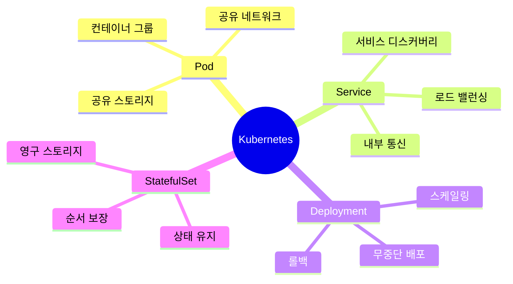
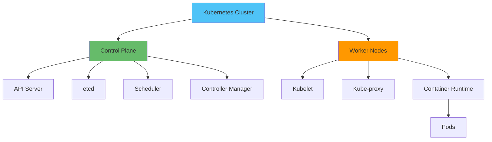

# ☸️ Kubernetes 심화 전략

## 📌 개요

> **Kubernetes**는 컨테이너화된 애플리케이션의 배포, 확장, 관리를 자동화하는 오픈소스 오케스트레이션 플랫폼입니다. Node.js 애플리케이션을 위한 실전 Kubernetes 전략을 다룹니다.

### 🎯 Kubernetes의 핵심 개념



### 📊 Kubernetes 아키텍처



## 🚀 Pod 전략

### Pod 기본 개념

Pod는 Kubernetes에서 가장 작은 배포 단위로, 하나 이상의 컨테이너를 포함합니다.

```yaml
apiVersion: v1
kind: Pod
metadata:
  name: nodejs-app
  labels:
    app: nodejs
    version: v1
spec:
  containers:
  - name: nodejs
    image: node:18-alpine
    ports:
    - containerPort: 3000
    env:
    - name: NODE_ENV
      value: "production"
    - name: DATABASE_URL
      valueFrom:
        secretKeyRef:
          name: db-secret
          key: url
    resources:
      requests:
        memory: "256Mi"
        cpu: "250m"
      limits:
        memory: "512Mi"
        cpu: "500m"
```

### 멀티 컨테이너 Pod

```yaml
apiVersion: v1
kind: Pod
metadata:
  name: nodejs-with-sidecar
spec:
  containers:
  # 메인 애플리케이션
  - name: nodejs
    image: myapp:latest
    ports:
    - containerPort: 3000
  
  # 사이드카: 로그 수집
  - name: log-collector
    image: fluentd:latest
    volumeMounts:
    - name: logs
      mountPath: /var/log/app
  
  # 사이드카: 프록시
  - name: nginx-proxy
    image: nginx:alpine
    ports:
    - containerPort: 80
  
  volumes:
  - name: logs
    emptyDir: {}
```

## 🔄 Deployment 전략

### Deployment 기본 구성

```yaml
apiVersion: apps/v1
kind: Deployment
metadata:
  name: nodejs-deployment
  labels:
    app: nodejs
spec:
  replicas: 3
  strategy:
    type: RollingUpdate
    rollingUpdate:
      maxSurge: 1
      maxUnavailable: 0
  selector:
    matchLabels:
      app: nodejs
  template:
    metadata:
      labels:
        app: nodejs
    spec:
      containers:
      - name: nodejs
        image: myapp:latest
        ports:
        - containerPort: 3000
        livenessProbe:
          httpGet:
            path: /health
            port: 3000
          initialDelaySeconds: 30
          periodSeconds: 10
        readinessProbe:
          httpGet:
            path: /ready
            port: 3000
          initialDelaySeconds: 5
          periodSeconds: 5
        resources:
          requests:
            memory: "256Mi"
            cpu: "250m"
          limits:
            memory: "512Mi"
            cpu: "500m"
```

### 배포 전략 유형

#### Rolling Update

```yaml
spec:
  strategy:
    type: RollingUpdate
    rollingUpdate:
      maxSurge: 1        # 최대 추가 Pod 수
      maxUnavailable: 0  # 최대 불가능 Pod 수
```

#### Blue-Green 배포

```yaml
# Blue Deployment
apiVersion: apps/v1
kind: Deployment
metadata:
  name: nodejs-blue
spec:
  replicas: 3
  template:
    metadata:
      labels:
        app: nodejs
        version: blue
    spec:
      containers:
      - name: nodejs
        image: myapp:v1

---
# Green Deployment
apiVersion: apps/v1
kind: Deployment
metadata:
  name: nodejs-green
spec:
  replicas: 3
  template:
    metadata:
      labels:
        app: nodejs
        version: green
    spec:
      containers:
      - name: nodejs
        image: myapp:v2
```

#### Canary 배포

```yaml
# Stable Deployment (90%)
apiVersion: apps/v1
kind: Deployment
metadata:
  name: nodejs-stable
spec:
  replicas: 9
  template:
    metadata:
      labels:
        app: nodejs
        version: stable

---
# Canary Deployment (10%)
apiVersion: apps/v1
kind: Deployment
metadata:
  name: nodejs-canary
spec:
  replicas: 1
  template:
    metadata:
      labels:
        app: nodejs
        version: canary
    spec:
      containers:
      - name: nodejs
        image: myapp:v2
```

## 🔌 Service 전략

### Service 유형

#### ClusterIP (기본)

```yaml
apiVersion: v1
kind: Service
metadata:
  name: nodejs-service
spec:
  type: ClusterIP
  selector:
    app: nodejs
  ports:
  - port: 80
    targetPort: 3000
    protocol: TCP
```

#### NodePort

```yaml
apiVersion: v1
kind: Service
metadata:
  name: nodejs-nodeport
spec:
  type: NodePort
  selector:
    app: nodejs
  ports:
  - port: 80
    targetPort: 3000
    nodePort: 30080
```

#### LoadBalancer

```yaml
apiVersion: v1
kind: Service
metadata:
  name: nodejs-lb
spec:
  type: LoadBalancer
  selector:
    app: nodejs
  ports:
  - port: 80
    targetPort: 3000
```

### Headless Service

```yaml
apiVersion: v1
kind: Service
metadata:
  name: nodejs-headless
spec:
  clusterIP: None
  selector:
    app: nodejs
  ports:
  - port: 3000
```

## 📦 StatefulSet 전략

### StatefulSet 구성

```yaml
apiVersion: apps/v1
kind: StatefulSet
metadata:
  name: nodejs-statefulset
spec:
  serviceName: nodejs-headless
  replicas: 3
  selector:
    matchLabels:
      app: nodejs
  template:
    metadata:
      labels:
        app: nodejs
    spec:
      containers:
      - name: nodejs
        image: myapp:latest
        ports:
        - containerPort: 3000
        volumeMounts:
        - name: data
          mountPath: /data
  volumeClaimTemplates:
  - metadata:
      name: data
    spec:
      accessModes: [ "ReadWriteOnce" ]
      resources:
        requests:
          storage: 10Gi
```

## 📊 HPA (Horizontal Pod Autoscaler)

### HPA 구성

```yaml
apiVersion: autoscaling/v2
kind: HorizontalPodAutoscaler
metadata:
  name: nodejs-hpa
spec:
  scaleTargetRef:
    apiVersion: apps/v1
    kind: Deployment
    name: nodejs-deployment
  minReplicas: 2
  maxReplicas: 10
  metrics:
  - type: Resource
    resource:
      name: cpu
      target:
        type: Utilization
        averageUtilization: 70
  - type: Resource
    resource:
      name: memory
      target:
        type: Utilization
        averageUtilization: 80
  behavior:
    scaleDown:
      stabilizationWindowSeconds: 300
      policies:
      - type: Percent
        value: 50
        periodSeconds: 60
    scaleUp:
      stabilizationWindowSeconds: 0
      policies:
      - type: Percent
        value: 100
        periodSeconds: 15
      - type: Pods
        value: 2
        periodSeconds: 15
      selectPolicy: Max
```

### 커스텀 메트릭 기반 HPA

```yaml
apiVersion: autoscaling/v2
kind: HorizontalPodAutoscaler
metadata:
  name: nodejs-custom-hpa
spec:
  scaleTargetRef:
    apiVersion: apps/v1
    kind: Deployment
    name: nodejs-deployment
  minReplicas: 2
  maxReplicas: 20
  metrics:
  - type: Pods
    pods:
      metric:
        name: http_requests_per_second
      target:
        type: AverageValue
        averageValue: "100"
```

## 🔐 ConfigMap과 Secret

### ConfigMap

```yaml
apiVersion: v1
kind: ConfigMap
metadata:
  name: nodejs-config
data:
  NODE_ENV: "production"
  LOG_LEVEL: "info"
  API_TIMEOUT: "5000"
  config.json: |
    {
      "database": {
        "host": "db.example.com",
        "port": 5432
      }
    }
```

### Secret

```yaml
apiVersion: v1
kind: Secret
metadata:
  name: nodejs-secret
type: Opaque
data:
  database-url: <base64-encoded-value>
  api-key: <base64-encoded-value>
stringData:
  password: plain-text-password
```

### Pod에서 사용

```yaml
apiVersion: v1
kind: Pod
spec:
  containers:
  - name: nodejs
    image: myapp:latest
    env:
    - name: NODE_ENV
      valueFrom:
        configMapKeyRef:
          name: nodejs-config
          key: NODE_ENV
    - name: DATABASE_URL
      valueFrom:
        secretKeyRef:
          name: nodejs-secret
          key: database-url
    envFrom:
    - configMapRef:
        name: nodejs-config
    volumeMounts:
    - name: config
      mountPath: /etc/config
  volumes:
  - name: config
    configMap:
      name: nodejs-config
```

## 🎯 실전 예제: 완전한 Node.js Kubernetes 배포

```yaml
# namespace.yaml
apiVersion: v1
kind: Namespace
metadata:
  name: nodejs-app

---
# configmap.yaml
apiVersion: v1
kind: ConfigMap
metadata:
  name: nodejs-config
  namespace: nodejs-app
data:
  NODE_ENV: "production"
  PORT: "3000"

---
# secret.yaml
apiVersion: v1
kind: Secret
metadata:
  name: nodejs-secret
  namespace: nodejs-app
type: Opaque
stringData:
  DATABASE_URL: "postgresql://user:pass@db:5432/mydb"
  JWT_SECRET: "your-secret-key"

---
# deployment.yaml
apiVersion: apps/v1
kind: Deployment
metadata:
  name: nodejs-deployment
  namespace: nodejs-app
spec:
  replicas: 3
  strategy:
    type: RollingUpdate
    rollingUpdate:
      maxSurge: 1
      maxUnavailable: 0
  selector:
    matchLabels:
      app: nodejs
  template:
    metadata:
      labels:
        app: nodejs
        version: v1
    spec:
      containers:
      - name: nodejs
        image: myapp:latest
        ports:
        - containerPort: 3000
        envFrom:
        - configMapRef:
            name: nodejs-config
        - secretRef:
            name: nodejs-secret
        livenessProbe:
          httpGet:
            path: /health
            port: 3000
          initialDelaySeconds: 30
          periodSeconds: 10
          timeoutSeconds: 5
          failureThreshold: 3
        readinessProbe:
          httpGet:
            path: /ready
            port: 3000
          initialDelaySeconds: 5
          periodSeconds: 5
          timeoutSeconds: 3
          failureThreshold: 3
        resources:
          requests:
            memory: "256Mi"
            cpu: "250m"
          limits:
            memory: "512Mi"
            cpu: "500m"
        volumeMounts:
        - name: logs
          mountPath: /var/log/app
      volumes:
      - name: logs
        emptyDir: {}

---
# service.yaml
apiVersion: v1
kind: Service
metadata:
  name: nodejs-service
  namespace: nodejs-app
spec:
  type: LoadBalancer
  selector:
    app: nodejs
  ports:
  - port: 80
    targetPort: 3000
    protocol: TCP

---
# ingress.yaml
apiVersion: networking.k8s.io/v1
kind: Ingress
metadata:
  name: nodejs-ingress
  namespace: nodejs-app
  annotations:
    kubernetes.io/ingress.class: nginx
    cert-manager.io/cluster-issuer: letsencrypt-prod
spec:
  tls:
  - hosts:
    - api.example.com
    secretName: nodejs-tls
  rules:
  - host: api.example.com
    http:
      paths:
      - path: /
        pathType: Prefix
        backend:
          service:
            name: nodejs-service
            port:
              number: 80

---
# hpa.yaml
apiVersion: autoscaling/v2
kind: HorizontalPodAutoscaler
metadata:
  name: nodejs-hpa
  namespace: nodejs-app
spec:
  scaleTargetRef:
    apiVersion: apps/v1
    kind: Deployment
    name: nodejs-deployment
  minReplicas: 2
  maxReplicas: 10
  metrics:
  - type: Resource
    resource:
      name: cpu
      target:
        type: Utilization
        averageUtilization: 70
  - type: Resource
    resource:
      name: memory
      target:
        type: Utilization
        averageUtilization: 80
```

## 📝 결론

Kubernetes는 컨테이너 오케스트레이션을 통해 애플리케이션의 배포, 확장, 관리를 자동화합니다.

### 핵심 포인트

- ✅ **Pod**: 컨테이너 그룹화 및 리소스 관리
- ✅ **Deployment**: 무중단 배포 및 롤백
- ✅ **Service**: 서비스 디스커버리 및 로드 밸런싱
- ✅ **StatefulSet**: 상태 유지 애플리케이션 관리
- ✅ **HPA**: 자동 스케일링
- ✅ **ConfigMap/Secret**: 설정 및 비밀 관리

### 모범 사례

1. **리소스 제한**: 모든 Pod에 리소스 제한 설정
2. **헬스 체크**: Liveness와 Readiness Probe 설정
3. **롤링 업데이트**: 무중단 배포를 위한 전략
4. **자동 스케일링**: HPA를 통한 자동 확장
5. **보안**: Secret을 통한 민감 정보 관리

### 관련 문서

- [배포 전략](../../Framework/Node/배포/배포_전략.md) - Kubernetes 배포 전략
- [Docker Compose](./Docker/Docker_Compose.md) - 컨테이너 기초
- [인프라 모니터링](../Monitoring/인프라_모니터링_전략.md) - Kubernetes 모니터링

